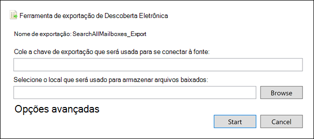

# <a name="export-content-search-results"></a>Exportar os resultados da Pesquisa de Conteúdo

Depois que uma Pesquisa de Conteúdo for realizada com êxito, você poderá exportar os resultados da pesquisa para um computador local. Quando você exporta os resultados de email, eles são baixados para seu computador como arquivos PST. Quando você exporta conteúdo de sites do SharePoint e do OneDrive for Business, cópias de documentos nativos do Office são exportadas. Há outros documentos e relatórios incluídos nos resultados de pesquisa exportados.
  
Exportar os resultados de uma Pesquisa de Conteúdo envolve preparar os resultados e baixá-los para um computador local.
  
## <a name="before-you-export-content-search-results"></a>Antes de exportar os resultados da pesquisa de conteúdo

- Para exportar os resultados da pesquisa, você precisa ter a função de gerenciamento Exportar no Centro de & Conformidade e Segurança. Essa função é atribuída ao grupo de função do Gerente de Descoberta Eletrônica interno. Ela não é atribuída por padrão ao grupo de funções Gerenciamento da Organização. Para obter mais informações, confira [Atribuir permissões de descoberta eletrônica](assign-ediscovery-permissions.md).

- O computador que você usa para exportar os resultados da pesquisa devem atender aos seguintes requisitos de sistema:
  
  - Versões de 32 bits ou 64 bits do Windows 7 e versões posteriores
  
  - Microsoft .NET Framework 4.7
  
- Você precisa usar um dos seguintes navegadores com suporte para executar a Ferramenta de Exportação de Descobertas e<sup>1:</sup>

  - Microsoft Edge <sup>2</sup>
  
    OU

  - Microsoft Internet Explorer 10 e versões posteriores
  
  > [!NOTE]
  > <sup>1</sup> A Microsoft não fabrica extensões ou complementos de terceiros para aplicativos ClickOnce. Não há suporte para a exportação de resultados de pesquisa usando um navegador sem suporte com extensões ou complementos de terceiros.<br/>
  > <sup>2</sup> Como resultado de alterações recentes no Microsoft Edge, o suporte ao ClickOnce não está mais habilitado por padrão. Para obter instruções sobre como habilitr o suporte ao ClickOnce no Edge, consulte Usar a Ferramenta de Exportação de [Descobertas No Microsoft Edge.](configure-edge-to-export-search-results.md)
  
- Recomendamos baixar os resultados da pesquisa para um computador local. No entanto, para eliminar o firewall ou a infraestrutura de proxy da empresa de causar problemas ao baixar os resultados da pesquisa, você pode considerar baixar os resultados da pesquisa para uma área de trabalho virtual fora da rede. Isso pode diminuir tempos-tempos que ocorrem em conexões de dados do Azure ao exportar um grande número de arquivos. Para obter mais informações sobre áreas de trabalho virtuais, consulte [a Área de Trabalho Virtual do Windows.](https://azure.microsoft.com/services/virtual-desktop) 

- Para melhorar o desempenho ao baixar os resultados da pesquisa, considere dividir as pesquisas que retornam um grande conjunto de resultados em pesquisas menores. Por exemplo, você pode usar intervalos de datas em consultas de pesquisa para retornar um conjunto menor de resultados que podem ser baixados mais rapidamente.
  
- Quando você exporta os resultados da pesquisa, os dados são armazenados temporariamente em um local de Armazenamento do Azure fornecido pela Microsoft na nuvem da Microsoft antes de ser baixado para o computador local. Certifique-se de que sua organização possa se conectar ao ponto de extremidade no Azure, que é **\* .blob.core.windows.net** (o caractere curinga representa um identificador exclusivo para a exportação). Os dados dos resultados da pesquisa são excluídos do local de armazenamento do Azure duas semanas após sua criação. 
  
- Se sua organização usa um servidor proxy para se comunicar com a Internet, você precisa definir as configurações do servidor proxy no computador usado para exportar os resultados da pesquisa (para que a ferramenta de exportação possa ser autenticada pelo servidor proxy). Para fazer isso, abra o  *arquivomachine.config*  no local que corresponde à sua versão do Windows. 
  
  - **32 bits:**`%windir%\Microsoft.NET\Framework\[version]\Config\machine.config`
  
  - **64 bits:**`%windir%\Microsoft.NET\Framework64\[version]\Config\machine.config`
  
    Adicione as linhas a seguir ao  *arquivomachine.config*  em algum lugar entre as marcas e  `<configuration>` os  `</configuration>` rótulos. Certifique-se de  `ProxyServer` substituir e pelos valores  `Port` corretos para sua organização; por exemplo,  `proxy01.contoso.com:80` . 
  
    ```xml
    <system.net>
       <defaultProxy enabled="true" useDefaultCredentials="true">
         <proxy proxyaddress="https://ProxyServer :Port " 
                usesystemdefault="False" 
                bypassonlocal="True" 
                autoDetect="False" />
       </defaultProxy>
    </system.net>
    ```

## <a name="step-1-prepare-search-results-for-export"></a>Etapa 1: Preparar os resultados da pesquisa para exportação

A primeira etapa é preparar os resultados da pesquisa para a exportação. Quando você prepara os resultados, eles são carregados em um local de armazenamento do Azure fornecido pela Microsoft na nuvem da Microsoft. O conteúdo de caixas de correio e sites é carregado a uma taxa máxima de 2 GB por hora.
  
1. Acesse [https://protection.office.com](https://protection.office.com).
  
2. Entre usando sua conta de trabalho ou da escola.
  
3. No painel esquerdo do Centro de Conformidade e Segurança &, clique em **Pesquisar** \> **Conteúdo.**
  
4. Na página **Pesquisa de** conteúdo, selecione uma pesquisa. 
  
5. No painel de detalhes, em **Exportar resultados para um computador**, clique em **Iniciar exportação**.
  
    > [!NOTE]
    > Se os resultados de uma pesquisa tiverem mais de 7 dias, você precisará atualizá-los. Se isso acontecer, cancele a exportação, clique em **Atualizar resultados de pesquisa** no painel de detalhes para a pesquisa selecionada e inicie a exportação novamente após os resultados serem atualizados.  
  
6. Na página **Exportar os resultados da pesquisa,** em Opções de **saída,** escolha uma das seguintes opções:
  
    - Todos os itens, excluindo aqueles que não têm formato não reconhecedo, são criptografados ou não foram indexados por outros motivos
  
    - Todos os itens, incluindo aqueles com formato não reconhecedo, são criptografados ou não foram indexados por outros motivos
  
    - Somente os itens que têm um formato não reconhecedo, são criptografados ou não foram indexados por outros motivos
  
    Consulte a [seção Mais informações](#more-information) para obter uma descrição sobre como itens parcialmente indexados são exportados. Para obter mais informações sobre itens parcialmente indexados, consulte [Itens parcialmente indexados na Pesquisa de Conteúdo.](partially-indexed-items-in-content-search.md)
  
7. Em **Exportar conteúdo do Exchange como,** escolha uma das seguintes opções:
  
    - **Um arquivo PST para cada caixa de correio:** Exporta um arquivo PST para cada caixa de correio de usuário que contém resultados de pesquisa. Quaisquer resultados da caixa de correio de arquivo morto do usuário são incluídos no mesmo arquivo PST. Essa opção reproduz a estrutura de pastas da caixa de correio da caixa de correio de origem.
  
    - **Um arquivo PST que contém todas as mensagens:** Exporta um único arquivo PST (chamado *Exchange.pst)* que contém os resultados da pesquisa de todas as caixas de correio de origem incluídas na pesquisa. Essa opção reproduz a estrutura de pastas da caixa de correio para cada mensagem.
  
    - **Um arquivo PST que contém todas as mensagens em uma única pasta:** Exporta os resultados da pesquisa para um único arquivo PST onde todas as mensagens estão localizadas em uma única pasta de nível superior. Essa opção permite que os revisadores revisem os itens em ordem cronológica (os itens são organizados por data de enviar) sem precisar navegar na estrutura de pastas de caixa de correio original para cada item.
  
    - **Mensagens individuais:** Exporta os resultados da pesquisa como mensagens de email individuais, usando o formato .msg. Se você selecionar essa opção, os resultados da pesquisa de email serão exportados para uma pasta no sistema de arquivos. O caminho da pasta para mensagens individuais será o mesmo usado se você tiver exportado os resultados para arquivos PST.
  
      > [!IMPORTANT]
      > Para descriptografar mensagens protegidas por RMS quando exportadas, você deve exportar os resultados da pesquisa de email como mensagens individuais. As mensagens criptografadas permanecerão criptografadas se você exportar os resultados da pesquisa como um arquivo PST. Para obter mais informações, [consulte Descriptografando](#decrypting-rms-protected-email-messages-and-encrypted-file-attachments) mensagens de email protegidas por RMS e anexos de arquivo criptografados neste artigo.
  
8. Clique na **caixa de seleção Habilitar des duplicação** para excluir mensagens duplicadas. Essa opção só será exibida se as fontes de conteúdo da pesquisa incluír caixas de correio do Exchange ou pastas públicas. 
  
    Se você selecionar essa opção, apenas uma cópia de uma mensagem será exportada, mesmo que várias cópias da mesma mensagem sejam encontradas nas caixas de correio pesquisadas. O relatório de resultados de exportação (Results.csv) conterá uma linha para cada cópia de uma mensagem duplicada para que você possa identificar as caixas de correio (ou pastas públicas) que contêm uma cópia da mensagem duplicada. Para obter mais informações sobre a des duplicação e como os itens duplicados são identificados, consulte Des duplicação nos resultados da pesquisa [de DescobertaScoberta.](de-duplication-in-ediscovery-search-results.md)
  
9. Clique na **caixa de seleção Incluir versões para** documentos do SharePoint para exportar todas as versões de documentos do SharePoint. Essa opção só será exibida se as fontes de conteúdo da pesquisa incluír sites do SharePoint ou do OneDrive for Business. 
  
10. Clique na caixa de seleção Exportar arquivos em uma pasta compactada **(compactada)** para exportar resultados de pesquisa para pastas compactadas. Essa opção está disponível somente quando você escolhe exportar itens do Exchange como mensagens individuais e quando os resultados da pesquisa incluem documentos do SharePoint ou do OneDrive. Essa opção é usada principalmente para resolver o limite de 260 caracteres em nomes de caminho de arquivo do Windows quando itens são exportados. Consulte "Nomes de arquivo de itens exportados" na [seção Mais](#more-information) informações. 
  
11. Clique em **Iniciar exportação**. Os resultados da pesquisa estão preparados para download, o que significa que eles estão sendo carregados para um local de armazenamento do Azure na nuvem da Microsoft. Isso pode levar alguns minutos.

Consulte a próxima seção para obter instruções para baixar os resultados de pesquisa exportados.
  
## <a name="step-2-download-the-search-results"></a>Etapa 2: Baixar os resultados da pesquisa

A próxima etapa é baixar os resultados da pesquisa do local de armazenamento do Azure para o computador local.
  
1. Na página **Pesquisa de** conteúdo, clique na **guia** Exportações. 
  
   Talvez seja preciso clicar em **Atualizar para** atualizar a lista de trabalhos de exportação para que ela mostre o trabalho de exportação que você criou. Os trabalhos de exportação têm o mesmo nome da pesquisa correspondente **_Export** anexados ao nome da pesquisa.
  
2. Selecione o trabalho de exportação criado na Etapa 1.

3. On the flyout page under **Export key**, click Copy **to clipboard**. Use essa chave na etapa 6 para baixar os resultados da pesquisa.
  
4. Clique em **Baixar resultados**.

5. If you're prompted to install the **eDiscovery Export Tool**, click **Install**.

6. In the **eDiscovery Export Tool**, do the following:

   

   1. Colar a chave de exportação que você copiou na etapa 3 na caixa apropriada.
  
   2. Clique em **Procurar** para especificar o local onde deseja baixar os arquivos de resultado da pesquisa.
  
      > [!NOTE]
      > Devido à alta quantidade de atividade de disco (leituras e gravações), você deve baixar os resultados da pesquisa para uma unidade de disco local; não os baixe para uma unidade de rede mapeada ou outro local de rede. 
  
6. Clique em **Iniciar** para baixar os resultados da pesquisa em seu computador.
  
    A **Ferramenta de Exportação de Descoberta Eletrônica** exibe informações de status sobre o processo de exportação, incluindo uma estimativa do número (e tamanho) dos itens restantes a serem baixados. Quando o processo de exportação estiver concluído, você poderá acessar os arquivos no local onde eles foram baixados.

## <a name="more-information"></a>Mais informações

Veja mais informações sobre como exportar resultados de pesquisa.
  
[Limites de exportação](#export-limits)
  
[Exportar relatórios](#export-reports)
  
[Exportando itens parcialmente indexados](#exporting-partially-indexed-items)

[Exportando mensagens individuais ou arquivos PST](#exporting-individual-messages-or-pst-files)
  
[Exportar resultados de mais de 100.000 caixas de correio](#exporting-results-from-more-than-100000-mailboxes)

[Descriptografando mensagens de email protegidas por RMS e anexos de arquivos criptografados](#decrypting-rms-protected-email-messages-and-encrypted-file-attachments)

[Nomes de arquivo de itens exportados](#filenames-of-exported-items)  
  
[Miscellaneous](#miscellaneous)
  
### <a name="export-limits"></a>Limites de exportação

Para obter informações sobre limites ao exportar resultados de pesquisa de conteúdo, consulte a seção "Limites de exportação" em [Limites para pesquisa de conteúdo.](limits-for-content-search.md#export-limits)

### <a name="export-reports"></a>Exportar relatórios
  
- Quando você exporta os resultados da pesquisa, os relatórios a seguir são incluídos além dos resultados da pesquisa.
  
  - **Resumo da exportação** Um documento do Excel que contém um resumo da exportação. Isso inclui informações como o número de fontes de conteúdo que foram pesquisadas, os tamanhos estimados e baixados dos resultados da pesquisa e o número estimado e baixado de itens que foram exportados.
  
  - **Manifesto** Um arquivo de manifesto (no formato XML) que contém informações sobre cada item incluído nos resultados da pesquisa.
  
  - **Resultados** Um documento do Excel que contém informações sobre cada item que é baixado como resultado de pesquisa. Para emails, o log do resultado contém informações sobre cada mensagem, incluindo:
  
    - O local da mensagem na caixa de correio de origem (inclusive se a mensagem está na caixa de correio principal ou de arquivo morto).
  
    - A data na qual a mensagem foi enviada ou recebida.

    - A linha de assunto da mensagem.

    - O remetente e os destinatários da mensagem.

    - Se a mensagem é uma mensagem duplicada se você tiver habilitado a opção de des duplicação ao exportar os resultados da pesquisa. As mensagens duplicadas têm um valor na **coluna Duplicar** para Item que identifica a mensagem como uma duplicata. O valor na coluna **Duplicar para Item** contém a identidade do item da mensagem que foi exportada. Para obter mais informações, [consulte Des duplicação nos resultados de pesquisa de Descobertas eDiscovery.](de-duplication-in-ediscovery-search-results.md)

      Para documentos de sites do SharePoint e do OneDrive for Business, o log de resultados contém informações sobre cada documento, incluindo:

      - A URL para o documento.

      - A URL para o conjunto de sites onde o documento está localizado.

      - A data em que o documento foi modificado pela última vez.

      - O nome do documento (que está localizado na coluna Assunto no log de resultados).

  - **Itens não índicedos** Um documento do Excel que contém informações sobre todos os itens parcialmente indexados que seriam incluídos nos resultados da pesquisa. Se você não incluir itens parcialmente indexados ao gerar o relatório de resultados da pesquisa, esse relatório ainda será baixado, mas estará vazio.

  - **Erros e avisos** Contém erros e avisos para arquivos encontrados durante a exportação. Consulte a coluna Detalhes do Erro para obter informações específicas de cada erro ou aviso individual.

  - **Itens ignorados** Quando você exporta resultados de pesquisa de sites do SharePoint e do OneDrive for Business, a exportação geralmente inclui um relatório de itens ignorados (SkippedItems.csv). Os itens citados neste relatório normalmente são itens que não serão baixados, como uma pasta ou um conjunto de documentos. Não exportar esses tipos de itens é por design. Para outros itens que foram ignorados, os campos "Tipo de Erro" e "Detalhes do Erro" no relatório de itens ignorados mostram o motivo pelo qual o item foi ignorado e não foi baixado com os outros resultados da pesquisa.

  - **Log de Rastreamento** Contém informações detalhadas de registro em log sobre o processo de exportação e pode ajudar a descobrir problemas durante a exportação.
  
    > [!NOTE]
    > Você pode apenas exportar esses documentos sem precisar exportar os resultados reais da pesquisa. Consulte [Exportar um relatório de Pesquisa de Conteúdo.](export-a-content-search-report.md) 
  
### <a name="exporting-partially-indexed-items"></a>Exportando itens parcialmente indexados
  
- Se você estiver exportando itens de caixa de correio de uma pesquisa de conteúdo que retorna todos os itens de caixa de correio nos resultados da pesquisa (porque nenhuma palavra-chave foi incluída na consulta de pesquisa), os itens parcialmente indexados não serão copiados para o arquivo PST que contém os itens não indexados. Isso acontece porque todos os itens, incluindo os itens parcialmente indexados, são automaticamente incluídos nos resultados regulares da pesquisa. Isso significa que os itens parcialmente indexados serão incluídos em um arquivo PST (ou como mensagens individuais) que contém os outros itens indexados.

    Se você exportar os itens indexados e parcialmente indexados ou se exportar apenas os itens indexados de uma pesquisa de conteúdo que retorna todos os itens, o mesmo número de itens será baixado. Isso acontece mesmo que os resultados estimados da pesquisa de conteúdo (exibido & s nas estatísticas de pesquisa no Centro de Conformidade e Segurança) ainda incluam uma estimativa separada para o número de itens parcialmente indexados. Por exemplo, digamos que a estimativa de uma pesquisa que inclui todos os itens (sem palavras-chave na consulta de pesquisa) mostra que 1.000 itens foram encontrados e que 200 itens parcialmente indexados também foram encontrados. Nesse caso, os 1.000 itens incluem os itens parcialmente indexados porque a pesquisa retorna todos os itens. Em outras palavras, há 1.000 itens no total retornados pela pesquisa e não 1.200 itens (como você poderia esperar). Se você exportar os resultados dessa pesquisa e optar por exportar itens indexados e parcialmente indexados (ou exportar apenas itens parcialmente indexados), 1.000 itens serão baixados. Novamente, isso acontece porque itens parcialmente indexados são incluídos nos resultados regulares (indexados) quando você usa uma consulta de pesquisa em branco para retornar todos os itens. Neste mesmo exemplo, se você optar por exportar apenas itens parcialmente indexados, somente os 200 itens não indexados serão baixados.

    Observe também que, no exemplo anterior (quando você exporta itens indexados e  parcialmente indexados ou exporta apenas itens indexados), o relatório de Resumo de Exportação incluído nos resultados da pesquisa exportada listaria 1.000 itens estimados e 1.000 itens baixados pelos mesmos motivos descritos anteriormente. 

- Se a pesquisa de onde você está exportando resultados foi uma pesquisa de locais de conteúdo específicos ou de todos os locais de conteúdo em sua organização, apenas os itens parciais de locais de conteúdo que contêm itens que corresponderem aos critérios de pesquisa serão exportados. Em outras palavras, se nenhum resultado de pesquisa for encontrado em uma caixa de correio ou site, os itens parcialmente indexados nessa caixa de correio ou site não serão exportados. O motivo para isso é que exportar itens parcialmente indexados de muitos locais na organização pode aumentar a probabilidade de erros de exportação e aumentar o tempo necessário para exportar e baixar os resultados da pesquisa.

    Para exportar itens parcialmente indexados de todos os locais de conteúdo de uma pesquisa, configure a pesquisa para retornar todos os itens (removendo todas as palavras-chave da consulta de pesquisa) e exporte apenas itens parcialmente indexados quando você exportar os resultados da pesquisa.

    
  
- Ao exportar resultados de pesquisa de sites do SharePoint ou do OneDrive for Business, a capacidade de exportar itens não indexados também depende da opção de exportação selecionada e se um site que foi pesquisado contém um item indexado que corresponde aos critérios de pesquisa. Por exemplo, se você pesquisar sites específicos do SharePoint ou do OneDrive for Business e nenhum resultado de pesquisa for encontrado, nenhum item não indexado desses sites será exportado se você escolher a segunda opção de exportação para exportar itens indexados e não indexados. Se um item indexado de um site corresponder aos critérios de pesquisa, todos os itens não indexados desse site serão exportados ao exportar itens indexados e não indexados. A ilustração a seguir descreve as opções de exportação com base em se um site contém um item indexado que corresponde aos critérios de pesquisa.

    

    1. Somente os itens indexados que corresponderem aos critérios de pesquisa serão exportados. Nenhum item parcialmente indexado é exportado.

    2. Se nenhum item indexado de um site corresponder aos critérios de pesquisa, os itens parcialmente indexados desse mesmo site não serão exportados. Se os itens indexados de um site são retornados nos resultados da pesquisa, os itens parcialmente indexados desse site são exportados. Em outras palavras, apenas os itens parcialmente indexados de sites que contêm itens que corresponderem aos critérios de pesquisa serão exportados.

    3. Todos os itens parcialmente indexados de todos os sites na pesquisa são exportados, independentemente de um site conter itens que corresponderem aos critérios de pesquisa.

    Se você optar por exportar itens parcialmente indexados, os itens de caixa de correio parcialmente indexados serão exportados em um arquivo PST separado, independentemente da opção escolhida em Exportar conteúdo do **Exchange como**.

- Se os itens parcialmente indexados são retornados nos resultados da pesquisa (porque outras propriedades de itens parcialmente indexados corresponderam aos critérios de pesquisa), então esses itens parcialmente indexados são exportados com os resultados regulares da pesquisa. Portanto, se você optar por exportar itens indexados e itens parcialmente indexados (selecionando todos os itens, incluindo aqueles que não têm formato não registrado, são criptografados ou não **foram indexados** por outros motivos opção de exportação), os itens parcialmente indexados exportados com os resultados regulares serão listados no relatório de Results.csv. Eles não serão listados no relatório de items.csv não items.csv.
  
### <a name="exporting-individual-messages-or-pst-files"></a>Exportando mensagens individuais ou arquivos PST
  
- Se o nome do caminho do arquivo de uma mensagem exceder o limite máximo de caracteres para o Windows, o nome do caminho do arquivo será truncado. Mas o nome do caminho do arquivo original será listado no Manifesto e no ResultsLog.
  
- Conforme explicado anteriormente, os resultados da pesquisa de email são exportados para uma pasta no sistema de arquivos. O caminho da pasta para mensagens individuais replicaria o caminho da pasta na caixa de correio do usuário. Por exemplo, para uma pesquisa chamada "ContosoCase101", as mensagens na caixa de entrada de um usuário seriam localizadas no caminho da  `~ContosoCase101\\<date of export\Exchange\user@contoso.com (Primary)\Top of Information Store\Inbox` pasta.

- Se você optar por exportar mensagens de email em um arquivo  PST que contenha todas as mensagens em uma única pasta, uma pasta Itens Excluídos e uma pasta Pastas de Pesquisa serão **incluídas** no nível superior da pasta PST. Essas pastas estão vazias.

- Conforme mencionado anteriormente, você deve exportar resultados de pesquisa de email como mensagens individuais para descriptografar mensagens protegidas por RMS quando elas são exportadas. As mensagens criptografadas permanecerão criptografadas se você exportar os resultados da pesquisa de email como um arquivo PST.
  
### <a name="exporting-results-from-more-than-100000-mailboxes"></a>Exportar resultados de mais de 100.000 caixas de correio

- Conforme explicado anteriormente &, você precisa usar o PowerShell do Centro de Conformidade e Segurança para baixar os resultados da pesquisa de mais de 100.000 caixas de correio. Você pode executar o seguinte script nesta seção para baixar esses resultados de pesquisa. O uso desse script presume que você já exportou os resultados  da pesquisa (o trabalho de exportação é exibido na guia Exportações na ferramenta Pesquisa de Conteúdo) e agora deseja baixá-los.

   ```powershell
   $export=Get-ComplianceSearchAction SEARCHNAME_Export -IncludeCredential;
   $exportUrl=   [System.Uri]::EscapeDataString(($export.Results.Split(";") | ?{$_ -like '*Container url*'} | %{$_.Split(":",2)} | select -last 1).Trim());
   $exportToken=($export.Results.Split(";") | ?{$_ -like '*SAS Token*'} | %{$_.Split(":",2)} | select -last 1).Trim();
   ."$env:ProgramFiles\Internet Explorer\IEXPLORE.EXE" "https://complianceclientsdf.blob.core.windows.net/v16/Microsoft.Office.Client.Discovery.UnifiedExportTool.application?name=$($export.Name)&source=$exportUrl&zip=allow&trace=1";
   $exportToken | clip;
   ```

  No script, você precisa especificar o nome da pesquisa para a qual deseja exportar os resultados. Por exemplo, para uma pesquisa chamada, `SearchAllMailboxes` substitua SEARCHNAME_Export por `SearchAllMailboxes_Export` .

  Depois de adicionar o nome da pesquisa ao script, você pode copiar o texto do script e, em seguida, colar em uma janela do Windows Power & Shell conectada ao Centro de Conformidade e Segurança do [PowerShell.](https://docs.microsoft.com/powershell/exchange/connect-to-scc-powershell) Depois que você colar o script, a Ferramenta de Exportação de Descobertas Online será exibida (como acontece quando você baixa os resultados da pesquisa usando a interface do usuário):

  

  Clique na caixa de chave de exportação e pressione para colar a tecla de exportação (o script copia a tecla de exportação `CTRL + V` para a área de transferência). Clique **em** Procurar para especificar o local onde você deseja baixar os arquivos e inicie o download.

  Conforme mencionado anteriormente, recomendamos que você baixe os resultados da pesquisa para uma unidade de disco local devido à alta quantidade de atividade de disco (leituras e gravações). Não baixe os resultados da pesquisa para uma unidade de rede mapeada ou outro local de rede.

### <a name="decrypting-rms-protected-email-messages-and-encrypted-file-attachments"></a>Descriptografando mensagens de email protegidas por RMS e anexos de arquivos criptografados

Todas as mensagens de email protegidas por direitos (protegidas por RMS) incluídas nos resultados de uma Pesquisa de Conteúdo serão descriptografadas quando você exportá-las. Além disso, qualquer arquivo criptografado com uma tecnologia de criptografia da [Microsoft](encryption.md) e anexado a uma mensagem de email incluída nos resultados da pesquisa também será descriptografado quando exportado. Essa funcionalidade de descriptografia é habilitada por padrão para membros do grupo de funções gerente de descoberta de eDiscovery. Isso porque a função de gerenciamento de descriptografia de descriptografia rmS é atribuída a esse grupo de função por padrão. Lembre-se do seguinte ao exportar mensagens de email e anexos criptografados:
  
- Conforme explicado anteriormente, para descriptografar mensagens protegidas por RMS quando exportá-las, você precisa exportar os resultados da pesquisa como mensagens individuais. Se você exportar os resultados da pesquisa para um arquivo PST, as mensagens protegidas por RMS permanecerão criptografadas.

- As mensagens descriptografadas são identificadas no relatório **ResultsLog.** Este relatório contém uma coluna chamada Status de **Decodificação** e um valor **de Decodificado** nesta coluna identifica as mensagens que foram descriptografadas.

- Além de descriptografar anexos de arquivo ao exportar resultados de pesquisa, você também pode visualizar o arquivo descriptografado ao visualizar os resultados da pesquisa. Você só pode exibir a mensagem de email protegida por direitos depois de exportá-la.

- No momento, a funcionalidade de descriptografia ao exportar resultados de pesquisa não inclui conteúdo criptografado de sites do SharePoint e do OneDrive for Business. No entanto, o suporte estará em breve para documentos criptografados com tecnologias de criptografia da Microsoft e armazenados no SharePoint Online e no OneDrive for Business.

- Se você precisar impedir que alguém descriptografe mensagens protegidas por RMS e anexos de arquivo criptografados, será necessário criar um grupo de função personalizado (copiando o grupo de função do Gerenciador de Descobertas eDiscovery) e remover a função de gerenciamento de Descriptografia rmS do grupo de função personalizado. Em seguida, adicione a pessoa que você não deseja descriptografar mensagens como membro do grupo de função personalizado.
  
### <a name="filenames-of-exported-items"></a>Nomes de arquivo de itens exportados
  
- Há um limite de 260 caracteres (imposto pelo sistema operacional) para o nome completo do caminho para mensagens de email e documentos do site exportados para o computador local. O nome do caminho completo para itens exportados inclui o local original do item e o local da pasta no computador local onde os resultados da pesquisa são baixados. Por exemplo, se você especificar o download dos resultados da pesquisa na ferramenta Exportação de Descobertas e, em seguida, o nome do caminho completo para um item de  `C:\Users\Admin\Desktop\SearchResults` email baixado seria  `C:\Users\Admin\Desktop\SearchResults\ContentSearch1\03.15.2017-1242PM\Exchange\sarad@contoso.com (Primary)\Top of Information Store\Inbox\Insider trading investigation.msg` .

    Se o limite de 260 caracteres for excedido, o nome do caminho completo de um item será truncado.

  - Se o nome do caminho completo tiver mais de 260 caracteres, o nome do arquivo será reduzido para ficar abaixo do limite; observe que o nome de arquivo truncado (excluindo a extensão de arquivo) não terá menos de oito caracteres.

  - Se o nome do caminho completo ainda for muito longo após reduzir o nome do arquivo, o item será movido de seu local atual para a pasta pai. Se o nome do caminho ainda for muito longo, o processo será repetido: encurte o nome do arquivo e, se necessário, mova-se novamente para a pasta pai. Esse processo é repetido até que o nome completo do caminho seja abaixo do limite de 260 caracteres.

  - Se já existir um nome de caminho completo truncado, um número de versão será adicionado ao final do nome do arquivo; por exemplo,  `statusmessage(2).msg` .

    Para ajudar a atenuar esse problema, considere baixar os resultados da pesquisa para um local com um nome de caminho curto; por exemplo, baixar resultados de pesquisa para uma pasta chamada adicionaria menos caracteres aos nomes de caminho de itens exportados do que baixá-los  `C:\Results` para uma pasta chamada  `C:\Users\Admin\Desktop\Results` .

- Ao exportar documentos do site, também é possível que o nome de arquivo original de um documento seja modificado. Isso acontece especificamente para documentos que foram excluídos de um site do SharePoint ou do OneDrive for Business que foi colocado em espera. Depois que um documento que está em um site que está em espera é excluído, o documento excluído é movido automaticamente para a Biblioteca de Reter para Preservação do site (que foi criada quando o site foi colocado em espera). Quando o documento excluído é movido para a Biblioteca de Reter Preservação, uma ID exclusiva e gerada aleatoriamente é anexada ao nome de arquivo original do documento. Por exemplo, se o nome do arquivo de um documento for e esse documento for excluído e movido posteriormente para a Biblioteca de Reter Para Preservação, o nome do arquivo do documento movido para a Biblioteca de Reter Para Preservação será modificado para algo  `FY2017Budget.xlsx`  `FY2017Budget_DEAF727D-0478-4A7F-87DE-5487F033C81A2000-07-05T10-37-55.xlsx` como. Se um documento na Biblioteca de Re hold para preservação corresponde à consulta de uma Pesquisa de Conteúdo e você exporta os resultados dessa pesquisa, o arquivo exportado tem o nome de arquivo modificado; neste exemplo, o nome do arquivo do documento exportado seria  `FY2017Budget_DEAF727D-0478-4A7F-87DE-5487F033C81A2000-07-05T10-37-55.xlsx` .

    Quando um documento em um site que está em espera é modificado (e o versionamento da biblioteca de documentos no site foi habilitado), uma cópia do arquivo é criada automaticamente na Biblioteca de Resuspensão para Preservação. Nesse caso, uma ID exclusiva e gerada aleatoriamente também é anexada ao nome do arquivo do documento copiado para a Biblioteca de Replicação para Preservação.

    O motivo pelo qual os nomes de arquivo de documentos movidos ou copiados para a Biblioteca de Re hold para preservação é evitar nomes de arquivo conflitantes. Para obter mais informações sobre como colocar uma espera em sites e a biblioteca de Re hold para preservação, consulte Visão geral sobre a responsabilidade local no [SharePoint Server 2016.](https://support.office.com/article/5e400d68-cd51-444a-8fe6-e4df1d20aa95)

### <a name="miscellaneous"></a>Diversos
  
- Ao baixar os resultados da pesquisa usando a Ferramenta de Exportação de Descobertas, é possível que você receba o seguinte erro: este é um erro transitório, que normalmente ocorre no local de armazenamento do `System.Net.WebException: The remote server returned an error: (412) The condition specified using HTTP conditional header(s) is not met.` Azure. Para resolver esse problema, retry [downloading the search results](#step-2-download-the-search-results), which will restart the eDiscovery Export Tool.

- Todos os resultados da pesquisa e os relatórios de exportação estão incluídos em uma pasta que tem o mesmo nome que a Pesquisa de Conteúdo. As mensagens de email que foram exportadas estão localizadas em uma pasta chamada **Exchange**. Os documentos estão localizados em uma pasta chamada **SharePoint**.

- Os metadados do sistema de arquivos para documentos nos sites do SharePoint e do OneDrive for Business são mantidos quando os documentos são exportados para o computador local. Isso significa as propriedades do documento, tais como data de criação e última modificação, não são alteradas quando os documentos são exportados.

- Se os resultados da pesquisa incluem um item de lista do SharePoint que corresponde à consulta de pesquisa, todas as linhas na lista serão exportadas além do item que corresponde à consulta de pesquisa e quaisquer anexos na lista. O motivo para esse comportamento é fornecer um contexto para itens de lista que são retornados nos resultados da pesquisa. Observe também que os anexos e itens de lista adicionais podem fazer com que a contagem de itens exportados seja diferente da estimativa original dos resultados da pesquisa.
