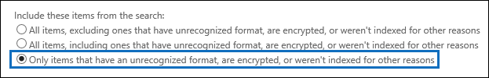

# <a name="export-content-search-results"></a>Exportar os resultados da Pesquisa de Conteúdo

Depois que uma pesquisa de conteúdo for executada com êxito, você poderá exportar os resultados da pesquisa para um computador local. Quando você exporta os resultados de email, eles são baixados para seu computador como arquivos PST. Quando você exporta conteúdo de sites do SharePoint e do OneDrive for Business, cópias de documentos nativos do Office são exportadas. Há outros documentos e relatórios incluídos nos resultados de pesquisa exportados.
  
Exportar os resultados de uma pesquisa de conteúdo envolve preparar os resultados e, em seguida, baixá-los para um computador local.
  
## <a name="before-you-export-content-search-results"></a>Antes de exportar os resultados da pesquisa de conteúdo

- Para exportar os resultados da pesquisa, você precisa ter a função de gerenciamento de exportação no centro de conformidade de segurança &. Essa função é atribuída ao grupo de função do Gerente de Descoberta Eletrônica interno. Ela não é atribuída por padrão ao grupo de funções Gerenciamento da Organização. Para obter mais informações, confira [Atribuir permissões de descoberta eletrônica](assign-ediscovery-permissions.md).

- O computador que você usa para exportar os resultados da pesquisa devem atender aos seguintes requisitos de sistema:
  
  - versões de 32 bits ou 64 bits do Windows 7 e versões posteriores
  
  - Microsoft .NET Framework 4.7
  
- Você precisa usar um dos seguintes navegadores suportados para executar a ferramenta de exportação de descoberta eletrônica<sup>1</sup>:

  - Microsoft Edge <sup>2</sup>
  
    OU

  - Microsoft Internet Explorer 10 e versões posteriores
  
  > [!NOTE]
  > <sup>1</sup> a Microsoft não fabrica extensões ou complementos de terceiros para aplicativos ClickOnce. Não há suporte para a exportação de resultados de pesquisa usando um navegador sem suporte com extensões ou complementos de terceiros.<br/>
  > <sup>2</sup> como resultado de alterações recentes no Microsoft Edge, o suporte do ClickOnce não está mais habilitado por padrão. Para obter instruções sobre como habilitar o suporte do ClickOnce no Edge, consulte [usar a ferramenta de exportação de descoberta eletrônica no Microsoft Edge](configure-edge-to-export-search-results.md).
  
- Recomendamos baixar os resultados da pesquisa para um computador local. No entanto, para eliminar o firewall ou a infraestrutura de proxy da sua empresa de causar problemas ao baixar os resultados da pesquisa, você pode considerar o download de resultados da pesquisa para uma área de trabalho virtual fora da sua rede. Isso pode diminuir os tempos limite que ocorrem nas conexões de dados do Azure ao exportar um grande número de arquivos. Para obter mais informações sobre áreas de trabalho virtuais, consulte [área de trabalho virtual do Windows](https://azure.microsoft.com/services/virtual-desktop). 

- Para melhorar o desempenho ao baixar os resultados da pesquisa, considere dividir as pesquisas que retornam um grande conjunto de resultados em pesquisas menores. Por exemplo, você pode usar intervalos de datas em consultas de pesquisa para retornar um conjunto menor de resultados que podem ser baixados mais rapidamente.
  
- Quando você exporta os resultados da pesquisa, os dados são temporariamente armazenados em um local de armazenamento do Azure fornecido pela Microsoft na nuvem da Microsoft antes de ele ser baixado para seu computador local. Certifique-se de que sua organização possa se conectar ao ponto de extremidade no Azure, que é **\* . blob.Core.Windows.net** (o caractere curinga representa um identificador exclusivo para sua exportação). Os dados dos resultados da pesquisa são excluídos do local de armazenamento do Azure duas semanas após sua criação. 
  
- Se sua organização usa um servidor proxy para se comunicar com a Internet, você precisa definir as configurações do servidor proxy no computador que você usa para exportar os resultados da pesquisa (para que a ferramenta exportar possa ser autenticada pelo seu servidor proxy). Para fazer isso, abra o arquivo  *machine.config*  no local que corresponde à sua versão do Windows. 
  
  - **32 bits:**`%windir%\Microsoft.NET\Framework\[version]\Config\machine.config`
  
  - **64 bits:**`%windir%\Microsoft.NET\Framework64\[version]\Config\machine.config`
  
    Adicione as seguintes linhas ao arquivo de  *machine.config*  em algum lugar entre as  `<configuration>`  `</configuration>` marcas e. Certifique-se de substituir  `ProxyServer` e  `Port` com os valores corretos para sua organização; por exemplo,  `proxy01.contoso.com:80` . 
  
    ```xml
    <system.net>
       <defaultProxy enabled="true" useDefaultCredentials="true">
         <proxy proxyaddress="https://ProxyServer :Port " 
                usesystemdefault="False" 
                bypassonlocal="True" 
                autoDetect="False" />
       </defaultProxy>
    </system.net>
    ```

## <a name="step-1-prepare-search-results-for-export"></a>Etapa 1: preparar resultados de pesquisa para exportação

A primeira etapa é preparar os resultados da pesquisa para a exportação. Ao preparar os resultados, eles são carregados para um local de armazenamento do Azure fornecido pela Microsoft na nuvem da Microsoft. O conteúdo de caixas de correio e sites é carregado com uma taxa máxima de 2 GB por hora.
  
1. Acesse [https://protection.office.com](https://protection.office.com).
  
2. Entre usando sua conta de trabalho ou da escola.
  
3. No painel esquerdo do centro de conformidade & segurança, clique em  \> **pesquisa de conteúdo** de pesquisa.
  
4. Na página **pesquisa de conteúdo** , selecione uma pesquisa. 
  
5. No painel de detalhes, em **Exportar resultados para um computador**, clique em **Iniciar exportação**.
  
    > [!NOTE]
    > Se os resultados de uma pesquisa tiverem mais de 7 dias, você precisará atualizá-los. Se isso acontecer, cancele a exportação, clique em **Atualizar resultados de pesquisa** no painel de detalhes para a pesquisa selecionada e inicie a exportação novamente após os resultados serem atualizados.  
  
6. Na página **exportar os resultados da pesquisa** , em **Opções de saída**, escolha uma das seguintes opções:
  
    - Todos os itens, excluindo aqueles que têm formato não reconhecido, são criptografados ou não foram indexados por outros motivos
  
    - Todos os itens, incluindo aqueles que têm formato não reconhecido, são criptografados ou não foram indexados por outros motivos
  
    - Apenas os itens que têm um formato não reconhecido, são criptografados ou não foram indexados por outros motivos
  
    Consulte a seção [mais informações](#more-information) para obter uma descrição sobre como os itens parcialmente indexados são exportados. Para obter mais informações sobre itens parcialmente indexados, confira [itens parcialmente indexados na pesquisa de conteúdo](partially-indexed-items-in-content-search.md).
  
7. Em **exportar conteúdo do Exchange como**, escolha uma das seguintes opções:
  
    - **Um arquivo PST para cada caixa de correio:** Exporta um arquivo PST para cada caixa de correio de usuário que contém os resultados da pesquisa. Os resultados da caixa de correio de arquivo morto do usuário são incluídos no mesmo arquivo PST. Essa opção reproduz a estrutura de pastas da caixa de correio da caixa de correio de origem.
  
    - **Um arquivo PST contendo todas as mensagens:** Exporta um único arquivo PST (chamado *Exchange. pst*) que contém os resultados da pesquisa de todas as caixas de correio de origem incluídas na pesquisa. Essa opção reproduz a estrutura de pastas da caixa de correio para cada mensagem.
  
    - **Um arquivo PST contendo todas as mensagens em uma única pasta:** Exporta os resultados da pesquisa para um único arquivo PST onde todas as mensagens estão localizadas em uma única pasta de nível superior. Essa opção permite que os revisores revisem itens em ordem cronológica (os itens são classificados por data de envio) sem precisar navegar na estrutura de pastas da caixa de correio original de cada item.
  
    - **Mensagens individuais:** Exporta os resultados da pesquisa como mensagens de email individuais, usando o formato. msg. Se você selecionar essa opção, os resultados da pesquisa de email serão exportados para uma pasta no sistema de arquivos. O caminho da pasta para mensagens individuais é o mesmo usado se você exportou os resultados para arquivos PST.
  
      > [!IMPORTANT]
      > Para descriptografar mensagens protegidas por RMS quando elas são exportadas, você deve exportar os resultados de pesquisa de email como mensagens individuais. As mensagens criptografadas permanecerão criptografadas se você exportar os resultados da pesquisa como um arquivo PST. Para obter mais informações, confira [descriptografar mensagens de email protegidas por RMS e anexos de arquivo criptografados](#decrypting-rms-protected-email-messages-and-encrypted-file-attachments) neste artigo.
  
8. Clique na caixa de seleção **habilitar eliminação de duplicação** para excluir mensagens duplicadas. Essa opção será exibida somente se as fontes de conteúdo da pesquisa incluírem caixas de correio do Exchange ou pastas públicas. 
  
    Se você selecionar essa opção, somente uma cópia de uma mensagem será exportada, mesmo se várias cópias da mesma mensagem forem encontradas nas caixas de correio que foram pesquisadas. O relatório de resultados de exportação (Results.csv) conterá uma linha para cada cópia de uma mensagem duplicada para que você possa identificar as caixas de correio (ou pastas públicas) que contenham uma cópia da mensagem duplicada. Para obter mais informações sobre a eliminação de duplicação e como os itens duplicados são identificados, consulte [desduplicação nos resultados da pesquisa de descoberta eletrônica](de-duplication-in-ediscovery-search-results.md).
  
9. Clique na caixa de seleção **incluir versões para documentos do SharePoint** para exportar todas as versões dos documentos do SharePoint. Essa opção será exibida somente se as fontes de conteúdo da pesquisa incluírem sites do SharePoint ou do OneDrive for Business. 
  
10. Clique na caixa de seleção **exportar arquivos em uma pasta compactada (zipada)** para exportar os resultados da pesquisa para pastas compactadas. Essa opção está disponível somente quando você opta por exportar itens do Exchange como mensagens individuais e quando os resultados da pesquisa incluem documentos do SharePoint ou do OneDrive. Essa opção é usada principalmente para contornar o limite de caracteres de 260 em nomes de caminho de arquivo do Windows quando os itens são exportados. Consulte "nomes de dados dos itens exportados" na seção [mais informações](#more-information) . 
  
11. Clique em **Iniciar exportação**. Os resultados da pesquisa são preparados para download, o que significa que eles estão sendo carregados em um local de armazenamento do Azure na nuvem da Microsoft. Isso pode levar alguns minutos.

Consulte a próxima seção para obter instruções para baixar os resultados de pesquisa exportados.
  
## <a name="step-2-download-the-search-results"></a>Etapa 2: baixar os resultados da pesquisa

A próxima etapa é baixar os resultados da pesquisa do local de armazenamento do Azure para seu computador local.
  
1. Na página **pesquisa de conteúdo** , clique na guia **Exportar** . 
  
   Talvez seja necessário clicar em **Atualizar** para atualizar a lista de trabalhos de exportação para que ele mostre o trabalho de exportação que você criou. Os trabalhos de exportação têm o mesmo nome da pesquisa correspondente com o **_Export** acrescentado ao nome da pesquisa.
  
2. Selecione o trabalho de exportação que você criou na etapa 1.

3. Na página de menu, em **Exportar chave**, clique em **copiar para área de transferência**. Use essa chave na etapa 6 para baixar os resultados da pesquisa.
  
4. Clique em **Baixar resultados**.

5. Se você for solicitado a instalar a **ferramenta de exportação de descoberta eletrônica**, clique em **instalar**.

6. Na **ferramenta de exportação de descoberta eletrônica**, faça o seguinte:

   

   1. Cole a chave de exportação que você copiou na etapa 3 na caixa apropriada.
  
   2. Clique em **Procurar** para especificar o local onde deseja baixar os arquivos de resultado da pesquisa.
  
      > [!NOTE]
      > Devido à grande quantidade de atividade do disco (leituras e gravações), você deve baixar os resultados da pesquisa para uma unidade de disco local; Não baixe-os para uma unidade de rede mapeada ou outro local de rede. 
  
6. Clique em **Iniciar** para baixar os resultados da pesquisa em seu computador.
  
    A **Ferramenta de Exportação de Descoberta Eletrônica** exibe informações de status sobre o processo de exportação, incluindo uma estimativa do número (e tamanho) dos itens restantes a serem baixados. Quando o processo de exportação estiver concluído, você poderá acessar os arquivos no local onde foram baixados.

## <a name="more-information"></a>Mais informações

Veja mais informações sobre como exportar resultados de pesquisa.
  
[Limites de exportação](#export-limits)
  
[Exportar relatórios](#export-reports)
  
[Exportando itens parcialmente indexados](#exporting-partially-indexed-items)

[Exportando mensagens individuais ou arquivos PST](#exporting-individual-messages-or-pst-files)
  
[Exportando resultados de mais de 100.000 caixas de correio](#exporting-results-from-more-than-100000-mailboxes)

[Descriptografando mensagens de email protegidas por RMS e anexos de arquivos criptografados](#decrypting-rms-protected-email-messages-and-encrypted-file-attachments)

[Nomes de itens exportados](#filenames-of-exported-items)  
  
[Miscellaneous](#miscellaneous)
  
### <a name="export-limits"></a>Limites de exportação
  
- Exportar resultados de pesquisa do centro de conformidade & de segurança tem os seguintes limites:

  - Você pode exportar no máximo 2 TB de dados de uma única pesquisa de conteúdo. Se os resultados da pesquisa forem maiores que 2 TB, considere o uso de intervalos de datas ou outros tipos de filtros para diminuir o tamanho total dos resultados da pesquisa.
  
  - Sua organização pode exportar no máximo 2 TB de dados durante um único dia. A cota será redefinida diariamente às 12:00AM UTC.
  
  - Você pode ter no máximo 10 exportações em execução ao mesmo tempo dentro de sua organização.

  - Um único usuário pode executar no máximo três exportações ao mesmo tempo.
  
  - Você pode baixar os resultados da pesquisa de um máximo de 100.000 caixas de correio usando a ferramenta de exportação de descoberta eletrônica no centro de conformidade & segurança do Office 365 ou no centro de conformidade da Microsoft 365. Para baixar os resultados da pesquisa de mais de 100.000 caixas de correio, é necessário usar o PowerShell do centro de conformidade & segurança. Para obter instruções, consulte [exportando resultados de mais de 100.000 caixas de correio](#exporting-results-from-more-than-100000-mailboxes).

  > [!NOTE]
  > Exportar somente os relatórios de uma pesquisa de conteúdo também conta o número de exportações em execução ao mesmo tempo e o número de exportações que um único usuário pode executar.
  
- Conforme mencionado anteriormente, os resultados da pesquisa de caixas de correio e sites são carregados em um local de armazenamento do Azure fornecido pela Microsoft (conforme descrito na [etapa 1: preparar resultados de pesquisa para exportação](#step-1-prepare-search-results-for-export)) a uma taxa máxima de 2 GB por hora.
  
- O tamanho máximo de um arquivo PST que pode ser exportado é de 10 GB por padrão. Isso significa que, se os resultados da pesquisa da caixa de correio de um usuário forem maiores do que 10 GB, os resultados da pesquisa serão exportados em dois (ou mais) arquivos PST separados. Se você optar por exportar todos os resultados de pesquisa em um único arquivo PST, o arquivo PST será Spilt em arquivos PST adicionais se o tamanho total dos resultados da pesquisa for maior do que 10 GB. Se você quiser alterar esse tamanho padrão, poderá editar o registro do Windows no computador que você usa para exportar os resultados da pesquisa. Consulte [alterar o tamanho dos arquivos PST ao exportar resultados de pesquisa de descoberta eletrônica](change-the-size-of-pst-files-when-exporting-results.md).
  
    Além disso, os resultados da pesquisa de uma caixa de correio específica não serão divididos entre vários arquivos PST, a menos que o conteúdo de uma única caixa de correio seja maior do que 10 GB. Se você optar por exportar os resultados da pesquisa em um arquivo PST para o que contém todas as mensagens em uma única pasta e os resultados da pesquisa forem maiores do que 10 GB, os itens ainda serão organizados em ordem cronológica, portanto, eles serão Spilt em arquivos PST adicionais com base na data de envio.
  
### <a name="export-reports"></a>Exportar relatórios
  
- Quando você exporta os resultados da pesquisa, os relatórios a seguir são incluídos além dos resultados da pesquisa.
  
  - **Resumo de exportação** Um documento do Excel que contém um resumo da exportação. Isso inclui informações como o número de fontes de conteúdo pesquisadas, os tamanhos estimados e baixados dos resultados da pesquisa e o número estimado e baixado dos itens que foram exportados.
  
  - **Manifesto** Um arquivo de manifesto (em formato XML) que contém informações sobre cada item incluído nos resultados da pesquisa.
  
  - **Resultados da** Um documento do Excel que contém informações sobre cada item que é baixado como resultado da pesquisa. Para emails, o log do resultado contém informações sobre cada mensagem, incluindo:
  
    - O local da mensagem na caixa de correio de origem (inclusive se a mensagem está na caixa de correio principal ou de arquivo morto).
  
    - A data na qual a mensagem foi enviada ou recebida.

    - A linha de assunto da mensagem.

    - O remetente e os destinatários da mensagem.

    - Se a mensagem é uma mensagem duplicada se você ativou a opção de eliminação de duplicação ao exportar os resultados da pesquisa. As mensagens duplicadas têm um valor na coluna **duplicar para item** que identifica a mensagem como uma duplicata. O valor na coluna **duplicar para item** contém a identidade de item da mensagem que foi exportada. Para obter mais informações, consulte [desduplicação nos resultados da pesquisa de descoberta eletrônica](de-duplication-in-ediscovery-search-results.md).

      Para documentos de sites do SharePoint e do OneDrive for Business, o log de resultados contém informações sobre cada documento, incluindo:

      - A URL para o documento.

      - A URL para o conjunto de sites onde o documento está localizado.

      - A data em que o documento foi modificado pela última vez.

      - O nome do documento (que está localizado na coluna Assunto no log de resultados).

  - **Itens não indexados** Um documento do Excel que contém informações sobre qualquer item parcialmente indexado que seria incluído nos resultados da pesquisa. Se você não incluir itens parcialmente indexados quando gerar o relatório de resultados da pesquisa, esse relatório ainda será baixado, mas estará vazio.

  - **Erros e avisos** Contém erros e avisos para arquivos encontrados durante a exportação. Consulte a coluna detalhes do erro para obter informações específicas sobre cada erro ou aviso individual.

  - **Itens ignorados** Quando você exporta resultados de pesquisa de sites do SharePoint e do OneDrive for Business, a exportação normalmente inclui um relatório de itens ignorados (SkippedItems.csv). Os itens citados neste relatório normalmente são itens que não serão baixados, como uma pasta ou um conjunto de documentos. A não exportação desses tipos de itens é por design. Para outros itens que foram ignorados, o campo "tipo de erro" e "detalhes do erro" no relatório de itens ignorados mostra o motivo pelo qual o item foi ignorado e não foi baixado com os outros resultados da pesquisa.

  - **Log de rastreamento** Contém informações detalhadas de registro sobre o processo de exportação e pode ajudar a descobrir problemas durante a exportação.
  
    > [!NOTE]
    > Você pode apenas exportar esses documentos sem precisar exportar os resultados de pesquisa reais. Consulte [exportar um relatório de pesquisa de conteúdo](export-a-content-search-report.md). 
  
### <a name="exporting-partially-indexed-items"></a>Exportando itens parcialmente indexados
  
- Se você estiver exportando itens de caixa de correio de uma pesquisa de conteúdo que retorna todos os itens de caixa de correio nos resultados da pesquisa (porque nenhuma palavra-chave está incluída na consulta de pesquisa), os itens parcialmente indexados não serão copiados para o arquivo PST que contém os itens não indexados. Isso ocorre porque todos os itens, incluindo qualquer item parcialmente indexado, são incluídos automaticamente nos resultados normais da pesquisa. Isso significa que os itens parcialmente indexados serão incluídos em um arquivo PST (ou como mensagens individuais) que contenham os outros itens indexados.

    Se você exportar os itens indexado e parcialmente indexado ou se exportar apenas os itens indexados de uma pesquisa de conteúdo que retorna todos os itens, o mesmo número de itens será baixado. Isso acontece mesmo que os resultados de pesquisa estimados para a pesquisa de conteúdo (exibidos nas estatísticas de pesquisa no centro de conformidade & segurança) ainda incluam uma estimativa separada para o número de itens parcialmente indexados. Por exemplo, digamos que a estimativa de uma pesquisa que inclua todos os itens (sem palavras-chave na consulta de pesquisa) mostra que 1.000 itens foram encontrados e que 200 itens parcialmente indexados também foram encontrados. Nesse caso, os itens 1.000 incluem os itens parcialmente indexados, pois a pesquisa retorna todos os itens. Em outras palavras, há 1.000 total de itens retornados pela pesquisa, e não 1.200 itens (como você pode esperar). Se você exportar os resultados dessa pesquisa e optar por exportar itens indexados e parcialmente indexados (ou exportar apenas itens parcialmente indexados), serão baixados 1.000 itens. Novamente, isso ocorre porque os itens parcialmente indexados estão incluídos nos resultados regulares (indexados) quando você usa uma consulta de pesquisa em branco para retornar todos os itens. Neste mesmo exemplo, se você optar por exportar apenas itens parcialmente indexados, somente os itens não indexados 200 serão baixados.

    Observe também que, no exemplo anterior (quando você exporta itens indexados e parcialmente indexados ou você exporta apenas itens indexados), o relatório de **Resumo de exportação** incluído nos resultados de pesquisa exportados listaria 1.000 itens estimados e 1.000 itens baixados pelos mesmos motivos que foram descritos anteriormente. 

- Se a pesquisa de que você está exportando os resultados for uma pesquisa de locais de conteúdo específicos ou de todos os locais de conteúdo em sua organização, somente os itens parciais de locais de conteúdo que contêm itens que correspondam aos critérios de pesquisa serão exportados. Em outras palavras, se nenhum resultado de pesquisa for encontrado em uma caixa de correio ou site, todos os itens parcialmente indexados na caixa de correio ou site não serão exportados. O motivo disso é que exportar itens parcialmente indexados de muitos locais na organização pode aumentar a probabilidade de erros de exportação e aumentar o tempo necessário para exportar e baixar os resultados da pesquisa.

    Para exportar itens parcialmente indexados de todos os locais de conteúdo para uma pesquisa, configure a pesquisa para retornar todos os itens (removendo palavras-chave da consulta de pesquisa) e exporte apenas itens parcialmente indexados quando exportar os resultados da pesquisa.

    
  
- Ao exportar resultados de pesquisa de sites do SharePoint ou do OneDrive for Business, a capacidade de exportar itens não indexados também depende da opção de exportação selecionada e se um site pesquisado contém um item indexado que corresponde aos critérios de pesquisa. Por exemplo, se você pesquisar sites específicos do SharePoint ou do OneDrive for Business e nenhum resultado de pesquisa for localizado, nenhum item não indexado desses sites será exportado se você escolher a segunda opção de exportação para exportar itens indexados e não indexados. Se um item indexado de um site corresponder aos critérios de pesquisa, todos os itens não indexados desse site serão exportados durante a exportação de itens indexados e não indexados. A ilustração a seguir descreve as opções de exportação baseadas no fato de um site conter um item indexado que corresponda aos critérios de pesquisa.

    

    1. Somente os itens indexados que correspondem aos critérios de pesquisa são exportados. Nenhum item parcialmente indexado é exportado.

    2. Se nenhum item indexado de um site corresponder aos critérios de pesquisa, os itens parcialmente indexados desse mesmo site não serão exportados. Se os itens indexados de um site forem retornados nos resultados da pesquisa, os itens parcialmente indexados desse site serão exportados. Em outras palavras, somente os itens parcialmente indexados de sites que contêm itens que correspondem aos critérios de pesquisa são exportados.

    3. Todos os itens parcialmente indexados de todos os sites da pesquisa são exportados, independentemente de um site conter itens que correspondam aos critérios de pesquisa.

    Se você optar por exportar itens parcialmente indexados, os itens de caixa de correio parcialmente indexados serão exportados em um arquivo PST separado, independentemente da opção que você escolher em **exportar o conteúdo do Exchange como**.

- Se itens parcialmente indexados forem retornados nos resultados da pesquisa (porque outras propriedades de itens parcialmente indexados corresponderam aos critérios de pesquisa), esses parcialmente indexados serão exportados com os resultados de pesquisa regulares. Portanto, se você optar por exportar itens indexados e itens parcialmente indexados (selecionando **todos os itens, incluindo aqueles que têm formato não reconhecido, estiverem criptografados ou não foram indexados por outros motivos:** a opção de exportação), os itens parcialmente indexados exportados com os resultados regulares serão listados no relatório de Results.csv. Eles não serão listados no relatório de items.csv não indexado.
  
### <a name="exporting-individual-messages-or-pst-files"></a>Exportando mensagens individuais ou arquivos PST
  
- Se o nome do caminho do arquivo de uma mensagem exceder o limite máximo de caracteres para o Windows, o nome do caminho do arquivo será truncado. Mas o nome do caminho do arquivo original será listado no manifesto e no ResultsLog.
  
- Como explicado anteriormente, os resultados da pesquisa de email são exportados para uma pasta no sistema de arquivos. O caminho da pasta para mensagens individuais replicaria o caminho da pasta na caixa de correio do usuário. Por exemplo, para uma pesquisa chamada "ContosoCase101" mensagens na caixa de entrada de um usuário estaria localizada no caminho da pasta  `~ContosoCase101\\<date of export\Exchange\user@contoso.com (Primary)\Top of Information Store\Inbox` .

- Se você optar por exportar mensagens de email em um arquivo PST que contenha todas as mensagens em uma única pasta, uma pasta **itens excluídos** e **pastas de pesquisa** serão incluídas no nível superior da pasta PST. Essas pastas estão vazias.

- Conforme mencionado anteriormente, você deve exportar os resultados da pesquisa de email como mensagens individuais para descriptografar mensagens protegidas por RMS quando elas forem exportadas. As mensagens criptografadas permanecerão criptografadas se você exportar os resultados da pesquisa de email como um arquivo PST.
  
### <a name="exporting-results-from-more-than-100000-mailboxes"></a>Exportando resultados de mais de 100.000 caixas de correio

- Conforme explicado anteriormente, você precisa usar o PowerShell de segurança & centro de conformidade para baixar os resultados da pesquisa de mais de 100.000 caixas de correio. Você pode executar o seguinte script nesta seção para baixar os resultados da pesquisa. O uso desse script pressupõe que você já tenha exportado os resultados da pesquisa (o trabalho de exportação é exibido na guia **Exportar** da ferramenta de pesquisa de conteúdo) e agora deseja baixá-los.

   ```powershell
   $export=Get-ComplianceSearchAction SEARCHNAME_Export -IncludeCredential;
   $exportUrl=   [System.Uri]::EscapeDataString(($export.Results.Split(";") | ?{$_ -like '*Container url*'} | %{$_.Split(":",2)} | select -last 1).Trim());
   $exportToken=($export.Results.Split(";") | ?{$_ -like '*SAS Token*'} | %{$_.Split(":",2)} | select -last 1).Trim();
   ."$env:ProgramFiles\Internet Explorer\IEXPLORE.EXE" "https://complianceclientsdf.blob.core.windows.net/v16/Microsoft.Office.Client.Discovery.UnifiedExportTool.application?name=$($export.Name)&source=$exportUrl&zip=allow&trace=1";
   $exportToken | clip;
   ```

  No script, você precisa especificar o nome da pesquisa para a qual você deseja exportar os resultados. Por exemplo, para uma pesquisa nomeada, `SearchAllMailboxes` substitua SEARCHNAME_Export por `SearchAllMailboxes_Export` .

  Depois de adicionar o nome da pesquisa ao script, você pode copiar o texto do script e colá-lo em uma janela do Windows PowerShell que esteja [conectada ao PowerShell de segurança & centro de conformidade](https://docs.microsoft.com/powershell/exchange/connect-to-scc-powershell). Após colar o script, a ferramenta de exportação de descoberta eletrônica é exibida (como ocorre quando você baixa os resultados da pesquisa usando a interface do usuário):

  

  Clique na caixa exportar chave e pressione `CTRL + V` para colar a chave de exportação (o script copia a chave exportar para a área de transferência). Clique em **procurar** para especificar o local onde você deseja baixar os arquivos e, em seguida, inicie o download.

  Conforme mencionado anteriormente, recomendamos que você baixe os resultados da pesquisa para uma unidade de disco local devido à grande quantidade de atividade do disco (leituras e gravações). Não baixe os resultados da pesquisa para uma unidade de rede mapeada ou outro local de rede.

### <a name="decrypting-rms-protected-email-messages-and-encrypted-file-attachments"></a>Descriptografando mensagens de email protegidas por RMS e anexos de arquivos criptografados

Quaisquer mensagens de email protegidas por direitos (protegidas por RMS) incluídas nos resultados de uma pesquisa de conteúdo serão descriptografadas quando você exportá-las. Além disso, qualquer arquivo criptografado com uma [tecnologia de criptografia da Microsoft](encryption.md) e é anexado a uma mensagem de email incluída nos resultados da pesquisa também será descriptografado quando for exportado. Esse recurso de descriptografia é habilitado por padrão para membros do grupo de funções Gerenciador de descoberta eletrônica. Isso ocorre porque a função de gerenciamento de descriptografia do RMS é atribuída a esse grupo de função por padrão. Tenha em mente os seguintes pontos ao exportar mensagens de email e anexos criptografados:
  
- Conforme explicado anteriormente, para descriptografar mensagens protegidas por RMS ao exportá-las, você precisa exportar os resultados da pesquisa como mensagens individuais. Se você exportar resultados de pesquisa para um arquivo PST, as mensagens protegidas por RMS permanecerão criptografadas.

- As mensagens descriptografadas são identificadas no relatório **ResultsLog** . Este relatório contém uma coluna chamada **status de decodificação** e um valor de **decodificado** nesta coluna identifica as mensagens que foram descriptografadas.

- Além de descriptografar anexos de arquivo ao exportar resultados de pesquisa, você também pode visualizar o arquivo descriptografado ao visualizar os resultados da pesquisa. Você só pode exibir a mensagem de email protegida por direitos após exportá-la.

- No momento, o recurso de descriptografia ao exportar resultados de pesquisa não inclui conteúdo criptografado de sites do SharePoint e do OneDrive for Business. No entanto, o suporte será disponibilizado em breve para documentos criptografados com tecnologias de criptografia da Microsoft e armazenados no SharePoint Online e no OneDrive for Business.

- Se você precisar impedir que alguém descriptografe mensagens de proteção de RMS e anexos de arquivo criptografado, será necessário criar um grupo de função personalizado (copiando o grupo de função interno Gerenciador de descoberta eletrônica) e, em seguida, removendo a função de gerenciamento de descriptografia do RMS do grupo de função personalizado. Em seguida, adicione a pessoa que você não deseja descriptografar mensagens como um membro do grupo de função personalizado.
  
### <a name="filenames-of-exported-items"></a>Nomes de itens exportados
  
- Há um limite de 260 caracteres (imposto pelo sistema operacional) para o nome do caminho completo de mensagens de email e documentos de site exportados para o computador local. O nome do caminho completo para itens exportados inclui o local original do item e o local da pasta no computador local em que os resultados da pesquisa são baixados. Por exemplo, se você especificar para baixar os resultados da pesquisa para  `C:\Users\Admin\Desktop\SearchResults` na ferramenta de exportação de descoberta eletrônica, o nome de caminho completo de um item de email baixado seria  `C:\Users\Admin\Desktop\SearchResults\ContentSearch1\03.15.2017-1242PM\Exchange\sarad@contoso.com (Primary)\Top of Information Store\Inbox\Insider trading investigation.msg` .

    Se o limite de 260 caracteres for excedido, o nome do caminho completo de um item será truncado.

  - Se o nome do caminho completo for maior que 260 caracteres, o nome do arquivo será reduzido para chegar abaixo do limite; Observe que o nome de arquivo truncado (excluindo a extensão do arquivo) não terá menos de oito caracteres.

  - Se o nome do caminho completo ainda estiver muito longo depois de encurtar o nome do arquivo, o item será movido de seu local atual para a pasta pai. Se o nome do caminho ainda for muito longo, o processo será repetido: encurte o nome do arquivo e, se necessário, mova novamente para a pasta pai. Esse processo é repetido até que o nome de caminho completo esteja sob o limite de 260 caracteres.

  - Se já existir um nome de caminho completo truncado, um número de versão será adicionado ao final do nome de arquivo; por exemplo,  `statusmessage(2).msg` .

    Para ajudar a reduzir esse problema, considere baixar os resultados da pesquisa para um local com um nome de caminho curto; por exemplo, baixar resultados de pesquisa para uma pasta chamada  `C:\Results` adicionaria menos caracteres aos nomes de caminho dos itens exportados do que baixá-los para uma pasta chamada  `C:\Users\Admin\Desktop\Results` .

- Quando você exporta documentos de site, também é possível que o nome de arquivo original de um documento seja modificado. Isso acontece especificamente para documentos que foram excluídos de um site do SharePoint ou do OneDrive for Business que foi colocado em espera. Depois que um documento que está em um site que está em espera é excluído, o documento excluído é automaticamente movido para a biblioteca de retenção de preservação para o site (que foi criado quando o site foi colocado em espera). Quando o documento excluído é movido para a biblioteca de retenção de preservação, uma ID gerada aleatoriamente e exclusiva é acrescentada ao nome de arquivo original do documento. Por exemplo, se o nome de arquivo de um documento é  `FY2017Budget.xlsx` e esse documento é excluído e movido posteriormente para a biblioteca de retenção de preservação, o nome de arquivo do documento que é movido para a biblioteca de retenção de preservação é modificado para algo como  `FY2017Budget_DEAF727D-0478-4A7F-87DE-5487F033C81A2000-07-05T10-37-55.xlsx` . Se um documento na biblioteca de retenção de preservação corresponder à consulta de uma pesquisa de conteúdo e você exportar os resultados dessa pesquisa, o arquivo exportado terá o nome de arquivo modificado; Neste exemplo, o nome de arquivo do documento exportado seria  `FY2017Budget_DEAF727D-0478-4A7F-87DE-5487F033C81A2000-07-05T10-37-55.xlsx` .

    Quando um documento em um site que está em espera é modificado (e o controle de versão da biblioteca de documentos no site foi habilitado), uma cópia do arquivo é criada automaticamente na biblioteca de retenção de preservação. Nesse caso, uma ID gerada aleatoriamente e exclusiva também é acrescentada ao nome de arquivo do documento que foi copiado para a biblioteca de retenção de preservação.

    O motivo pelo qual os nomes de documentos movidos ou copiados para a biblioteca de retenção de preservação é para evitar nomes de fileconflitantes. Para obter mais informações sobre como colocar um bloqueio em sites e a biblioteca de retenção de preservação, confira [visão geral de bloqueio in-loco no SharePoint Server 2016](https://support.office.com/article/5e400d68-cd51-444a-8fe6-e4df1d20aa95).

### <a name="miscellaneous"></a>Diversos
  
- Ao baixar os resultados da pesquisa usando a ferramenta de exportação de descoberta eletrônica, é possível que você possa receber o seguinte erro: `System.Net.WebException: The remote server returned an error: (412) The condition specified using HTTP conditional header(s) is not met.` este é um erro transitório, que geralmente ocorre no local de armazenamento do Azure. Para resolver esse problema, tente [baixar novamente os resultados da pesquisa](#step-2-download-the-search-results), o que irá reiniciar a ferramenta de exportação de descoberta eletrônica.

- Todos os resultados da pesquisa e os relatórios de exportação estão incluídos em uma pasta que tem o mesmo nome que a Pesquisa de Conteúdo. As mensagens de email que foram exportadas estão localizadas em uma pasta chamada **Exchange**. Os documentos estão localizados em uma pasta chamada **SharePoint**.

- Os metadados do sistema de arquivos para documentos nos sites do SharePoint e do OneDrive for Business são mantidos quando os documentos são exportados para o computador local. Isso significa as propriedades do documento, tais como data de criação e última modificação, não são alteradas quando os documentos são exportados.

- Se os resultados da pesquisa incluírem um item de lista do SharePoint que corresponda à consulta de pesquisa, todas as linhas da lista serão exportadas além do item que corresponde à consulta de pesquisa e a todos os anexos na lista. O motivo para esse comportamento é fornecer um contexto para os itens de lista que são retornados nos resultados da pesquisa. Observe também que os itens de lista adicionais e os anexos podem fazer com que a contagem de itens exportados seja diferente da estimativa original dos resultados da pesquisa.
