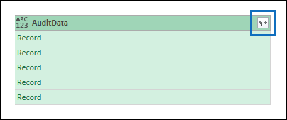

# <a name="export-configure-and-view-audit-log-records"></a><span data-ttu-id="4f035-103">Exportar, configurar e exibir registros de log de auditoria</span><span class="sxs-lookup"><span data-stu-id="4f035-103">Export, configure, and view audit log records</span></span>

<span data-ttu-id="4f035-104">Depois de Pesquisar o log de auditoria e baixar os resultados da pesquisa em um arquivo CSV, o arquivo contém uma coluna chamada **AuditData**, que contém informações adicionais sobre cada evento.</span><span class="sxs-lookup"><span data-stu-id="4f035-104">After you search the audit log and download the search results to a CSV file, the file contains a column named **AuditData**, which contains additional information about each event.</span></span> <span data-ttu-id="4f035-105">Os dados dessa coluna são formatados como um objeto JSON, que contém várias propriedades que são configuradas como *Propriedade:* pares de valores separados por vírgulas.</span><span class="sxs-lookup"><span data-stu-id="4f035-105">The data in this column is formatted as a JSON object, which contains multiple properties that are configured as *property:value* pairs separated by commas.</span></span> <span data-ttu-id="4f035-106">Você pode usar o recurso de transformação JSON no editor do Power Query no Excel para dividir cada propriedade no objeto JSON na coluna **AuditData** em várias colunas, de modo que cada propriedade tenha sua própria coluna.</span><span class="sxs-lookup"><span data-stu-id="4f035-106">You can use the JSON transform feature in the Power Query Editor in Excel to split each property in the JSON object in the **AuditData** column into multiple columns so that each property has its own column.</span></span> <span data-ttu-id="4f035-107">Isso permite que você classifique e filtre em uma ou mais dessas propriedades, o que pode ajudá-lo a localizar rapidamente os dados de auditoria específicos que você está procurando.</span><span class="sxs-lookup"><span data-stu-id="4f035-107">This lets you sort and filter on one or more of these properties, which can help you quickly locate the specific auditing data you're looking for.</span></span>

## <a name="step-1-export-audit-log-search-results"></a><span data-ttu-id="4f035-108">Etapa 1: exportar resultados de pesquisa de log de auditoria</span><span class="sxs-lookup"><span data-stu-id="4f035-108">Step 1: Export audit log search results</span></span>

<span data-ttu-id="4f035-109">A primeira etapa é Pesquisar o log de auditoria e, em seguida, exportar os resultados em um arquivo CSV (valor separado por vírgula) para seu computador local.</span><span class="sxs-lookup"><span data-stu-id="4f035-109">The first step is to search the audit log and then export the results in a comma-separated value (CSV) file to your local computer.</span></span>
  
1. <span data-ttu-id="4f035-110">Execute uma [pesquisa de log de auditoria](search-the-audit-log-in-security-and-compliance.md#search-the-audit-log) e revise os critérios de pesquisa, se necessário, até que você tenha os resultados desejados.</span><span class="sxs-lookup"><span data-stu-id="4f035-110">Run an [audit log search](search-the-audit-log-in-security-and-compliance.md#search-the-audit-log) and revise the search criteria if necessary until you have the desired results.</span></span>

2. <span data-ttu-id="4f035-111">Clique em **Exportar resultados** e selecione **baixar todos os resultados**.</span><span class="sxs-lookup"><span data-stu-id="4f035-111">Click **Export results** and select **Download all results**.</span></span> 

   

   <span data-ttu-id="4f035-113">Essa opção para exportar todos os registros de auditoria da pesquisa de log de auditoria que você executou na etapa 1 e baixa os dados brutos do log de auditoria para um arquivo CSV.</span><span class="sxs-lookup"><span data-stu-id="4f035-113">This option to exports all the audit records from the audit log search you ran in step 1, and downloads the raw data from the audit log to a CSV file.</span></span> 

   <span data-ttu-id="4f035-114">Uma mensagem é exibida na parte inferior da janela que solicita que você abra ou salve o arquivo CSV.</span><span class="sxs-lookup"><span data-stu-id="4f035-114">A message is displayed at the bottom of the window that prompts you to open or save the CSV file.</span></span> 

3. <span data-ttu-id="4f035-115">Clique em **salvar > salvar como** e salve o arquivo CSV no computador local.</span><span class="sxs-lookup"><span data-stu-id="4f035-115">Click **Save > Save as** and save the CSV file to your local computer.</span></span> <span data-ttu-id="4f035-116">Leva um tempo para baixar vários resultados de pesquisa.</span><span class="sxs-lookup"><span data-stu-id="4f035-116">It takes a while to download many search results.</span></span> <span data-ttu-id="4f035-117">Normalmente, esse é o caso da pesquisa de todas as atividades ou de um intervalo de datas abrangente.</span><span class="sxs-lookup"><span data-stu-id="4f035-117">This is typically the case when searching for all activities or a broad date range.</span></span> <span data-ttu-id="4f035-118">Uma mensagem na parte inferior do Windows é exibida quando o arquivo CSV termina de ser baixado.</span><span class="sxs-lookup"><span data-stu-id="4f035-118">A message at the bottom of the windows is displayed when the CSV file is finished downloading.</span></span>

   

> [!NOTE]
  > <span data-ttu-id="4f035-120">É possível baixar no máximo 50 mil entradas para um arquivo CSV de uma única pesquisa de logs de auditoria.</span><span class="sxs-lookup"><span data-stu-id="4f035-120">You can download a maximum of 50,000 entries to a CSV file from a single audit log search.</span></span> <span data-ttu-id="4f035-121">Se 50 mil entradas forem baixadas para o arquivo CSV, você poderá supor que existem provavelmente mais de 50 mil eventos que corresponderam aos critérios de pesquisa.</span><span class="sxs-lookup"><span data-stu-id="4f035-121">If 50,000 entries are downloaded to the CSV file, you can probably assume there are more than 50,000 events that met the search criteria.</span></span> <span data-ttu-id="4f035-122">Para exportar mais do que esse limite, tente usar um intervalo de datas para reduzir o número de registros de log de auditoria.</span><span class="sxs-lookup"><span data-stu-id="4f035-122">To export more than this limit, try using a date range to reduce the number of audit log records.</span></span> <span data-ttu-id="4f035-123">Talvez seja necessário executar várias pesquisas com intervalos de datas menores para exportar mais de 50 mil entradas.</span><span class="sxs-lookup"><span data-stu-id="4f035-123">You might have to run multiple searches with smaller date ranges to export more than 50,000 entries.</span></span>

## <a name="step-2-format-the-exported-audit-log-using-the-power-query-editor"></a><span data-ttu-id="4f035-124">Etapa 2: Formatar o log de auditoria exportado usando o editor de consulta de alimentação</span><span class="sxs-lookup"><span data-stu-id="4f035-124">Step 2: Format the exported audit log using the Power Query Editor</span></span>

<span data-ttu-id="4f035-125">A próxima etapa é usar o recurso transformação JSON no editor do Power Query no Excel para dividir cada propriedade no objeto JSON na coluna **AuditData** em sua própria coluna.</span><span class="sxs-lookup"><span data-stu-id="4f035-125">The next step is to use the JSON transform feature in the Power Query Editor in Excel to split each property in the JSON object in the **AuditData** column into its own column.</span></span> <span data-ttu-id="4f035-126">Em seguida, filtre colunas para exibir registros com base nos valores das propriedades específicas.</span><span class="sxs-lookup"><span data-stu-id="4f035-126">Then you filter columns to view records based on the values of specific properties.</span></span> <span data-ttu-id="4f035-127">Isso pode ajudá-lo a localizar rapidamente os dados de auditoria específicos que você está procurando.</span><span class="sxs-lookup"><span data-stu-id="4f035-127">This can help you quickly locate the specific auditing data you're looking for.</span></span>

1. <span data-ttu-id="4f035-128">Abra uma pasta de trabalho em branco no Excel para Office 365, Excel 2019 ou Excel 2016.</span><span class="sxs-lookup"><span data-stu-id="4f035-128">Open a blank workbook in Excel for Office 365, Excel 2019, or Excel 2016.</span></span>

2. <span data-ttu-id="4f035-129">Na guia **dados** , no grupo **obter & transformar dados de transformação** , clique em **do texto/CSV**.</span><span class="sxs-lookup"><span data-stu-id="4f035-129">On the **Data** tab, in the **Get & Transform Data** ribbon group, click **From Text/CSV**.</span></span>

    

3. <span data-ttu-id="4f035-131">Abra o arquivo CSV que você baixou na etapa 1.</span><span class="sxs-lookup"><span data-stu-id="4f035-131">Open the CSV file that you downloaded in Step 1.</span></span>

4. <span data-ttu-id="4f035-132">Na janela exibida, clique em **transformar dados**.</span><span class="sxs-lookup"><span data-stu-id="4f035-132">In the window that's displayed, click **Transform Data**.</span></span>

   

   <span data-ttu-id="4f035-134">O arquivo CSV é aberto no **Editor de consultas**.</span><span class="sxs-lookup"><span data-stu-id="4f035-134">The CSV file is opened in the **Query Editor**.</span></span> <span data-ttu-id="4f035-135">Há quatro colunas: **CreationDate**, **userids**, **operações**e **AuditData**.</span><span class="sxs-lookup"><span data-stu-id="4f035-135">There are four columns: **CreationDate**, **UserIds**, **Operations**, and **AuditData**.</span></span> <span data-ttu-id="4f035-136">A coluna **AuditData** é um objeto JSON que contém várias propriedades.</span><span class="sxs-lookup"><span data-stu-id="4f035-136">The **AuditData** column is a JSON object that contains multiple properties.</span></span> <span data-ttu-id="4f035-137">A próxima etapa é criar uma coluna para cada propriedade no objeto JSON.</span><span class="sxs-lookup"><span data-stu-id="4f035-137">The next step is to create a column for each property in the JSON object.</span></span>

5. <span data-ttu-id="4f035-138">Clique com o botão direito do mouse no título na coluna **AuditData** , clique em **transformar**e em **JSON**.</span><span class="sxs-lookup"><span data-stu-id="4f035-138">Right-click the title in the **AuditData** column, click **Transform**, and then click **JSON**.</span></span> 

   

6. <span data-ttu-id="4f035-140">No canto superior direito da coluna **AuditData** , clique no ícone expandir.</span><span class="sxs-lookup"><span data-stu-id="4f035-140">In the upper-right corner of the **AuditData** column, click the expand icon.</span></span>

   

   <span data-ttu-id="4f035-142">Uma lista parcial das propriedades nos objetos JSON na coluna **AuditData** é exibida.</span><span class="sxs-lookup"><span data-stu-id="4f035-142">A partial list of the properties in the JSON objects in the **AuditData** column is displayed.</span></span>

7. <span data-ttu-id="4f035-143">Clique em **carregar mais** para exibir todas as propriedades nos objetos JSON na coluna **AuditData** .</span><span class="sxs-lookup"><span data-stu-id="4f035-143">Click **Load more** to display all properties in the JSON objects in the **AuditData** column.</span></span>

   

   <span data-ttu-id="4f035-145">Você pode desmarcar a caixa de seleção ao lado de qualquer propriedade que você não deseja incluir.</span><span class="sxs-lookup"><span data-stu-id="4f035-145">You can unselect the checkbox next to any property that you don't want to include.</span></span> <span data-ttu-id="4f035-146">A eliminação de colunas que não são úteis para sua investigação é uma boa maneira de reduzir a quantidade de dados exibidos no log de auditoria.</span><span class="sxs-lookup"><span data-stu-id="4f035-146">Eliminating columns that aren't useful for your investigation is a good way to reduce the amount of data displayed in the audit log.</span></span> 

   > [!NOTE]
   > <span data-ttu-id="4f035-147">As propriedades JSON exibidas na captura de tela anterior (depois que você clica em **carregar mais**) são baseadas nas propriedades encontradas na coluna **AuditData** das primeiras 1.000 linhas no arquivo CSV.</span><span class="sxs-lookup"><span data-stu-id="4f035-147">The JSON properties displayed in the previous screenshot (after you click **Load more**) are based on the properties found in the **AuditData** column from the first 1,000 rows in the CSV file.</span></span> <span data-ttu-id="4f035-148">Se houver diferentes propriedades JSON nos registros após as primeiras 1.000 linhas, essas propriedades (e uma coluna correspondente) não serão incluídas quando a coluna **AuditData** for dividida em várias colunas.</span><span class="sxs-lookup"><span data-stu-id="4f035-148">If there are different JSON properties in records after the first 1,000 rows, these properties (and a corresponding column) won't be included when the **AuditData** column is split into multiple columns.</span></span> <span data-ttu-id="4f035-149">Para ajudar a evitar isso, considere executar novamente a pesquisa de log de auditoria e restringir os critérios de pesquisa para que menos registros sejam retornados.</span><span class="sxs-lookup"><span data-stu-id="4f035-149">To help prevent this, consider re-running the audit log search and narrow the search criteria so that fewer records are returned.</span></span> <span data-ttu-id="4f035-150">Outra solução é filtrar itens na coluna **operações** para reduzir o número de linhas (antes de executar a etapa 5 acima) antes de transformar o objeto JSON na coluna **AuditData** .</span><span class="sxs-lookup"><span data-stu-id="4f035-150">Another workaround is to filter items in the **Operations** column to reduce the number of rows (before you perform step 5 above) before transforming the JSON object in the **AuditData** column.</span></span>

8. <span data-ttu-id="4f035-151">Execute um dos seguintes procedimentos para formatar o título das colunas adicionadas para cada propriedade JSON selecionada.</span><span class="sxs-lookup"><span data-stu-id="4f035-151">Do one of the following things to format the title of the columns that are added for each JSON property that's selected.</span></span>

    - <span data-ttu-id="4f035-152">Desmarque a caixa de seleção **usar nome de coluna original como prefixo** para usar o nome da propriedade JSON como nomes de coluna; por exemplo, **RecordType** ou **sourceFileName**.</span><span class="sxs-lookup"><span data-stu-id="4f035-152">Unselect the **Use original column name as prefix** checkbox to use the name of the JSON property as the column names; for example, **RecordType** or **SourceFileName**.</span></span>

    - <span data-ttu-id="4f035-153">Deixe a caixa de seleção **usar nome de coluna original como prefixo** selecionada para adicionar o prefixo AuditData aos nomes das colunas; por exemplo, **AuditData. RecordType** ou **AuditData. sourceFileName**.</span><span class="sxs-lookup"><span data-stu-id="4f035-153">Leave the **Use original column name as prefix** checkbox selected to add the AuditData prefix to the column names; for example, **AuditData.RecordType** or **AuditData.SourceFileName**.</span></span>

9. <span data-ttu-id="4f035-154">Clique em **OK**.</span><span class="sxs-lookup"><span data-stu-id="4f035-154">Click **OK**.</span></span>

    <span data-ttu-id="4f035-155">A coluna **AuditData** é dividida em várias colunas.</span><span class="sxs-lookup"><span data-stu-id="4f035-155">The **AuditData** column is split into multiple columns.</span></span> <span data-ttu-id="4f035-156">Cada nova coluna corresponde a uma propriedade no objeto JSON AuditData.</span><span class="sxs-lookup"><span data-stu-id="4f035-156">Each new column corresponds to a property in the AuditData JSON object.</span></span> <span data-ttu-id="4f035-157">Cada linha na coluna contém o valor da propriedade.</span><span class="sxs-lookup"><span data-stu-id="4f035-157">Each row in the column contains the value for the property.</span></span> <span data-ttu-id="4f035-158">Se a propriedade não contiver um valor, o valor *nulo* será exibido.</span><span class="sxs-lookup"><span data-stu-id="4f035-158">If the property doesn't contain a value, the *null* value is displayed.</span></span> <span data-ttu-id="4f035-159">No Excel, as células com valores nulos estão vazias.</span><span class="sxs-lookup"><span data-stu-id="4f035-159">In Excel, cells with null values are empty.</span></span>
  
10. <span data-ttu-id="4f035-160">Na guia **página inicial** , clique em **fechar & carregar** para fechar o editor de consulta de alimentação e abrir o arquivo CSV transformado em uma pasta de trabalho do Excel.</span><span class="sxs-lookup"><span data-stu-id="4f035-160">On the **Home** tab, click **Close & Load** to close the Power Query Editor and open the transformed CSV file in an Excel workbook.</span></span>

## <a name="use-powershell-to-search-and-export-audit-log-records"></a><span data-ttu-id="4f035-161">Usar o PowerShell para pesquisar e exportar registros de log de auditoria</span><span class="sxs-lookup"><span data-stu-id="4f035-161">Use PowerShell to search and export audit log records</span></span>

<span data-ttu-id="4f035-162">Em vez de usar a ferramenta de pesquisa de log de auditoria no centro de conformidade & segurança, você pode usar o cmdlet [Search-UnifiedAuditLog](https://docs.microsoft.com/powershell/module/exchange/search-unifiedauditlog) no PowerShell do Exchange Online para exportar os resultados de uma pesquisa de log de auditoria para um arquivo CSV.</span><span class="sxs-lookup"><span data-stu-id="4f035-162">Instead of using the audit log search tool in the Security & Compliance Center, you can use the [Search-UnifiedAuditLog](https://docs.microsoft.com/powershell/module/exchange/search-unifiedauditlog) cmdlet in Exchange Online PowerShell to export the results of an audit log search to a CSV file.</span></span> <span data-ttu-id="4f035-163">Em seguida, você pode seguir o mesmo procedimento descrito na etapa 2 para formatar o log de auditoria usando o editor de consulta de alimentação.</span><span class="sxs-lookup"><span data-stu-id="4f035-163">Then you can follow the same procedure described in Step 2 to format the audit log using the Power Query editor.</span></span> <span data-ttu-id="4f035-164">Uma vantagem de usar o cmdlet do PowerShell é que você pode pesquisar eventos de um serviço específico usando o parâmetro *RecordType* .</span><span class="sxs-lookup"><span data-stu-id="4f035-164">One advantage of using the PowerShell cmdlet is that you can search for events from a specific service by using the *RecordType* parameter.</span></span> <span data-ttu-id="4f035-165">Aqui estão alguns exemplos de como usar o PowerShell para exportar registros de auditoria para um arquivo CSV, para que você possa usar o editor de consulta de alimentação para transformar o objeto JSON na coluna **AuditData** , conforme descrito na etapa 2.</span><span class="sxs-lookup"><span data-stu-id="4f035-165">Here are few examples of using PowerShell to export audit records to a CSV file so you can use the Power Query editor to transform the JSON object in the **AuditData** column as described in Step 2.</span></span>

<span data-ttu-id="4f035-166">Neste exemplo, execute os seguintes comandos para retornar todos os registros relacionados às operações de compartilhamento do SharePoint.</span><span class="sxs-lookup"><span data-stu-id="4f035-166">In this example, run the following commands to return all records related to SharePoint sharing operations.</span></span>

```powershell
$auditlog = Search-UnifiedAuditLog -StartDate 06/01/2019 -EndDate 06/30/2019 -RecordType SharePointSharingOperation
```

```powershell
$auditlog | Select-Object -Property CreationDate,UserIds,RecordType,AuditData | Export-Csv -Path c:\AuditLogs\PowerShellAuditlog.csv -NoTypeInformation
```

<span data-ttu-id="4f035-167">Os resultados da pesquisa são exportados para um arquivo CSV chamado *PowerShellAuditlog* que contém quatro colunas: CreationDate, userids, RecordType, AuditData).</span><span class="sxs-lookup"><span data-stu-id="4f035-167">The search results are exported to a CSV file named *PowerShellAuditlog* that contains four columns: CreationDate, UserIds, RecordType, AuditData).</span></span>

<span data-ttu-id="4f035-168">Você também pode usar o nome ou o valor de enumeração para o tipo de registro como o valor para o parâmetro *RecordType* .</span><span class="sxs-lookup"><span data-stu-id="4f035-168">You can also use the name or enum value for the record type as the value for the *RecordType* parameter.</span></span> <span data-ttu-id="4f035-169">Para obter uma lista de nomes de tipo de registro e seus valores de enumeração correspondentes, consulte a tabela *AuditLogRecordType* no [esquema da API da atividade de gerenciamento do Office 365](https://docs.microsoft.com/office/office-365-management-api/office-365-management-activity-api-schema#enum-auditlogrecordtype---type-edmint32).</span><span class="sxs-lookup"><span data-stu-id="4f035-169">For a list of record type names and their corresponding enum values, see the *AuditLogRecordType* table in [Office 365 Management Activity API schema](https://docs.microsoft.com/office/office-365-management-api/office-365-management-activity-api-schema#enum-auditlogrecordtype---type-edmint32).</span></span>

<span data-ttu-id="4f035-170">Você só pode incluir um único valor para o parâmetro *RecordType* .</span><span class="sxs-lookup"><span data-stu-id="4f035-170">You can only include a single value for the *RecordType* parameter.</span></span> <span data-ttu-id="4f035-171">Para pesquisar registros de auditoria para outros tipos de registro, você precisa executar novamente os dois comandos anteriores para especificar um tipo de registro diferente e acrescentar esses resultados ao arquivo CSV original.</span><span class="sxs-lookup"><span data-stu-id="4f035-171">To search for audit records for other record types, you have to run the two previous commands again to specify a different record type and append those results to the original CSV file.</span></span> <span data-ttu-id="4f035-172">Por exemplo, você deve executar os dois comandos a seguir para adicionar atividades de arquivo do SharePoint do mesmo intervalo de datas ao arquivo de PowerShellAuditlog.csv.</span><span class="sxs-lookup"><span data-stu-id="4f035-172">For example, you would run the following two commands to add SharePoint file activities from the same date range to the PowerShellAuditlog.csv file.</span></span>

```powershell
$auditlog = Search-UnifiedAuditLog -StartDate 06/01/2019 -EndDate 06/30/2019 -RecordType SharePointFileOperation
```

```powershell
$auditlog | Select-Object -Property CreationDate,UserIds,RecordType,AuditData | Export-Csv -Append -Path c:\AuditLogs\PowerShellAuditlog.csv -NoTypeInformation
```

## <a name="tips-for-exporting-and-viewing-the-audit-log"></a><span data-ttu-id="4f035-173">Dicas para exportar e exibir o log de auditoria</span><span class="sxs-lookup"><span data-stu-id="4f035-173">Tips for exporting and viewing the audit log</span></span>

<span data-ttu-id="4f035-174">Veja aqui algumas dicas e exemplos de como exportar e exibir o log de auditoria antes e depois de usar o recurso de transformação JSON para dividir a coluna **AuditData** em várias colunas.</span><span class="sxs-lookup"><span data-stu-id="4f035-174">Here are some tips and examples of exporting and viewing the audit log before and after you use the JSON transform feature to split the **AuditData** column into multiple columns.</span></span>

- <span data-ttu-id="4f035-175">Filtrar a coluna **RecordType** para exibir apenas os registros de um serviço específico ou uma área funcional.</span><span class="sxs-lookup"><span data-stu-id="4f035-175">Filter the **RecordType** column to display only the records from a specific service or functional area.</span></span> <span data-ttu-id="4f035-176">Por exemplo, para mostrar eventos relacionados ao compartilhamento do SharePoint, você deve selecionar **14** (o valor de enumeração para registros disparados pelas atividades de compartilhamento do SharePoint).</span><span class="sxs-lookup"><span data-stu-id="4f035-176">For example, to show events related to SharePoint sharing, you would select **14** (the enum value for records triggered by SharePoint sharing activities).</span></span> <span data-ttu-id="4f035-177">Para obter uma lista dos serviços que correspondem aos valores de enumeração exibidos na coluna **RecordType** , consulte [propriedades detalhadas no log de auditoria](detailed-properties-in-the-office-365-audit-log.md).</span><span class="sxs-lookup"><span data-stu-id="4f035-177">For a list of the services that correspond to the enum values displayed in the **RecordType** column, see [Detailed properties in the audit log](detailed-properties-in-the-office-365-audit-log.md).</span></span>

- <span data-ttu-id="4f035-178">Filtrar a coluna **operações** para exibir os registros de atividades específicas.</span><span class="sxs-lookup"><span data-stu-id="4f035-178">Filter the **Operations** column to display the records for specific activities.</span></span> <span data-ttu-id="4f035-179">Para obter uma lista de a maioria das operações que correspondem a uma atividade pesquisável na ferramenta de pesquisa de log de auditoria no centro de conformidade de & de segurança, consulte a seção "atividades auditadas" em [Pesquisar o log de auditoria no centro de conformidade do & de segurança](search-the-audit-log-in-security-and-compliance.md#audited-activities).</span><span class="sxs-lookup"><span data-stu-id="4f035-179">For a list of most operations that correspond to a searchable activity in the audit log search tool in the Security & Compliance Center, see the "Audited activities" section in [Search the audit log in the Security & Compliance Center](search-the-audit-log-in-security-and-compliance.md#audited-activities).</span></span>
