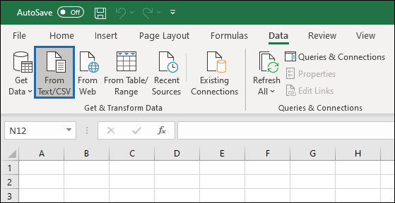

# <a name="export-configure-and-view-audit-log-records"></a>Exportar, configurar e exibir registros de log de auditoria

Depois de pesquisar o log de auditoria e baixar os resultados da pesquisa em um arquivo CSV, o arquivo contém uma coluna chamada **AuditData**, que contém informações adicionais sobre cada evento. Os dados nesta coluna são formatados como um objeto JSON, que contém várias propriedades configuradas como *property:value* pairs separados por vírgulas. Você pode usar o recurso de transformação JSON no Editor de Consulta do Power no Excel para dividir cada propriedade no objeto JSON na coluna **AuditData** em várias colunas para que cada propriedade tenha sua própria coluna. Isso permite classificar e filtrar uma ou mais dessas propriedades, o que pode ajudá-lo a localizar rapidamente os dados de auditoria específicos que você está procurando.

## <a name="step-1-export-audit-log-search-results"></a>Etapa 1: Exportar resultados da pesquisa de log de auditoria

A primeira etapa é pesquisar o log de auditoria e, em seguida, exportar os resultados em um arquivo CSV (valor separado por vírgula) para o computador local.
  
1. Execute uma [pesquisa de log de auditoria](search-the-audit-log-in-security-and-compliance.md#search-the-audit-log) e revise os critérios de pesquisa, se necessário, até que você tenha os resultados desejados.

2. Clique **em Exportar resultados** e selecione Baixar todos os **resultados.** 

   

   Essa opção para exportar todos os registros de auditoria da pesquisa de log de auditoria que você realizou na etapa 1 e baixa os dados brutos do log de auditoria para um arquivo CSV. 

   Uma mensagem é exibida na parte inferior da janela que solicita que você abra ou salve o arquivo CSV. 

3. Clique **em Salvar > Salvar como** e salve o arquivo CSV no computador local. Demora um pouco para baixar muitos resultados de pesquisa. Normalmente, esse é o caso ao pesquisar todas as atividades ou um amplo intervalo de datas. Uma mensagem na parte inferior das janelas é exibida quando o arquivo CSV termina de baixar.

   

> [!NOTE]
  > É possível baixar no máximo 50 mil entradas para um arquivo CSV de uma única pesquisa de logs de auditoria. Se 50 mil entradas forem baixadas para o arquivo CSV, você poderá supor que existem provavelmente mais de 50 mil eventos que corresponderam aos critérios de pesquisa. Para exportar mais do que esse limite, tente usar um intervalo de datas para reduzir o número de registros de log de auditoria. Talvez seja necessário executar várias pesquisas com intervalos de datas menores para exportar mais de 50 mil entradas.

## <a name="step-2-format-the-exported-audit-log-using-the-power-query-editor"></a>Etapa 2: Formatar o log de auditoria exportado usando o Editor de Consulta do Power

A próxima etapa é usar o recurso de transformação JSON no Editor de Consulta do Power no Excel para dividir cada propriedade no objeto JSON na coluna **AuditData** em sua própria coluna. Em seguida, filtre colunas para exibir registros com base nos valores de propriedades específicas. Isso pode ajudá-lo a localizar rapidamente os dados de auditoria específicos que você está procurando.

1. Abra uma planilha em branco no Excel para Office 365, Excel 2019 ou Excel 2016.

2. Na guia **Dados,** no grupo Obter & transformar **dados,** clique em **De Texto/CSV**.

    

3. Abra o arquivo CSV que você baixou na Etapa 1.

4. Na janela exibida, clique em **Transformar Dados.**

   

   O arquivo CSV é aberto no **Editor de Consulta**. Há quatro colunas: **CreationDate,** **UserIds,** **Operations** e **AuditData.** A **coluna AuditData** é um objeto JSON que contém várias propriedades. A próxima etapa é criar uma coluna para cada propriedade no objeto JSON.

5. Clique com o botão direito do mouse no título na coluna **AuditData,** clique em **Transformar** e clique em **JSON**. 

   

6. No canto superior direito da coluna **AuditData,** clique no ícone expandir.

   

   Uma lista parcial das propriedades nos objetos JSON na coluna **AuditData** é exibida.

7. Clique **em Carregar mais** para exibir todas as propriedades nos objetos JSON na coluna **AuditData.**

   

   Você pode desmarcar a caixa de seleção ao lado de qualquer propriedade que não queira incluir. Eliminar colunas que não são úteis para sua investigação é uma boa maneira de reduzir a quantidade de dados exibidos no log de auditoria. 

   > [!NOTE]
   > As propriedades JSON exibidas na captura de tela anterior (depois de clicar em Carregar mais **)** são baseadas nas propriedades encontradas na coluna **AuditData** das primeiras 1.000 linhas no arquivo CSV. Se houver propriedades JSON diferentes em registros após as primeiras 1.000 linhas, essas propriedades (e uma coluna correspondente) não serão incluídas quando a coluna **AuditData** for dividida em várias colunas. Para ajudar a evitar isso, considere executar a pesquisa de log de auditoria e restringir os critérios de pesquisa para que menos registros sejam retornados. Outra solução alternativa é filtrar itens na coluna Operações para reduzir o número de linhas (antes de executar a etapa 5 acima) antes de transformar o objeto JSON na coluna **AuditData.** 

   > [!TIP]
   > Para exibir um atributo em uma lista como AuditData.AffectedItems, clique no ícone Expandir no canto superior direito da coluna de onde você deseja puxar um atributo e selecione Expandir para Nova **Linha**.   A partir daí, ele será um  registro e você pode clicar no ícone Expandir no canto superior direito da coluna, exibir os atributos e selecionar o que você deseja exibir ou extrair.

8. Faça uma das seguintes coisas para formatar o título das colunas adicionadas para cada propriedade JSON selecionada.

    - Desmarque a caixa de seleção Usar nome da coluna original como **prefixo** para usar o nome da propriedade JSON como os nomes da coluna; por exemplo, **RecordType** ou **SourceFileName**.

    - Deixe a **caixa de seleção Usar nome da coluna original como prefixo** selecionada para adicionar o prefixo AuditData aos nomes das colunas; por exemplo, **AuditData.RecordType** ou **AuditData.SourceFileName**.

9. Clique em **OK**.

    A **coluna AuditData** é dividida em várias colunas. Cada nova coluna corresponde a uma propriedade no objeto JSON AuditData. Cada linha na coluna contém o valor da propriedade. Se a propriedade não conter um valor, o *valor nulo* será exibido. No Excel, células com valores nulos estão vazias.
  
10. Na guia **Home,** clique em **Fechar & Carregar** para fechar o Editor de Consulta do Power e abrir o arquivo CSV transformado em uma pasta de trabalho do Excel.

## <a name="use-powershell-to-search-and-export-audit-log-records"></a>Usar o PowerShell para pesquisar e exportar registros de log de auditoria

Em vez de usar a ferramenta de pesquisa de log de auditoria no Centro de Conformidade & segurança, você pode usar o cmdlet [Search-UnifiedAuditLog](https://docs.microsoft.com/powershell/module/exchange/search-unifiedauditlog) no PowerShell do Exchange Online para exportar os resultados de uma pesquisa de log de auditoria para um arquivo CSV. Em seguida, você pode seguir o mesmo procedimento descrito na Etapa 2 para formatar o log de auditoria usando o editor de Consulta do Power. Uma vantagem de usar o cmdlet do PowerShell é que você pode pesquisar eventos de um serviço específico usando o *parâmetro RecordType.* Aqui estão alguns exemplos de uso do PowerShell para exportar registros de auditoria para um arquivo CSV para que você possa usar o editor de Consulta do Power para transformar o objeto JSON na coluna **AuditData** conforme descrito na Etapa 2.

Neste exemplo, execute os comandos a seguir para retornar todos os registros relacionados às operações de compartilhamento do SharePoint.

```powershell
$auditlog = Search-UnifiedAuditLog -StartDate 06/01/2019 -EndDate 06/30/2019 -RecordType SharePointSharingOperation
```

```powershell
$auditlog | Select-Object -Property CreationDate,UserIds,RecordType,AuditData | Export-Csv -Path c:\AuditLogs\PowerShellAuditlog.csv -NoTypeInformation
```

Os resultados da pesquisa são exportados para um arquivo CSV chamado *PowerShellAuditlog* que contém quatro colunas: CreationDate, UserIds, RecordType, AuditData).

Você também pode usar o nome ou o valor de número para o tipo de registro como o valor do *parâmetro RecordType.* Para uma lista de nomes de tipos de registro e seus valores de número correspondentes, consulte a tabela *AuditLogRecordType* no esquema da API de Atividade de Gerenciamento [do Office 365](https://docs.microsoft.com/office/office-365-management-api/office-365-management-activity-api-schema#enum-auditlogrecordtype---type-edmint32).

Você só pode incluir um único valor para o *parâmetro RecordType.* Para pesquisar registros de auditoria para outros tipos de registro, você precisa executar os dois comandos anteriores novamente para especificar um tipo de registro diferente e anexar esses resultados ao arquivo CSV original. Por exemplo, você executaria os dois comandos a seguir para adicionar atividades de arquivo do SharePoint do mesmo intervalo de datas ao PowerShellAuditlog.csv arquivo.

```powershell
$auditlog = Search-UnifiedAuditLog -StartDate 06/01/2019 -EndDate 06/30/2019 -RecordType SharePointFileOperation
```

```powershell
$auditlog | Select-Object -Property CreationDate,UserIds,RecordType,AuditData | Export-Csv -Append -Path c:\AuditLogs\PowerShellAuditlog.csv -NoTypeInformation
```

## <a name="tips-for-exporting-and-viewing-the-audit-log"></a>Dicas para exportar e exibir o log de auditoria

Aqui estão algumas dicas e exemplos de exportação e exibição do log de auditoria antes e depois de usar o recurso de transformação JSON para dividir a coluna **AuditData** em várias colunas.

- Filtre a **coluna RecordType** para exibir apenas os registros de um serviço específico ou área funcional. Por exemplo, para mostrar eventos relacionados ao compartilhamento do SharePoint, você selecionaria **14** (o valor de número para registros disparados pelas atividades de compartilhamento do SharePoint). Para uma lista dos serviços que correspondem aos valores de número exibidos na coluna **RecordType,** consulte Propriedades detalhadas [no log de auditoria](detailed-properties-in-the-office-365-audit-log.md).

- Filtre **a coluna Operações** para exibir os registros para atividades específicas. Para ver uma lista da maioria das operações que correspondem a uma atividade pesquisável na ferramenta de pesquisa de & log de auditoria no Centro de Conformidade e Segurança, consulte a seção "Atividades auditadas" em Pesquisar o [log](search-the-audit-log-in-security-and-compliance.md#audited-activities)de auditoria no Centro de Conformidade & Segurança.
