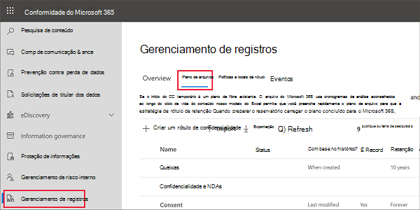
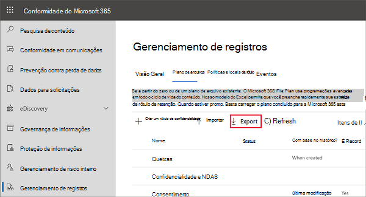
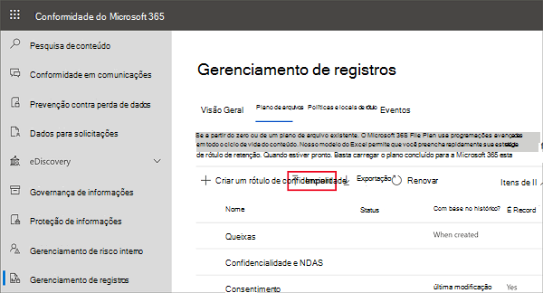

# Usar o plano de arquivos para gerenciar os rótulos de retenção

>*[Diretrizes de licenciamento do Microsoft 365 para segurança e conformidade](https://aka.ms/ComplianceSD).*

Embora você possa criar e gerenciar os rótulos de retenção da **Governança de informações** no Centro de Conformidade do Microsoft 365, o plano de arquivos do **Gerenciamento de registros** possui recursos de gerenciamento adicionais:

- Você pode criar rótulos de retenção em massa importando as informações relevantes de uma planilha.

- É possível exportar as informações de rótulos de retenção existentes para análise e colaboração offline ou para edição em massa.

- Mais informações sobre os rótulos de retenção são exibidas para facilitar a visualização em todas as configurações de todos os rótulos de retenção em um único modo de exibição.

- Os descritores do plano de arquivos oferecem informações adicionais e opcionais para cada rótulo.

O plano de arquivos pode ser usado em todos os rótulos de retenção, mesmo se o conteúdo não for marcado como um registro.

Para obter informações sobre quais são os rótulos de retenção e sobre como usá-los, confira [Saiba mais sobre as políticas e rótulos de retenção](retention.md).

## Acessar o plano de arquivos

Para acessar o plano de arquivos, é necessário ter uma das seguintes funções de administrador:
    
- Gerenciador de Retenção

- Gerenciador de Retenção somente exibição

No Centro de Conformidade do Microsoft 365, vá para **Soluções** > **Gerenciamento de Registros** > **Plano de Arquivos**. 

Se o **Gerenciamento de registros** não for exibido no painel de navegação, primeiro role para baixo e selecione **Mostrar tudo**.

## Navegar pelo plano de arquivos

Se já criou os rótulos de retenção da **governança de informações** no Centro de Conformidade do Microsoft 365, esses rótulos serão exibidos automaticamente no seu plano de arquivos. 

Da mesma forma, se você criar rótulos de retenção no plano de arquivos, eles também estarão disponíveis na **governança de informações** se os rótulos não estiverem configurados para marcar o conteúdo como um registro.

Todos os rótulos com seu status e configurações, descritores de plano de arquivos opcional, opção de exportação para analisar ou habilitar análises offline dos rótulos e uma opção de importação para criar rótulos de retenção são exibidos na página **Plano de arquivos**. 

### Colunas de configurações de rótulo

Todas as colunas, exceto **Nome** do rótulo, podem ser exibidas ou ocultas selecionando a opção **Personalizar colunas**. No entanto, por padrão, as primeiras colunas exibem informações sobre o status do rótulo e suas configurações: 

- **Status** identifica se o rótulo está incluído em uma política de rótulo ou uma política de aplicação automática (**Ativo**) ou não (**Inativo**).

- **Com base em** identifica como ou quando o período de retenção é iniciado. Valores válidos:
    - Evento
    - Data de criação
    - Última modificação
    - Data do rótulo

- **É registro** identifica se o item é marcado como um registro quando o rótulo é aplicado. Valores válidos:
    - Não
    - Sim

- **Duração da retenção** identifica o período de retenção. Valores válidos:
    - Dias
    - Meses
    - Anos
    - Permanentemente
    - Nenhum

- **Tipo de disposição** identifica o que acontecerá com o conteúdo no final do período de retenção. Valores válidos:
    - Nenhuma ação
    - Excluir automaticamente
    - Revisão necessária

### Colunas descritoras do plano de arquivos

O plano de arquivos permite incluir mais informações como parte dos rótulos de retenção. Esses descritores de plano de arquivos fornecem mais opções para melhorar a capacidade de gerenciamento e organização do conteúdo que precisa ser rotulado.

Por padrão, começando com a **ID de referência**, as próximas colunas mostram esses descritores de plano de arquivos que você pode especificar ao criar um rótulo de retenção ou editar um rótulo existente. 

Para começar, há alguns valores prontos para os seguintes descritores de plano de arquivos: 
- Função/departamento de negócios
- Categoria
- Tipo de autoridade
- Provisão/citação 

Exemplo de descritores de plano de arquivos ao criar ou editar um rótulo de retenção:

Imagem de exemplo das colunas descritoras de plano de arquivos:

## Exportar todos os rótulos de retenção para analisar ou habilitar revisões offline

No plano de arquivos, você pode exportar os detalhes de todos os rótulos de retenção para um arquivo .csv, para ajudá-lo a facilitar as avaliações de conformidade periódicas com os participantes de governança de dados na sua organização.

Para exportar todos os rótulos de retenção: acesse a página **Plano de arquivos** e clique em **Exportar**:

Um arquivo *.csv com todos os rótulos de retenção existentes é aberto. Por exemplo:

## Importar rótulos de retenção ao seu plano de arquivo

No plano de arquivos, você pode importar em massa novos rótulos de retenção e usar o mesmo método para modificar em massa rótulos de retenção existentes.

Para importar novos rótulos de retenção e modificar os rótulos de retenção existentes: 

1. Na página **Plano de arquivos**, clique em **Importar** para usar a página **Preencher e importar o plano de arquivo**:

   

   

2. Baixe um modelo em branco para importar novos rótulos de retenção. Como alternativa, você pode começar com o arquivo .csv que é exportado ao exportar os rótulos de retenção existentes na sua organização.

   

3. Preencha o modelo usando as seguintes informações que descrevem as propriedades e os valores válidos para cada propriedade. Para importação, cada valor tem um comprimento máximo de 64 caracteres.  

   |Propriedade|Tipo|Valores válidos|
   |:-----|:-----|:-----|
   |LabelName|String|Esta propriedade especifica o nome do rótulo de retenção.|
   |Comentário|String|Use esta propriedade para adicionar uma descrição sobre o rótulo de retenção aos administradores. Esta descrição é exibida apenas aos administradores que gerenciam o rótulo de retenção no centro de conformidade.|
   |Observações|String|Use esta propriedade para adicionar uma descrição sobre o rótulo de retenção aos usuários. Esta descrição é exibida quando os usuários passam o mouse sobre o rótulo em aplicativos como Outlook, SharePoint e OneDrive. Se você deixar esta propriedade em branco, uma descrição padrão será exibida, o que explica as configurações de retenção do rótulo. |
   |IsRecordLabel|Cadeia de caracteres|Esta propriedade especifica se o rótulo marca o conteúdo como um registro. Os valores válidos são:  **TRUE**: o rótulo marca o item como um registro e resultado. O item não pode ser excluído.  **FALSE**: o rótulo não marca o conteúdo como um registro. Esse é o valor padrão.|
   |RetentionAction|String|Essa propriedade especifica qual ação executar após o valor especificado pela propriedade RetentionDuration expirar. Os valores válidos são:  **Excluir**: os itens anteriores ao valor especificado pela propriedade RetentionDuration são excluídos. **Manter**: manter os itens da duração especificada pela propriedade RetentionDuration e, em seguida, não faça nada quando o período de duração expirar.  **Manter**: manter os itens da duração especificada pela propriedade RetentionDuration e os exclua quando o período de duração expirar.   |
   |RetentionDuration|String|Esta propriedade especifica o número de dias para reter o conteúdo. Os valores válidos são:  **Ilimitado**: os itens serão retidos indefinidamente.  ***n***: um número inteiro positivo; por exemplo, **365**. 
   |RetentionType|Cadeia de caracteres|Esta propriedade especifica se a duração da retenção é calculada a partir da data de criação do conteúdo, data do evento, data rotulada ou data da última modificação. Os valores válidos são:  **CreationAgeInDays** **EventAgeInDays** **TaggedAgeInDays** **ModificationAgeInDays** |
   |ReviewerEmail|SmtpAddress|Quando esta propriedade é preenchida, uma revisão de disposição será acionada quando a duração da retenção expirar. Essa propriedade especifica o endereço de e-mail de um revisor para as ações de retenção **KeepAndDelete**. Você pode incluir o endereço de email de usuários individuais, grupos de distribuição ou de segurança. Você pode especificar vários endereços de email separados por ponto e vírgula.|
   |ReferenceId|Cadeia de caracteres|Esta propriedade especifica o valor que é exibido no descritor de plano de arquivos do **ID de referência**, que pode ser usado como um valor único da sua organização.| 
   |DepartmentName|String|Esta propriedade especifica o valor que é exibido no descritor de planos de arquivo **Função/departamento**.|
   |Categoria|String|Esta propriedade especifica o valor que é exibido no descritor de planos de arquivo **Categoria**.|
   |SubCategory|String|Esta propriedade especifica o valor que é exibido no descritor de planos de arquivo **Subcategoria**.|
   |AuthorityType|String|Esta propriedade especifica o valor que é exibido no descritor de planos de arquivo **Tipo de autoria**.|
   |CitationName|Cadeia de caracteres|Esta propriedade especifica o nome exibido no descritor de planos de arquivos **Provisão/citação**. Por exemplo, a “Lei Sarbanes-Oxley de 2002”. |
   |CitationUrl|String|Esta propriedade especifica o valor que é exibido no descritor de planos de arquivo **Tipo de autoria**.|
   |CitationJurisdiction|Cadeia de caracteres|Esta propriedade especifica a jurisdição ou agência exibida no descritor de planos de arquivos **Provisão/citação**. Por exemplo, “Comissão de Títulos e Câmbio dos Estados Unidos (SEC)”.|
   |Regulatório|String|Deixar em branco. Esta propriedade não é usada nesse momento.|
   |EventType|String|Esta propriedade especifica a regra de retenção associada ao rótulo. É possível usar qualquer valor que identifique a regra com exclusividade. Por exemplo: **Nome** **Nome diferenciado (DN)** **GUID**  Você pode usar o cmdlet [Get-RetentionComplianceRule](https://docs.microsoft.com/powershell/module/exchange/get-retentioncompliancerule?view=exchange-ps) para exibir as regras de retenção disponíveis. Observe que, como os valores EventType são únicos de uma organização, se você exportar rótulos de uma organização, não poderá usar os valores da propriedade EventType dessa organização ao importar rótulos para uma organização diferente.|
   |||

   Veja um exemplo do modelo que contém as informações sobre rótulos de retenção.

   

4. Na etapa 3 na página **Preencher e importar o plano de arquivos**, clique em **Procurar arquivos** para carregar o modelo preenchido. 

   O plano de arquivos valida as entradas e exibe as estatísticas de importação.

   

   Se houver um erro de validação, a importação do plano de arquivos continuará a validar todas as entradas no arquivo de importação e exibirá todos os erros que fazem referência aos números de linha e fileira no arquivo de importação. Copie os resultados de erros exibidos para poder corrigi-los quando retornar ao arquivo de importação.

Quando a importação estiver concluída, é possível adicionar os rótulos de retenção a uma nova política de rótulo de retenção ou aplicá-los automaticamente. Você pode fazer isso diretamente na página **Plano de arquivos** selecionando a lista suspensa **+ Criar um rótulo** e, em seguida, clicar em **Política para publicar os rótulos**ou em **Política para aplicar automaticamente um rótulo**.

## Próximas etapas

Para obter mais informações sobre como criar e editar rótulos de retenção e suas políticas, veja a seguinte orientação:
- [Criar rótulos de retenção e aplicá-los em aplicativos](create-apply-retention-labels.md)
- [Aplicar um rótulo de retenção automaticamente ao conteúdo](apply-retention-labels-automatically.md)
