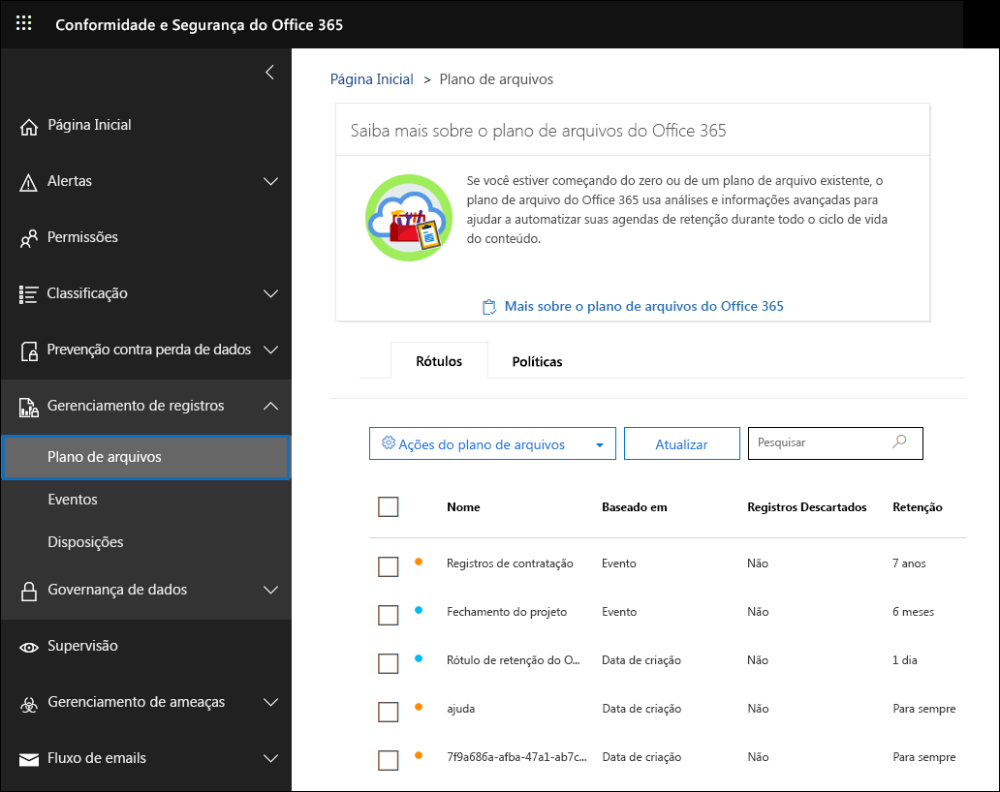
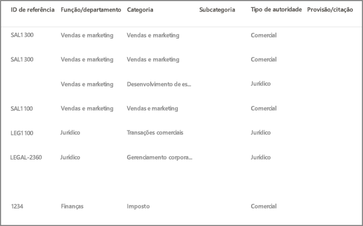
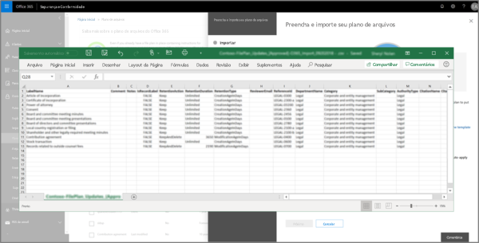
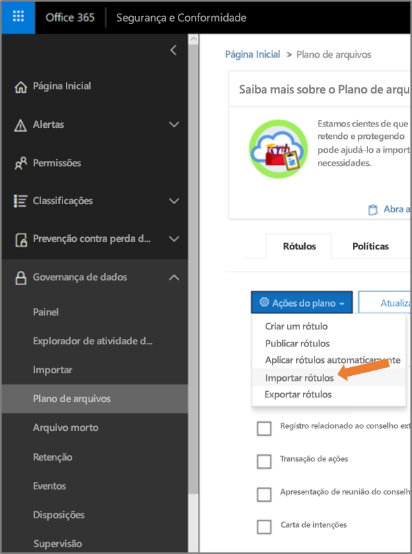
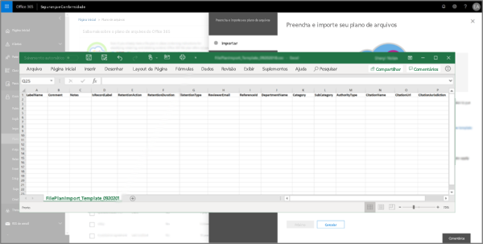
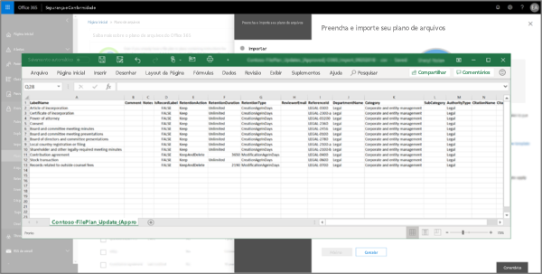
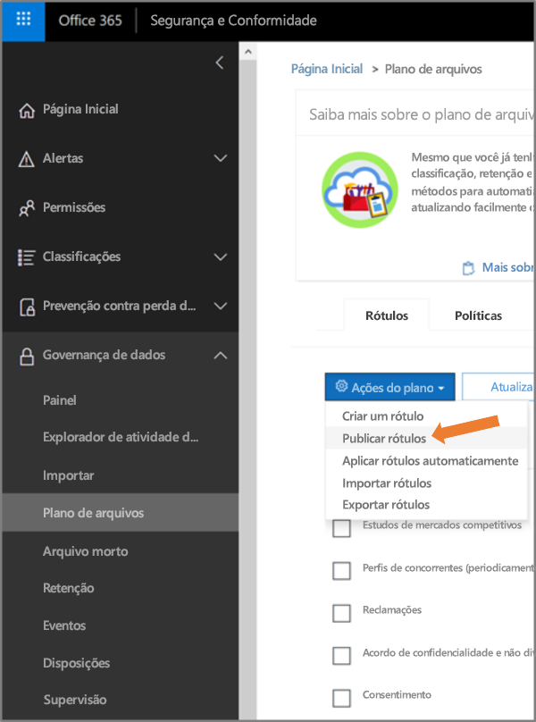

# Visão geral do gerenciador de planos de arquivoOverview of file plan manager

O gerenciador de plano de arquivos fornece recursos avançados de gerenciamento para rótulos de retenção, políticas de rótulo de retenção e oferece uma maneira integrada de percorrer as atividades de rótulos e rótulo para conteúdo durante todo o ciclo de vida do conteúdo - desde a criação até a colaboração, declaração de registro, retenção e disposição final.File plan manager provides advanced management capabilities for retention labels, retention label policies, and provides an integrated way to traverse label and label-to-content activity for your entire content lifecycle – from creation, through collaboration, record declaration, retention, and finally disposition. 

Para acessar o Gerenciador de planos de arquivos no centro de segurança e conformidade, acesse **Gerenciamento de registros** > **Plano de arquivos**.To access file plan manager in the security and compliance center, go to **Records management** > **File plan**.

## Acessar o gerenciador de planos de arquivoAccessing file plan manager

Há dois requisitos para acessar o gerenciador de planos de arquivo, que são:There are two requirements to access file plan manager, they are:

- Uma assinatura do Office 365 Enterprise E5.An Office 365 Enterprise E5 subscription.

- O usuário recebeu uma das seguintes funções no Centro de segurança e conformidade:The user has been in assigned one of the following roles in the security and compliance center:
    
    - Gerenciador de RetençãoRetention Manager
    
    - Gerenciador de Retenção somente exibiçãoView-only Retention Manager

## Rótulos de retenção e política de rótulos padrãoDefault retention labels and label policy

Se não houver rótulos de retenção na Central de Conformidade e Segurança, na primeira vez que você escolher **Planejamento de Arquivos** na navegação à esquerda, será criada uma política de rótulo chamada **Política Padrão de Publicação de Governança de Dados**.If there are no retention labels in the Security & Compliance Center, the first time you choose **File plan** in the left nav, this creates a label policy called **Default Data Governance Publishing Policy**. 

Esta política de rótulo contém três etiquetas de retenção:This label policy contains three retention labels:

- **Procedimento operacional****Operational procedure**
- **Geral de negócios****Business general**
- **Contrato****Contract agreement**

Estes rótulos de retenção estão configurados apenas para reter conteúdo, e não para excluir conteúdo.These retention labels are configured only to retain content, not delete content. Esta política de rótulos será publicada para toda a organização e poderá ser desativada ou removida.This label policy will be published to the entire organization and can be disabled or removed. 

Você pode determinar quem abriu o gerenciador de planejamento de arquivos e iniciou a primeira experiência de execução examinando as atividades **Política de retenção criada** e **Configuração de retenção criada para uma política de retenção** no log de auditoria.You can determine who opened file plan manager and kicked off the first-run experience by reviewing the audit log for the activities **Created retention policy** and **Created retention configuration for a retention policy**.

> [!NOTE]
> Devido aos comentários dos clientes, removemos esse recurso que cria a política de rótulos de retenção e os rótulos de retenção padrão mencionados acima.Due to customer feedback, we have removed this feature that creates the default retention labels and retention label policy mentioned above. Você só verá os rótulos de retenção e a política de rótulos de retenção caso tenha aberto o gerenciador de planos de arquivo antes de 11 de abril de 2019.You will only see these retention labels and retention label policy if you opened file plan manager before April 11, 2019.

## Navegar pelo plano de arquivoNavigating your file plan

O gerente de plano de arquivo torna mais fácil ver todas as configurações dos seus rótulos e políticas de retenção no mesmo modo de exibição.File plan manager makes it easier see into and across the settings of all your retention labels and policies from one view.

Observe que os rótulos de retenção criados fora do plano de arquivamento estarão disponíveis no plano de arquivamento e vice-versa.Note that retention labels created outside of the file plan will be available in the file plan and vice versa.

Na guia \*\*Rótulos \*\* do plano de arquivo, as seguintes informações e recursos adicionais estão disponíveis:On the file plan **Labels** tab, the following additional information and capabilities are available:

### Colunas de configurações de rótuloLabel settings columns

- **Com base em** identifica o tipo de gatilho que iniciará o período de retenção. Os valores válidos estão:**Based on** identifies the type of trigger that will start the retention period. Valid values are:
    - EventoEvent
    - Data de criaçãoWhen created
    - Data da última modificaçãoWhen last modified
    - Data do rótuloWhen labeled
- **Registro** identifica se o item se tornará um registro declarado quando o rótulo for aplicado. Os valores válidos são:**Record** identifies if the item will become a declared record when the label is applied. Valid values are:
    - NãoNo
    - SimYes
    - Sim (Regulatório)Yes(Regulatory)
- **Retenção** identifica o tipo de retenção. Os valores válidos são:**Retention** identifies the retention type. Valid values are:
    - ManterKeep
    - Manter e excluirKeep and delete
    - ExcluirDelete
- **Descarte** identifica o que acontecerá com o conteúdo no final do período de retenção. Os valores válidos são:**Disposition** identifies what will happen to the content at the end of the retention period. Valid values are:
    - nullnull
    - Nenhuma açãoNo action
    - Excluir automaticamenteAuto-delete
    - Revisão obrigatória (também conhecida como revisão de descarte)Review required (aka Disposition review)

### Colunas dos descritores de planos de arquivo do rótulo de retençãoRetention label file plan descriptors columns

Você já pode incluir mais informações na configuração dos seus rótulos de retenção.You can now include more information in the configuration of your retention labels. A inserção dos descritores de planos de arquivo em rótulos de retenção melhorará a capacidade de gerenciamento e a organização do seu plano de arquivo.Inserting file plan descriptors into retention  labels will improve the manageability and organization of your file plan.

Para começar, o gerenciador de planos de arquivo fornece alguns valores prontos de origem para: Função/departamento, Categoria, Tipo de autoridade e Provisão/citação.To get you started, file plan manager provides some out-of-box values for: Function/department, Category, Authority type and Provision/citation. Você pode adicionar novos valores de descritor de planos de arquivo ao criar ou editar um rótulo de retenção.You can add new file plan descriptor values when creating or editing a retention label. Você também pode especificar os descritores de planos de arquivo ao importar rótulos de retenção para o plano de arquivo.You can also specify file plan descriptors when importing retention labels into your file plan. 

Aqui está uma visão geral da etapa de descritores de plano de arquivo ao criar ou editar um rótulo de retenção.Here's a view of the file plan descriptors step when creating or editing a retention label.

Aqui está uma visão das colunas dos descritores dos planos de arquivo na guia **Rótulos** do gerenciador de planos de arquivo.Here's a view of the file plan descriptors columns on the **Labels** tab of file plan manager.

## Exportar todos os rótulos de retenção existentes para analisar e/ou executar revisões offlineExport all existing retention labels to analyze and/or perform offline reviews

No gerenciador de planos de arquivo, você pode exportar os detalhes de todos os rótulos de retenção para um arquivo .csv, para ajudá-lo a facilitar as avaliações de conformidade periódicas com os participantes de governança de dados na sua organização.From file plan manager, you can export the details of all retention labels into a .csv file to assist you in facilitating periodic compliance reviews with data governance stakeholders in your organization.

Para exportar todos os rótulos de retenção: acesse a página **Plano de arquivo**, **Ações dos planos de arquivo**\> **Exportar rótulos**.To export all retention labels: On the **File plan** page, **File plan actions** \> **Export labels**.

Um arquivo \*.csv que contém todos os rótulos de retenção existentes será aberto.A \*.csv file containing all existing retention labels will open.

## Importar rótulos de retenção ao seu plano de arquivoImport retention labels into your file plan

No Gerenciador de planos de arquivo, você pode importar em massa novos rótulos de retenção, bem como modificar rótulos de retenção existentes.In the File plan manager, you can bulk import new retention labels and modify existing retention labels.

Para importar novos rótulos de retenção e modificar os rótulos de retenção existentes:To import new retention labels and modify existing retention labels: 

1. Na página **Plano de arquivo**, acesse **Importar rótulos das** > **Ações dos planos de arquivo**.On the **File plan** page, go to **File plan actions** > **Import labels**.

   

   

2. Baixe um modelo em branco para importar novos rótulos de retenção.Download a blank template to import new retention labels. Como alternativa, você pode começar com o arquivo .csv que é exportado ao exportar os rótulos de retenção existentes na sua organização.Alternatively, you can start with the .csv file that is exported when you export the existing retention labels in your organization.

   

3. Preencher o modelo.Fill-out the template. A seguir, são descritas as propriedades e os valores válidos para cada propriedade no modelo de planos de arquivo.The following describes the properties and valid values for each property in the file plan template. 

   |**Propriedade****Property**|**Tipo****Type**|**Valores válidos****Valid values**|
   |:-----|:-----|:-----|
   |LabelNameLabelName|StringString|Esta propriedade especifica o nome do rótulo de retenção.This property specifies the name of the retention label.|
   |ComentárioComment|StringString|Use esta propriedade para adicionar uma descrição sobre o rótulo de retenção aos administradores.Use this property to add a description about the retention label for admins. Esta descrição é exibida apenas aos administradores que gerenciam o rótulo no centro de segurança e conformidade.This description appears only to admins who manage the label in the security and compliance center.|
   |ObservaçõesNotes|StringString|Use esta propriedade para adicionar uma descrição sobre o rótulo de retenção aos usuários.Use this property to add a description about the retention label for users. Esta descrição é exibida quando os usuários passam o mouse sobre o rótulo em aplicativos como Outlook, SharePoint e OneDrive.This description appears when users hover over the label in apps like Outlook, SharePoint, and OneDrive. Se você deixar esta propriedade em branco, uma descrição padrão será exibida, o que explica as configurações de retenção do rótulo.If you leave this property blank, a default description is displayed, which explains the label's retention settings. |
   |IsRecordLabelIsRecordLabel|StringString|Esta propriedade especifica se o rótulo é um rótulo de registro.This property specifies whether the label is a record label. Os itens marcados com um rótulo de registro são declarados como registros.Items tagged with a record label are declared as records. Os valores válidos são:Valid values are: **VERDADEIRO**: o rótulo é um rótulo de registro.**TRUE**: The label is a record label. Observe que os itens declarados como um registro não podem ser excluídos.Note that items that are declared as a record can't be deleted.  **FALSO**: o rótulo não é um rótulo de registro.**FALSE**: The label isn't a record label. Esse é o valor padrão.This is the default value.|
   |RetentionActionRetentionAction|StringString|Essa propriedade especifica qual ação executar após o valor especificado pela propriedade RetentionDuration expirar.This property specifies what action to take after the value specified by the RetentionDuration property expires. Os valores válidos são:Valid values are: **Excluir**: os itens anteriores ao valor especificado pela propriedade RetentionDuration são excluídos.**Delete**: Items older than the value specified by the RetentionDuration property are deleted. **Manter**: manter os itens da duração especificada pela propriedade RetentionDuration e, em seguida, não faça nada quando o período de duração expirar.**Keep**: Retain items for the duration specified by the RetentionDuration property and then doing nothing when the duration period expires.  **Manter**: manter os itens da duração especificada pela propriedade RetentionDuration e os exclua quando o período de duração expirar.**KeepAndDelete**: Retain items for the duration specified by the RetentionDuration property and then delete them when the duration period expires.   |
   |RetentionDurationRetentionDuration|StringString|Esta propriedade especifica o número de dias para reter o conteúdo.This property specifies the number of days to retain the content. Os valores válidos são:Valid values are: **Ilimitado**: os itens serão retidos indefinidamente.**Unlimited**: Items will be retained indefinitely.  ***n***: um número inteiro positivo; por exemplo, **365**.***n***: A positive integer; for example, **365**. 
   |RetentionTypeRetentionType|StringString|Esta propriedade especifica se a duração da retenção é calculada a partir da data de criação do conteúdo, data do evento, data rotulada (marcada) ou data da última modificação.This property specifies whether the retention duration is calculated from the content creation date, event date, labeled (tagged) date, or last modified date. Os valores válidos são:Valid values are: **CreationAgeInDays****CreationAgeInDays** **EventAgeInDays****EventAgeInDays** **TaggedAgeInDays****TaggedAgeInDays** **ModificationAgeInDays****ModificationAgeInDays** |
   |ReviewerEmailReviewerEmail|SmtpAddressSmtpAddress|Quando esta propriedade é preenchida, uma revisão de disposição será acionada quando a duração da retenção expirar.When this property is populated, a disposition review will be triggered when the retention duration expires. Esta propriedade especifica o endereço de email de um revisor para as ações de retenção **Excluir** e **KeepAndDelete** .This property specifies the email address of a reviewer for **Delete** and **KeepAndDelete** retention actions. Você pode incluir o endereço de email de usuários individuais, grupos de distribuição ou segurança ou grupos do Office 365.You can include the email address of individual users, distribution or security groups, or Office 365 groups. Você pode especificar vários endereços de email separados por vírgulas.You can specify multiple email addresses separated by commas.|
   |ReferenceIdReferenceId|StringString|Esta propriedade especifica o valor que é exibido no descritor de planos de arquivo **ID de referência**.This property specifies the value that's displayed in the **Reference Id** file plan descriptor.| 
   |DepartmentNameDepartmentName|StringString|Esta propriedade especifica o valor que é exibido no descritor de planos de arquivo **Função/departamento**.This property specifies the value that's displayed in the **Function/department** file plan descriptor.|
   |CategoriaCategory|StringString|Esta propriedade especifica o valor que é exibido no descritor de planos de arquivo **Categoria**.This property specifies the value that's displayed in the **Category** file plan descriptor.|
   |SubCategorySubCategory|StringString|Esta propriedade especifica o valor que é exibido no descritor de planos de arquivo **Subcategoria**.This property specifies the value that's displayed in the **Sub category** file plan descriptor.|
   |AuthorityTypeAuthorityType|StringString|Esta propriedade especifica o valor que é exibido no descritor de planos de arquivo **Tipo de autoria**.This property specifies the value that's displayed in the **Authority type** file plan descriptor.|
   |CitationNameCitationName|StringString|Esta propriedade especifica o nome da citação exibida no descritor de planos de arquivo **Provisão/citação**, por exemplo, "Sarbanes-Oxley Lei ou 2002".This property specifies the name of the citation displayed in the **Provision/citation** file plan descriptor; for example "Sarbanes-Oxley Act or 2002". |
   |CitationUrlCitationUrl|StringString|Esta propriedade especifica o valor que é exibido no descritor de planos de arquivo **Tipo de autoria**.This property specifies the URL that's displayed in the **Provision/citation** file plan descriptor.|
   |CitationJurisdictionCitationJurisdiction|StringString|Esta propriedade especifica a jurisdição ou órgão que é exibida no descritor de plano **Provisão/citação**, por exemplo, "Comissão de Valores Mobiliários dos EUA (SEC)".This property specifies the jurisdiction or agency that's displayed in the **Provision/citation** file plan descriptor; for example, "U.S. Securities and Exchange Commission (SEC)".|
   |RegulatórioRegulatory|StringString|Deixar em branco.Leave blank. Esta propriedade não é usada nesse momento.This property isn't used at this time.|
   |EventTypeEventType|StringString|Esta propriedade especifica a regra de retenção associada ao rótulo.This property specifies the retention rule that's associated with the label. É possível usar qualquer valor que identifique a regra com exclusividade.You can use any value that uniquely identifies the rule. Por exemplo:For example: **Nome****Name** **Nome diferenciado (DN)****Distinguished name (DN)** **GUID****GUID**  Você pode usar o cmdlet [Get-RetentionComplianceRule](https://docs.microsoft.com/powershell/module/exchange/policy-and-compliance-retention/get-retentioncompliancerule?view=exchange-ps) para exibir as regras de retenção disponíveis.You can use the [Get-RetentionComplianceRule](https://docs.microsoft.com/powershell/module/exchange/policy-and-compliance-retention/get-retentioncompliancerule?view=exchange-ps) cmdlet to view the available retention rules. Observe que, se você exportar rótulos de uma organização do Office 365, não poderá usar os valores da propriedade EventType dessa organização ao importar rótulos para uma organização diferente do Office 365.Note that if you export labels from one Office 365 organization, you can't use the values for the EventType  property from that organization when importing labels to a different Office 365 organization. Isso porque os valores de EventType são exclusivos de uma organização.That because the EventType values are unique to an organization. |
   |||

   Veja um exemplo do modelo que contém as informações sobre rótulos de retenção.Here's an example the template containing the information about retention labels.

   

4. Na etapa 3 na página do assistente da importação de planos de arquivo, clique em **Procurar arquivos** para carregar o modelo preenchido.Under step 3 on the import file plan wizard page, click **Browse for files** to upload the filled-out template. 

   O gerenciador do plano de arquivos validará as entradas e exibirá as estatísticas de importação.File plan manager will validate the entries and display the import statistics.

   

   Caso haja um erro de validação, a importação dos planos de arquivos continuarão validando todas as entradas no arquivo de importação e exibirão todos os erros referentes aos números de linha/fila no arquivo de importação, copie os resultados do erro exibidos para que você possa retornar facilmente ao arquivo de importação e corrigir os erros.In the event there is a validation error, file plan import will continue to validate every entry in the import file and display all errors referencing line/row numbers in the import file, copy the displayed error results so that you can easily return to the import file and correct the errors.

5. Quando a importação estiver concluída, retorne ao gerenciador de plano de arquivos para associar os novos rótulos de retenção a políticas novas ou existentes.When the import is complete, return to file plan manager to associate the new retention labels to new or existing retention label policies.

   
