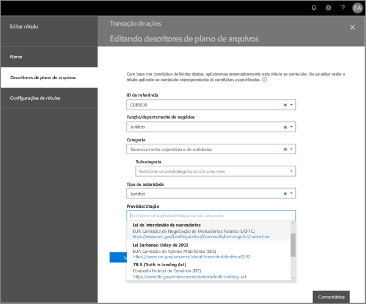
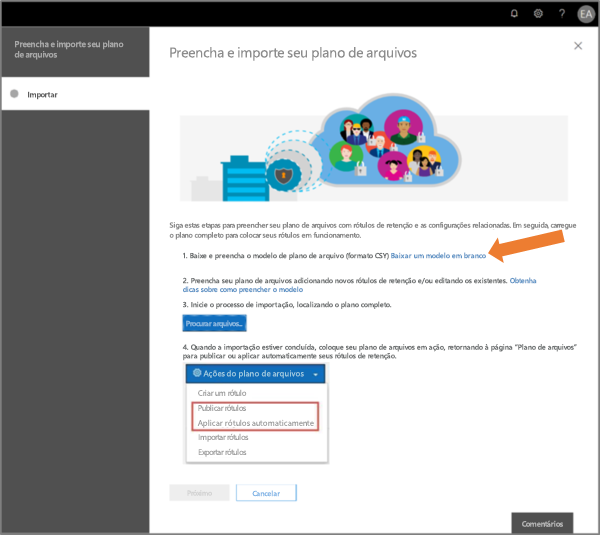

# Visão geral do gerenciador de planos de arquivo

>*[Diretrizes de licenciamento do Microsoft 365 para segurança e conformidade](https://aka.ms/ComplianceSD).*

O gerenciador de planos de arquivo fornece recursos avançados de gerenciamento de políticas e rótulos de retenção, políticas de rótulos de retenção e oferece uma maneira integrada de percorrer a atividade de rótulos e de rótulo para conteúdo para todo o seu ciclo de vida de conteúdo, desde a criação à colaboração, declaração de registros, retenção e por fim, à disposição. 

Para acessar o Gerenciador de planos de arquivos no centro de segurança e conformidade, acesse **Gerenciamento de registros** > **Plano de arquivos**.

## Acessar o gerenciador de planos de arquivo

Para acessar o gerenciador do plano de arquivos, você deve ter uma das seguintes funções de administrador:
    
- Gerenciador de Retenção

- Gerenciador de Retenção somente exibição

## Rótulos de retenção e política de rótulos padrão

Se não houver rótulos de retenção na Central de Conformidade e Segurança, na primeira vez que você escolher **Planejamento de Arquivos** na navegação à esquerda, será criada uma política de rótulo chamada **Política Padrão de Publicação de Governança de Dados**. 

Esta política de rótulo contém três etiquetas de retenção:

- **Procedimento operacional**
- **Geral de negócios**
- **Contrato**

Estes rótulos de retenção estão configurados apenas para reter conteúdo, e não para excluir conteúdo. Esta política de rótulos será publicada para toda a organização e poderá ser desativada ou removida. 

Você pode determinar quem abriu o gerenciador de planejamento de arquivos e iniciou a primeira experiência de execução examinando as atividades **Política de retenção criada** e **Configuração de retenção criada para uma política de retenção** no log de auditoria.

> [!NOTE]
> Devido aos comentários dos clientes, removemos esse recurso que cria a política de rótulos de retenção e os rótulos de retenção padrão mencionados acima. Você só verá os rótulos de retenção e a política de rótulos de retenção caso tenha aberto o gerenciador de planos de arquivo antes de 11 de abril de 2019.

## Navegar pelo plano de arquivo

O gerente de plano de arquivo torna mais fácil ver todas as configurações dos seus rótulos e políticas de retenção no mesmo modo de exibição.

Observe que os rótulos de retenção criados fora do plano de arquivamento estarão disponíveis no plano de arquivamento e vice-versa.

Na guia **Rótulos ** do plano de arquivo, as seguintes informações e recursos adicionais estão disponíveis:

### Colunas de configurações de rótulo

- **Com base em** identifica o tipo de gatilho que iniciará o período de retenção. Os valores válidos estão:
    - Evento
    - Data de criação
    - Data da última modificação
    - Data do rótulo
- **Registro** identifica se o item se tornará um registro declarado quando o rótulo for aplicado. Os valores válidos são:
    - Não
    - Sim
    - Sim (Regulatório)
- **Retenção** identifica o tipo de retenção. Os valores válidos são:
    - Manter
    - Manter e excluir
    - Excluir
- **Descarte** identifica o que acontecerá com o conteúdo no final do período de retenção. Os valores válidos são:
    - null
    - Nenhuma ação
    - Excluir automaticamente
    - Revisão obrigatória (também conhecida como revisão de descarte)

### Colunas dos descritores de planos de arquivo do rótulo de retenção

Você já pode incluir mais informações na configuração dos seus rótulos de retenção. A inserção dos descritores de planos de arquivo em rótulos de retenção melhorará a capacidade de gerenciamento e a organização do seu plano de arquivo.

Para começar, o gerenciador de planos de arquivo fornece alguns valores prontos de origem para: Função/departamento, Categoria, Tipo de autoridade e Provisão/citação. Você pode adicionar novos valores de descritor de planos de arquivo ao criar ou editar um rótulo de retenção. Você também pode especificar os descritores de planos de arquivo ao importar rótulos de retenção para o plano de arquivo. 

Aqui está uma visão geral da etapa de descritores de plano de arquivo ao criar ou editar um rótulo de retenção.

Aqui está uma visão das colunas dos descritores dos planos de arquivo na guia **Rótulos** do gerenciador de planos de arquivo.

## Exportar todos os rótulos de retenção existentes para analisar e/ou executar revisões offline

No gerenciador de planos de arquivo, você pode exportar os detalhes de todos os rótulos de retenção para um arquivo .csv, para ajudá-lo a facilitar as avaliações de conformidade periódicas com os participantes de governança de dados na sua organização.

Para exportar todos os rótulos de retenção: acesse a página **Plano de arquivo**, **Ações dos planos de arquivo**\> **Exportar rótulos**.

Um arquivo *.csv que contém todos os rótulos de retenção existentes será aberto.

## Importar rótulos de retenção ao seu plano de arquivo

No Gerenciador de planos de arquivo, você pode importar em massa novos rótulos de retenção, bem como modificar rótulos de retenção existentes.

Para importar novos rótulos de retenção e modificar os rótulos de retenção existentes: 

1. Na página **Plano de arquivo**, acesse **Importar rótulos das** > **Ações dos planos de arquivo**.

   

   

2. Baixe um modelo em branco para importar novos rótulos de retenção. Como alternativa, você pode começar com o arquivo .csv que é exportado ao exportar os rótulos de retenção existentes na sua organização.

   

3. Preencher o modelo. A seguir, são descritas as propriedades e os valores válidos para cada propriedade no modelo de planos de arquivo. Para importação, cada valor tem um comprimento máximo de 64 caracteres.  

   |**Propriedade**|**Tipo**|**Valores válidos**|
   |:-----|:-----|:-----|
   |LabelName|String|Esta propriedade especifica o nome do rótulo de retenção.|
   |Comentário|String|Use esta propriedade para adicionar uma descrição sobre o rótulo de retenção aos administradores. Esta descrição é exibida apenas aos administradores que gerenciam o rótulo no centro de segurança e conformidade.|
   |Observações|String|Use esta propriedade para adicionar uma descrição sobre o rótulo de retenção aos usuários. Esta descrição é exibida quando os usuários passam o mouse sobre o rótulo em aplicativos como Outlook, SharePoint e OneDrive. Se você deixar esta propriedade em branco, uma descrição padrão será exibida, o que explica as configurações de retenção do rótulo. |
   |IsRecordLabel|String|Esta propriedade especifica se o rótulo é um rótulo de registro. Os itens marcados com um rótulo de registro são declarados como registros. Os valores válidos são: **VERDADEIRO**: o rótulo é um rótulo de registro. Observe que os itens declarados como um registro não podem ser excluídos.  **FALSO**: o rótulo não é um rótulo de registro. Esse é o valor padrão.|
   |RetentionAction|String|Essa propriedade especifica qual ação executar após o valor especificado pela propriedade RetentionDuration expirar. Os valores válidos são: **Excluir**: os itens anteriores ao valor especificado pela propriedade RetentionDuration são excluídos. **Manter**: manter os itens da duração especificada pela propriedade RetentionDuration e, em seguida, não faça nada quando o período de duração expirar.  **Manter**: manter os itens da duração especificada pela propriedade RetentionDuration e os exclua quando o período de duração expirar.   |
   |RetentionDuration|String|Esta propriedade especifica o número de dias para reter o conteúdo. Os valores válidos são: **Ilimitado**: os itens serão retidos indefinidamente.  ***n***: um número inteiro positivo; por exemplo, **365**. 
   |RetentionType|String|Esta propriedade especifica se a duração da retenção é calculada a partir da data de criação do conteúdo, data do evento, data rotulada (marcada) ou data da última modificação. Os valores válidos são: **CreationAgeInDays** **EventAgeInDays** **TaggedAgeInDays** **ModificationAgeInDays** |
   |ReviewerEmail|SmtpAddress|Quando esta propriedade é preenchida, uma revisão de disposição será acionada quando a duração da retenção expirar. Essa propriedade especifica o endereço de e-mail de um revisor para as ações de retenção **KeepAndDelete**. Você pode incluir o endereço de email de usuários individuais, grupos de distribuição ou segurança. Você pode especificar vários endereços de email separados por ponto e vírgula.|
   |ReferenceId|String|Esta propriedade especifica o valor que é exibido no descritor de planos de arquivo **ID de referência**.| 
   |DepartmentName|String|Esta propriedade especifica o valor que é exibido no descritor de planos de arquivo **Função/departamento**.|
   |Categoria|String|Esta propriedade especifica o valor que é exibido no descritor de planos de arquivo **Categoria**.|
   |SubCategory|String|Esta propriedade especifica o valor que é exibido no descritor de planos de arquivo **Subcategoria**.|
   |AuthorityType|String|Esta propriedade especifica o valor que é exibido no descritor de planos de arquivo **Tipo de autoria**.|
   |CitationName|String|Esta propriedade especifica o nome da citação exibida no descritor de planos de arquivo **Provisão/citação**, por exemplo, "Sarbanes-Oxley Lei ou 2002". |
   |CitationUrl|String|Esta propriedade especifica o valor que é exibido no descritor de planos de arquivo **Tipo de autoria**.|
   |CitationJurisdiction|String|Esta propriedade especifica a jurisdição ou órgão que é exibida no descritor de plano **Provisão/citação**, por exemplo, "Comissão de Valores Mobiliários dos EUA (SEC)".|
   |Regulatório|String|Deixar em branco. Esta propriedade não é usada nesse momento.|
   |EventType|String|Esta propriedade especifica a regra de retenção associada ao rótulo. É possível usar qualquer valor que identifique a regra com exclusividade. Por exemplo: **Nome** **Nome diferenciado (DN)** **GUID**  Você pode usar o cmdlet [Get-RetentionComplianceRule](https://docs.microsoft.com/powershell/module/exchange/policy-and-compliance-retention/get-retentioncompliancerule?view=exchange-ps) para exibir as regras de retenção disponíveis. Observe que, se você exportar rótulos de uma organização, não poderá usar os valores da propriedade EventType dessa organização ao importar rótulos para uma organização diferente. Isso porque os valores de EventType são exclusivos de uma organização. |
   |||

   Veja um exemplo do modelo que contém as informações sobre rótulos de retenção.

   

4. Na etapa 3 na página do assistente da importação de planos de arquivo, clique em **Procurar arquivos** para carregar o modelo preenchido. 

   O gerenciador do plano de arquivos validará as entradas e exibirá as estatísticas de importação.

   

   Caso haja um erro de validação, a importação dos planos de arquivos continuarão validando todas as entradas no arquivo de importação e exibirão todos os erros referentes aos números de linha/fila no arquivo de importação, copie os resultados do erro exibidos para que você possa retornar facilmente ao arquivo de importação e corrigir os erros.

5. Quando a importação estiver concluída, retorne ao gerenciador de plano de arquivos para associar os novos rótulos de retenção a políticas novas ou existentes.

   
