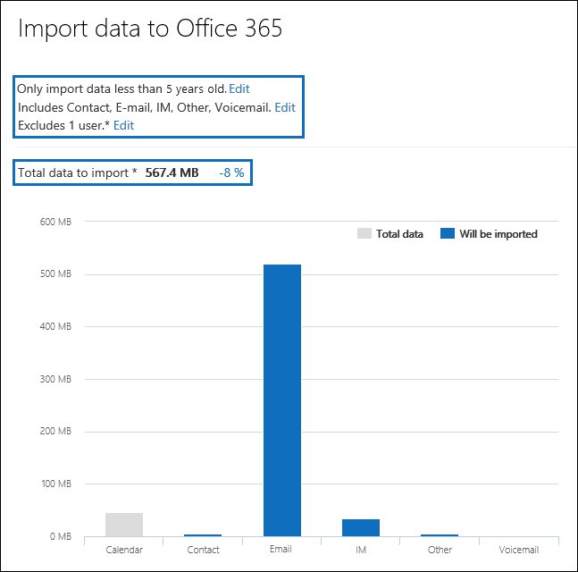

# Filtrar dados ao importar arquivos PSTFilter data when importing PST files

Use o novo recurso importação inteligente no serviço de importação Microsoft 365 para filtrar os itens em arquivos PST que realmente são importados para as caixas de correio de destino.Use the new Intelligent Import feature in the Microsoft 365 Import service to filter the items in PST files that actually get imported to the target mailboxes. Veja como funciona:Here's how it works:
  
- Depois de criar e enviar um trabalho de importação PST, os arquivos PST são carregados em uma área de armazenamento do Azure na nuvem da Microsoft.After you create and submit a PST import job, PST files are uploaded to an Azure storage area in the Microsoft cloud.
  
- Microsoft 365 analisa os dados nos arquivos PST, de forma segura e segura, identificando a idade dos itens de caixa de correio e os diferentes tipos de mensagem incluídos nos arquivos PST.Microsoft 365 analyzes the data in the PST files, in a safe and secure manner, by identifying the age of the mailbox items and the different message types included in the PST files.
  
- Quando a análise é concluída e os dados estão prontos para importação, você tem a opção de importar todos os dados nos arquivos PST como está ou cortar os dados importados definindo filtros que controlam quais dados são importados.When the analysis is complete and the data is ready to import, you have the option to import all data in the PST files as is or trim the data that's imported by setting filters that control what data gets imported. Por exemplo, você pode optar por:For example, you can choose to:
  
  - Importe apenas itens de uma determinada idade.Import only items of a certain age.
  
  - Importar tipos de mensagem selecionados.Import selected message types.
  
  - Exclua mensagens enviadas ou recebidas por pessoas específicas.Exclude messages sent or received by specific people.
  
- Depois de configurar as configurações de filtro, Microsoft 365 importa somente os dados que atendam aos critérios de filtragem para as caixas de correio de destino especificadas no trabalho de importação.After you configure the filter settings, Microsoft 365 imports only the data that meets the filtering criteria to the target mailboxes specified in the import job.
  
O gráfico a seguir mostra o processo de Importação Inteligente e realça as tarefas executadas e as tarefas executadas por Office 365.The following graphic shows the Intelligent Import process, and highlights the tasks you perform and the tasks performed by Office 365.
  

  
## Criar um trabalho de importação PSTCreate a PST import job

- As etapas neste tópico pressupuem que você criou um trabalho de importação PST no serviço Office 365 Import usando o carregamento de rede ou o envio de unidade.The steps in this topic assume that you've created a PST import job in the Office 365 Import service by using network upload or drive shipping. Para obter instruções passo a passo, consulte um dos seguintes tópicos:For step-by-step instructions, see one of the following topics:
    
  - [Usar o carregamento de rede para importar arquivos PST para o Office 365Use network upload to import PST files to Office 365](use-network-upload-to-import-pst-files.md)
    
  - [Usar o envio de unidade para importar os arquivos PST para o Office 365Use drive shipping to import PST files to Office 365](use-drive-shipping-to-import-pst-files-to-office-365.md)
    
- Depois de criar um trabalho de importação usando o carregamento de rede, o & status do trabalho de importação na página Importar no Centro de Conformidade e Segurança é definido como Análise em **andamento,** o que significa que o Microsoft 365 está analisando os dados nos arquivos PST que você carregou.After you create an import job by using network upload, the status for the import job on the Import page in the Security & Compliance Center is set to **Analysis in progress**, which means that Microsoft 365 is analyzing the data in the PST files that you uploaded. Clique **em Atualizar** atualização para atualizar o status do trabalho de  importação.Click **Refresh** to update the status for the import job. 
    
- Para trabalhos de importação de envio de unidade, os dados serão analisados pelo Microsoft 365 depois que a equipe do datacenter da Microsoft receber seu disco rígido e carregar os arquivos PST para a área de armazenamento do Azure para sua organização.For drive shipping import jobs, the data will be analyzed by Microsoft 365 after Microsoft datacenter personnel receive your hard drive and upload the PST files to the Azure storage area for your organization.
  
## Filtrar dados que são importados para caixas de correioFilter data that gets imported to mailboxes

Depois de criar um trabalho de importação PST, siga estas etapas para filtrar os dados antes de importá-los para Office 365.After you've created a PST import job, follow these steps to filter the data before you import it to Office 365.
  
1. Vá para <https://compliance.microsoft.com> e entre usando as credenciais de uma conta de administrador em sua organização.Go to <https://compliance.microsoft.com> and sign in using the credentials for an administrator account in your organization.
    
2. No painel esquerdo do Centro de Conformidade do Microsoft 365, clique em **controle de informações** \> **Importar**.In the left pane of the Microsoft 365 compliance center, click **Information governance** \> **Import**.
    
    Os trabalhos de importação para sua organização estão listados na **guia Importar.** O **valor concluído** análise na coluna **Status** indica os trabalhos de importação que foram analisados pelo Microsoft 365 e estão prontos para importação.The import jobs for your organization are listed on the **Import** tab. The **Analysis completed** value in the **Status** column indicates the import jobs that have been analyzed by Microsoft 365 and are ready for you to import.
    
    
  
3. Selecione o trabalho de importação que você deseja concluir e clique em **Importar para Office 365**.Select the import job that you want to complete and click **Import to Office 365**.
  
    Uma página com submenu é exibida com informações sobre os arquivos PST e outras informações sobre o trabalho de importação.A fly out page is displayed with information about the PST files and other information about the import job.

4. Clique **em Importar para Office 365**.Click **Import to Office 365**.
    
    A página **Filtrar seus dados** é exibida.The **Filter your data** page is displayed. Ele contém informações sobre os dados nos arquivos PST para o trabalho de importação, incluindo informações sobre a idade dos dados.It contains data insights about the data in the PST files for the import job, including information about the age of the data. 
    
    
  
5. Com base em se você deseja ou não cortar os dados importados para Microsoft 365, em Deseja filtrar seus **dados?**, faça um dos seguintes:Based on whether or not you want to trim the data that's imported to Microsoft 365, under **Do you want to filter your data?**, do one of the following:
  
    a.a. Clique **em Sim, quero filtre-o** antes de importar para cortar os dados que você importa e clique em **Próximo.**Click **Yes, I want to filter it before importing** to trim the data that you import, and then click **Next**.
  
    A **página Importar dados Office 365 página** é exibida com informações detalhadas sobre dados da análise que Microsoft 365 realizada.The **Import data to Office 365 page** page is displayed with detailed data insights from the analysis that Microsoft 365 performed. 
  
    
  
    O gráfico nesta página mostra a quantidade de dados que serão importados.The graph on this page shows the amount of data that will be imported. As informações sobre cada tipo de mensagem encontrada nos arquivos PST são exibidas no gráfico.Information about each message type found in the PST files is displayed in the graph. Você pode passar o cursor sobre cada barra para exibir informações específicas sobre esse tipo de mensagem.You can hover the cursor over each bar to display specific information about that message type. Também há uma listada com valores de idade diferentes com base na análise dos arquivos PST.There is also a drop-down list with different age values based on the analysis of the PST files. Quando você seleciona uma idade na listada, o gráfico é atualizado para mostrar quantos dados serão importados para a idade selecionada.When you select an age in the drop-down list, the graph is updated to show how much data will be imported for the selected age. 
  
    b.b. Para configurar filtros de adição para reduzir a quantidade de dados importados, clique **em Mais opções de filtragem.**To configure addition filters to reduce the amount of data that's imported, click **More filtering options**.
  
    
  
    Você pode configurar esses filtros:You can configure these filters:
  
      - **Idade** - Selecione uma idade para que somente os itens mais novos do que a idade especificada serão importados.**Age** - Select an age so only items that are newer than the specified age will be imported. Consulte a [seção Mais informações](#more-information) para obter uma descrição sobre como Microsoft 365 determina os buckets de idade para o filtro **Idade.**See the [More information](#more-information) section for a description about how Microsoft 365 determines the age buckets for the **Age** filter. 
  
      - **Tipo** - Esta seção mostra todos os tipos de mensagem encontrados nos arquivos PST para o trabalho de importação.**Type** - This section shows all the message types that were found in the PST files for the import job. Você pode desmarcar uma caixa ao lado de um tipo de mensagem que deseja excluir.You can uncheck a box next to a message type that you want to exclude. Não é possível excluir o outro tipo de mensagem.You can't exclude the Other message type. Consulte a [seção Mais informações](#more-information) para obter uma lista de itens de caixa de correio incluídos na categoria Other.See the [More information](#more-information) section for a list of mailbox items that are included in the Other category.
  
      - **Usuários** - Você pode excluir mensagens enviadas ou recebidas por pessoas específicas.**Users** - You can exclude messages that are sent or received by specific people. Para excluir pessoas que aparecem no campo De: para: ou no  campo Cc: de mensagens, clique em Excluir usuários ao lado desse tipo de destinatário.To exclude people who appear in the From: field, To: field, or the Cc: field of messages, click **Exclude users** next to that recipient type. Digite o endereço de email (endereço SMTP) da pessoa, clique em Adicionar novo ícone para adicioná-los à lista de usuários excluídos para esse tipo de destinatário e clique em Salvar para salvar a lista de usuários   excluídos. Type the email address (SMTP address) of the person, click **Add** to add them to the list of excluded users for that recipient type, and then click **Save** to save the list of excluded users. 
  
        > [!NOTE]
        > Microsoft 365 não mostra informações de dados resultantes da configuração do **filtro Pessoas.**Microsoft 365 doesn't show data insights that result from setting the **People** filter. No entanto, se você definir esse filtro para excluir mensagens enviadas ou recebidas por pessoas específicas, essas mensagens serão excluídas durante o processo de importação real.However, if you set this filter to exclude messages sent or received by specific people, those messages will be excluded during the actual import process. 
  
    c.c. Clique **em Aplicar** na página Mais opções de **filtragem** para salvar suas configurações de filtro.Click **Apply** in the **More filtering options** fly out page to save your filter settings. 
  
    Os insights de dados na página **Importar** dados para Office 365 são atualizados com base nas configurações do filtro, incluindo a quantidade total de dados que serão importados com base nas configurações do filtro.The data insights on the **Import data to Office 365** page are updated based on your filter settings, including the total amount of data that will be imported based on the filter settings. Um resumo das configurações do filtro também é mostrado.A summary of the filter settings is also shown. Você pode clicar **em Editar** ao lado de um filtro para alterar a configuração, se necessário.You can click **Edit** next to a filter to change the setting if necessary. 
  
    
  
    d.d. Clique em **Avançar**.Click **Next**.
  
    Uma página de status é exibida mostrando as configurações do filtro.A status page is displayed showing your filter settings. Novamente, você pode editar qualquer uma das configurações de filtro.Again, you can edit any of the filter settings.
  
    e.e. Clique **em Importar dados** para iniciar a importação.Click **Import data** to start the import. A quantidade total de dados que serão importados é exibida.The total amount of data that will be imported is displayed. 
  
    OuOr
  
    a.a. Clique **em Não, quero importar tudo para** importar todos os dados nos arquivos PST para Office 365 e clique em **Próximo**.Click **No, I want to import everything** to import all data in the PST files to Office 365, and then click **Next**.
  
    b.b. Na página **Importar dados para Office 365,** clique em **Importar dados** para iniciar a importação.On the **Import data to Office 365** page, click **Import data** to start the import. A quantidade total de dados que serão importados é exibida.The total amount of data that will be imported is displayed. 
  
6. Na guia **Importar,** clique em **Atualizar**  .On the **Import** tab, click **Refresh** . O status do trabalho de importação é exibido na coluna **Status.**The status for the import job is displayed in the **Status** column.
  
7. Clique na importação do trabalho para exibir informações mais detalhadas, como o status de cada arquivo PST e as configurações de filtro que você configurou.Click the import the job to display more detailed information, such as the status for each PST file and the filter settings that you configured.

## Mais informaçõesMore information

- Como Microsoft 365 determina os incrementos para o filtro de idade?How does Microsoft 365 determine the increments for the age filter? Quando Microsoft 365 analisa um arquivo PST, ele analisa o carimbo de hora enviado ou recebido de cada item (se um item tiver um carimbo de data/hora enviado e recebido, a data mais antiga será selecionada).When Microsoft 365 analyzes a PST file, it looks at the sent or received time stamp of each item (if an item has both a sent and received timestamp, the oldest date is selected). Em seguida, Microsoft 365 o valor do ano para esse data/hora e compara-o com a data atual para determinar a idade do item.Then Microsoft 365 looks at the year value for that timestamp and compares it to the current date to determine the age of the item. Essas idades são então usadas como os valores na listada para o filtro **Idade.**These ages are then used as the values in the drop-down list for the **Age** filter. Por exemplo, se um arquivo PST tiver mensagens de 2016, 2015 e 2014, os valores no filtro **Idade** seriam **1** ano, **2** anos e **3 anos.**For example, if a PST file has messages from 2016, 2015, and 2014, then values in the **Age** filter would be **1 year**, **2 years**, and **3 years**.
  
- A tabela a seguir lista os tipos de  mensagem incluídos  na outra categoria no filtro Tipo na página Mais opções de sobrevoo (consulte Etapa 5b no procedimento anterior). The following table lists the message types that are included in the **Other** category in the **Type** filter on the **More options** fly out page (see Step 5b in the previous procedure). Atualmente, você não pode excluir itens na categoria "Outros" ao importar PSTs para Office 365.Currently, you can't exclude items in the "Other" category when you import PSTs to Office 365. 
  
    |**ID da classe de mensagens****Message class ID**|**Itens de caixa de correio que usam essa classe de mensagem****Mailbox items that use this message class**|
    |:-----|:-----|
    |IPM. AtividadeIPM.Activity    |Entradas de DiárioJournal entries    |
    |IPM.DocumentIPM.Document    |Documentos e arquivos (não anexados a uma mensagem de email)Documents and files (not attached to an email message)    |
    |IPM. ArquivoIPM.File    |(mesmo que IPM.Document)(same as IPM.Document)    |
    |IPM. Note.IMC.NotificationIPM.Note.IMC.Notification    |Relatórios enviados pelo Internet Mail Conexão, que é o Exchange Server gateway para a InternetReports sent by Internet Mail Connect, which is the Exchange Server gateway to the Internet    |
    |IPM. Observação.Microsoft.FaxIPM.Note.Microsoft.Fax    |Mensagens de faxFax messages    |
    |IPM. Observação.Rules.Oof.Template.MicrosoftIPM.Note.Rules.Oof.Template.Microsoft    |Mensagens autoreletivas fora do escritórioOut-of-office autoreply messages    |
    |IPM. Observação.Rules.ReplyTemplate.MicrosoftIPM.Note.Rules.ReplyTemplate.Microsoft    |Respostas enviadas por uma regra de caixa de entradaReplies sent by an inbox rule    |
    |IPM. OLE. ClasseIPM.OLE.Class    |Exceções para uma série recorrenteExceptions for a recurring series    |
    |IPM. Recall.ReportIPM.Recall.Report    |Relatórios de cancelamento de mensagensMessage recall reports    |
    |IPM. RemoteIPM.Remote    |Mensagens de email remotasRemote mail messages    |
    |IPM. RelatórioIPM.Report    |Relatórios de status do itemItem status reports    |
