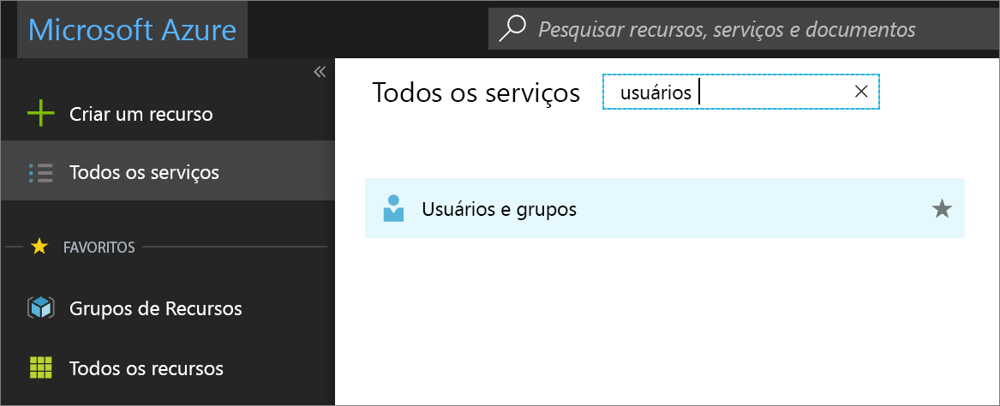
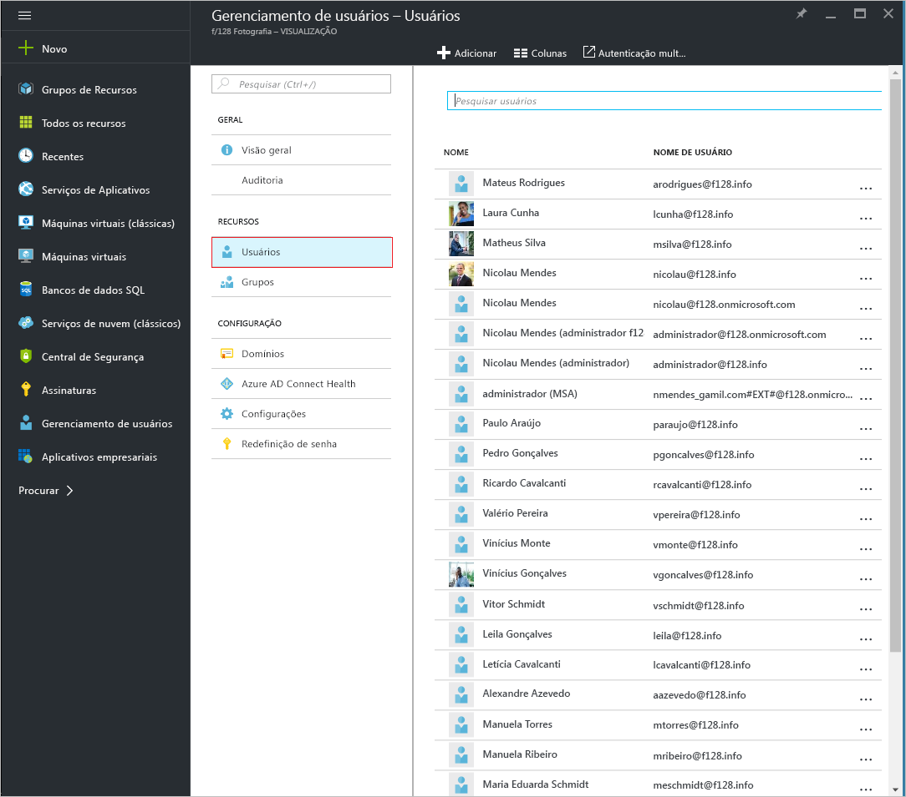
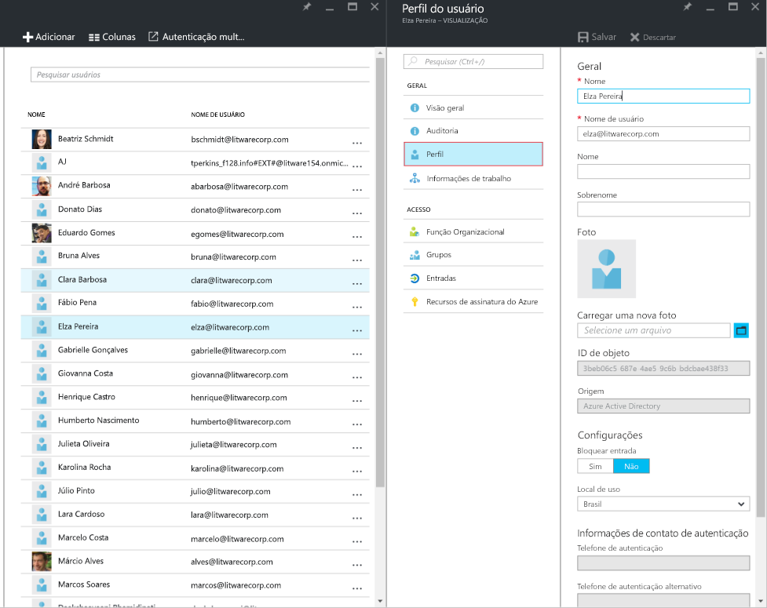
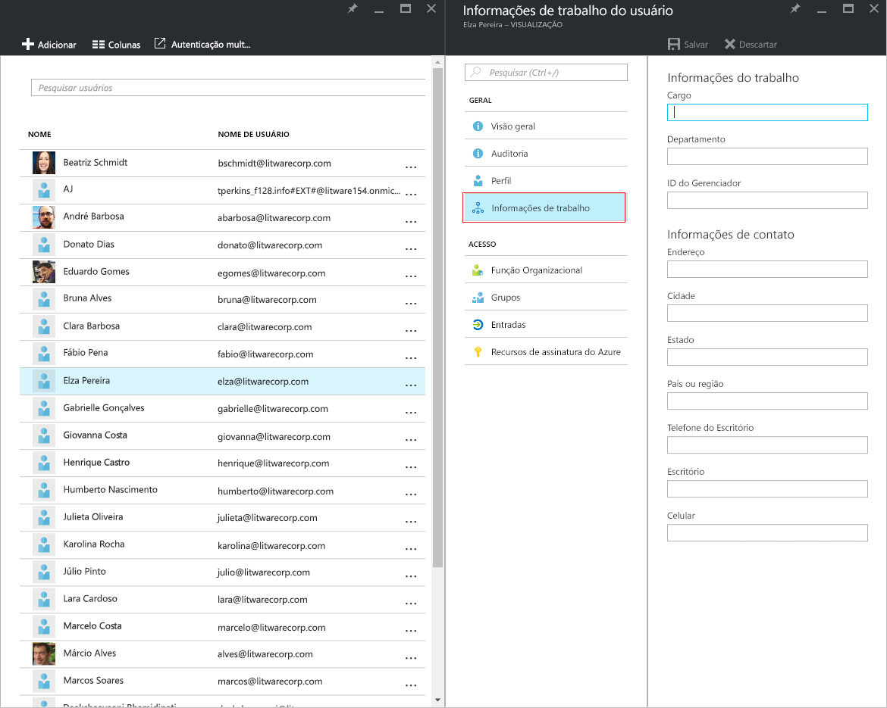
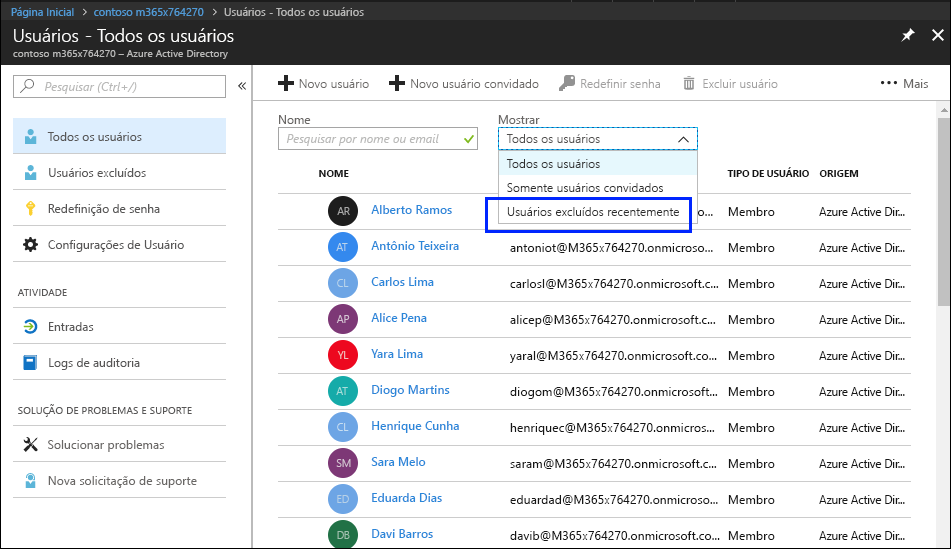
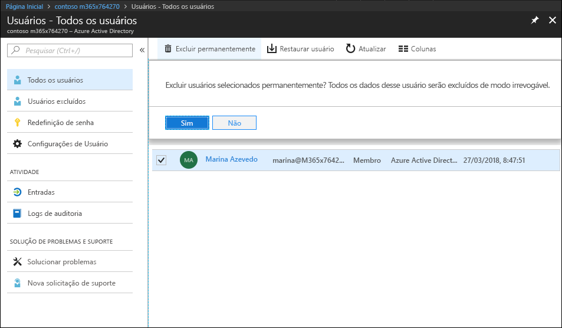
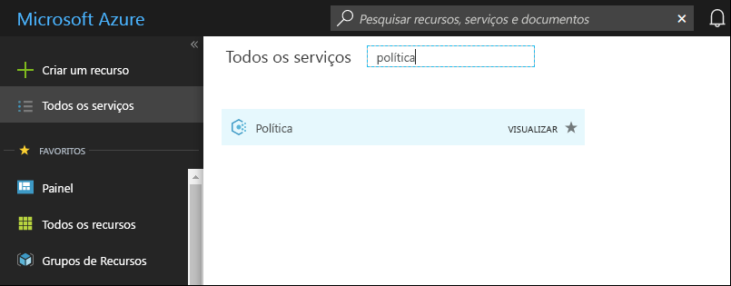
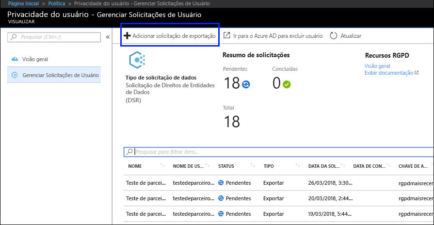
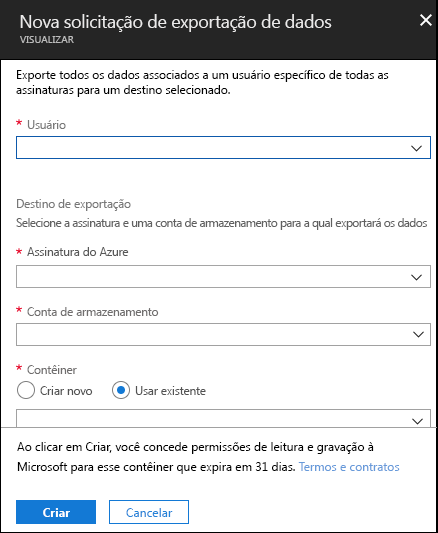

# Solicitações de Entidades de Dados do Azure para o RGPD

## Introdução às DSRs (Solicitações de Entidades de Dados)

O [Regulamento Geral de Proteção de Dados da União Europeia (RGPD)](https://ec.europa.eu/justice/data-protection/reform/index_en.htm) concede direitos a pessoas (conhecidas no regulamento como *entidades de dados*) para gerenciar os dados pessoais coletados por um empregador ou outro tipo de agência ou organização (conhecido como *controlador de dados* ou apenas *controlador*). Os dados pessoais são definidos de forma muito ampla no âmbito do RGPD como qualquer dado relacionado a uma única pessoa natural identificada ou identificável. O RGPD concede às entidades de dados direitos específicos sobre seus dados pessoais; esses direitos incluem a obtenção de cópias, a solicitação de correções, a restrição do processamento e a exclusão de dados pessoais, ou o seu recebimento em formato eletrônico para que possam ser transferidos para outro controlador. Um pedido formal de uma entidade de dados a controlador para efetuar uma ação nos seus dados pessoais é chamado de *Solicitação de Entidade de Dados* ou DSR.

O guia descreve como usar os produtos, serviços e ferramentas administrativas da Microsoft para ajudar os nossos clientes controladores a encontrar dados pessoais e agir em relação a eles para responder a DSRs. Especificamente, isso inclui como localizar, acessar e agir em dados pessoais que residem na nuvem da Microsoft. Veja aqui uma breve visão geral dos processos descritos neste guia:

- **Descoberta:** use ferramentas de pesquisa e descoberta para localizar com mais facilidade os dados de clientes que possam estar sujeitos a uma DSR. Assim que os documentos potencialmente dinâmicos forem coletados, você pode executar uma ou mais ações de DSR descritas nas etapas a seguir a fim de responder à solicitação. Como alternativa, você pode determinar que a solicitação não atende às diretrizes de sua organização para responder a DSRs.
- **Acesso:** recupere dados pessoais que residem na nuvem da Microsoft e, se solicitado, faça uma cópia para disponibilizar para o titular dos dados.
- **Retificação:** faça alterações ou implemente outras ações solicitadas nos dados pessoais, onde for possível.
- **Restrição:** restrinja o processamento de dados pessoais, removendo licenças de diversos serviços do Azure ou desativando os serviços desejados, quando possível. Você também pode remover dados da nuvem da Microsoft e mantê-los no local ou onde preferir.
- **Exclusão:** remova permanentemente os dados pessoais que residem na nuvem da Microsoft.
- **Exportação:** forneça uma cópia eletrônica (em um formato legível por máquina) dos dados pessoais para o titular dos dados.

Cada seção deste guia descreve os procedimentos técnicos que uma organização controladora de dados pode realizar para responder a uma DSR para dados pessoais na nuvem da Microsoft.

## Terminologia

Veja a seguir as definições dos termos que são relevantes para este guia.

- **Controlador:** a pessoa física ou jurídica, autoridade pública, órgão ou outra entidade que, sozinha ou em conjunto com terceiros, determina os fins e os meios do processamento de dados pessoais, onde tais fins e meios são determinados por lei da União ou Estado-Membro, o controlador ou os critérios específicos para sua indicação podem ser fornecidos por lei da União ou Estado-Membro.
- **Dados pessoais e titular dos dados:** quaisquer informações relacionadas a uma pessoa física identificada ou identificável (“titular dos dados”); uma pessoa física identificável é aquela que pode ser identificada, direta ou indiretamente, especialmente por referência a um identificador, como nome, um número de identificação, dados de localização, um identificador online ou por um ou mais fatores específicos à identidade física, fisiológica, genética, mental, econômica, cultural ou social dessa pessoa física.
- **Processador:** uma pessoa física ou jurídica, autoridade pública, órgão ou outra entidade que processa dados pessoais em nome do controlador.
- **Dados do cliente:** todos os dados, incluindo texto, som, vídeo ou arquivos de imagem e software que são fornecidos à Microsoft, por ou em nome de um cliente, através do uso de serviço corporativo. Dados do cliente incluem (1) informações de identificação de usuários finais (por exemplo, nomes de usuário e informações de contato no Azure Active Directory) e conteúdo do cliente que um cliente carrega ou cria em serviços específicos (por exemplo, conteúdo de cliente na conta de Armazenamento do Azure, conteúdo do cliente em um Banco de Dados SQL do Azure ou imagem da máquina virtual do cliente em máquinas virtuais do Azure).
- **Logs gerados pelo sistema:** logs e dados relacionados gerados pela Microsoft que nos ajudam a fornecer os serviços corporativos aos usuários. Logs gerados pelo sistema contêm, principalmente, dados pseudônimos, tais como identificadores exclusivos, normalmente um número gerado pelo sistema que não pode sozinho identificar um indivíduo, mas que é usado para fornecer serviços corporativos aos usuários. Logs gerados pelo sistema também podem conter informações de identificação dos usuários finais, como nomes de usuário.

## Como usar este guia

Este guia consiste em duas partes:

- **Parte 1: Respondendo a Solicitações de Entidade de Dados para Dados do Cliente:** a Parte 1 deste guia discute como acessar, retificar, restringir, excluir e exportar dados de aplicativos nos quais você criou dados. Esta seção detalha como executar Solicitações de Entidades de Dados em relação ao Conteúdo do Cliente e também às informações identificáveis dos usuários finais.
- **Parte 2: Respondendo a Solicitações de Entidades de Dados para Logs Gerados pelo Sistema:** quando você usa os serviços corporativos da Microsoft, a Microsoft gera algumas informações, conhecidas como Logs Gerados pelo Sistema, para fornecer o serviço. A Parte 2 deste guia discute como acessar, excluir e exportar essas informações para o Azure.

## Noções básicas sobre DSRs para o Active Directory do Azure e contas de serviço da Microsoft

Ao considerar serviços fornecidos para clientes empresariais, a execução de DSRs sempre deve ser compreendida no contexto de um locatário específico do Azure Active Directory (AAD). As DSRs sempre são executadas em um determinado locatário do AAD. Se um usuário fizer parte de vários locatários, é importante enfatizar que uma determinada DSR é executada *apenas* no contexto do locatário específico no qual a solicitação foi recebida. É essencial entender que isso significa que a execução da DSR por um cliente corporativo **não** afeta os dados de um cliente corporativo adjacente.

O mesmo também se aplica a contas de serviço da Microsoft (MSA) no contexto dos serviços fornecidos a um cliente corporativo: a execução de uma DSR em uma conta MSA *associada a um locatário do AAD* **se refere apenas** aos dados dentro do locatário. Além disso, é importante compreender o seguinte ao lidar com a contas MSA em um locatário:

- Se um usuário MSA criar uma assinatura do Azure, a assinatura será tratada como se fosse um locatário do AAD. Consequentemente, o escopo dessas DSRs está no locatário, como descrito acima.
- Se for excluída uma assinatura do Azure criada por uma conta MSA, **isso não afeta** a conta MSA em si. Novamente, como mencionado acima, as DSRs em execução em assinaturas do Azure são limitadas ao escopo do locatário em si.

As DSRs em relação à própria conta MSA, **fora de um determinado locatário**, são executadas por meio do Painel de privacidade do cliente. Consulte o Guia de solicitações de titulares de dados do Windows para saber mais.

## Parte 1: guia de DSR para dados do cliente

### Executando DSRs contra dados do cliente

A Microsoft fornece a capacidade de acessar, excluir e exportar determinados dados de clientes por meio do Portal do Azure e também diretamente, por meio de APIs (interfaces de programação de aplicativos) preexistentes ou IUs (interfaces de usuário) para serviços específicos (também conhecidas como *experiências do produto*). Detalhes sobre essas experiências internas de produtos são descritos na documentação de referência desses respectivos serviços.

>[!IMPORTANT]  
> Serviços de suporte a DSRs de produtos exigem o uso direto de APIs (interfaces de programação de aplicativos) preexistentes ou IUs (interfaces de usuário), que descrevem as operações CRUD (criar, ler, atualizar e excluir). Consequentemente, é necessário executar as DSRs de um determinado serviço e também executar uma DSR no Portal do Azure para concluir totalmente a solicitação de um determinado titular de dados. Consulte a documentação de referência de serviços específicos para saber mais.

### Etapa 1: Descoberta

A primeira etapa ao responder a uma DSR é localizar os dados pessoais do titular da solicitação. Esta primeira etapa, localizar e revisar os dados pessoais em questão, ajuda a determinar se uma DSR atende aos requisitos de sua organização para aceitá-la ou recusá-la. Por exemplo, depois de localizar e analisar os dados pessoais em questão, pode ser que você determine que a solicitação não atende aos requisitos da sua organização porque afetaria negativamente os direitos e liberdades de terceiros.

Depois de encontrar os dados, você pode executar uma ação específica que atenda à solicitação feita pelo titular dos dados.

O [Azure Active Directory](https://azure.microsoft.com/services/active-directory/) é um serviço da Microsoft para gerenciamento de identidades e diretórios com vários locatários baseados na nuvem. Você pode localizar informações de identificação de usuários finais, como perfis de usuários de clientes e funcionários, e informações de trabalho de usuários, que contenham dados pessoais do ambiente do [Azure Active Directory](https://azure.microsoft.com/services/active-directory/) (AAD) usando o [portal do Azure](https://portal.azure.com/).

Isso é especialmente útil se você quiser localizar ou alterar dados pessoais de um usuário específico. Também é possível adicionar ou alterar informações de trabalho e de perfil de usuário. Você deve entrar com uma conta de administrador global do diretório.

#### Como localizar ou exibir informações de trabalho e de perfil de um usuário?

1. Entre no [portal do Azure](https://portal.azure.com/) com uma conta de administrador global do diretório.

2. Selecione **Todos os serviços**, digite **Usuários e grupos** na caixa de texto e pressione **Enter**.

     

3. Na folha **Usuários e grupos**, selecione **Usuários**.

     

4. Na folha **Usuários e grupos - Usuários**, selecione um usuário na lista e, em seguida, na folha do usuário selecionado, selecione **Perfil** para exibir as informações de perfil do usuário que possam conter dados pessoais.

    

5. Se for necessário, é possível adicionar ou alterar informações de perfil do usuário e depois, na barra de comando, selecionar **Salvar**.

#### Interfaces específicas do serviço

A Microsoft oferece a capacidade de descobrir os dados dos clientes diretamente por APIs (interfaces de programação de aplicativos) preexistentes ou por IUs (interfaces de usuário) para serviços específicos. Os detalhes são descritos na documentação de referência dos respectivos serviços e descrevem as operações aplicáveis de CRUD (criar, ler, atualizar e excluir).

### Etapa 2: Acesso

Depois de encontrar dados pessoais potencialmente responsivos a uma DSR, cabe a você e a sua organização decidir quais dados fornecer ao titular dos dados. Por exemplo, você pode fornecer a ele uma cópia do documento original, uma versão adequadamente redigida ou uma captura de tela das partes que você considerou apropriado compartilhar. Para cada uma dessas respostas a uma solicitação de acesso, você terá que recuperar uma cópia do documento ou outro item que contenha os dados responsivos.

Ao oferecer uma cópia ao titular dos dados, talvez você tenha que remover ou redigir informações pessoais sobre outros titulares de dados e quaisquer informações confidenciais.

#### Azure Active Directory

A Microsoft oferece experiências de portal e produto, proporcionando ao administrador de locatário do cliente corporativo a capacidade de gerenciar solicitações de acesso de DSR. As solicitações de acesso de DSR permitem o acesso dos dados pessoais do usuário, incluindo: (a) informações identificáveis sobre um usuário final e (b) logs gerados pelo sistema.

#### Interfaces específicas do serviço

A Microsoft oferece a capacidade de descobrir os dados dos clientes diretamente por APIs (interfaces de programação de aplicativos) preexistentes ou por IUs (interfaces de usuário) para serviços específicos. Os detalhes são descritos na documentação de referência dos respectivos serviços e descrevem as operações aplicáveis de CRUD (criar, ler, atualizar e excluir).

### Etapa 3: Retificação

Se um titular dos dados pediu para corrigir os dados pessoais que residem nos dados da sua organização, você e sua organização precisam determinar se é apropriado aceitar a solicitação. A correção dos dados pode incluir a execução de ações como editar, redigir ou remover dados pessoais de um documento ou de outro tipo de item. A maneira mais apropriada para fazer isso com dados do Suporte da Microsoft e do Microsoft FastTrack é fornecida abaixo.

#### Azure Active Directory

Clientes corporativos têm a capacidade de gerenciar solicitações de retificação de DSR, incluindo recursos de edição limitados por natureza de um determinado serviço da Microsoft. Como processador de dados, a Microsoft não oferece a capacidade de corrigir logs gerados pelo sistema, pois refletem atividades concretas e constituem um registro do histórico de eventos em serviços da Microsoft. Em relação ao Azure Active Directory, os recursos de edição limitados existem para retificar as informações de identificação sobre usuários finais, como descrito abaixo.

##### Azure Active Directory: retificar/corrigir dados pessoais incorretos ou incompletos

Você pode corrigir, atualizar ou excluir informações de identificação sobre usuários finais, como perfis de usuário de funcionários e clientes, e informações de trabalho de usuário que contêm dados pessoais, como nome do usuário, título de trabalho, endereço ou número de telefone no seu ambiente [Azure Active Directory](https://azure.microsoft.com/services/active-directory/) (AAD) usando a [portal do Azure](https://portal.azure.com/). Você deve entrar com uma conta de administrador global do diretório.

###### Como corrigir ou atualizar o perfil de usuário e as informações de trabalho no Azure Active Directory?

1. Entre no [portal do Azure](https://portal.azure.com/) com uma conta de administrador global do diretório.

2. Selecione **Todos os serviços**, digite **Usuários e grupos** na caixa de texto e pressione **Enter**.

    

3. Na folha **Usuários e grupos**, selecione **Usuários**.

    

4. Na folha **Usuários e grupos - Usuários**, selecione um usuário na lista e, em seguida, na folha do usuário selecionado, selecione **Perfil** para exibir as informações de perfil do usuário que precisam ser corrigidas ou atualizadas.

    

5. Corrija ou atualize as informações e, em seguida, na barra de comando, selecione **Salvar**.

6. Na folha do usuário selecionado, selecione **Informações de trabalho** para exibir informações de trabalho de usuários que precisam ser corrigidas ou atualizadas.

    

7. Corrija ou atualize as informações de trabalho de usuário e, em seguida, na barra de comando, selecione **Salvar**.

#### Interfaces específicas de serviços

A Microsoft oferece a capacidade de descobrir os dados dos clientes diretamente por APIs (interfaces de programação de aplicativos) preexistentes ou por IUs (interfaces de usuário) para serviços específicos. Os detalhes são descritos na documentação de referência dos respectivos serviços e descrevem as operações aplicáveis de CRUD (criar, ler, atualizar e excluir).

### Etapa 4: Restrição

Os entidades de dados podem solicitar que você restrinja o processamento de seus dados pessoais. Fornecemos tanto o Portal do Azure como interfaces de programação de aplicativos (APIs) ou interfaces de usuário (UIs) pré-existentes. Essas experiências fornecem ao administrador de locatário do cliente corporativo a capacidade de gerenciar essas DSRs por meio de uma combinação de exportação e exclusão de dados. Um cliente pode (1) exportar uma cópia eletrônica dos dados pessoais do usuário, incluindo (a) conta(s), (b) logs gerados pelo sistema e (c) logs associados, seguidos de (2) exclusão da conta e dados associados que residem nos sistemas Microsoft.

### Etapa 5: Exclusão

O “direito de apagar” através da remoção de dados pessoais dos Dados de Clientes de uma organização é uma proteção fundamental do RGPD. A remoção de dados pessoais inclui a remoção de todos os dados pessoais e logs gerados pelo sistema, exceto as informações de logs de auditoria. Quando um usuário é **excluído temporariamente** (veja os detalhes abaixo), a conta é desativada por 30 dias. Se nenhuma ação for realizada durante este período de 30 dias, o usuário é **excluído permanentemente** (novamente, veja os detalhes abaixo). Em uma **exclusão permanente**, a conta do usuário, dados pessoais e logs gerados pelos sistemas são eliminados após mais 30 dias adicionais. Se um administrador de locatário emitir imediatamente uma **exclusão permanente**, a conta de usuário, os dados pessoais e os logs gerados pelo sistema são eliminados dentro de 30 dias da data de emissão.

> [!IMPORTANT]
> Você deve ser um administrador de locatários para excluir um usuário do locatário.

#### Excluir um usuário e os dados associados no portal do Azure

Após receber uma solicitação de exclusão de um titular de dados, você pode usar o portal do Azure para excluir um usuário e as informações pessoais associadas, assim como logs gerados pelo sistema.

Excluir dados significa também excluir o usuário do locatário. Inicialmente os usuários são excluídos temporariamente, o que significa que a conta pode ser recuperada por um administrador de locatário em até 30 dias após ser marcada para exclusão temporária. Após 30 dias, a conta será automática e permanentemente excluída do locatário. Antes desses 30 dias, você pode excluir manualmente na Lixeira o usuário excluído temporariamente.

Veja a seguir o processo detalhado para excluir usuários de locatários.

1. Acesse o portal do Azure e localize o usuário.

2. Exclua o usuário. Ao excluir o usuário inicialmente, a conta do usuário é enviada para a Lixeira. **Neste ponto, o usuário é excluído temporariamente, ou seja, a conta é desabilitada, mas não eliminada do Azure Active Directory.**

3. Acesse a lista de usuários excluídos recentemente e exclua permanentemente o usuário. **Agora o usuário é excluído permanentemente (também conhecido como exclusão irreversível), o que significa que a conta foi eliminada do Azure Active Directory**

###### Para excluir um usuário de um locatário do Azure

1. Abra o portal do Azure, selecione a folha **Azure Active Directory** e selecione **Usuários**.

    A folha **Usuários - Todos os usuários** é exibida.

    

2. Marque a caixa ao lado do usuário que você deseja excluir, selecione **Excluir usuário**e selecione **Sim** na caixa que confirma se você deseja excluir o usuário.

    

3. Na caixa suspensa **Mostrar**, selecione **Usuários excluídos recentemente**.

    

4. Selecione o mesmo usuário novamente, escolha **Excluir permanentemente**e selecione **Sim** na caixa que pergunta se você tem certeza.

>[!IMPORTANT]  
>Lembre-se que, ao clicar em **Sim**, você exclui permanente e irrevogavelmente o usuário, todos os dados associados e os logs gerados pelo sistema. Se você fizer isso por engano, será necessário adicioná-lo manualmente ao locatário. Os dados associados e os logs gerados pelo sistema não podem ser recuperados.

   

#### Interfaces específicas do serviço

A Microsoft oferece a capacidade de descobrir os dados dos clientes diretamente por APIs (interfaces de programação de aplicativos) preexistentes ou por IUs (interfaces de usuário) para serviços específicos. Os detalhes são descritos na documentação de referência dos respectivos serviços e descrevem as operações aplicáveis de CRUD (criar, ler, atualizar e excluir).

## Etapa 6: Exportação

O “direito de portabilidade de dados” permite que uma entidade de dados solicite uma cópia de seus dados pessoais em formato eletrônico (que é um “formato estruturado, comumente usado, legível por máquina e interoperável”) que pode ser transmitido para outro controlador de dados. O Azure dá suporte a isso ao habilitar a sua organização a exportar dados no formato nativo JSON para o contêiner de armazenamento especificado do Azure.

>[!IMPORTANT]
>Você deve ser um administrador de locatários para exportar dados de usuário do locatário.

### Azure Active Directory

Em relação aos dados do cliente, a Microsoft oferece um portal e experiências internas do produto que proporcionam ao administrador de locatários do cliente corporativo a capacidade de gerenciar solicitações de exportação de informações de identificação de um usuário final.

### Interfaces específicas do serviço

A Microsoft oferece a capacidade de descobrir os dados dos clientes diretamente por APIs (interfaces de programação de aplicativos) preexistentes ou por IUs (interfaces de usuário) para serviços específicos. Os detalhes são descritos na documentação de referência dos respectivos serviços e descrevem as operações aplicáveis de CRUD (criar, ler, atualizar e excluir).

## Parte 2: Logs gerados pelo sistema

A Microsoft também proporciona a capacidade de acessar, excluir e exportar determinados logs gerados pelo sistema associados à utilização do Azure por um usuário.

>[!IMPORTANT]
> Não há suporte para a capacidade de restringir ou corrigir dados nos logs gerados pelo sistema. Logs gerados pelo sistema constituem ações concretas realizadas na nuvem da Microsoft e dados de diagnóstico. A modificação de tais dados comprometeria o registro histórico de ações e aumentaria os riscos de segurança e fraude.

### Executar as DSRs em logs gerados pelo sistema

A Microsoft fornece a capacidade de acessar, excluir e exportar determinados logs gerados pelo sistema por meio do Portal do Azure e, também, diretamente por meio de interfaces de programação ou interfaces de usuário para serviços específicos. Os detalhes são descritos na documentação de referência desses respectivos serviços.

>[!IMPORTANT]  
> Serviços de suporte a DSRs de produtos exigem o uso direto de APIs (interfaces de programação de aplicativos) preexistentes ou IUs (interfaces de usuário). Consequentemente, **é necessário executar as DSRs e também executar uma DSR no Portal do Azure para concluir totalmente a solicitação de um determinado titular de dados. Consulte a documentação de referência de serviços específicos para saber mais.**

### Etapa 1: Acessar

O administrador de locatário é a única pessoa em sua organização que tem acesso aos logs geradas pelo sistema associados ao uso do Azure por um usuário específico. Dados recuperados para uma solicitação de acesso são fornecidos em um formato legível por máquina em arquivos que permitem ao usuário saber com quais serviços os dados estão associados. Como mencionado acima, os dados recuperados não incluem dados que possam comprometer a segurança do serviço.

#### Azure Active Directory

A Microsoft oferece um portal e experiências de produto, proporcionando ao administrador de locatários do cliente corporativo a capacidade de gerenciar solicitações de acesso. As solicitações de acesso permitem o acesso a dados pessoais do usuário, incluindo: (a) informações de identificação sobre um usuário final e (b) logs gerados pelo sistema. O processo é idêntico ao descrito na seção da Parte 1, Etapa 2: Acesso, do Azure Active Directory.

#### Interfaces específicas do serviço

A Microsoft oferece a capacidade de descobrir os dados dos clientes diretamente por APIs (interfaces de programação de aplicativos) preexistentes ou por IUs (interfaces de usuário) para serviços específicos. Os detalhes são descritos na documentação de referência dos respectivos serviços e descrevem as operações aplicáveis de CRUD (criar, ler, atualizar e excluir).

### Etapa 2: Excluir

O administrador de locatário é a única pessoa em sua organização que pode executar uma solicitação de exclusão de DSR de um determinado usuário em um locatário do Azure.

#### Azure Active Directory

A Microsoft oferece um portal e experiências de produto, proporcionando ao administrador de locatários do cliente corporativo a capacidade de gerenciar solicitações de exclusão de DSR, que seguem o mesmo processo descrito em Excluir um usuário e dados associados na seção do portal do Azure da Parte 1, Etapa 5: Excluir.

#### Interfaces específicas do serviço

A Microsoft oferece a capacidade de descobrir os dados dos clientes diretamente por APIs (interfaces de programação de aplicativos) preexistentes ou por IUs (interfaces de usuário) para serviços específicos. Os detalhes são descritos na documentação de referência dos respectivos serviços e descrevem as operações aplicáveis de CRUD (criar, ler, atualizar e excluir).

### Etapa 3: Exportação

O administrador de locatários é a única pessoa em sua organização que tem acesso aos logs gerados pelo sistema associados ao uso do Azure por um usuário específico. Dados recuperados para uma solicitação de exportação são fornecidos em um formato legível por máquina em arquivos que permitem ao usuário saber com quais serviços os dados estão associados. Como mencionado acima, dados recuperados não incluem dados que possam comprometer a segurança ou estabilidade do serviço.

#### Exportar logs gerados pelo sistema usando o portal do Azure

Após receber uma solicitação de exportação de um titular de dados, você pode usar o portal do Azure para exportar os logs gerados pelo sistema associados a um determinado usuário.

Veja a seguir o processo detalhado para exportar os dados de seu locatário.

1. Acesse o portal do Azure e crie uma solicitação de exportação em nome do usuário.
2. Exporte os dados e envie o arquivo para o usuário.

###### Para exportar informações de um usuário de um locatário do Azure

1. Abra o portal do Azure, selecione **Todos os serviços**, digite *Política* para filtrar e selecione **Política**.

     

2. Na folha **Política**, selecione **Privacidade do usuário**, selecione **Gerenciar Solicitações de Usuário**e selecione **Adicionar solicitação de exportação**.

    

3. Preencha a **Solicitação de exportação de dados**:

    

- **Usuário.** Digite o endereço de email do usuário do Azure Active Directory que solicitou a exportação.
- **Assinatura.** Selecione a conta que você usa para relatar o uso de recursos e cobrar pelos serviços. Esse também é o local de sua conta de armazenamento do Azure.
- **Conta de armazenamento.** Selecione a localização de seu Armazenamento do Azure (Blob). Para saber mais, confira o artigo [Introdução ao Armazenamento do Microsoft Azure — armazenamento de Blob](https://docs.microsoft.com/azure/storage/common/storage-introduction#blob-storage).
- **Contêiner.** Crie um novo contêiner (ou selecione um existente) como o local de armazenamento para os dados de privacidade exportados do usuário.

4. Selecione **Criar**.

A solicitação de exportação entra no status **Pendente**. Você pode exibir o status do relatório na folha **Privacidade do usuário — Visão Geral**.

>[!IMPORTANT]  
>Como dados pessoais podem vir de vários sistemas, é possível que o processo de exportação possa demorar até um mês.

#### Interfaces específicas de serviços

A Microsoft oferece a capacidade de descobrir os dados dos clientes diretamente por APIs (interfaces de programação de aplicativos) preexistentes ou por IUs (interfaces de usuário) para serviços específicos. Os detalhes são descritos na documentação de referência dos respectivos serviços e descrevem as operações aplicáveis de CRUD (criar, ler, atualizar e excluir).

### Notificar problemas de exportação ou exclusão

Se você tiver problemas ao exportar ou excluir dados do Portal do Azure, acesse a folha **Ajuda + Suporte** do portal do Azure e envie um novo tíquete na folha **Gerenciamento de Assinaturas > Outra Solicitação de Segurança e Conformidade > Privacidade e Solicitações de RGPD**.

## Saiba mais

- [Central de Confiabilidade da Microsoft](https://www.microsoft.com/TrustCenter/Privacy/gdpr/default.aspx)