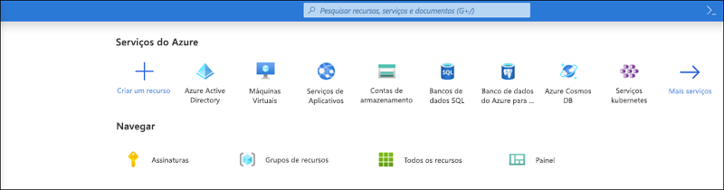
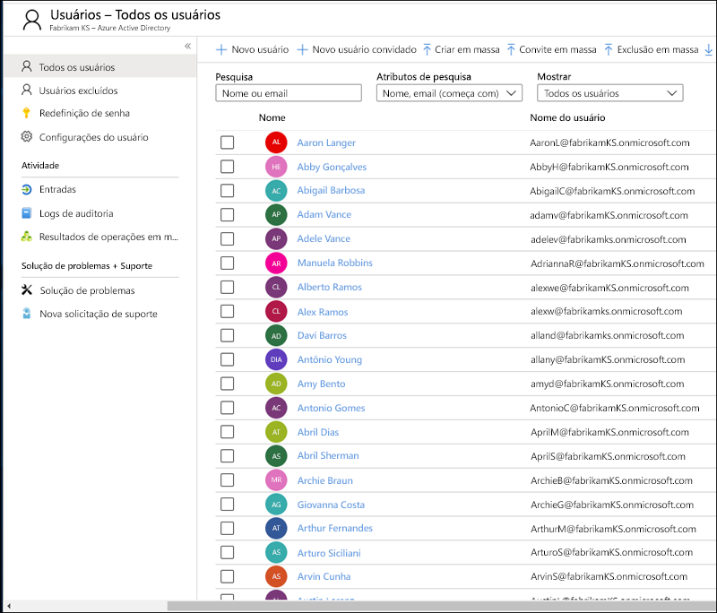
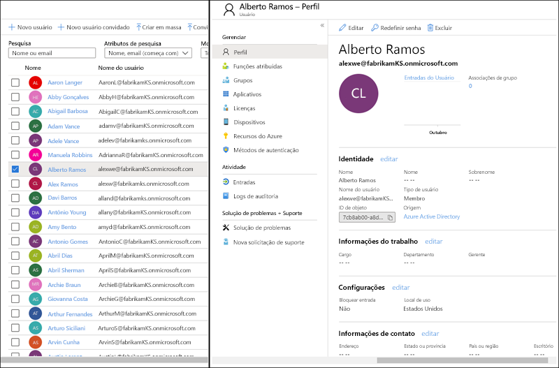
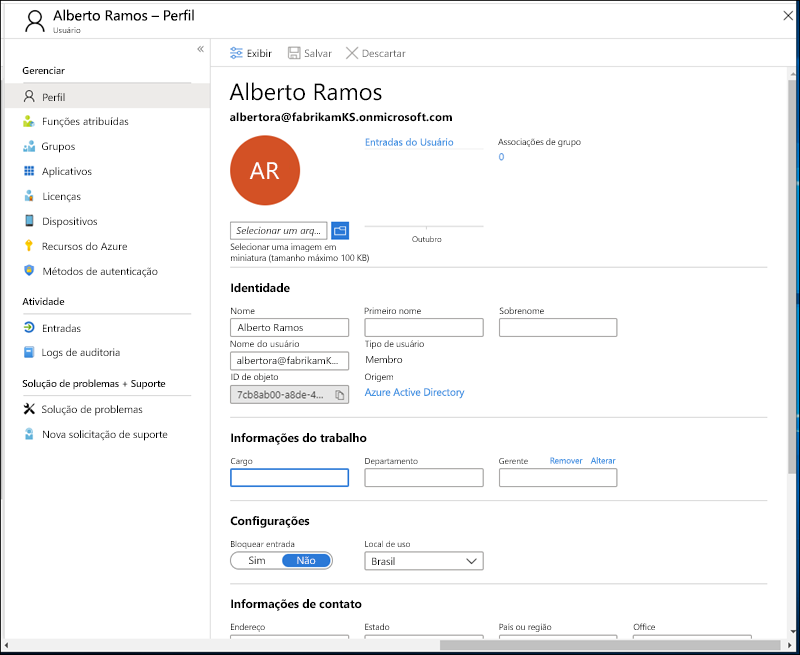
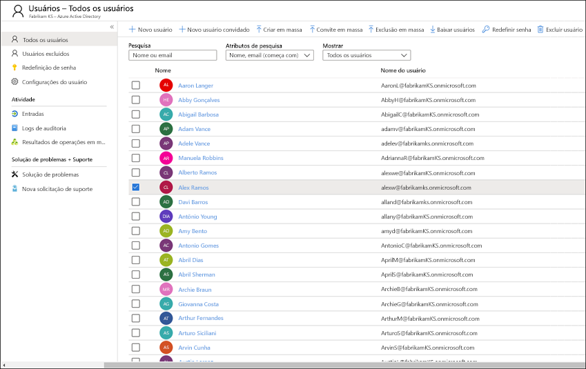
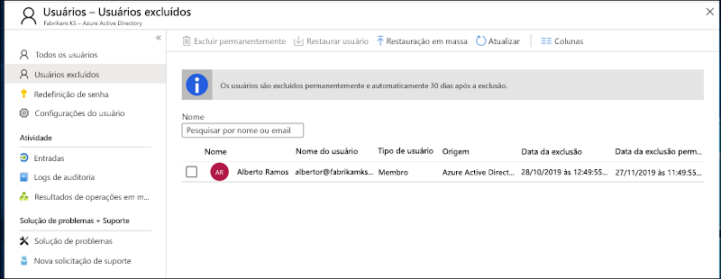
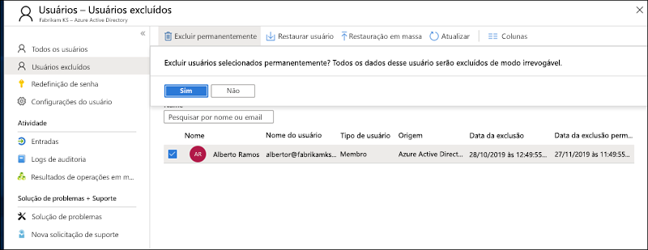
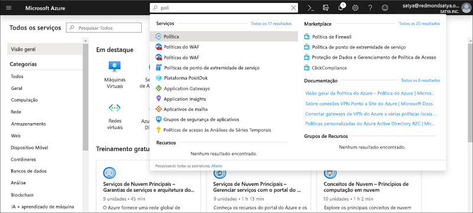
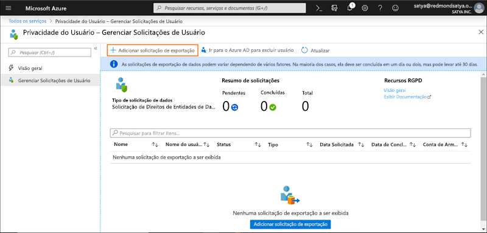
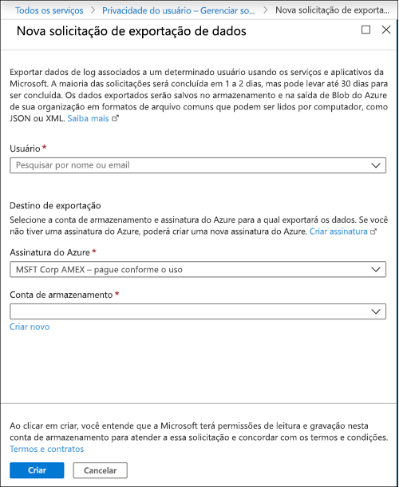

# Solicitações de assunto de dados do Azure para o GDPR e o CCPAAzure Data Subject Requests for the GDPR

## Introdução às DSRs (Solicitações de Entidades de Dados)Introduction to Data Subject Requests (DSRs)

O Regulamento Geral [de Proteção de Dados da União Europeia (GDPR)](https://ec.europa.eu/justice/data-protection/reform/index_en.htm) concede direitos às pessoas (conhecidas no regulamento como *titulares de dados*) para gerenciarem os dados pessoais coletados por um empregador ou outro tipo de agência ou organização (conhecido como *controlador de dados* ou apenas *controlador*). Os dados pessoais são definidos de maneira muito ampla, sob o GDPR, assim como qualquer dado relacionado à uma pessoa física identificada ou identificável. O GDPR concede aos titulares de dados direitos específicos sobre seus dados pessoais; esses direitos incluem obter cópias dos dados pessoais, solicitar correções, restringir o processamento, excluí-los ou recebê-los em formato eletrônico para que possam ser movidos para outro controlador. Uma solicitação formal de um titular de dados a um controlador para executar uma ação em seus dados pessoais é chamada de *Solicitação de titular de dados* ou DSR.The EU Data Protection Regulation (GDPR) gives rights to people (known in the regulation as *data subjects*) to manage the personal data that has been collected by an employer or other type of agency or organization (known as the *data controller* or just *controller*). Personal data is defined very broadly under the GDPR as any data that relates to an identified or identifiable natural person. The GDPR gives data subjects specific rights to their personal data; these rights include obtaining copies of personal data, requesting corrections to it, restricting the processing of it, deleting it, or receiving it in an electronic format so it can be moved to another controller. A formal request by a data subject to a controller to take an action on their personal data is called a *Data Subject Request* or DSR.

Da mesma forma, a Lei de Privacidade do Consumidor da Califórnia (CCPA), fornece direitos e obrigações de privacidade aos consumidores da Califórnia, incluindo direitos semelhantes aos Direitos do Titular dos Dados do GDPR, como o direito de excluir, acessar e receber (portabilidade) suas informações pessoais.Similarly, the California Consumer Privacy Act (CCPA), provides privacy rights and obligations to California consumers, including rights similar to GDPR’s Data Subject Rights, such as the right to delete, access and receive (portability) their personal information. O CCPA também fornece certas divulgações, proteções contra discriminação ao eleger direitos de exercício e requisitos de "auto-exclusão/opção de inclusão" para determinadas transferências de dados classificados como "vendas".The CCPA also provides for certain disclosures, protections against discrimination when electing exercise rights, and “opt-out/ opt-in” requirements for certain data transfers classified as “sales". As vendas são amplamente definidas para incluir o compartilhamento de dados para uma consideração valiosa.Sales are broadly defined to include the sharing of data for a valuable consideration. Para obter mais informações sobre o CCPA, confira a [Lei de Privacidade do Consumidor da Califórnia](offering-ccpa.md) e as [Perguntas Frequentes Sobre a Lei de Privacidade do Consumidor da Califórnia](ccpa-faq.md).For more information about the CCPA, see the [California Consumer Privacy Act](offering-ccpa.md) and the [California Consumer Privacy Act FAQ](ccpa-faq.md).

O guia descreve como usar os produtos, serviços e ferramentas administrativas da Microsoft para ajudar os nossos clientes controladores a encontrar dados pessoais e agir em relação a eles para responder a DSRs. Especificamente, isso inclui como localizar, acessar e agir em dados pessoais que residem na nuvem da Microsoft. Veja aqui uma breve visão geral dos processos descritos neste guia:The guide discusses how to use Microsoft products, services and administrative tools to help our controller customers find and act on personal data to respond to DSRs. Specifically, this includes how to find, access, and act on personal data that reside in the Microsoft cloud. Here’s a quick overview of the processes outlined in this guide:

- **Descobrir** – use ferramentas de pesquisa e descoberta para localizar dados pessoais que possam ser a entidade de uma solicitação DSR.**Discover:** Use search and discovery tools to more easily find customer data that may be the subject of a DSR. Após a coleta dos documentos que atendem à solicitação, você pode executar uma ou mais das ações de DSR a seguir para responder à solicitação.Once potentially responsive documents are collected, you can perform one or more of the DSR actions described in the following steps to respond to the request. Como alternativa, você pode determinar que a solicitação não atende às diretrizes da sua organização para responder às solicitações DSR.Alternatively, you may determine that the request doesn't meet your organization’s guidelines for responding to DSRs.
- **Acesso:** recupere dados pessoais que residem na nuvem da Microsoft e, se solicitado, faça uma cópia para disponibilizar para o titular dos dados.**Access:** Retrieve personal data that resides in the Microsoft cloud and, if requested, make a copy of it that can be available to the data subject.
- **Retificação:** faça alterações ou implemente outras ações solicitadas nos dados pessoais, onde for possível.**Rectify:** Make changes or implement other requested actions on the personal data, where applicable.
- **Restringir:** restrinja o processamento de dados pessoais, removendo licenças para vários serviços do Azure ou desativando os serviços desejados sempre que possível.**Restrict:** Restrict the processing of personal data, either by removing licenses for various Azure services or turning off the desired services where possible. Você também pode remover dados da nuvem da Microsoft e retê-los localmente ou em outro lugar.You can also remove data from the Microsoft cloud and retain it on-premises or at another location.
- **Exclusão:** remova permanentemente os dados pessoais que residem na nuvem da Microsoft.**Delete:** Permanently remove personal data that resided in the Microsoft cloud.
- \*\*Exportar/Receber (Portabilidade): \*\* forneça uma cópia eletrônica (em formato legível para computador) de dados pessoais ou informações pessoais para o titular dos dados.**Export:** Provide an electronic copy (in a machine-readable format) of personal data to the data subject. Os dados pessoais do CCPA são quaisquer informações relacionadas a uma pessoa, identificável ou não.Personal information under the CCPA is any information relating to an identified or identifiable person. Não há distinção entre as funções pública, privada ou corporativa de uma pessoa.There is no distinction between a person’s private, public, or work roles. O termo definido como "informações pessoais" se alinha aproximadamente com "dados pessoais" do RGPD.The defined term “personal information” roughly lines up with “personal data” under GDPR. No entanto, o CCPA também inclui dados da família e do domicílio.However, the CCPA also includes family and household data. Para obter mais informações sobre o CCPA, confira a [Lei de Privacidade do Consumidor da Califórnia](offering-ccpa.md) e as [Perguntas Frequentes Sobre a Lei de Privacidade do Consumidor da Califórnia](ccpa-faq.md).For more information about the CCPA, see the [California Consumer Privacy Act](offering-ccpa.md) and the [California Consumer Privacy Act FAQ](ccpa-faq.md).

Cada seção deste guia descreve os procedimentos técnicos que uma organização controladora de dados pode realizar para responder a uma DSR para dados pessoais na nuvem da Microsoft.Each section in this guide outlines the technical procedures that a data controller organization can take to respond to a DSR for personal data in the Microsoft cloud.

## TerminologiaTerminology

Veja a seguir as definições dos termos que são relevantes para este guia.The following provides definitions of terms that are relevant to this guide.

- **Controlador:** a pessoa física ou jurídica, autoridade pública, órgão ou outra entidade que, sozinha ou em conjunto com terceiros, determina os fins e os meios do processamento de dados pessoais, onde tais fins e meios são determinados por lei da União ou Estado-Membro, o controlador ou os critérios específicos para sua indicação podem ser fornecidos por lei da União ou Estado-Membro.**Controller:** The natural or legal person, public authority, agency or other body which, alone or jointly with others, determines the purposes and means of the processing of personal data; where the purposes and means of such processing are determined by Union or Member State law, the controller, or the specific criteria for its nomination may be provided for by Union or Member State law.
- **Dados pessoais e titular dos dados:** quaisquer informações relacionadas a uma pessoa física identificada ou identificável (“titular dos dados”); uma pessoa física identificável é aquela que pode ser identificada, direta ou indiretamente, especialmente por referência a um identificador, como nome, um número de identificação, dados de localização, um identificador online ou por um ou mais fatores específicos à identidade física, fisiológica, genética, mental, econômica, cultural ou social dessa pessoa física.**Personal data and data subject:** Any information relating to an identified or identifiable natural person (‘data subject’); an identifiable natural person is one who can be identified, directly or indirectly, in particular by reference to an identifier such as a name, an identification number, location data, an online identifier or to one or more factors specific to the physical, physiological, genetic, mental, economic, cultural, or social identity of that natural person.
- **Processador:** uma pessoa física ou jurídica, autoridade pública, órgão ou outra entidade que processa dados pessoais em nome do controlador.**Processor:** A natural or legal person, public authority, agency, or other body, which processes personal data on behalf of the controller.
- **Dados do cliente:** Todos os dados, incluindo todos os arquivos de texto, som, vídeo ou imagem e software, fornecidos à Microsoft por um cliente, em nome de um cliente ou por meio do uso do serviço corporativo.**Customer Data:** All data, including all text, sound, video, or image files, and software, that are provided to Microsoft by, or on behalf of, a customer through use of the enterprise service. Os dados do cliente incluem tanto (1) informações identificáveis de usuários finais (por exemplo, nomes de usuário e informações de contato no Active Directory do Azure) quanto conteúdo do cliente para o qual o cliente carrega arquivos ou que é criado em serviços específicos (por exemplo, conteúdo do cliente em uma conta de Armazenamento do Azure, conteúdo do cliente de um Banco de Dados SQL do Azure ou uma imagem de máquina virtual de cliente em Máquinas Virtuais do Azure).Customer Data includes both (1) identifiable information of end users (for example, user names and contact information in Azure Active Directory) and Customer Content that a customer uploads into or creates in specific services (for example, customer content in an Azure Storage account, customer content of an Azure SQL Database, or a customer’s virtual machine image in Azure Virtual Machines).
- **Logs gerados pelo sistema:** logs e dados relacionados gerados pela Microsoft que ajudam a Microsoft a fornecer serviços corporativos aos usuários.**System-Generated Logs:** Logs and related data generated by Microsoft that help Microsoft provide enterprise services to users. Os logs gerados pelo sistema contêm principalmente dados pseudonimizados, como identificadores exclusivos — normalmente, um número gerado pelo sistema que não pode, por si só, identificar uma pessoa individual, mas é usado para fornecer os serviços corporativos aos usuários.System-generated logs contain primarily pseudonymized data, such as unique identifiers — typically a number generated by the system that cannot on its own identify an individual person but is used to deliver the enterprise services to users. Os logs gerados pelo sistema também podem conter informações identificáveis sobre os usuários finais, como um nome de usuário.System-generated logs may also contain identifiable information about end users, such as a user name.

## Como usar este guiaHow to use this guide

Este guia consiste em duas partes:This guide consists of two parts:

- **Parte 1: Respondendo a Solicitações de Entidade de Dados para Dados do Cliente:** a Parte 1 deste guia discute como acessar, retificar, restringir, excluir e exportar dados de aplicativos nos quais você criou dados.**Part 1: Responding to Data Subject Requests for Customer Data:** Part 1 of this guide discusses how to access, rectify, restrict, delete, and export data from applications in which you have authored data. Esta seção detalha como executar o DSRs no conteúdo do cliente e também as informações identificáveis dos usuários finais.This section details how to execute DSRs against both Customer Content and also identifiable information of end users.
- **Parte 2: Respondendo a Solicitações de Entidades de Dados para Logs Gerados pelo Sistema:** quando você usa os serviços corporativos da Microsoft, a Microsoft gera algumas informações, conhecidas como Logs Gerados pelo Sistema, para fornecer o serviço. **Part 2: Responding to Data Subject Requests for System-Generated Logs:** When you use Microsoft’s enterprise services, Microsoft generates some information, known as System-Generated Logs, in order to provide the service. A parte 2 deste guia discute como acessar, excluir e exportar essas informações para o Azure.Part 2 of this guide discusses how to access, delete and export such information for Azure.

## Entender noções básicas dos DSRs para contas de serviço do Azure Active Directory e MicrosoftUnderstanding DSRs for Azure Active Directory and Microsoft Service Accounts

Ao considerar serviços fornecidos para clientes empresariais, a execução de DSRs sempre deve ser compreendida no contexto de um locatário específico do Azure Active Directory (AAD). As DSRs sempre são executadas em um determinado locatário do AAD. Se um usuário fizer parte de vários locatários, é importante enfatizar que uma determinada DSR é executada *apenas* no contexto do locatário específico no qual a solicitação foi recebida. É essencial entender que isso significa que a execução da DSR por um cliente corporativo **não** afeta os dados de um cliente corporativo adjacente.When considering services provided to enterprise customers, execution of DSRs must always be understood within the context of a specific Azure Active Directory (AAD) tenant. Notably, DSRs are always executed within a given AAD tenant. If a user is participating in multiple tenants, it is important to emphasize that a given DSR is *only* executed within the context of the specific tenant the request was received within. This is critical to understand as it means the execution of a DSR by one enterprise customer **will not** impact the data of an adjacent enterprise customer.

O mesmo também se aplica a contas de serviço da Microsoft (MSA) no contexto dos serviços fornecidos a um cliente corporativo: a execução de uma DSR em uma conta MSA *associada a um locatário do AAD* **se refere apenas** aos dados dentro do locatário. Além disso, é importante compreender o seguinte ao lidar com a contas MSA em um locatário:The same also applies for Microsoft Service Accounts (MSA) within the context of services provided to an enterprise customer: execution of a DSR against an MSA account *associated with an AAD tenant* **will only** pertain to data within the tenant. In addition, it is important to understand the following when handling MSA accounts within a tenant:

- Se um usuário MSA criar uma assinatura do Azure, a assinatura será tratada como se fosse um locatário do AAD. Consequentemente, o escopo dessas DSRs está no locatário, como descrito acima.If an MSA user creates an Azure subscription, the subscription will be handled as if it were an AAD tenant. Consequently, DSRs are scoped within the tenant as described above.
- Se for excluída uma assinatura do Azure criada por uma conta MSA, **isso não afeta** a conta MSA em si. Novamente, como mencionado acima, as DSRs em execução em assinaturas do Azure são limitadas ao escopo do locatário em si.If an Azure subscription created via an MSA account is deleted, **it will not affect** the actual MSA account. Again, as noted above, DSRs executing within the Azure subscription are limited to the scope of the tenant itself.

As DSRs em relação à própria conta MSA, **fora de um determinado locatário**, são executadas por meio do Painel de privacidade do cliente. Consulte o Guia de solicitações de titulares de dados do Windows para saber mais.DSRs against an MSA account itself, **outside a given tenant**, are executed via the Consumer Privacy Dashboard. Please refer to the Windows Data Subject Request Guide for further details.

## Parte 1: guia de DSR para dados do clientePart 1: DSR Guide for Customer Data

### Executando DSRs contra dados do clienteExecuting DSRs against Customer Data

A Microsoft fornece a capacidade de acessar, excluir e exportar determinados dados de clientes por meio do Portal do Azure e também diretamente, por meio de APIs (interfaces de programação de aplicativos) preexistentes ou IUs (interfaces de usuário) para serviços específicos (também conhecidas como *experiências do produto*). Detalhes sobre essas experiências internas de produtos são descritos na documentação de referência desses respectivos serviços.Microsoft provides the ability to access, delete, and export certain Customer Data through the Azure Portal and also directly via pre-existing application programming interfaces (APIs) or user interfaces (UIs) for specific services (also referred to as *in-product experiences*). Details regarding such in-product experiences are described in the respective services’ reference documentation.

>[!IMPORTANT]  
> Serviços de suporte a DSRs de produtos exigem o uso direto de APIs (interfaces de programação de aplicativos) preexistentes ou IUs (interfaces de usuário), que descrevem as operações CRUD (criar, ler, atualizar e excluir). Consequentemente, é necessário executar as DSRs de um determinado serviço e também executar uma DSR no Portal do Azure para concluir totalmente a solicitação de um determinado titular de dados. Consulte a documentação de referência de serviços específicos para saber mais.Services supporting in-product DSRs require direct usage of the service’s application programming interface (API) or user interface (UI), describing applicable CRUD (create, read, update, delete) operations. Consequently, execution of DSRs within a given service must be done in addition to execution of a DSR within the Azure Portal in order to complete a full request for a given data subject. Please refer to specific services’ reference documentation for further details.

### Etapa 1: DescobertaStep 1: Discover

A primeira etapa ao responder a uma DSR é localizar os dados pessoais do titular da solicitação.The first step in responding to a data subject rights request is to search for and identify the customer data that is the subject of the request. Esta primeira etapa, localizar e revisar os dados pessoais em questão, ajuda a determinar se uma DSR atende aos requisitos de sua organização para aceitá-la ou recusá-la.This first step — finding and reviewing the personal data at issue — will help you determine whether a DSR meets your organization's requirements for honoring or declining a DSR. Por exemplo, depois de localizar e analisar os dados pessoais em questão, pode ser que você determine que a solicitação não atende aos requisitos da sua organização porque afetaria negativamente os direitos e liberdades de terceiros.This first step—finding and reviewing the personal data at issue—will help you determine whether the data subject’s request meets your organization's requirements for honoring or declining it. For example, after finding and reviewing the personal data, you may determine the request doesn’t meet your organization’s requirements because doing so may adversely affect the rights and freedoms of others.

Depois de encontrar os dados, você pode executar uma ação específica que atenda à solicitação feita pelo titular dos dados.After you find the data, you can then perform the specific action to satisfy the request by the data subject.

O [Azure Active Directory](https://azure.microsoft.com/services/active-directory/) é um serviço da Microsoft para gerenciamento de identidades e diretórios com vários locatários baseados na nuvem. Você pode localizar informações de identificação de usuários finais, como perfis de usuários de clientes e funcionários, e informações de trabalho de usuários, que contenham dados pessoais do ambiente do [Azure Active Directory](https://azure.microsoft.com/services/active-directory/) (AAD) usando o [portal do Azure](https://portal.azure.com/).[Azure Active Directory](https://azure.microsoft.com/services/active-directory/) is Microsoft’s cloud-based, multi-tenant directory and identity management service. You can locate identifiable information of end users, such as customer and employee user profiles and user work information that contain personal data in your [Azure Active Directory](https://azure.microsoft.com/services/active-directory/) (AAD) environment by using the [Azure portal](https://portal.azure.com/).

Isso é especialmente útil se você quiser localizar ou alterar dados pessoais de um usuário específico. Também é possível adicionar ou alterar informações de trabalho e de perfil de usuário. Você deve entrar com uma conta de administrador global do diretório.This is particularly helpful if you want to find or change personal data for a specific user. You can also add or change user profile and work information. You must sign in with an account that’s a global admin for the directory.

#### Como localizar ou exibir informações de trabalho e de perfil de um usuário?How do I locate or view user profile and work information?

1. Entre no [portal do Azure](https://portal.azure.com/) com uma conta de administrador global do diretório.Sign in to the [Azure portal](https://portal.azure.com/) with an account that's a global admin for the directory.

2. Selecione **Azure Active Directory**.Select **Azure Active Directory**.

     

3. Selecione **Usuários**.Select users

     

4. No painel **Todos os usuários**, selecione um usuário na lista e, em seguida, no painel do usuário selecionado, selecione **Perfil** para visualizar as informações de perfil do usuário que possam conter dados pessoais.On the **Users and groups - Users** blade, select a user from the list, and then, on the blade for the selected user, select **Profile** to view user profile information that might contain personal data.

    

5. Se você precisa adicionar ou alterar as informações do perfil do usuário, selecione **Editar** na barra de comandos e selecione **Salvar** depois de fazer as alterações.If you need to add or change user profile information, you can do so, and then, in the command bar, select **Save.**

#### Interfaces específicas do serviçoService-Specific Interfaces

A Microsoft oferece a capacidade de descobrir os dados dos clientes diretamente por APIs (interfaces de programação de aplicativos) preexistentes ou por IUs (interfaces de usuário) para serviços específicos. Os detalhes são descritos na documentação de referência dos respectivos serviços e descrevem as operações aplicáveis de CRUD (criar, ler, atualizar e excluir).Microsoft provides the ability to discover Customer Data directly via pre-existing application programming interfaces (APIs) or user interfaces (UIs) for specific services. Details are described in the respective services’ reference documentation, describing applicable CRUD (create, read, update, delete) operations.

### Etapa 2: AcessoStep 2: Access

Depois de encontrar dados pessoais potencialmente responsivos a uma DSR, cabe a você e a sua organização decidir quais dados fornecer ao titular dos dados. Por exemplo, você pode fornecer a ele uma cópia do documento original, uma versão adequadamente redigida ou uma captura de tela das partes que você considerou apropriado compartilhar. Para cada uma dessas respostas a uma solicitação de acesso, você terá que recuperar uma cópia do documento ou outro item que contenha os dados responsivos.After you’ve found Customer Data containing personal data that is potentially responsive to a DSR, it is up to you and your organization to decide which data to provide to the data subject. You can provide them with a copy of the actual document, an appropriately redacted version, or a screenshot of the portions you have deemed appropriate to share. For each of these responses to an access request, you will have to retrieve a copy of the document or other item that contains the responsive data.

Ao oferecer uma cópia ao titular dos dados, talvez você tenha que remover ou redigir informações pessoais sobre outros titulares de dados e quaisquer informações confidenciais.When providing a copy to the data subject, you may have to remove or redact personal information about other data subjects and any confidential information.

#### Azure Active DirectoryAzure Active Directory

A Microsoft oferece experiências de portal e produto, proporcionando ao administrador de locatário do cliente corporativo a capacidade de gerenciar solicitações de acesso de DSR.Microsoft offers both a portal and in-product experiences providing the enterprise customer’s tenant administrator the capability to manage DSR access requests. As solicitações de acesso de DSR permitem o acesso dos dados pessoais do usuário, incluindo: (a) informações identificáveis sobre um usuário final e (b) logs gerados pelo sistema.DSR Access requests allow for access of the personal data of the user, including: (a) identifiable information about an end-user and (b) system-generated logs.

#### Interfaces específicas do serviçoService-Specific Interfaces

A Microsoft oferece a capacidade de descobrir os dados dos clientes diretamente por APIs (interfaces de programação de aplicativos) preexistentes ou por IUs (interfaces de usuário) para serviços específicos. Os detalhes são descritos na documentação de referência dos respectivos serviços e descrevem as operações aplicáveis de CRUD (criar, ler, atualizar e excluir).Microsoft provides the ability to discover Customer Data directly via pre-existing application programming interfaces (APIs) or user interfaces (UIs) for specific services. Details are described in the respective services’ reference documentation, describing applicable CRUD (create, read, update, delete) operations.

### Etapa 3: RetificaçãoStep 3: Rectify

Se um titular dos dados pediu para corrigir os dados pessoais que residem nos dados da sua organização, você e sua organização precisam determinar se é apropriado aceitar a solicitação. A correção dos dados pode incluir a execução de ações como editar, redigir ou remover dados pessoais de um documento ou de outro tipo de item. A maneira mais apropriada para fazer isso com dados do Suporte da Microsoft e do Microsoft FastTrack é fornecida abaixo.If a data subject has asked you to rectify the personal data that resides in your organization’s data, you and your organization will have to determine whether it’s appropriate to honor the request. Rectifying the data may include taking actions such as editing, redacting, or removing personal data from a document or other type or item. The most expedient way to do this for Microsoft Support and FastTrack data is provided below.

#### Azure Active DirectoryAzure Active Directory

Clientes corporativos têm a capacidade de gerenciar solicitações de retificação de DSR, incluindo recursos de edição limitados por natureza de um determinado serviço da Microsoft. Como processador de dados, a Microsoft não oferece a capacidade de corrigir logs gerados pelo sistema, pois refletem atividades concretas e constituem um registro do histórico de eventos em serviços da Microsoft. Em relação ao Azure Active Directory, os recursos de edição limitados existem para retificar as informações de identificação sobre usuários finais, como descrito abaixo.Enterprise customers have the ability to manage DSR rectify requests, including limited editing features per the nature of a given Microsoft service. As a data processor, Microsoft does not offer the ability to correct system-generated logs as it reflects factual activities and constitutes a historical record of events within Microsoft services. With respect to Azure Active Directory, limited editing features exist to rectify identifiable information about an end-user, as described further below.

##### Azure Active Directory: retificar/corrigir dados pessoais incorretos ou incompletosAzure Active Directory: rectify/correct inaccurate or incomplete personal data

Você pode corrigir, atualizar ou excluir informações de identificação sobre usuários finais, como perfis de usuário de funcionários e clientes, e informações de trabalho de usuário que contêm dados pessoais, como nome do usuário, título de trabalho, endereço ou número de telefone no seu ambiente [Azure Active Directory](https://azure.microsoft.com/services/active-directory/) (AAD) usando a [portal do Azure](https://portal.azure.com/). Você deve entrar com uma conta de administrador global do diretório.You can correct, update, or delete identifiable information about end users, such as customer and employee user profiles and user work information that contain personal data, such as a user’s name, work title, address, or phone number, in your [Azure Active Directory](https://azure.microsoft.com/services/active-directory/) (AAD) environment by using the [Azure portal](https://portal.azure.com/). You must sign in with an account that’s a global admin for the directory.

###### Como corrigir ou atualizar o perfil de usuário e as informações de trabalho no Azure Active Directory?How do I correct or update user profile and work information in Azure Active Directory?

1. Entre no [portal do Azure](https://portal.azure.com/) com uma conta de administrador global do diretório.Sign in to the [Azure portal](https://portal.azure.com/) with an account that's a global admin for the directory.

2. Selecione **Azure Active Directory**.Select **Azure Active Directory**.

    

3. Selecione **Usuários**.Select users

    

4. No painel **Todos os usuários**, selecione um usuário na lista e, em seguida, no painel do usuário selecionado, selecione **Perfil** para visualizar as informações do perfil do usuário que precisam ser corrigidas ou atualizadas.On the **Users and groups - Users** blade, select a user from the list, and then, on the blade for the selected user, select **Profile** to view the user profile information that needs to be corrected or updated.

    

5. Corrija ou atualize as informações do perfil do usuário, incluindo as informações de trabalho, selecionando **Editar** na barra de comandos e selecione  **Salvar** depois de fazer as alterações.Correct or update the user profile information including work information by selecting **Edit** in the command bar, then select **Save** after making changes.

    

#### Interfaces específicas de serviçosService-Specific Interfaces

A Microsoft oferece a capacidade de descobrir os dados dos clientes diretamente por APIs (interfaces de programação de aplicativos) preexistentes ou por IUs (interfaces de usuário) para serviços específicos. Os detalhes são descritos na documentação de referência dos respectivos serviços e descrevem as operações aplicáveis de CRUD (criar, ler, atualizar e excluir).Microsoft provides the ability to discover Customer Data directly via pre-existing application programming interfaces (APIs) or user interfaces (UIs) for specific services. Details are described in the respective services’ reference documentation, describing applicable CRUD (create, read, update, delete) operations.

### Etapa 4: RestriçãoStep 4: Restrict

Os entidades de dados podem solicitar que você restrinja o processamento de seus dados pessoais.Data subjects may request that you restrict processing of their personal data. Fornecemos tanto o Portal do Azure como interfaces de programação de aplicativos (APIs) ou interfaces de usuário (UIs) pré-existentes.We provide both the Azure Portal and pre-existing application programming interfaces (APIs) or user interfaces (UIs). Essas experiências fornecem ao administrador de locatário do cliente corporativo a capacidade de gerenciar essas DSRs por meio de uma combinação de exportação e exclusão de dados.These experiences provide the enterprise customer’s tenant administrator the capability to manage such DSRs through a combination of data export and data deletion. Um cliente pode (1) exportar uma cópia eletrônica dos dados pessoais do usuário, incluindo (a) conta(s), (b) logs gerados pelo sistema e (c) logs associados, seguidos de (2) exclusão da conta e dados associados que residem nos sistemas Microsoft.Data subjects may request that you restrict processing of their personal data. We provide both the Azure Portal and pre-existing application programming interfaces (APIs) or user interfaces (UIs). These experiences provide the enterprise customer’s tenant administrator the capability to manage such DSRs through a combination of data export and data deletion. A customer may (1) export an electronic copy of the personal data of the user, including (a) account(s), (b) system-generated logs, and (c) associated logs, followed with (2) deletion of the account and associated data residing within Microsoft systems.

### Etapa 5: ExclusãoStep 5: Delete

O “direito de apagar” através da remoção de dados pessoais dos Dados de Clientes de uma organização é uma proteção fundamental do RGPD.The “right to erasure” by the removal of personal data from an organization’s Customer Data is a key protection in the GDPR. Removing personal data includes removing all personal data and system-generated logs, except audit log information. For details, see Delete end user personal data. A remoção de dados pessoais inclui a remoção de todos os dados pessoais e logs gerados pelo sistema, exceto as informações de logs de auditoria.Removing personal data includes removing all personal data and system-generated logs, except audit log information. Quando um usuário é **excluído temporariamente** (veja os detalhes abaixo), a conta é desativada por 30 dias.When a user is **soft deleted** (see details below), the account is disabled for 30 days. Se nenhuma ação for realizada durante este período de 30 dias, o usuário é **excluído permanentemente** (novamente, veja os detalhes abaixo).If no further action is taken during this 30-day period, the user is **permanently deleted** (again, see details below). Em uma **exclusão permanente**, a conta do usuário, dados pessoais e logs gerados pelos sistemas são eliminados após mais 30 dias adicionais.Upon a **permanent delete**, the user’s account, personal data, and system-generated logs are expunged within an additional 30 days. Se um administrador de locatário emitir imediatamente uma **exclusão permanente**, a conta de usuário, os dados pessoais e os logs gerados pelo sistema são eliminados dentro de 30 dias da data de emissão.If a tenant admin immediately issues a **permanent delete**, the user’s account, personal data, and system-generated logs are expunged within 30 days of issuance.

> [!IMPORTANT]
> Você deve ser um administrador de locatários para excluir um usuário do locatário.[Important] You must be a tenant administrator to delete a user from the tenant.

#### Excluir um usuário e os dados associados no portal do AzureDelete a user and associated data through the Azure portal

Após receber uma solicitação de exclusão de um titular de dados, você pode usar o portal do Azure para excluir um usuário e as informações pessoais associadas, assim como logs gerados pelo sistema.After you receive a delete request for a data subject, you can use the Azure portal to delete both a user and the associated personal information as well as system-generated logs.

Excluir dados significa também excluir o usuário do locatário. Inicialmente os usuários são excluídos temporariamente, o que significa que a conta pode ser recuperada por um administrador de locatário em até 30 dias após ser marcada para exclusão temporária. Após 30 dias, a conta será automática e permanentemente excluída do locatário. Antes desses 30 dias, você pode excluir manualmente na Lixeira o usuário excluído temporariamente.Deleting this data also means deleting the user from the tenant. Users are initially soft-deleted, which means the account can be recovered by a tenant admin within 30 days of being marked for soft-delete. After 30 days, the account is automatically, and permanently, deleted from the tenant. Prior to that 30 days, you can manually delete a soft-deleted user from the recycle bin.

Veja a seguir o processo detalhado para excluir usuários de locatários.Here’s the high-level process for deleting users from your tenant.

1. Acesse o portal do Azure e localize o usuário.Go to the Azure portal and locate the user.

2. Exclua o usuário. Ao excluir o usuário inicialmente, a conta do usuário é enviada para a Lixeira. **Neste ponto, o usuário é excluído temporariamente, ou seja, a conta é desabilitada, mas não eliminada do Azure Active Directory.**Delete the user. When you initially delete the user, the user’s account is sent to the Recycle Bin. **At this point, the user is soft deleted, meaning the account is disabled, but not expunged from Azure Active Directory.**

3. Acesse a lista de usuários excluídos recentemente e exclua permanentemente o usuário. **Agora o usuário é excluído permanentemente (também conhecido como exclusão irreversível), o que significa que a conta foi eliminada do Azure Active Directory**Go to the Recently deleted users list and permanently delete the user. **At this point the user is permanently deleted (also known as hard deleted), meaning the account has been expunged from Azure Active Directory**

###### Para excluir um usuário de um locatário do AzureTo delete a user from an Azure tenant

1. Entre no [Portal do Azure](https://portal.azure.com/) com uma conta de administrador global do diretório.Sign in to the [Azure portal](https://portal.azure.com/) with an account that's a global admin for the directory.

2. Selecione **Azure Active Directory**.Select **Azure Active Directory**.

    

3. Selecione **Usuários**.Select users

    

4. Marque a caixa ao lado do usuário que você deseja excluir, selecione **Excluir usuário**e selecione **Sim** na caixa que confirma se você deseja excluir o usuário.Check the box next to the user you want to delete, select **Delete user**, and then select **Yes** in the box asking if you want to delete the user.

    

5. No painel  **Todos os usuários** , selecione **Usuários excluídos**.On the **All users** blade, select **Deleted users**.

    

4. Selecione o mesmo usuário novamente, selecione  **Excluir permanentemente** na barra de comandos e selecione  **Sim**  na caixa perguntando se você tem certeza.Select the same user again, select **Delete permanently** in the command bar, and then select **Yes** in the box asking if you’re sure.

>[!IMPORTANT]  
>Lembre-se que, ao clicar em **Sim**, você exclui permanente e irrevogavelmente o usuário, todos os dados associados e os logs gerados pelo sistema. Se você fizer isso por engano, será necessário adicioná-lo manualmente ao locatário. Os dados associados e os logs gerados pelo sistema não podem ser recuperados.Be aware that by clicking **Yes** you are permanently, and irrevocably, deleting the user and all associated data and system-generated logs. If you do this by mistake, you’ll have to manually add the user back to the tenant. The associated data and system-generated logs are non-recoverable.

   

#### Interfaces específicas do serviçoService-Specific Interfaces

A Microsoft oferece a capacidade de descobrir os dados dos clientes diretamente por APIs (interfaces de programação de aplicativos) preexistentes ou por IUs (interfaces de usuário) para serviços específicos. Os detalhes são descritos na documentação de referência dos respectivos serviços e descrevem as operações aplicáveis de CRUD (criar, ler, atualizar e excluir).Microsoft provides the ability to discover Customer Data directly via pre-existing application programming interfaces (APIs) or user interfaces (UIs) for specific services. Details are described in the respective services’ reference documentation, describing applicable CRUD (create, read, update, delete) operations.

## Etapa 6: ExportaçãoStep 6: Export

O “direito de portabilidade de dados” permite que uma entidade de dados solicite uma cópia de seus dados pessoais em formato eletrônico (que é um “formato estruturado, comumente usado, legível por máquina e interoperável”) que pode ser transmitido para outro controlador de dados.The “right of data portability” allows a data subject to request a copy of their personal data in an electronic format (that’s a “structured, commonly used, machine read-able and interoperable format”) that may be transmitted to another data controller. Azure supports this by enabling your organization to export the data in the native JSON format, to your specified Azure Storage Container. O Azure dá suporte a isso ao habilitar a sua organização a exportar dados no formato nativo JSON para o contêiner de armazenamento especificado do Azure.Azure supports this by enabling your organization to export the data in the native JSON format, to your specified Azure Storage Container. Introduction to Microsoft Azure Storage – Blob storage article.

>[!IMPORTANT]
>Você deve ser um administrador de locatários para exportar dados de usuário do locatário.[Important] You must be a tenant administrator to export user data from the tenant.

### Azure Active DirectoryAzure Active Directory

Em relação aos dados do cliente, a Microsoft oferece um portal e experiências internas do produto que proporcionam ao administrador de locatários do cliente corporativo a capacidade de gerenciar solicitações de exportação de informações de identificação de um usuário final.With respect to Customer Data, Microsoft offers both a portal and in-product experiences providing the enterprise customer’s tenant administrator the capability to manage export requests for identifiable information about an end-user.

### Interfaces específicas do serviçoService-Specific Interfaces

A Microsoft oferece a capacidade de descobrir os dados dos clientes diretamente por APIs (interfaces de programação de aplicativos) preexistentes ou por IUs (interfaces de usuário) para serviços específicos. Os detalhes são descritos na documentação de referência dos respectivos serviços e descrevem as operações aplicáveis de CRUD (criar, ler, atualizar e excluir).Microsoft provides the ability to discover Customer Data directly via pre-existing application programming interfaces (APIs) or user interfaces (UIs) for specific services. Details are described in the respective services’ reference documentation, describing applicable CRUD (create, read, update, delete) operations.

## Parte 2: Logs gerados pelo sistemaPart 2: System-Generated Logs

A Microsoft também proporciona a capacidade de acessar, excluir e exportar determinados logs gerados pelo sistema associados à utilização do Azure por um usuário.Microsoft also provides you with the ability to access, delete and export certain system-generated logs associated with a user’s use of Azure.

>[!IMPORTANT]
> Não há suporte para a capacidade de restringir ou corrigir dados nos logs gerados pelo sistema. Logs gerados pelo sistema constituem ações concretas realizadas na nuvem da Microsoft e dados de diagnóstico. A modificação de tais dados comprometeria o registro histórico de ações e aumentaria os riscos de segurança e fraude.The ability to restrict or rectify system-generated logs is not supported. System-generated logs constitute factual actions conducted within the Microsoft cloud and diagnostic data, and modifications to such data would compromise the historical record of actions, increasing fraud and security risks.

### Executar as DSRs em logs gerados pelo sistemaExecuting DSRs against System-Generated Logs

A Microsoft fornece a capacidade de acessar, excluir e exportar determinados logs gerados pelo sistema por meio do Portal do Azure e, também, diretamente por meio de interfaces de programação ou interfaces de usuário para serviços específicos. Os detalhes são descritos na documentação de referência desses respectivos serviços.Microsoft provides the ability to access, delete, and export certain system-generated logs through the Azure Portal and also directly via programmatic interfaces or user interfaces for specific services. Details are described in the respective services’ reference documentation.

>[!IMPORTANT]  
> Serviços de suporte a DSRs de produtos exigem o uso direto de APIs (interfaces de programação de aplicativos) preexistentes ou IUs (interfaces de usuário). Consequentemente, **é necessário executar as DSRs e também executar uma DSR no Portal do Azure para concluir totalmente a solicitação de um determinado titular de dados. Consulte a documentação de referência de serviços específicos para saber mais.**Services supporting in-product DSRs require direct usage of the service’s application programming interface (API) or user interface (UI). Consequently, execution of an in-product DSRs **must be done in addition to execution of a DSR within the Azure Portal in order to complete a full request for a given data subject. Please refer to specific services’ reference documentation for further details.**

### Etapa 1: AcessarStep 1: Access

O administrador de locatário é a única pessoa em sua organização que tem acesso aos logs geradas pelo sistema associados ao uso do Azure por um usuário específico. Dados recuperados para uma solicitação de acesso são fornecidos em um formato legível por máquina em arquivos que permitem ao usuário saber com quais serviços os dados estão associados. Como mencionado acima, os dados recuperados não incluem dados que possam comprometer a segurança do serviço.The tenant admin is the only person within your organization who can access system-generated logs associated with a particular user’s use of Azure. The data retrieved for an access request will be provided in a machine-readable format and will be provided in files that will allow the user to know which services the data is associated with. As noted above, the data retrieved will not include data that may compromise the security of the service.

#### Azure Active DirectoryAzure Active Directory

A Microsoft oferece um portal e experiências de produto, proporcionando ao administrador de locatários do cliente corporativo a capacidade de gerenciar solicitações de acesso.Microsoft offers both a portal and in-product experiences providing the enterprise customer’s tenant administrator the capability to manage DSR access requests. As solicitações de acesso permitem o acesso a dados pessoais do usuário, incluindo: (a) informações de identificação sobre um usuário final e (b) logs gerados pelo sistema.DSR Access requests allow for access of the personal data of the user, including: (a) identifiable information about an end-user and (b) system-generated logs. O processo é idêntico ao descrito na seção da Parte 1, Etapa 2: Acesso, do Azure Active Directory.The process is identical to that described in the Azure Active Directory section of Part 1, Step 2: Access.

#### Interfaces específicas do serviçoService-Specific Interfaces

A Microsoft oferece a capacidade de descobrir os dados dos clientes diretamente por APIs (interfaces de programação de aplicativos) preexistentes ou por IUs (interfaces de usuário) para serviços específicos. Os detalhes são descritos na documentação de referência dos respectivos serviços e descrevem as operações aplicáveis de CRUD (criar, ler, atualizar e excluir).Microsoft provides the ability to discover Customer Data directly via pre-existing application programming interfaces (APIs) or user interfaces (UIs) for specific services. Details are described in the respective services’ reference documentation, describing applicable CRUD (create, read, update, delete) operations.

### Etapa 2: ExcluirStep 2: Delete

O administrador de locatário é a única pessoa em sua organização que pode executar uma solicitação de exclusão de DSR de um determinado usuário em um locatário do Azure.The tenant admin is the only person within your organization who can execute a DSR delete request for a particular user within an Azure tenant.

#### Azure Active DirectoryAzure Active Directory

A Microsoft oferece um portal e experiências de produto, proporcionando ao administrador de locatários do cliente corporativo a capacidade de gerenciar solicitações de exclusão de DSR, que seguem o mesmo processo descrito em Excluir um usuário e dados associados na seção do portal do Azure da Parte 1, Etapa 5: Excluir.Microsoft offers both a portal and in-product experiences providing the enterprise customer’s tenant administrator the capability to manage DSR delete requests. DSR delete requests follow the same as described in the Delete a user and associated data through the Azure portal section of Part 1, Step 5: Delete.

#### Interfaces específicas do serviçoService-Specific Interfaces

A Microsoft oferece a capacidade de descobrir os dados dos clientes diretamente por APIs (interfaces de programação de aplicativos) preexistentes ou por IUs (interfaces de usuário) para serviços específicos. Os detalhes são descritos na documentação de referência dos respectivos serviços e descrevem as operações aplicáveis de CRUD (criar, ler, atualizar e excluir).Microsoft provides the ability to discover Customer Data directly via pre-existing application programming interfaces (APIs) or user interfaces (UIs) for specific services. Details are described in the respective services’ reference documentation, describing applicable CRUD (create, read, update, delete) operations.

### Etapa 3: ExportaçãoStep 3: Export

O administrador de locatários é a única pessoa em sua organização que tem acesso aos logs gerados pelo sistema associados ao uso do Azure por um usuário específico. Dados recuperados para uma solicitação de exportação são fornecidos em um formato legível por máquina em arquivos que permitem ao usuário saber com quais serviços os dados estão associados. Como mencionado acima, dados recuperados não incluem dados que possam comprometer a segurança ou estabilidade do serviço.The tenant admin is the only person within your organization who can access system-generated logs associated with a particular user’s use of Azure. The data retrieved for an export request will be provided in a machine-readable format and will be provided in files that will allow the user to know which services the data is associated with. As noted above, the data retrieved will not include data that may compromise the security or stability of the service.

#### Exportar logs gerados pelo sistema usando o portal do AzureExport system-generated logs using the Azure portal

Após receber uma solicitação de exportação de um titular de dados, você pode usar o portal do Azure para exportar os logs gerados pelo sistema associados a um determinado usuário.After you receive an export request for a data subject, you can use the Azure portal to export system-generated logs associated with a given user.

Veja a seguir o processo detalhado para exportar os dados de seu locatário.Here’s the high-level process for exporting data from your tenant.

1. Acesse o portal do Azure e crie uma solicitação de exportação em nome do usuário.Go to the Azure portal and create an export request on behalf of the user.
2. Exporte os dados e envie o arquivo para o usuário.Export the data and send file to user.

###### Para exportar informações de um usuário de um locatário do AzureTo export a user’s info from an Azure tenant

1. Abra o portal do Azure, selecione **Todos os serviços**, digite *Política* para filtrar e selecione **Política**.Open the Azure portal, select **All services**, type *policy* into the filter, and then select **Policy**.

     

2. Na folha **Política**, selecione **Privacidade do usuário**, selecione **Gerenciar Solicitações de Usuário**e selecione **Adicionar solicitação de exportação**.In the **Policy** blade, select **User privacy**, select **Manage User Requests**, and then select **Add export request**.

    

3. Preencha a **Solicitação de exportação de dados**:Complete the **Export data request**:

    

- **Usuário.** Digite o endereço de email do usuário do Azure Active Directory que solicitou a exportação.**User.** Type the email address of the Azure Active Directory user that requested the export.
- **Assinatura.** Selecione a conta que você usa para relatar o uso de recursos e cobrar pelos serviços. Esse também é o local de sua conta de armazenamento do Azure.**Subscription.** Select the account you use to report resource usage and to bill for services. This is also the location of your Azure storage account.
- **Conta de armazenamento.**\*\*\*\* Storage account name Selecione a localização de seu Armazenamento do Azure (Blob).Select the location of your Azure Storage (Blob). Para saber mais, confira o artigo [Introdução ao Armazenamento do Microsoft Azure — armazenamento de Blob](https://docs.microsoft.com/azure/storage/common/storage-introduction#blob-storage).Storage account. Select the location of your Azure Storage (Blob). For more info, see the [Introduction to Microsoft Azure Storage – Blob storage](https://docs.microsoft.com/azure/storage/common/storage-introduction#blob-storage) article.
- **Contêiner.** Crie um novo contêiner (ou selecione um existente) como o local de armazenamento para os dados de privacidade exportados do usuário.**Container.** Create a new (or select an existing) container as the storage location for the user’s exported privacy data.

4. Selecione **Criar**.Select **Create**.

A solicitação de exportação entra no status **Pendente**.The export request goes into **Pending** status. Você pode exibir o status do relatório na folha **Privacidade do usuário — Visão Geral**.The export request goes into Pending status. You can view the report status on the **User privacy - Overview** blade.

>[!IMPORTANT]  
>Como dados pessoais podem vir de vários sistemas, é possível que o processo de exportação possa demorar até um mês.Because personal data can come from multiple systems, it’s possible that the export process might take up to one month to complete.

#### Interfaces específicas de serviçosService-Specific Interfaces

A Microsoft oferece a capacidade de descobrir os dados dos clientes diretamente por APIs (interfaces de programação de aplicativos) preexistentes ou por IUs (interfaces de usuário) para serviços específicos. Os detalhes são descritos na documentação de referência dos respectivos serviços e descrevem as operações aplicáveis de CRUD (criar, ler, atualizar e excluir).Microsoft provides the ability to discover Customer Data directly via pre-existing application programming interfaces (APIs) or user interfaces (UIs) for specific services. Details are described in the respective services’ reference documentation, describing applicable CRUD (create, read, update, delete) operations.

### Notificar problemas de exportação ou exclusãoNotify about exporting or deleting issues

Se você tiver problemas ao exportar ou excluir dados do Portal do Azure, acesse a folha **Ajuda + Suporte** do portal do Azure e envie um novo tíquete na folha **Gerenciamento de Assinaturas > Outra Solicitação de Segurança e Conformidade > Privacidade e Solicitações de RGPD**.If you run into issues while exporting or deleting data from the Azure portal, go to the Azure portal **Help + Support** blade and submit a new ticket under **Subscription Management > Other Security and Compliance Request > Privacy Blade and GDPR Requests**.

## Saiba maisLearn more

- [Central de Confiabilidade da MicrosoftMicrosoft Trust Center](https://www.microsoft.com/TrustCenter/Privacy/gdpr/default.aspx)