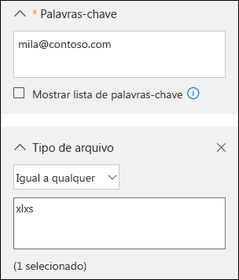
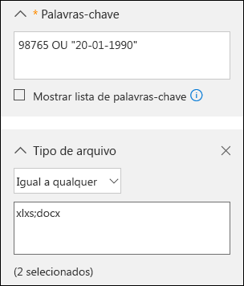
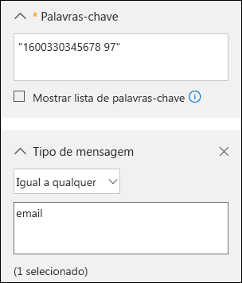

# <a name="office-365-data-subject-requests-for-the-gdpr-and-ccpa"></a>Solicitações de assunto de dados do Office 365 para o GDPR e o CCPA

## <a name="introduction-to-dsrs"></a>Introdução às DSRs

The European Union [General Data Protection Regulation (GDPR)](https://ec.europa.eu/justice/data-protection/reform/index_en.htm) gives rights to people (known in the regulation as *data subjects*) to manage the personal data that has been collected by an employer or other type of agency or organization (known as the *data controller* or just *controller*). Personal data is defined broadly under the GDPR as any data that relates to an identified or identifiable natural person. The GDPR gives data subjects specific rights to their personal data; these rights include obtaining copies of it, requesting changes to it, restricting the processing of it, deleting it, or receiving it in an electronic format so it can be moved to another controller. A formal request by a data subject to a controller to take an action on their personal data is called a *Data Subject Request* or DSR. The controller is obligated to promptly consider each DSR and provide a substantive response either by taking the requested action or by providing an explanation for why the DSR cannot be accommodated by the controller. A controller should consult with its own legal or compliance advisers regarding the proper disposition of any given DSR.

Da mesma forma, a Lei de Privacidade do Consumidor da Califórnia (CCPA), fornece direitos e obrigações de privacidade aos consumidores da Califórnia, incluindo direitos semelhantes aos Direitos do Titular dos Dados do GDPR, como o direito de excluir, acessar e receber (portabilidade) suas informações pessoais. O CCPA também fornece certas divulgações, proteções contra discriminação ao eleger direitos de exercício e requisitos de "aceitação/recusa" para determinadas transferências de dados classificadas como "vendas". As vendas são amplamente definidas para incluir o compartilhamento de dados para uma consideração valiosa. Para obter mais informações sobre o CCPA, confira a [Lei de Privacidade do Consumidor da Califórnia](offering-ccpa.md) e as [Perguntas Frequentes Sobre a Lei de Privacidade do Consumidor da Califórnia](ccpa-faq.md).

O guia aborda como usar produtos, serviços e ferramentas administrativas do Office 365 para ajudá-lo a encontrar e a trabalhar com dados pessoais ou informações pessoais para responder ao DSRs. Especificamente, isso inclui como localizar, acessar e atuar em dados pessoais ou informações pessoais que estão na nuvem da Microsoft. Veja a seguir uma visão geral rápida dos processos descritos neste guia:

- **Descobrir** – use ferramentas de pesquisa e descoberta para localizar dados pessoais que possam ser a entidade de uma solicitação DSR. Após a coleta dos documentos que atendem à solicitação, você pode executar uma ou mais das ações de DSR a seguir para responder à solicitação. Como alternativa, você pode determinar que a solicitação não atende às diretrizes da sua organização para responder a DSRs.
- **Acesso:** recupere dados pessoais que residem na nuvem da Microsoft e, se solicitado, faça uma cópia para disponibilizar para o titular dos dados.
- **Retificação:** faça alterações ou implemente outras ações solicitadas nos dados pessoais, onde for possível.
- **Restringir:** restrinja o processamento de dados pessoais, removendo licenças de vários serviços em nuvem da Microsoft ou desativando os serviços desejados sempre que possível. Você também pode remover dados da nuvem da Microsoft e retê-los localmente ou em outro lugar.
- **Exclusão:** remova permanentemente os dados pessoais que residem na nuvem da Microsoft.
- **Exportar/Receber (Portabilidade): ** forneça uma cópia eletrônica (em formato legível para computador) de dados pessoais ou informações pessoais para o titular dos dados. Os dados pessoais do CCPA são quaisquer informações relacionadas a uma pessoa, identificável ou não. Não há distinção entre as funções pública, privada ou de trabalho de uma pessoa. O termo definido "informações pessoais" se alinha aproximadamente aos "dados pessoais" do RGPD. No entanto, o CCPA também inclui dados da família e do domicílio. Para obter mais informações sobre o CCPA, confira a [Lei de Privacidade do Consumidor da Califórnia](offering-ccpa.md) e as [Perguntas Frequentes Sobre a Lei de Privacidade do Consumidor da Califórnia](ccpa-faq.md).

### <a name="terminology"></a>Terminologia

Veja a seguir as definições dos termos do RGPD que são relevantes para este guia.

- **Controlador:** a pessoa física ou jurídica, autoridade pública, órgão ou outra entidade que, sozinha ou em conjunto com terceiros, determina os fins e os meios do processamento de dados pessoais, onde tais fins e meios são determinados por lei da União ou Estado-Membro, o controlador ou os critérios específicos para sua indicação podem ser fornecidos por lei da União ou Estado-Membro.
- **Dados pessoais e titular dos dados:** qualquer informação relativa a uma pessoa natural identificada ou identificável (“titular dos dados”); uma pessoa natural identificável é aquela que pode ser identificada, direta ou indiretamente, especialmente por referência a um identificador, como nome, um número de identificação, dados de localização, um identificador online ou um ou mais fatores específicos de natureza física, fisiológica, genética, mental, econômica, cultural ou social dessa pessoa natural.
- **Processador:** uma pessoa física ou jurídica, autoridade pública, órgão ou outra entidade que processa dados pessoais em nome do controlador.
- **Dados do cliente:** Todos os dados, incluindo todos os arquivos de texto, som, vídeo ou imagem e software, fornecidos à Microsoft por um cliente, em nome de um cliente ou por meio do uso do serviço corporativo. Os Dados do Cliente incluem tanto (1) informações identificáveis de usuários finais (por exemplo, nomes de usuário e informações de contato no Active Directory do Azure) quanto Conteúdo do Cliente para o qual o cliente carrega arquivos ou que é criado em serviços específicos (por exemplo, conteúdo do cliente em um documento de Word ou Excel, ou no texto de um email do Exchange Online; conteúdo do cliente adicionado a um site do SharePoint Online ou salvo em uma conta do OneDrive for Business).
- **Logs gerados pelo sistema:** logs e dados relacionados gerados pela Microsoft que ajudam a Microsoft a fornecer serviços corporativos aos usuários. Os logs gerados pelo sistema contêm principalmente dados pseudonimizados, como identificadores exclusivos — normalmente, um número gerado pelo sistema não pode, por si só, identificar uma pessoa individual, mas é usado para fornecer os serviços corporativos aos usuários. Os logs gerados pelo sistema também podem conter informações identificáveis sobre os usuários finais, como um nome de usuário.

### <a name="how-to-use-this-guide"></a>Como usar este guia

Para ajudar você a encontrar informações relevantes ao seu caso de uso, este guia está dividido em quatro partes.

- **[Parte 1: Respondendo a DSRs para Dados do Cliente](#part-1-responding-to-dsrs-for-customer-data):** *Dados do Cliente* são dados produzidos e armazenados no Office 365 nas operações diárias da sua empresa. Exemplos de aplicativos mais usados do Office 365 que permitem a criação de dados incluem Word, Excel, PowerPoint, Outlook e OneNote. O Office 365 também consiste em aplicativos como o SharePoint Online, Teams e Forms, que permitem uma melhor colaboração com outras pessoas. A Parte 1 deste guia discute como descobrir, acessar, retificar, restringir, excluir e exportar dados de aplicativos do Office 365 que tenham sido usados para criar e armazenar dados em serviços online do Office 365. Ela aborda produtos e serviços para os quais a Microsoft atua como um processador de dados para sua organização e, portanto, o recurso de DSR é disponibilizado para o administrador do locatário.
- **[Parte 2: Respondendo a DSRs relacionadas aos Insights Gerados pelo Office 365](#part-2-responding-to-dsrs-with-respect-to-insights-generated-by-office-365):** O Office 365 fornece certos insights por meio de serviços como o Delve, o MyAnalytics e o Workplace Analytics. Como esses insights são gerados e como responder a DSRs relacionadas a eles é explicado na Parte 2 deste guia.
- **[Parte 3: Respondendo a DSRs para logs gerados pelo sistema](#part-3-responding-to-dsrs-for-system-generated-logs):** Quando você usa os serviços corporativos do Office 365, a Microsoft gera algumas informações, como logs de serviço que registram o uso ou o desempenho dos recursos nos serviços online. A maioria dos dados gerados pelo serviço contém identificadores pseudônimos gerados pela Microsoft e, portanto, essa categoria é geralmente referida neste documento como *logs gerados pelo sistema*. Embora esses dados não possam ser atribuídos a uma entidade de dados específica sem o uso de informações adicionais, alguns deles podem ser considerados pessoais de acordo com a definição do RGPD para "dados pessoais". A Parte 3 deste guia discute como acessar, excluir e exportar logs gerados pelo sistema.
- **[Parte 4: Recursos adicionais para ajudá-lo com as DSRs](#part-4-additional-resources-to-assist-you-with-dsrs):** A Parte 4 deste guia lista cenários limitados em que a Microsoft é o controlador de dados quando determinados produtos e serviços do Office 365 são usados.

>[!NOTE]
>In most cases, when users in your organization use Microsoft Office 365 products and services, you are the data controller and Microsoft is the processor. As a data controller, you are responsible for responding to the data subject directly. To assist you with this, Parts 1-3 of this guide detail the technical capabilities available to your organization to respond to a DSR request. In some limited scenarios, however, Microsoft will be the data controller when people use certain Office 365 products and services. In these cases, the information in Part 4 provides guidance on how data subjects can submit DSR requests to Microsoft.

### <a name="office-365-national-clouds"></a>Nuvens nacionais do Office 365

The Microsoft Office 365 services are also available in the following national cloud environments: [Office 365 Germany](https://docs.microsoft.com/microsoft-365/admin/admin-overview/learn-about-office-365-germany), [Office 365 operated by 21Vianet (China)](https://docs.microsoft.com/microsoft-365/admin/services-in-china/services-in-china), and [Office 365 US Government](https://www.microsoft.com/microsoft-365/government/compare-office-365-government-plans). Most of the guidance for managing data subject requests described in this document applies to these national cloud environments. However, due to the isolated nature of these environments, there are some exceptions. Where notable for a given subsection, these exceptions are called out in a corresponding note.

### <a name="hybrid-deployments"></a>Implantações híbridas

Your organization may consist of Microsoft offerings that are a combination of cloud-based services and on-premises server products. In general, a hybrid deployment is typically the sharing of user accounts (identity management) and resources (such as mailboxes, web sites, and data) that exist in the cloud and on-premises. Common hybrid scenarios include:

- Implantações híbridas do Exchange, em que alguns usuários têm uma caixa de correio local e outros usuários têm caxas de correio do Exchange Online.
- Implantações híbridas do SharePoint, em que servidores de sites e arquivos são locais, e contas do OneDrive for Business estão no Office 365.
- O sistema de gerenciamento de identidade local (Active Directory) que é sincronizado com o Azure Active Directory, que é o serviço de diretório no Office 365.

When responding to a DSR request, you may have to determine if data that's responsive to a DSR request is in the Microsoft cloud or in your on-premise organization, and then take the appropriate steps to respond to that request. The Office 365 Data Subject Request Guide (this guide) provides guidance for responding to cloud-based data. For guidance for data in your on-premises organization, see [GDPR for Office on-premises Servers](https://docs.microsoft.com/Office365/Enterprise/gdpr-for-office-servers).

## <a name="part-1-responding-to-dsrs-for-customer-data"></a>Parte 1: Responder às DSRs para Dados do Cliente

As diretrizes para responder às DSRs para Dados do Cliente estão divididas nas quatro seções a seguir:

- [Usar a ferramenta Descoberta Eletrônica de Pesquisa de Conteúdo para responder às DSRs](#using-the-content-search-ediscovery-tool-to-respond-to-dsrs)
- [Usar a funcionalidade no aplicativo para responder às DSRs](#using-in-app-functionality-to-respond-to-dsrs)
- [Responder às solicitações de retificação de DSR](#responding-to-dsr-rectification-requests)
- [Responder às solicitações de restrição de DSR](#responding-to-dsr-restriction-requests)

### <a name="how-to-determine-the-office-365-applications-that-may-be-in-scope-for-a-dsr-for-customer-data"></a>Como determinar os aplicativos do Office 365 que podem estar no escopo de uma DSR para Dados do Cliente

Para ajudá-lo a determinar onde procurar dados pessoais ou o que pesquisar, ele ajuda a identificar os aplicativos do Office 365 que as pessoas em sua organização podem usar para criar e armazenar dados no Office 365. Saber isso restringe os aplicativos do Office 365 que estão no escopo de uma DSR e ajuda a determinar como pesquisar e acessar dados pessoais relacionados a uma DSR. Especificamente, isso significa se você pode usar a ferramenta Pesquisa de Conteúdo ou se deve usar a funcionalidade do aplicativo em que os dados foram criados.

A quick way to identify the Office 365 applications that people in your organization are using to create Customer Data is to determine which applications are included in your organization's Microsoft 365 for business subscription. To do this, you can access user accounts in the Office 365 admin portal and look at the product licensing information. See [Assign licenses to users](../admin/manage/assign-licenses-to-users.md).

## <a name="using-the-content-search-ediscovery-tool-to-respond-to-dsrs"></a>Usar a ferramenta Descoberta Eletrônica de Pesquisa de Conteúdo para responder às DSRs

When looking for personal data within the larger set of data your organization creates and stores using in Office 365, you may want to first consider which applications people have most likely used to author the data you're looking for. Microsoft estimates that over 90% of an organization's data that is stored in Office 365 is authored in Word, Excel, PowerPoint, OneNote, and Outlook. Documents authored in these Office applications, even if purchased through Microsoft 365 Apps for enterprise or an Office perpetual license, are most likely stored on a SharePoint Online site, in a user's OneDrive for Business account, or in a user's Exchange Online mailbox. That means you can use the Content Search eDiscovery tool to search (and perform other DSR-related actions) across SharePoint Online sites, OneDrive for Business accounts, and Exchange Online mailboxes (including the sites and mailboxes associated with Microsoft 365 Groups, Microsoft Teams, EDU Assignments) to find documents and mailbox items that may be relevant to the DSR you're investigating. You can also use the Content Search tool to discover Customer Data authored in other Office 365 applications.

A tabela a seguir lista os aplicativos do Office 365 que as pessoas usam para criar Conteúdo Criado pelo Cliente e que pode ser descoberto usando a Pesquisa de Conteúdo. Esta seção do guia da DSR fornece orientação sobre como descobrir, acessar, exportar e excluir dados criados com esses aplicativos do Office 365.

***Tabela 1: Aplicativos em que a Pesquisa de Conteúdo pode ser usada para encontrar Dados do Cliente***

| | |
| :---: | :---:|
 <br> Calendário |  <br> SharePoint  |
|  <br> Excel |  <br> Skype for Business |
|  <br> Office Lens |  <br> Tarefas |
|  <br> OneDrive for Business | <br> Teams |
|  <br> OneNote|  <br> To Do |
|  <br> Outlook/Exchange |  <br> Vídeo |
|  <br> Pessoas |  <br> Visio |
|  <br> PowerPoint |  <br> Word
||

>[!NOTE]
>The Content Search eDiscovery tool is not available in [Office 365 operated by 21Vianet (China)](https://docs.microsoft.com/microsoft-365/admin/services-in-china/services-in-china). This means you won't able to use this tool to search for and export Customer Data in the Office 365 applications shown in Table 1. However, you can use the In-Place eDiscovery tool in Exchange Online to search for content in user mailboxes. You can also use the eDiscovery Center in SharePoint Online to search for content in SharePoint sites and OneDrive accounts. Alternatively, you can ask a document owner to help you find and make changes or deletions to content or export it if necessary. For more information, see:</br><br> * [Criar uma pesquisa de Descoberta Eletrônica no local](https://docs.microsoft.com/exchange/create-in-place-ediscovery-search-exchange-2013-help)<br> * [Configurar um Centro de Descoberta Eletrônica no SharePoint Online](https://support.office.com/article/Set-up-an-eDiscovery-Center-in-SharePoint-Online-A18F8975-AA7F-43B4-A7D6-001D14744D8E)

### <a name="using-content-search-to-find-personal-data"></a>Usar a Pesquisa de Conteúdo para encontrar dados pessoais

A primeira etapa ao responder a uma DSR é localizar os dados pessoais do titular da DSR. Isso consiste em usar as ferramentas de Descoberta Eletrônica do Office 365 para pesquisar dados pessoais (entre todos os dados da sua organização no Office 365) ou ir diretamente para o aplicativo nativo no qual os dados foram criados. Esta primeira etapa, localizar e revisar os dados pessoais em questão, ajuda a determinar se uma DSR atende aos requisitos de sua organização para aceitar ou recusar uma solicitação de entidade de dados. Por exemplo, depois de encontrar e revisar os dados pessoais em questão, você pode determinar que a solicitação não atende aos requisitos da sua organização, pois isso pode afetar adversamente os direitos e liberdades de outras pessoas ou porque os dados pessoais estão contidos em um registro comercial que sua organização tem um interesse comercial legítimo em reter.

As previously stated, Microsoft estimates that over 90% of an organization's data is created with Office applications, such as Word and Excel. This means that you can use the Content Search in the Security & Compliance Center to search for most DSR-related data.

This guide assumes that you or the person searching for personal data that may be responsive to a DSR request is familiar with or has experience using the Content Search tool in the Security & Compliance Center. For general guidance on using Content Search, see [Content Search in Office 365](https://docs.microsoft.com/microsoft-365/compliance/content-search). Be sure that the person running the searches has been assigned the necessary permissions in the Security & Compliance Center. This person should be added as a member of the eDiscovery Manager role group in the Security & Compliance Center; see [Assign eDiscovery permissions in the Security & Compliance Center](https://docs.microsoft.com/microsoft-365/compliance/assign-ediscovery-permissions). Consider adding other people in your organization who are involved in investigating DSRs to the eDiscovery Manager role group, so they can perform the necessary actions in the Content Search tool such as previewing and exporting search results. However, unless you set up compliance boundaries (as described [here](#set-up-compliance-boundaries-to-limit-the-scope-of-content-searches)) be aware that an eDiscovery Manager can search all content locations in your organization, including ones that may not be related to a DSR investigation.

Depois de encontrar os dados, você pode executar uma ação específica que atenda à solicitação feita pelo titular dos dados.

>[!NOTE]
>No Office 365 Germany, o Centro de Conformidade e Segurança está localizado em https://protection.office.de.

#### <a name="searching-content-locations"></a>Pesquisar locais de conteúdo

Você pode pesquisar os tipos de local de conteúdo a seguir com a ferramenta Pesquisa de Conteúdo.

- Caixas de correio do Exchange Online. Isso inclui as caixas de correio associadas aos Grupos do Microsoft 365 e o Microsoft Teams
- Pastas públicas do Exchange Online
- Sites do SharePoint Online. Isso inclui os sites associados aos Grupos do Microsoft 365 e ao Microsoft Teams
- Contas do OneDrive for Business

>[!NOTE]
>This guide assumes that all data that might be relevant to a DSR investigation is stored in Office 365; in other words, stored in the Microsoft cloud. Data stored on a user's local computer or on-premises on your organization's file servers is outside the scope of a DSR investigation for data stored in Office 365. For guidance about responding to DSR requests for data in on-premises organizations, see [GDPR for Office on-premises Servers](https://docs.microsoft.com/Office365/Enterprise/gdpr-for-office-servers).

#### <a name="tips-for-searching-content-locations"></a>Dicas para pesquisar locais de conteúdo

- Comece pesquisando todos os locais de conteúdo da organização (o que pode ser feito em uma única pesquisa) para determinar rapidamente quais locais de conteúdo possuem itens que correspondem à sua consulta de pesquisa. Em seguida, você pode fazer uma nova pesquisa e limitar o escopo dela aos locais específicos que apresentam itens relevantes.
- Use search statistics to identify the top locations that contain items that match your search query. See [View keyword statistics for Content Search results](https://docs.microsoft.com/microsoft-365/compliance/view-keyword-statistics-for-content-search).
- Pesquise no log de auditoria as atividades recentes de arquivos e pastas executadas pelo usuário que é o titular do DSR. Pesquisar o log de auditoria traz uma lista de registros de auditoria que contêm o nome e o local de recursos que o usuário interagiu recentemente.  Você pode usar essas informações para criar uma consulta de pesquisa de conteúdo. Confira [Pesquisar o log de auditoria no Centro de Conformidade e Segurança](https://docs.microsoft.com/microsoft-365/compliance/search-the-audit-log-in-security-and-compliance).

#### <a name="building-search-queries-to-find-personal-data"></a>Criar consultas de pesquisa para encontrar dados pessoais

A DSR que você está investigando provavelmente contém identificadores que você pode usar na consulta de pesquisa de palavras-chave para pesquisar os dados pessoais. Aqui estão alguns identificadores comuns que podem ser usados em uma consulta de pesquisa para localizar dados pessoais:

- Alias ou endereço de email
- Número de telefone
- Endereço para correspondência
- Número de identificação do funcionário
- Número de identificação nacional ou versão de um número de seguro social do membro da UE

A DSR que você está investigando provavelmente terá um identificador e outros detalhes sobre os dados pessoais que são o assunto da solicitação e podem ser usados em uma consulta de pesquisa.

Pesquisar apenas um endereço de email ou ID do funcionário provavelmente retornará muitos resultados. Para limitar o escopo da pesquisa para que ela retorne o conteúdo mais relevante à DSR, você pode adicionar condições à consulta de pesquisa. Quando você adiciona uma condição, a palavra-chave e uma condição de pesquisa são conectadas de modo lógico pelo operador Booliano **AND**.  Isso significa que apenas os itens que corresponderem a *ambas* (palavra-chave e condição) serão retornados nos resultados da pesquisa. 

The following table lists some conditions you can use to narrow the scope of a search. The table also lists the values that you can use for each condition to search for specific document types and mailbox items.

***Tabela 2: Limitar o escopo da pesquisa usando condições***

||||
| :--- | :--- |:--- |
|**Condição**|**Descrição** |**Exemplo de valores de condição**|
| Tipo de arquivo | A extensão de um documento ou arquivo. Use esta condição para pesquisar documentos e arquivos do Office criados por aplicativos do Office 365. Use essa condição ao pesquisar documentos em sites do SharePoint Online e em contas do OneDrive for Business.<br/>A propriedade do documento correspondente é o tipo de arquivo. <br/>Para obter uma lista completa das extensões de arquivo que podem ser pesquisadas, confira o artigo sobre extensões de nome de arquivo rastreadas e tipos de arquivo analisados padrão no SharePoint](https://technet.microsoft.com/library/jj219530.aspx).|&nbsp;&bull;&nbsp;&nbsp;csv — pesquisa arquivos CSV (valores separados por vírgula); os arquivos do Excel podem ser salvos no formato CSV e o arquivo CSV pode ser importado facilmente no Excel<br><br>&bull;&nbsp;&nbsp;docx —pesquisa arquivos do Word <br><br>&bull;&nbsp;&nbsp;mpp — pesquisa arquivos do Project<br/><br>&bull;&nbsp;&nbsp;one — pesquisa arquivos do OneNote <br><br>&bull;&nbsp;&nbsp;pdf — pesquisa arquivos salvos em um formato PDF <br><br>&bull;&nbsp;&nbsp;pptx — pesquisa arquivos do PowerPoint <br><br>&bull;&nbsp;&nbsp;xlxs — pesquisa arquivos do Excel <br><br>&bull;&nbsp;&nbsp;vsd — pesquisa arquivos do Visio <br><br>&bull;&nbsp;&nbsp;wmv — pesquisa arquivos do Windows Media <br>|
| Tipo de mensagem | Tipo de mensagem de email para pesquisar. Use esta condição para pesquisar caixas de correio de contatos (Pessoas), tarefas de reuniões (Calendário) ou conversas do Skype for Business. A propriedade de email correspondente é *tipo*.|&bull;&nbsp;&nbsp;*contatos — pesquisa a lista Meus Contatos (Pessoas) de uma caixa de correio <br><br>&bull;&nbsp;&nbsp;* email — pesquisa mensagens de email <br><br>&bull;&nbsp;&nbsp;*im — pesquisa conversas do Skype for Business <br><br>&bull;&nbsp;&nbsp;* reuniões — pesquisa compromissos e solicitações de reunião (Calendário) <br><br>&bull;&nbsp;&nbsp;*tarefas — pesquisa a lista Minhas Tarefas (Tarefas); usar esse valor também retornará tarefas criadas no Microsoft To Do.<br>|
| Marca de conformidade |The label assigned to an email message or a document. Labels are used to classify email and documents for data governance and enforce retention rules based on the classification defined by the label. Use this condition to search for items that have been automatically or manually assigned a label.<br/>This is a useful condition for DSR investigations because your organization may be using labels to classify content related to data privacy or that contains personal data or sensitive information. See the "Using Content Search to find all content with a specific label applied to it" section in [Overview of labels in Office 365.](https://docs.microsoft.com/microsoft-365/compliance/labels)|compliancetag="personal data"|
||||

There are many more email and document properties and search conditions that you can use to build more complex search queries. See the following sections in the [Keyword queries and search conditions for Content Search](https://docs.microsoft.com/microsoft-365/compliance/keyword-queries-and-search-conditions) help topic for more information.

- [Propriedades de emails pesquisáveis](https://docs.microsoft.com/microsoft-365/compliance/keyword-queries-and-search-conditions)
- [Propriedades de site pesquisáveis (documento)](https://docs.microsoft.com/microsoft-365/compliance/keyword-queries-and-search-conditions)
- [Condições de pesquisa](https://docs.microsoft.com/microsoft-365/compliance/keyword-queries-and-search-conditions)

#### <a name="searching-for-personal-data-in-sharepoint-lists-discussions-and-forms"></a>Pesquisar dados pessoais em listas, discussões e formulários do SharePoint

In addition to searching for personal data in documents, you can also use Content Search to search for other types of data that's created by using native SharePoint Online apps. This includes data created by using SharePoint lists, discussions, and forms. When you run a Content Search and search SharePoint Online sites (or OneDrive for Business accounts) data from lists, discussions, and forms that match the search criteria will be returned in the search results.

##### <a name="examples-of-search-queries"></a>Exemplos de consultas de pesquisa

Aqui estão alguns exemplos de consultas de pesquisa que usam palavras-chave e condições para pesquisar dados pessoais em resposta a uma DSR. Os exemplos mostram duas versões da consulta: uma mostrando a sintaxe de palavra-chave (onde a condição está incluída na caixa de palavra-chave) e outra mostrando a versão baseada em GUI da consulta com condições.

##### <a name="example-1"></a>Exemplo 1

Este exemplo retorna arquivos do Excel ou sites do SharePoint Online e contas do OneDrive for Business que contêm o endereço de email especificado. Os arquivos podem ser retornados se o endereço de email aparecer nos metadados do arquivo.

***Sintaxe da palavra-chave***

```Query
pilar@contoso.com AND filetype="xlxs"
```

***GUI***



##### <a name="example-2"></a>Exemplo 2

Este exemplo retorna arquivos do Excel ou Word nos sites do SharePoint Online e contas do OneDrive for Business que contêm a ID ou a data de nascimento especificada do funcionário.

(98765 OU "01-20-1990") E (tipo de arquivo="xlxs" OU tipo de arquivo="docx")

***GUI***



##### <a name="example-3"></a>Exemplo 3

Este exemplo retorna mensagens de email que contêm o número de identificação especificado, que é o Número de Inscrição na Previdência Social na França (INSEE)

```Query
"1600330345678 97" AND kind="email"
```

***GUI***



#### <a name="working-with-partially-indexed-items-in-content-search"></a>Trabalhar com itens parcialmente indexados na Pesquisa de Conteúdo

Itens parcialmente indexados (também chamados de *itens não indexados*) são itens e documentos da caixa de correio do Exchange Online nos sites do SharePoint Online e OneDrive for Business que, por algum motivo, não foram indexados para pesquisa, o que significa que eles não podem ser pesquisados usando a Pesquisa de Conteúdo. A maioria das mensagens de email e dos documentos de site é indexada com êxito, pois eles se enquadram nos [limites de indexação do Office 365](https://docs.microsoft.com/microsoft-365/compliance/limits-for-content-search).  Os motivos pelos quais as mensagens ou arquivos de email não são indexados para pesquisa incluem:

- O tipo de arquivo não é [reconhecido ou não tem suporte para indexação](https://docs.microsoft.com/microsoft-365/compliance/partially-indexed-items-in-content-search).  No entanto, às vezes o tipo de arquivo tem suporte para indexação, mas houve um erro de indexação com um arquivo específico.
- As mensagens de email têm um arquivo anexado sem um manipulador válido, como um arquivo de imagem (essa é a causa mais comum de itens de email parcialmente indexados)
- Os arquivos anexados às mensagens de email são muito grandes ou há muitos arquivos anexados

We recommend that you learn more about partially indexed items so that you can work with them when responding to DSR requests. For more information, see:

- [Itens parcialmente indexados na Pesquisa de Conteúdo do Office 365](https://docs.microsoft.com/microsoft-365/compliance/partially-indexed-items-in-content-search)
- [Investigar itens parcialmente indexados na Descoberta Eletrônica do Office 365](https://docs.microsoft.com/microsoft-365/compliance/investigating-partially-indexed-items-in-ediscovery)
- [Exportar itens não indexados](export-search-results.md)

#### <a name="tips-for-working-with-partially-indexed-items"></a>Dicas para trabalhar com itens parcialmente indexados

It's possible that data responsive to a DSR investigation may be in a partially indexed item. Here's some suggestions for working with partially indexed items:

- Depois de executar uma pesquisa, o número de itens parcialmente estimados é exibido nas estatísticas de pesquisa.  Essa estimativa não inclui itens parcialmente indexados no SharePoint Online e no OneDrive for Business. Exporte os relatórios para uma Pesquisa de Conteúdo a fim de obter informações sobre itens parcialmente indexados. O relatório **Unindexed Items.csv** contém informações sobre itens não indexados, incluindo o local do item, a URL, se o item estiver no SharePoint Online ou no OneDrive for Business, e a linha do assunto (para mensagens) ou o nome do documento. Para saber mais, confira [Exportar um relatório da Pesquisa de Conteúdo](https://docs.microsoft.com/microsoft-365/compliance/export-a-content-search-report).

- As estatísticas e a lista de itens parcialmente indexados que são retornadas com os resultados de uma Pesquisa de Conteúdo são todos os itens parcialmente indexados dos locais de conteúdo que são pesquisados.

- Para recuperar itens parcialmente indexados potencialmente responsivos a uma investigação de DSR, você pode executar uma das ações a seguir:

##### <a name="export-all-partially-indexed-items"></a>Exportar todos os itens parcialmente indexados

Você exporta os resultados de uma pesquisa de conteúdo e os itens parcialmente indexados do local de conteúdo que foi pesquisado. Você também pode exportar somente os itens parcialmente indexados. Em seguida, você pode abri-los em seus aplicativos nativos e analisar o conteúdo. Você deve usar essa opção para exportar itens do SharePoint Online e do OneDrive for Business. Confira [Exportar os resultados da Pesquisa de Conteúdo do Centro de Conformidade e Segurança](export-search-results.md).

##### <a name="export-a-specific-set-of-partially-indexed-items-from-mailboxes"></a>Exportar um conjunto específico de itens parcialmente indexados das caixas de correio

Em vez de exportar todos os itens de caixa de correio parcialmente indexados de uma pesquisa, você pode executar novamente uma Pesquisa de Conteúdo para procurar uma lista específica de itens parcialmente indexados e exportá-los. Você só pode fazer isso com itens de caixa de correios. Confira [Preparar um arquivo CSV para uma Pesquisa de Conteúdo direcionada no Office 365](https://docs.microsoft.com/microsoft-365/compliance/csv-file-for-an-id-list-content-search). 

### <a name="next-steps"></a>Próximas etapas

Depois de encontrar os dados pessoais relevantes para a DSR, certifique-se de manter a Pesquisa de Conteúdo específica que você usou para localizar os dados. Provavelmente, você reutilizará essa pesquisa para concluir outras etapas no processo de resposta DSR, como [obter uma cópia dela](#providing-a-copy-of-personal-data), [exportá-la](#exporting-personal-data) ou [excluí-la permanentemente](#deleting-personal-data). 

### <a name="additional-considerations-for-selected-applications"></a>Considerações adicionais para seleção de aplicativos

As seções a seguir descrevem o que você deve ter em mente durante a pesquisa de dados nos aplicativos do Office 365 que se seguem.

- [Office Lens](#office-lens)
- [Configurações de experiência do OneDrive for Business e SharePoint](#onedrive-for-business-and-sharepoint-online-experience-settings)
- [Microsoft Teams educacional](#microsoft-teams-for-education)
- [Microsoft To Do](#microsoft-to-do)
- [Skype for Business](#skype-for-business)

#### <a name="office-lens"></a>Office Lens

Uma pessoa usando o Office Lens (um aplicativo de câmera compatível com dispositivos iOS, Android e Windows) pode fotografar quadros de comunicações, documentos impressos, cartões de visita, entre outras coisas com muito texto. O Office Lens usa tecnologia de reconhecimento óptico de caracteres que extrai o texto em uma imagem e o salva em um documento do Office, como Word, PowerPoint e OneNote ou em um arquivo PDF. Os usuários podem então carregar o arquivo que contém o texto da imagem na respectiva conta do OneDrive for Business no Office 365.  Isso significa que você pode usar a ferramenta Pesquisa de Conteúdo para pesquisar, acessar, excluir e exportar dados em arquivos que foram criados a partir de uma imagem do Office Lens. Para saber mais sobre o Office Lens, confira:

- [Office Lens para iOS](https://support.microsoft.com/pt-BR/office/microsoft-office-lens-for-ios-fbdca5f4-1b1b-4391-a931-dc1c2582397b)
- [Office Lens para Android](https://support.office.com/article/Office-Lens-for-Android-ec124207-0049-4201-afaf-b5874a8e6f2b)
- [Office Lens para Windows](https://support.microsoft.com/pt-BR/office/office-lens-for-windows-577ec09d-8da2-4029-8bb7-12f8114f472a)

#### <a name="onedrive-for-business-and-sharepoint-online-experience-settings"></a>Configurações de experiência do OneDrive for Business e SharePoint

In addition to user-created files stored in OneDrive for Business accounts and SharePoint Online sites, these services store information about the user that is used to enable various experiences. Users still in your organization can access much of this information by using in-product functionality. The following information provides guidance on how to access, view, and export OneDrive for Business and SharePoint Online application data.

##### <a name="sharepoint-user-profiles"></a>Perfis de usuário do SharePoint

O perfil dos usuários no Delve permite que estes mantenham propriedades armazenadas no perfil de usuário do SharePoint, incluindo aniversário, número do celular (e outras informações de contato), sobre mim, projetos, habilidades e competências, escolas e formação, interesses e hobbies.

###### <a name="end-users"></a>Usuários finais

End users can discover, access, and rectify SharePoint Online user profile data using the Delve profile experience. See [View and update your profile in Office Delve](https://support.office.com/article/view-and-update-your-profile-in-office-delve-4e84343b-eedf-45a1-aeb9-8627ccca14ba) for more details.

Outra maneira de os usuários acessarem os dados de perfil do SharePoint é navegar até a **página de edição de perfil** na conta do OneDrive for Business, que pode ser acessada pelo caminho **EditProfile.aspx** sob a URL da conta do OneDrive for Business. Por exemplo, para um usuário <strong>usuario1@contoso.com</strong>, a conta do OneDrive for Business dele está localizada em:

```URL
`https://contoso-my.sharepoint.com/personal/user1\_contoso\_com/\_layouts/15/OneDrive.aspx`
```

A URL para a página de edição de perfil seria:

```URL
`https://contoso-my.sharepoint.com/personal/user1\_contoso\_com/\_layouts/15/EditProfile.aspx`
```

As propriedades originadas no Azure Active Directory não podem ser alteradas no SharePoint Online. No entanto, os usuários podem ir para a respectiva página **Conta** selecionando a respectiva **foto** no cabeçalho do Office 365 e, em seguida, selecionando **Minha Conta**. Alterar as propriedades aqui pode exigir que os usuários trabalhem com seus administradores para descobrir, acessar ou retificar uma propriedade do perfil de usuário.

###### <a name="admins"></a>Administradores

Um administrador pode acessar e retificar propriedades de perfil no centro de administração do SharePoint. No **centro de administração do SharePoint**, clique na guia **perfis de usuário**. Clique em **Gerenciar perfis de usuário**, insira um nome de usuário e clique em **Localizar**. O administrador pode clicar com o botão direito do mouse em qualquer usuário e selecionar **Editar meu Perfil**.  As propriedades originadas no Azure Active Directory não podem ser alteradas no SharePoint Online.

An admin can export all User Profile properties for a user by using the **Export-SPOUserProfile** cmdlet in SharePoint Online PowerShell. See  [Export-SPOUserProfile](https://docs.microsoft.com/powershell/module/sharepoint-online/export-spouserprofile?view=sharepoint-ps).

Para saber mais sobre perfis de usuário, confira [Gerenciar perfis de usuário no Centro de administração do SharePoint](https://docs.microsoft.com/sharepoint/manage-user-profiles).

##### <a name="user-information-list-on-sharepoint-online-sites"></a>Lista de informações do usuário em sites do SharePoint Online

Um subconjunto de perfis de usuário do SharePoint de um usuário é sincronizado com a lista Informações do usuário de todos os sites que ele visita ou tem permissões para acessar.  Isso é usado pelas experiências do SharePoint Online, como as colunas Pessoas nas bibliotecas de documentos, para exibir informações básicas sobre o usuário, como o nome do criador de um documento. Os dados em uma lista Informações do usuário correspondem às informações armazenadas no perfil de usuário do SharePoint e serão retificados automaticamente se a fonte for alterada. Para usuários excluídos, esses dados permanecem nos sites com os quais eles interagiram, para a integridade referencial dos campos de colunas do SharePoint. 

Admins can control which properties are replicable inside the SharePoint admin center. To do this:

1. Acesse o **Centro de Administração do SharePoint** e clique na guia **Perfis de usuário**.
2. Clique em **Gerenciar Propriedades do Usuário** para ver uma lista de propriedades.
3. Clique com o botão direito do mouse em qualquer propriedade, selecione **Editar** e ajuste várias configurações.
4. Em **Configurações de Política**, a propriedade replicável controla se a propriedade será representada na lista Informações do usuário.  Nem todas as propriedades dão suporte a esse ajuste.

An admin can export all User information properties for a user on a given site by using the **Export-SPOUserInfo** cmdlet in SharePoint Online PowerShell. See [Export-SPOUserInfo](https://docs.microsoft.com/powershell/module/sharepoint-online/export-spouserinfo?view=sharepoint-ps).

##### <a name="onedrive-for-business-experience-settings"></a>Configurações de experiência do OneDrive for Business

A user's OneDrive for Business experience stores information to help the user find and navigate content of interest to them. Most of this information can be accessed by end users using in-product features. An admin can export the information using a [PowerShell Script](https://docs.microsoft.com/powershell/scripting/overview) and [SharePoint Client-Side Object Model (CSOM)](https://docs.microsoft.com/sharepoint/dev/sp-add-ins/complete-basic-operations-using-sharepoint-client-library-code) commands.

Veja [Exportar as configurações da experiência do OneDrive for Business](https://docs.microsoft.com/sharepoint/export-odfb-lists) para saber mais sobre as configurações, como elas são armazenadas e como exportá-las.

##### <a name="onedrive-for-business-and-sharepoint-online-search"></a>Pesquisa do OneDrive for Business e SharePoint Online

The in-app search experience in OneDrive for Business and SharePoint Online stores a user's search queries for 30 days to increase relevance of search results. An admin can export search queries for a user by using the **Export-SPOQueryLogs** cmdlet in SharePoint Online PowerShell. See [Export-SPOQueryLogs](https://docs.microsoft.com/powershell/module/sharepoint-online/export-spoquerylogs?view=sharepoint-ps).

#### <a name="microsoft-teams-for-education"></a>Microsoft Teams educacional

Microsoft Teams for Education offers two additional collaboration features that teachers and students can use that creates and stores personal data: Assignments and OneNote Class Notebook. You can use Content Search to discover data in both.

##### <a name="assignments"></a>Atribuições

Students files associated with an Assignment are stored in a document library in the corresponding Teams SharePoint Online site. IT admins can use the Content Search tool to search for student files that are related to assignments. For example, an admin could search all SharePoint Online sites in the organization and use the student's name and class or assignment name in the search query to find data relevant to a DSR.

There's other data related to Assignments that isn't stored in the class team SharePoint Online site, which means it's not discoverable with Content Search. This includes:

- Arquivos que o professor atribui aos alunos como parte da atribuição
- Notas do aluno e comentários do professor
- A lista de documentos enviados para uma atribuição por cada aluno
- Metadados de atribuição

Para esse tipo de dado, um administrador de TI ou proprietário de dados (como um professor) pode ter que entrar em Atribuição na equipe da classe para encontrar dados relevantes a uma DSR.

##### <a name="onenote-class-notebook"></a>Bloco de Anotações de Classe do OneNote

The OneNote Class Notebook is stored in the class team SharePoint Online site. Every student in a class has a private notebook that's shared with the teacher. There's also a content library where a teacher can share documents with students, and a collaboration space for all students in the class. Data related to these capabilities is discoverable with Content Search.

Veja a seguir as diretrizes específicas para pesquisar por um Bloco de Anotações de Classe.

1. Execute uma Pesquisa de Conteúdo usando os seguintes critérios de pesquisa:

   - Pesquisar todos os sites do SharePoint Online

   - Inclua o nome da equipe de classe como uma palavra-chave de pesquisa; por exemplo, "Biologia 9C".

2. Visualize os resultados da pesquisa e procure o item que corresponde ao Bloco de Anotações de Classe.
3. Select that item, and then copy the folder path that's displayed in the details pane. This is the root folder for the Class Notebook.
4. Edit the search that you created in step 1 and replace the class name in the keyword query with the folder path of the Class Notebook and precede the folder path with the **path** site property; for example, **path:"<https://contosoedu.onmicrosoft.com/sites/9C> Biology/SiteAssets/9C Biology Notebook/"**. Be sure to include the quotation marks and the trailing forward slash.
5. Adicione uma condição de pesquisa e selecione a condição Tipo de Arquivo e use um para o valor do tipo de arquivo.  Isso retorna todos os arquivos do OneNote nos resultados da pesquisa. A sintaxe da palavra-chave resultante seria parecida com esta: [](#building-search-queries-to-find-personal-data)

    ```Query
   path:"<https://contosoedu.onmicrosoft.com/sites/9C> Biology/SiteAssets/9C Biology Notebook/" AND filetype="one"
   ```

6.  Executar novamente a Pesquisa de Conteúdo. Os resultados da pesquisa devem incluir todos os arquivos do OneNote para o Bloco de Anotações de Classe da equipe da classe.

#### <a name="microsoft-to-do"></a>Microsoft To Do

As tarefas (chamadas de *tarefas pendentes*, que são salvas em *listas de tarefas*) no Microsoft To Do são salvas como tarefas na caixa de correio do Exchange Online de um usuário. Isso significa que você pode usar a ferramenta de Pesquisa de Conteúdo para pesquisar, acessar, excluir e exportar tarefas pendentes. Para obter mais informações, consulte [Configurar o Microsoft To Do](https://support.microsoft.com/pt-BR/office/set-up-microsoft-to-do-490c1a8c-2333-4952-8125-841afadb9620).

#### <a name="skype-for-business"></a>Skype for Business

Veja algumas informações adicionais sobre como acessar, exibir e exportar dados pessoais no Skype for Business.

- Files attached to a meeting are retained in the actual meeting for 180 days and then become inaccessible. These files can be accessed by meeting participants by joining the meeting from the meeting request and then viewing or downloading the attached file. See the "Use the attachments in the meeting" section in [Preload attachments for a Skype for Business meeting](https://support.microsoft.com/pt-BR/office/preload-attachments-for-a-skype-for-business-meeting-fd3d9f9d-b448-4754-b813-02e49393f251).
- Conversations in Skype for Business are retained in the Conversation History folder in user mailboxes. You can use Content Search to search mailboxes for data in Skype conversations.
- A data subject can export their contacts in Skype for Business. To do this, they would right-click a contact group in Skype for Business and click **Copy**. Then they can paste the list of email addresses into a text or Word document.
- If the Exchange Online mailbox of a meeting participant is placed on Litigation Hold or assigned to an Office 365 retention policy, files attached to a meeting are retained in the participants mailbox. You can use Content Search to search for those files in the participant's mailbox if the retention period for the file has not expired. For more information about retaining files, see [Retaining large files attached to a Skype for Business meeting](https://docs.microsoft.com/skypeforbusiness/set-up-policies-in-your-organization/retaining-large-files-attached-to-a-meeting).

## <a name="providing-a-copy-of-personal-data"></a>Fornecer uma cópia dos dados pessoais

After you've found personal data that is potentially responsive to a DSR, it's up to you and your organization to decide which data to provide the data subject. For example, you can provide them with a copy of the actual document, an appropriately redacted version, or a screenshot of the portions that you've deemed appropriate to share. For each of these responses to an access request, you'll have to retrieve a copy of the document or other item that contains the responsive data.

Ao oferecer uma cópia ao titular dos dados, talvez você tenha que remover ou redigir informações pessoais sobre outros titulares de dados e quaisquer informações confidenciais.

### <a name="using-content-search-to-get-a-copy-of-personal-data"></a>Usar a Pesquisa de Conteúdo para obter uma cópia dos dados pessoais

Existem duas maneiras de usar a ferramenta Pesquisa de Conteúdo para obter uma cópia de um documento ou item da caixa de correio que você encontrou após executar uma pesquisa.

- Preview the search results and then download a copy of the document or item. This is a good way to download a few items or files.
- Exporte os resultados da pesquisa e baixe uma cópia de todos os itens retornados pela pesquisa. Esse método é mais complexo, mas é uma boa maneira de baixar muitos itens que respondam à DSR. Relatórios úteis também são incluídos com os resultados da pesquisa exportados. Você pode usar esses relatórios para obter informações adicionais sobre cada item. O relatório **Results.csv** é útil, pois contém muitas informações sobre os itens exportados, como o local exato do item (por exemplo, a caixa de correio das mensagens de email, ou a URL para documentos ou listas localizados em sites do SharePoint Online e OneDrive for Business).  Essas informações ajudarão a identificar o proprietário do item, caso você precise contatá-lo durante o processo de investigação de DSR. Para saber mais sobre os relatórios que são incluídos na exportação dos resultados da pesquisa, confira [Exportar um relatório de Pesquisa de Conteúdo](https://docs.microsoft.com/microsoft-365/compliance/export-a-content-search-report). 

#### <a name="preview-and-download-items"></a>Visualizar e baixar itens

Depois de executar uma nova pesquisa ou abrir uma pesquisa existente, é possível visualizar cada item que correspondeu à consulta de pesquisa a fim de verificar se ele está relacionado à DSR que você está investigando. Isso também inclui listas e páginas da Web do SharePoint que são retornadas nos resultados da pesquisa. Também é possível baixar o arquivo original se você tiver que fornecê-lo ao titular dos dados.  Em ambos os casos, você faz uma captura a tela para atender à solicitação do titular dos dados de obter as informações.

Alguns tipos de itens não podem ser visualizados. Se um tipo de item ou arquivo não tiver suporte para visualização, existe a opção de baixar um item individual para o seu computador local, ou uma unidade de rede mapeada, ou outro local de rede. Você pode visualizar apenas [tipos de arquivo com suporte](https://docs.microsoft.com/microsoft-365/compliance/content-search).

Para visualizar e baixar itens:

1. Abra a Pesquisa de Conteúdo no Centro de Conformidade e Segurança.
2. Se os resultados não forem exibidos, clique em **Visualizar resultados**.
3. Clique em um item para exibi-lo.
4. Click **Download original file** to download the item to your local computer. You'll also have to download items that can't be previewed.

Para obter mais informações sobre como visualizar resultados da pesquisa, confira [Visualizar resultados da pesquisa](https://docs.microsoft.com/microsoft-365/compliance/content-search).

#### <a name="export-and-download-items"></a>Exportar e baixar itens

You can also export the results of a content search to get a copy of email messages, documents, lists, and web pages containing the personal data, though this method is more involved than previewing items. See the next section for details about [exporting the results of a Content Search](#export-and-download-content-using-content-search).

## <a name="exporting-personal-data"></a>Exportar dados pessoais

The "right of data portability" allows a data subject to request an electronic copy of personal data that's in a "structured, commonly used, machine-readable format", and to request that your organization transmit these electronic files to another data controller. Microsoft supports this right in two ways:

- Oferecendo aplicativos do Office 365 que salvam dados em formato eletrônico nativo frequentemente usado, que possa ser lido por máquina. Para saber mais sobre formatos de arquivo do Office, confira os [Documentos Técnicos sobre os Formatos de Arquivo do Office](https://msdn.microsoft.com/library/office/cc313105(v=office.12).aspx).
- Permitindo que a sua organização exporte os dados no formato de arquivo nativo ou em um formato (como CSV, TXT e JSON) que possa ser facilmente importado para outro aplicativo.

Para atender a uma solicitação de exportação de DSR, você pode exportar documentos do Office em seu formato de arquivo nativo e exportar os dados de outros aplicativos do Office 365.

### <a name="export-and-download-content-using-content-search"></a>Exportar e baixar conteúdo usando a Pesquisa de Conteúdo

When you export the results of a Content Search, email items can be downloaded as PST files or as individual messages (.msg files). When you export documents and lists from SharePoint Online and OneDrive for Business sites, copies in the native file formats are exported. For example, SharePoint lists are exported as CSV files and Web pages are exported as .aspx or html files.

>[!NOTE]
>Exportar itens da caixa de correio de um usuário usando a Pesquisa de Conteúdo exige que o usuário (de cuja caixa de correio você está exportando itens) receba uma licença Plano 2 do Exchange Online. 

Para exportar e baixar itens:

1. Abra a Pesquisa de Conteúdo no Centro de Conformidade e Segurança.
2. Na página do submenu de pesquisa, clique em  **Mais**, e em **Exportar resultados**. Também é possível exportar um relatório.
3. Complete the sections on the **Export results** fly out page. Be sure to use the scroll bar to view all export options.
4. Volte para a página Pesquisa de Conteúdo no Centro de Conformidade e Segurança e clique na guia **Exportar**.
5. Clique em **Atualizar** para atualizar a página.
6. Na coluna **Nome**, clique no trabalho de exportação que você criou. O nome do trabalho de exportação é o nome da pesquisa de conteúdo acrescido de **\_Export**.
7. Na página do submenu de exportação, em **Chave de exportação**, **clique em copiar para a área de transferência**. Você usará essa chave na etapa 10 para baixar os resultados da pesquisa.
8. Na parte superior da página do submenu, clique em  **Baixar resultados**.
9. Caso você receba uma solicitação para instalar a **Ferramenta de Exportação de Descoberta Eletrônica do Office 365**, clique em **Instalar**.
10. Na **Ferramenta de Exportação de Descoberta Eletrônica**, cole na caixa apropriada a chave de exportação que você copiou na etapa 7.
11. Clique em **Procurar** para especificar o local onde deseja baixar os arquivos de resultado da pesquisa.
12. Clique em **Iniciar** para baixar os resultados da pesquisa em seu computador.

When the export process is complete, you can access the files in the location on your local computer where they were downloaded. Results of a content search are downloaded to a folder named after the Content Search. Documents from sites are copied to a subfolder named **SharePoint**. Mailbox items are copied to subfolder named **Exchange**.

Para ver instruções passo a passo detalhadas, confira [Exportar resultados da Pesquisa de Conteúdo do Centro de Conformidade e Segurança](export-search-results.md).

### <a name="downloading-documents-and-lists-from-sharepoint-online-and-onedrive-for-business"></a>Baixar documentos e listas do SharePoint Online e OneDrive for Business

Another way to export data from SharePoint Online and OneDrive for Business is to download documents and lists directly from a SharePoint Online site or a OneDrive for Business account. You would have to get assigned the permissions to access a site, and then go to the site and download the contents. See:

- [Baixar arquivos e pastas do OneDrive ou SharePoint](https://support.office.com/article/download-files-and-folders-from-onedrive-or-sharepoint-5c7397b7-19c7-4893-84fe-d02e8fa5df05)
- [Exportar listas do SharePoint para o Excel](https://support.office.com/article/export-to-excel-from-sharepoint-bfb2ea48-6118-4fa9-abb6-cced9424e5d9)

For some DSR export requests, you may want to allow the data subject to download content themselves. This enables the data subject to go to a SharePoint Online site or shared folder and click **Sync** to sync all contents in the document library or selected folders. See:

- [Permitir que os usuários sincronizem arquivos do SharePoint com o novo cliente de sincronização do OneDrive](https://docs.microsoft.com/sharepoint/let-users-use-new-onedrive-sync-client)
- [Sincronizar arquivos do SharePoint com o novo cliente de sincronização do OneDrive](https://support.office.com/article/sync-sharepoint-files-with-the-new-onedrive-sync-client-6de9ede8-5b6e-4503-80b2-6190f3354a88)

## <a name="deleting-personal-data"></a>Excluir dados pessoais

O “direito de apagar” através da remoção de dados pessoais dos Dados de Clientes de uma organização é uma proteção fundamental do RGPD. Entre as ações de remoção de dados pessoais, estão excluir documentos ou arquivos inteiros ou excluir dados específicos em um documento ou arquivo (que seria como as ações e os processos descritos na seção de retificação deste guia).

Conforme você investiga ou se prepara para excluir dados pessoais em resposta a uma DSR, existem alguns pontos importantes a serem entendidos sobre como a exclusão (e retenção) de dados funciona no Office 365.

- **Exclusão reversível versus exclusão irreversível**: nos serviços do Office 365 como o Exchange Online, o SharePoint Online e o OneDrive for Business, há os conceitos de *exclusão reversível* e *exclusão irreversível*, que estão relacionados à capacidade de recuperação de um item excluído (em geral, por um período limitado) antes de ele ser permanentemente removido da nuvem da Microsoft, sem possibilidade de recuperação. Nesse contexto, um item que sofreu uma exclusão reversível poderá ser recuperado pelo usuário e/ou administrador por um período limitado antes de ser excluído irreversivelmente. Quando um item é excluído de forma irreversível, fica marcado para remoção permanente e é eliminado assim que é processado pelo serviço correspondente do Office 365. Veja como a exclusão reversível e a exclusão irreversível funcionam com itens de caixas de correio e sites (independentemente de o proprietário ou administrador dos dados ter excluído o item):

    - **Caixas de correio:** um item é excluído de forma reversível quando ele é excluído da pasta Itens Excluídos ou quando o usuário exclui esse item pressionando **Shift + Delete**. Quando o item é excluído de forma reversível, ele é movido para a pasta Itens Recuperáveis na caixa de correio. Nesse ponto, o item poderá ser recuperado pelo usuário até que o período de retenção de itens excluídos expire (no Office 365, o período de retenção de itens excluídos é de 14 dias, mas pode ser aumentado para até 30 dias pelo administrador). Após a expiração do período de retenção, o item é excluído de forma irreversível e movido para uma pasta oculta (chamada pasta *Limpezas*). O item será permanentemente removido (limpo) do Office 365 na próxima vez que a caixa de correio for processada (as caixas de correio são processadas a cada sete dias).

    - **Sites do SharePoint Online e OneDrive for Business**: quando um arquivo ou documento é excluído, ele é movido para a Lixeira do site (também chamada de *Lixeira de primeiro estágio* (que é como a Lixeira do Windows). O item permanece na Lixeira por 93 (período de retenção de itens excluídos para sites no Office 365). Após esse período, o item é movido automaticamente para a Lixeira do conjunto de sites, também chamada de *Lixeira de segundo estágio*. (Observe que os usuários ou administradores, com as permissões apropriadas, podem também excluir itens da Lixeira de primeiro estágio). Nesse ponto, o item é excluído de forma reversível; ele ainda poderá ser recuperado por um administrador de conjunto de sites no SharePoint Online ou por um usuário ou administrador no OneDrive for Business). Quando um item é excluído da Lixeira de segundo estágio (de forma manual ou automática), ele é excluído de forma irreversível e fica inacessível ao usuário ou administrador. O período de retenção é de 93 dias tanto para a lixeira de primeiro estágio quanto para a de segundo estágio. Isso significa que a retenção na Lixeira de segundo estágio começa quando o item é excluído pela primeira vez.  Portanto, o período de retenção máximo total é de 93 dias em ambas as lixeiras.

>[!NOTE]
>Entender as ações que resultam na exclusão temporária ou na exclusão irreversível de um item ajudará você a determinar como excluir dados de maneira que atenda aos requisitos de RGPD ao responder a uma solicitação de exclusão.

- **Políticas de retenção e retenções legais:** no Office 365, uma “retenção” pode ser colocada em caixas de correio e sites. Em resumo, isso significa que nada será permanentemente removido (exclusão irreversível) se uma caixa de correio ou um site estiver em retenção, até que o período de retenção de um item expire ou até que a retenção seja removida.  Isso é importante no contexto da exclusão do Conteúdo do Cliente em resposta a uma DSR: se um item for excluído irreversivelmente de um local de conteúdo que está em retenção, o item não será permanentemente removido do Office 365. Isso significa que ele pode ser recuperado de modo aceitável por um administrador de TI. Se a sua organização tiver um requisito ou uma política de que os dados sejam excluídos de maneira permanente e irrecuperável no Office 365 em resposta à DSR, uma retenção terá que ser removida de uma caixa de correio ou um site para excluir dados permanentemente do Office 365. Muito provavelmente, as diretrizes da sua organização para responder a DSRs têm um processo em vigor para determinar se uma solicitação específica de exclusão de DSR ou uma retenção legal tem precedência. Se uma retenção for removida para excluir itens, ela poderá ser reimplementada depois que o item for excluído.

### <a name="deleting-documents-in-sharepoint-online-and-onedrive-for-business"></a>Excluir documentos no SharePoint Online e OneDrive for Business

Depois de encontrar o documento localizado em um site do SharePoint Online ou em uma conta do OneDrive for Business (seguindo as diretrizes na seção Descobrir deste guia) que precisa ser excluído, o responsável pela privacidade de dados ou administrador de TI precisa atribuir as permissões necessárias para acessar o site e excluir o documento. Se adequado, o proprietário do documento também pode ser orientado a excluir o documento.

Veja a seguir o processo detalhado para excluir documentos de sites.

1. Acesse o site e localize o documento.
2. Delete the document. When you delete a document from a site, it's sent to the first-stage Recycle Bin.
3. Go to the first-stage Recycle Bin (the site Recycle Bin) and delete the same document you deleted in the previous step. The document is sent to the second-stage Recycle Bin. **At this point, the document is soft-deleted**.
4. Go to the second-stage Recycle Bin (which is the site collection Recycle Bin) and delete the same document that you deleted from the first-stage Recycle Bin. **At this point, the document is hard-deleted.**

>[!IMPORTANT]
>You can't delete a document that is located on a site that is on hold (with one of the retention or legal hold features in Office 365). In the case where a DSR delete request takes precedence over a legal hold, the hold would have to be removed from the site before a document could be permanently deleted.

Confira os tópicos a seguir para ver os procedimentos detalhados.

- [Excluir um arquivo, pasta ou link de uma biblioteca de documentos do SharePoint](https://support.microsoft.com/pt-BR/office/delete-a-file-folder-or-link-from-a-sharepoint-document-library-71f3c90a-0d24-4d80-8b66-f88234b79a52)
- [Excluir itens ou esvaziar a Lixeira de um site do SharePoint](https://support.microsoft.com/pt-BR/office/delete-items-or-empty-the-recycle-bin-of-a-sharepoint-site-2e713599-d13e-40d6-96dc-66f0a366f74e)
- [Excluir itens da Lixeira do conjunto de sites](https://support.microsoft.com/pt-BR/office/delete-items-from-the-site-collection-recycle-bin-dd5c00c2-aef6-4458-9d04-80b185077653)
- Seção "Obter acesso aos documentos de OneDrive for Business do ex-funcionário" em [Obter acesso e fazer backup dos dados de um usuário antigo](https://docs.microsoft.com/microsoft-365/admin/add-users/get-access-to-and-back-up-a-former-user-s-data)
- [Excluir arquivos ou pastas no OneDrive for Business](https://support.office.com/article/Delete-files-or-folders-in-OneDrive-21fe345a-e488-4fa7-932b-f053c1bebe8a)
- [Excluir uma lista no SharePoint](https://support.microsoft.com/pt-BR/office/delete-a-list-in-sharepoint-2a7bca5b-b8fd-4e5b-8f4b-2ac034f3070d)
- [Excluir itens de lista no SharePoint Online](https://support.office.com/article/delete-list-items-in-sharepoint-online-db722233-4a38-4889-a6cf-4b33fe5c60c0)

### <a name="deleting-a-sharepoint-site"></a>Excluir um site do SharePoint

You may determine that the best way to respond to a DSR delete request is to delete an entire SharePoint site, which will delete all that data located in the site. You can do this by running cmdlets in SharePoint Online PowerShell.

- Use o cmdlet [Remover-SPOSite](https://docs.microsoft.com/powershell/module/sharepoint-online/remove-sposite?view=sharepoint-ps) para excluir o site e movê-lo para a Lixeira do SharePoint Online (exclusão temporária).
- Use o cmdlet [Remove-SPODeletedSite](https://docs.microsoft.com/powershell/module/sharepoint-online/remove-spodeletedsite?view=sharepoint-ps) para excluir permanentemente o site (exclusão irreversível).

Não é possível excluir um site localizado em uma retenção de Descoberta Eletrônica ou atribuído a uma política de retenção. Os sites devem ser removidos de uma retenção de Descoberta Eletrônica ou de uma política de retenção antes que você possa excluí-los.

### <a name="deleting-a-onedrive-for-business-site"></a>Excluir um site do OneDrive for Business

Similarly, you may determine to delete a user's OneDrive for Business site in response to a DSR deletion request. If you delete the user's Office 365 account, their OneDrive for Business site is retained (and restorable) for 30 days. After 30 days, it's moved to the SharePoint Online Recycle Bin (soft-deleted), and then after 93 days, it's permanently deleted (hard-deleted). To accelerate this process, you can use the [Remove-SPOSite](https://docs.microsoft.com/powershell/module/sharepoint-online/remove-sposite?view=sharepoint-ps) cmdlet to move the OneDrive for Business site to the Recycle Bin and then use the [Remove-SPODeletedSite](https://docs.microsoft.com/powershell/module/sharepoint-online/remove-spodeletedsite?view=sharepoint-ps) cmdlet to permanently delete it. As with sites in SharePoint Online, you can't delete a user's OneDrive for Business site if it was assigned to an eDiscovery hold or a retention policy before the user's account was deleted.

### <a name="deleting-onedrive-for-business-and-sharepoint-online-experience-settings"></a>Excluir configurações de experiência do OneDrive for Business e SharePoint Online

Além dos arquivos criados pelo usuário e armazenados nas contas do OneDrive for Business e sites do SharePoint Online, esses serviços armazenam informações sobre o usuário que são usadas para habilitar várias experiências. Essas informações eram anteriormente registradas neste documento. Confira as [Considerações adicionais para aplicativos selecionados](#additional-considerations-for-selected-applications) na seção [Usando a ferramenta de Descoberta Eletrônica de Pesquisa de Conteúdo para responder a DSRs](#using-the-content-search-ediscovery-tool-to-respond-to-dsrs) para saber mais sobre como acessar, exibir e exportar dados de aplicativos do OneDrive for Business e do SharePoint Online.

#### <a name="deleting-a-sharepoint-user-profile"></a>Excluir um perfil de usuário do SharePoint

The SharePoint user profile will be permanently deleted 30 days after the user account is deleted in Azure Active Directory. However, you can hard-delete the user account, which will remove the SharePoint user profile. For more information, see the [Deleting a user section in this guide](#deleting-a-user).

An admin can expedite the deletion of the User Profile for a user by using the **Remove-SPOUserProfile** cmdlet in SharePoint Online PowerShell. See [Remove-SPOUserProfile](https://docs.microsoft.com/powershell/module/sharepoint-online/remove-spouserprofile?view=sharepoint-ps). This requires the user to be at least soft-deleted in Azure Active Directory.

#### <a name="deleting-user-information-lists-on-sharepoint-online-sites"></a>Excluir listas de informações do usuário em sites do SharePoint Online

For users that have left the organization, this data remains in the sites they interacted with for referential integrity of SharePoint column fields. An admin can delete all User information properties for a user on a given site by using the **Remove-SPOUserInfo** command in SharePoint Online PowerShell. See [Remove-SPOUserInfo](https://docs.microsoft.com/powershell/module/sharepoint-online/remove-spouserinfo?view=sharepoint-ps) for information about running this PowerShell cmdlet.

Por padrão, esse comando manterá o nome de exibição do usuário e excluirá propriedades desnecessárias, como número de telefone endereço de email, habilidade e competências, ou outras propriedades que foram copiadas do perfil de usuário do SharePoint Online. O administrador pode usar o parâmetro **RedactUser** para especificar um nome de exibição alternativo para o usuário na lista de Informações do Usuário. Isso afeta várias partes da experiência do usuário e resultará em perda de informações ao ser examinado o histórico de arquivos no site.

Finally, the redaction capability will not remove all metadata or content referencing a user from documents. The way to achieve redaction of file content and metadata is described in the [Making changes to content in OneDrive for Business and SharePoint Online](#making-changes-to-content-in-onedrive-for-business-and-sharepoint-online) section in this guide. This method consists of downloading, deleting, and then uploading a redacted copy of the file.

#### <a name="deleting-onedrive-for-business-experience-settings"></a>Excluir configurações de experiência do OneDrive for Business

The recommended way to delete all OneDrive for Business experience settings and information is to remove the user's OneDrive for Business site, after reassigning any retained files to other users. An admin can delete these lists using [PowerShell Script](https://docs.microsoft.com/powershell/scripting/overview) and [SharePoint Client-Side Object Model (CSOM)](https://docs.microsoft.com/sharepoint/dev/sp-add-ins/complete-basic-operations-using-sharepoint-client-library-code) commands. See [Deleting OneDrive for Business experience settings](https://docs.microsoft.com/sharepoint/delete-odfb-lists) for more information about the settings, how they are stored, and how to delete them.

#### <a name="onedrive-for-business-and-sharepoint-online-search-queries"></a>Consultas de pesquisa do OneDrive for Business e SharePoint Online

As consultas de pesquisa de um usuário criadas na experiência de pesquisa do OneDrive for Business e SharePoint Online são excluídas automaticamente 30 dias depois que o usuário cria a consulta.

### <a name="deleting-items-in-exchange-online-mailboxes"></a>Excluir itens em caixas de correio do Exchange Online

Talvez você tenha que excluir itens nas caixas de correio do Exchange Online para atender a uma solicitação de exclusão de DSR. O administrador de TI pode excluir itens da caixa de correio de duas maneiras, dependendo de como deseja excluir os itens de destino: por exclusão temporária ou exclusão irreversível. Como os documentos nos sites do SharePoint Online ou OneDrive for Business, os itens em uma caixa de correio que está em retenção não podem ser excluídos permanentemente do Office 365. A retenção deve ser removida para que o item possa ser excluído. Novamente, você terá que determinar se a retenção na caixa de correio ou a solicitação de exclusão de DSR tem precedência.

#### <a name="soft-delete-mailbox-items"></a>Exclusão temporária dos Itens de caixa de correio

Você pode usar a funcionalidade Ação de Pesquisa de Conteúdo para excluir temporariamente itens que são retornados por uma Pesquisa de Conteúdo.  Como explicado anteriormente, os itens excluídos temporariamente são movidos para a pasta Itens Recuperáveis na caixa de correio.

Veja a seguir uma visão geral rápida desse processo:

1. Crie e execute uma Pesquisa de Conteúdo para encontrar os itens que deseja excluir da caixa de correio do usuário. Talvez você tenha que executar novamente a pesquisa a fim de limitar os resultados para que apenas os itens que você deseja excluir sejam retornados.
2. Use o comando **New-ComplianceSearchAction** **-Purge** no PowerShell do Office 365 para excluir temporariamente os itens que são retornados pela Pesquisa de Conteúdo que foi criada na etapa anterior.

Para obter instruções detalhadas, confira [Pesquisar e excluir mensagens de email em sua organização](https://docs.microsoft.com/microsoft-365/compliance/search-for-and-delete-messages-in-your-organization).

#### <a name="hard-delete-mailbox-items"></a>Exclusão irreversível dos Itens de caixa de correio

If you have to hard-delete mailbox items in response to the DSR deletion request, you can use the **Search-Mailbox -DeleteContent** command in Exchange Online PowerShell. If you use this method, consider using Content Search to develop and refine a search query so that only the items that are to be deleted are returned in the search. Then you can use that query syntax when you run the **Search-Mailbox -DeleteContent** command.

Para obter instruções detalhadas, confira [Pesquisar e excluir mensagens](https://technet.microsoft.com/library/ff459253(v=exchg.150).aspx).

#### <a name="hard-delete-items-in-a-mailbox-on-hold"></a>Exclusão irreversível de itens em uma caixa de correio em retenção

As previously explained, if you hard-delete items in a mailbox on hold, items are not removed from the mailbox. They are moved to a hidden folder in the Recoverable Items folder (the **Purges** folder) and will remain there until the hold duration for the item expires or until the hold is removed from the mailbox. If either of those things happen, the items will be purged from Office 365 the next time that the mailbox is processed.

Your organization might determine that items being permanently deleted when the hold duration expires meets the requirements for a DSR deletion request. However, if you determine that mailbox items must be immediately purged from Office 365, you would have to remove the hold from the mailbox and then hard-deleted the items from the mailbox. For detailed instructions, see [Delete items in the Recoverable Items folder of cloud-based mailboxes on hold](https://docs.microsoft.com/microsoft-365/compliance/delete-items-in-the-recoverable-items-folder-of-mailboxes-on-hold).

>[!NOTE]
>Para excluir irreversivelmente os itens de caixa de correio a fim de atender a uma solicitação de exclusão de DSR seguindo o procedimento no tópico anterior, você pode ter que excluir temporariamente esses itens enquanto a caixa de correio ainda estiver em retenção para que eles sejam movidos para a pasta Itens Recuperáveis.

## <a name="deleting-a-user"></a>Excluir um usuário

In addition to deleting personal data in response to a DSR deletion request, a data subject's "right to be forgotten" may also be fulfilled by deleting their user account. Here are some reasons that you might want to delete a user:

- O titular dos dados saiu (ou está em processo de saída) da sua organização.
- The data subject has requested that you delete system-generated logs that have been collected about them. Examples of data in system-generated logs include Office 365 app and service usage data, information about search requests performed by the data subject, and data generated by product and services as a product of system functionality and interaction by users or other systems. For more information, see [Part 3: Responding to DSRs for system-generated Logs](#part-3-responding-to-dsrs-for-system-generated-logs) in this guide.
- Impedir permanentemente que o titular dos dados acesse ou processe dados no Office 365 (em contraposição ao acesso temporariamente restrito pelos métodos descritos na seção [Responder às solicitações de restrição de DSR](#responding-to-dsr-restriction-requests).

Após excluir uma conta de usuário:

- O usuário não pode mais entrar no Office 365 nem acessar nenhum dos recursos da Microsoft da sua organização, como a conta do OneDrive for Business, sites do SharePoint Online ou a caixa de correio do Exchange Online.
- Os dados pessoais, como endereço de email, alias, número de telefone e endereço para correspondência, que estão associados à conta do usuário são excluídos
- Alguns aplicativos do Office 365 removem informações sobre o usuário. Por exemplo, no Microsoft Flow, o usuário excluído é removido da lista de proprietários de um fluxo compartilhado.
- Os logs gerados pelo sistema sobre o titular dos dados, com exceção dos dados que possam comprometer a segurança ou estabilidade do serviço, serão excluídos 30 dias após a exclusão da conta do usuário. Para saber mais, confira a seção [Excluir logs gerados pelo sistema](#deleting-system-generated-logs).

>[!IMPORTANT]
>After you delete a user account, that person will lose the ability to sign in to Office 365 and the ability to sign in to any products or services for which he or she formerly relied upon for a work or school account. That person would also be unable to initiate any DSR requests through Microsoft directly in instances where Microsoft is the data controller. For more information, see the [Product and services authenticated with an Org ID for which Microsoft is a data controller](#product-and-services-authenticated-with-an-org-id-for-which-microsoft-is-a-data-controller) section in Part 4 of this guide.

>[!NOTE]
>In the event that you are a customer currently engaged in FastTrack migrations, deleting the user account will not delete the data copy held by the Microsoft FastTrack team, which is held for the sole purpose of completing the migration. If, during the migration, you would like the Microsoft FastTrack team to also delete the data copy, you can [submit a request](https://go.microsoft.com/fwlink/?linkid=874544). In the ordinary course of business, Microsoft FastTrack will delete all data copies once the migration is complete.

Como a exclusão temporária e a exclusão irreversível de dados que foram descritas na seção anterior sobre como excluir dados pessoais, quando você exclui uma conta de usuário, também há um estado de exclusão temporária e exclusão irreversível.

- Quando você inicialmente exclui uma conta de usuário (excluindo o usuário no centro de administração ou no portal do Azure), ela é excluída temporariamente e movida para a Lixeira do Azure por até 30 dias.  Nesse ponto, a conta de usuário pode ser restaurada.
- If you permanently deleted the user account, the user account is hard-deleted and removed from the Recycle Bin in Azure. At this point, the user account can't be restored, and any data associated with the user account will be permanently removed from the Microsoft cloud. Hard-deleting an account deletes system-generated logs about the data subject, except for data that may compromise the security or stability of the service.

Veja a seguir o processo detalhado para excluir um usuário da sua organização.

1. Vá para o centro de administração ou portal do Azure e localize o usuário.

2. Delete the user. When you initially delete the user, the user's account is sent to the Recycle Bin. At this point, the user is soft-deleted. The account is retained in the soft-deleted for 30 days, which allows you to restore the account. After 30 days, the account is automatically hard-deleted. For specific instructions, see [Delete users from Azure AD](https://docs.microsoft.com/azure/active-directory/add-users-azure-active-directory).<br><br> Você também pode excluir temporariamente uma conta no centro de administração. Confira [Excluir um usuário da sua organização](https://docs.microsoft.com/microsoft-365/admin/add-users/delete-a-user). 

3. Se não desejar aguardar 30 das para que a conta de usuário seja excluída irreversivelmente, você pode fazer essa exclusão irreversível de modo manual. Para fazer isso no portal do Azure, vá até a lista de usuários excluídos recentemente e exclua o usuário permanentemente. Nesse ponto, o usuário é excluído irreversivelmente. Para obter instruções, confira [Como excluir permanentemente um usuário excluído recentemente](https://docs.microsoft.com/azure/active-directory/active-directory-users-restore). 

Não é possível excluir irreversivelmente um usuário no portal de administração do Office 365.

>[!NOTE]
>In Office 365 operated by 21Vianet (China), you can't permanently delete a user as previously described. To permanently delete a user, you can submit a request via the Office 365 admin portal at this [URL](https://portal.partner.microsoftonline.cn/AdminPortal/Home#/homepage). Go to **Commerce** and then select **Subscription** -> **Privacy** ->  **GDPR** and enter the required information.

### <a name="removing-exchange-online-data"></a>Remover dados do Exchange Online

O que precisa ser compreendido ao excluir um usuário é o que acontece com a caixa de correio do Exchange Online do usuário. Depois que a conta do usuário é excluída irreversivelmente (na etapa 3 do processo anterior), a caixa de correio excluída do usuário não é limpa automaticamente do Office 365. Leva até 60 dias depois que a conta de usuário é excluída irreversivelmente para removê-la permanentemente do Office 365. Veja a seguir o ciclo de vida da caixa de correio depois que a conta de usuário é excluída e uma descrição do estado dos dados da caixa de correio durante esse período:

- **Do 1º ao 30º dia** — A caixa de correio pode ser totalmente restaurada pela restauração da conta de usuário excluída temporariamente.
- **Do 31º ao 60º dia** — Por 30 dias, depois que a conta de usuário é excluída irreversivelmente, um administrador da organização poderá recuperar os dados na caixa de correio e importá-los em outra caixa de correio.  Isso permite que as organizações possam recuperar os dados da caixa de correio, caso necessário.
- **Do 61º ao 90º dia** – Um administrador não poderá recuperar os dados na caixa de correio. Os dados da caixa de correio serão marcados para remoção permanente e levará mais 30 dias para que os dados da caixa de correio sejam limpos do Office 365.

Se você determinar que o ciclo de vida dessa caixa de correio não atende aos requisitos da organização para responder a uma solicitação de exclusão de DSR, será possível [contatar o Suporte da Microsoft](https://support.microsoft.com/) *depois* de excluir irreversivelmente a conta do usuário, bem como solicitar a Microsoft que inicie manualmente o processo para remover permanentemente os dados da caixa de correio.  Esse processo para remover permanentemente os dados de caixa de correio começa automaticamente após o 61º dia do ciclo de vida, de modo que não há motivo para contatar a Microsoft depois desse ponto no ciclo de vida.

## <a name="using-in-app-functionality-to-respond-to-dsrs"></a>Usar a funcionalidade no aplicativo para responder às DSRs

While most Customer Data is authored and produced using the applications described in the previous section, Office 365 also offers many other applications that customers can use to produce and store Customer Data. However, Content Search doesn't currently have the ability to find data authored in these other Office 365 applications. To find data generated by these applications, you or the data owner must use in-product functionality or features to find data that may be relevant to a DSR. The following table lists these Office 365 applications. Click the application icon to go the section in this guide that describes how to respond to DSR requests for data authored in the application.

***Tabela 3: Aplicativos em que a funcionalidade no aplicativo pode ser usada para encontrar Dados do Cliente***

||||
|:-----:|:-----:|:-----:|:-----:|
|  <br> [Access](#access) |  <br> [Aplicativo para empresas <br> do Office 365](#business-apps-for-office-365) |  <br> [Educação](#education)|
|  <br> [Fluxo](#flow) |  <br> [Forms](#forms) | <br> [Kaizala](#kaizala) |
|  <br> [Planner](#planner) | <br> [Power Apps](#powerapps) | <br> [Power BI](#power-bi) |
| <br> [Project](#project-online) | <br> [Publisher](#publisher) | <br> [Stream](#stream) | <br> [Sway](#sway) |  <br> [Quadro de comunicações](#whiteboard) |
| <br> [Yammer](#yammer) |
|||

### <a name="access"></a>Access

As seções a seguir explicam como usar a funcionalidade no aplicativo do Microsoft Access para localizar, acessar, exportar e excluir dados pessoais.

##### <a name="discover"></a>Descobrir

There are several ways that you can search for records in an Access database that might be responsive to a DSR request. For a DSR investigation, you can search for records that related to the data subject or search for records that contain specific data. For example, you could either search or go to a record that corresponds to the data subject. Or you can search for records that contain specific data, such as personal data about the data subject. For more information, see:

- [Localizar registros em um banco de dados do Access](https://support.microsoft.com/pt-BR/office/find-records-in-an-access-database-705220b7-0255-4ef9-9349-6bd7442d1b7e) 
- [Criar uma consulta de seleção simples](https://support.office.com/article/create-a-simple-select-query-de8b1c8d-14e9-4b25-8e22-70888d54de59)

##### <a name="access"></a>Access

After you find the records or fields that are relevant to the DSR request, you can take a screenshot of the data or export it to an Excel file, Word file, or a text file. You can also create and print a report based on a record source, or a select query that you created to find the data. See:

- [Introdução aos relatórios no Access](https://support.office.com/article/introduction-to-reports-in-access-e0869f59-7536-4d19-8e05-7158dcd3681c)
- [Exportar dados para o Excel](https://support.office.com/article/export-data-to-excel-64e974e6-ae43-4301-a53e-20463655b1a9)
- [Exportar dados para um documento do Word](https://support.microsoft.com/pt-BR/office/export-access-data-to-a-word-document-6e954c8e-2243-4cb9-8544-607e5b7bfc12)
- [Exportar dados para um arquivo de texto](https://support.microsoft.com/pt-BR/office/export-data-to-a-text-file-f72dfc38-a8a0-4c5b-8c2c-bf2950814140)

##### <a name="export"></a>Exportar

Como explicado anteriormente, você pode exportar dados de um banco de dados do Access para formatos de arquivos diferentes. O formato de arquivos que você escolhe para a exportação pode ser determinado pela solicitação de DSR específica de um titular de dados. Confira [Importar e exportar](https://support.microsoft.com/pt-BR/office/import-and-export-c060505b-d8ac-4499-8879-733e56c6106f) para obter uma lista de tópicos que descrevem como exportar dados do Access para diferentes formatos de arquivo.

##### <a name="delete"></a>Excluir

Você pode excluir um registro inteiro ou apenas um campo de um banco de dados do Access. A maneira mais rápida de excluir um registro de um banco de dados do Access é abrir a tabela no modo Folha de dados, selecionar o registro (linha) ou apenas os dados em um campo que você deseja excluir e pressionar Excluir. Você também pode usar uma consulta de seleção que criou para localizar dados e convertê-la em uma consulta de exclusão.  Confira:

- [Excluir um ou mais registros de um banco de dados](https://support.office.com/article/ways-to-add-edit-and-delete-records-5e90a80c-106d-4c55-996e-07d7200980ce)
- [Criar e executar uma consulta exclusão](https://support.office.com/article/create-and-run-a-delete-query-6da65fe1-0fc7-4a64-8ef0-c052cd4c3ec5)

### <a name="business-apps-for-office-365"></a>Aplicativos para empresas do Office 365

Esta seção explica como usar a funcionalidade no aplicativo em cada um dos Aplicativos de Negócios do Office 365 a seguir para responder a solicitações de DSR.

- [Bookings](#bookings)
- [Listings](#listings)
- [Connections](#connections)
- [Outlook Customer Manager](#outlook-customer-manager)
- [Faturas](#invoicing)

#### <a name="bookings"></a>Reservas

As seções a seguir explicam como usar a funcionalidade no aplicativo do Microsoft Bookings para localizar, acessar, exportar e excluir dados pessoais. Isso se aplica ao aplicativo Bookings autônomo e Bookings quando acessado por meio do Centro de Empresas.

Microsoft Bookings allows administrators and users or staff, with a Bookings license in their organization, to set up booking pages so customers can schedule and make changes to appointments, receive confirmation emails, updates, cancellation, and reminders email. Business owners and their staff can also book events on behalf of their customers with Bookings. 

Os seguintes tipos de dados são criados pelos clientes, administradores ou funcionários:

- **Informações de contato de clientes, parceiros e amigos. ** Esses dados contêm nome, número de telefone, endereço de email, endereço e anotações.

    - Contatos de qualquer pessoa podem ser criados manualmente usando os clientes do Bookings para a Web, para iOS e Android.
    
    - Contatos de qualquer pessoa podem ser importados de um dispositivo móvel de C1 para o Bookings com os clientes do Bookings para iOS e Android.
    
    - Contatos também são criados automaticamente no momento da criação da reserva no fluxo de trabalho de reserva para qualquer pessoa que esteja reservando, quer a reserva seja criada por um usuário em nome do cliente, quer seja criada pelo cliente usando a página de reserva do proprietário.

- **Eventos de reserva** – Estas são as reuniões entre o proprietário da empresa ou o funcionário designado e um cliente, que pode ser criada pelo proprietário da empresa ou pelo cliente através da página pública de reserva do proprietário da empresa. Esses dados incluem nome, endereço, endereço de email, telefone e outras informações que o proprietário da empresa coleta do cliente no momento da reserva.

- **Confirmações/cancelamentos/atualizações de email** – Estas são as mensagens de email geradas e enviadas pelo sistema em associação a eventos de reserva específicos. Elas contêm dados pessoais sobre os funcionários que estão agendados para prestar o serviço relevante e contêm dados pessoais sobre o cliente que foram inseridos pelo proprietário da empresa ou pelo cliente no momento da reserva.

Todo o conteúdo do cliente é armazenado na caixa de correio do Exchange Online que hospeda o Bookings da organização. Esse conteúdo é mantido enquanto o proprietário da empresa e os clientes estiverem ativos no serviço, a menos que eles explicitamente solicitem que os dados sejam excluídos ou caso eles saiam do serviço.  Esse conteúdo pode ser excluído por meio da interface do usuário no produto, com um cmdlet ou por meio da exclusão da caixa de correio de reserva relevante. Após o início da ação de exclusão, os dados serão excluídos no período de tempo definido pelo proprietário da empresa.  

Se um cliente decide deixar o serviço, o conteúdo do cliente é excluído após 90 dias. Para saber mais sobre quando o conteúdo da caixa de correio é excluído depois que uma conta de usuário é excluída, confira [Remover dados do Exchange Online](#removing-exchange-online-data). 

#### <a name="end-user-identifiable-information"></a>Informações de identificação de usuário final

End user Identifiable Information (EUII) includes personal and contact information about the staff that gets scheduled in Bookings. It's added to the Staff details pages when the business owner sets up Bookings and makes updates after the setup. It contains staff member's name, initials, email address, and phone number. This data is stored in the Exchange Online mailbox that hosts Bookings.

This data is retained for as long as the staff member is active in the service unless it's explicitly deleted the business owner or an admin using the in-app UI or by deleting the relevant booking mailbox. When the admin initiates the deletion of staff's details, or if the staff member leaves the service, their details are deleted in accordance with the Exchange Online mailbox's content retention policies set by the business owner or admin.

##### <a name="discoveraccess"></a>Descobrir/Acessar

O Bookings reúne e armazena os seguintes tipos de dados:

- **Informações do perfil da empresa:** o conteúdo do cliente sobre a empresa usando o Bookings é coletado por meio do formulário de informações comerciais do Bookings e é sincronizado com o Perfil Comercial do Centro de Negócios se um cliente estiver usando o Bookings juntamente com o Centro de Negócios. O único EUII associado a esses dados é um endereço de email de C1. As novas notificações de reserva e os emails de atualização são enviados para este email.
- **Contatos do cliente:** Os contatos podem ser criados manualmente nos clientes Web, iOS e Android do Bookings ou podem ser importados de um dispositivo móvel. Os contatos também são criados automaticamente durante o uso da página de reserva de autoatendimento. Eles contêm EUII e são armazenados na caixa de correio do Bookings.
- **Detalhes da equipe:** o conteúdo do cliente inclui dados sobre a equipe qualificada para fornecer os serviços criados a partir dos clientes da Bookings Web, iOS ou Android. Os detalhes da equipe podem conter nome, endereço de email e número de telefone.
- **Eventos de reserva:** são reuniões de clientes e conteúdo de clientes relacionado criado pela empresa usando um cliente Web ou aplicativo Android/iOS ou criado pelo cliente usando uma página de reserva pública (ou uma página do Facebook). Esses eventos podem incluir nome, endereço, endereço de email, número de telefone e detalhes do compromisso.
- **Solicitações de reunião, confirmações/cancelamentos/atualizações por email e lembretes por email:** são mensagens de email enviadas pelo sistema associadas a reservas. Elas contêm os dados de funcionários e dados de clientes que foram inseridas no momento da reserva.

##### <a name="export"></a>Exportar

To export data corresponding to the business owner, staff and customers, you can use the Business center privacy portal. See [Export or delete user data using Business center privacy portal](https://support.office.com/article/export-or-delete-user-data-using-business-center-privacy-portal-eb48e2c1-4c91-4421-988d-5de497d1e8d8).

##### <a name="delete"></a>Excluir

Você pode excluir os seguintes tipos de dados do Bookings em resposta a uma solicitação de exclusão de DSR:

- **Informações de perfil e negócios e contatos:** você pode excluir a caixa de correio do Bookings no centro de administração. Depois de excluir a caixa de correio, é possível restaurá-la com 30 dias. Após 30 dias, a conta do usuário e a caixa de correio correspondente são excluídas permanentemente. Para obter detalhes sobre como excluir uma conta de usuário, confira a seção [Excluir um usuário](#deleting-a-user).
- **Detalhes da equipe:** Você pode excluir a equipe do painel do Bookings. Para detalhar permanentemente a equipe, você pode excluir a conta do Office 365.
- **Eventos do Bookings:** você pode excluir eventos de reservas do calendário do Bookings, o que removerá as informações do cliente.
- **Solicitações de reunião, confirmações/cancelamentos/atualizações por email e lembretes por email:** você pode excluí-los do calendário do Bookings, o que removerá as informações do cliente.

Business owners and admins can also delete their customer's data by using the Business center privacy portal. See [Export or delete user data using Business center privacy portal](https://support.office.com/article/export-or-delete-user-data-using-business-center-privacy-portal-eb48e2c1-4c91-4421-988d-5de497d1e8d8).

Additionally, you can delete business owner and staff data, you can delete the corresponding user account. See the section  [Deleting a user](#deleting-a-user).

#### <a name="listings"></a>Listings

As seções a seguir explicam como usar a funcionalidade no aplicativo do Microsoft Listings para localizar, acessar, exportar e excluir dados pessoais. 

##### <a name="discover"></a>Descobrir

O proprietário do Listings pode conectar seus negócios ao Google, ao Bing, ao Yelp e ao Facebook para obter uma exibição agregada de classificações e avaliações.  O Listings coleta e armazena os seguintes tipos de dados:

- Classificações e avaliações do Google
- Classificações e avaliações do Bing
- Classificações e avaliações do Yelp
- Classificações e avaliações do Facebook

##### <a name="access"></a>Acessar
O proprietário do Listings pode entrar no painel Listings para ver suas avaliações e classificações.

##### <a name="export"></a>Exportar

To export business owner, staff and customer data, use the Business center privacy portal. See [Export or delete user data using Business center privacy portal](https://support.office.com/article/export-or-delete-user-data-using-business-center-privacy-portal-eb48e2c1-4c91-4421-988d-5de497d1e8d8).

##### <a name="delete"></a>Excluir

If a Listings owner would like to delete their Listings information, they can disconnect from the provider on the Listings page. After they disconnect, their Listings information will be deleted.

#### <a name="connections"></a>Conexões

As seções a seguir explicam como usar a funcionalidade no aplicativo para localizar, acessar, exportar e excluir dados pessoais.

##### <a name="discover"></a>Descobrir

O Connections coleta e armazena os seguintes tipos de dados: 

- Os clientes/contatos são criados pela empresa usando o cliente da Web ou o aplicativo móvel (iOS e Android) ou usando o aplicativo quando uma campanha de marketing por email é enviada a um contato de negócios. Os dados de clientes podem incluir nome, endereço, endereço de email e número de ID fiscal. Os contatos são compartilhados em todos os aplicativos do Centro de Empresas.
- Os clientes podem se inscrever na página de inscrição do Connections e salvar suas informações pessoais.
- Links de campanhas de email

##### <a name="access"></a>Acessar

Um proprietário do Connections pode entrar no painel do Connections e ver as campanhas de email que enviou.

##### <a name="export"></a>Exportar

To export business owner, staff and customer data, use the Business center privacy portal. See [Export or delete user data using Business center privacy portal](https://support.office.com/article/export-or-delete-user-data-using-business-center-privacy-portal-eb48e2c1-4c91-4421-988d-5de497d1e8d8).

##### <a name="delete"></a>Excluir

After a Connections owner sends an email campaign, they can't delete the campaign. If there are any draft campaigns they want to delete, they can sign in to the Connections dashboard and delete the draft campaigns.

#### <a name="outlook-customer-manager"></a>Outlook Customer Manager

As seções a seguir explicam como usar a funcionalidade no aplicativo do Outlook Customer Manager para localizar, acessar, exportar e excluir dados pessoais.

##### <a name="discover"></a>Descobrir

O Outlook Customer Manager reúne e armazena informações de usuário para o proprietário do Outlook Customer Manager e seus clientes e contatos de negócios.

- Owner data. This includes name, address, and email address. Documents and files that an owner shares with a customer are stored in OneDrive for Business, SharePoint Online, and as tasks in Outlook.
- Customer and business contact data. Customer data can include name, address, and email address. Customer and contact data is created by the business in Outlook or Outlook web app. Contacts are shared across Business center. Documents and files that a customer shares with a business are stored in OneDrive for Business, SharePoint Online, and as tasks in Outlook.

O Outlook Customer Manager também armazena atividades e informações sobre os clientes do Exchange.

##### <a name="access"></a>Acessar

Proprietários do Outlook Customer Manager podem entrar no Outlook ou no Outlook Web app e acessar o painel do Outlook Customer Manager para ver as interações que tiveram com seus clientes.

##### <a name="export"></a>Exportar

To export business owner and customer data, use the Outlook Customer Manager privacy portal. For details. See [Export or delete user data using the Outlook Customer Manager privacy portal](https://support.office.com/article/export-or-delete-user-data-using-business-center-privacy-portal-eb48e2c1-4c91-4421-988d-5de497d1e8d8).

##### <a name="delete"></a>Excluir

To delete customer data, use the Outlook Customer Manager privacy portal. See [Export or delete user data using the Outlook Customer Manager privacy portal](https://support.office.com/article/export-or-delete-user-data-using-business-center-privacy-portal-eb48e2c1-4c91-4421-988d-5de497d1e8d8).

#### <a name="invoicing"></a>Faturas

As seções a seguir explicam como usar a funcionalidade no aplicativo do Microsoft Invoicing para localizar, acessar, exportar e excluir dados pessoais.

##### <a name="discover"></a>Descobrir

O faturamento coleta e armazena os seguintes tipos de dados:

- **Contatos:** são criados pela empresa quando uma fatura ou estimativa é criada para um contato de cliente/empresa. Os Contatos são compartilhados no Centro de negócios. Os Dados de cliente incluem nome, endereço, endereço de email e números de ID do imposto.
- **Faturas:** são criadas e enviadas aos clientes e representam uma dívida e um passivo fiscal.
- **Estimativas:** a empresa também pode enviar estimativas para os clientes. Se um cliente aceitar uma estimativa, ela é convertida em uma fatura. Uma estimativa é convertida em uma fatura depois que ela é aceita pelo cliente. Os registros das estimativas não são mantidos após serem convertidass em uma fatura.

##### <a name="access"></a>Acessar

Os usuários podem acessar o painel Faturamento na Central de Empresas para ver os rascunhos das faturas que criaram e das faturas que enviaram aos clientes.

##### <a name="export"></a>Exportar

To export customer invoicing data, use the Business center privacy portal. See [Export or delete user data using Business center privacy portal](https://support.office.com/article/export-or-delete-user-data-using-business-center-privacy-portal-eb48e2c1-4c91-4421-988d-5de497d1e8d8).

##### <a name="delete"></a>Excluir

After an invoice is created and sent, it can't be deleted due to accounting laws. The Invoicing owner can request that Microsoft delete some or all their information from Office 365.

Alternatively, you can delete the invoicing owner's user account in Office 365. See the section [Deleting a user](#deleting-a-user).

### <a name="education"></a>Educação

Esta seção explica como usar a funcionalidade no aplicativo dos seguintes aplicativos do Microsoft Education para responder a solicitações de DSR.

- Atribuições
- Bloco de Anotações de Classe

#### <a name="assignments"></a>Atribuições

As seções a seguir explicam como usar a funcionalidade no aplicativo do Assignments para localizar, acessar, exportar e excluir dados pessoais.

##### <a name="discoveraccess"></a>Descobrir/Acessar

Assignments stores information that is generated both by teachers and students. Some of this information is store in SharePoint and some is stored in a non-SharePoint location.

##### <a name="finding-assignments-data-stored-in-sharepoint"></a>Localizar dados de tarefas armazenados no SharePoint

Students files associated with a Submission for Assignment are stored in a document library (named **Student Work**) and files associated with Assignments that are created by teachers and (accessible by students) are stored in a different document library (named **Class Files**). Both document libraries are in the corresponding Class Team SharePoint site.

Um administrador pode usar a ferramenta Pesquisa de Conteúdo no Centro de Conformidade e Segurança para procurar arquivos de alunos (nas bibliotecas de Trabalho do Aluno e Arquivos da Classe) relacionados a envios em tarefas e arquivos relacionados a tarefas. Por exemplo, um administrador pode pesquisar todos os sites do SharePoint na organização e usar o nome do aluno e o nome da classe ou da tarefa na consulta de pesquisa para encontrar dados relevantes a uma solicitação DSR.

Da mesma forma, um administrador pode pesquisar arquivos de professores relacionados a tarefas de arquivos que um professor distribuiu aos alunos. Por exemplo, um administrador pode pesquisar todos os sites do SharePoint na organização e usar o nome do professor e a classe ou o nome da tarefa na consulta de pesquisa para localizar dados relevantes para uma solicitação DSR.

Para saber mais, confira:

- [Documentação do Administrador de Tarefas ](https://docs.microsoft.com/microsoft-365/education/deploy/assignments-admin-documentation)
- [Usar a ferramenta de Descoberta Eletrônica de Pesquisa de Conteúdo para responder a DSRs](#using-the-content-search-ediscovery-tool-to-respond-to-dsrs) (neste guia)

##### <a name="finding-assignments-data-not-stored-in-sharepoint"></a>Localizar dados de tarefas não armazenados no SharePoint

Os seguintes tipos de dados de Tarefas não são armazenados no site do SharePoint de equipe de classe e, portanto, não podem ser descobertos usando a Pesquisa de Conteúdo.  Esses dados incluem o seguinte:

- Notas do aluno e comentários do professor
- A lista de documentos enviados para uma atribuição por cada aluno
- Detalhes da tarefa, como data de vencimento da tarefa

To find data, an admin or a teacher would have to go into the Assignment in the Class Team site to find data that may be relevant to a DSR request. An admin can add themselves as an owner to the class and view all the assignments for that class team.

Mesmo que um aluno não faça mais parte de uma classe, os dados podem ainda estar presentes na classe e ser marcados como “não matriculado”. Nesse caso, um aluno que envia uma solicitação de DSR precisa fornecer ao administrador a lista de classes em que foi formalmente matriculado.

##### <a name="export"></a>Exportar

Você pode exportar dados de tarefas de um aluno específico para todas as classes nas quais o aluno está inscrito usando um script do PowerShell para obter uma lista de classes para o aluno e usar um script do PowerShell para exportar os dados. Confira:

- [Configurar Tarefas para o Teams](https://docs.microsoft.com/microsoft-365/education/deploy/configure-assignments-for-teams)
- [Obter uma lista de classes para um aluno específico](https://docs.microsoft.com/microsoft-365/education/deploy/assignments-script-get)
- [Exportar dados de alunos e professores de tarefas](https://docs.microsoft.com/microsoft-365/education/deploy/assignments-script-export).

If the student has been removed from the Team Class site, the admin can add the student back to the site before running the export script. Or the admin can use the input file for the script to identify every class that the student was ever enrolled in. You can also use the Assignment export script to export submissions data for all assignments that a teacher has access to.

##### <a name="delete"></a>Excluir

Você pode excluir dados de tarefas de um aluno específico para todas as classes nas quais o aluno está inscrito usando um script do PowerShell para obter uma lista de classes para o aluno e usar um script do PowerShell para excluir os dados. Faça isso antes de remover o aluno da classe. Confira:

- [Configurar Tarefas para o Teams](https://docs.microsoft.com/microsoft-365/education/deploy/configure-assignments-for-teams)
- [Obter uma lista de classes para um aluno específico](https://docs.microsoft.com/microsoft-365/education/deploy/assignments-script-get)
- [Excluir dados de alunos de Tarefas](https://docs.microsoft.com/microsoft-365/education/deploy/assignments-script-delete).

If the student has been removed from the Team Class site, the admin can add the student back to the site before running the export script. Or the admin can use the input file for the script to identify every class that the student was ever enrolled in. You can't use the Assignments deletion script to delete teacher data because all Assignments are shared across the Class Team site. As an alternative, an admin would have to add themselves to the Class Team site and then delete a specific Assignment.

#### <a name="class-notebook"></a>Bloco de Anotações de Classe

A pesquisa de conteúdo no bloco de anotações de classe é discutida anteriormente neste guia. Veja a seção [Bloco de anotações de classe do OneNote](#onenote-class-notebook). Você também pode usar a ferramenta Pesquisa de Conteúdo para exportar dados de um bloco de anotações de classe. Como alternativa, um administrador ou a entidade de dados pode exportar dados de um bloco de anotações de classe. Confira [Salvar uma cópia de um bloco de anotações de classe](https://support.office.com/article/44733e18-0ef1-4d4b-be51-fc2ac5bfe9ec).

### <a name="flow"></a>Flow

As seções a seguir explicam como usar a funcionalidade no aplicativo do Microsoft Flow para encontrar, acessar, exportar e excluir dados pessoais.

#### <a name="discover"></a>Descobrir

People can use Flow to perform data-related tasks such as synchronizing files between applications, copying files from one Office 365 service to another, and collecting data from one Office 365 app and storing it in another. For example, a user could set up a Flow to save Outlook email attachments to their OneDrive for Business account. In this example, you could use the Content Search tool to search the user's mailbox for the email message that contained the attachment or search their OneDrive for Business account for the file. This is an example where data handled by Flow might be discoverable in the Office 365 services connected by a Flow workflow.

Additionally, people can use Flow to copy or upload files from Office 365 to an external service, such as Dropbox. In these cases, a DSR request concerning the data in an external service would have to be submitted to the external service, who is processing the data in this type of scenario.

Se um administrador receber uma solicitação DSR, ele poderá adicionar a si mesmo como um proprietário de fluxos de um usuário. Isso permite que um administrador execute funções, incluindo exportação de definições de fluxo, execução de históricos e reatribuições de permissão de fluxo.  Confira [Gerenciar fluxos no Centro de Administração](https://flow.microsoft.com/blog/managing-flow-resources-in-the-admin-center/).

A capacidade de um administrador de adicionar a si mesmo como um proprietário de um Fluxo requer uma conta com as seguintes permissões:

- Licença de Plano 2 do Flow/PowerApps (paga ou versão de avaliação)

- [Administrador global\ ](https://docs.microsoft.com/microsoft-365/admin/add-users/assign-admin-roles)

    ou

- [Administrador global do Azure Active Directory](https://docs.microsoft.com/azure/active-directory/active-directory-assign-admin-roles-azure-portal)

Ter esses privilégios permite que o administrador use o centro de administração do Flow para acessar todos os fluxos na organização.

Para adicionar a si mesmo como um proprietário de um fluxo.

1. Acesse <https://admin.flow.microsoft.com>
2. Entre com suas credenciais do Office 365.
3. Na página **Ambientes**, clique no ambiente dos fluxos que deseja acessar. As organizações têm um ambiente padrão.
4. On the page for the environment that you selected, click **Resources**, and then click **Flows.** A list of all flows in the environment is displayed.
5. Clique em **Exibir detalhes** do fluxo ao qual deseja adicionar a si mesmo como um proprietário.
6. Em **Proprietários**, clique em **Gerenciar compartilhamento**.
7. No submenu **Compartilhar**, adicione a si mesmo como um membro e salve a alteração.

Depois de tornar a si mesmo um proprietário, vá para **Fluxo** \> **Meus fluxos** \> **Fluxos da equipe** para acessar o fluxo. No fluxo, você pode baixar o histórico de execuções ou exportar o fluxo. Confira:

- [Baixar histórico de execuções de fluxo](https://flow.microsoft.com/blog/download-history-recurrence/)
- [Exportar e importar seus fluxos entre ambientes com empacotamento](https://flow.microsoft.com/blog/import-export-bap-packages/)

#### <a name="access"></a>Acessar

Um usuário pode acessar as definições e os históricos de execuções de seus fluxos.

- **Definições de fluxo:** Um usuário pode exportar a definição de um fluxo (que é exportado como um pacote Flow, formatado como JSON em um arquivo compactado). Consulte [Exportar e importar seus fluxos entre ambientes usando empacotamento](https://flow.microsoft.com/blog/import-export-bap-packages/).
- **Históricos de execução de fluxo**: um usuário pode fazer o download do histórico de execução de cada um de seus fluxos. Um histórico de execução de fluxo é baixado como um arquivo CSV, que pode ser aberto no Excel para filtrar ou pesquisar. Os usuários também podem baixar o histórico de execução de vários fluxos. Consulte o [Baixar histórico de execução de fluxo](https://flow.microsoft.com/blog/download-history-recurrence/).

#### <a name="delete"></a>Excluir

Um administrador pode a adicionar a si mesmo como proprietário dos fluxos de um usuário no centro de administração do Flow. Se um usuário sair da sua organização e a conta do Office 365 for excluída, os fluxos dos quais ele é o único proprietário serão retidos. Isso serve para ajudar sua organização a fazer a transição dos fluxos para novos proprietários e evitar qualquer interrupção nos negócios para fluxos que possam ser usados para processos de negócios compartilhados. Em seguida, um administrador precisa determinar se deseja excluir os fluxos pertencentes ao usuário ou redistribuí-los a novos proprietários e realizar essa ação. 

Para fluxos compartilhados, quando um usuário é excluído da organização, seu nome é removido da lista de proprietários.

#### <a name="export"></a>Exportar

An admin can export the definition and run history of a user's flows. To do this, an admin must add themselves as an owner of the user's flow in the Flow admin center

- **Definições de fluxo:** Depois que um administrador inclui a si mesmo como proprietário de um fluxo, ele pode ir para **Fluxo** \> **Meus fluxos** \> **Fluxos do Teams** para exportar a definição de fluxo (que é exportada como um pacote Flow formatado como JSON em um arquivo compactado). Consulte [Exportar e importar seus fluxos entre ambientes usando empacotamento](https://flow.microsoft.com/blog/import-export-bap-packages/).

- **Históricos de execução de fluxo:** Da mesma forma, um administrador deve adicionar a si mesmo como proprietário de um fluxo para exportar seu histórico de execução de fluxo. O histórico de execução de fluxo é baixado como um arquivo CSV, o que significa que você pode usar o Excel para filtrar ou pesquisar. Você também pode fazer o download do histórico de execução de vários fluxos, desde que seja proprietário. Consulte o [Baixar histórico de execução de fluxo](https://flow.microsoft.com/blog/download-history-recurrence/).

#### <a name="connections-and-custom-connectors-in-flow"></a>Conexões e conectores personalizados no Flow

As conexões exigem que os usuários forneçam credenciais para se conectarem a APIs, aplicativos SaaS e sistemas desenvolvidos personalizados. Essas conexões são de propriedade do usuário que estabeleceu a conexão e podem ser [gerenciadas](https://docs.microsoft.com/flow/add-manage-connections) no produto.  Depois que o Flow tiver sido reatribuído, um administrador poderá usar os cmdlets do PowerShell para listar e excluir essas conexões como parte da exclusão de dados do usuário.

Os conectores personalizados permitem que as organizações estendam os recursos do Flow conectando-se a sistemas em que um conector pronto para uso não está disponível. O autor de um conector personalizado pode [compartilhar](https://docs.microsoft.com/flow/register-custom-api) seu conector com outras pessoas em uma organização.  Depois de receber uma solicitação de exclusão de DSR, um administrador deve considerar a reatribuição da propriedade desses conectores a fim de evitar interrupção nos negócios. Para agilizar esse processo, um administrador pode usar cmdlets do PowerShell para listar, reatribuir ou excluir conectores personalizados.

### <a name="forms"></a>Forms

As seções a seguir explicam como usar a funcionalidade no aplicativo do Microsoft Forms para localizar, acessar, exportar e excluir dados pessoais.

#### <a name="discover"></a>Descobrir

Forms users can go to <https://forms.office.com> and select **My forms** to see the Forms they've created. They can also select **Shared with me** to view Forms others have shared via a link. If there are many Forms to sort through, users can use the in-product search bar to search for Forms by title or author. To determine whether Microsoft Forms is a place where personal data responsive to your DSR is likely to reside, you can ask the Data Subject to search his or her **Shared with me** list to determine which users ("Forms owners") have sent Forms to the Data Subject. You can then ask the forms owners to select **Share** in the top navigation bar and send you a link to a specific form so you can view it and further determine whether it is material to your DSR.

#### <a name="access"></a>Acessar

Depois que os formulários relevantes forem encontrados, você poderá acessar as respostas ao formulário clicando na guia **Respostas**. Saiba mais sobre como [verificar os resultados do seu teste](https://support.microsoft.com/pt-BR/office/check-and-share-your-quiz-results-c4a9b45c-d62f-4eb7-b5db-ad81892c7c07) ou [resultados do formulário](https://support.office.com/article/02859424-341d-406f-b32a-9a0fbaf357af).  Para revisar os resultados da resposta no Excel, selecione a guia **Respostas** e clique em **Abrir no Excel**.  Se você deseja enviar ao Titular dos Dados uma cópia do formulário, será possível fazer capturas de tela das perguntas e respostas relevantes que são mostradas no aplicativo em formato rich text ou enviar ao Titular dos Dados uma cópia dos resultados em Excel.  Se estiver usando o Excel e desejar compartilhar com o Titular dos Dados apenas as partes do resultado da pesquisa, você poderá excluir determinadas linhas ou colunas, ou redigir as seções restantes antes de compartilhar os resultados.  Como alternativa, você pode ir para **Compartilhar \> Obter um link para duplicar** (em Compartilhar como um modelo) para fornecer ao Titular dos Dados uma réplica do formulário inteiro.

#### <a name="delete"></a>Excluir

Any survey, quiz, questionnaire, or poll can be permanently deleted by its owner. If you would like to honor a DSR "forget me" and delete a form in its entirety, find the Form in the list of forms, select the series of dots (ellipsis) in the upper right corner of the form preview window, and then click **Delete**. Once a Form is deleted, it can't be retrieved. For information, see [Delete a Form](https://support.microsoft.com/pt-BR/office/delete-a-form-2207e468-ce1b-4c4a-a256-caf631d87af0).

#### <a name="export"></a>Exportar

Para exportar perguntas e respostas do formulário para um arquivo do Excel, abra o formulário, selecione a guia **Respostas** e selecione **Abrir no Excel**.

### <a name="kaizala"></a>Kaizala

As seções a seguir explicam como usar a funcionalidade no aplicativo do Microsoft Kaizala para localizar, acessar, exportar e excluir dados pessoais.

#### <a name="discover"></a>Descobrir

A user's organizational data, which is data that is shared in organizational groups, can be accessed by an admin from the Kaizala management portal. Organizational data is retained for a duration of time determined by your organization's retention policies. In addition to user data, Kaizala servers also store the following types of organizational data:

- Lista de membros que fazem parte dos grupos da organização
- Dados de mensagens de grupos da organização, que são mensagens e respostas compartilhadas entre grupos organizacionais
- Uma lista de usuários nas organizações
- Dados de uso de produtos e serviços capturados para todos os usuários na organização.
- Ações do Kaizala criadas pela organização
- Dados de conectores do Kaizala

A user's consumer data can be accessed by the data subject using the Kaizala mobile app for consumer data. Consumer data includes the following types of data:

- Dados que pertencem a grupos privados no Kaizala (armazenadas em servidores do Kaizala por 90 dias)
- Informações de perfil do usuário e os contatos do usuário
- Lista de membros que fazem parte dos mesmos grupos que o usuário
- Mensagens e respostas de grupo compartilhadas em grupos
- Lista de contatos do usuário (armazenada no serviço Kaizala)
- Transações efetuadas pelo usuário no Kaizala (aplica-se a usuários do Kaizala apenas na Índia)
- Dados de uso de produtos e serviços do usuário

#### <a name="access"></a>Acessar

Kaizala users can go to their mobile device to see Kaizala content they've created on their device. To determine whether Kaizala mobile apps is a place where personal data responsive to a DSR is likely to reside, you can ask the data subject to search their Kaizala app for the requested information.

#### <a name="export"></a>Exportar

When users in your organization use Kaizala, consumer data is generated, and organizational data may be generated if the user participates in an organization group. Admins can export a user's organizational data from the Kaizala management portal. Kaizala consumer users can export their private data from the Kaizala mobile app. In both cases, note that product and service usage data is also export when an admin or user exports Kaizala data. For details, see:

- [Exportar ou excluir dados organizacionais do usuário no Kaizala](https://docs.microsoft.com/office365/kaizala/export-or-delete-a-user-s-data)
- [Exportar ou excluir seus dados no aplicativo móvel Kaizala](https://docs.microsoft.com/office365/kaizala/export-or-delete-your-data)

#### <a name="delete"></a>Excluir

A Kaizala admin can remove a Kaizala user's account in the Kaizala management portal. After a user account is deleted, the user is removed from all groups that belong to your organization and organizational data is deleted from their device. 

To remove all private data from the user's mobile device, the Kaizala user can delete their Kaizala account. After the account is deleted, all related Kaizala content including, chats, photos, and other data will be deleted from the device.

Veja mais detalhes em:

- [Exportar ou excluir dados organizacionais do usuário no Kaizala](https://docs.microsoft.com/office365/kaizala/export-or-delete-a-user-s-data)
- [Exportar ou excluir seus dados no aplicativo móvel Kaizala](https://docs.microsoft.com/office365/kaizala/export-or-delete-your-data)

### <a name="planner"></a>Planner

As seções a seguir explicam como usar a funcionalidade no aplicativo do Microsoft Planner para localizar, acessar, exportar e excluir dados pessoais.

#### <a name="discover"></a>Descobrir

Os planos do Planner são associados a um Grupo do Microsoft 365 e os arquivos desse grupo são armazenados em um site do SharePoint Online associado do grupo. Isso significa que você pode usar a Pesquisa de Conteúdo para encontrar arquivos do Planner pesquisando o site do Grupo do Microsoft 365. Para isso, você precisa ter a URL do Grupo do Microsoft 365. Confira [Pesquisar Grupos do Microsoft 365 e Microsoft Teams](https://docs.microsoft.com/microsoft-365/compliance/content-search) no tópico de ajuda “Pesquisa de Conteúdo no Microsoft 365” para ver dicas de como obter informações sobre os Grupos do Office 365 que ajudem a pesquisar arquivos do Planner no site do SharePoint Online correspondente.

#### <a name="access"></a>Acessar

Como já explicado, você pode pesquisar o site e a caixa de correio subjacentes do SharePoint Online associados a um plano. Em seguida, você pode visualizar ou baixar os resultados da pesquisa relacionados para acessar os dados.

#### <a name="delete"></a>Excluir

You can manually delete a user's personally information by either giving yourself permissions to access the plans the user is part of or signing in as the user to make the changes. See [Delete user data in Microsoft Planner](https://support.office.com/article/delete-user-data-in-microsoft-planner-4349ded2-1891-4896-8e27-05fd40f3929f).

#### <a name="export"></a>Exportar

You can use a PowerShell script to export a user's data from Planner. When you export the data, a separate JSON file is export for each plan that the user is a part of. See [Export user data from Microsoft Planner](https://support.office.com/article/export-user-data-from-microsoft-planner-91258c96-b353-4da1-b6d9-d78e4809cf08).

### <a name="power-bi"></a>Power BI

As seções a seguir explicam como usar a funcionalidade no aplicativo do Microsoft Power BI para localizar, acessar, exportar e excluir dados pessoais.

#### <a name="discover"></a>Descobrir
You can search for content in the different workspaces in Power BI, including dashboards, reports, workbooks, and datasets. Each type of workspace contains a search field that you can use to search that workspace. See [Searching, finding, and sorting content in Power BI service](https://docs.microsoft.com/power-bi/service-navigation-search-filter-sort).

#### <a name="access"></a>Access

Você pode imprimir painéis, relatórios e visuais de relatórios em Power BI para produzir uma cópia física. Você não pode imprimir relatórios inteiros; você só pode imprimir uma página de cada vez. Para fazer isso, vá até um relatório, use o campo de pesquisa para encontrar dados específicos e imprima a página.  Confira [Imprimir do serviço do Power BI](https://docs.microsoft.com/power-bi/service-print).

#### <a name="delete"></a>Excluir

Para excluir painéis, relatórios e pastas de trabalho, confira [Excluir quase tudo no serviço do Power BI](https://docs.microsoft.com/power-bi/service-delete).

Deleting a dashboard, report, or workbook doesn't delete the underlying dataset. Because Power BI relies on a live connection to the underlying source data to be complete and accurate, deleting personal data must be done there. (For example, if you created a Power BI report that is connected to Dynamics 365 for Sales as the live data source, you would have to make any corrections to the data in Dynamics 365 for Sales.)

Depois que os dados são excluídos, você pode usar os recursos de [atualização de dados agendada](https://docs.microsoft.com/power-bi/refresh-scheduled-refresh) no Power BI para atualizar o conjunto de dados que está armazenado no Power BI. Depois disso, os dados excluídos não serão mais refletidos em nenhum relatório ou painel do Power BI que aproveitou esses dados.  Para ajudar a cumprir esses requisitos do RGPD, é preciso ter políticas definidas a fim de garantir que você esteja atualizando os dados em uma cadência adequada.

#### <a name="export"></a>Exportar

Para facilitar uma solicitação de portabilidade de dados, é possível exportar painéis e relatórios no Power BI:

- You can export the underlying data for dashboards and reports to a static Excel file. See the video in [Printing from Power BI service](https://docs.microsoft.com/power-bi/service-print). Using Excel, you can then edit the personal data to be included in the portability request, and save it in a commonly used, machine-readable format such as .csv or .xml.
- You can export (download) a report from the Power BI service in Office 365 to a .pbix file if it was originally published using Power BI Desktop. You can then import this file to Power BI Desktop and publish (export) it to the Power BI service of another organization. See [Export a report from Power BI service to Desktop](https://docs.microsoft.com/power-bi/service-export-to-pbix).

### <a name="powerapps"></a>PowerApps

As seções a seguir explicam como usar a funcionalidade no aplicativo do Microsoft Power Apps para localizar, acessar, exportar e excluir dados pessoais. Essas etapas descrevem como um administrador pode fazer a transição de aplicativos e seus recursos dependentes para novos proprietários a fim de limitar a interrupção nos negócios.

#### <a name="discover"></a>Descobrir

O PowerApps é um serviço para criar aplicativos que podem ser compartilhados e usados em sua organização. Como parte do processo de criação ou execução de um aplicativo, um usuário acabará armazenando vários tipos de recurso e dados no serviço do PowerApps, incluindo aplicativos, ambientes, conexões, conectores personalizados e permissões.

Para ajudar a facilitar uma solicitação DSR relacionada ao PowerApps, você pode usar as operações de administração expostas no [Centro de Administração do PowerApps](https://admin.powerapps.com/) e [cmdlets do PowerShell de Administração do PowerApps](https://go.microsoft.com/fwlink/?linkid=871804).  Acessar estas ferramentas exigirá uma conta com as seguintes permissões:

- Uma licença paga de Plano 2 do PowerApps ou uma licença de avaliação de Plano 2 do PowerApps. Você pode assinar uma licença de avaliação de avaliação de 30 dias [aqui](https://web.powerapps.com/trial). 
- [Administrador global](https://docs.microsoft.com/microsoft-365/admin/add-users/assign-admin-roles) ou
- [Administrador global do Azure Active Directory](https://docs.microsoft.com/azure/active-directory/active-directory-assign-admin-roles-azure-portal)

Para obter mais informações sobre como encontrar dados pessoais, confira [Descobrir dados pessoais do PowerApps](https://go.microsoft.com/fwlink/?linkid=871880).

O serviço do PowerApps também inclui o Common Data Service para Aplicativos, que permite aos usuários armazenar dados em entidades padrão e personalizadas em um banco de dados do Common Data Service. Você pode exibir os dados armazenados nessas entidades no [portal do PowerApps Maker](https://web.powerapps.com) e usar os recursos de pesquisa no produto e [Localização Avançada](https://docs.microsoft.com/dynamics365/customer-engagement/basics/save-advanced-find-search) para pesquisar dados específicos na entidade. Para obter mais detalhes sobre a descoberta de dados pessoais no Common Data Service, confira [Descobrir dados pessoais do Common Data Service](https://go.microsoft.com/fwlink/?linkid=871881).

#### <a name="access"></a>Access

Os administradores têm a capacidade de atribuir a si mesmos privilégios para acessar e executar aplicativos e recursos associados (incluindo fluxos, conexões e conectores personalizados) usando o [Centro de Administração do PowerApps](https://admin.powerapps.com/) ou [cmdlets do PowerShell de Administrador do PowerApps](https://go.microsoft.com/fwlink/?linkid=871804).

After you have access to the user's app, you can use a web browser to open the app. After you open an app, you can take a screenshot of the data. See [Use PowerApps in a web browser](https://docs.microsoft.com/powerapps/run-app-browser).

#### <a name="delete"></a>Excluir

Como o PowerApps permite aos usuários criar aplicativos de linha de negócios, que podem ser uma parte essencial das operações diárias da sua organização, quando um usuário sai da organização e sua conta do Office 365 é excluída, o administrador precisa determinar se exclui os aplicativos que pertenciam ao usuário ou simplesmente os reatribui a novos proprietários. Isso ajuda a organização a fazer a organização a fazer a transição de aplicativos para novos proprietários e evita interrupções nos negócios de aplicativos que podem ser usados em processos corporativos compartilhados.

Para dados compartilhados, como aplicativos, os administradores devem decidir se querem ou não excluir permanentemente os dados compartilhados desse usuário, ou se querem mantê-los reatribuindo os dados a si mesmos ou a alguém dentro da organização. Confira [Excluir dados pessoais do PowerApps](https://go.microsoft.com/fwlink/?linkid=871883).

Any data that was stored by a user in an entity in a Common Data Service For Apps database will also need to be reviewed and (if desired) deleted by an admin using the in-product capabilities. See [Delete Common Data Service user personal data](https://go.microsoft.com/fwlink/?linkid=871886).

#### <a name="export"></a>Exportar

Admins have the ability to export personal data stored for a user within the PowerApps service using the [PowerApps Admin Center](https://admin.powerapps.com/) and [PowerApps Admin PowerShell cmdlets](https://go.microsoft.com/fwlink/?linkid=871804). See [Export PowerApps personal data](https://go.microsoft.com/fwlink/?linkid=871883).

You can also use the in-product search capabilities of [Advanced Find](https://docs.microsoft.com/dynamics365/customer-engagement/basics/save-advanced-find-search) to search for a user's personal data in any entity. For details about exporting personal data in the Common Data Service, see [Export Common Data Service personal data](https://go.microsoft.com/fwlink/?linkid=871889).

#### <a name="connections-and-custom-connectors-in-powerapps"></a>Conexões e conectores personalizados no PowerApps

As conexões exigem que os usuários forneçam credenciais para se conectarem a APIs, aplicativos SaaS e sistemas desenvolvidos personalizados. Essas conexões são de propriedade do usuário que estabeleceu a conexão e podem ser [gerenciadas](https://docs.microsoft.com/powerapps/maker/canvas-apps/add-data-connection) no produto.  Depois que o PowerApps tiver sido reatribuído, um administrador poderá usar os cmdlets do PowerShell para listar e excluir essas conexões como parte da exclusão de dados do usuário.

Os conectores personalizados permite que as organizações estendam os recursos do PowerApps conectando-se a sistemas em que um conector pronto para uso não está disponível. O autor de um conector personalizado pode [compartilhar](https://docs.microsoft.com/connectors/custom-connectors/use-custom-connector-powerapps) seu conector com outras pessoas em uma organização.  Depois de receber uma solicitação de exclusão de DSR, um administrador deve considerar a reatribuição da propriedade desses conectores a fim de evitar interrupção nos negócios. Para agilizar esse processo, um administrador pode usar cmdlets do PowerShell para listar, reatribuir ou excluir conectores personalizados.

### <a name="project-online"></a>Project Online

As seções a seguir explicam como usar a funcionalidade no aplicativo do Microsoft Project Online para localizar, acessar, exportar e excluir dados pessoais.

#### <a name="discover-and-access"></a>Descobrir e acessar

Você pode usar a Pesquisa de Conteúdo para pesquisar o site do SharePoint Online que está associado a um projeto (quando um projeto é criado pela primeira vez, há uma opção para criar um site do SharePoint Online associado); a Pesquisa de Conteúdo não pesquisa os dados em um projeto real no Project Online, somente o site associado. De qualquer forma, a Pesquisa de Conteúdo pesquisa metadados sobre projetos (como pessoas mencionadas no assunto). No entanto, isso pode ajudá-lo a encontrar (e acessar) o projeto que contém os dados relacionados à DSR.

>[!TIP]
>The URL for the site collection in your organization where sites associated with Projects is **https://\<your org\>.sharepoint.com/sites/pwa**; for example, **https://contoso.sharepoint.com/pwa**. You can use this specific site collection as the location of your content search and then the name of the Project in the search query. Additionally, an IT admin can use the Site Collections page in the SharePoint admin center to get a list of PWA site collections in the organization.

#### <a name="delete"></a>Excluir

You can delete information about a user from your Project Online environment. See [Delete user data from Project Online](https://support.office.com/article/delete-user-data-from-project-online-252fa593-9c25-47ed-b861-643fe8bf1cb7).

#### <a name="export"></a>Exportar

You can a specific user's content from your Project Online environment. This data is exported to multiple files in the JSON format. For step-by instructions see, [Export user data from Project Online](https://support.office.com/article/export-user-data-from-project-online-27f3838d-3dbe-4b98-80dc-df55f851154d). For detailed information about the files that are exported, see [Project Online export json object definitions](https://support.office.com/article/project-online-export-json-object-definitions-ce5faeae-9af4-4696-b847-a1f4f20327c7).

### <a name="publisher"></a>Publisher

As seções a seguir explicam como usar a funcionalidade no aplicativo do Microsoft Publisher para encontrar, acessar, exportar e excluir dados pessoais.

#### <a name="discover"></a>Descobrir

Você pode usar o recurso de pesquisa no aplicativo para localizar um texto em um arquivo do Publisher, da mesma forma que é possível na maioria dos aplicativos do Office. Confira [Localizar e substituir um texto](https://support.office.com/article/find-and-replace-text-bfe54275-b7c7-4d0f-904d-a2f38d322268).

#### <a name="access"></a>Acessar

Depois de encontrar os dados, você pode fazer uma captura de tela ou copiar e colar em um arquivo de Word ou de texto e fornecer isso à entidade de dados. Você também pode salvar uma publicação como um arquivo PDF, XPS ou Word. Confira:

  - [Salvar uma publicação como um documento do Word](https://support.microsoft.com/pt-BR/office/save-a-publication-as-a-word-document-b5eaaae5-6f1b-48c1-bebc-44460376b693)
  - [Salvar Como ou converter uma publicação para .pdf ou .xps usando o Publisher](https://support.microsoft.com/pt-BR/office/save-as-or-convert-a-publication-to-pdf-or-xps-using-publisher-657332d0-d2c2-464a-9870-e9b3d22e6469)

#### <a name="export"></a>Exportar

Você pode fornecer uma entidade de dados com o arquivo do Publisher real ou como já explicado, você pode salvar uma publicação como um arquivo PDF, XPS ou Word. Confira:

  - [Salvar uma publicação como um documento do Word](https://support.microsoft.com/pt-BR/office/save-a-publication-as-a-word-document-b5eaaae5-6f1b-48c1-bebc-44460376b693)
  - [Salvar Como ou converter uma publicação para .pdf ou .xps usando o Publisher](https://support.microsoft.com/pt-BR/office/save-as-or-convert-a-publication-to-pdf-or-xps-using-publisher-657332d0-d2c2-464a-9870-e9b3d22e6469)

#### <a name="delete"></a>Excluir

Você pode excluir o conteúdo de uma publicação, excluir páginas inteiras ou excluir um arquivo inteiro do Publisher. Confira [Adicionar ou excluir páginas](https://support.office.com/article/add-or-delete-pages-daf71e39-86e0-4bbc-a186-d5ec70450b08).

### <a name="stream"></a>Stream

As seções a seguir explicam como usar a funcionalidade no aplicativo do Microsoft Stream para localizar, acessar, exportar e excluir dados pessoais.

#### <a name="discover"></a>Descobrir

Para descobrir conteúdo gerado ou carregado para o Stream que pode ser relevante para uma solicitação do titular de dados, um administrador do Stream pode executar um relatório de usuário para determinar quais vídeos, descrições de vídeo, grupos, canais ou comentários, um usuário do Stream pode ter carregado, criado ou postado.  Para obter instruções sobre como gerar um relatório, confira [Gerenciamento de dados do usuário Microsoft Stream](https://docs.microsoft.com/stream/managing-user-data). A saída do relatório está no formato HTML e contém hiperlinks que podem ser usados para navegar até os vídeos de interesse potencial. Se quiser exibir um vídeo que tem permissão personalizada definida e não fizer parte dos usuários originais para os quais o vídeo foi destinado, você poderá exibir no modo de administrador. Confira [Recursos de administração no Microsoft Stream](https://docs.microsoft.com/stream/manage-content-permissions).  

#### <a name="access"></a>Acessar

Depending on the nature of the data subject request, a copy of the report described above can be used help satisfy a data subject request. The user report includes the Stream user's name and unique ID, a list of videos the user uploaded, a list of videos the user has access to, a list of channels the user created, a list of all the groups the user is a member of, and a list of all comments the user left on videos. The report further shows whether the user viewed each video listed in the user report. If you would like to provide the data subject with access to a video to satisfy a DSR request, you can share the video.

#### <a name="export"></a>Exportar

Confira a seção Acessar do Stream. 

#### <a name="delete"></a>Excluir

To delete or edit videos or any other Stream content, a Stream admin can select view in admin mode to perform the necessary function. See [Admin capabilities in Microsoft Stream](https://docs.microsoft.com/stream/manage-content-permissions). If a user has left the organization and would like to have their name removed from appearing next to videos that they uploaded, you can remove their name or replace it with another. See [Managing deleted users in Microsoft Stream](https://docs.microsoft.com/stream/managing-deleted-users).

### <a name="sway"></a>Sway

As seções a seguir explicam como usar a funcionalidade no aplicativo do Microsoft Sway para localizar, acessar, exportar e excluir dados pessoais.

#### <a name="discover"></a>Descobrir

O conteúdo criado usando o Sway (encontrado em [www.sway.com](https://sway.office.com/)) pode ser visto apenas pelo proprietário e por aqueles que o autor deu permissão para exibir o Sway.  Confira [Configurações de privacidade no Sway](https://support.microsoft.com/pt-BR/office/privacy-settings-in-sway-394b551c-be6f-4bd7-a70a-f318d72bf217).  Para determinar se o Sway é um local onde provavelmente dados pessoais responsivos à sua DSR residem, você pode pedir ao Titular dos Dados e aos usuários organizacionais que provavelmente têm conteúdo gerado sobre o Titular dos Dados para pesquisar seus Sways e compartilhar com você rodos os Sways que provavelmente contêm dados pessoais responsivos à solicitação do Titular dos Dados. Para obter informações sobre como compartilhar um Sway, confira "Compartilhar um Sway da sua Conta Organizacional" no artigo [Compartilhar o Sway](https://support.microsoft.com/pt-BR/office/share-your-sway-1cf853b8-ef7e-46b0-b704-003e58d28998).

#### <a name="access"></a>Acessar

Se você encontrou dados pessoais em um Sway que deseja compartilhar com o Titular do Dados, forneça a ele acesso aos dados por meio de um dos vários meios.  É possível fornecer ao Titular dos Dados uma cópia da versão online do Sway (conforme descrito acima); tirar capturas de tela da parte relevante do Sway que deseja compartilhar; ou imprimir ou baixar o Sway para o Word ou convertê-lo em um PDF.  Como baixar um Sway é descrito mais adiante na seção "exportar" abaixo.

#### <a name="delete"></a>Excluir

To learn how to delete a Sway, go to the "How do I delete my Sway?" section in [Privacy settings in Sway](https://support.microsoft.com/pt-BR/office/privacy-settings-in-sway-394b551c-be6f-4bd7-a70a-f318d72bf217).

#### <a name="export"></a>Exportar

Para exportar um Sway, abra o Sway que deseja baixar, selecione a série de pontos (reticências) no canto superior direito, selecione **Exportar,** e escolha **Word** ou **PDF**.

### <a name="whiteboard"></a>Whiteboard

As seções a seguir explicam como usar a funcionalidade no aplicativo do Microsoft Whiteboard para localizar, acessar, exportar e excluir dados pessoais.

- [Whiteboard 2016 no Surface Hub](#whiteboard-2016-on-surface-hub)
- [Whiteboard em outras plataformas](#whiteboard-for-pc-surface-hub-and-other-platforms)

#### <a name="whiteboard-2016-on-surface-hub"></a>Whiteboard 2016 no Surface Hub

Esta seção descreve como responder a solicitações de DSR para dados criados usando o aplicativo interno Whiteboard 2016 no Surface Hub.

##### <a name="discover"></a>Descobrir

Whiteboard files (.wbx files) are stored in users' OneDrive for Business account. You can ask the data subject or other users if whiteboards they created may contain personal data responsive to a DSR request. They can share a whiteboard with you, or you can get a copy of it to give to the data subject.

Para acessar e transferir quadros de comunicações: 

1. Give yourself access to the user's OneDrive for Business account. See the "Get access to the former employee's OneDrive for Business documents" section in [Get access to and back up a former user's data](https://docs.microsoft.com/microsoft-365/admin/add-users/get-access-to-and-back-up-a-former-user-s-data).
2. Vá para a pasta Dados do Aplicativo do quadro de comunicações na conta do OneDrive for Business do usuário e copie os arquivos .wbx dos quadros de comunicações que você deseja transferir.
3. Dê a si mesmo acesso à conta do OneDrive for Business do titular de dados e acesse a pasta Dados de Aplicativos do Quadro de Comunicações.
4. Cole os arquivos .wbx que você copiou na etapa anterior.

##### <a name="access"></a>Acessar

Se encontrar dados pessoais em um quadro de comunicações responsivo a uma solicitação de acesso de DSR, você poderá fornecer ao titular dos dados o acesso a um quadro de comunicações de várias maneiras:

- Crie capturas de tela das partes relevantes de um quadro de comunicações.
- Upload a copy of the .wbx file to the data subject's OneDrive for Business account. See the previous section for steps on accessing and transferring .wbx files.
- Exporte uma cópia de quadros de comunicações como um arquivo .png.

##### <a name="export"></a>Exportar

Se você tiver obtido uma cópia de um quadro de comunicações, poderá exportá-lo. 

1. Inicie o Whiteboard no Surface Hub.
2. Tap the Share button and then select Export a copy.
You can export a whiteboard to a OneNote (.one) file or to an image (.png) file.

##### <a name="delete"></a>Excluir

Você pode dar a si mesmo acesso à conta do OneDrive for Business do usuário e excluir os quadros de comunicações.

1. Give yourself access to the data subject's OneDrive for Business account. See the "Get access to the former employee's OneDrive for Business documents" section in [Get access to and back up a former user's data](https://docs.microsoft.com/microsoft-365/admin/add-users/get-access-to-and-back-up-a-former-user-s-data)
2. Vá para a pasta Dados de Aplicativos do Whiteboard e exclua o conteúdo dessa pasta.

#### <a name="whiteboard-for-pc-surface-hub-and-other-platforms"></a>Whiteboard para PC, Surface Hub e outras plataformas

If an admin receives a DSR request for data in the new Whiteboard app, they can use Whiteboard PowerShell to add themselves (or other users) as an owner of a user's whiteboards. This enables an admin to perform actions including accessing, exporting, and deleting whiteboards. Use either the **Set-WhiteboardOwner** cmdlet to add yourself or another user as the owner of a whiteboard or use the **Invoke-TransferAllWhiteboards** cmdlet to transfer the ownership of all whiteboards for a specific user to a new owner. For information about using these cmdlets and installing the Whiteboard PowerShell module, see Microsoft Whiteboard cmdlet reference.
After you or another person has ownership of a whiteboard, see [Microsoft Whiteboard cmdlet reference](https://docs.microsoft.com/powershell/module/whiteboard/?view=whiteboard-ps).

Depois que você ou outra pessoa tiver a propriedade de um quadro de comunicações, confira o [Artigo de suporte do quadro de comunicações](https://go.microsoft.com/fwlink/?linkid=872780) para obter instruções detalhadas sobre como acessar, exportar e excluir quadros de comunicações.

### <a name="yammer"></a>Yammer

As seções a seguir explicam como usar a funcionalidade no aplicativo do Microsoft Yammer para localizar, acessar, exportar e excluir dados pessoais.

#### <a name="discover"></a>Descobrir

No centro de administração do Yammer, um administrador verificado pelo Yammer (administrador global ou administrador verificado configurado no Yammer) pode exportar dados pertencentes a um determinado usuário. A exportação inclui as mensagens e os arquivos postados e modificados pelo usuário e as informações sobre tópicos e grupos criados pelo usuário. Quando uma exportação de dados específica de usuário é executada, o administrador também recebe uma mensagem na caixa de entrada com os dados de atividade da conta do usuário se for de sua escolha. Para obter instruções detalhadas, confira [Yammer Enterprise: privacidade](https://docs.microsoft.com/yammer/manage-security-and-compliance/gdpr-requests-in-yammer-enterprise).

As exportações específicas de usuário são para uma única rede, de modo que se o usuário estiver em uma rede externa do Yammer, o administrador deverá exportar dados para essa rede externa e para a rede doméstica.

Para acessar dados não incluídos na exportação de dados, capturas de tela podem ser feitas para o perfil do usuário, configurações, associações de grupos, mensagens marcadas com indicador, usuários seguidos e tópicos seguidos. Os usuários ou administradores podem coletar essas informações. Para saber mais, confira [Yammer Enterprise: privacidade](https://docs.microsoft.com/yammer/manage-security-and-compliance/gdpr-requests-in-yammer-enterprise). 

#### <a name="access"></a>Access

You can view data in the exported files, including the full text of messages and the contents of files. You can also click links in the exported files to go directly to the posted messages and files in Yammer, and to groups, and topics the user created, messages the user liked, messages where the user is @mentioned, polls the user has voted on, and links the user has added.

A exportação de dados por usuário não inclui:

- O perfil do usuário:
    - If the user has a Yammer identity, the user has full control of their profile. For information on how to view and modify the profile, see [Change my Yammer profile and settings](https://support.office.com/article/change-my-yammer-profile-and-settings-a3aeca0e-de34-4897-9b59-de6516542851).
    
    - If the user has an Office 365 identity, the Yammer user profile is pulled automatically from Office 365, which gets the profile information from Azure Active Directory (AAD). Yammer users can temporarily change their profiles in Yammer, but these changes are overwritten when there is a change in AAD, so you must view and change directory data in AAD. See [Manage Yammer users across their lifecycle from Office 365](https://docs.microsoft.com/yammer/manage-yammer-users/manage-users-across-their-lifecycle) and [Add or change profile information for a user in Azure Active Directory](https://docs.microsoft.com/azure/active-directory/active-directory-users-profile-azure-portal).

-   As configurações do usuário:

- The user can view and change their own settings. For information on how to view and modify user settings, see [Change my Yammer profile and settings](https://support.office.com/article/change-my-yammer-profile-and-settings-a3aeca0e-de34-4897-9b59-de6516542851). An admin can view this information and take screenshots, but can't change it. Go to Yammer settings \> **People**, and then click the name of the user.<br/>
    - Associação de grupo, mensagens marcadas com indicadores, usuários seguidos e tópicos seguidos do usuário.
    
    - The user can view this information. For information on how, see [Tips for staying organized in Yammer](https://support.office.com/article/tips-for-staying-organized-in-yammer-40ae9666-75c0-4254-a84c-d87a9542f380). An admin can view this information and take screenshots, but can't change it. Go to Yammer settings \> **People**, and then click the name of the user.

#### <a name="export"></a>Exportar

For instructions for how to export data, see [Manage GDPR data subject requests in Yammer Enterprise](https://docs.microsoft.com/yammer/manage-security-and-compliance/gdpr-requests-in-yammer-enterprise). You must run a per-user export for each Yammer network the user is a member of.

O Yammer tem configurações de retenção de dados que exclui os dados de modo temporário e irreversível quando um usuário exclui uma mensagem ou um arquivo. Se essa opção for definida como exclusão temporária, os dados que um usuário excluiu estarão incluídos na exportação. Se a configuração de retenção de dados do Yammer for definida como Exclusão Irreversível, as informações excluídas já não serão armazenadas no Yammer, então não estarão incluídas na exportação.

#### <a name="delete"></a>Excluir

Yammer allows verified admins to execute a GDPR-compliant delete via the Yammer admin center if they receive a DSR. This option is called Erase User, and it suspends the user for 14 days and then removes all their personal data, excluding files and messages. If the user is a guest user, this must be done for each external network the guest user is a member of.

>[!NOTE]
>If an admin wants to remove the files and messages of a user during the 14-day window, they will have to perform a user level export to identify the files and messages, and then decide which ones to delete either by in-product deletion or by using a PowerShell script. After the 14-day window, the admin can no longer associate the user with their files or messages.

When a user is deleted with the Erase User option, notification is sent to the Yammer Inbox of all network admins and verified admins. The Erase User option deletes the user's Yammer profile, but does not delete their Office 365 or Azure Active Directory profile.

Para obter etapas detalhadas para remover um usuário, confira [Gerenciar solicitações de assunto de dados GDPR no Yammer Enterprise](https://docs.microsoft.com/yammer/manage-security-and-compliance/gdpr-requests-in-yammer-enterprise).

## <a name="responding-to-dsr-rectification-requests"></a>Responder às solicitações de retificação de DSR

Se um titular dos dados pediu para corrigir os dados pessoais que residem nos dados da sua organização, armazenados no Office 365, você e sua organização precisam determinar se é apropriado aceitar a solicitação.  A correção dos dados pode incluir a execução de ações como editar, redigir ou remover dados pessoais de um documento ou de um outro tipo de item. A maneira mais conveniente de fazer isso é solicitar que o proprietário dos dados/documento use o aplicativo apropriado do Office 365 para fazer a alteração solicitada. Uma alternativa é pedir a um administrador de TI da organização que faça a alteração. Isso provavelmente exigirá que o administrador de TI (ou outras pessoas em sua organização com os privilégios adequados, como o administrador do conjunto de sites do SharePoint Online) atribua a si mesmo ou a alguém que esteja na DSR, as permissões necessárias para obter acesso ao local do conteúdo em que o documento está localizado para fazer a alteração diretamente no documento.

### <a name="requesting-that-the-data-owner-to-make-the-approved-change"></a>Solicitar que o proprietário dos dados faça a alteração aprovada

The most direct way to rectify personal data is to ask the data owner to make the change. After you locate the data that is the subject of the DSR, you can provide the following information so that they can make the change.

- O local e o nome do arquivo (para documentos e outros arquivos) do item que precisa ser alterado. Localizar os dados em questão faz parte do [processo de descoberta](#using-content-search-to-find-personal-data), que foi explicado anteriormente.
- A alteração aprovada que o proprietário dos dados deve fazer

Talvez você queira considerar a implementação de um processo de confirmação, onde você ou outra pessoa envolvida na investigação de DSR confirma que a alteração solicitada foi feita.

### <a name="gaining-access-to-a-sharepoint-online-site-or-onedrive-for-business-account-to-make-changes"></a>Obter acesso a um site do SharePoint Online ou a uma conta do OneDrive for Business para fazer alterações

If it's not feasible for the data owner to implement the data subject's request for rectification, an IT admin or SharePoint admin in your organization can get access to the content location and make the required changes. Or, an admin can assign you or another data privacy officer the necessary permissions.

#### <a name="sharepoint-online"></a>SharePoint Online

Para atribuir as permissões de administrador ou proprietário para um site do SharePoint Online de modo que você ou outra pessoa possa acessar e editar o documento, confira:

- [Gerenciar administradores para um conjunto de sites](https://docs.microsoft.com/sharepoint/manage-site-collection-administrators)

- [Editar e gerenciar permissões para uma biblioteca ou lista do SharePoint](https://support.office.com/article/Edit-and-manage-permissions-for-a-SharePoint-list-or-library-02d770f3-59eb-4910-a608-5f84cc297782)

#### <a name="onedrive-for-business"></a>OneDrive for Business

Um administrador global pode acessar a conta do OneDrive for Business de um usuário usando o .

1. Entre no Office 365 com suas credenciais de administrador global.
2. Acesse o Centro de Administração.
3. Vá para **Usuários ativos** e selecione o usuário.
4. Expanda **Configurações do OneDrive for Business** no painel de detalhes e clique em **Acessar arquivos**.
5. Clique na URL para acessar a conta do OneDrive for Business do usuário.

### <a name="gaining-access-to-an-exchange-online-mailbox-to-make-changes-to-data"></a>Obter acesso a uma caixa de correio do Exchange Online para fazer alterações nos dados

A global admin can assign themselves the permissions necessary to open and edit (or delete) items in another user's mailbox, as if they were the mailbox owner. A global admin can also assign these permissions to another user. Specifically, the global admin needs to add the **Read and manage** permission, which is the Full Access permission in Exchange Online. For details, see:

- [Conceder permissões de caixa de correio para outros usuários no Office 365](https://docs.microsoft.com/microsoft-365/admin/add-users/give-mailbox-permissions-to-another-user)
- [Acessar a caixa de correio de terceiros](https://support.office.com/article/Access-another-person-s-mailbox-A909AD30-E413-40B5-A487-0EA70B763081)

Se a caixa de correio do usuário foi colocada em retenção legal ou foi atribuída a uma política de retenção, todas as versões de uma caixa de correio serão retidas até que o período de retenção expire ou a retenção seja removida da caixa de correio. Isso significa que se um item de caixa de correio for alterado em resposta à solicitação de retificação de DSR, uma cópia do item original (antes da alteração ser feita) será retida e armazenada em uma pasta oculta na pasta Itens Recuperáveis da caixa de correio do usuário.

### <a name="making-changes-to-content-in-onedrive-for-business-and-sharepoint-online"></a>Fazer alterações no conteúdo do OneDrive for Business e SharePoint Online

Admins or data owners can make changes to SharePoint Online documents, lists, and pages. Keep the following things in mind when making changes to SharePoint content:

- A atualização de um documento salvará uma nova versão do documento, que conterá a revisão. As versões anteriores do documento não serão atualizadas. Isso significa que é possível que os dados que são o objeto de uma solicitação de retificação de DSR persistam em versões antigas do tópico. As versões antigas de um tópico podem ser excluídas e depois permanentemente removidas do Office 365. Confira a seção [Excluir documentos no SharePoint Online e OneDrive for Business](#deleting-documents-in-sharepoint-online-and-onedrive-for-business) neste guia.
- Para terminar de redigir um arquivo do SharePoint de maneira que remova do arquivo todos os rastros de um titular dos dados, inclusive todas as versões do arquivo e todas as atividades registradas pelo titular dos dados, você precisa executar as seguintes etapas:

    1. Baixe uma cópia do arquivo no computador local.
    2. Permanently delete the file from SharePoint Online, by deleting the file, and then deleting if from the first-stage and second-stage Recycle Bin. See the [Deleting documents in SharePoint Online and OneDrive for Business](#deleting-documents-in-sharepoint-online-and-onedrive-for-business) section in this guide.
    3. Faça as revisões na cópia do documento no seu computador local.
    4. Carregue o arquivo revisado no local original do SharePoint Online.

- Data in SharePoint lists can be edited. See [Add, edit, or delete list items](https://support.microsoft.com/pt-BR/office/add-edit-or-delete-list-items-a4b31f53-f044-470e-9823-4526594bacde).

Os administradores de TI também podem corrigir certas propriedades pessoais associadas a um documento:

User information from the SharePoint User Profile or Office 365 is often associated with OneDrive for Business and SharePoint Online documents to represent that person. For example, a user's name in a Created By or Modified By People column for a document or list item. This user information can be rectified in several ways, depending on the source:

- Retifique as propriedades no próprios Active Directory local do usuário. Para clientes que estão sincronizando propriedades do usuário, como Nome de Exibição, Nome, etc., de um AD local, essas propriedades devem ser retificadas nele. De maneira adequada, as propriedades mapeadas fluirão para o Office 365, depois para o OneDrive for Business e SharePoint Online.
- Retifique as propriedades do usuário no centro de administração. As alterações feitas nos dados da conta serão refletidas automaticamente nas experiências do OneDrive for Business e SharePoint Online. Para obter informações, confira [Adicionar ou alterar informações do perfil de um usuário no Azure Active Directory](https://go.microsoft.com/fwlink/?linkid=864809). Para propriedades originadas no Office 365, nenhuma alteração pode ser feita no SharePoint.
- Rectify user properties in the SharePoint user profile experience of the SharePoint admin center. In the user profiles tab of the SharePoint admin center, admins can click **Manage user profiles**, and look up any user's properties. Then they can choose to Edit the user's properties.
- Rectify user properties in a custom source. Custom SharePoint profile properties may be syncing from a custom source via Microsoft Identity Manager (MIM) or another method.

Isso não afetará todas as experiências, o que pode reter as informações antigas. Por exemplo, o nome do usuário como texto no documento.

### <a name="making-changes-to-content-in-power-bi"></a>Fazer alterações no conteúdo no Power BI

Power BI relies on the underlying source data used in its dashboards and reports to be complete and accurate, so correcting inaccurate or incomplete source data must be done there. For example, if you created a Power BI report that is connected to Dynamics 365 for Sales as the live data source, you would have to make any corrections to the data in Dynamics 365 for Sales.

After those changes are made, you can take advantage of the [scheduled data refresh](https://docs.microsoft.com/power-bi/refresh-scheduled-refresh) capabilities to update the dataset that is stored in Power BI so that the revised data is reflected in the dependent Power BI assets. To help comply with GDPR requirements, you should have policies in place to ensure that you are refreshing your data at an appropriate cadence.

### <a name="making-changes-to-content-in-yammer"></a>Fazer alterações no conteúdo no Yammer

For messages, a user can edit a given message to rectify any inaccuracies. They can request a list of all their messages from a Yammer verified admin, and then click a link in the file to review each message.

For files, a user can edit a given file to rectify any inaccuracies. They can request a list of all the files they posted from a Yammer verified admin, and then access the files in Yammer. Files that are exported into the Files folder can be viewed by searching for the file by number. For example, for a file named 12345678.ppx in the export, use the Search box in Yammer to search for 1235678.ppx. Or, go to <strong>https://www.yammer.com/\<network\_name\>/\#/files/\<file\_number\></strong>; for example, <strong>https://www.yammer.com/contosomkt.onmicrosoft.com/\#/files/12345678</strong>.

Em dados que o usuário pode acessar por meio de seu perfil e pelas configurações, ele pode fazer todas as alterações necessárias.

- O perfil do usuário:

    - If the user has a Yammer identity, the user has full control of their profile. For information on how to view and modify the profile, see [Change my Yammer profile and settings](https://support.office.com/article/change-my-yammer-profile-and-settings-a3aeca0e-de34-4897-9b59-de6516542851).
    - Se o usuário tiver uma identidade no Office 365, o perfil de usuário no Yammer será extraído automaticamente do Office 365, que obtém as informações de perfil do ADD (Azure Active Directory). Os usuários do Yammer podem alterar temporariamente os respectivos perfis no Yammer, mas essas alterações são substituídas quando há uma alteração no ADD, de modo que você deve exibir e alterar dados de diretório no ADD. O usuário precisa solicitar a atualização do ADD. Confira [Gerenciar usuários do Yammer em seu ciclo de vida do Office 365](https://docs.microsoft.com/yammer/manage-yammer-users/manage-users-across-their-lifecycle) e [Adicionar ou alterar informações de perfil de um usuário no Azure Active Directory](https://docs.microsoft.com/azure/active-directory/active-directory-users-profile-azure-portal). 

- As configurações do usuário:

    - The user can change their own settings. For information on how to view and modify user settings, see [Change my Yammer profile and settings](https://support.office.com/article/change-my-yammer-profile-and-settings-a3aeca0e-de34-4897-9b59-de6516542851).
    - The user's group membership, bookmarked messages, followed users, and followed topics. The user can change this information; see [Tips for staying organized in Yammer](https://support.office.com/article/tips-for-staying-organized-in-yammer-40ae9666-75c0-4254-a84c-d87a9542f380).

## <a name="responding-to-dsr-restriction-requests"></a>Responder às solicitações de restrição de DSR

Veja a seguir como restringir o processamento de dados no Office 365:

- Remover uma licença de aplicativo do Office 365 para impedir os usuários de acessar dados por meio de um aplicativo
- Impedir os usuários de acessar a respectiva conta do OneDrive for Business
- Desativar o serviço de processamento de dados do Office 365
- Remover temporariamente os dados do SharePoint Online e OneDrive for Business e retê-los no local
- Restringir temporariamente todo o acesso a um site do SharePoint Online
- Impedir um usuário de entrar no Office 365

Se, mais tarde, sua organização determinar que alguma restrição não se aplica mais, você poderá encerrar a restrição revertendo as etapas realizadas para restringi-la, por exemplo, reatribuindo licenças, reativando um serviço ou permitindo que um usuário entre no Office 365.

### <a name="removing-the-license-for-an-office-365-application"></a>Remover a licença de um aplicativo do Office 365

Conforme explicado anteriormente, as licenças para todos os aplicativos do Office 365 que estão incluídas na assinatura do Microsoft 365 para empresas da sua organização são atribuídas a todos os usuários por padrão. Se for necessário restringir o acesso a dados que estão sujeitos a uma DSR, um administrador de TI pode usar o portal de administração do Office 365 para desativar temporariamente a licença de um aplicativo do usuário. Se o usuário tentar usar esse aplicativo, ele receberá uma notificação de produto não licenciado ou uma mensagem informando que ele não tem mais acesso. Para obter detalhes, confira [Remover licenças de usuário no Office 365 para empresa](https://docs.microsoft.com/microsoft-365/admin/add-users/delete-a-user).

**Observações:**

- Para restringir o acesso de um usuário ao Yammer, primeiramente, você deve [impor a identidade do Office 365 para um usuário do Yammer](https://docs.microsoft.com/yammer/configure-your-yammer-network/enforce-office-365-identity) e, em seguida, remover a licença do Yammer do usuário.

- Em cenários em que se aproveita o Power BI Embedded, é possível restringir o acesso ao aplicativo ISV (fornecedor independente de software) no qual o conteúdo está inserido.

### <a name="preventing-users-from-accessing-their-onedrive-for-business-account"></a>Impedir os usuários de acessar a respectiva conta do OneDrive for Business

A remoção da licença do SharePoint Online de um usuário não o impedirá de acessar a respectiva conta do OneDrive for Business se ela existir.  É preciso remover as permissões do usuário para a respectiva conta do OneDrive for Business.  Você pode fazer isso removendo o usuário como um proprietário do conjunto de sites de sua conta do OneDrive for Business. Especificamente, é preciso remover o usuário dos grupos Administradores de Conjunto de Sites em seu perfil de usuário. Confira a seção “Adicionar e remover administradores em uma conta do OneDrive for Business” em [Gerenciar perfis de usuário no Centro de Administração do SharePoint](https://docs.microsoft.com/sharepoint/manage-user-profiles). 

### <a name="turning-off-an-office-365-service"></a>Desativar um serviço do Office 365

Outra maneira de atender a solicitação DSR para restringir o processamento de dados é desativar um serviço do Office 365. Obviamente, isso afetará todos os usuários em toda a organização e os impedirá de usar o serviço ou acessar dados no serviço.

The most expedient way to turn off a service is to use Office 365 PowerShell and remove the corresponding user license from all users in the organization. This will in effect restrict anyone from access data in that service. For detailed instructions, see [Disable access to services with Office 365 PowerShell](https://docs.microsoft.com/office365/enterprise/powershell/disable-access-to-services-with-office-365-powershell) and follow the procedures to disable Office 365 services for users from a single licensing plan.

>[!NOTE]
>For Yammer, in additional to removing the Yammer license from user accounts, you also must disable users' ability to sign in to Yammer with Yammer credentials (by enforcing the use of their Office 365 credentials when signing in). For detailed instructions, see [Turn off Yammer access for Microsoft 365 users](https://support.office.com/article/Turn-off-Yammer-access-for-Office-365-users-1f79bfad-f713-4143-aa5d-5584985ce53a).

### <a name="temporarily-removing-data-from-sharepoint-online-or-onedrive-for-business-sites"></a>Remover os dados temporariamente dos sites do SharePoint Online ou OneDrive for Business

Another way to restrict the processing of personal data is to temporarily remove it from Office 365 in response to a DSR. When your organization determines that the restriction no longer applies, you can import the data back into Office 365.

Como a maioria dos documentos do Office está localizada em um site do SharePoint Online ou OneDrive for Business, há um processo detalhado para remover documentos de sites e depois reimportá-los.

1. Get a copy of the document that is the subject of the restriction request. You may have to request either access to the site or ask a global admin or a site collection administrator to provide you with a copy of the document.
2. Armazene o documento no local (como um servidor de arquivos ou compartilhamento de arquivos) ou outro local que não seja o seu locatário do Office 365 na nuvem da Microsoft.
3. Permanently delete (purge) the original document from Office 365. This is a 3-step process:

    a.  Delete the original copy of the document. When you delete a document from a site, it's sent to the site Recycle Bin (also called the *first-stage Recycle Bin*).

    b.  Go to the site Recycle Bin and delete that copy of the document. When you delete a document from the site Recycle Bin, it's sent to the site collection Recycle Bin (also called the *second-stage Recycle Bin*). See [Delete a file, folder, or link from a SharePoint document library](https://support.microsoft.com/pt-BR/office/delete-a-file-folder-or-link-from-a-sharepoint-document-library-71f3c90a-0d24-4d80-8b66-f88234b79a52).

    c.  Go to the site collection Recycle Bin and delete that copy of the document, which permanently removes it from Office 365. See [Delete items from the site collection recycle bin](https://support.microsoft.com/pt-BR/office/delete-items-from-the-site-collection-recycle-bin-dd5c00c2-aef6-4458-9d04-80b185077653).

4. Quando a restrição não se aplicar mais, a cópia do documento que foi armazenada no local poderá ser recarregada no site do Office 365.

>[!IMPORTANT]
>The preceding procedure won't work if the document is located on a site that is on hold (with one of the retention or legal hold features in Office 365). In the case where a restriction request for a DSR takes precedence over a legal hold, the hold would have to be removed from the site before a document could be permanently deleted. Additionally, the document history for deleted documents is permanently removed.

### <a name="temporarily-restricting-access-to-sharepoint-online-sites"></a>Restringir temporariamente o acesso aos sites do SharePoint Online

Um administrador do SharePoint pode impedir temporariamente todos os usuários de acessar um conjunto de sites do SharePoint Online bloqueando o conjunto de sites (usando o comando usando o comando **Set-SPOSite - LockState** no PowerShell do SharePoint Online). Isso impedirá os usuários de acessar o conjunto de sites e quaisquer conteúdos ou dados que estejam localizados no site. Se, posteriormente, você determinar que os usuários devem poder acessar o site, o administrador poderá desbloquear o site. Confira [Set-SPOSite](https://docs.microsoft.com/powershell/module/sharepoint-online/set-sposite) para obter informações sobre como executar esse cmdlet do PowerShell.

### <a name="preventing-a-user-from-signing-in-to-office-365"></a>Impedir um usuário de entrar no Office 365

An IT admin can also prevent a user from signing into Office 365, which would prevent the user from accessing any Office 365 online service or processing any data stored in Office 365. See [Block a former employee's access to Office 365 data](https://docs.microsoft.com/microsoft-365/admin/add-users/remove-former-employee).

## <a name="part-2-responding-to-dsrs-with-respect-to-insights-generated-by-office-365"></a>Parte 2: Responder às DSRs com relação aos insights gerados pelo Office 365

O pacote de serviços do Office 365 da Microsoft inclui serviços online que fornecem insights aos usuários e organizações que optaram por usá-los.

- O Delve e o MyAnalytics fornecem insights aos usuários individuais
- O Workplace Analytics fornece percepções às organizações.

Esses serviços são descritos nas seções a seguir:

### <a name="delve"></a>Delve

No Delve, os usuários podem gerenciar o respectivo perfil do Office 365 e descobrir pessoas e documentos que podem ser relevantes para eles. Os usuários podem ver apenas documentos aos quais têm acesso. Para obter uma série de artigos úteis sobre o Delve, confira [Office Delve](https://support.office.com/article/What-is-Office-Delve-1315665a-c6af-4409-a28d-49f8916878ca).

#### <a name="access-and-export"></a>Acessar e exportar

Admins can't access or export a users' Delve data. This means that users have to access and export Delve data themselves. Most of the data types can be accessed and exported directly from Delve, but some data types are only available through other services.

##### <a name="data-available-in-the-delve-user-interface"></a>Dados disponíveis na interface de usuário do Delve

- **Dados de perfil:** essas são as informações de perfil da Lista de Endereço Global da sua organização no Active Directory do Azure, além de informações opcionais que os usuários escolheram adicionar sobre eles próprios. Para acessar ou exportar dados de perfil no Delve, o usuário deve clicar em**Eu** \> **Atualizar perfil**. Ele pode copiar o conteúdo diretamente da página ou
- **Dados de blog:** são postagens publicadas por um usuário. Para acessar ou exportar dados do blog, o usuário deve clicar **Eu** \> **Todas as postagens**. Podendo ainda copiar o conteúdo diretamente da página ou fazer uma captura de tela.
- **Dados de pessoas recentes:** essas são as pessoas da organização que o Delve inferiu serem mais relevantes para o usuário em um determinado momento. Quando o usuário clica em **Eu** \> **Ver tudo** no painel "Clicar em uma pessoa para ver no que ela está trabalhando", o Delve mostra as pessoas mais relevantes para o usuário em um dado momento.

##### <a name="data-available-through-an-export-link-in-delve"></a>Dados disponíveis por meio de um link de exportação no Delve

- **Dados da lista de pessoas:** são as pessoas que o usuário visualizou no Delve. A lista de **Pessoas** é exibida no painel esquerdo na página inicial. Os usuários podem exportar a lista de pessoas que eles vizualizaram mais recentemente no Delve.
- **Dados de favoritos:** são quadros e documentos que o usuário marcou como favoritos. A página **Favoritos** Mostra os quadros e documentos que o usuário tenha marcado como favoritos. Os usuários podem exportar uma lista dos seus documentos e quadros favoritos atuais.
- **Dados de configurações de recursos:** são configurações ou ações resultantes do uso do Delve por um usuário. Os usuários podem exportar uma lista completa dessas configurações.

To access or export the above data, the user can click the gear icon in the upper-right corner in Delve, and then click **Feature settings** > **Export data**. Information is exported in JSON format.

##### <a name="data-thats-available-through-other-services"></a>Dados que estão disponíveis por meio de outros serviços

- **Dados de documentos populares:** são documentos e anexos de email que podem ser relevantes para o usuário. O Delve dinamicamente organiza esses documentos e emails com base nas atividades do usuário e das pessoas que trabalham com o Office 365. Quando um usuário abre o Delve ou clica em **Início**, o Delve mostra os documentos ou anexos do usuário mais relevantes em um dado momento. Para acessar ou exportar os documentos e anexos reais, o usuário pode acessar o serviço do Office 365,através do qual o documento ou anexo foi disponibilizado (como o Office.com, o SharePoint Online, o OneDrive for Business ou o Exchange Online).
- **Dados de documentos recentes e anexos de email:** estes são os documentos e anexos de email mais recentes que o usuário modificou. Quando um usuário clica em **Eu** \> **Ver todos** no painel de "Voltar aos documentos recentes e anexos de email", o Delve mostra os documentos e os anexos de email mais recentes que o usuário tenha modificado em um dado momento. Para acessar ou exportar documentos e anexos reais, o usuário pode acessar o serviço do Office 365 através do qual o documento ou anexo foi disponibilizado; como por exemplo, o Office.com, o SharePoint Online, o OneDrive for Business ou o Exchange Online.
- **Documentos das pessoas ao seu redor:** trata-se das pessoas na organização que o Delve tenha deduzido como sendo as mais relevantes para o usuário em um dado. Quando o usuário clica em **Eu** \> **Ver tudo** no painel "Descobrir documentos das pessoas ao seu redor", o Delve mostra as pessoas mais relevantes para o usuário em um dado momento. Para acessar ou exportar os documentos reais, o usuário pode acessar o serviço do Office 365 pelo qual o documento ou anexo foi disponibilizado (por exemplo, Office.com, SharePoint Online, OneDrive for Business ou Exchange Online).

#### <a name="rectify"></a>Retificar

Os usuários podem modificar as seguintes informações no Delve:

- **Informações de perfil:** o usuário pode clicar em **Eu** \> **Atualizar perfil** para atualizar suas informações. Dependendo das configurações da organização na Lista de Endereços Global, os usuários talvez não possam modificar todas as informações do perfil, como nome ou cargo.
- **Configurações de recurso:** o usuário pode clicar no ícone de engrenagem no canto superior direito no Delve e, em seguida, clicar em **Configurações de Recurso** \> para alterar as configurações desejadas.

#### <a name="restrict"></a>Restringir

To restrict processing in Delve for your organization, you can turn off the Office Graph. Learn more [here](https://docs.microsoft.com/sharepoint/delve-for-office-365-admins).

#### <a name="delete"></a>Excluir

Os usuários podem excluir as seguintes informações no Delve:

- **Informações de perfil:** para excluir informações de perfil, o usuário pode clicar em **Eu** \> **Atualizar perfil** e excluir um texto de formato livre. Dependendo das configurações da organização na Lista de Endereços Global, os usuários talvez não possam excluir todas as informações do perfil, como nome ou cargo.
- **Documentos e anexos de email:** para excluir um documento ou anexo, os usuários devem ir para o serviço em que o documento ou anexo está armazenado (como o SharePoint Online, o OneDrive for Business ou o Exchange Online) e excluir o documento lá.

### <a name="myanalytics"></a>MyAnalytics

MyAnalytics provides statistics to users to help them understand how they spend their time at work. To help your users better understand the data that is presented to them in their personal dashboard and how that data is calculated, direct your users to the [MyAnalytics personal dashboard](https://docs.microsoft.com/workplace-analytics/myanalytics/use/dashboard-2) help topic.

#### <a name="access-and-export"></a>Acessar e exportar

Se sua organização usa o MyAnalytics, a Microsoft gera insights para todos os usuários. Todas as informações do MyAnalytics são derivadas de cabeçalhos de email e reuniões na caixa de correio do usuário. Os usuários podem acessar o [painel MyAnalytics](https://delve.office.com) enquanto estiver conectado à sua conta do Office 365 para exibir as ideias geradas sobre como eles gastam o tempo no trabalho. Eles poderão criar capturas de tela de insights do MyAnalytics se quiserem ter cópias permanentes das informações.

#### <a name="rectify"></a>Retificar

All insights generated by MyAnalytics are derived from the user's mail and calendar items. Therefore, there is nothing to rectify other than the source email or calendar items.

#### <a name="restrict"></a>Restringir

To restrict processing for a specific user, you can opt them out of MyAnalytics. To see how, see [Configure MyAnalytics user settings](https://docs.microsoft.com/workplace-analytics/myanalytics/setup/configure-myanalytics).

#### <a name="delete"></a>Excluir

All mailbox content, including MyAnalytics data, is purged when a user account is "hard-deleted" from Active Directory. For more information, see the [Deleting a user](#deleting-a-user) section in this guide.

### <a name="workplace-analytics"></a>Workplace Analytics

Workplace Analytics allows organizations to augment Office 365 data with their own business data to gain insights about organizational productivity, collaboration patterns, and employee engagement. [This article](https://docs.microsoft.com/workplace-analytics/index-orig) explains the control that your organization has over the data that Workplace Analytics processes and who has access to that data.

Para ajudar com as DSRs no Workplace Analytics: 

1. Determine whether your organization is using Workplace Analytics. For more information, see [Assign licenses to users](../admin/manage/assign-licenses-to-users.md). If your organization is not using Workplace Analytics, there is no further action.

2. Se a organização estiver usando Workplace Analytics, veja quem em sua organização foi atribuído à função de administrador do Workplace Analytics.  Você também deve determinar se a caixa de correio do titular dos dados está licenciada para o Workplace Analytics. Se necessário, peça ao administrador do Workplace Analytics que contate o Suporte da Microsoft para lidar com as DSRs a seguir: 

#### <a name="access-and-export"></a>Acessar e exportar

Os insights nos relatórios do Workplace Analytics podem ou não conter dados pessoais dos usuários que a sua organização licenciou para o Workplace Analytics, dependendo das informações que a organização usou para suplementar os dados do Office 365. O administrador do Workplace Analytics precisará revisar esses relatórios a fim de determinar se eles contêm dados pessoais de um usuário. Se um relatório não contiver dados pessoais de um usuário, você precisará decidir se deseja fornecer uma cópia desse relatório ao usuário.  O Workplace Analytics permite exportar o relatório. 

#### <a name="rectify"></a>Retificar

Conforme explicado acima, o Workplace Analytics usa os dados do Office 365 em combinação com os dados organizacionais que você fornece para gerar relatório de seu interesse. Os dados do Office 365 não podem ser retificados; eles se baseiam nas atividades de calendário e email de um usuário. No entanto, os dados organizacionais que você carregou no Workplace Analytics para gerar o relatório podem ser retificados.  Para fazer isso, será preciso corrigir os dados de origem, carregá-los e executar novamente o relatório para gerar um novo relatório do Workplace Analytics.

#### <a name="restrict"></a>Restringir

Para restringir o processamento de um usuário específico, você pode remover a licença do Workplace Analytics.

#### <a name="delete"></a>Excluir

If a data subject would like to be removed from a Workplace Analytics report or set of reports, you can delete the report. It is your responsibility to delete users from any organizational data that you used to generate the report, and reupload the data. All data about the user is removed when a user account is "hard-deleted" from Azure Active Directory. 

Para remover dados pessoais de um assunto de dados, o administrador global pode fazer o seguinte: 

1. Remover a licença do Workplace Analytics do assunto de dados.
2. Delete the Azure Active Directory (AAD) entry for the data subject. (For more information, see [Delete a user](https://docs.microsoft.com/azure/active-directory/fundamentals/add-users-azure-active-directory#delete-a-user).)
3. Contact support and have support open a ticket for a Data Subject Rights (DSR) user-delete request. In this ticket, identify the data subject by using their User Principal Name (UPN).
4. Exporte uma cópia dos dados de RH do sistema de RH da empresa (consulte [exportar dados](https://docs.microsoft.com/workplace-analytics/setup/prepare-organizational-data)), remova informações do assunto dos dados desse arquivo de dados de RH e carregue o arquivo de dados de RH editado no formato. csv para o Workplace Analytics (consulte [Carregar dados organizacionais](https://docs.microsoft.com/workplace-analytics/setup/upload-organizational-data)).

## <a name="part-3-responding-to-dsrs-for-system-generated-logs"></a>Parte 3: Responder às DSRs para logs gerados pelo sistema

Microsoft also provides you with the ability to access, export, and delete system-generated logs that may be deemed personal under the GDPR's broad definition of "personal data." Examples of system-generated logs that may be deemed personal under GDPR include:

- Dados de uso de produtos e serviços, como os log de atividades do usuário
- Dados de solicitações e consultas de pesquisa do usuário
- Dados gerados por produtos e serviços como resultado da funcionalidade do sistema e da interação de usuários ou de outros sistemas

Não há suporte para a capacidade de restringir ou corrigir dados nos logs gerados pelo sistema. Dados em logs gerados pelo sistema constituem ações concretas realizadas na nuvem da Microsoft e dados de diagnóstico, e a modificação de tais dados comprometeria o registro histórico de ações e aumentaria os riscos de segurança e fraude.

### <a name="accessing-and-exporting-system-generated-logs"></a>Acessar e exportar logs gerados pelo sistema

O administrador de locatários é a única pessoa em sua organização que pode acessar os logs gerados pelo sistema associados ao uso de serviços e aplicativos do Office 365 por um usuário específico. Os dados recuperados de uma solicitação de exportação serão fornecidos em um formato legível para computador e serão fornecidos em arquivos que permitem ao usuário saber quais serviços são associados aos dados. Conforme observado acima, os dados recuperados não incluirão dados que possam comprometer a segurança ou estabilidade do serviço.

Para acessar e exportar logs gerados pelo sistema:

1. Acesse o portal do Azure e selecione **Todos os serviços**.
2. Digite política no filtro e, em seguida, selecione **Política**.
3. Na folha **Política**, selecione **Privacidade do usuário**, selecione **Gerenciar Solicitações de Usuário**e selecione **Adicionar solicitação de exportação**.
4. Preencha a **Solicitação de exportação de dados**:

    - **Usuário**. Digite o endereço de email do usuário do Azure Active Directory que solicitou a exportação.
    - **Assinatura**. Selecione a conta que você usa para informar o uso de recursos e cobrar por serviços. Essa também é a localização da sua conta de armazenamento do Azure.
    - **Conta de armazenamento**. Selecione a localização de seu Armazenamento do Microsoft Azure (Blob). Para saber mais, confira a Introdução ao Armazenamento do Microsoft Azure: armazenamento de Blob.
    - **Contêiner**. Crie um novo contêiner (ou selecione um existente) como o local de armazenamento para os dados de privacidade exportados do usuário.

5. Selecione **Criar**.

A solicitação de exportação entra no status **Pendente**. Você pode exibir o status do relatório em **Privacidade do usuário** > **Folha de visão geral**.

>[!IMPORTANT]
>Como os dados pessoais podem vir de vários sistemas, é possível que o processo de exportação possa levar até um mês para ser concluído.

### <a name="notify-about-exporting-or-deleting-issues"></a>Notificar problemas de exportação ou exclusão

Se você tiver problemas ao exportar ou excluir dados do Portal do Azure, acesse a folha **Ajuda + Suporte** do portal do Azure e envie um novo tíquete em **Gerenciamento de Assinaturas** > **Outra Solicitação de Segurança e Conformidade** > **Solicitações GDPR e Folha de Privacidade**.

>[!NOTE]
 >Ao exportar dados do portal do Azure, os dados gerados pelo sistema para alguns aplicativos não serão exportados. Para exportar dados para esses aplicativos, confira [Etapas adicionais para exportar dados de log gerados pelo sistema](https://docs.microsoft.com/microsoft-365/compliance/gdpr-system-generated-log-data).

A seguir há um resumo do acesso e da exportação de logs de gerados pelo sistema:

- **Quanto tempo leva para que uma solicitação de exportação usando o portal do Azure seja concluída?**: Isso pode depender de vários fatores. Geralmente, ela deve ser concluída em um ou dois dias, mas pode levar até 30 dias.
- **Em qual formato a saída estará?**: A saída será estruturada em arquivos legíveis por máquina, como XML, CSV ou JSON.
- **Quem tem acesso ao portal do Azure para enviar solicitações de acesso aos dados gerados pelo sistema?**: Os administradores globais do Office 365 têm acesso ao portal do Azure.
- **Quais dados são retornados pelos resultados da exportação?**: Os resultados contêm logs gerados pelo sistema armazenados pela Microsoft. Os dados exportados vão abranger vários serviços Microsoft, incluindo o Office 365, o Azure e o Dynamics. Os resultados não incluem dados que possam comprometer a segurança ou estabilidade do serviço.
- **Como os dados são retornados ao usuário?**: Os dados serão exportados para o local de armazenamento do Azure da organização; caberá aos administradores em sua organização determinar como eles exibirão/retornarão esses dados aos usuários.
- **Como serão os dados de log gerados pelo sistema?**: A seguir um exemplo, onde os dados estão no formato JSON:

    ```JSON
    [{
    "DateTime": "2017-04-28T12:09:29-07:00",
    "AppName": "SharePoint",
    "Action": "OpenFile",
    "IP": "154.192.13.131",
    "DevicePlatform": "Windows 1.0.1607"
    }]
    ```

Os dados de uso de produtos e serviços para alguns serviços mais frequentemente usados da Microsoft, como Exchange Online, SharePoint Online, Skype for Business, Yammer e Grupos do Office 365, também podem ser recuperados pesquisando o log de auditoria do Office 365 no Centro de Conformidade e Segurança.  Para saber mais, confira [Usar a ferramenta de pesquisa de log de auditoria do Office 365 nas investigações de DSR](#use-the-audit-log-search-tool-in-dsr-investigations) no Apêndice A. Usar o log de auditoria pode ser interessante para você, pois é possível atribuir permissões a outras pessoas na sua organização (como o responsável pela conformidade) para pesquisar o log de auditoria a fim de acessar esses dados.

### <a name="deleting-system-generated-logs"></a>Excluir os logs gerados pelo sistema

To delete system-generated logs retrieved through an access request, you must remove the user from the service and permanently delete their Azure Active Directory account. For instructions about permanently delete a user, see the [Deleting a user section](#deleting-a-user) in this guide. It's important to note that permanently deleting a user account is irreversible once initiated.

Excluir permanentemente uma conta de usuário remove os dados do usuário dos logs gerados pelo sistema, exceto dados que possam comprometer a segurança ou estabilidade do serviço, para quase todos os serviços do Office 365 em 30 dias. 

Uma exceção a esse período de 30 dias é quando a exclusão permanente da conta de usuário no Exchange Online leva mais tempo do que isso. Isso ocorre devido à natureza crítica do conteúdo do Exchange Online e para evitar a perda acidental de dados. O Exchange Online foi intencionalmente projetado para colocar os dados em um estado de retenção por até 60 dias após a exclusão permanente de uma conta de usuário. Para excluir permanentemente os dados do Exchange Online de um usuário em um prazo de 30 dias, exclua permanentemente a conta do usuário no Azure Active Directory, contate o [suporte da Microsoft](https://support.microsoft.com/) e solicite que os dados do Exchange Online do usuário sejam manualmente removidos do processo de exclusão agendado.  Para saber mais, confira [Remover dados do Exchange Online](#removing-exchange-online-data), que foi explicado anteriormente neste guia

Deleting a user's account will not remove system-generated logs for Yammer and Kaizala. To remove the data from these applications, see one of the following:

- Yammer – [ gerenciar solicitações de entidades de dados GDPR do Yammer Enterprise](https://docs.microsoft.com/yammer/manage-security-and-compliance/gdpr-requests-in-yammer-enterprise)
- Kaizala - [Exportar ou excluir dados organizacionais do usuário no Kaizala](https://docs.microsoft.com/office365/kaizala/export-or-delete-a-user-s-data)

#### <a name="national-clouds"></a>Nuvens nacionais

Um administrador de TI global precisa fazer o seguinte para exportar logs gerados pelo sistema nestas nuvens nacionais:

- **Office 365 Germany**: siga as etapas acima.
- **Office 365 US Government**: [acesse o portal de administração do Office 365](https://portal.office365.us) e envie uma solicitação ao Suporte da Microsoft.
- **Office 365 operado pela 21Vianet (China)**: [Vá para o portal de administração do Office 365 operado pela 21Vianet](https://portal.partner.microsoftonline.cn/AdminPortal/Home#/homepage) e acesse **Comércio** > **Assinatura** > **** Privacidade > **GDPR** e insira as informações necessárias.

## <a name="part-4-additional-resources-to-assist-you-with-dsrs"></a>Parte 4: Recursos adicionais para ajudar com as DSRs

### <a name="dsr-guides-for-other-microsoft-enterprise-services"></a>Guias de DSR para outros serviços corporativos da Microsoft

Este guia é dedicado ao tópico de como encontrar dados pessoais e agir sobre eles para responder às DSRs ao usar produtos, serviços e ferramentas administrativas do Office 365. Entre no [Portal de Confiança do Serviço Microsoft](https://servicetrust.microsoft.com/) para acessar guias semelhantes de outros serviços corporativos da Microsoft.

### <a name="microsoft-support"></a>Suporte da Microsoft

"Support Data" is the data you and your users provide to Microsoft if your organization or your users engage with Microsoft to receive product support related to Office 365 or other Microsoft products and services (for example, to troubleshoot unexpected product behavior). Some of this data may contain personal data. For more information, see [Microsoft Support and Professional Services Data Subject Requests for the GDPR](https://docs.microsoft.com/microsoft-365/compliance/gdpr-dsr-prof-services).

### <a name="product-and-services-authenticated-with-an-org-id-for-which-microsoft-is-a-data-controller"></a>Produtos e serviços autenticados com uma ID da organização para os quais a Microsoft é um controlador de dados

As partes de 1 a 3 deste guia abrangem produtos e serviços para os quais a Microsoft é um processador de dados de sua organização e, portanto, o recurso DSR é disponibilizado para o administrador de locatários. Há várias circunstâncias em que os usuários podem usar a respectiva conta corporativa ou de estudante (também conhecida como “ID do Azure Active Directory” ou “ADD”) para entrar em produtos e serviços da Microsoft para os quais a Microsoft é um controlador de dados.  Para todos esses produtos e serviços, os usuários precisam inciar suas próprias solicitações de titular de dados diretamente com o usuário. Por natureza, os produtos e serviços que envolvem armazenamento de conteúdo criado pelo usuário permitem que os usuários acessem, exportem, retifiquem e excluam o respectivo conteúdo como parte da funcionalidade inerente dos produtos. Os cenários em que isso pode se aplicar incluem os seguintes:

- **Serviços online conectados opcionais:** Os Aplicativos do Microsoft 365 para empresas disponibilizam certos serviços online conectados opcionais ao usuário. Os serviços e controles de usuários relacionados estão listados [aqui](https://support.office.com/article/microsoft-s-other-connected-services-92c234f1-dc91-4dc1-925d-6c90fc3816d8). Você pode decidir se deseja permitir que seus usuários finais usem esses serviços. Para obter mais informações, confira [Como os administradores podem gerenciar serviços do controlador nos Aplicativos do Microsoft 365 para empresas](https://docs.microsoft.com/DeployOffice/manage-controller-services-office-365-proplus). Se esses serviços opcionais processam dados pessoais, a Microsoft é um controlador de dados para esses serviços.
- **Comentários do usuário:** se seus usuários optarem por fornecer feedback sobre produtos e serviços da Microsoft, a Microsoft é um controlador de dados para esse feedback na medida em que contiver dados pessoais. A Microsoft atende a solicitações de entidades de dados para feedback coletado pela Microsoft (incluindo feedback gerenciado por subprocessadores da Microsoft), exceto nos casos em que a Microsoft instruir os usuários a não incluírem dados pessoais durante o processo de coleta de feedback. Exceções: se a Microsoft tiver instruído os usuários a não incluírem dados pessoais durante o processo de coleta de feedback, a Microsoft contará com essa instrução e presumirá que nenhum dado foi fornecido. Os usuários que criaram uma conta separada com provedores de serviços de feedback de terceiros precisam preencher suas DSR diretamente com esses provedores.
- **Windows autenticado por meio de conta corporativa ou de estudante:** se a sua organização tiver adquirido licenças do Windows e seus usuários fizerem autenticação no Windows fornecido pela organização com suas contas corporativas ou de estudante, a Microsoft atuará como um controlador de dados.
- **Produtos ou serviços adquiridos pelo usuário:** se você permitir que seus usuários, agindo em sua capacidade individual, adquiram produtos ou serviços da Microsoft que usam o ADD para autenticação (por exemplo, complementos ou aplicativos do Office disponíveis em uma Loja da Microsoft), a Microsoft poderá ser um controlador de dados. Para quaisquer produtos ou serviços da Microsoft, os usuários precisarão entrar em contato diretamente com a Microsoft para iniciar uma DSR.

>[!IMPORTANT]
>If you delete a user as enabled via Azure Active Directory, your (former) user will lose the ability to sign in to any products or services for which he or she formerly relied upon for a work or school account. Additionally, Microsoft will no longer be able to authenticate the user in connection with a DSR request for products or services for which Microsoft is a data controller. If you wish to enable a user to initiate DSRs against such services, it is important you instruct your user to do so before you delete the user's AAD account.

### <a name="personal-accounts"></a>Contas pessoais

Se os usuários tiverem usado contas da Microsoft (isto é, contas pessoais) para adquirir produtos e serviços da Microsoft para uso e para os quais a Microsoft é um controlador de dados, eles poderão iniciar solicitações de DSR usando o [painel de privacidade da Microsoft](https://account.microsoft.com/account/privacy). 

### <a name="third-party-products"></a>Produtos de terceiros

Se a sua organização ou os usuários, agindo em sua capacidade individual, tiverem adquirido produtos ou serviços de terceiros e usado a respectiva conta corporativa ou de estudante da Microsoft para autenticação, todas as solicitações do titular dos dados deverão ser direcionadas ao terceiro aplicável.

## <a name="appendix-a-preparing-for-dsr-investigations"></a>Apêndice A: Preparar-se para investigações de DSR

Para ajudar a preparar a sua organização para assumir investigações de DSR usando os serviços do Office 365, considere as seguintes recomendações:

- Usar a ferramenta de ocorrência de Descoberta Eletrônica da DSR no Centro de Conformidade e Segurança para gerenciar as investigações de DSR
- Configurar os Limites de Conformidade para limitar o escopo das Pesquisas de Conteúdo
- Usar a ferramenta de pesquisa do log de auditoria em investigações de DSR

### <a name="use-the-dsr-case-tool-to-manage-dsr-investigations"></a>Usar a ferramenta de ocorrência da DSR para gerenciar as investigações de DSR

We recommend that you use the DSR case tool in Security & Compliance Center to manage DSR investigations. By using the DSR case tool, you can:

- Criar uma ocorrência separada para cada investigação de DSR.

- Usar a pesquisa interna para pesquisar todo o conteúdo relacionado a um titular de dados específico. Quando você cria uma ocorrência e inicia a pesquisa, estes locais de conteúdo são pesquisados:

   - Todas as caixas de correio em sua organização (incluindo caixas de correio associadas em todos os Grupos do Microsoft 365 e Microsoft Teams)
   - Todos os sites do SharePoint Online e contas do OneDrive for Business em sua organização
   - Todos os sites do Microsoft Teams e sites do grupo do Microsoft 365 em sua organização
   - Todas as pastas públicas no Exchange Online

- Revisar a consulta de pesquisa padrão e executar novamente a pesquisa para limitar os resultados da pesquisa.

- Controlar quem tem acesso à adicionando pessoas como membros da ocorrência; somente membros podem acessar a ocorrência e eles poderão ver apenas as respectivas ocorrências na lista de ocorrências na página de ocorrências de DSR no Centro de Conformidade e Segurança. Além disso, você pode atribuir diferentes permissões a diferentes membros da mesma ocorrência. Por exemplo, você pode permitir que alguns membros exibam somente a ocorrência e os resultados de uma Pesquisa de Conteúdo e permitir que outros membros criem pesquisas e exportem resultados da pesquisa.

- Criar trabalhos de exportação para exportar os resultados da pesquisa em resposta a uma solicitação de exportação de DSR. É possível exportar todo o conteúdo retornado pela Pesquisa de Conteúdo. Além disso, outros dados do Office 365 relacionados a um titular de dados também poderão ser exportados.

- Criar trabalhos de exportação para exportar os resultados da pesquisa em resposta a uma solicitação de exportação de DSR. É possível exportar todo o conteúdo retornado pela Pesquisa de Conteúdo. Você também pode exportar logs gerados pelo sistema para o serviço de Roaming do Office.

- Excluir ocorrências quando o processo de investigação quando o processo de investigação de DSR é concluído. Isso remove todas as pesquisas de conteúdo e exportará trabalhos associados à ocorrência.

Para começar a usar os casos de DSR, confira [Gerenciar solicitações de titular de dados do RGPD com a ferramenta de casos de DSR no Centro de Conformidade e Segurança](https://docs.microsoft.com/microsoft-365/compliance/manage-gdpr-data-subject-requests-with-the-dsr-case-tool).

>[!IMPORTANT]
>An eDiscovery Administrator can view and manage all DSR cases in your organization. For more information about the different roles related to eDiscovery, see [Assign eDiscovery permissions to potential case members](https://docs.microsoft.com/Office365/SecurityCompliance/assign-ediscovery-permissions).

### <a name="set-up-compliance-boundaries-to-limit-the-scope-of-content-searches"></a>Configurar os Limites de Conformidade para limitar o escopo das Pesquisas de Conteúdo

Compliance Boundaries are implemented by using the search permissions filtering functionality in the Security & Compliance Center. Compliance Boundaries create logical search boundaries within an organization that control/limit which content locations (for example Exchange Online mailboxes and SharePoint Online sites) that an IT admin or compliance officer can search. Compliance Boundaries are useful for multi-national organizations that need to respect geographical boundaries, governmental organizations that need to separate different agencies, and business organizations that segregated into business unit or department. For all these scenarios, Compliance Boundaries can be used in DSR investigations to limit which mailboxes and sites can be searched by people involved in the investigation.

Você pode usar Limites de Conformidade com ocorrências de Descoberta Eletrônica a fim de limitar os locais de conteúdo que podem ser pesquisados em uma investigação para esses locais somente dentro da agência ou da unidade de negócios.

Veja a seguir uma visão geral de alto nível de como implementar Limites de Conformidade (junto com casos de Descoberta Eletrônica) para investigações de DSR.

1. Determine as agências em sua organização que serão designadas como um limite de conformidade.

2. Determine which user object attribute in Azure Active Directory will be used to define the compliance boundary. For example, you might choose the Country, CountryCode, or Department attribute, so that members of the admin role group that you create in the next step can only search the content locations of the users that have a specific value for that attribute. This is how you limit who can search for content in a specific agency.

>[!NOTE]
>Atualmente, você deve executar uma etapa adicional para o OneDrive for Business e registrar uma solicitação ao Suporte da Microsoft para que o atributo seja sincronizado com as contas do OneDrive for Business.

4. Create an admin role group in the Security & Compliance Center for each compliance boundary. We recommend that you create these role groups by copying the built-in eDiscovery Manager role group and then removing any roles as necessary.

5. Adicione membros a cada um dos grupos de funções específicos como Gerentes de Descoberta Eletrônica. Os membros são as pessoas responsáveis por investigar e responder às DSRs, e geralmente incluem administradores de TI, responsáveis pela privacidade de dados, gerentes de conformidade e representantes de recursos humanos.

6. Crie um filtro de permissões de pesquisa para cada limite de conformidade a fim de que os membros do grupo de função de administrador correspondente possam pesquisar apenas caixas de correio e sites de usuários dentro da agência/do limite de conformidade. O filtro de permissões de pesquisa permitirá que os membros do grupo de função correspondente pesquisem apenas os locais de conteúdo com valor do atributo de objeto de usuário que corresponda à agência/ao limite de conformidade.

Para obter instruções passo a passo, confira [Configurar limites de conformidade para investigações de Descoberta Eletrônica no Office 365](https://docs.microsoft.com/microsoft-365/compliance/set-up-compliance-boundaries).

### <a name="use-the-audit-log-search-tool-in-dsr-investigations"></a>Usar a ferramenta de pesquisa do log de auditoria em investigações de DSR

IT admins can use the audit log search tool in the Security & Compliance Center to identity documents, files, and other Office 365 resources that users have created, accessed, changed, or deleted. Searching for this kind activity can be useful in DSR investigations. For example, in SharePoint Online and OneDrive for Business, auditing events are logged when users perform these activities:

- Acessam um arquivo
- Modificam um arquivo
- Movem um arquivo
- Carregam ou baixam um arquivo

É possível pesquisar o log de auditoria em busca de atividades específicas, tipos de atividade, atividades executadas por um usuário específico e outros critérios de pesquisa. Além das atividades do SharePoint Online e OneDrive for Business, você também pode pesquisar atividades no Flow, Power BI e Microsoft Teams. Os registros de auditoria são retidos por 90 dias. Portanto, não será possível pesquisar as atividades do usuário que ocorreram há mais de 90 dias. Para obter uma lista completa das atividades auditadas e como pesquisar o log de auditoria, confira [Pesquisar o log de auditoria no Centro de Conformidade e Segurança](search-the-audit-log-in-security-and-compliance.md).

>[!TIP]
>Para contornar a limitação de 90 dias discutida acima e manter um histórico de execução dos registros de auditoria da sua organização, você pode exportar todas as atividades em uma agenda recorrente (por exemplo, a cada 30 dias) para ter um registro contínuo de registros de auditoria da organização.

## <a name="appendix-b-change-log"></a>Apêndice B: log de alterações

A tabela a seguir lista as alterações ao guia DSR do Office 365 desde sua publicação inicial em 25 de maio de 2018.

|Data  |Seção/Aplicativo |Alteração  |
|:---------|:---------|:---------|
|18/09/2018 | [Quadro de comunicações](#whiteboard) |Whiteboard Preview is no longer in preview and has been released to general availability. Therefore, the section on Whiteboard Preview was renamed to "Whiteboard for PC, Surface Hub, and other platforms"; procedures to access, export, and delete data were removed from this section and replaced with a link to the Whiteboard support article.|
|11/08/2018 | [Workplace Analytics](#workplace-analytics) |Obter orientações passo a passo adicionais para a seção excluir sobre como remover um assunto de dados com o Workplace Analytics e como remover informações sobre um assunto de dados de um relatório do Workplace Analytics.|
|11/12/2018| Todos| Corrigidos marcadores quebrados e links quebrados para tópicos externos.|
|9/1/2019| StaffHub |Na seção Excluir, foi atualizada a descrição do que acontece quando uma conta de usuário é excluída permanentemente.|
|8/5/2019| [Publisher](#publisher)|Conteúdo adicional sobre como responder os DSRs para o Publisher.|
|11/7/2019| [MyAnalytics](#myanalytics)|A capacidade de um administrador de usar a ferramenta de ocorrência de DSR no Centro de Conformidade e Segurança para exportar dados do MyAnalytics foi removida porque todos os usuários agora podem ver seus dados no aplicativo MyAnalytics. |
|11/6/2019 |[Educação](#education)|Vinculado a novos tópicos sobre o uso de scripts do PowerShell para obter uma lista de classes para um aluno específico e, em seguida, exportar ou excluir seus dados.|
|28/01/2020| Todos | Removido o StaffHub do documento, o StaffHub está desativado. |
||||
