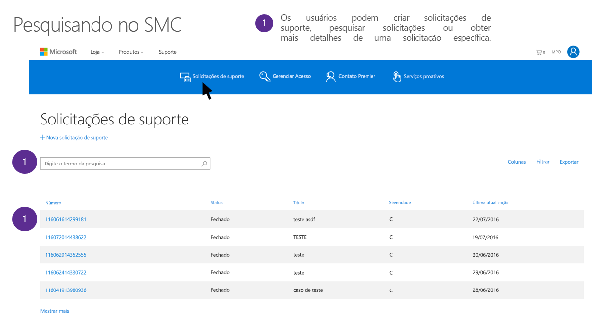

# Solicitações de titulares dos dados ao suporte e aos Serviços profissionais da Microsoft sobre o RGPDMicrosoft Support and Professional Services Data Subject Requests for the GDPR

## Introdução aos serviços profissionais da MicrosoftIntroduction to Microsoft Professional Services

Os Serviços profissionais da Microsoft incluem um grupo diverso de arquitetos, engenheiros, consultores técnicos e profissionais de suporte dedicados ao cumprimento da missão da Microsoft de capacitar os clientes a produzirem mais e conquistarem mais. Nossa equipe de Serviços profissionais tem mais de 21.000 consultores, orientadores digitais, suporte premier, engenheiros e profissionais de vendas trabalhando em 191 países, com suporte a 46 idiomas diferentes, gerenciando milhões de compromissos por mês e participando de interações com clientes e parceiros por meio de ferramentas locais, por telefone, na Web, na comunidade e automatizadas. A organização oferece uma ampla experiência no portfólio da Microsoft, utilizando uma ampla rede de parceiros, comunidades técnicas, ferramentas, diagnósticos e canais que nos conectam com nossos clientes corporativos.Microsoft Professional Services includes a diverse group of technical architects, engineers, consultants, and support professionals dedicated to delivering on the Microsoft mission of empowering customers to do more and achieve more. Our Professional Services team includes more than 21,000+ total consultants, Digital Advisors, Premier Support, engineers, and sales professionals working across 191 countries, supporting 46 different languages, managing several million engagements per month, and engaging in customer and partner interactions through on-premise, phone, web, community and automated tools. The organization brings broad expertise across the Microsoft portfolio, leveraging an extensive network of partners, technical communities, tools, diagnostics and channels that connect us with our enterprise customers.

Saiba mais sobre os Serviços Profissionais da Microsoft acessando a seção Serviços Profissionais da Microsoft na Central de Confiabilidade da Microsoft (<https://www.microsoft.com/trustcenter/professional-services>).Find out more about Microsoft Professional Services by going to the Microsoft Professional Services section on the Microsoft Trust Center (<https://www.microsoft.com/trustcenter/professional-services>). Os Serviços profissionais da Microsoft levam a sério as suas obrigações no Regulamento Geral sobre a Proteção de Dados (RGPD).Microsoft Professional Services takes its obligations under the General Data Protection Regulation (GDPR) seriously. As informações neste documento foram projetadas para responder a perguntas de clientes sobre como as ofertas de suporte e consultoria responderão e auxiliarão clientes a responder a obrigações da Solicitação de Entidades de Dados (DSR) no RGPD.The information in this document is designed to answer customer questions about how Microsoft’s support and consulting offerings will respond to and assist customers in responding to Data Subject Request (DSR) obligations under GDPR.

### Introdução às DSRsIntroduction to DSRs 

O RGPD fornece direitos às pessoas (conhecidas na regulamentação como *titulares de dados*) para gerenciar os dados pessoais que foram coletados por um funcionário ou outro tipo de órgão ou organização (conhecido como *controlador de dados* ou apenas *controlador*). Os dados pessoais são definidos genericamente no RGPD como quaisquer dados relacionados a uma pessoa identificada ou identificável. O RGPD fornece aos titulares dos dados direitos específicos a seus dados pessoais; esses direitos incluem a obtenção de cópias, a solicitação de alterações, a restrição do processamento e a exclusão deles. Uma solicitação formal realizada por um titular dos dados para que um controlador realize um determinado pedido com os dados pessoais do titular é chamada de *Solicitação do Titular dos Dados* ou DSR. Além disso, ela obriga as empresas que trabalham em nome de um controlador (conhecido como *processador de dados* ou apenas *processador*) a ajudar razoavelmente o controlador a atender às DSRs.The GDPR gives rights to people (known in the regulation as *data subjects*) to manage the personal data that has been collected by an employer or other type of agency or organization (known as the *data controller* or just *controller*). Personal data is defined very broadly under the GDPR as any data that relates to an identified or identifiable natural person. The GDPR gives data subjects specific rights to their personal data; these rights include obtaining copies of it, requesting changes to it, restricting the processing of it, and deleting it. A formal request by a data subject to a controller to take an action on their personal data is called a *Data Subject Request* or DSR. Additionally, it obligates companies working on behalf of a controller (known as the *data processor* or just *processor*) to reasonably assist the controller in fulfilling DSRs.

Este guia discute como localizar, acessar e atuar em dados pessoais que residem nos sistemas de TI da Microsoft que podem ter sido coletados para fornecer suporte e outras ofertas dos serviços profissionais.This guide discusses how to find, access, and act on personal data that reside in Microsoft IT systems that may have been collected to provide Support and other Professional Services offerings.

Ao desenvolver uma resposta para as DSRs, é importante para os clientes da Microsoft entenderem que os dados de consultoria e de suporte são separados dos dados de cliente nos Serviços Online ou de outros dados que eles ou seus titulares de dados possam ter fornecido à Microsoft. As ferramentas e os processos fornecidos para Serviços Online, o Painel de Privacidade da Microsoft ou outros sistemas da Microsoft para resposta às DSRs da Microsoft não podem ser usados para responder a DSRs relativas aos dados pessoais mantidos pelo Suporte da Microsoft ou outros Serviços profissionais.In developing a response for DSRs, it is important for Microsoft’s customers to understand that Support and Consulting Data is separate from Customer Data in the Online Services or other data that they or their data subjects may have provided to Microsoft. Tools and processes provided for Online Services, the Microsoft Privacy Dashboard, or other Microsoft systems for responding to DSRs cannot be used to respond to DSRs for personal data held by Microsoft Support or other Professional Services.

Todas as solicitações precisam ser realizadas por meio de um representante do suporte, conforme descrito abaixo. Atualmente não há nenhuma ferramenta de autoatendimento para os clientes acessarem dados pessoais nas organizações de Serviços profissionais.All requests must be made through a support representative, as described below. Currently there is no self-serve tool for customers gain access to personal data within the Professional Services organizations.

#### Visão geral dos processos descritos neste guiaOverview of the processes outlined in this guide

  ***Descubra.*** Encontre os dados pessoais que possam estar sujeitos a uma DSR. Assim que os materiais potencialmente responsivos forem coletados, execute uma ou mais ações de DSR descritas nas etapas a seguir a fim de responder à solicitação de DSR. Como alternativa, você pode determinar que a solicitação não atende às diretrizes organizacionais para responder às DSRs.***Discover.*** Find personal data that may be the subject of a DSR. Once potentially responsive material is collected, perform one or more of the DSR actions described in the following steps to respond to the DSR request. Alternatively, determine that the request doesn't meet organizational guidelines for responding to DSRs.

  ***Acesse.*** Recupere os dados pessoais que residem na nuvem da Microsoft e, se solicitado, faça uma cópia deles disponibilizando-os para o titular dos dados.***Access.*** Retrieve personal data that resides in the Microsoft cloud and, if requested, make a copy of it available to the data subject.

  ***Retifique.*** Faça alterações ou implemente outras ações solicitadas nos dados pessoais.***Rectify.*** Make changes or implement other requested actions on the personal data.

  ***Restrinja.*** Restrinja o processamento de dados pessoais interrompendo a atividade em uma interação.***Restrict.*** Restrict the processing of personal data by halting activity on an engagement.

  ***Exclua.*** Remova permanentemente os dados pessoais que residem nos sistemas de TI da Microsoft.***Delete.*** Permanently remove personal data that reside in Microsoft IT Systems.

  ***Exporte.*** Forneça uma cópia de dados pessoais ao cliente ou aos titulares dos dados.***Export.*** Provide a copy of personal data to the customer or data subjects.
 

### TerminologiaTerminology

Vejamos abaixo as definições relevantes dos termos do RGPD para este guia:Below are the relevant definitions of terms from the GDPR for this guide:

-   **Controlador** a pessoa física ou jurídica, autoridade pública, agência ou outra entidade que, sozinha ou em conjunto com terceiros, determina os fins e os meios do processamento de dados pessoais, onde tais fins e meios são determinados por lei de união ou estado-membro, o controlador ou os critérios específicos para sua indicação podem ser fornecidos por lei de união ou estado-membro.**Controller.** The natural or legal person, public authority, agency or other body which, alone or jointly with others, determines the purposes and means of the processing of personal data; where the purposes and means of such processing are determined by Union or Member State law, the controller or the specific criteria for its nomination may be provided for by Union or Member State law.

-   **Dados pessoais e titular dos dados:** quaisquer informações relacionadas a uma pessoa física identificada ou identificável ("titular dos dados"); uma pessoa física identificável é aquela que pode ser identificada, direta ou indiretamente, especialmente por referência a um identificador, como nome, um número de identificação, dados de localização, um identificador online ou por um ou mais fatores específicos à identidade física, fisiológica, genética, mental, econômica, cultural ou social dessa pessoa física.**Personal data and data subject.** Any information relating to an identified or identifiable natural person (‘data subject’); an identifiable natural person is one who can be identified, directly or indirectly, in particular by reference to an identifier such as a name, an identification number, location data, an online identifier or to one or more factors specific to the physical, physiological, genetic, mental, economic, cultural or social identity of that natural person.

-   **Processador** uma pessoa física ou jurídica, autoridade pública, agência ou outro corpo que processa dados pessoais em nome do controlador.**Processor.** A natural or legal person, public authority, agency or other body which processes personal data on behalf of the controller.

#### Outros termos e definições que podem ser úteis à compreensão deste guiaAdditional terms and definitions that may helpful in understanding this guide

-   **Dados de consultoria e de suporte** são todos os dados, incluindo qualquer texto, som, vídeo, arquivos de imagem ou software que são fornecidos à Microsoft por ou em nome do Cliente (ou que o Cliente autoriza a Microsoft a obter de um serviço online) por meio de uma interação com a Microsoft para obter suporte ou Serviços profissionais. A título de esclarecimento, isso não inclui os dados coletados em que a Microsoft é o controlador de dados, como os dados do contato do cliente.**Support and Consulting Data** is all data, including all text, sound, video, image files, or software, that are provided to Microsoft by, or on behalf of, Customer (or that Customer authorizes Microsoft to obtain from an Online Service) through an engagement with Microsoft to obtain Support or Professional Services. To clarify, this does not include data collected where Microsoft is the data controller including Customer Contact Data.

-   **Contato do cliente** são os dados pessoais que podem fazer parte da sua relação comercial com a Microsoft, como os dados pessoais contidos nas suas informações de contato do cliente. Entre esses dados podemos citar o seu nome, email ou número de telefone do Gerente de Serviço de Contrato Premier (CSM), o Administrador global ou de TI para um serviço online ou funções semelhantes.**Customer Contact** is personal data that may be part of your business relationship with Microsoft, such as personal data contained within your customer contact information. This may include your name, e-mail, or phone number of the Premier Contract Service Manager (CSM), the Global or IT Administrator for an Online Service, or similar roles.

-   **Dados de pseudônimo** Quando você usa o suporte da Microsoft para serviços e produtos corporativos da Microsoft, a Microsoft gera algumas informações vinculadas a um identificador numérico da Microsoft para fornecer o suporte. Normalmente eles são tíquetes de "Dados de pseudônimo". Embora esses dados não possam ser atribuídos a um titular de dados específico sem o uso de informações adicionais, alguns deles podem ser considerados pessoais sob a definição genérica do RGPD sobre dados pessoais. No escopo dos Serviços profissionais, as solicitações para atender ou auxiliar na conclusão de DSRs sempre incluirá automaticamente dados de pseudônimo de endereçamento.**Pseudonymized Data** When you use Microsoft support for Microsoft’s enterprise products and services, Microsoft generates some information linked to a Microsoft numeric identifier to provide the support. This is often referred to as “Pseudonymized Data”, Although this data cannot be attributed to a specific data subject without the use of additional information, some of it may be deemed personal under GDPR's broad definition for personal data. Within Professional Services, requests to fulfill or assist in fulfilling DSRs will always automatically include addressing pseudonymized data.

### Como usar este guiaHow to use this guide

Este guia trata de quatro cenários que um cliente pode encontrar se tiver utilizado os Serviços profissionais da Microsoft.This guide covers four scenarios a customer may encounter if they have utilized Microsoft Professional Services.

- **DSR para um contato do cliente à Microsoft****DSR for a Customer Contact Engaging Microsoft**

Explicação sobre como a Microsoft responderá às solicitações de um contato do cliente ou administrador de TI para atender aos direitos do titular de dados.Explanation for how Microsoft will respond to requests from a customer contact or IT administrator to exercise their data subject rights.

- **DSR para um usuário final de envolvimento da Microsoft****DSR for an End User Engaging Microsoft**

Explicação sobre como a Microsoft responderá às solicitações dos funcionários do cliente ou de outros titulares de dados para exercer seus direitos.Explanation for how Microsoft will respond to requests from a customer’s employees or other data subjects to exercise their rights.

- **DSR para dados fornecidos pelo cliente: suporte comercial****DSR for Customer Provided Data: Commercial Support**

Explicação sobre como obter assistência da Microsoft quando um cliente recebe uma solicitação de seus funcionários ou de outros titulares de dados pedindo o exercício de direitos, e de que os dados pessoais do titular dos dados foram coletados pelo Suporte da Microsoft durante a interação com o suporte.Explanation for how to receive assistance from Microsoft when a customer has received a request from their employee or other data subjects to exercise their rights, and that data subject’s personal data was collected by Microsoft Support during a support engagement.

- **DSR de dados fornecidos pelo cliente: os serviços de consultoria incluem serviços de migração do FastTrack****DSR for Customer Provided Data: Consulting Services including FastTrack Migration Services** 

Explicação sobre como obter assistência da Microsoft quando um cliente recebe uma solicitação de seus funcionários ou de outros titulares dos dados pedindo o exercício de direitos, e de que os dados pessoais do titular dos dados foram coletados pela Microsoft durante a interação com a consultoria.Explanation for how to receive assistance from Microsoft when a customer has received a request from their employee or other data subjects to exercise their rights, and that data subject’s personal data was collected by Microsoft during a consulting engagement.

## DSR para um contato do cliente à MicrosoftDSR for a Customer Contact Engaging Microsoft

*Como a Microsoft responde às solicitações de um contato do cliente ou administrador de TI a fim de exercer os direitos do titular dos dados.**How Microsoft responds to requests by a customer contact or IT admin to exercise their data subject rights.*

Quando um cliente interage com a Microsoft para receber serviços de consultoria e de suporte, o Suporte da Microsoft coleta ou recupera automaticamente dos registros de conta os dados pessoais do Contato do Cliente (por exemplo, CSM Premier, Administrador de TI, Administrador global). Isso provavelmente inclui o nome, o email, o telefone e outros dados pessoais da pessoa que busca suporte ou serviços de consultoria.When a customer engages with Microsoft to receive support or consulting services, Microsoft Support automatically collects or retrieves from account records the personal data of the Customer Contact (e.g. Premier CSM, Global Admin, IT Admin). This likely includes the name, email, phone and other personal data of the individual seeking support or consulting services.

Os dados pessoais de Contato do Cliente são parte do relacionamento de negócios da Microsoft com o cliente, e a Microsoft é o controlador de dados. A Microsoft responderá às DSRs do Contato do Cliente sobre os seus dados pessoais, independentemente de eles ainda estarem com a organização.The Customer Contact’s personal data is part of Microsoft’s business relationship with the customer, and Microsoft is the data controller. Microsoft will respond to DSRs from the Customer Contact around their personal data, regardless of whether they are still with the organization.

Os clientes devem compreender que a DSR só abrange os dados pessoais do Contato do Cliente e nenhuma alteração ou exclusão será feita em qualquer um dos dados do cliente enviados como parte de interações (por exemplo, transcrições, descrições de caso, arquivos, produtos de trabalho), pois a Microsoft é o processador de dados. Além disso, para manter o registro histórico da interação, nenhum tipo de alteração será feito nas interações fechadas, inclusive o registro de quem abriu uma interação.Customers should understand that the DSR only covers the personal data of the Customer Contact, and no changes or deletions will be made to any of the customer’s data submitted as part of engagements (e.g. transcripts, case descriptions, files, work product), since Microsoft is the data processor. Additionally, to maintain the engagement’s historical record no changes at all will be made to closed engagements, including the record of who opened an engagement.

Ao ser consultado por um Contato do Cliente sobre uma DSR, a equipe da Microsoft encaminhará um contato do cliente para o [Suporte de Privacidade da Microsoft](http://go.microsoft.com/fwlink/?LinkId=321116). Este é o mecanismo de entrada principal da Microsoft para consultas e reclamações sobre privacidade. Ao receber uma consulta, a equipe de privacidade da Microsoft identificará que ela faz parte de uma conta comercial ou organizacional e responderá de acordo.Upon receiving an inquiry from a Customer Contact regarding a DSR, Microsoft personnel will refer a customer contact to [Microsoft Privacy Support](http://go.microsoft.com/fwlink/?LinkId=321116). This is Microsoft’s primary input mechanism for privacy inquiries and complaints. Upon receiving an inquiry, the Microsoft Privacy Team will identify that this is part of a commercial or organizational account and respond accordingly.

Para garantir a continuidade de negócios do cliente, a Microsoft também não processará uma DSR associada a uma interação até a confirmação de um contato substituto. Após a confirmação de um novo contato, a Microsoft trocará o contato antigo pelo novo em interações abertas.To maintain customer’s business continuity, Microsoft will also not process a DSR associated with an engagement until a replacement contact is confirmed. Upon confirmation of a new contact, Microsoft will swap out the old contact with the new one in open engagements.

Os clientes podem optar por fazer alterações em seus dados coletados durante as interações com os Serviços profissionais pelo suporte normal ou por canais de consultoria, separado dessa DSR. Por exemplo, a Microsoft pode ajudá-lo a eliminar interações com o suporte, mediante solicitação (consulte abaixo na seção *Guia de DSR sobre os dados fornecidos pelo cliente*).Customers may choose to make changes to their data collected during Professional Services engagements through normal support or consulting channels, separate from this DSR. For instance, Microsoft can assist in expunging support engagements, on request (see below in *DSR Guide for Customer Provided Data* section).

***Exemplo apenas para fins ilustrativos******Example for Illustration Purposes Only***

Davi é um administrador de TI de um cliente empresarial do Office 365, com uma interação de suporte aberta e duas interações fechadas. Agora, Davi está saindo da sua empresa e deseja excluir os seus dados. Davi entra em contato com a RPC, que o identifica como o administrador de TI. Davi fica sabendo que seu nome não pode ser excluído das interações anteriores (fechadas) nem de qualquer dado nas interações abertas. No entanto, a PRC substituirá Davi como contato no tíquete aberto atual caso ele indique um contato substituto. Davi avisa à Microsoft que Laura será o contato substituto e a Microsoft fará a alteração em todos os sistemas de suporte.John is an IT Admin for an O365 enterprise customer, with one open support engagement and two closed engagements. Now John is leaving his company and wants his data deleted. John contacts the PRC, who identifies him as the IT Admin. John is informed his name cannot be deleted from the prior (closed) engagements or from any data within the open engagements. However, the PRC will replace John as the contact on the current open ticket if he will identify a replacement contact. John lets Microsoft know that Jane will be his replacement contact, and Microsoft makes the change across all support systems.

## DSR para um usuário final de envolvimento da MicrosoftDSR for an End User Engaging Microsoft

*Como a Microsoft responderá às solicitações dos funcionários do cliente ou de outros titulares dos dados para exercer os direitos deles.**How Microsoft responds to requests from a customer’s employees or other data subjects to exercise their rights.*

Se os funcionários do cliente ou outros titulares dos dados entrarem em contato com a Microsoft para fazerem solicitações sobre seus dados coletados pela Microsoft na qualidade de processador de dados, o titular dos dados será informado de que precisará contatar o cliente da Microsoft, como o controlador de dados, para exercer esses direitos. Isso é tudo o que a Microsoft fará.If a customer’s employee or other data subject contacts Microsoft to exercise their rights over data that Microsoft has collected as the data processor, then that data subject will be informed that they need to contact Microsoft’s customer, as the data controller, to exercise those rights. Microsoft will take no further action.

Se o titular dos dados também tiver contatado a Microsoft para exercer seus direitos sobre os dados que a Microsoft coletou em situações em que ela é a controladora de dados (por exemplo, suporte ao consumidor, contato do cliente comercial), a Microsoft responderá separadamente à solicitação de exercício de direito do titular dos dados do indivíduo relativa aos dados pessoais.If the data subject has also contacted Microsoft about exercising their rights for data Microsoft has collected in situations where Microsoft is the data controller (e.g. consumer support, commercial customer contact) then Microsoft will separately respond to the individual’s data subject right request for that personal data.

***Exemplo apenas para fins ilustrativos******Example for Illustration Purposes Only***

Laura é uma funcionária de um cliente empresarial, a Contoso, que lhe concedeu uma conta do Dynamics 365. Ela entra em contato com a Microsoft para excluir todos os seus dados e é encaminhada para a Central de Resposta a Assuntos de Privacidade. Laura preenche o formulário de solicitação. A Central de Resposta a Assuntos de Privacidade a identifica como um usuário final corporativo e informa que ela precisa excluir os seus dados empresariais através da Contoso. A Central também a identifica como usuária do Microsoft X-Box e exclui seus dados da conta de consumidor da Microsoft.Jane is an employee of an Enterprise customer, Contoso, that has given her a Dynamics 365 account. She contacts Microsoft to have all her data deleted and is referred to the Privacy Response Center. Jane fills out the request form. The Privacy Response Center identifies her as an enterprise end-user and lets her know she needs to work through Contoso for the deletion of her enterprise data. They also identify her as a Microsoft X-Box user and delete her data out of her consumer Microsoft account.

## DSR para dados fornecidos pelo cliente: suporte comercialDSR for Customer Provided Data: Commercial Support

*Como obter assistência da Microsoft quando um cliente recebe uma solicitação de seus funcionários ou de outros titulares de dados pedindo o exercício de direitos, e de que os dados pessoais do titular dos dados foram coletados pelo Suporte da Microsoft durante a interação com o suporte.**How to receive assistance from Microsoft when a customer has received a request from their employee or other data subjects to exercise their rights, and that data subject’s personal data was collected by Microsoft Support during a support engagement.*

Quando um cliente interage com o Suporte da Microsoft, a Microsoft coleta os Dados de Suporte do cliente para resolver os problemas que precisaram de interação com o suporte. Esses Dados de Suporte incluem a interação da Microsoft com o cliente (por exemplo, chat, telefone, email, envio pela Web) e quaisquer arquivos de conteúdo que o cliente envia à Microsoft ou que a Microsoft tem, com permissão do cliente, extraídos do ambiente de TI ou do locatário de Serviços Online do cliente para resolver o problema de suporte. No caso de Suporte Premier, isso também incluirá todos os dados que coletamos de você para evitar proativamente problemas futuros. No entanto, isso exclui informações de Contato do Cliente ou outras informações das relações comerciais da Microsoft com o cliente (por exemplo, registros de cobranças).When a customer engages with Microsoft Support, Microsoft collects Support Data from the customer to resolve any issues that required a support engagement. This Support Data includes Microsoft’s interaction with the customer (e.g. chat, phone, email, web submission) plus any content files the customer sends to Microsoft or Microsoft has, with customer’s permission, extracted from the customer’s IT environment or Online Services tenancy to resolve the support issue. In the case of Premier support, this would also include any data we collect from you to proactively prevent future issues. However, this excludes Customer Contact information or other information from Microsoft’s business relationship with the customer (e.g. billing records).

Para todos os Dados de Suporte, a Microsoft é o processador de dados. Dessa forma, a Microsoft não responderá às solicitações diretas dos titulares dos dados sobre os Dados de Suporte fornecidos quando foram associados a um cliente comercial da Microsoft. A Microsoft trabalhará com o cliente por meio dos canais de suporte normais para ajudá-lo a responder às DSRs.For all Support Data, Microsoft is the data processor. As such, Microsoft’s will not respond to direct requests from data subjects regarding Support Data provided when they were associated with a Microsoft commercial customer. Microsoft will work with the customer through their normal support channels to assist them in responding to DSRs.

## Etapa 1: DescobertaStep 1: Discover

A primeira etapa para se obter assistência da Microsoft na resposta a uma DSR é localizar os dados pessoais concernentes à DSR. Esta primeira etapa, localizar e analisar os dados pessoais em questão, ajudará um cliente a determinar se uma DSR atende às políticas da organização tocantes à execução de uma solicitação do titular dos dados.The first step in obtaining Microsoft’s assistance in responding to a DSR is to find the personal data that is the subject of the DSR. This first step - finding and reviewing the personal data at issue - will help a customer determine whether a DSR meets the organization's policies for honoring a data subject request.

Depois que o cliente encontrar os dados, o cliente, em seguida, poderá executar a ação específica para atender à solicitação do titular dos dados. A determinação do nível de descoberta com que o cliente precisa se envolver dependerá do que o cliente está tentando fazer.After the customer finds the data, the customer can then perform the specific action to satisfy the request by the data subject. Depending on what the customer is trying to do will determine what level of discovery the customer needs to engage in.

Quando a Microsoft auxilia um cliente com a solução de uma DSR, isso é uma função empresarial, e a solicitação é feita pelo canal de suporte normal, não por meio de uma solicitação à Equipe de Privacidade da Microsoft.Where Microsoft assists a customer with the resolution of a DSR then this is a business function, and the request is made through your regular support channel and not through a request to the Microsoft Privacy Team.

Ao descobrir os dados relevantes e obter assistência da Microsoft, um cliente tem várias opções de abordagem da DSR:In discovering relevant data and obtaining Microsoft’s assistance, a customer has several options for how to approach the DSR:

*Opção A: DSR de cliente de suporte em toda a Microsoft*. Aplique a DSR a todos os dados de suporte do cliente no ambiente de suporte da Microsoft. Para fazer isso, um cliente só precisa pedir para a Microsoft aplicar a DSR a todos os Dados de Suporte coletados.*Option A – Cross-Microsoft Support Customer DSR*. Apply the DSR to all the customer’s support data across Microsoft’s support environment. To do this, a customer can just ask Microsoft to apply the DSR to all Support Data collected.

*Opção B: interações de cliente específicas.* Use sistemas online para analisar tíquetes e depois identificar interações específicas que contenham os dados pessoais relevantes e relatá-los à Microsoft. A Microsoft tentará dar assistência à realização de uma pesquisa se o cliente não puder pesquisar nas interações (tíquetes).*Option B – Specific Customer Engagements.* Use online systems to review tickets, then identify specific engagements containing the relevant personal data and report them Microsoft. Microsoft will attempt to provide assistance to to perform a search if the customer does not have the ability to search across engagements (tickets).

\*\*Após a identificação das interações, solicite a aplicação da DSR a uma parte específica do registro ou a tudo o que estiver relacionado a essa interação na Microsoft.\*\*Once engagements are identified, request to apply the DSR to either a specific part of the record or everything related to that engagement across Microsoft. **

Para identificar interações específicas, os clientes precisam pesquisar as suas interações. Para os clientes Premier, o Gerente de Serviço de Contrato Premier (CSM) de um cliente tem a visibilidade de todas as Solicitações de Suporte (SRs) criadas sob essa Agenda do Contrato. Para os clientes não Premier, estão disponíveis portais de interação com o suporte equivalentes, como por meio das áreas de suporte dos Serviços Online.To identify specific engagements, customers need to search across their engagements. For Premier customers, the Contract Service Manager (“CSM”) for a customer has visibility across all Support Requests (SRs) that are created under that Contract Schedule. For Non-Premier, equivalent support engagement portals are available, such as through Online Services support areas.

O CSM pode acessar o portal em Support.Microsoft.Com ([https://support.microsoft.com/\<localcódigo de idioma\>/premier](https://support.microsoft.com/%3clocal%20language%20code%3e/premier)) ("SMC") e selecionar e revisar as Solicitações de Suporte. (Observação: na URL, insira o código do seu idioma local).The CSM can go to the portal at Support.Microsoft.Com ([https://support.microsoft.com/\<local language code\>/premier](https://support.microsoft.com/%3clocal%20language%20code%3e/premier)) (“SMC”) and select and review Support Requests. (Note: In the URL, please substitute for your local language code).

>[**Observação importante sobre o DTM**] Além do histórico de casos no SMC, os clientes também podem ter dados pessoais de um usuário final em arquivos, dados que foram coletados pela Microsoft (ou, com permissão do cliente, removidos do Serviço Online) durante a interação com o suporte. Como exemplo, podemos citar cópias das caixas de correio do Exchange, VMs do Azure ou bancos de dados do cliente. Esses dados pessoais podem ou não ser mencionados no histórico de casos (ou seja, tíquete) para uma interação específica. Para conferir esses dados, o Contato do Cliente deve ser um contato específico e autenticado da Solicitação de Suporte (via AAD ou MSA) que recebeu uma URL para um espaço de trabalho na ferramenta de Gerenciamento e Transferência de Dados do Suporte da Microsoft (DTM). Um Contato do Cliente terá acesso aos arquivos, mas nenhuma exibição global estará disponível, e o SMC não indicará se os arquivos existem.[**Important Note Regarding DTM**] In addition to the case history in SMC, customers may also have personal data of an end user in files that was collected by Microsoft (or, with customer’s permission, removed from the Online Service) during a support engagement. Examples may include copies of customer’s exchange mailboxes, Azure VMs, or databases. This personal data may or may not be mentioned in the case history (i.e. ticket) for a particular engagement. To review that data, the Customer Contact must be a specific authenticated (via AAD or MSA) Support Request contact that has received a URL for a workspace in Microsoft Support Data Transfer and Management tool (DTM). A Customer Contact will have access to the files, but no global view is available, and SMC will not indicate if files exist.

Depois que os clientes identificarem todos os dados relevantes nos tíquetes de suporte selecionados, os clientes poderão decidir se devem solicitar a exclusão de tudo o que estiver relacionado a um tíquete ou aplicar seletivamente a DSR a instâncias individuais dos dados pessoais.Once customers have identified all the relevant data in the selected support tickets, customers can decide whether to request the deletion of everything related to a ticket or selectively apply the DSR to individual instances of personal data.

## Etapa 2: AcessoStep 2: Access

Depois que um cliente encontrar Dados de Suporte que contenham dados pessoais potencialmente responsivos a uma DSR, cabe ao cliente decidir quais dados pessoais serão incluídos na resposta. Por exemplo, o cliente pode optar por remover dados pessoais sobre titulares dos dados e quaisquer informações confidenciais.After a customer has found Support Data containing personal data that is potentially responsive to a DSR, it is up to the customer to decide which personal data to include in the response. For example, the customer may choose to remove personal data about other data subjects and any confidential information.

A resposta à DSR pode incluir uma cópia do documento real, uma versão adequadamente redigida ou uma captura de tela das partes que o cliente considerou adequadas ao compartilhamento. Para todas essas respostas a uma solicitação de acesso, o cliente precisará recuperar uma cópia do documento ou outro item que contenha dados responsivos.Response to the DSR may include a copy of the actual document, an appropriately redacted version, or a screenshot of the portions the customer has deemed appropriate to share. For each of these responses to an access request, the customer will have to retrieve a copy of the document or other item that contains the responsive data.

O acesso aos dados pessoais de um usuário final pode ser realizado de uma menção ou anotação em vários tipos de documentação de conteúdo. Como os clientes podem acessar o tíquete de interação e o conteúdo, eles mesmos podem fornecer um resumo dos dados pessoais sem ajuda adicional da Microsoft.Access to the personal data of an end user may be from a mention or notation in the various types of content documentation. Since customers may access the engagement ticket and the content they can provide a summary of personal data themselves without further assistance from Microsoft.

Em casos raros, o cliente pode precisar de cópias dos dados de interação com o suporte (por exemplo, emails, cópias transcritas das gravações de telefone, transcrições de chat) entre um representante da Microsoft e o representante do cliente. Dentro do limite necessário, a Microsoft pode fornecer cópias redigidas dessas transcrições com base na necessidade, confidencialidade e dificuldade.In rare cases, customer may have need to obtain copies of support interaction data (e.g. emails, transcribed copies of phone recordings; chat transcripts) between a Microsoft Representative and the Customer’s Representative. To the extent required, Microsoft may provide redacted copies of these transcripts based on need, sensitivity, and difficulty.

## Etapa 3: RetificaçãoStep 3: Rectify

Se um titular dos dados pedir para o cliente retificar os dados pessoais residentes nos Dados de Suporte da organização, o cliente precisará determinar se é apropriado executar a solicitação. Se o cliente decidir atender à solicitação, poderá solicitar que a Microsoft faça a alteração. A Microsoft pode retificar ou excluir os dados do cliente dos sistemas de suporte e solicitar que o cliente os reenvie à Microsoft no formato corrigido.If a data subject has asked the customer to rectify the personal data that resides in their organization’s Support Data, the customer will have to determine whether it’s appropriate to honor the request. If the customer chooses to honor the request, then the customer may request that Microsoft make the change. Microsoft may rectify data or may delete customer’s data from the support systems and request that the customer resubmit it to Microsoft in corrected format.

## Etapa 4: RestriçãoStep 4: Restrict

A qualquer momento, o cliente pode fechar uma interação ou contatar a Microsoft e solicitar o fechamento da interação. Uma interação fechada impedirá a execução de qualquer trabalho.The customer may at any time close an engagement or contact Microsoft and request the engagement be closed. A closed engagement will prevent any work from being performed.

Para garantia adicional, o cliente pode contatar a Microsoft e solicitar a colocação de uma observação no sistema de tíquetes de interação dizendo que o caso não deve ser reaberto por nenhum motivo sem a permissão do cliente.For extra assurance, customer may contact Microsoft and request a note be placed in the engagement ticketing system instructing that the case should not be re-opened for any reason absent the customer’s permission.

Observação: as interações (tíquetes) também serão excluídas de acordo com um cronograma de retenção e de exclusão, com base na confidencialidade dos dados, no serviço e no sistema. Se os clientes exigirem uma cópia dos dados, não poderão se esquecer de extrair os dados antes da exclusão.Note: Engagements (tickets) will also be deleted according on a retention and deletion schedule, based on the sensitivity of data, service, and system. If customer requires a copy of data, they should ensure they have extracted data prior to deletion.

## Etapa 5: ExclusãoStep 5: Delete

O "direito de apagar" por meio da remoção dos dados pessoais dos Dados de Suporte de uma organização é uma importante proteção do RGPD. A remoção de dados pessoais compreende a exclusão de documentos, arquivos ou interações inteiras, ou a exclusão de dados específicos em um documento, interação ou arquivo.The “right to erasure” by the removal of personal data from an organization’s Support Data is a key protection in the GDPR. Removing personal data includes deleting entire engagements, documents or files or deleting specific data within an engagement, document or file.

Conforme um cliente investiga ou se prepara para excluir dados pessoais em resposta a uma DSR, existem alguns pontos importantes a serem entendidos sobre como a exclusão funciona para o Suporte da Microsoft.As a customer investigates or prepares to delete personal data in response to a DSR, here are a few important things to understand about how deletion works for Microsoft Support.

Todos os dados da Microsoft têm uma política de retenção e exclusão aplicada a eles, que variam de acordo com o risco e outros fatores.All data at Microsoft has a retention and deletion policy applied to it, which will vary depending on risk and other factors.

Os clientes que solicitarem a exclusão universal dos dados pessoais de um titular dos dados em todos os sistemas de suporte pode fazê-lo por meio do TAM ou apresentando uma Solicitação de Suporte (SR) no SMC ou sistema equivalente. Você *deve* indicar que essa é uma solicitação para ajudá-lo com a DSR consoante o RGPD.Customers requesting the deletion of a data subject’s personal data universally cross Support systems may do that through your TAM or by filing a Support Request (SR) in SMC or equivalent system. You *must* indicate that this is a request to assist with a DSR under GDPR.

*Opção A: DSR de cliente de suporte em toda a Microsoft*. Para uma DSR de sistema cruzado, o cliente deve fornecer os dados pessoais que a Microsoft precisa para identificar os dados necessários (por exemplo, endereço de email ou número de telefone). A Microsoft não correlacionará nem pesquisará registros e só pesquisará diretamente nos identificadores fornecidos pelo cliente. Quando os dados forem encontrados, a Microsoft excluirá todas as interações e todos os dados associados. **Observação importante:** isso pode resultar na perda de registros históricos que são importantes para a organização do cliente.*Option A - Cross-Microsoft Support Customer DSR*. For a cross system DSR, customer must provide the personal data that Microsoft needs to identify the required data (e.g. email address; phone number). Microsoft will not correlate or research records and will only search directly on identifiers provided by the customer. When data is found, Microsoft will delete all engagements and all associated data. **Important Note:** this may result in loss of historical records that are important to customer’s organization.

*Opção B: interações de cliente específicas*. Para interações específicas que o cliente identificou e quer excluir, não exclua tíquetes do SMC. Isso resultará em dados pessoais remanescentes em logs e sistemas downstream, que talvez não possam ser excluídos no prazo necessário. Em vez disso, identifique o tíquete ou os dados pessoais no tíquete que deve ser excluído e contate o Suporte da Microsoft para ajudá-lo a excluir os dados.*Option B – Specific Customer Engagements*. For specific engagements that the customer has identified and wants deleted, do not delete tickets out of SMC. This will result in personal data remaining in logs and downstream systems that may not be deleted within the needed timeframe. Instead, identify the ticket or personal data within the ticket that must be deleted, and contact Microsoft Support to assist you in deleting that data.

### Instruções sobre a ferramenta de Gerenciamento e Transferência de Dados do Suporte da Microsoft (DTM)Microsoft Support Data Transfer and Management tool (DTM) instructions

Para todas essas pesquisas, a Microsoft não procurará na DTM devido à possível confidencialidade de conteúdo dos arquivos. No entanto, se o cliente quiser, a Microsoft excluirá todos os arquivos contidos na DTM associada à conta do cliente. Devido à possibilidade de implicações graves aos clientes, a Microsoft requer uma solicitação separada do cliente especificando a exclusão dos arquivos da DTM.For all these searches, Microsoft will not search across DTM due to the potential sensitivity of content in files. However, if the customer desires, Microsoft will delete all files contained in DTM associated with the customer’s account. Due to the potential for serious customer impact, Microsoft requires a separate request from customer specifying the deletion of DTM files.

-   Para casos abertos, o Contato do Cliente pode acessar a DTM e excluir os arquivos.For open cases, the Customer Contact can go into DTM and delete files.

-   Para os casos fechados há menos de 90 dias, deve ser feita uma solicitação de remoção de arquivos a um TAM ou em uma SR.For cases closed less than 90 days, a request must be made to a TAM or in an SR to have the files removed.

-   Nos casos fechados depois de 90 dias, os arquivos já foram automaticamente excluídos.For cases closed after than 90 days, files have already been automatically deleted.

-   Ainda que os dados pessoais só estivessem localizados em um arquivo que foi excluído, os clientes ainda precisam pedir para a Microsoft executar uma busca por dados pessoais nos sistemas, pois alguns dados podem ter sido removidos da DTM no decorrer do suporte.Even if the personal data was only located within a file that has been deleted, customers must still have Microsoft run a check across systems for the personal data as some data may have been removed from DTM in the course of providing support.

## Etapa 6: ExportaçãoStep 6: Export

O "direito de portabilidade de dados" permite que um titular dos dados solicite uma cópia dos dados pessoais em um formato eletrônico e solicite que a sua organização os transmita para outro controlador. No caso dos Dados de Suporte, quaisquer informações úteis que a Microsoft tem estariam na forma de informações de interação ou arquivos que podem ser retornados para você para a retransmissão ou carregamento para outro controlador.The “right of data portability” allows a data subject to request a copy of their personal data in an electronic format and request that your organization transmit it to another controller. In the case of Support Data, any usable information that Microsoft has would be in the form of engagement information or files that can be returned to you for re-communication or uploading to another controller.

Observação: os dados exportados podem não incluir a propriedade intelectual da Microsoft ou quaisquer dados que possam comprometer a segurança ou a estabilidade do serviço.Note: Exported data may not include Microsoft’s intellectual property or any data that may compromise the security or stability of the service.

***Exemplo apenas para fins ilustrativos******Example for Illustration Purposes Only***

Davi é um CSM Premier para um cliente empresarial, a Contoso, que usa o Office 365 para os emails dos funcionários e o Azure para hospedar um banco de dados SQL da Contoso. A Contoso tem vários tíquetes abertos e fechados. Recentemente, o Suporte da Microsoft, com permissão da Contoso, moveu uma cópia do banco de dados SQL para a DTM para fins de suporte e solução de problemas.John is a Premier CSM for an Enterprise customer, Contoso, that uses O365 for its employee e-mail and Azure to host a Contoso SQL database. Contoso has multiple open and closed tickets. Recently, Microsoft Support, with Contoso’s permission, moved a copy of the SQL database into DTM for support and troubleshooting.

Davi recebe uma DSR de Laura solicitando a exclusão dos dados dela. Davi acessa o SMC e pesquisa as interações para identificar que Laura tinha problemas de conta de email, o que estava documentado em dois tíquetes por nome e endereço de email. Ele entra em contato com seu TAM, fornece ao TAM o nome e o endereço de email da Laura como um identificador e solicita que os dois tíquetes sejam excluídos, juntamente com todos os dados de downstream gerados a partir desses tíquetes.John receives a DSR from Jane asking that all her data be deleted. John goes into SMC and searches across engagements to identify that Jane had email account issues and so was referenced in two tickets by name and email address. He contacts his TAM, provides the TAM with Jane’s name and e-mail address as an identifier, and requests that those two tickets be deleted, along with all downstream data that may have been generated out of those tickets.

Ele também suspeita que estava envolvido em uma conversa de chat com a equipe de suporte na qual menciona Laura, então solicita que o log do bate-papo seja excluído.He also suspects he was engaged in a chat conversation with support personnel where he mentions Jane, so he requests that chat log to be deleted.

Ele também sabe que os dados pessoais de Laura estão no banco de dados SQL. Como a VM do SQL foi movida para a DTM há menos de 90 dias, ele pede separadamente a seu TAM que ajude na exclusão imediata do banco de dados da DTM.He also knows that Jane’s personal data is in the SQL Database. Since the SQL VM was moved into DTM less than 90 days ago, he asks his TAM separately to assist in the immediate deletion of the database out of DTM.

Por fim, como ele sabe que os dados podem ter sido removidos do arquivo da DTM durante o suporte, ele pede que a Microsoft procure pelos dados de Laura nos sistemas de TI a partir do banco de dados SQL.Lastly, since he knows that data may have been removed from the DTM file during providing support, he asks Microsoft to run a check across IT systems for Jane’s personal data from the SQL database.

O Suporte da Microsoft executa todas essas exclusões e, com base na solicitação do cliente, o TAM lhe fornece uma instrução de atestado de que os dados necessários foram excluídos.Microsoft Support performs all these deletions and, based on customer request, the TAM provides him with an attestation statement that the required data has been deleted.

## O Guia DSR para dados fornecidos pelo cliente em serviços de consultoria incluem os Serviços de migraçãoDSR Guide for Customer Provided Data in Consulting Services including Migration Services

*Como obter assistência da Microsoft quando um cliente recebe uma solicitação de seus funcionários ou de outros titulares dos dados, pedindo o exercício de direitos, e os dados pessoais do titular dos dados foram coletados pela Microsoft durante a interação com a consultoria.**How to receive assistance from Microsoft when a customer has received a request from their employee or other data subjects to exercise their rights, and that data subject’s personal data was collected by Microsoft during a consulting engagement.*

## Serviços de consultoria da MicrosoftMicrosoft Consulting Services

Para as interações com os serviços de consultoria da Microsoft contratadas em que se aplica o adendo de proteção de dados de Serviços profissionais da Microsoft (<http://aka.ms/professionalservicesdpa>).For Microsoft Consulting Services engagements contracted where the Microsoft Professional Services Data Protection Addendum (<http://aka.ms/professionalservicesdpa>) applies.

A Microsoft é o controlador de dados dos Contatos do Cliente que trabalham com a equipe de interação. Esses indivíduos devem contatar o [Suporte da Privacidade da Microsoft](http://go.microsoft.com/fwlink/?LinkId=321116) para atender aos direitos do titular dos dados.Microsoft is the data controller for Customer Contacts working with the engagement team. Those individuals should contact [Microsoft Privacy Support](http://go.microsoft.com/fwlink/?LinkId=321116) to fulfill data subject rights.

A Microsoft é o processador de dados para uma DSR localizada nos dados fornecidos durante a interação de consultoria. O cliente deve entrar em contato com o gerente de interação para criar um plano para ajudá-lo a responder à DSR com base nos dados coletados e, depois, no tipo específico dos serviços de consultoria fornecidos. Na extensão em que a sua solicitação constitui um nível de esforço geralmente visto dentro de uma interação dos Serviços de Consultoria da Microsoft, pode haver a necessidade de um pedido de trabalho adicional. Além disso, os dados pessoais serão excluídos após cada interação de consultoria em um período de tempo dependente do tipo de interação de consultoria. O cliente pode solicitar a exclusão de dados mais cedo e solicitar um atestado de exclusão.Microsoft is the data processor for a DSR located within data provided during a consulting engagement. The customer should contact the engagement manager to build in a plan to assist in responding to a DSR based on the data collected and then specific type of consulting services provided. To the extent your request constitutes a level of effort typically seen within a Microsoft Consulting Services engagement, there may be an additional work order required. Additionally, personal data will be deleted after each consulting engagement within a timeframe dependent on the type of consulting engagement. Customer can request data to be deleted sooner and request an attestation of deletion.

## Serviços do Microsoft FastTrackMicrosoft FastTrack Services

O [Microsoft FastTrack](https://na01.safelinks.protection.outlook.com/?url=https%3A%2F%2Ffasttrack.microsoft.com%2Fabout&data=02%7C01%7C%7Cd0521d8739c841df674508d596834585%7C72f988bf86f141af91ab2d7cd011db47%7C1%7C0%7C636580412901207944&sdata=PO5eh56pm9IYk5Y%2Ff%2F31e%2BRVPmrC2Qi%2FCsw1NphR8gY%3D&reserved=0) fornece serviços de consultoria de TI às organizações para ajudá-las a integrar e usar os serviços em nuvem da Microsoft como o Microsoft 365, o Azure e o Dynamics 365.[Microsoft FastTrack](https://na01.safelinks.protection.outlook.com/?url=https%3A%2F%2Ffasttrack.microsoft.com%2Fabout&data=02%7C01%7C%7Cd0521d8739c841df674508d596834585%7C72f988bf86f141af91ab2d7cd011db47%7C1%7C0%7C636580412901207944&sdata=PO5eh56pm9IYk5Y%2Ff%2F31e%2BRVPmrC2Qi%2FCsw1NphR8gY%3D&reserved=0) provides IT consulting services to organizations to help them onboard and use Microsoft cloud services such as Microsoft 365, Azure and Dynamics 365.

A Microsoft é o controlador de dados para os Contatos do Cliente que trabalham com a equipe do FastTrack. Se os Contatos do Cliente quiserem acessar, analisar ou remover informações de contato dos registros do Microsoft FastTrack, os clientes poderão pedir que o titular dos dados envie a solicitação diretamente à caixa de entrada de Solicitação do RGPD do FastTrack do Office 365, \<<o365ftgdpr@microsoft.com>\>.Microsoft is the data controller for Customer Contacts working with the FastTrack team. If Customer Contacts wish to access, revise or remove contact information from Microsoft’s FastTrack records, customers can have the data subject send the request directly to Office 365 FastTrack GDPR Request inbox \<<o365ftgdpr@microsoft.com>\>.

Para os serviços de migração do FastTrack, a Microsoft é o processador de dados. De acordo com nossa política do Fast Track de divulgação de privacidade adicional, todos os dados na migração são considerados “dados de migração”. Se precisar executar DSRs enquanto sua organização estiver envolvida em um projeto de migração do FastTrack, será necessário tomar cuidados especiais.For FastTrack migration services, Microsoft is the data processor. In accordance with our Fast Track additional privacy disclosure statement, all data in migration is considered “migration data.”  If you need to execute DSRs while your organization is engaged in a FastTrack migration project, special care is required.
  
Se houver necessidade de processar acesso, retificar ou exportar solicitações de DSR enquanto os dados dos usuários estiverem sendo processados por meio dos sistemas de migração do FastTrack, será responsabilidade do cliente preencher tais DSRs por meio de seus sistemas de origem existentes, nos quais os dados do usuário estão armazenados. Após a conclusão da migração do usuário e da migração dos dados para o serviço de nuvem de destino da Microsoft, será aplicada a diretriz fornecida pela Microsoft sobre como os clientes podem usar produtos, serviços e ferramentas administrativas da Microsoft para localizar e executar ações nos dados pessoais para responder à solicitação do titular dos dados. Para exibir esta diretriz, confira o artigo [Solicitações do titular dos dados para o RGPD](https://docs.microsoft.com/microsoft-365/compliance/gdpr-data-subject-requests).If you need to process any access, rectify, or export DSR requests while a user’s data is being processed through FastTrack migration systems, it will be the customer’s responsibility to fulfill such DSRs through your existing source systems in which the user data is stored. Once the user’s migration is complete and the data has been migrated to the destination Microsoft cloud service, the guidance provided by Microsoft on how customers can use Microsoft products, services and administrative tools to find and act on personal data to respond to data subject request will then apply. To view this guidance see [Data Subject Requests for the GDPR](https://docs.microsoft.com/microsoft-365/compliance/gdpr-data-subject-requests). 

Se precisar excluir a conta de um usuário do Office 365 em resposta a uma solicitação de DSR de exclusão enquanto sua organização estiver envolvida em um projeto de migração em andamento do FastTrack, você deverá estar ciente de que os sistemas de migração podem reter uma cópia dos dados de migração do usuário por um período de tempo após a conclusão da migração do usuário, e a exclusão da conta de usuário do Office 365 não excluirá automaticamente os dados de migração desse usuário armazenados nos sistemas de migração do FastTrack. Se você deseja que a equipe do Microsoft FastTrack exclua os dados de migração do usuário, [envie uma solicitação](https://go.microsoft.com/fwlink/?linkid=874544). No curso normal dos negócios, o Microsoft FastTrack excluirá todas as cópias de dados assim que a migração da organização for concluída.If you need to delete an Office 365 user account in response to a DSR delete request while your organization is engaged in an ongoing FastTrack migration project, you should be aware that migration systems may retain a copy of user migration data for a period of time following completion of the user’s migration and deleting the Office 365 user account will not automatically delete such user migration data stored in FastTrack migration systems.  If you would like the Microsoft FastTrack team to delete user migration data, you can [submit a request](https://go.microsoft.com/fwlink/?linkid=874544). In the ordinary course of business, Microsoft FastTrack will delete all data copies once your organization’s migration is complete.

## Outros serviços de consultoriaOther Consulting Services

O cliente que recebe outros Serviços profissionais através da Microsoft deve trabalhar com a equipe de interação para concluir todos os requisitos do RGPD. Se a equipe de interação não puder fornecer instruções claras sobre a execução de DSRs relativos ao RGPD, os clientes poderão pedir ajuda ao [Suporte de Privacidade da Microsoft](http://go.microsoft.com/fwlink/?LinkId=321116).Customer receiving other Professional Services through Microsoft should work through the engagement team for fulfillment of all GDPR requirements. If the engagement team is not able to provide clear instructions on GDPR DSR fulfillment, customers may contact [Microsoft Privacy Support](http://go.microsoft.com/fwlink/?LinkId=321116) for assistance.
