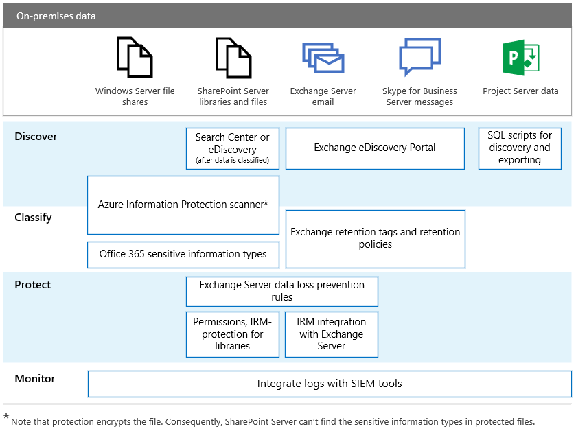

# RGPD para servidores locais do OfficeGDPR for Office on-premises Servers

O RGPD (Regulamento Geral sobre a Proteção de Dados) apresenta os requisitos para as organizações protegerem dados pessoais adequadamente e atender adequadamente às solicitações de titulares de dados. Esta série de artigos fornece abordagens recomendadas para cargas de trabalho locais:The General Data Protection Regulation (GDPR) introduces requirements for organizations to protect personal data and respond appropriately to data subject requests. This series of articles provides recommended approaches for on-premises workloads:

- [SharePoint ServerSharePoint Server](gdpr-for-sharepoint-server.md)

- [Exchange ServerExchange Server](gdpr-for-exchange-server.md)

- [Skype for Business ServerSkype for Business Server](gdpr-for-skype-for-business-server.md)

- [Project ServerProject Server](gdpr-for-project-server.md)

- [Servidor do Office Web Apps e Servidor do Office OnlineOffice Web Apps Server and Office Online Server](gdpr-for-office-online-server.md)

- [Compartilhamentos de arquivos locaisOn-premises file shares](gdpr-for-on-premises-file-shares.md)

Para obter mais informações sobre o RGPD e como a Microsoft pode ajudar você, confira a [Central de Confiabilidade da Microsoft](https://www.microsoft.com/trust-center/privacy/gdpr-overview
).For more information about the GDPR and how Microsoft can help you, see the [Microsoft Trust Center](https://www.microsoft.com/trust-center/privacy/gdpr-overview
).

Antes de trabalhar com dados locais, consulte suas equipes de conformidade e jurídica para buscar orientações e saber mais sobre os esquemas e as abordagens existentes de classificação para trabalhar com dados pessoais. A Microsoft fornece recomendações para desenvolver e estender esquemas de classificação no Microsoft GDPR Data Discovery Toolkit em [https://aka.ms/gdprpartners](<https://aka.ms/gdprpartners>). Esse kit de ferramentas também descreve abordagens para mover dados locais para a nuvem, onde você pode usar recursos de governança de dados mais sofisticados, se desejar. Os artigos nesta seção fornecem recomendações para os dados destinados a permanecerem no local.Before doing any work with on-premises data, consult with your legal and compliance teams to seek guidance and to learn about existing classification schemas and approaches to working with personal data. Microsoft provides recommendations for developing and extending classifications schemas in the Microsoft GDPR Data Discovery Toolkit at [https://aka.ms/gdprpartners](<https://aka.ms/gdprpartners>). This toolkit also describes approaches for moving on-premises data to the cloud where you can use more sophisticated data governance capabilities, if this is desired. The articles in this section provide recommendations for data that is intended to remain on premises.

A ilustração a seguir lista os recursos recomendados para usar em cada uma dessas cargas de trabalho para descobrir, classificar, proteger e monitorar dados pessoais. Confira os artigos desta seção para saber mais.The following illustration lists recommended capabilities to use across each of these workloads to discover, classify, protect, and monitor personal data. See the articles in this section for more information.

## Descrição da ilustraçãoIllustration description

Para maior acessibilidade, a tabela a seguir fornece os mesmos exemplos da ilustração.For accessibility, the following table provides the same examples in the illustration.

****

|AçãoAction|Compartilhamentos de arquivos do Windows ServerWindows Server file shares|SharePoint ServerSharePoint Server|Exchange ServerExchange Server|Skype for BusinessSkype for Business|Project ServerProject Server|
|---|---|---|---|---|---|
|DescobrirDiscover|Scanner da Proteção de Informações do Azure\*Azure Information Protection scanner\*|Centro de Pesquisa ou de Descoberta Eletrônica (depois que os dados forem classificados)Search Center or eDiscovery (after data is classified)    Scanner da Proteção de Informações do Azure\*Azure Information Protection scanner\*|Portal de Descoberta Eletrônica do ExchangeExchange eDiscovery Portal|Portal de Descoberta Eletrônica do ExchangeExchange eDiscovery portal|Scripts SQL para descobrir e exportarSQL scripts for discovery and exporting|
|ClassificarClassify|Scanner da Proteção de Informações do Azure\*Azure Information Protection scanner\*    Tipos de informações confidenciais do Office 365Office 365 sensitive information types|Scanner da Proteção de Informações do Azure\*Azure Information Protection scanner\*    Tipos de informações confidenciais do Office 365Office 365 sensitive information types|Marcas e políticas de retenção do ExchangeExchange retention tags and retention policies|Marcas e políticas de retenção do ExchangeExchange retention tags and retention policies||
|ProtegerProtect||Regras de prevenção contra perda de dados do Exchange ServerExchange Server data loss prevention rules    Permissões, proteção do IRM para bibliotecasPermissions, IRM-protection for libraries|Regras de prevenção contra perda de dados do Exchange ServerExchange Server data loss prevention rules    Integração do IRM com o Exchange ServerIRM integration with Exchange Server|||
|MonitorarMonitor|Integrar logs com ferramentas SIEMIntegrate logs with SIEM tools|Integrar logs com ferramentas SIEMIntegrate logs with SIEM tools|Integrar logs com ferramentas SIEMIntegrate logs with SIEM tools|Integrar logs com ferramentas SIEMIntegrate logs with SIEM tools|Integrar logs com ferramentas SIEMIntegrate logs with SIEM tools|
|

\* Observe que a proteção criptografa o arquivo.\* Note that protection encrypts the file. Consequentemente, o SharePoint Server não consegue encontrar os tipos de informações confidenciais nos arquivos protegidos.Consequently, SharePoint Server can't find the sensitive information types in protected files.
