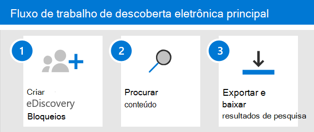

# Começar a trabalhar com a Descoberta eDiscoveria Básica no Microsoft 365Get started with Core eDiscovery in Microsoft 365

O Core eDiscovery no Microsoft 365 fornece uma ferramenta básica de Descoberta eDiscovery que as organizações podem usar para pesquisar e exportar conteúdo em Microsoft 365 e Office 365.Core eDiscovery in Microsoft 365 provides a basic eDiscovery tool that organizations can use to search and export content in Microsoft 365 and Office 365. Você também pode usar o Core eDiscovery para colocar uma responsabilidade de Descoberta Eletrônico em locais de conteúdo, como caixas de correio Exchange, sites SharePoint, contas OneDrive e Microsoft Teams.You can also use Core eDiscovery to place an eDiscovery hold on content locations, such as Exchange mailboxes, SharePoint sites, OneDrive accounts, and Microsoft Teams. Nada é necessário para implantar a Descoberta Principal, mas há algumas tarefas de pré-requisitos que um administrador de IT e o gerente de Descobertas Online precisam concluir para que sua organização possa começar a usar a Descoberta Básica para pesquisar, exportar e preservar conteúdo.Nothing is needed to deploy Core eDiscovery, but there are some prerequisite tasks that an IT admin and eDiscovery manager have to complete before your organization can start using Core eDiscovery to search, export, and preserve content.

Este artigo discute as etapas necessárias para configurar a Descoberta Principal da Descoberta e.This article discusses the steps necessary to set up Core eDiscovery. Isso inclui garantir o licenciamento adequado necessário para acessar a Descoberta Principal e colocar uma responsabilidade de Descoberta eDiscovery em locais de conteúdo, bem como atribuir permissões à equipe de IT, legal e de investigação para que eles possam acessar e gerenciar casos.This includes ensuring the proper licensing required to access Core eDiscovery and place an eDiscovery hold on content locations, as well as assigning permissions to your IT, legal, and investigation team so they can access and manage cases. Este artigo também fornece uma visão geral de alto nível do uso de casos para pesquisar e exportar conteúdo.This article also provides a high-level overview of using cases to search for and export content.

## Etapa 1: Verificar e atribuir licenças apropriadasStep 1: Verify and assign appropriate licenses

O licenciamento para a Descoberta Interna requer a assinatura da organização apropriada e o licenciamento por usuário.Licensing for Core eDiscovery requires the appropriate organization subscription and per-user licensing.

- **Assinatura da organização:** Para acessar o Core eDiscovery no centro de conformidade do Microsoft 365 ou no Centro de Conformidade do Office 365 Security & e usar os recursos de espera e exportação, sua organização deve ter uma assinatura Microsoft 365 E3 ou Office 365 E3 ou superior.**Organization subscription:** To access Core eDiscovery in the Microsoft 365 compliance center or the Office 365 Security & Compliance Center and use the hold and export features, your organization must have a Microsoft 365 E3 or Office 365 E3 subscription or higher.

- **Licenciamento por usuário:** Para colocar uma responsabilidade de Descoberta Eletrônico em caixas de correio e sites, um usuário deve receber uma das seguintes licenças, dependendo da assinatura da sua organização:**Per-user licensing:** To place an eDiscovery hold on mailboxes and sites, a user must be assigned one of the following licenses, depending on your organization subscription:

  - Uma Microsoft 365 E3 ou Office 365 E3 ou superiorA Microsoft 365 E3 or Office 365 E3 license or higher

   OUOR

  - Office 365 Licença E1 com uma Exchange Online plano 2 ou Arquivamento do Exchange Online de complementoOffice 365 E1 license with an Exchange Online Plan 2 or Exchange Online Archiving add-on license

  EAND

  - Office 365 Licença E1 com uma licença SharePoint Plano 2 ou OneDrive for Business plano 2 do Plano 2Office 365 E1 license with an SharePoint Online Plan 2 or OneDrive for Business Plan 2 add-on license
  
  Para obter informações sobre como atribuir licenças, consulte [Assign licenses to users](../admin/manage/assign-licenses-to-users.md).For information about how to assign licenses, see [Assign licenses to users](../admin/manage/assign-licenses-to-users.md).

Para obter informações sobre licenciamento:For information about licensing:

- Baixe e consulte a solução "Descobrir & Responder" na comparação de licenciamento [Microsoft 365 conformidade.](/office365/servicedescriptions/downloads/microsoft-365-compliance-licensing-comparison.xlsx)Download and see the "Discover & Respond" solution in the [Microsoft 365 Compliance Licensing Comparison](/office365/servicedescriptions/downloads/microsoft-365-compliance-licensing-comparison.xlsx).

- Consulte a descrição do [serviço & Centro de Conformidade.](/office365/servicedescriptions/office-365-platform-service-description/office-365-securitycompliance-center)See the [Security & Compliance Center service description](/office365/servicedescriptions/office-365-platform-service-description/office-365-securitycompliance-center).

## Etapa 2: Atribuir permissões de Descoberta eStep 2: Assign eDiscovery permissions

Para acessar a Descoberta Interna ou ser adicionado como membro de um caso core de Descoberta eDiscovery, um usuário deve ter as permissões apropriadas.To access Core eDiscovery or be added as a member of a Core eDiscovery case, a user must be assigned the appropriate permissions. Especificamente, um usuário deve ser adicionado como membro do grupo de funções do Gerenciador de Descobertas Office 365 Segurança & Compliance Center.Specifically, a user must be added as a member of the eDiscovery Manager role group in the Office 365 Security & Compliance Center. Os membros desse grupo de função podem criar e gerenciar os principais casos de Descoberta eDiscovery.Members of this role group can create and manage Core eDiscovery cases. Eles podem adicionar e remover membros, colocar uma responsabilidade de Descoberta EDiscovery em usuários, criar e editar pesquisas e exportar conteúdo de um caso de Descoberta Interna.They can add and remove members, place an eDiscovery hold on users, create and edit searches, and export content from a Core eDiscovery case.

Conclua as etapas a seguir para adicionar usuários ao grupo de funções do Gerenciador de Descobertas E:Complete the following steps to add users to the eDiscovery Manager role group:

1. Acesse e entre usando as credenciais de uma conta de administrador em sua Microsoft 365 [https://protection.office.com/permissions](https://protection.office.com/permissions) ou Office 365 organização.Go to [https://protection.office.com/permissions](https://protection.office.com/permissions) and sign in using the credentials for an admin account in your Microsoft 365 or Office 365 organization.

2. Na página **Permissões,** selecione o grupo de função **Gerenciador de** Descobertas.On the **Permissions** page, select the **eDiscovery Manager** role group.

3. Na página de sobrevoo do Gerenciador de Descobertas e, em Seguida, clique em **Editar** ao lado da **seção Gerenciador de** Descobertas E.On the eDiscovery Manager flyout page, click **Edit** next to the **eDiscovery Manager** section.

4. Na página **Escolher Gerente de Descoberta Virtual** no assistente editar grupo de funções, clique em Escolher Gerenciador de **Descoberta**.On the **Choose eDiscovery Manager** page in the edit role group wizard, click **Choose Discovery Manager**.

5. Clique **em Adicionar** e selecione a caixa de seleção para todos os usuários que você deseja adicionar ao grupo de funções.Click **Add** then select the checkbox for all users you want to add to the role group.

6. Clique **em Adicionar** para adicionar os usuários selecionados e clique em **Feito**.Click **Add** to add the selected users, and then click **Done**.

7. Clique **em Salvar** para adicionar os usuários ao grupo de funções e clique em **Fechar** para concluir a etapa.Click **Save** to add the users to the role group, and then click **Close** to complete the step.

### Mais informações sobre o grupo de funções do Gerenciador de Descobertas EMore information about the eDiscovery Manager role group

Há dois subgrupos no grupo de funções do Gerenciador de Descobertas.There are two subgroups in the eDiscovery Manager role group. A diferença entre esses subgrupos está no escopo.The difference between these subgroups is based on scope.

- **EDiscovery Manager**: pode exibir e gerenciar os principais casos de Descoberta eDiscovery dos quais eles criam ou são membros.**eDiscovery Manager**: Can view and manage the Core eDiscovery cases they create or are a member of. Se outro Gerenciador de Descobertas De eDiscovery criar um caso, mas não adicionar um segundo Gerenciador de Descobertas Deeconsutórias como membro desse caso, o segundo Gerenciador de Descobertas De eDiscovery não poderá exibir ou abrir o caso na página Descoberta eDiscoveria Principal no centro de conformidade.If another eDiscovery Manager creates a case but doesn't add a second eDiscovery Manager as a member of that case, the second eDiscovery Manager won't be able to view or open the case on the Core eDiscovery page in the compliance center. Em geral, a maioria das pessoas em sua organização pode ser adicionada ao subgrupo do Gerenciador de Descobertas.In general, most people in your organization can be added to the eDiscovery Manager subgroup.

- **Administrador de Descoberta e**: pode executar todas as tarefas de gerenciamento de caso que um Gerenciador de Descobertas E pode fazer.**eDiscovery Administrator**: Can perform all case management tasks that an eDiscovery Manager can do. Além disso, um Administrador de Descoberta Eletrônica pode:Additionally, an eDiscovery Administrator can:

  - Exibir todos os casos listados na página Descoberta Principal.View all cases that are listed on the Core eDiscovery page.
  
  - Gerenciar qualquer caso na organização após adicionarem a si mesmos como membros do caso.Manage any case in the organization after they add themselves as a member of the case.

  - Acessar e exportar dados de caso de qualquer caso na organização.Access and export case data for any case in the organization.

  Devido ao amplo escopo de acesso, uma organização deve ter apenas alguns administradores que são membros do subgrupo de Administradores da Descoberta Eletrônica.Because of the broad scope of access, an organization should have only a few admins who are members of the eDiscovery Administrators subgroup.

Para obter mais informações sobre permissões de Descoberta E e uma descrição de cada função atribuída ao grupo de funções do Gerenciador de Descobertas E, consulte [Assign eDiscovery permissions](assign-ediscovery-permissions.md).For more information about eDiscovery permissions and a description of each role that's assigned to the eDiscovery Manager role group, see [Assign eDiscovery permissions](assign-ediscovery-permissions.md).

## Etapa 3: Criar um caso principal de Descoberta eDiscoveryStep 3: Create a Core eDiscovery case

A próxima etapa é criar uma ocorrência e começar a usar a Descoberta Principal.The next step is to create a case and start using Core eDiscovery. Conclua as etapas a seguir para criar uma ocorrência e adicionar membros.Complete the following steps to create a case and add members. O usuário que cria a ocorrência é adicionado automaticamente como membro.The user who creates the case is automatically added as a member.

1. Acesse e entre usando as credenciais de uma conta de usuário que recebeu as permissões de [https://compliance.microsoft.com](https://compliance.microsoft.com) Descoberta eDiscovery apropriadas.Go to [https://compliance.microsoft.com](https://compliance.microsoft.com) and sign in using the credentials for a user account that has been assigned the appropriate eDiscovery permissions. Os membros do grupo de função Gerenciamento da Organização também podem criar principais casos de Descoberta eDiscovery.Members of the Organization Management role group can also create Core eDiscovery cases.

2. No painel de navegação esquerdo do centro de conformidade Microsoft 365, clique em **Mostrar** tudo e clique em **Descoberta > Core**.In the left navigation pane of the Microsoft 365 compliance center, click **Show all**, and then click **eDiscovery > Core**.

3. Na página **Descoberta Principal da Descoberta e,** clique em Criar um **caso**.On the **Core eDiscovery** page, click **Create a case**.

4. Na página **Novo caso,** dê ao caso um nome (obrigatório) e digite uma descrição opcional.On the **New case** flyout page, give the case a name (required) and then type an optional description. O nome do caso deve ser exclusivo em sua organização.The case name must be unique in your organization.

5. Clique **em Salvar** para criar o caso.Click **Save** to create the case.

   O novo caso é criado e exibido na página Descoberta Principal.The new case is created and displayed on the Core eDiscovery page. Talvez seja preciso clicar em **Atualizar** para exibir o novo caso.You may have to click **Refresh** to display the new case.

## Etapa 4 (opcional): Adicionar membros a um caso de Descoberta Principal de Descoberta eStep 4 (optional): Add members to a Core eDiscovery case

Se você criar um caso na Etapa 3 e for a única pessoa que usará o caso, não será preciso executar esta etapa.If you create a case in Step 3 and you're the only person who will use the case, then you don't have to perform this step. Você pode começar a usar o caso para criar regiões de Descoberta e Descoberta, pesquisar conteúdo e exportar resultados de pesquisa.You can start using the case to create eDiscovery holds, search for content, and export search results. Execute esta etapa se você quiser dar a outros usuários (ou grupos de funções) acesso ao caso.Perform this step if you want to give other users (or roles group) access to the case.

1. Na página **Descoberta Principal da** Descoberta Microsoft 365 de conformidade, clique no nome do caso ao que você deseja adicionar membros.On the **Core eDiscovery** page in the Microsoft 365 compliance center, click the name of the case that you want to add members to.

2. Na home page do caso, selecione a guia **Configurações** e selecione **Acessar & permissões**.On the case home page, select the **Settings** tab, and then select **Access & permissions**.

3. Na página Subsu & de permissões do **Access,** em **Membros**, clique em **Adicionar** para adicionar membros ao caso.On the **Access & permissions** flyout page, under **Members**, click **Add** to add members to the case.

    Você também pode optar por adicionar grupos de função como membros de uma ocorrência.You can also choose to add role groups as members of a case. Em **Grupos de função,** clique em **Adicionar**.Under **Role groups**, click **Add**. Você só pode atribuir os grupos de função dos que você é membro a um caso.You can only assign the role groups that you are a member of to a case. Isso ocorre porque os grupos de função controlam quem pode atribuir membros a um caso de Descoberta E.That's because role groups control who can assign members to an eDiscovery case.

4. Na lista de pessoas ou grupos de função que podem ser adicionados como membros do caso, clique à esquerda do nome das pessoas (ou grupos de função) que você deseja adicionar.In the list of people or role groups that can be added as members of the case, click to the left of the name of the people (or role groups) that you want to add. Se você tiver uma lista grande de pessoas ou grupos  de função que podem ser adicionados como membros, use a caixa Pesquisar para pesquisar uma pessoa específica ou grupo de função na lista.If you have a large list of people or role groups who can added as members, use the **Search** box to search for a specific person or role group in the list.
  
5. Depois de selecionar as pessoas ou grupos de função a adicionar como membros do caso, clique em **Salvar** para salvar os novos membros ou grupos de função.After you select the people or role groups to add as members of the case, click **Save** to save the new members or role groups.

## Explorar o fluxo de trabalho principal de Descoberta EletrônicoExplore the Core eDiscovery workflow

Para começar a usar a Descoberta Eletrônico principal, aqui está um fluxo de trabalho simples de criação de regiões de Descoberta Eletrônico para pessoas de interesse, a pesquisa de conteúdo relevante para sua investigação e, em seguida, a exportação desses dados para revisão posterior.To get you started using core eDiscovery, here's a simple workflow of creating eDiscovery holds for people of interest, searching for content that relevant to your investigation, and then exporting that data for further review. Em cada uma dessas etapas, também destacaremos algumas funcionalidades de Descoberta eDiscoveria Básica estendidas que você pode explorar.In each of these steps, we'll also highlight some extended Core eDiscovery functionality that you can explore.

1. **[Criar uma responsabilidade de Descoberta E.](create-ediscovery-holds.md)****[Create an eDiscovery hold](create-ediscovery-holds.md)**. A primeira etapa após a criação de um caso é colocar uma responsabilidade (também chamada de ressarção de *Descoberta* e) nos locais de conteúdo das pessoas de interesse em sua investigação.The first step after creating a case is placing a hold (also called an *eDiscovery hold*) on the content locations of the people of interest in your investigation. Os locais de conteúdo incluem Exchange caixas de correio, sites SharePoint, contas OneDrive e caixas de correio e sites associados a grupos Microsoft Teams e Office 365.Content locations include Exchange mailboxes, SharePoint sites, OneDrive accounts, and the mailboxes and sites associated with Microsoft Teams and Office 365 Groups. Embora esta etapa seja opcional, a criação de uma isenção de descoberta de eDiscovery preserva o conteúdo que pode ser relevante para o caso durante a investigação.While this step is optional, creating an eDiscovery hold preserves content that may be relevant to the case during the investigation. Ao criar uma ressarção de Descoberta e, você pode preservar todo o conteúdo em locais de conteúdo específicos ou criar uma responsabilidade baseada em consulta para preservar apenas o conteúdo que corresponde a uma consulta de espera.When you create an eDiscovery hold you can preserve all content in specific content locations or you can create a query-based hold to preserve only the content that matches a hold query. Além de preservar o conteúdo, outro bom motivo para criar regiões de Descoberta eDiscovery é pesquisar rapidamente os locais de conteúdo em espera (em vez de ter que selecionar cada local para pesquisar) ao criar e executar pesquisas na próxima etapa.In addition to preserving content, another good reason to create eDiscovery holds is to quickly search the content locations on hold (instead of having to select each location to search) when you create and run searches in the next step. Depois de concluir a investigação, você pode liberar qualquer ressução criada.After you complete your investigation, you can release any hold that you created.

2. **[Pesquise o conteúdo](search-for-content-in-core-ediscovery.md)**.**[Search for content](search-for-content-in-core-ediscovery.md)**. Depois de criar regiões de Descoberta eDiscovery, use a ferramenta de pesquisa in-loco para pesquisar os locais de conteúdo em espera.After you create eDiscovery holds, use the built-in search tool to search the content locations on hold. Você também pode pesquisar em outros locais de conteúdo dados que podem ser relevantes para o caso.You can also search other content locations for data that may be relevant to the case. Você pode criar e executar diferentes pesquisas associadas ao caso.You can create and run different searches that are associated with the case. Você usa palavras-chave, propriedades  e condições para criar consultas de pesquisa que retornam resultados de pesquisa com os dados que provavelmente são relevantes para o caso.You use keywords, properties, and conditions to [build search queries](keyword-queries-and-search-conditions.md) that return search results with the data that's most likely relevant to the case. Você também pode:You can also:

   - Exibir estatísticas de pesquisa que podem ajudá-lo a refinar uma consulta de pesquisa para restringir os resultados.View search statistics that may help you refine a search query to narrow the results.

   - Visualize os resultados da pesquisa para verificar rapidamente se os dados relevantes estão sendo encontrados.Preview the search results to quickly verify whether the relevant data is being found.

   - Revise uma consulta e reprise a pesquisa.Revise a query and rerun the search.

3. **[Exportar e baixar resultados da pesquisa](export-content-in-core-ediscovery.md)**.**[Export and download search results](export-content-in-core-ediscovery.md)**. Depois de pesquisar e encontrar dados relevantes para sua investigação, você pode exportá-los fora do Office 365 para análise por pessoas fora da equipe de investigação.After you search for and find data that's relevant to your investigation, you can export it out of Office 365 for review by people outside of the investigation team. Exportar dados é um processo de duas etapas.Exporting data is a two-step process. A primeira etapa é exportar os resultados de uma pesquisa no caso de Office 365.The first step is to export the results of a search in the case out of Office 365. Isso é feito copiando os resultados de uma pesquisa para um local de Armazenamento do Azure fornecido pela Microsoft.This is accomplished by copying the results of a search to a Microsoft-provided Azure Storage location. A próxima etapa é usar a ferramenta Exportar Descoberta Digital para baixar o conteúdo em um computador local.The next step is to use the eDiscovery Export tool to download the content to a local computer. Além dos arquivos de dados exportados, o contém do pacote de exportação também contém um relatório de exportação, um relatório de resumo e um relatório de erro.In addition to the exported data files, the contains of the export package also contains an export report, a summary report, and an error report.
