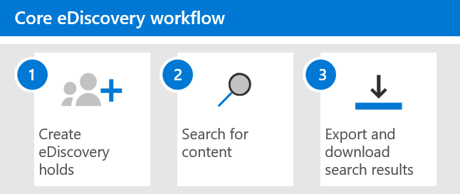

# Introdução à Descoberta Eletrônica CentralGet started with Core eDiscovery

A descoberta eletrônica principal no Microsoft 365 fornece uma ferramenta de descoberta eletrônica básica que as organizações podem usar para pesquisar e exportar conteúdo no Microsoft 365 e no Office 365.Core eDiscovery in Microsoft 365 provides a basic eDiscovery tool that organizations can use to search and export content in Microsoft 365 and Office 365. Você também pode usar a descoberta eletrônica principal para colocar um controle de descoberta eletrônica em locais de conteúdo, como caixas de correio do Exchange, sites do SharePoint, contas do OneDrive e Microsoft Teams.You can also use Core eDiscovery to place an eDiscovery hold on content locations, such as Exchange mailboxes, SharePoint sites, OneDrive accounts, and Microsoft Teams. Nada é necessário para implantar a descoberta eletrônica principal, mas há algumas tarefas de pré-requisito que um administrador de ti e um gerente de descoberta eletrônica precisam concluir para que sua organização possa começar a usar a descoberta eletrônica principal para pesquisar, exportar e preservar o conteúdo.Nothing is needed to deploy Core eDiscovery, but there are some prerequisite tasks that an IT admin and eDiscovery manager have to complete before your organization can start using Core eDiscovery to search, export, and preserve content.

Este artigo discute as etapas necessárias para configurar a descoberta eletrônica principal.This article discusses the steps necessary to set up Core eDiscovery. Isso inclui garantir que o licenciamento apropriado seja necessário para acessar a descoberta eletrônica principal e colocar uma descoberta eletrônica em locais de conteúdo, bem como atribuir permissões à equipe de ti, jurídica e de investigação para que eles possam acessar e gerenciar ocorrências.This includes ensuring the proper licensing required to access Core eDiscovery and place an eDiscovery hold on content locations, as well as assigning permissions to your IT, legal, and investigation team so they can access and manage cases. Este artigo também fornece uma visão geral de alto nível do uso de casos para pesquisar e exportar conteúdo.This article also provides a high-level overview of using cases to search for and export content.

## Etapa 1: verificar e atribuir licenças apropriadasStep 1: Verify and assign appropriate licenses

O licenciamento da descoberta eletrônica principal requer a assinatura apropriada da organização e o licenciamento por usuário.Licensing for Core eDiscovery requires the appropriate organization subscription and per-user licensing.

- **Assinatura da organização:** Para acessar a descoberta eletrônica Core no centro de conformidade da Microsoft 365 ou no centro de conformidade & segurança do Office 365 e usar os recursos de retenção e exportação, sua organização deve ter uma assinatura do Microsoft 365 E3 ou Office 365 E3 ou superior.**Organization subscription:** To access Core eDiscovery in the Microsoft 365 compliance center or the Office 365 Security & Compliance Center and use the hold and export features, your organization must have a Microsoft 365 E3 or Office 365 E3 subscription or higher.

- **Licenciamento por usuário:** Para colocar um controle de descoberta eletrônica em caixas de correio e sites, um usuário deve receber uma das seguintes licenças, dependendo da sua assinatura de organização:**Per-user licensing:** To place an eDiscovery hold on mailboxes and sites, a user must be assigned one of the following licenses, depending on your organization subscription:

  - Uma licença do Microsoft 365 E3 ou do Office 365 E3 ou superiorA Microsoft 365 E3 or Office 365 E3 license or higher

   OUOR

  - Licença do Office 365 E1 com uma licença complementar do Exchange Online Plan 2 ou Exchange Online ArchivingOffice 365 E1 license with an Exchange Online Plan 2 or Exchange Online Archiving add-on license

  EAND

  - Licença do Office 365 E1 com uma licença complementar do SharePoint Online plano 2 ou do OneDrive for Business plano 2Office 365 E1 license with an SharePoint Online Plan 2 or OneDrive for Business Plan 2 add-on license
  
  Para obter informações sobre como atribuir licenças, consulte [assign licenses to Users](https://docs.microsoft.com/microsoft-365/admin/manage/assign-licenses-to-users).For information about how to assign licenses, see [Assign licenses to users](https://docs.microsoft.com/microsoft-365/admin/manage/assign-licenses-to-users).

Para obter informações sobre licenciamento:For information about licensing:

- Baixe e veja a solução "descobrir & responder" na [comparação de licenciamento de conformidade da Microsoft 365](https://docs.microsoft.com/office365/servicedescriptions/downloads/microsoft-365-compliance-licensing-comparison.xlsx).Download and see the "Discover & Respond" solution in the [Microsoft 365 Compliance Licensing Comparison](https://docs.microsoft.com/office365/servicedescriptions/downloads/microsoft-365-compliance-licensing-comparison.xlsx).

- Consulte a [Descrição do serviço centro de conformidade do & de segurança](https://docs.microsoft.com/office365/servicedescriptions/office-365-platform-service-description/office-365-securitycompliance-center).See the [Security & Compliance Center service description](https://docs.microsoft.com/office365/servicedescriptions/office-365-platform-service-description/office-365-securitycompliance-center).

## Etapa 2: atribuir permissões de descoberta eletrônicaStep 2: Assign eDiscovery permissions

Para acessar o eDiscovery principal ou ser adicionado como um membro de um caso de descoberta eletrônica principal, um usuário deve ter as permissões apropriadas atribuídas.To access Core eDiscovery or be added as a member of a Core eDiscovery case, a user must be assigned the appropriate permissions. Especificamente, um usuário deve ser adicionado como um membro do grupo de função Gerenciador de descoberta eletrônica no centro de conformidade & segurança do Office 365.Specifically, a user must be added as a member of the eDiscovery Manager role group in the Office 365 Security & Compliance Center. Os membros desse grupo de função podem criar e gerenciar casos de descoberta eletrônica principais.Members of this role group can create and manage Core eDiscovery cases. Eles podem adicionar e remover membros, colocar uma descoberta eletrônica em usuários, criar e editar pesquisas e exportar conteúdo de um caso de descoberta eletrônica principal.They can add and remove members, place an eDiscovery hold on users, create and edit searches, and export content from a Core eDiscovery case.

Conclua as seguintes etapas para adicionar usuários ao grupo de funções Gerenciador de descoberta eletrônica:Complete the following steps to add users to the eDiscovery Manager role group:

1. Acesse [https://protection.office.com/permissions](https://protection.office.com/permissions) e entre usando as credenciais de uma conta de administrador na sua organização do Microsoft 365 ou do Office 365.Go to [https://protection.office.com/permissions](https://protection.office.com/permissions) and sign in using the credentials for an admin account in your Microsoft 365 or Office 365 organization.

2. Na página **permissões** , selecione o grupo de funções **Gerenciador de descoberta eletrônica** .On the **Permissions** page, select the **eDiscovery Manager** role group.

3. Na página do submenu Gerenciador de descoberta eletrônica, clique em **Editar** ao lado da seção **Gerenciador de descoberta eletrônica** .On the eDiscovery Manager flyout page, click **Edit** next to the **eDiscovery Manager** section.

4. Na página **escolher Gerenciador de descoberta eletrônica** no assistente editar grupo de funções, clique em **escolher Gerenciador de descoberta**.On the **Choose eDiscovery Manager** page in the edit role group wizard, click **Choose Discovery Manager**.

5. Clique em **Adicionar** e marque a caixa de seleção de todos os usuários que você deseja adicionar ao grupo de funções.Click **Add** then select the checkbox for all users you want to add to the role group.

6. Clique em **Adicionar** para adicionar os usuários selecionados e clique em **concluído**.Click **Add** to add the selected users, and then click **Done**.

7. Clique em **salvar** para adicionar os usuários ao grupo de função e, em seguida, clique em **fechar** para concluir a etapa.Click **Save** to add the users to the role group, and then click **Close** to complete the step.

### Mais informações sobre o grupo de funções do Gerenciador de descoberta eletrônicaMore information about the eDiscovery Manager role group

Há dois subgrupos no grupo de função Gerenciador de descoberta eletrônica.There are two subgroups in the eDiscovery Manager role group. A diferença entre esses subgrupos está no escopo.The difference between these subgroups is based on scope.

- **Gerenciador de descoberta eletrônica:** Pode exibir e gerenciar os principais casos de descoberta eletrônica que eles criam ou são membros de.**eDiscovery Manager:** Can view and manage the Core eDiscovery cases they create or are a member of. Se outro gerenciador de descoberta eletrônica criar uma ocorrência, mas não adicionar um segundo Gerenciador de descoberta eletrônica como membro desse caso, o segundo Gerenciador de descoberta eletrônica não poderá exibir ou abrir o caso na página de descoberta eletrônica principal no centro de conformidade.If another eDiscovery Manager creates a case but doesn't add a second eDiscovery Manager as a member of that case, the second eDiscovery Manager won't be able to view or open the case on the Core eDiscovery page in the compliance center. Em geral, a maioria das pessoas em sua organização pode ser adicionada ao subgrupo Gerenciador de descoberta eletrônica.In general, most people in your organization can be added to the eDiscovery Manager subgroup.

- **administrador de descoberta eletrônica:** Pode executar todas as tarefas de gerenciamento de caso que um gerente de descoberta eletrônica possa fazer.**eDiscovery Administrator:** Can perform all case management tasks that an eDiscovery Manager can do. Além disso, um Administrador de Descoberta Eletrônica pode:Additionally, an eDiscovery Administrator can:

  - Exibir todas as ocorrências listadas na página de descoberta eletrônica principal.View all cases that are listed on the Core eDiscovery page.
  
  - Gerencie qualquer caso na organização depois que eles se adicionarem como um membro do caso.Manage any case in the organization after they add themselves as a member of the case.

  - Acessar e exportar dados de caso para qualquer caso na organização.Access and export case data for any case in the organization.

  Por causa do amplo escopo de acesso, uma organização deve ter apenas alguns administradores que são membros do subgrupo administradores de descoberta eletrônica.Because of the broad scope of access, an organization should have only a few admins who are members of the eDiscovery Administrators subgroup.

Para obter mais informações sobre permissões de descoberta eletrônica e uma descrição de cada função atribuída ao grupo de funções Gerenciador de descoberta eletrônica, consulte [atribuir permissões de descoberta eletrônica](assign-ediscovery-permissions.md).For more information about eDiscovery permissions and a description of each role that's assigned to the eDiscovery Manager role group, see [Assign eDiscovery permissions](assign-ediscovery-permissions.md).

## Etapa 3: criar um caso de descoberta eletrônica principalStep 3: Create a Core eDiscovery case

A próxima etapa é criar um caso e começar a usar a descoberta eletrônica principal.The next step is to create a case and start using Core eDiscovery. Conclua as etapas a seguir para criar um caso e adicionar membros.Complete the following steps to create a case and add members. O usuário que cria o caso é automaticamente adicionado como um membro.The user who creates the case is automatically added as a member.

1. Acesse [https://compliance.microsoft.com](https://compliance.microsoft.com) e entre usando as credenciais de uma conta de usuário que recebeu as permissões de descoberta eletrônica apropriadas.Go to [https://compliance.microsoft.com](https://compliance.microsoft.com) and sign in using the credentials for a user account that has been assigned the appropriate eDiscovery permissions. Os membros do grupo de função gerenciamento da organização também podem criar casos de descoberta eletrônica principais.Members of the Organization Management role group can also create Core eDiscovery cases.

2. No painel de navegação esquerdo do centro de conformidade da Microsoft 365, clique em **Mostrar tudo**e, em seguida, clique em **descoberta eletrônica > Core**.In the left navigation pane of the Microsoft 365 compliance center, click **Show all**, and then click **eDiscovery > Core**.

3. Na página de **descoberta eletrônica principal** , clique em **criar uma ocorrência**.On the **Core eDiscovery** page, click **Create a case**.

4. Na página **novo** submenu de caso, dê um nome (obrigatório) e, em seguida, digite um número de caso e descrição opcionais.On the **New case** flyout page, give the case a name (required), and then type an optional case number and description. O nome da ocorrência deve ser exclusivo em sua organização.The case name must be unique in your organization.

5. Clique em **salvar** para criar o caso.Click **Save** to create the case.

   A nova ocorrência é criada e exibida na página de descoberta eletrônica principal.The new case is created and displayed on the Core eDiscovery page. Talvez seja necessário clicar em **Atualizar** para exibir o novo caso.You may have to click **Refresh** to display the new case. 

## Etapa 4 (opcional): adicionar membros a uma caixa de descoberta eletrônica principalStep 4 (optional): Add members to a Core eDiscovery case

Se você criar uma ocorrência na etapa 3 e for a única pessoa que usará a ocorrência, não será necessário executar essa etapa.If you create a case in Step 3 and you're the only person who will use the case, then you don't have to perform this step. Você pode começar a usar o caso para criar bloqueios de descoberta eletrônica, pesquisar conteúdo ou exportar resultados de pesquisa.You can start using the case to create eDiscovery holds, search for content, or export search results. Execute esta etapa se desejar conceder acesso ao caso a outros usuários (ou grupo de funções).Perform this step if you want to give other users (or roles group) access to the case.

1. Na página de **descoberta eletrônica principal** no centro de conformidade do Microsoft 365, clique no nome do caso para o qual você deseja adicionar membros.On the **Core eDiscovery** page in the Microsoft 365 compliance center, click the name of the case that you want to add members to.

2. Na página **gerenciar esse** submenu de caso, em **gerenciar Membros**, clique em **Adicionar** para adicionar membros ao caso.On the **Manage this case** flyout page, under **Manage members**, click **Add** to add members to the case. 

    Você também pode optar por adicionar o grupo de função como membros de uma ocorrência.You can also choose to add role group as members of a case. Em **gerenciar grupos de função**, clique em **Adicionar**.Under **Manage role groups**, click **Add**. Você só pode atribuir os grupos de funções dos quais você é membro a um caso.You can only assign the role groups that you are a member of to a case. Isso ocorre porque os grupos de função controlam quem pode atribuir membros a uma ocorrência de descoberta eletrônica.That's because role groups control who can assign members to an eDiscovery case.

3. Na lista de pessoas ou grupos de funções que podem ser adicionados como membros do caso, clique na caixa de seleção ao lado dos nomes das pessoas (ou grupos de funções) que você deseja adicionar.In the list of people or role groups that can be added as members of the case, click the check box next to the names of the people (or role groups) that you want to add. Se você tiver uma lista grande de pessoas que podem ser adicionadas como membros, use a caixa **Pesquisar** para procurar uma pessoa específica na lista.If you have a large list of people who can added as members, use the **Search** box to search for a specific person in the list.
  
4. Depois de selecionar as pessoas ou os grupos de funções a serem adicionados como membros do caso, clique em **Adicionar**.After you select the people or role groups to add as members of the case, click **Add**.

5. Clique em **salvar** para salvar a nova lista de membros de caso.Click **Save** to save the new list of case members.

## Explorar o fluxo de trabalho de descoberta eletrônica principalExplore the Core eDiscovery workflow

Para começar a usar a descoberta eletrônica principal, aqui está um fluxo de trabalho simples de criação de descoberta eletrônica para pessoas de interesse, pesquisando conteúdo que seja relevante para sua investigação e, em seguida, exportando os dados para análise adicional.To get you started using core eDiscovery, here's a simple workflow of creating eDiscovery holds for people of interest, searching for content that relevant to your investigation, and then exporting that data for further review. Em cada uma dessas etapas, também realçaremos algumas funcionalidades estendidas de descoberta eletrônica que podem ser exploradas.In each of these steps, we'll also highlight some extended Core eDiscovery functionality that you can explore.

1. **[Criar uma retenção de descoberta eletrônica](create-ediscovery-holds.md)**.**[Create an eDiscovery hold](create-ediscovery-holds.md)**. A primeira etapa depois da criação de um caso é colocar uma retenção (também chamada de *descoberta eletrônica*) nos locais de conteúdo das pessoas de interesse em sua investigação.The first step after creating a case is placing a hold (also called an *eDiscovery hold*) on the content locations of the people of interest in your investigation. Os locais de conteúdo incluem caixas de correio do Exchange, sites do SharePoint, contas do OneDrive, bem como caixas de correio e sites associados ao Microsoft Teams e grupos do Office 365.Content locations include Exchange mailboxes, SharePoint sites, OneDrive accounts, as well as the mailboxes and sites associated with Microsoft Teams and Office 365 Groups. Embora esta etapa seja opcional, a criação de uma descoberta eletrônica preserva o conteúdo que pode ser relevante para o caso durante a investigação.While this step is optional, creating an eDiscovery hold preserves content that may be relevant to the case during the investigation. Ao criar um controle de descoberta eletrônica, você pode preservar todo o conteúdo em locais de conteúdo específicos ou pode criar um bloqueio baseado em consulta para preservar apenas o conteúdo que corresponde a uma consulta de bloqueio.When you create an eDiscovery hold you can preserve all content in specific content locations or you can create a query-based hold to preserve only the content that matches a hold query. Além de preservar o conteúdo, outro bom motivo para criar descoberta eletrônica é pesquisar rapidamente os locais de conteúdo em espera (em vez de ter que selecionar cada local para Pesquisar) ao criar e executar pesquisas na próxima etapa.In addition to preserving content, another good reason to create eDiscovery holds is to quickly search the content locations on hold (instead of having to select each location to search) when you create and run searches in the next step. Após concluir sua investigação, você pode liberar qualquer isenção que você criou.After you complete your investigation, you can release any hold that you created.

2. **[Pesquisa de conteúdo](search-for-content-in-core-ediscovery.md)**.**[Search for content](search-for-content-in-core-ediscovery.md)**. Após criar as isenções de descoberta eletrônica, use a ferramenta de pesquisa interna para pesquisar os locais de conteúdo em espera.After you create eDiscovery holds, use the built-in search tool to search the content locations on hold. Você também pode pesquisar outros locais de conteúdo para dados que podem ser relevantes para o caso.You can also search other content locations for data that may be relevant to the case. Você pode criar e executar pesquisas diferentes que estão associadas à ocorrência.You can create and run different searches that are associated with the case. Você usa palavras-chave, propriedades e condições para [criar consultas de pesquisa](keyword-queries-and-search-conditions.md) que retornem resultados de pesquisa com os dados que mais provavelmente são relevantes para o caso.You use keywords, properties, and conditions to [build search queries](keyword-queries-and-search-conditions.md) that return search results with the data that's most likely relevant to the case. Você também pode:You can also:

   - Exibir estatísticas de pesquisa que podem ajudá-lo a refinar uma consulta de pesquisa para restringir os resultados.View search statistics that may help you refine a search query to narrow the results.

   - Visualize os resultados da pesquisa para verificar rapidamente se os dados relevantes estão sendo encontrados.Preview the search results to quickly verify whether the relevant data is being found.

   - Revise uma consulta e execute a pesquisa novamente.Revise a query and rerun the search.

3. **[Exportar e baixar resultados de pesquisa](export-content-in-core-ediscovery.md)**.**[Export and download search results](export-content-in-core-ediscovery.md)**. Depois de Pesquisar e localizar dados relevantes à sua investigação, você poderá exportá-los fora do Office 365 para análise por pessoas de fora da equipe de investigação.After you search for and find data that's relevant to your investigation, you can export it out of Office 365 for review by people outside of the investigation team. A exportação de dados é um processo de duas etapas.Exporting data is a two-step process. A primeira etapa é exportar os resultados de uma pesquisa no caso do Office 365.The first step is to export the results of a search in the case out of Office 365. Isso é feito copiando os resultados de uma pesquisa para um local de armazenamento do Azure fornecido pela Microsoft.This is accomplished by copying the results of a search to a Microsoft-provided Azure Storage location. A próxima etapa é usar a ferramenta de exportação de descoberta eletrônica para baixar o conteúdo para um computador local.The next step is to use the eDiscovery Export tool to download the content to a local computer. Além dos arquivos de dados exportados, o contém o pacote de exportação também contém um relatório de exportação, um relatório de resumo e um relatório de erros.In addition to the exported data files, the contains of the export package also contains an export report, a summary report, and an error report.
