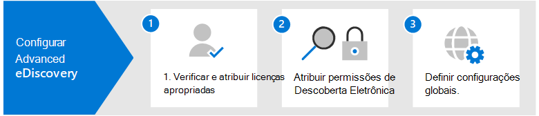

# Configurar Microsoft 365 Advanced eDiscoverySet up Microsoft 365 Advanced eDiscovery

Advanced eDiscovery no Microsoft 365 fornece um fluxo de trabalho de ponta a ponta para preservar, coletar, analisar, analisar e exportar dados que respondem às investigações internas e externas da sua organização.Advanced eDiscovery in Microsoft 365 provides an end-to-end workflow to preserve, collect, review, analyze, and export data that's responsive to your organization's internal and external investigations. Nada é necessário para implantar o Advanced eDiscovery, mas há algumas tarefas de pré-requisitos que um administrador de IT e o gerente de Descobertas Online precisam concluir antes que sua organização possa começar a criar e usar Advanced eDiscovery casos para gerenciar suas investigações.Nothing is needed to deploy Advanced eDiscovery, but there are some prerequisite tasks that an IT admin and eDiscovery manager have to complete before your organization can start to create and use Advanced eDiscovery cases to manage your investigations.

Este artigo discute as etapas a seguir necessárias para configurar Advanced eDiscovery.This article discusses the following steps necessary to set up Advanced eDiscovery.

Isso inclui garantir o licenciamento adequado necessário para acessar Advanced eDiscovery e adicionar custodiantes a casos e atribuir permissões à sua equipe legal e de investigação para que eles possam acessar e gerenciar casos.This includes ensuring the proper licensing required to access Advanced eDiscovery and add custodians to cases, and assigning permissions to your legal and investigation team so they can access and manage cases.

## Etapa 1: Verificar e atribuir licenças apropriadasStep 1: Verify and assign appropriate licenses

O licenciamento para Advanced eDiscovery requer a assinatura da organização apropriada e o licenciamento por usuário.Licensing for Advanced eDiscovery requires the appropriate organization subscription and per-user licensing. Para ver uma lista de requisitos de licenciamento para Advanced eDiscovery, consulte [Assinaturas e licenciamento.](overview-ediscovery-20.md#subscriptions-and-licensing)For a list of licensing requirements for Advanced eDiscovery, see [Subscriptions and licensing](overview-ediscovery-20.md#subscriptions-and-licensing).

## Etapa 2: Atribuir permissões de Descoberta eStep 2: Assign eDiscovery permissions

Para acessar Advanced eDiscovery ou adicionado como membro de um caso Advanced eDiscovery, um usuário deve ter as permissões apropriadas.To access Advanced eDiscovery or added as a member of an Advanced eDiscovery case, a user must be assigned the appropriate permissions. Especificamente, um usuário deve ser adicionado como membro do grupo de funções do Gerenciador de Descobertas e no Centro de Conformidade & Segurança.Specifically, a user must be added as a member of the eDiscovery Manager role group in the Security & Compliance Center. Os membros desse grupo de funções podem criar e gerenciar Advanced eDiscovery casos.Members of this role group can create and manage Advanced eDiscovery cases. Eles podem adicionar e remover membros, colocar custodiantes e locais de conteúdo em espera, gerenciar notificações de avaliação legal, criar e editar pesquisas associadas em um caso, adicionar resultados de pesquisa a um conjunto de revisão, analisar dados em um conjunto de revisão e exportar e baixar de um caso de Advanced eDiscovery.They can add and remove members, place custodians and content locations on hold, manage legal hold notifications, create and edit searches associated in a case, add search results to a review set, analyze data in a review set, and export and download from an Advanced eDiscovery case.

Conclua as etapas a seguir para adicionar usuários ao grupo de funções do Gerenciador de Descobertas E:Complete the following steps to add users to the eDiscovery Manager role group:

1. Acesse e entre usando as credenciais de uma conta <https://protection.office.com/permissions> de administrador em sua Microsoft 365 organização.Go to <https://protection.office.com/permissions> and sign in using the credentials for an admin account in your Microsoft 365 organization.

2. Na página **Permissões,** selecione o grupo de função **Gerenciador de** Descobertas.On the **Permissions** page, select the **eDiscovery Manager** role group.

3. Na página de sobrevoo do Gerenciador de Descobertas e, em Seguida, clique em **Editar** ao lado da **seção Gerenciador de** Descobertas E.On the eDiscovery Manager flyout page, click **Edit** next to the **eDiscovery Manager** section.

4. Na página **Escolher Gerente de** Descoberta Virtual no assistente editar grupo de funções, clique em Escolher Gerenciador de **Descobertas E.**On the **Choose eDiscovery Manager** page in the edit role group wizard, click **Choose eDiscovery Manager**.

5. Clique **em Adicionar** e selecione a caixa de seleção para todos os usuários que você deseja adicionar ao grupo de funções.Click **Add** then select the checkbox for all users you want to add to the role group.

6. Clique **em Adicionar** para adicionar os usuários selecionados e clique em **Feito**.Click **Add** to add the selected users, and then click **Done**.

7. Clique **em Salvar** para adicionar os usuários ao grupo de funções e clique em **Fechar** para concluir a etapa.Click **Save** to add the users to the role group, and then click **Close** to complete the step.

### Mais informações sobre o grupo de funções do Gerenciador de Descobertas EMore information about the eDiscovery Manager role group

Há dois subgrupos no grupo de funções do Gerenciador de Descobertas.There are two subgroups in the eDiscovery Manager role group. A diferença entre esses subgrupos está no escopo.The difference between these subgroups is based on scope.

- **EDiscovery Manager**: pode exibir e gerenciar os Advanced eDiscovery casos dos quais eles criam ou são membros.**eDiscovery Manager**: Can view and manage the Advanced eDiscovery cases they create or are a member of. Se outro Gerenciador de Descobertas De eDiscovery criar uma ocorrência, mas não adicionar um segundo Gerenciador de Descobertas Deeconsutórias como membro desse caso, o segundo Gerente de Descoberta Desdiscovery não poderá exibir ou abrir o caso na página Advanced eDiscovery no centro de conformidade.If another eDiscovery Manager creates a case but doesn't add a second eDiscovery Manager as a member of that case, the second eDiscovery Manager won't be able to view or open the case on the Advanced eDiscovery page in the compliance center. Em geral, a maioria das pessoas em sua organização pode ser adicionada ao subgrupo do Gerenciador de Descobertas.In general, most people in your organization can be added to the eDiscovery Manager subgroup.

- **Administrador de Descoberta e**: pode executar todas as tarefas de gerenciamento de caso que um Gerenciador de Descobertas E pode fazer.**eDiscovery Administrator**: Can perform all case management tasks that an eDiscovery Manager can do. Além disso, um Administrador de Descoberta Eletrônica pode:Additionally, an eDiscovery Administrator can:

  - Exibir todos os casos listados na página Descoberta Eletrônica Avançada.View all cases that are listed on the Advanced eDiscovery page.
  
  - Gerenciar qualquer caso na organização após adicionarem a si mesmos como membros do caso.Manage any case in the organization after they add themselves as a member of the case.

  - Acessar e exportar dados de caso de qualquer caso na organização.Access and export case data for any case in the organization.

  Devido ao amplo escopo de acesso, uma organização deve ter apenas alguns administradores que são membros do subgrupo de Administradores da Descoberta Eletrônica.Because of the broad scope of access, an organization should have only a few admins who are members of the eDiscovery Administrators subgroup.

Para obter mais informações sobre permissões de Descoberta E e uma descrição de cada função atribuída ao grupo de funções do Gerenciador de Descobertas E, consulte [Assign eDiscovery permissions](assign-ediscovery-permissions.md).For more information about eDiscovery permissions and a description of each role that's assigned to the eDiscovery Manager role group, see [Assign eDiscovery permissions](assign-ediscovery-permissions.md).

## Etapa 3: Configurar configurações globais para Advanced eDiscoveryStep 3: Configure global settings for Advanced eDiscovery

A última etapa a ser concluída antes que as pessoas em sua organização comecem a criar e usar casos é configurar as configurações globais que se aplicam a todos os casos em sua organização.The last step to complete before people in your organization start to create and use cases is to configure global settings that apply to all cases in your organization. Neste momento, a única configuração global é a detecção de privilégio *advogado-cliente* (mais configurações globais estarão disponíveis no futuro).At this time, the only global setting is *attorney-client privilege detection* (more global settings will be available in the future). Essa configuração permite que o modelo de privilégio advogado-cliente seja executado quando você analisa dados em um conjunto de revisão.This setting enables the attorney-client privilege model to run when you analyze data in a review set. O modelo usa o aprendizado de máquina para determinar a probabilidade de que um documento contenha conteúdo que seja legal por natureza.The model uses machine learning to determine the likelihood that a document contains content that is legal in nature. Ele também compara os participantes dos documentos com uma lista de advogados (que você envia ao configurar o modelo) para determinar se um documento tem pelo menos um participante que é um advogado.It also compares the participants of documents with an attorney list (that you submit when setting up the model) to determine if a document has at least one participant who is an attorney.

Para obter mais informações sobre como configurar e usar o modelo de detecção de privilégio advogado-cliente, consulte Configurar a detecção de privilégio [advogado-cliente em Advanced eDiscovery](attorney-privilege-detection.md).For more information about setting up and using the attorney-client privilege detection model, see [Set up attorney-client privilege detection in Advanced eDiscovery](attorney-privilege-detection.md).

> [!NOTE]
> Esta é uma etapa opcional que você pode executar a qualquer momento.This is an optional step that you can perform anytime. Não implementar o modelo de detecção de privilégio advogado-cliente não o impede de criar e usar Advanced eDiscovery casos.Not implementing the attorney-client privilege detection model doesn't prevent you from creating and using Advanced eDiscovery cases.

## Próximas etapasNext steps

Depois de configurar Advanced eDiscovery, você estará pronto para [criar um caso](create-and-manage-advanced-ediscoveryv2-case.md).After you set up Advanced eDiscovery, you're ready to [create a case](create-and-manage-advanced-ediscoveryv2-case.md).