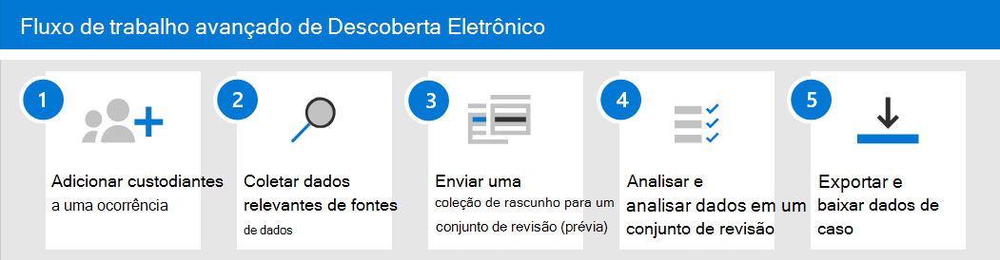

# Introdução à Descoberta Eletrônica AvançadaGet started with Advanced eDiscovery

A descoberta eletrônica avançada no Microsoft 365 fornece um fluxo de trabalho de ponta a ponta para preservar, coletar, analisar, analisar e exportar dados que respondem às investigações internas e externas da sua organização.Advanced eDiscovery in Microsoft 365 provides an end-to-end workflow to preserve, collect, review, analyze, and export data that's responsive to your organization's internal and external investigations. Nada é necessário para implantar a descoberta eletrônica avançada, mas há algumas tarefas de pré-requisito que um administrador de ti e um gerente de descoberta eletrônica precisam concluir para que sua organização possa começar a criar e usar casos de descoberta eletrônica avançados para gerenciar suas investigações.Nothing is needed to deploy Advanced eDiscovery, but there are some prerequisite tasks that an IT admin and eDiscovery manager have to complete before your organization can start to create and use Advanced eDiscovery cases to manage your investigations.

Este artigo discute as etapas necessárias para configurar a descoberta eletrônica avançada.This article discusses the steps necessary to set up Advanced eDiscovery. Isso inclui garantir que o licenciamento apropriado seja necessário para acessar a descoberta eletrônica avançada e adicionar os responsáveis às ocorrências, bem como atribuir permissões à equipe jurídica e de investigação para que eles possam acessar e gerenciar casos.This includes ensuring the proper licensing required to access Advanced eDiscovery and add custodians to cases, as well as assigning permissions to your legal and investigation team so they can access and manage cases. Este artigo também fornece uma visão geral de alto nível do uso de casos para gerenciar o fluxo de trabalho de descoberta eletrônica avançada de uma investigação legal.This article also provides a high-level overview of using cases to manage the Advanced eDiscovery workflow for a legal investigation.

## Etapa 1: verificar e atribuir licenças apropriadasStep 1: Verify and assign appropriate licenses

O licenciamento para descoberta eletrônica avançada requer a assinatura apropriada da organização e o licenciamento por usuário.Licensing for Advanced eDiscovery requires the appropriate organization subscription and per-user licensing.

- **Assinatura da organização:** Para acessar a descoberta eletrônica avançada no centro de conformidade da Microsoft 365 ou no centro de conformidade & segurança, sua organização deve ter um dos seguintes:**Organization subscription:** To access Advanced eDiscovery in the Microsoft 365 compliance center or the Security & Compliance Center, your organization must have one of the following:

  - Assinatura do Microsoft 365 E5 ou do Office 365 E5Microsoft 365 E5 or Office 365 E5 subscription
  
  - Assinatura do Microsoft 365 E3 com complemento de Conformidade E5Microsoft 365 E3 subscription with E5 Compliance add-on

  - Assinatura do Microsoft 365 E3 com o complemento de descoberta eletrônica e de auditoria e5Microsoft 365 E3 subscription with E5 eDiscovery and Audit add-on

  Se você não tiver um plano do Microsoft 365 E5 existente e quiser experimentar a descoberta eletrônica avançada, [adicione o microsoft 365](https://docs.microsoft.com/office365/admin/try-or-buy-microsoft-365) à sua assinatura existente ou [Inscreva-se para obter uma avaliação](https://www.microsoft.com/microsoft-365/enterprise) do Microsoft 365 e5.If you don't have an existing Microsoft 365 E5 plan and want to try Advanced eDiscovery, you can [add Microsoft 365](https://docs.microsoft.com/office365/admin/try-or-buy-microsoft-365) to your existing subscription or [sign up for a trial](https://www.microsoft.com/microsoft-365/enterprise) of Microsoft 365 E5.

- **Licenciamento por usuário:** Para adicionar um usuário como um responsáveis em um caso de descoberta eletrônica avançada, esse usuário deve receber uma das seguintes licenças, dependendo da sua assinatura de organização:**Per-user licensing:** To add a user as a custodian in an Advance eDiscovery case, that user must be assigned one of the following licenses, depending on your organization subscription:

  - Microsoft 365: os usuários devem receber uma licença do Microsoft 365 e5, uma licença de complemento de conformidade E5 ou uma licença de suplemento de auditoria e descoberta eletrônica e5.Microsoft 365: Users must be assigned a Microsoft 365 E5 license, an E5 Compliance add-on license, or an E5 eDiscovery and Audit add-on license.

  - Office 365: é necessário atribuir uma licença do Office 365 E5 aos usuários.Office 365: Users must be assigned an Office 365 E5 license.

   Para obter informações sobre como atribuir licenças, consulte [assign licenses to Users](https://docs.microsoft.com/microsoft-365/admin/manage/assign-licenses-to-users).For information about how to assign licenses, see [Assign licenses to users](https://docs.microsoft.com/microsoft-365/admin/manage/assign-licenses-to-users).

> [!NOTE]
> Os usuários só precisam de uma licença E5 (ou da licença de complemento adequada) para serem adicionados como responsáveis a uma ocorrência de descoberta eletrônica avançada.Users only need an E5 license (or the appropriate add-on license) to be added as custodians to an Advanced eDiscovery case. Administradores de ti, gerentes de descoberta eletrônica, advogados, paralegais ou investigadores que usam a descoberta eletrônica avançada para gerenciar casos e revisar os dados de casos não precisam de uma licença E5 ou complementar.IT admins, eDiscovery managers, lawyers, paralegals, or investigators who use Advanced eDiscovery to manage cases and review case data don't need an E5 or add-on license.

## Etapa 2: atribuir permissões de descoberta eletrônicaStep 2: Assign eDiscovery permissions

Para acessar a descoberta eletrônica avançada ou adicionada como um membro de um caso de descoberta eletrônica avançada, um usuário deve ter as permissões apropriadas atribuídas.To access Advanced eDiscovery or added as a member of an Advanced eDiscovery case, a user must be assigned the appropriate permissions. Especificamente, um usuário deve ser adicionado como um membro do grupo de função Gerenciador de descoberta eletrônica no centro de conformidade do & de segurança.Specifically, a user must be added as a member of the eDiscovery Manager role group in the Security & Compliance Center. Os membros desse grupo de função podem criar e gerenciar casos de descoberta eletrônica avançados.Members of this role group can create and manage Advanced eDiscovery cases. Eles podem adicionar e remover membros, colocar os responsáveis e os locais de conteúdo em espera, gerenciar notificações de retenção legal, criar e editar pesquisas associadas em um caso, adicionar resultados de pesquisa a um conjunto de revisão, analisar dados em um conjunto de revisão e exportar e baixar de uma ocorrência de descoberta eletrônica avançada.They can add and remove members, place custodians and content locations on hold, manage legal hold notifications, create and edit searches associated in a case, add search results to a review set, analyze data in a review set, and export and download from an Advanced eDiscovery case.

Conclua as seguintes etapas para adicionar usuários ao grupo de funções Gerenciador de descoberta eletrônica:Complete the following steps to add users to the eDiscovery Manager role group:

1. Acesse [https://protection.office.com/permissions](https://protection.office.com/permissions) e entre usando as credenciais de uma conta de administrador na sua organização do Microsoft 365.Go to [https://protection.office.com/permissions](https://protection.office.com/permissions) and sign in using the credentials for an admin account in your Microsoft 365 organization.

2. Na página **permissões** , selecione o grupo de funções **Gerenciador de descoberta eletrônica** .On the **Permissions** page, select the **eDiscovery Manager** role group.

3. Na página do submenu Gerenciador de descoberta eletrônica, clique em **Editar** ao lado da seção **Gerenciador de descoberta eletrônica** .On the eDiscovery Manager flyout page, click **Edit** next to the **eDiscovery Manager** section.

4. Na página **escolher Gerenciador de descoberta eletrônica** no assistente editar grupo de funções, clique em **escolher Gerenciador de descoberta**.On the **Choose eDiscovery Manager** page in the edit role group wizard, click **Choose Discovery Manager**.

5. Clique em **Adicionar** e marque a caixa de seleção de todos os usuários que você deseja adicionar ao grupo de funções.Click **Add** then select the checkbox for all users you want to add to the role group.

6. Clique em **Adicionar** para adicionar os usuários selecionados e clique em **concluído**.Click **Add** to add the selected users, and then click **Done**.

7. Clique em **salvar** para adicionar os usuários ao grupo de função e, em seguida, clique em **fechar** para concluir a etapa.Click **Save** to add the users to the role group, and then click **Close** to complete the step.

### Mais informações sobre o grupo de funções do Gerenciador de descoberta eletrônicaMore information about the eDiscovery Manager role group

Há dois subgrupos no grupo de função Gerenciador de descoberta eletrônica.There are two subgroups in the eDiscovery Manager role group. A diferença entre esses subgrupos está no escopo.The difference between these subgroups is based on scope.

- **Gerenciador de descoberta eletrônica:** Pode exibir e gerenciar as ocorrências de descoberta eletrônica avançada que criam ou são membros de.**eDiscovery Manager:** Can view and manage the Advanced eDiscovery cases they create or are a member of. Se outro gerenciador de descoberta eletrônica criar uma ocorrência, mas não adicionar um segundo Gerenciador de descoberta eletrônica como membro desse caso, o segundo Gerenciador de descoberta eletrônica não poderá exibir ou abrir o caso na página descoberta eletrônica avançada no centro de conformidade.If another eDiscovery Manager creates a case but doesn't add a second eDiscovery Manager as a member of that case, the second eDiscovery Manager won't be able to view or open the case on the Advanced eDiscovery page in the compliance center. Em geral, a maioria das pessoas em sua organização pode ser adicionada ao subgrupo Gerenciador de descoberta eletrônica.In general, most people in your organization can be added to the eDiscovery Manager subgroup.

- **administrador de descoberta eletrônica:** Pode executar todas as tarefas de gerenciamento de caso que um gerente de descoberta eletrônica possa fazer.**eDiscovery Administrator:** Can perform all case management tasks that an eDiscovery Manager can do. Além disso, um Administrador de Descoberta Eletrônica pode:Additionally, an eDiscovery Administrator can:

  - Exibir todas as ocorrências listadas na página descoberta eletrônica avançada.View all cases that are listed on the Advanced eDiscovery page.
  
  - Gerencie qualquer caso na organização depois que eles se adicionarem como um membro do caso.Manage any case in the organization after they add themselves as a member of the case.

  - Acessar e exportar dados de caso para qualquer caso na organização.Access and export case data for any case in the organization.

  Por causa do amplo escopo de acesso, uma organização deve ter apenas alguns administradores que são membros do subgrupo administradores de descoberta eletrônica.Because of the broad scope of access, an organization should have only a few admins who are members of the eDiscovery Administrators subgroup.

Para obter mais informações sobre permissões de descoberta eletrônica e uma descrição de cada função atribuída ao grupo de funções Gerenciador de descoberta eletrônica, consulte [atribuir permissões de descoberta eletrônica](assign-ediscovery-permissions.md).For more information about eDiscovery permissions and a description of each role that's assigned to the eDiscovery Manager role group, see [Assign eDiscovery permissions](assign-ediscovery-permissions.md).

## Etapa 3: definir as configurações globais para descoberta eletrônica avançadaStep 3: Configure global settings for Advanced eDiscovery

A última etapa a ser concluída antes que as pessoas da sua organização comecem a criar e usar casos é definir as configurações globais que se aplicam a todos os casos em sua organização.The last step to complete before people in your organization start to create and use cases is to configure global settings that apply to all cases in your organization. Neste momento, a única configuração global é a *detecção de privilégio de cliente advogado* (mais configurações globais estarão disponíveis no futuro).At this time, the only global setting is *attorney-client privilege detection* (more global settings will be available in the future). Essa configuração permite que o modelo de privilégio de cliente advogado seja executado quando você analisar dados em um conjunto de revisão.This setting enables the attorney-client privilege model to run when you analyze data in a review set. O modelo usa o Machine Learning para determinar a probabilidade de que um documento contenha conteúdo legal de natureza.The model uses machine learning to determine the likelihood that a document contains content that is legal in nature. Também compara os participantes de documentos com uma lista de advogados (que você envia ao configurar o modelo) para determinar se um documento tem pelo menos um participante que seja um advogado.It also compares the participants of documents with an attorney list (that you submit when setting up the model) to determine if a document has at least one participant who is an attorney.

Para obter mais informações sobre como configurar e usar o modelo de detecção de privilégio de cliente advogado, consulte [Configurar detecção de privilégio de cliente do advogado na descoberta eletrônica avançada](attorney-privilege-detection.md).For more information about setting up and using the attorney-client privilege detection model, see [Set up attorney-client privilege detection in Advanced eDiscovery](attorney-privilege-detection.md).

> [!NOTE]
> Esta é uma etapa opcional que você pode executar a qualquer momento.This is an optional step that you can perform anytime. Não implementar o modelo de detecção de privilégio de cliente advogado não impede que você crie e use casos de descoberta eletrônica avançados.Not implementing the attorney-client privilege detection model doesn't prevent you from creating and using Advanced eDiscovery cases.

## Etapa 4: criar uma ocorrência de descoberta eletrônica avançadaStep 4: Create an Advanced eDiscovery case

A próxima etapa é criar um caso e começar a usar a descoberta eletrônica avançada.The next step is to create a case and start using Advanced eDiscovery. Conclua as etapas a seguir para criar um caso e adicionar membros.Complete the following steps to create a case and add members. O usuário que cria o caso é automaticamente adicionado como um membro.The user who creates the case is automatically added as a member.

1. Acesse [https://compliance.microsoft.com](https://compliance.microsoft.com) e entre usando as credenciais da conta de usuário que receberam as permissões de descoberta eletrônica apropriadas.Go to [https://compliance.microsoft.com](https://compliance.microsoft.com) and sign in using the credentials for user account that has been assigned the appropriate eDiscovery permissions. Os membros do grupo de função gerenciamento da organização também podem criar casos de descoberta eletrônica avançados.Members of the Organization Management role group can also create Advanced eDiscovery cases.

2. No painel de navegação esquerdo do centro de conformidade da Microsoft 365, clique em **Mostrar tudo**e, em seguida, clique em **descoberta eletrônica > avançado**.In the left navigation pane of the Microsoft 365 compliance center, click **Show all**, and then click **eDiscovery > Advanced**.

3. Na página **descoberta eletrônica avançada** , clique na guia **ocorrências** e, em seguida, clique em **criar uma ocorrência**.On the **Advanced eDiscovery** page, click the **Cases** tab, and then click **Create a case**.

4. Na página novo submenu de **ocorrência de descoberta eletrônica** , dê um nome (obrigatório) e digite um número de caso e descrição opcionais.On the **New eDiscovery case** flyout page, give the case a name (required), and then type an optional case number and description. O nome da ocorrência deve ser exclusivo em sua organização.The case name must be unique in your organization.

5. Clique em **salvar** para criar o caso.Click **Save** to create the case.

   O novo caso é criado e a guia **configurações** no novo caso é exibida.The new case is created and the **Settings** tab in the new case is displayed. 

6. No bloco **acesso & permissões** na guia **configurações** , clique em **selecionar**e, em seguida, clique em **Atualizar**.In the **Access & permissions** tile on the **Settings** tab, click **Select**, and then click **Update**.

7. Clique em **Atualizar**.Click **Update**.

8. Na página **gerenciar esse** submenu de caso, em **gerenciar Membros**, clique em **Adicionar** para adicionar membros ao caso.On the **Manage this case** flyout page, under **Manage members**, click **Add** to add members to the case.

9. Na lista de pessoas, marque a caixa de seleção ao lado dos nomes das pessoas que você deseja adicionar ao caso.In the list of people, select the check box next to the names of the people that you want to add to the case. Conforme explicado anteriormente, certifique-se de que as pessoas adicionadas ao caso tenham sido atribuídas às permissões de descoberta eletrônica apropriadas.As previously explained, be sure that the people you add to the case have been assigned the appropriate eDiscovery permissions.

10. Depois de selecionar as pessoas a serem adicionadas como membros do caso, clique em **Adicionar**.After you've selected the people to add as members of the case, click **Add**.

11. Na página **gerenciar esse** submenu de caso, clique em **salvar** para salvar a nova lista de membros de caso.In the **Manage this case** flyout page, click **Save** to save the new list of case members.

12. Clique na guia **página inicial** para ir para a Home Page da caixa.Click the **Home** tab to go to the case home page.

## Explorar o fluxo de trabalho de descoberta eletrônica avançadaExplore the Advanced eDiscovery workflow

Para começar a usar a descoberta eletrônica avançada, aqui está um fluxo de trabalho simples que se alinha às [práticas comuns de descoberta eletrônica](overview-ediscovery-20.md#alignment-with-edrm).To get you started using Advanced eDiscovery, here's a simple workflow that aligns with [common eDiscovery practices](overview-ediscovery-20.md#alignment-with-edrm). Em cada uma dessas etapas, também realçaremos algumas funcionalidades avançadas de descoberta eletrônica que você pode explorar.In each of these steps, we'll also highlight some extended Advanced eDiscovery functionality that you can explore.

1. **[Adicionar os responsáveis a um caso](add-custodians-to-case.md)**.**[Add custodians to a case](add-custodians-to-case.md)**. A primeira etapa depois da criação de um caso é adicionar os responsáveis.The first step after creating a case is to add custodians. Um *funcionário* é uma pessoa com controle administrativo de um documento ou arquivo eletrônico que pode ser relevante para o caso.A *custodian* is a person having administrative control of a document or electronic file that may be relevant to the case. Veja a seguir algumas coisas que acontecem (ou que você pode fazer) ao adicionar os responsáveis a um caso:Here are some things that happen (or that you can do) when you add custodians to a case:

   - Os dados da caixa de correio do Exchange do responsáveis, da conta do OneDrive e de qualquer grupo do Microsoft Teams ou do Yammer para os quais o responsáveis é membro podem ser "marcados" como dados do custodial no caso.Data in the custodian's Exchange mailbox, OneDrive account, and any Microsoft Teams or Yammer groups that the custodian is a member of can be "marked" as custodial data in the case.
  
   - Os dados dos responsáveis são reindexados (por um processo chamado *indexação avançada*).Custodian data is reindexed (by a process called *Advanced indexing*). Isso ajuda a otimizar a pesquisa para ele na próxima etapa.This helps optimize searching for it in the next step.
  
   - Você pode colocar um bloqueio nos dados dos responsáveis.You can place a hold on custodian data. Isso preserva os dados que podem ser relevantes para o caso durante a investigação.This preserves data that may be relevant to the case during the investigation.
  
   - Você pode associar outras fontes de dados a um funcionário (por exemplo, você pode associar um site do SharePoint ou um grupo do Microsoft 365 a um funcionário) para que esses dados possam ser reindexados, colocados em retenção e pesquisados, como os dados na caixa de correio ou na conta do OneDrive do responsáveis.You can associate other data sources with a custodian (for example, you can associate a SharePoint site or Microsoft 365 Group with a custodian) so this data can be reindexed, placed on hold, and searched, just like the data in the custodian's mailbox or OneDrive account.

   - Você pode usar o [fluxo de trabalho de comunicações](managing-custodian-communications.md) em descoberta eletrônica avançada para enviar uma notificação de retenção legal para os responsáveis.You can use the [communications workflow](managing-custodian-communications.md) in Advanced eDiscovery to send a legal hold notification to custodians.

2. **[Pesquisar fontes de dados do custodial para dados relevantes para o caso](collecting-data-for-ediscovery.md)**.**[Search custodial data sources for data relevant to the case](collecting-data-for-ediscovery.md)**. Após adicionar os responsáveis a um caso, use a ferramenta de pesquisa interna para pesquisar os locais de dados dos responsáveis por dados que podem ser relevantes para o caso.After you add custodians to a case, use the built-in search tool to search the custodian data locations for data that may be relevant to the case. Você usa palavras-chave, propriedades e condições para [criar consultas de pesquisa](building-search-queries.md) que retornem resultados de pesquisa com os dados que mais provavelmente são relevantes para o caso.You use keywords, properties, and conditions to [build search queries](building-search-queries.md) that return search results with the data that's most likely relevant to the case. Você também pode:You can also:

   - Exibir [Estatísticas de pesquisa](search-statistics.md) que podem ajudá-lo a refinar uma consulta de pesquisa para restringir os resultados.View [search statistics](search-statistics.md) that may help you refine a search query to narrow the results.

   - Visualize os resultados da pesquisa para verificar rapidamente se os dados relevantes estão sendo encontrados.Preview the search results to quickly verify whether the relevant data is being found.

   - Revise uma consulta e execute a pesquisa novamente.Revise a query and rerun the search.

3. **[Adicione dados a um conjunto de revisão](add-data-to-review-set.md)**.**[Add data to a review set](add-data-to-review-set.md)**. Depois de configurar e verificar se uma pesquisa retorna os dados desejados, a próxima etapa é adicionar os resultados da pesquisa a um conjunto de revisão.Once you've configured and verified that a search returns the desired data, the next step is to add the search results to a review set. Quando você adiciona dados a um conjunto de revisão, os itens são copiados do seu local original para um local seguro de armazenamento do Azure.When you add data to a review set, items are copied from their original location to a secure Azure Storage location. Os dados são reindexados novamente para otimizá-los para pesquisas completas e rápidas durante a revisão e análise de itens no conjunto de revisão.The data is reindexed again to optimize it for thorough and fast searches when reviewing and analyzing items in the review set. Além disso, você também pode [Adicionar dados que não sejam do Office 365 em um conjunto de revisão](load-non-office-365-data-into-a-review-set.md).Additionally, you can also [add non-Office 365 data into a review set](load-non-office-365-data-into-a-review-set.md).

   Há também um tipo especial de análise configurada para a qual você pode adicionar dados, chamado de *análise de conversa*.There's also a special kind of review set that you can add data to, called a *conversation review set*. Esses tipos de conjuntos de análise fornecem recursos de reconstrução de conversa para reconstruir, revisar e exportar conversas encadeadas como as do Microsoft Teams.These types of reviews sets provide conversation reconstruction capabilities to reconstruct, review, and export threaded conversations like those in Microsoft Teams. Para obter mais informações, consulte [revisar conversas na descoberta eletrônica avançada](conversation-review-sets.md).For more information, see [Review conversations in Advanced eDiscovery](conversation-review-sets.md).

4. **Revise e analise os dados em um conjunto de revisão**.**Review and analyze data in a review set**. Agora que os dados estão em um conjunto de revisão, você pode usar uma ampla variedade de ferramentas e recursos para exibir e analisar os dados de caso com o objetivo de reduzir o conjunto de dados para o que é mais relevante para o caso que está investigando.Now that data is in a review set, you can use a wide-variety of tools and capabilities to view and analyze the case data with the goal of reducing the data set to what is most relevant to the case you're investigation. Veja a seguir uma lista de algumas ferramentas e recursos que você pode usar durante esse processo.Here's a list of some tools and capabilities that you can use during this process.

   - [Exibir documentos](view-documents-in-review-set.md).[View documents](view-documents-in-review-set.md). Isso inclui exibir os metadados para cada documento em um conjunto de revisão e exibir o documento em sua versão nativa ou versão de texto.This includes viewing the metadata for each document in a review set, and viewing the document in its native version or text version.

   - [Criar consultas e filtros](review-set-search.md).[Create queries and filters](review-set-search.md). Você cria consultas de pesquisa usando uma variedade de critérios de pesquisa (incluindo a capacidade de Pesquisar todas as [Propriedades de metadados do arquivo](document-metadata-fields-in-advanced-ediscovery.md)) para refinar e analisar os dados do caso para o que é mais relevante para o caso.You create search queries using a variety of search criteria (including the ability to search all [file metadata properties](document-metadata-fields-in-advanced-ediscovery.md)) to further refine and cull the case data to what is most relevant to the case. Você também pode usar o configure Set Filters para aplicar rapidamente condições adicionais aos resultados de uma consulta de pesquisa para refinar ainda mais esses resultados.You can also use review set filters to quickly apply additional conditions to the results of a search query to further refine those results. 

   - [Criar e usar marcas](tagging-documents.md).[Create and use tags](tagging-documents.md). Você pode aplicar marcas a documentos em um conjunto de revisão para identificar quais estão respondendo (ou não respondendo ao caso) e, em seguida, use essas marcas ao criar consultas de pesquisa para incluir ou excluir os documentos marcados.You can apply tags to documents in a review set to identify which are responsive (or non-responsive to the case) and then use those tags when creating search queries to include or exclude the tagged documents. Você também pode marcar para determinar quais documentos serão exportados.You can also tagging to determine which documents to export.

   - [Anotar e redigir documentos](view-documents-in-review-set.md#annotate-view).[Annotate and redact documents](view-documents-in-review-set.md#annotate-view). Você pode usar a ferramenta de anotação em uma revisão para anotar documentos e redigir conteúdo em documentos como produto de trabalho.You can use the annotation tool in a review to annotate documents and redact content in documents as work product. Geramos uma versão em PDF de um documento anotado ou redigido durante a revisão para reduzir o risco de exportação da versão nativa não redigida do documento.We generate a PDF version of an annotated or redacted document during review to reduce the risk of exporting the unredacted native version of the document.

   - [Analisar dados de caso](analyzing-data-in-review-set.md).[Analyze case data](analyzing-data-in-review-set.md). A funcionalidade de análise na descoberta eletrônica avançada é poderosa.The analytics functionality in Advanced eDiscovery is powerful. Depois de executar a análise nos dados no conjunto de revisão, realizamos análises como a detecção de duplicidades, encadeamento de email e temas que podem ajudar a reduzir o volume de documentos que você precisa examinar.After you run analytics on the data in review set, we perform analysis such as near duplicate detection, email threading, and themes that can help reduce the volume of documents that you have to review. Também geramos relatórios de análise que resumem o resultado da execução da análise.We also generate an Analytics reports that summarize the result of running analytics. Como explicado anteriormente, a execução de análise também executa [o modelo de detecção de privilégio advogado-cliente](attorney-privilege-detection.md#use-the-attorney-client-privilege-detection-model).As previously explained, running analytics also runs [the attorney-client privilege detection model](attorney-privilege-detection.md#use-the-attorney-client-privilege-detection-model).

5. **Exportar e baixar dados de caso**.**Export and download case data**. Uma etapa final após coletar, revisar e analisar os dados do caso é exportá-lo para a descoberta eletrônica avançada para análise externa ou para análise por pessoas de fora da equipe de investigação.A final step after collecting, reviewing, and analyzing case data is to export it out of Advanced eDiscovery for external review or for review by people outside of the investigation team. A exportação de dados é um processo de duas etapas.Exporting data is a two-step process. A primeira etapa é [Exportar](export-documents-from-review-set.md) dados do conjunto de revisão e copiá-los para um local de armazenamento do Azure diferente (um fornecido pela Microsoft ou um gerenciado por sua organização).The first step is to [export](export-documents-from-review-set.md) data out of the review set and copy it to a different Azure Storage location (one provided by Microsoft or one managed by your organization). Em seguida, use o Azure Storage Explorer para [baixar](download-export-jobs.md) os dados para um computador local.Then you use Azure Storage Explorer to [download](download-export-jobs.md) the data to a local computer. Além dos arquivos de dados exportados, o contém o pacote de exportação também contém um relatório de exportação, um relatório de resumo e um relatório de erros.In addition to the exported data files, the contains of the export package also contains an export report, a summary report, and an error report.
