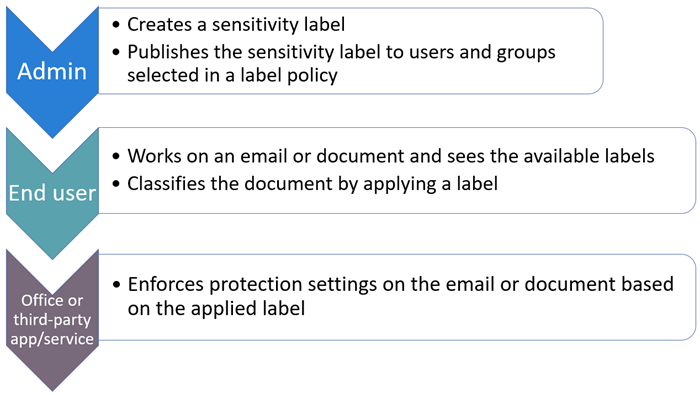

# Introdução ao rótulos de confidencialidadeGet started with sensitivity labels

>*[Diretrizes de licenciamento do Microsoft 365 para segurança e conformidade](https://aka.ms/ComplianceSD).**[Microsoft 365 licensing guidance for security & compliance](https://aka.ms/ComplianceSD).*

Para saber mais sobre quais são os rótulos de confidencialidade e como eles podem ajudá-lo a proteger os dados da sua organização, confira [Saiba mais sobre rótulos de confidencialidade](sensitivity-labels.md).For information about what sensitivity labels are and how they can help you protect your organization's data, see [Learn about sensitivity labels](sensitivity-labels.md).

Se você tiver a [Proteção de Informações do Azure](https://docs.microsoft.com/azure/information-protection/what-is-information-protection), determine se é preciso migrar os rótulos para a plataforma de rotulagem unificada e qual cliente de rotulagem usar:If you have [Azure Information Protection](https://docs.microsoft.com/azure/information-protection/what-is-information-protection), determine whether you need to migrate labels to the unified labeling platform, and which labeling client to use:
- [Como posso determinar se meu locatário está na plataforma de rotulagem unificada?How can I determine if my tenant is on the unified labeling platform?](https://docs.microsoft.com/azure/information-protection/faqs#how-can-i-determine-if-my-tenant-is-on-the-unified-labeling-platform)
- [Escolha qual cliente de rotulagem usar em computadores com WindowsChoose which labeling client to use for Windows computers](https://docs.microsoft.com/azure/information-protection/rms-client/use-client#choose-which-labeling-client-to-use-for-windows-computers)

Quando estiver pronto para começar a proteger os dados da sua organização usando os rótulos de confidencialidade:When you're ready to start protecting your organization's data by using sensitivity labels:

1. **Crie os rótulos.****Create the labels.** Crie e nomeie seus rótulos de confidencialidade de acordo com a taxonomia de classificação da sua organização para diferentes níveis de confidencialidade de conteúdo.Create and name your sensitivity labels according to your organization's classification taxonomy for different sensitivity levels of content. Use os nomes ou termos comuns que fazem sentido para os seus usuários.Use common names or terms that make sense to your users. Se você ainda não tiver uma taxonomia estabelecida, considere começar com nomes de rótulos como Pessoal, Público, Geral, Confidencial e Altamente Confidencial.If you don't already have an established taxonomy, consider starting with label names such as Personal, Public, General, Confidential, and Highly Confidential. Em seguida, você pode usar sub-rótulos para agrupar rótulos similares por categoria.You can then use sublabels to group similar labels by category. Ao criar um rótulo, use o texto de dica de ferramenta para ajudar os usuários a selecionar o rótulo apropriado.When you create a label, use the  tooltip text to help users select the appropriate label.
    
    Para obter orientações mais abrangentes sobre a definição de uma taxonomia de classificação, faça o download do artigo técnico "Classificação de Dados e Taxonomia de Rótulos de Confidencialidade", no [Portal de Confiança do Serviço](https://aka.ms/DataClassificationWhitepaper).For more extensive guidance for defining a classification taxonomy, download the white paper, "Data Classification & Sensitivity Label Taxonomy" from the [Service Trust Portal](https://aka.ms/DataClassificationWhitepaper).

2. **Defina o que cada rótulo pode fazer.****Define what each label can do.** Defina as configurações de proteção desejadas associadas a cada rótulo.Configure the protection settings you want associated with each label. Por exemplo, convém que o conteúdo de menor sensibilidade (como um rótulo "Geral") aplique apenas um cabeçalho ou rodapé, enquanto o conteúdo de maior sensibilidade (como um rótulo "Confidencial") deve ter marca d'água e criptografia.For example, you might want lower sensitivity content (such as a "General" label) to have just a header or footer applied, while higher sensitivity content (such as a "Confidential" label) should have a watermark and encryption.

3. **Publique os rótulos.****Publish the labels.** Quando os rótulos de confidencialidade estiverem configurados, publique-os usando uma política de rótulo.After your sensitivity labels are configured, publish them by using a label policy. Decida quais usuários e grupos devem ter os rótulos e quais configurações de política utilizar.Decide which users and groups should have the labels and what policy settings to use. Um único rótulo pode ser reutilizado. Você o define uma vez e pode incluí-lo em várias políticas de rótulos atribuídas a diferentes usuários.A single label is reusable—you define it once, and then you can include it in several label policies assigned to different users. Por exemplo, você pode fazer o piloto dos rótulos de confidencialidade atribuindo uma política de rótulo a apenas alguns usuários.So for example, you could pilot your sensitivity labels by assigning a label policy to just a few users. Em seguida, quando você estiver pronto para implantar os rótulos em toda a organização, poderá criar uma nova política de rótulos para seus rótulos e, desta vez, especificar todos os usuários.Then when you're ready to roll out the labels across your organization, you can create a new label policy for your labels and this time, specify all users.

O fluxo básico para a implantação e a aplicação de rótulos de sensibilidade:The basic flow for deploying and applying sensitivity labels:

## Requisitos de assinatura e licenciamento dos rótulos de sensibilidadeSubscription and licensing requirements for sensitivity labels

Várias assinaturas diferentes oferecem suporte aos rótulos de sensibilidade e aos requisitos de licenciamento dos usuários que dependem dos recursos que você usa.A number of different subscriptions support sensitivity labels and the licensing requirements for users depend on the features you use.

Para visualizar as opções de licenciamento dos seus usuários para se beneficiar dos recursos de conformidade do Microsoft 365 a partir do dia 01º de abril de 2020, consulte as [Diretrizes de licenciamento do Microsoft 365 para segurança e conformidade](https://aka.ms/ComplianceSD).To see the options for licensing your users to benefit from Microsoft 365 compliance features as of April 1, 2020, see the [Microsoft 365 licensing guidance for security & compliance](https://aka.ms/ComplianceSD). Para rótulos de confidencialidade, confira a seção [Proteção de informações](https://docs.microsoft.com/office365/servicedescriptions/microsoft-365-service-descriptions/microsoft-365-tenantlevel-services-licensing-guidance/microsoft-365-security-compliance-licensing-guidance#information-protection) e o download relacionado em PDF ou Excel.For sensitivity labels, see the [Information Protection](https://docs.microsoft.com/office365/servicedescriptions/microsoft-365-service-descriptions/microsoft-365-tenantlevel-services-licensing-guidance/microsoft-365-security-compliance-licensing-guidance#information-protection) section and related PDF or Excel download.

## Permissões necessárias para criar e gerenciar rótulos dec confidencialidadePermissions required to create and manage sensitivity labels

Os membros da sua equipe de conformidade que forem criar rótulos de confidencialidade precisam de permissões no Centro de conformidade do Microsoft 365, Centro de segurança do Microsoft 365 ou Centro de Conformidade e Segurança.Members of your compliance team who will create sensitivity labels need permissions to the Microsoft 365 compliance center, Microsoft 365 security center, or the Security & Compliance Center. 

Por padrão, os administradores globais de locatários têm acesso a esses centros de administração e podem conceder acesso a agentes de conformidade e a outras pessoas, sem fornecer a eles todas as permissões de um administrador de locatários. Para esse acesso delegado de administrador limitado, adicione usuários ao grupo de funções **Administrador de Dados de Conformidade**, **Administrador de Conformidade** ou **Administrador de Segurança**.By default, global administrators for your tenant have access to these admin centers and can give compliance officers and other people access, without giving them all of the permissions of a tenant admin. For this delegated limited admin access, add users to the **Compliance Data Administrator**, **Compliance Administrator**, or **Security Administrator** role group. 

Como alternativa às funções padrão, você pode criar um novo grupo de funções e adicionar as funções **Administrador de Rótulo de Confidencialidade** ou **Configuração da Organização** a esse grupo.Alternatively to using the default roles, you can create a new role group and add either **Sensitivity Label Administrator** or **Organization Configuration** roles to this group. Para uma função somente leitura, use **Leitor de rótulos de sensibilidade**.For a read-only role, use **Sensitivity Label Reader**. 

Para obter instruções sobre como adicionar usuários às funções padrão ou criar seus próprios grupos de funções, confira [Conceder aos usuários acesso ao Centro de Segurança e Conformidade do Office 365](https://docs.microsoft.com/microsoft-365/security/office-365-security/grant-access-to-the-security-and-compliance-center).For instructions to add users to the default roles or create your own role groups, see [Give users access to the Office 365 Security & Compliance Center](https://docs.microsoft.com/microsoft-365/security/office-365-security/grant-access-to-the-security-and-compliance-center).

Essas permissões são necessárias somente para criar e configurar os rótulos de confidencialidade e suas políticas de rótulos.These permissions are required only to create and configure sensitivity labels and their label policies. Eles não são necessários para aplicar os rótulos em aplicativos ou serviços.They are not required to apply the labels in apps or services. Se forem necessárias permissões adicionais para as configurações específicas relacionadas aos rótulos de sensibilidade, essas permissões serão listadas nas suas respectivas instruções de documentação.If additional permissions are needed for specific configurations that relate to sensitivity labels, those permissions will be listed in their respective documentation instructions.

## Estratégia de implementação para rótulos de sensibilidadeDeployment strategy for sensitivity labels

Uma estratégia bem-sucedida para implantar rótulos de sensibilidade para uma organização é criar uma equipe de trabalho virtual que identifique e gerencie os requisitos técnicos e de negócios, os testes de verificação, os pontos de verificação internos e as aprovações, além da implantação final para o ambiente de produção.A successful strategy to deploy sensitivity labels for an organization is to create a working virtual team that identifies and manages the business and technical requirements, proof of concept testing, internal checkpoints and approvals, and final deployment for the production environment.

Usando a tabela na próxima seção, recomendamos identificar um ou dois cenários mais importantes que mostram as suas exigências de negócios mais impactantes.Using the table in the next section, we recommend identifying your top one or two scenarios that map to your most impactful business requirements. Após a implantação desses cenários, volte para a lista para identificar as próximas prioridades para implantação.After these scenarios are deployed, return to the list to identify the next one or two priorities for deployment.

Você pode encontrar mais diretrizes de implantação geral na guia de aceleração de implantação e proteção de informações da Microsoft 365 disponível para download.You'll find additional general deployment guidance in the downloadable Microsoft 365 Information Protection & Compliance deployment acceleration guide. Para obter mais informações, confira a postagem do blog, [Guia de aceleração de implantação e proteção de informações da Microsoft](https://techcommunity.microsoft.com/t5/microsoft-security-and/microsoft-information-protection-and-compliance-deployment/ba-p/1403493).For more information, see the blog post, [Microsoft Information Protection and Compliance Deployment Acceleration Guide](https://techcommunity.microsoft.com/t5/microsoft-security-and/microsoft-information-protection-and-compliance-deployment/ba-p/1403493).

## Cenários comuns para rótulos de confidencialidadeCommon scenarios for sensitivity labels

Todos os cenários requerem que você [crie e configure rótulos de confidencialidade e suas políticas](create-sensitivity-labels.md).All scenarios require you to [Create and configure sensitivity labels and their policies](create-sensitivity-labels.md).

|Eu quero...I want to ...|DocumentaçãoDocumentation|
|----------------|---------------|
|Gerenciar rótulos de confidencialidade para aplicativos do Office para que o conteúdo seja rotulado conforme for criado—incluindo suporte para rotulagem manual em todas plataformasManage sensitivity labels for Office apps so that content is labeled as it's created—includes support for manual labeling on all platforms |[Usar rótulos de confidencialidade em aplicativos do OfficeUse sensitivity labels in Office apps](sensitivity-labels-office-apps.md)|
|Permitir que os usuários rotulem e protejam arquivos de computadores com Windows usando aplicativos do Office, Explorador de Arquivos e PowerShellEnable users to label and protect files from Windows computers using Office apps, File Explorer, and PowerShell|[Cliente de rotulagem unificada da Proteção de Informações do Azure para WindowsAzure Information Protection unified labeling client for Windows](https://docs.microsoft.com/azure/information-protection/rms-client/aip-clientv2)|
|Criptografar documentos e emails com rótulos de confidencialidade e restringir quem pode acessá-los e como podem usar esse conteúdoEncrypt documents and emails with sensitivity labels and restrict who can access that content and how it can be used |[Restringir o acesso ao conteúdo usando rótulos de confidencialidade para aplicar criptografiaRestrict access to content by using sensitivity labels to apply encryption](encryption-sensitivity-labels.md)|
|Habilite os rótulos de sensibilidade do Office na web, com suporte para coautoria, descoberta eletrônica, prevenção contra perda de dados — até mesmo quando os documentos são criptografadosEnable sensitivity labels for Office on the web, with support for coauthoring, eDiscovery, data loss prevention, search—even when documents are encrypted | [Habilitar rótulos de confidencialidade para arquivos do Office no SharePoint e no OneDriveEnable sensitivity labels for Office files in SharePoint and OneDrive](sensitivity-labels-sharepoint-onedrive-files.md)
|Aplicar rótulos de confidencialidade automaticamente a documentos e emailsAutomatically apply sensitivity labels to documents and emails | [Aplicar um rótulo de confidencialidade automaticamente ao conteúdoApply a sensitivity label to content automatically](apply-sensitivity-label-automatically.md)|
|Usar os rótulos de confidencialidade para proteger o conteúdo do Teams e do SharePointUse sensitivity labels to protect content in Teams and  SharePoint |[Use rótulos de sensibilidade nos Microsoft Teams, grupos do Microsoft 365 e sites do SharePoint)Use sensitivity labels with Microsoft Teams, Microsoft 365 groups, and SharePoint sites)](sensitivity-labels-teams-groups-sites.md)|
|Descobrir, rotular e proteger arquivos armazenados no repositório de dados locaisDiscover, label, and protect files stored in data stores that are on premises |[Implantação do scanner da Proteção de Informações do Azure para classificar e proteger arquivos automaticamenteDeploying the Azure Information Protection scanner to automatically classify and protect files](https://docs.microsoft.com/azure/information-protection/deploy-aip-scanner)|
|Descobrir, rotular e proteger arquivos armazenados no repositório da nuvemDiscover, label, and protect files stored in data stores that are in the cloud|[Descobrir, classificar, rotular e proteger dados regulamentados e confidenciais armazenados na nuvemDiscover, classify, label, and protect regulated and sensitive data stored in the cloud](https://docs.microsoft.com/cloud-app-security/best-practices#discover-classify-label-and-protect-regulated-and-sensitive-data-stored-in-the-cloud)|
|Aplicar e exibir rótulos de confidencialidade no Power BI e proteger dados ao exportarApply and view sensitivity labels in Power BI, and protect data when it is exported|[Proteção de dados no Power BIData protection in Power BI](https://docs.microsoft.com/power-bi/admin/service-security-data-protection-overview)|
|Monitorar e entender como os rótulos de sensibilidade estão sendo usados na minha organizaçãoMonitor and understand how sensitivity labels are being used in my organization|[Conhecer seus dados - visão geral da classificação de dadosKnow your data - data classification overview](data-classification-overview.md)    [Exibição do uso do rótulo com análises de rótuloView label usage with label analytics](label-analytics.md)|
|Estender os rótulos de confidencialidade a aplicativos e serviços de terceirosExtend sensitivity labels to third-party apps and services|[SDK de Proteção de Informações da MicrosoftMicrosoft Information Protection SDK](https://docs.microsoft.com/information-protection/develop/overview#microsoft-information-protection-sdk)|

## Documentação do usuário final para rótulos de confidencialidadeEnd-user documentation for sensitivity labels

A documentação mais eficaz do usuário final será orientação e instruções personalizadas que você fornecerá para os nomes de etiqueta e configurações que você escolher.The most effective end-user documentation will be customized guidance and instructions you provide for the label names and configurations you choose. No entanto, você pode usar os seguintes recursos para obter instruções básicas:However, you can use the following resources for basic instructions:

- [Aplicar rótulos de confidencialidade aos seus arquivos e email no OfficeApply sensitivity labels to your files and email in Office](https://support.microsoft.com/pt-BR/office/apply-sensitivity-labels-to-your-files-and-email-in-office-2f96e7cd-d5a4-403b-8bd7-4cc636bae0f9)
    - [Problemas conhecidos em rótulos de confidencialidade no OfficeKnown issues with sensitivity labels in Office](https://support.microsoft.com/pt-BR/office/known-issues-with-sensitivity-labels-in-office-b169d687-2bbd-4e21-a440-7da1b2743edc)

- [Aplicar ou recomendar rótulos de confidencialidade automaticamente aos seus arquivos e emails no OfficeAutomatically apply or recommend sensitivity labels to your files and emails in Office](https://support.office.com/article/automatically-apply-or-recommend-sensitivity-labels-to-your-files-and-emails-in-office-622e0d9c-f38c-470a-bcdb-9e90b24d71a1)
    - [Problemas conhecidos com a aplicação ou recomendação de rótulos de confidencialidade automáticaKnown issues with automatically applying or recommending sensitivity labels](https://support.office.com/article/known-issues-with-automatically-applying-or-recommending-sensitivity-labels-451698ae-311b-4d28-83aa-a839a66f6efc)

- [Guia do usuário da proteção de informações do Azure rotulagem unificadaAzure Information Protection unified labeling user guide](https://docs.microsoft.com/azure/information-protection/rms-client/clientv2-user-guide)

Se seus rótulos de sensibilidade aplicarem criptografia para documentos PDF, esses documentos podem ser abertos com o Microsoft Edge no Windows ou Mac.If your sensitivity labels apply encryption for PDF documents, these documents can be opened with Microsoft Edge on Windows or Mac. Para mais informações e leituras alternativas, confira [Quais leitores de PDF são suportados para PDFs protegidos?](https://docs.microsoft.com/azure/information-protection/rms-client/protected-pdf-readers#viewing-protected-pdfs-in-microsoft-edge-on-windows-or-mac)For more information, and alternative readers, see [Which PDF readers are supported for protected PDFs?](https://docs.microsoft.com/azure/information-protection/rms-client/protected-pdf-readers#viewing-protected-pdfs-in-microsoft-edge-on-windows-or-mac)
