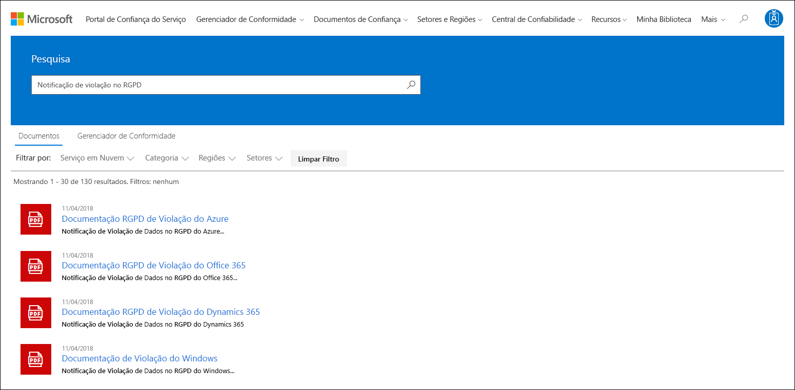
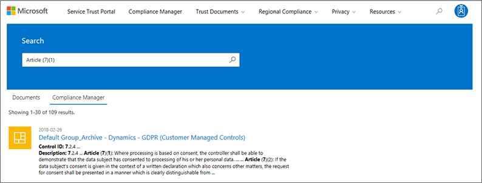

# Introdução ao portal de confiança do serviço MicrosoftGet started with the Microsoft Service Trust Portal

O portal de confiança do serviço Microsoft oferece uma variedade de conteúdo, ferramentas e outros recursos sobre as práticas de segurança, privacidade e conformidade da Microsoft.The Microsoft Service Trust Portal provides a variety of content, tools, and other resources about Microsoft security, privacy, and compliance practices.
  
## Acessar o portal de confiança do serviçoAccessing the Service Trust Portal

O portal de confiança do serviço contém detalhes sobre a implementação da Microsoft de controles e processos que protege nossos serviços em nuvem e os dados do cliente estão contidos.The Service Trust Portal contains details about Microsoft's implementation of controls and processes that protect our cloud services and the customer data therein. Para acessar alguns dos recursos no portal de confiança do serviço, você deve fazer logon como um usuário autenticado com sua conta do Microsoft Cloud Services (uma conta da organização do Azure Active Directory ou uma conta da Microsoft) e examinar e aceitar o Microsoft Contrato de não divulgação para materiais de conformidade.To access some of the resources on the Service Trust Portal, you must log in as an authenticated user with your Microsoft cloud services account (either an Azure Active Directory organization account or a Microsoft Account) and review and accept the Microsoft Non-Disclosure Agreement for Compliance Materials.
  
**Os clientes existentes podem acessar o portal de confiança do serviço** em [https://aka.ms/STP](https://aka.ms/STP) uma das seguintes assinaturas online (avaliação ou paga):**Existing customers can access the Service Trust Portal** at [https://aka.ms/STP](https://aka.ms/STP) with one of the following online subscriptions (trial or paid): 
  
- Office 365Office 365

- Dynamics 365Dynamics 365

- AzureAzure
    
 > [!NOTE]
 > As contas do Active Directory do Azure associadas a organizações têm acesso a todo o intervalo de documentos e recursos, como o Gerenciador de conformidade.Azure Active Directory accounts associated with organizations have access to the full range of documents and features like Compliance Manager. As contas da Microsoft criadas para uso pessoal têm acesso limitado ao conteúdo do portal de confiança do serviço.Microsoft accounts created for personal use have limited access to Service Trust Portal content. 
  
**Novos clientes e clientes avaliando o Microsoft Online Services****New customers and customers evaluating Microsoft online services**
  
Para criar uma nova conta ou criar uma conta de avaliação, use um dos seguintes formulários de inscrição (também usados para contas de avaliação) para obter acesso ao STP.To create a new account or to create a trial account, use one of the following sign-up forms (also used for trial accounts) to get access to the STP.
  
- Inscreva-se para obter uma nova conta de [avaliação do office 365 Business](https://go.microsoft.com/fwlink/p/?LinkID=507653) ou uma nova [conta de avaliação do Office 365 Enterprise](https://go.microsoft.com/fwlink/p/?LinkID=698279)Sign up for a new [Office 365 Business trial account](https://go.microsoft.com/fwlink/p/?LinkID=507653) or a new [Office 365 Enterprise trial account](https://go.microsoft.com/fwlink/p/?LinkID=698279)

- Inscreva-se para uma nova [conta de avaliação do Dynamics 365](https://go.microsoft.com/fwlink/?LinkId=252780)Sign up for a new [Dynamics 365 trial account](https://go.microsoft.com/fwlink/?LinkId=252780)

- Inscreva-se para uma nova [conta de avaliação do Azure](https://go.microsoft.com/fwlink/?LinkId=722737).Sign up for a new [Azure trial account](https://go.microsoft.com/fwlink/?LinkId=722737). 
    
Ao se inscrever em uma avaliação gratuita ou uma assinatura, você deve habilitar o Azure Active Directory para dar suporte ao seu acesso ao STP.When you sign up for either a free trial, or a subscription, you must enable Azure Active Directory to support your access to the STP.
  
## Usando o portal de confiança do serviçoUsing the Service Trust Portal

Os recursos e o conteúdo do portal de confiança do serviço podem ser acessados no menu principal.The Service Trust Portal features and content are accessible from the main menu.
  

As seções a seguir descrevem cada item no menu principal.The following sections describe each item in the main menu.
  
### Portal de Confiança do ServiçoService Trust Portal

O link do **portal de confiança do serviço** exibe a Home Page.The **Service Trust Portal** link displays the home page. Ele oferece uma maneira rápida de retornar à Home Page.It provides a quick way to get back to the home page.

### Gerenciador de ConformidadeCompliance Manager

O Gerenciador de conformidade é uma ferramenta de avaliação de riscos baseada em fluxo de trabalho que ajuda a rastrear, atribuir e verificar as atividades de conformidade normativa da sua organização relacionadas aos serviços de nuvem da Microsoft, como o Office 365, o Dynamics 365 e o Azure.Compliance Manager is a workflow-based risk assessment tool that helps you track, assign, and verify your organization's regulatory compliance activities related to Microsoft Cloud services, such as Office 365, Dynamics 365, and Azure. Use o Gerenciador de conformidade para gerenciar a conformidade normativa dentro do modelo de responsabilidade compartilhada da nuvem.Use Compliance Manager to manage regulatory compliance within the shared responsibility model of the cloud. Dependendo da versão do Gerenciador de conformidade que você deseja usar, consulte os seguintes artigos para obter mais informações:Depending on the version of Compliance Manager you want to use, see the following articles for more information:

- [Gerenciador de conformidade da Microsoft (Clássico)Microsoft Compliance Manager (Classic)](meet-data-protection-and-regulatory-reqs-using-microsoft-cloud.md)

- [Gerente de conformidade da Microsoft (versão prévia)Microsoft Compliance Manager (Preview)](compliance-manager-overview.md)

### Documentos de ConfiançaTrust Documents

Fornece uma infinidade de informações de implementação e design de segurança com o objetivo de facilitar o atendimento aos objetivos de conformidade normativa, compreendendo como os serviços de nuvem da Microsoft mantêm seus dados seguros.Provides a wealth of security implementation and design information with the goal of making it easier for you to meet regulatory compliance objectives by understanding how Microsoft Cloud services keep your data secure. Para revisar o conteúdo, selecione uma das seguintes opções no menu suspenso **documentos de confiança** .To review content, select one of the following options on the **Trust Documents** pull-down menu.

- **Relatórios de auditoria:** É exibida uma lista de relatórios independentes de auditoria e avaliação nos serviços em nuvem da Microsoft.**Audit Reports:** A list of independent audit and assessment reports on Microsoft's Cloud services is displayed. Estes relatórios fornecem informações sobre a conformidade dos serviços em nuvem da Microsoft com padrões de proteção de dados e requisitos normativos, como:These reports provide information about Microsoft Cloud services compliance with data protection standards and regulatory requirements, such as:
  
    - Organização internacional para a padronização (ISO)International Organization for Standardization (ISO)

    - Service Organization Controls (SOC)Service Organization Controls (SOC)

    - Instituto Nacional de padrões e tecnologia (NIST)National Institute of Standards and Technology (NIST)

    - Programa de gerenciamento de riscos e autorização federal (FedRAMP)Federal Risk and Authorization Management Program (FedRAMP)

    - Regulamento Geral de Proteção de Dados (GDPR)General Data Protection Regulation (GDPR)

- **Proteção de dados:** Contém uma variedade de recursos como controles auditados, White papers, perguntas frequentes, testes de penetração, ferramentas de avaliação de risco e guias de conformidade.**Data Protection:** Contains a wealth of resources such as audited controls, white papers, FAQs, penetration tests, risk assessment tools, and compliance guides.

- **Plantas de segurança e conformidade do Azure:** Recursos que ajudam você a criar aplicativos baseados em nuvem seguros e compatíveis.**Azure Security and Compliance Blueprints:** Resources that help you build secure and compliant cloud-based applications. Esta área contém orientações para o governo, finanças, assistência médica e mercados verticais.This area contain blueprint-guidance for government, finance, healthcare, and retail verticals.

### Países e regiõesIndustries & Regions

Fornece informações de conformidade específicas do setor e da região sobre os serviços de nuvem da Microsoft.Provides industry- and region-specific compliance information about Microsoft Cloud services.

- **Setores:** Neste momento, esta página fornece uma página de aterrissagem específica do setor para o setor de serviços financeiros.**Industries:** At this time, this page provides an industry-specific landing page the for the Financial Services industry. Isso contém informações como ofertas de conformidade, perguntas frequentes e histórias de sucesso.This contains information such as compliance offerings, FAQs, and success stories. Os recursos para mais setores serão lançados no futuro, no entanto, você pode encontrar recursos para mais setores, acessando a página **confiar em documentos de > proteção de dados** no STP.Resources for more industries will be released in the future, however you can find resources for more industries by going to the **Trust Documents > Data Protection** page in the STP.

- **Regiões:** Fornece opiniões legais sobre a conformidade dos serviços em nuvem da Microsoft com várias leis de vários países.**Regions:** Provides legal opinions on Microsoft Cloud services compliance with various the laws of various countries. Os países específicos incluem Austrália, Canadá, República Tcheca, Dinamarca, Alemanha, Polônia, Romênia, Espanha e Reino Unido.Specific countries include Australia, Canada, Czech Republic, Denmark, Germany, Poland, Romania, Spain, and the United Kingdom.
  
### Central de ConfiabilidadeTrust Center

Links para a [central de confiabilidade da Microsoft](https://www.microsoft.com/trust-center), que fornece mais informações sobre segurança, conformidade e privacidade na nuvem da Microsoft.Links to the [Microsoft Trust Center](https://www.microsoft.com/trust-center), which provides more information about security, compliance, and privacy in the Microsoft Cloud. Isso inclui informações sobre os recursos nos serviços do Microsoft Cloud que podem ser usados para atender a requisitos específicos do RGPD, documentação útil para sua responsabilidade do RGPD e para sua compreensão das medidas técnicas e organizacionais A Microsoft levou para dar suporte ao RGPD.This includes information about the capabilities in Microsoft Cloud services that you can use to address specific requirements of the GDPR, documentation helpful to your GDPR accountability and to your understanding of the technical and organizational measures Microsoft has taken to support the GDPR.
  
### Minha BibliotecaMy Library

Este novo recurso permite salvar (ou *fixar*) documentos para que você possa acessá-los rapidamente na sua página minha biblioteca.This new feature lets you save (or *pin*) documents so that you can quickly access them on your My Library page. Você também pode configurar notificações para que a Microsoft envie uma mensagem de email quando os documentos de sua biblioteca do My forem atualizados.You can also set up notifications so that Microsoft sends you an email message when documents in your My Library are updated. Para obter mais informações, consulte a seção [minha biblioteca](#my-library-1) neste artigo.For more information, see the [My Library](#my-library-1) section in this article.

### Mais More

Vá para **mais > administrador** para acessar funções administrativas que estão disponíveis somente para a conta de administrador global.Go to **More > Admin** to access administrative functions that are only available to the global administrator account. Essa opção estará visível somente quando você estiver conectado como um administrador global.This option is visible only when you are signed in as a global administrator. Há duas opções no menu suspenso **administrador** :There are two options in the **Admin** pull-down menu:
  
- **Configurações:** Essa página permite atribuir acesso baseado em função (conhecido como *funções de usuário*) ao Gerenciador de conformidade.**Settings:** This page lets you assign role-based access (known as *user roles*) to Compliance Manager.  Para saber mais, confira:For more information, see:
   
  - [Permissões no Gerenciador de conformidade (clássico)Permissions in Compliance Manager (Classic)](meet-data-protection-and-regulatory-reqs-using-microsoft-cloud.md#permissions-and-role-based-access-control)
   
  - [Permissões no gerente de conformidade (visualização)Permissions in Compliance Manager (Preview)](compliance-manager-overview.md#permissions)

  Você também pode configurar se as ações no Gerenciador de conformidade são atualizadas com base no status da mesma ação na pontuação segura.You can also configure whether actions in Compliance Manager are updated based on the status of the same action in Secure Score. Esse recurso só será suportado se você estiver usando a versão mais recente do Gerenciador de conformidade.This capability is only supported if you're using the latest version of Compliance Manager. Para obter mais informações, consulte [controle de atualizações automáticas de Pontuação segura](working-with-compliance-manager.md#controlling-automatic-secure-score-updates).For more information, see [Controlling automatic Secure Score updates](working-with-compliance-manager.md#controlling-automatic-secure-score-updates).

- **Configurações de privacidade do usuário:** Esta página permite exportar um relatório que contém as atribuições de item de ação no Gerenciador de conformidade para um usuário específico.**User Privacy Settings:** This page lets you export a report that contains action item assignments in Compliance Manager for a specific user. Você também pode reatribuir todos os itens de ação a um usuário diferente e remover qualquer item de ação atribuído do usuário especificado.You can also reassign all action items to a different user and remove any assigned action item from the specified user. Para obter mais informações, consulte [configurações de privacidade do usuário](meet-data-protection-and-regulatory-reqs-using-microsoft-cloud.md#user-privacy-settings).For more information, see [User Privacy settings](meet-data-protection-and-regulatory-reqs-using-microsoft-cloud.md#user-privacy-settings).

### PesquisaSearch

Clique na lupa no canto superior direito da página do portal de confiança do serviço para expandir a caixa, insira seus termos de pesquisa e pressione **Enter**.Click the magnifying glass in the upper right-hand corner of the Service Trust Portal page to expand the box, enter your search terms, and press **Enter**. A página de **pesquisa** é exibida, com o termo de pesquisa exibido na caixa de pesquisa e os resultados da pesquisa listados abaixo.The **Search** page is displayed, with the search term displayed in the search box and the search results listed below.
  

Por padrão, a pesquisa retorna resultados de documento.By default, th search returns document results. Você pode filtrar os resultados usando as listas suspensas para aprimorar a lista de documentos exibidos.You can filter the results by using the dropdown lists to refine the list of documents displayed. Você pode usar vários filtros para restringir a lista de documentos.You can use multiple filters to narrow the list of documents. Os filtros incluem os serviços de nuvem específicos, categorias de práticas de conformidade ou segurança, regiões e setores.Filters include the specific cloud services, categories of compliance or security practices, regions, and industries. Clique no link nome do documento para baixar o documento.Click the document name link to download the document.
  
Para listar os controles de avaliações no gerente de conformidade relacionados aos termos de pesquisa, clique em **Gerenciador de conformidade**.To list controls from Assessments in Compliance Manager related your search terms, click **Compliance Manager**. Os resultados da pesquisa mostram a data em que a avaliação foi criada, o nome do agrupamento de avaliação, o serviço do Microsoft Cloud aplicável e se o controle é gerenciado pela Microsoft ou pelo cliente.The search results show the date the assessment was created, the name of the assessment grouping, the applicable Microsoft Cloud service, and whether the control is Microsoft or Customer Managed. Clique no nome do controle para exibir o controle na avaliação no Gerenciador de conformidade.Click the name of the control to view the control in the Assessment in Compliance Manager.
  

  
> [!NOTE]
> Os relatórios e documentos do portal de confiança do serviço estão disponíveis para download por pelo menos 12 meses após a publicação ou até que uma nova versão do documento fique disponível.Service Trust Portal reports and documents are available to download for at least 12 months after publishing or until a new version of document becomes available.
  
## Minha BibliotecaMy Library

Use o recurso minha biblioteca para adicionar documentos e recursos no portal de confiança do serviço à sua página minha biblioteca.Use the My Library feature to add documents and resources on the Service Trust Portal to your My Library page. Isso permite que você acesse documentos que são relevantes para você em um único local.This lets you access documents that are relevant to you in a single place.  Para adicionar um documento à sua biblioteca, clique no menu **...** à direita de um documento e, em seguida, selecione **salvar na biblioteca**.To add a document to your My Library, click the **...** menu to the right of a document and then select **Save to library**. Você pode adicionar vários documentos à minha biblioteca clicando na caixa de seleção ao lado de um ou mais documentos e, em seguida, clicando em **salvar na biblioteca** na parte superior da página.You can add multiple documents to your My Library by clicking the checkbox next to one or more documents, and then clicking **Save to library** at the top of the page.

Além disso, o recurso Notifications permite que você configure a minha biblioteca para que uma mensagem de email seja enviada sempre que a Microsoft atualizar um documento que você tenha adicionado à minha biblioteca.Additionally, the notifications feature lets you configure your My Library so that an email message is sent to you whenever Microsoft updates a document that you've added to your My Library. Para configurar notificações, vá para a minha biblioteca e clique em **configurações de notificação**.To set up notifications, go to your My Library and click **Notification Settings**. Você pode escolher a frequência de notificações e especificar um endereço de email em sua organização para o qual enviar notificações.You can choose the frequency of notifications and specify an email address in your organization to send notifications to. As notificações por email incluem links para os documentos que foram atualizados e uma breve descrição da atualização.Email notifications include links to the documents that have been updated and a brief description of the update.

Observe também que identificamos todos os documentos em sua biblioteca que foram atualizados nos últimos 30 dias, independentemente de você ativar ou não notificações.Also note that we identify any documents in your My Library that have been updated within the last 30 days, regardless of whether or not you turn on notifications. Uma breve descrição da atualização também é exibida em uma dica de ferramenta.A brief description of the update is also displayed in a tool tip.

## Pacotes de inícioStarter packs

Os Starter packs são um conjunto de documentação orientado pela Microsoft sobre os serviços de nuvem da Microsoft para setores específicos.Starter packs are a Microsoft-curated set of documentation about Microsoft Cloud services for specific industries. Atualmente, o portal de confiança do serviço oferece os três iniciadores a seguir para organizações de serviços financeiros.Currently, the Service Trust Portal offers the following three starter packs for financial services organizations. Estes pacotes de início ajudam as organizações a avaliar e avaliar a segurança, a conformidade e a privacidade na nuvem da Microsoft e fornecem orientações para ajudar a implementar os serviços de nuvem da Microsoft no setor de serviços financeiros altamente regulamentados.These starter packs help organizations evaluate and assess security, compliance, and privacy in the Microsoft Cloud and provide guidance to help implement Microsoft Cloud services in the highly regulated financial services industry.

- **Pacote de início de avaliação:** Use para a avaliação prévia da nuvem da Microsoft para organizações de serviços financeiros.**Evaluation Starter Pack:** Use for early evaluation of the Microsoft cloud for financial services organizations.

- **Pacote de início de avaliação:** Após a avaliação, use as listas de verificação e outras orientações deste pacote de início para ajudar sua organização a avaliar os riscos relacionados à segurança, conformidade e privacidade.**Assessment Starter Pack:** After evaluation, use the checklists and other guidance in this starter pack to help your organization assess risks related to security, compliance, and privacy.

- **Pacote de início de auditoria:** User este pacote de início para obter orientação sobre como usar os controles de auditoria e outras ferramentas para ajudar a orientar sua implementação do Microsoft Cloud Services de uma maneira que ajuda a reduzir a exposição da sua organização a riscos.**Audit Starter Pack:** User this starter pack for guidance on using auditing controls and other tool to help guide your implementation of Microsoft Cloud services in a way that helps reduce your organization's exposure to risk.

Para acessar esses pacotes de início, acesse **portal de confiança do serviço > setores & regiões > soluções do setor > serviços financeiros**.To access these starter packs, go to **Service Trust Portal > Industries & Regions > Industry Solutions > Financial Services**. Você pode abrir ou baixar documentos de um pacote de início ou salvá-los em sua biblioteca.You can open or a download documents from a starter pack or save them to your My Library.

## Suporte de localizaçãoLocalization support

O portal de confiança do serviço permite que você visualize o conteúdo da página em diferentes idiomas.The Service Trust Portal enables you to view the page content in different languages. Para alterar o idioma da página, basta clicar no ícone de Globo no canto inferior esquerdo da página e selecionar o idioma de sua escolha.To change the page language, simply click on the globe icon in the lower left corner of the page and select the language of your choice. 
  

  
## ComentáriosFeedback

Podemos ajudá-lo com perguntas sobre o portal de confiança do serviço ou os erros que você enfrenta ao usar o Portal.We can help with questions about the Service Trust Portal, or errors you experience when you use the portal. Você também pode entrar em contato conosco com perguntas e comentários sobre relatórios de conformidade do portal de confiança do serviço e recursos de confiança usando o link feedback na parte inferior das páginas do STP.You can also contact us with questions and feedback about Service Trust Portal compliance reports and trust resources by using the Feedback link on the bottom of the STP pages.
  
Seus comentários são importantes para nós.Your feedback is important to us. Clique no botão de comentários na parte inferior da página para nos enviar comentários sobre o que você fez ou não gostou, ou sugestões que você pode ter para melhorar nossos produtos ou recursos de produto.Click on the Feedback button at the bottom of the page to send us comments about what you did or did not like, or suggestions you may have for improving our products or product features.
  

