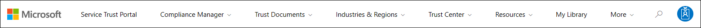
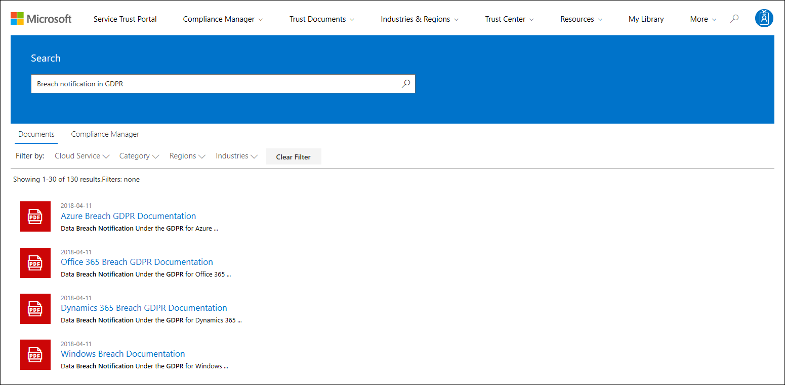
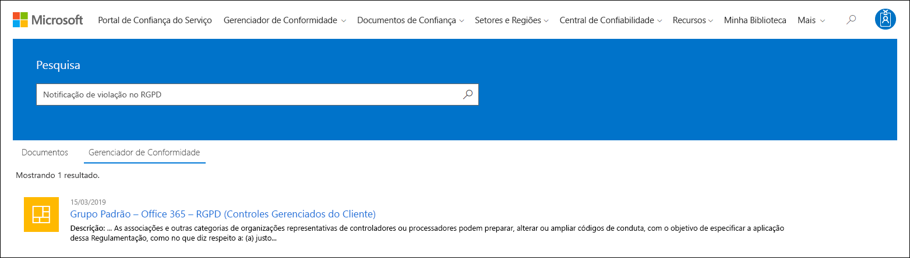

# Introdução ao portal de confiança do serviço Microsoft

O portal de confiança do serviço Microsoft oferece uma variedade de conteúdo, ferramentas e outros recursos sobre as práticas de segurança, privacidade e conformidade da Microsoft.
  
## Acessar o portal de confiança do serviço

O portal de confiança do serviço contém detalhes sobre a implementação da Microsoft de controles e processos que protege nossos serviços em nuvem e os dados do cliente estão contidos. Para acessar alguns dos recursos no portal de confiança do serviço, você deve fazer logon como um usuário autenticado com sua conta do Microsoft Cloud Services (uma conta da organização do Azure Active Directory ou uma conta da Microsoft) e revisar e aceitar o contrato de não divulgação da Microsoft para materiais de conformidade.
  
**Os clientes existentes podem acessar o portal de confiança do serviço** em [https://aka.ms/STP](https://aka.ms/STP) uma das seguintes assinaturas online (avaliação ou paga): 
  
- Microsoft 365

- Dynamics 365

- Azure
    
 > [!NOTE]
 > As contas do Active Directory do Azure associadas a organizações têm acesso a todo o intervalo de documentos e recursos, como o Gerenciador de conformidade. As contas da Microsoft criadas para uso pessoal têm acesso limitado ao conteúdo do portal de confiança do serviço. 
  
**Novos clientes e clientes avaliando o Microsoft Online Services**
  
Para criar uma nova conta ou criar uma conta de avaliação, use um dos seguintes formulários de inscrição (também usados para contas de avaliação) para obter acesso ao STP.
  
- Inscreva-se em uma nova conta de [avaliação do Microsoft 365 Apps for Business](https://go.microsoft.com/fwlink/p/?LinkID=507653) ou uma nova [conta de avaliação do Office 365 Enterprise](https://go.microsoft.com/fwlink/p/?LinkID=698279)

- Inscreva-se para uma nova [conta de avaliação do Dynamics 365](https://go.microsoft.com/fwlink/?LinkId=252780)

- Inscreva-se para uma nova [conta de avaliação do Azure](https://go.microsoft.com/fwlink/?LinkId=722737). 
    
Ao se inscrever em uma avaliação gratuita ou uma assinatura, você deve habilitar o Azure Active Directory para dar suporte ao seu acesso ao STP.
  
## Usando o portal de confiança do serviço

Os recursos e o conteúdo do portal de confiança do serviço podem ser acessados no menu principal.
  

As seções a seguir descrevem cada item no menu principal.
  
### Portal de Confiança do Serviço

O link do **portal de confiança do serviço** exibe a Home Page. Ele oferece uma maneira rápida de retornar à Home Page.

### Gerenciador de Conformidade

O Gerenciador de conformidade é uma ferramenta de avaliação de riscos baseada em fluxo de trabalho que ajuda a rastrear, atribuir e verificar as atividades de conformidade normativa da sua organização relacionadas aos serviços de nuvem da Microsoft, como o Microsoft 365, o Dynamics 365 e o Azure. Use o Gerenciador de conformidade para gerenciar a conformidade normativa dentro do modelo de responsabilidade compartilhada da nuvem. Dependendo da versão do Gerenciador de conformidade que você deseja usar, consulte os seguintes artigos para obter mais informações:

- [Gerenciador de conformidade da Microsoft (Clássico)](meet-data-protection-and-regulatory-reqs-using-microsoft-cloud.md)

- [Gerente de conformidade da Microsoft (versão prévia)](compliance-manager-overview.md)

### Documentos de Confiança

Fornece uma infinidade de informações de implementação e design de segurança com o objetivo de facilitar o atendimento aos objetivos de conformidade normativa, compreendendo como os serviços de nuvem da Microsoft mantêm seus dados seguros. Para revisar o conteúdo, selecione uma das seguintes opções no menu suspenso **documentos de confiança** .

- **Relatórios de auditoria:** É exibida uma lista de relatórios independentes de auditoria e avaliação nos serviços em nuvem da Microsoft. Estes relatórios fornecem informações sobre a conformidade dos serviços em nuvem da Microsoft com padrões de proteção de dados e requisitos normativos, como:
  
    - Organização internacional para a padronização (ISO)

    - Service Organization Controls (SOC)

    - NIST (Instituto Nacional de Padrões e Tecnologia)

    - FedRAMP (Programa Federal de Gerenciamento de Autorização e Risco)

    - Regulamento Geral de Proteção de Dados (RGPD)

- **Proteção de dados:** Contém uma variedade de recursos como controles auditados, White papers, perguntas frequentes, testes de penetração, ferramentas de avaliação de risco e guias de conformidade.

- **Plantas de segurança e conformidade do Azure:** Recursos que ajudam você a criar aplicativos baseados em nuvem seguros e compatíveis. Esta área contém orientações para o governo, finanças, assistência médica e mercados verticais.

### Países e regiões

Fornece informações de conformidade específicas do setor e da região sobre os serviços de nuvem da Microsoft.

- **Setores:** Neste momento, esta página fornece uma página de aterrissagem específica do setor para o setor de serviços financeiros. Isso contém informações como ofertas de conformidade, perguntas frequentes e histórias de sucesso. Os recursos para mais setores serão lançados no futuro, no entanto, você pode encontrar recursos para mais setores, acessando a página **confiar em documentos de > proteção de dados** no STP.

- **Regiões:** Fornece opiniões legais sobre a conformidade dos serviços em nuvem da Microsoft com várias leis de vários países. Os países específicos incluem Austrália, Canadá, República Tcheca, Dinamarca, Alemanha, Polônia, Romênia, Espanha e Reino Unido.
  
### Central de Confiabilidade

Links para a [central de confiabilidade da Microsoft](https://www.microsoft.com/trust-center), que fornece mais informações sobre segurança, conformidade e privacidade na nuvem da Microsoft. Isso inclui informações sobre os recursos nos serviços do Microsoft Cloud que você pode usar para lidar com requisitos específicos do RGPD, a documentação útil para sua responsabilidade do RGPD e para sua compreensão das medidas técnicas e organizacionais que a Microsoft levou para suportar o RGPD.
  
### Minha Biblioteca

Este novo recurso permite salvar (ou *fixar*) documentos para que você possa acessá-los rapidamente na sua página minha biblioteca. Você também pode configurar notificações para que a Microsoft envie uma mensagem de email quando os documentos de sua biblioteca do My forem atualizados. Para obter mais informações, consulte a seção [minha biblioteca](#my-library-1) neste artigo.

### Mais 

Vá para **mais > administrador** para acessar funções administrativas que estão disponíveis somente para a conta de administrador global. Essa opção estará visível somente quando você estiver conectado como um administrador global. Há duas opções no menu suspenso **administrador** :
  
- **Configurações:** Essa página permite atribuir acesso baseado em função (conhecido como *funções de usuário*) ao Gerenciador de conformidade.  Para saber mais, confira:
   
  - [Permissões no Gerenciador de conformidade (clássico)](meet-data-protection-and-regulatory-reqs-using-microsoft-cloud.md#permissions-and-role-based-access-control)
   
  - [Permissões no gerente de conformidade (visualização)](compliance-manager-overview.md#permissions)

  Você também pode configurar se as ações no Gerenciador de conformidade são atualizadas com base no status da mesma ação na pontuação segura. Esse recurso só será suportado se você estiver usando a versão mais recente do Gerenciador de conformidade. Para obter mais informações, consulte [controle de atualizações automáticas de Pontuação segura](working-with-compliance-manager.md#controlling-automatic-secure-score-updates).

- **Configurações de privacidade do usuário:** Esta página permite exportar um relatório que contém as atribuições de item de ação no Gerenciador de conformidade para um usuário específico. Você também pode reatribuir todos os itens de ação a um usuário diferente e remover qualquer item de ação atribuído do usuário especificado. Para obter mais informações, consulte [configurações de privacidade do usuário](meet-data-protection-and-regulatory-reqs-using-microsoft-cloud.md#user-privacy-settings).

### Search

Clique na lupa no canto superior direito da página do portal de confiança do serviço para expandir a caixa, insira seus termos de pesquisa e pressione **Enter**. A página de **pesquisa** é exibida, com o termo de pesquisa exibido na caixa de pesquisa e os resultados da pesquisa listados abaixo.
  

Por padrão, a pesquisa retorna resultados de documento. Você pode filtrar os resultados usando as listas suspensas para aprimorar a lista de documentos exibidos. Você pode usar vários filtros para restringir a lista de documentos. Os filtros incluem os serviços de nuvem específicos, categorias de práticas de conformidade ou segurança, regiões e setores. Clique no link nome do documento para baixar o documento.
  
Para listar os controles de avaliações no gerente de conformidade relacionados aos termos de pesquisa, clique em **Gerenciador de conformidade**. Os resultados da pesquisa mostram a data em que a avaliação foi criada, o nome do agrupamento de avaliação, o serviço do Microsoft Cloud aplicável e se o controle é gerenciado pela Microsoft ou pelo cliente. Clique no nome do controle para exibir o controle na avaliação no Gerenciador de conformidade.
  

  
> [!NOTE]
> Os relatórios e documentos do portal de confiança do serviço estão disponíveis para download por pelo menos 12 meses após a publicação ou até que uma nova versão do documento fique disponível.
  
## Minha Biblioteca

Use o recurso minha biblioteca para adicionar documentos e recursos no portal de confiança do serviço à sua página minha biblioteca. Isso permite que você acesse documentos que são relevantes para você em um único local.  Para adicionar um documento à sua biblioteca, clique no menu **...** à direita de um documento e, em seguida, selecione **salvar na biblioteca**. Você pode adicionar vários documentos à minha biblioteca clicando na caixa de seleção ao lado de um ou mais documentos e, em seguida, clicando em **salvar na biblioteca** na parte superior da página.

Além disso, o recurso Notifications permite que você configure a minha biblioteca para que uma mensagem de email seja enviada sempre que a Microsoft atualizar um documento que você tenha adicionado à minha biblioteca. Para configurar notificações, vá para a minha biblioteca e clique em **configurações de notificação**. Você pode escolher a frequência de notificações e especificar um endereço de email em sua organização para o qual enviar notificações. As notificações por email incluem links para os documentos que foram atualizados e uma breve descrição da atualização.

Observe também que identificamos todos os documentos em sua biblioteca que foram atualizados nos últimos 30 dias, independentemente de você ativar ou não notificações. Uma breve descrição da atualização também é exibida em uma dica de ferramenta.

## Pacotes de início

Os Starter packs são um conjunto de documentação orientado pela Microsoft sobre os serviços de nuvem da Microsoft para setores específicos. Atualmente, o portal de confiança do serviço oferece os três iniciadores a seguir para organizações de serviços financeiros. Estes pacotes de início ajudam as organizações a avaliar e avaliar a segurança, a conformidade e a privacidade na nuvem da Microsoft e fornecem orientações para ajudar a implementar os serviços de nuvem da Microsoft no setor de serviços financeiros altamente regulamentados.

- **Pacote de início de avaliação:** Use para a avaliação prévia da nuvem da Microsoft para organizações de serviços financeiros.

- **Pacote de início de avaliação:** Após a avaliação, use as listas de verificação e outras orientações deste pacote de início para ajudar sua organização a avaliar os riscos relacionados à segurança, conformidade e privacidade.

- **Pacote de início de auditoria:** User este pacote de início para obter orientação sobre como usar os controles de auditoria e outras ferramentas para ajudar a orientar sua implementação do Microsoft Cloud Services de uma maneira que ajuda a reduzir a exposição da sua organização a riscos.

Para acessar esses pacotes de início, acesse **portal de confiança do serviço > setores & regiões > soluções do setor > serviços financeiros**. Você pode abrir ou baixar documentos de um pacote de início ou salvá-los em sua biblioteca.

## Suporte de localização

O portal de confiança do serviço permite que você visualize o conteúdo da página em diferentes idiomas. Para alterar o idioma da página, basta clicar no ícone de Globo no canto inferior esquerdo da página e selecionar o idioma de sua escolha. 
  

  
## Feedback

Podemos ajudá-lo com perguntas sobre o portal de confiança do serviço ou os erros que você enfrenta ao usar o Portal. Você também pode entrar em contato conosco com perguntas e comentários sobre relatórios de conformidade do portal de confiança do serviço e recursos de confiança usando o link feedback na parte inferior das páginas do STP.
  
Seus comentários são importantes para nós. Clique no botão de comentários na parte inferior da página para nos enviar comentários sobre o que você fez ou não gostou, ou sugestões que você pode ter para melhorar nossos produtos ou recursos de produto.
  

