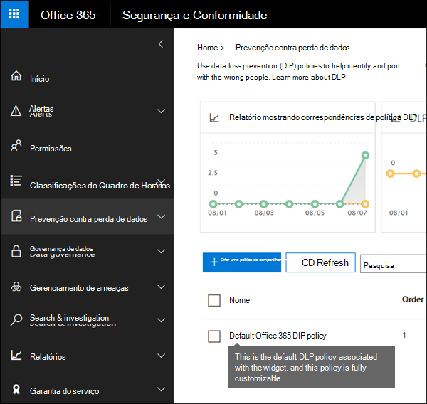

# Introdução à política DLP padrãoGet started with the default DLP policy

Antes de criar sua primeira política de prevenção contra perda de dados (DLP), a DLP está ajudando a proteger suas informações confidenciais com uma política padrão.Before you even create your first data loss prevention (DLP) policy, DLP is helping to protect your sensitive information with a default policy. Essa política padrão e sua recomendação (mostrada abaixo) ajudam a manter seu conteúdo sensível seguro notificando você quando emails ou documentos que contêm um número de cartão de crédito foram compartilhados com alguém de fora da sua organização.This default policy and its recommendation (shown below) help keep your sensitive content secure by notifying you when email or documents containing a credit card number were shared with someone outside your organization. Você verá essa recomendação na home **page** do Centro de Conformidade &amp; de Segurança.You'll see this recommendation on the **Home** page of the Security &amp; Compliance Center. 
  
Você pode usar esse widget para exibir rapidamente quando e quantas informações confidenciais foram compartilhadas e refinar a política DLP padrão em apenas um ou dois cliques.You can use this widget to quickly view when and how much sensitive information was shared, and then refine the default DLP policy in just a click or two. Você também pode editar a política DLP padrão a qualquer momento porque ela é totalmente personalizável.You can also edit the default DLP policy at any time because it's fully customizable. Observe que, se você não vir a recomendação no início, tente clicar em **+Mais** na parte inferior da seção Recomendado **para você.**Note that if you don't see the recommendation at first, try clicking **+More** at the bottom of the **Recommended for you** section. 
  

  
## Exibir o relatório e refinar a política DLP padrãoView the report and refine the default DLP policy

Quando o widget mostrar que os usuários compartilharam informações confidenciais com pessoas de fora da sua organização, escolha Refinar a política **DLP** na parte inferior.When the widget shows you that users have shared sensitive information with people outside your organization, choose **Refine DLP policy** at the bottom. 
  
O relatório detalhado mostra quando e quanto conteúdo contendo números de cartão de crédito foi compartilhado nos últimos 30 dias.The detailed report shows you when and how much content containing credit card numbers was shared in the past 30 days. Observe que as correspondeções de regra podem levar até 48 horas para aparecer no widget.Note that rule matches can take up to 48 hours to show up in the widget.
  
Para ajudar a proteger as informações confidenciais, a política DLP padrão:To help protect the sensitive information, the default DLP policy:
  
- Detecta quando o conteúdo no Exchange, no SharePoint e no OneDrive que contém pelo menos um número de cartão de crédito é compartilhado com pessoas de fora da sua organização.Detects when content in Exchange, SharePoint, and OneDrive that contains at least one credit card number is shared with people outside your organization.
    
- Mostra uma dica de política e envia uma notificação por email aos usuários quando eles tentam compartilhar essas informações confidenciais com pessoas de fora da sua organização.Shows a policy tip and sends an email notification to users when they attempt to share this sensitive information with people outside your organization. Para obter mais informações sobre essas opções, consulte Enviar notificações [por email e mostrar dicas de política para políticas DLP.](use-notifications-and-policy-tips.md)For more information on these options, see [Send email notifications and show policy tips for DLP policies](use-notifications-and-policy-tips.md).
    
- Gera relatórios de atividades detalhados para que você possa acompanhar coisas como quem compartilhou o conteúdo com pessoas de fora da sua organização e quando fez isso.Generates detailed activity reports so that you can track things like who shared the content with people outside your organization and when they did it. Você pode usar os [relatórios de DLP e](view-the-dlp-reports.md) dados de [log](search-the-audit-log-in-security-and-compliance.md) de auditoria (onde **a**  =  **Atividade DLP**) para ver essas informações.You can use the [DLP reports](view-the-dlp-reports.md) and [audit log data](search-the-audit-log-in-security-and-compliance.md) (where **Activity** = **DLP**) to see this information.
    
Para refinar rapidamente a política de DLP padrão, você pode optar por ter:To quickly refine the default DLP policy, you can choose to have it:
  
- Envie um email de relatório de incidentes quando os usuários compartilharem essas informações confidenciais com pessoas de fora da sua organização.Send you an incident report email when users share this sensitive information with people outside your organization.
    
- Adicione outros usuários ao relatório de incidentes de email.Add other users to the email incident report.
    
- Bloqueie o acesso ao conteúdo que contém as informações confidenciais, mas permita que o usuário substitua e compartilhe ou envie, se necessário.Block access to the content containing the sensitive information, but allow the user to override and share or send if they need to.
    
Para obter mais informações sobre relatórios de incidentes ou restrição de acesso, consulte [Visão geral das políticas de prevenção contra perda de dados.](data-loss-prevention-policies.md)For more information on incident reports or restricting access, see [Overview of data loss prevention policies](data-loss-prevention-policies.md).
  
Se você quiser alterar essas opções posteriormente, poderá editar a política DLP padrão a qualquer momento. Consulte a próxima seção.If you want to change these options later, you can edit the default DLP policy at any time - see the next section.
  

  
## Editar a política DLP padrãoEdit the default DLP policy

Essa política é chamada de **política DLP** padrão  e aparece em **Prevenção** contra perda de dados na página Política do Centro de Conformidade &amp; de Segurança.This policy is named **Default DLP policy** and appears under **Data loss prevention** on the **Policy** page of the Security &amp; Compliance Center. 
  
Essa política é totalmente personalizável, o mesmo que qualquer política de DLP que você mesmo cria do zero.This policy is fully customizable, the same as any DLP policy that you create yourself from scratch. Você também pode desativar ou excluir a política, para que os usuários não recebam mais dicas de política ou notificações por email.You can also turn off or delete the policy, so that your users no longer receive policy tips or email notifications.
  

  
## Quando o widget faz e não apareceWhen the widget does and does not appear

O widget chamado **Proteger ainda** mais o conteúdo compartilhado aparece na seção Recomendado **para você** da **home** page do Centro de Conformidade &amp; de Segurança.The widget named **Further protect shared content** appears in the **Recommended for you** section of the **Home** page of the Security &amp; Compliance Center. 
  
Esse widget só aparece quando:This widget appears only when:
  
- Não há políticas de prevenção contra perda de dados no Centro de Conformidade &amp; de Segurança ou no Centro de administração do Exchange.There are no data loss prevention policies in the Security &amp; Compliance Center or Exchange admin center. Esse widget se destina a ajudá-lo a começar a trabalhar com DLP, portanto, ele não será exibido se você já tiver políticas de DLP.This widget is intended to help you get started with DLP, so it doesn't appear if you already have DLP policies.
    
- O conteúdo que contém pelo menos um cartão de crédito foi compartilhado com alguém de fora da sua organização nos últimos 30 dias.Content containing least one credit card has been shared with someone outside your organization in the past 30 days.
    
Observe que as combinações de regra podem levar até 48 horas para serem disponibilizadas para o widget, portanto, depois que informações confidenciais compartilhadas externamente são detectadas, pode levar até dois dias para que a recomendação apareça.Note that rule matches can take up to 48 hours to be available to the widget, so after sensitive information shared externally is detected, it may take up to two days for the recommendation to appear.
  
Por fim, depois de usar o widget para refinar a política DLP padrão, o widget desaparece da **home** page.Finally, after you use the widget to refine the default DLP policy, the widget disappears from the **Home** page. 
  

