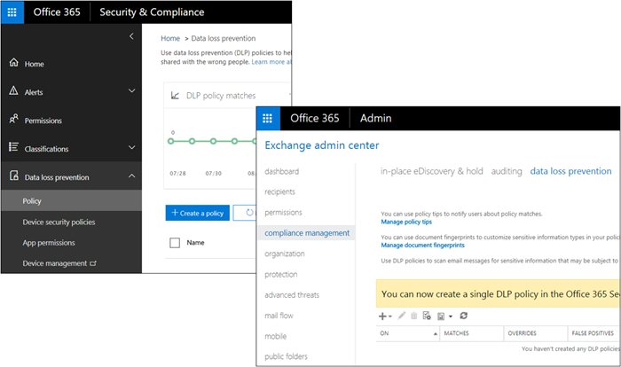

# Como a DLP funciona entre o Centro Microsoft 365 de Conformidade e o Exchange de administração

Em Microsoft 365, você pode criar uma política de prevenção contra perda de dados (DLP) em dois centros de administração diferentes:
  
- No Centro de Conformidade do **Microsoft 365**, você pode criar uma única política de DLP para ajudar a proteger o conteúdo em SharePoint, OneDrive, Exchange, Teams e agora Dispositivos de Ponto de Extremidade. Recomendamos que você crie uma política DLP aqui. Para obter mais informações, consulte [Referência de Prevenção contra Perda de Dados](data-loss-prevention-policies.md).
    
- No centro **Exchange de** administração, você pode criar uma política de DLP para ajudar a proteger o conteúdo somente Exchange. Essa política pode usar Exchange de fluxo de emails (também conhecidas como regras de transporte), portanto, ela tem mais opções específicas para lidar com emails. Para obter mais informações, [consulte DLP no Exchange de administração](/exchange/security-and-compliance/data-loss-prevention/data-loss-prevention).
    
As polícias de DLP criadas nesses centros de administração funcionam lado a lado - este tópico explica como.
  

  
## Como a DLP no Centro de Conformidade & segurança funciona com regras de fluxo de email e DLP no centro de administração Exchange de email

Depois de criar uma política de DLP no Centro de Conformidade & segurança, a política será implantada em todos os locais incluídos na política. Se a política incluir Exchange Online, a política será sincronizada e imposta exatamente da mesma forma que uma política de DLP criada no centro de administração Exchange. 
  
Se você tiver criado políticas de DLP no centro de administração do Exchange, essas políticas continuarão a funcionar lado a lado com quaisquer políticas de email criadas no Centro de Conformidade & Segurança. Mas observe que as regras criadas no Exchange de administração têm precedência. Todas Exchange de fluxo de emails são processadas primeiro e, em seguida, as regras de DLP do Centro de Conformidade & segurança são processadas.
  
Isso significa que:
  
- As mensagens bloqueadas por Exchange de fluxo de emails não serão examinadas por regras de DLP criadas no & Centro de Conformidade e Segurança.
    
- Se uma regra Exchange de fluxo de emails modifica uma mensagem de forma que a faz corresponder a uma política de DLP no Centro de Conformidade do & de Segurança , como adicionar usuários externos, as regras de DLP detectarão isso e imporão a política conforme necessário.
    
Observe também que Exchange regras de fluxo de emails que usam a ação "parar o processamento" não afetam o processamento de regras de DLP no Centro de Conformidade & segurança - elas ainda serão processadas.
  
## Dicas de política no Centro de Conformidade & segurança versus o Exchange de administração

As dicas de política podem funcionar com políticas de DLP e regras de fluxo de emails criadas no centro de administração do Exchange ou com políticas de DLP criadas no Centro de Conformidade & Segurança, mas não ambos. Isso porque essas políticas são armazenadas em locais diferentes, mas as dicas de política só podem ser desenhar de um único local.
  
Se você configurou dicas de política no centro de administração do Exchange, todas as dicas de política que você configurar no Centro de Conformidade do & de Segurança não aparecerão para os usuários no Outlook na Web e no Outlook 2013 e posterior até que você desligue as dicas no centro de administração do Exchange. Isso garante que as regras atuais Exchange fluxo de emails continuem a funcionar até que você opte por alternar para o Centro de Conformidade & Segurança.
  
Observe que, embora as dicas de política possam desenhar apenas de um único local, as notificações de email sempre são enviadas, mesmo se você estiver usando políticas DLP no Centro de Conformidade e Segurança & e no centro de administração Exchange.
