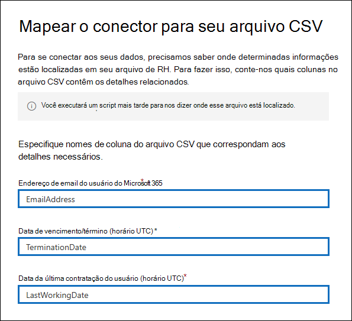

# <a name="set-up-a-connector-to-import-hr-data-in-us-government-preview"></a>Configurar um conector para importar dados de RH no governo dos EUA (versão prévia)

Você pode configurar um conector de dados no centro de conformidade da Microsoft 365 para importar dados de recursos humanos (RH) para sua organização governamental dos EUA. Dados relacionados a RH incluem a data em que um funcionário enviou a demissão e a data do último dia do funcionário. Esses dados de RH podem ser usados pelas soluções de proteção de informações da Microsoft, como a [solução de gerenciamento de riscos Insider](insider-risk-management.md), para ajudar a proteger sua organização contra atividades mal-intencionadas ou roubo de dados dentro da organização. A configuração de um conector de RH consiste na criação de um aplicativo no Azure Active Directory que é usado para autenticação por conector, a criação de arquivos de mapeamento CSV que contém seus dados de RH, a criação de um conector de dados no centro de conformidade e a execução de um script (em uma base agendada) que inclua os dados de RH no arquivo CSV para a nuvem da Microsoft. Em seguida, o conector de dados é usado pela ferramenta de gerenciamento de risco do insider para acessar os dados de RH que foram importados para sua organização de governo dos EUA da Microsoft 365.

## <a name="before-you-begin"></a>Antes de começar

- Sua organização deve ter o consentimento para permitir que o serviço de importação do Office 365 acesse os dados da sua organização. Para concordar com essa solicitação, [acesse a página](https://login.microsoftonline.com/common/oauth2/authorize?client_id=570d0bec-d001-4c4e-985e-3ab17fdc3073&response_type=code&redirect_uri=https://portal.azure.com/&nonce=1234&prompt=admin_consent), entre com as credenciais de um administrador global do Microsoft 365 e aceite a solicitação. Você precisa concluir esta etapa para poder criar com êxito o conector de RH na etapa 3.

- O usuário que cria o conector de RH na etapa 3 deve ser atribuído à função de exportação de importação de caixa de correio no Exchange Online. Por padrão, essa função não é atribuída a nenhum grupo de funções no Exchange Online. Você pode adicionar a função de exportação de importação de caixa de correio ao grupo de funções Gerenciamento da organização no Exchange Online. Ou você pode criar um novo grupo de função, atribua a função de exportação de importação de caixa de correio e, em seguida, adicione os usuários apropriados como membros. Para obter mais informações, consulte as seções [criar grupos de função](https://docs.microsoft.com/Exchange/permissions-exo/role-groups#create-role-groups) ou [modificar grupos de função](https://docs.microsoft.com/Exchange/permissions-exo/role-groups#modify-role-groups) no artigo "gerenciar grupos de função no Exchange Online".

- Você precisará determinar como recuperar ou exportar os dados do sistema de RH da sua organização (regularmente) e adicioná-los ao arquivo CSV descrito na etapa 2. O script executado na etapa 4 carregará os dados de RH no arquivo CSV para a nuvem da Microsoft.

- O script de exemplo executado na etapa 4 carregará os dados de RH na nuvem da Microsoft para que possam ser usados por outras ferramentas da Microsoft, como a solução de gerenciamento de risco do insider. Este script de exemplo não tem suporte em nenhum programa ou serviço de suporte padrão da Microsoft. O script de exemplo é fornecido como está sem garantia de qualquer tipo. A Microsoft também se isenta de todas as garantias implícitas, incluindo sem limitações quaisquer garantias aplicáveis de padrões de comercialização ou de adequação a uma finalidade específica. Todo o risco resultante do uso ou do desempenho do script de exemplo e da documentação permanece com você. De modo algum a Microsoft, seus autores ou qualquer outra pessoa envolvida na criação, produção ou veiculação dos scripts serão considerados responsáveis por quaisquer danos (incluindo sem limitações danos por perda de lucros comerciais, interrupção de negócios, perda de informações comerciais ou outras perdas pecuniárias) resultantes do uso ou da incapacidade de uso da documentação ou scripts de exemplo, mesmo que a Microsoft tenha sido alertada sobre a possibilidade de tais danos.

## <a name="step-1-create-an-app-in-azure-active-directory"></a>Etapa 1: criar um aplicativo no Azure Active Directory

A primeira etapa é criar e registrar um novo aplicativo no Azure Active Directory (AAD). O aplicativo corresponderá ao conector de RH que você criou na etapa 3. A criação deste aplicativo permitirá que o AAD autentique o conector de RH quando executado e tente acessar sua organização. Este aplicativo também será usado para autenticar o script executado na etapa 4 para carregar seus dados de RH na nuvem da Microsoft. Durante a criação deste aplicativo AAD, certifique-se de salvar as informações a seguir. Esses valores serão usados nas etapas posteriores.

- ID do aplicativo AAD (também chamado de *ID do aplicativo* ou ID do *cliente*)

- Segredo do aplicativo AAD (também chamado de *segredo do cliente*)

- ID do locatário (também chamado de *ID de diretório*)

Para obter instruções detalhadas sobre a criação de um aplicativo no AAD, consulte [registrar um aplicativo com a plataforma de identidade da Microsoft](https://docs.microsoft.com/azure/active-directory/develop/quickstart-register-app).

## <a name="step-2-prepare-a-csv-file-with-your-hr-data"></a>Etapa 2: preparar um arquivo CSV com seus dados de RH

A próxima etapa é criar um arquivo CSV que contenha informações sobre funcionários que saíram da sua organização. Conforme explicado na seção antes de começar, você precisará determinar como gerar esse arquivo CSV no sistema de RH da sua organização. O exemplo a seguir mostra um arquivo CSV concluído (aberto no bloco de notas) que contém os três parâmetros obrigatórios (colunas). É muito mais fácil editar o arquivo CSV no Microsoft Excel.

```text
EmailAddress,TerminationDate,LastWorkingDate
sarad@contoso.com,2019-04-23T15:18:02.4675041+05:30,2019-04-29T15:18:02.4675041+05:30
pilarp@contoso.com,2019-04-24T09:15:49Z,2019-04-29T15:18:02.7117540
```

A primeira linha, ou linha de cabeçalho, do arquivo CSV lista os nomes de coluna necessários. O nome usado em cada cabeçalho de coluna é seu para você (aqueles no exemplo anterior são sugestões). No entanto, os mesmos nomes de coluna usados no arquivo CSV *devem* ser especificados quando você cria o conector de RH na etapa 3. Não inclua espaços nos nomes de coluna.

A tabela a seguir descreve cada coluna no arquivo CSV:

|**Nome da coluna**|**Descrição**|
|:-----|:-----|
| **EmailAddress** <br/> |Especifica o endereço de email do funcionário demitido.|
| **TerminationDate** <br/> |Especifica a data em que o emprego da pessoa foi oficialmente encerrado em sua organização. Por exemplo, isso pode ser a data em que o funcionário deu seu aviso sobre a saída da sua organização. Essa data pode ser diferente da data do último dia de trabalho da pessoa. Você deve usar o seguinte formato de data: `yyyy-mm-ddThh:mm:ss.nnnnnn+|-hh:mm` , que é o [formato de data e hora ISO 8601](https://www.iso.org/iso-8601-date-and-time-format.html).|
|**LastWorkingDate**|Especifica o último dia de trabalho para o funcionário demitido. Você deve usar o seguinte formato de data: `yyyy-mm-ddThh:mm:ss.nnnnnn+|-hh:mm` , que é o [formato de data e hora ISO 8601](https://www.iso.org/iso-8601-date-and-time-format.html).|
|||

Depois de criar o arquivo CSV com os dados de RH necessários, armazene-os no mesmo sistema que o script executado na etapa 4. Você também deve implementar uma estratégia de atualização para certificar-se de que o arquivo CSV sempre contenha as informações mais atuais para que seja o que você executar o script, os dados mais atuais de encerramento do funcionário serão carregados para a nuvem da Microsoft.

## <a name="step-3-create-the-hr-connector"></a>Etapa 3: criar o conector de RH

A próxima etapa é criar um conector de RH no centro de conformidade da Microsoft 365. Depois de executar o script na etapa 4, o conector de RH que você cria receberá os dados de RH do arquivo CSV para sua organização do Microsoft 365. Nesta etapa, certifique-se de copiar o ID do trabalho que é gerado quando você cria o conector. Você usará a ID do trabalho ao executar o script.

1. Vá para [https://compliance.microsoft.com](https://compliance.microsoft.com) e clique em **conectores de dados** no painel de navegação esquerdo.

2. Na página **conectores de dados (visualização)** em **RH**, clique em **Exibir**.

3. Na página **RH** , clique em **Adicionar conector**.

4. Na página **credenciais de autenticação** , faça o seguinte e clique em **Avançar**:

   a. Digite ou cole a ID de aplicativo do AAD para o aplicativo do Azure que você criou na etapa 1.

   b. Digite um nome para o conector de RH.

5. Na página **mapeamento de arquivo** , digite os três nomes de cabeçalho de coluna (também chamados de *parâmetros* do arquivo CSV que você criou na etapa 2 em cada uma das caixas apropriadas. Os nomes não diferenciam maiúsculas de minúsculas. Como explicado anteriormente, os nomes digitados nessas caixas devem coincidir com os nomes de parâmetro no arquivo CSV. Por exemplo, a captura de tela a seguir mostra os nomes de parâmetro do exemplo no arquivo CSV de exemplo mostrado na etapa 2.

   

6. Na página **revisão** , revise suas configurações e clique em **concluir** para criar o conector.

   Uma página de status é exibida para confirmar que o conector foi criado. Esta página contém duas coisas importantes que você precisa para concluir a próxima etapa para executar o script de exemplo para carregar seus dados de RH.

   

   a. **ID de trabalho.** Você precisará dessa ID de trabalho para executar o script na próxima etapa. Você pode copiá-lo desta página ou da página do submenu conector.
   
   b. **Link para script de amostra.** Clique no link **aqui** para ir para o site do GitHub para acessar o script de exemplo (o link abre uma nova janela). Mantenha essa janela aberta para que você possa copiar o script na etapa 4. Como alternativa, você pode indicar o destino ou copiar a URL para que possa acessá-la novamente na etapa 4. Este link também está disponível na página do submenu conector.

7. Clique em **Concluído**.

   O novo conector é exibido na lista na guia **conectores** . 

8. Clique no conector de RH que você acabou de criar para exibir a página de submenu, que contém propriedades e outras informações sobre o conector.

   

   Se ainda não tiver feito isso, você poderá copiar os valores para a **ID do aplicativo do Azure** e a **ID do trabalho do conector**. Você precisará deles para executar o script na próxima etapa. Você também pode baixar o script da página do menu de atalho (ou baixá-lo usando o link na próxima etapa.)

   Você também pode clicar em **Editar** para alterar a ID do aplicativo do Azure ou os nomes de cabeçalho de coluna definidos na página **mapeamento de arquivo** .

## <a name="step-4-run-the-sample-script-to-upload-your-hr-data"></a>Etapa 4: executar o script de exemplo para carregar seus dados de RH

A última etapa na configuração de um conector de RH é executar um script de exemplo que irá carregar os dados de RH no arquivo CSV (que você criou na etapa 2) para a nuvem da Microsoft. Especificamente, o script carrega os dados para o conector de RH. Depois de executar o script, o conector de RH que você criou na etapa 3 importa os dados de RH para a sua organização do Microsoft 365, onde pode ser acessado por outras ferramentas de conformidade, como a solução de gerenciamento de risco do insider. Depois de executar o script, considere agendar uma tarefa para executá-la automaticamente, de modo que os dados de encerramento de funcionários mais atuais sejam carregados para a nuvem da Microsoft. Confira [agendar o script para ser executado automaticamente](#optional-step-6-schedule-the-script-to-run-automatically).

1. Vá para a janela que você deixou de abrir da etapa anterior para acessar o site do GitHub com o script de exemplo. Como alternativa, abra o site marcado ou use a URL que você copiou.

2. Clique no botão **RAW** para exibir o script no modo de exibição de texto.

3. Copie todas as linhas no script de exemplo e salve-as em um arquivo de texto.

4. Modifique o script de exemplo para sua organização, se necessário.

5. Salve o arquivo de texto como um arquivo de script do Windows PowerShell usando um sufixo de nome de arquivo `.ps1` ; por exemplo, `HRConnector.ps1` .

6. Abra um prompt de comando no computador local e vá para o diretório onde você salvou o script.

7. Execute o seguinte comando para carregar os dados de RH no arquivo CSV para a nuvem da Microsoft; por exemplo:

    ```powershell
    .\HRConnector.ps1 -tenantId <tenantId> -appId <appId>  -appSecret <appSecret>  -jobId <jobId>  -csvFilePath '<csvFilePath>'
    ```

   A tabela a seguir descreve os parâmetros a serem usados com esse script e seus valores necessários. As informações obtidas nas etapas anteriores são usadas nos valores desses parâmetros.

   |**Parâmetro**|**Descrição**
   |:-----|:-----|:-----|
   |`tenantId`|Esta é a ID da sua organização do Microsoft 365 que você obteve na etapa 1. Você também pode obter a ID do locatário para sua organização na folha **visão geral** no centro de administração do Azure AD. Isso é usado para identificar sua organização.|
   |`appId` |Esta é a ID do aplicativo AAD para o aplicativo que você criou no Azure AD na etapa 1. Isso é usado pelo Azure AD para autenticação quando o script tenta acessar sua organização do Microsoft 365. | 
   |`appSecret`|Este é o segredo do aplicativo AAD para o aplicativo que você criou no Azure AD na etapa 1. Isso também é usado para autenticação.|
   |`jobId`|Esta é a ID do trabalho do conector de RH que você criou na etapa 3. Isso é usado para associar os dados de RH que são carregados para a nuvem da Microsoft com o conector de RH.|
   |`csvFilePath`|Este é o caminho do arquivo para o arquivo CSV (armazenado no mesmo sistema que o script) que você criou na etapa 2. Tente evitar espaços no caminho do arquivo; caso contrário, use aspas simples.|
   |||
   
   Veja um exemplo da sintaxe do script do conector de RH usando valores reais para cada parâmetro:

   ```powershell
    .\HRConnector.ps1 -tenantId d5723623-11cf-4e2e-b5a5-01d1506273g9 -appId 29ee526e-f9a7-4e98-a682-67f41bfd643e -appSecret MNubVGbcQDkGCnn -jobId b8be4a7d-e338-43eb-a69e-c513cd458eba -csvFilePath 'C:\Users\contosoadmin\Desktop\Data\employee_termination_data.csv'
    ```

   Se o upload for bem-sucedido, o script exibirá a mensagem de **upload bem-sucedida** .

## <a name="step-5-monitor-the-hr-connector"></a>Etapa 5: monitorar o conector de RH

Depois de criar o conector de RH e executar o script para carregar seus dados de RH, você pode exibir o conector e o status de upload no centro de conformidade da Microsoft 365. Se você agendar o script para ser executado automaticamente regularmente, também poderá exibir o status atual após a última vez que o script foi executado.

1. Vá para [https://compliance.microsoft.com](https://compliance.microsoft.com) e clique em **conectores de dados** no painel de navegação esquerdo.

2. Clique na guia **conectores** e selecione o conector de RH para exibir a página de submenu, que contém as propriedades e informações sobre o conector.

   

3. Em **andamento**, clique no link **baixar log** para abrir (ou salvar) o log de status do conector. Esse log contém informações sobre cada vez que o script é executado e carrega os dados do arquivo CSV para a nuvem da Microsoft. 

   

   O `RecordsSaved` campo indica o número de linhas no arquivo CSV que foram carregadas. Por exemplo, se o arquivo CSV contiver quatro linhas, o valor dos `RecordsSaved` campos será 4, se o script tiver carregado com êxito todas as linhas no arquivo CSV.

Se você não tiver executado o script na etapa 4, um link para baixar o script será exibido em **última importação**. Você pode baixar o script e seguir as etapas na etapa 4 para executá-lo.

## <a name="optional-step-6-schedule-the-script-to-run-automatically"></a>Opcion Etapa 6: agendar o script para ser executado automaticamente

Para verificar se os dados de RH mais recentes da sua organização estão disponíveis para ferramentas como a solução de gerenciamento de risco do Insider, recomendamos agendar o script para ser executado automaticamente de forma recorrente, como uma vez por dia. Isso também exige que você atualize os dados de RH no arquivo CSV de forma semelhante (se não o mesmo), para que ele contenha as informações mais recentes sobre funcionários que saem da sua organização. O objetivo é carregar os dados de RH mais atuais para que o conector de RH possa disponibilizá-lo para a solução de gerenciamento de risco do insider.

Você pode fazer com que o aplicativo Agendador de tarefas do Windows execute o script automaticamente todos os dias.

1. No computador local, clique no botão **Iniciar** do Windows e digite **Agendador de tarefas**.

2. Clique no aplicativo **Agendador de tarefas** para abri-lo.

3. Na seção **ações** , clique em **criar tarefa**.

4. Na guia **geral** , digite um nome descritivo para a tarefa agendada; por exemplo, **script do conector de RH**. Você também pode adicionar uma descrição opcional.

5. Em **Opções de segurança**, faça o seguinte:

   a. Determine se o script deve ser executado somente quando você estiver conectado ao computador ou executá-lo quando estiver conectado ou não.
   
   b. Verifique se a caixa de seleção **executar com os privilégios mais altos** está selecionada.

6. Selecione a guia **acionadores** , clique em **novo**e faça o seguinte:

   a. Em **configurações**, selecione a opção **diariamente** e, em seguida, escolha uma data e hora para executar o script pela primeira vez. O script será todos os dias no mesmo horário especificado.
   
   b. Em **Configurações avançadas**, certifique-se de que a caixa de seleção **habilitado** esteja marcada.
   
   c. Clique em **OK**.

7. Selecione a guia **ações** , clique em **novo**e faça o seguinte:

   

   a. Na lista suspensa **ação** , verifique se **Iniciar um programa** está selecionado.

   b. Na caixa **programa/script** , clique em **procurar**e vá para o local a seguir e selecione-o para que o caminho seja exibido na caixa: `C:\Windows\System32\WindowsPowerShell\v1.0\powershell.exe` .

   c. Na caixa **adicionar argumentos (opcional)** , Cole o mesmo comando de script executado na etapa 4. Por exemplo, `.\HRConnector.ps1 -tenantId "d5723623-11cf-4e2e-b5a5-01d1506273g9" -appId "c12823b7-b55a-4989-faba-02de41bb97c3" -appSecret "MNubVGbcQDkGCnn"  -jobId "e081f4f4-3831-48d6-7bb3-fcfab1581458" -csvFilePath "C:\Users\contosoadmin\Desktop\Data\employee_termination_data.csv"`

   d. Na caixa **Iniciar em (opcional)** , Cole o local da pasta do script executado na etapa 4. Por exemplo, `C:\Users\contosoadmin\Desktop\Scripts`.

   e. Clique em **OK** para salvar as configurações da nova ação.

8. Na janela **criar tarefa** , clique em **OK** para salvar a tarefa agendada. Você pode ser solicitado a inserir suas credenciais de conta de usuário.

   A nova tarefa é exibida na biblioteca do Agendador de tarefas.

   

   A última vez em que o script foi executado e a próxima vez em que ele está agendado para ser executado é exibida. Você pode clicar duas vezes na tarefa para editá-la.

   Você também pode verificar a última vez que o script foi executado na página de submenu do respectivo conector de RH no centro de conformidade.
