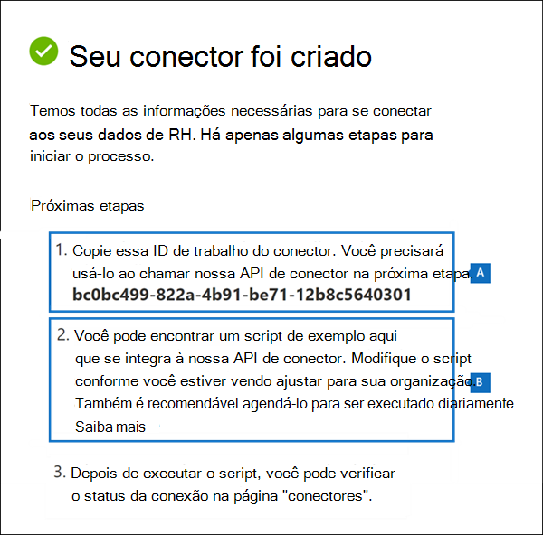
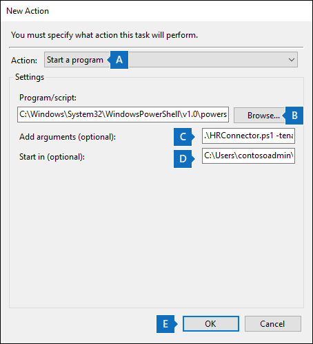

# <a name="set-up-a-connector-to-import-hr-data"></a><span data-ttu-id="2ef61-104">Configurar um conector para importar dados de RH</span><span class="sxs-lookup"><span data-stu-id="2ef61-104">Set up a connector to import HR data</span></span>

<span data-ttu-id="2ef61-105">Você pode configurar um conector de dados no centro de conformidade do Microsoft 365 para importar dados de recursos humanos (RH) relacionados a eventos como a demissão de um usuário ou uma alteração no nível de trabalho de um usuário.</span><span class="sxs-lookup"><span data-stu-id="2ef61-105">You can set up a data connector in the Microsoft 365 compliance center to import human resources (HR) data related to events such as a user's resignation or a change in a user's job level.</span></span> <span data-ttu-id="2ef61-106">Os dados de RH podem ser usados pela solução de gerenciamento de riscos [insider](insider-risk-management.md) para gerar indicadores de risco que podem ajudá-lo a identificar possíveis atividades mal-intencionadas ou roubo de dados por usuários dentro de sua organização.</span><span class="sxs-lookup"><span data-stu-id="2ef61-106">The HR data can then be used by the [insider risk management solution](insider-risk-management.md) to generate risk indicators that can help you identity possible malicious activity or data theft by users inside your organization.</span></span>

<span data-ttu-id="2ef61-107">Configurar um conector para dados de RH que as políticas de gerenciamento de riscos insider podem usar para gerar indicadores de risco consistem em criar um arquivo CSV que contém os dados de RH, criar um aplicativo no Azure Active Directory usado para autenticação, criar um conector de dados de RH no centro de conformidade do Microsoft 365 e, em seguida, executar um script (agendado) que ingere os dados de RH em arquivos CSV para a nuvem da Microsoft para que ele seja disponibilizado para o insider solução de gerenciamento de riscos.</span><span class="sxs-lookup"><span data-stu-id="2ef61-107">Setting up a connector for HR data that insider risk management policies can use to generate risk indicators consists of creating a CSV file that contains that contains the HR data, creating an app in Azure Active Directory that's used for authentication, creating an HR data connector in the Microsoft 365 compliance center, and then running a script (on a scheduled basis) that ingests the HR data in CSV files to the Microsoft cloud so it's available to the insider risk management solution.</span></span>

## <a name="before-you-begin"></a><span data-ttu-id="2ef61-108">Antes de começar</span><span class="sxs-lookup"><span data-stu-id="2ef61-108">Before you begin</span></span>

- <span data-ttu-id="2ef61-109">Determine quais cenários de RH e dados serão importados para o Microsoft 365.</span><span class="sxs-lookup"><span data-stu-id="2ef61-109">Determine which HR scenarios and data to import to Microsoft 365.</span></span> <span data-ttu-id="2ef61-110">Isso ajudará a determinar quantos arquivos CSV e conectores de RH você precisará criar e como gerar e estruturar os arquivos CSV.</span><span class="sxs-lookup"><span data-stu-id="2ef61-110">This will help you determine how many CSV files and HR connectors you'll need to create, and how to generate and structure the CSV files.</span></span> <span data-ttu-id="2ef61-111">Os dados de RH que você importa são determinados pelas políticas de gerenciamento de riscos internas que você deseja implementar.</span><span class="sxs-lookup"><span data-stu-id="2ef61-111">The HR data that you import is determined by the insider risk management policies that you want to implement.</span></span> <span data-ttu-id="2ef61-112">Para obter mais informações, consulte Etapa 1.</span><span class="sxs-lookup"><span data-stu-id="2ef61-112">For more information, see Step 1.</span></span>

- <span data-ttu-id="2ef61-113">Determine como recuperar ou exportar os dados do sistema de RH da sua organização (e regularmente) e adicioná-los aos arquivos CSV que você criar na Etapa 1.</span><span class="sxs-lookup"><span data-stu-id="2ef61-113">Determine how to retrieve or export the data from your organization's HR system (and on a regular basis) and add it to the CSV files that you create in Step 1.</span></span> <span data-ttu-id="2ef61-114">O script executado na Etapa 4 carregará os dados de RH nos arquivos CSV para a nuvem da Microsoft.</span><span class="sxs-lookup"><span data-stu-id="2ef61-114">The script that you run in Step 4 will upload the HR data in the CSV files to the Microsoft cloud.</span></span>

- <span data-ttu-id="2ef61-115">O usuário que cria o conector de RH na Etapa 3 deve receber a função de Exportação de Importação de Caixa de Correio no Exchange Online.</span><span class="sxs-lookup"><span data-stu-id="2ef61-115">The user who creates the HR connector in Step 3 must be assigned the Mailbox Import Export role in Exchange Online.</span></span> <span data-ttu-id="2ef61-116">Por padrão, essa função não é atribuída a nenhum grupo de funções no Exchange Online.</span><span class="sxs-lookup"><span data-stu-id="2ef61-116">By default, this role isn't assigned to any role group in Exchange Online.</span></span> <span data-ttu-id="2ef61-117">Você pode adicionar a função Exportar Importação de Caixa de Correio ao grupo de função Gerenciamento da Organização no Exchange Online.</span><span class="sxs-lookup"><span data-stu-id="2ef61-117">You can add the Mailbox Import Export role to the Organization Management role group in Exchange Online.</span></span> <span data-ttu-id="2ef61-118">Ou você pode criar um novo grupo de funções, atribuir a função De Exportação de Importação de Caixa de Correio e adicionar os usuários apropriados como membros.</span><span class="sxs-lookup"><span data-stu-id="2ef61-118">Or you can create a new role group, assign the Mailbox Import Export role, and then add the appropriate users as members.</span></span> <span data-ttu-id="2ef61-119">Para obter mais informações, consulte as seções Criar grupos de [função](/Exchange/permissions-exo/role-groups#create-role-groups) ou [Modificar](/Exchange/permissions-exo/role-groups#modify-role-groups) grupos de função no artigo "Gerenciar grupos de função no Exchange Online".</span><span class="sxs-lookup"><span data-stu-id="2ef61-119">For more information, see the [Create role groups](/Exchange/permissions-exo/role-groups#create-role-groups) or [Modify role groups](/Exchange/permissions-exo/role-groups#modify-role-groups) sections in the article "Manage role groups in Exchange Online".</span></span>

- <span data-ttu-id="2ef61-120">O script de exemplo executado na Etapa 4 carregará seus dados de RH na nuvem da Microsoft para que possam ser usados pela solução de gerenciamento de riscos insider.</span><span class="sxs-lookup"><span data-stu-id="2ef61-120">The sample script that you run in Step 4 will upload your HR data to the Microsoft cloud so that it can be used by the insider risk management solution.</span></span> <span data-ttu-id="2ef61-121">Este script de exemplo não é suportado em nenhum programa ou serviço de suporte padrão da Microsoft.</span><span class="sxs-lookup"><span data-stu-id="2ef61-121">This sample script isn't supported under any Microsoft standard support program or service.</span></span> <span data-ttu-id="2ef61-122">O script de amostra é fornecido COMO ESTÁ, sem garantia de nenhum tipo.</span><span class="sxs-lookup"><span data-stu-id="2ef61-122">The sample script is provided AS IS without warranty of any kind.</span></span> <span data-ttu-id="2ef61-123">A Microsoft também se isenta de todas as garantias implícitas, incluindo, sem limitação, quaisquer garantias implícitas de comercialização ou adequação a uma finalidade específica.</span><span class="sxs-lookup"><span data-stu-id="2ef61-123">Microsoft further disclaims all implied warranties including, without limitation, any implied warranties of merchantability or of fitness for a particular purpose.</span></span> <span data-ttu-id="2ef61-124">Todo o risco decorrente do uso ou desempenho do script de amostra e da documentação permanece com você.</span><span class="sxs-lookup"><span data-stu-id="2ef61-124">The entire risk arising out of the use or performance of the sample script and documentation remains with you.</span></span> <span data-ttu-id="2ef61-125">De modo algum a Microsoft, seus autores ou qualquer outra pessoa envolvida na criação, produção ou veiculação dos scripts serão considerados responsáveis por quaisquer danos (incluindo sem limitações danos por perda de lucros comerciais, interrupção de negócios, perda de informações comerciais ou outras perdas pecuniárias) resultantes do uso ou da incapacidade de uso da documentação ou scripts de exemplo, mesmo que a Microsoft tenha sido alertada sobre a possibilidade de tais danos.</span><span class="sxs-lookup"><span data-stu-id="2ef61-125">In no event shall Microsoft, its authors, or anyone else involved in the creation, production, or delivery of the scripts be liable for any damages whatsoever (including, without limitation, damages for loss of business profits, business interruption, loss of business information, or other pecuniary loss) arising out of the use of or inability to use the sample scripts or documentation, even if Microsoft has been advised of the possibility of such damages.</span></span>

## <a name="step-1-prepare-a-csv-file-with-your-hr-data"></a><span data-ttu-id="2ef61-126">Etapa 1: preparar um arquivo CSV com seus dados de RH</span><span class="sxs-lookup"><span data-stu-id="2ef61-126">Step 1: Prepare a CSV file with your HR data</span></span>

<span data-ttu-id="2ef61-127">A primeira etapa é criar um arquivo CSV que contenha os dados de RH que o conector importará para o Microsoft 365.</span><span class="sxs-lookup"><span data-stu-id="2ef61-127">The first step is to create a CSV file that contains the HR data that the connector will import to Microsoft 365.</span></span> <span data-ttu-id="2ef61-128">Esses dados serão usados pela solução de risco insider para gerar indicadores de risco em potencial.</span><span class="sxs-lookup"><span data-stu-id="2ef61-128">This data will be used by the insider risk solution to generate potential risk indicators.</span></span> <span data-ttu-id="2ef61-129">Os dados para os seguintes cenários de RH podem ser importados para o Microsoft 365:</span><span class="sxs-lookup"><span data-stu-id="2ef61-129">Data for the following HR scenarios can be imported to Microsoft 365:</span></span>

- <span data-ttu-id="2ef61-130">Renúncia de funcionários.</span><span class="sxs-lookup"><span data-stu-id="2ef61-130">Employee resignation.</span></span> <span data-ttu-id="2ef61-131">Informações sobre usuários que deixaram sua organização.</span><span class="sxs-lookup"><span data-stu-id="2ef61-131">Information about users who have left your organization.</span></span>

- <span data-ttu-id="2ef61-132">O nível do trabalho muda.</span><span class="sxs-lookup"><span data-stu-id="2ef61-132">Job level changes.</span></span> <span data-ttu-id="2ef61-133">Informações sobre alterações no nível de trabalho para usuários, como promoções e rebaixamentos.</span><span class="sxs-lookup"><span data-stu-id="2ef61-133">Information about job level changes for users, such as promotions and demotions.</span></span>

- <span data-ttu-id="2ef61-134">Avaliações de desempenho.</span><span class="sxs-lookup"><span data-stu-id="2ef61-134">Performance reviews.</span></span> <span data-ttu-id="2ef61-135">Informações sobre o desempenho do usuário.</span><span class="sxs-lookup"><span data-stu-id="2ef61-135">Information about user performance.</span></span>

- <span data-ttu-id="2ef61-136">Planos de melhoria de desempenho.</span><span class="sxs-lookup"><span data-stu-id="2ef61-136">Performance improvement plans.</span></span> <span data-ttu-id="2ef61-137">Informações sobre planos de melhoria de desempenho para usuários.</span><span class="sxs-lookup"><span data-stu-id="2ef61-137">Information about performance improvement plans for users.</span></span>

<span data-ttu-id="2ef61-138">O tipo de dados de RH a ser importado depende da política de gerenciamento de riscos insider e do modelo de política correspondente que você deseja implementar.</span><span class="sxs-lookup"><span data-stu-id="2ef61-138">The type of HR data to import depends on the insider risk management policy and corresponding policy template that you want to implement.</span></span> <span data-ttu-id="2ef61-139">A tabela a seguir mostra qual tipo de dados de RH é necessário para cada modelo de política:</span><span class="sxs-lookup"><span data-stu-id="2ef61-139">The following table shows which HR data type is required for each policy template:</span></span>

|  <span data-ttu-id="2ef61-140">Modelo de política</span><span class="sxs-lookup"><span data-stu-id="2ef61-140">Policy template</span></span> |  <span data-ttu-id="2ef61-141">Tipo de dados de RH</span><span class="sxs-lookup"><span data-stu-id="2ef61-141">HR data type</span></span> |
|:-----------------------------------------------|:---------------------------------------------------------------------|
| <span data-ttu-id="2ef61-142">Roubo de dados ao separar usuários</span><span class="sxs-lookup"><span data-stu-id="2ef61-142">Data theft by departing users</span></span>                   | <span data-ttu-id="2ef61-143">Renúncias de funcionários</span><span class="sxs-lookup"><span data-stu-id="2ef61-143">Employee resignations</span></span>                                                 |
| <span data-ttu-id="2ef61-144">Vazamentos gerais de dados</span><span class="sxs-lookup"><span data-stu-id="2ef61-144">General data leaks</span></span>                              | <span data-ttu-id="2ef61-145">Não aplicável</span><span class="sxs-lookup"><span data-stu-id="2ef61-145">Not applicable</span></span>                                                        |
| <span data-ttu-id="2ef61-146">Vazamentos de dados por usuários prioritários</span><span class="sxs-lookup"><span data-stu-id="2ef61-146">Data leaks by priority users</span></span>                    | <span data-ttu-id="2ef61-147">Não aplicável</span><span class="sxs-lookup"><span data-stu-id="2ef61-147">Not applicable</span></span>                                                        |
| <span data-ttu-id="2ef61-148">Vazamentos de dados por usuários insatisfeitos</span><span class="sxs-lookup"><span data-stu-id="2ef61-148">Data leaks by disgruntled users</span></span>                 | <span data-ttu-id="2ef61-149">Alterações no nível do trabalho, avaliações de desempenho, planos de melhoria de desempenho</span><span class="sxs-lookup"><span data-stu-id="2ef61-149">Job level changes, Performance reviews, Performance improvement plans</span></span> |
| <span data-ttu-id="2ef61-150">Violações gerais da política de segurança</span><span class="sxs-lookup"><span data-stu-id="2ef61-150">General security policy violations</span></span>              | <span data-ttu-id="2ef61-151">Não aplicável</span><span class="sxs-lookup"><span data-stu-id="2ef61-151">Not applicable</span></span>                                                        |
| <span data-ttu-id="2ef61-152">Violações de política de segurança ao separar usuários</span><span class="sxs-lookup"><span data-stu-id="2ef61-152">Security policy violations by departing users</span></span>   | <span data-ttu-id="2ef61-153">Renúncias de funcionários</span><span class="sxs-lookup"><span data-stu-id="2ef61-153">Employee resignations</span></span>                                                 |
| <span data-ttu-id="2ef61-154">Violações de política de segurança por usuários prioritários</span><span class="sxs-lookup"><span data-stu-id="2ef61-154">Security policy violations by priority users</span></span>    | <span data-ttu-id="2ef61-155">Não aplicável</span><span class="sxs-lookup"><span data-stu-id="2ef61-155">Not applicable</span></span>                                                        |
| <span data-ttu-id="2ef61-156">Violações de política de segurança por usuários insatisfeitos</span><span class="sxs-lookup"><span data-stu-id="2ef61-156">Security policy violations by disgruntled users</span></span> | <span data-ttu-id="2ef61-157">Alterações no nível do trabalho, avaliações de desempenho, planos de melhoria de desempenho</span><span class="sxs-lookup"><span data-stu-id="2ef61-157">Job level changes, Performance reviews, Performance improvement plans</span></span> |
| <span data-ttu-id="2ef61-158">Idioma ofensivo no email</span><span class="sxs-lookup"><span data-stu-id="2ef61-158">Offensive language in email</span></span>                     | <span data-ttu-id="2ef61-159">Não aplicável</span><span class="sxs-lookup"><span data-stu-id="2ef61-159">Not applicable</span></span>                                                        |

<span data-ttu-id="2ef61-160">Para obter mais informações sobre modelos de política para gerenciamento de riscos insider, consulte Políticas de gerenciamento de riscos [do Insider.](insider-risk-management-policies.md#policy-templates)</span><span class="sxs-lookup"><span data-stu-id="2ef61-160">For more information about policy templates for insider risk management, see [Insider risk management policies](insider-risk-management-policies.md#policy-templates).</span></span>

<span data-ttu-id="2ef61-161">Para cada cenário de RH, você precisará fornecer os dados de RH correspondentes em um ou mais arquivos CSV.</span><span class="sxs-lookup"><span data-stu-id="2ef61-161">For each HR scenario, you'll need to provide the corresponding HR data in one or more CSV files.</span></span> <span data-ttu-id="2ef61-162">O número de arquivos CSV a ser usado para sua implementação de gerenciamento de riscos insider é discutido posteriormente nesta seção.</span><span class="sxs-lookup"><span data-stu-id="2ef61-162">The number of CSV files to use for your insider risk management implementation is discussed later in this section.</span></span>

<span data-ttu-id="2ef61-163">Depois de criar o arquivo CSV com os dados de RH necessários, armazene-o no computador local em que você executará o script na Etapa 4.</span><span class="sxs-lookup"><span data-stu-id="2ef61-163">After you create the CSV file with the required HR data, store it on the local computer that you run the script on in Step 4.</span></span> <span data-ttu-id="2ef61-164">Você também deve implementar uma estratégia de atualização para garantir que o arquivo CSV sempre contenha as informações mais atuais para que, independentemente da execução do script, os dados de RH mais atuais sejam carregados na nuvem da Microsoft e acessíveis à solução de gerenciamento de riscos internas.</span><span class="sxs-lookup"><span data-stu-id="2ef61-164">You should also implement an update strategy to make sure the CSV file always contains the most current information so that whatever you run the script, the most current HR data will be uploaded to the Microsoft cloud and accessible to the insider risk management solution.</span></span>

> [!IMPORTANT]
> <span data-ttu-id="2ef61-165">Os nomes de coluna descritos nas seções a seguir não são parâmetros necessários, mas apenas exemplos.</span><span class="sxs-lookup"><span data-stu-id="2ef61-165">The column names described in the following sections are not required parameters, but only examples.</span></span> <span data-ttu-id="2ef61-166">Você pode usar qualquer nome de coluna em seus arquivos CSV.</span><span class="sxs-lookup"><span data-stu-id="2ef61-166">You can use any column name in your CSV files.</span></span> <span data-ttu-id="2ef61-167">No entanto, os nomes de coluna  que você usa em um arquivo CSV devem ser mapeados para o tipo de dados ao criar o conector de RH na Etapa 3.</span><span class="sxs-lookup"><span data-stu-id="2ef61-167">However, the column names you use in a CSV file *must* be mapped to the data type when you create the HR connector in Step 3.</span></span> <span data-ttu-id="2ef61-168">Observe também que os arquivos CSV de exemplo nas seções a seguir são show no exibição Bloco de Notas.</span><span class="sxs-lookup"><span data-stu-id="2ef61-168">Also note that the sample CSV files in the following sections are show in NotePad view.</span></span> <span data-ttu-id="2ef61-169">É muito mais fácil exibir e editar arquivos CSV no Microsoft Excel.</span><span class="sxs-lookup"><span data-stu-id="2ef61-169">It's much easier to view and edit CSV files in Microsoft Excel.</span></span>

<span data-ttu-id="2ef61-170">As seções a seguir descrevem os dados CSV necessários para cada cenário de RH.</span><span class="sxs-lookup"><span data-stu-id="2ef61-170">The follow sections describe the required CSV data for each HR scenario.</span></span>

### <a name="csv-file-for-employee-resignation-data"></a><span data-ttu-id="2ef61-171">Arquivo CSV para dados de demissão de funcionários</span><span class="sxs-lookup"><span data-stu-id="2ef61-171">CSV file for employee resignation data</span></span>

<span data-ttu-id="2ef61-172">Aqui está um exemplo de um arquivo CSV para dados de demissão de funcionários.</span><span class="sxs-lookup"><span data-stu-id="2ef61-172">Here's an example of a CSV file for employee resignation data.</span></span>

```text
EmailAddress,ResignationDate,LastWorkingDate
sarad@contoso.com,2019-04-23T15:18:02.4675041+05:30,2019-04-29T15:18:02.4675041+05:30
pilarp@contoso.com,2019-04-24T09:15:49Z,2019-04-29T15:18:02.7117540
```

<span data-ttu-id="2ef61-173">A tabela a seguir descreve cada coluna no arquivo CSV para dados de demissão de funcionários.</span><span class="sxs-lookup"><span data-stu-id="2ef61-173">The following table describes each column in the CSV file for employee resignation data.</span></span>

|  <span data-ttu-id="2ef61-174">Coluna</span><span class="sxs-lookup"><span data-stu-id="2ef61-174">Column</span></span>   |   <span data-ttu-id="2ef61-175">Descrição</span><span class="sxs-lookup"><span data-stu-id="2ef61-175">Description</span></span> |
|:------------|:----------------|
|<span data-ttu-id="2ef61-176">**EmailAddress**</span><span class="sxs-lookup"><span data-stu-id="2ef61-176">**EmailAddress**</span></span>| <span data-ttu-id="2ef61-177">Especifica o endereço de email (UPN) do usuário encerrado.</span><span class="sxs-lookup"><span data-stu-id="2ef61-177">Specifies the email address (UPN) of the terminated user.</span></span>|
| <span data-ttu-id="2ef61-178">**DesaudadoDate**</span><span class="sxs-lookup"><span data-stu-id="2ef61-178">**ResignationDate**</span></span> | <span data-ttu-id="2ef61-179">Especifica a data em que o emprego do usuário foi encerrado oficialmente em sua organização.</span><span class="sxs-lookup"><span data-stu-id="2ef61-179">Specifies the date the user's employment was officially terminated in your organization.</span></span> <span data-ttu-id="2ef61-180">Por exemplo, essa pode ser a data em que o usuário deu sua notificação sobre a saída da sua organização.</span><span class="sxs-lookup"><span data-stu-id="2ef61-180">For example, this may be the date when the user gave their notice about leaving your organization.</span></span> <span data-ttu-id="2ef61-181">Essa data pode ser diferente da data do último dia de trabalho da pessoa.</span><span class="sxs-lookup"><span data-stu-id="2ef61-181">This date may be the different than the date of the person's last day of work.</span></span> <span data-ttu-id="2ef61-182">Use o seguinte formato de data: , que é o formato de data e `yyyy-mm-ddThh:mm:ss.nnnnnn+|-hh:mm` [hora ISO 8601.](https://www.iso.org/iso-8601-date-and-time-format.html)</span><span class="sxs-lookup"><span data-stu-id="2ef61-182">Use the following date format: `yyyy-mm-ddThh:mm:ss.nnnnnn+|-hh:mm`, which is the [ISO 8601 date and time format](https://www.iso.org/iso-8601-date-and-time-format.html).</span></span>|
| <span data-ttu-id="2ef61-183">**LastWorkingDate**</span><span class="sxs-lookup"><span data-stu-id="2ef61-183">**LastWorkingDate**</span></span> | <span data-ttu-id="2ef61-184">Especifica o último dia de trabalho do usuário encerrado.</span><span class="sxs-lookup"><span data-stu-id="2ef61-184">Specifies the last day of work for the terminated user.</span></span> <span data-ttu-id="2ef61-185">Use o seguinte formato de data: , que é o formato de data e `yyyy-mm-ddThh:mm:ss.nnnnnn+|-hh:mm` [hora ISO 8601.](https://www.iso.org/iso-8601-date-and-time-format.html)</span><span class="sxs-lookup"><span data-stu-id="2ef61-185">Use the following date format: `yyyy-mm-ddThh:mm:ss.nnnnnn+|-hh:mm`, which is the [ISO 8601 date and time format](https://www.iso.org/iso-8601-date-and-time-format.html).</span></span>|
|||

### <a name="csv-file-for-job-level-changes-data"></a><span data-ttu-id="2ef61-186">Arquivo CSV para nível de trabalho altera dados</span><span class="sxs-lookup"><span data-stu-id="2ef61-186">CSV file for job level changes data</span></span>

<span data-ttu-id="2ef61-187">Aqui está um exemplo de um arquivo CSV para nível de trabalho que altera dados.</span><span class="sxs-lookup"><span data-stu-id="2ef61-187">Here's an example of a CSV file for job level changes data.</span></span>

```text
EmailAddress,EffectiveDate,OldLevel,NewLevel
sarad@contoso.com,2019-04-23T15:18:02.4675041+05:30,Level 61 – Sr. Manager,Level 60- Manager
pillar@contoso.com,2019-04-23T15:18:02.4675041+05:30,Level 62 – Director,Level 60- Sr. Manager
```

<span data-ttu-id="2ef61-188">A tabela a seguir descreve cada coluna no arquivo CSV para o nível de trabalho altera os dados.</span><span class="sxs-lookup"><span data-stu-id="2ef61-188">The following table describes each column in the CSV file for job level changes data.</span></span>

|  <span data-ttu-id="2ef61-189">Coluna</span><span class="sxs-lookup"><span data-stu-id="2ef61-189">Column</span></span> | <span data-ttu-id="2ef61-190">Descrição</span><span class="sxs-lookup"><span data-stu-id="2ef61-190">Description</span></span> |
|:--------- |:------------- |
| <span data-ttu-id="2ef61-191">**EmailAddress**</span><span class="sxs-lookup"><span data-stu-id="2ef61-191">**EmailAddress**</span></span>  | <span data-ttu-id="2ef61-192">Especifica o endereço de email do usuário (UPN).</span><span class="sxs-lookup"><span data-stu-id="2ef61-192">Specifies the user's email address (UPN).</span></span>|
| <span data-ttu-id="2ef61-193">**EffectiveDate**</span><span class="sxs-lookup"><span data-stu-id="2ef61-193">**EffectiveDate**</span></span> | <span data-ttu-id="2ef61-194">Especifica a data em que o nível de trabalho do usuário foi alterado oficialmente.</span><span class="sxs-lookup"><span data-stu-id="2ef61-194">Specifies the date that the user's job level was officially changed.</span></span> <span data-ttu-id="2ef61-195">Use o seguinte formato de data: , que é o formato de data e `yyyy-mm-ddThh:mm:ss.nnnnnn+|-hh:mm` [hora ISO 8601.](https://www.iso.org/iso-8601-date-and-time-format.html)</span><span class="sxs-lookup"><span data-stu-id="2ef61-195">Use the following date format: `yyyy-mm-ddThh:mm:ss.nnnnnn+|-hh:mm`, which is the [ISO 8601 date and time format](https://www.iso.org/iso-8601-date-and-time-format.html).</span></span>|
| <span data-ttu-id="2ef61-196">**Comentários**</span><span class="sxs-lookup"><span data-stu-id="2ef61-196">**Remarks**</span></span>| <span data-ttu-id="2ef61-197">Especifica os comentários que o avaliador forneceu sobre a alteração do nível de trabalho.</span><span class="sxs-lookup"><span data-stu-id="2ef61-197">Specifies the remarks that evaluator has provided about the change of job level.</span></span> <span data-ttu-id="2ef61-198">Você pode inserir um limite de 200 caracteres.</span><span class="sxs-lookup"><span data-stu-id="2ef61-198">You can enter a limit of 200 characters.</span></span> <span data-ttu-id="2ef61-199">Esse parâmetro é opcional.</span><span class="sxs-lookup"><span data-stu-id="2ef61-199">This parameter is optional.</span></span> <span data-ttu-id="2ef61-200">Não é preciso incluí-lo no arquivo CSV.</span><span class="sxs-lookup"><span data-stu-id="2ef61-200">You don't have to include it in the CSV file.</span></span>|
| <span data-ttu-id="2ef61-201">**OldLevel**</span><span class="sxs-lookup"><span data-stu-id="2ef61-201">**OldLevel**</span></span>| <span data-ttu-id="2ef61-202">Especifica o nível de trabalho do usuário antes de ser alterado.</span><span class="sxs-lookup"><span data-stu-id="2ef61-202">Specifies the user's job level before it was changed.</span></span> <span data-ttu-id="2ef61-203">Esse é um parâmetro de texto livre e pode conter taxonomia hierárquica para sua organização.</span><span class="sxs-lookup"><span data-stu-id="2ef61-203">This is a free-text parameter and can contain hierarchical taxonomy for your organization.</span></span> <span data-ttu-id="2ef61-204">Esse parâmetro é opcional.</span><span class="sxs-lookup"><span data-stu-id="2ef61-204">This parameter is optional.</span></span> <span data-ttu-id="2ef61-205">Não é preciso incluí-lo no arquivo CSV.</span><span class="sxs-lookup"><span data-stu-id="2ef61-205">You don't have to include it in the CSV file.</span></span>|
| <span data-ttu-id="2ef61-206">**NewLevel**</span><span class="sxs-lookup"><span data-stu-id="2ef61-206">**NewLevel**</span></span>| <span data-ttu-id="2ef61-207">Especifica o nível de trabalho do usuário após a alteração.</span><span class="sxs-lookup"><span data-stu-id="2ef61-207">Specifies the user's job level after it was changed.</span></span> <span data-ttu-id="2ef61-208">Esse é um parâmetro de texto livre e pode conter taxonomia hierárquica para sua organização.</span><span class="sxs-lookup"><span data-stu-id="2ef61-208">This is a free-text parameter and can contain hierarchical taxonomy for your organization.</span></span> <span data-ttu-id="2ef61-209">Esse parâmetro é opcional.</span><span class="sxs-lookup"><span data-stu-id="2ef61-209">This parameter is optional.</span></span> <span data-ttu-id="2ef61-210">Não é preciso incluí-lo no arquivo CSV.</span><span class="sxs-lookup"><span data-stu-id="2ef61-210">You don't have to include it in the CSV file.</span></span>|
|||

### <a name="csv-file-for-performance-review-data"></a><span data-ttu-id="2ef61-211">Arquivo CSV para dados de revisão de desempenho</span><span class="sxs-lookup"><span data-stu-id="2ef61-211">CSV file for performance review data</span></span>

<span data-ttu-id="2ef61-212">Veja um exemplo de um arquivo CSV para dados de desempenho.</span><span class="sxs-lookup"><span data-stu-id="2ef61-212">Here's an example of a CSV file for performance data.</span></span>

```text
EmailAddress,EffectiveDate,Remarks,Rating
sarad@contoso.com,2019-04-23T15:18:02.4675041+05:30,Met expectations but bad attitude,2-Below expectation
pillar@contoso.com,2019-04-23T15:18:02.4675041+05:30, Multiple conflicts with the team
```

<span data-ttu-id="2ef61-213">A tabela a seguir descreve cada coluna no arquivo CSV para dados de revisão de desempenho.</span><span class="sxs-lookup"><span data-stu-id="2ef61-213">The following table describes each column in the CSV file for performance review data.</span></span>

|  <span data-ttu-id="2ef61-214">Coluna</span><span class="sxs-lookup"><span data-stu-id="2ef61-214">Column</span></span> | <span data-ttu-id="2ef61-215">Descrição</span><span class="sxs-lookup"><span data-stu-id="2ef61-215">Description</span></span> |
|:----------|:--------------|
| <span data-ttu-id="2ef61-216">**EmailAddress**</span><span class="sxs-lookup"><span data-stu-id="2ef61-216">**EmailAddress**</span></span>  | <span data-ttu-id="2ef61-217">Especifica o endereço de email do usuário (UPN).</span><span class="sxs-lookup"><span data-stu-id="2ef61-217">Specifies the user's email address (UPN).</span></span>|
| <span data-ttu-id="2ef61-218">**EffectiveDate**</span><span class="sxs-lookup"><span data-stu-id="2ef61-218">**EffectiveDate**</span></span> | <span data-ttu-id="2ef61-219">Especifica a data em que o usuário foi informado oficialmente sobre o resultado da revisão de desempenho.</span><span class="sxs-lookup"><span data-stu-id="2ef61-219">Specifies the date that the user was officially informed about the result of their performance review.</span></span> <span data-ttu-id="2ef61-220">Essa pode ser a data em que o ciclo de revisão de desempenho terminou.</span><span class="sxs-lookup"><span data-stu-id="2ef61-220">This can be the date when the performance review cycle ended.</span></span> <span data-ttu-id="2ef61-221">Use o seguinte formato de data: , que é o formato de data e `yyyy-mm-ddThh:mm:ss.nnnnnn+|-hh:mm` [hora ISO 8601.](https://www.iso.org/iso-8601-date-and-time-format.html)</span><span class="sxs-lookup"><span data-stu-id="2ef61-221">Use the following date format: `yyyy-mm-ddThh:mm:ss.nnnnnn+|-hh:mm`, which is the [ISO 8601 date and time format](https://www.iso.org/iso-8601-date-and-time-format.html).</span></span>|
| <span data-ttu-id="2ef61-222">**Comentários**</span><span class="sxs-lookup"><span data-stu-id="2ef61-222">**Remarks**</span></span>| <span data-ttu-id="2ef61-223">Especifica quaisquer comentários que o avaliador tenha fornecido ao usuário para a revisão de desempenho.</span><span class="sxs-lookup"><span data-stu-id="2ef61-223">Specifies any remarks that evaluator has provided to the user for the performance review.</span></span> <span data-ttu-id="2ef61-224">Este é um parâmetro de texto com um limite de 200 caracteres.</span><span class="sxs-lookup"><span data-stu-id="2ef61-224">This is a text parameter with a limit of 200 characters.</span></span> <span data-ttu-id="2ef61-225">Esse parâmetro é opcional.</span><span class="sxs-lookup"><span data-stu-id="2ef61-225">This parameter is optional.</span></span> <span data-ttu-id="2ef61-226">Não é preciso incluí-lo no arquivo CSV.</span><span class="sxs-lookup"><span data-stu-id="2ef61-226">You don't have to include it in the CSV file.</span></span>|
| <span data-ttu-id="2ef61-227">**Classificação**</span><span class="sxs-lookup"><span data-stu-id="2ef61-227">**Rating**</span></span>| <span data-ttu-id="2ef61-228">Especifica a classificação fornecida para a revisão de desempenho.</span><span class="sxs-lookup"><span data-stu-id="2ef61-228">Specifies the rating provided for the performance review.</span></span> <span data-ttu-id="2ef61-229">Esse é um parâmetro de texto e pode conter qualquer texto de forma livre que sua organização usa para reconhecer a avaliação.</span><span class="sxs-lookup"><span data-stu-id="2ef61-229">This is a text parameter and can contain any free-form text that your organization uses to recognize the evaluation.</span></span> <span data-ttu-id="2ef61-230">Por exemplo, "3 Expectativas atendidas" ou "2 Abaixo da média".</span><span class="sxs-lookup"><span data-stu-id="2ef61-230">For example, "3 Met expectations" or "2 Below average".</span></span> <span data-ttu-id="2ef61-231">Este é um parâmetro de texto com um limite de 25 caracteres.</span><span class="sxs-lookup"><span data-stu-id="2ef61-231">This is a text parameter with a limit of 25 characters.</span></span> <span data-ttu-id="2ef61-232">Esse parâmetro é opcional.</span><span class="sxs-lookup"><span data-stu-id="2ef61-232">This parameter is optional.</span></span> <span data-ttu-id="2ef61-233">Não é preciso incluí-lo no arquivo CSV.</span><span class="sxs-lookup"><span data-stu-id="2ef61-233">You don't have to include it in the CSV file.</span></span>|
|||

### <a name="csv-file-for-performance-improvement-plan-data"></a><span data-ttu-id="2ef61-234">Arquivo CSV para dados do plano de melhoria de desempenho</span><span class="sxs-lookup"><span data-stu-id="2ef61-234">CSV file for performance improvement plan data</span></span>

<span data-ttu-id="2ef61-235">Aqui está um exemplo de um arquivo CSV para os dados dos dados do plano de melhoria de desempenho.</span><span class="sxs-lookup"><span data-stu-id="2ef61-235">Here's an example of a CSV file for the data for the performance improvement plan data.</span></span>

```text
EmailAddress,EffectiveDate,ImprovementRemarks,PerformanceRating
sarad@contoso.com,2019-04-23T15:18:02.4675041+05:30,Met expectation but bad attitude,2-Below expectation
pillar@contoso.com,2019-04-23T15:18:02.4675041+05:30, Multiple conflicts with the team
```

<span data-ttu-id="2ef61-236">A tabela a seguir descreve cada coluna no arquivo CSV para dados de revisão de desempenho.</span><span class="sxs-lookup"><span data-stu-id="2ef61-236">The following table describes each column in the CSV file for performance review data.</span></span>

|  <span data-ttu-id="2ef61-237">Coluna</span><span class="sxs-lookup"><span data-stu-id="2ef61-237">Column</span></span> |  <span data-ttu-id="2ef61-238">Descrição</span><span class="sxs-lookup"><span data-stu-id="2ef61-238">Description</span></span> |
|:----------|:---------------|
| <span data-ttu-id="2ef61-239">**EmailAddress**</span><span class="sxs-lookup"><span data-stu-id="2ef61-239">**EmailAddress**</span></span>  | <span data-ttu-id="2ef61-240">Especifica o endereço de email do usuário (UPN).</span><span class="sxs-lookup"><span data-stu-id="2ef61-240">Specifies the user's email address (UPN).</span></span>|
| <span data-ttu-id="2ef61-241">**EffectiveDate**</span><span class="sxs-lookup"><span data-stu-id="2ef61-241">**EffectiveDate**</span></span> | <span data-ttu-id="2ef61-242">Especifica a data em que o usuário foi informado oficialmente sobre seu plano de melhoria de desempenho.</span><span class="sxs-lookup"><span data-stu-id="2ef61-242">Specifies the date when the user was officially informed about their performance improvement plan.</span></span> <span data-ttu-id="2ef61-243">Você deve usar o seguinte formato de data: , que é o formato de data e `yyyy-mm-ddThh:mm:ss.nnnnnn+|-hh:mm` [hora ISO 8601.](https://www.iso.org/iso-8601-date-and-time-format.html)</span><span class="sxs-lookup"><span data-stu-id="2ef61-243">You must use the following date format: `yyyy-mm-ddThh:mm:ss.nnnnnn+|-hh:mm`, which is the [ISO 8601 date and time format](https://www.iso.org/iso-8601-date-and-time-format.html).</span></span>|
| <span data-ttu-id="2ef61-244">**Comentários**</span><span class="sxs-lookup"><span data-stu-id="2ef61-244">**Remarks**</span></span>| <span data-ttu-id="2ef61-245">Especifica quaisquer comentários que o avaliador tenha fornecido sobre o plano de melhoria de desempenho.</span><span class="sxs-lookup"><span data-stu-id="2ef61-245">Specifies any remarks that evaluator has provided about the performance improvement plan.</span></span> <span data-ttu-id="2ef61-246">Este é um parâmetro de texto com um limite de 200 caracteres.</span><span class="sxs-lookup"><span data-stu-id="2ef61-246">This is a text parameter with a limit of 200 characters.</span></span> <span data-ttu-id="2ef61-247">Esse é um parâmetro opcional.</span><span class="sxs-lookup"><span data-stu-id="2ef61-247">This is an optional parameter.</span></span> <span data-ttu-id="2ef61-248">Não é preciso incluí-lo no arquivo CSV.</span><span class="sxs-lookup"><span data-stu-id="2ef61-248">You don't have to include it in the CSV file.</span></span> |
| <span data-ttu-id="2ef61-249">**Classificação**</span><span class="sxs-lookup"><span data-stu-id="2ef61-249">**Rating**</span></span>| <span data-ttu-id="2ef61-250">Especifica qualquer classificação ou outras informações relacionadas à revisão de desempenho.</span><span class="sxs-lookup"><span data-stu-id="2ef61-250">Specifies any rating or other information related to the performance review.</span></span> <span data-ttu-id="2ef61-251">plano de melhoria de desempenho.</span><span class="sxs-lookup"><span data-stu-id="2ef61-251">performance improvement plan.</span></span> <span data-ttu-id="2ef61-252">Esse é um parâmetro de texto e pode conter qualquer texto de formulário gratuito que sua organização usa para reconhecer a avaliação.</span><span class="sxs-lookup"><span data-stu-id="2ef61-252">This is a text parameter and can contain any free form text that your organization uses to recognize the evaluation.</span></span> <span data-ttu-id="2ef61-253">Por exemplo, "3 Expectativas atendidas" ou "2 Abaixo da média".</span><span class="sxs-lookup"><span data-stu-id="2ef61-253">For example, "3 Met expectations" or "2 Below average".</span></span> <span data-ttu-id="2ef61-254">Este é um parâmetro de texto com limite de 25 caracteres.</span><span class="sxs-lookup"><span data-stu-id="2ef61-254">This is a text parameter with limit of 25 characters.</span></span> <span data-ttu-id="2ef61-255">Esse é um parâmetro opcional.</span><span class="sxs-lookup"><span data-stu-id="2ef61-255">This is an optional parameter.</span></span> <span data-ttu-id="2ef61-256">Não é preciso incluí-lo no arquivo CSV.</span><span class="sxs-lookup"><span data-stu-id="2ef61-256">You don't have to include it in the CSV file.</span></span>|
|||

### <a name="determining-how-many-csv-files-to-use-for-hr-data"></a><span data-ttu-id="2ef61-257">Determinando quantos arquivos CSV usar para dados de RH</span><span class="sxs-lookup"><span data-stu-id="2ef61-257">Determining how many CSV files to use for HR data</span></span>

<span data-ttu-id="2ef61-258">Na Etapa 3, você pode optar por criar conectores separados para cada tipo de dados de RH ou pode optar por criar um único conector para todos os tipos de dados.</span><span class="sxs-lookup"><span data-stu-id="2ef61-258">In Step 3, you can choose to create separate connectors for each HR data type or you can choose to create single connector for all data types.</span></span> <span data-ttu-id="2ef61-259">Você pode usar arquivos CSV separados que contenham dados para um cenário de RH (como os exemplos dos arquivos CSV descritos nas seções anteriores).</span><span class="sxs-lookup"><span data-stu-id="2ef61-259">You can use separate CSV files that contain data for one HR scenario (like the examples of the CSV files described in the previous sections).</span></span> <span data-ttu-id="2ef61-260">Como alternativa, você pode usar um único arquivo CSV que contém dados para dois ou mais cenários de RH.</span><span class="sxs-lookup"><span data-stu-id="2ef61-260">Alternatively, you can use a single CSV file that contains data for two or more HR scenarios.</span></span> <span data-ttu-id="2ef61-261">Aqui estão algumas diretrizes para ajudá-lo a determinar quantos arquivos CSV usar para dados de RH.</span><span class="sxs-lookup"><span data-stu-id="2ef61-261">Here are some guidelines to help you determine how many CSV files to use for HR data.</span></span>

- <span data-ttu-id="2ef61-262">Se a política de gerenciamento de riscos internas que você deseja implementar exigir vários tipos de dados de RH, considere usar um único arquivo CSV que contenha todos os tipos de dados necessários.</span><span class="sxs-lookup"><span data-stu-id="2ef61-262">If the insider risk management policy that you want to implement requires multiple HR data types, consider using a single CSV file that contains all the required data types.</span></span>

- <span data-ttu-id="2ef61-263">O método para gerar ou coletar os dados de RH pode determinar o número de arquivos CSV.</span><span class="sxs-lookup"><span data-stu-id="2ef61-263">The method for generating or collecting the HR data may determine the number of CSV files.</span></span> <span data-ttu-id="2ef61-264">Por exemplo, se os diferentes tipos de dados de RH usados para configurar um conector de RH estão localizados em um único sistema de RH em sua organização, você poderá exportar os dados para um único arquivo CSV.</span><span class="sxs-lookup"><span data-stu-id="2ef61-264">For example, if the different types of HR data used to configure an HR connector are located in a single HR system in your organization, then you may be able to export the data to a single CSV file.</span></span> <span data-ttu-id="2ef61-265">Mas se os dados são distribuídos em diferentes sistemas de RH, então pode ser mais fácil exportar dados para arquivos CSV diferentes.</span><span class="sxs-lookup"><span data-stu-id="2ef61-265">But if data is distributed across different HR systems, then it might be easier to export data to different CSV files.</span></span> <span data-ttu-id="2ef61-266">Por exemplo, os dados de renúncia de funcionários podem estar localizados em um sistema de RH diferente do nível de trabalho ou dados de revisão de desempenho.</span><span class="sxs-lookup"><span data-stu-id="2ef61-266">For example, Employee resignation data may be located in a different HR system than Job level or Performance review data.</span></span> <span data-ttu-id="2ef61-267">Nesse caso, pode ser mais fácil ter arquivos CSV separados em vez de ter que combinar manualmente os dados em um único arquivo CSV.</span><span class="sxs-lookup"><span data-stu-id="2ef61-267">In this case, it may be easier to have separate CSV files rather than having to manually combine the data into a single CSV file.</span></span> <span data-ttu-id="2ef61-268">Portanto, a forma como você recupera ou exporta dados de seus sistemas de RH pode determinar como o número de arquivos CSV que você precisará.</span><span class="sxs-lookup"><span data-stu-id="2ef61-268">So, how you retrieve or export data from your HR systems may determine how the number of CSV files you'll need.</span></span>

- <span data-ttu-id="2ef61-269">Como regra geral, o número de conectores de RH que você precisará criar é determinado pelos tipos de dados em um arquivo CSV.</span><span class="sxs-lookup"><span data-stu-id="2ef61-269">As a general rule, the number of HR connectors that you'll need to create is determined by the data types in a CSV file.</span></span> <span data-ttu-id="2ef61-270">Por exemplo, se um arquivo CSV contiver todos os tipos de dados necessários para dar suporte à implementação de gerenciamento de riscos insider, você precisará apenas de um conector de RH.</span><span class="sxs-lookup"><span data-stu-id="2ef61-270">For example, if a CSV file contains all the data types required to support your insider risk management implementation, then you only need one HR connector.</span></span> <span data-ttu-id="2ef61-271">Mas se você tiver dois arquivos CSV separados que contêm um único tipo de dados, será preciso criar dois conectores de RH.</span><span class="sxs-lookup"><span data-stu-id="2ef61-271">But if you have two separate CSV files that each contain a single data type, then you'll have to create two HR connectors.</span></span> <span data-ttu-id="2ef61-272">Uma exceção a isso é que, se você adicionar uma coluna **HRScenario** a um arquivo CSV (consulte a próxima seção), você pode configurar um único conector de RH que pode processar arquivos CSV diferentes.</span><span class="sxs-lookup"><span data-stu-id="2ef61-272">An exception to this is that if you add an **HRScenario** column to a CSV file (see the next section), you can configure a single HR connector that can process different CSV files.</span></span>

### <a name="configuring-a-single-csv-file-for-multiple-hr-data-types"></a><span data-ttu-id="2ef61-273">Configurando um único arquivo CSV para vários tipos de dados de RH</span><span class="sxs-lookup"><span data-stu-id="2ef61-273">Configuring a single CSV file for multiple HR data types</span></span>

<span data-ttu-id="2ef61-274">Você pode adicionar vários tipos de dados de RH a um único arquivo CSV.</span><span class="sxs-lookup"><span data-stu-id="2ef61-274">You can add multiple HR data types to a single CSV file.</span></span> <span data-ttu-id="2ef61-275">Isso será útil se a solução de gerenciamento de riscos internas que você está implementando exigir vários tipos de dados de RH ou se os tipos de dados estão localizados em um único sistema de RH em sua organização.</span><span class="sxs-lookup"><span data-stu-id="2ef61-275">This is useful if the insider risk management solution you're implementing requires multiple HR data types or if the data types are located in a single HR system in your organization.</span></span> <span data-ttu-id="2ef61-276">Ter menos arquivos CSV sempre permite que você tenha menos conectores de RH para criar e gerenciar.</span><span class="sxs-lookup"><span data-stu-id="2ef61-276">Having fewer CSV files always allows you to have fewer HR connectors to create and manage.</span></span>

<span data-ttu-id="2ef61-277">Aqui estão os requisitos para configurar um arquivo CSV com vários tipos de dados:</span><span class="sxs-lookup"><span data-stu-id="2ef61-277">Here are requirements for configuring a CSV file with multiple data types:</span></span>

- <span data-ttu-id="2ef61-278">Você precisa adicionar as colunas necessárias (e opcional se usá-las) para cada tipo de dados e o nome da coluna correspondente na linha do header.</span><span class="sxs-lookup"><span data-stu-id="2ef61-278">You have to add the required columns (and optional if you use them) for each data type and the corresponding column name in the header row.</span></span> <span data-ttu-id="2ef61-279">Se um tipo de dados não corresponder a uma coluna, você poderá deixar o valor em branco.</span><span class="sxs-lookup"><span data-stu-id="2ef61-279">If a data type doesn't correspond to a column, you can leave the value blank.</span></span>

- <span data-ttu-id="2ef61-280">Para usar um arquivo CSV com vários tipos de dados de RH, o conector de RH precisa saber quais linhas no arquivo CSV contêm quais tipos de dados de RH.</span><span class="sxs-lookup"><span data-stu-id="2ef61-280">To use a CSV file with multiple types of HR data, the HR connector needs to know which rows in the CSV file contain which type HR data.</span></span> <span data-ttu-id="2ef61-281">Isso é feito adicionando uma **coluna HRScenario** adicional ao arquivo CSV.</span><span class="sxs-lookup"><span data-stu-id="2ef61-281">This is accomplished by adding an additional **HRScenario** column to the CSV file.</span></span> <span data-ttu-id="2ef61-282">Os valores nesta coluna identificam o tipo de dados de RH em cada linha.</span><span class="sxs-lookup"><span data-stu-id="2ef61-282">The values in this column identify the type of HR data in each row.</span></span> <span data-ttu-id="2ef61-283">Por exemplo, os valores que correspondem aos quatro cenários de RH podem ser Renúncia, Alteração no nível do trabalho, revisão de desempenho e plano de melhoria \` \` de \` \` \` \` \` \` desempenho.</span><span class="sxs-lookup"><span data-stu-id="2ef61-283">For example, values that correspond to the four HR scenarios could be \`Resignation\`, \`Job level change\`, \`Performance review\`, and \`Performance improvement plan\`.</span></span>

- <span data-ttu-id="2ef61-284">Se você tiver vários arquivos CSV que contenham uma coluna HRScenario\*\*, certifique-se de que cada arquivo use o mesmo nome de coluna e os mesmos valores que identificam os cenários específicos de RH.</span><span class="sxs-lookup"><span data-stu-id="2ef61-284">If you have multiple CSV files that contain an HRScenario\*\* column, be sure that each file uses the same column name and the same values that identify the specific HR scenarios.</span></span>

<span data-ttu-id="2ef61-285">O exemplo a seguir mostra um arquivo CSV que contém a **coluna HRScenario.**</span><span class="sxs-lookup"><span data-stu-id="2ef61-285">The following example shows a CSV file that contains the **HRScenario** column.</span></span> <span data-ttu-id="2ef61-286">Os valores na coluna HRScenario identificam o tipo de dados na linha correspondente.</span><span class="sxs-lookup"><span data-stu-id="2ef61-286">The values in the HRScenario column identify the type of data in the corresponding row.</span></span>

```text
HRScenario,EmailAddress,ResignationDate,LastWorkingDate,EffectiveDate,Remarks,Rating,OldLevel,NewLevel
Resignation,sarad@contoso.com,2019-04-23T15:18:02.4675041+05:30,2019-04-29T15:18:02.4675041+05:30,,,,
Resignation,pilarp@contoso.com,2019-04-24T09:15:49Z,2019-04-29T15:18:02.7117540,,,,
Job level change,sarad@contoso.com,2019-04-23T15:18:02.4675041+05:30,,,,,Level 61 Sr. Manager, Level 60 Manager
Job level change,pillarp@contoso.com,2019-04-23T15:18:02.4675041+05:30,,,,,Level 62 Director,Level 60 Sr Manager
Performance review,sarad@contoso.com,,,2019-04-23T15:18:02.4675041+05:30,Met expectation but bad attitude,2 Below expectations,,
Performance review,pillarp@contoso.com,,,2019-04-23T15:18:02.4675041+05:30, Multiple conflicts with the team,,
Performance improvement plan,sarad@contoso.com,,,2019-04-23T15:18:02.4675041+05:30,Met expectations but bad attitude,2 Below expectations,,
Performance improvement plan,pillarp@contoso.com,,,2019-04-23T15:18:02.4675041+05:30,Multiple conflicts with the team,,
```

> [!NOTE]
> <span data-ttu-id="2ef61-287">Você pode usar qualquer nome para a coluna que identifique o tipo de dados de RH porque você mapeará o nome da coluna em seu arquivo CSV como a coluna que identifica o tipo de dados de RH ao configurar o conector na Etapa 3.</span><span class="sxs-lookup"><span data-stu-id="2ef61-287">You can use any name for the column that identifies HR data type because you will map the name of the column in your CSV file as the column that identifies the HR data type when you set up the connector in Step 3.</span></span> <span data-ttu-id="2ef61-288">Você também mapeará os valores usados para a coluna de tipo de dados quando configurar o conector.</span><span class="sxs-lookup"><span data-stu-id="2ef61-288">You will also map the values used for the data type column when you set up the connector.</span></span>

### <a name="adding-the-hrscenario-column-to-a-csv-file-that-contains-a-single-data-type"></a><span data-ttu-id="2ef61-289">Adicionando a coluna HRScenario a um arquivo CSV que contém um único tipo de dados</span><span class="sxs-lookup"><span data-stu-id="2ef61-289">Adding the HRScenario column to a CSV file that contains a single data type</span></span>

<span data-ttu-id="2ef61-290">Com base nos sistemas de RH da sua organização e como você exportará dados de RH para o arquivo CSV, talvez seja preciso criar vários arquivos CSV que contenham um único tipo de dados de RH.</span><span class="sxs-lookup"><span data-stu-id="2ef61-290">Based on your organization's HR systems and how you will export HR data to CSV file, you might have to create multiple CSV files that contain a single HR data type.</span></span> <span data-ttu-id="2ef61-291">Nesse caso, você ainda pode criar um único conector de RH para importar dados de arquivos CSV diferentes.</span><span class="sxs-lookup"><span data-stu-id="2ef61-291">In this case, you can still create a single HR connector to import data from different CSV files.</span></span> <span data-ttu-id="2ef61-292">Para fazer isso, basta adicionar uma coluna HRScenario ao arquivo CSV e especificar o tipo de dados de RH.</span><span class="sxs-lookup"><span data-stu-id="2ef61-292">To do this, you'll just have to add an HRScenario column to the CSV file and specify the HR data type.</span></span> <span data-ttu-id="2ef61-293">Em seguida, você pode executar o script para cada arquivo CSV, mas usar a mesma ID de trabalho para o conector.</span><span class="sxs-lookup"><span data-stu-id="2ef61-293">Then you can run the script for each CSV file, but use the same job ID for the connector.</span></span> <span data-ttu-id="2ef61-294">Consulte [Etapa 4](#step-4-run-the-sample-script-to-upload-your-hr-data).</span><span class="sxs-lookup"><span data-stu-id="2ef61-294">See [Step 4](#step-4-run-the-sample-script-to-upload-your-hr-data).</span></span>

## <a name="step-2-create-an-app-in-azure-active-directory"></a><span data-ttu-id="2ef61-295">Etapa 2: Criar um aplicativo no Azure Active Directory</span><span class="sxs-lookup"><span data-stu-id="2ef61-295">Step 2: Create an app in Azure Active Directory</span></span>

<span data-ttu-id="2ef61-296">A próxima etapa é criar e registrar um novo aplicativo no Azure Active Directory (Azure AD).</span><span class="sxs-lookup"><span data-stu-id="2ef61-296">The next step is to create and register a new app in Azure Active Directory (Azure AD).</span></span> <span data-ttu-id="2ef61-297">O aplicativo corresponderá ao conector de RH criado na Etapa 3.</span><span class="sxs-lookup"><span data-stu-id="2ef61-297">The app will correspond to the HR connector that you create in Step 3.</span></span> <span data-ttu-id="2ef61-298">A criação desse aplicativo permitirá que o Azure AD autenture o conector de RH quando ele for executado e tentar acessar sua organização.</span><span class="sxs-lookup"><span data-stu-id="2ef61-298">Creating this app will allow Azure AD to authenticate the HR connector when it runs and attempts to access your organization.</span></span> <span data-ttu-id="2ef61-299">Este aplicativo também será usado para autenticar o script executado na Etapa 4 para carregar seus dados de RH na nuvem da Microsoft.</span><span class="sxs-lookup"><span data-stu-id="2ef61-299">This app will also be used to authenticate the script that you run in Step 4 to upload your HR data to the Microsoft cloud.</span></span> <span data-ttu-id="2ef61-300">Durante a criação deste aplicativo do Azure AD, salve as informações a seguir.</span><span class="sxs-lookup"><span data-stu-id="2ef61-300">During the creation of this Azure AD app, be sure to save the following information.</span></span> <span data-ttu-id="2ef61-301">Esses valores serão usados nas Etapas 3 e Etapa 4.</span><span class="sxs-lookup"><span data-stu-id="2ef61-301">These values will be used in Step 3 and Step 4.</span></span>

- <span data-ttu-id="2ef61-302">ID do aplicativo do Azure AD (também chamada de *ID do aplicativo* ou *ID do cliente)*</span><span class="sxs-lookup"><span data-stu-id="2ef61-302">Azure AD application ID (also called the *app Id* or *client Id*)</span></span>

- <span data-ttu-id="2ef61-303">Segredo do aplicativo do Azure AD (também chamado *de segredo do cliente)*</span><span class="sxs-lookup"><span data-stu-id="2ef61-303">Azure AD application secret (also called the *client secret*)</span></span>

- <span data-ttu-id="2ef61-304">ID do locatário (também chamada de *ID de diretório*)</span><span class="sxs-lookup"><span data-stu-id="2ef61-304">Tenant Id (also called the *directory Id*)</span></span>

<span data-ttu-id="2ef61-305">Para obter instruções passo a passo para criar um aplicativo no Azure AD, consulte [Register an application with the Microsoft identity platform](/azure/active-directory/develop/quickstart-register-app).</span><span class="sxs-lookup"><span data-stu-id="2ef61-305">For step-by-step instructions for creating an app in Azure AD, see [Register an application with the Microsoft identity platform](/azure/active-directory/develop/quickstart-register-app).</span></span>

## <a name="step-3-create-the-hr-connector"></a><span data-ttu-id="2ef61-306">Etapa 3: Criar o conector de RH</span><span class="sxs-lookup"><span data-stu-id="2ef61-306">Step 3: Create the HR connector</span></span>

<span data-ttu-id="2ef61-307">A próxima etapa é criar um conector de RH no centro de conformidade do Microsoft 365.</span><span class="sxs-lookup"><span data-stu-id="2ef61-307">The next step is to create an HR connector in the Microsoft 365 compliance center.</span></span> <span data-ttu-id="2ef61-308">Depois de executar o script na Etapa 4, o conector de RH criado ingerirá os dados de RH do arquivo CSV para sua organização do Microsoft 365.</span><span class="sxs-lookup"><span data-stu-id="2ef61-308">After you run the script in Step 4, the HR connector that you create will ingest the HR data from the CSV file to your Microsoft 365 organization.</span></span> <span data-ttu-id="2ef61-309">Antes de criar um conector, certifique-se de ter uma lista dos cenários de RH e dos nomes de coluna CSV correspondentes para cada um deles.</span><span class="sxs-lookup"><span data-stu-id="2ef61-309">Before you create a connector, be sure that you have a list of the HR scenarios and the corresponding CSV column names for each one.</span></span> <span data-ttu-id="2ef61-310">Você precisa mapear os dados necessários para cada cenário para os nomes de coluna reais no arquivo CSV ao configurar o conector.</span><span class="sxs-lookup"><span data-stu-id="2ef61-310">You have to map the data required for each scenario to the actual column names in your CSV file when configuring the connector.</span></span> <span data-ttu-id="2ef61-311">Como alternativa, você pode carregar um arquivo CSV de exemplo ao configurar o conector e o assistente o ajudará a mapear o nome das colunas para os tipos de dados necessários.</span><span class="sxs-lookup"><span data-stu-id="2ef61-311">Alternatively, you can upload a sample CSV file when configuring the connector and the wizard will help you map the name of the columns to the required data types.</span></span>

<span data-ttu-id="2ef61-312">Depois de concluir essa etapa, copie a ID do trabalho gerada ao criar o conector.</span><span class="sxs-lookup"><span data-stu-id="2ef61-312">After you complete this step, be sure to copy the job ID that's generated when you create the connector.</span></span> <span data-ttu-id="2ef61-313">Você usará a ID do trabalho quando executar o script.</span><span class="sxs-lookup"><span data-stu-id="2ef61-313">You'll use the job ID when you run the script.</span></span>

1. <span data-ttu-id="2ef61-314">Vá para [https://compliance.microsoft.com](https://compliance.microsoft.com/) e clique em **Conectores de dados** na nav esquerda.</span><span class="sxs-lookup"><span data-stu-id="2ef61-314">Go to [https://compliance.microsoft.com](https://compliance.microsoft.com/) and then click **Data connectors** in the left nav.</span></span>

2. <span data-ttu-id="2ef61-315">Na página **Conectores de dados** em **RH,** clique em **Exibir**.</span><span class="sxs-lookup"><span data-stu-id="2ef61-315">On the **Data connectors** page under **HR**, click **View**.</span></span>

3. <span data-ttu-id="2ef61-316">Na página **Hr Custom,** clique em **Adicionar conector**.</span><span class="sxs-lookup"><span data-stu-id="2ef61-316">On the **HR Custom** page, click **Add connector**.</span></span>

4. <span data-ttu-id="2ef61-317">Na página **Configurar a conexão,** faça o seguinte e clique em **Próximo**:</span><span class="sxs-lookup"><span data-stu-id="2ef61-317">On the **Setup the connection** page, do the following and then click **Next**:</span></span>

   1. <span data-ttu-id="2ef61-318">Digite ou colar a ID do aplicativo do Azure AD para o aplicativo do Azure que você criou na Etapa 2.</span><span class="sxs-lookup"><span data-stu-id="2ef61-318">Type or paste the Azure AD application ID for the Azure app that you created in Step 2.</span></span>

   1. <span data-ttu-id="2ef61-319">Digite um nome para o conector de RH.</span><span class="sxs-lookup"><span data-stu-id="2ef61-319">Type a name for the HR connector.</span></span>

5. <span data-ttu-id="2ef61-320">Na página Cenários de RH, selecione um ou mais cenários de RH para os qual você deseja importar dados e clique em **Próximo**.</span><span class="sxs-lookup"><span data-stu-id="2ef61-320">On the HR scenarios page, select one or more HR scenarios that you want to import data for, and then click **Next**.</span></span>

6. <span data-ttu-id="2ef61-321">Na página método de mapeamento de arquivos, selecione uma das seguintes opções e clique em **Próximo**.</span><span class="sxs-lookup"><span data-stu-id="2ef61-321">On the file mapping method page, select one of the following options and then click **Next**.</span></span>

   - <span data-ttu-id="2ef61-322">**Carregar um arquivo de exemplo**.</span><span class="sxs-lookup"><span data-stu-id="2ef61-322">**Upload a sample file**.</span></span> <span data-ttu-id="2ef61-323">Se você selecionar essa opção, clique em Carregar arquivo **de** exemplo para carregar o arquivo CSV que você preparou na Etapa 1.</span><span class="sxs-lookup"><span data-stu-id="2ef61-323">If you select this option, click **Upload sample file** to upload the CSV file that you prepared in Step 1.</span></span> <span data-ttu-id="2ef61-324">Essa opção permite selecionar rapidamente nomes de coluna no arquivo CSV de uma listada para mapeá-los para os tipos de dados dos cenários de RH selecionados anteriormente.</span><span class="sxs-lookup"><span data-stu-id="2ef61-324">This option allows you to quickly select column names in your CSV file from a drop-down list to map them to the data types for the HR scenarios that you previously selected.</span></span>

   <span data-ttu-id="2ef61-325">OU</span><span class="sxs-lookup"><span data-stu-id="2ef61-325">OR</span></span>

   - <span data-ttu-id="2ef61-326">**Forneça manualmente os detalhes do mapeamento.**</span><span class="sxs-lookup"><span data-stu-id="2ef61-326">**Manually provide the mapping details**.</span></span> <span data-ttu-id="2ef61-327">Se você selecionar essa opção, será preciso digitar o nome das colunas no arquivo CSV para mapeá-las para os tipos de dados dos cenários de RH selecionados anteriormente.</span><span class="sxs-lookup"><span data-stu-id="2ef61-327">If you select this option, you have to type the name of the columns in your CSV file to map them to the data types for the HR scenarios that you previously selected.</span></span>

7. <span data-ttu-id="2ef61-328">Na página Detalhes do mapeamento de arquivos, faça um dos seguintes, dependendo se você carregou um arquivo CSV de exemplo e se você está configurando o conector para um único cenário de RH ou para vários cenários.</span><span class="sxs-lookup"><span data-stu-id="2ef61-328">On the File mapping details page, do one of the following, depending on whether you uploaded a sample CSV file and whether you're configuring the connector for a single HR scenario or for multiple scenarios.</span></span> <span data-ttu-id="2ef61-329">Se você tiver carregado um arquivo de exemplo, não será preciso digitar os nomes das colunas.</span><span class="sxs-lookup"><span data-stu-id="2ef61-329">If you uploaded a sample file, you don't have to type the column names.</span></span> <span data-ttu-id="2ef61-330">Escolha-os em uma lista lista listada.</span><span class="sxs-lookup"><span data-stu-id="2ef61-330">You pick them from a dropdown list.</span></span>

    - <span data-ttu-id="2ef61-331">Se você selecionou um único cenário de RH na etapa anterior, digite os nomes de header de coluna (também chamados de parâmetros ) do arquivo CSV que você criou na Etapa 1 em cada uma das caixas *apropriadas.*</span><span class="sxs-lookup"><span data-stu-id="2ef61-331">If you selected a single HR scenario in the previous step, then type the column header names (also called *parameters*) from the CSV file that you created in Step 1 in each of the appropriate boxes.</span></span> <span data-ttu-id="2ef61-332">Os nomes de coluna que você digita não são sensíveis a minúsculas, mas não se esqueça de incluir espaços se os nomes de coluna em seu arquivo CSV incluir espaços.</span><span class="sxs-lookup"><span data-stu-id="2ef61-332">The column names that you type are not case-sensitive, but be sure to include spaces if the column names in your CSV file include spaces.</span></span> <span data-ttu-id="2ef61-333">Conforme explicado anteriormente, os nomes digitados nessas caixas devem corresponder aos nomes de parâmetros no arquivo CSV.</span><span class="sxs-lookup"><span data-stu-id="2ef61-333">As previously explained, the names you type in these boxes must match the parameter names in your CSV file.</span></span> <span data-ttu-id="2ef61-334">Por exemplo, a captura de tela a seguir mostra os nomes de parâmetros do arquivo CSV de exemplo para o cenário de RH de demissão de funcionários mostrado na Etapa 1.</span><span class="sxs-lookup"><span data-stu-id="2ef61-334">For example, the following screenshot shows the parameter names from the sample CSV file for the employee resignation HR scenario shown in Step 1.</span></span>

    - <span data-ttu-id="2ef61-335">Se você selecionou vários tipos de dados na etapa acima, precisará inserir o nome da coluna do identificador que identificará o tipo de dados de RH no arquivo CSV.</span><span class="sxs-lookup"><span data-stu-id="2ef61-335">If you selected multiple data types in step above, then you need to enter identifier column name that will identify the HR data type in your CSV file.</span></span> <span data-ttu-id="2ef61-336">Depois de inserir o nome da coluna do identificador, digite o valor que identifica esse tipo de dados de RH e digite os nomes de header de coluna para os tipos de dados selecionados dos arquivos CSV que você criou na Etapa 1 em cada uma das caixas apropriadas para cada tipo de dados selecionado.</span><span class="sxs-lookup"><span data-stu-id="2ef61-336">After entering the identifier column name, type the value that identifies this HR data type, and type the column header names for selected data types from the CSV file(s) that you created in Step 1 in each of the appropriate boxes for each selected data type.</span></span> <span data-ttu-id="2ef61-337">Conforme explicado anteriormente, os nomes que você digitar nessas caixas devem corresponder aos nomes de coluna em seu arquivo CSV.</span><span class="sxs-lookup"><span data-stu-id="2ef61-337">As previously explained, the names that you type in these boxes must match the column names in your CSV file.</span></span>

8. <span data-ttu-id="2ef61-338">Na página **Revisão,** revise suas configurações e clique em **Concluir** para criar o conector.</span><span class="sxs-lookup"><span data-stu-id="2ef61-338">On the **Review** page, review your settings and then click **Finish** to create the connector.</span></span>

   <span data-ttu-id="2ef61-339">Uma página de status é exibida confirmando que o conector foi criado.</span><span class="sxs-lookup"><span data-stu-id="2ef61-339">A status page is displayed that confirms the connector was created.</span></span> <span data-ttu-id="2ef61-340">Esta página contém duas coisas importantes que você precisa para concluir a próxima etapa para executar o script de exemplo para carregar seus dados de RH.</span><span class="sxs-lookup"><span data-stu-id="2ef61-340">This page contains two important things that you need to complete the next step to run the sample script to upload your HR data.</span></span>

   

   1. <span data-ttu-id="2ef61-342">**ID do trabalho.**</span><span class="sxs-lookup"><span data-stu-id="2ef61-342">**Job ID.**</span></span> <span data-ttu-id="2ef61-343">Você precisará dessa ID de trabalho para executar o script na próxima etapa.</span><span class="sxs-lookup"><span data-stu-id="2ef61-343">You'll need this job ID to run the script in the next step.</span></span> <span data-ttu-id="2ef61-344">Você pode copiá-lo desta página ou da página de sobrevoo do conector.</span><span class="sxs-lookup"><span data-stu-id="2ef61-344">You can copy it from this page or from the connector flyout page.</span></span>

   1. <span data-ttu-id="2ef61-345">**Link para script de exemplo.**</span><span class="sxs-lookup"><span data-stu-id="2ef61-345">**Link to sample script.**</span></span> <span data-ttu-id="2ef61-346">Clique no link **aqui** para acessar o site do GitHub para acessar o script de exemplo (o link abre uma nova janela).</span><span class="sxs-lookup"><span data-stu-id="2ef61-346">Click the **here** link to go to the GitHub site to access the sample script (the link opens a new window).</span></span> <span data-ttu-id="2ef61-347">Mantenha essa janela aberta para que você possa copiar o script na Etapa 4.</span><span class="sxs-lookup"><span data-stu-id="2ef61-347">Keep this window open so that you can copy the script in Step 4.</span></span> <span data-ttu-id="2ef61-348">Como alternativa, você pode marcar o destino ou copiar a URL para poder acessá-la novamente ao executar o script.</span><span class="sxs-lookup"><span data-stu-id="2ef61-348">Alternatively, you can bookmark the destination or copy the URL so you can access it again when you run the script.</span></span> <span data-ttu-id="2ef61-349">Esse link também está disponível na página de sobrevoo do conector.</span><span class="sxs-lookup"><span data-stu-id="2ef61-349">This link is also available on the connector flyout page.</span></span>

9. <span data-ttu-id="2ef61-350">Clique em **Concluído**.</span><span class="sxs-lookup"><span data-stu-id="2ef61-350">Click **Done**.</span></span>

   <span data-ttu-id="2ef61-351">O novo conector é exibido na lista na guia **Conectores.**</span><span class="sxs-lookup"><span data-stu-id="2ef61-351">The new connector is displayed in the list on the **Connectors** tab.</span></span>

10. <span data-ttu-id="2ef61-352">Clique no conector de RH que você acabou de criar para exibir a página de sobrevoo, que contém propriedades e outras informações sobre o conector.</span><span class="sxs-lookup"><span data-stu-id="2ef61-352">Click the HR connector that you just created to display the flyout page, which contains properties and other information about the connector.</span></span>

   

<span data-ttu-id="2ef61-354">Se você ainda não tiver feito isso, poderá copiar os valores para a ID do **aplicativo do Azure** e a **ID** do trabalho do Conector.</span><span class="sxs-lookup"><span data-stu-id="2ef61-354">If you haven't already done so, you can copy the values for the **Azure App ID** and **Connector job ID**.</span></span> <span data-ttu-id="2ef61-355">Você precisará deles para executar o script na próxima etapa.</span><span class="sxs-lookup"><span data-stu-id="2ef61-355">You'll need these to run the script in the next step.</span></span> <span data-ttu-id="2ef61-356">Você também pode baixar o script na página de sobrevoo (ou baixá-lo usando o link na próxima etapa).)</span><span class="sxs-lookup"><span data-stu-id="2ef61-356">You can also download the script from the flyout page (or download it using the link in the next step.)</span></span>

<span data-ttu-id="2ef61-357">Você também pode clicar em **Editar** para alterar a ID do Aplicativo do Azure ou os nomes de header de coluna que você definiu na página **mapeamento de** arquivo.</span><span class="sxs-lookup"><span data-stu-id="2ef61-357">You can also click **Edit** to change the Azure App ID or the column header names that you defined on the **File mapping** page.</span></span>

## <a name="step-4-run-the-sample-script-to-upload-your-hr-data"></a><span data-ttu-id="2ef61-358">Etapa 4: Executar o script de exemplo para carregar seus dados de RH</span><span class="sxs-lookup"><span data-stu-id="2ef61-358">Step 4: Run the sample script to upload your HR data</span></span>

<span data-ttu-id="2ef61-359">A última etapa na configuração de um conector de RH é executar um script de exemplo que carregará os dados de RH no arquivo CSV (criado na Etapa 1) para a nuvem da Microsoft.</span><span class="sxs-lookup"><span data-stu-id="2ef61-359">The last step in setting up an HR connector is to run a sample script that will upload the HR data in the CSV file (that you created in Step 1) to the Microsoft cloud.</span></span> <span data-ttu-id="2ef61-360">Especificamente, o script carrega os dados no conector de RH.</span><span class="sxs-lookup"><span data-stu-id="2ef61-360">Specifically, the script uploads the data to the HR connector.</span></span> <span data-ttu-id="2ef61-361">Depois de executar o script, o conector de RH criado na Etapa 3 importa os dados de RH para sua organização do Microsoft 365, onde ele pode ser acessado por outras ferramentas de conformidade, como a solução de gerenciamento de riscos do Insider.</span><span class="sxs-lookup"><span data-stu-id="2ef61-361">After you run the script, the HR connector that you created in Step 3 imports the HR data to your Microsoft 365 organization where it can accessed by other compliance tools, such as the Insider risk management solution.</span></span> <span data-ttu-id="2ef61-362">Depois de executar o script, considere agendar uma tarefa para que ela seja executado automaticamente diariamente para que os dados de rescisão do funcionário mais atuais são carregados na nuvem da Microsoft.</span><span class="sxs-lookup"><span data-stu-id="2ef61-362">After you run the script, consider scheduling a task to run it automatically on a daily basis so the most current employee termination data is uploaded to the Microsoft cloud.</span></span> <span data-ttu-id="2ef61-363">Consulte [Agendar o script para ser executado automaticamente](#optional-step-6-schedule-the-script-to-run-automatically).</span><span class="sxs-lookup"><span data-stu-id="2ef61-363">See [Schedule the script to run automatically](#optional-step-6-schedule-the-script-to-run-automatically).</span></span>

1. <span data-ttu-id="2ef61-364">Vá para a janela que você deixou aberta na etapa anterior para acessar o site do GitHub com o script de exemplo.</span><span class="sxs-lookup"><span data-stu-id="2ef61-364">Go to window that you left open from the previous step to access the GitHub site with the sample script.</span></span> <span data-ttu-id="2ef61-365">Como alternativa, abra o site com indicador ou use a URL copiada.</span><span class="sxs-lookup"><span data-stu-id="2ef61-365">Alternatively, open the bookmarked site or use the URL that you copied.</span></span>

2. <span data-ttu-id="2ef61-366">Clique no **botão Bruto** para exibir o script no exibição de texto.</span><span class="sxs-lookup"><span data-stu-id="2ef61-366">Click the **Raw** button to display the script in text view.</span></span>

3. <span data-ttu-id="2ef61-367">Copie todas as linhas do script de exemplo e salve-as em um arquivo de texto.</span><span class="sxs-lookup"><span data-stu-id="2ef61-367">Copy all the lines in the sample script and then save them to a text file.</span></span>

4. <span data-ttu-id="2ef61-368">Modifique o script de exemplo para sua organização, se necessário.</span><span class="sxs-lookup"><span data-stu-id="2ef61-368">Modify the sample script for your organization, if necessary.</span></span>

5. <span data-ttu-id="2ef61-369">Salve o arquivo de texto como um Windows PowerShell de script usando um sufixo de nome de arquivo `.ps1` de ; por exemplo, `HRConnector.ps1` .</span><span class="sxs-lookup"><span data-stu-id="2ef61-369">Save the text file as a Windows PowerShell script file by using a filename suffix of `.ps1`; for example, `HRConnector.ps1`.</span></span>

6. <span data-ttu-id="2ef61-370">Abra um Prompt de Comando no computador local e vá para o diretório onde você salvou o script.</span><span class="sxs-lookup"><span data-stu-id="2ef61-370">Open a Command Prompt on your local computer, and go to the directory where you saved the script.</span></span>

7. <span data-ttu-id="2ef61-371">Execute o seguinte comando para carregar os dados de RH no arquivo CSV na nuvem da Microsoft; por exemplo:</span><span class="sxs-lookup"><span data-stu-id="2ef61-371">Run the following command to upload the HR data in the CSV file to the Microsoft cloud; for example:</span></span>

    ```powershell
    .\HRConnector.ps1 -tenantId <tenantId> -appId <appId>  -appSecret <appSecret>  -jobId <jobId>  -csvFilePath '<csvFilePath>'
    ```

   <span data-ttu-id="2ef61-372">A tabela a seguir descreve os parâmetros a ser usado com esse script e seus valores necessários.</span><span class="sxs-lookup"><span data-stu-id="2ef61-372">The following table describes the parameters to use with this script and their required values.</span></span> <span data-ttu-id="2ef61-373">As informações obtidas nas etapas anteriores são usadas nos valores desses parâmetros.</span><span class="sxs-lookup"><span data-stu-id="2ef61-373">The information you obtained in the previous steps is used in the values for these parameters.</span></span>

   | <span data-ttu-id="2ef61-374">Parâmetro</span><span class="sxs-lookup"><span data-stu-id="2ef61-374">Parameter</span></span> | <span data-ttu-id="2ef61-375">Descrição</span><span class="sxs-lookup"><span data-stu-id="2ef61-375">Description</span></span> |
   |:-----|:-----|:-----|
   |`tenantId`|<span data-ttu-id="2ef61-376">Esta é a ID da sua organização do Microsoft 365 obtida na Etapa 2.</span><span class="sxs-lookup"><span data-stu-id="2ef61-376">This is the Id for your Microsoft 365 organization that you obtained in Step 2.</span></span> <span data-ttu-id="2ef61-377">Você também pode obter a ID do locatário para sua organização na folha **Visão** geral no centro de administração do Azure AD.</span><span class="sxs-lookup"><span data-stu-id="2ef61-377">You can also obtain the tenant Id for your organization on the **Overview** blade in the Azure AD admin center.</span></span> <span data-ttu-id="2ef61-378">Isso é usado para identificar sua organização.</span><span class="sxs-lookup"><span data-stu-id="2ef61-378">This is used to identify your organization.</span></span>|
   |`appId` |<span data-ttu-id="2ef61-379">Esta é a ID do aplicativo do Azure AD para o aplicativo que você criou no Azure AD na Etapa 2.</span><span class="sxs-lookup"><span data-stu-id="2ef61-379">This is the Azure AD application Id for the app that you created in Azure AD in Step 2.</span></span> <span data-ttu-id="2ef61-380">Isso é usado pelo Azure AD para autenticação quando o script tenta acessar sua organização do Microsoft 365.</span><span class="sxs-lookup"><span data-stu-id="2ef61-380">This is used by Azure AD for authentication when the script attempts to accesses your Microsoft 365 organization.</span></span> | 
   |`appSecret`|<span data-ttu-id="2ef61-381">Este é o segredo do aplicativo do Azure AD para o aplicativo que você criou no Azure AD na Etapa 2.</span><span class="sxs-lookup"><span data-stu-id="2ef61-381">This is the Azure AD application secret for the app that you created in Azure AD in Step 2.</span></span> <span data-ttu-id="2ef61-382">Isso também é usado para autenticação.</span><span class="sxs-lookup"><span data-stu-id="2ef61-382">This also used for authentication.</span></span>|
   |`jobId`|<span data-ttu-id="2ef61-383">Esta é a ID do trabalho para o conector de RH que você criou na Etapa 3.</span><span class="sxs-lookup"><span data-stu-id="2ef61-383">This is the job ID for the HR connector that you created in Step 3.</span></span> <span data-ttu-id="2ef61-384">Isso é usado para associar os dados de RH carregados na nuvem da Microsoft com o conector de RH.</span><span class="sxs-lookup"><span data-stu-id="2ef61-384">This is used to associate the HR data that is uploaded to the Microsoft cloud with the HR connector.</span></span>|
   |`csvFilePath`|<span data-ttu-id="2ef61-385">Esse é o caminho do arquivo CSV (armazenado no mesmo sistema que o script) que você criou na Etapa 1.</span><span class="sxs-lookup"><span data-stu-id="2ef61-385">This is the file path for the CSV file (stored on the same system as the script) that you created in Step 1.</span></span> <span data-ttu-id="2ef61-386">Tente evitar espaços no caminho do arquivo; caso contrário, use aspas simples.</span><span class="sxs-lookup"><span data-stu-id="2ef61-386">Try to avoid spaces in the file path; otherwise use single quotation marks.</span></span>|
   |||

   <span data-ttu-id="2ef61-387">Veja um exemplo da sintaxe do script do conector de RH usando valores reais para cada parâmetro:</span><span class="sxs-lookup"><span data-stu-id="2ef61-387">Here's an example of the syntax for the HR connector script using actual values for each parameter:</span></span>

   ```powershell
    .\HRConnector.ps1 -tenantId d5723623-11cf-4e2e-b5a5-01d1506273g9 -appId 29ee526e-f9a7-4e98-a682-67f41bfd643e -appSecret MNubVGbcQDkGCnn -jobId b8be4a7d-e338-43eb-a69e-c513cd458eba -csvFilePath 'C:\Users\contosoadmin\Desktop\Data\employee_termination_data.csv'
    ```

   <span data-ttu-id="2ef61-388">Se o carregamento for bem-sucedido, o script exibirá a **mensagem Carregar bem-sucedida.**</span><span class="sxs-lookup"><span data-stu-id="2ef61-388">If the upload is successful, the script displays the **Upload Successful** message.</span></span>

   > [!NOTE]
   > <span data-ttu-id="2ef61-389">Se você tiver problemas para executar o comando anterior por causa de políticas de execução, consulte [About Execution Policies](/powershell/module/microsoft.powershell.core/about/about_execution_policies) e [Set-ExecutionPolicy](/powershell/module/microsoft.powershell.security/set-executionpolicy) para obter orientações sobre como definir políticas de execução.</span><span class="sxs-lookup"><span data-stu-id="2ef61-389">If you have problems running the previous command because of execution policies, see [About Execution Policies](/powershell/module/microsoft.powershell.core/about/about_execution_policies) and [Set-ExecutionPolicy](/powershell/module/microsoft.powershell.security/set-executionpolicy) for guidance about setting execution policies.</span></span>

## <a name="step-5-monitor-the-hr-connector"></a><span data-ttu-id="2ef61-390">Etapa 5: Monitorar o conector de RH</span><span class="sxs-lookup"><span data-stu-id="2ef61-390">Step 5: Monitor the HR connector</span></span>

<span data-ttu-id="2ef61-391">Depois de criar o conector de RH e executar o script para carregar seus dados de RH, você poderá exibir o conector e carregar o status no centro de conformidade do Microsoft 365.</span><span class="sxs-lookup"><span data-stu-id="2ef61-391">After you create the HR connector and run the script to upload your HR data, you can view the connector and upload status in the Microsoft 365 compliance center.</span></span> <span data-ttu-id="2ef61-392">Se você agendar o script para ser executado automaticamente regularmente, você também poderá exibir o status atual após a última vez em que o script foi executado.</span><span class="sxs-lookup"><span data-stu-id="2ef61-392">If you schedule the script to run automatically on a regular basis, you can also view the current status after the last time the script ran.</span></span>

1. <span data-ttu-id="2ef61-393">Vá para [https://compliance.microsoft.com](https://compliance.microsoft.com) e clique **em Conectores de dados** na nav esquerda.</span><span class="sxs-lookup"><span data-stu-id="2ef61-393">Go to [https://compliance.microsoft.com](https://compliance.microsoft.com) and click **Data connectors** in the left nav.</span></span>

2. <span data-ttu-id="2ef61-394">Clique na **guia Conectores** e selecione o conector de RH para exibir a página de sobrevoo.</span><span class="sxs-lookup"><span data-stu-id="2ef61-394">Click the **Connectors** tab and then select the HR connector to display the flyout page.</span></span> <span data-ttu-id="2ef61-395">Esta página contém as propriedades e informações sobre o conector.</span><span class="sxs-lookup"><span data-stu-id="2ef61-395">This page contains the properties and information about the connector.</span></span>

   

3. <span data-ttu-id="2ef61-397">Em **Progresso**, clique no link **Baixar log** para abrir (ou salvar) o log de status do conector.</span><span class="sxs-lookup"><span data-stu-id="2ef61-397">Under **Progress**, click the **Download log** link to open (or save) the status log for the connector.</span></span> <span data-ttu-id="2ef61-398">Esse log contém informações sobre cada vez que o script é executado e carrega os dados do arquivo CSV para a nuvem da Microsoft.</span><span class="sxs-lookup"><span data-stu-id="2ef61-398">This log contains information about each time the script runs and uploads the data from the CSV file to the Microsoft cloud.</span></span> 

   

   <span data-ttu-id="2ef61-400">O `RecordsSaved` campo indica o número de linhas no arquivo CSV carregado.</span><span class="sxs-lookup"><span data-stu-id="2ef61-400">The `RecordsSaved` field indicates the number of rows in the CSV file that uploaded.</span></span> <span data-ttu-id="2ef61-401">Por exemplo, se o arquivo CSV contiver quatro linhas, o valor dos campos será 4, se o script tiver carregado com êxito todas as linhas no `RecordsSaved` arquivo CSV.</span><span class="sxs-lookup"><span data-stu-id="2ef61-401">For example, if the CSV file contains four rows, then the value of the `RecordsSaved` fields is 4, if the script successfully uploaded all the rows in the CSV file.</span></span>

<span data-ttu-id="2ef61-402">Se você não tiver executado o script na Etapa 4, um link para baixar o script será exibido em **Last import**.</span><span class="sxs-lookup"><span data-stu-id="2ef61-402">If you've haven't run the script in Step 4, a link to download the script is displayed under **Last import**.</span></span> <span data-ttu-id="2ef61-403">Você pode baixar o script e seguir as etapas para executar o script.</span><span class="sxs-lookup"><span data-stu-id="2ef61-403">You can download the script and then follow the steps to run the script.</span></span>

## <a name="optional-step-6-schedule-the-script-to-run-automatically"></a><span data-ttu-id="2ef61-404">(Opcional) Etapa 6: Agendar o script para ser executado automaticamente</span><span class="sxs-lookup"><span data-stu-id="2ef61-404">(Optional) Step 6: Schedule the script to run automatically</span></span>

<span data-ttu-id="2ef61-405">Para garantir que os dados de RH mais recentes da sua organização estão disponíveis para ferramentas como a solução de gerenciamento de riscos insider, recomendamos que você agende o script para ser executado automaticamente de forma recorrente, como uma vez por dia.</span><span class="sxs-lookup"><span data-stu-id="2ef61-405">To make sure the latest HR data from your organization is available to tools like the insider risk management solution, we recommend that you schedule the script to run automatically on a recurring basis, such as once a day.</span></span> <span data-ttu-id="2ef61-406">Isso também exige que você atualize os dados de RH no arquivo CSV em um cronograma semelhante (se não o mesmo) para que ele contenha as informações mais recentes sobre os funcionários que saem da sua organização.</span><span class="sxs-lookup"><span data-stu-id="2ef61-406">This also requires that you update the HR data in the CSV file on a similar (if not the same) schedule so that it contains the latest information about employees who leave your organization.</span></span> <span data-ttu-id="2ef61-407">O objetivo é carregar os dados de RH mais atuais para que o conector de RH possa torná-los disponíveis para a solução de gerenciamento de riscos insider.</span><span class="sxs-lookup"><span data-stu-id="2ef61-407">The goal is to upload the most current HR data so that the HR connector can make it available to the insider risk management solution.</span></span>

<span data-ttu-id="2ef61-408">Você pode usar o aplicativo Agendador de Tarefas no Windows para executar automaticamente o script todos os dias.</span><span class="sxs-lookup"><span data-stu-id="2ef61-408">You can user the Task Scheduler app in Windows to automatically run the script every day.</span></span>

1. <span data-ttu-id="2ef61-409">No computador local, clique no botão **Iniciar** do Windows e digite **Agendador de Tarefas.**</span><span class="sxs-lookup"><span data-stu-id="2ef61-409">On your local computer, click the Windows **Start** button and then type **Task Scheduler**.</span></span>

2. <span data-ttu-id="2ef61-410">Clique no **aplicativo Agendador de** Tarefas para abri-lo.</span><span class="sxs-lookup"><span data-stu-id="2ef61-410">Click the **Task Scheduler** app to open it.</span></span>

3. <span data-ttu-id="2ef61-411">Na seção **Ações,** clique em **Criar Tarefa**.</span><span class="sxs-lookup"><span data-stu-id="2ef61-411">In the **Actions** section, click **Create Task**.</span></span>

4. <span data-ttu-id="2ef61-412">Na guia **Geral,** digite um nome descritivo para a tarefa agendada; por exemplo, **Script do Conector de RH**.</span><span class="sxs-lookup"><span data-stu-id="2ef61-412">On the **General** tab, type a descriptive name for the scheduled task; for example, **HR Connector Script**.</span></span> <span data-ttu-id="2ef61-413">Você também pode adicionar uma descrição opcional.</span><span class="sxs-lookup"><span data-stu-id="2ef61-413">You can also add an optional description.</span></span>

5. <span data-ttu-id="2ef61-414">Em **Opções de segurança,** faça o seguinte:</span><span class="sxs-lookup"><span data-stu-id="2ef61-414">Under **Security options**, do the following:</span></span>

   1. <span data-ttu-id="2ef61-415">Determine se o script será executado somente quando você estiver conectado ao computador ou execute-o quando estiver conectado ou não.</span><span class="sxs-lookup"><span data-stu-id="2ef61-415">Determine whether to run the script only when you're logged on to the computer or run it when you're logged on or not.</span></span>

   1. <span data-ttu-id="2ef61-416">Verifique se a caixa **de seleção Executar com os privilégios mais altos** está selecionada.</span><span class="sxs-lookup"><span data-stu-id="2ef61-416">Make sure that the **Run with the highest privileges** checkbox is selected.</span></span>

6. <span data-ttu-id="2ef61-417">Selecione a **guia Gatilhos,** clique em **Novo** e faça o seguinte:</span><span class="sxs-lookup"><span data-stu-id="2ef61-417">Select the **Triggers** tab, click **New**, and then do the following things:</span></span>

   1. <span data-ttu-id="2ef61-418">Em **Configurações,** selecione **a opção Diário** e escolha uma data e hora para executar o script pela primeira vez.</span><span class="sxs-lookup"><span data-stu-id="2ef61-418">Under **Settings**, select the **Daily** option, and then choose a date and time to run the script for the first time.</span></span> <span data-ttu-id="2ef61-419">O script será todos os dias no mesmo horário especificado.</span><span class="sxs-lookup"><span data-stu-id="2ef61-419">The script will every day at the same specified time.</span></span>

   1. <span data-ttu-id="2ef61-420">Em **Configurações avançadas,** verifique se a caixa **de seleção** Habilitado está selecionada.</span><span class="sxs-lookup"><span data-stu-id="2ef61-420">Under **Advanced settings**, make sure the **Enabled** checkbox is selected.</span></span>

   1. <span data-ttu-id="2ef61-421">Clique em **OK**.</span><span class="sxs-lookup"><span data-stu-id="2ef61-421">Click **Ok**.</span></span>

7. <span data-ttu-id="2ef61-422">Selecione a **guia Ações,** clique em **Novo** e faça o seguinte:</span><span class="sxs-lookup"><span data-stu-id="2ef61-422">Select the **Actions** tab, click **New**, and then do the following things:</span></span>

   

   1. <span data-ttu-id="2ef61-424">Na lista **suspenso Ação,** certifique-se de que **Iniciar um programa** está selecionado.</span><span class="sxs-lookup"><span data-stu-id="2ef61-424">In the **Action** dropdown list, make sure that **Start a program** is selected.</span></span>

   1. <span data-ttu-id="2ef61-425">Na caixa **Programa/script,** clique em **Procurar** e vá para o seguinte local e selecione-o para que o caminho seja exibido na caixa: `C:\Windows\System32\WindowsPowerShell\v1.0\powershell.exe` .</span><span class="sxs-lookup"><span data-stu-id="2ef61-425">In the **Program/script** box, click **Browse**, and go to the following location and select it so the path is displayed in the box: `C:\Windows\System32\WindowsPowerShell\v1.0\powershell.exe`.</span></span>

   1. <span data-ttu-id="2ef61-426">Na caixa **Adicionar argumentos (opcional),** colar o mesmo comando de script que você correu na Etapa 4.</span><span class="sxs-lookup"><span data-stu-id="2ef61-426">In the **Add arguments (optional)** box, paste the same script command that you ran in Step 4.</span></span> <span data-ttu-id="2ef61-427">Por exemplo, `.\HRConnector.ps1 -tenantId "d5723623-11cf-4e2e-b5a5-01d1506273g9" -appId "c12823b7-b55a-4989-faba-02de41bb97c3" -appSecret "MNubVGbcQDkGCnn"  -jobId "e081f4f4-3831-48d6-7bb3-fcfab1581458" -csvFilePath "C:\Users\contosoadmin\Desktop\Data\employee_termination_data.csv"`</span><span class="sxs-lookup"><span data-stu-id="2ef61-427">For example, `.\HRConnector.ps1 -tenantId "d5723623-11cf-4e2e-b5a5-01d1506273g9" -appId "c12823b7-b55a-4989-faba-02de41bb97c3" -appSecret "MNubVGbcQDkGCnn"  -jobId "e081f4f4-3831-48d6-7bb3-fcfab1581458" -csvFilePath "C:\Users\contosoadmin\Desktop\Data\employee_termination_data.csv"`</span></span>

   1. <span data-ttu-id="2ef61-428">Na caixa **Iniciar em (opcional),** colar o local da pasta do script que você correu na Etapa 4.</span><span class="sxs-lookup"><span data-stu-id="2ef61-428">In the **Start in (optional)** box, paste the folder location of the script that you ran in Step 4.</span></span> <span data-ttu-id="2ef61-429">Por exemplo, `C:\Users\contosoadmin\Desktop\Scripts`.</span><span class="sxs-lookup"><span data-stu-id="2ef61-429">For example, `C:\Users\contosoadmin\Desktop\Scripts`.</span></span>

   1. <span data-ttu-id="2ef61-430">Clique **em Ok** para salvar as configurações da nova ação.</span><span class="sxs-lookup"><span data-stu-id="2ef61-430">Click **Ok** to save the settings for the new action.</span></span>

8. <span data-ttu-id="2ef61-431">Na janela **Criar Tarefa,** clique em **Ok** para salvar a tarefa agendada.</span><span class="sxs-lookup"><span data-stu-id="2ef61-431">In the **Create Task** window, click **Ok** to save the scheduled task.</span></span> <span data-ttu-id="2ef61-432">Você pode ser solicitado a inserir suas credenciais de conta de usuário.</span><span class="sxs-lookup"><span data-stu-id="2ef61-432">You might be prompted to enter your user account credentials.</span></span>

   <span data-ttu-id="2ef61-433">A nova tarefa é exibida na Biblioteca do Agendador de Tarefas.</span><span class="sxs-lookup"><span data-stu-id="2ef61-433">The new task is displayed in the Task Scheduler Library.</span></span>

   

   <span data-ttu-id="2ef61-435">A última vez que o script foi executado e a próxima vez que ele está agendado para ser executado é exibido.</span><span class="sxs-lookup"><span data-stu-id="2ef61-435">The last time the script ran and the next time it's scheduled to run is displayed.</span></span> <span data-ttu-id="2ef61-436">Você pode clicar duas vezes na tarefa para editá-la.</span><span class="sxs-lookup"><span data-stu-id="2ef61-436">You can double-click the task to edit it.</span></span>

   <span data-ttu-id="2ef61-437">Você também pode verificar a última vez que o script foi em uma página de sobrevoo do conector de RH correspondente no centro de conformidade.</span><span class="sxs-lookup"><span data-stu-id="2ef61-437">You can also verify the last time the script ran on the flyout page of the corresponding HR connector in the compliance center.</span></span>

## <a name="existing-hr-connectors"></a><span data-ttu-id="2ef61-438">Conectores de RH existentes</span><span class="sxs-lookup"><span data-stu-id="2ef61-438">Existing HR connectors</span></span>

<span data-ttu-id="2ef61-439">Em 20 de julho de 2020, lançamos cenários adicionais compatíveis com conectores de RH.</span><span class="sxs-lookup"><span data-stu-id="2ef61-439">On July 20, 2020, we released additional scenarios that are supported by HR connectors.</span></span> <span data-ttu-id="2ef61-440">Esses são os cenários de RH descritos anteriormente neste artigo.</span><span class="sxs-lookup"><span data-stu-id="2ef61-440">These are the HR scenarios that were previously described in this article.</span></span> <span data-ttu-id="2ef61-441">Qualquer conector de RH criado antes dessa data só dá suporte ao cenário de demissão de funcionários.</span><span class="sxs-lookup"><span data-stu-id="2ef61-441">Any HR connector created before this date only supports the Employee resignation scenario.</span></span> <span data-ttu-id="2ef61-442">Se você criou um conector de RH antes de 20 de julho de 2020, nós o migramos para que ele continue a migrar seus dados de RH para a nuvem da Microsoft.</span><span class="sxs-lookup"><span data-stu-id="2ef61-442">If you created an HR connector before July 20, 2020, we have migrated it so that it continues to migrate your HR data to the Microsoft cloud.</span></span> <span data-ttu-id="2ef61-443">Não é preciso fazer nada para manter essa funcionalidade.</span><span class="sxs-lookup"><span data-stu-id="2ef61-443">You don't have to do anything to maintain this functionality.</span></span> <span data-ttu-id="2ef61-444">Você pode continuar usando o conector sem qualquer interrupção.</span><span class="sxs-lookup"><span data-stu-id="2ef61-444">You can keep using the connector without any disruption.</span></span>

<span data-ttu-id="2ef61-445">Se você quiser implementar cenários de RH adicionais, crie um novo conector de RH e configure-o para os cenários de RH adicionais que foram lançados.</span><span class="sxs-lookup"><span data-stu-id="2ef61-445">If you want to implement additional HR scenarios, please create a new HR connector and configure it for the additional HR scenarios that were released.</span></span> <span data-ttu-id="2ef61-446">Você também precisará criar um ou mais novos arquivos CSV que contenham os dados para dar suporte aos cenários de RH adicionais.</span><span class="sxs-lookup"><span data-stu-id="2ef61-446">You'll also need to create one or more new CSV files that contain the data to support the additional HR scenarios.</span></span> <span data-ttu-id="2ef61-447">Depois de criar um novo conector de RH, execute o script usando a ID de trabalho do novo conector e arquivos CSV com os dados para seus cenários de RH adicionais.</span><span class="sxs-lookup"><span data-stu-id="2ef61-447">After you create a new HR connector, run the script using the job ID of the new connector and CSV file(s) with the data for your additional HR scenarios.</span></span>