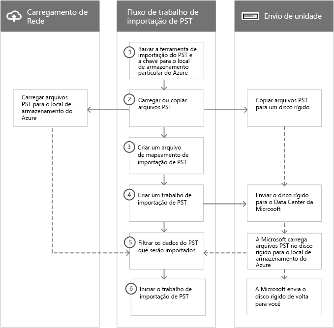

# Visão geral da importação dos arquivos PST da sua organização para o Office 365Overview of importing your organization's PST files to Office 365

> [!NOTE]
> Este artigo é para administradores.This article is for administrators. Você está tentando importar arquivos PST para sua própria caixa de correio?Are you trying to import PST files to your own mailbox? Confira [Importar emails, contatos e calendário de um arquivo .pst do Outlook](https://go.microsoft.com/fwlink/p/?LinkID=785075)See [Import email, contacts, and calendar from an Outlook .pst file](https://go.microsoft.com/fwlink/p/?LinkID=785075)

Você pode usar o serviço de importação no Centro de Conformidade e Segurança para importar arquivos PST em massa rapidamente para as caixas de correio do Exchange Online em sua organização do Office 365.You can use the Import service in the Security & Compliance Center to quickly bulk-import PST files to Exchange Online mailboxes in your Office 365 organization. Há duas maneiras de importar arquivos PST para o Office 365:There are two ways you can import PST files to Office 365:

- **Carregamento de rede**  - Carrega os arquivos PST pela rede para um local temporário de Armazenamento do Azure na nuvem da Microsoft.**Network upload**  - Upload the PST files over the network to a temporary Azure Storage location in the Microsoft cloud. Em seguida, use o serviço de importação do Office 365 para importar os dados PST para as caixas de correio na sua organização do Office 365.Then you use the Office 365 Import service to import the PST data to mailboxes in your Office 365 organization. 

- **Envio de Unidade**  - Copia os arquivos PST em uma unidade de disco rígido e, em seguida, envia essa unidade fisicamente para a Microsoft.**Drive shipping**  - Copy the PST files to a BitLocker-encrypted hard drive and then physically ship the drive to Microsoft. Quando a Microsoft recebe o disco rígido, a equipe do data center carrega os dados para um local temporário de Armazenamento do Azure na nuvem da Microsoft.When Microsoft receives the hard drive, data center personnel upload the data to a temporary Azure Storage location in the Microsoft cloud. Em seguida, use o serviço de importação do Office 365 para importar os dados para as caixas de correio na sua organização do Office 365.Then you use the Office 365 Import service to import the data to mailboxes in your Office 365 organization.

## Instruções passo a passoStep-by-step instructions
  
Confira um dos tópicos a seguir para obter instruções detalhadas, passo a passo, para importar arquivos PST da sua organização para o Office 365.See one of the following topics for detailed, step-by-step instructions for bulk-importing your organization's PST files to Office 365. 

- [Usar o carregamento de rede para importar arquivos PST para o Office 365Use network upload to import PST files to Office 365](use-network-upload-to-import-pst-files.md)

- [Usar o envio de unidade para importar os arquivos PST para o Office 365Use drive shipping to import PST files to Office 365](use-drive-shipping-to-import-pst-files-to-office-365.md)

## Como funciona a importação de arquivos PSTHow importing PST files works

Esta é uma ilustração e uma descrição do processo de importação de PST completo.Here's an illustration and description of the complete PST import process. A ilustração mostra o fluxo de trabalho principal e realça as diferenças entre o carregamento de rede e os métodos de envio de unidade.The illustration shows the primary workflow and highlights the differences between the network upload and drive shipping methods.
  

  
1. **Baixar as ferramentas de importação PST e a chave para o local privado de Armazenamento do Azure** - A primeira etapa é baixar a ferramenta e a chave de acesso usadas para carregar os arquivos PST ou copiá-los para um disco rígido.**Download the PST import tools and key to private Azure Storage location** - The first step is to download the tool and access key used to upload the PST files or copy them to a hard drive. Você obtém isso na página **Importar** no Centro de Conformidade e Segurança.You obtain these from the **Import** page in the Security & Compliance Center. A chave fornece a você (ou a equipe de data center da Microsoft em caso de envio de unidades) as permissões necessárias para carregar arquivos PST em um local privado de Armazenamento do Azure.The key provides you (or Microsoft data center personnel in the case of drive shipping) with the necessary permissions to upload PST files to a private and secure Azure Storage location. Essa chave de acesso é exclusiva à sua organização e ajuda a impedir o acesso não autorizado aos seus arquivos PST depois que eles são carregados na nuvem da Microsoft.This access key is unique to your organization and helps prevent unauthorized access to your PST files after they're uploaded to the Microsoft cloud. Observe que importar arquivos PST para o Office 365 não exige que sua organização tenha uma assinatura separada do Azure.Importing PST files to Office 365 doesn't require your organization to have a separate Azure subscription. 
    
2. **Carregue ou copie os arquivos PST** - A próxima etapa depende se você estiver usando o carregamento de rede ou o envio de unidade para importar arquivos PST.**Upload or copy the PST files** - The next step depends on whether you're using network upload or drive shipping to import PST files. Em ambos os casos, você usará a ferramenta e a chave do armazenamento seguro obtida na etapa anterior.In both cases, you'll use the tool and secure storage key that you obtained in the previous step.
    
    - **Carregamento de rede:** a ferramenta AzCopy.exe (baixada na etapa 1) é usada para carregar e armazenar os arquivos PST em um local de armazenamento do Azure na nuvem da Microsoft. **Network upload**The AzCopy.exe tool (downloaded in step 1) is used to upload and store your PST files in an Azure Storage location in the Microsoft cloud. O local de Armazenamento do Azure em que você carrega os arquivos PST está localizado no mesmo datacenter da Microsoft que a organização do Office 365 está.The Azure Storage location that you upload your PST files to resides in the same regional Microsoft datacenter where your Office 365 organization is located.
    
      Para carregá-los, os arquivos PST que você deseja importar para o Office 365 devem estar localizados em um compartilhamento de arquivos ou em um servidor de arquivos em sua organização.To upload them, the PST files that you want to import to Office 365 have to be located in a file share or file server in your organization.
    
    - **Envio de unidades:** a ferramenta WAImportExport.exe (baixada na etapa 1) é usada para copiar os arquivos PST para o disco rígido.**Drive shipping**The WAImportExport.exe tool (downloaded in step 1) is used to copy your PST files to the hard drive. Essa ferramenta criptografa o disco rígido com BitLocker e, em seguida, copia os PSTs para o disco rígido.This tool encrypts the hard drive with BitLocker and then copies the PSTs to the hard drive. Como o carregamento de rede, os arquivos PST que você deseja copiar para o disco rígido devem estar localizados em um compartilhamento de arquivos ou em um servidor de arquivos em sua organização.Like network upload, the PST files that you want to copy to the hard drive have to be located in a file share or file server in your organization.
    
3. **Criar um arquivo de mapeamento de importação de PST** - Depois de carregar os arquivos PST para o local de Armazenamento do Azure ou copiá-los para um disco rígido, a próxima etapa é criar um arquivo de valores separados por vírgula (CSV) que especifica para quais caixas de correio de usuário os arquivos PST serão importados (um arquivo PST pode ser importado para a caixa de correio principal do usuário ou para a caixa de correio de arquivo morto).**Create a PST import mapping file** - After the PST files have been uploaded to the Azure Storage location or copied to a hard drive, the next step is to create a comma-separated value (CSV) file that specifies which user mailboxes the PST files will be imported to (and a PST file can be imported to a user's primary mailbox or their archive mailbox). O serviço de importação do Office 365 usará as informações para importar os arquivos PST.The Office 365 Import service will use the information to import the PST files. 
    
4. **Criar um trabalho de importação PST** - A próxima etapa é criar um trabalho de importação PST na página **Importar arquivos PST** no Centro de Conformidade e Segurança e enviar o arquivo de mapeamento de importação PST criado na etapa anterior.**Create a PST import job** - The next step is to create a PST import job on the **Import PST files** page in the Security & Compliance Center and submit the PST import mapping file created in the previous step. Para carregamento de rede (como os arquivos PST foram carregados para o Azure), o Office 365 analisa os dados nos arquivos PST e oferece a você a oportunidade de definir filtros que controlam quais dados serão importados para as caixas de correio especificadas no arquivos de mapeamento de importação de PST.For network upload (because the PST files have been uploaded to Azure) Office 365 analyzes the data in the PST files and then gives you an opportunity to set filters that control what data actually gets imported to the mailboxes specified in the PST import mapping file. 
    
    Para o envio de unidades, algumas coisas adicionais acontecem neste momento do processo.For drive shipping, a few additional things happen at this point in the process.
    
    - Você envia fisicamente o disco rígido para um data center da Microsoft (o endereço de envio para o data center da Microsoft é exibido quando o trabalho de importação é criado).You physically ship the hard drive to a Microsoft data center (the shipping address for the Microsoft data center is displayed when the import job is created).
    
    - Quando a Microsoft recebe o disco rígido, a equipe do data center carregará os arquivos PST no disco rígido para o local de Armazenamento do Azure da sua organização.When Microsoft receives the hard drive, data center personnel will upload the PST files on the hard drive to the Azure Storage location for your organization. Como explicado anteriormente, os arquivos PST são carregados em um local de Armazenamento do Azure que está localizado no mesmo datacenter regional da Microsoft em que a organização do Office 365 está.As previously explained, your PST files are uploaded to a Azure Storage location that resides in the same regional Microsoft datacenter where your Office 365 organization is located.
    
      > [!NOTE]
      > Os arquivos PST do disco rígido são carregados para o Azure dentro de sete a 10 dias úteis, depois que a Microsoft recebe o disco rígido.The PST files on the hard drive are uploaded to Azure within 7 to 10 business days after Microsoft receives the hard drive.

      Assim como o processo de carregamento de rede, o Office 365 analisa os dados dos arquivos PST e oferece a oportunidade de definir filtros que controlam quais dados serão importados para as caixas de correio especificadas no arquivo de mapeamento de importação de PST.Like the network upload process, Office 365 then analyzes the data in the PST files and gives you an opportunity to set filters that control what data actually gets imported to the mailboxes specified in the PST import mapping file.
    
    - A Microsoft envia o disco rígido de volta para você.Microsoft ships the hard drive back to you.
    
5. **Filtrar os dados PST que serão importados para as caixas de correio** - Depois que o trabalho de importação é criado (e depois que os arquivos PST de um serviço de envio de unidade são carregados no local de Armazenamento do Azure), o Office 365 analisa os dados nos arquivos PST (de forma segura) identificando a idade dos itens e os diferentes tipos de mensagens incluídas nos arquivos PST.**Filter the PST data that will be imported to mailboxes** - After the import job is created (and after the PST files from a drive shipping job are uploaded to the Azure Storage location) Office 365 analyzes the data in the PST files (safely and securely) by identifying the age of the items and the different message types included in the PST files. Quando esta análise for concluída e os dados estiverem prontos para importação, você terá a opção de importar todos os dados contidos nos arquivos PST ou cortar os dados que serão importados configurando filtros para controlar quais dados serão importados.When the analysis is completed and the data is ready to import, you have the option to import all the data contained in the PST files or you can trim the data that's imported by setting filters that control what data gets imported. 
    
6. **Iniciar o trabalho de importação de PST** - Depois que o trabalho de importação é iniciado, o Office 365 usa as informações do arquivo de mapeamento de importação PST para importar os arquivos PSTs do local de armazenamento do Azure para as caixas de correio de usuário.**Start the PST import job** - After the import job is started, Office 365 uses the information in the PST import mapping file to import the PSTs files from the he Azure Storage location to user mailboxes. Informações de status sobre o trabalho de importação (incluindo informações sobre cada arquivo PST que está sendo importado) são exibidas na página **Importar arquivos PST** no Centro de Conformidade e Segurança.Status information about the import job (including information about each PST file being imported) is displayed on the **Import PST files** page in the Security & Compliance Center. Quando o trabalho de importação for concluído, o status do trabalho será definido como **Concluído**. When the import job is finished, the status for the job is set to **Complete**.
  
## Por que importar dados de email para o Office 365?Why import email data to Office 365?

- É uma boa maneira de importar os dados de mensagens de arquivamento da sua organização para o Office 365.It's a good way to import your organization's archival messaging data to Office 365.
    
- Você pode usar o recurso de [Importação Inteligente](filter-data-when-importing-pst-files.md) para filtrar os itens nos arquivos PST que são importados para as caixas de correio de destino.You can use the [Intelligent Import](filter-data-when-importing-pst-files.md) feature to filter the items in PST files that actually get imported to the target mailboxes. Isso permite que você corte os dados que são importados configurando filtros que controlam quais dados serão importados.This lets you trim the data that's imported by setting filters that control what data gets imported. 
    
- Importar dados de email para o Office 365 ajuda a atender às necessidades de conformidade da organização, permitindo:Importing email data to Office 365 helps address compliance needs of your organization by letting you:
    
  - Habilitar as [caixas de correio de arquivo morto](enable-archive-mailboxes.md) e [arquivamento ilimitado](unlimited-archiving.md) para conceder aos usuários mais espaço de armazenamento de caixa de correio.Enable [archive mailboxes](enable-archive-mailboxes.md) and [unlimited archiving](unlimited-archiving.md) to give users additional mailbox storage space. 
    
  - Colocar as caixas de correio em [Retenção de Litígio](https://go.microsoft.com/fwlink/?linkid=841243) para reter conteúdo.Place mailboxes on [Litigation Hold](https://go.microsoft.com/fwlink/?linkid=841243) to retain content. 
    
  - Usar a [ferramenta de Pesquisa de Conteúdo](content-search.md) para pesquisar conteúdo de caixa de correio.Use the [Content Search tool](content-search.md) to search for mailbox content. 
    
  - Usar os [casos de Descoberta Eletrônica](ediscovery-cases.md) para gerenciar as investigações jurídicas de sua organização.Use [eDiscovery cases](ediscovery-cases.md) to manage your organization's legal investigations 
    
  - Usar as [políticas de retenção](retention-policies.md) no Centro de Conformidade e Segurança para controlar por quanto tempo o conteúdo da caixa de correio fica retido e, em seguida, exclua o conteúdo depois que o período de retenção expirar.Use [retention policies](retention-policies.md) in the Security & Compliance Center to control how long mailbox content is retained, and then delete content after the retention period expires. 

  - Usar [Políticas de conformidade de comunicação](communication-compliance.md) para examinar as mensagens e se certificar que elas estão em conformidade com os padrões de mensagem e adicionar um tipo de classificação.Use [Communication compliance policies](communication-compliance.md) to examine messages to make sure they are compliant with message standards and add a classification type.
    
- Importar dados para o Office 365 ajuda na proteção contra a perda de dados.Importing data to Office 365 helps protect against data loss. Os dados de email importados para o Office 365 herdam recurso de alta disponibilidade do Exchange Online.Email data that's imported to Office 365 inherits the high availability features of Exchange Online.
    
- Os dados de email no Office365 ficam disponíveis para os usuários em todos os dispositivos, já que são armazenados na nuvem.Email data in Office 365 is available to users from all devices because it's stored in the cloud.
    
## Importar dados do SharePoint para o Office 365Importing SharePoint data to Office 365

É possível também importar arquivos e documentos para os sites do SharePoint e contas do OneDrive na sua organização do Office 365.You can also import files and documents to SharePoint sites and OneDrive accounts in your Office 365 organization. Para saber mais, confira os seguintes artigos:For more information, see the following articles:

- [Migrar para o SharePoint OnlineMigrate to SharePoint Online](https://docs.microsoft.com/sharepointmigration/migrate-to-sharepoint-online)

- [Apresentando a Ferramenta de Migração do SharePointIntroducing the SharePoint Migration Tool](https://docs.microsoft.com/sharepointmigration/introducing-the-sharepoint-migration-tool)

- [Migrar para o SharePoint Online usando o Windows PowerShellMigrate to SharePoint Online using PowerShell](https://docs.microsoft.com/sharepointmigration/overview-spmt-ps-cmdlets)

- [Migrar o conteúdo do compartilhamento de arquivo para o SharePoint Online usando o Azure Data BoxMigrate your file share content to SharePoint Online using the Azure Data Box](https://docs.microsoft.com/sharepointmigration/how-to-migrate-file-share-content-to-spo-using-azuredatabox)

## Perguntas frequentes sobre a importação de arquivos PST para o Office 365Frequently asked questions about importing PST files to Office 365
  
Para ver perguntas frequentes sobre o uso do serviço de importação do Office 365 para importar arquivos PST em massa às caixas de correio do Office 365.Here are some frequently asked questions about using the Office 365 Import service to bulk-import PST files to Office 365 mailboxes. 
  
- [Usar o carregamento de rede para importar arquivos PSTUsing network upload to import PST files](#using-network-upload-to-import-pst-files)
  
- [Usar a entrega de unidade para importar arquivos PSTUsing drive shipping to import PST files](#using-drive-shipping-to-import-pst-files)
  
### Usar o carregamento de rede para importar arquivos PSTUsing network upload to import PST files

 **Quais permissões são necessárias para criar trabalhos de importação no serviço de importação do Office 365?****What permissions are required to create import jobs in the Office 365 Import Service?**
  
Você deve ter a função Exportação Importação da Caixa de Correio no Exchange Online para importar arquivos PST para as caixas de correio do Office 365.You have to be assigned the Mailbox Import Export role in Exchange Online to import PST files to Office 365 mailboxes. Por padrão, essa função não é atribuída a nenhum grupo de funções no Exchange Online.By default, this role isn't assigned to any role group in Exchange Online. Você pode adicionar a função Importação e Exportação de Caixa de Correio no grupo de função Gerenciamento da Organização.You can add the Mailbox Import Export role to the Organization Management role group. Ou pode criar um novo grupo de funções, atribuir a função Exportação Importação da Caixa de Correio e adicionar a si mesmo ou outros usuários como membros.Or you can create a new role group, assign the Mailbox Import Export role, and then add yourself or other users as a member. Para mais informações, confira as seções “Adicionar uma função a um grupo de funções” ou “Criar um grupo de funções” em [Gerenciar grupos de funções no Exchange Online](https://go.microsoft.com/fwlink/p/?LinkId=730688).For more information, see the "Add a role to a role group" or the "Create a role group" sections in [Manage role groups in Exchange Online](https://go.microsoft.com/fwlink/p/?LinkId=730688).
  
Além disso, para criar trabalhos de importação no Centro de Conformidade e Segurança, uma das alternativas a seguir deve ser verdadeira:Additionally, to create import jobs in the Security & Compliance Center, one of the following must be true:
  
- Você precisa ter a função Destinatários de email no Exchange Online.You have to be assigned the Mail Recipients role in Exchange Online. Por padrão, essa função é atribuída aos grupos de funções Gerenciamento da Organização e Gerenciamento de Destinatários.By default, this role is assigned to the Organization Management and Recipient Management roles groups.

    OuOr
    
- Você precisa ser um administrador global na sua organização do Office 365.You have to be a global administrator in your Office 365 organization.

> [!TIP]
> Considere a criação de um novo grupo de função no Exchange Online destinado especificamente a importar os arquivos PST para o Office 365.Consider creating a new role group in Exchange Online that's specifically intended for importing PST files to Office 365. Para o nível mínimo de privilégios necessários para importar os arquivos PST, atribua as funções de Exportação Importação de Caixa de Correio e Destinatários de email ao novo grupo de função e, em seguida, adicione membros.For the minimum level of privileges required to import PST files, assign the Mailbox Import Export and Mail Recipients roles to the new role group, and then add members. 
  
 **Onde o carregamento de rede está disponível?****Where is network upload available?**
  
O carregamento de rede está disponível nos Estados Unidos, Canadá, Brasil, Reino Unido, Europa, Índia, Leste Asiático, Sudeste Asiático, Japão, República da Coreia e Austrália. O carregamento de rede estará disponível para mais regiões em breve.Network upload is currently available in the United States, Canada, Brazil, the United Kingdom, Europe, India, East Asia, Southeast Asia, Japan, Republic of Korea, and Australia. Network upload will be available in more regions soon.
  
 **Qual é o custo de importação dos arquivos PST usando o carregamento de rede?****What is the pricing for importing PST files by using network upload?**
  
Using network upload to import PST files is free.Using network upload to import PST files is free.
  
Isso também significa que depois que os arquivos PST forem excluídos da área de Armazenamento do Azure, eles não serão mais exibidos na lista de arquivos de um trabalho de importação concluído no centro de administração do Microsoft 365.This also means that after PST files are deleted from the Azure Storage area, they're no longer displayed in the list of files for a completed import job in the Microsoft 365 admin center. Embora um trabalho de importação ainda possa estar listado na página **Importar dados para o Office 365**, a lista de arquivos PST pode estar vazia quando você exibir os detalhes de trabalhos de importação anteriores.Although an import job might still be listed on the **Import data to Office 365** page, the list of PST files might be empty when you view the details of older import jobs.
  
 **Qual versão do formato de arquivo PST é compatível com a importação para o Office 365?****What version of the PST file format is supported for importing to Office 365?**
  
Há duas versões do formato de arquivo PST: ANSI e Unicode.There are two versions of the PST file format: ANSI and Unicode. Recomendamos importar arquivos que usem o formato de arquivo PST Unicode.We recommend importing files that use the Unicode PST file format. No entanto, os arquivos que utilizam o formato de arquivo PST ANSI, como aqueles para linguagens que utilizam um conjunto de caracteres de bytes duplos (DBCS), também podem ser importados para o Office 365.However, files that use the ANSI PST file format, such as those for languages that use a double-byte character set (DBCS), can also be imported to Office 365. Para obter mais informações sobre como importar arquivos PST ANSI, confira a Etapa 4 em [Usar o carregamento de rede para importar arquivos PST para o Office 365](https://go.microsoft.com/fwlink/p/?LinkId=823074).For more information about importing ANSI PST files, see Step 4 in [Use network upload to import PST files to Office 365](https://go.microsoft.com/fwlink/p/?LinkId=823074).
  
Além disso, os arquivos PST do Outlook 2007 e versões posteriores podem ser importados para o Office 365.Additionally, PST files from Outlook 2007 and later versions can be imported to Office 365.
  
 **Depois de carregar meus arquivos PST para a área de Armazenamento do Azure, quanto tempo eles serão mantidos no Azure até serem excluídos?****After I upload my PST files to the Azure Storage area, how long are they kept in Azure before they're deleted?**
  
Quando você usar o método de carregamento de rede para importar arquivos PST, carregue-os para um contêiner de blobs chamado **ingestiondata**.When you use the network upload method to import PST files, you upload them to an Azure blob container named **ingestiondata**. Se não houver trabalhos de importação em andamento na página **Importar arquivos PST** no Centro de Conformidade e Segurança, todos os arquivos PST no contêiner **ingestiondata** no Azure serão excluídos 30 dias após a criação do trabalho de importação mais recente no Centro de Conformidade e Segurança.If there are no import jobs in progress on the **Import PST files** page in the Security & Compliance Center), then all PST files in the **ingestiondata** container in Azure are deleted 30 days after the most recent import job was created in the Security & Compliance Center. Isso também significa que você precisar criar um novo trabalho de importação no Centro de Conformidade e Segurança (descrito na etapa 5 nas instruções de carregamento de rede) dentro de 30 dias do carregamento de arquivos PST para o Azure.That also means you have to create a new import job in the Security & Compliance Center (described in Step 5 in the network upload instructions) within 30 days of uploading PST files to Azure.
  
Isso também significa que depois que os arquivos PST forem excluídos da área de Armazenamento do Azure, eles não serão mais exibidos na lista de arquivos de um trabalho de importação concluído no Centro de Conformidade e Segurança.This also means that after PST files are deleted from the Azure Storage area, they're no longer displayed in the list of files for a completed import job in the Security & Compliance Center. Embora um trabalho de importação ainda possa estar listado na página **Importar arquivos PST** no Centro de Conformidade e Segurança, a lista de arquivos PST pode estar vazia quando você exibir os detalhes de trabalhos de importação anteriores.Although an import job might still be listed on the **Import PST files** page in the Security & Compliance Center, the list of PST files might be empty when you view the details of older import jobs.
  
 **Quanto tempo é necessário para importar um arquivo PST para uma caixa de correio?****How long does it take to import a PST file to a mailbox?**
  
Isso depende da capacidade da sua rede, mas normalmente cada terabyte (TB) leva várias horas para ser carregado para a área de Armazenamento do Azure da sua organização.It depends on the capacity of your network, but it typically takes several hours for each terabyte (TB) of data to be uploaded to the Azure Storage area for your organization. Após copiar os arquivos PST para a área de Armazenamento do Azure, um arquivo PST é importado para uma caixa de correio do Office 365 a uma taxa de pelo menos 24 GB por dia.After the PST files are copied to the Azure Storage area, a PST file is imported to an Office 365 mailbox at a rate of at least 24 GB per day. Se essa taxa não atender às suas necessidades, considere outros métodos para obter dados de email para o Office 365.If this rate doesn't meet your needs, you might consider other methods to get email data into Office 365. Para saber mais, confira o artigo [Formas de migrar várias contas de email para o Office 365](https://docs.microsoft.com/Exchange/mailbox-migration/mailbox-migration).For more information, see [Ways to migrate multiple email accounts to Office 365](https://docs.microsoft.com/Exchange/mailbox-migration/mailbox-migration).
  
Quando diferentes arquivos PST são importados para diferentes caixas de correio de destino, o processo de importação ocorre em paralelo; em outras palavras, cada par PST/caixa de correio é importado simultaneamente.If different PST files are imported to different target mailboxes, the import process occurs in parallel; in other words, each PST/mailbox pair is imported simultaneously. Da mesma maneira, quando vários arquivos PST são importados para a mesma caixa de correio, eles são importados simultaneamente.Likewise, if multiple PST files are imported to the same mailbox, they will be simultaneously imported.
  
 **Há um limite de tamanho de mensagem ao importar arquivos PST?****Is there a message size limit when importing PST files?**
  
Sim.Yes. Quando um arquivo PST inclui um item de caixa de correio com mais de 150 MB, o item é ignorado durante o processo de importação.If a PST file contains a mailbox item that is larger than 150 MB, the item will be skipped during the import process.
  
 **As propriedades da mensagem, como quando a mensagem foi enviada ou recebida, a lista de destinatários e outras propriedades, são mantidas quando os arquivos PST são importados para uma caixa de correio do Office 365?****Are message properties, such as when the message was sent or received, the list of recipients and other properties, preserved when PST files are imported to an Office 365 mailbox?**
  
Sim.Yes. Os metadados da mensagem original não são alterados durante o processo de importação.The original message metadata isn't changed during the import process.
  
 **Há um limite para o número de níveis em uma hierarquia de pastas de um arquivo PST que quero importar para uma caixa de correio?****Is there a limit to the number of levels in a folder hierarchy for a PST file that I want to import to a mailbox?**
  
Sim. Não é possível importar um arquivo PST com 300 ou mais níveis de pastas aninhadas.Yes. You can't import a PST file that has 300 or more levels of nested folders.
  
 **Posso usar o carregamento de rede para importar arquivos PST para uma caixa de correio inativa no Office 365?****Can I use network upload to import PST files to an inactive mailbox in Office 365?**
  
Sim, esse recurso já está disponível.Yes, this capability is now available.
  
 **Posso usar o carregamento de rede para importar arquivos PST para uma caixa de correio de arquivo morto online em uma implantação híbrida do Exchange?****Can I use network upload to import PST files to an online archive mailbox in an Exchange hybrid deployment?**
  
Sim, esse recurso já está disponível. Yes, this capability is now available.
  
 **Posso usar o carregamento de rede para importar arquivos PST para pastas públicas no Exchange Online?****Can I use network upload to import PST files to public folders in Exchange Online?**
  
Não. Não é possível importar arquivos PST para pastas públicas.No, you can't import PST files to public folders.
  
### Usar a entrega de unidade para importar arquivos PSTUsing drive shipping to import PST files

 **Quais permissões são necessárias para criar trabalhos de importação no serviço de importação do Office 365?****What permissions are required to create import jobs in the Office 365 Import Service?**
  
Você deve ter a função Importação Exportação da Caixa de Correio para importar arquivos PST para as caixas de correio do Office 365.You have to be assigned the Mailbox Import Export role to import PST files to Office 365 mailboxes. Por padrão, essa função não é atribuída a nenhum grupo de funções no Exchange Online.By default, this role isn't assigned to any role group in Exchange Online. Você pode adicionar a função Importação e Exportação de Caixa de Correio no grupo de função Gerenciamento da Organização.You can add the Mailbox Import Export role to the Organization Management role group. Ou pode criar um novo grupo de funções, atribuir a função Exportação Importação da Caixa de Correio e adicionar a si mesmo ou outros usuários como membros.Or you can create a new role group, assign the Mailbox Import Export role, and then add yourself or other users as a member. Para mais informações, confira as seções “Adicionar uma função a um grupo de funções” ou “Criar um grupo de funções” em [Gerenciar grupos de funções no Exchange Online](https://go.microsoft.com/fwlink/p/?LinkId=730688).For more information, see the "Add a role to a role group" or the "Create a role group" sections in [Manage role groups in Exchange Online](https://go.microsoft.com/fwlink/p/?LinkId=730688).
  
Além disso, para criar trabalhos de importação no Centro de Conformidade e Segurança, uma das alternativas a seguir deve ser verdadeira:Additionally, to create import jobs in the Security & Compliance Center, one of the following must be true:
  
- Você precisa ter a função Destinatários de email no Exchange Online.You have to be assigned the Mail Recipients role in Exchange Online. Por padrão, essa função é atribuída aos grupos de funções Gerenciamento da Organização e Gerenciamento de Destinatários.By default, this role is assigned to the Organization Management and Recipient Management roles groups.
    
    OuOr
    
- Você precisa ser um administrador global na sua organização do Office 365.You have to be a global administrator in your Office 365 organization.
    
> [!TIP]
> Considere a criação de um novo grupo de função no Exchange Online destinado especificamente a importar os arquivos PST para o Office 365.Consider creating a new role group in Exchange Online that's specifically intended for importing PST files to Office 365. Para o nível mínimo de privilégios necessários para importar os arquivos PST, atribua as funções de Exportação Importação de Caixa de Correio e Destinatários de email ao novo grupo de função e, em seguida, adicione membros.For the minimum level of privileges required to import PST files, assign the Mailbox Import Export and Mail Recipients roles to the new role group, and then add members. 
  
 **Onde o envio de unidade está disponível?****Where is drive shipping available?**
  
No momento, o envio de unidades está disponível nas seguintes regiões: Austrália, Brasil, Canadá, Estados Unidos, Europa, Índia, Japão, Leste Asiático, Sudeste Asiático, Reino Unido e República da Coreia.Drive shipping is currently available in the United States, Canada, Brazil, the United Kingdom, Europe, India, East Asia, Southeast Asia, Japan, Republic of Korea, and Australia. O envio de unidades estará disponível para mais regiões em breve.Drive shipping will be available in more regions soon.
  
 **Quais contratos de licenciamento comercial dão suporte ao envio de unidade?****What commercial licensing agreements support drive shipping?**
  
O envio de unidade para importar arquivos PST para o Office 365 está disponível por meio de um Contrato Enterprise (EA) da Microsoft.Drive shipping to import PST files to Office 365 is available through a Microsoft Enterprise Agreement (EA). O envio de unidade não está disponível por meio de um Contrato de Produtos e Serviços da Microsoft (MPSA).Drive shipping isn't available through a Microsoft Products and Services Agreement (MPSA).
  
 **Qual é o custo para usar o envio de unidade para importar arquivos PST para o Office 365?****What is the pricing for using drive shipping to import PST files to Office 365?**
  
O custo para usar o envio de unidade para importar arquivos PST para caixas de correio do Office 365 é de US$ 2 por GB de dados.The cost to use drive shipping to import PST files to Office 365 mailboxes is $2 USD per GB of data. Por exemplo, se você enviar um disco rígido contendo 1.000 GB (1 TB) de arquivos PST, o custo será de US$ 2.000.For example, if you ship a hard drive that contains 1,000 GB (1 TB) of PST files, the cost is $2,000 USD. Você pode trabalhar com um parceiro para pagar a taxa de importação.You can work with a partner to pay the import fee. Para obter mais informações sobre como encontrar um parceiro, confira [Encontrar seu parceiro ou revendedor do Office 365](https://go.microsoft.com/fwlink/p/?LinkId=785197).For information about finding a partner, see [Find your Office 365 partner or reseller](https://go.microsoft.com/fwlink/p/?LinkId=785197).
  
 **Que tipos de discos rígidos têm suporte para o envio de unidade?****What kind of hard drives are supported for drive shipping?**
  
Somente as unidades de estado sólido (SSDs) de 2,5 polegadas ou discos rígidos internos SATA II/III de 2,5 ou 3,5 polegadas são compatíveis para o uso com o serviço de Importação do Office 365.Only 2.5 inch solid-state drives (SSDs) or 2.5 inch or 3.5 inch SATA II/III internal hard drives are supported for use with the Office 365 Import service. Use discos rígidos de até 10 TB.You can use hard drives up to 10 TB. Para trabalhos de importação, somente o primeiro volume de dados do disco rígido será processado.For import jobs, only the first data volume on the hard drive will be processed. O volume de dados deve ser formatado com NTFS.The data volume must be formatted with NTFS. Ao copiar dados para um disco rígido, é possível anexá-los diretamente usando um SSD de 2,5 polegadas ou um conector SATA II/III de 2,5 ou 3,5 polegadas, ou pode ainda anexá-lo externamente usando um SSD externo de 2,5 polegadas ou um adaptador USB SATA II/III de 2,5 ou 3,5 polegadas.When copying data to a hard drive, you can attach it directly using a 2.5 inch SSD or 2.5 inch or 3.5 inch SATA II/III connector or you can attach it externally using an external 2.5 inch SSD or 2.5 inch or 3.5 inch SATA II/III USB adaptor.
  
> [!IMPORTANT]
> As unidades de disco rígido com um adaptador USB interno não são compatíveis com o serviço de importação do Office 365.External hard drives that come with an built-in USB adaptor aren't supported by the Office 365 Import service. Além disso, o disco dentro da caixa do disco rígido externo não pode ser utilizado.Additionally, the disk inside the casing of an external hard drive can't be used. Não remova discos rígidos externos.Please don't ship external hard drives. 
  
 **Quantas unidades de disco rígido posso enviar para um único trabalho de importação?****How many hard drives can I ship for a single import job?**
  
Você pode enviar no máximo 10 discos rígidos para um único trabalho de importação.You can ship a maximum of 10 hard drives for a single import job.
  
 **Após o envio do meu disco rígido, quanto tempo ele leva para chegar ao data center da Microsoft?****After I ship my hard drive, how long does it take to get to the Microsoft data center?**
  
Isso depende de alguns pontos, como da sua proximidade com o data center da Microsoft e com o tipo de opção de envio utilizada para enviar o seu disco rígido (como, entrega no próximo dia, entrega em dois dias ou entrega em tempo normal). Com a maioria das transportadoras, é possível usar o número de rastreamento para acompanhar o status da entrega.That depends on a few things, such as your proximity to the Microsoft data center and what kind of shipping option you used to ship your hard drive (such as, next-day delivery, two-day delivery, or ground-delivery). With most shippers, you can use the tracking number to track the status of your delivery.
  
 **Depois que meu disco rígido chegar ao data center da Microsoft, quanto tempo será necessário para carregar meus arquivos PST para o Azure?****After my hard drive arrives at the Microsoft data center, how long does it take to upload my PST files to Azure?**
  
Depois que seu disco rígido for recebido no data center da Microsoft, serão necessários de 7 a 10 dias úteis para carregar os arquivos PST na local de Armazenamento do Azure da sua organização.After your hard drive is received at the Microsoft data center, it will take between 7 to 10 business days to upload the PST files to the Azure Storage location for your organization. Os arquivos PST serão carregados para o contêiner de blob do Azure chamado `ingestiondata`.The PST files will be uploaded to an Azure blob container named `ingestiondata`. 
  
 **Quanto tempo é necessário para importar um arquivo PST para uma caixa de correio?****How long does it take to import a PST file to a mailbox?**
  
Depois que os arquivos PST forem carregados na área de Armazenamento do Azure, o Office 365 analisará os dados nos arquivos PST (de forma segura) para identificar a idade dos itens e os diferentes tipos de mensagens incluídos nos arquivos PST.After the PST files are uploaded to the Azure Storage area, Office 365 analyzes the data in the PST files (in a safe and secure manner) to identify the age of the items and the different message types included in the PST files. Quando esta análise for concluída, você terá a opção de importar todos os dados nos arquivos PST ou configurar filtros para controlar quais dados serão importados.When this analysis is complete, you'll have the option to import all the data in the PST files or set filters to that control what data gets imported. Depois de iniciar o trabalho de importação, um arquivo PST será importado para uma caixa de correio do Office 365 a uma taxa de pelo menos 24 GB por dia.After you start the import job, a PST file is imported to an Office 365 mailbox at a rate of at least 24 GB per day. Se essa taxa não atender às suas necessidades, considere outros métodos para obter dados de email para o Office 365.If this rate doesn't meet your needs, you might consider other methods to get email data into Office 365. Para saber mais, confira o artigo [Formas de migrar várias contas de email para o Office 365](https://docs.microsoft.com/Exchange/mailbox-migration/mailbox-migration).For more information, see [Ways to migrate multiple email accounts to Office 365](https://docs.microsoft.com/Exchange/mailbox-migration/mailbox-migration).
  
Quando diferentes arquivos PST são importados para diferentes caixas de correio de destino, o processo de importação ocorre em paralelo; em outras palavras, cada par PST/caixa de correio é importado simultaneamente.If different PST files are imported to different target mailboxes, the import process occurs in parallel; in other words, each PST/mailbox pair is imported simultaneously. Da mesma maneira, quando vários arquivos PST são importados para a mesma caixa de correio, eles são importados simultaneamente.Likewise, if multiple PST files are imported to the same mailbox, they will be simultaneously imported.
  
 **Depois que a Microsoft carregar meus arquivos PST para o Azure, por quanto tempo eles serão mantidos no Azure até serem excluídos?****After Microsoft uploads my PST files to Azure, how long are they kept in Azure before they're deleted?**
  
Todos os arquivos PST, no local de Armazenamento do Azure da sua organização (no contêiner de blob chamado `ingestiondata`), serão excluídos 30 dias depois que o trabalho de importação mais recente tiver sido criado na página **Importar arquivos PST** no Centro de Conformidade e Segurança.All PST files in the Azure Storage location for your organization (in blob container named `ingestiondata`), are deleted 30 days after the most recent import job was created on the **Import PST files** page in the Security & Compliance Center. 
  
Isso também significa que depois que os arquivos PST forem excluídos da área de Armazenamento do Azure, eles não serão mais exibidos na lista de arquivos de um trabalho de importação concluído no Centro de Conformidade e Segurança.This also means that after PST files are deleted from the Azure Storage area, they're no longer displayed in the list of files for a completed import job in the Security & Compliance Center. Embora um trabalho de importação ainda possa estar listado na página **Importar arquivos PST** no Centro de Conformidade e Segurança, a lista de arquivos PST pode estar vazia quando você exibir os detalhes de trabalhos de importação anteriores.Although an import job might still be listed on the **Import PST files** page in the Security & Compliance Center, the list of PST files might be empty when you view the details of older import jobs. 
  
 **Qual versão do formato de arquivo PST é compatível com a importação para o Office 365?****What version of the PST file format is supported for importing to Office 365?**
  
Há duas versões do formato de arquivo PST: ANSI e Unicode.There are two versions of the PST file format: ANSI and Unicode. Recomendamos importar arquivos que usem o formato de arquivo PST Unicode.We recommend importing files that use the Unicode PST file format. No entanto, os arquivos que utilizam o formato de arquivo PST ANSI, como aqueles para linguagens que utilizam um conjunto de caracteres de bytes duplos (DBCS), também podem ser importados para o Office 365.However, files that use the ANSI PST file format, such as those for languages that use a double-byte character set (DBCS), can also be imported to Office 365. Para obter mais informações sobre como importar arquivos PST ANSI, confira a Etapa 3 em [Usar o envio de unidade para importar arquivos PST para o Office 365](use-drive-shipping-to-import-pst-files-to-office-365.md#step-3-create-the-pst-import-mapping-file).For more information about importing ANSI PST files, see Step 3 in [Use drive shipping to import your organization PST files to Office 365](use-drive-shipping-to-import-pst-files-to-office-365.md#step-3-create-the-pst-import-mapping-file).
  
Além disso, os arquivos PST do Outlook 2007 e versões posteriores podem ser importados para o Office 365.Additionally, PST files from Outlook 2007 and later versions can be imported to Office 365.
  
 **Há um limite de tamanho de mensagem ao importar arquivos PST?****Is there a message size limit when importing PST files?**
  
Sim.Yes. Quando um arquivo PST inclui um item de caixa de correio com mais de 150 MB, o item é ignorado durante o processo de importação.If a PST file contains a mailbox item that is larger than 150 MB, the item will be skipped during the import process.
  
 **As propriedades da mensagem, como quando a mensagem foi enviada ou recebida, a lista de destinatários e outras propriedades, são mantidas quando os arquivos PST são importados para uma caixa de correio do Office 365?****Are message properties, such as when the message was sent or received, the list of recipients and other properties, preserved when PST files are imported to an Office 365 mailbox?**
  
Sim.Yes. Os metadados da mensagem original não são alterados durante o processo de importaçãoThe original message metadata isn't changed during the import process
  
 **Há um limite para o número de níveis em uma hierarquia de pastas de um arquivo PST que quero importar para uma caixa de correio?****Is there a limit to the number of levels in a folder hierarchy for a PST file that I want to import to a mailbox?**
  
Sim. Não é possível importar um arquivo PST com 300 ou mais níveis de pastas aninhadas.Yes. You can't import a PST file that has 300 or more levels of nested folders.
  
 **Posso usar o envio de unidade para importar arquivos PST para uma caixa de correio inativa no Office 365?****Can I use drive shipping to import PST files to an inactive mailbox in Office 365?**
  
Sim, esse recurso já está disponível.Yes, this capability is now available.
  
 **Posso usar o envio de unidade para importar arquivos PST para uma caixa de correio de arquivo morto online em uma implantação híbrida do Exchange?****Can I use drive shipping to import PST files to an online archive mailbox in an Exchange hybrid deployment?**
  
Sim, esse recurso já está disponível. Yes, this capability is now available.
  
 **Posso usar o envio de unidade para importar arquivos PST para pastas públicas no Exchange Online?****Can I use drive shipping to import PST files to public folders in Exchange Online?**
  
Não. Não é possível importar arquivos PST para pastas públicas.No, you can't import PST files to public folders.
  
 **A Microsoft pode apagar meu disco rígido antes de enviá-lo de volta para mim?****Can Microsoft wipe my hard drive before they ship it back to me?**
  
Não, a Microsoft não pode apagar discos rígidos antes de enviá-los de volta aos clientes. Os discos rígidos são devolvidos no mesmo estado em que estavam quando foram recebidos pela Microsoft.No, Microsoft can't wipe hard drives before shipping them back to customers. Hard drives are returned to you in the same state they were in when they were received by Microsoft.
  
 **A Microsoft pode destruir meu disco rígido em vez de enviá-lo de volta para mim?****Can Microsoft shred my hard drive instead of shipping it back to me?**
  
Não, a Microsoft não pode destruir seu disco rígido. Os discos rígidos são devolvidos no mesmo estado em que estavam quando foram recebidos pela Microsoft.No, Microsoft can't destroy your hard drive. Hard drives are returned to you in the same state they were in when they were received by Microsoft.
  
 **Quais serviços de entrega têm suporte para a remessa de devolução?****What courier services are supported for return shipping?**
  
Se você estiver nos Estados Unidos ou na Europa, a Microsoft utilizará a FedEx para a devolução do seu disco rígido. Para todas as demais regiões, a Microsoft utilizará a DHL.If you're a customer in the United States or Europe, Microsoft uses FedEx to return your hard drive. For all other regions, Microsoft uses DHL.
  
 **Quais são os custos da remessa de devolução?****What are the return shipping costs?**
  
Os custos da remessa de devolução variam, dependendo da sua proximidade em relação ao data center da Microsoft para o qual você enviou o seu disco rígido. A Microsoft cobrará o valor cobrado pela FedEx ou DHL para a devolução do seu disco rígido. O custo para a remessa de devolução é de sua responsabilidade.Return shipping costs vary, depending on your proximity to the Microsoft data center that you shipped your hard drive to. Microsoft will bill your FedEx or DHL account to return your hard drive. The cost of return shipping is your responsibility.
  
 \*\* Posso usar um serviço de entrega personalizado, como a Remessa Personalizada da FedEx, para enviar meu disco rígido à Microsoft? \*\***Can I use a custom courier shipping service, such as FedEx Custom Shipping, to ship my hard drive to Microsoft?**
  
Sim.Yes.
  
 **Se eu tiver que enviar meu disco rígido para outro país, há algo que precise ser feito?****If I have to ship my hard drive to another country, is there anything I need to do?**
  
O disco rígido que você enviará para a Microsoft terá talvez que cruzar fronteiras internacionais. Se esse for o caso, você é responsável por garantir que o disco rígido e os dados contidos nele sejam importados e/ou exportados de acordo com a legislação aplicável. Antes de enviar um disco rígido, verifique com seu consultores se a unidade e os dados podem ser legalmente enviados para o centro de dados especificado da Microsoft. Isso ajudará a garantir que ele chegue à Microsoft em tempo hábil.The hard drive that you ship to Microsoft might have to cross international borders. If this is the case, you're responsible for ensuring that the hard drive and the data it contains are imported and/or exported in accordance with the applicable laws. Before shipping a hard drive, check with your advisors to verify that your drive and data can legally be shipped to the specified Microsoft data center. This will help to ensure that it reaches Microsoft in a timely manner.
