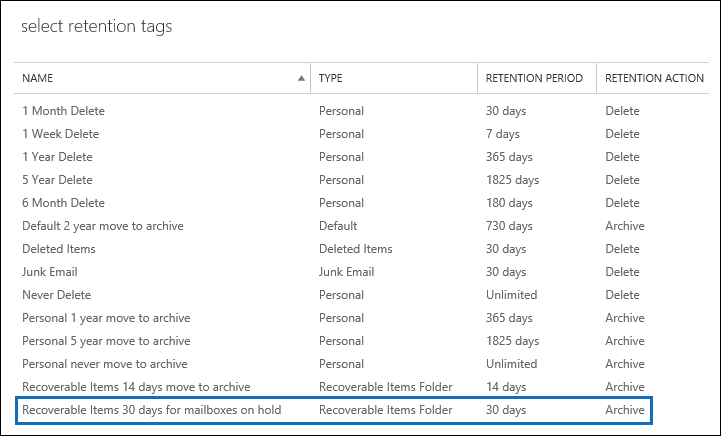

# <a name="increase-the-recoverable-items-quota-for-mailboxes-on-hold"></a><span data-ttu-id="3b6e0-103">Aumentar a cota de Itens Recuperáveis para caixas de correio em espera</span><span class="sxs-lookup"><span data-stu-id="3b6e0-103">Increase the Recoverable Items quota for mailboxes on hold</span></span>

<span data-ttu-id="3b6e0-104">A política de retenção padrão do Exchange, denominada *política de MRM padrão* , que é aplicada automaticamente às novas caixas de correio no Exchange Online contém uma marca de retenção denominada itens recuperáveis 14 dias para o arquivo morto.</span><span class="sxs-lookup"><span data-stu-id="3b6e0-104">The default Exchange retention policy—named *Default MRM Policy* —that is automatically applied to new mailboxes in Exchange Online contains a retention tag named Recoverable Items 14 days move to archive.</span></span> <span data-ttu-id="3b6e0-105">Essa marca de retenção move itens da pasta itens recuperáveis na caixa de correio principal do usuário para a pasta itens recuperáveis na caixa de correio de arquivo morto do usuário depois que o período de retenção de 14 dias expira para um item.</span><span class="sxs-lookup"><span data-stu-id="3b6e0-105">This retention tag moves items from the Recoverable Items folder in the user's primary mailbox to the Recoverable Items folder in the user's archive mailbox after the 14-day retention period expires for an item.</span></span> <span data-ttu-id="3b6e0-106">Para que isso aconteça, a caixa de correio de arquivo morto do usuário deve estar habilitada.</span><span class="sxs-lookup"><span data-stu-id="3b6e0-106">For this to happen, the user's archive mailbox must be enabled.</span></span> <span data-ttu-id="3b6e0-107">Se a caixa de correio de arquivo morto não estiver habilitada, nenhuma ação será executada, o que significa que os itens na pasta itens recuperáveis de uma caixa de correio em espera não serão movidos para a caixa de correio de arquivo morto após o período de retenção de 14 dias expirar.</span><span class="sxs-lookup"><span data-stu-id="3b6e0-107">If the archive mailbox isn't enabled, no action is taken, which means that items in the Recoverable Items folder for a mailbox on hold aren't moved to the archive mailbox after the 14-day retention period expires.</span></span> <span data-ttu-id="3b6e0-108">Como nada é excluído de uma caixa de correio em espera, é possível que a cota de armazenamento da pasta itens recuperáveis possa ser excedida, especialmente se a caixa de correio de arquivo morto do usuário não estiver habilitada.</span><span class="sxs-lookup"><span data-stu-id="3b6e0-108">Because nothing is deleted from a mailbox on hold, it's possible that the storage quota for the Recoverable Items folder might be exceeded, especially if the user's archive mailbox isn't enabled.</span></span> 
  
<span data-ttu-id="3b6e0-109">Para ajudar a reduzir a chance de exceder esse limite, a cota de armazenamento da pasta itens recuperáveis é aumentada automaticamente de 30 GB para 100 GB quando uma retenção é colocada em uma caixa de correio no Exchange Online.</span><span class="sxs-lookup"><span data-stu-id="3b6e0-109">To help reduce the chance of exceeding this limit, the storage quota for the Recoverable Items folder is automatically increased from 30 GB to 100 GB when a hold is placed on a mailbox in Exchange Online.</span></span> <span data-ttu-id="3b6e0-110">Se a caixa de correio de arquivo morto estiver habilitada, a cota de armazenamento da pasta Itens Recuperáveis na caixa de correio de arquivo morto também aumentará de 30 GB para 100 GB.</span><span class="sxs-lookup"><span data-stu-id="3b6e0-110">If the archive mailbox is enabled, the storage quota for the Recoverable Items folder in the archive mailbox is also increased from 30 GB to 100 GB.</span></span> <span data-ttu-id="3b6e0-111">Se o recurso de arquivamento de expansão automática no Exchange Online estiver habilitado, a cota de armazenamento da pasta itens recuperáveis no arquivo morto do usuário será ilimitada.</span><span class="sxs-lookup"><span data-stu-id="3b6e0-111">If the auto-expanding archiving feature in Exchange Online is enabled, the storage quota for the Recoverable Items folder in the user's archive will be unlimited.</span></span>
  
 <span data-ttu-id="3b6e0-112"> A tabela a seguir resume a cota de armazenamento da pasta Itens Recuperáveis.</span><span class="sxs-lookup"><span data-stu-id="3b6e0-112">The following table summarizes the storage quota for the Recoverable Items folder.</span></span> 
  
|<span data-ttu-id="3b6e0-113">**Local da pasta Itens Recuperáveis**</span><span class="sxs-lookup"><span data-stu-id="3b6e0-113">**Location of Recoverable Items folder**</span></span>|<span data-ttu-id="3b6e0-114">**Caixas de correio não em espera**</span><span class="sxs-lookup"><span data-stu-id="3b6e0-114">**Mailboxes not on hold**</span></span>|<span data-ttu-id="3b6e0-115">**Caixas de correio em espera**</span><span class="sxs-lookup"><span data-stu-id="3b6e0-115">**Mailboxes on hold**</span></span>|
|:-----|:-----|:-----|
|<span data-ttu-id="3b6e0-116">Caixa de correio principal</span><span class="sxs-lookup"><span data-stu-id="3b6e0-116">Primary mailbox</span></span>  <br/> |<span data-ttu-id="3b6e0-117">30 GB</span><span class="sxs-lookup"><span data-stu-id="3b6e0-117">30 GB</span></span>  <br/> |<span data-ttu-id="3b6e0-118">100 GB</span><span class="sxs-lookup"><span data-stu-id="3b6e0-118">100 GB</span></span>  <br/> |
|<span data-ttu-id="3b6e0-119">Caixa de correio de arquivo morto<sup>\*</sup></span><span class="sxs-lookup"><span data-stu-id="3b6e0-119">Archive mailbox<sup>\*</sup></span></span> <br/> |<span data-ttu-id="3b6e0-120">Ilimitado</span><span class="sxs-lookup"><span data-stu-id="3b6e0-120">Unlimited</span></span>  <br/> |<span data-ttu-id="3b6e0-121">Ilimitado</span><span class="sxs-lookup"><span data-stu-id="3b6e0-121">Unlimited</span></span>  <br/> |
|<span data-ttu-id="3b6e0-122">**Cota de armazenamento total para a pasta Itens Recuperáveis**</span><span class="sxs-lookup"><span data-stu-id="3b6e0-122">**Total storage quota for the Recoverable Items folder**</span></span> <br/> |<span data-ttu-id="3b6e0-123">Ilimitado</span><span class="sxs-lookup"><span data-stu-id="3b6e0-123">Unlimited</span></span>  <br/> |<span data-ttu-id="3b6e0-124">Ilimitado</span><span class="sxs-lookup"><span data-stu-id="3b6e0-124">Unlimited</span></span>  <br/> |
   
> [!NOTE]
> <span data-ttu-id="3b6e0-125"><sup>\*</sup> A cota de armazenamento inicial da caixa de correio de arquivo morto é de 100 GB para os usuários com uma licença do Exchange Online (plano 2).</span><span class="sxs-lookup"><span data-stu-id="3b6e0-125"><sup>\*</sup> The initial storage quota for the archive mailbox is 100 GB for users with an Exchange Online (Plan 2) license.</span></span> <span data-ttu-id="3b6e0-126">No entanto, quando o arquivamento de expansão automática está ativado para caixas de correio em espera, a cota de armazenamento para a caixa de correio de arquivo morto e a pasta itens recuperáveis é aumentada para 110 GB.</span><span class="sxs-lookup"><span data-stu-id="3b6e0-126">However, when auto-expanding archiving is turned on for mailboxes on hold, the storage quota for both the archive mailbox and the Recoverable Items folder is increased to 110 GB.</span></span> <span data-ttu-id="3b6e0-127">Espaço de armazenamento adicional de arquivo morto será provisionado quando necessário, o que resulta em uma quantidade ilimitada de armazenamento de arquivo morto.</span><span class="sxs-lookup"><span data-stu-id="3b6e0-127">Additional archive storage space will be provisioned when necessary which results in an unlimited amount of archive storage.</span></span> <span data-ttu-id="3b6e0-128">Para obter mais informações sobre o arquivamento de expansão automática, consulte [Overview of Unlimited Archiving in Office 365](unlimited-archiving.md).</span><span class="sxs-lookup"><span data-stu-id="3b6e0-128">For more information about auto-expanding archiving, see [Overview of unlimited archiving in Office 365](unlimited-archiving.md).</span></span> 
  
<span data-ttu-id="3b6e0-129">Quando a cota de armazenamento da pasta Itens Recuperáveis na caixa de correio principal de uma caixa de correio em espera está quase atingindo o limite, você pode fazer o seguinte:</span><span class="sxs-lookup"><span data-stu-id="3b6e0-129">When the storage quota for the Recoverable Items folder in the primary mailbox of a mailbox on hold is close to reaching its limit, you can do the following things:</span></span>
  
- <span data-ttu-id="3b6e0-130">**Habilite a caixa de correio de arquivo morto e ative o arquivamento de expansão automática.**</span><span class="sxs-lookup"><span data-stu-id="3b6e0-130">**Enable the archive mailbox and turn on auto-expanding archiving.**</span></span> <span data-ttu-id="3b6e0-131">Você pode habilitar uma capacidade de armazenamento ilimitada para a pasta itens recuperáveis, simplesmente habilitando a caixa de correio de arquivo morto e, em seguida, ativando o recurso de arquivamento de expansão automática no Exchange Online.</span><span class="sxs-lookup"><span data-stu-id="3b6e0-131">You can enable an unlimited storage capacity for the Recoverable Items folder simply by enabling the archive mailbox and then turning on the auto-expanding archiving feature in Exchange Online.</span></span> <span data-ttu-id="3b6e0-132">Isso resulta em 110 GB para a pasta itens recuperáveis na caixa de correio principal e uma quantidade ilimitada de capacidade de armazenamento para a pasta itens recuperáveis no arquivo morto do usuário.</span><span class="sxs-lookup"><span data-stu-id="3b6e0-132">This results in 110 GB for the Recoverable Items folder in the primary mailbox and an unlimited amount of storage capacity for the Recoverable Items folder in the user's archive.</span></span> <span data-ttu-id="3b6e0-133">Confira como: [habilitar caixas de correio de arquivo morto no centro de conformidade de & de segurança](enable-archive-mailboxes.md) e [habilitar o arquivamento ilimitado no Office 365](enable-unlimited-archiving.md).</span><span class="sxs-lookup"><span data-stu-id="3b6e0-133">See how: [Enable archive mailboxes in the Security & Compliance Center](enable-archive-mailboxes.md) and [Enable unlimited archiving in Office 365](enable-unlimited-archiving.md).</span></span>
    
    > [!NOTE]
    > <span data-ttu-id="3b6e0-134">Após habilitar o arquivo morto para uma caixa de correio que está prestes a exceder a cota de armazenamento da pasta itens recuperáveis, convém executar o assistente de pasta gerenciada para disparar manualmente o assistente para processar a caixa de correio para que os itens expirados sejam movidos para a pasta itens recuperáveis na caixa de correio de arquivo morto.</span><span class="sxs-lookup"><span data-stu-id="3b6e0-134">After you enable the archive for a mailbox that's close to exceeding the storage quota for the Recoverable Items folder, you might want to run the Managed Folder Assistant to manually trigger the assistant to process the mailbox so that expired items are moved to the Recoverable Items folder in the archive mailbox.</span></span> <span data-ttu-id="3b6e0-135">Confira as instruções na [Etapa 4](#optional-step-4-run-the-managed-folder-assistant-to-apply-the-new-retention-settings).</span><span class="sxs-lookup"><span data-stu-id="3b6e0-135">See [Step 4](#optional-step-4-run-the-managed-folder-assistant-to-apply-the-new-retention-settings) for instructions.</span></span> <span data-ttu-id="3b6e0-136">Os demais itens na caixa de correio do usuário podem ser movidos para a nova caixa de correio de arquivo morto.</span><span class="sxs-lookup"><span data-stu-id="3b6e0-136">Note that other items in the user's mailbox might be moved to the new archive mailbox.</span></span> <span data-ttu-id="3b6e0-137">Considere a possibilidade de informar ao usuário que isso pode acontecer depois que você habilitar a caixa de correio de arquivo morto.</span><span class="sxs-lookup"><span data-stu-id="3b6e0-137">Consider telling the user that this may happen after you enable the archive mailbox.</span></span> 
  
- <span data-ttu-id="3b6e0-138">**Criar uma política de retenção personalizada do Exchange para caixas de correio em espera.**</span><span class="sxs-lookup"><span data-stu-id="3b6e0-138">**Create a custom Exchange retention policy for mailboxes on hold.**</span></span> <span data-ttu-id="3b6e0-139">Além de habilitar a caixa de correio de arquivo morto e o arquivamento de expansão automática para caixas de correio em retenção de litígio ou bloqueio de In-Place, você também pode querer criar uma política de retenção personalizada do Exchange para caixas de correio em espera.</span><span class="sxs-lookup"><span data-stu-id="3b6e0-139">In addition to enabling the archive mailbox and auto-expanding archiving for mailboxes on Litigation Hold or In-Place Hold, you might also want to create a custom Exchange retention policy for mailboxes on hold.</span></span> <span data-ttu-id="3b6e0-140">Isso permite aplicar uma política de retenção a caixas de correio em espera que seja diferente da política padrão do MRM aplicada às caixas de correio que não estão em espera e permite que você aplique marcas de retenção que foram projetadas para caixas de correio em espera.</span><span class="sxs-lookup"><span data-stu-id="3b6e0-140">This lets you apply a retention policy to mailboxes on hold that's different from the Default MRM Policy that's applied to mailboxes that aren't on hold, and lets you apply retention tags that are designed for mailboxes on hold.</span></span> <span data-ttu-id="3b6e0-141">Isso inclui a criação de uma nova marca de retenção para a pasta Itens Recuperáveis.</span><span class="sxs-lookup"><span data-stu-id="3b6e0-141">This includes creating a new retention tag for the Recoverable Items folder.</span></span> 
    
<span data-ttu-id="3b6e0-142">O restante deste tópico descreve os procedimentos passo a passo para criar uma política de retenção personalizada do Exchange para caixas de correio em espera.</span><span class="sxs-lookup"><span data-stu-id="3b6e0-142">The remainder of this topic describes the step-by-step procedures to create a custom Exchange retention policy for mailboxes on hold.</span></span>
  
[<span data-ttu-id="3b6e0-143">Etapa 1: criar uma marca de retenção personalizada para a pasta Itens Recuperáveis</span><span class="sxs-lookup"><span data-stu-id="3b6e0-143">Step 1: Create a custom retention tag for the Recoverable Items folder</span></span>](#step-1-create-a-custom-retention-tag-for-the-recoverable-items-folder)

[<span data-ttu-id="3b6e0-144">Etapa 2: criar uma nova política de retenção do Exchange para caixas de correio em espera</span><span class="sxs-lookup"><span data-stu-id="3b6e0-144">Step 2: Create a new Exchange retention policy for mailboxes on hold</span></span>](#step-2-create-a-new-exchange-retention-policy-for-mailboxes-on-hold)

[<span data-ttu-id="3b6e0-145">Etapa 3: aplicar a nova política de retenção do Exchange às caixas de correio em espera</span><span class="sxs-lookup"><span data-stu-id="3b6e0-145">Step 3: Apply the new Exchange retention policy to mailboxes on hold</span></span>](#step-3-apply-the-new-exchange-retention-policy-to-mailboxes-on-hold)

[<span data-ttu-id="3b6e0-146">(Opcional) Etapa 4: executar o Assistente de Pasta Gerenciada para aplicar as novas configurações de retenção</span><span class="sxs-lookup"><span data-stu-id="3b6e0-146">(Optional) Step 4: Run the Managed Folder Assistant to apply the new retention settings</span></span>](#optional-step-4-run-the-managed-folder-assistant-to-apply-the-new-retention-settings)
  
## <a name="step-1-create-a-custom-retention-tag-for-the-recoverable-items-folder"></a><span data-ttu-id="3b6e0-147">Etapa 1: Criar uma marca de retenção personalizada para a pasta Itens Recuperáveis</span><span class="sxs-lookup"><span data-stu-id="3b6e0-147">Step 1: Create a custom retention tag for the Recoverable Items folder</span></span>

<span data-ttu-id="3b6e0-148">A primeira etapa é criar uma marca de retenção personalizada (chamada de marca de política de retenção ou RPT) para a pasta Itens Recuperáveis.</span><span class="sxs-lookup"><span data-stu-id="3b6e0-148">The first step is to create a custom retention tag (called a retention policy tag or RPT) for the Recoverable Items folder.</span></span> <span data-ttu-id="3b6e0-149">Como explicado anteriormente, essa RPT move itens da pasta Itens Recuperáveis na caixa de correio principal do usuário para a pasta Itens Recuperáveis na caixa de correio de arquivo morto do usuário.</span><span class="sxs-lookup"><span data-stu-id="3b6e0-149">As previously explained, this RPT moves items from the Recoverable Items folder in the user's primary mailbox to the Recoverable Items folder in the user's archive mailbox.</span></span> <span data-ttu-id="3b6e0-150">Você precisa usar o PowerShell para criar um relatório para a pasta itens recuperáveis.</span><span class="sxs-lookup"><span data-stu-id="3b6e0-150">You have to use PowerShell to create an RPT for the Recoverable Items folder.</span></span> <span data-ttu-id="3b6e0-151">Você não pode usar o Centro de Administração do Exchange (EAC).</span><span class="sxs-lookup"><span data-stu-id="3b6e0-151">You can't use the Exchange admin center (EAC).</span></span> 
  
1. [<span data-ttu-id="3b6e0-152">Conectar-se ao Exchange Online usando o PowerShell Remoto</span><span class="sxs-lookup"><span data-stu-id="3b6e0-152">Connect to Exchange Online using remote PowerShell</span></span>](https://go.microsoft.com/fwlink/p/?LinkId=517283)
    
2. <span data-ttu-id="3b6e0-153">Execute o seguinte comando para criar um novo relatório para a pasta Itens Recuperáveis: </span><span class="sxs-lookup"><span data-stu-id="3b6e0-153">Run the following command to create a new RPT for the Recoverable Items folder:</span></span> 
    
    ```powershell
    New-RetentionPolicyTag -Name <Name of RPT> -Type RecoverableItems -AgeLimitForRetention <Number of days> -RetentionAction MoveToArchive
    ```

    <span data-ttu-id="3b6e0-154">Por exemplo, o comando a seguir cria um relatório para a pasta itens recuperáveis chamada "itens recuperáveis 30 dias para caixas de correio em espera", com um período de retenção de 30 dias.</span><span class="sxs-lookup"><span data-stu-id="3b6e0-154">For example, the following command creates an RPT for the Recoverable Items folder named "Recoverable Items 30 days for mailboxes on hold", with a retention period of 30 days.</span></span> <span data-ttu-id="3b6e0-155">Isso significa que depois que um item estiver na pasta Itens Recuperáveis por 30 dias, ele será movido para a pasta Itens Recuperáveis na caixa de correio de arquivo morto do usuário.</span><span class="sxs-lookup"><span data-stu-id="3b6e0-155">This means that after an item has been in the Recoverable Items folder for 30 days, it will be moved to the Recoverable Items folder in the user's archive mailbox.</span></span>
    
    ```powershell
    New-RetentionPolicyTag -Name "Recoverable Items 30 days for mailboxes on hold" -Type RecoverableItems -AgeLimitForRetention 30 -RetentionAction MoveToArchive
    ```

    > [!TIP]
    > <span data-ttu-id="3b6e0-156">Recomendamos que o período de retenção (definido pelo parâmetro  _AgeLimitForRetention_ ) para os itens recuperáveis RPT seja o mesmo que o período de retenção de itens excluídos para as caixas de correio às quais o RPT será aplicado.</span><span class="sxs-lookup"><span data-stu-id="3b6e0-156">We recommend that the retention period (defined by the  _AgeLimitForRetention_ parameter) for the Recoverable Items RPT is the same as the deleted item retention period for the mailboxes that the RPT will be applied to.</span></span> <span data-ttu-id="3b6e0-157">Isso proporciona a um usuário todo o período de retenção de itens excluídos para recuperar itens excluídos antes que eles sejam movidos para a caixa de correio de arquivo morto.</span><span class="sxs-lookup"><span data-stu-id="3b6e0-157">This allows a user the entire deleted item retention period to recover deleted items before they are moved to the archive mailbox.</span></span> <span data-ttu-id="3b6e0-158">No exemplo anterior, o período de retenção foi configurado para 30 dias com base na suposição de que o período de retenção de itens excluídos para caixas de correio também é de 30 dias.</span><span class="sxs-lookup"><span data-stu-id="3b6e0-158">In the previous example, the retention period was set to 30 days based on the assumption that the deleted item retention period for mailboxes is also 30 days.</span></span> <span data-ttu-id="3b6e0-159">Uma caixa de correio do Exchange Online é configurada, por padrão, para manter itens excluídos por 14 dias.</span><span class="sxs-lookup"><span data-stu-id="3b6e0-159">An Exchange Online mailbox is configured to retain deleted items for 14 days, by default.</span></span> <span data-ttu-id="3b6e0-160">Porém, você pode alterar essa configuração para até 30 dias.</span><span class="sxs-lookup"><span data-stu-id="3b6e0-160">But you can change this setting to a maximum of 30 days.</span></span> <span data-ttu-id="3b6e0-161">Para obter mais informações, consulte [alterar o período de retenção de itens excluídos para uma caixa de correio no Exchange Online](https://www.microsoft.com/?ref=go).</span><span class="sxs-lookup"><span data-stu-id="3b6e0-161">For more information, see [Change the deleted item retention period for a mailbox in Exchange Online](https://www.microsoft.com/?ref=go).</span></span> 
  
## <a name="step-2-create-a-new-exchange-retention-policy-for-mailboxes-on-hold"></a><span data-ttu-id="3b6e0-162">Etapa 2: criar uma nova política de retenção do Exchange para caixas de correio em espera</span><span class="sxs-lookup"><span data-stu-id="3b6e0-162">Step 2: Create a new Exchange retention policy for mailboxes on hold</span></span>

<span data-ttu-id="3b6e0-p110">A próxima etapa é criar uma nova política de retenção e adicionar marcas de retenção a ela, inclusive o RPT de Itens Recuperáveis que você criou na Etapa 1. Essa nova política será aplicada às caixas de correio em espera na próxima etapa. </span><span class="sxs-lookup"><span data-stu-id="3b6e0-p110">The next step is to create a new retention policy and add retention tags to it, including the Recoverable Items RPT that you created in Step 1. This new policy will be applied to mailboxes on hold in the next step.</span></span> 
  
<span data-ttu-id="3b6e0-p111">Antes de criar a nova política de retenção, determine as marcas de retenção adicionais que você deseja adicionar. Confira a lista das marcas de retenção adicionadas à política MRM Padrão e informações sobre como criar novas marcas de retenção em:</span><span class="sxs-lookup"><span data-stu-id="3b6e0-p111">Before you create the new retention policy, determine the additional retention tags that you want to add. For a list of the retention tags that are added to the Default MRM Policy and for information about creating new retention tags, see the following:</span></span>
  
- [<span data-ttu-id="3b6e0-167">Política de Retenção Padrão no Exchange Online </span><span class="sxs-lookup"><span data-stu-id="3b6e0-167">Default Retention Policy in Exchange Online </span></span>](https://go.microsoft.com/fwlink/p/?LinkId=746954)
    
- [<span data-ttu-id="3b6e0-168">Pastas padrão que suportam marcas de política de retenção</span><span class="sxs-lookup"><span data-stu-id="3b6e0-168">Default folders that support Retention Policy Tags</span></span>](https://go.microsoft.com/fwlink/p/?LinkId=746957)
    
- <span data-ttu-id="3b6e0-169">A seção "criar uma marca de retenção" no tópico [criar uma política de retenção](https://go.microsoft.com/fwlink/p/?LinkId=404422) .</span><span class="sxs-lookup"><span data-stu-id="3b6e0-169">The "Create a retention tag" section in the [Create a Retention Policy](https://go.microsoft.com/fwlink/p/?LinkId=404422) topic.</span></span>
    
<span data-ttu-id="3b6e0-170">Você pode usar o Eat ou o PowerShell do Exchange Online para criar uma política de retenção.</span><span class="sxs-lookup"><span data-stu-id="3b6e0-170">You can use the EAC or Exchange Online PowerShell to create a retention policy.</span></span>
  
### <a name="use-the-eac-to-create-a-retention-policy"></a><span data-ttu-id="3b6e0-171">Usar o EAC para criar uma política de retenção</span><span class="sxs-lookup"><span data-stu-id="3b6e0-171">Use the EAC to create a retention policy</span></span>
  
1. <span data-ttu-id="3b6e0-172">No Eat, vá para políticas de retenção de **Gerenciamento de conformidade** \> **Retention policies** e clique em **Adicionar**  .</span><span class="sxs-lookup"><span data-stu-id="3b6e0-172">In the EAC, go to **Compliance management** \> **Retention policies** , and then click **Add** .</span></span>
    
2. <span data-ttu-id="3b6e0-173">Na página **Nova política de retenção** , em **Nome** , digite um nome que descreva o propósito da política de retenção, por exemplo, **MRM Policy for Mailboxes on Hold** . </span><span class="sxs-lookup"><span data-stu-id="3b6e0-173">On the **New retention policy** page, under **Name** , type a name that describes the purpose of the retention policy; for example, **MRM Policy for Mailboxes on Hold** .</span></span> 
    
3. <span data-ttu-id="3b6e0-174">Em **marcas de retenção** , clique em **Adicionar**  .</span><span class="sxs-lookup"><span data-stu-id="3b6e0-174">Under **Retention tags** , click **Add** .</span></span>
    
4. <span data-ttu-id="3b6e0-175">Na lista de marcas de retenção, selecione o relatório de itens recuperáveis que você criou na Etapa 1 e clique em **Adicionar** .</span><span class="sxs-lookup"><span data-stu-id="3b6e0-175">In the list of retention tags, select the Recoverable Items RPT that you created in Step 1, and then click **Add** .</span></span>
    
    
  
5. <span data-ttu-id="3b6e0-p112">Selecione marcas de retenção adicionais para adicionar à política de retenção. Por exemplo, convém adicionar as mesmas marcas que são incluídas na Política de MRM Padrão.</span><span class="sxs-lookup"><span data-stu-id="3b6e0-p112">Select additional retention tags to add to the retention policy. For example, you might want to add the same tags that are included in the Default MRM Policy.</span></span>
    
6. <span data-ttu-id="3b6e0-179">Quando terminar de adicionar marcas de retenção, clique em **OK** .</span><span class="sxs-lookup"><span data-stu-id="3b6e0-179">When you're finished adding retention tags, click **OK** .</span></span>
    
7. <span data-ttu-id="3b6e0-180">Clique em **Salvar** para criar a nova política de retenção. </span><span class="sxs-lookup"><span data-stu-id="3b6e0-180">Click **Save** to create the new retention policy.</span></span> 
    
    <span data-ttu-id="3b6e0-181">Observe que as marcas de retenção vinculadas à política de retenção são exibidas no painel de detalhes.</span><span class="sxs-lookup"><span data-stu-id="3b6e0-181">Notice that the retention tags linked to the retention policy are displayed in the details pane.</span></span>
    
    
  
### <a name="use-exchange-online-powershell-to-create-a-retention-policy"></a><span data-ttu-id="3b6e0-183">Usar o PowerShell do Exchange Online para criar uma política de retenção</span><span class="sxs-lookup"><span data-stu-id="3b6e0-183">Use Exchange Online PowerShell to create a retention policy</span></span>
  
<span data-ttu-id="3b6e0-184">Execute o comando a seguir para criar a nova política de retenção para caixas de correio em espera. </span><span class="sxs-lookup"><span data-stu-id="3b6e0-184">Run the following command to create new retention policy for mailboxes on hold.</span></span> 
  
```powershell
New-RetentionPolicy <Name of retention policy>  -RetentionPolicyTagLinks <list of retention tags>

```

<span data-ttu-id="3b6e0-185">Por exemplo, o comando a seguir cria a política de retenção e as marcas de retenção vinculadas que são exibidas na ilustração anterior.</span><span class="sxs-lookup"><span data-stu-id="3b6e0-185">For example, the following command creates the retention policy and linked retention tags that are displayed in the previous illustration.</span></span>
  
```powershell
New-RetentionPolicy "MRM Policy for Mailboxes on Hold"  -RetentionPolicyTagLinks "Recoverable Items 30 days for mailboxes on hold","1 Month Delete","1 Week Delete","1 Year Delete","5 Year Delete","6 Month Delete","Default 2 year move to archive","Junk Email","Never Delete","Personal 1 year move to archive","Personal 5 year move to archive"
```

## <a name="step-3-apply-the-new-exchange-retention-policy-to-mailboxes-on-hold"></a><span data-ttu-id="3b6e0-186">Etapa 3: aplicar a nova política de retenção do Exchange às caixas de correio em espera</span><span class="sxs-lookup"><span data-stu-id="3b6e0-186">Step 3: Apply the new Exchange retention policy to mailboxes on hold</span></span>

<span data-ttu-id="3b6e0-187">A última etapa é aplicar a nova política de retenção que você criou na Etapa 2 a caixas de correio em espera na sua organização.</span><span class="sxs-lookup"><span data-stu-id="3b6e0-187">The last step is to apply the new retention policy that you created in Step 2 to mailboxes on hold in your organization.</span></span> <span data-ttu-id="3b6e0-188">Você pode usar o Eat ou o PowerShell do Exchange Online para aplicar a política de retenção a uma única caixa de correio ou a várias caixas de correio.</span><span class="sxs-lookup"><span data-stu-id="3b6e0-188">You can use the EAC or Exchange Online PowerShell to apply the retention policy to a single mailbox or to multiple mailboxes.</span></span> 
  
### <a name="use-the-eac-to-apply-the-new-retention-policy"></a><span data-ttu-id="3b6e0-189">Usar o EAC para aplicar a nova política de retenção</span><span class="sxs-lookup"><span data-stu-id="3b6e0-189">Use the EAC to apply the new retention policy</span></span>
  
1. <span data-ttu-id="3b6e0-190">Vá para **Recipients**  >  **caixas de correio** de destinatários.</span><span class="sxs-lookup"><span data-stu-id="3b6e0-190">Go to **Recipients** > **Mailboxes** .</span></span>
    
2. <span data-ttu-id="3b6e0-191">No modo de exibição de lista, selecione a caixa de correio à qual você deseja aplicar a política de retenção e clique em **Editar**  .</span><span class="sxs-lookup"><span data-stu-id="3b6e0-191">In the list view, select the mailbox you want to apply the retention policy to, and then click **Edit** .</span></span>
    
3. <span data-ttu-id="3b6e0-192">Na página **Caixa de Correio do Usuário** , clique em **Recursos de caixa de correio** .</span><span class="sxs-lookup"><span data-stu-id="3b6e0-192">On the **User Mailbox** page, click **Mailbox features** .</span></span>
    
4. <span data-ttu-id="3b6e0-193">Em **Política de retenção** , selecione a política de retenção que você criou na Etapa 2 e clique em **Salvar** .</span><span class="sxs-lookup"><span data-stu-id="3b6e0-193">Under **Retention policy** , select the retention policy that you created in Step 2, and then click **Save** .</span></span>
    
<span data-ttu-id="3b6e0-194">Você também pode usar o EAC para aplicar a política de retenção a várias caixas de correio.</span><span class="sxs-lookup"><span data-stu-id="3b6e0-194">You can also use the EAC to apply the retention policy to multiple mailboxes.</span></span>
  
1. <span data-ttu-id="3b6e0-195">Vá para **Recipients**  >  **caixas de correio** de destinatários.</span><span class="sxs-lookup"><span data-stu-id="3b6e0-195">Go to **Recipients** > **Mailboxes** .</span></span>
    
2. <span data-ttu-id="3b6e0-196">No modo de exibição de lista, use as teclas Shift ou Ctrl, para selecionar várias caixas de correio.</span><span class="sxs-lookup"><span data-stu-id="3b6e0-196">In the list view, use the Shift or Ctrl keys to select multiple mailboxes.</span></span>
    
3. <span data-ttu-id="3b6e0-197">No painel de detalhes, clique em **Mais opções** .</span><span class="sxs-lookup"><span data-stu-id="3b6e0-197">In the details pane, click **More options** .</span></span>
    
4. <span data-ttu-id="3b6e0-198">Em **Política de Retenção** , clique em **Atualizar** .</span><span class="sxs-lookup"><span data-stu-id="3b6e0-198">Under **Retention Policy** , click **Update** .</span></span>
    
5. <span data-ttu-id="3b6e0-199">Na página **Atribuir em massa uma política de retenção** , selecione a política de retenção que você criou na Etapa 2 e clique em **Salvar** . </span><span class="sxs-lookup"><span data-stu-id="3b6e0-199">On the **Bulk assign retention policy** page, select the retention policy that you created in Step 2, and then click **Save** .</span></span> 
    
### <a name="use-exchange-online-powershell-to-apply-the-new-retention-policy"></a><span data-ttu-id="3b6e0-200">Usar o PowerShell do Exchange Online para aplicar a nova política de retenção</span><span class="sxs-lookup"><span data-stu-id="3b6e0-200">Use Exchange Online PowerShell to apply the new retention policy</span></span>
  
<span data-ttu-id="3b6e0-201">Você pode usar o PowerShell do Exchange Online para aplicar uma nova política de retenção a uma única caixa de correio.</span><span class="sxs-lookup"><span data-stu-id="3b6e0-201">You can use Exchange Online PowerShell to apply a new retention policy to a single mailbox.</span></span> <span data-ttu-id="3b6e0-202">Mas o poder real do PowerShell é que você pode usá-lo para identificar rapidamente todas as caixas de correio em sua organização que estão em retenção de litígio ou In-Place isenção e, em seguida, aplicam a nova política de retenção a todas as caixas de correio em espera em um único comando.</span><span class="sxs-lookup"><span data-stu-id="3b6e0-202">But the real power of PowerShell is that you can use it to quickly identify all the mailboxes in your organization that are on either Litigation Hold or In-Place Hold, and then apply the new retention policy to all mailboxes on hold in a single command.</span></span> <span data-ttu-id="3b6e0-203">Aqui estão alguns exemplos de como usar o Exchange PowerShell para aplicar uma política de retenção a uma ou mais caixas de correio.</span><span class="sxs-lookup"><span data-stu-id="3b6e0-203">Here are some examples of using Exchange PowerShell to apply a retention policy to one or more mailboxes.</span></span> <span data-ttu-id="3b6e0-204">Todos os exemplos aplicam a política de retenção que foi criada na Etapa 2.</span><span class="sxs-lookup"><span data-stu-id="3b6e0-204">All of the examples apply the retention policy that was created in Step 2.</span></span>
  
<span data-ttu-id="3b6e0-205">Este exemplo aplica a nova política de retenção à caixa de correio de Clara Barbosa.</span><span class="sxs-lookup"><span data-stu-id="3b6e0-205">This example applies the new retention policy to Pilar Pinilla's mailbox.</span></span>
  
```powershell
Set-Mailbox "Pilar Pinilla" -RetentionPolicy "MRM Policy for Mailboxes on Hold"
```

<span data-ttu-id="3b6e0-206">Este exemplo aplica a nova política de retenção a todas as caixas de correio na organização que estão em Retenção de Litígio.</span><span class="sxs-lookup"><span data-stu-id="3b6e0-206">This example applies the new retention policy to all mailboxes in the organization that are on Litigation Hold.</span></span>
  
```powershell
$LitigationHolds = Get-Mailbox -ResultSize unlimited | Where-Object {$_.LitigationHoldEnabled -eq 'True'}
```

```powershell
$LitigationHolds.DistinguishedName | Set-Mailbox -RetentionPolicy "MRM Policy for Mailboxes on Hold"
```

<span data-ttu-id="3b6e0-207">Este exemplo aplica a nova política de retenção a todas as caixas de correio na organização que estão em Bloqueio In-loco.</span><span class="sxs-lookup"><span data-stu-id="3b6e0-207">This example applies the new retention policy to all mailboxes in the organization that are on In-Place Hold.</span></span>
  
```powershell
$InPlaceHolds = Get-Mailbox -ResultSize unlimited | Where-Object {$_.InPlaceHolds -ne $null}
```

```powershell
$InPlaceHolds.DistinguishedName | Set-Mailbox -RetentionPolicy "MRM Policy for Mailboxes on Hold"
```

<span data-ttu-id="3b6e0-208">Você pode usar o cmdlet **Get-Mailbox** para verificar se a nova política de retenção foi aplicada.</span><span class="sxs-lookup"><span data-stu-id="3b6e0-208">You can use the **Get-Mailbox** cmdlet to verify that the new retention policy was applied.</span></span> 
  
<span data-ttu-id="3b6e0-209">Aqui estão alguns exemplos para verificar se os comandos nos exemplos anteriores aplicaram a "Política MRM a caixas de correio em espera" em caixas de correio em Retenção de Litígio e caixas de correio em Bloqueio In-loco.</span><span class="sxs-lookup"><span data-stu-id="3b6e0-209">Here are some examples to verify that the commands in the previous examples applied the "MRM Policy for Mailboxes on Hold" retention policy to mailboxes on Litigation Hold and mailboxes on In-Place Hold.</span></span>
  
```powershell
Get-Mailbox "Pilar Pinilla" | Select RetentionPolicy
```

```powershell
Get-Mailbox -ResultSize unlimited | Where-Object {$_.LitigationHoldEnabled -eq 'True'} | FT DisplayName,RetentionPolicy -Auto
```

```powershell
Get-Mailbox -ResultSize unlimited | Where-Object {$_.InPlaceHolds -ne $null} | FT DisplayName,RetentionPolicy -Auto
```

## <a name="optional-step-4-run-the-managed-folder-assistant-to-apply-the-new-retention-settings"></a><span data-ttu-id="3b6e0-210">(Opcional) Etapa 4: Executar o Assistente de Pasta Gerenciada para aplicar as novas configurações de retenção</span><span class="sxs-lookup"><span data-stu-id="3b6e0-210">(Optional) Step 4: Run the Managed Folder Assistant to apply the new retention settings</span></span>

<span data-ttu-id="3b6e0-211">Após aplicar a nova política de retenção do Exchange às caixas de correio em espera, pode levar até 7 dias no Exchange Online para que o assistente de pasta gerenciada processe essas caixas de correio usando as configurações da nova política de retenção.</span><span class="sxs-lookup"><span data-stu-id="3b6e0-211">After you apply the new Exchange retention policy to mailboxes on hold, it can take up to 7 days in Exchange Online for the Managed Folder Assistant to process these mailboxes using the settings in the new retention policy.</span></span> <span data-ttu-id="3b6e0-212">Em vez de esperar pela execução do Assistente de Pasta Gerenciada, você pode usar o cmdlet **Start-ManagedFolderAssistant** para disparar manualmente o assistente para processar as caixas de correio às quais você aplicou a nova política de retenção.</span><span class="sxs-lookup"><span data-stu-id="3b6e0-212">Instead of waiting for the Managed Folder Assistant to run, you can use the **Start-ManagedFolderAssistant** cmdlet to manually trigger the assistant to process the mailboxes that you applied the new retention policy to.</span></span> 
  
<span data-ttu-id="3b6e0-213">Execute o comando a seguir para iniciar o Assistente de Pasta Gerenciada para caixa de correio de Clara Barbosa.</span><span class="sxs-lookup"><span data-stu-id="3b6e0-213">Run the following command to start the Managed Folder Assistant for Pilar Pinilla's mailbox.</span></span>
  
```powershell
Start-ManagedFolderAssistant "Pilar Pinilla"
```

<span data-ttu-id="3b6e0-214">Execute os comandos a seguir para iniciar o Assistente de Pasta Gerenciada para todas as caixas de correio em espera.</span><span class="sxs-lookup"><span data-stu-id="3b6e0-214">Run the following commands to start the Managed Folder Assistant for all mailboxes on hold.</span></span>
  
```powershell
$MailboxesOnHold = Get-Mailbox -ResultSize unlimited | Where-Object {($_.InPlaceHolds -ne $null) -or ($_.LitigationHoldEnabled -eq "True")}
```

```powershell
$MailboxesOnHold.DistinguishedName | Start-ManagedFolderAssistant
```

## <a name="more-information"></a><span data-ttu-id="3b6e0-215">Mais informações</span><span class="sxs-lookup"><span data-stu-id="3b6e0-215">More information</span></span>

- <span data-ttu-id="3b6e0-216">Após habilitar a caixa de correio de arquivo morto de um usuário, considere informar ao usuário que outros itens da sua caixa de correio (não apenas itens na pasta Itens Recuperáveis) podem ser movidos para a caixa de correio de arquivo morto.</span><span class="sxs-lookup"><span data-stu-id="3b6e0-216">After you enable a user's archive mailbox, consider telling the user that other items in their mailbox (not just items in the Recoverable Items folder) might be moved to the archive mailbox.</span></span> <span data-ttu-id="3b6e0-217">Isso ocorre porque a política padrão do MRM atribuída às caixas de correio do Exchange Online contém uma marca de retenção (chamada padrão de dois anos mover para arquivo) que move itens para a caixa de correio de arquivo morto dois anos após a data em que o item foi entregue à caixa de correio ou criado pelo usuário.</span><span class="sxs-lookup"><span data-stu-id="3b6e0-217">This is because the Default MRM Policy that's assigned to Exchange Online mailboxes contains a retention tag (named Default 2 years move to archive) that moves items to the archive mailbox two years after the date the item was delivered to the mailbox or created by the user.</span></span> <span data-ttu-id="3b6e0-218">Para obter mais informações, consulte [Default Retention Policy in Exchange Online ](https://go.microsoft.com/fwlink/p/?LinkId=746954)</span><span class="sxs-lookup"><span data-stu-id="3b6e0-218">For more information, see [Default Retention Policy in Exchange Online ](https://go.microsoft.com/fwlink/p/?LinkId=746954)</span></span>
    
- <span data-ttu-id="3b6e0-219">Após habilitar a caixa de correio de arquivo morto de um usuário, você também pode informar ao usuário que ele pode recuperar itens excluídos na pasta Itens Recuperáveis na caixa de correio de arquivo morto.</span><span class="sxs-lookup"><span data-stu-id="3b6e0-219">After you enable a user's archive mailbox, you might also tell the user that they can recover deleted items in the Recoverable Items folder in their archive mailbox.</span></span> <span data-ttu-id="3b6e0-220">Eles podem fazer isso no Outlook selecionando a pasta **itens excluídos** na caixa de correio de arquivo morto e, em seguida, clicando em **recuperar itens excluídos do servidor** na guia **página inicial** . Para obter mais informações sobre a recuperação de itens excluídos, consulte [recuperar itens excluídos no Outlook para Windows](https://go.microsoft.com/fwlink/p/?LinkId=624829).</span><span class="sxs-lookup"><span data-stu-id="3b6e0-220">They can do this in Outlook by selecting the **Deleted Items** folder in the archive mailbox, and then clicking **Recover Deleted Items from Server** on the **Home** tab. For more information about recovering deleted items, see [Recover deleted items in Outlook for Windows](https://go.microsoft.com/fwlink/p/?LinkId=624829).</span></span> 
