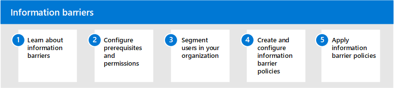

# Barreiras de informação no Microsoft 365

A Microsoft 365 permite a comunicação e a colaboração entre grupos e organizações e oferece suporte a maneiras de restringir a comunicação e a colaboração entre grupos específicos de usuários, quando necessário. Isso pode incluir situações ou cenários em que você deseja restringir a comunicação e a colaboração entre dois grupos para evitar um conflito de interesse de ocorrer em sua organização. Isso também pode incluir situações em que você precisa restringir a comunicação e a colaboração entre determinadas pessoas dentro da sua organização para proteger informações internas.

As barreiras de informação têm suporte no Microsoft Teams, no SharePoint Online e no OneDrive for Business. Um administrador de conformidade ou um administrador de barreiras de informações pode definir políticas para permitir ou impedir a comunicação entre grupos de usuários no Microsoft Teams. As políticas de barreira de informações podem ser usadas para situações como estas:

- O usuário no grupo de dia dos participantes não deve se comunicar ou compartilhar arquivos com a equipe de marketing
- O pessoal financeiro que trabalha em informações confidenciais da empresa não deve comunicar ou compartilhar arquivos com determinados grupos dentro de sua organização
- Uma equipe interna com o material de segredo comercial não deve ligar ou bater papo com pessoas de determinados grupos da organização
- Uma equipe de pesquisa deve chamar ou bater papo online apenas com uma equipe de desenvolvimento de produtos

## Configurar barreiras de informações para o Microsoft 365

Use as etapas a seguir para configurar as barreiras de informações para sua organização:

1. Saiba mais sobre [as barreiras de informação](information-barriers.md) no Microsoft 365
2. Configurar [pré-requisitos e permissões](information-barriers-policies.md#prerequisites)
3. Segmentar [usuários em sua organização](information-barriers-policies.md#part-1-segment-users)
4. Criar e configurar [políticas de barreira de informações](information-barriers-policies.md#part-2-define-information-barrier-policies)
5. Aplicar [políticas de barreira de informações](information-barriers-policies.md#part-3-apply-information-barrier-policies)

## Mais informações sobre barreiras de informações

- [Atributos das políticas de barreira de informações](information-barriers-attributes.md)
- [Editar ou remover políticas de barreira de informações](information-barriers-edit-segments-policies.md)