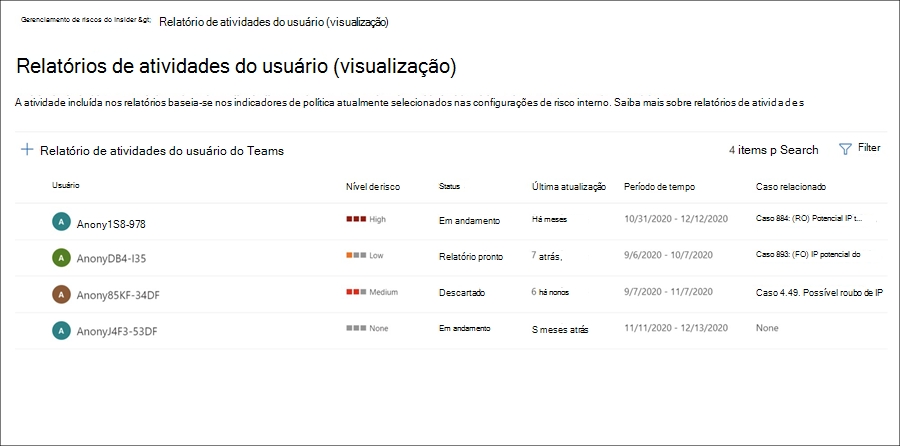

# Investigar atividades de gerenciamento de riscos insiderInvestigate insider risk management activities

Investigar atividades de usuário arriscadas é uma primeira etapa importante na minimização de riscos insider para sua organização.Investigating risky user activities is an important first step in minimizing insider risks for your organization. Esses riscos podem ser atividades que geram alertas de políticas de gerenciamento de riscos internas ou riscos de atividades detectadas por políticas, mas não criam imediatamente um alerta de gerenciamento de riscos insider para os usuários.These risks may be activities that generate alerts from insider risk management policies, or risks from activities that are detected by policies but do not immediately create an insider risk management alert for users. Você pode investigar esses tipos de atividades usando os relatórios de atividades do usuário **(visualização)** ou com o **painel Alerta.**You can investigate these types of activities by using the **User activity reports (preview)** or with the **Alert dashboard**.

## Relatórios de atividades do usuário (visualização)User activity reports (preview)

Os relatórios de atividades do usuário permitem examinar atividades de usuários específicos por um período de tempo definido sem precisar atribuí-los temporariamente ou explicitamente a uma política de gerenciamento de riscos internas.User activity reports allow you to examine activities for specific users for a defined time period without having to assign them temporarily or explicitly to an insider risk management policy. Na maioria dos cenários de gerenciamento de riscos insider, os usuários são explicitamente definidos em políticas e podem ter alertas de política (dependendo do gatilho de eventos) e pontuações de risco associadas às atividades.In most insider risk management scenarios, users are explicitly defined in policies, and they may have policy alerts (depending on triggering events) and risk scores associated with the activities. Mas, em alguns cenários, talvez você queira examinar as atividades de usuários que não estão explicitamente definidos em uma política.But in some scenarios, you may want to examine the activities for users that aren't explicitly defined in a policy. Esses podem ser os usuários que você recebeu uma dica sobre o usuário e atividades potencialmente arriscadas, ou usuários que normalmente não precisam ser atribuídos a uma política de gerenciamento de riscos internas.These may be users that you've received a tip about the user and potentially risky activities, or users that typically don't need to be assigned to an insider risk management policy.

Depois de configurar indicadores na página  de gerenciamento de riscos insider Configurações, a atividade do usuário é detectada para atividades arriscadas associadas aos indicadores selecionados.After you've configured indicators on the insider risk management **Settings** page, user activity is detected for risky activity associated with the selected indicators. Você não precisa configurar uma política para relatórios de atividades do usuário para detectar e relatar atividades arriscadas pelos usuários em sua organização.You do not have to configure a policy for user activity reports to detect and report risky activities by users in your organization. As atividades incluídas nos relatórios de atividades do usuário não exigem eventos de gatilho para que as atividades sejam exibidas.Activities included in user activity reports do not require triggering events for the activities to be displayed. Essa configuração significa que todas as atividades detectadas para o usuário estão disponíveis para revisão, independentemente de ter um evento disparador ou se ele criar um alerta.This configuration means that all detected activity for the user is available for review, regardless if it has a triggering event or if it creates an alert. Os relatórios são criados por usuário e podem incluir todas as atividades para um período personalizado de 90 dias.Reports are created on a per-user basis and can include all activities for a custom 90-day period. Não há suporte para vários relatórios para o mesmo usuário.Multiple reports for the same user aren't supported.

Depois de examinar as atividades de um usuário, os investigadores podem descartar atividades individuais como benignas, compartilhar ou enviar um link para o relatório com outros investigadores ou optar por atribuir o usuário temporariamente ou explicitamente a uma política de gerenciamento de riscos internas.After examining activities for a user, investigators can dismiss individual activities as benign, share or email a link to the report with other investigators, or choose to assign the user temporarily or explicitly to an insider risk management policy. Os usuários devem ser atribuídos ao grupo de função Investigadores de Gerenciamento de Riscos do *Insider* para exibir a **página Relatórios de atividades do** usuário.Users must be assigned to the *Insider Risk Management Investigators* role group to view the **User activity reports** page.  

Você pode começar selecionando **Gerenciar relatórios** na seção Investigar atividades **do** usuário na página Visão geral do gerenciamento de riscos **insider.**You can get started by selecting **Manage reports** in the **Investigate user activity** section on the insider risk management **Overview** page. Para exibir atividades para um usuário, primeiro selecione **Criar** relatório de atividades do usuário e conclua os seguintes campos no **painel Novo relatório** de atividades do usuário:To view activities for a user, first select **Create user activity report** and complete the following fields in the **New user activity report** pane:

- **Usuário**: Pesquisar um usuário por nome ou endereço de email**User**: Search for a user by name or email address
- **Data de início**: Use o controle de calendário para selecionar a data de início das atividades do usuário.**Start date**: Use the calendar control to select the start date for user activities.
- **Data de término**: use o controle de calendário para selecionar a data de término das atividades do usuário.**End date**: Use the calendar control to select the end date for user activities. A data de término selecionada deve ser maior do que dois dias após a data de início selecionada e não superior a 90 dias a partir da data de início selecionada.The end date selected must be greater than two days after the selected start date and no greater than 90 days from the selected start date.
Os novos relatórios geralmente levam até 10 horas antes de eles estão prontos para revisão.New reports typically take up to 10 hours before they are ready for review. Quando o relatório estiver pronto, você verá *Relatório pronto* na coluna **Status** na página Relatório de atividades do usuário.When the report is ready, you'll see *Report ready* in the **Status** column on the User activity report page. Selecione o usuário para exibir o relatório detalhado:Select the user to view the detailed report:

O **relatório de atividades do** usuário para o usuário selecionado contém as guias Atividade **do** usuário e **Explorador** de atividades:The **User activity report** for the selected user contains the **User activity** and **Activity explorer** tabs:

- **Atividade do usuário**: use este exibição de gráfico para investigar atividades e exibir possíveis atividades que ocorrem em sequências.**User activity**: Use this chart view to investigate activities and view potential activities that occur in sequences. Esta guia é estruturada para habilitar uma revisão rápida de um caso, incluindo uma linha do tempo histórica de todas as atividades, detalhes da atividade, a pontuação de risco atual para o usuário no caso, a sequência de eventos de risco e controles de filtragem para ajudar nos esforços investigativos.This tab is structured to enable quick review of a case, including a historical timeline of all activities, activity details, the current risk score for the user in the case, the sequence of risk events, and filtering controls to help with investigative efforts.
- **Explorador de** atividades : a guia **Explorador** de atividades fornece aos investigadores de risco uma ferramenta analítica abrangente que fornece informações detalhadas sobre atividades.**Activity explorer**: The **Activity explorer** tab provides risk investigators with a comprehensive analytic tool that provides detailed information about activities. Com o Explorador de Atividades, os revisadores podem revisar rapidamente uma linha do tempo de atividade arriscada detectada e identificar e filtrar todas as atividades de risco associadas a alertas.With the Activity explorer, reviewers can quickly review a timeline of detected risky activity and identify and filter all risk activities associated with alerts. Para saber mais sobre como usar o explorador de atividades, consulte a seção *Explorador* de atividades mais adiante neste artigo.To learn more about using the Activity explorer, see the *Activity explorer* section later in this article.

## Painel de alertaAlert dashboard

Alertas de gerenciamento de riscos internos são gerados automaticamente por indicadores de risco definidos nas políticas de gerenciamento de riscos internos.Insider risk management alerts are automatically generated by risk indicators defined in insider risk management policies. Esses alertas dão aos analistas de conformidade uma visão global do status de risco atual e permitem que sua organização selecione e tome medidas para descobrir riscos.These alerts give compliance analysts and investigators an all-up view of the current risk status and allow your organization to triage and take actions for discovered risks. Por padrão, as políticas geram uma certa quantidade de alertas de baixa, média e alta gravidade, mas você pode aumentar ou diminuir o volume de [alerta](insider-risk-management-settings.md#alert-volume) para atender às suas necessidades.By default, policies generate a certain amount of low, medium, and high severity alerts, but you can [increase or decrease the alert volume](insider-risk-management-settings.md#alert-volume) to suit your needs. Além disso, você pode configurar o limite de alerta para [indicadores](insider-risk-management-settings.md#indicator-level-settings-preview) de política ao criar uma nova política com o assistente de política.Additionally, you can configure the [alert threshold for policy indicators](insider-risk-management-settings.md#indicator-level-settings-preview) when creating a new policy with the policy wizard.

Confira o vídeo da Experiência de Triagem de Alertas de Gerenciamento de Riscos do [Insider](https://www.youtube.com/watch?v=KgmpxBLJLPI) para obter uma visão geral de como os alertas fornecem detalhes, contexto e conteúdo relacionado para atividades arriscadas e como tornar o processo de investigação mais eficaz.Check out the [Insider Risk Management Alerts Triage Experience video](https://www.youtube.com/watch?v=KgmpxBLJLPI) for an overview of how alerts provide details, context, and related content for risky activity and how to make your investigation process more effective.

O painel alerta de risco **interno** permite que você veja e aja em alertas gerados por políticas de risco internas.The insider risk **Alert dashboard** allows you to view and act on alerts generated by insider risk policies. Cada widget de relatório exibe informações dos últimos 30 dias.Each report widget displays information for last 30 days.

- **Total de alertas que precisam** ser revisados : O número total de alertas que precisam de revisão e triagem são listados, incluindo uma divisão por gravidade de alerta.**Total alerts that need review**: The total number of alerts needing review and triage are listed, including a breakdown by alert severity.
- **Alertas abertos nos últimos 30** dias : O número total de alertas criados pela política corresponde aos últimos 30 dias, organizados por níveis altos, médios e de gravidade de alerta baixo.**Open alerts over past 30 days**: The total number of alerts created by policy matches over the last 30 days, sorted by high, medium, and low alert severity levels.
- **Tempo médio para resolver alertas**: um resumo das estatísticas de alerta úteis:**Average time to resolve alerts**: A summary of useful alert statistics:
  - Tempo médio para resolver alertas de alta gravidade, listados em horas, dias ou meses.Average time to resolve high severity alerts, listed in hours, days, or months.
  - Tempo médio para resolver alertas de média gravidade, listados em horas, dias ou meses.Average time to resolve medium severity alerts, listed in hours, days, or months.
  - Tempo médio para resolver alertas de baixa gravidade, listados em horas, dias ou meses.Average time to resolve low severity alerts, listed in hours, days, or months.

> [!NOTE]
> O gerenciamento de risco interno usa a limitação de alerta incorporada para ajudar a proteger e otimizar sua experiência de investigação de risco e revisão.Insider risk management uses built-in alert throttling to help protect and optimize your risk investigation and review experience. Essa limitação protege contra problemas que podem resultar em uma sobrecarga de alertas de política, como conectores de dados mal-configurados ou políticas DLP.This throttling guards against issues that might result in an overload of policy alerts, such as misconfigured data connectors or DLP policies. Como resultado, pode haver um atraso na exibição de novos alertas para um usuário.As a result, there might be a delay in displaying new alerts for a user.

## Status de alerta e gravidadeAlert status and severity

Você pode triagem de alertas em um dos seguintes status:You can triage alerts into one of the following statuses:

- **Confirmado**: um alerta confirmado e atribuído a um caso novo ou existente.**Confirmed**: An alert confirmed and assigned to a new or existing case.
- **Ignorado**: Um alerta ignorado como benigno no processo de triagem.**Dismissed**: An alert dismissed as benign in the triage process.
- **Precisa de revisão**: um novo alerta em que as ações de triagem ainda não foram tomadas.**Needs review**: A new alert where triage actions have not yet been taken.
- **Resolvido**: um alerta que faz parte de um caso fechado e resolvido.**Resolved**: An alert that is part of a closed and resolved case.

As pontuações de risco de alerta são calculadas automaticamente a partir de vários indicadores de atividade de risco.Alert risk scores are automatically calculated from several risk activity indicators. Esses indicadores incluem o tipo de atividade de risco, o número e a frequência da ocorrência da atividade, o histórico da atividade de risco do usuário e a adição de riscos de atividade que podem aumentar a seriedade da atividade.These indicators include the type of risk activity, the number and frequency of the activity occurrence, the history of user risk activity, and the addition of activity risks that may boost the seriousness of the activity. A pontuação de risco de alerta orienta a atribuição programática de um nível de gravidade de risco para cada alerta e não pode ser personalizada.The alert risk score drives the programmatic assignment of a risk severity level for each alert and cannot be customized. Se os alertas permanecerem sem estrias e as atividades de risco continuarem a acumular para o alerta, o nível de gravidade do risco poderá aumentar.If alerts remain untriaged and risk activities continue to accrue to the alert, the risk severity level can increase. Os analistas de risco e os investigadores podem usar a gravidade do risco de alerta para ajudar os alertas de triagem de acordo com as políticas e padrões de risco da sua organização.Risk analysts and investigators can use the alert risk severity to help triage alerts in accordance with your organization's risk policies and standards.

Os níveis de gravidade do risco de alerta são:Alert risk severity levels are:

- **Alta gravidade**: As atividades e indicadores do alerta representam um risco significativo.**High severity**: The activities and indicators for the alert pose significant risk. As atividades de risco associadas são sérias, repetitivas e corelate fortemente para outros fatores de risco significativos.The associated risk activities are serious, repetitive, and corelate strongly to other significant risk factors.
- **Gravidade média**: As atividades e indicadores do alerta representam um risco moderado.**Medium severity**: The activities and indicators for the alert pose a moderate risk. As atividades de risco associadas são moderadas, frequentes e têm alguma correlação com outros fatores de risco.The associated risk activities are moderate, frequent, and have some correlation to other risk factors.
- **Baixa gravidade**: as atividades e indicadores do alerta representam um risco secundário.**Low severity**: The activities and indicators for the alert pose a minor risk. As atividades de risco associadas são secundárias, mais pouco frequentes e não se associam a outros fatores de risco significativos.The associated risk activities are minor, more infrequent, and do not corelate to other significant risk factors.

## Filtrar alertas no painel de alertasFilter alerts on the Alert dashboard

Dependendo do número e do tipo de políticas ativas de gerenciamento de risco interno em sua organização, a revisão de uma grande fila de alertas pode ser um desafio.Depending on the number and type of active insider risk management policies in your organization, reviewing a large queue of alerts can be challenging. O uso de filtros de alerta pode ajudar analistas e investigadores a classificar alertas por vários atributos.Using alert filters can help analysts and investigators sort alerts by several attributes. Para filtrar alertas no **painel Alertas,** selecione o **controle Filter.**To filter alerts on the **Alerts dashboard**, select the **Filter** control. Você pode filtrar alertas por um ou mais atributos:You can filter alerts by one or more attributes:

- **Status**: selecione um ou mais valores de status para filtrar a lista de alertas.**Status**: Select one or more status values to filter the alert list. As opções são *Confirmado*, *Descartado*, *Precisa de revisão* e *Resolvido*.The options are *Confirmed*, *Dismissed*, *Needs review*, and *Resolved*.
- **Severidade**: selecione um ou mais níveis de gravidade de risco de alerta para filtrar a lista de alertas.**Severity**: Select one or more alert risk severity levels to filter the alert list. As opções são *Alta*, *Média* e *Baixa*.The options are *High*, *Medium*, and *Low*.
- **Tempo detectado**: Selecione as datas de início e término para quando o alerta foi criado.**Time detected**: Select the start and end dates for when the alert was created.
- **Política**: selecione uma ou mais políticas para filtrar os alertas gerados pelas políticas selecionadas.**Policy**: Select one or more policies to filter the alerts generated by the selected policies.

## Alertas de pesquisa no painel alertaSearch alerts on the Alert dashboard

Para pesquisar o nome do alerta em uma palavra específica, selecione o controle **Pesquisar** e digite a palavra para pesquisar.To search the alert name for a specific word, select the **Search** control and type the word to search. Os resultados da pesquisa exibem qualquer alerta de política que contenha a palavra definida na pesquisa.The search results display any policy alert containing the word defined in the search.

## Alertas de triagemTriage alerts

Para triagem de um alerta de risco interno, conclua as seguintes etapas:To triage an insider risk alert, complete the following steps:

1. Na [Centro de conformidade do Microsoft 365](https://compliance.microsoft.com), vá para Gerenciamento de riscos **do Insider** e selecione a **guia Alertas.**In the [Microsoft 365 compliance center](https://compliance.microsoft.com), go to **Insider risk management** and select the **Alerts** tab.
2. No painel **Alertas,** selecione o alerta que você deseja triagem.On the **Alerts dashboard**, select the alert you want to triage.
3. No painel **de detalhes Alertas,** você pode revisar as seguintes guias e triagem do alerta:On the **Alerts detail pane**, you can review the following tabs and triage the alert:
    - **Resumo**: esta guia contém informações gerais sobre o alerta e permite que você confirme o alerta e crie um novo caso ou permita que você descarte o alerta.**Summary**: This tab contains general information about the alert and allows you to confirm the alert and create a new case or allows you to dismiss the alert. Ele inclui o status atual do alerta e o nível de gravidade do risco de alerta, listado como *Alto,* *Médio* ou *Baixo.*It includes the current status for the alert and the alert risk severity level, listed as *High*, *Medium*, or *Low*. O nível de gravidade pode aumentar ou diminuir ao longo do tempo se o alerta não for triaged.The severity level may increase or decrease over time if the alert is not triaged.
        - **O que aconteceu (visualização)**: exibe as três principais atividades de risco e as combinações de política durante o período de avaliação da atividade, incluindo o tipo de violação associada à atividade e o número de ocorrências.**What happened (preview)**: Displays the top three risk activities and policy matches during the activity evaluation period, including the type of violation associated with the activity and the number of occurrences.
        - **Detalhes do** usuário : exibe informações gerais sobre o usuário atribuído ao alerta.**User details**: Displays general information about the user assigned to the alert. Se o anonimato estiver habilitado, os campos nome de usuário, endereço de email, alias e organização serão anonimizados.If anonymization is enabled, the username, email address, alias, and organization fields are anonymized.
        - **Detalhes do** alerta : inclui o período de tempo desde que o alerta foi gerado, as políticas que geraram o alerta são listadas e o caso gerado do alerta é listado.**Alert details**: Includes the length of time since the alert was generated, the policies that generated the alert are listed, and the case generated from the alert is listed. Para novos alertas, o **campo Case** exibe Nenhum.For new alerts, the **Case** field displays None.
        - **Conteúdo detectado (visualização)**: Inclui conteúdo associado às atividades de risco para o alerta e resume eventos de atividade por áreas-chave.**Content detected (preview)**: Includes content associated with the risk activities for the alert and summarizes activity events by key areas. Selecionar um link de atividade abre o explorador de atividades e exibe detalhes adicionais sobre a atividade.Selecting an activity link opens the Activity explorer and displays additional details about the activity.
    - **Atividade do** usuário : essa guia exibe o histórico de atividades do usuário associado ao alerta.**User activity**: This tab displays the activity history for the user associated with the alert. Esse histórico inclui outros alertas e atividades relacionadas a indicadores de risco definidos no modelo atribuído à política para esse alerta.This history includes other alerts and activities related to risk indicators defined in the template assigned to the policy for this alert. Esse histórico permite que os analistas de risco e os investigadores fatorem qualquer comportamento de risco passado para o funcionário como parte do processo de triagem.This history allows risk analysts and investigators to factor in any past risky behavior for the employee as part of the triage process.
    - **Ações**: As seguintes ações estão disponíveis para cada alerta:**Actions**: The following actions are available for each alert:
        - **Exibição expandida aberta**: abre o **painel do explorador de** atividades.**Open expanded view**: Opens the **Activity explorer** dashboard.
        - **Confirmar e criar caso**: use essa ação para confirmar e criar um novo caso para todos os alertas associados a um usuário.**Confirm and create case**: Use this action to confirm and create a new case for all the alerts associated with a user. Essa ação altera automaticamente o status do alerta para *Confirmado*.This action automatically changes the alert status to *Confirmed*.
        - **Alerta de demissão**: use essa ação para descartar o alerta.**Dismiss alert**: Use this action to dismiss the alert. Essa ação altera o status do alerta para *Resolvido*.This action changes the alert status to *Resolved*.

## Explorador de atividades (visualização)Activity explorer (preview)

> [!NOTE]
> O explorador de atividades está disponível na área de gerenciamento de alertas para usuários com eventos disparados depois que esse recurso está disponível em sua organização.Activity explorer is available in the alert management area for users with triggering events after this feature is available in your organization.

O Explorador de Atividades fornece aos investigadores e analistas de risco uma ferramenta analítica abrangente que fornece informações detalhadas sobre alertas.The Activity explorer provides risk investigators and analysts with a comprehensive analytic tool that provides detailed information about alerts. Com o Explorador de Atividades, os revisadores podem revisar rapidamente uma linha do tempo de atividade arriscada detectada e identificar e filtrar todas as atividades de risco associadas a alertas.With the Activity explorer, reviewers can quickly review a timeline of detected risky activity and identify and filter all risk activities associated with alerts. Para filtrar alertas no explorador de atividades, selecione o controle Filter.To filter alerts on the Activity explorer, select the Filter control. Você pode filtrar alertas por um ou mais atributos listados no painel de detalhes do alerta.You can filter alerts by one or more attributes listed in the details pane for the alert. O explorador de atividades também dá suporte a colunas personalizáveis para ajudar os investigadores e analistas a concentrar o painel nas informações mais importantes para eles.Activity explorer also supports customizable columns to help investigators and analysts focus the dashboard on the information most important to them.

Para usar o **explorador de atividades,** conclua as seguintes etapas:To use the **Activity explorer**, complete the following steps:

1. Na Centro de conformidade do Microsoft 365, vá para Gerenciamento de riscos **do Insider** e selecione a **guia Alertas.**In the Microsoft 365 compliance center, go to **Insider risk management** and select the **Alerts** tab.
2. No painel **Alertas,** selecione o alerta que você deseja triagem.On the **Alerts dashboard**, select the alert you want to triage.
3. No painel **de detalhes Alertas,** selecione **Abrir exibição expandida**.On the **Alerts detail pane**, select **Open expanded view**.
4. Na página do alerta selecionado, selecione a guia **Explorador de** atividades.On the page for the selected alert, select the **Activity explorer** tab.

Ao revisar atividades no explorador de atividades, os investigadores e analistas podem selecionar uma atividade específica e abrir o painel de detalhes da atividade.When reviewing activities in the Activity explorer, investigators and analysts can select a specific activity and open the activity details pane. O painel exibe informações detalhadas sobre a atividade que os investigadores e analistas podem usar durante o processo de triagem de alerta.The pane displays detailed information about the activity that investigators and analysts can use during the alert triage process. As informações detalhadas podem fornecer contexto para o alerta e ajudar a identificar o escopo completo da atividade de risco que disparou o alerta.The detailed information may provide context for the alert and assist with identifying the full scope of the risk activity that triggered the alert.

## Criar um caso para um alertaCreate a case for an alert

À medida que o alerta é revisado e triaged, você pode criar um novo caso para investigar ainda mais a atividade de risco.As alert is reviewed and triaged, you can create a new case to further investigate the risk activity. Para criar um caso para um alerta, siga estas etapas:To create a case for an alert, follow these steps:

1. Na [Centro de conformidade do Microsoft 365](https://compliance.microsoft.com), vá para Gerenciamento de riscos **do Insider** e selecione a **guia Alertas.**In the [Microsoft 365 compliance center](https://compliance.microsoft.com), go to **Insider risk management** and select the **Alerts** tab.
2. No painel **Alertas,** selecione o alerta para o que você deseja confirmar e crie um novo caso.On the **Alerts dashboard**, select the alert you want to confirm and create a new case for.
3. No painel **de detalhes alertas,** selecione **Ações**  >  **Confirmar alertas & criar caso**.On the **Alerts details pane**, select **Actions** > **Confirm alerts & create case**.
4. Na caixa **de diálogo** Confirmar alerta e criar caso de risco interno, insira um nome para o caso, selecione usuários para adicionar como colaboradores e adicione comentários conforme aplicável.On the **Confirm alert and create insider risk case** dialog, enter a name for the case, select users to add as contributors, and add comments as applicable. Os comentários são adicionados automaticamente ao caso como uma observação de caso.Comments are automatically added to the case as a case note.
5. Selecione **Criar caso** para criar uma nova ocorrência ou selecione **Cancelar** para fechar a caixa de diálogo sem criar um caso.Select **Create case** to create a new case or select **Cancel** to close the dialog without creating a case.

Após a criação do caso, os investigadores e analistas podem gerenciar e agir sobre o caso.After the case is created, investigators and analysts can manage and act on the case. Para obter mais informações, consulte o artigo de caso de gerenciamento de riscos [do Insider.](insider-risk-management-cases.md)For more information, see the [Insider risk management case](insider-risk-management-cases.md) article.
