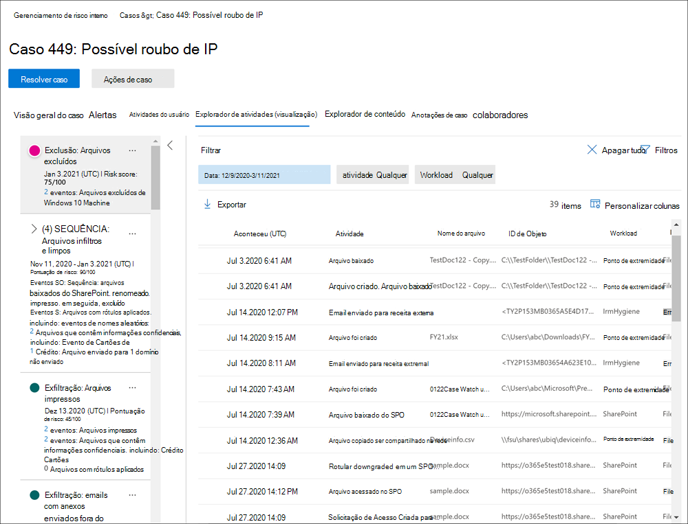
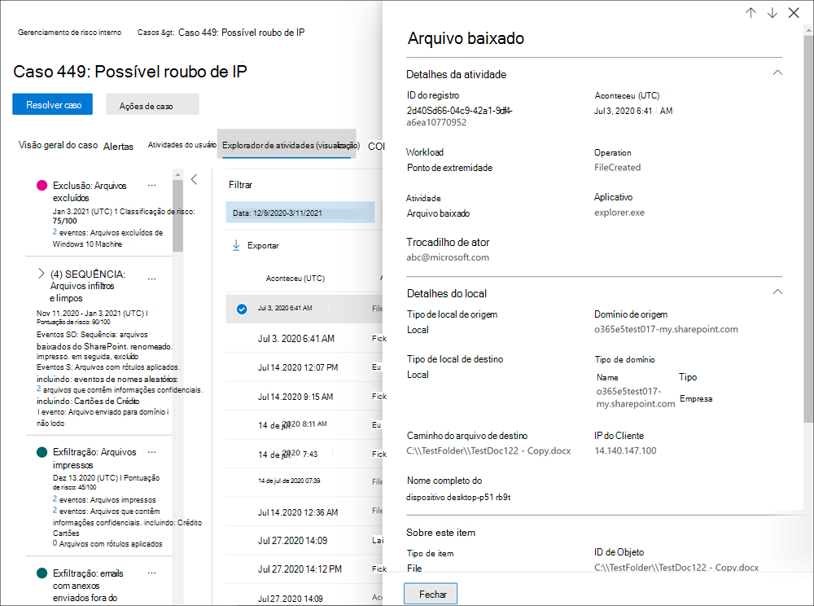

# Alertas de gerenciamento de riscos insider

Alertas de gerenciamento de riscos internos são gerados automaticamente por indicadores de risco definidos nas políticas de gerenciamento de riscos internos. Esses alertas dão aos analistas de conformidade uma visão global do status de risco atual e permitem que sua organização selecione e tome medidas para descobrir riscos. Por padrão, as políticas geram uma certa quantidade de alertas de baixa, média e alta gravidade, mas você pode aumentar ou diminuir o volume de [alerta](insider-risk-management-settings.md#alert-volume) para atender às suas necessidades. Além disso, você pode configurar o limite de alerta para [indicadores](insider-risk-management-settings.md#indicator-level-settings-preview) de política ao criar uma nova política com o assistente de política.

Confira o vídeo da Experiência de Triagem de Alertas de Gerenciamento de Riscos do [Insider](https://www.youtube.com/watch?v=KgmpxBLJLPI) para obter uma visão geral de como os alertas fornecem detalhes, contexto e conteúdo relacionado para atividades arriscadas e como tornar o processo de investigação mais eficaz.

## Painel de alerta

O painel alerta de risco **interno** permite que você veja e aja em alertas gerados por políticas de risco internas. Cada widget de relatório exibe informações dos últimos 30 dias.

- **Total de alertas que precisam** ser revisados : O número total de alertas que precisam de revisão e triagem são listados, incluindo uma divisão por gravidade de alerta.
- **Alertas abertos nos últimos 30** dias : O número total de alertas criados pela política corresponde aos últimos 30 dias, organizados por níveis altos, médios e de gravidade de alerta baixo.
- **Tempo médio para resolver alertas**: um resumo das estatísticas de alerta úteis:
    - Tempo médio para resolver alertas de alta gravidade, listados em horas, dias ou meses.
    - Tempo médio para resolver alertas de média gravidade, listados em horas, dias ou meses.
    - Tempo médio para resolver alertas de baixa gravidade, listados em horas, dias ou meses.

>[!NOTE]
>O gerenciamento de risco interno usa a limitação de alerta incorporada para ajudar a proteger e otimizar sua experiência de investigação de risco e revisão. Essa limitação protege contra problemas que podem resultar em uma sobrecarga de alertas de política, como conectores de dados mal-configurados ou políticas DLP. Como resultado, pode haver um atraso na exibição de novos alertas para um usuário.

## Status de alerta e gravidade

Você pode triagem de alertas em um dos seguintes status:

- **Confirmado**: um alerta confirmado e atribuído a um caso novo ou existente.
- **Ignorado**: Um alerta ignorado como benigno no processo de triagem.
- **Precisa de revisão**: um novo alerta em que as ações de triagem ainda não foram tomadas.
- **Resolvido**: um alerta que faz parte de um caso fechado e resolvido.

As pontuações de risco de alerta são calculadas automaticamente a partir de vários indicadores de atividade de risco. Esses indicadores incluem o tipo de atividade de risco, o número e a frequência da ocorrência da atividade, o histórico da atividade de risco do usuário e a adição de riscos de atividade que podem aumentar a seriedade da atividade. A pontuação de risco de alerta orienta a atribuição programática de um nível de gravidade de risco para cada alerta e não pode ser personalizada. Se os alertas permanecerem sem estrias e as atividades de risco continuarem a acumular para o alerta, o nível de gravidade do risco poderá aumentar. Os analistas de risco e os investigadores podem usar a gravidade do risco de alerta para ajudar os alertas de triagem de acordo com as políticas e padrões de risco da sua organização.

Os níveis de gravidade do risco de alerta são:

- **Alta gravidade**: As atividades e indicadores do alerta representam um risco significativo. As atividades de risco associadas são sérias, repetitivas e corelate fortemente para outros fatores de risco significativos.
- **Gravidade média**: As atividades e indicadores do alerta representam um risco moderado. As atividades de risco associadas são moderadas, frequentes e têm alguma correlação com outros fatores de risco.
- **Baixa gravidade**: as atividades e indicadores do alerta representam um risco secundário. As atividades de risco associadas são secundárias, mais pouco frequentes e não se associam a outros fatores de risco significativos.

## Filtrar alertas no painel de alertas

Dependendo do número e do tipo de políticas ativas de gerenciamento de risco interno em sua organização, a revisão de uma grande fila de alertas pode ser um desafio. O uso de filtros de alerta pode ajudar analistas e investigadores a classificar alertas por vários atributos. Para filtrar alertas no **painel Alertas,** selecione o **controle Filter.** Você pode filtrar alertas por um ou mais atributos:

- **Status**: selecione um ou mais valores de status para filtrar a lista de alertas. As opções são *Confirmado*, *Descartado*, *Precisa de revisão* e *Resolvido*.
- **Severidade**: selecione um ou mais níveis de gravidade de risco de alerta para filtrar a lista de alertas. As opções são *Alta*, *Média* e *Baixa*.
- **Tempo detectado**: Selecione as datas de início e término para quando o alerta foi criado.
- **Política**: selecione uma ou mais políticas para filtrar os alertas gerados pelas políticas selecionadas.

## Alertas de pesquisa no painel alerta

Para pesquisar o nome do alerta em uma palavra específica, selecione o controle **Pesquisar** e digite a palavra para pesquisar. Os resultados da pesquisa exibem qualquer alerta de política que contenha a palavra definida na pesquisa.

## Alertas de triagem

Para triagem de um alerta de risco interno, conclua as seguintes etapas:

1. No Centro de conformidade do [Microsoft 365,](https://compliance.microsoft.com)vá para Gerenciamento de riscos **do Insider** e selecione a **guia Alertas.**
2. No painel **Alertas,** selecione o alerta que você deseja triagem.
3. No painel **de detalhes Alertas,** você pode revisar as seguintes guias e triagem do alerta:
    - **Resumo**: esta guia contém informações gerais sobre o alerta e permite que você confirme o alerta e crie um novo caso ou permita que você descarte o alerta. Ele inclui o status atual do alerta e o nível de gravidade do risco de alerta, listado como *Alto,* *Médio* ou *Baixo.* O nível de gravidade pode aumentar ou diminuir ao longo do tempo se o alerta não for triaged.
        - **O que aconteceu (visualização)**: exibe as três principais atividades de risco e as combinações de política durante o período de avaliação da atividade, incluindo o tipo de violação associada à atividade e o número de ocorrências.
        - **Detalhes do** usuário : exibe informações gerais sobre o usuário atribuído ao alerta. Se o anonimato estiver habilitado, os campos nome de usuário, endereço de email, alias e organização serão anonimizados.
        - **Detalhes do** alerta : inclui o período de tempo desde que o alerta foi gerado, as políticas que geraram o alerta são listadas e o caso gerado do alerta é listado. Para novos alertas, o **campo Case** exibe Nenhum.
        - **Conteúdo detectado (visualização)**: Inclui conteúdo associado às atividades de risco para o alerta e resume eventos de atividade por áreas-chave. Selecionar um link de atividade abre o explorador de atividades e exibe detalhes adicionais sobre a atividade.
    - **Atividade do** usuário : essa guia exibe o histórico de atividades do usuário associado ao alerta. Esse histórico inclui outros alertas e atividades relacionadas a indicadores de risco definidos no modelo atribuído à política para esse alerta. Esse histórico permite que os analistas de risco e os investigadores fatorem qualquer comportamento de risco passado para o funcionário como parte do processo de triagem.
    - **Ações**: As seguintes ações estão disponíveis para cada alerta:
        - **Exibição expandida aberta**: abre o **painel do explorador de** atividades.
        - **Confirmar e criar caso**: use essa ação para confirmar e criar um novo caso para todos os alertas associados a um usuário. Essa ação altera automaticamente o status do alerta para *Confirmado*.
        - **Alerta de demissão**: use essa ação para descartar o alerta. Essa ação altera o status do alerta para *Resolvido*.

## Explorador de atividades (visualização)

>[!NOTE]
>O explorador de atividades está disponível na área de gerenciamento de alertas para usuários com eventos disparados depois que esse recurso está disponível em sua organização.

O Explorador de Atividades fornece aos investigadores e analistas de risco uma ferramenta analítica abrangente que fornece informações detalhadas sobre alertas. Com o Explorador de Atividades, os revisadores podem revisar rapidamente uma linha do tempo de atividade arriscada detectada e identificar e filtrar todas as atividades de risco associadas a alertas. Para filtrar alertas no explorador de atividades, selecione o controle Filter. Você pode filtrar alertas por um ou mais atributos listados no painel de detalhes do alerta. O explorador de atividades também dá suporte a colunas personalizáveis para ajudar os investigadores e analistas a concentrar o painel nas informações mais importantes para eles.

Para usar o **explorador de atividades,** conclua as seguintes etapas:

1. No Centro de conformidade do Microsoft 365, acesse Gerenciamento de riscos **do Insider** e selecione **a guia Alertas.**
2. No painel **Alertas,** selecione o alerta que você deseja triagem.
3. No painel **de detalhes Alertas,** selecione **Abrir exibição expandida**.
4. Na página do alerta selecionado, selecione a guia **Explorador de** atividades.

Ao revisar atividades no explorador de atividades, os investigadores e analistas podem selecionar uma atividade específica e abrir o painel de detalhes da atividade. O painel exibe informações detalhadas sobre a atividade que os investigadores e analistas podem usar durante o processo de triagem de alerta. As informações detalhadas podem fornecer contexto para o alerta e ajudar a identificar o escopo completo da atividade de risco que disparou o alerta.

## Criar um caso para um alerta

À medida que o alerta é revisado e triaged, você pode criar um novo caso para investigar ainda mais a atividade de risco. Para criar um caso para um alerta, siga estas etapas:

1. No Centro de conformidade do [Microsoft 365,](https://compliance.microsoft.com)vá para Gerenciamento de riscos **do Insider** e selecione a **guia Alertas.**
2. No painel **Alertas,** selecione o alerta para o que você deseja confirmar e crie um novo caso.
3. No painel **de detalhes alertas,** selecione **Ações**  >  **Confirmar alertas & criar caso**.
4. Na caixa **de diálogo** Confirmar alerta e criar caso de risco interno, insira um nome para o caso, selecione usuários para adicionar como colaboradores e adicione comentários conforme aplicável. Os comentários são adicionados automaticamente ao caso como uma observação de caso.
5. Selecione **Criar caso** para criar uma nova ocorrência ou selecione **Cancelar** para fechar a caixa de diálogo sem criar um caso.

Após a criação do caso, os investigadores e analistas podem gerenciar e agir sobre o caso. Consulte o artigo de caso de gerenciamento [de riscos do Insider](insider-risk-management-cases.md) para obter mais detalhes.
