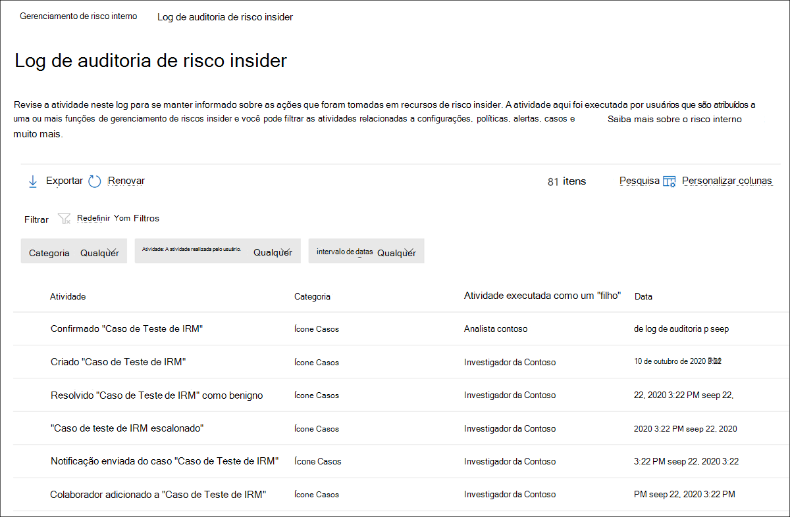

# Log de auditoria de gerenciamento de riscos do Insider

O log de auditoria de gerenciamento de riscos insider permite que você fique informado sobre as ações que foram tomadas em recursos de gerenciamento de riscos insider. Esse log permite a revisão independente das ações realizadas pelos usuários atribuídos a um ou mais grupos de função de gerenciamento de riscos insider. O log de auditoria de gerenciamento de risco interno é habilitado automaticamente em sua organização e não pode ser desabilitado.

O log de auditoria é atualizado automaticamente e imediatamente sempre que as atividades monitoradas ocorrem e o log mantém informações sobre a atividade por 180 dias (cerca de seis meses). Após 180 dias, os dados da atividade serão excluídos permanentemente do log.

As áreas incluídas no monitoramento de atividades incluem:

- Políticas
- Casos
- Alertas
- Configurações
- Usuários
- Modelos de aviso

Para exibir e exportar dados do log de auditoria, os usuários devem ser atribuídos aos grupos de função *Insider Risk Management* ou *Insider Risk Management Auditors.* Para saber mais sobre grupos de função de gerenciamento de riscos insider, consulte Iniciando o gerenciamento de riscos [insider Etapa 1: Habilenciar permissões](insider-risk-management-configure.md#step-1-enable-permissions-for-insider-risk-management).

>[!NOTE]
>O log de auditoria de gerenciamento de riscos internos não está associado ao log de auditoria Microsoft 365, eles são sistemas de auditoria independentes e capturam informações sobre atividades separadas. Desabilitar Microsoft 365 auditoria não afeta a auditoria de atividades dentro do gerenciamento de risco interno.

## Exibir atividade no log de auditoria de risco interno

Para exibir a atividade de recurso monitorada para gerenciamento de riscos **insider,** navegue até e selecione o link de log de auditoria de risco do Insider na área superior direita de qualquer guia de gerenciamento de risco interno. Por padrão, você verá as seguintes informações exibidas para atividades de gerenciamento de riscos internas:

- **Atividade:** Uma descrição da atividade realizada dentro da solução de gerenciamento de riscos insider por um usuário.
- **Categoria:** A área ou item em que a atividade foi executada. Por exemplo, você verá *Políticas como* a categoria quando as atividades de alteração de política foram executadas.
- **Atividade executada por:** O nome de usuário do usuário que realizou a atividade.
- **Data:** A data e a hora em que a atividade foi realizada. A data e a hora são a data e a hora locais para sua organização.

Para obter mais informações sobre uma atividade registrada, selecione a atividade para exibir o painel de detalhes da atividade. Esse painel inclui informações adicionais sobre a atividade.

## Colunas e filtragem

Para facilitar a revisão da atividade registrada pelos auditores, há suporte para filtragem no log de auditoria de risco **do Insider.** Para filtragem básica, as colunas de fila estão disponíveis para adicionar ao modo de exibição para fornecer pivôs diferentes nos arquivos e mensagens. Você pode filtrar as atividades pelos campos **Categoria, Intervalo de datas** e **atividades realizadas por** campos.

Para adicionar ou remover títulos de coluna para a fila de atividades, use o controle **Personalizar colunas** e selecione entre as opções de coluna. Essas colunas mapeiam para condições comuns com suporte no log de auditoria de risco **do Insider** e são listadas posteriormente neste artigo.

## Exportação de log de auditoria

Os usuários atribuídos aos grupos de função *Insider Risk Management* ou *Insider Risk Management Auditors* podem exportar todas as atividades no log de auditoria para um arquivo .csv (valores separados por vírgula) selecionando **Exportar** na página de log de auditoria de risco **insider.** Dependendo da atividade, alguns campos para uma atividade podem não ser aplicáveis à atividade e esses campos aparecerão como em branco no arquivo exportado.

O arquivo contém informações de atividade para os seguintes campos:

- **Atividade executada por:** O nome de usuário do usuário que modifica um valor de item. Os usuários listados aqui foram atribuídos a um ou mais dos seguintes grupos de função de gerenciamento de riscos [insider](insider-risk-management-configure.md#step-1-enable-permissions-for-insider-risk-management): *Insider Risk Management,* *Insider Risk Management Admins*, *Insider Risk Management Analysts*, *Insider Risk Management Investigators*. Cada grupo de funções tem níveis de permissão diferentes para gerenciar recursos de risco interno.
- **Atividade:** A atividade realizada em um item. Os valores *são Exibidos, Excluídos, Adicionados, Política Editada, Caso, Usuário, Alerta* *e Configurações.*
- **Adicionado**: objetos que foram adicionados durante a atividade, como usuários, tipos de arquivo ou domínios.
- **Volume de alerta**: o nível de volume de alerta definido nas configurações de gerenciamento de risco interno.
- **Valor**: Os valores de indicador personalizados selecionados atualmente para uma política.
- **ID do** ativo : A ID do ativo físico de prioridade em que a atividade foi realizada.
- **Categoria:** A categoria do item modificado. Os valores *são Políticas, Casos, Usuários, Alertas, Configurações e* *Avisos.*
- **Data:** Data e hora, listados na data e hora locais da sua organização.
- **Descrição**: a entrada de descrição pelo usuário para o objeto que está sendo agido (como uma política ou um grupo de usuários de prioridade).
- **Política de DLP**: a política de prevenção contra perda de dados (DLP) selecionada para disparar a inclusão em uma política de gerenciamento de riscos insider.
- **Indicador**: o indicador nas configurações de risco internas em que a atividade foi executada (como adicionar ou remover um indicador).
- **Modelo de aviso**: o modelo de aviso em que a atividade foi executada.
- **Número de dias**: a janela de ativação de política definida nas configurações de risco interno.
- **Número de arquivos**: o limite de volume de arquivo definido nas configurações de gerenciamento de risco interno.
- **Modelo de política**: o modelo de política ao que os indicadores atuaram pertence.
- **Valor anterior**: Os valores de indicador personalizado selecionados anteriormente para uma política.
- **Grupo de usuários de** prioridade : O grupo de usuários de prioridade em que a atividade foi executada.
- **Removido**: objetos que foram removidos durante a atividade, como usuários, tipos de arquivo ou domínios.
- **Remetente**: o campo remetente do modelo de aviso em que a atividade foi executada.
- **Política de destino**: a política em que a atividade foi executada (como adicionar um usuário ou remover um usuário).
- **Corpo da mensagem do** modelo : o corpo da mensagem do modelo de aviso em que a atividade foi executada.
- **Assunto do** modelo : O campo de assunto do modelo de aviso em que a atividade foi executada.
- **Usuário:** Usuário em que a atividade foi executada.
