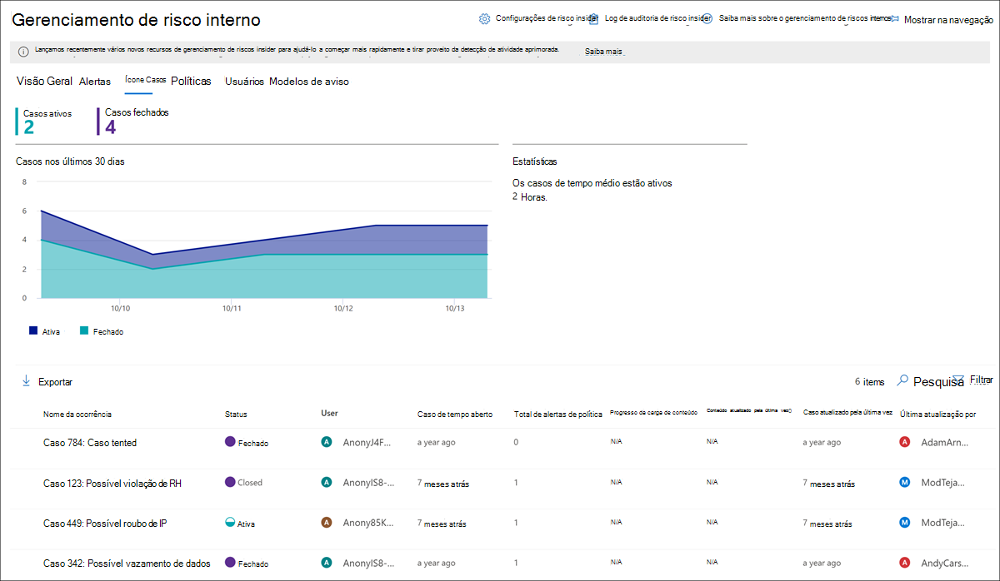
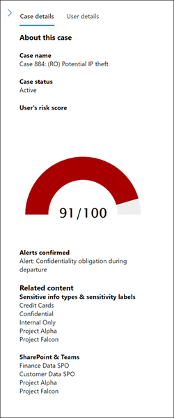
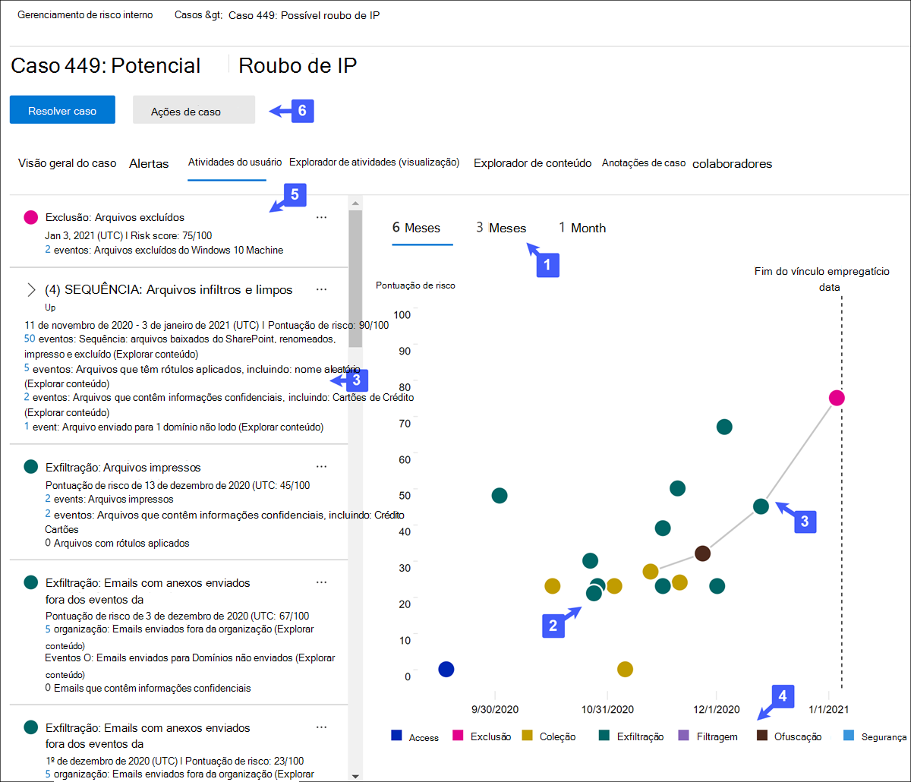
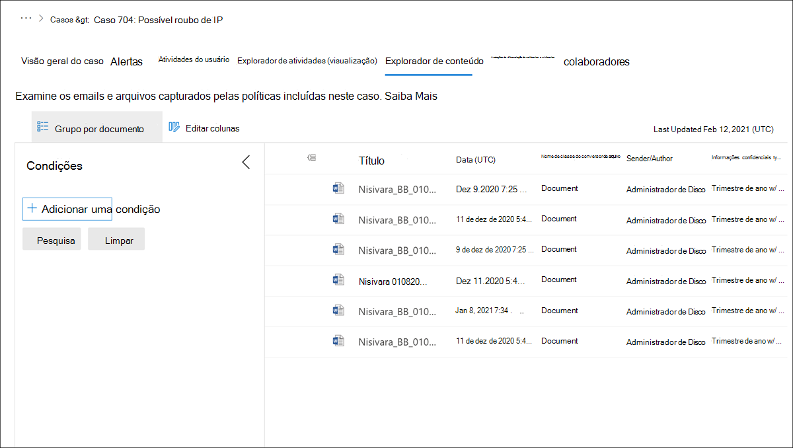

# Casos de gerenciamento de riscos insiderInsider risk management cases

Os casos são o centro do gerenciamento de riscos insider e permitem que você investigue profundamente e aja em questões geradas por indicadores de risco definidos em suas políticas.Cases are the heart of insider risk management and allow you to deeply investigate and act on issues generated by risk indicators defined in your policies. Os casos são criados manualmente a partir de alertas em situações em que mais ações são necessárias para resolver um problema relacionado à conformidade para um usuário.Cases are manually created from alerts in situations where further action is needed to address a compliance-related issue for a user. Cada caso tem escopo para um único usuário e vários alertas para o usuário podem ser adicionados a um caso existente ou a um novo caso.Each case is scoped to a single user and multiple alerts for the user can be added to an existing case or to a new case. 

Depois de investigar os detalhes de um caso, você pode tomar medidas por:After investigating the details of a case, you can take action by:

- enviar um aviso ao usuáriosending the user a notice
- resolvendo o caso como benignoresolving the case as benign
- compartilhando o caso com sua instância serviceNow ou com um destinatário de emailsharing the case with your ServiceNow instance or with an email recipient
- escalonamento do caso para uma investigação Advanced eDiscovery investigaçãoescalating the case for an Advanced eDiscovery investigation

Confira o vídeo Investigação e Escalonamento de Gerenciamento de Riscos do [Insider](https://www.youtube.com/watch?v=UONUSmkRC8s) para ter uma visão geral de como os casos são investigados e gerenciados no gerenciamento de riscos insider.Check out the [Insider Risk Management Investigation and Escalation video](https://www.youtube.com/watch?v=UONUSmkRC8s) for an overview of how cases are investigated and managed in insider risk management.

## Painel de casosCases dashboard

O painel casos de gerenciamento de riscos **insider** permite que você veja e aja em casos.The insider risk management **Cases dashboard** allows you to view and act on cases. Cada widget de relatório no painel exibe informações dos últimos 30 dias.Each report widget on the dashboard displays information for last 30 days.

- **Casos ativos**: o número total de casos ativos em investigação.**Active cases**: The total number of active cases under investigation.
- **Casos nos últimos 30 dias**: O número total de casos criados, organizados pelo status *Ativo* *e* Fechado.**Cases over past 30 days**: The total number of cases created, sorted by *Active* and *Closed* status.
- **Estatísticas**: Tempo médio de casos ativos, listados em horas, dias ou meses.**Statistics**: Average time of active cases, listed in hours, days, or months.

A fila de casos lista todos os casos ativos e fechados para sua organização, além do status atual dos seguintes atributos de caso:The case queue lists all active and closed cases for your organization, in addition to the current status of the following case attributes:

- **Nome da** ocorrência : o nome da ocorrência, definido quando um alerta é confirmado e o caso é criado.**Case name**: The name of the case, defined when an alert is confirmed and the case is created.  
- **Status**: o status do caso, *Ativo* ou *Fechado*.**Status**: The status of the case, either *Active* or *Closed*.
- **Usuário**: o usuário do caso.**User**: The user for the case. Se o anonimato para nomes de usuário estiver habilitado, as informações anônimas serão exibidas.If anonymization for usernames is enabled, anonymized information is displayed.
- **Caso de tempo aberto**: o tempo que passou desde que o caso foi aberto.**Time case opened**: The time that has passed since the case was opened.
- **Total de alertas de política**: o número de combinações de política incluídas no caso.**Total policy alerts**: The number of policy matches included in the case. Esse número pode aumentar se novos alertas são adicionados ao caso.This number may increase if new alerts are added to the case.
- **Caso atualizado pela última** vez : O tempo que passou desde que houve uma anotação de caso adicionada ou alteração no estado do caso.**Case last updated**: The time that has passed since there has been an added case note or change in the case state.
- **Last updated by**: The name of the insider risk management analyst or investigator that last updated the case.**Last updated by**: The name of the insider risk management analyst or investigator that last updated the case.

Use o **controle Search** para pesquisar nomes de caso para texto específico e use o filtro de caso para classificar casos pelos seguintes atributos:Use the **Search** control to search case names for specific text and use the case filter to sort cases by the following attributes:

- StatusStatus
- Caso de hora, data de início e data de términoTime case opened, start date, and end date
- Última atualização, data de início e data de términoLast updated, start date, and end date

## Casos de filtroFilter cases

Dependendo do número e do tipo de políticas de gerenciamento de riscos insider ativos em sua organização, a revisão de uma grande fila de casos pode ser desafiadora.Depending on the number and type of active insider risk management policies in your organization, reviewing a large queue of cases can be challenging. O uso de filtros de caso pode ajudar analistas e investigadores a classificar casos por vários atributos.Using case filters can help analysts and investigators sort cases by several attributes. Para filtrar alertas no painel **Casos,** selecione o **controle Filtro.**To filter alerts on the **Cases dashboard**, select the **Filter** control. Você pode filtrar casos por um ou mais atributos:You can filter cases by one or more attributes:

- **Status**: selecione um ou mais valores de status para filtrar a lista de casos.**Status**: Select one or more status values to filter the case list. As opções são *Active* e *Closed*.The options are *Active* and *Closed*.
- **Caso de tempo aberto**: Selecione as datas de início e término para quando a ocorrência foi aberta.**Time case opened**: Select the start and end dates for when the case was opened.
- **Last updated**: Select the start and end dates for when the case was updated.**Last updated**: Select the start and end dates for when the case was updated.

## Investigar um casoInvestigate a case

Uma investigação mais profunda sobre alertas de gerenciamento de riscos insider é fundamental para a tomada de ações corretivas adequadas.Deeper investigation into insider risk management alerts is critical to taking proper corrective actions. Os casos de gerenciamento de riscos insider são a ferramenta de gerenciamento central para aprofundar o histórico de atividades de risco do usuário, detalhes de alerta, a sequência de eventos de risco e explorar o conteúdo e as mensagens expostas aos riscos.Insider risk management cases are the central management tool to dive deeper into user risk activity history, alert details, the sequence of risk events, and to explore the content and messages exposed to risks. Os analistas e investigadores de riscos também usam casos para centralizar comentários e anotações de revisão e processar a resolução de casos.Risk analysts and investigators also use cases to centralize review feedback and notes and to process case resolution.

Selecionar um caso abre as ferramentas de gerenciamento de casos e permite que os analistas e analistas procurem os detalhes dos casos.Selecting a case opens the case management tools and allows analysts and investigators to dig into the details of cases.

### Visão geral do casoCase overview

A **guia Visão geral** do caso resume os detalhes de caso para analistas de risco e investigadores.The **Case overview** tab summarizes the case details for risk analysts and investigators. Ele inclui as seguintes informações na área **Sobre esse** casoIt includes the following information in the **About this case** area

- **Status**: o status atual do caso, Ativo ou Fechado.**Status**: The current status of the case, either Active or Closed.
- **Caso criado em**: A data e a hora em que o caso foi criado.**Case created on**: The date and time the case was created.
- **Pontuação de risco do usuário**: O nível de risco calculado atual do usuário para o caso.**User's risk score**: The current calculated risk level of the user for the case. Essa pontuação é calculada a cada 24 horas e usa pontuações de risco de alerta de todos os alertas ativos associados ao usuário.This score is calculated every 24 hours and uses alert risk scores from all active alerts associated to the user.
- **Email**: o alias de email do usuário para a ocorrência.**Email**: The email alias of the user for the case.
- **Organização ou departamento**: a organização ou departamento ao que o usuário é atribuído.**Organization or department**: The organization or department that the user is assigned to.
- **Nome do** gerente : o nome do gerente do usuário.**Manager name**: The name of the user's manager.
- **Email do** gerente : o alias de email do gerente do usuário.**Manager email**: The email alias of the user's manager.

A **guia Visão geral** de caso também inclui uma seção **Alertas** que inclui as seguintes informações sobre alertas de associação de política associados ao caso:The **Case overview** tab also includes an **Alerts** section that includes the following information about policy match alerts associated with the case:

- **Política corresponde**: o nome da política de gerenciamento de riscos internas associada aos alertas de match para atividade do usuário.**Policy matches**: The name of the insider risk management policy associated with the match alerts for user activity.
- **Status**: Status do alerta.**Status**: Status of the alert.
- **Severidade**: gravidade do alerta.**Severity**: Severity of the alert.
- **Tempo detectado**: O tempo que passou desde que o alerta foi gerado.**Time detected**: The time that has passed since the alert was generated.

### AlertasAlerts

A **guia Alertas** resume os alertas atuais incluídos no caso.The **Alerts** tab summarizes the current alerts included in the case. Novos alertas podem ser adicionados a um caso existente e eles serão adicionados à fila **de** alerta à medida que eles são atribuídos.New alerts may be added to an existing case and they will be added to the **Alert** queue as they are assigned. Os seguintes atributos de alerta estão listados na fila:The following alert attributes are listed the queue:

- StatusStatus
- GravidadeSeverity
- Tempo detectadoTime detected

Selecione um alerta na fila para exibir a **página de detalhes alerta.**Select an alert from the queue to display the **Alert detail** page.

Use o controle de pesquisa para pesquisar nomes de alerta para texto específico e use o filtro de alerta para classificar casos pelos seguintes atributos:Use the search control to search alert names for specific text and use the alert filter to sort cases by the following attributes:

- StatusStatus
- GravidadeSeverity
- Tempo detectado, data de início e data de términoTime detected, start date, and end date

Use o controle de filtro para filtrar alertas por vários atributos, incluindo:Use the filter control to filter alerts by several attributes, including:

- **Status**: selecione um ou mais valores de status para filtrar a lista de alertas.**Status**: Select one or more status values to filter the alert list. As opções são *Confirmado*, *Descartado*, *Precisa de revisão* e *Resolvido*.The options are *Confirmed*, *Dismissed*, *Needs review*, and *Resolved*.
- **Severidade**: selecione um ou mais níveis de gravidade de risco de alerta para filtrar a lista de alertas.**Severity**: Select one or more alert risk severity levels to filter the alert list. As opções são *Alta*, *Média* e *Baixa*.The options are *High*, *Medium*, and *Low*.
- **Tempo detectado**: Selecione as datas de início e término para quando o alerta foi criado.**Time detected**: Select the start and end dates for when the alert was created.
- **Política**: selecione uma ou mais políticas para filtrar os alertas gerados pelas políticas selecionadas.**Policy**: Select one or more policies to filter the alerts generated by the selected policies.

### Atividade do usuárioUser activity

A **de atividade do usuário** guia é uma das ferramentas mais poderosas para análise de risco interna e investigação de casos na solução de gerenciamento de riscos interna.The **User activity** tab is one of the most powerful tools for internal risk analysis and investigation for cases in the insider risk management solution. Essa guia é estruturada para habilitar uma revisão rápida de um caso, incluindo uma linha do tempo histórica de todos os alertas, detalhes de alerta, a pontuação de risco atual para o usuário no caso, a sequência de eventos de risco e controles para tomar medidas efetivas para conter os riscos no caso.This tab is structured to enable quick review of a case, including a historical timeline of all alerts, alert details, the current risk score for the user in the case, the sequence of risk events, and controls to take effective action to contain the risks in the case.

1. **Filtros de** tempo : Por padrão, os últimos seis meses de alertas confirmados no caso são exibidos no gráfico de atividades do usuário.**Time filters**: By default, the last six months of alerts confirmed in the case are displayed in the User activity chart. Você pode filtrar facilmente a exibição do gráfico selecionando as guias *6 Meses*, *3* Meses ou *1* Mês no gráfico de bolhas.You can easily filter the chart view by selecting the *6 Months*, *3 Months*, or *1 Month* tabs on the bubble chart.
2. **Atividade e detalhes do alerta de** risco : As atividades de risco são exibidas visualmente como bolhas coloridas no gráfico de atividades do usuário.**Risk alert activity and details**: Risk activities are visually displayed as colored bubbles in the User activity chart. Bolhas são criadas para diferentes categorias de risco e o tamanho da bolha é proporcional ao número de atividades de risco para a categoria.Bubbles are created for different categories of risk and bubble size is proportional to the number of risk activities for the category. Selecione uma bolha para exibir os detalhes de cada atividade de risco.Select a bubble to display the details for each risk activity. Os detalhes incluem:Details include:
    - **Data** da atividade de risco.**Date** of the risk activity.
    - A **categoria atividade de risco**.The **risk activity category**. Por exemplo, *Email(s) com anexos enviados* para fora da organização ou *File(s) baixados do SharePoint Online*.For example, *Email(s) with attachments sent outside the organization* or *File(s) downloaded from SharePoint Online*.
    - **Classificação de** para o alerta.**Risk score** for the alert. Esta pontuação é a pontuação numérica para o nível de gravidade de risco de alerta.This score is the numerical score for the alert risk severity level.
    - Número de eventos ao alerta.Number of events associated with the alert. Links para cada arquivo ou email associado à atividade de risco também estão disponíveis.Links to each file or email associated with the risk activity are also available.
3. **Sequência de riscos (visualização)**: a ordem cronológica das atividades arriscadas é um aspecto importante da investigação de risco e identificar essas atividades relacionadas é uma parte importante da avaliação do risco geral para sua organização.**Risk sequence (preview)**: The chronological order of risky activities is an important aspect of risk investigation and identifying these related activities is an important part of evaluating overall risk for your organization. As atividades de alerta relacionadas são exibidas com linhas de conexão para destacar que essas atividades estão associadas a uma área de risco maior.Alert activities that are related are displayed with connecting lines to highlight that these activities are associated with a larger risk area. Essa exibição de atividades pode ajudar os investigadores literalmente a "conectar os pontos" para atividades de risco que poderiam ter sido vistas como eventos isolados ou isolados.This view of activities can help investigators literally 'connect the dots' for risk activities that could have been viewed as isolated or one-off events. Selecione qualquer bolha na sequência para exibir detalhes de todas as atividades de risco associadas.Select any bubble in the sequence to display details for all the associated risk activities. Os detalhes incluem:Details include:

    - **Nome** da sequência.**Name** of the sequence.
    - **Intervalo** de **data ou data** da sequência.**Date** or **Date range** of the sequence.
    - **Pontuação de** risco para a sequência.**Risk score** for the sequence. Essa pontuação é a pontuação numérica para a sequência dos níveis combinados de gravidade de risco de alerta para cada atividade relacionada na sequência.This score is the numerical score for the sequence of the combined alert risk severity levels for each related activity in the sequence.
    - **Número de eventos associados a cada alerta na sequência**.**Number of events associated with each alert in the sequence**. Links para cada arquivo ou email associado a cada atividade de risco também estão disponíveis.Links to each file or email associated with each risk activity are also available.
    - **Mostrar atividades em sequência**.**Show activities in sequence**. Exibe a sequência como uma linha de realçamento no gráfico de bolhas e expande os detalhes do alerta para exibir todos os alertas relacionados na sequência.Displays sequence as a highlight line on the bubble chart and expands the alert details to display all related alerts in the sequence.

4. **Legenda de atividade de** risco : na parte inferior do gráfico de atividades do usuário, uma legenda codificada por cores ajuda você a determinar rapidamente a categoria de risco para cada alerta.**Risk activity legend**: Across the bottom of the user activity chart, a color-coded legend helps you quickly determine risk category for each alert.
5. **Cronologia da** atividade de risco : a cronologia completa de todos os alertas de risco associados ao caso estão listados, incluindo todos os detalhes disponíveis na bolha de alerta correspondente.**Risk activity chronology**: The full chronology of all risk alerts associated with the case are listed, including all the details available in the corresponding alert bubble.
6. **Ações de caso**: As opções para resolver o caso estão na barra de ferramentas de ação de caso.**Case actions**: Options for resolving the case are on the case action toolbar. Você pode resolver um caso, enviar um aviso de email para o usuário ou escalonar o caso para uma investigação de dados ou de usuário.You can resolve a case, send an email notice to the user, or escalate the case for a data or user investigation.

### Explorador de atividades (visualização)Activity explorer (preview)

> [!IMPORTANT]
> A guia Explorador de atividades está disponível na área de gerenciamento de ocorrências para usuários com eventos disparados depois que esse recurso está disponível em sua organização.The Activity explorer tab is available in the case management area for users with triggering events after this feature is available in your organization.

A **guia Explorador de** Atividades permite que analistas de risco e investigadores revisem os detalhes de atividade associados a alertas de risco.The **Activity explorer** tab allows risk analysts and investigators to review activity details associated with risk alerts. Por exemplo, como parte das ações de gerenciamento de casos, os investigadores e analistas podem precisar revisar todas as atividades de risco associadas ao caso para obter mais detalhes.For example, as part of the case management actions, investigators and analysts may need to review all the risk activities associated with the case for more details. Com o **Explorador de** Atividades, os revisadores podem revisar rapidamente uma linha do tempo de atividade arriscada detectada e identificar e filtrar todas as atividades de risco associadas a alertas.With the **Activity explorer**, reviewers can quickly review a timeline of detected risky activity and identify and filter all risk activities associated with alerts.

Para obter mais informações sobre o explorador de atividades, consulte o artigo Alertas de gerenciamento de riscos [do Insider.](insider-risk-management-alerts.md#activity-explorer-preview)For more information about the Activity explorer, see the [Insider risk management alerts](insider-risk-management-alerts.md#activity-explorer-preview) article.

### Explorador de conteúdoContent explorer

A **Explorador de conteúdo** permite que os analistas de risco revisem cópias de todos os arquivos individuais e mensagens de email associadas a alertas de risco.The **Content explorer** tab allows risk analysts and investigators to review copies of all individual files and email messages associated with risk alerts. Por exemplo, se um alerta for criado quando um usuário baixar centenas de arquivos do SharePoint Online e a atividade disparar um alerta de política, todos os arquivos baixados do alerta serão capturados e copiados para o caso de gerenciamento de risco interno de fontes de armazenamento originais.For example, if an alert is created when a user downloads hundreds of files from SharePoint Online and the activity triggers a policy alert, all the downloaded files for the alert are captured and copied to the insider risk management case from original storage sources.

O Explorador de Conteúdo é uma ferramenta poderosa com recursos básicos e avançados de pesquisa e filtragem.The Content explorer is a powerful tool with basic and advanced search and filtering features. Para saber mais sobre como usar o explorador de conteúdo, consulte [Insider risk management Content explorer](insider-risk-management-content-explorer.md).To learn more about using the Content explorer, see [Insider risk management Content explorer](insider-risk-management-content-explorer.md).

### Anotações sobre o casoCase notes

A **guia Anotações** de Caso, no caso, é onde os analistas de risco e os investigadores compartilham comentários, comentários e percepções sobre seu trabalho para o caso.The **Case notes** tab in the case is where risk analysts and investigators share comments, feedback, and insights about their work for the case. As anotações são adições permanentes a um caso e não podem ser editadas ou excluídas depois que a anotação é salva.Notes are permanent additions to a case and cannot be edited or deleted after the note is saved. Quando um caso é criado a partir de um alerta, os comentários inseridos na caixa de diálogo **Confirmar alerta e criar casos de risco para um usuário interno** são adicionados automaticamente como uma anotação do caso.When a case is created from an alert, the comments entered in the **Confirm alert and create insider risk case** dialog are automatically added as a case note.

O painel de anotações de caso exibe anotações do usuário que criou a nota e o tempo passado desde que a nota foi salva.The case notes dashboard displays notes by the user that created the note and the time that has passed since the note was saved. Para pesquisar o campo de texto da nota de caso em busca de uma palavra-chave específica, use o botão **Pesquisar** no painel de ocorrências e insira uma palavra-chave específica.To search the case note text field for a specific keyword, use the **Search** button on the case dashboard and enter a specific keyword.

Para adicionar uma nota a um caso:To add a note to a case:

1. Na [Centro de conformidade do Microsoft 365](https://compliance.microsoft.com), vá para Gerenciamento de riscos **do Insider** e selecione a **guia** Casos.In the [Microsoft 365 compliance center](https://compliance.microsoft.com), go to **Insider risk management** and select the **Cases** tab.
2. Selecione um caso e selecione a guia **Anotações de** caso.Select a case, then select the **Case notes** tab.
3. Selecione **Adicionar nota de caso**.Select **Add case note**.
4. Na caixa **de diálogo Adicionar nota de caso,** digite sua nota para o caso.On the **Add case note** dialog, type your note for the case. Selecione **Salvar** para adicionar a nota à ocorrência ou selecione **Cancelar** fechar sem salvar a nota no caso.Select **Save** to add the note to the case or select **Cancel** close without saving the note to the case.

### ColaboradoresContributors

Os **Colaboradores** no caso é onde analistas e analistas de risco podem adicionar outros revisadores ao caso.The **Contributors** tab in the case is where risk analysts and investigators can add other reviewers to the case. Por padrão, todos os usuários atribuídos aos Analistas de Gerenciamento de Riscos do Insider e às funções de Investigadores de Gerenciamento de Riscos do **Insider** são **listados** como colaboradores para cada caso ativo e fechado.Be default, all users assigned the **Insider Risk Management Analysts** and the **Insider Risk Management Investigators** roles are listed as contributors for each active and closed case. Somente os usuários atribuídos à **função Investigadores** de Gerenciamento de Riscos do Insider têm permissão para exibir arquivos e mensagens no explorador de conteúdo.Only users assigned the **Insider Risk Management Investigators** role have permission to view files and messages in the Content explorer.

O acesso temporário a um caso pode ser concedido adicionando um usuário como colaborador.Temporary access to a case can be granted by adding a user as a contributor. Os colaboradores têm todo o controle de gerenciamento de caso no caso específico, exceto:Contributors have all case management control on the specific case except:

- Permissão para confirmar ou descartar alertasPermission to confirm or dismiss alerts
- Permissão para editar os colaboradores para casosPermission to edit the contributors for cases
- Permissão para exibir arquivos e mensagens no explorador de conteúdoPermission to view files and messages in the Content explorer

Para adicionar um colaborador a um caso:To add a contributor to a case:

1. Na [Centro de conformidade do Microsoft 365](https://compliance.microsoft.com), vá para Gerenciamento de riscos **do Insider** e selecione a **guia** Casos.In the [Microsoft 365 compliance center](https://compliance.microsoft.com), go to **Insider risk management** and select the **Cases** tab.
2. Selecione um caso e selecione a guia **Colaboradores.**Select a case, then select the **Contributors** tab.
3. Selecione **Adicionar colaborador**.Select **Add contributor**.
4. Na caixa **de diálogo** Adicionar colaborador, comece a digitar o nome do usuário que você deseja adicionar e selecione o usuário na lista de usuários sugerida.On the **Add contributor** dialog, start typing the name of the user you want to add and then select the user from the suggested user list. Essa lista é gerada a partir da Azure Active Directory de sua assinatura de locatário.This list is generated from the Azure Active Directory of your tenant subscription.
5. Selecione **Adicionar** para adicionar o usuário como colaborador ou selecione **Cancelar** fechar a caixa de diálogo sem adicionar o usuário como colaborador.Select **Add** to add the user as a contributor or select **Cancel** close the dialog without adding the user as a contributor.

## Ações de casosCase actions

Os analistas de risco e os investigadores podem tomar medidas em um caso em um dos vários métodos, dependendo da gravidade do caso, do histórico de risco do usuário e das diretrizes de risco da sua organização.Risk analysts and investigators can take action on a case in one of several methods, depending on the severity of the case, the history of risk of the user, and the risk guidelines of your organization. Em algumas situações, você pode precisar escalar um caso para um usuário ou investigação de dados para colaborar com outras áreas da sua organização e para aprofundar as atividades de risco.In some situations, you may need to escalate a case to a user or data investigation to collaborate with other areas of your organization and to dive deeper into risk activities. O gerenciamento de riscos do insider está fortemente integrado a outras soluções Microsoft 365 de conformidade para ajudá-lo com o gerenciamento de resolução de ponta a ponta.Insider risk management is tightly integrated with other Microsoft 365 compliance solutions to help you with end-to-end resolution management.

### Enviar aviso de emailSend email notice

Na maioria dos casos, as ações do usuário que criam alertas de risco interno são inadvertentes ou acidentais.In most cases, user actions that create insider risk alerts are inadvertent or accidental. Enviar um aviso de lembrete para o usuário por email é um método eficaz para documentar a revisão e a ação de caso e é um método para lembrar os usuários das políticas corporativas ou apontar para o treinamento de atualização.Sending a reminder notice to the user via email is an effective method for documenting case review and action, and is a method to remind users of corporate policies or point them to refresher training. Os avisos são [gerados a](insider-risk-management-notices.md) partir de modelos de aviso que você cria para sua infraestrutura de gerenciamento de riscos insider.Notices are generated from [notice templates that you create](insider-risk-management-notices.md) for your insider risk management infrastructure.

É importante lembrar que enviar um aviso de email para um usuário \*\*\*\*\* não _ resolve o caso como _Closed\*.It's important to remember that sending an email notice to a user ***does not** _ resolve the case as _Closed*. Em alguns casos, talvez você queira deixar um caso aberto após enviar um aviso a um usuário para procurar mais atividades de risco sem abrir um novo caso.In some cases, you may want to leave a case open after sending a notice to a user to look for more risk activities without opening a new case. Se quiser resolver um caso após enviar um aviso, você deverá selecionar a opção **Resolver caso** como etapa de acompanhamento após o envio de um aviso.If you want to resolve a case after sending a notice, you must select the **Resolve case** as a follow-on step after sending a notice.

Para enviar um aviso ao usuário atribuído a uma ocorrência:To send a notice to the user assigned to a case:

1. Na [Centro de conformidade do Microsoft 365](https://compliance.microsoft.com), vá para Gerenciamento de riscos **do Insider** e selecione a **guia** Casos.In the [Microsoft 365 compliance center](https://compliance.microsoft.com), go to **Insider risk management** and select the **Cases** tab.
2. Selecione uma ocorrência e selecione o botão **Enviar aviso de email** na barra de ferramentas de ação de caso.Select a case, then select the **Send email notice** button on the case action toolbar.
3. Na caixa de diálogo Enviar aviso **de email,** selecione o controle suspenso **Escolher um** modelo de aviso para selecionar o modelo de aviso para o aviso.On the **Send e-mail notice** dialog, select the **Choose a notice template** dropdown control to select the notice template for the notice. Essa seleção pré-preenche os outros campos no aviso.This selection pre-fills the other fields on the notice.
4. Revise os campos de aviso e atualize conforme apropriado.Review the notice fields and update as appropriate. Os valores inseridos aqui substituirão os valores no modelo.The values entered here will override the values on the template.
5. Selecione **Enviar** para enviar o aviso ao usuário ou selecione **Cancelar** fechar a caixa de diálogo sem enviar o aviso ao usuário.Select **Send** to send the notice to the user or select **Cancel** close the dialog without sending the notice to the user. Todos os avisos enviados são adicionados à fila de anotações de caso no painel **Anotações de** Caso.All sent notices are added to the case notes queue on the **Case notes** dashboard.

### Escalar para investigaçãoEscalate for investigation

Agilizar o caso da investigação do usuário em situações em que a revisão jurídica adicional é necessária para a atividade de risco do usuário.Escalate the case for user investigation in situations where additional legal review is needed for the user's risk activity. Esse escalonamento abre um novo caso de descoberta eletrônica avançada em sua organização Microsoft 365.This escalation opens a new Advanced eDiscovery case in your Microsoft 365 organization. A Descoberta Eletrônico Avançada fornece um fluxo de trabalho de ponta a ponta para preservar, coletar, revisar, analisar e exportar conteúdo responsivo às investigações jurídicas internas e externas da sua organização.Advanced eDiscovery provides an end-to-end workflow to preserve, collect, review, analyze, and export content that's responsive to your organization's internal and external legal investigations. Ele também permite que sua equipe jurídica gerencie todo o fluxo de trabalho de notificação de responsabilidade para se comunicar com pessoas envolvidas no caso.It also lets your legal team manage the entire legal hold notification workflow to communicate with custodians involved in a case. Atribuir um revistor como um suário em um caso de Descoberta Pública Avançada criado a partir de um caso de gerenciamento de riscos do insider ajuda sua equipe jurídica a tomar as medidas apropriadas e gerenciar a preservação do conteúdo.Assigning a reviewer as a custodian in an Advanced eDiscovery case created from an insider risk management case helps your legal team take appropriate action and manage content preservation. Para saber mais sobre os casos de Descoberta Eletrônica Avançada, consulte [Visão Geral da Descoberta Eletrônica Avançada do Microsoft 365](overview-ediscovery-20.md).To learn more about Advanced eDiscovery cases, see [Overview of Advanced eDiscovery in Microsoft 365](overview-ediscovery-20.md).

Para escalonar um caso para uma investigação de usuário:To escalate a case to a user investigation:

1. Na [Centro de conformidade do Microsoft 365](https://compliance.microsoft.com), vá para Gerenciamento de riscos **do Insider** e selecione a **guia** Casos.In the [Microsoft 365 compliance center](https://compliance.microsoft.com), go to **Insider risk management** and select the **Cases** tab.
2. Selecione um caso e selecione o **botão Escalar para investigação** na barra de ferramentas de ação de caso.Select a case, then select the **Escalate for investigation** button on the case action toolbar.
3. Na caixa **de diálogo Escalonar para investigação,** insira um nome para a nova investigação de usuário.On the **Escalate for investigation** dialog, enter a name for the new user investigation. Se necessário, insira anotações sobre a ocorrência e selecione **Escalate**.If needed, enter notes about the case and select **Escalate**.
4. Revise os campos de aviso e atualize conforme apropriado.Review the notice fields and update as appropriate. Os valores inseridos aqui substituirão os valores no modelo.The values entered here will override the values on the template.
5. Selecione **Confirmar** para criar o caso de investigação do usuário ou selecione **Cancelar** para fechar a caixa de diálogo sem criar um novo caso de investigação de usuário.Select **Confirm** to create the user investigation case or select **Cancel** to close the dialog without creating a new user investigation case.

Depois que o caso de gerenciamento de risco interno for escalonado para um novo caso de investigação de usuário, você poderá revisar o novo caso na área **De** Descoberta Digital Avançada no  >   Centro de conformidade do Microsoft 365.After the insider risk management case has been escalated to a new user investigation case, you can review the new case in the **eDiscovery** > **Advanced** area in the Microsoft 365 compliance center.

### Executar tarefas automatizadas com Power Automate fluxos para o casoRun automated tasks with Power Automate flows for the case

Usando fluxos Power Automate recomendados, os investigadores e analistas de risco podem tomar medidas rapidamente para:Using recommended Power Automate flows, risk investigators and analysts can quickly take action to:

- Solicitar informações de RH ou negócios sobre um usuário em um caso de risco internoRequest information from HR or business about a user in an insider risk case
- Notificar o gerente quando um usuário tiver um alerta de risco internoNotify manager when a user has an insider risk alert
- Criar um registro para um caso de gerenciamento de risco interno no ServiceNowCreate a record for an insider risk management case in ServiceNow
- Notificar os usuários quando eles são adicionados a uma política de risco internoNotify users when they're added to an insider risk policy

Para executar, gerenciar ou criar Power Automate fluxos para um caso de gerenciamento de risco interno:To run, manage, or create Power Automate flows for an insider risk management case:

1. Selecione **Automatizar** na barra de ferramentas de ação de caso.Select **Automate** on the case action toolbar. 
2. Escolha o Power Automate fluxo a ser executado e selecione **Executar fluxo**.Choose the Power Automate flow to run, then select **Run flow**. 
3. Após a conclusão do fluxo, selecione **Concluído**.After the flow has completed, select **Done**.

Para saber mais sobre Power Automate fluxos para gerenciamento de riscos insider, consulte [Getting started with insider risk management settings](insider-risk-management-settings.md#power-automate-flows-preview).To learn more about Power Automate flows for insider risk management, see [Getting started with insider risk management settings](insider-risk-management-settings.md#power-automate-flows-preview).

### Exibir ou criar uma Microsoft Teams para o casoView or create a Microsoft Teams team for the case

Quando Microsoft Teams integração para o gerenciamento de riscos insider está habilitada nas configurações, uma equipe Microsoft Teams é criada automaticamente sempre que um alerta é confirmado e um caso é criado.When Microsoft Teams integration for insider risk management is enabled in settings, a Microsoft Teams team is automatically created every time an alert is confirmed and a case is created. Os investigadores e analistas de risco podem abrir rapidamente o Microsoft Teams e navegar diretamente até a equipe para um caso selecionando Exibir Microsoft Teams **equipe** na barra de ferramentas de ação de caso.Risk investigators and analysts can quickly open Microsoft Teams and navigate directly to the team for a case by selecting **View Microsoft Teams team** on the case action toolbar.

Para casos abertos antes da habilitação da integração do Microsoft Team, os investigadores e analistas de risco podem criar uma nova equipe de Microsoft Teams para um caso selecionando Criar uma equipe **Microsoft Teams** na barra de ferramentas de ação de caso.For cases opened before enabling Microsoft Team integration, risk investigators and analysts can create a new Microsoft Teams team for a case by selecting **Create Microsoft Teams team** on the case action toolbar.

Quando um caso é resolvido, a Equipe da Microsoft associada será arquivada automaticamente (oculta e transformada em somente leitura).When a case is resolved, the associated Microsoft Team will be automatically archive (hidden and turned to read-only).

Para saber mais sobre Microsoft Teams gerenciamento de riscos insider, consulte [Getting started with insider risk management settings](insider-risk-management-settings.md#microsoft-teams-preview).To learn more about Microsoft Teams for insider risk management, see [Getting started with insider risk management settings](insider-risk-management-settings.md#microsoft-teams-preview).

### Resolva o casoResolve the case

Depois que os analistas de risco e os investigadores concluíram sua revisão e investigação, um caso pode ser resolvido para agir em todos os alertas atualmente incluídos no caso.After risk analysts and investigators have completed their review and investigation, a case can be resolved to act on all the alerts currently included in the case. A resolução de um caso adiciona uma classificação de resolução, altera o status do caso para *Closed* e os motivos da ação de resolução são adicionados automaticamente à fila de anotações de caso no painel **Anotações de** caso.Resolving a case adds a resolution classification, changes the case status to *Closed*, and the resolution action reasons are automatically added to the case notes queue on the **Case notes** dashboard. Os casos são resolvidos como:Cases are resolved as either:

- **Benigno**: a classificação para os casos em que os alertas de diretiva são avaliados como de baixo risco, não grave ou falso positivo.**Benign**: The classification for cases where policy match alerts are evaluated as low risk, non-serious, or false positive.
- **Violação de política confirmada**: a classificação para os casos em que os alertas de diretiva são avaliados como arriscados, sérios ou o resultado de intenção mal-intencionada.**Confirmed policy violation**: The classification for cases where policy match alerts are evaluated as risky, serious, or the result of malicious intent.

Para resolver um caso:To resolve a case:

1. Na [Centro de conformidade do Microsoft 365](https://compliance.microsoft.com), vá para Gerenciamento de riscos **do Insider** e selecione a **guia** Casos.In the [Microsoft 365 compliance center](https://compliance.microsoft.com), go to **Insider risk management** and select the **Cases** tab.
2. Selecione um caso e selecione o botão **Resolver caso** na barra de ferramentas de ação de caso.Select a case, then select the **Resolve case** button on the case action toolbar.
3. Na caixa **de diálogo Resolver caso,** selecione **o controle Resolver como** menu suspenso para selecionar a classificação de resolução do caso.On the **Resolve case** dialog, select the **Resolve as** dropdown control to select the resolution classification for the case. As opções são **Violação de política benigna** **ou confirmada.**The options are **Benign** or **Confirmed policy violation**.
4. Na caixa **de diálogo Resolver** caso, insira os motivos da classificação de resolução no campo Texto Ação **realizada.**On the **Resolve case** dialog, enter the reasons for the resolution classification in the **Action taken** text field.
5. Selecione **Resolver** para fechar o caso ou selecione **Cancelar** fechar a caixa de diálogo sem resolver o caso.Select **Resolve** to close the case or select **Cancel** close the dialog without resolving the case.
