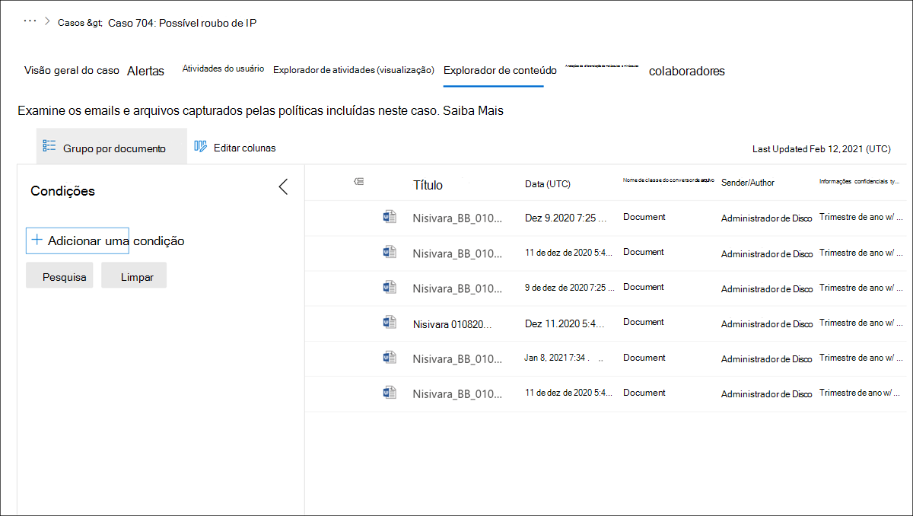

# Insider risk management Explorador de conteúdoInsider risk management Content explorer

O gerenciamento de risco interno O **Explorador** de conteúdo permite que os usuários atribuídos à função Investigadores de Gerenciamento de Riscos do *Insider* examinem o contexto e os detalhes do conteúdo associado à atividade em alertas.The insider risk management **Content explorer** allows users assigned the *Insider Risk Management Investigators* role to examine the context and details of content associated with activity in alerts. Os dados de caso no Explorador de Conteúdo são atualizados diariamente para incluir novas atividades.The case data in Content explorer is refreshed daily to include new activity. Para todos os alertas confirmados para um caso, cópias de arquivos de dados e mensagens são arquivadas como um instantâneo no tempo dos itens, mantendo os arquivos e mensagens originais nas fontes de armazenamento.For all alerts that are confirmed to a case, copies of data and message files are archived as a snapshot in time of the items, while maintaining the original files and messages in the storage sources. A cópia de dados e mensagens é transparente para o usuário associado ao alerta e ao proprietário do conteúdo.The copying of data and messages is transparent to the user associated with the alert and to the owner of the content. Para novos casos, geralmente leva cerca de uma hora para o conteúdo ser preenchido no Explorador de conteúdo.For new cases, it usually takes about an hour for content to populate in Content explorer. Para casos com grandes quantidades de conteúdo, pode levar mais tempo para criar um instantâneo.For cases with large amounts of content, it may take longer to create a snapshot. Se o conteúdo ainda estiver sendo carregado no Explorador de conteúdo, você verá um indicador de progresso que exibe a porcentagem de conclusão.If content is still loading in Content explorer, you will see a progress indicator that displays the completion percentage.

Em alguns casos, os dados associados a um caso podem não estar disponíveis como um instantâneo para revisão no Explorador de Conteúdo.In some cases, data associated with a case may not be available as a snapshot for review in Content explorer. Essa situação pode ocorrer quando os dados de caso foram excluídos ou movidos ou quando ocorre um erro temporário ao processar dados de caso.This situation may occur when case data has been deleted or moved, or when a temporary error occurs when processing case data. Se essa situação ocorrer, selecione **Exibir** arquivos na barra de avisos para exibir os nomes de arquivo, o caminho do arquivo e o motivo da falha para cada arquivo.If this situation occurs, select **View files** in the warning bar to view the file names, file path, and reason for the failure for each file. Se necessário, essas informações podem ser exportadas para um arquivo .csv (valores separados por vírgula).If needed, this information can be exported to a .csv (comma-separated values) file.

Se o conteúdo incluir permissões de Gerenciamento de Direitos de Informação, essas permissões serão mantidas para o conteúdo copiado e os usuários atribuídos à função *Insider Risk Management Investigators* precisarão dessas permissões e direitos se precisarem abrir e exibir os arquivos.If the content includes Information Rights Management permissions, these permissions are maintained for the copied content and users assigned the *Insider Risk Management Investigators* role will need these permissions and rights if they need to open and view the files. Cada arquivo e mensagem são atribuídos automaticamente a uma ID de arquivo exclusiva no caso de gerenciamento de risco interno para fins de gerenciamento.Each file and message are automatically assigned a unique file ID in the insider risk management case for management purposes. Os documentos associados às atividades de indicador de dispositivo não são incluídos no Explorador de conteúdo.Documents associated with device indicator activities are not included in Content explorer.

>[!Note]
>O explorador de conteúdo inclui atividades relacionadas Microsoft Office arquivos.Content explorer includes activities related to Microsoft Office files. As atividades no nível do site, como quando um site do SharePoint é excluído ou se as permissões do site são alteradas, não são incluídas no Explorador de conteúdo.Site-level activities, such as when a SharePoint site is deleted or if site permissions are changed, aren't included in Content explorer.

## Opções de colunaColumn options

Para facilitar que os analistas de risco e os investigadores revisem dados e mensagens capturados e revisem o contexto para o caso, várias ferramentas de filtragem e classificação são incluídas no explorador de conteúdo.To make it easier for risk analysts and investigators to review captured data and messages and review the context to the case, several filtering and sorting tools are included in the Content explorer. Para classificação básica, as  colunas de classe **Data** e Arquivo suportam a classificação usando os títulos de coluna no painel de filas de conteúdo.For basic sorting, the **Date** and **File class** columns support sorting using the column titles in the content queue pane. Outras colunas de fila estão disponíveis para adicionar ao modo de exibição para fornecer pivôs diferentes nos arquivos e mensagens.Other queue columns are available to add to the view to provide different pivots on the files and messages.

Para adicionar ou remover títulos de coluna para a fila de conteúdo, use o **controle Editar colunas** e selecione entre as seguintes opções de coluna.To add or remove column headings for the content queue, use the **Edit columns** control and select from the following column options. Essas colunas mapeiam para as condições comuns, de email e de propriedade de documento suportadas no explorador de conteúdo e listadas posteriormente neste artigo.These columns map to the common, email, and document property conditions supported in the Content explorer and listed later in this article.

| **Opção Column****Column option** | **Descrição****Description** |
|:------------------|:----------------|
| **Author****Author** | O campo de autor de documentos do Office, que persiste se um documento é copiado.The author field from Office documents, which persists if a document is copied. Por exemplo, se um usuário criar um documento e enviá-lo para outra pessoa que o carregue no SharePoint, o documento ainda manterá o autor original.For example, if a user creates a document and the emails it to someone else who then uploads it to SharePoint, the document will still retain the original author. |
| **Bcc****Bcc** | Disponível para mensagens de email, os usuários no campo mensagem Cc.Available for email messages, the users in the Bcc message field. |
| **Cc****Cc** | Disponível para mensagens de email, os usuários no campo mensagem Cc.Available for email messages, the users in the Cc message field. |
| **Caminho composto****Compound path** | Caminho acessível para humanos que descreve a origem do item.Human readable path that describes the source of the item. |
| **ID da conversa****Conversation ID** | ID da conversa da mensagem.Conversation Id from the message. |
| **Índice de conversa****Conversation index** | Índice de conversa da mensagem.Conversation index from the message. |
| **Tempo criado****Created time** | A hora em que o arquivo ou mensagem de email foi criado.The time the file or email message was created. |
| **Data (UTC)****Date (UTC)** | Para email, a data em que a mensagem foi recebida por um destinatário ou enviada pelo remetente.For email, the date a message was received by a recipient or sent by the sender. Para documentos, a data em que um documento foi modificado pela última vez.For documents, the date a document was last modified. A data está em Tempo Universal Coordenado (UTC).Date is in Coordinated Universal Time (UTC).|
| **Tema dominante****Dominant theme** | Tema dominante conforme calculado para análise.Dominant theme as calculated for analytics. |
| **ID do conjunto de emails****Email set ID** | ID do grupo para todas as mensagens no mesmo conjunto de emails.Group ID for all messages in the same email set. |
| **ID da família****Family ID** | Grupos de ID da família reúnem todos os itens; para email, esta coluna inclui a mensagem e todos os anexos; para documentos, esta coluna inclui o documento e todos os itens incorporados.Family Id groups together all items; for email, this column includes the message and all attachments; for documents, this column includes the document and any embedded items. |
| **Classe File****File class** | Para conteúdo do SharePoint e do OneDrive: **Document**; para conteúdo do Exchange: **Email** ou **Anexo.**For content from SharePoint and OneDrive: **Document**; for content from Exchange: **Email** or **Attachment**. |
| **ID do arquivo****File ID** | Identificador de documento exclusivo dentro do caso.Document identifier unique within the case. |
| **Ícone de tipo de arquivo****File type icon** | A extensão de um arquivo; por exemplo, docx, um, pptx ou xlsx.The extension of a file; for example, docx, one, pptx, or xlsx. Este campo é a mesma propriedade que a propriedade de site FileExtension.This field is the same property as the FileExtension site property. |
| **ID****ID** | O identificador GUID do arquivo.The GUID identifier for the file. |
| **ID Imutável****Immutable ID** | ID imutável conforme armazenado no Office 365.Immutable Id as stored in Office 365. |
| **Tipo inclusivo****Inclusive type** | Tipo inclusivo calculado para análise: **0** - não inclusivo; **1** - inclusive; **2** - inclusive menos; **3** - cópia inclusiva.Inclusive type calculated for analytics: **0** - not inclusive; **1** - inclusive; **2** - inclusive minus; **3** - inclusive copy. |
| **Última modificação****Last modified** | A data em que um documento foi alterado pela última vez.The date that a document was last changed. |
| **Marcado como representativo****Marked as representative** | Um documento de cada conjunto de duplicatas exatas é marcado como representantes.One document from each set of exact duplicates is marked as representatives. |
| **Tipo de mensagem****Message kind** | O tipo de mensagem de email a ser pesquisada.The type of email message to search for. Valores possíveis: contatos, documentos, email, dados externos, faxes, im, diários, reuniões, microsoft teams (retorna itens de chats, reuniões e chamadas no Microsoft Teams), anotações, postagens, RSS feeds, tarefas, caixa postalPossible values: contacts, docs, email, external data, faxes, im, journals, meetings, microsoft teams (returns items from chats, meetings, and calls in Microsoft Teams), notes, posts, RSS feeds, tasks, voicemail |
| **Participantes****Participants** | Lista de todos os participantes de uma mensagem; por exemplo, Remetente, Para, Cc, Cc.List of all participants of a message; for example, Sender, To, Cc, Bcc. |
| **ID dinâmica****Pivot ID** | A ID de um pivô.The ID of a pivot. |
| **Received****Received** | A data em que uma mensagem de email foi recebida pelo destinatário.The date that an email message was received by a recipient. Esse campo é a mesma propriedade que a propriedade Received email.This field is the same property as the Received email property. |
| **Destinatários****Recipients** | Todos os campos de destinatário em uma mensagem de email.All recipient fields in an email message. Esses campos são To, Cc e Cc.These fields are To, Cc, and Bcc. |
| **ID representativa****Representative ID** | Identificador numérico de cada conjunto de duplicatas exatas.Numeric identifier of each set of exact duplicates. |
| **Sender****Sender** | O remetente de uma mensagem de email.The sender of an email message. |
| **Remetente/Autor****Sender/Author** | Para email, a pessoa que enviou uma mensagem.For email, the person who sent a message. Para documentos, a pessoa citada no campo autor de documentos do Office.For documents, the person cited in the author field from Office documents. Você pode digitar mais de um nome, separado por vírgulas.You can type more than one name, separated by commas. Dois ou mais valores são logicamente conectadas pelo operador OR.Two or more values are logically connected by the OR operator. |
| **Tipos de informações confidenciais****Sensitive info types** | Os tipos de informações confidenciais identificados no conteúdo.The sensitive info types identified in content. |
| **Rótulos de confidencialidade****Sensitivity labels** | Os rótulos de sensibilidade aplicados ao conteúdo.The sensitivity labels applied to the content. |
| **Sent****Sent** | A data em que uma mensagem de email foi enviada pelo remetente.The date that an email message was sent by the sender. Esse campo é a mesma propriedade que a propriedade Email Enviado.This field is the same property as the Sent email property. |
| **Tamanho****Size** | Para emails e documentos, o tamanho do item (em bytes).For both email and documents, the size of the item (in bytes). |
| **Assunto****Subject** | O texto na linha de assunto de uma mensagem de email.The text in the subject line of an email message. |
| **Assunto/Título****Subject/Title** | Para email, o texto na linha de assunto de uma mensagem.For email, the text in the subject line of a message. Para documentos, o título do documento.For documents, the title of the document. Conforme explicado anteriormente, a propriedade Title é metadados especificados em Microsoft Office documentos.As previously explained, the Title property is metadata specified in Microsoft Office documents. Você pode digitar o nome de mais de um assunto/título, separado por vírgulas.You can type the name of more than one subject/title, separated by commas. Dois ou mais valores são logicamente conectadas pelo operador OR.Two or more values are logically connected by the OR operator. |
| **Lista de temas****Themes list** | Lista de temas conforme calculado para análise.Themes list as calculated for analytics. |
| **Título****Title** | O título do documento.The title of the document. A propriedade Title consiste em metadados que são especificados em documentos do Office.The Title property is metadata that's specified in Office documents. É diferente do nome do arquivo do documento.It's different than the file name of the document. |
| **To****To** | O destinatário de uma mensagem de email no campo Para.The recipient of an email message in the To field. |

## Condições avançadas de pesquisaAdvanced search conditions

Você pode adicionar condições de pesquisa para restringir o escopo de uma pesquisa e retornar um conjunto mais refinado de resultados.You can add search conditions to narrow the scope of a search and return a more refined set of results. Cada condição adiciona uma cláusula à consulta de pesquisa que é criada e executada quando você inicia a pesquisa.Each condition adds a clause to the search query that is created and run when you start the search. Uma condição é conectada logicamente à consulta de palavra-chave (especificada na caixa de palavra-chave) por um operador lógico (que é representado como c:c) que é semelhante em funcionalidade ao operador AND.A condition is logically connected to the keyword query (specified in the keyword box) by a logical operator (which is represented as c:c) that is similar in functionality to the AND operator. Isso significa que os itens devem atender à consulta de palavra-chave e a uma ou mais condições a serem incluídas nos resultados da pesquisa.That means that items have to satisfy both the keyword query and one or more conditions to be included in the search results. Essa funcionalidade é como as condições ajudam a restringir seus resultados.This functionality is how conditions help to narrow your results.

Para ferramentas avançadas de filtro e pesquisa, expanda o painel **Filtro** no lado esquerdo da fila de conteúdo.For advanced filter and search tools, expand the **Filter** pane on the left side of the content queue. Selecione o **botão Adicionar uma condição** para abrir a lista de condições:Select the **Add a condition** button to open the condition list:

### Operadores usados com condiçõesOperators used with conditions

|**Operator****Operator**|**Equivalente de consulta****Query equivalent**|**Descrição****Description**|
|:-----------|:-------------------|:--------------|
| **After****After** |`property>date`| Usado com condições de data.Used with date conditions. Retorna itens que foram enviados, recebidos ou modificados após a data especificada.Returns items that were sent, received, or modified after the specified date.|
| **Before****Before** |`property<date`| Usado com condições de data.Used with date conditions. Retorna itens que foram enviados, recebidos ou modificados antes da data especificada.Returns items that were sent, received, or modified before the specified date.|
| **Between****Between** |`date..date`| Use com condições de data e tamanho.Use with date and size conditions. Quando usado com uma condição de data, retorna itens que foram enviados, recebidos ou modificados no intervalo de datas especificado.When used with a date condition, returns items there were sent, received, or modified within the specified date range. Quando usado com uma condição de tamanho, retorna itens cujo tamanho está dentro do intervalo especificado.When used with a size condition, returns items whose size is within the specified range.|
| **Contém todos os****Contains all of** |`(property:value) OR (property:value)`| Usado com condições para propriedades que especificam um valor de cadeia de caracteres.Used with conditions for properties that specify a string value. Retorna itens que contêm todos os valores de cadeia de caracteres especificados.Returns items that contain all of one or more specified string values. |
| **Contains any of****Contains any of** |`(property:value) OR (property:value)`| Usado com condições para propriedades que especificam um valor de cadeia de caracteres.Used with conditions for properties that specify a string value. Retorna itens que contêm qualquer parte de um ou mais valores da cadeia de caracteres especificada.Returns items that contain any part of one or more specified string values.|
| **Contém nenhum dos****Contains none of** |`-property:value`    `NOT property:value`| Usado com condições para propriedades que especificam um valor de cadeia de caracteres.Used with conditions for properties that specify a string value. Retorna itens que não contêm qualquer parte do valor da cadeia de caracteres especificada.Returns items that don't contain any part of the specified string value.|
| **Não é igual a nenhum dos****Doesn't equal any of** |`-property=value`    `NOT property=value`| Usado com condições para propriedades que especificam um valor de cadeia de caracteres.Used with conditions for properties that specify a string value. Retorna itens que não contêm a cadeia de caracteres específica.Returns items that don't contain the specific string.|
| **Igual a****Equals** |`size=value`| Retorna itens que são iguais ao tamanho especificado. 1Returns items that are equal to the specified size.1|
| **Igual a qualquer****Equals any of** |`(property=value) OR (property=value)`| Usado com condições para propriedades que especificam um valor de cadeia de caracteres. Retorna itens que são uma correspondência exata de um ou mais valores da cadeia de caracteres especificada.Used with conditions for properties that specify a string value. Returns items that are an exact match of one or more specified string values.|
| **Igual a nenhum dos****Equals none of** |`(property=value) OR (property=value)`| Usado com condições para propriedades que especificam um valor de cadeia de caracteres.Used with conditions for properties that specify a string value. Retorna itens que não corresponderem a um ou mais valores de cadeia de caracteres especificados.Returns items that do not match one or more specified string values. |
| **Maior do que****Greater than** |`size>value`| Retorna itens onde a propriedade especificada é maior do que o valor especificado. 1Returns items where the specified property is greater than the specified value.1|
| **Greater or equal****Greater or equal** |`size>=value`| Retorna itens onde a propriedade especificada é maior ou igual ao valor especificado. 1Returns items where the specified property is greater than or equal to the specified value.1|
| **Menor que****Less than** |`size<value`| Retorna itens que são maiores ou iguais ao valor específico. 1Returns items that are greater than or equal to the specific value.1|
| **Less or equal****Less or equal** |`size<=value`| Retorna itens que são maiores ou iguais ao valor específico. 1Returns items that are greater than or equal to the specific value.1|
| **Not equal****Not equal** |`size<>value`| Retorna itens que não são iguais ao tamanho especificado. 1Returns items that don't equal the specified size.1|

> [!NOTE]
> 1 Esse operador está disponível apenas para condições que usam a propriedade Size.1 This operator is available only for conditions that use the Size property.

### Condições de propriedade comunsCommon property conditions

| **Opção Condição****Condition option** | **Descrição****Description** |
|:---------------------|:----------------|
| **Date****Date** | Para email, a data em que a mensagem foi recebida por um destinatário ou enviada pelo remetente.For email, the date a message was received by a recipient or sent by the sender. Para documentos, a data em que um documento foi modificado pela última vez.For documents, the date a document was last modified. |
| **Remetente/Autor****Sender/Author** | Para email, a pessoa que enviou uma mensagem.For email, the person who sent a message. Para documentos, a pessoa citada no campo autor de documentos do Office.For documents, the person cited in the author field from Office documents. Você pode digitar mais de um nome, separado por vírgulas.You can type more than one name, separated by commas. Dois ou mais valores são logicamente conectadas pelo operador **OR**.Two or more values are logically connected by the **OR** operator. |
| **Tamanho****Size** | Para emails e documentos, o tamanho do item (em bytes).For both email and documents, the size of the item (in bytes). |
| **Assunto/Título****Subject/Title** | Para email, o texto na linha de assunto de uma mensagem.For email, the text in the subject line of a message. Para documentos, o título do documento.For documents, the title of the document. A propriedade Title em documentos é metadados especificados em Microsoft Office documentos.The Title property in documents is metadata specified in Microsoft Office documents. Você pode digitar o nome de mais de um assunto/título, separado por vírgulas.You can type the name of more than one subject/title, separated by commas. Dois ou mais valores são logicamente conectadas pelo operador OR.Two or more values are logically connected by the OR operator. |

### Condições da propriedade EmailEmail property conditions

A tabela a seguir lista as condições de propriedade de mensagem de email disponíveis no Explorador de Conteúdo.The following table lists email message property conditions available in the Content explorer.

| **Opção Condição****Condition option** | **Descrição****Description** |
|:---------------------|:----------------|
| **Bcc****Bcc** | O campo Cc de uma mensagem de email.The Bcc field of an email message. |
| **Cc****Cc** | O campo Cc de uma mensagem de email.The Cc field of an email message. |
| **Segurança de email****Email security** | Configuração de segurança da mensagem.Security setting of the message. |
| **Sensibilidade de email****Email sensitivity** | Configuração de sensibilidade da mensagem.Sensitivity setting of the message. |
| **ID do conjunto de emails****Email set ID** | ID do grupo para todas as mensagens no mesmo conjunto de emails.Group ID for all messages in the same email set. |
| **De****From** | O remetente de uma mensagem de email.The sender of an email message. |
| **Tem anexo****Has attachment** | Indica se uma mensagem tem um anexo.Indicates whether a message has an attachment. Use os valores **true** ou **false**.Use the values **true** or **false**. |
| **Importance****Importance** | A prioridade de uma mensagem de email, que um remetente pode especificar ao enviar uma mensagem. Por padrão, as mensagens são enviadas com prioridade normal, a menos que o remetente defina a prioridade como **alta** ou **baixa**.The importance of an email message, which a sender can specify when sending a message. By default, messages are sent with normal importance, unless the sender sets the importance as **high** or **low**. |
| **Data de término da reunião****Meeting end date** | Data de término da reunião para reuniões.Meeting end date for meetings. |
| **Data de início da reunião****Meeting start date** | Data de início da reunião para reuniões.Meeting start date for meetings. |
| **Tipo de mensagem****Message kind** | O tipo de mensagem de email a ser pesquisada.The type of email message to search for. Valores possíveis: contatos, documentos, email, dados externos, faxes, im, diários, reuniões, microsoft teams (retorna itens de chats, reuniões e chamadas no Microsoft Teams), anotações, postagens, rssfeeds, tarefas, caixa postalPossible values: contacts, docs, email, external data, faxes, im, journals, meetings, microsoft teams (returns items from chats, meetings, and calls in Microsoft Teams), notes, posts, rssfeeds, tasks, voicemail |
| **Domínio participante****Participant domain** | Lista de todos os domínios de participantes de uma mensagem.List of all domains of participants of a message. |
| **Participantes****Participants** | Todos os campos de pessoas em uma mensagem de email.All the people fields in an email message. Esses campos são From, To, Cc e Cc.These fields are From, To, Cc, and Bcc. |
| **Received****Received** | A data em que uma mensagem de email foi recebida pelo destinatário.The date that an email message was received by a recipient. |
| **Domínios de destinatário****Recipient domains** | Lista de todos os domínios de destinatários de uma mensagem.List of all domains of recipients of a message. |
| **Sender****Sender** | Campo Remetente (De) para tipos de mensagem.Sender (From) field for message types.  Format é **DisplayName \<SmtpAddress>**.Format is **DisplayName \<SmtpAddress>**. |
| **Domínio do remetente****Sender domain** | Domínio do remetente.Domain of the sender. |
| **Assunto****Subject** | O texto na linha de assunto de uma mensagem de email.The text in the subject line of an email message.    **Observação:** Quando você usa a propriedade Subject em uma consulta, a pesquisa retorna todas as mensagens nas quais a linha de assunto contém o texto que você está procurando.**Note:** When you use the Subject property in a query, the search returns all messages in which the subject line contains the text you're searching for. Em outras palavras, a consulta não retorna apenas as mensagens que têm uma combinação exata.In other words, the query doesn't return only those messages that have an exact match. Por exemplo, se você pesquisar , seus resultados incluirão mensagens com o assunto "Finanças Trimestrais `subject:"Quarterly Financials"` 2018".For example, if you search for `subject:"Quarterly Financials"`, your results will include messages with the subject "Quarterly Financials 2018". |
| **To****To** | O campo Para de uma mensagem de email.The To field of an email message. |
| **Exclusivo no conjunto de emails****Unique in email set** | False se houver uma duplicata do anexo em seu conjunto de emails.False if there's a duplicate of the attachment in its email set. |

## Condições da propriedade DocumentDocument property conditions

A tabela a seguir lista as condições de propriedade de documentos disponíveis no Explorador de conteúdo.The following table lists documents property conditions available the Content explorer. Muitas dessas condições de propriedade são compartilhadas com conjuntos de revisão incluídos em casos de [Descoberta Avançada.](document-metadata-fields-in-Advanced-eDiscovery.md)Many of these property conditions are shared with review sets included in [Advanced eDiscovery cases](document-metadata-fields-in-Advanced-eDiscovery.md).

| **Opção Condição****Condition option** | **Descrição****Description** |
|:---------------------|:----------------|
| **Pontuação de privilégio advogado-cliente****Attorney-client privilege score** | Pontuação de conteúdo do modelo de privilégio advogado-cliente.Attorney-client privilege model content score. |
| **Author****Author** | O campo de autor de documentos do Office, que persiste se um documento é copiado.The author field from Office documents, which persists if a document is copied. Por exemplo, se um usuário criar um documento e enviá-lo para outra pessoa que o carregue no SharePoint, o documento ainda manterá o autor original.For example, if a user creates a document and the emails it to someone else who then uploads it to SharePoint, the document will still retain the original author. |
| **Rótulos de conformidade****Compliance labels** | Rótulos de conformidade aplicados no Office 365.Compliance labels applied in Office 365. |
| **Caminho composto****Compound path** | Caminho acessível para humanos que descreve a origem do item.Human readable path that describes the source of the item. |
| **ID da conversa****Conversation ID** | ID da conversa da mensagem.Conversation Id from the message. |
| **Tempo criado****Created time** | A hora em que o arquivo ou mensagem de email foi criado.The time the file or email message was created. |
| **Custodian****Custodian** | Nome do custodiado ao item associado.Name of the custodian the item was associated with. |
| **Tema dominante****Dominant theme** | Tema dominante conforme calculado para análise.Dominant theme as calculated for analytics. |
| **ID da família****Family ID** | Grupos de ID da família reúnem todos os itens; para email, este campo inclui a mensagem e todos os anexos; para documentos, este campo inclui o documento e todos os itens incorporados.Family Id groups together all items; for email, this field includes the message and all attachments; for documents, this field includes the document and any embedded items. |
| **Classe File****File class** | Para conteúdo do SharePoint e do OneDrive: **Document**; para conteúdo do Exchange: \*\*Email ou **Anexo.**For content from SharePoint and OneDrive: **Document**; for content from Exchange: \*\*Email or **Attachment**. |
| **Tipos de arquivo****File types** | A extensão de um arquivo; por exemplo, docx, um, pptx ou xlsx.The extension of a file; for example, docx, one, pptx, or xlsx. |
| **Tem participante advogado****Has attorney participant** | True quando pelo menos um dos participantes é encontrado na lista de advogados; caso contrário, o valor será False.True when at least one of the participants is found in the attorney list; otherwise, the value is False. |
| **ID Imutável****Immutable ID** | ID imutável conforme armazenado no Office 365.Immutable Id as stored in Office 365. |
| **Tipo inclusivo****Inclusive type** | Tipo inclusivo calculado para análise: **0** - não inclusivo; **1** - inclusive; **2** - inclusive menos; **3** - cópia inclusiva.Inclusive type calculated for analytics: **0** - not inclusive; **1** - inclusive; **2** - inclusive minus; **3** - inclusive copy. |
| **Classe Item****Item class** | Classe item fornecida pelo servidor exchange; por exemplo, **IPM. Observação**Item class supplied by exchange server; for example, **IPM.Note** |
| **Última modificação****Last modified** | A data em que um documento foi alterado pela última vez.The date that a document was last changed. |
| **ID de carga****Load ID** | ID de carga, na qual o item foi carregado em um conjunto de revisão.Load Id, in which the item was loaded into a review set. |
| **Nome do local****Location name** | Cadeia de caracteres que identifica a origem do item.String that identifies the source of the item.  Para o exchange, esse campo será o endereço SMTP da caixa de correio.For exchange, this field will be the SMTP address of the mailbox. Para SharePoint e OneDrive, a URL para o conjunto de sites.For SharePoint and OneDrive, the URL to the site collection. |
| **Marcado como representativo****Marked as representative** | Um documento de cada conjunto de duplicatas exatas é marcado como representantes.One document from each set of exact duplicates is marked as representatives. |
| **Extensão de arquivo nativo****Native file extension** | Extensão nativa do item.Native extension of the item. |
| **Nome de arquivo nativo****Native file name** | Nome de arquivo nativo do item.Native file name of the item. |
| **NdEtSortExclAttach****NdEtSortExclAttach** | Concatenação de conjunto de email e conjunto de ND para classificação eficiente no momento da revisão; D é adicionado como um prefixo a conjuntos de ND e E é adicionado a conjuntos de email.Concatenation of email set and ND set for efficient sorting at review time; D is added as a prefix to ND sets and E is added to email sets. |
| **ID dinâmica****Pivot ID** | A ID de um pivô.The ID of a pivot. |
| **Potencialmente privilegiado****Potentially privileged** | True se o modelo de detecção de privilégio advogado-cliente considerar o documento potencialmente privilegiado.True if attorney-client privilege detection model considers the document potentially privileged. |
| **Status do processamento****Processing status** | Status de processamento depois que o item foi adicionado a um conjunto de revisão.Processing status after the item was added to a review set. |
| **Percentil de leitura****Read percentile** | Ler percentil para o documento com base em Relevância.Read percentile for the document based on Relevance. |
| **Pontuação de relevância****Relevance score** | Pontuação de relevância de um documento com base na Relevância.Relevance score of a document based on Relevance. |
| **Marca de relevância****Relevance tag** | Pontuação de relevância de um documento com base na Relevância.Relevance score of a document based on Relevance. |
| **ID representativa****Representative ID** | Identificador numérico de cada conjunto de duplicatas exatas.Numeric identifier of each set of exact duplicates. |
| **Marcas****Tags** | Marcas aplicadas em um conjunto de revisão.Tags applied in a review set. |
| **Lista de temas****Themes list** | Lista de temas conforme calculado para análise.Themes list as calculated for analytics. |
| **Título****Title** | O título do documento.The title of the document. A propriedade Title consiste em metadados que são especificados em documentos do Office.The Title property is metadata that's specified in Office documents. É diferente do nome do arquivo do documento.It's different than the file name of the document. |
| **Foi remediado****Was remediated** | True se o item foi remediado, caso contrário, False.True if the item was remediated, otherwise False. |
| **Contagem de palavras****Word count** | O número de palavras em um arquivo.The number of words in a file. |
