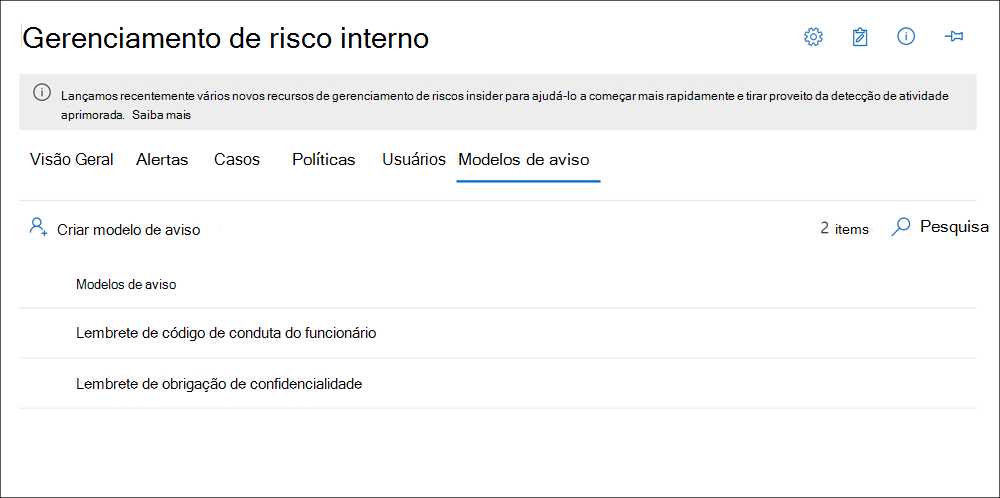

# <a name="insider-risk-management-notice-templates"></a>Modelos de aviso de gerenciamento de risco do insider

Os modelos de aviso de gerenciamento de risco do insider permitem que você envie mensagens de email aos usuários quando suas atividades geram uma correspondência de política e alerta. Na maioria dos casos, as ações do usuário que geram alertas são o resultado de erros ou atividades inadvertidas sem intenção mal. Os avisos servem como lembretes simples para que os usuários tenham mais cuidado para fornecer links para informações para o treinamento atualizado ou para recursos de política corporativa. Os avisos podem ser uma parte importante do seu programa de treinamento de conformidade interno e podem ajudar a criar uma trilha de auditoria documentada para usuários com atividades recorrentes de riscos.

Criar modelos de aviso se quiser enviar aos usuários um aviso de lembrete por email para correspondências de política como parte do processo de solução de problemas. Os avisos só podem ser enviados ao endereço de email do usuário associado ao alerta específico que está sendo revisado. Ao selecionar um modelo de aviso a ser aplicado a uma correspondência de política, você pode optar por aceitar os valores de campo definidos no modelo ou substituir os campos, conforme necessário.

## <a name="notice-templates-dashboard"></a>Painel de modelos de aviso

O **painel de modelos de avisos** exibe uma lista de modelos de aviso configurados e permite que você crie novos modelos de aviso. Os modelos de aviso são listados em ordem de data inversa com o modelo de aviso mais recente listado primeiro.



## <a name="html-for-notices"></a>HTML para avisos

Se quiser criar mais de uma mensagem de email baseada em texto simples para notificações, você poderá criar uma mensagem mais detalhada usando HTML no campo corpo da mensagem de um modelo de aviso. O exemplo a seguir fornece o formato de corpo da mensagem para um modelo de notificação de email baseado em HTML básico:

```HTML
<!DOCTYPE html>
<html>
<body>
<h2>Action Required: Contoso User Code of Conduct Policy Training</h2>
<p>A recent activity you've performed has generated a risk alert prohibited by the Contoso User <a href='https://www.contoso.com'>Code of Conduct Policy</a>.</p>
<p>You are required to attend the Contoso User Code of Conduct <a href='https://www.contoso.com'>training</a> within the next 14 days. Please contact <a href='mailto:hr@contoso.com'>Human Resources</a> with any questions about this training request.</p>
<p>Thank you,</p>
<p><em>Human Resources</em></p>
</body>
</html>
```

> [!NOTE]
> A implementação de atributo HTML href nos modelos de aviso de gerenciamento de risco do insider atualmente suporta apenas aspas simples em vez de aspas duplas para referências de URL.

## <a name="create-a-new-notice-template"></a>Criar um novo modelo de aviso

Para criar um novo modelo de aviso de gerenciamento de risco do Insider, você usará o assistente de aviso na solução de **Gerenciamento de risco do insider** no centro de conformidade da Microsoft 365.

Conclua as etapas a seguir para criar um novo modelo de aviso de gerenciamento de risco do insider:

1. No [centro de conformidade da Microsoft 365](https://compliance.microsoft.com), vá para gerenciamento de **risco do insider** e selecione a guia **modelos de aviso** .
2. Selecione **criar modelo de aviso** para abrir o assistente de aviso.
3. Na página **criar um novo modelo de aviso** , preencha os seguintes campos:
    - **Nome do modelo**: Insira um nome amigável para o aviso. Esse nome aparece na lista de avisos no painel de aviso e na lista de seleção de aviso ao enviar avisos de uma ocorrência.
    - **Enviar de**: Insira o endereço de email do remetente para o aviso. Esse endereço aparecerá no campo **de:** em todos os avisos enviados aos usuários, a menos que sejam alterados ao enviar um aviso de um caso.
    - Campos **CC e Cco** : usuários ou grupos opcionais que serão notificados da correspondência da política, selecionados no Active Directory para a sua assinatura.
    - **Subject**: as informações que aparecem na linha de assunto da mensagem dão suporte a caracteres de texto.
    - **Corpo da mensagem**: as informações que aparecem no corpo da mensagem dão suporte a valores de texto ou HTML.
4. Selecione **criar** para criar e salvar o modelo de aviso ou selecione **Cancelar** para fechar sem salvar o modelo de aviso.

## <a name="update-a-notice-template"></a>Atualizar um modelo de aviso

Para atualizar um modelo de aviso de gerenciamento de risco do insider existente, conclua as seguintes etapas:

1. No [centro de conformidade da Microsoft 365](https://compliance.microsoft.com), vá para gerenciamento de **risco do insider** e selecione a guia **modelos de aviso** .
2. No painel de aviso, selecione o modelo de aviso que você deseja gerenciar.
3. Na página detalhes do aviso, selecione **Editar**
4. Na página **Editar** , você pode editar os seguintes campos:
    - **Nome do modelo**: Insira um novo nome amigável para o aviso. Esse nome aparece na lista de avisos no painel de aviso e na lista de seleção de aviso ao enviar avisos de uma ocorrência.
    - **Enviar de**: Atualize o endereço de email do remetente para o aviso. Esse endereço aparecerá no campo **de:** em todos os avisos enviados aos usuários, a menos que sejam alterados ao enviar um aviso de um caso.
    - Campos **CC e Cco** : atualizar usuários ou grupos opcionais a serem notificados sobre a correspondência da política, selecionados no Active Directory para a sua assinatura.
    - **Assunto**: atualização de informações que aparece na linha de assunto da mensagem, com suporte para caracteres de texto.
    - **Corpo da mensagem**: atualização de informações que aparece no corpo da mensagem, suporta valores de texto ou HTML.
5. Selecione **salvar** para atualizar e salvar o aviso ou selecione **Cancelar** para fechar sem salvar o modelo de aviso.

## <a name="delete-a-notice-template"></a>Excluir um modelo de aviso

Para excluir um modelo de aviso de gerenciamento de risco do insider existente, conclua as seguintes etapas:

1. No [centro de conformidade da Microsoft 365](https://compliance.microsoft.com), vá para gerenciamento de **risco do insider** e selecione a guia **modelos de aviso** .
2. No painel de aviso, selecione o modelo de aviso que você deseja excluir.
3. Selecione o ícone **excluir** na barra de ferramentas.
4. Para excluir o modelo de aviso, selecione **Sim** na caixa de diálogo Excluir. Para cancelar a exclusão, selecione **Cancelar**.
