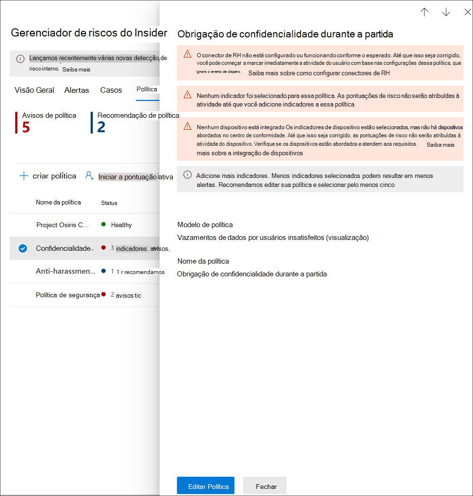

# <a name="insider-risk-management-policies"></a>Políticas de gerenciamento de risco interno

As políticas de gerenciamento de risco interno determinam quais usuários estão no escopo e quais tipos de indicadores de risco estão configurados para os alertas. Você pode criar rapidamente uma política que se aplique a todos os usuários da sua organização ou definir usuários individuais ou grupos para gerenciamento em uma política. As políticas suportam prioridades de conteúdo para se concentar nas condições políticas em vários ou específicos tipos confidenciais de dados e rótulos de dados do Microsoft Teams e sites do SharePoint. Usando modelos, você pode selecionar indicadores de risco específicos e personalizar limiares de eventos para indicadores de políticas, personalizando efetivamente as pontuações de risco, nível e freqüência dos alertas. Além disso, os impulsionadores de pontuação de risco e detecções de anomalias ajudam a identificar a atividade do usuário que é de maior importância ou mais incomum. As janelas de política permitem definir o prazo para aplicar a política para alertar as atividades e são usadas para determinar a duração da política uma vez ativada.

Confira o [Vídeo de Configuração de Políticas de Gerenciamento de Risco Interno ](https://www.youtube.com/watch?v=kudK5ajZTUo) para obter uma visão geral de como as políticas criadas com modelos de política internas podem ajudá-lo a agir rapidamente em relação aos riscos potenciais.

## <a name="policy-dashboard"></a>Painel de política

O **Painel de Política** permite que você veja rapidamente as políticas na sua organização, a integridade da política, adicione manualmente os usuários às políticas e a visualização do status dos alertas associados a cada política.

- **Nome da política**: O nome atribuído à política no assistente de política.
- **Status**: O estado de integridade de cada política. Exibe o número de avisos e recomendações da política ou um status de *Íntegro* para políticas sem problemas.  Você pode clicar na política para ver os detalhes do estado de integridade para quaisquer avisos ou recomendações.
- **Alertas ativos**: O número de alertas ativos para cada política.
- **Alertas confirmados**: O número total de alertas que resultaram em casos a partir da política nos últimos 365 dias.
- **Ações tomadas sobre alertas**: O número total de alertas que foram confirmados ou dispensados durante os últimos 365 dias.
- **Eficácia do alerta da política**: O percentual determinado pelo total de alertas confirmados dividido pelo total de ações tomadas sobre os alertas (que é a soma dos alertas que foram confirmados ou dispensados no ano passado).


## <a name="policy-recommendations-from-analytics-preview"></a>Recomendações de políticas da análise (visualização)

A análise de riscos internos permite que você conduza uma avaliação de riscos internos potenciais na sua organização sem configurar nenhuma política de riscos internos. Esta avaliação pode ajudar sua organização a identificar áreas potenciais de maior risco para o usuário e ajudar a determinar o tipo e o escopo das políticas de gerenciamento de risco interno que você pode considerar configurar.

Para saber mais sobre a análise de risco interno e recomendações de políticas, consulte [Configurações de gerenciamento de risco interno: Análises (visualização)](insider-risk-management-settings.md#analytics-preview).

## <a name="policy-templates"></a>Modelos de política

Modelos de gerenciamento de risco interno são condições de política pré-definidas que definem os tipos de indicadores de risco e o modelo de pontuação de risco utilizado pela política. Cada política deve ter um modelo atribuído no assistente de criação de políticas antes que a política seja criada. O gerenciamento de risco interno suporta até cinco políticas para cada modelo de política. Quando criar uma nova política de risco interno com o assistente de política, você escolherá um dos seguintes modelos de política:

### <a name="data-theft-by-departing-users"></a>Furto de dados por usuários em processo de desligamento

Quando os usuários deixam sua organização, há indicadores de risco específicos normalmente associados ao furto de dados por estes usuários em processo de desligamento. Este modelo de política usa indicadores de exfiltração para pontuação de risco e se concentra na detecção e nos alertas nesta área de risco. O furto de dados por usuários em processo de desligamento pode incluir o download de arquivos do SharePoint Online, impressão de arquivos e cópia de dados para serviços de armazenamento e mensagens pessoais na nuvem próximos à data de demissão e/ou término do emprego. Usando o conector de RH do Microsoft 365 ou a opção de monitorar automaticamente a exclusão da conta do usuário no Azure Active Directory para sua organização, este modelo começa a pontuar os indicadores de risco relacionados a essas atividades e como eles se correlacionam com o status de emprego do usuário.

> [!IMPORTANT]
> Ao usar este modelo, você pode configurar um conector de RH do Microsoft 365 para importar periodicamente informações de demissão e data de rescisão para os usuários na sua organização. Consulte o artigo [Importar dados com o conector de RH ](import-hr-data.md) para obter orientações passo a passo para configurar o conector de RH do Microsoft 365 para sua organização. Se você optar por não usar o conector de RH, deverá selecionar a opção Conta de usuário excluída do Azure AD ao configurar eventos de gatilho no assistente de política.

### <a name="general-data-leaks"></a>Vazamento de dados gerais

Proteger e prevenir o vazamento de dados é um desafio constante para a maioria das organizações, especialmente com o rápido crescimento de novos dados criados por usuários, dispositivos e serviços. Os usuários podem criar, armazenar e compartilhar informações entre serviços e dispositivos que tornam o gerenciamento do vazamento de dados cada vez mais complexo e difícil. Os vazamento de dados podem incluir compartilhamento acidental de informações fora da sua organização ou furto de dados com intenção maliciosa. Com uma política de Prevenção de Perda de Dados (DLP) atribuída ou o evento de disparo interno, este modelo começa a pontuar detecções em tempo real de downloads de dados suspeitos do SharePoint Online, compartilhamento de arquivos e pastas, impressão de arquivos e cópia de dados para serviços pessoais de armazenamento e mensagens na nuvem.

Ao usar um modelo de *Vazamento de dados*, você pode atribuir uma política DLP para acionar indicadores na política de risco interno para alertas de alta severidade na sua organização. Sempre que um alerta de alta severidade for gerado por uma regra de política DLP adicionada ao log de auditoria do Office 365, as políticas de risco interno criadas com este modelo examinarão automaticamente o alerta de DLP de alta gravidade. Se o alerta contiver um usuário dentro do escopo definido na política de risco interno, o alerta será processado pela política de risco interno como um novo alerta e será atribuído a severidade do risco interno e pontuação de risco. Esta política lhe permite avaliar este alerta no contexto de outras atividades incluídas no caso. Se você não escolher uma política DLP, deverá selecionar o evento de disparo interno.

#### <a name="data-leaks-policy-guidelines"></a>Diretrizes da política de vazamento de dados

Ao criar ou modificar políticas DLP para uso com políticas de gerenciamento de risco interno, considere as seguintes diretrizes:

- Priorize os eventos de filtragem de dados e seja seletivo ao atribuir as configurações do **Relatórios de incidentes** para *Alto* ao configurar regras em suas políticas de DLP. Por exemplo, enviar documentos confidenciais por email para um concorrente conhecido deve ser um evento de exfiltração de nível de alerta *Alto*. A atribuição excessiva do nível *Alto* nas configurações de **Relatórios de incidentes** em outras regras de política DLP pode aumentar o ruído no fluxo de trabalho de alerta de gerenciamento de risco interno e tornar mais difícil para seus investigadores e analistas de dados avaliarem adequadamente esses alertas. Por exemplo, atribuir níveis *Altos* de alerta para acessar atividades de negação em políticas DLP torna mais desafiador avaliar atividades e comportamentos de usuários realmente arriscados.
- Certifique-se de compreender e configurar corretamente os usuários dentro do escopo tanto na DLP como nas políticas de gerenciamento de risco interno. Somente usuários definidos como no escopo das políticas de gerenciamento de risco interno usando o modelo de **Vazamento de dados** terão alertas de política DLP de alta severidade processados. Além disso, apenas os usuários definidos como no escopo em uma regra para um alerta DLP de alta severidade serão examinados pela política de gerenciamento de risco interno para consideração. É importante que você não configure inconscientemente os usuários no âmbito das suas políticas DLP e de risco interno de forma conflituosa.

     Por exemplo, se suas regras de política DLP forem direcionadas apenas a usuários da equipe de vendas e a política de risco interno criada a partir do modelo de **Vazamento de dados** tiver definido todos os usuários como no escopo, a política de risco interno só irá realmente processar alertas DLP de alta severidade para os usuários na equipe de vendas. A política de risco interno não receberá nenhum alerta de DLP de alta prioridade para que os usuários processem que não estejam definidos nas regras de DLP neste exemplo. Por outro lado, se sua política de gerenciamento de risco interno criada a partir dos modelos de **Vazamento de dados** tiver como escopo apenas usuários na equipe de vendas e a política de DLP atribuída tiver como escopo todos os usuários, a política de risco interno só processará alertas de DLP de alta severidade para membros da equipe de vendas. A política de gerenciamento de risco interno irá ignorar os alertas de DLP de alta severidade para todos os usuários que não fazem parte da equipe de vendas.

- Certifique-se de que a configuração da regra **Relatórios de incidentes** na política DLP usada para este modelo de gerenciamento de risco interno esteja configurada para alertas de nível de *Alta* severidade. O nível de *Alta* severidade são os eventos de disparo e os alertas de gerenciamento de risco interno não serão gerados a partir das regras nas políticas DLP com o campo **Relatórios de incidentes** definido como *Baixo* ou *Médio*.

    

     > [!NOTE]
     > Ao criar uma nova política DLP usando os modelos internos, você precisará selecionar a opção **Criar ou personalizar regras DLP avançadas** para definir a configuração de **Relatórios de incidentes** para o nível de *Alta* severidade.

Cada política de gerenciamento de risco interno criada a partir do modelo de **Vazamento de dados** pode ter apenas uma política DLP atribuída. Considere a criação de uma política DLP dedicada que combina as diferentes atividades que você deseja detectar e atuar como eventos de disparo para políticas de risco interno que usam o modelo de **Vazamento de dados**.

Consulte o artigo [Criar, testar e afinar uma política DLP](create-test-tune-dlp-policy.md) para orientação passo a passo para configurar políticas DLP para sua organização.

### <a name="data-leaks-by-priority-users-preview"></a>Vazamento de dados por usuários prioritários (visualização)

A proteção de dados e a prevenção de vazamentos de dados para usuários em sua organização podem depender de sua posição, nível de acesso a informações confidenciais ou histórico de risco. Os vazamento de dados podem incluir o compartilhamento acidental em excesso de informações altamente confidenciais fora de sua organização ou furto de dados com intenção maliciosa. Com uma política de Prevenção de Perda de Dados (DLP) atribuída, este modelo começa a pontuar as detecções em tempo real de atividades suspeitas e resulta em uma maior probabilidade de alertas de risco interno e alertas com níveis de severidade mais altos. Os usuários prioritários são definidos em [grupos de usuários prioritários](insider-risk-management-settings.md#priority-user-groups-preview) configurados na área de configurações de gerenciamento de risco interno.

Assim como com o **Modelo vazamento de dados gerais**, você deve atribuir uma política DLP para acionar indicadores na política de risco interno para alertas de alta severidade na sua organização. Siga as diretrizes da política de Vazamento de dados acima ao criar uma política usando este modelo. Além disso, será necessário atribuir grupos de usuários prioritários criados em **Gerenciamento de risco interno** > **Configurações** > **Grupos de usuários prioritários** para política.

### <a name="data-leaks-by-disgruntled-users-preview"></a>Vazamento de dados por usuários insatisfeitos (visualização)

Quando os usuários experimentam fatores de estresse no emprego, eles podem ficar insatisfeitos, o que pode aumentar as chances de atividades de risco interno. Este modelo começa a pontuar a atividade do usuário quando um indicador associado ao descontentamento é identificado. Os exemplos incluem notificações de melhoria de desempenho, análises de desempenho insatisfatório ou alterações no status do nível de trabalho. Vazamento de dados para usuários insatisfeitos podem incluir o download de arquivos do SharePoint Online e a cópia de dados para serviços de mensagens pessoais em nuvem e de armazenamento, próximo a eventos de estresse no emprego.

Ao usar este modelo, você também deve configurar um conector Microsoft 365 HR para importar periodicamente notificações de melhoria de desempenho, status de avaliação de desempenho ruim ou informações de mudança de nível de trabalho para os usuários na sua organização. Consulte o artigo [Importar dados com o conector de RH ](import-hr-data.md) para obter orientações passo a passo para configurar o conector de RH do Microsoft 365 para sua organização.

### <a name="general-security-policy-violations-preview"></a>Violações gerais da política de segurança (visualização)

Em muitas organizações, os usuários têm permissão para instalar o software em seus dispositivos ou modificar as configurações do dispositivo para ajudar nas suas tarefas. De forma inadvertida ou com intenção maliciosa, os usuários podem instalar um malware ou desativar recursos de segurança importantes que ajudam a proteger as informações em seus dispositivos ou recursos de rede. Este modelo de diretiva usa alertas de segurança do Microsoft Defender para Ponto de Extremidade para começar a pontuar essas atividades e se concentar na detecção e alertas para essa área de risco. Use este modelo para fornecer informações sobre violações de políticas de segurança em cenários em que os usuários possam ter um histórico de violações de políticas de segurança que possam ser um indicador de risco interno.

Você precisará ter o Microsoft Defender para Ponto de Extremidade configurado em sua organização e habilitar o Defender para Ponto de Extremidade para integração do gerenciamento de risco interno na Centro de Segurança do Windows Defender para importar os alertas de violação de segurança. Para mais informações sobre a configuração do Defender para Ponto de extremidade para integração do gerenciamento de risco interno, consulte [Configurar recursos avançados no Defender para Ponto de extremidade](/windows/security/threat-protection/microsoft-defender-atp/advanced-features#share-endpoint-alerts-with-microsoft-compliance-center).

### <a name="security-policy-violations-by-departing-users-preview"></a>Violações da política de segurança por usuários em processo de desligamento (visualização)

Os usuários em processo de desligamento, quer saiam em termos positivos ou negativos, podem apresentar maiores riscos de violações da política de segurança. Para ajudar a proteger contra violações de segurança inadvertidas ou mal-intencionadas para usuários em processo de desligamento, este modelo de política usa alertas do Defender para Ponto de Extremidade para fornecer informações sobre atividades relacionadas à segurança. Estas atividades incluem o usuário instalando malware ou outras aplicações potencialmente prejudiciais e desativando os recursos de segurança em seus dispositivos. Usando o [Conector de RH do Microsoft 365](import-hr-data.md) ou a opção de monitorar automaticamente a exclusão da conta do usuário no Azure Active Directory para sua organização, este modelo começa a pontuar os indicadores de risco relacionados a essas atividades de segurança e como eles se correlacionam com o status de emprego do usuário.

Você precisará ter o Microsoft Defender para Ponto de Extremidade configurado em sua organização e habilitar o Defender para Ponto de Extremidade para integração do gerenciamento de risco interno na Centro de Segurança do Windows Defender para importar os alertas de violação de segurança. Para mais informações sobre a configuração do Defender para Ponto de extremidade para integração do gerenciamento de risco interno, consulte [Configurar recursos avançados no Defender para Ponto de extremidade](/windows/security/threat-protection/microsoft-defender-atp/advanced-features#share-endpoint-alerts-with-microsoft-compliance-center).

### <a name="security-policy-violations-by-priority-users-preview"></a>Violações da política de segurança por usuários prioritários (visualização)

Proteger contra violações de segurança para usuários em sua organização pode depender de sua posição, nível de acesso a informações confidenciais ou histórico de riscos. Como as violações de segurança por usuários prioritários podem ter um impacto significativo nas áreas críticas da sua organização, este modelo de política começa a pontuar esses indicadores e usa os alertas do Microsoft Defender para Ponto de Extremidade para fornecer informações sobre atividades relacionadas à segurança para esses usuários. Estas atividades podem incluir os usuários prioritários instalando malware ou outras aplicações potencialmente prejudiciais e desativando os recursos de segurança em seus dispositivos. Os usuários prioritários são definidos em grupos de usuários prioritários configurados na área de configurações de gerenciamento de risco interno.

Você precisará ter o Microsoft Defender para Ponto de Extremidade configurado em sua organização e habilitar o Defender para Ponto de Extremidade para integração do gerenciamento de risco interno na Centro de Segurança do Windows Defender para importar os alertas de violação de segurança. Para mais informações sobre a configuração do Defender para Ponto de extremidade para integração do gerenciamento de risco interno, consulte [Configurar recursos avançados no Defender para Ponto de extremidade](/windows/security/threat-protection/microsoft-defender-atp/advanced-features#share-endpoint-alerts-with-microsoft-compliance-center). Além disso, será necessário atribuir grupos de usuários prioritários criados em **Gerenciamento de risco interno** > **Configurações** > **Grupos de usuários prioritários** para política.

### <a name="security-policy-violations-by-disgruntled-users-preview"></a>Violações da política de segurança por usuários insatisfeitos (visualização)

Os usuários que experimentam fatores de estresse no emprego podem estar sob maior risco de violações inadvertidas ou mal intencionadas da política de segurança. Esses fatores de estresse podem incluir o usuário ser colocado em um plano de melhoria de desempenho, status de revisão de desempenho ruim, ou ser rebaixado da sua posição atual. Este modelo de política inicia a pontuação de risco com base nestes indicadores e atividades associadas a estes eventos para estes usuários.

Ao usar este modelo, você também deve configurar um conector Microsoft 365 HR para importar periodicamente notificações de melhoria de desempenho, status de avaliação de desempenho ruim ou informações de mudança de nível de trabalho para os usuários na sua organização. Consulte o artigo [Importar dados com o conector de RH ](import-hr-data.md) para obter orientações passo a passo para configurar o conector de RH do Microsoft 365 para sua organização.

Você também precisará ter o Microsoft Defender para Ponto de Extremidade configurado na sua organização e habilitar o Defender para Ponto de Extremidade para integração do gerenciamento de risco interno na Central de Segurança do Windows Defender para importar os alertas de violação de segurança. Para mais informações sobre a configuração do Defender para Ponto de extremidade para integração do gerenciamento de risco interno, consulte [Configurar recursos avançados no Defender para Ponto de extremidade](/windows/security/threat-protection/microsoft-defender-atp/advanced-features#share-endpoint-alerts-with-microsoft-compliance-center).

### <a name="policy-template-prerequisites-and-triggering-events"></a>Pré-requisitos do modelo de política e eventos de disparo

Dependendo do modelo que você escolher para uma política de gerenciamento de risco interno, os eventos de disparo e os pré-requisitos da política variam. Os eventos de disparo são pré-requisitos que determinam se um usuário está ativo para uma política de gerenciamento de risco interno. Se um usuário for adicionado a uma política de gerenciamento de risco interno, mas não tiver um evento de disparo, a atividade do usuário não será avaliada pela política, a menos que sejam manualmente adicionados no painel Usuários. Os pré-requisitos da política são itens necessários para que a política receba os sinais ou atividades necessárias para avaliar o risco.

A tabela a seguir lista os eventos de disparo e os pré-requisitos para políticas criadas a partir de cada modelo de política de gerenciamento de risco interno:

| **Modelo de política** | **Eventos de disparo para políticas** | **Pré-requisitos** |
| :------------------ | :--------------------------------- | :---------------- |
| Furto de dados por usuários em processo de desligamento | Indicador de demissão ou data de rescisão do conector de RH | (opcional) O conector de RH do Microsoft 365 configurado para indicadores de data de rescisão e demissão ou integração do Azure Active Directory habilitada |
| Vazamento de dados gerais | Atividade de política de vazamento de dados que cria um alerta de Alta severidade | (opcional) política DLP configurada para alertas de Alta severidade ou evento de disparo de exfiltração dos dados internos |
| - Vazamento de dados por usuários prioritários | Atividade de política de vazamento de dados que cria um alerta de *Alta severidade* ou eventos de disparo de exfiltração internos | (opcional) Política DLP configurada para alertas de Alta severidade <br><br> Grupos de usuários prioritários definidos nas configurações de risco interno |
| - Vazamento de dados por usuários insatisfeitos | Melhoria de desempenho, baixo desempenho ou indicadores de mudança de nível de trabalho do conector de RH | Conector de RH do Microsoft 365 configurado para indicadores de descontentamento |
| Violações gerais da política de segurança | Evasão defensiva de controles de segurança ou software indesejado detectado pelo Microsoft Defender para Ponto de Extremidade | Assinatura ativa do Microsoft Defender para Ponto de Extremidade <br><br> Integração do Microsoft Defender para Ponto de Extremidade com o Centro de conformidade do Microsoft 365 configurado |
| Violações da política de segurança por usuários em processo de desligamento | Indicadores de demissão ou data de rescisão do conector de RH, ou exclusão da conta do Azure Active Directory | (opcional) O conector de RH do Microsoft 365 configurado para indicadores de data de rescisão e demissão <br><br> Assinatura ativa do Microsoft Defender para Ponto de Extremidade <br><br> Integração do Microsoft Defender para Ponto de Extremidade com o Centro de conformidade do Microsoft 365 configurado |
| Violações da política de segurança por usuários prioritários | Evasão defensiva de controles de segurança ou software indesejado detectado pelo Microsoft Defender para Ponto de Extremidade | Assinatura ativa do Microsoft Defender para Ponto de Extremidade <br><br> Integração do Microsoft Defender para Ponto de Extremidade com o Centro de conformidade do Microsoft 365 configurado <br><br> Grupos de usuários prioritários definidos nas configurações de risco interno |
| Violações da política de segurança por usuário insatisfeitos | Melhoria de desempenho, baixo desempenho ou indicadores de mudança de nível de trabalho do conector de RH | Conector de RH do Microsoft 365 configurado para indicadores de descontentamento <br><br> Assinatura ativa do Microsoft Defender para Ponto de Extremidade <br><br> Integração do Microsoft Defender para Ponto de Extremidade com o Centro de conformidade do Microsoft 365 configurado |

## <a name="prioritize-content-in-policies"></a>Priorize o conteúdo nas políticas

As políticas de gerenciamento de risco interno suportam a especificação de uma maior prioridade para o conteúdo, dependendo de onde está armazenado ou como está classificado. Especificar o conteúdo como uma prioridade aumenta a pontuação de risco para qualquer atividade associada, o que, por sua vez, aumenta a chance de gerar um alerta de alta severidade. No entanto, algumas atividades não gerarão nenhum alerta, a menos que o conteúdo relacionado contenha tipos de informações confidenciais internas ou personalizadas ou tenha sido especificado como prioridade na política.

Por exemplo, sua organização tem um site do SharePoint dedicado para um projeto altamente confidencial. Os vazamento de dados para informações neste site do SharePoint podem comprometer o projeto e ter um impacto significativo no seu sucesso. Ao priorizar este site do SharePoint em uma política de Vazamento de Dados, as pontuações de risco para atividades qualificadas aumentam automaticamente. Esta priorização aumenta a probabilidade de que estas atividades gerem um alerta de risco interno e aumenta o nível de severidade do alerta.

Quando você cria uma política de gerenciamento de risco interno no assistente de políticas, você pode escolher entre as seguintes prioridades:

- **Sites do SharePoint**: Qualquer atividade associada a todos os tipos de arquivos definidos em sites do SharePoint receberão uma pontuação de risco mais alta. 
- **Tipos de informação confidencial**: Qualquer atividade associada ao conteúdo que contenha [tipos de informação confidencial](sensitive-information-type-entity-definitions.md) receberão uma pontuação de risco mais alta.
- **Rótulos de confidencialidade**: Qualquer atividade associada a conteúdo que tenha específicos [rótulos confidencialidade](sensitivity-labels.md) aplicados receberão uma pontuação de risco mais alta.

## <a name="sequence-detection-preview"></a>Detecção de sequência (visualização)

Atividades de risco não podem ocorrer como eventos isolados. Esses riscos são frequentemente parte de uma sequência maior de eventos. Uma sequência é um grupo de duas ou mais atividades do usuário executadas uma após a outra que podem sugerir um risco elevado. Identificar essas atividades relacionadas é uma parte importante da avaliação do risco geral. Quando a detecção de sequência está habilitada para políticas de furto ou vazamento de dados, os insights das atividades de informações de sequência são exibidos na guia **Atividade do usuário** em um caso de gerenciamento de risco interno. Os seguintes modelos de diretiva suportam detecção de sequências:

- Furto de dados por usuários em processo de desligamento
- Vazamento de dados gerais
- - Vazamento de dados por usuários prioritários
- - Vazamento de dados por usuários insatisfeitos

Essas políticas de gerenciamento de risco interno podem usar indicadores específicos e a ordem em que ocorrem para detectar cada etapa em uma sequência de risco. Os nomes de arquivo são usados ao mapear atividades em uma sequência. Esses riscos são organizados em quatro categorias principais de atividade:

- **Coleção**: Estes sinais de categoria se concentram em atividades de download por usuários com políticas no escopo. Um exemplo de atividade nesta categoria seria o download de arquivos de sites do SharePoint.
- **Exfiltração**: Estes sinais de categoria se concentram nas atividades de compartilhamento ou extração para fontes internas e externas pelos usuários da política de escopo. Um exemplo de atividade nesta categoria seria o envio de emails com anexos da sua organização para destinatários externos.
- **Ofuscação**: Esses sinais de categoria se concentram no mascaramento de atividades de risco por usuários de políticas de escopo. Um exemplo de atividade nesta categoria seria renomear arquivos em um dispositivo.
- **Limpeza**: Estes sinais de categoria se concentram nas atividades de eliminação pelos usuários da política de escopo. Um exemplo de atividade nesta categoria seria excluir os arquivos de um dispositivo.

> [!NOTE]
> A detecção de sequência usa indicadores habilitados nas configurações globais para gerenciamento de risco interno e indicadores selecionados em uma política. Se os indicadores apropriados não forem selecionados, a detecção de sequência não funcionará.

Você pode personalizar as configurações de limites individuais para cada tipo de detecção de sequência quando configurado na política. Estas configurações de limite ajustam os alertas com base no volume de arquivos associados à seqüência.

Para saber mais sobre o gerenciamento de detecção de sequência na exibição da **Atividade do usuário**, consulte [Casos de gerenciamento de risco interno: Atividade do usuário](insider-risk-management-cases.md#user-activity).

## <a name="cumulative-exfiltration-detection-preview"></a>Detecção de exfiltração cumulativa (visualização)

Os indicadores de risco interno ajudam a identificar níveis incomuns de atividades de risco quando avaliados diariamente para usuários que estão no escopo das políticas de risco interno. A detecção de exfiltração cumulativa usa modelos de aprendizado de máquina para ajudá-lo a identificar quando as atividades de exfiltração do usuário excedem as médias organizacionais quando medidas ao longo do tempo e em vários tipos de atividades de exfiltração. Investigadores e analistas de gerenciamento de risco interno podem usar as informações cumulativas de detecção de exfiltração para ajudar a identificar atividades de exfiltração que normalmente não geram alertas, mas estão acima do normal para sua organização. Alguns exemplos podem ser os usuários que estão lentamente em processo de desligamento exfiltrando dados em um intervalo de dias ou quando os usuários repetidamente compartilham dados através de múltiplos canais de forma superior ao habitual para o compartilhamento de dados da sua organização.

A detecção de exfiltração cumulativa é habilitada por padrão ao usar os seguintes modelos de política:

- Furto de dados por usuários em processo de desligamento
- Vazamento de dados gerais
- - Vazamento de dados por usuários prioritários
- - Vazamento de dados por usuários insatisfeitos

> [!NOTE]
> A detecção de exfiltração cumulativa usa indicadores de exfiltração habilitados nas configurações globais para gerenciamento de risco interno e indicadores de exfiltração selecionados em uma política. Como tal, a detecção de exfiltração cumulativa é avaliada apenas para os indicadores de exfiltração necessários selecionados.

Quando a detecção de exfiltração cumulativa está habilitada para políticas de furto ou vazamento de dados, os insights das atividades de exfiltração cumulativa são exibidos na guia **Atividade do usuário** em um caso de gerenciamento de risco interno.

Para saber mais sobre o gerenciamento de atividades do Usuário, consulte [Casos de gerenciamento de risco interno: Atividades do Usuário](insider-risk-management-cases.md#user-activity).

## <a name="policy-health-preview"></a>Integridade da política (visualização)

O status de integridade da política fornece informações sobre possíveis problemas com suas políticas de gerenciamento de risco interno. A coluna Status na guia Políticas pode alertá-lo sobre problemas de políticas que podem impedir que a atividade do usuário seja relatada ou por que o número de alertas de atividade é incomum. O estado da integridade da política também pode confirmar que a política está íntegra e não precisa de atenção ou mudanças na configuração.

Se houver problemas com uma política, o status de integridade da política exibirá notificações de avisos e recomendações para ajudá-lo a tomar medidas para resolver os problemas de política. Essas notificações podem ajudá-lo a resolver os seguintes problemas:

- Políticas com configuração incompleta. Esses problemas podem incluir usuários ou grupos ausentes na política ou outras etapas incompletas de configuração de política.
- Políticas com problemas de configuração do indicador. Os indicadores são uma parte importante de cada política. Se os indicadores não forem configurados ou se poucos indicadores forem selecionados, a política pode não avaliar as atividades de risco conforme o esperado.
- Os gatilhos de política não estão funcionando ou os requisitos de gatilho de política não estão configurados corretamente. A funcionalidade da política pode depender de outros serviços ou requisitos de configuração para detectar efetivamente os eventos de disparo para ativar a atribuição de pontuação de risco aos usuários na política. Essas dependências podem incluir problemas com a configuração do conector, o compartilhamento de alerta do Microsoft Defender para Ponto de Extremidade ou a definição da configuração da política de prevenção de perda de dados.
- Os limites de volume estão próximos ou acima dos limites. As políticas de gerenciamento de risco interno utilizam inúmeros serviços e pontos de extremidade do Microsoft 365 para agregar sinais de atividade de risco. Dependendo do número de usuários em suas políticas, os limites de volume podem atrasar a identificação e o relatório de atividades de risco. Saiba mais sobre estes limites na seção de limites do Modelo de Política deste artigo.

Para visualizar rapidamente o estado da integridade de uma política, navegue na guia Política e na Coluna Status. Aqui você verá as seguintes opções de status de integridade da política para cada política:

- Íntegro: Nenhum problema com a política foi identificado.
- Recomendações: Há alguns problemas com a política que podem impedir que a política funcione como esperado.
- Avisos: Existem problemas com a política que a impedirão de identificar as atividades de risco.

Para mais detalhes sobre quaisquer recomendações ou avisos, selecione uma política na guia **Política** para abrir o cartão de detalhes da política. Mais informações sobre as recomendações e advertências, incluindo orientações sobre como abordar estas questões, serão exibidas na seção Notificações do cartão de detalhes.



Use a tabela a seguir para saber mais sobre recomendações e notificações de advertência, e ações a serem tomadas para resolver possíveis problemas.

|**Mensagens de notificação**|**Modelos de política**|**Causas / Experimente esta ação para corrigir**|
|:------------------------|:-------------------|:---------------------------|
| A política não está atribuindo pontuações de risco à atividade | Todos os modelos de política | Você pode querer revisar o escopo da política e a configuração do evento de disparo para que a política possa atribuir pontuações de risco à atividade <br><br> 1. Revise os usuários selecionados para a política. Se tiver poucos usuários selecionados, você pode desejar selecionar mais usuários. <br> 2. Se você estiver usando um conector de RH, verifique se o seu conector de RH está enviando corretamente os dados. <br> 3. Se você estiver usando uma política DLP como seu evento de disparo, verifique a configuração da política DLP para garantir que ela esteja configurada para ser usada nesta política. <br> 4. Para políticas de violação de segurança, analise o status de triagem de alerta do Microsoft Defender para Ponto de Extremidade selecionado em Definições de risco interno > Detecções inteligentes. Confirme se o filtro de alerta não está muito estreito. |
| A política não gerou nenhum alerta | Todos os modelos de política | Você pode querer revisar a configuração da sua política de forma que você esteja analisando a pontuação da atividade com a qual você se importa. <br><br> 1. Confirme que você selecionou os indicadores que deseja pontuar. Quanto mais indicadores forem selecionados, mais atividades serão atribuídas a classificações de risco. <br> 2. Revise a personalização do limite para a política. Se os limites selecionados não estiverem alinhados com a tolerância ao risco da sua organização, ajuste as seleções para que os alertas sejam criados com base nos seus limites preferidos. <br> 3. Revise os usuários e grupos selecionados para a política. Confirme que você selecionou todos os usuários e grupos aplicáveis. <br> 4. Para políticas de violação de segurança, confirme que você selecionou o status de triagem de alerta que deseja pontuar para o Microsoft Defender para alertas de Terminais em Detecções Inteligentes nas configurações.|
| Não há usuários ou grupos incluídos nesta política | Todos os modelos de política | Os usuários ou grupos não estão atribuídos à política. <br><br> Edite sua política e selecione os usuários ou grupos para a política. |
| Não há indicadores selecionados para esta política | Todos os modelos de política | Os indicadores não foram selecionados para a política <br><br> Edite sua política e selecione os indicadores de política apropriados para a política. |
| Não há grupos de usuários prioritários incluídos nesta política | - Vazamento de dados por usuários prioritários <br> - Violações da política de segurança por usuários prioritários | Grupos de usuários prioritários não estão atribuídos à política. <br><br> Configure grupos de usuários prioritários nas configurações de gerenciamento de risco interno e atribua grupos de usuários prioritários à política. |
| Nenhum evento de disparo foi selecionado para esta política | Todos os modelos de política | Um evento de disparo não está configurado para a política <br><br> As pontuações de risco não serão atribuídas às atividades do usuário até que você edite a política e selecione um evento de disparo. |
| O conector de RH não está configurado ou funcionando como esperado | - Furto de dados pelo usuário em processo de desligamento <br> - Violações da política de segurança pelo em processo de desligamento <br> - Vazamento de dados por usuários insatisfeitos <br> - Violações da política de segurança por usuários insatisfeitos | Há um problema com o conector HR. <br><br> 1. Se você estiver usando um conector de RH, verifique se o seu conector de RH está enviando corretamente os dados <br><br> OU <br><br> 2. Selecione o evento de disparo excluído da conta do Azure AD. |
| Não há dispositivos integrados | - Furto de dados por usuários em processo de desligamento <br> - Vazamento de dados gerais <br> - Vazamento de dados por usuários insatisfeitos <br> - Vazamento de Dados por usuários prioritários | Indicadores de dispositivo são selecionados, mas não há dispositivos integrados ao Microsoft 365 <br><br> Verifique se os dispositivos estão integrados e atendem aos requisitos. |
| O conector de RH não carregou dados recentemente | - Furto de dados pelo usuário em processo de desligamento <br> - Violações da política de segurança pelo em processo de desligamento <br> - Vazamento de dados por usuários insatisfeitos <br> - Violações da política de segurança por usuários insatisfeitos | O conector de RH não importa dados há mais de 7 dias. <br><br> Verifique se o conector de RH está configurado corretamente e enviando dados. |
| Não podemos verificar o status do seu conector de RH no momento, verifique novamente mais tarde | - Furto de dados pelo usuário em processo de desligamento <br> - Violações da política de segurança pelo em processo de desligamento <br> - Vazamento de dados por usuários insatisfeitos <br> - Violações da política de segurança por usuários insatisfeitos | A solução de gerenciamento de risco interno não consegue verificar o status do seu conector de RH. <br><br> Verifique se o conector de RH está configurado corretamente e enviando dados ou volte e verifique o status da política.  |
| A política DLP não foi selecionada como o evento de disparo | - Vazamento de Dados Gerais <br> - Vazamento de dados por usuários prioritários | Uma política DLP não foi selecionada como um evento de disparo ou a política DLP selecionada foi excluída. <br><br> Edite a política e selecione uma política DLP ativa ou 'O usuário executa uma atividade de exfiltração' como o evento de disparo na configuração da política. |
| A política DLP usada nesta política está desativada | - Vazamento de Dados Gerais <br> - Vazamento de dados por usuários prioritários | A política DLP usada nesta política está desativada. <br><br> 1. Ative a política DLP atribuída a esta política. <br><br> OU <br><br> 2. Edite esta política e selecione uma nova política DLP ou 'O usuário executa uma atividade de exfiltração' como o evento de disparo na configuração da política. |
| A política DLP não atende aos requisitos | - Vazamento de Dados Gerais <br> - Vazamento de dados por usuários prioritários | As políticas DLP usadas como eventos de disparo devem ser configuradas para gerar alertas de alta severidade. <br><br>  1. Edite sua política DLP para atribuir alertas aplicáveis como *Alta severidade*. <br><br> OU <br><br> 2. Edite esta política e selecione *O usuário executa uma atividade de exfiltração* como o evento de disparo. |
| Sua organização não tem uma assinatura do Microsoft Defender para Ponto de Extremidade | - Violações da política de segurança geral <br> - Violações da política de segurança por usuários em processo de desligamento <br> - Violações da política de segurança por usuários insatisfeitos <br> - Violações da política de segurança por usuários prioritários | Não foi detectada uma assinatura ativa do Microsoft Defender para Ponto de Extremidade na sua organização. <br><br> Até que uma assinatura do Microsoft Defender para Ponto de Extremidade seja adicionada, estas políticas não atribuirão pontuações de risco à atividade do usuário. |
| Os alertas do Microsoft Defenders para Ponto de Extremidade não estão sendo compartilhados com o centro de conformidade | - Violações da política de segurança geral <br> - Violações da política de segurança por usuários em processo de desligamento <br> - Violações da política de segurança por usuários insatisfeitos <br> - Violações da política de segurança por usuários prioritários | Os alertas do Microsoft Defender para Ponto de Extremidade não estão sendo compartilhados com o centro de conformidade. <br><br> Configure o compartilhamento de alertas do Microsoft Defender para Ponto de Extremidade. |
| Você está se aproximando do limite máximo de usuários sendo ativamente pontuados para este modelo de política. | Todos os modelos de política | Cada modelo de política possui um número máximo de usuários no escopo. Veja os detalhes da seção de limites do modelo. <br><br> Revise os usuários na guia Usuários e remova quaisquer usuários que não precisem mais ser pontuados. |

## <a name="policy-template-limits"></a>Limites do modelo de política

Os modelos de políticas de gerenciamento de risco interno usam limites para gerenciar o volume e a taxa de processamento para atividades de risco de usuário no escopo e como esse processo é integrado ao suporte aos serviços do Microsoft 365. Cada modelo de política tem um número máximo de usuários aos quais podem ser atribuídas pontuações de risco ativamente para a política que pode suportar e efetivamente processar e relatar as atividades de risco. Os usuários no escopo são usuários com eventos de disparo para a política.

O limite para cada política é calculado com base no número total de usuários únicos que recebem pontuações de risco por tipo de modelo de política. Se o número de usuários para um tipo de modelo de política estiver próximo ou exceder o limite do usuário, o desempenho da política será reduzido. Para visualizar o número atual de usuários para uma política, navegue até a guia Política e os Usuários na coluna escopo. Você pode ter até cinco políticas para qualquer modelo de política. Estes limites máximos se aplicam aos usuários em todas as políticas usando um determinado modelo de política.

Use a tabela a seguir para determinar o número máximo de usuários no escopo suportado para cada modelo de política:

|**Modelo de política**|**Máximo de usuários no escopo atual**|
|:------------------|:--------------------------------|
| Vazamento de dados gerais | 15.000 |
| Vazamento de dados por usuários insatisfeitos | 7.500 |
| Vazamento de dados por usuários prioritários | 1.000 |
| Furto de dados por usuários em processo de desligamento | 20,000 |
| Violações gerais da política de segurança | 1.000 |
| Violações da política de segurança por usuários prioritários | 1.000 |
| Violações da política de segurança por usuários em processo de desligamento | 15.000 |
| Violações da política de segurança por usuários insatisfeitos | 7.500 |

## <a name="create-a-new-policy"></a>Criar uma nova política

Para criar uma nova política de gerenciamento de risco interno, você usará o assistente de política na solução de **Gerenciamento de risco interno** no Centro de conformidade do Microsoft 365.

Conclua as seguintes etapas para criar uma nova política:

1. No [Centro de conformidade do Microsoft 365](https://compliance.microsoft.com), vá para **Gerenciamento de risco interno** e selecione a guia **Políticas**.
2. Selecione **Criar política** para abrir o assistente de política.
3. Na página **Modelo de política**, escolha uma categoria de política e depois selecione o modelo para a nova política. Esses modelos são compostos por condições e indicadores que definem as atividades de risco que você deseja detectar e investigar. Revise os pré-requisitos do modelo, eventos de disparo e atividades detectadas para confirmar se este modelo de política atende às suas necessidades.

    > [!IMPORTANT]
    > Alguns modelos de políticas têm pré-requisitos que devem ser configurados para que a política gere alertas relevantes. Se você não configurou os pré-requisitos da política aplicável, consulte a **Etapa 4** acima.

4. Selecione **Avançar** para continuar.
5. Na página **Nom e descrição**, complete os seguintes campos:
    - **Nome (obrigatório)**: Digite um nome amigável para a política. Este nome não pode ser alterado após a criação da política.
    - **Descrição (opcional)**: Insira uma descrição para a política.

6. Selecione **Avançar** para continuar.
7. Na página **Usuários e grupos**, selecione **Incluir todos os usuários e grupos** ou **Incluir usuários e grupos específicos** para definir quais usuários ou grupos estão incluídos na política, ou se você escolheu um modelo baseado em usuários prioritários; selecione **Adicionar ou editar grupos de usuários prioritários**. Selecionar **Incluir todos os usuários e grupos** irá procurar eventos de disparo para todos os usuários e grupos em sua organização para começar a atribuir pontuações de risco para a política. Selecionando **Incluir usuários e grupos específicos** permitirá definir quais usuários e grupos devem atribuir à política.
8. Selecione **Avançar** para continuar.
9. Na página **Conteúdo a priorizar**, você pode atribuir (se necessário) as fontes a serem priorizadas, o que aumenta a chance de gerar um alerta de alta severidade para essas fontes. Selecione uma das seguintes opções:

    - **Desejo especificar sites SharePoint, rótulos de confidencialidade, e/ou tipos de informações confidenciais como conteúdo prioritário**. Selecionando esta opção, o assistente habilitará as páginas de detalhes para configurar estes canais.
    - **Não quero especificar o conteúdo prioritário neste momento (você poderá fazer isso depois que a política for criada)**. Selecionando esta opção, as páginas de detalhes do canal serão puladas no assistente.

10. Selecione **Avançar** para continuar.

11. Se você selecionou **Desejo especificar sites do SharePoint, rótulos de confidencialidade e/ou tipos de informações confidenciais como conteúdo prioritário** na etapa anterior, você verá as páginas de detalhes para os *Sites do SharePoint*, *Tipos de informações confidenciais*, e *Rótulos de confidencialidade*. Use estas páginas detalhadas para definir o SharePoint, os tipos de informações confidenciais e os rótulos de confidencialidade a serem priorizados na política.

    - **Sites do SharePoint**: Selecione **Adicionar site do SharePoint** e selecione os sites SharePoint aos quais você tem acesso e deseja priorizar. Por exemplo, *"group1@contoso.sharepoint.com/sites/group1"*.
    - **Tipo de informação confidencial**: Selecione **Adicionar o tipo de informação confidencial** e selecione os tipos de informações confidenciais que você deseja priorizar. Por exemplo, *"Número de Conta Bancária nos EUA"* e *"Número do Cartão de Crédito"*.
    - **Rótulos de confidencialidade**: Selecione **Adicionar o rótulo de confidencialidade** e selecione os rótulos que você deseja priorizar. Por exemplo, *"Confidencial"* e *"Secreto"*.

12. Selecione **Avançar** para continuar.
13. Na página **Indicadores e eventos de disparo**, você verá os [indicadores](insider-risk-management-settings.md#indicators) que definiu como disponíveis na página **Configurações de risco interno** > **Indicadores**. Se você selecionou um modelo de *Vazamento de dados* no início do assistente, deve selecionar uma política DLP na lista suspensa de **Política DLP** para ativar os indicadores de disparo para a política ou selecionar o evento de disparo interno.

    > [!IMPORTANT]
    > Se os indicadores nesta página não puderem ser selecionados, você precisará selecionar os indicadores que deseja habilitar para todas as políticas. Você pode usar o botão **Ativar indicadores** no assistente ou selecionar indicadores na página **Gerenciamento de risco interno** > **Configurações** > **Indicadores de política**.

    Selecione os indicadores que deseja aplicar à política. Se você preferir não usar as configurações padrão de limite de política para esses indicadores, desabilite o **Uso de limites de indicador recomendados pela Microsoft** e digite os valores de limite para cada indicador selecionado.

    - Se você selecionou pelo menos um indicador do *Office* ou *Dispositivo*, selecione o indicador **Impulsionador da pontuação de risco**, conforme o caso. Os impulsionadores de pontuação de risco são aplicáveis apenas para indicadores selecionados.
    - Se você selecionou um modelo de política de *Furto de dados* ou *Vazamento de dados*, selecione um ou mais métodos de **Detecção de sequência** e um método de **Detecção de exfiltração cumulativa** a ser aplicado à política.

14. Selecione **Avançar** para continuar.
15. Na página **Limites do indicador**, selecione a opção de usar limites do indicador padrão ou especificar limites personalizados para indicadores individuais. Para cada indicador, escolha o nível apropriado para gerar o nível desejado de alertas de atividade.
16. Selecione **Avançar** para continuar.
17. Na página **Revisão**, revise as configurações que você escolheu para a política e quaisquer sugestões ou avisos para suas seleções. Selecione **Editar** para alterar qualquer um dos valores da política ou selecione **Enviar** para criar e ativar a política.

## <a name="update-a-policy"></a>Atualize uma política

Para atualizar uma política existente de gerenciamento de risco interno, você usará o assistente de política na solução de **Gerenciamento de risco interno** no Centro de conformidade Microsoft 365.

Conclua as seguintes etapas para gerenciar uma política existente:

1. No [Centro de conformidade do Microsoft 365](https://compliance.microsoft.com), vá para **Gerenciamento de risco interno** e selecione a guia **Políticas**.
2. No painel de política, selecione a política que você deseja gerenciar.
3. Na página de detalhes da política, selecione **Editar política**.
4. No assistente de política, você não pode editar o seguinte:
    - **Modelo de política**: O modelo utilizado para definir os tipos de indicadores de risco monitorados pela política.
    - **Nome**: O nome amigável para a política
5. Na página **Nome e descrição**, atualizar a descrição da política no campo **Descrição**.
6. Selecione **Avançar** para continuar.
7. Na página **Usuários e grupos**, selecione **Incluir todos os usuários e grupos** ou **Incluir usuários e grupos específicos** para definir quais usuários ou grupos estão incluídos na política, ou se você escolheu um modelo baseado em usuários prioritários; selecione **Adicionar ou editar grupos de usuários prioritários**. Selecionar **Incluir todos os usuários e grupos** irá procurar eventos de disparo para todos os usuários e grupos em sua organização para começar a atribuir pontuações de risco para a política. Selecionando **Incluir usuários e grupos específicos** permitirá definir quais usuários e grupos devem atribuir à política.
8. Selecione **Avançar** para continuar.
9. Na página **Conteúdo a priorizar**, você pode atribuir (se necessário) as fontes a serem priorizadas, o que aumenta a chance de gerar um alerta de alta severidade para essas fontes. Selecione uma das seguintes opções:

    - **Desejo especificar sites SharePoint, rótulos de confidencialidade, e/ou tipos de informações confidenciais como conteúdo prioritário**. Selecionando esta opção, o assistente habilitará as páginas de detalhes para configurar estes canais.
    - **Não quero especificar o conteúdo prioritário neste momento (você poderá fazer isso depois que a política for criada)**. Selecionando esta opção, as páginas de detalhes do canal serão puladas no assistente.

10. Selecione **Avançar** para continuar.

11. Se você selecionou **Desejo especificar sites do SharePoint, rótulos de confidencialidade e/ou tipos de informações confidenciais como conteúdo prioritário** na etapa anterior, você verá as páginas de detalhes para os *Sites do SharePoint*, *Tipos de informações confidenciais*, e *Rótulos de confidencialidade*. Use estas páginas detalhadas para definir o SharePoint, os tipos de informações confidenciais e os rótulos de confidencialidade a serem priorizados na política.

    - **Sites do SharePoint**: Selecione **Adicionar site do SharePoint** e selecione os sites SharePoint aos quais você tem acesso e deseja priorizar. Por exemplo, *"group1@contoso.sharepoint.com/sites/group1"*.
    - **Tipo de informação confidencial**: Selecione **Adicionar o tipo de informação confidencial** e selecione os tipos de informações confidenciais que você deseja priorizar. Por exemplo, *"Número de Conta Bancária nos EUA"* e *"Número do Cartão de Crédito"*.
    - **Rótulos de confidencialidade**: Selecione **Adicionar o rótulo de confidencialidade** e selecione os rótulos que você deseja priorizar. Por exemplo, *"Confidencial"* e *"Secreto"*.

12. Selecione **Avançar** para continuar.
13. Na página **Indicadores e eventos de disparo**, você verá os [indicadores](insider-risk-management-settings.md#indicators) que definiu como disponíveis na página **Configurações de risco interno** > **Indicadores**. Se você selecionou um modelo de *Vazamento de dados* no início do assistente, deve selecionar uma política DLP na lista suspensa de **Política DLP** para ativar os indicadores de disparo para a política ou selecionar o evento de disparo interno.

    > [!IMPORTANT]
    > Se os indicadores nesta página não puderem ser selecionados, você precisará selecionar os indicadores que deseja habilitar para todas as políticas. Você pode usar o botão **Ativar indicadores** no assistente ou selecionar indicadores na página **Gerenciamento de risco interno** > **Configurações** > **Indicadores de política**.

    Selecione os indicadores que deseja aplicar à política. Se você preferir não usar as configurações padrão de limite de política para esses indicadores, desabilite o **Uso de limites de indicador recomendados pela Microsoft** e digite os valores de limite para cada indicador selecionado.

    - Se você selecionou pelo menos um indicador do *Office* ou *Dispositivo*, selecione o indicador **Impulsionador da pontuação de risco**, conforme o caso. Os impulsionadores de pontuação de risco são aplicáveis apenas para indicadores selecionados.
    - Se você selecionou um modelo de política de *Furto de dados* ou *Vazamento de dados*, selecione um ou mais métodos de **Detecção de sequência** e um método de **Detecção de exfiltração cumulativa** a ser aplicado à política.

14. Selecione **Avançar** para continuar.
15. Na página **Limites do indicador**, selecione a opção de usar limites do indicador padrão ou especificar limites personalizados para indicadores individuais. Para cada indicador, escolha o nível apropriado para gerar o nível desejado de alertas de atividade.
16. Selecione **Avançar** para continuar.
17. Na página **Revisão**, revise as configurações que você escolheu para a política e quaisquer sugestões ou avisos para suas seleções. Selecione **Editar** para alterar qualquer um dos valores da política ou selecione **Enviar** para criar e ativar a política.

## <a name="copy-a-policy"></a>Copiar uma política

Talvez seja necessário criar uma nova política que seja semelhante a uma política existente, mas que necessite apenas de algumas mudanças de configuração. Em vez de criar uma nova política a partir do zero, você pode copiar uma política existente e depois modificar as áreas que precisam ser atualizadas na nova política.

Conclua as seguintes etapas para copiar uma política existente:

1. No Centro de conformidade do Microsoft 365, vá para o Gerenciamento de risco interno e selecione a guia Políticas.
2. No painel de política, selecione a política que você deseja copiar.
3. Na página de detalhes da política, selecione Copiar.
4. No assistente de política, nomeie a nova política e atualize a configuração da política conforme necessário.

## <a name="immediately-start-scoring-user-activity"></a>Comece imediatamente a pontuar a atividade do usuário

Podem haver cenários em que você precise começar imediatamente a atribuir pontuações de risco a usuários com políticas de risco interno fora do fluxo de trabalho de evento de disparo de gerenciamento de risco interno. Use **Comece a pontuar as atividade dos usuários** na guia **Políticas** para adicionar manualmente um usuário (ou usuários) a uma ou mais políticas de risco interno por um período específico, para começar imediatamente a atribuir pontuações de risco para sua atividade e para ignorar o requisito de um usuário ter um indicador de disparo (como uma correspondência de política DLP). Você também pode adicionar um motivo para adicionar o usuário à política, que aparecerá na linha do tempo de atividade dos usuários. Os usuários adicionados manualmente às políticas serão exibidos no painel **Usuários** e os alertas serão criados se a atividade atender aos limites de alerta das políticas..

Alguns cenários em que você pode querer começar imediatamente a pontuar as atividades dos usuários:

- Quando os usuários são identificados com preocupações de risco e você quer começar imediatamente a atribuir pontuações de risco à sua atividade para uma ou mais de suas políticas
- Quando há um incidente que pode exigir que você comece imediatamente a atribuir pontuações de risco à atividade dos usuários envolvidos para uma ou mais das suas políticas
- Quando você ainda não configurou seu conector de RH, mas deseja começar a atribuir pontuações de risco às atividades do usuário para eventos de RH, carregando um arquivo .csv para os usuários

> [!NOTE]
> Pode levar várias horas para que novos usuários acrescentados manualmente apareçam no painel **Usuários**. As atividades dos últimos 90 dias para esses usuários podem levar até 24 horas para serem exibidas. Para visualizar atividades para usuários adicionados manualmente, navegue até a guia **Usuários** e selecione o usuário no painel **Usuários** e abra a guia **Atividade do usuário** no painel de detalhes.

Para começar manualmente a pontuar as atividades do usuários em uma ou mais políticas de gerenciamento de risco interno, complete as seguintes etapas:

1. No [Centro de conformidade do Microsoft 365](https://compliance.microsoft.com), vá para **Gerenciamento de risco interno** e selecione a guia **Políticas**.
2. No painel de política, selecione a política ou políticas às quais você deseja adicionar usuários.
3. Selecione **Iniciar atividade de pontuação para os usuários**.
4. No **Campo motivo** no painel **Adicionar usuários a várias políticas**, adicionar um motivo para adicionar os usuários.
5. No campo **Isso deve durar de (escolha entre 5 e 30 dias)**, defina o número de dias para pontuar a atividade do usuário para a política à qual eles estão adicionados
6. Para pesquisar usuários em seu Active Directory, use o campo **Pesquisar usuário para adicionar às políticas**. Digite o nome do usuário que deseja adicionar às políticas. Selecione o nome do usuário e repita para atribuir mais usuários para as políticas. A lista de usuários que você selecionou aparecerá na seção de usuários do painel Adicionar usuários a várias políticas.
7. Para importar uma lista de usuários para adicionar às políticas, selecione **Importar** para importar um arquivo .csv (valores separados por vírgula). O arquivo deve estar no seguinte formato e você deve listar os nomes principais de usuário no arquivo:

    ```csv
    user principal name
    user1@domain.com
    user2@domain.com
    ```

8. Selecione a opção Adicionar usuários às políticas para aceitar as mudanças e adicionar usuários às políticas ou selecione Cancelar para descartar as mudanças e fechar a caixa de diálogo.

## <a name="stop-scoring-users-in-a-policy"></a>Parar de pontuar os usuários em uma política

Para parar de pontuar os usuários em uma política, consulte o artigo [Usuários de gerenciamento de risco interno: Remover usuários da atribuição de escopo das políticas](insider-risk-management-users.md#remove-users-from-in-scope-assignment-to-policies).

## <a name="delete-a-policy"></a>Excluir uma política

> [!NOTE]
> A exclusão de uma política não exclui os alertas ativos ou arquivados gerados a partir da política.

Para excluir uma política de gerenciamento de risco interno existente, complete as seguintes etapas:

1. No [Centro de conformidade do Microsoft 365](https://compliance.microsoft.com), vá para **Gerenciamento de risco interno** e selecione a guia **Políticas**.
2. No painel de política, selecione a política que você deseja excluir.
3. Selecione **Excluir** na barra de ferramentas do painel de instrumentos.
4. Na caixa de diálogo **Excluir**, Selecione **Sim** para excluir a política, ou selecione **Cancelar** para fechar a caixa de diálogo.
