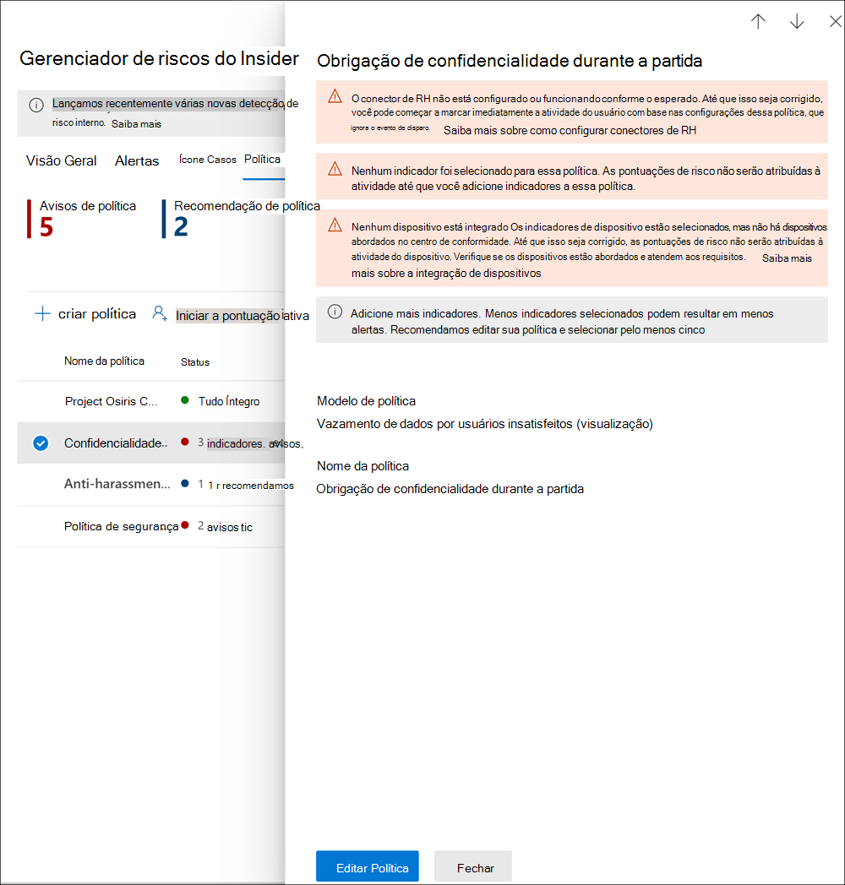

# <a name="insider-risk-management-policies"></a><span data-ttu-id="cfed6-104">Políticas de gerenciamento de riscos insider</span><span class="sxs-lookup"><span data-stu-id="cfed6-104">Insider risk management policies</span></span>

<span data-ttu-id="cfed6-105">As políticas de gerenciamento de riscos internas determinam quais usuários estão no escopo e quais tipos de indicadores de risco são configurados para alertas.</span><span class="sxs-lookup"><span data-stu-id="cfed6-105">Insider risk management policies determine which users are in-scope and which types of risk indicators are configured for alerts.</span></span> <span data-ttu-id="cfed6-106">Você pode criar rapidamente uma política que se aplique a todos os usuários em sua organização ou definir usuários individuais ou grupos para gerenciamento em uma política.</span><span class="sxs-lookup"><span data-stu-id="cfed6-106">You can quickly create a policy that applies to all users in your organization or define individual users or groups for management in a policy.</span></span> <span data-ttu-id="cfed6-107">As políticas suportam prioridades de conteúdo para focalizar as condições de política em vários ou específicos do Microsoft Teams, sites do SharePoint, tipos de sensibilidade de dados e rótulos de dados.</span><span class="sxs-lookup"><span data-stu-id="cfed6-107">Policies support content priorities to focus policy conditions on multiple or specific Microsoft Teams, SharePoint sites, data sensitivity types, and data labels.</span></span> <span data-ttu-id="cfed6-108">Usando modelos, você pode selecionar indicadores de risco específicos e personalizar limites de eventos para indicadores de política, personalização efetiva de pontuações de risco e nível e frequência de alertas.</span><span class="sxs-lookup"><span data-stu-id="cfed6-108">Using templates, you can select specific risk indicators and customize event thresholds for policy indicators, effectively customizing risk scores, and level and frequency of alerts.</span></span> <span data-ttu-id="cfed6-109">Além disso, os impulsionadores de pontuação de risco e as detecções de anomalias ajudam a identificar a atividade do usuário de maior importância ou mais incomum.</span><span class="sxs-lookup"><span data-stu-id="cfed6-109">Additionally, risk score boosters and anomaly detections help identify user activity that is of higher importance or more unusual.</span></span> <span data-ttu-id="cfed6-110">As janelas de política permitem definir o período de tempo para aplicar a política às atividades de alerta e são usadas para determinar a duração da política uma vez ativada.</span><span class="sxs-lookup"><span data-stu-id="cfed6-110">Policy windows allow you to define the time frame to apply the policy to alert activities and are used to determine the duration of the policy once activated.</span></span>

## <a name="policy-dashboard"></a><span data-ttu-id="cfed6-111">Painel de política</span><span class="sxs-lookup"><span data-stu-id="cfed6-111">Policy dashboard</span></span>

<span data-ttu-id="cfed6-112">O **painel política** permite que você veja rapidamente as políticas em sua organização, a saúde da política, adicionar manualmente usuários a políticas e exibir o status dos alertas associados a cada política.</span><span class="sxs-lookup"><span data-stu-id="cfed6-112">The **Policy dashboard** allows you to quickly see the policies in your organization, the health of the policy, manually add users to policies, and the view the status of alerts associated with each policy.</span></span>

- <span data-ttu-id="cfed6-113">**Nome da** política : o nome atribuído à política no assistente de política.</span><span class="sxs-lookup"><span data-stu-id="cfed6-113">**Policy name**: The name assigned to the policy in the policy wizard.</span></span>
- <span data-ttu-id="cfed6-114">**Status**: o status de saúde de cada política.</span><span class="sxs-lookup"><span data-stu-id="cfed6-114">**Status**: The health status for each policy.</span></span> <span data-ttu-id="cfed6-115">Exibe o número de avisos e recomendações de política ou um status de *Healthy* para políticas sem problemas.</span><span class="sxs-lookup"><span data-stu-id="cfed6-115">Displays number of policy warnings and recommendations, or a status of *Healthy* for policies without issues.</span></span>  <span data-ttu-id="cfed6-116">Você pode clicar na política para ver os detalhes do status de saúde para quaisquer avisos ou recomendações.</span><span class="sxs-lookup"><span data-stu-id="cfed6-116">You can click on the policy to see the health status details for any warnings or recommendations.</span></span>
- <span data-ttu-id="cfed6-117">**Alertas ativos**: O número de alertas ativos para cada política.</span><span class="sxs-lookup"><span data-stu-id="cfed6-117">**Active alerts**: The number of active alerts for each policy.</span></span>
- <span data-ttu-id="cfed6-118">**Alertas confirmados**: O número total de alertas que resultaram em casos da política nos últimos 365 dias.</span><span class="sxs-lookup"><span data-stu-id="cfed6-118">**Confirmed alerts**: The total number of alerts the resulted in cases from the policy in the last 365 days.</span></span>
- <span data-ttu-id="cfed6-119">**Ações tomadas em alertas**: O número total de alertas que foram confirmados ou ignorados nos últimos 365 dias.</span><span class="sxs-lookup"><span data-stu-id="cfed6-119">**Actions taken on alerts**: The total number of alerts that were confirmed or dismissed for the last 365 days.</span></span>
- <span data-ttu-id="cfed6-120">**Eficácia do alerta de** política : a porcentagem determinada pelo total de alertas confirmados divididos pelo total de ações realizadas em alertas (que é a soma de alertas confirmados ou ignorados no último ano).</span><span class="sxs-lookup"><span data-stu-id="cfed6-120">**Policy alert effectiveness**: The percentage determined by total confirmed alerts divided by total actions taken on alerts (which is the sum of alerts that were confirmed or dismissed over the past year).</span></span>


## <a name="policy-recommendations-from-analytics-preview"></a><span data-ttu-id="cfed6-122">Recomendações de política da análise (visualização)</span><span class="sxs-lookup"><span data-stu-id="cfed6-122">Policy recommendations from analytics (preview)</span></span>

<span data-ttu-id="cfed6-123">A análise de risco insider permite que você conduza uma avaliação de possíveis riscos insider em sua organização sem configurar nenhuma política de risco interna.</span><span class="sxs-lookup"><span data-stu-id="cfed6-123">Insider risk analytics enables you to conduct an evaluation of potential insider risks in your organization without configuring any insider risk policies.</span></span> <span data-ttu-id="cfed6-124">Essa avaliação pode ajudar sua organização a identificar áreas potenciais de maior risco de usuário e ajudar a determinar o tipo e o escopo das políticas de gerenciamento de riscos internas que você pode considerar configurar.</span><span class="sxs-lookup"><span data-stu-id="cfed6-124">This evaluation can help your organization identify potential areas of higher user risk and help determine the type and scope of insider risk management policies you may consider configuring.</span></span>

<span data-ttu-id="cfed6-125">Para saber mais sobre análises de risco interno e recomendações de política, consulte [Insider risk management settings: Analytics (preview)](insider-risk-management-settings.md#analytics-preview).</span><span class="sxs-lookup"><span data-stu-id="cfed6-125">To learn more about insider risk analytics and policy recommendations, see [Insider risk management settings: Analytics (preview)](insider-risk-management-settings.md#analytics-preview).</span></span>

## <a name="policy-templates"></a><span data-ttu-id="cfed6-126">Modelos de política</span><span class="sxs-lookup"><span data-stu-id="cfed6-126">Policy templates</span></span>

<span data-ttu-id="cfed6-127">Modelos de gerenciamento de riscos insider são condições de política pré-definidas que definem os tipos de indicadores de risco e o modelo de pontuação de risco usado pela política.</span><span class="sxs-lookup"><span data-stu-id="cfed6-127">Insider risk management templates are pre-defined policy conditions that define the types of risk indicators and risk scoring model used by the policy.</span></span> <span data-ttu-id="cfed6-128">Cada política deve ter um modelo atribuído ao assistente de criação de política antes da criação da política.</span><span class="sxs-lookup"><span data-stu-id="cfed6-128">Each policy must have a template assigned in the policy creation wizard before the policy is created.</span></span> <span data-ttu-id="cfed6-129">O gerenciamento de riscos insider dá suporte a até cinco políticas para cada modelo de política.</span><span class="sxs-lookup"><span data-stu-id="cfed6-129">Insider risk management supports up to five policies for each policy template.</span></span> <span data-ttu-id="cfed6-130">Ao criar uma nova política de risco interno com o assistente de política, você escolherá entre um dos seguintes modelos de política:</span><span class="sxs-lookup"><span data-stu-id="cfed6-130">When you create a new insider risk policy with the policy wizard, you'll choose from one of the following policy templates:</span></span>

### <a name="data-theft-by-departing-users"></a><span data-ttu-id="cfed6-131">Roubo de dados ao separar usuários</span><span class="sxs-lookup"><span data-stu-id="cfed6-131">Data theft by departing users</span></span>

<span data-ttu-id="cfed6-132">Quando os usuários saem da sua organização, há indicadores de risco específicos normalmente associados ao roubo de dados por parte dos usuários.</span><span class="sxs-lookup"><span data-stu-id="cfed6-132">When users leave your organization, there are specific risk indicators typically associated with data theft by departing users.</span></span> <span data-ttu-id="cfed6-133">Este modelo de política usa indicadores de exfiltração para pontuação de risco e se concentra na detecção e alertas nessa área de risco.</span><span class="sxs-lookup"><span data-stu-id="cfed6-133">This policy template uses exfiltration indicators for risk scoring and focuses on detection and alerts in this risk area.</span></span> <span data-ttu-id="cfed6-134">O roubo de dados para usuários de saída pode incluir o download de arquivos do SharePoint Online, a impressão de arquivos e a cópia de dados para serviços de armazenamento e mensagens de nuvem pessoais perto de suas datas de encerramento e de demissão de emprego.</span><span class="sxs-lookup"><span data-stu-id="cfed6-134">Data theft for departing users may include downloading files from SharePoint Online, printing files, and copying data to personal cloud messaging and storage services near their employment resignation and end dates.</span></span> <span data-ttu-id="cfed6-135">Ao usar o conector de RH do Microsoft 365 ou a opção de monitorar automaticamente a exclusão de conta de usuário no Azure Active Directory para sua organização, esse modelo começa a marcar para indicadores de risco relacionados a essas atividades e como eles se correlacionam com o status de emprego do usuário.</span><span class="sxs-lookup"><span data-stu-id="cfed6-135">By using either the Microsoft 365 HR connector or the option to automatically monitor for user account deletion in Azure Active Directory for your organization, this template starts scoring for risk indicators relating to these activities and how they correlate with user employment status.</span></span>

>[!IMPORTANT]
><span data-ttu-id="cfed6-136">Ao usar esse modelo, você pode configurar um conector de RH do Microsoft 365 para importar periodicamente informações de data de encerramento e de demissão para usuários em sua organização.</span><span class="sxs-lookup"><span data-stu-id="cfed6-136">When using this template, you can configure a Microsoft 365 HR connector to periodically import resignation and termination date information for users in your organization.</span></span> <span data-ttu-id="cfed6-137">Consulte o [artigo Importar dados com](import-hr-data.md) o conector de RH para obter orientações passo a passo para configurar o conector de RH do Microsoft 365 para sua organização.</span><span class="sxs-lookup"><span data-stu-id="cfed6-137">See the [Import data with the HR connector](import-hr-data.md) article for step-by-step guidance to configure the Microsoft 365 HR connector for your organization.</span></span> <span data-ttu-id="cfed6-138">Se você optar por não usar o conector de RH, deverá selecionar a conta de usuário excluída da opção do Azure AD ao configurar eventos de gatilho no assistente de política.</span><span class="sxs-lookup"><span data-stu-id="cfed6-138">If you choose not to use the HR connector, you must select the User account deleted from Azure AD option when configuring trigger events in the policy wizard.</span></span>

### <a name="general-data-leaks"></a><span data-ttu-id="cfed6-139">Vazamentos gerais de dados</span><span class="sxs-lookup"><span data-stu-id="cfed6-139">General data leaks</span></span>

<span data-ttu-id="cfed6-140">Proteger dados e evitar vazamentos de dados é um desafio constante para a maioria das organizações, especialmente com o rápido aumento de novos dados criados por usuários, dispositivos e serviços.</span><span class="sxs-lookup"><span data-stu-id="cfed6-140">Protecting data and preventing data leaks is a constant challenge for most organizations, particularly with the rapid grow of new data created by users, devices, and services.</span></span> <span data-ttu-id="cfed6-141">Os usuários têm a capacitação para criar, armazenar e compartilhar informações entre serviços e dispositivos que fazem com que o gerenciamento de vazamentos de dados seja cada vez mais complexo e difícil.</span><span class="sxs-lookup"><span data-stu-id="cfed6-141">Users are empowered to create, store, and share information across services and devices that make managing data leaks increasingly more complex and difficult.</span></span> <span data-ttu-id="cfed6-142">Os vazamentos de dados podem incluir o compartilhamento acidental de informações fora da sua organização ou roubo de dados com intenção mal-intencionada.</span><span class="sxs-lookup"><span data-stu-id="cfed6-142">Data leaks can include accidental oversharing of information outside your organization or data theft with malicious intent.</span></span> <span data-ttu-id="cfed6-143">Com uma política de Prevenção contra Perda de Dados (DLP) atribuída ou o evento de acionamento interno, este modelo começa a marcar detecções em tempo real de downloads de dados suspeitos do SharePoint Online, compartilhamento de arquivos e pastas, impressão de arquivos e cópia de dados para mensagens de nuvem pessoais e serviços de armazenamento.</span><span class="sxs-lookup"><span data-stu-id="cfed6-143">With an assigned Data Loss Prevention (DLP) policy or the built-in triggering event, this template starts scoring real-time detections of suspicious SharePoint Online data downloads, file and folder sharing, printing files, and copying data to personal cloud messaging and storage services.</span></span>

<span data-ttu-id="cfed6-144">Ao usar um *modelo de vazamentos* de dados, você pode atribuir uma política de DLP para disparar indicadores na política de risco interno para alertas de alta gravidade em sua organização.</span><span class="sxs-lookup"><span data-stu-id="cfed6-144">When using a *Data leaks* template, you can assign a DLP policy to trigger indicators in the insider risk policy for high severity alerts in your organization.</span></span> <span data-ttu-id="cfed6-145">Sempre que um alerta de alta gravidade é gerado por uma regra de política DLP é adicionado ao log de auditoria do Office 365, as políticas de risco interna criadas com esse modelo examinam automaticamente o alerta DLP de alta gravidade.</span><span class="sxs-lookup"><span data-stu-id="cfed6-145">Whenever a high severity alert is generated by a DLP policy rule is added to the Office 365 audit log, insider risk policies created with this template automatically examine the high severity DLP alert.</span></span> <span data-ttu-id="cfed6-146">Se o alerta contiver um usuário no escopo definido na política de risco interna, o alerta será processado pela política de risco interna como um novo alerta e atribuído a uma gravidade de risco interno e pontuação de risco.</span><span class="sxs-lookup"><span data-stu-id="cfed6-146">If the alert contains an in-scope user defined in the insider risk policy, the alert is processed by the insider risk policy as a new alert and assigned an insider risk severity and risk score.</span></span> <span data-ttu-id="cfed6-147">Essa política permite avaliar esse alerta no contexto com outras atividades incluídas no caso.</span><span class="sxs-lookup"><span data-stu-id="cfed6-147">This policy allows you to evaluate this alert in context with other activities included in the case.</span></span> <span data-ttu-id="cfed6-148">Se você não escolher uma política de DLP, deverá selecionar o evento de disparo integrado.</span><span class="sxs-lookup"><span data-stu-id="cfed6-148">If you don't choose a DLP policy, you must select the built-in triggering event.</span></span>

#### <a name="data-leaks-policy-guidelines"></a><span data-ttu-id="cfed6-149">Diretrizes de política de vazamento de dados</span><span class="sxs-lookup"><span data-stu-id="cfed6-149">Data leaks policy guidelines</span></span>

<span data-ttu-id="cfed6-150">Ao criar ou modificar políticas de DLP para uso com políticas de gerenciamento de riscos insider, considere as seguintes diretrizes:</span><span class="sxs-lookup"><span data-stu-id="cfed6-150">When creating or modifying DLP policies for use with insider risk management policies, consider the following guidelines:</span></span>

- <span data-ttu-id="cfed6-151">Priorize eventos de exfiltração  de dados e seja seletivo ao atribuir configurações de relatórios de incidentes a *High* ao configurar regras em suas políticas de DLP.</span><span class="sxs-lookup"><span data-stu-id="cfed6-151">Prioritize data exfiltration events and be selective when assigning **Incident reports** settings to *High* when configuring rules in your DLP policies.</span></span> <span data-ttu-id="cfed6-152">Por exemplo, enviar documentos confidenciais para um concorrente conhecido deve ser um *evento de* exfiltração de alto nível de alerta.</span><span class="sxs-lookup"><span data-stu-id="cfed6-152">For example, emailing sensitive documents to a known competitor should be a *High* alert level exfiltration event.</span></span> <span data-ttu-id="cfed6-153">Atribuir o nível  Alto nas  configurações de relatórios de incidentes em outras regras de política de DLP pode aumentar o ruído no fluxo de trabalho de alerta de gerenciamento de risco interno e tornar mais difícil para seus investigadores de dados e analistas avaliar corretamente esses alertas.</span><span class="sxs-lookup"><span data-stu-id="cfed6-153">Over-assigning the *High* level in the **Incident reports** settings in other DLP policy rules can increase the noise in the insider risk management alert workflow and make it more difficult for your data investigators and analysts to properly evaluate these alerts.</span></span> <span data-ttu-id="cfed6-154">Por exemplo, atribuir níveis de *alerta* alto para acessar atividades de negação em políticas de DLP torna mais desafiador avaliar o comportamento e as atividades do usuário realmente arriscados.</span><span class="sxs-lookup"><span data-stu-id="cfed6-154">For example, assigning *High* alert levels to access denial activities in DLP policies makes it more challenging to evaluate truly risky user behavior and activities.</span></span>
- <span data-ttu-id="cfed6-155">Certifique-se de entender e configurar corretamente os usuários no escopo nas políticas de gerenciamento de riscos de DLP e insider.</span><span class="sxs-lookup"><span data-stu-id="cfed6-155">Make sure you understand and properly configure the in-scope users in both the DLP and insider risk management policies.</span></span> <span data-ttu-id="cfed6-156">Somente usuários definidos como no escopo para políticas de gerenciamento de riscos insider usando o modelo **de vazamentos** de dados terão alertas de política DLP de alta gravidade processados.</span><span class="sxs-lookup"><span data-stu-id="cfed6-156">Only users defined as in-scope for insider risk management policies using the **Data leaks** template will have high severity DLP policy alerts processed.</span></span> <span data-ttu-id="cfed6-157">Além disso, somente os usuários definidos como no escopo em uma regra para um alerta DLP de alta gravidade serão examinados pela política de gerenciamento de riscos insider para consideração.</span><span class="sxs-lookup"><span data-stu-id="cfed6-157">Additionally, only users defined as in-scope in a rule for a high severity DLP alert will be examined by the insider risk management policy for consideration.</span></span> <span data-ttu-id="cfed6-158">É importante que você não configure usuários no escopo sem saber em suas políticas de risco de DLP e insider de maneira conflitante.</span><span class="sxs-lookup"><span data-stu-id="cfed6-158">It is important that you don't unknowingly configure in-scope users in both your DLP and insider risk policies in a conflicting manner.</span></span>

     <span data-ttu-id="cfed6-159">Por exemplo, se suas regras de política de DLP são escopo apenas para usuários na Equipe de Vendas e a política de risco insider criada a partir do modelo de **vazamentos** de dados definiu todos os usuários como no escopo, a política de risco insider só processará alertas de DLP de alta gravidade para os usuários na Equipe de Vendas.</span><span class="sxs-lookup"><span data-stu-id="cfed6-159">For example, if your DLP policy rules are scoped to only users on the Sales Team and the insider risk policy created from the **Data leaks** template has defined all users as in-scope, the insider risk policy will only actually process high severity DLP alerts for the users on the Sales Team.</span></span> <span data-ttu-id="cfed6-160">A política de risco interno não receberá alertas de DLP de alta prioridade para os usuários processarem que não estão definidos nas regras de DLP neste exemplo.</span><span class="sxs-lookup"><span data-stu-id="cfed6-160">The insider risk policy won't receive any high priority DLP alerts for users to process that aren't defined in the DLP rules in this example.</span></span> <span data-ttu-id="cfed6-161">Por outro lado, se sua política de gerenciamento de riscos internas criada a partir de modelos de **vazamentos** de dados tiver escopo apenas para usuários na Equipe de Vendas e a política DLP atribuída for escopo para todos os usuários, a política de risco interno processará apenas alertas de DLP de alta gravidade para membros da Equipe de Vendas.</span><span class="sxs-lookup"><span data-stu-id="cfed6-161">Conversely, if your insider risk management policy created from **Data leaks** templates is scoped to only users on the Sales Team and the assigned DLP policy is scoped to all users, the insider risk policy will only process high severity DLP alerts for members of the Sales Team.</span></span> <span data-ttu-id="cfed6-162">A política de gerenciamento de risco interno ignorará alertas DLP de alta gravidade para todos os usuários que não estão na Equipe de Vendas.</span><span class="sxs-lookup"><span data-stu-id="cfed6-162">The insider risk management policy will ignore high severity DLP alerts for all users not on the Sales Team.</span></span>

- <span data-ttu-id="cfed6-163">Certifique-se **de que a** configuração da regra de relatórios de incidentes na política de DLP usada para esse modelo de gerenciamento de risco interno está configurada para *alertas* de nível de alta gravidade.</span><span class="sxs-lookup"><span data-stu-id="cfed6-163">Make sure the **Incident reports** rule setting in the DLP policy used for this insider risk management template is configured for *High* severity level alerts.</span></span> <span data-ttu-id="cfed6-164">O *nível* de alta gravidade são os eventos disparados e os alertas de gerenciamento  de riscos insider não serão gerados a partir de regras em políticas de DLP com o campo Relatórios de incidentes definido em *Baixo* ou *Médio.*</span><span class="sxs-lookup"><span data-stu-id="cfed6-164">The *High* severity level is the triggering events and insider risk management alerts won't be generated from rules in DLP policies with the **Incident reports** field set at *Low* or *Medium*.</span></span>

    

     >[!NOTE]
     ><span data-ttu-id="cfed6-166">Ao criar uma nova política de DLP usando os modelos integrados, você precisará selecionar a  opção Criar ou  personalizar regras **DLP** avançadas para configurar a configuração De relatórios de incidentes para o nível de alta gravidade.</span><span class="sxs-lookup"><span data-stu-id="cfed6-166">When creating a new DLP policy using the built-in templates, you'll need to select the **Create or customize advanced DLP rules** option to configure the **Incident reports** setting for the *High* severity level.</span></span>

<span data-ttu-id="cfed6-167">Cada política de gerenciamento de riscos internas criada a partir do modelo **De vazamentos** de dados só pode ter uma política DLP atribuída.</span><span class="sxs-lookup"><span data-stu-id="cfed6-167">Each insider risk management policy created from the **Data leaks** template can only have one DLP policy assigned.</span></span> <span data-ttu-id="cfed6-168">Considere a criação de uma política de DLP dedicada que combine as diferentes atividades que você deseja detectar e agir como gatilho de eventos para políticas de risco internas que usam o modelo **De vazamentos de** dados.</span><span class="sxs-lookup"><span data-stu-id="cfed6-168">Consider creating a dedicated DLP policy that combines the different activities you want to detect and act as triggering events for  insider risk policies that use the **Data leaks** template.</span></span>

<span data-ttu-id="cfed6-169">Consulte o [artigo Criar, testar e ajustar uma](create-test-tune-dlp-policy.md) política DLP para obter orientações passo a passo para configurar políticas de DLP para sua organização.</span><span class="sxs-lookup"><span data-stu-id="cfed6-169">See the [Create, test, and tune a DLP policy](create-test-tune-dlp-policy.md) article for step-by-step guidance to configure DLP policies for your organization.</span></span>

### <a name="data-leaks-by-priority-users-preview"></a><span data-ttu-id="cfed6-170">Vazamentos de dados por usuários prioritários (visualização)</span><span class="sxs-lookup"><span data-stu-id="cfed6-170">Data leaks by priority users (preview)</span></span>

<span data-ttu-id="cfed6-171">Proteger dados e evitar vazamentos de dados para usuários em sua organização pode depender de sua posição, nível de acesso a informações confidenciais ou histórico de riscos.</span><span class="sxs-lookup"><span data-stu-id="cfed6-171">Protecting data and preventing data leaks for users in your organization may depend on their position, level of access to sensitive information, or risk history.</span></span> <span data-ttu-id="cfed6-172">Os vazamentos de dados podem incluir o compartilhamento acidental de informações altamente confidenciais fora da sua organização ou roubo de dados com intenção mal-intencionada.</span><span class="sxs-lookup"><span data-stu-id="cfed6-172">Data leaks can include accidental oversharing of highly sensitive information outside your organization or data theft with malicious intent.</span></span> <span data-ttu-id="cfed6-173">Com uma política de Prevenção contra Perda de Dados (DLP) atribuída, este modelo começa a marcar detecções em tempo real de atividades suspeitas e resulta em uma maior probabilidade de alertas e alertas de risco interno com níveis de gravidade mais altos.</span><span class="sxs-lookup"><span data-stu-id="cfed6-173">With an assigned Data Loss Prevention (DLP) policy, this template starts scoring real-time detections of suspicious activity and result in an increased likelihood of insider risk alerts and alerts with higher severity levels.</span></span> <span data-ttu-id="cfed6-174">Os usuários prioritários são definidos [em grupos de usuários prioritários](insider-risk-management-settings.md#priority-user-groups-preview) configurados na área de configurações de gerenciamento de riscos insider.</span><span class="sxs-lookup"><span data-stu-id="cfed6-174">Priority users are defined in [priority user groups](insider-risk-management-settings.md#priority-user-groups-preview) configured in the insider risk management settings area.</span></span>

<span data-ttu-id="cfed6-175">Assim como no modelo Geral de **vazamentos** de dados, você deve atribuir uma política de DLP para disparar indicadores na política de risco interno para alertas de alta gravidade em sua organização.</span><span class="sxs-lookup"><span data-stu-id="cfed6-175">As with the **General data leaks template**, you must assign a DLP policy to trigger indicators in the insider risk policy for high severity alerts in your organization.</span></span> <span data-ttu-id="cfed6-176">Siga as diretrizes de política de vazamentos de dados acima ao criar uma política usando este modelo.</span><span class="sxs-lookup"><span data-stu-id="cfed6-176">Follow the Data leaks policy guidelines above when creating a policy using this template.</span></span> <span data-ttu-id="cfed6-177">Além disso, você precisará atribuir grupos de usuários prioritários criados no gerenciamento de riscos **do Insider** Configurações Grupos de usuários  >  **prioritários**  >   à política.</span><span class="sxs-lookup"><span data-stu-id="cfed6-177">Additionally, you will need to assign priority user groups created in **Insider risk management** > **Settings** > **Priority user groups** to the policy.</span></span>

### <a name="data-leaks-by-disgruntled-users-preview"></a><span data-ttu-id="cfed6-178">Vazamentos de dados por usuários insatisfeitos (visualização)</span><span class="sxs-lookup"><span data-stu-id="cfed6-178">Data leaks by disgruntled users (preview)</span></span>

<span data-ttu-id="cfed6-179">Quando os usuários experimentam stressores de emprego, eles podem ficar insatisfeitos, o que pode aumentar as chances de atividade de risco interno.</span><span class="sxs-lookup"><span data-stu-id="cfed6-179">When users experience employment stressors, they may become disgruntled, which may increase the chances of insider risk activity.</span></span> <span data-ttu-id="cfed6-180">Este modelo inicia a pontuação da atividade do usuário quando um indicador associado à incongruência é identificado.</span><span class="sxs-lookup"><span data-stu-id="cfed6-180">This template starts scoring user activity when an indicator associated with disgruntlement is identified.</span></span> <span data-ttu-id="cfed6-181">Exemplos incluem notificações de melhoria de desempenho, avaliações de desempenho ruins ou alterações no status do nível de trabalho.</span><span class="sxs-lookup"><span data-stu-id="cfed6-181">Examples include performance improvement notifications, poor performance reviews, or changes to job level status.</span></span> <span data-ttu-id="cfed6-182">Os vazamentos de dados para usuários insatisfeitos podem incluir o download de arquivos do SharePoint Online e a cópia de dados para mensagens de nuvem pessoais e serviços de armazenamento próximos a eventos de estresse de emprego.</span><span class="sxs-lookup"><span data-stu-id="cfed6-182">Data leaks for disgruntled users may include downloading files from SharePoint Online and copying data to personal cloud messaging and storage services near employment stressor events.</span></span>

<span data-ttu-id="cfed6-183">Ao usar esse modelo, você também deve configurar um conector de RH do Microsoft 365 para importar periodicamente notificações de melhoria de desempenho, status de revisão de desempenho ruim ou informações de alteração de nível de trabalho para usuários em sua organização.</span><span class="sxs-lookup"><span data-stu-id="cfed6-183">When using this template, you must also configure a Microsoft 365 HR connector to periodically import performance improvement notifications, poor performance review status, or job level change information for users in your organization.</span></span> <span data-ttu-id="cfed6-184">Consulte o [artigo Importar dados com](import-hr-data.md) o conector de RH para obter orientações passo a passo para configurar o conector de RH do Microsoft 365 para sua organização.</span><span class="sxs-lookup"><span data-stu-id="cfed6-184">See the [Import data with the HR connector](import-hr-data.md) article for step-by-step guidance to configure the Microsoft 365 HR connector for your organization.</span></span>

### <a name="general-security-policy-violations-preview"></a><span data-ttu-id="cfed6-185">Violações gerais da política de segurança (visualização)</span><span class="sxs-lookup"><span data-stu-id="cfed6-185">General security policy violations (preview)</span></span>

<span data-ttu-id="cfed6-186">Em muitas organizações, os usuários têm permissão para instalar software em seus dispositivos ou modificar as configurações do dispositivo para ajudar com suas tarefas.</span><span class="sxs-lookup"><span data-stu-id="cfed6-186">In many organizations, users have permission to install software on their devices or to modify device settings to help with their tasks.</span></span> <span data-ttu-id="cfed6-187">Inadvertidamente ou com intenção mal-intencionada, os usuários podem instalar malware ou desabilitar recursos de segurança importantes que ajudam a proteger informações em seus dispositivos ou em seus recursos de rede.</span><span class="sxs-lookup"><span data-stu-id="cfed6-187">Either inadvertently or with malicious intent, users may install malware or disable important security features that help protect information on their device or on your network resources.</span></span> <span data-ttu-id="cfed6-188">Este modelo de política usa alertas de segurança do Microsoft Defender para o Ponto de Extremidade para começar a marcar essas atividades e a detecção de foco e alertas para essa área de risco.</span><span class="sxs-lookup"><span data-stu-id="cfed6-188">This policy template uses security alerts from Microsoft Defender for Endpoint to start scoring these activities and focus detection and alerts to this risk area.</span></span> <span data-ttu-id="cfed6-189">Use este modelo para fornecer informações sobre violações de política de segurança em cenários em que os usuários podem ter um histórico de violações de política de segurança que podem ser um indicador de risco interno.</span><span class="sxs-lookup"><span data-stu-id="cfed6-189">Use this template to provide insights for security policy violations in scenarios when users may have a history of security policy violations that may be an indicator of insider risk.</span></span>

<span data-ttu-id="cfed6-190">Você precisará ter o Microsoft Defender para Ponto de Extremidade configurado em sua organização e habilitar o Defender for Endpoint para integração de gerenciamento de riscos insider no Defender Security Center para importar alertas de violação de segurança.</span><span class="sxs-lookup"><span data-stu-id="cfed6-190">You'll need to have Microsoft Defender for Endpoint configured in your organization and enable Defender for Endpoint for insider risk management integration in the Defender Security Center to import security violation alerts.</span></span> <span data-ttu-id="cfed6-191">Para obter mais informações sobre como configurar o Defender para o Ponto de Extremidade para integração de gerenciamento de riscos insider, consulte [Configure advanced features in Defender for Endpoint](/windows/security/threat-protection/microsoft-defender-atp/advanced-features#share-endpoint-alerts-with-microsoft-compliance-center).</span><span class="sxs-lookup"><span data-stu-id="cfed6-191">For more information on configuring Defender for Endpoint for insider risk management integration, see [Configure advanced features in Defender for Endpoint](/windows/security/threat-protection/microsoft-defender-atp/advanced-features#share-endpoint-alerts-with-microsoft-compliance-center).</span></span>

### <a name="security-policy-violations-by-departing-users-preview"></a><span data-ttu-id="cfed6-192">Violações de política de segurança ao separar usuários (visualização)</span><span class="sxs-lookup"><span data-stu-id="cfed6-192">Security policy violations by departing users (preview)</span></span>

<span data-ttu-id="cfed6-193">A saída dos usuários, seja em termos positivos ou negativos, pode ser um risco maior para violações de política de segurança.</span><span class="sxs-lookup"><span data-stu-id="cfed6-193">Departing users, whether leaving on positive or negative terms, may be higher risks for security policy violations.</span></span> <span data-ttu-id="cfed6-194">Para ajudar a proteger contra violações de segurança inadvertida ou mal-intencionadas para usuários de saída, este modelo de política usa alertas do Defender para Ponto de Extremidade para fornecer informações sobre atividades relacionadas à segurança.</span><span class="sxs-lookup"><span data-stu-id="cfed6-194">To help protect against inadvertent or malicious security violations for departing users, this policy template uses Defender for Endpoint alerts to provide insights into security-related activities.</span></span> <span data-ttu-id="cfed6-195">Essas atividades incluem o usuário instalando malware ou outros aplicativos potencialmente prejudiciais e desabilitando recursos de segurança em seus dispositivos.</span><span class="sxs-lookup"><span data-stu-id="cfed6-195">These activities include the user installing malware or other potentially harmful applications and disabling security features on their devices.</span></span> <span data-ttu-id="cfed6-196">Ao usar o conector de RH do [Microsoft 365](import-hr-data.md) ou a opção de monitorar automaticamente a exclusão de conta de usuário no Azure Active Directory para sua organização, esse modelo começa a marcar para indicadores de risco relacionados a essas atividades de segurança e como eles se correlacionam com o status de emprego do usuário.</span><span class="sxs-lookup"><span data-stu-id="cfed6-196">By using either the [Microsoft 365 HR connector](import-hr-data.md) or the option to automatically monitor for user account deletion in Azure Active Directory for your organization, this template starts scoring for risk indicators relating to these security activities and how they correlate with user employment status.</span></span>

<span data-ttu-id="cfed6-197">Você precisará ter o Microsoft Defender para Ponto de Extremidade configurado em sua organização e habilitar o Defender for Endpoint para integração de gerenciamento de riscos insider no Defender Security Center para importar alertas de violação de segurança.</span><span class="sxs-lookup"><span data-stu-id="cfed6-197">You'll need to have Microsoft Defender for Endpoint configured in your organization and enable Defender for Endpoint for insider risk management integration in the Defender Security Center to import security violation alerts.</span></span> <span data-ttu-id="cfed6-198">Para obter mais informações sobre como configurar o Defender para o Ponto de Extremidade para integração de gerenciamento de riscos insider, consulte [Configure advanced features in Defender for Endpoint](/windows/security/threat-protection/microsoft-defender-atp/advanced-features#share-endpoint-alerts-with-microsoft-compliance-center).</span><span class="sxs-lookup"><span data-stu-id="cfed6-198">For more information on configuring Defender for Endpoint for insider risk management integration, see [Configure advanced features in Defender for Endpoint](/windows/security/threat-protection/microsoft-defender-atp/advanced-features#share-endpoint-alerts-with-microsoft-compliance-center).</span></span>

### <a name="security-policy-violations-by-priority-users-preview"></a><span data-ttu-id="cfed6-199">Violações de política de segurança por usuários prioritários (visualização)</span><span class="sxs-lookup"><span data-stu-id="cfed6-199">Security policy violations by priority users (preview)</span></span>

<span data-ttu-id="cfed6-200">A proteção contra violações de segurança para usuários em sua organização pode depender de sua posição, nível de acesso a informações confidenciais ou histórico de riscos.</span><span class="sxs-lookup"><span data-stu-id="cfed6-200">Protecting against security violations for users in your organization may depend on their position, level of access to sensitive information, or risk history.</span></span> <span data-ttu-id="cfed6-201">Como as violações de segurança por usuários prioritários podem ter um impacto significativo nas áreas críticas da sua organização, esse modelo de política começa a pontuar nesses indicadores e usa o Microsoft Defender para alertas de ponto de extremidade para fornecer informações sobre atividades relacionadas à segurança para esses usuários.</span><span class="sxs-lookup"><span data-stu-id="cfed6-201">Because security violations by priority users may have a significant impact on your organization's critical areas, this policy template starts scoring on these indicators and uses Microsoft Defender for Endpoint alerts to provide insights into security-related activities for these users.</span></span> <span data-ttu-id="cfed6-202">Essas atividades podem incluir os usuários prioritários instalando malware ou outros aplicativos potencialmente prejudiciais e desabilitando recursos de segurança em seus dispositivos.</span><span class="sxs-lookup"><span data-stu-id="cfed6-202">These activities may include the priority users installing malware or other potentially harmful applications and disabling security features on their devices.</span></span> <span data-ttu-id="cfed6-203">Os usuários prioritários são definidos em grupos de usuários prioritários configurados na área de configurações de gerenciamento de riscos insider.</span><span class="sxs-lookup"><span data-stu-id="cfed6-203">Priority users are defined in priority user groups configured in the insider risk management settings area.</span></span>

<span data-ttu-id="cfed6-204">Você precisará ter o Microsoft Defender para Ponto de Extremidade configurado em sua organização e habilitar o Defender for Endpoint para integração de gerenciamento de riscos insider no Defender Security Center para importar alertas de violação de segurança.</span><span class="sxs-lookup"><span data-stu-id="cfed6-204">You'll need to have Microsoft Defender for Endpoint configured in your organization and enable Defender for Endpoint for insider risk management integration in the Defender Security Center to import security violation alerts.</span></span> <span data-ttu-id="cfed6-205">Para obter mais informações sobre como configurar o Defender para o Ponto de Extremidade para integração de gerenciamento de riscos insider, consulte [Configure advanced features in Defender for Endpoint](/windows/security/threat-protection/microsoft-defender-atp/advanced-features#share-endpoint-alerts-with-microsoft-compliance-center).</span><span class="sxs-lookup"><span data-stu-id="cfed6-205">For more information on configuring Defender for Endpoint for insider risk management integration, see [Configure advanced features in Defender for Endpoint](/windows/security/threat-protection/microsoft-defender-atp/advanced-features#share-endpoint-alerts-with-microsoft-compliance-center).</span></span> <span data-ttu-id="cfed6-206">Além disso, você precisará atribuir grupos de usuários prioritários criados no gerenciamento de riscos **do Insider** Configurações Grupos de usuários  >  **prioritários**  >   à política.</span><span class="sxs-lookup"><span data-stu-id="cfed6-206">Additionally, you will need to assign priority user groups created in **Insider risk management** > **Settings** > **Priority user groups** to the policy.</span></span>

### <a name="security-policy-violations-by-disgruntled-users-preview"></a><span data-ttu-id="cfed6-207">Violações de política de segurança por usuários insatisfeitos (visualização)</span><span class="sxs-lookup"><span data-stu-id="cfed6-207">Security policy violations by disgruntled users (preview)</span></span>

<span data-ttu-id="cfed6-208">Os usuários que experimentam estresses de emprego podem estar em um risco maior para violações de política de segurança inadvertida ou mal-intencionada.</span><span class="sxs-lookup"><span data-stu-id="cfed6-208">Users that experience employment stressors may be at a higher risk for inadvertent or malicious security policy violations.</span></span> <span data-ttu-id="cfed6-209">Esses stressores podem incluir o usuário que está sendo colocado em um plano de melhoria de desempenho, status de revisão de desempenho ruim ou ser rebaixado de sua posição atual.</span><span class="sxs-lookup"><span data-stu-id="cfed6-209">These stressors may include the user being placed on a performance improvement plan, poor performance review status, or being demoted from their current position.</span></span> <span data-ttu-id="cfed6-210">Este modelo de política inicia a pontuação de risco com base nesses indicadores e atividades associadas a esses eventos para esses usuários.</span><span class="sxs-lookup"><span data-stu-id="cfed6-210">This policy template starts risk scoring based on these indicators and activities associated with these events for these users.</span></span>

<span data-ttu-id="cfed6-211">Ao usar esse modelo, você também deve configurar um conector de RH do Microsoft 365 para importar periodicamente notificações de melhoria de desempenho, status de revisão de desempenho ruim ou informações de alteração de nível de trabalho para usuários em sua organização.</span><span class="sxs-lookup"><span data-stu-id="cfed6-211">When using this template, you must also configure a Microsoft 365 HR connector to periodically import performance improvement notifications, poor performance review status, or job level change information for users in your organization.</span></span> <span data-ttu-id="cfed6-212">Consulte o [artigo Importar dados com](import-hr-data.md) o conector de RH para obter orientações passo a passo para configurar o conector de RH do Microsoft 365 para sua organização.</span><span class="sxs-lookup"><span data-stu-id="cfed6-212">See the [Import data with the HR connector](import-hr-data.md) article for step-by-step guidance to configure the Microsoft 365 HR connector for your organization.</span></span>

<span data-ttu-id="cfed6-213">Você também precisará ter o Microsoft Defender para Ponto de Extremidade configurado em sua organização e habilitar o Defender for Endpoint para integração de gerenciamento de riscos insider no Defender Security Center para importar alertas de violação de segurança.</span><span class="sxs-lookup"><span data-stu-id="cfed6-213">You'll also need to have Microsoft Defender for Endpoint configured in your organization and enable Defender for Endpoint for insider risk management integration in the Defender Security Center to import security violation alerts.</span></span> <span data-ttu-id="cfed6-214">Para obter mais informações sobre como configurar o Defender para o Ponto de Extremidade para integração de gerenciamento de riscos insider, consulte [Configure advanced features in Defender for Endpoint](/windows/security/threat-protection/microsoft-defender-atp/advanced-features#share-endpoint-alerts-with-microsoft-compliance-center).</span><span class="sxs-lookup"><span data-stu-id="cfed6-214">For more information on configuring Defender for Endpoint for insider risk management integration, see [Configure advanced features in Defender for Endpoint](/windows/security/threat-protection/microsoft-defender-atp/advanced-features#share-endpoint-alerts-with-microsoft-compliance-center).</span></span>

### <a name="policy-template-prerequisites-and-triggering-events"></a><span data-ttu-id="cfed6-215">Pré-requisitos do modelo de política e eventos de gatilho</span><span class="sxs-lookup"><span data-stu-id="cfed6-215">Policy template prerequisites and triggering events</span></span>

<span data-ttu-id="cfed6-216">Dependendo do modelo escolhido para uma política de gerenciamento de riscos insider, os eventos disparados e os pré-requisitos de política variam.</span><span class="sxs-lookup"><span data-stu-id="cfed6-216">Depending on the template you choose for an insider risk management policy, the triggering events and policy prerequisites vary.</span></span> <span data-ttu-id="cfed6-217">Acionamento de eventos são pré-requisitos que determinam se um usuário está ativo para uma política de gerenciamento de riscos insider.</span><span class="sxs-lookup"><span data-stu-id="cfed6-217">Triggering events are prerequisites that determine if a user is active for an insider risk management policy.</span></span> <span data-ttu-id="cfed6-218">Se um usuário for adicionado a uma política de gerenciamento de riscos interna, mas não tiver um evento de gatilho, a atividade do usuário não será avaliada pela política, a menos que seja adicionada manualmente no painel Usuários.</span><span class="sxs-lookup"><span data-stu-id="cfed6-218">If a user is added to an insider risk management policy but does not have a triggering event, the user activity is not evaluated by the policy unless they are manually added in the Users dashboard.</span></span> <span data-ttu-id="cfed6-219">Os pré-requisitos de política são itens necessários para que a política receba os sinais ou as atividades necessárias para avaliar o risco.</span><span class="sxs-lookup"><span data-stu-id="cfed6-219">Policy prerequisites are required items so that the policy receives the signals or activities necessary to evaluate risk.</span></span>

<span data-ttu-id="cfed6-220">A tabela a seguir lista os eventos disparados e os pré-requisitos para políticas criadas a partir de cada modelo de política de gerenciamento de riscos insider:</span><span class="sxs-lookup"><span data-stu-id="cfed6-220">The following table lists the triggering events and prerequisites for policies created from each insider risk management policy template:</span></span>

| <span data-ttu-id="cfed6-221">**Modelo de política**</span><span class="sxs-lookup"><span data-stu-id="cfed6-221">**Policy template**</span></span> | <span data-ttu-id="cfed6-222">**Disparando eventos para políticas**</span><span class="sxs-lookup"><span data-stu-id="cfed6-222">**Triggering events for policies**</span></span> | <span data-ttu-id="cfed6-223">**Pré-requisitos**</span><span class="sxs-lookup"><span data-stu-id="cfed6-223">**Prerequisites**</span></span> |
| :------------------ | :--------------------------------- | :---------------- |
| <span data-ttu-id="cfed6-224">Roubo de dados ao separar usuários</span><span class="sxs-lookup"><span data-stu-id="cfed6-224">Data theft by departing users</span></span> | <span data-ttu-id="cfed6-225">Indicador de data de demissão ou término do conector de RH</span><span class="sxs-lookup"><span data-stu-id="cfed6-225">Resignation or termination date indicator from HR connector</span></span> | <span data-ttu-id="cfed6-226">(opcional) Conector de RH do Microsoft 365 configurado para indicadores de data de encerramento e de demissão ou integração do Azure Active Directory habilitada</span><span class="sxs-lookup"><span data-stu-id="cfed6-226">(optional) Microsoft 365 HR connector configured for termination and resignation date indicators or Azure Active Directory integration enabled</span></span> |
| <span data-ttu-id="cfed6-227">Vazamentos gerais de dados</span><span class="sxs-lookup"><span data-stu-id="cfed6-227">General data leaks</span></span> | <span data-ttu-id="cfed6-228">Atividade de política de vazamento de dados que cria um alerta de alta gravidade</span><span class="sxs-lookup"><span data-stu-id="cfed6-228">Data leak policy activity that creates a High severity alert</span></span> | <span data-ttu-id="cfed6-229">(opcional) Política de DLP configurada para alertas de alta gravidade ou evento de disparo de exfiltração de dados interna</span><span class="sxs-lookup"><span data-stu-id="cfed6-229">(optional) DLP policy configured for High severity alerts or built-in data exfiltration triggering event</span></span> |
| <span data-ttu-id="cfed6-230">Vazamentos de dados por usuários prioritários</span><span class="sxs-lookup"><span data-stu-id="cfed6-230">Data leaks by priority users</span></span> | <span data-ttu-id="cfed6-231">Atividade de política de vazamento de dados que cria um *alerta de alta gravidade* ou gatilhos de evento de exfiltração interna</span><span class="sxs-lookup"><span data-stu-id="cfed6-231">Data leak policy activity that creates a *High severity* alert or built-in exfiltration event triggers</span></span> | <span data-ttu-id="cfed6-232">(opcional) Política de DLP configurada para alertas de alta gravidade</span><span class="sxs-lookup"><span data-stu-id="cfed6-232">(optional) DLP policy configured for High severity alerts</span></span> <br><br> <span data-ttu-id="cfed6-233">Grupos de usuários prioritários configurados em configurações de risco interno</span><span class="sxs-lookup"><span data-stu-id="cfed6-233">Priority user groups configured in insider risk settings</span></span> |
| <span data-ttu-id="cfed6-234">Vazamentos de dados por usuários insatisfeitos</span><span class="sxs-lookup"><span data-stu-id="cfed6-234">Data leaks by disgruntled users</span></span> | <span data-ttu-id="cfed6-235">Melhoria de desempenho, desempenho ruim ou indicadores de alteração de nível de trabalho do conector de RH</span><span class="sxs-lookup"><span data-stu-id="cfed6-235">Performance improvement, poor performance, or job level change indicators from HR connector</span></span> | <span data-ttu-id="cfed6-236">Conector de RH do Microsoft 365 configurado para indicadores de incongruência</span><span class="sxs-lookup"><span data-stu-id="cfed6-236">Microsoft 365 HR connector configured for disgruntlement indicators</span></span> |
| <span data-ttu-id="cfed6-237">Violações gerais da política de segurança</span><span class="sxs-lookup"><span data-stu-id="cfed6-237">General security policy violations</span></span> | <span data-ttu-id="cfed6-238">Evasão defensiva de controles de segurança ou software indesejado detectado pelo Microsoft Defender para Ponto de Extremidade</span><span class="sxs-lookup"><span data-stu-id="cfed6-238">Defensive evasion of security controls or unwanted software detected by Microsoft Defender for Endpoint</span></span> | <span data-ttu-id="cfed6-239">Assinatura ativa do Microsoft Defender para Ponto de Extremidade</span><span class="sxs-lookup"><span data-stu-id="cfed6-239">Active Microsoft Defender for Endpoint subscription</span></span> <br><br> <span data-ttu-id="cfed6-240">Integração do Microsoft Defender para Ponto de Extremidade com o centro de conformidade do Microsoft 365 configurado</span><span class="sxs-lookup"><span data-stu-id="cfed6-240">Microsoft Defender for Endpoint integration with Microsoft 365 compliance center configured</span></span> |
| <span data-ttu-id="cfed6-241">Violações de política de segurança ao separar usuários</span><span class="sxs-lookup"><span data-stu-id="cfed6-241">Security policy violations by departing users</span></span> | <span data-ttu-id="cfed6-242">Indicadores de data de demissão ou término do conector de RH ou exclusão da conta do Azure Active Directory</span><span class="sxs-lookup"><span data-stu-id="cfed6-242">Resignation or termination date indicators from HR connector or Azure Active Directory account deletion</span></span> | <span data-ttu-id="cfed6-243">(opcional) Conector de RH do Microsoft 365 configurado para indicadores de data de encerramento e de demissão</span><span class="sxs-lookup"><span data-stu-id="cfed6-243">(optional) Microsoft 365 HR connector configured for termination and resignation date indicators</span></span> <br><br> <span data-ttu-id="cfed6-244">Assinatura ativa do Microsoft Defender para Ponto de Extremidade</span><span class="sxs-lookup"><span data-stu-id="cfed6-244">Active Microsoft Defender for Endpoint subscription</span></span> <br><br> <span data-ttu-id="cfed6-245">Integração do Microsoft Defender para Ponto de Extremidade com o centro de conformidade do Microsoft 365 configurado</span><span class="sxs-lookup"><span data-stu-id="cfed6-245">Microsoft Defender for Endpoint integration with Microsoft 365 compliance center configured</span></span> |
| <span data-ttu-id="cfed6-246">Violações de política de segurança por usuários prioritários</span><span class="sxs-lookup"><span data-stu-id="cfed6-246">Security policy violations by priority users</span></span> | <span data-ttu-id="cfed6-247">Evasão defensiva de controles de segurança ou software indesejado detectado pelo Microsoft Defender para Ponto de Extremidade</span><span class="sxs-lookup"><span data-stu-id="cfed6-247">Defensive evasion of security controls or unwanted software detected by Microsoft Defender for Endpoint</span></span> | <span data-ttu-id="cfed6-248">Assinatura ativa do Microsoft Defender para Ponto de Extremidade</span><span class="sxs-lookup"><span data-stu-id="cfed6-248">Active Microsoft Defender for Endpoint subscription</span></span> <br><br> <span data-ttu-id="cfed6-249">Integração do Microsoft Defender para Ponto de Extremidade com o centro de conformidade do Microsoft 365 configurado</span><span class="sxs-lookup"><span data-stu-id="cfed6-249">Microsoft Defender for Endpoint integration with Microsoft 365 compliance center configured</span></span> <br><br> <span data-ttu-id="cfed6-250">Grupos de usuários prioritários configurados em configurações de risco interno</span><span class="sxs-lookup"><span data-stu-id="cfed6-250">Priority user groups configured in insider risk settings</span></span> |
| <span data-ttu-id="cfed6-251">Violações de política de segurança por usuário insatisfeito</span><span class="sxs-lookup"><span data-stu-id="cfed6-251">Security policy violations by disgruntled user</span></span> | <span data-ttu-id="cfed6-252">Melhoria de desempenho, desempenho ruim ou indicadores de alteração de nível de trabalho do conector de RH</span><span class="sxs-lookup"><span data-stu-id="cfed6-252">Performance improvement, poor performance, or job level change indicators from HR connector</span></span> | <span data-ttu-id="cfed6-253">Conector de RH do Microsoft 365 configurado para indicadores de incongruência</span><span class="sxs-lookup"><span data-stu-id="cfed6-253">Microsoft 365 HR connector configured for disgruntlement indicators</span></span> <br><br> <span data-ttu-id="cfed6-254">Assinatura ativa do Microsoft Defender para Ponto de Extremidade</span><span class="sxs-lookup"><span data-stu-id="cfed6-254">Active Microsoft Defender for Endpoint subscription</span></span> <br><br> <span data-ttu-id="cfed6-255">Integração do Microsoft Defender para Ponto de Extremidade com o centro de conformidade do Microsoft 365 configurado</span><span class="sxs-lookup"><span data-stu-id="cfed6-255">Microsoft Defender for Endpoint integration with Microsoft 365 compliance center configured</span></span> |

## <a name="prioritize-content-in-policies"></a><span data-ttu-id="cfed6-256">Priorizar conteúdo em políticas</span><span class="sxs-lookup"><span data-stu-id="cfed6-256">Prioritize content in policies</span></span>

<span data-ttu-id="cfed6-257">As políticas de gerenciamento de riscos insider suportam a especificação de uma prioridade maior para o conteúdo, dependendo de onde ele está armazenado ou de como ele é classificado.</span><span class="sxs-lookup"><span data-stu-id="cfed6-257">Insider risk management policies support specifying a higher priority for content depending on where it is stored or how it is classified.</span></span> <span data-ttu-id="cfed6-258">A especificação de conteúdo como prioridade aumenta a pontuação de risco para qualquer atividade associada, o que aumenta a chance de gerar um alerta de alta gravidade.</span><span class="sxs-lookup"><span data-stu-id="cfed6-258">Specifying content as a priority increases the risk score for any associated activity, which in turn increases the chance of generating a high severity alert.</span></span> <span data-ttu-id="cfed6-259">No entanto, algumas atividades não gerarão um alerta, a menos que o conteúdo relacionado contenha tipos de informações confidenciais internas ou personalizadas ou tenha sido especificado como prioridade na política.</span><span class="sxs-lookup"><span data-stu-id="cfed6-259">However, some activities won't generate an alert at all unless the related content contains built-in or custom sensitive info types or was specified as a priority in the policy.</span></span>

<span data-ttu-id="cfed6-260">Por exemplo, sua organização tem um site dedicado do SharePoint para um projeto altamente confidencial.</span><span class="sxs-lookup"><span data-stu-id="cfed6-260">For example, your organization has a dedicated SharePoint site for a highly confidential project.</span></span> <span data-ttu-id="cfed6-261">Vazamentos de dados para informações neste site do SharePoint podem comprometer o projeto e teriam um impacto significativo em seu sucesso.</span><span class="sxs-lookup"><span data-stu-id="cfed6-261">Data leaks for information in this SharePoint site could compromise the project and would have a significant impact on its success.</span></span> <span data-ttu-id="cfed6-262">Ao priorizar esse site do SharePoint em uma política de vazamentos de dados, as pontuações de risco para atividades de qualificação são aumentadas automaticamente.</span><span class="sxs-lookup"><span data-stu-id="cfed6-262">By prioritizing this SharePoint site in a Data leaks policy, risk scores for qualifying activities are automatically increased.</span></span> <span data-ttu-id="cfed6-263">Essa priorização aumenta a probabilidade de que essas atividades gerem um alerta de risco interno e eleva o nível de gravidade do alerta.</span><span class="sxs-lookup"><span data-stu-id="cfed6-263">This prioritization increases the likelihood that these activities generate an insider risk alert and raises the severity level for the alert.</span></span>

<span data-ttu-id="cfed6-264">Ao criar uma política de gerenciamento de riscos internas no assistente de política, você pode escolher entre as seguintes prioridades:</span><span class="sxs-lookup"><span data-stu-id="cfed6-264">When you create an insider risk management policy in the policy wizard, you can choose from the following priorities:</span></span>

- <span data-ttu-id="cfed6-265">**Sites do SharePoint**: qualquer atividade associada a todos os tipos de arquivo em sites definidos do SharePoint recebe uma pontuação de risco mais alta.</span><span class="sxs-lookup"><span data-stu-id="cfed6-265">**SharePoint sites**: Any activity associated with all file types in defined SharePoint sites is assigned a higher risk score.</span></span> 
- <span data-ttu-id="cfed6-266">**Tipos de informações confidenciais**: qualquer [](sensitive-information-type-entity-definitions.md) atividade associada ao conteúdo que contenha tipos de informações confidenciais recebe uma pontuação de risco maior.</span><span class="sxs-lookup"><span data-stu-id="cfed6-266">**Sensitive information types**: Any activity associated with content that contains [sensitive information types](sensitive-information-type-entity-definitions.md) are assigned a higher risk score.</span></span>
- <span data-ttu-id="cfed6-267">**Rótulos de sensibilidade**: qualquer atividade [](sensitivity-labels.md) associada ao conteúdo que tenha rótulos de sensibilidade específicos aplicados recebe uma pontuação de risco maior.</span><span class="sxs-lookup"><span data-stu-id="cfed6-267">**Sensitivity labels**: Any activity associated with content that has specific [sensitivity labels](sensitivity-labels.md) applied are assigned a higher risk score.</span></span>

## <a name="sequence-detection-preview"></a><span data-ttu-id="cfed6-268">Detecção de sequência (visualização)</span><span class="sxs-lookup"><span data-stu-id="cfed6-268">Sequence detection (preview)</span></span>

<span data-ttu-id="cfed6-269">Atividades arriscadas podem não ocorrer como eventos isolados.</span><span class="sxs-lookup"><span data-stu-id="cfed6-269">Risky activities may not occur as isolated events.</span></span> <span data-ttu-id="cfed6-270">Esses riscos são frequentemente parte de uma sequência maior de eventos.</span><span class="sxs-lookup"><span data-stu-id="cfed6-270">These risks are frequently part of a larger sequence of events.</span></span> <span data-ttu-id="cfed6-271">Uma sequência é um grupo de duas ou mais atividades de usuário executadas uma após a outra que pode sugerir um risco elevado.</span><span class="sxs-lookup"><span data-stu-id="cfed6-271">A sequence is a group of two or more user activities performed one after the other that might suggest an elevated risk.</span></span> <span data-ttu-id="cfed6-272">Identificar essas atividades relacionadas é uma parte importante da avaliação do risco geral.</span><span class="sxs-lookup"><span data-stu-id="cfed6-272">Identifying these related activities is an important part of evaluating overall risk.</span></span> <span data-ttu-id="cfed6-273">Quando a detecção de sequência é habilitada para políticas de roubo  de dados ou vazamentos de dados, as percepções das atividades de informações de sequência são exibidas na guia Atividade do usuário dentro de um caso de gerenciamento de risco interno.</span><span class="sxs-lookup"><span data-stu-id="cfed6-273">When sequence detection is enabled for data theft or data leaks policies, insights from sequence information activities are displayed on the **User activity** tab within an insider risk management case.</span></span> <span data-ttu-id="cfed6-274">Os modelos de política a seguir suportam a detecção de sequência:</span><span class="sxs-lookup"><span data-stu-id="cfed6-274">The following policy templates support sequence detection:</span></span>

- <span data-ttu-id="cfed6-275">Roubo de dados ao separar usuários</span><span class="sxs-lookup"><span data-stu-id="cfed6-275">Data theft by departing users</span></span>
- <span data-ttu-id="cfed6-276">Vazamentos gerais de dados</span><span class="sxs-lookup"><span data-stu-id="cfed6-276">General data leaks</span></span>
- <span data-ttu-id="cfed6-277">Vazamentos de dados por usuários prioritários</span><span class="sxs-lookup"><span data-stu-id="cfed6-277">Data leaks by priority users</span></span>
- <span data-ttu-id="cfed6-278">Vazamentos de dados por usuários insatisfeitos</span><span class="sxs-lookup"><span data-stu-id="cfed6-278">Data leaks by disgruntled users</span></span>

<span data-ttu-id="cfed6-279">Essas políticas de gerenciamento de riscos internas podem usar indicadores específicos e a ordem que ocorrem para detectar cada etapa em uma sequência de risco.</span><span class="sxs-lookup"><span data-stu-id="cfed6-279">These insider risk management policies can use specific indicators and the order that they occur to detect each step in a sequence of risk.</span></span> <span data-ttu-id="cfed6-280">Os nomes de arquivo são usados ao mapear atividades em uma sequência.</span><span class="sxs-lookup"><span data-stu-id="cfed6-280">File names are used when mapping activities across a sequence.</span></span> <span data-ttu-id="cfed6-281">Esses riscos são organizados em quatro categorias principais de atividade:</span><span class="sxs-lookup"><span data-stu-id="cfed6-281">These risks are organized into four main categories of activity:</span></span>

- <span data-ttu-id="cfed6-282">**Coleção**: Essas categorias sinalizam o foco nas atividades de download pelos usuários da política no escopo.</span><span class="sxs-lookup"><span data-stu-id="cfed6-282">**Collection**: These category signals focus on download activities by in-scope policy users.</span></span> <span data-ttu-id="cfed6-283">Um exemplo de atividade nesta categoria seria baixar arquivos de sites do SharePoint.</span><span class="sxs-lookup"><span data-stu-id="cfed6-283">An example activity in this category would be downloading files from SharePoint sites.</span></span>
- <span data-ttu-id="cfed6-284">**Exfiltração**: Essas categorias sinalizam o foco em atividades de compartilhamento ou extração para fontes internas e externas por usuários de política no escopo.</span><span class="sxs-lookup"><span data-stu-id="cfed6-284">**Exfiltration**: These category signals focus on sharing or extraction activities to internal and external sources by in-scope policy users.</span></span> <span data-ttu-id="cfed6-285">Um exemplo de atividade nessa categoria seria o envio de emails com anexos de sua organização para destinatários externos.</span><span class="sxs-lookup"><span data-stu-id="cfed6-285">An example activity in this category would be sending emails with attachments from your organization to external recipients.</span></span>
- <span data-ttu-id="cfed6-286">**Ofuscação**: Essas categorias sinalizam o foco no mascaramento de atividades arriscadas pelos usuários da política no escopo.</span><span class="sxs-lookup"><span data-stu-id="cfed6-286">**Obfuscation**: These category signals focus on the masking of risky activities by in-scope policy users.</span></span> <span data-ttu-id="cfed6-287">Um exemplo de atividade nesta categoria seria renomear arquivos em um dispositivo.</span><span class="sxs-lookup"><span data-stu-id="cfed6-287">An example activity in this category would be renaming files on a device.</span></span>
- <span data-ttu-id="cfed6-288">**Limpeza : essas** categorias sinalizam o foco nas atividades de exclusão por usuários de política no escopo.</span><span class="sxs-lookup"><span data-stu-id="cfed6-288">**Clean-up**: These category signals focus on deletion activities by in-scope policy users.</span></span> <span data-ttu-id="cfed6-289">Um exemplo de atividade nessa categoria seria excluir arquivos de um dispositivo.</span><span class="sxs-lookup"><span data-stu-id="cfed6-289">An example activity in this category would be deleting files from a device.</span></span>

>[!NOTE]
><span data-ttu-id="cfed6-290">A detecção de sequência usa indicadores habilitados nas configurações globais para o gerenciamento de risco interno e indicadores selecionados em uma política.</span><span class="sxs-lookup"><span data-stu-id="cfed6-290">Sequence detection uses indicators that are enabled in the global settings for insider risk management and indicators that are selected in a policy.</span></span> <span data-ttu-id="cfed6-291">Se indicadores apropriados não forem selecionados, a detecção de sequência não funcionará.</span><span class="sxs-lookup"><span data-stu-id="cfed6-291">If appropriate indicators are not selected, sequence detection will not work.</span></span>

<span data-ttu-id="cfed6-292">Você pode personalizar as configurações de limite individuais para cada tipo de detecção de sequência quando configurado na política.</span><span class="sxs-lookup"><span data-stu-id="cfed6-292">You can customize individual threshold settings for each sequence detection type when configured in the policy.</span></span> <span data-ttu-id="cfed6-293">Essas configurações de limite ajustam alertas com base no volume de arquivos associados à sequência.</span><span class="sxs-lookup"><span data-stu-id="cfed6-293">These threshold settings adjust alerts based on the volume of files associated with the sequence.</span></span>

<span data-ttu-id="cfed6-294">Para saber mais sobre o gerenciamento de detecção de sequência no **exibição Atividade** do usuário, consulte Casos de gerenciamento de riscos do [Insider: Atividade do usuário](insider-risk-management-cases.md#user-activity).</span><span class="sxs-lookup"><span data-stu-id="cfed6-294">To learn more about sequence detection management in the **User activity** view, see [Insider risk management cases: User activity](insider-risk-management-cases.md#user-activity).</span></span>

## <a name="cumulative-exfiltration-detection-preview"></a><span data-ttu-id="cfed6-295">Detecção cumulativa de exfiltração (visualização)</span><span class="sxs-lookup"><span data-stu-id="cfed6-295">Cumulative exfiltration detection (preview)</span></span>

<span data-ttu-id="cfed6-296">Os indicadores de risco insider ajudam a identificar níveis incomuns de atividades de risco quando avaliados diariamente para usuários que estão no escopo de políticas de risco internas.</span><span class="sxs-lookup"><span data-stu-id="cfed6-296">Insider risk indicators help identify unusual levels of risk activities when evaluated daily for users that are in-scope for insider risk policies.</span></span> <span data-ttu-id="cfed6-297">A detecção de exfiltração cumulativa usa modelos de aprendizado de máquina para ajudá-lo a identificar quando as atividades de exfiltração do usuário excedem as médias organizacionais quando medidas ao longo do tempo e em vários tipos de atividade de exfiltração.</span><span class="sxs-lookup"><span data-stu-id="cfed6-297">Cumulative exfiltration detection uses machine learning models to help you identify when user exfiltration activities exceed the organizational averages when measured over time and over multiple exfiltration activity types.</span></span> <span data-ttu-id="cfed6-298">Os analistas e investigadores de gerenciamento de riscos do Insider podem usar informações de detecção cumulativa de exfiltração para ajudar a identificar atividades de exfiltração que normalmente não geram alertas, mas estão acima do que é comum para sua organização.</span><span class="sxs-lookup"><span data-stu-id="cfed6-298">Insider risk management analysts and investigators may use cumulative exfiltration detection insights to help identify exfiltration activities that may not typically generate alerts but are above what is typical for their organization.</span></span> <span data-ttu-id="cfed6-299">Alguns exemplos podem estar saindo dos usuários lentamente exfiltrando dados em um intervalo de dias ou quando os usuários compartilham dados repetidamente em vários canais mais do que o normal para o compartilhamento de dados para sua organização.</span><span class="sxs-lookup"><span data-stu-id="cfed6-299">Some examples may be departing users slowly exfiltrate data across a range of days, or when users repeatedly share data across multiple channels more than usual for data sharing for your organization.</span></span>

<span data-ttu-id="cfed6-300">A detecção cumulativa de exfiltração é habilitada por padrão ao usar os seguintes modelos de política:</span><span class="sxs-lookup"><span data-stu-id="cfed6-300">Cumulative exfiltration detection is enabled by default when using the following policy templates:</span></span>

- <span data-ttu-id="cfed6-301">Roubo de dados ao separar usuários</span><span class="sxs-lookup"><span data-stu-id="cfed6-301">Data theft by departing users</span></span>
- <span data-ttu-id="cfed6-302">Vazamentos gerais de dados</span><span class="sxs-lookup"><span data-stu-id="cfed6-302">General data leaks</span></span>
- <span data-ttu-id="cfed6-303">Vazamentos de dados por usuários prioritários</span><span class="sxs-lookup"><span data-stu-id="cfed6-303">Data leaks by priority users</span></span>
- <span data-ttu-id="cfed6-304">Vazamentos de dados por usuários insatisfeitos</span><span class="sxs-lookup"><span data-stu-id="cfed6-304">Data leaks by disgruntled users</span></span>

>[!NOTE]
><span data-ttu-id="cfed6-305">A detecção de exfiltração cumulativa usa indicadores de exfiltração habilitados nas configurações globais para o gerenciamento de riscos insider e indicadores de exfiltração selecionados em uma política.</span><span class="sxs-lookup"><span data-stu-id="cfed6-305">Cumulative exfiltration detection uses exfiltration indicators that are enabled in the global settings for insider risk management and exfiltration indicators that are selected in a policy.</span></span> <span data-ttu-id="cfed6-306">Dessa forma, a detecção cumulativa de exfiltração é avaliada apenas para os indicadores de exfiltração necessários selecionados.</span><span class="sxs-lookup"><span data-stu-id="cfed6-306">As such, cumulative exfiltration detection is only evaluated for the necessary exfiltration indicators selected.</span></span>

<span data-ttu-id="cfed6-307">Quando a detecção cumulativa de exfiltração está habilitada para políticas de roubo  de dados ou vazamento de dados, as informações das atividades de exfiltração cumulativa são exibidas na guia Atividade do usuário dentro de um caso de gerenciamento de risco interno.</span><span class="sxs-lookup"><span data-stu-id="cfed6-307">When cumulative exfiltration detection is enabled for data theft or data leak policies, insights from cumulative exfiltration activities are displayed on the **User activity** tab within an insider risk management case.</span></span>

<span data-ttu-id="cfed6-308">Para saber mais sobre o gerenciamento de atividades do usuário, consulte [Insider risk management cases: User activities](insider-risk-management-cases.md#user-activity).</span><span class="sxs-lookup"><span data-stu-id="cfed6-308">To learn more about the User activity management, see [Insider risk management cases: User activities](insider-risk-management-cases.md#user-activity).</span></span>

## <a name="policy-health-preview"></a><span data-ttu-id="cfed6-309">Saúde da política (visualização)</span><span class="sxs-lookup"><span data-stu-id="cfed6-309">Policy health (preview)</span></span>

<span data-ttu-id="cfed6-310">O status de saúde da política fornece informações sobre possíveis problemas com suas políticas de gerenciamento de riscos internas.</span><span class="sxs-lookup"><span data-stu-id="cfed6-310">The policy health status gives you insights into potential issues with your insider risk management policies.</span></span> <span data-ttu-id="cfed6-311">A coluna Status na guia Políticas pode alertá-lo sobre problemas de políticas que podem impedir que a atividade do usuário seja relatada ou por que o número de alertas de atividade é incomum.</span><span class="sxs-lookup"><span data-stu-id="cfed6-311">The Status column on the Policies tab can alert you to policies issues that may prevent user activity from being reported or why the number of activity alerts is unusual.</span></span> <span data-ttu-id="cfed6-312">O status de saúde da política também pode confirmar se a política está saudável e não precisa de atenção ou alterações de configuração.</span><span class="sxs-lookup"><span data-stu-id="cfed6-312">The policy health status can also confirm that the policy is healthy and doesn't need attention or configuration changes.</span></span>

<span data-ttu-id="cfed6-313">Se houver problemas com uma política, o status de saúde da política exibirá avisos de notificação e recomendações para ajudá-lo a tomar medidas para resolver problemas de política.</span><span class="sxs-lookup"><span data-stu-id="cfed6-313">If there are issues with a policy, the policy health status displays notification warnings and recommendations to help you take action to resolve policy issues.</span></span> <span data-ttu-id="cfed6-314">Essas notificações podem ajudá-lo a resolver os seguintes problemas:</span><span class="sxs-lookup"><span data-stu-id="cfed6-314">These notifications can help you resolve the following issues:</span></span>

- <span data-ttu-id="cfed6-315">Políticas com configuração incompleta.</span><span class="sxs-lookup"><span data-stu-id="cfed6-315">Policies with incomplete configuration.</span></span> <span data-ttu-id="cfed6-316">Esses problemas podem incluir usuários ou grupos ausentes na política ou em outras etapas de configuração de política incompletas.</span><span class="sxs-lookup"><span data-stu-id="cfed6-316">These issues may include missing users or groups in the policy or other incomplete policy configuration steps.</span></span>
- <span data-ttu-id="cfed6-317">Políticas com problemas de configuração de indicador.</span><span class="sxs-lookup"><span data-stu-id="cfed6-317">Policies with indicator configuration issues.</span></span> <span data-ttu-id="cfed6-318">Os indicadores são uma parte importante de cada política.</span><span class="sxs-lookup"><span data-stu-id="cfed6-318">Indicators are an important part of each policy.</span></span> <span data-ttu-id="cfed6-319">Se os indicadores não forem configurados ou se poucos indicadores forem selecionados, a política poderá não avaliar atividades arriscadas conforme esperado.</span><span class="sxs-lookup"><span data-stu-id="cfed6-319">If indicators aren't configured, or if too few indicators are selected, the policy may not evaluate risky activities as expected.</span></span>
- <span data-ttu-id="cfed6-320">Os gatilhos de política não estão funcionando ou os requisitos de gatilho de política não estão configurados corretamente.</span><span class="sxs-lookup"><span data-stu-id="cfed6-320">Policy triggers aren't working, or policy trigger requirements aren't properly configured.</span></span> <span data-ttu-id="cfed6-321">A funcionalidade da política pode depender de outros serviços ou requisitos de configuração para detectar efetivamente eventos disparados para ativar a atribuição de pontuação de risco aos usuários na política.</span><span class="sxs-lookup"><span data-stu-id="cfed6-321">Policy functionality may depend on other services or configuration requirements to effectively detect triggering events to activate risk score assignment to users in the policy.</span></span> <span data-ttu-id="cfed6-322">Essas dependências podem incluir problemas com a configuração do conector, o compartilhamento de alertas do Microsoft Defender for Endpoint ou as configurações da política de prevenção contra perda de dados.</span><span class="sxs-lookup"><span data-stu-id="cfed6-322">These dependencies may include issues with connector configuration, Microsoft Defender for Endpoint alert sharing, or data loss prevention policy configuration settings.</span></span>
- <span data-ttu-id="cfed6-323">Os limites de volume estão próximos ou acima dos limites.</span><span class="sxs-lookup"><span data-stu-id="cfed6-323">Volume limits are nearing or over limits.</span></span> <span data-ttu-id="cfed6-324">As políticas de gerenciamento de riscos insider usam vários serviços e pontos de extremidade do Microsoft 365 para agregar sinais de atividade de risco.</span><span class="sxs-lookup"><span data-stu-id="cfed6-324">Insider risk management policies use numerous Microsoft 365 services and endpoints to aggregate risk activity signals.</span></span> <span data-ttu-id="cfed6-325">Dependendo do número de usuários em suas políticas, os limites de volume podem atrasar a identificação e o relatório de atividades de risco.</span><span class="sxs-lookup"><span data-stu-id="cfed6-325">Depending on the number of users in your policies, volume limits may delay identification and reporting of risk activities.</span></span> <span data-ttu-id="cfed6-326">Saiba mais sobre esses limites na seção Limites do modelo de política deste artigo.</span><span class="sxs-lookup"><span data-stu-id="cfed6-326">Learn more about these limits in the Policy template limits section of this article.</span></span>

<span data-ttu-id="cfed6-327">Para exibir rapidamente o status de saúde de uma política, navegue pela guia Política e pela coluna Status.</span><span class="sxs-lookup"><span data-stu-id="cfed6-327">To quickly view the health status for a policy, navigate the Policy tab and the Status column.</span></span> <span data-ttu-id="cfed6-328">Aqui você verá as seguintes opções de status de saúde de política para cada política:</span><span class="sxs-lookup"><span data-stu-id="cfed6-328">Here you will see the following policy health status options for each policy:</span></span>

- <span data-ttu-id="cfed6-329">Saudável: nenhum problema foi identificado com a política.</span><span class="sxs-lookup"><span data-stu-id="cfed6-329">Healthy: No issues have been identified with the policy.</span></span>
- <span data-ttu-id="cfed6-330">Recomendações: Há alguns problemas com a política que podem impedir que a política seja operacional conforme o esperado.</span><span class="sxs-lookup"><span data-stu-id="cfed6-330">Recommendations: There are some issues with the policy that may prevent the policy from operating as expected.</span></span>
- <span data-ttu-id="cfed6-331">Avisos: há problemas com a política que a impedirão de identificar atividades arriscadas.</span><span class="sxs-lookup"><span data-stu-id="cfed6-331">Warnings: There are issues with the policy that will prevent it from identifying risky activities.</span></span>

<span data-ttu-id="cfed6-332">Para obter mais detalhes sobre quaisquer recomendações ou avisos, selecione uma política na guia **Política** para abrir o cartão de detalhes da política.</span><span class="sxs-lookup"><span data-stu-id="cfed6-332">For more details about any recommendations or warnings, select a policy on the **Policy** tab to open the policy details card.</span></span> <span data-ttu-id="cfed6-333">Mais informações sobre as recomendações e avisos, incluindo orientações sobre como resolver esses problemas, serão exibidas na seção Notificações do cartão de detalhes.</span><span class="sxs-lookup"><span data-stu-id="cfed6-333">More information about the recommendations and warnings, including guidance on how to address these issues, will be displayed in the Notifications section of the details card.</span></span>



<span data-ttu-id="cfed6-335">Use a tabela a seguir para saber mais sobre recomendações e notificações de aviso e ações a ser tomadas para resolver possíveis problemas.</span><span class="sxs-lookup"><span data-stu-id="cfed6-335">Use the following table to learn more about recommendations and warning notifications and actions to take to resolve potential issues.</span></span>

|<span data-ttu-id="cfed6-336">**Mensagens de notificação**</span><span class="sxs-lookup"><span data-stu-id="cfed6-336">**Notification messages**</span></span>|<span data-ttu-id="cfed6-337">**Modelos de política**</span><span class="sxs-lookup"><span data-stu-id="cfed6-337">**Policy templates**</span></span>|<span data-ttu-id="cfed6-338">**Causas / Tente corrigir essa ação**</span><span class="sxs-lookup"><span data-stu-id="cfed6-338">**Causes / Try this action to fix**</span></span>|
|:------------------------|:-------------------|:---------------------------|
| <span data-ttu-id="cfed6-339">Política não está atribuindo pontuações de risco à atividade</span><span class="sxs-lookup"><span data-stu-id="cfed6-339">Policy isn't assigning risk scores to activity</span></span> | <span data-ttu-id="cfed6-340">Todos os modelos de política</span><span class="sxs-lookup"><span data-stu-id="cfed6-340">All policy templates</span></span> | <span data-ttu-id="cfed6-341">Talvez você queira revisar seu escopo de política e disparar a configuração de evento para que a política possa atribuir pontuações de risco à atividade</span><span class="sxs-lookup"><span data-stu-id="cfed6-341">You may want to review your policy scope and triggering event configuration so that the policy can assign risk scores to activity</span></span> <br><br> <span data-ttu-id="cfed6-342">1. Revise os usuários selecionados para a política.</span><span class="sxs-lookup"><span data-stu-id="cfed6-342">1. Review the users that are selected for the policy.</span></span> <span data-ttu-id="cfed6-343">Se você tiver poucos usuários selecionados, talvez você queira selecionar usuários adicionais.</span><span class="sxs-lookup"><span data-stu-id="cfed6-343">If you have few users selected, you may want to select additional users.</span></span> <br> <span data-ttu-id="cfed6-344">2. Se você estiver usando um conector de RH, verifique se o conector de RH está enviando os dados corretos.</span><span class="sxs-lookup"><span data-stu-id="cfed6-344">2. If you're using an HR connector, check that your HR connector is sending the correct data.</span></span> <br> <span data-ttu-id="cfed6-345">3. Se você estiver usando uma política DLP como seu evento de gatilho, verifique sua configuração de política de DLP para garantir que ela esteja configurada para ser usada nesta política.</span><span class="sxs-lookup"><span data-stu-id="cfed6-345">3. If you're using a DLP policy as your triggering event, check your DLP policy configuration to ensure it is configured to be used in this policy.</span></span> <br> <span data-ttu-id="cfed6-346">4. Para políticas de violação de segurança, revise o status de triagem de alerta do Microsoft Defender for Endpoint selecionado nas configurações de risco do Insider > Detecções inteligentes.</span><span class="sxs-lookup"><span data-stu-id="cfed6-346">4. For security violation policies, review the Microsoft Defender for Endpoint alert triage status selected in Insider risk settings > Intelligent detections.</span></span> <span data-ttu-id="cfed6-347">Confirme se o filtro de alerta não é muito estreito.</span><span class="sxs-lookup"><span data-stu-id="cfed6-347">Confirm that the alert filter isn't too narrow.</span></span> |
| <span data-ttu-id="cfed6-348">A política não gerou alertas</span><span class="sxs-lookup"><span data-stu-id="cfed6-348">Policy hasn't generated any alerts</span></span> | <span data-ttu-id="cfed6-349">Todos os modelos de política</span><span class="sxs-lookup"><span data-stu-id="cfed6-349">All policy templates</span></span> | <span data-ttu-id="cfed6-350">Talvez você queira revisar sua configuração de política para que você analise a pontuação da atividade com a qual você se importa.</span><span class="sxs-lookup"><span data-stu-id="cfed6-350">You may want to review your policy configuration so that you are analyzing the scoring the activity that you care about.</span></span> <br><br> <span data-ttu-id="cfed6-351">1. Confirme se você selecionou indicadores que deseja marcar.</span><span class="sxs-lookup"><span data-stu-id="cfed6-351">1. Confirm that you've selected indicators that you want to score.</span></span> <span data-ttu-id="cfed6-352">Quanto mais indicadores selecionados, mais atividades são atribuídas a pontuações de risco.</span><span class="sxs-lookup"><span data-stu-id="cfed6-352">The more indicators selected, the more activities are assigned risk scores.</span></span> <br> <span data-ttu-id="cfed6-353">2. Revise a personalização de limite para política.</span><span class="sxs-lookup"><span data-stu-id="cfed6-353">2. Review threshold customization for policy.</span></span> <span data-ttu-id="cfed6-354">Se os limites selecionados não se alinharem à tolerância a riscos da sua organização, ajuste as seleções para que os alertas sejam criados com base nos limites preferenciais.</span><span class="sxs-lookup"><span data-stu-id="cfed6-354">If the thresholds selected do not align with your organization's risk tolerance, adjust the selections so that alerts are created based on your preferred thresholds.</span></span> <br> <span data-ttu-id="cfed6-355">3. Revise os usuários e grupos selecionados para a política.</span><span class="sxs-lookup"><span data-stu-id="cfed6-355">3. Review the users and groups selected for the policy.</span></span> <span data-ttu-id="cfed6-356">Confirme se você selecionou todos os usuários e grupos aplicáveis.</span><span class="sxs-lookup"><span data-stu-id="cfed6-356">Confirm you've selected all of the applicable users and groups.</span></span> <br> <span data-ttu-id="cfed6-357">4. Para políticas de violação de segurança, confirme se você selecionou o status de triagem de alerta que deseja marcar para alertas do Microsoft Defender para Ponto de Extremidade em Detecções Inteligentes nas configurações.</span><span class="sxs-lookup"><span data-stu-id="cfed6-357">4. For security violation policies, confirm you've selected the alert triage status that you want to score for Microsoft Defender for Endpoint alerts in Intelligent Detections in settings.</span></span>|
| <span data-ttu-id="cfed6-358">Nenhum usuário ou grupo está incluído nesta política</span><span class="sxs-lookup"><span data-stu-id="cfed6-358">No users or groups are included in this policy</span></span> | <span data-ttu-id="cfed6-359">Todos os modelos de política</span><span class="sxs-lookup"><span data-stu-id="cfed6-359">All policy templates</span></span> | <span data-ttu-id="cfed6-360">Os usuários ou grupos não são atribuídos à política.</span><span class="sxs-lookup"><span data-stu-id="cfed6-360">Users or groups aren't assigned to the policy.</span></span> <br><br> <span data-ttu-id="cfed6-361">Edite sua política e selecione usuários ou grupos para a política.</span><span class="sxs-lookup"><span data-stu-id="cfed6-361">Edit your policy and select users or groups for the policy.</span></span> |
| <span data-ttu-id="cfed6-362">Nenhum indicador foi selecionado para essa política</span><span class="sxs-lookup"><span data-stu-id="cfed6-362">No indicators have been selected for this policy</span></span> | <span data-ttu-id="cfed6-363">Todos os modelos de política</span><span class="sxs-lookup"><span data-stu-id="cfed6-363">All policy templates</span></span> | <span data-ttu-id="cfed6-364">Os indicadores não foram selecionados para a política</span><span class="sxs-lookup"><span data-stu-id="cfed6-364">Indicators haven't been selected for the policy</span></span> <br><br> <span data-ttu-id="cfed6-365">Edite sua política e selecione indicadores de política apropriados para a política.</span><span class="sxs-lookup"><span data-stu-id="cfed6-365">Edit your policy and select appropriate policy indicators for the policy.</span></span> |
| <span data-ttu-id="cfed6-366">Nenhum grupo de usuários prioritários está incluído nesta política</span><span class="sxs-lookup"><span data-stu-id="cfed6-366">No priority user groups are included in this policy</span></span> | <span data-ttu-id="cfed6-367">- Vazamentos de dados por usuários prioritários</span><span class="sxs-lookup"><span data-stu-id="cfed6-367">- Data leaks by priority users</span></span> <br> <span data-ttu-id="cfed6-368">- Violações de política de segurança por usuários prioritários</span><span class="sxs-lookup"><span data-stu-id="cfed6-368">- Security policy violations by priority users</span></span> | <span data-ttu-id="cfed6-369">Grupos de usuários prioritários não são atribuídos à política.</span><span class="sxs-lookup"><span data-stu-id="cfed6-369">Priority user groups aren't assigned to the policy.</span></span> <br><br> <span data-ttu-id="cfed6-370">Configure grupos de usuários prioritários nas configurações de gerenciamento de risco do Insider e atribua grupos de usuários prioritários à política.</span><span class="sxs-lookup"><span data-stu-id="cfed6-370">Configure priority user groups in Insider risk management settings and assign priority user groups to the policy.</span></span> |
| <span data-ttu-id="cfed6-371">Nenhum evento de disparo foi selecionado para essa política</span><span class="sxs-lookup"><span data-stu-id="cfed6-371">No triggering event has been selected for this policy</span></span> | <span data-ttu-id="cfed6-372">Todos os modelos de política</span><span class="sxs-lookup"><span data-stu-id="cfed6-372">All policy templates</span></span> | <span data-ttu-id="cfed6-373">Um evento de disparo não está configurado para a política</span><span class="sxs-lookup"><span data-stu-id="cfed6-373">A triggering event isn't configured for the policy</span></span> <br><br> <span data-ttu-id="cfed6-374">As pontuações de risco não serão atribuídas às atividades do usuário até que você edite a política e selecione um evento disparador.</span><span class="sxs-lookup"><span data-stu-id="cfed6-374">Risk scores won't be assigned to user activities until you edit the policy and select a triggering event.</span></span> |
| <span data-ttu-id="cfed6-375">O conector de RH não está configurado ou funcionando conforme o esperado</span><span class="sxs-lookup"><span data-stu-id="cfed6-375">HR connector isn't configured or working as expected</span></span> | <span data-ttu-id="cfed6-376">- Roubo de dados por usuário de partida</span><span class="sxs-lookup"><span data-stu-id="cfed6-376">- Data theft by departing user</span></span> <br> <span data-ttu-id="cfed6-377">- Violações de política de segurança ao partir do usuário</span><span class="sxs-lookup"><span data-stu-id="cfed6-377">- Security policy violations by departing user</span></span> <br> <span data-ttu-id="cfed6-378">- Vazamentos de dados por usuários insatisfeitos</span><span class="sxs-lookup"><span data-stu-id="cfed6-378">- Data leaks by disgruntled users</span></span> <br> <span data-ttu-id="cfed6-379">- Violações de política de segurança por usuários insatisfeitos</span><span class="sxs-lookup"><span data-stu-id="cfed6-379">- Security policy violations by disgruntled users</span></span> | <span data-ttu-id="cfed6-380">Há um problema com o conector de RH.</span><span class="sxs-lookup"><span data-stu-id="cfed6-380">There is an issue with the HR connector.</span></span> <br><br> <span data-ttu-id="cfed6-381">1. Se você estiver usando um conector de RH, verifique se o conector de RH está enviando dados corretos</span><span class="sxs-lookup"><span data-stu-id="cfed6-381">1. If you're using an HR connector, check that your HR connector is sending correct data</span></span> <br><br> <span data-ttu-id="cfed6-382">OU</span><span class="sxs-lookup"><span data-stu-id="cfed6-382">OR</span></span> <br><br> <span data-ttu-id="cfed6-383">2. Selecione o evento de disparo excluído da conta do Azure AD.</span><span class="sxs-lookup"><span data-stu-id="cfed6-383">2. Select the Azure AD account deleted triggering event.</span></span> |
| <span data-ttu-id="cfed6-384">Nenhum dispositivo está conectado</span><span class="sxs-lookup"><span data-stu-id="cfed6-384">No devices are onboarded</span></span> | <span data-ttu-id="cfed6-385">- Roubo de dados ao separar usuários</span><span class="sxs-lookup"><span data-stu-id="cfed6-385">- Data theft by departing users</span></span> <br> <span data-ttu-id="cfed6-386">- Vazamentos gerais de dados</span><span class="sxs-lookup"><span data-stu-id="cfed6-386">- General data leaks</span></span> <br> <span data-ttu-id="cfed6-387">- Vazamentos de dados por usuários insatisfeitos</span><span class="sxs-lookup"><span data-stu-id="cfed6-387">- Data leaks by disgruntled users</span></span> <br> <span data-ttu-id="cfed6-388">- Vazamentos de dados por usuários prioritários</span><span class="sxs-lookup"><span data-stu-id="cfed6-388">- Data Leaks by priority users</span></span> | <span data-ttu-id="cfed6-389">Os indicadores de dispositivo estão selecionados, mas não há dispositivos conectados ao Microsoft 365</span><span class="sxs-lookup"><span data-stu-id="cfed6-389">Device indicators are selected but there aren't any devices onboarded to the Microsoft 365</span></span> <br><br> <span data-ttu-id="cfed6-390">Verifique se os dispositivos estão conectados e atendem aos requisitos.</span><span class="sxs-lookup"><span data-stu-id="cfed6-390">Check whether devices are onboarded and meet requirements.</span></span> |
| <span data-ttu-id="cfed6-391">O conector de RH não carregou dados recentemente</span><span class="sxs-lookup"><span data-stu-id="cfed6-391">HR connector hasn't uploaded data recently</span></span> | <span data-ttu-id="cfed6-392">- Roubo de dados por usuário de partida</span><span class="sxs-lookup"><span data-stu-id="cfed6-392">- Data theft by departing user</span></span> <br> <span data-ttu-id="cfed6-393">- Violações de política de segurança ao partir do usuário</span><span class="sxs-lookup"><span data-stu-id="cfed6-393">- Security policy violations by departing user</span></span> <br> <span data-ttu-id="cfed6-394">- Vazamentos de dados por usuários insatisfeitos</span><span class="sxs-lookup"><span data-stu-id="cfed6-394">- Data leaks by disgruntled users</span></span> <br> <span data-ttu-id="cfed6-395">- Violações de política de segurança por usuários insatisfeitos</span><span class="sxs-lookup"><span data-stu-id="cfed6-395">- Security policy violations by disgruntled users</span></span> | <span data-ttu-id="cfed6-396">O conector de RH não importou dados em mais de 7 dias.</span><span class="sxs-lookup"><span data-stu-id="cfed6-396">HR connector has not imported data in more than 7 days.</span></span> <br><br> <span data-ttu-id="cfed6-397">Verifique se o conector de RH está configurado corretamente e enviando dados.</span><span class="sxs-lookup"><span data-stu-id="cfed6-397">Check that your HR connector is configured correctly and sending data.</span></span> |
| <span data-ttu-id="cfed6-398">Não é possível verificar o status do seu conector de RH agora, verifique novamente mais tarde</span><span class="sxs-lookup"><span data-stu-id="cfed6-398">We are unable to check the status of your HR connector right now, please check again later</span></span> | <span data-ttu-id="cfed6-399">- Roubo de dados por usuário de partida</span><span class="sxs-lookup"><span data-stu-id="cfed6-399">- Data theft by departing user</span></span> <br> <span data-ttu-id="cfed6-400">- Violações de política de segurança ao partir do usuário</span><span class="sxs-lookup"><span data-stu-id="cfed6-400">- Security policy violations by departing user</span></span> <br> <span data-ttu-id="cfed6-401">- Vazamentos de dados por usuários insatisfeitos</span><span class="sxs-lookup"><span data-stu-id="cfed6-401">- Data leaks by disgruntled users</span></span> <br> <span data-ttu-id="cfed6-402">- Violações de política de segurança por usuários insatisfeitos</span><span class="sxs-lookup"><span data-stu-id="cfed6-402">- Security policy violations by disgruntled users</span></span> | <span data-ttu-id="cfed6-403">A solução de gerenciamento de risco interno não pode verificar o status do conector de RH.</span><span class="sxs-lookup"><span data-stu-id="cfed6-403">The insider risk management solution is unable to check the status of your HR connector.</span></span> <br><br> <span data-ttu-id="cfed6-404">Verifique se o conector de RH está configurado corretamente e enviando dados ou volte e verifique o status da política.</span><span class="sxs-lookup"><span data-stu-id="cfed6-404">Check that your HR connector is configured correctly and sending data, or come back and check the policy status.</span></span>  |
| <span data-ttu-id="cfed6-405">A política de DLP não está selecionada como o evento de gatilho</span><span class="sxs-lookup"><span data-stu-id="cfed6-405">DLP policy isn't selected as the triggering event</span></span> | <span data-ttu-id="cfed6-406">- Vazamentos gerais de dados</span><span class="sxs-lookup"><span data-stu-id="cfed6-406">- General Data leaks</span></span> <br> <span data-ttu-id="cfed6-407">- Vazamentos de dados por usuários prioritários</span><span class="sxs-lookup"><span data-stu-id="cfed6-407">- Data leaks by priority users</span></span> | <span data-ttu-id="cfed6-408">Uma política DLP não foi selecionada como um evento de disparo ou a política de DLP selecionada foi excluída.</span><span class="sxs-lookup"><span data-stu-id="cfed6-408">A DLP policy has not been selected as a triggering event or the selected DLP policy has been deleted.</span></span> <br><br> <span data-ttu-id="cfed6-409">Edite a política e selecione uma política DLP ativa ou "O usuário executa uma atividade de exfiltração" como o evento de gatilho na configuração da política.</span><span class="sxs-lookup"><span data-stu-id="cfed6-409">Edit the policy and either select an active DLP policy or 'User performs an exfiltration activity' as the triggering event in the policy configuration.</span></span> |
| <span data-ttu-id="cfed6-410">A política de DLP usada nesta política está desligada</span><span class="sxs-lookup"><span data-stu-id="cfed6-410">DLP policy used in this policy is turned off</span></span> | <span data-ttu-id="cfed6-411">- Vazamentos gerais de dados</span><span class="sxs-lookup"><span data-stu-id="cfed6-411">- General Data leaks</span></span> <br> <span data-ttu-id="cfed6-412">- Vazamentos de dados por usuários prioritários</span><span class="sxs-lookup"><span data-stu-id="cfed6-412">- Data leaks by priority users</span></span> | <span data-ttu-id="cfed6-413">A política de DLP usada nesta política está desligada.</span><span class="sxs-lookup"><span data-stu-id="cfed6-413">DLP policy used in this policy is turned off.</span></span> <br><br> <span data-ttu-id="cfed6-414">1. Ativar a política DLP atribuída a essa política.</span><span class="sxs-lookup"><span data-stu-id="cfed6-414">1. Turn the DLP policy assigned to this policy on.</span></span> <br><br> <span data-ttu-id="cfed6-415">OU</span><span class="sxs-lookup"><span data-stu-id="cfed6-415">OR</span></span> <br><br> <span data-ttu-id="cfed6-416">2. Edite essa política e selecione uma nova política de DLP ou "O usuário executa uma atividade de exfiltração" como o evento disparador na configuração da política.</span><span class="sxs-lookup"><span data-stu-id="cfed6-416">2. Edit this policy and either select a new DLP policy or 'User performs an exfiltration activity' as the triggering event in the policy configuration.</span></span> |
| <span data-ttu-id="cfed6-417">A política de DLP não atendem aos requisitos</span><span class="sxs-lookup"><span data-stu-id="cfed6-417">DLP policy doesn't meet requirements</span></span> | <span data-ttu-id="cfed6-418">- Vazamentos gerais de dados</span><span class="sxs-lookup"><span data-stu-id="cfed6-418">- General Data leaks</span></span> <br> <span data-ttu-id="cfed6-419">- Vazamentos de dados por usuários prioritários</span><span class="sxs-lookup"><span data-stu-id="cfed6-419">- Data leaks by priority users</span></span> | <span data-ttu-id="cfed6-420">As políticas de DLP usadas como eventos de gatilho devem ser configuradas para gerar alertas de alta gravidade.</span><span class="sxs-lookup"><span data-stu-id="cfed6-420">DLP policies used as triggering events must be configured to generate high severity alerts.</span></span> <br><br>  <span data-ttu-id="cfed6-421">1. Edite sua política de DLP para atribuir alertas aplicáveis como *Alta gravidade*.</span><span class="sxs-lookup"><span data-stu-id="cfed6-421">1. Edit your DLP policy to assign applicable alerts as *High severity*.</span></span> <br><br> <span data-ttu-id="cfed6-422">OU</span><span class="sxs-lookup"><span data-stu-id="cfed6-422">OR</span></span> <br><br> <span data-ttu-id="cfed6-423">2. Edite essa política e selecione Usuário executa uma atividade *de exfiltração* como o evento de gatilho.</span><span class="sxs-lookup"><span data-stu-id="cfed6-423">2. Edit this policy and select *User performs an exfiltration activity* as the triggering event.</span></span> |
| <span data-ttu-id="cfed6-424">Sua organização não tem uma assinatura do Microsoft Defender para Ponto de Extremidade</span><span class="sxs-lookup"><span data-stu-id="cfed6-424">Your organization doesn't have a Microsoft Defender for Endpoint subscription</span></span> | <span data-ttu-id="cfed6-425">- Violações gerais da política de segurança</span><span class="sxs-lookup"><span data-stu-id="cfed6-425">- General security policy violations</span></span> <br> <span data-ttu-id="cfed6-426">- Violações de política de segurança ao separar usuários</span><span class="sxs-lookup"><span data-stu-id="cfed6-426">- Security policy violations by departing users</span></span> <br> <span data-ttu-id="cfed6-427">- Violações de política de segurança por usuários insatisfeitos</span><span class="sxs-lookup"><span data-stu-id="cfed6-427">- Security policy violations by disgruntled users</span></span> <br> <span data-ttu-id="cfed6-428">- Violações de política de segurança por usuários prioritários</span><span class="sxs-lookup"><span data-stu-id="cfed6-428">- Security policy violations by priority users</span></span> | <span data-ttu-id="cfed6-429">Uma assinatura ativa do Microsoft Defender para Ponto de Extremidade não foi detectada para sua organização.</span><span class="sxs-lookup"><span data-stu-id="cfed6-429">An active Microsoft Defender for Endpoint subscription wasn't detected for your organization.</span></span> <br><br> <span data-ttu-id="cfed6-430">Até que uma assinatura do Microsoft Defender para Ponto de Extremidade seja adicionada, essas políticas não atribuirão pontuações de risco à atividade do usuário.</span><span class="sxs-lookup"><span data-stu-id="cfed6-430">Until a Microsoft Defender for Endpoint subscription is added, these policies won't assign risk scores to user activity.</span></span> |
| <span data-ttu-id="cfed6-431">Os alertas do Microsoft Defenders para Ponto de Extremidade não estão sendo compartilhados com o centro de conformidade</span><span class="sxs-lookup"><span data-stu-id="cfed6-431">Microsoft Defenders for Endpoint alerts aren't being shared with the compliance center</span></span> | <span data-ttu-id="cfed6-432">- Violações gerais da política de segurança</span><span class="sxs-lookup"><span data-stu-id="cfed6-432">- General security policy violations</span></span> <br> <span data-ttu-id="cfed6-433">- Violações de política de segurança ao separar usuários</span><span class="sxs-lookup"><span data-stu-id="cfed6-433">- Security policy violations by departing users</span></span> <br> <span data-ttu-id="cfed6-434">- Violações de política de segurança por usuários insatisfeitos</span><span class="sxs-lookup"><span data-stu-id="cfed6-434">- Security policy violations by disgruntled users</span></span> <br> <span data-ttu-id="cfed6-435">- Violações de política de segurança por usuários prioritários</span><span class="sxs-lookup"><span data-stu-id="cfed6-435">- Security policy violations by priority users</span></span> | <span data-ttu-id="cfed6-436">Os alertas do Microsoft Defender para Ponto de Extremidade não estão sendo compartilhados com o centro de conformidade.</span><span class="sxs-lookup"><span data-stu-id="cfed6-436">Microsoft Defender for Endpoint alerts aren't being shared with the compliance center.</span></span> <br><br> <span data-ttu-id="cfed6-437">Configure o compartilhamento do Microsoft Defender para alertas de ponto de extremidade.</span><span class="sxs-lookup"><span data-stu-id="cfed6-437">Configure sharing of Microsoft Defender for Endpoint alerts.</span></span> |
| <span data-ttu-id="cfed6-438">Você está se aproximando do limite máximo de usuários que estão sendo pontuados ativamente para este modelo de política.</span><span class="sxs-lookup"><span data-stu-id="cfed6-438">You are approaching the maximum limit of users being actively scored for this policy template.</span></span> | <span data-ttu-id="cfed6-439">Todos os modelos de política</span><span class="sxs-lookup"><span data-stu-id="cfed6-439">All policy templates</span></span> | <span data-ttu-id="cfed6-440">Cada modelo de política tem um número máximo de usuários no escopo.</span><span class="sxs-lookup"><span data-stu-id="cfed6-440">Each policy template has a maximum number of in-scope users.</span></span> <span data-ttu-id="cfed6-441">Consulte os detalhes da seção limite do modelo.</span><span class="sxs-lookup"><span data-stu-id="cfed6-441">See the template limit section details.</span></span> <br><br> <span data-ttu-id="cfed6-442">Revise os usuários na guia Usuários e remova todos os usuários que não precisam mais ser pontuados.</span><span class="sxs-lookup"><span data-stu-id="cfed6-442">Review the users in the Users tab and remove any users who do not need to be scored anymore.</span></span> |

## <a name="policy-template-limits"></a><span data-ttu-id="cfed6-443">Limites do modelo de política</span><span class="sxs-lookup"><span data-stu-id="cfed6-443">Policy template limits</span></span>

<span data-ttu-id="cfed6-444">Os modelos de política de gerenciamento de riscos do Insider usam limites para gerenciar o volume e a taxa de processamento para atividades de risco de usuário no escopo e como esse processo é integrado ao suporte aos serviços do Microsoft 365.</span><span class="sxs-lookup"><span data-stu-id="cfed6-444">Insider risk management policy templates use limits to manage the volume and rate of processing for in-scope user risk activities and how this process is integrated with supporting Microsoft 365 services.</span></span> <span data-ttu-id="cfed6-445">Cada modelo de política tem um número máximo de usuários que podem ser atribuídos ativamente pontuações de risco para a política que ele pode suportar e processar e relatar efetivamente atividades de risco.</span><span class="sxs-lookup"><span data-stu-id="cfed6-445">Each policy template has a maximum number of users that can be actively assigned risk scores for the policy that it can support and effectively process and report risk activities.</span></span> <span data-ttu-id="cfed6-446">Os usuários no escopo são usuários com eventos de gatilho para a política.</span><span class="sxs-lookup"><span data-stu-id="cfed6-446">In-scope users are users with triggering events for the policy.</span></span>

<span data-ttu-id="cfed6-447">O limite para cada política é calculado com base no número total de usuários exclusivos que recebem pontuações de risco por tipo de modelo de política.</span><span class="sxs-lookup"><span data-stu-id="cfed6-447">The limit for each policy is calculated based on the total number of unique users receiving risk scores per policy template type.</span></span> <span data-ttu-id="cfed6-448">Se o número de usuários para um tipo de modelo de política estiver próximo ou exceder o limite do usuário, o desempenho da política será reduzido.</span><span class="sxs-lookup"><span data-stu-id="cfed6-448">If the number of users for a policy template type is near or exceeds the user limit, the policy performance will be reduced.</span></span> <span data-ttu-id="cfed6-449">Para exibir o número atual de usuários de uma política, navegue até a guia Política e a coluna Usuários no escopo.</span><span class="sxs-lookup"><span data-stu-id="cfed6-449">To view the current number of users for a policy, navigate to the Policy tab and the Users in scope column.</span></span> <span data-ttu-id="cfed6-450">Você pode ter até cinco políticas para qualquer modelo de política.</span><span class="sxs-lookup"><span data-stu-id="cfed6-450">You may have up to five policies for any policy template.</span></span> <span data-ttu-id="cfed6-451">Esses limites máximos se aplicam aos usuários em todas as políticas usando um determinado modelo de política.</span><span class="sxs-lookup"><span data-stu-id="cfed6-451">These maximum limits apply to users across all policies using a given policy template.</span></span>

<span data-ttu-id="cfed6-452">Use a tabela a seguir para determinar o número máximo de usuários no escopo com suporte para cada modelo de política:</span><span class="sxs-lookup"><span data-stu-id="cfed6-452">Use the following table to determine the maximum number of in-scope users supported for each policy template:</span></span>

|<span data-ttu-id="cfed6-453">**Modelo de política**</span><span class="sxs-lookup"><span data-stu-id="cfed6-453">**Policy template**</span></span>|<span data-ttu-id="cfed6-454">**Máximo de usuário no escopo atual**</span><span class="sxs-lookup"><span data-stu-id="cfed6-454">**Current in-scope user maximum**</span></span>|
|:------------------|:--------------------------------|
| <span data-ttu-id="cfed6-455">Vazamento geral de dados</span><span class="sxs-lookup"><span data-stu-id="cfed6-455">General data leak</span></span> | <span data-ttu-id="cfed6-456">15,000</span><span class="sxs-lookup"><span data-stu-id="cfed6-456">15,000</span></span> |
| <span data-ttu-id="cfed6-457">Vazamento de dados por usuários insatisfeitos</span><span class="sxs-lookup"><span data-stu-id="cfed6-457">Data leak by disgruntled users</span></span> | <span data-ttu-id="cfed6-458">7,500</span><span class="sxs-lookup"><span data-stu-id="cfed6-458">7,500</span></span> |
| <span data-ttu-id="cfed6-459">Vazamento de dados por usuários prioritários</span><span class="sxs-lookup"><span data-stu-id="cfed6-459">Data leak by priority users</span></span> | <span data-ttu-id="cfed6-460">1.000</span><span class="sxs-lookup"><span data-stu-id="cfed6-460">1,000</span></span> |
| <span data-ttu-id="cfed6-461">Roubo de dados ao separar usuários</span><span class="sxs-lookup"><span data-stu-id="cfed6-461">Data theft by departing users</span></span> | <span data-ttu-id="cfed6-462">20,000</span><span class="sxs-lookup"><span data-stu-id="cfed6-462">20,000</span></span> |
| <span data-ttu-id="cfed6-463">Violações gerais da política de segurança</span><span class="sxs-lookup"><span data-stu-id="cfed6-463">General security policy violations</span></span> | <span data-ttu-id="cfed6-464">1.000</span><span class="sxs-lookup"><span data-stu-id="cfed6-464">1,000</span></span> |
| <span data-ttu-id="cfed6-465">Violação de política de segurança por usuários prioritários</span><span class="sxs-lookup"><span data-stu-id="cfed6-465">Security policy violation by priority users</span></span> | <span data-ttu-id="cfed6-466">1.000</span><span class="sxs-lookup"><span data-stu-id="cfed6-466">1,000</span></span> |
| <span data-ttu-id="cfed6-467">Violações de política de segurança ao separar usuários</span><span class="sxs-lookup"><span data-stu-id="cfed6-467">Security policy violations by departing users</span></span> | <span data-ttu-id="cfed6-468">15,000</span><span class="sxs-lookup"><span data-stu-id="cfed6-468">15,000</span></span> |
| <span data-ttu-id="cfed6-469">Violações de política de segurança por usuários insatisfeitos</span><span class="sxs-lookup"><span data-stu-id="cfed6-469">Security policy violations by disgruntled users</span></span> | <span data-ttu-id="cfed6-470">7,500</span><span class="sxs-lookup"><span data-stu-id="cfed6-470">7,500</span></span> |

## <a name="create-a-new-policy"></a><span data-ttu-id="cfed6-471">Criar uma nova política</span><span class="sxs-lookup"><span data-stu-id="cfed6-471">Create a new policy</span></span>

<span data-ttu-id="cfed6-472">Para criar uma nova política de gerenciamento de riscos **insider,** você usará o assistente de política na solução de gerenciamento de riscos do Insider no centro de conformidade do Microsoft 365.</span><span class="sxs-lookup"><span data-stu-id="cfed6-472">To create a new insider risk management policy, you'll use the policy wizard in **Insider risk management** solution in the Microsoft 365 compliance center.</span></span>

<span data-ttu-id="cfed6-473">Conclua as etapas a seguir para criar uma nova política:</span><span class="sxs-lookup"><span data-stu-id="cfed6-473">Complete the following steps to create a new policy:</span></span>

1. <span data-ttu-id="cfed6-474">No Centro de conformidade do [Microsoft 365,](https://compliance.microsoft.com)acesse Gerenciamento de riscos **do Insider** e selecione **a guia** Políticas.</span><span class="sxs-lookup"><span data-stu-id="cfed6-474">In the [Microsoft 365 compliance center](https://compliance.microsoft.com), go to **Insider risk management** and select the **Policies** tab.</span></span>
2. <span data-ttu-id="cfed6-475">Selecione **Criar política** para abrir o assistente de política.</span><span class="sxs-lookup"><span data-stu-id="cfed6-475">Select **Create policy** to open the policy wizard.</span></span>
3. <span data-ttu-id="cfed6-476">Na página **Modelo de** Política, escolha uma categoria de política e selecione o modelo da nova política.</span><span class="sxs-lookup"><span data-stu-id="cfed6-476">On the **Policy template** page, choose a policy category and then select the template for the new policy.</span></span> <span data-ttu-id="cfed6-477">Esses modelos são feitos de condições e indicadores que definem as atividades de risco que você deseja detectar e investigar.</span><span class="sxs-lookup"><span data-stu-id="cfed6-477">These templates are made up of conditions and indicators that define the risk activities you want to detect and investigate.</span></span> <span data-ttu-id="cfed6-478">Revise os pré-requisitos do modelo, acionando eventos e atividades detectadas para confirmar que esse modelo de política atende às suas necessidades.</span><span class="sxs-lookup"><span data-stu-id="cfed6-478">Review the template prerequisites, triggering events, and detected activities to confirm this policy template fits your needs.</span></span>

    >[!IMPORTANT]
    ><span data-ttu-id="cfed6-479">Alguns modelos de política têm pré-requisitos que devem ser configurados para que a política gere alertas relevantes.</span><span class="sxs-lookup"><span data-stu-id="cfed6-479">Some policy templates have prerequisites that must be configured for the policy to generate relevant alerts.</span></span> <span data-ttu-id="cfed6-480">Se você não configurou os pré-requisitos de política aplicável, consulte **a Etapa 4** acima.</span><span class="sxs-lookup"><span data-stu-id="cfed6-480">If you haven't configured the applicable policy prerequisites, see **Step 4** above.</span></span>

4. <span data-ttu-id="cfed6-481">Selecione **Próximo** para continuar.</span><span class="sxs-lookup"><span data-stu-id="cfed6-481">Select **Next** to continue.</span></span>
5. <span data-ttu-id="cfed6-482">Na página **Nome e descrição,** conclua os seguintes campos:</span><span class="sxs-lookup"><span data-stu-id="cfed6-482">On the **Name and description** page, complete the following fields:</span></span>
    - <span data-ttu-id="cfed6-483">**Nome (obrigatório)**: Insira um nome amigável para a política.</span><span class="sxs-lookup"><span data-stu-id="cfed6-483">**Name (required)**: Enter a friendly name for the policy.</span></span> <span data-ttu-id="cfed6-484">Esse nome não pode ser alterado após a criação da política.</span><span class="sxs-lookup"><span data-stu-id="cfed6-484">This name cannot be changed after the policy is created.</span></span>
    - <span data-ttu-id="cfed6-485">**Descrição (opcional)**: Insira uma descrição para a política.</span><span class="sxs-lookup"><span data-stu-id="cfed6-485">**Description (optional)**: Enter a description for the policy.</span></span>

6. <span data-ttu-id="cfed6-486">Selecione **Próximo** para continuar.</span><span class="sxs-lookup"><span data-stu-id="cfed6-486">Select **Next** to continue.</span></span>
7. <span data-ttu-id="cfed6-487">Na página **Usuários** e  grupos, selecione Incluir  todos os usuários e grupos ou Incluir usuários e grupos específicos para definir quais usuários ou grupos estão incluídos na política ou se você escolheu um modelo baseado em usuários prioritários; selecione **Adicionar ou editar grupos de usuários prioritários**.</span><span class="sxs-lookup"><span data-stu-id="cfed6-487">On the **Users and groups** page, select **Include all users and groups** or **Include specific users and groups** to define which users or groups are included in the policy, or if you've chosen a priority users-based template; select **Add or edit priority user groups**.</span></span> <span data-ttu-id="cfed6-488">Selecionar **Incluir todos os usuários e grupos** procurará disparar eventos para todos os usuários e grupos em sua organização para começar a atribuir pontuações de risco para a política.</span><span class="sxs-lookup"><span data-stu-id="cfed6-488">Selecting **Include all users and groups** will look for triggering events for all users and groups in your organization to start assigning risk scores for the policy.</span></span> <span data-ttu-id="cfed6-489">Selecionar **Incluir usuários e grupos específicos** permite definir quais usuários e grupos atribuir à política.</span><span class="sxs-lookup"><span data-stu-id="cfed6-489">Selecting **Include specific users and groups** allows you to define which users and groups to assign to the policy.</span></span>
8. <span data-ttu-id="cfed6-490">Selecione **Próximo** para continuar.</span><span class="sxs-lookup"><span data-stu-id="cfed6-490">Select **Next** to continue.</span></span>
9. <span data-ttu-id="cfed6-491">Na página **Conteúdo para priorizar,** você pode atribuir (se necessário) as fontes a priorizar, o que aumenta a chance de gerar um alerta de alta gravidade para essas fontes.</span><span class="sxs-lookup"><span data-stu-id="cfed6-491">On the **Content to prioritize** page, you can assign (if needed) the sources to prioritize, which increases the chance of generating a high severity alert for these sources.</span></span> <span data-ttu-id="cfed6-492">Selecione uma das seguintes opções:</span><span class="sxs-lookup"><span data-stu-id="cfed6-492">Select one of the following choices:</span></span>

    - <span data-ttu-id="cfed6-493">**Quero especificar sites do SharePoint, rótulos de sensibilidade e/ou** tipos de informações confidenciais como conteúdo de prioridade.</span><span class="sxs-lookup"><span data-stu-id="cfed6-493">**I want to specify SharePoint sites, sensitivity labels, and/or sensitive information types as priority content**.</span></span> <span data-ttu-id="cfed6-494">Selecionar essa opção permitirá que páginas de detalhes no assistente configurem esses canais.</span><span class="sxs-lookup"><span data-stu-id="cfed6-494">Selecting this option will enable detail pages in the wizard to configure these channels.</span></span>
    - <span data-ttu-id="cfed6-495">Não quero especificar o conteúdo de prioridade agora (você poderá fazer isso depois que a **política for criada)**.</span><span class="sxs-lookup"><span data-stu-id="cfed6-495">**I don't want to specify priority content right now (you'll be able to do this after the policy is created)**.</span></span> <span data-ttu-id="cfed6-496">Selecionar essa opção ignorará as páginas de detalhes do canal no assistente.</span><span class="sxs-lookup"><span data-stu-id="cfed6-496">Selecting this option will skip the channel detail pages in the wizard.</span></span>

10. <span data-ttu-id="cfed6-497">Selecione **Próximo** para continuar.</span><span class="sxs-lookup"><span data-stu-id="cfed6-497">Select **Next** to continue.</span></span>

11. <span data-ttu-id="cfed6-498">Se você selecionou Quero especificar sites do SharePoint, rótulos de sensibilidade **e/ou** tipos de informações confidenciais como conteúdo de prioridade na etapa anterior, você verá as páginas de detalhes para sites do *SharePoint,* tipos de informações confidenciais *e* rótulos de *sensibilidade.*</span><span class="sxs-lookup"><span data-stu-id="cfed6-498">If you selected **I want to specify SharePoint sites, sensitivity labels, and/or sensitive information types as priority content** in the previous step, you'll see the detail pages for *SharePoint sites*, *Sensitive info types*, and *Sensitivity labels*.</span></span> <span data-ttu-id="cfed6-499">Use essas páginas de detalhes para definir o SharePoint, tipos de informações confidenciais e rótulos de sensibilidade para priorizar na política.</span><span class="sxs-lookup"><span data-stu-id="cfed6-499">Use these detail pages to define the SharePoint, sensitive info types, and sensitivity labels to prioritize in the policy.</span></span>

    - <span data-ttu-id="cfed6-500">**Sites do SharePoint**: Selecione **Adicionar site do SharePoint** e selecione os sites do SharePoint aos que você tem acesso e deseja priorizar.</span><span class="sxs-lookup"><span data-stu-id="cfed6-500">**SharePoint sites**: Select **Add SharePoint site** and select the SharePoint sites you have access to and want to prioritize.</span></span> <span data-ttu-id="cfed6-501">Por exemplo, *"group1@contoso.sharepoint.com/sites/group1"*.</span><span class="sxs-lookup"><span data-stu-id="cfed6-501">For example, *"group1@contoso.sharepoint.com/sites/group1"*.</span></span>
    - <span data-ttu-id="cfed6-502">**Tipo de informação confidenciais**: Selecione **Adicionar tipo de informação confidenciais** e selecione os tipos de sensibilidade que você deseja priorizar.</span><span class="sxs-lookup"><span data-stu-id="cfed6-502">**Sensitive info type**: Select **Add sensitive info type** and select the sensitivity types you want to prioritize.</span></span> <span data-ttu-id="cfed6-503">Por exemplo, *"Número da* Conta Bancária dos EUA" e *"Número do Cartão de Crédito"*.</span><span class="sxs-lookup"><span data-stu-id="cfed6-503">For example, *"U.S. Bank Account Number"* and *"Credit Card Number"*.</span></span>
    - <span data-ttu-id="cfed6-504">**Rótulos de sensibilidade**: **Selecione Adicionar rótulo de** sensibilidade e selecione os rótulos que você deseja priorizar.</span><span class="sxs-lookup"><span data-stu-id="cfed6-504">**Sensitivity labels**: Select **Add sensitivity label** and select the labels you want to prioritize.</span></span> <span data-ttu-id="cfed6-505">Por exemplo, *"Confidencial"* e *"Segredo"*.</span><span class="sxs-lookup"><span data-stu-id="cfed6-505">For example, *"Confidential"* and *"Secret"*.</span></span>

12. <span data-ttu-id="cfed6-506">Selecione **Próximo** para continuar.</span><span class="sxs-lookup"><span data-stu-id="cfed6-506">Select **Next** to continue.</span></span>
13. <span data-ttu-id="cfed6-507">Na página **Indicadores e eventos** de gatilho, você verá os indicadores que você definiu como disponíveis na página Indicadores de configurações de risco do [](insider-risk-management-settings.md#indicators) **Insider.**  >  </span><span class="sxs-lookup"><span data-stu-id="cfed6-507">On the **Indicators and triggering events** page, you'll see the [indicators](insider-risk-management-settings.md#indicators) that you've defined as available on the **Insider risk settings** > **Indicators** page.</span></span> <span data-ttu-id="cfed6-508">Se você selecionou um modelo de *vazamentos* de dados no início do assistente, você deve selecionar uma política DLP na lista de menus suspenso de política **DLP** para habilitar indicadores de gatilho para a política ou selecionar o evento de disparo integrado.</span><span class="sxs-lookup"><span data-stu-id="cfed6-508">If you selected a *Data leaks* template at the beginning of the wizard, you must select a DLP policy from the **DLP policy** dropdown list to enable triggering indicators for the policy or select the built-in triggering event.</span></span>

    >[!IMPORTANT]
    ><span data-ttu-id="cfed6-509">Se os indicadores nesta página não puderem ser selecionados, você precisará selecionar os indicadores que deseja habilitar para todas as políticas.</span><span class="sxs-lookup"><span data-stu-id="cfed6-509">If indicators on this page can't be selected, you'll need to select the indicators you want to enable for all policies.</span></span> <span data-ttu-id="cfed6-510">Você pode usar o **botão Ativar indicadores** no assistente ou selecionar indicadores na página Indicadores de política de gerenciamento de riscos do **Insider.**  >    >  </span><span class="sxs-lookup"><span data-stu-id="cfed6-510">You can use the **Turn on indicators** button in the wizard or select indicators on the **Insider risk management** > **Settings** > **Policy indicators** page.</span></span>

    <span data-ttu-id="cfed6-511">Selecione os indicadores que você deseja aplicar à política.</span><span class="sxs-lookup"><span data-stu-id="cfed6-511">Select the indicators you want to apply to the policy.</span></span> <span data-ttu-id="cfed6-512">Se você preferir não usar as configurações de limite de política padrão para esses indicadores, desabilite os limites padrão de uso **recomendados** pela Microsoft e insira os valores de limite para cada indicador selecionado.</span><span class="sxs-lookup"><span data-stu-id="cfed6-512">If you prefer not to use the default policy threshold settings for these indicators, disable the **Use default thresholds recommended by Microsoft** and enter the threshold values for each selected indicator.</span></span>

    - <span data-ttu-id="cfed6-513">Se você tiver selecionado pelo menos um indicador *do Office* ou *dispositivo,* selecione os impulsionadores de **pontuação** de risco conforme apropriado.</span><span class="sxs-lookup"><span data-stu-id="cfed6-513">If you've selected at least one *Office* or *Device* indicator, select the **Risk score boosters** as appropriate.</span></span> <span data-ttu-id="cfed6-514">Os impulsionadores de pontuação de risco só são aplicáveis para indicadores selecionados.</span><span class="sxs-lookup"><span data-stu-id="cfed6-514">Risk score boosters are only applicable for selected indicators.</span></span>
    - <span data-ttu-id="cfed6-515">Se você tiver  selecionado um modelo de política de roubo  de dados ou *vazamentos* de dados, selecione um ou mais métodos de detecção de sequência e um método de detecção **cumulativa de exfiltração** a ser aplicado à política.</span><span class="sxs-lookup"><span data-stu-id="cfed6-515">If you've selected a *Data theft* or *Data leaks* policy template, select one or more **Sequence detection** methods and a **Cumulative exfiltration detection** method to apply to the policy.</span></span>

14. <span data-ttu-id="cfed6-516">Selecione **Próximo** para continuar.</span><span class="sxs-lookup"><span data-stu-id="cfed6-516">Select **Next** to continue.</span></span>
15. <span data-ttu-id="cfed6-517">Na página **Limites de indicador,** selecione a opção para usar limites de indicador padrão ou para especificar limites personalizados para indicadores individuais.</span><span class="sxs-lookup"><span data-stu-id="cfed6-517">On the **Indicator thresholds** page, select the option to use default indicator thresholds or to specify custom thresholds for individual indicators.</span></span> <span data-ttu-id="cfed6-518">Para cada indicador, escolha o nível apropriado para gerar o nível desejado de alertas de atividade.</span><span class="sxs-lookup"><span data-stu-id="cfed6-518">For each indicator, choose the appropriate level to generate the desired level of activity alerts.</span></span>
16. <span data-ttu-id="cfed6-519">Selecione **Próximo** para continuar.</span><span class="sxs-lookup"><span data-stu-id="cfed6-519">Select **Next** to continue.</span></span>
17. <span data-ttu-id="cfed6-520">Na página **Revisão,** revise as configurações escolhidas para a política e quaisquer sugestões ou avisos para suas seleções.</span><span class="sxs-lookup"><span data-stu-id="cfed6-520">On the **Review** page, review the settings you've chosen for the policy and any suggestions or warnings for your selections.</span></span> <span data-ttu-id="cfed6-521">Selecione **Editar** para alterar qualquer um dos valores de política ou selecione **Enviar** para criar e ativar a política.</span><span class="sxs-lookup"><span data-stu-id="cfed6-521">Select **Edit** to change any of the policy values or select **Submit** to create and activate the policy.</span></span>

## <a name="update-a-policy"></a><span data-ttu-id="cfed6-522">Atualizar uma política</span><span class="sxs-lookup"><span data-stu-id="cfed6-522">Update a policy</span></span>

<span data-ttu-id="cfed6-523">Para atualizar uma política de gerenciamento de riscos insider existente, você usará o assistente de política na solução de gerenciamento de riscos do **Insider** no centro de conformidade do Microsoft 365.</span><span class="sxs-lookup"><span data-stu-id="cfed6-523">To update an existing insider risk management policy, you'll use the policy wizard in **Insider risk management** solution in the Microsoft 365 compliance center.</span></span>

<span data-ttu-id="cfed6-524">Conclua as etapas a seguir para gerenciar uma política existente:</span><span class="sxs-lookup"><span data-stu-id="cfed6-524">Complete the following steps to manage an existing policy:</span></span>

1. <span data-ttu-id="cfed6-525">No Centro de conformidade do [Microsoft 365,](https://compliance.microsoft.com)acesse Gerenciamento de riscos **do Insider** e selecione **a guia** Políticas.</span><span class="sxs-lookup"><span data-stu-id="cfed6-525">In the [Microsoft 365 compliance center](https://compliance.microsoft.com), go to **Insider risk management** and select the **Policies** tab.</span></span>
2. <span data-ttu-id="cfed6-526">No painel de política, selecione a política que deseja gerenciar.</span><span class="sxs-lookup"><span data-stu-id="cfed6-526">On the policy dashboard, select the policy you want to manage.</span></span>
3. <span data-ttu-id="cfed6-527">Na página detalhes da política, selecione **Editar política**</span><span class="sxs-lookup"><span data-stu-id="cfed6-527">On the policy details page, select **Edit policy**</span></span>
4. <span data-ttu-id="cfed6-528">No assistente de política, você não pode editar o seguinte:</span><span class="sxs-lookup"><span data-stu-id="cfed6-528">In the policy wizard, you cannot edit the following:</span></span>
    - <span data-ttu-id="cfed6-529">**Modelo de** política : o modelo usado para definir os tipos de indicadores de risco monitorados pela política.</span><span class="sxs-lookup"><span data-stu-id="cfed6-529">**Policy template**: The template used to define the types of risk indicators monitored by the policy.</span></span>
    - <span data-ttu-id="cfed6-530">**Nome**: o nome amigável para a política</span><span class="sxs-lookup"><span data-stu-id="cfed6-530">**Name**: The friendly name for the policy</span></span>
5. <span data-ttu-id="cfed6-531">Na página **Nome e descrição,** atualize a descrição da política no campo **Descrição.**</span><span class="sxs-lookup"><span data-stu-id="cfed6-531">On the **Name and description** page, update the description for the policy in the **Description** field.</span></span>
6. <span data-ttu-id="cfed6-532">Selecione **Próximo** para continuar.</span><span class="sxs-lookup"><span data-stu-id="cfed6-532">Select **Next** to continue.</span></span>
7. <span data-ttu-id="cfed6-533">Na página **Usuários** e  grupos, selecione Incluir  todos os usuários e grupos ou Incluir usuários e grupos específicos para definir quais usuários ou grupos estão incluídos na política ou se você escolheu um modelo baseado em usuários prioritários; selecione **Adicionar ou editar grupos de usuários prioritários**.</span><span class="sxs-lookup"><span data-stu-id="cfed6-533">On the **Users and groups** page, select **Include all users and groups** or **Include specific users and groups** to define which users or groups are included in the policy, or if you've chosen a priority users-based template; select **Add or edit priority user groups**.</span></span> <span data-ttu-id="cfed6-534">Selecionar **Incluir todos os usuários e grupos** procurará disparar eventos para todos os usuários e grupos em sua organização para começar a atribuir pontuações de risco para a política.</span><span class="sxs-lookup"><span data-stu-id="cfed6-534">Selecting **Include all users and groups** will look for triggering events for all users and groups in your organization to start assigning risk scores for the policy.</span></span> <span data-ttu-id="cfed6-535">Selecionar **Incluir usuários e grupos específicos** permite definir quais usuários e grupos atribuir à política.</span><span class="sxs-lookup"><span data-stu-id="cfed6-535">Selecting **Include specific users and groups** allows you to define which users and groups to assign to the policy.</span></span>
8. <span data-ttu-id="cfed6-536">Selecione **Próximo** para continuar.</span><span class="sxs-lookup"><span data-stu-id="cfed6-536">Select **Next** to continue.</span></span>
9. <span data-ttu-id="cfed6-537">Na página **Conteúdo para priorizar,** você pode atribuir (se necessário) as fontes a priorizar, o que aumenta a chance de gerar um alerta de alta gravidade para essas fontes.</span><span class="sxs-lookup"><span data-stu-id="cfed6-537">On the **Content to prioritize** page, you can assign (if needed) the sources to prioritize, which increases the chance of generating a high severity alert for these sources.</span></span> <span data-ttu-id="cfed6-538">Selecione uma das seguintes opções:</span><span class="sxs-lookup"><span data-stu-id="cfed6-538">Select one of the following choices:</span></span>

    - <span data-ttu-id="cfed6-539">**Quero especificar sites do SharePoint, rótulos de sensibilidade e/ou** tipos de informações confidenciais como conteúdo de prioridade.</span><span class="sxs-lookup"><span data-stu-id="cfed6-539">**I want to specify SharePoint sites, sensitivity labels, and/or sensitive information types as priority content**.</span></span> <span data-ttu-id="cfed6-540">Selecionar essa opção permitirá que páginas de detalhes no assistente configurem esses canais.</span><span class="sxs-lookup"><span data-stu-id="cfed6-540">Selecting this option will enable detail pages in the wizard to configure these channels.</span></span>
    - <span data-ttu-id="cfed6-541">Não quero especificar o conteúdo de prioridade agora (você poderá fazer isso depois que a **política for criada)**.</span><span class="sxs-lookup"><span data-stu-id="cfed6-541">**I don't want to specify priority content right now (you'll be able to do this after the policy is created)**.</span></span> <span data-ttu-id="cfed6-542">Selecionar essa opção ignorará as páginas de detalhes do canal no assistente.</span><span class="sxs-lookup"><span data-stu-id="cfed6-542">Selecting this option will skip the channel detail pages in the wizard.</span></span>

10. <span data-ttu-id="cfed6-543">Selecione **Próximo** para continuar.</span><span class="sxs-lookup"><span data-stu-id="cfed6-543">Select **Next** to continue.</span></span>

11. <span data-ttu-id="cfed6-544">Se você selecionou Quero especificar sites do SharePoint, rótulos de sensibilidade **e/ou** tipos de informações confidenciais como conteúdo de prioridade na etapa anterior, você verá as páginas de detalhes para sites do *SharePoint,* tipos de informações confidenciais *e* rótulos de *sensibilidade.*</span><span class="sxs-lookup"><span data-stu-id="cfed6-544">If you selected **I want to specify SharePoint sites, sensitivity labels, and/or sensitive information types as priority content** in the previous step, you'll see the detail pages for *SharePoint sites*, *Sensitive info types*, and *Sensitivity labels*.</span></span> <span data-ttu-id="cfed6-545">Use essas páginas de detalhes para definir o SharePoint, tipos de informações confidenciais e rótulos de sensibilidade para priorizar na política.</span><span class="sxs-lookup"><span data-stu-id="cfed6-545">Use these detail pages to define the SharePoint, sensitive info types, and sensitivity labels to prioritize in the policy.</span></span>

    - <span data-ttu-id="cfed6-546">**Sites do SharePoint**: Selecione **Adicionar site do SharePoint** e selecione os sites do SharePoint aos que você tem acesso e deseja priorizar.</span><span class="sxs-lookup"><span data-stu-id="cfed6-546">**SharePoint sites**: Select **Add SharePoint site** and select the SharePoint sites you have access to and want to prioritize.</span></span> <span data-ttu-id="cfed6-547">Por exemplo, *"group1@contoso.sharepoint.com/sites/group1"*.</span><span class="sxs-lookup"><span data-stu-id="cfed6-547">For example, *"group1@contoso.sharepoint.com/sites/group1"*.</span></span>
    - <span data-ttu-id="cfed6-548">**Tipo de informação confidenciais**: Selecione **Adicionar tipo de informação confidenciais** e selecione os tipos de sensibilidade que você deseja priorizar.</span><span class="sxs-lookup"><span data-stu-id="cfed6-548">**Sensitive info type**: Select **Add sensitive info type** and select the sensitivity types you want to prioritize.</span></span> <span data-ttu-id="cfed6-549">Por exemplo, *"Número da* Conta Bancária dos EUA" e *"Número do Cartão de Crédito"*.</span><span class="sxs-lookup"><span data-stu-id="cfed6-549">For example, *"U.S. Bank Account Number"* and *"Credit Card Number"*.</span></span>
    - <span data-ttu-id="cfed6-550">**Rótulos de sensibilidade**: **Selecione Adicionar rótulo de** sensibilidade e selecione os rótulos que você deseja priorizar.</span><span class="sxs-lookup"><span data-stu-id="cfed6-550">**Sensitivity labels**: Select **Add sensitivity label** and select the labels you want to prioritize.</span></span> <span data-ttu-id="cfed6-551">Por exemplo, *"Confidencial"* e *"Segredo"*.</span><span class="sxs-lookup"><span data-stu-id="cfed6-551">For example, *"Confidential"* and *"Secret"*.</span></span>

12. <span data-ttu-id="cfed6-552">Selecione **Próximo** para continuar.</span><span class="sxs-lookup"><span data-stu-id="cfed6-552">Select **Next** to continue.</span></span>
13. <span data-ttu-id="cfed6-553">Na página **Indicadores e eventos** de gatilho, você verá os indicadores que você definiu como disponíveis na página Indicadores de configurações de risco do [](insider-risk-management-settings.md#indicators) **Insider.**  >  </span><span class="sxs-lookup"><span data-stu-id="cfed6-553">On the **Indicators and triggering events** page, you'll see the [indicators](insider-risk-management-settings.md#indicators) that you've defined as available on the **Insider risk settings** > **Indicators** page.</span></span> <span data-ttu-id="cfed6-554">Se você selecionou um modelo de *vazamentos* de dados no início do assistente, você deve selecionar uma política DLP na lista de menus suspenso de política **DLP** para habilitar indicadores de gatilho para a política ou selecionar o evento de disparo integrado.</span><span class="sxs-lookup"><span data-stu-id="cfed6-554">If you selected a *Data leaks* template at the beginning of the wizard, you must select a DLP policy from the **DLP policy** dropdown list to enable triggering indicators for the policy or select the built-in triggering event.</span></span>

    >[!IMPORTANT]
    ><span data-ttu-id="cfed6-555">Se os indicadores nesta página não puderem ser selecionados, você precisará selecionar os indicadores que deseja habilitar para todas as políticas.</span><span class="sxs-lookup"><span data-stu-id="cfed6-555">If indicators on this page can't be selected, you'll need to select the indicators you want to enable for all policies.</span></span> <span data-ttu-id="cfed6-556">Você pode usar o **botão Ativar indicadores** no assistente ou selecionar indicadores na página Indicadores de política de gerenciamento de riscos do **Insider.**  >    >  </span><span class="sxs-lookup"><span data-stu-id="cfed6-556">You can use the **Turn on indicators** button in the wizard or select indicators on the **Insider risk management** > **Settings** > **Policy indicators** page.</span></span>

    <span data-ttu-id="cfed6-557">Selecione os indicadores que você deseja aplicar à política.</span><span class="sxs-lookup"><span data-stu-id="cfed6-557">Select the indicators you want to apply to the policy.</span></span> <span data-ttu-id="cfed6-558">Se você preferir não usar as configurações de limite de política padrão para esses indicadores, desabilite os limites padrão de uso **recomendados** pela Microsoft e insira os valores de limite para cada indicador selecionado.</span><span class="sxs-lookup"><span data-stu-id="cfed6-558">If you prefer not to use the default policy threshold settings for these indicators, disable the **Use default thresholds recommended by Microsoft** and enter the threshold values for each selected indicator.</span></span>

    - <span data-ttu-id="cfed6-559">Se você tiver selecionado pelo menos um indicador *do Office* ou *dispositivo,* selecione os impulsionadores de **pontuação** de risco conforme apropriado.</span><span class="sxs-lookup"><span data-stu-id="cfed6-559">If you've selected at least one *Office* or *Device* indicator, select the **Risk score boosters** as appropriate.</span></span> <span data-ttu-id="cfed6-560">Os impulsionadores de pontuação de risco só são aplicáveis para indicadores selecionados.</span><span class="sxs-lookup"><span data-stu-id="cfed6-560">Risk score boosters are only applicable for selected indicators.</span></span>
    - <span data-ttu-id="cfed6-561">Se você tiver  selecionado um modelo de política de roubo  de dados ou *vazamentos* de dados, selecione um ou mais métodos de detecção de sequência e um método de detecção **cumulativa de exfiltração** a ser aplicado à política.</span><span class="sxs-lookup"><span data-stu-id="cfed6-561">If you've selected a *Data theft* or *Data leaks* policy template, select one or more **Sequence detection** methods and a **Cumulative exfiltration detection** method to apply to the policy.</span></span>

14. <span data-ttu-id="cfed6-562">Selecione **Próximo** para continuar.</span><span class="sxs-lookup"><span data-stu-id="cfed6-562">Select **Next** to continue.</span></span>
15. <span data-ttu-id="cfed6-563">Na página **Limites de indicador,** selecione a opção para usar limites de indicador padrão ou para especificar limites personalizados para indicadores individuais.</span><span class="sxs-lookup"><span data-stu-id="cfed6-563">On the **Indicator thresholds** page, select the option to use default indicator thresholds or to specify custom thresholds for individual indicators.</span></span> <span data-ttu-id="cfed6-564">Para cada indicador, escolha o nível apropriado para gerar o nível desejado de alertas de atividade.</span><span class="sxs-lookup"><span data-stu-id="cfed6-564">For each indicator, choose the appropriate level to generate the desired level of activity alerts.</span></span>
16. <span data-ttu-id="cfed6-565">Selecione **Próximo** para continuar.</span><span class="sxs-lookup"><span data-stu-id="cfed6-565">Select **Next** to continue.</span></span>
17. <span data-ttu-id="cfed6-566">Na página **Revisão,** revise as configurações escolhidas para a política e quaisquer sugestões ou avisos para suas seleções.</span><span class="sxs-lookup"><span data-stu-id="cfed6-566">On the **Review** page, review the settings you've chosen for the policy and any suggestions or warnings for your selections.</span></span> <span data-ttu-id="cfed6-567">Selecione **Editar** para alterar qualquer um dos valores de política ou selecione **Enviar** para criar e ativar a política.</span><span class="sxs-lookup"><span data-stu-id="cfed6-567">Select **Edit** to change any of the policy values or select **Submit** to create and activate the policy.</span></span>

## <a name="copy-a-policy"></a><span data-ttu-id="cfed6-568">Copiar uma política</span><span class="sxs-lookup"><span data-stu-id="cfed6-568">Copy a policy</span></span>

<span data-ttu-id="cfed6-569">Talvez seja necessário criar uma nova política semelhante a uma política existente, mas que precise de apenas algumas alterações de configuração.</span><span class="sxs-lookup"><span data-stu-id="cfed6-569">You may need to create a new policy that is similar to an existing policy but needs just a few configuration changes.</span></span> <span data-ttu-id="cfed6-570">Em vez de criar uma nova política do zero, você pode copiar uma política existente e modificar as áreas que precisam ser atualizadas na nova política.</span><span class="sxs-lookup"><span data-stu-id="cfed6-570">Instead of creating a new policy from scratch, you can copy an existing policy and then modify the areas that need to be updated in the new policy.</span></span>

<span data-ttu-id="cfed6-571">Conclua as etapas a seguir para copiar uma política existente:</span><span class="sxs-lookup"><span data-stu-id="cfed6-571">Complete the following steps to copy an existing policy:</span></span>

1. <span data-ttu-id="cfed6-572">No centro de conformidade do Microsoft 365, vá para Gerenciamento de riscos do Insider e selecione a guia Políticas.</span><span class="sxs-lookup"><span data-stu-id="cfed6-572">In the Microsoft 365 compliance center, go to Insider risk management and select the Policies tab.</span></span>
2. <span data-ttu-id="cfed6-573">No painel de política, selecione a política que você deseja copiar.</span><span class="sxs-lookup"><span data-stu-id="cfed6-573">On the policy dashboard, select the policy you want to copy.</span></span>
3. <span data-ttu-id="cfed6-574">Na página detalhes da política, selecione Copiar.</span><span class="sxs-lookup"><span data-stu-id="cfed6-574">On the policy details page, select Copy.</span></span>
4. <span data-ttu-id="cfed6-575">No assistente de política, nomee a nova política e atualize a configuração da política conforme necessário.</span><span class="sxs-lookup"><span data-stu-id="cfed6-575">In the policy wizard, name the new policy and update the policy configuration as needed.</span></span>

## <a name="immediately-start-scoring-user-activity"></a><span data-ttu-id="cfed6-576">Iniciar imediatamente a pontuação da atividade do usuário</span><span class="sxs-lookup"><span data-stu-id="cfed6-576">Immediately start scoring user activity</span></span>

<span data-ttu-id="cfed6-577">Pode haver cenários em que você precisa começar imediatamente a atribuir pontuações de risco aos usuários com políticas de risco internas fora do gerenciamento de risco interno que dispara o fluxo de trabalho de eventos.</span><span class="sxs-lookup"><span data-stu-id="cfed6-577">There may be scenarios where you need to immediately start assigning risk scores to users with insider risk policies outside of the insider risk management triggering event workflow.</span></span> <span data-ttu-id="cfed6-578">Use  a atividade iniciar a  pontuação para usuários na guia Políticas para adicionar manualmente um usuário (ou usuários) a uma ou mais políticas de risco insider por um período específico de tempo, para começar imediatamente a atribuir pontuações de risco à sua atividade e ignorar o requisito para que um usuário tenha um indicador de disparo (como uma combinação de política de DLP).</span><span class="sxs-lookup"><span data-stu-id="cfed6-578">Use **Start scoring activity for users** on the **Policies** tab to manually add a user (or users) to one or more insider risk policies for a specific amount of time, to immediately start assigning risk scores to their activity, and to bypass the requirement for a user to have a triggering indicator (like a DLP policy match).</span></span> <span data-ttu-id="cfed6-579">Você também pode adicionar um motivo para adicionar o usuário à política, que aparecerá na linha do tempo de atividade dos usuários.</span><span class="sxs-lookup"><span data-stu-id="cfed6-579">You can also add a reason for adding the user to the policy, which will appear on the users' activity timeline.</span></span> <span data-ttu-id="cfed6-580">Os usuários adicionados manualmente às políticas são exibidos no painel **Usuários** e alertas são criados se a atividade atender aos limites de alerta de política.</span><span class="sxs-lookup"><span data-stu-id="cfed6-580">Users manually added to policies are displayed in the **Users** dashboard and alerts are created if activity meets the policy alert thresholds.</span></span>

<span data-ttu-id="cfed6-581">Alguns cenários em que você pode querer começar imediatamente a pontuar atividades do usuário:</span><span class="sxs-lookup"><span data-stu-id="cfed6-581">Some scenarios where you may want to immediately start scoring user activities:</span></span>

- <span data-ttu-id="cfed6-582">Quando os usuários são identificados com preocupações de risco e você deseja começar imediatamente a atribuir pontuações de risco a suas atividades para uma ou mais de suas políticas</span><span class="sxs-lookup"><span data-stu-id="cfed6-582">When users are identified with risk concerns and you want to immediately start assigning risk scores to their activity for one or more of your policies</span></span>
- <span data-ttu-id="cfed6-583">Quando há um incidente que pode exigir que você comece imediatamente a atribuir pontuações de risco à atividade dos usuários envolvidos para uma ou mais de suas políticas</span><span class="sxs-lookup"><span data-stu-id="cfed6-583">When there is an incident that may require you to immediately start assigning risk scores to involved users' activity for one or more of your policies</span></span>
- <span data-ttu-id="cfed6-584">Quando você ainda não configurou seu conector de RH, mas deseja começar a atribuir pontuações de risco às atividades do usuário para eventos de RH carregando um arquivo .csv para os usuários</span><span class="sxs-lookup"><span data-stu-id="cfed6-584">When you have not configured your HR connector yet, but you want to start assigning risk scores to user activities for HR events by uploading a .csv file for the users</span></span>

>[!NOTE]
><span data-ttu-id="cfed6-585">Pode levar várias horas para que novos usuários adicionados manualmente apareçam no **painel Usuários.**</span><span class="sxs-lookup"><span data-stu-id="cfed6-585">It may take several hours for new manually-added users to appear in the **Users** dashboard.</span></span> <span data-ttu-id="cfed6-586">As atividades dos 90 dias anteriores para esses usuários podem levar até 24 horas para exibição.</span><span class="sxs-lookup"><span data-stu-id="cfed6-586">Activities for the previous 90 days for these users may take up to 24 hours to display.</span></span> <span data-ttu-id="cfed6-587">Para exibir atividades para usuários adicionados manualmente, navegue  até a guia  Usuários e selecione o usuário no painel Usuários e abra a guia Atividade do usuário no painel de detalhes. </span><span class="sxs-lookup"><span data-stu-id="cfed6-587">To view activities for manually added users, navigate to the **Users** tab and select the user on the **Users** dashboard and open the **User activity** tab on the details pane.</span></span>

<span data-ttu-id="cfed6-588">Para iniciar manualmente a atividade de pontuação para usuários em uma ou mais políticas de gerenciamento de riscos internas, conclua as seguintes etapas:</span><span class="sxs-lookup"><span data-stu-id="cfed6-588">To manually start scoring activity for users in one or more insider risk management policies, complete the following steps:</span></span>

1. <span data-ttu-id="cfed6-589">No Centro de conformidade do [Microsoft 365,](https://compliance.microsoft.com)acesse Gerenciamento de riscos **do Insider** e selecione **a guia** Políticas.</span><span class="sxs-lookup"><span data-stu-id="cfed6-589">In the [Microsoft 365 compliance center](https://compliance.microsoft.com), go to **Insider risk management** and select the **Policies** tab.</span></span>
2. <span data-ttu-id="cfed6-590">No painel de política, selecione a política ou as políticas às que você deseja adicionar usuários.</span><span class="sxs-lookup"><span data-stu-id="cfed6-590">On the policy dashboard, select the policy or policies you want to add users to.</span></span>
3. <span data-ttu-id="cfed6-591">Selecione **Iniciar atividade de pontuação para usuários**.</span><span class="sxs-lookup"><span data-stu-id="cfed6-591">Select **Start scoring activity for users**.</span></span>
4. <span data-ttu-id="cfed6-592">No campo **Motivo no** painel Adicionar usuários a **várias** políticas, adicione um motivo para adicionar os usuários.</span><span class="sxs-lookup"><span data-stu-id="cfed6-592">In the **Reason field** in the **Add users to multiple policies** pane, add a reason for adding the users.</span></span>
5. <span data-ttu-id="cfed6-593">No campo Isso deve durar (escolha entre 5 e **30 dias),** defina o número de dias para marcar a atividade do usuário para a política à qual eles são adicionados</span><span class="sxs-lookup"><span data-stu-id="cfed6-593">In the **This should last for (choose between 5 and 30 days)** field, define the number of days to score the user's activity for the policy they are added to</span></span>
6. <span data-ttu-id="cfed6-594">Para pesquisar usuários no Active Directory, use o **campo Pesquisar usuário para adicionar a políticas.**</span><span class="sxs-lookup"><span data-stu-id="cfed6-594">To search your Active Directory for users, use the **Search user to add to policies** field.</span></span> <span data-ttu-id="cfed6-595">Digite o nome do usuário que você deseja adicionar às políticas.</span><span class="sxs-lookup"><span data-stu-id="cfed6-595">Type the name of the user you want to add to the policies.</span></span> <span data-ttu-id="cfed6-596">Selecione o nome de usuário e repita para atribuir usuários adicionais às políticas.</span><span class="sxs-lookup"><span data-stu-id="cfed6-596">Select the user name and repeat to assign additional users to the policies.</span></span> <span data-ttu-id="cfed6-597">A lista de usuários selecionados aparece na seção Usuários do painel Adicionar usuários a várias políticas.</span><span class="sxs-lookup"><span data-stu-id="cfed6-597">The list of users you've selected appear in the users section of the Add users to multiple policies pane.</span></span>
7. <span data-ttu-id="cfed6-598">Para importar uma lista de usuários para adicionar às políticas, selecione **Importar** para importar um arquivo .csv (valores separados por vírgula).</span><span class="sxs-lookup"><span data-stu-id="cfed6-598">To import a list of users to add to the policies, select **Import** to import a .csv (comma-separated values) file.</span></span> <span data-ttu-id="cfed6-599">O arquivo deve estar no seguinte formato e você deve listar os nomes principais do usuário no arquivo:</span><span class="sxs-lookup"><span data-stu-id="cfed6-599">The file must be in the following format and you must list the user principal names in the file:</span></span>

    ```csv
    user principal name
    user1@domain.com
    user2@domain.com
    ```

8. <span data-ttu-id="cfed6-600">Selecione Adicionar usuários a políticas para aceitar as alterações e adicionar usuários às políticas ou selecione Cancelar para descartar as alterações e fechar a caixa de diálogo.</span><span class="sxs-lookup"><span data-stu-id="cfed6-600">Select the Add users to policies to accept the changes and add users to the policies or select Cancel to discard the changes and close the dialog.</span></span>

## <a name="stop-scoring-users-in-a-policy"></a><span data-ttu-id="cfed6-601">Parar de pontuar usuários em uma política</span><span class="sxs-lookup"><span data-stu-id="cfed6-601">Stop scoring users in a policy</span></span>

<span data-ttu-id="cfed6-602">Para interromper a pontuação de usuários em uma política, consulte o artigo Usuários de gerenciamento de riscos [do Insider: Remover](insider-risk-management-users.md#remove-users-from-in-scope-assignment-to-policies) usuários da atribuição no escopo para políticas.</span><span class="sxs-lookup"><span data-stu-id="cfed6-602">To stop scoring users in a policy, see the [Insider risk management users: Remove users from in-scope assignment to policies](insider-risk-management-users.md#remove-users-from-in-scope-assignment-to-policies) article.</span></span>

## <a name="delete-a-policy"></a><span data-ttu-id="cfed6-603">Excluir uma política</span><span class="sxs-lookup"><span data-stu-id="cfed6-603">Delete a policy</span></span>

>[!NOTE]
><span data-ttu-id="cfed6-604">Excluir uma política não exclui alertas ativos ou arquivados gerados da política.</span><span class="sxs-lookup"><span data-stu-id="cfed6-604">Deleting a policy does not delete active or archived alerts generated from the policy.</span></span>

<span data-ttu-id="cfed6-605">Para excluir uma política de gerenciamento de riscos insider existente, conclua as seguintes etapas:</span><span class="sxs-lookup"><span data-stu-id="cfed6-605">To delete an existing insider risk management policy, complete the following steps:</span></span>

1. <span data-ttu-id="cfed6-606">No Centro de conformidade do [Microsoft 365,](https://compliance.microsoft.com)acesse Gerenciamento de riscos **do Insider** e selecione **a guia** Políticas.</span><span class="sxs-lookup"><span data-stu-id="cfed6-606">In the [Microsoft 365 compliance center](https://compliance.microsoft.com), go to **Insider risk management** and select the **Policies** tab.</span></span>
2. <span data-ttu-id="cfed6-607">No painel de política, selecione a política que deseja excluir.</span><span class="sxs-lookup"><span data-stu-id="cfed6-607">On the policy dashboard, select the policy you want to delete.</span></span>
3. <span data-ttu-id="cfed6-608">Selecione **Excluir** na barra de ferramentas do painel.</span><span class="sxs-lookup"><span data-stu-id="cfed6-608">Select **Delete** on the dashboard toolbar.</span></span>
4. <span data-ttu-id="cfed6-609">Na caixa **de diálogo Excluir,** Selecione **Sim** para excluir a política ou selecione **Cancelar** para fechar a caixa de diálogo.</span><span class="sxs-lookup"><span data-stu-id="cfed6-609">On the **Delete** dialog, Select **Yes** to delete the policy, or select **Cancel** to close the dialog.</span></span>
