# Começar com as configurações de gerenciamento de riscos insider

As configurações de gerenciamento de riscos insider se aplicam a todas as políticas de gerenciamento de riscos internas, independentemente do modelo escolhido ao criar uma política. As configurações são definidas usando o controle de **configurações de risco interno** localizado na parte superior de todas as guias de gerenciamento de risco interno. Essas configurações controlam os componentes da política para as seguintes áreas:

- Privacidade
- Indicadores
- Linha do tempo da política
- Detecções inteligentes
- Exportar alertas (visualização)
- Grupos de usuários prioritários (visualização)
- Ativos físicos prioritários (visualização)
- Power Automate fluxos (visualização)
- Microsoft Teams (visualização)
- Análise (visualização)

Antes de começar e criar políticas de gerenciamento de riscos internas, é importante entender essas configurações e escolher os níveis de configuração melhor para as necessidades de conformidade da sua organização.

## Privacidade

A proteção da privacidade de usuários que possuem correspondências de políticas é importante e pode ajudar a promover a objetividade na investigação de dados e nas análises para alertas de risco interno. Para usuários com uma política de risco interna, você pode escolher uma das seguintes configurações:

- **Mostrar versões** anonimizadas de nomes de usuário : os nomes dos usuários são anonimizados para impedir que administradores, investigadores de dados e revisadores consultem quem está associado a alertas de política. Por exemplo, uma usuária "Grace Taylor" apareceria com um pseudônimo aleatório como "AnonIS8-988" em todas as áreas da experiência de gerenciamento de risco interno. A escolha dessa configuração manterá todos os usuários com as políticas atuais e anteriores e se aplicará a todas as políticas. As informações do perfil do usuário no alerta de risco interno e os detalhes de caso não estarão disponíveis quando essa opção for escolhida. No entanto, os nomes de usuário são exibidos ao adicionar novos usuários a políticas existentes ou ao atribuir usuários a novas políticas. Se você optar por desativar essa configuração, os nomes de usuário serão exibidos para todos os usuários que tenham as configurações de política atual ou passada.
- **Não mostre versões anonimizadas** de nomes de usuário : Os nomes de usuário são exibidos para todas as versões atuais e passadas de política para alertas e casos. As informações de perfil de usuário (nome, título, alias e organização ou departamento) são exibidas para o usuário para todos os alertas e casos de gerenciamento de riscos insider.

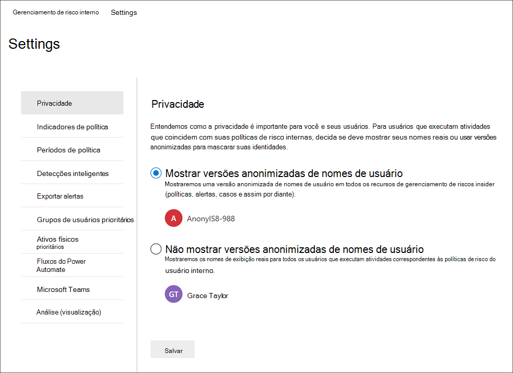

## Indicadores

Os modelos de política de risco insider definem o tipo de atividades de risco que você deseja detectar e investigar. Cada modelo de política é baseado em indicadores específicos que correspondem a gatilhos específicos e atividades de risco. Todos os indicadores são desabilitados por padrão e você deve selecionar um ou mais indicadores de política antes de configurar uma política de gerenciamento de riscos internas.

Os alertas são disparados por políticas quando os usuários executam atividades relacionadas a indicadores de política que atendem a um limite necessário. O gerenciamento de riscos insider usa dois tipos de indicadores:

- **Eventos de acionamento**: eventos que determinam se um usuário está ativo em uma política de gerenciamento de riscos insider. Se um usuário for adicionado a uma política de gerenciamento de riscos internas não tiver um evento de disparo, a atividade do usuário não será avaliada pela política. Por exemplo, o Usuário A é  adicionado a uma política criada a partir do roubo de dados ao separar o modelo de política de usuários, e a política e o conector de RH Microsoft 365 estão configurados corretamente. Até que o Usuário A tenha uma data de término relatada pelo conector de RH, as atividades do Usuário A não serão avaliadas por essa política de gerenciamento de riscos insider para o risco. Outro exemplo de evento de disparo é  se um usuário tiver um alerta de política DLP de alta gravidade ao usar *políticas de vazamento de* dados.
- **Indicadores de** política : indicadores incluídos em políticas de gerenciamento de riscos internas usadas para determinar uma pontuação de risco para um usuário no escopo. Esses indicadores de política são ativados somente depois que ocorre um evento de disparo para um usuário. Alguns exemplos de indicadores de política são quando um usuário copia dados para serviços pessoais de armazenamento em nuvem ou dispositivos de armazenamento portáteis, se uma conta de usuário é removida do Azure Active Directory ou se um usuário compartilha arquivos internos e pastas com partes externas não autorizadas.

Os indicadores de política são segmentados nas seguintes áreas. Você pode escolher os indicadores para ativar e personalizar os limites de eventos de indicador para cada nível de indicador ao criar uma política de risco interna:

- **Office**: incluem indicadores de política para sites, SharePoint, Microsoft Teams e mensagens de email.
- **Indicadores de** dispositivo : eles incluem indicadores de política para atividades como compartilhamento de arquivos pela rede ou com dispositivos. Os indicadores incluem atividades envolvendo todos os tipos de arquivo, excluindo atividades de arquivo executáveis (.exe) e biblioteca de links dinâmicos (.dll). Se você selecionar **indicadores** de dispositivo, a atividade será processada somente para dispositivos com Windows 10 Build 1809 ou superior e deverá primeiro integrar dispositivos no centro de conformidade. Para obter mais informações sobre como configurar dispositivos para integração com o risco insider, consulte a [seção](insider-risk-management-settings.md#OnboardDevices) Habilitar indicadores de dispositivo e dispositivos integrados neste artigo.
- Indicador de violação de política de segurança **(visualização)**: eles incluem indicadores do Microsoft Defender para Ponto de Extremidade relacionados à instalação de software não aprovado ou mal-intencionado ou ignorar controles de segurança. Para receber alertas no gerenciamento de riscos insider, você deve ter uma licença ativa do Defender para Endpoint e integração de risco insider habilitada. Para obter mais informações sobre como configurar o Defender para Endpoint para integração de gerenciamento de riscos insider, consulte [Configure advanced features in Microsoft Defender for Endpoint](/windows/security/threat-protection/microsoft-defender-atp/advanced-features\#share-endpoint-alerts-with-microsoft-compliance-center).
- **Indicadores de acesso físico (visualização)**: Eles incluem indicadores de política para acesso físico a ativos confidenciais. Por exemplo, tentativas de acesso a uma área restrita em seus logs do sistema de danos físicos podem ser compartilhadas com políticas de gerenciamento de riscos internas. Para receber esses tipos de alertas no gerenciamento de riscos insider, você deve ter ativos físicos prioritários habilitados no gerenciamento de riscos insider e o conector de dados de danos físicos [configurado.](import-physical-badging-data.md) Para saber mais sobre como configurar o acesso físico, consulte a seção [Prioridade de](#priority-physical-assets-preview) acesso físico neste artigo.
- **Microsoft Cloud App Security indicadores (visualização)**: eles incluem indicadores de política de alertas compartilhados de Cloud App Security. A detecção de anomalias automaticamente habilitada no Cloud App Security imediatamente começa a detectar e a colá-los, direcionando várias anomalias comportamentais em seus usuários e nos dispositivos e máquinas e dispositivos conectados à sua rede. Para incluir essas atividades em alertas de política de gerenciamento de riscos internas, selecione um ou mais indicadores nesta seção. Para saber mais sobre Cloud App Security análise e detecção de anomalias, consulte [Obter análise comportamental e detecção de anomalias.](/cloud-app-security/anomaly-detection-policy)
- **Aumentos de pontuação de** risco : eles incluem a elevação da pontuação de risco para atividades incomuns ou violações de política passadas. A habilitação de impulsionadores de pontuação de risco aumenta as pontuações de risco e a probabilidade de alertas para esses tipos de atividades. Para atividades incomuns, as pontuações serão incrementadas se a atividade detectada se desviar do comportamento típico do usuário. Por exemplo, um aumento significativo nos downloads de arquivos diários. Atividade incomum é apresentada como um aumento na porcentagem (por exemplo, '100% acima da atividade normal') e afetará a pontuação de risco de forma diferente, dependendo da atividade. Para usuários com violações de política anteriores, as pontuações serão incrementadas se um usuário tiver mais de um caso resolvido anteriormente como uma violação de política confirmada. Os impulsionadores de pontuação de risco só poderão ser selecionados se um ou mais indicadores forem selecionados.

Em alguns casos, você pode querer limitar os indicadores de política de risco insider que são aplicados a políticas de risco internas em sua organização. Você pode desativar os indicadores de política para áreas específicas desabilitando-os de todas as políticas de risco internas. Os eventos de acionamento não podem ser modificados para modelos de política de risco interno.

Para definir os indicadores de política de risco insider que estão habilitados em todas as políticas de risco internas, navegue até As configurações de risco do **Insider** Indicadores e selecione um ou mais indicadores  >   de política. Os indicadores selecionados na página Configurações de Indicadores não podem ser configurados individualmente ao criar ou editar uma política de risco interna no assistente de política.

>[!NOTE]
>Pode levar várias horas para que novos usuários adicionados manualmente apareçam no **painel Usuários.** As atividades dos 90 dias anteriores para esses usuários podem levar até 24 horas para exibição. Para exibir atividades para usuários adicionados manualmente, selecione o usuário no painel Usuários e abra a guia **Atividade** do usuário no painel de detalhes. 

### Habilitar indicadores de dispositivos e dispositivos de integração

Para habilitar o monitoramento de atividades de risco em dispositivos e incluir indicadores de política para essas atividades, seus dispositivos devem atender aos seguintes requisitos e você deve concluir as etapas de integração a seguir.

#### Etapa 1: preparar seus pontos de extremidade

Certifique-se de que os dispositivos Windows 10 que você planeja relatar no gerenciamento de risco interno atendem a esses requisitos.

1. Deve estar executando Windows 10 com build x64 1809 ou posterior e deve ter instalado [Windows 10 atualização do Windows 10 (Build 17763.1075 do sistema operacional) a](https://support.microsoft.com/help/4537818/windows-10-update-kb4537818) partir de 20 de fevereiro de 2020.
2. A conta de usuário usada para fazer logoff no dispositivo Windows 10 deve ser uma conta Azure Active Directory (AAD) ativa. O Windows 10 pode ser [AAD](/azure/active-directory/devices/concept-azure-ad-join), AAD híbrido ou Active Directory ingressado ou AAD registrado.
3. Instale o navegador Chromium Edge da Microsoft no dispositivo de ponto de extremidade para monitorar ações para a atividade de carregamento na nuvem. Confira, [Baixar o novo Microsoft Edge baseado em Chromium](https://support.microsoft.com/help/4501095/download-the-new-microsoft-edge-based-on-chromium).

#### Etapa 2: Integração de dispositivos

Você deve habilitar o monitoramento de dispositivos e a integração de seus pontos de extremidade antes de poder monitorar atividades de gerenciamento de riscos internas em um dispositivo. Ambas as ações são realizadas no portal Microsoft 365 Conformidade.

Quando você quiser integrar dispositivos que ainda não foram integrados, você baixará o script apropriado e implantará conforme descrito nas etapas a seguir.

Se você já tiver dispositivos integrados na [Microsoft Defender para Ponto de Extremidade](/windows/security/threat-protection/), eles já serão exibidos na lista dispositivos gerenciados. Siga [a Etapa 3: Se você tiver dispositivos conectados ao Microsoft Defender para Ponto](insider-risk-management-settings.md#OnboardStep3) de Extremidade na próxima seção.

Neste cenário de implantação, você vai integrar dispositivos que ainda não foram abordados e você só deseja monitorar as atividades de risco insider em Windows 10 dispositivos.

1. Abra o [Centro de conformidade do Microsoft](https://compliance.microsoft.com).
2. Abra a página de configurações do Centro de conformidade e escolha **Integrar dispositivos**.

   > [!NOTE]
   > Enquanto a integração de dispositivos geralmente leva cerca de 60 segundos para que seja habilitada, aguarde até 30 minutos antes de se envolver com o suporte da Microsoft.

3. Escolha **Gerenciamento de dispositivos** para abrir a lista **Dispositivos**. A lista estará vazia até você integrar os dispositivos.
4. Escolha **Integração** para iniciar o processo de integração.
5. Escolha a maneira como deseja implantar nesses mais dispositivos na lista de métodos **de** implantação e baixe **o pacote**.
6. Siga os procedimentos apropriados em [Ferramentas e métodos de integração dos computadores do Windows 10](/windows/security/threat-protection/microsoft-defender-atp/configure-endpoints). Este link leva você a uma página de destino onde você pode acessar os procedimentos da Proteção Avançada contra Ameaças do Microsoft Defender que correspondem ao pacote de implantação selecionado na etapa 5:
    - Integrar computadores com Windows 10 usando uma política de grupo
    - Integrar computadores com Windows usando o Microsoft Endpoint Configuration Manager
    - Integrar computadores com Windows 10 usando ferramentas de gerenciamento de dispositivo móvel
    - Integrar computadores com Windows 10 usando um script local
    - Integrar computadores não persistentes da VDI (infraestrutura de desktop virtual).

Depois que terminar e o ponto de extremidade for integrado, ele deverá estar visível na lista de dispositivos e o ponto de extremidade começará a relatar logs de atividades de auditoria para o gerenciamento de risco interno.

> [!NOTE]
> Esta experiência está na imposição da licença. Sem a licença necessária, os dados não estarão visíveis nem acessíveis.

#### Etapa 3: se você tiver dispositivos conectados ao Microsoft Defender para Ponto de Extremidade

Se o Microsoft Defender for Endpoint já estiver implantado e houver pontos de extremidade relatando, todos esses pontos de extremidade aparecerão na lista de dispositivos gerenciados. Você pode continuar a integração de novos dispositivos no gerenciamento de risco interno para expandir a cobertura usando a [seção Etapa 2: Dispositivos de integração.](insider-risk-management-settings.md#OnboardStep2)

1. Abra o [Centro de conformidade do Microsoft](https://compliance.microsoft.com).
2. Abra a página de configurações do Centro de conformidade e escolha **Habilitar o monitoramento de dispositivos**.
3. Escolha **Gerenciamento de dispositivos** para abrir a lista **Dispositivos**. Você deve ver a lista de dispositivos que já estão relatando no Microsoft Defender para Ponto de Extremidade.
4. Escolha **Integração** se precisar integrar mais dispositivos.
5. Escolha a maneira como você deseja implantar nesses mais dispositivos na lista de métodos **de** implantação e baixe **o pacote**.
6. Siga os procedimentos apropriados em [Ferramentas e métodos de integração dos computadores do Windows 10](/windows/security/threat-protection/microsoft-defender-atp/configure-endpoints). Este link leva você a uma página de destino onde você pode acessar os procedimentos da Proteção Avançada contra Ameaças do Microsoft Defender que correspondem ao pacote de implantação selecionado na etapa 5:
    - Integrar computadores com Windows 10 usando uma política de grupo
    - Integrar computadores com Windows usando o Microsoft Endpoint Configuration Manager
    - Integrar computadores com Windows 10 usando ferramentas de gerenciamento de dispositivo móvel
    - Integrar computadores com Windows 10 usando um script local
    - Integrar computadores não persistentes da VDI (infraestrutura de desktop virtual).

Depois que terminar e o ponto de extremidade for integrado, ele deverá estar visível na tabela **Dispositivos** e o ponto de extremidade começará a relatar logs de atividades de auditoria para o gerenciamento de risco interno.

> [!NOTE]
>Esta experiência está na imposição da licença. Sem a licença necessária, os dados não estarão visíveis nem acessíveis.

### Configurações de nível de indicador (visualização)

Ao criar uma política no assistente de política, você pode configurar como o número diário de eventos de risco deve influenciar a pontuação de risco para alertas de risco insider. Essas configurações de indicadores ajudam a controlar como o número de ocorrências de eventos de risco em sua organização deve afetar a pontuação de risco e, portanto, a gravidade do alerta associada a esses eventos. Se preferir, você também pode optar por manter os níveis de limite de eventos padrão recomendados pela Microsoft para todos os indicadores habilitados.

Por exemplo, você decide habilitar SharePoint indicadores nas configurações de política de risco interna e definir limites personalizados para eventos SharePoint ao configurar indicadores para uma nova política de vazamento *de* dados de risco interno. Enquanto estiver no assistente de política de risco interna, configure três níveis de eventos diários diferentes para cada indicador SharePoint influenciar a pontuação de risco para alertas associados a esses eventos.

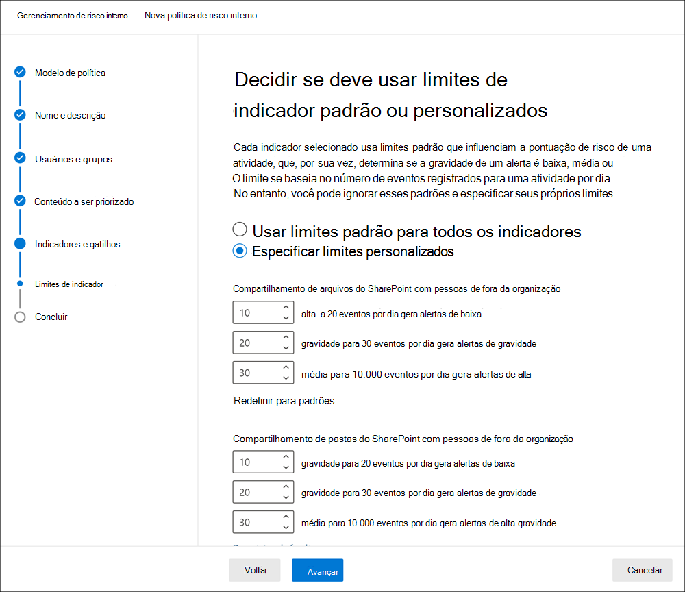

Para o primeiro nível de evento diário, você definirá o limite em *10* ou mais eventos por dia para um impacto menor para a pontuação de risco para os eventos, *20* ou mais eventos por dia para um impacto médio na pontuação de risco para os eventos e *30* ou mais eventos por dia um impacto maior na pontuação de risco para os eventos. Essas configurações efetivamente significam:

- Se houver de 1 a 9 SharePoint eventos que ocorrem após o evento de disparo, as pontuações de risco serão minimamente impactadas e tendem a não gerar um alerta.
- Se houver de 10 a 19 SharePoint eventos que ocorrem após um evento de disparo, a pontuação de risco é inerentemente menor e os níveis de gravidade do alerta tendem a estar em um nível baixo.
- Se houver de 20 a 29 SharePoint eventos que ocorrem após um disparo, a pontuação de risco é inerentemente maior e os níveis de gravidade do alerta tendem a estar em um nível médio.
- Se houver 30 ou mais eventos SharePoint que ocorrem após um disparo, a pontuação de risco é inerentemente maior e os níveis de gravidade do alerta tendem a estar em um nível alto.

## Períodos de tempo de política

Os períodos de tempo de política permitem definir períodos de revisão anteriores e futuros que são disparados após as combinações de políticas com base em eventos e atividades para os modelos de política de gerenciamento de riscos do insider. Dependendo do modelo de política escolhido, os seguintes períodos de política estão disponíveis:

- **Janela de** ativação : Disponível para  todos os modelos de política, **a** janela Ativação é o número definido de dias que a janela ativa após um evento de disparo. A janela é ativada de 1 a 30 dias após um evento de disparo ocorrer para qualquer usuário atribuído à política. Por exemplo, você configurou uma política de gerenciamento de riscos insider e definiu a janela *Ativação* como 30 dias. Vários meses se passaram desde que você configurou a política e ocorre um evento de gatilho para um dos usuários incluídos na política. O evento de ativação ativa a janela *Ativação* e a política está ativa para esse usuário por 30 dias após o evento de disparo ocorrer.
- **Detecção de atividade anterior**: Disponível para  todos os modelos de política, **a** detecção de atividade passada é o número definido de dias que a janela ativa antes de um evento de disparo. A janela é ativada de 0 a 180 dias antes que um evento de disparo ocorra para qualquer usuário atribuído à política. Por exemplo, você configurou uma política de gerenciamento de riscos insider e definiu a detecção de atividade *passada* como 90 dias. Vários meses se passaram desde que você configurou a política e ocorre um evento de gatilho para um dos usuários incluídos na política. O evento de gatilho  ativa a detecção de atividade passada e a política reúne atividades históricas para esse usuário por 90 dias antes do evento de disparo.

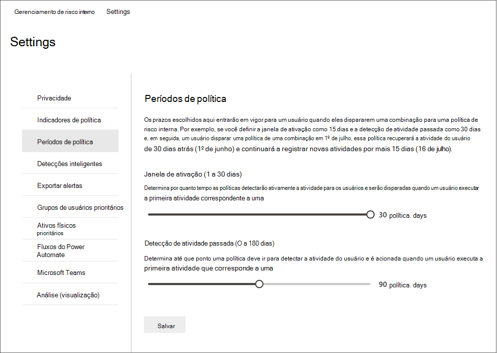

## Detecções inteligentes

As configurações de detecção inteligente ajudam a refinar como as detecções de atividades arriscadas são processadas para alertas. Em determinadas circunstâncias, talvez seja necessário definir tipos de arquivo para ignorar ou impor um nível de detecção para os arquivos para ajudar a definir uma barra mínima para alertas. Use essas configurações para controlar o volume geral de alerta, exclusões de tipo de arquivo e limites de volume de arquivo.

### Exclusões de tipo de arquivo

Para excluir tipos de arquivo específicos de todas as correspondências de política de gerenciamento de riscos internas, insira extensões de tipo de arquivo separadas por vírgulas. Por exemplo, para excluir determinados tipos de arquivos de música de correspondências de políticas, você pode inserir aac,mp3,wav,wma no campo **Exclusões de tipo de arquivo**. Os arquivos com essas extensões serão ignorados por todas as políticas de gerenciamento de riscos internas.

### Limite para atividade de arquivo incomum

Para definir um nível mínimo de arquivo antes que os alertas de atividade sejam relatados em políticas de risco internas, insira o número de arquivos. Por exemplo, você inseriria '10' se não quisesse gerar alertas de risco interno quando um usuário baixasse 10 arquivos ou menos, mesmo que as políticas considerasse essa atividade incomum.

### Volume de alerta

As atividades do usuário detectadas pelas políticas de risco internas são atribuídas a uma pontuação de risco específica, que, por sua vez, determina a gravidade do alerta (baixa, média, alta). Por padrão, geraremos uma certa quantidade de alertas de baixa, média e alta gravidade, mas você pode aumentar ou diminuir o volume para atender às suas necessidades. Para ajustar o volume de alertas para todas as políticas de gerenciamento de riscos internas, escolha uma das seguintes configurações:

- **Menos alertas**: você verá todos os alertas de alta gravidade, menos alertas de gravidade média e nenhum alerta de baixa gravidade. Esse nível de configuração significa que você pode perder alguns verdadeiros positivos.
- **Volume padrão**: você verá todos os alertas de alta gravidade e uma quantidade equilibrada de alertas de média e baixa gravidade.
- **Mais alertas**: você verá todos os alertas de média e alta gravidade e a maioria dos alertas de baixa gravidade. Esse nível de configuração pode resultar em mais falsos positivos.

### Microsoft Defender para Ponto de Extremidade (visualização)

[O Microsoft Defender for Endpoint](/windows/security/threat-protection/microsoft-defender-atp/microsoft-defender-advanced-threat-protection) é uma plataforma de segurança de ponto de extremidade empresarial projetada para ajudar as redes corporativas a evitar, detectar, investigar e responder a ameaças avançadas. Para ter melhor visibilidade das violações de segurança em sua organização, você pode importar e filtrar alertas do Defender para o Ponto de Extremidade para atividades usadas em políticas criadas a partir de modelos de política de violação de segurança de gerenciamento de risco interno.

Dependendo dos tipos de sinais nos quais você está interessado, você pode optar por importar alertas para o gerenciamento de risco interno com base no status de triagem de alerta do Defender para Ponto de Extremidade. Você pode definir um ou mais dos seguintes status de triagem de alerta nas configurações globais a ser importadas:

- Desconhecido
- Novo
- Em andamento
- Resolvido

Alertas do Defender para Ponto de Extremidade são importados diariamente. Dependendo do status de triagem escolhido, você pode ver várias atividades do usuário para o mesmo alerta que as alterações de status de triagem no Defender para Ponto de Extremidade.

Por exemplo, se você selecionar *Novo* *,* Em andamento e *Resolvido* para essa configuração, quando um alerta do Microsoft Defender for Endpoint for gerado e o status for *Novo*, uma atividade de alerta inicial será importada para o usuário em risco interno. Quando o status de triagem do Defender para Ponto de Extremidade muda para *Em andamento,* uma segunda atividade para esse alerta é importada para o usuário em risco interno. Quando o status final de triagem do Defender para Ponto de Extremidade de *Resolvido* é definido, uma terceira atividade para esse alerta é importada para o usuário em risco interno. Essa funcionalidade permite que os investigadores sigam a progressão dos alertas do Defender para Ponto de Extremidade e escolham o nível de visibilidade que sua investigação exige.

>[!IMPORTANT]
>Você precisará ter o Microsoft Defender para Ponto de Extremidade configurado em sua organização e habilitar o Defender for Endpoint para integração de gerenciamento de riscos insider no Defender Security Center para importar alertas de violação de segurança. Para obter mais informações sobre como configurar o Defender para o Ponto de Extremidade para integração de gerenciamento de riscos insider, consulte [Configure advanced features in Defender for Endpoint](/windows/security/threat-protection/microsoft-defender-atp/advanced-features\#share-endpoint-alerts-with-microsoft-compliance-center).

### Domínios (visualização)

As configurações de domínio ajudam a definir níveis de risco para atividades para domínios específicos. Essas atividades incluem compartilhamento de arquivos, envio de mensagens de email, download ou carregamento de conteúdo. Especificando domínios nessas configurações, você pode aumentar ou diminuir a pontuação de risco para atividades que ocorrem com esses domínios.

Use Adicionar domínio para definir um domínio para cada uma das configurações de domínio. Além disso, você pode usar caracteres curinga para ajudar a corresponder a variações de domínios raiz ou subdomas. Por exemplo, para especificar sales.wingtiptoys.com e support.wingtiptoys.com, use a entrada curinga '*.wingtiptoys.com' para corresponder a esses subdomínios (e qualquer outro subdomínio no mesmo nível). Para especificar subdomas de vários níveis para um domínio raiz, você deve selecionar a caixa de seleção **Incluir Subdomas de Vários** Níveis.

Para cada uma das seguintes configurações de domínio, você pode inserir até 500 domínios:

- **Domínios não alotados:** Especificando domínios não alotados, a atividade que ocorre com esses domínios terá pontuações *de risco* maiores. Alguns exemplos são atividades que envolvem o compartilhamento de conteúdo com alguém (como enviar emails para alguém com um endereço gmail.com) e quando os usuários baixam conteúdo para um dispositivo de um desses domínios não conectados.
- **Domínios permitidos:** Determinada atividade relacionada a domínios permitidos será ignorada por suas políticas e não gerará alertas. Essas atividades incluem:

    - Email enviado para domínios externos
    - Arquivos, pastas, sites compartilhados com domínios externos
    - Arquivos carregados em domínios externos (usando Microsoft Edge navegador)

    Especificando domínios permitidos em configurações, essa atividade com esses domínios é tratada da mesma forma como a atividade interna da organização é tratada. Por exemplo, domínios adicionados aqui mapeiam para atividades podem envolver o compartilhamento de conteúdo com alguém de fora da sua organização (por exemplo, enviar emails para alguém com um endereço gmail.com endereço).

- **Domínios de terceiros:** Se sua organização usa domínios de terceiros para fins comerciais (como armazenamento na nuvem), inclua-os aqui para que você possa receber alertas para atividades relacionadas ao indicador de dispositivo Use um navegador para baixar conteúdo de um site de *terceiros.*

## Exportar alertas (visualização)

As informações de alerta de gerenciamento de riscos do Insider são exportáveis para serviços de gerenciamento de informações de segurança e eventos (SIEM) por meio do esquema da API de Atividade de Gerenciamento do [Office 365.](/office/office-365-management-api/office-365-management-activity-api-schema#security-and-compliance-alerts-schema) Você pode usar as OFFICE 365 de Atividade de Gerenciamento para exportar informações de alerta para outros aplicativos que sua organização pode usar para gerenciar ou agregar informações de risco interno.

Para usar as APIs para analisar informações de alerta de risco interno:

1. Habilitar Office 365 API de Atividade de Gerenciamento no **Insider risk management**  >  **Configurações**  >  **Exportar alertas**. Por padrão, essa configuração está desabilitada para sua Microsoft 365 organização.
2. Filtrar as atividades Office 365 de auditoria comuns *por SecurityComplianceAlerts*.
3. Filter *SecurityComplianceAlerts* by the *InsiderRiskManagement* category.

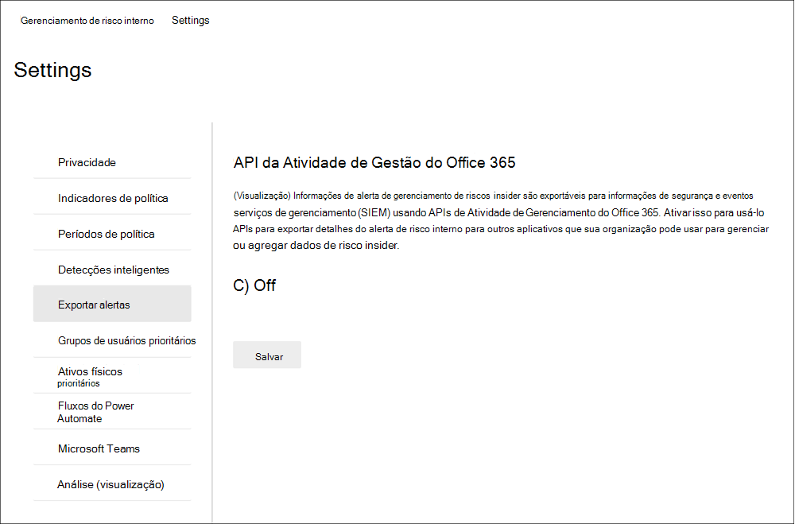

As informações de alerta contêm informações do esquema de alertas de segurança e conformidade e o esquema comum da API de Atividade de Gerenciamento Office 365 Gerenciamento.

Os seguintes campos e valores são exportados para alertas de gerenciamento de riscos insider para o esquema de alertas de & conformidade e segurança:

| **Parâmetro Alert** | **Descrição** |
|:------------------|:----------------|
| AlertType | O tipo do alerta é *Custom*.  |
| AlertId | O GUID do alerta. Alertas de gerenciamento de riscos insider são mutáveis. À medida que o status do alerta muda, um novo log com o mesmo AlertID é gerado. Esse AlertID pode ser usado para correlacionar atualizações para um alerta. |
| Categoria | A categoria do alerta é *InsiderRiskManagement*. Essa categoria pode ser usada para distinguir esses alertas de outros alertas de conformidade & segurança. |
| Comentários | Comentários padrão para o alerta. Os valores *são Novo Alerta* (registrado quando um alerta é criado) e Alerta *Atualizado* (registrado quando há uma atualização para um alerta). Use o AlertID para correlacionar atualizações para um alerta. |
| Dados | Os dados do alerta incluem a ID do usuário exclusiva, o nome principal do usuário e a data e hora (UTC) quando o usuário foi acionado em uma política. |
| Nome | Nome da política para política de gerenciamento de riscos internas que gerou o alerta. |
| PolicyId | O GUID da política de gerenciamento de riscos internas que disparou o alerta. |
| Severity | A gravidade do alerta. Os valores *são Alto,* *Médio* ou *Baixo.* |
| Origem | A origem do alerta. O valor é *Office 365 Segurança & Conformidade*. |
| Status | O status do alerta. Os valores são *ativos* (*Precisa de* Revisão no risco insider), *Investigação* *(* Confirmado no risco insider), *Resolvido* (*Resolvido* no risco insider), *Ignorado* (*Ignorado* no risco insider). |
| Versão | A versão do esquema de alerta de segurança e conformidade. |

Os campos e valores a seguir são exportados para alertas de gerenciamento de riscos insider para o esquema comum da API de Atividade de Gerenciamento Office 365 [gerenciamento.](/office/office-365-management-api/office-365-management-activity-api-schema#common-schema)

- UserId
- Id
- RecordType
- CreationTime
- Operation
- OrganizationId
- UserType
- UserKey

## Grupos de usuários prioritários (visualização)

Os usuários em sua organização podem ter níveis diferentes de risco, dependendo de sua posição, nível de acesso a informações confidenciais ou histórico de riscos. Priorizar o exame e a pontuação das atividades desses usuários pode ajudar a alertá-lo sobre possíveis riscos que podem ter consequências maiores para sua organização. Grupos de usuários prioritários no gerenciamento de riscos insider ajudam a definir os usuários em sua organização que precisam de uma inspeção mais próxima e pontuação de risco mais sensível. Juntamente com  as violações da política de segurança por usuários prioritários e *vazamentos* de dados por modelos de política de usuários prioritários, os usuários adicionados a um grupo de usuários prioritários têm uma maior probabilidade de alertas e alertas de risco interno com níveis de gravidade mais altos.

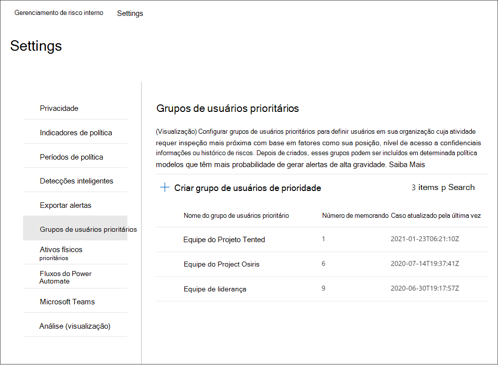

Por exemplo, você precisa proteger contra vazamentos de dados para um projeto altamente confidencial onde os usuários têm acesso a informações confidenciais. Você opta por criar *um grupo de*  usuários de prioridade Project usuários da sua organização que trabalham nesse projeto. Usando o assistente de política e os vazamentos de dados pelo  modelo de política de usuários *prioritários,* você cria uma nova política e atribui o grupo Usuários de prioridade de usuários confidenciais Project à política. As atividades examinadas pela política  para membros do grupo de usuários de prioridade de usuários Project confidencial são mais sensíveis ao risco e as atividades desses usuários terão mais probabilidade de gerar um alerta e ter alertas com níveis de gravidade mais altos.

### Criar um grupo de usuários de prioridade

Para criar um novo grupo de usuários de prioridade, você usará a configuração de controles na solução de gerenciamento de riscos do **Insider** no Microsoft 365 de conformidade. Para criar um grupo de usuários de prioridade, você deve ser membro do grupo de função Gerenciamento de Riscos *do Insider* ou Administrador de Gerenciamento de Riscos do *Insider.*

Conclua as etapas a seguir para criar um grupo de usuários prioritário:

1. No centro [Microsoft 365 de conformidade,](https://compliance.microsoft.com)vá para Gerenciamento de riscos **do Insider** e selecione Configurações de risco **do Insider.**
2. Selecione a **guia Grupos de usuários prioritários**
3. Na guia **Grupos de usuários prioritários,** selecione Criar grupo de usuários **de prioridade** para iniciar o assistente de criação de grupo.
4. Na página **Definir grupo,** conclua os seguintes campos:
    - **Nome (obrigatório)**: Insira um nome amigável para o grupo de usuários prioritário. Não é possível alterar o nome do grupo de usuários de prioridade depois de concluir o assistente.
    - **Descrição (opcional)**: Insira uma descrição para o grupo de usuários de prioridade.
5. Selecione **Próximo** para continuar.
6. Na página **Escolher** membros, selecione Escolher membros para pesquisar e selecionar quais contas de usuário habilitadas para email estão incluídas no grupo ou selecione a caixa de seleção **Selecionar** todos os usuários da sua organização ao grupo.  Selecione **Adicionar** para continuar ou **Cancelar** para fechar sem adicionar usuários ao grupo.
7. Selecione **Próximo** para continuar.
8. Na página **Revisão,** revise as configurações escolhidas para o grupo de usuários prioritário. Selecione **Editar** para alterar qualquer um dos valores de grupo ou **selecione Enviar** para criar e ativar o grupo de usuários prioritário.
9. Na página de confirmação, selecione **Feito para** sair do assistente.

### Atualizar um grupo de usuários de prioridade

Para atualizar um grupo de usuários de prioridade existente, você usará os controles de configuração na solução de gerenciamento de riscos do **Insider** no Microsoft 365 de conformidade. Para atualizar um grupo de usuários de prioridade, você deve ser membro do grupo de função Gerenciamento de Riscos *do Insider* ou Administrador de Gerenciamento de Riscos do *Insider.*

Conclua as etapas a seguir para editar um grupo de usuários prioritário:

1. No centro [Microsoft 365 de conformidade,](https://compliance.microsoft.com)vá para Gerenciamento de riscos **do Insider** e selecione Configurações de risco **do Insider.**
2. Selecione a **guia Grupos de usuários prioritários**
3. Selecione o grupo de usuários de prioridade que você deseja editar e selecione **Editar grupo**.
4. Na página **Definir grupo,** atualize o campo Descrição, se necessário. Não é possível atualizar o nome do grupo de usuários prioritário. Selecione **Próximo** para continuar.
5. Na página **Escolher membros,** adicione novos membros ao grupo usando o **controle Escolher membros.** Para remover um usuário do grupo, selecione o 'X' ao lado do usuário que você deseja remover. Selecione **Próximo** para continuar.
6. Na página **Revisão,** revise as configurações de atualização escolhidas para o grupo de usuários prioritário. Selecione **Editar** para alterar qualquer um dos valores de grupo ou **selecione Enviar** para atualizar o grupo de usuários prioritário.
7. Na página de confirmação, selecione **Feito para** sair do assistente.

### Excluir um grupo de usuários de prioridade

Para excluir um grupo de usuários de prioridade existente, você usará os controles de configuração na solução de gerenciamento de riscos do **Insider** no Microsoft 365 de conformidade. Para excluir um grupo de usuários de prioridade, você deve ser membro do grupo de função Gerenciamento de Riscos *do Insider* ou Administrador de Gerenciamento de Riscos do *Insider.*

>[!IMPORTANT]
>Excluir um grupo de usuários de prioridade o removerá de qualquer política ativa à qual ele é atribuído. Se você excluir um grupo de usuários de prioridade atribuído a uma política ativa, a política não conterá nenhum usuário no escopo e ficará efetivamente ociosa e não criará alertas.

Conclua as etapas a seguir para excluir um grupo de usuários prioritário:

1. No centro [Microsoft 365 de conformidade,](https://compliance.microsoft.com)vá para Gerenciamento de riscos **do Insider** e selecione Configurações de risco **do Insider.**
2. Selecione a **guia Grupos de usuários prioritários**
3. Selecione o grupo de usuários de prioridade que você deseja editar e selecione **Excluir** no menu do painel.
4. Na caixa **de diálogo Excluir,** selecione **Sim** para excluir o grupo de usuários de prioridade ou selecione **Cancelar** para retornar ao painel.

## Ativos físicos prioritários (visualização)

Identificar o acesso a ativos físicos prioritários e correlacionar a atividade de acesso a eventos do usuário é um componente importante da infraestrutura de conformidade. Esses ativos físicos representam locais de prioridade em sua organização, como edifícios da empresa, data centers ou salas de servidores. As atividades de risco do insider podem estar associadas a usuários que trabalham em horários incomuns, tentando acessar essas áreas confidenciais ou seguras não autorizadas e solicitações de acesso a áreas de alto nível sem necessidades legítimas.

Com ativos físicos prioritários habilitados e o conector de dados de danos físicos configurado, o gerenciamento de riscos internos integra sinais de seus sistemas de controle físico e de acesso a outras atividades de risco do usuário.  Examinando padrões de comportamento em sistemas de acesso físico e correlacionando essas atividades com outros eventos de risco internos, o gerenciamento de riscos internos pode ajudar os investigadores e analistas de conformidade a tomar decisões de resposta mais informadas para alertas. O acesso aos ativos físicos prioritários é marcado e identificado em insights de forma diferente do acesso a ativos não prioritários.

Por exemplo, sua organização tem um sistema de badging para usuários que monitoram e aprovam o acesso físico a áreas normais de trabalho e projetos confidenciais. Você tem vários usuários trabalhando em um projeto sensível e esses usuários retornarão para outras áreas da sua organização quando o projeto for concluído. À medida que o projeto confidencial se aproxima da conclusão, você deseja garantir que o trabalho do projeto permaneça confidencial e que o acesso às áreas do projeto seja fortemente controlado.

Você opta por habilitar o conector de dados de danos físicos Microsoft 365 importar informações de acesso do seu sistema de danos físicos e especificar ativos físicos prioritários no gerenciamento de riscos insider. Importando informações do seu sistema de badging e correlacionando informações de acesso físico com outras atividades de risco identificadas no gerenciamento de riscos insider, você percebe que um dos usuários no projeto está acessando os escritórios do projeto após o horário de trabalho normal e também está exportando grandes quantidades de dados para um serviço de armazenamento de nuvem pessoal de sua área de trabalho normal. Essa atividade de acesso físico associada à atividade online pode apontar para possíveis roubos de dados e os investigadores e analistas de conformidade podem tomar as ações apropriadas conforme ditado pelas circunstâncias desse usuário.

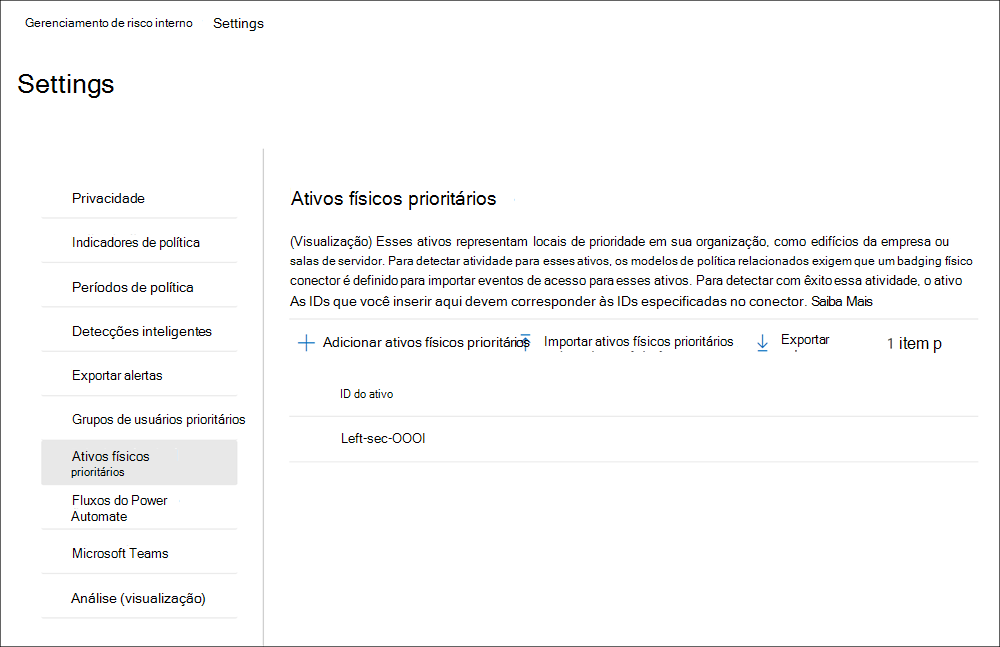

### Configurar ativos físicos prioritários

Para configurar ativos físicos de prioridade, você configurará o conector de badging físico e usará controles de configuração na solução de gerenciamento de riscos do **Insider** no centro de conformidade Microsoft 365. Para configurar ativos físicos prioritários, você deve ser membro do grupo de função Gerenciamento de Riscos *insider* ou Administrador de Gerenciamento de Riscos *do Insider.*

Conclua as etapas a seguir para configurar ativos físicos prioritários:

1. Siga as etapas de configuração para o gerenciamento de riscos insider no artigo Sobre como [começar com o gerenciamento de riscos insider.](insider-risk-management-configure.md) Na Etapa 3, configure o conector de badging físico.

    >[!IMPORTANT]
    >Para que as políticas de gerenciamento de riscos internas usem e correlacionam dados de sinal relacionados a usuários de saída e encerrados com dados de eventos de suas plataformas de controle físico e de acesso, você também deve configurar o conector de RH Microsoft 365. Se você habilitar o conector de badging físico sem habilitar o conector de RH Microsoft 365, as políticas de gerenciamento de riscos insider processarão apenas eventos para atividades de acesso físico para usuários em sua organização.

2. No centro [de Microsoft 365 de conformidade,](https://compliance.microsoft.com)vá para Gerenciamento de riscos **do Insider** e selecione Configurações de risco do **Insider**  >  **Prioridade de ativos físicos**.
3. Na  página Ativos físicos prioritários, você pode adicionar manualmente as IDs de ativos físicos que deseja monitorar para os eventos de ativos importados pelo conector de badging físico ou importar um arquivo .csv de todas as IDs de ativos físicos importadas pelo conector de danos físicos: a) Para adicionar manualmente as IDs de ativos físicos, escolha Adicionar ativos físicos prioritários, insira uma ID de ativo físico e selecione **Adicionar**. Insira outras IDs de ativos físicos e selecione Adicionar ativos **físicos** de prioridade para salvar todos os ativos inseridos.
    b) Para adicionar uma lista de IDs de ativos físicos de um arquivo .csv, escolha **Importar ativos físicos de** prioridade . Na caixa de diálogo explorador de arquivos, selecione o arquivo .csv que deseja importar e selecione **Abrir**. As IDs de ativos físicos dos arquivos .csv são adicionadas à lista.
4. Navegue até **a guia Indicadores de** política no Configurações.
5. Na página **Indicadores de Política,** navegue até a seção Indicadores de acesso físico e selecione a caixa de seleção para acesso físico após a terminação ou falha no acesso **ao ativo sensível**. 
6. Selecione **Salvar** para configurar e sair.

### Excluir um ativo físico de prioridade

Para excluir um ativo físico de prioridade existente, você usará os controles de configuração na solução de gerenciamento de riscos do Insider no Microsoft 365 de conformidade. Para excluir um ativo físico de prioridade, você deve ser membro do grupo de função Gerenciamento de Risco do Insider ou Administrador de Gerenciamento de Riscos do Insider.

>[!IMPORTANT]
>Excluir um ativo físico de prioridade o remove do exame por qualquer política ativa à qual ele foi incluído anteriormente. Alertas gerados por atividades associadas ao ativo físico de prioridade não são excluídos.

Conclua as etapas a seguir para excluir um ativo físico de prioridade:

1. No centro [de Microsoft 365 de conformidade,](https://compliance.microsoft.com)vá para Gerenciamento de riscos **do Insider** e selecione Configurações de risco do **Insider**  >  **Prioridade de ativos físicos**.
2. Na página **Prioridade de ativos físicos,** selecione o ativo que você deseja excluir.
3. Selecione **Excluir** no menu ação para excluir o ativo.

## Power Automate fluxos (visualização)

[O Microsoft Power Automate](/power-automate/getting-started) é um serviço de fluxo de trabalho que automatiza ações entre aplicativos e serviços. Usando fluxos de modelos ou criados manualmente, você pode automatizar tarefas comuns associadas a esses aplicativos e serviços. Quando você habilita Power Automate fluxos para gerenciamento de riscos insider, você pode automatizar tarefas importantes para casos e usuários. Você pode configurar Power Automate fluxos para recuperar informações de usuário, alerta e caso e compartilhar essas informações com as partes interessadas e outros aplicativos, bem como automatizar ações no gerenciamento de riscos insider, como postar em anotações de caso. Power Automate fluxos são aplicáveis para casos e qualquer usuário no escopo de uma política.

Os clientes com Microsoft 365 assinaturas que incluem o gerenciamento de riscos insider não precisam de licenças de Power Automate adicionais para usar os modelos de gerenciamento de risco Power Automate insider recomendados. Esses modelos podem ser personalizados para dar suporte à sua organização e abranger os principais cenários de gerenciamento de riscos do insider. Se você optar por usar recursos de Power Automate premium nesses modelos, crie um modelo personalizado usando o conector de conformidade do Microsoft 365 ou use modelos de Power Automate para outras áreas de conformidade no Microsoft 365, talvez você precise de mais Power Automate licenças.

Os seguintes Power Automate modelos são fornecidos aos clientes para dar suporte à automação de processos para usuários e casos de gerenciamento de riscos insider:

- **Notifique** os usuários quando eles são adicionados a uma política de risco interna : este modelo é para organizações que têm políticas internas, privacidade ou requisitos regulatórios que os usuários devem ser notificados quando estão sujeitos a políticas de gerenciamento de riscos internos. Quando esse fluxo é configurado e selecionado para um usuário na página usuários, os usuários e seus gerentes são enviados uma mensagem de email quando o usuário é adicionado a uma política de gerenciamento de riscos internas. Esse modelo também dá suporte à atualização de uma lista SharePoint hospedada em um site SharePoint para ajudar a controlar detalhes da mensagem de notificação, como data/hora e o destinatário da mensagem. Se você optou por anonimizar os usuários em Configurações de Privacidade, os **fluxos** criados a partir deste modelo não funcionarão conforme o pretendido para que a privacidade do usuário seja mantida. Power Automate fluxos usando este modelo estão disponíveis no painel **Usuários.**
- **Solicitar** informações de RH ou negócios sobre um usuário em um caso de risco interno : Ao agir em um caso, os analistas de risco interno e os investigadores podem precisar consultar o RH ou outras partes interessadas para entender o contexto das atividades de caso. Quando esse fluxo é configurado e selecionado para um caso, analistas e investigadores enviam uma mensagem de email para o RH e as partes interessadas de negócios configuradas para esse fluxo. Cada destinatário recebe uma mensagem com opções de resposta pré-configuradas ou personalizáveis. Quando os destinatários selecionam uma opção de resposta, a resposta é registrada como uma nota de ocorrência e inclui informações de destinatário e data/hora. Se você optou por anonimizar os usuários em Configurações de Privacidade, os **fluxos** criados a partir deste modelo não funcionarão conforme o pretendido para que a privacidade do usuário seja mantida. Power Automate fluxos usando este modelo estão disponíveis no painel **Casos.**
- **Notificar o gerente quando um** usuário tiver um alerta de risco interno : Algumas organizações podem precisar ter notificação de gerenciamento imediata quando um usuário tiver um alerta de gerenciamento de risco interno. Quando esse fluxo é configurado e selecionado, o gerente do usuário do caso é enviado uma mensagem de email com as seguintes informações sobre todos os alertas de caso:
    - Política aplicável para o alerta
    - Data/hora do alerta
    - Nível de gravidade do alerta

    O fluxo atualiza automaticamente as anotações de caso que a mensagem foi enviada e que o fluxo foi ativado. Se você optou por anonimizar os usuários em Configurações de Privacidade, os **fluxos** criados a partir deste modelo não funcionarão conforme o pretendido para que a privacidade do usuário seja mantida. Power Automate fluxos usando este modelo estão disponíveis no painel **Casos.**
- **Criar registro para caso de** risco insider em ServiceNow : Este modelo é para organizações que querem usar sua solução ServiceNow para rastrear casos de gerenciamento de riscos insider.  Quando, em um caso, os analistas de risco interno e os investigadores podem criar um registro para o caso em ServiceNow. Você pode personalizar esse modelo para preencher campos selecionados em ServiceNow com base nos requisitos da sua organização. Power Automate fluxos usando este modelo estão disponíveis no painel **Casos.** Para obter mais informações sobre os campos ServiceNow disponíveis, consulte o artigo de referência do [ServiceNow Connector.](/connectors/service-now/)

### Criar um Power Automate de um modelo de gerenciamento de risco interno

Para criar um fluxo de Power Automate a partir de um modelo de gerenciamento de risco interno recomendado, você usará os controles de configuração na solução de gerenciamento de riscos do **Insider** no centro de conformidade do Microsoft 365 ou na opção Gerenciar fluxos de **Power Automate do** controle **Automate** ao trabalhar diretamente nos painéis **Casos** ou **Usuários.**

Para criar um Power Automate fluxo na área de configurações, você deve ser membro do grupo de função Gerenciamento de Riscos do *Insider* ou Administrador de Gerenciamento de Riscos do *Insider.* Para criar um fluxo Power Automate com a opção **Gerenciar** fluxos de Power Automate, você deve ser membro de pelo menos um grupo de função de gerenciamento de risco interno.

Conclua as etapas a seguir para criar um fluxo Power Automate de um modelo de gerenciamento de risco interno recomendado:

1. No centro [Microsoft 365 de conformidade,](https://compliance.microsoft.com/)vá para Gerenciamento de riscos do **Insider** e selecione Configurações de risco do **Insider**  >  **Power Automate fluxos**. Você também pode acessar a partir das **páginas de** **painéis** Casos ou Usuários escolhendo **Automatizar**  >  **Gerenciar Power Automate fluxos**.
2. Na página **Power Automate fluxos,** selecione um modelo recomendado nos modelos de gerenciamento de riscos do **Insider** que você pode gostar da seção na página.
3. O fluxo lista as conexões incorporadas necessárias para o fluxo e observará se os status da conexão estão disponíveis. Se necessário, atualize quaisquer conexões que não sejam exibidas como disponíveis. Selecione **Continuar**.
4. Por padrão, os fluxos recomendados são pré-configurados com o gerenciamento de risco interno recomendado e Microsoft 365 de dados de serviço necessários para concluir a tarefa atribuída para o fluxo. Se necessário, personalize os componentes de fluxo usando o controle Mostrar opções **avançadas** e configurando as propriedades disponíveis para o componente de fluxo.
5. Se necessário, adicione outras etapas ao fluxo selecionando o **botão Nova etapa.** Na maioria dos casos, isso não deve ser necessário para os modelos padrão recomendados.
6. Selecione **Salvar rascunho** para salvar o fluxo para mais configuração ou selecione **Salvar** para concluir a configuração do fluxo.
7. Selecione **Fechar** para retornar à página Power Automate **fluxo.** O novo modelo será listado como  um fluxo nas guias Meus fluxos e estará disponível **automaticamente** no controle suspenso Automatizar ao trabalhar com casos de gerenciamento de riscos insider para o usuário criar o fluxo.

>[!IMPORTANT]
>Se outros usuários em sua organização precisam de acesso ao fluxo, o fluxo deve ser compartilhado.

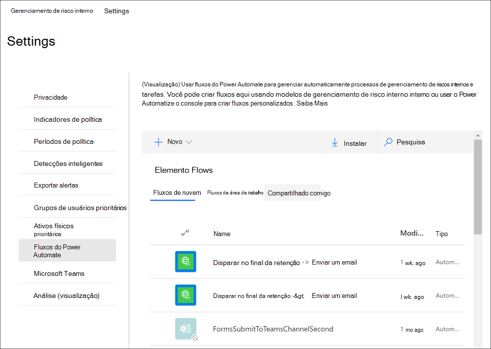

### Criar um fluxo de Power Automate personalizado para gerenciamento de risco interno

Alguns processos e fluxos de trabalho para sua organização podem estar fora dos modelos de fluxo de fluxo de gerenciamento de riscos internos recomendados e você pode ter a necessidade de criar fluxos de Power Automate personalizados para áreas de gerenciamento de riscos internos. Power Automate fluxos são flexíveis e suportam uma personalização extensa, mas há etapas que precisam ser tomadas para se integrar aos recursos de gerenciamento de riscos insider.

Conclua as etapas a seguir para criar um modelo de Power Automate personalizado para gerenciamento de risco interno:

1. **Verifique sua Power Automate de** fluxo : Para criar fluxos de Power Automate personalizados que usam gatilhos de gerenciamento de riscos insider, você precisará de uma licença Power Automate de segurança. Os modelos de fluxo de gerenciamento de riscos insider recomendados não exigem licenciamento extra e são incluídos como parte da sua licença de gerenciamento de riscos insider.
2. **Criar um fluxo automatizado:** crie um fluxo que execute uma ou mais tarefas depois que ele é disparado por um evento de gerenciamento de riscos insider. Para obter detalhes sobre como criar um fluxo automatizado, consulte [Create a flow in Power Automate](/power-automate/get-started-logic-flow).
3. **Selecione o Microsoft 365 de conformidade**: Procure e selecione o conector Microsoft 365 conformidade. Esse conector habilita gatilhos e ações de gerenciamento de riscos insider. Para obter mais informações sobre conectores, consulte o artigo visão geral [de referência do](/connectors/connector-reference/) conector.
4. **Escolha gatilhos de gerenciamento de** riscos insider para seu fluxo : O gerenciamento de riscos do Insider tem dois gatilhos disponíveis para fluxos Power Automate personalizados:
    - **Para um caso de gerenciamento de risco** interno selecionado: fluxos com esse gatilho podem ser selecionados na página do painel De ocorrências de gerenciamento de riscos insider.
    - **Para um usuário de gerenciamento de riscos insider** selecionado: fluxos com esse gatilho podem ser selecionados na página do painel Usuários de gerenciamento de riscos insider.
5. Escolha ações de gerenciamento de riscos internas para seu fluxo: Você pode escolher entre várias ações para o gerenciamento de riscos insider incluir em seu fluxo personalizado:
    - Obter alerta de gerenciamento de riscos insider
    - Obter caso de gerenciamento de risco interno
    - Obter usuário de gerenciamento de riscos insider
    - Obter alertas de gerenciamento de riscos insider para um caso
    - Adicionar uma observação de caso de gerenciamento de risco interno

### Compartilhar um Power Automate fluxo

Por padrão, Power Automate fluxos criados por um usuário estão disponíveis apenas para esse usuário. Para que outros usuários de gerenciamento de riscos insider tenham acesso e usem um fluxo, o fluxo deve ser compartilhado pelo criador do fluxo. Para compartilhar um fluxo, você usará os controles de configurações na solução de gerenciamento de riscos **do Insider** no centro de conformidade  do  Microsoft 365 ou na opção Gerenciar fluxos Power Automate **do** controle Automate ao trabalhar diretamente nas páginas do painel Casos ou Usuários. Depois de compartilhar um fluxo, todos com quem ele foi  compartilhado podem acessar o fluxo no menu suspenso Automatizar controle nos painéis **Caso** **e Usuário.**

Para compartilhar um Power Automate fluxo na área de configurações, você deve ser membro do grupo de função Gerenciamento de Riscos do *Insider* ou Administrador de Gerenciamento de Riscos do *Insider.* Para compartilhar um Power Automate fluxo com a opção **Gerenciar** fluxos de Power Automate, você deve ser membro de pelo menos um grupo de função de gerenciamento de riscos insider.

Conclua as etapas a seguir para compartilhar um Power Automate fluxo:

1. No centro [Microsoft 365 de conformidade,](https://compliance.microsoft.com)vá para Gerenciamento de riscos do **Insider** e selecione Configurações de risco do **Insider**  >  **Power Automate fluxos**. Você também pode acessar a partir das **páginas de** **painéis** Casos ou Usuários escolhendo **Automatizar**  >  **Gerenciar Power Automate fluxos**.
2. Na página **Power Automate fluxos,** selecione a **guia Meus fluxos** ou **Fluxos de** equipe.
3. Selecione o fluxo a ser compartilhá-lo e selecione **Compartilhar** no menu opções de fluxo.
4. Na página de compartilhamento de fluxo, insira o nome do usuário ou grupo que você deseja adicionar como proprietário do fluxo.
5. Na caixa **de diálogo Conexão Usada,** selecione **OK** para confirmar que o usuário ou grupo adicionado terá acesso total ao fluxo.

### Editar um Power Automate fluxo

Para editar um fluxo, você usará os controles de configurações na solução de gerenciamento de riscos **do Insider** no centro de conformidade  do Microsoft 365 ou na opção Gerenciar  **fluxos** Power Automate **do** controle Automatizar ao trabalhar diretamente nos painéis Casos ou Usuários.

Para editar um Power Automate na área de configurações, você deve ser membro do grupo de função Gerenciamento de Riscos do *Insider* ou Administrador de Gerenciamento de Riscos do *Insider.* Para editar um Power Automate fluxo com a opção **Gerenciar** fluxos de Power Automate, você deve ser membro de pelo menos um grupo de função de gerenciamento de riscos insider.

Conclua as etapas a seguir para editar um Power Automate fluxo:

1. No centro [Microsoft 365 de conformidade,](https://compliance.microsoft.com)vá para Gerenciamento de riscos do **Insider** e selecione Configurações de risco do **Insider**  >  **Power Automate fluxos**. Você também pode acessar a partir das **páginas de** **painéis** Casos ou Usuários escolhendo **Automatizar**  >  **Gerenciar Power Automate fluxos**.
2. Na página **Power Automate fluxos,** selecione um fluxo para editar e selecione **Editar** no menu de controle de fluxo.
3. Selecione a **reellipse** Configurações alterar uma configuração de componente de fluxo ou  >   **reellipse**  >  **Excluir** para excluir um componente de fluxo.
4. Selecione **Salvar** e **feche para** concluir a edição do fluxo.

### Excluir um Power Automate fluxo

Para excluir um fluxo, você usará os controles de configurações na solução de gerenciamento de riscos **do Insider** no centro de conformidade  do Microsoft 365 ou na opção **Gerenciar** **fluxos** Power Automate do controle Automatizar ao trabalhar diretamente nos painéis Casos ou Usuários.  Quando um fluxo é excluído, ele é removido como uma opção para todos os usuários.

Para excluir um Power Automate fluxo na área de configurações, você deve ser membro do grupo de função Gerenciamento de Riscos do *Insider* ou Administrador de Gerenciamento de Riscos do *Insider.* Para excluir um fluxo Power Automate com a opção **Gerenciar** fluxos de Power Automate, você deve ser membro de pelo menos um grupo de função de gerenciamento de riscos insider.

Conclua as etapas a seguir para excluir um Power Automate fluxo:

1. No centro [Microsoft 365 de conformidade,](https://compliance.microsoft.com)vá para Gerenciamento de riscos do **Insider** e selecione Configurações de risco do **Insider**  >  **Power Automate fluxos**. Você também pode acessar a partir das **páginas de** **painéis** Casos ou Usuários escolhendo **Automatizar**  >  **Gerenciar Power Automate fluxos**.
2. Na página **Power Automate fluxos,** selecione um fluxo para excluir e selecione **Excluir** no menu de controle de fluxo.
3. Na caixa de diálogo de confirmação de exclusão, selecione **Excluir** para remover o fluxo ou selecione **Cancelar** para sair da ação de exclusão.

## Microsoft Teams (visualização)

Os analistas e investigadores de conformidade podem facilmente usar Microsoft Teams colaboração em casos de gerenciamento de riscos insider. Eles podem coordenar e se comunicar com outras partes interessadas Microsoft Teams para:

- Coordenar e revisar atividades de resposta para casos em canais Teams privados
- Compartilhar e armazenar arquivos e evidências com segurança relacionados a casos individuais
- Acompanhar e revisar atividades de resposta por analistas e investigadores

Depois Microsoft Teams está habilitada para o gerenciamento de riscos insider, uma equipe Microsoft Teams dedicada é criada sempre que um alerta é confirmado e um caso é criado. Por padrão, a equipe inclui automaticamente todos os membros dos grupos de função *Insider Risk Management, Insider Risk Management* *Analysts* e *Insider Risk Management Investigators* (até 100 usuários iniciais). Colaboradores adicionais da organização podem ser adicionados à equipe depois que ele for criado e conforme apropriado. Para os casos existentes criados antes de Microsoft Teams, os analistas e investigadores podem optar por criar uma nova equipe Microsoft Teams ao trabalhar em um caso, se necessário.  Depois de resolver o caso associado no gerenciamento de risco interno, a equipe será arquivada automaticamente (movida para oculto e somente leitura).

Para obter mais informações sobre como usar equipes e canais em Microsoft Teams, consulte [Overview of teams and channels in Microsoft Teams](/MicrosoftTeams/teams-channels-overview).

Habil Microsoft Teams suporte para casos é rápido e fácil de configurar. Para habilitar Microsoft Teams gerenciamento de risco interno, conclua as seguintes etapas:

1. No centro [Microsoft 365 de conformidade,](https://compliance.microsoft.com)acesse **Insider risk management**  >  **Configurações de risco do Insider**.
2. Selecione a **guia Microsoft Teams.**
3. Habilitar Microsoft Teams integração para gerenciamento de riscos insider.
4. Selecione **Salvar** para configurar e sair.

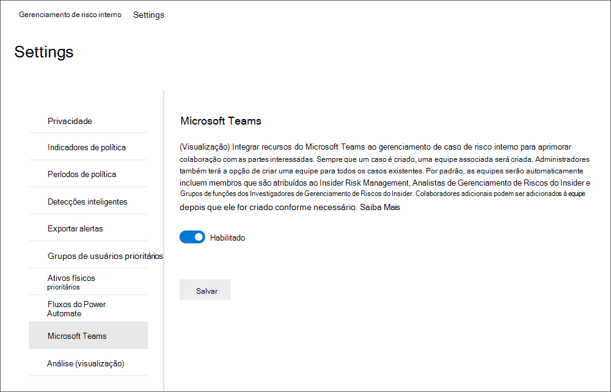

### Criar uma Microsoft Teams para casos existentes

Se você habilitar Microsoft Teams suporte para gerenciamento de riscos insider depois de ter casos existentes, será necessário criar manualmente uma equipe para cada caso, conforme necessário. Depois de habil Microsoft Teams suporte em configurações de gerenciamento de riscos insider, novos casos criarão automaticamente uma nova Microsoft Teams equipe.

Os usuários precisam de permissão para criar Microsoft 365 grupos em sua organização para criar uma Microsoft Teams de uma ocorrência. Para obter mais informações sobre como gerenciar permissões para grupos Microsoft 365, consulte [Manage who can create Microsoft 365 Groups](../solutions/manage-creation-of-groups.md).

Para criar uma equipe para um caso, você usará o controle Criar Equipe da Microsoft ao trabalhar diretamente em um caso existente. Conclua as etapas a seguir para criar uma nova equipe:

1. No centro [Microsoft 365 de conformidade,](https://compliance.microsoft.com)vá para **Insider risk management**  >  **Cases** e selecione um caso existente.
2. No menu ação de caso, selecione **Criar Equipe da Microsoft**.
3. No campo **Nome da** equipe, insira um nome para a nova Microsoft Teams equipe.
4. Selecione **Criar equipe da Microsoft** e selecione **Fechar**.

Dependendo do número de usuários atribuídos a grupos de função de gerenciamento de riscos insider, pode levar 15 minutos para que todos os investigadores e analistas sejam adicionados à equipe Microsoft Teams para um caso.

## Análise (visualização)

A análise de risco insider permite que você conduza uma avaliação de possíveis riscos insider em sua organização sem configurar nenhuma política de risco interna. Essa avaliação pode ajudar sua organização a identificar áreas potenciais de maior risco de usuário e ajudar a determinar o tipo e o escopo das políticas de gerenciamento de riscos internas que você pode considerar configurar. As verificações de análise oferecem as seguintes vantagens para sua organização:

- Fácil de configurar: para começar com as verificações de análise, você pode selecionar Executar verificação quando solicitado pela recomendação de análise ou ir para As configurações de risco do Insider > Guia Análise e habilitar a análise.
- Requisitos mínimos de privacidade: os resultados e as percepções de verificação são retornados como atividades de usuário anonimizadas, nomes de usuário individuais não são identificáveis pelos revisadores.
- Entenda os riscos potenciais por meio de insights consolidados: Os resultados da verificação podem ajudá-lo a identificar rapidamente áreas de risco potenciais para seus usuários e qual política seria melhor para ajudar a reduzir esses riscos.

Confira o vídeo análise de gerenciamento de riscos do Insider para ajudar a entender como a análise pode ajudar a acelerar a identificação de possíveis riscos [insider](https://www.youtube.com/watch?v=5c0P5MCXNXk) e ajudá-lo a tomar medidas rapidamente.

Análises verificam eventos de atividade de risco de várias fontes para ajudar a identificar informações sobre áreas potenciais de risco. Dependendo da configuração atual, a análise procura atividades de risco de qualificação nas seguintes áreas:

- **Microsoft 365 logs de auditoria**: incluídos em todas as verificações, esta é a principal fonte para identificar a maioria das atividades potencialmente arriscadas.
- **Exchange Online**: Incluída em todas as verificações, a atividade Exchange Online ajuda a identificar atividades nas quais os dados em anexos são enviado por email para contatos ou serviços externos.
- **Azure Active Directory**: Incluído em todas as verificações, o histórico Azure Active Directory ajuda a identificar atividades arriscadas associadas aos usuários com contas de usuário excluídas.
- **Microsoft 365 conector de dados** de RH : se configurado, os eventos do conector de RH ajudam a identificar atividades arriscadas associadas aos usuários que têm datas de encerramento ou de demissão futuras.

As percepções de análise das verificações se baseiam nos mesmos sinais de atividade de risco usados pelas políticas de gerenciamento de riscos internas e relatam resultados com base nas atividades de usuário única e de sequência. No entanto, a pontuação de risco para análise baseia-se em até 30 dias de atividade, enquanto as políticas de risco insider usam atividades diárias para insights. Ao habilitar e executar a análise pela primeira vez em sua organização, você verá os resultados da verificação por um dia. Se você deixar a análise habilitada, verá os resultados de cada verificação diária adicionados aos relatórios de insights para um intervalo máximo dos 30 dias de atividade anteriores.

### Habilitar a análise e iniciar a verificação

Para habilitar a análise de risco insider, você deve ser membro do Insider Risk Management, Administrador de Gerenciamento de Riscos do Insider ou Microsoft 365 de função de administrador global.
Conclua as etapas a seguir para habilitar a análise de risco interno:

1. No centro [Microsoft 365 de conformidade,](https://compliance.microsoft.com)vá para **Gerenciamento de riscos do Insider.**
2. Selecione **Executar verificação** na guia Verificar riscos de **insider no** cartão da organização na guia Visão geral do gerenciamento de riscos insider.  Isso a turns on analytics scanning for your organization. Você também pode ativar a verificação em sua organização navegando até Configurações de risco do **Insider** Analytics e habilitando Examinar a atividade do usuário do locatário para identificar possíveis riscos  >   **insider**.
3. No painel **Detalhes do Analytics,** selecione **Executar verificação** para iniciar a verificação da sua organização. Os resultados da análise podem levar até 24 horas antes que as informações sejam disponibilizadas como relatórios para revisão.

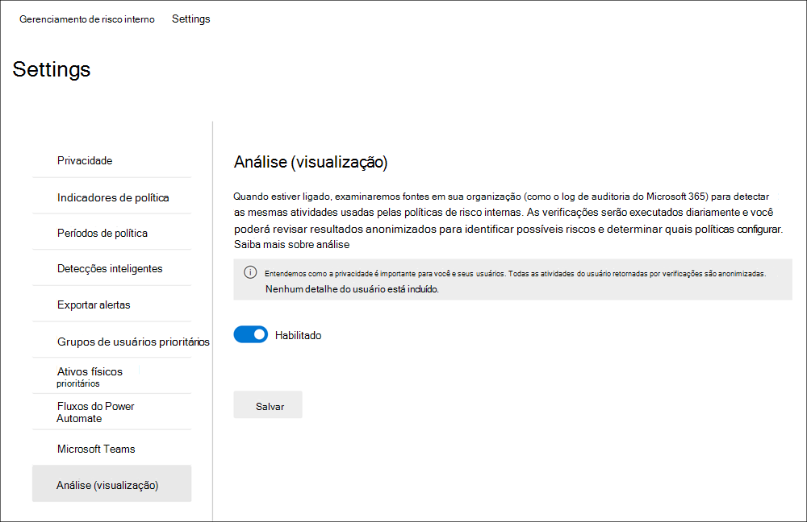

### Exibindo insights de análise e criando novas políticas

Depois que a primeira verificação de análise for concluída para sua organização, você poderá exibir as percepções e recomendações para atividades potencialmente arriscadas por seus usuários. As verificações diárias continuarão, a menos que você desativar a análise para sua organização. Para exibir possíveis riscos para sua  organização,  acesse a guia Visão geral e selecione Exibir resultados no cartão análise de risco **do Insider (visualização).** Se a verificação da sua organização não estiver concluída, você verá uma mensagem de que a verificação ainda está ativa.

Para verificações concluídas, você verá os riscos potenciais descobertos em sua organização e informações e recomendações para resolver esses riscos. Riscos identificados e percepções específicas são incluídos em relatórios agrupados por área, o número total de usuários com riscos identificados, a porcentagem desses usuários com atividades potencialmente arriscadas e uma política de risco interna recomendada para ajudar a reduzir esses riscos. Os relatórios incluem:

- **Insights de vazamento de** dados : Atividades para todos os usuários que podem incluir o compartilhamento acidental de informações fora da sua organização ou vazamentos de dados por usuários com intenção mal-intencionada.
- **Insights sobre roubo** de dados : atividades para usuários ou usuários com contas de Azure Active Directory excluídas que podem incluir compartilhamento arriscado de informações fora da sua organização ou roubo de dados por usuários com intenção mal-intencionada.
- **Principais percepções de filtragem:** atividades de todos os usuários que podem incluir o compartilhamento de dados fora da sua organização.

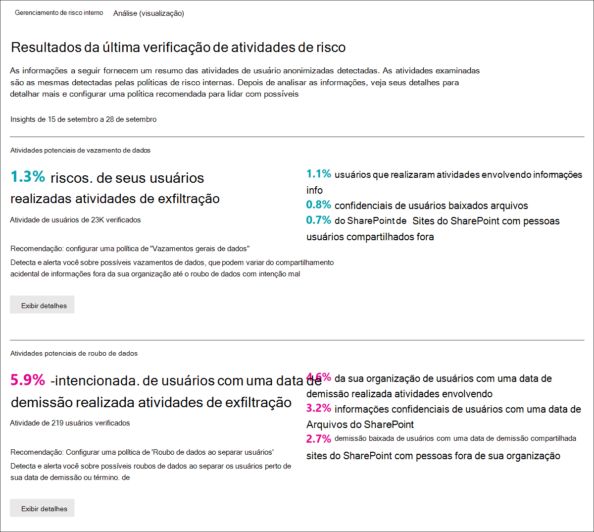

Para exibir mais informações para obter uma visão, selecione **Exibir detalhes** para exibir o painel de detalhes do insight. O painel de detalhes inclui os resultados completos do insight, uma recomendação de política de risco interna e o botão Criar política para ajudá-lo a criar rapidamente a política recomendada.  Selecionar Criar política o leva ao assistente de política e seleciona automaticamente o modelo de política recomendado relacionado ao insight. Por exemplo, se o  insight de análise for para atividade de vazamento de dados, o modelo de política geral de *vazamentos* de dados será pré-selecionado no assistente de política para você.

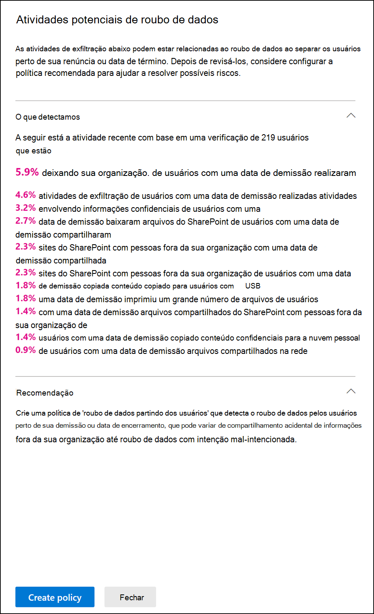

### Desativar a análise

Para desativar a análise de risco insider, você deve ser membro do *Insider Risk Management,* Administrador de Gerenciamento de Riscos do *Insider* ou Microsoft 365 de função *de* administrador global. Depois de desabilitar a análise, os relatórios de insights de análise permanecerão estáticos e não serão atualizados para novos riscos.

Conclua as etapas a seguir para desativar a análise de risco interno:

1. No centro [Microsoft 365 de conformidade,](https://compliance.microsoft.com)vá para **Gerenciamento de riscos do Insider.**
2. Selecione **Configurações de risco do Insider**  >  **Página** análise.
3. Na página **Análise,** desativar Examinar a atividade do usuário do locatário para **identificar possíveis riscos insider**.