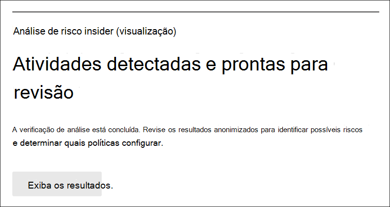

# Começar com as configurações de gerenciamento de riscos insiderGet started with insider risk management settings

As configurações de gerenciamento de riscos insider se aplicam a todas as políticas de gerenciamento de riscos internas, independentemente do modelo escolhido ao criar uma política.Insider risk management settings apply to all insider risk management policies, regardless of the template you choose when creating a policy. As configurações são definidas usando o controle de **configurações de risco interno** localizado na parte superior de todas as guias de gerenciamento de risco interno.Settings are configured using the **Insider risk settings** control located at the top of all insider risk management tabs. Essas configurações controlam os componentes da política para as seguintes áreas:These settings control policy components for the following areas:

- PrivacidadePrivacy
- IndicadoresIndicators
- Linha do tempo da políticaPolicy timelines
- Detecções inteligentesIntelligent detections
- Exportar alertas (visualização)Export alerts (preview)
- Grupos de usuários prioritários (visualização)Priority user groups (preview)
- Ativos físicos prioritários (visualização)Priority physical assets (preview)
- Power Automate fluxos (visualização)Power Automate flows (preview)
- Microsoft Teams (visualização)Microsoft Teams (preview)
- Análise (visualização)Analytics (preview)

Antes de começar e criar políticas de gerenciamento de riscos internas, é importante entender essas configurações e escolher os níveis de configuração melhor para as necessidades de conformidade da sua organização.Before you get started and create insider risk management policies, it's important to understand these settings and choose setting levels best for the compliance needs for your organization.

## PrivacidadePrivacy

A proteção da privacidade de usuários que possuem correspondências de políticas é importante e pode ajudar a promover a objetividade na investigação de dados e nas análises para alertas de risco interno.Protecting the privacy of users that have policy matches is important and can help promote objectivity in data investigation and analysis reviews for insider risk alerts. Para usuários com uma política de risco interna, você pode escolher uma das seguintes configurações:For users with an insider risk policy match, you can choose one of the following settings:

- **Mostrar versões** anonimizadas de nomes de usuário : os nomes dos usuários são anonimizados para impedir que administradores, investigadores de dados e revisadores consultem quem está associado a alertas de política.**Show anonymized versions of usernames**: Names of users are anonymized to prevent admins, data investigators, and reviewers from seeing who is associated with policy alerts. Por exemplo, uma usuária "Grace Taylor" apareceria com um pseudônimo aleatório como "AnonIS8-988" em todas as áreas da experiência de gerenciamento de risco interno.For example, a user 'Grace Taylor' would appear with a randomized pseudonym such as 'AnonIS8-988' in all areas of the insider risk management experience. A escolha dessa configuração manterá todos os usuários com as políticas atuais e anteriores e se aplicará a todas as políticas.Choosing this setting anonymizes all users with current and past policy matches and applies to all policies. As informações do perfil do usuário no alerta de risco interno e os detalhes de caso não estarão disponíveis quando essa opção for escolhida.User profile information in the insider risk alert and case details will not be available when this option is chosen. No entanto, os nomes de usuário são exibidos ao adicionar novos usuários a políticas existentes ou ao atribuir usuários a novas políticas.However, usernames are displayed when adding new users to existing policies or when assigning users to new policies. Se você optar por desativar essa configuração, os nomes de usuário serão exibidos para todos os usuários que tenham as configurações de política atual ou passada.If you choose to turn off this setting, usernames will be displayed for all users that have current or past policy matches.
- **Não mostre versões anonimizadas** de nomes de usuário : Os nomes de usuário são exibidos para todas as versões atuais e passadas de política para alertas e casos.**Do not show anonymized versions of usernames**: Usernames are displayed for all current and past policy matches for alerts and cases. As informações de perfil de usuário (nome, título, alias e organização ou departamento) são exibidas para o usuário para todos os alertas e casos de gerenciamento de riscos insider.User profile information (the name, title, alias, and organization or department) is displayed for the user for all insider risk management alerts and cases.

## IndicadoresIndicators

Os modelos de política de risco insider definem o tipo de atividades de risco que você deseja detectar e investigar.Insider risk policy templates define the type of risk activities that you want to detect and investigate. Cada modelo de política é baseado em indicadores específicos que correspondem a gatilhos específicos e atividades de risco.Each policy template is based on specific indicators that correspond to specific triggers and risk activities. Todos os indicadores são desabilitados por padrão e você deve selecionar um ou mais indicadores de política antes de configurar uma política de gerenciamento de riscos internas.All indicators are disabled by default, and you must select one or more policy indicators before configuring an insider risk management policy.

Os alertas são disparados por políticas quando os usuários executam atividades relacionadas a indicadores de política que atendem a um limite necessário.Alerts are triggered by policies when users perform activities related to policy indicators that meet a required threshold. O gerenciamento de riscos insider usa dois tipos de indicadores:Insider risk management uses two types of indicators:

- **Eventos de acionamento**: eventos que determinam se um usuário está ativo em uma política de gerenciamento de riscos insider.**Triggering events**: Events that determine if a user is active in an insider risk management policy. Se um usuário for adicionado a uma política de gerenciamento de riscos internas não tiver um evento de disparo, a atividade do usuário não será avaliada pela política.If a user is added to an insider risk management policy does not have a triggering event, the user activity is not evaluated by the policy. Por exemplo, o Usuário A é  adicionado a uma política criada a partir do roubo de dados ao separar o modelo de política de usuários, e a política e o conector de RH Microsoft 365 estão configurados corretamente.For example, User A is added to a policy created from the *Data theft by departing users* policy template and the policy and Microsoft 365 HR connector are properly configured. Até que o Usuário A tenha uma data de término relatada pelo conector de RH, as atividades do Usuário A não serão avaliadas por essa política de gerenciamento de riscos insider para o risco.Until User A has a termination date reported by the HR connector, User A activities aren't evaluated by this insider risk management policy for risk. Outro exemplo de evento de disparo é  se um usuário tiver um alerta de política DLP de alta gravidade ao usar *políticas de vazamento de* dados.Another example of a triggering event is if a user has a *High* severity DLP policy alert when using *Data leaks* policies.
- **Indicadores de** política : indicadores incluídos em políticas de gerenciamento de riscos internas usadas para determinar uma pontuação de risco para um usuário no escopo.**Policy indicators**: Indicators included in insider risk management policies used to determine a risk score for an in-scope user. Esses indicadores de política são ativados somente depois que ocorre um evento de disparo para um usuário.These policy indicators are only activated after a triggering event occurs for a user. Alguns exemplos de indicadores de política são quando um usuário copia dados para serviços pessoais de armazenamento em nuvem ou dispositivos de armazenamento portáteis, se uma conta de usuário é removida do Azure Active Directory ou se um usuário compartilha arquivos internos e pastas com partes externas não autorizadas.Some examples of policy indicators are when a user copies data to personal cloud storage services or portable storage devices, if a user account is removed from Azure Active Directory, or if a user shares internal files and folders with unauthorized external parties.

Os indicadores de política são segmentados nas seguintes áreas.Policy indicators are segmented into the following areas. Você pode escolher os indicadores para ativar e personalizar os limites de eventos de indicador para cada nível de indicador ao criar uma política de risco interna:You can choose the indicators to activate and customize indicator event limits for each indicator level when creating an insider risk policy:

- **Office**: incluem indicadores de política para sites, SharePoint, Microsoft Teams e mensagens de email.**Office indicators**: These include policy indicators for SharePoint sites, Microsoft Teams, and email messaging.
- **Indicadores de** dispositivo : eles incluem indicadores de política para atividades como compartilhamento de arquivos pela rede ou com dispositivos.**Device indicators**: These include policy indicators for activity such as sharing files over the network or with devices. Os indicadores incluem atividades envolvendo todos os tipos de arquivo, excluindo atividades de arquivo executáveis (.exe) e biblioteca de links dinâmicos (.dll).Indicators include activities involving all file types, excluding executable (.exe) and dynamic link library (.dll) file activity. Se você selecionar **indicadores** de dispositivo, a atividade será processada somente para dispositivos com Windows 10 Build 1809 ou superior e deverá primeiro integrar dispositivos no centro de conformidade.If you select **Device indicators**, activity is processed only for devices with Windows 10 Build 1809 or higher and you must first onboard devices to the compliance center. Para obter mais informações sobre como configurar dispositivos para integração com o risco insider, consulte a [seção](insider-risk-management-settings.md#OnboardDevices) Habilitar indicadores de dispositivo e dispositivos integrados neste artigo.For more information on configuring devices for integration with insider risk, see the following [Enable device indicators and onboard devices](insider-risk-management-settings.md#OnboardDevices) section in this article.
- Indicador de violação de política de segurança **(visualização)**: eles incluem indicadores do Microsoft Defender para Ponto de Extremidade relacionados à instalação de software não aprovado ou mal-intencionado ou ignorar controles de segurança.**Security policy violation indicator (preview)**: These include indicators from Microsoft Defender for Endpoint related to unapproved or malicious software installation or bypassing security controls. Para receber alertas no gerenciamento de riscos insider, você deve ter uma licença ativa do Defender para Endpoint e integração de risco insider habilitada.To receive alerts in insider risk management, you must have an active Defender for Endpoint license and insider risk integration enabled. Para obter mais informações sobre como configurar o Defender para Endpoint para integração de gerenciamento de riscos insider, consulte [Configure advanced features in Microsoft Defender for Endpoint](/windows/security/threat-protection/microsoft-defender-atp/advanced-features\#share-endpoint-alerts-with-microsoft-compliance-center).For more information on configuring Defender for Endpoint for insider risk management integration, see [Configure advanced features in Microsoft Defender for Endpoint](/windows/security/threat-protection/microsoft-defender-atp/advanced-features\#share-endpoint-alerts-with-microsoft-compliance-center).
- **Indicadores de acesso físico (visualização)**: Eles incluem indicadores de política para acesso físico a ativos confidenciais.**Physical access indicators (preview)**: These include policy indicators for physical access to sensitive assets. Por exemplo, tentativas de acesso a uma área restrita em seus logs do sistema de danos físicos podem ser compartilhadas com políticas de gerenciamento de riscos internas.For example, attempted access to a restricted area in your physical badging system logs can be shared with insider risk management policies. Para receber esses tipos de alertas no gerenciamento de riscos insider, você deve ter ativos físicos prioritários habilitados no gerenciamento de riscos insider e o conector de dados de danos físicos [configurado.](import-physical-badging-data.md)To receive these types of alerts in insider risk management, you must have priority physical assets enabled in insider risk management and the [Physical badging data connector](import-physical-badging-data.md) configured. Para saber mais sobre como configurar o acesso físico, consulte a seção [Prioridade de](#priority-physical-assets-preview) acesso físico neste artigo.To learn more about configuring physical access, see the [Priority physical access section](#priority-physical-assets-preview) in this article.
- **Microsoft Cloud App Security indicadores (visualização)**: eles incluem indicadores de política de alertas compartilhados de Cloud App Security.**Microsoft Cloud App Security indicators (preview)**: These include policy indicators from shared alerts from Cloud App Security. A detecção de anomalias automaticamente habilitada no Cloud App Security imediatamente começa a detectar e a colá-los, direcionando várias anomalias comportamentais em seus usuários e nos dispositivos e máquinas e dispositivos conectados à sua rede.Automatically enabled anomaly detection in Cloud App Security immediately starts detecting and collating results, targeting numerous behavioral anomalies across your users and the machines and devices connected to your network. Para incluir essas atividades em alertas de política de gerenciamento de riscos internas, selecione um ou mais indicadores nesta seção.To include these activities in insider risk management policy alerts, select one or more indicators in this section. Para saber mais sobre Cloud App Security análise e detecção de anomalias, consulte [Obter análise comportamental e detecção de anomalias.](/cloud-app-security/anomaly-detection-policy)To learn more about Cloud App Security analytics and anomaly detection, see [Get behavioral analytics and anomaly detection](/cloud-app-security/anomaly-detection-policy).
- **Aumentos de pontuação de** risco : eles incluem a elevação da pontuação de risco para atividades incomuns ou violações de política passadas.**Risk score boosters**: These include raising the risk score for unusual activities or past policy violations. A habilitação de impulsionadores de pontuação de risco aumenta as pontuações de risco e a probabilidade de alertas para esses tipos de atividades.Enabling risk score boosters increases risk scores and the likelihood of alerts for these types of activities. Para atividades incomuns, as pontuações serão incrementadas se a atividade detectada se desviar do comportamento típico do usuário.For unusual activities, scores are boosted if the detected activity deviates from the user's typical behavior. Por exemplo, um aumento significativo nos downloads de arquivos diários.For example, a significant increase in daily file downloads. Atividade incomum é apresentada como um aumento na porcentagem (por exemplo, '100% acima da atividade normal') e afetará a pontuação de risco de forma diferente, dependendo da atividade.Unusual activity is presented as an increase in percentage (for example, '100% above usual activity') and will impact the risk score differently depending on the activity. Para usuários com violações de política anteriores, as pontuações serão incrementadas se um usuário tiver mais de um caso resolvido anteriormente como uma violação de política confirmada.For users with previous policy violations, scores are boosted if a user had more than one case previously resolved as a confirmed policy violation. Os impulsionadores de pontuação de risco só poderão ser selecionados se um ou mais indicadores forem selecionados.Risk score boosters can only be selected if one or more indicators are selected.

Em alguns casos, você pode querer limitar os indicadores de política de risco insider que são aplicados a políticas de risco internas em sua organização.In some cases, you may want to limit the insider risk policy indicators that are applied to insider risk policies in your organization. Você pode desativar os indicadores de política para áreas específicas desabilitando-os de todas as políticas de risco internas.You can turn off the policy indicators for specific areas by disabling them from all insider risk policies. Os eventos de acionamento não podem ser modificados para modelos de política de risco interno.Triggering events cannot be modified for insider risk policy templates.

Para definir os indicadores de política de risco insider que estão habilitados em todas as políticas de risco internas, navegue até As configurações de risco do **Insider** Indicadores e selecione um ou mais indicadores  >   de política.To define the insider risk policy indicators that are enabled in all insider risk policies, navigate to **Insider risk settings** > **Indicators** and select one or more policy indicators. Os indicadores selecionados na página Configurações de Indicadores não podem ser configurados individualmente ao criar ou editar uma política de risco interna no assistente de política.The indicators selected on the Indicators settings page cannot be individually configured when creating or editing an insider risk policy in the policy wizard.

>[!NOTE]
>Pode levar várias horas para que novos usuários adicionados manualmente apareçam no **painel Usuários.**It may take several hours for new manually-added users to appear in the **Users dashboard**. As atividades dos 90 dias anteriores para esses usuários podem levar até 24 horas para exibição.Activities for the previous 90 days for these users may take up to 24 hours to display. Para exibir atividades para usuários adicionados manualmente, selecione o usuário no painel Usuários e abra a guia **Atividade** do usuário no painel de detalhes. To view activities for manually added users, select the user on the **Users dashboard** and open the **User activity** tab on the details pane.

### Habilitar indicadores de dispositivos e dispositivos de integraçãoEnable device indicators and onboard devices

Para habilitar o monitoramento de atividades de risco em dispositivos e incluir indicadores de política para essas atividades, seus dispositivos devem atender aos seguintes requisitos e você deve concluir as etapas de integração a seguir.To enable the monitoring of risk activities on devices and include policy indicators for these activities, your devices must meet the following requirements and you must complete the following onboarding steps.

#### Etapa 1: preparar seus pontos de extremidadeStep 1: Prepare your endpoints

Certifique-se de que os dispositivos Windows 10 que você planeja relatar no gerenciamento de risco interno atendem a esses requisitos.Make sure that the Windows 10 devices that you plan on reporting in insider risk management meet these requirements.

1. Deve estar executando Windows 10 com build x64 1809 ou posterior e deve ter instalado [Windows 10 atualização do Windows 10 (Build 17763.1075 do sistema operacional) a](https://support.microsoft.com/help/4537818/windows-10-update-kb4537818) partir de 20 de fevereiro de 2020.Must be running Windows 10 x64 build 1809 or later and must have installed the [Windows 10 update (OS Build 17763.1075)](https://support.microsoft.com/help/4537818/windows-10-update-kb4537818) from February 20, 2020.
2. A conta de usuário usada para fazer logoff no dispositivo Windows 10 deve ser uma conta Azure Active Directory (AAD) ativa.The user account used to log into the Windows 10 device must be an active Azure Active Directory (AAD) account. O Windows 10 pode ser [AAD](/azure/active-directory/devices/concept-azure-ad-join), AAD híbrido ou Active Directory ingressado ou AAD registrado.The Windows 10 device may be [AAD](/azure/active-directory/devices/concept-azure-ad-join), hybrid AAD, or Active Directory joined, or AAD registered.
3. Instale o navegador Chromium Edge da Microsoft no dispositivo de ponto de extremidade para monitorar ações para a atividade de carregamento na nuvem.Install Microsoft Chromium Edge browser on the endpoint device to monitor actions for the cloud upload activity. Confira, [Baixar o novo Microsoft Edge baseado em Chromium](https://support.microsoft.com/help/4501095/download-the-new-microsoft-edge-based-on-chromium).See, [Download the new Microsoft Edge based on Chromium](https://support.microsoft.com/help/4501095/download-the-new-microsoft-edge-based-on-chromium).

#### Etapa 2: Integração de dispositivosStep 2: Onboarding devices

Você deve habilitar o monitoramento de dispositivos e a integração de seus pontos de extremidade antes de poder monitorar atividades de gerenciamento de riscos internas em um dispositivo.You must enable device monitoring and onboard your endpoints before you can monitor for insider risk management activities on a device. Ambas as ações são realizadas no portal Microsoft 365 Conformidade.Both actions are taken in the Microsoft 365 Compliance portal.

Quando você quiser integrar dispositivos que ainda não foram integrados, você baixará o script apropriado e implantará conforme descrito nas etapas a seguir.When you want to onboard devices that haven't been onboarded yet, you'll download the appropriate script and deploy as outlined in the following steps.

Se você já tiver dispositivos integrados na [Microsoft Defender para Ponto de Extremidade](/windows/security/threat-protection/), eles já serão exibidos na lista dispositivos gerenciados.If you already have devices onboarded into [Microsoft Defender for Endpoint](/windows/security/threat-protection/), they will already appear in the managed devices list. Siga [a Etapa 3: Se você tiver dispositivos conectados ao Microsoft Defender para Ponto](insider-risk-management-settings.md#OnboardStep3) de Extremidade na próxima seção.Follow [Step 3: If you have devices onboarded into Microsoft Defender for Endpoint](insider-risk-management-settings.md#OnboardStep3) in the next section.

Neste cenário de implantação, você vai integrar dispositivos que ainda não foram abordados e você só deseja monitorar as atividades de risco insider em Windows 10 dispositivos.In this deployment scenario, you'll onboard devices that have not been onboarded yet, and you just want to monitor insider risk activities on Windows 10 devices.

1. Abra o [Centro de conformidade do Microsoft](https://compliance.microsoft.com).Open the [Microsoft compliance center](https://compliance.microsoft.com).
2. Abra a página de configurações do Centro de conformidade e escolha **Integrar dispositivos**.Open the Compliance Center settings page and choose **Onboard devices**.

   > [!NOTE]
   > Enquanto a integração de dispositivos geralmente leva cerca de 60 segundos para que seja habilitada, aguarde até 30 minutos antes de se envolver com o suporte da Microsoft.While it usually takes about 60 seconds for device onboarding to be enabled, please allow up to 30 minutes before engaging with Microsoft support.

3. Escolha **Gerenciamento de dispositivos** para abrir a lista **Dispositivos**.Choose **Device management** to open the **Devices** list. A lista estará vazia até você integrar os dispositivos.The list will be empty until you onboard devices.
4. Escolha **Integração** para iniciar o processo de integração.Choose **Onboarding** to begin the onboarding process.
5. Escolha a maneira como deseja implantar nesses mais dispositivos na lista de métodos **de** implantação e baixe **o pacote**.Choose the way you want to deploy to these more devices from the **Deployment method** list and then **download package**.
6. Siga os procedimentos apropriados em [Ferramentas e métodos de integração dos computadores do Windows 10](/windows/security/threat-protection/microsoft-defender-atp/configure-endpoints).Follow the appropriate procedures in [Onboarding tools and methods for Windows 10 machines](/windows/security/threat-protection/microsoft-defender-atp/configure-endpoints). Este link leva você a uma página de destino onde você pode acessar os procedimentos da Proteção Avançada contra Ameaças do Microsoft Defender que correspondem ao pacote de implantação selecionado na etapa 5:This link takes you to a landing page where you can access Microsoft Defender for Endpoint procedures that match the deployment package you selected in step 5:
    - Integrar computadores com Windows 10 usando uma política de grupoOnboard Windows 10 machines using Group Policy
    - Integrar computadores com Windows usando o Microsoft Endpoint Configuration ManagerOnboard Windows machines using Microsoft Endpoint Configuration Manager
    - Integrar computadores com Windows 10 usando ferramentas de gerenciamento de dispositivo móvelOnboard Windows 10 machines using Mobile Device Management tools
    - Integrar computadores com Windows 10 usando um script localOnboard Windows 10 machines using a local script
    - Integrar computadores não persistentes da VDI (infraestrutura de desktop virtual).Onboard non-persistent virtual desktop infrastructure (VDI) machines.

Depois que terminar e o ponto de extremidade for integrado, ele deverá estar visível na lista de dispositivos e o ponto de extremidade começará a relatar logs de atividades de auditoria para o gerenciamento de risco interno.Once done and endpoint is onboarded, it should be visible in the devices list and the endpoint will start reporting audit activity logs to insider risk management.

> [!NOTE]
> Esta experiência está na imposição da licença.This experience is under license enforcement. Sem a licença necessária, os dados não estarão visíveis nem acessíveis.Without the required license, data will not be visible or accessible.

#### Etapa 3: se você tiver dispositivos conectados ao Microsoft Defender para Ponto de ExtremidadeStep 3: If you have devices onboarded into Microsoft Defender for Endpoint

Se o Microsoft Defender for Endpoint já estiver implantado e houver pontos de extremidade relatando, todos esses pontos de extremidade aparecerão na lista de dispositivos gerenciados.If Microsoft Defender for Endpoint is already deployed and there are endpoints reporting in, all these endpoints will appear in the managed devices list. Você pode continuar a integração de novos dispositivos no gerenciamento de risco interno para expandir a cobertura usando a [seção Etapa 2: Dispositivos de integração.](insider-risk-management-settings.md#OnboardStep2)You can continue to onboard new devices into insider risk management to expand coverage by using the [Step 2: Onboarding devices](insider-risk-management-settings.md#OnboardStep2) section.

1. Abra o [Centro de conformidade do Microsoft](https://compliance.microsoft.com).Open the [Microsoft compliance center](https://compliance.microsoft.com).
2. Abra a página de configurações do Centro de conformidade e escolha **Habilitar o monitoramento de dispositivos**.Open the Compliance Center settings page and choose **Enable device monitoring**.
3. Escolha **Gerenciamento de dispositivos** para abrir a lista **Dispositivos**.Choose **Device management** to open the **Devices** list. Você deve ver a lista de dispositivos que já estão relatando no Microsoft Defender para Ponto de Extremidade.You should see the list of devices that are already reporting into Microsoft Defender for Endpoint.
4. Escolha **Integração** se precisar integrar mais dispositivos.Choose **Onboarding** if you need to onboard more devices.
5. Escolha a maneira como você deseja implantar nesses mais dispositivos na lista de métodos **de** implantação e baixe **o pacote**.Choose the way you want to deploy to these more devices from the **Deployment method** list and then **Download package**.
6. Siga os procedimentos apropriados em [Ferramentas e métodos de integração dos computadores do Windows 10](/windows/security/threat-protection/microsoft-defender-atp/configure-endpoints).Follow the appropriate procedures in [Onboarding tools and methods for Windows 10 machines](/windows/security/threat-protection/microsoft-defender-atp/configure-endpoints). Este link leva você a uma página de destino onde você pode acessar os procedimentos da Proteção Avançada contra Ameaças do Microsoft Defender que correspondem ao pacote de implantação selecionado na etapa 5:This link takes you to a landing page where you can access Microsoft Defender for Endpoint procedures that match the deployment package you selected in step 5:
    - Integrar computadores com Windows 10 usando uma política de grupoOnboard Windows 10 machines using Group Policy
    - Integrar computadores com Windows usando o Microsoft Endpoint Configuration ManagerOnboard Windows machines using Microsoft Endpoint Configuration Manager
    - Integrar computadores com Windows 10 usando ferramentas de gerenciamento de dispositivo móvelOnboard Windows 10 machines using Mobile Device Management tools
    - Integrar computadores com Windows 10 usando um script localOnboard Windows 10 machines using a local script
    - Integrar computadores não persistentes da VDI (infraestrutura de desktop virtual).Onboard non-persistent virtual desktop infrastructure (VDI) machines.

Depois que terminar e o ponto de extremidade for integrado, ele deverá estar visível na tabela **Dispositivos** e o ponto de extremidade começará a relatar logs de atividades de auditoria para o gerenciamento de risco interno.Once done and endpoint is onboarded, it should be visible under the **Devices** table and the endpoint will start reporting audit activity logs to insider risk management.

> [!NOTE]
>Esta experiência está na imposição da licença.This experience is under license enforcement. Sem a licença necessária, os dados não estarão visíveis nem acessíveis.Without the required license, data will not be visible or accessible.

### Configurações de nível de indicador (visualização)Indicator level settings (preview)

Ao criar uma política no assistente de política, você pode configurar como o número diário de eventos de risco deve influenciar a pontuação de risco para alertas de risco insider.When creating a policy in the policy wizard, you can configure how the daily number of risk events should influence the risk score for insider risk alerts. Essas configurações de indicadores ajudam a controlar como o número de ocorrências de eventos de risco em sua organização deve afetar a pontuação de risco e, portanto, a gravidade do alerta associada a esses eventos.These indicator settings help you control how the number of occurrences of risk events in your organization should affect the risk score, and so the associated alert severity, for these events. Se preferir, você também pode optar por manter os níveis de limite de eventos padrão recomendados pela Microsoft para todos os indicadores habilitados.If you prefer, you can also choose to keep the default event threshold levels recommended by Microsoft for all enabled indicators.

Por exemplo, você decide habilitar SharePoint indicadores nas configurações de política de risco interna e definir limites personalizados para eventos SharePoint ao configurar indicadores para uma nova política de vazamento *de* dados de risco interno.For example, you decide to enable SharePoint indicators in the insider risk policy settings and to set custom thresholds for SharePoint events when configuring indicators for a new insider risk *Data leaks* policy. Enquanto estiver no assistente de política de risco interna, configure três níveis de eventos diários diferentes para cada indicador SharePoint influenciar a pontuação de risco para alertas associados a esses eventos.While in the insider risk policy wizard, you configure three different daily event levels for each SharePoint indicator to influence the risk score for alerts associated with these events.

Para o primeiro nível de evento diário, você definirá o limite em *10* ou mais eventos por dia para um impacto menor para a pontuação de risco para os eventos, *20* ou mais eventos por dia para um impacto médio na pontuação de risco para os eventos e *30* ou mais eventos por dia um impacto maior na pontuação de risco para os eventos.For the first daily event level, you set the threshold at *10 or more events per day* for a lower impact to the risk score for the events, *20 or more events per day* for a medium impact to the risk score for the events, and *30 or more events per day* a higher impact to the risk score for the events. Essas configurações efetivamente significam:These settings effectively mean:

- Se houver de 1 a 9 SharePoint eventos que ocorrem após o evento de disparo, as pontuações de risco serão minimamente impactadas e tendem a não gerar um alerta.If there are 1-9 SharePoint events that take place after triggering event, risk scores are minimally impacted and would tend not to generate an alert.
- Se houver de 10 a 19 SharePoint eventos que ocorrem após um evento de disparo, a pontuação de risco é inerentemente menor e os níveis de gravidade do alerta tendem a estar em um nível baixo.If there are 10-19  SharePoint events that take place after a triggering event, the risk score is inherently lower and alert severity levels would tend to be at a low level.
- Se houver de 20 a 29 SharePoint eventos que ocorrem após um disparo, a pontuação de risco é inerentemente maior e os níveis de gravidade do alerta tendem a estar em um nível médio.If there are 20-29 SharePoint events that take place after a triggering, the risk score is inherently higher and alert severity levels would tend to be at a medium level.
- Se houver 30 ou mais eventos SharePoint que ocorrem após um disparo, a pontuação de risco é inerentemente maior e os níveis de gravidade do alerta tendem a estar em um nível alto.If there are 30 or more SharePoint events that take place after a triggering, the risk score is inherently higher and alert severity levels would tend to be at a high level.

## Períodos de tempo de políticaPolicy timeframes

Os períodos de tempo de política permitem definir períodos de revisão anteriores e futuros que são disparados após as combinações de políticas com base em eventos e atividades para os modelos de política de gerenciamento de riscos do insider.Policy timeframes allow you to define past and future review periods that are triggered after policy matches based on events and activities for the insider risk management policy templates. Dependendo do modelo de política escolhido, os seguintes períodos de política estão disponíveis:Depending on the policy template you choose, the following policy timeframes are available:

- **Janela de** ativação : Disponível para  todos os modelos de política, **a** janela Ativação é o número definido de dias que a janela ativa após um evento de disparo.**Activation window**: Available for all policy templates, the *Activation window* is the defined number of days that the window activates **after** a triggering event. A janela é ativada de 1 a 30 dias após um evento de disparo ocorrer para qualquer usuário atribuído à política.The window activates for 1 to 30 days after a triggering event occurs for any user assigned to the policy. Por exemplo, você configurou uma política de gerenciamento de riscos insider e definiu a janela *Ativação* como 30 dias.For example, you've configured an insider risk management policy and set the *Activation window* to 30 days. Vários meses se passaram desde que você configurou a política e ocorre um evento de gatilho para um dos usuários incluídos na política.Several months have passed since you configured the policy, and a triggering event occurs for one of the users included in the policy. O evento de ativação ativa a janela *Ativação* e a política está ativa para esse usuário por 30 dias após o evento de disparo ocorrer.The triggering event activates the *Activation window* and the policy is active for that user for 30 days after the triggering event occurred.
- **Detecção de atividade anterior**: Disponível para  todos os modelos de política, **a** detecção de atividade passada é o número definido de dias que a janela ativa antes de um evento de disparo.**Past activity detection**: Available for all policy templates, the *Past activity detection* is the defined number of days that the window activates **before** a triggering event. A janela é ativada de 0 a 180 dias antes que um evento de disparo ocorra para qualquer usuário atribuído à política.The window activates for 0 to 180 days before a triggering event occurs for any user assigned to the policy. Por exemplo, você configurou uma política de gerenciamento de riscos insider e definiu a detecção de atividade *passada* como 90 dias.For example, you've configured an insider risk management policy and set the *Past activity detection* to 90 days. Vários meses se passaram desde que você configurou a política e ocorre um evento de gatilho para um dos usuários incluídos na política.Several months have passed since you configured the policy, and a triggering event occurs for one of the users included in the policy. O evento de gatilho  ativa a detecção de atividade passada e a política reúne atividades históricas para esse usuário por 90 dias antes do evento de disparo.The triggering event activates the *Past activity detection* and the policy gathers historic activities for that user for 90 days prior to the triggering event.

## Detecções inteligentesIntelligent detections

As configurações de detecção inteligente ajudam a refinar como as detecções de atividades arriscadas são processadas para alertas.Intelligent detection settings help refine how the detections of risky activities are processed for alerts. Em determinadas circunstâncias, talvez seja necessário definir tipos de arquivo para ignorar ou impor um nível de detecção para os arquivos para ajudar a definir uma barra mínima para alertas.In certain circumstances, you may need to define file types to ignore, or you want to enforce a detection level for files to help define a minimum bar for alerts. Use essas configurações para controlar o volume geral de alerta, exclusões de tipo de arquivo e limites de volume de arquivo.Use these settings to control overall alert volume, file type exclusions, and file volume limits.

### Exclusões de tipo de arquivoFile type exclusions

Para excluir tipos de arquivo específicos de todas as correspondências de política de gerenciamento de riscos internas, insira extensões de tipo de arquivo separadas por vírgulas.To exclude specific file types from all insider risk management policy matching, enter file type extensions separated by commas. Por exemplo, para excluir determinados tipos de arquivos de música de correspondências de políticas, você pode inserir aac,mp3,wav,wma no campo **Exclusões de tipo de arquivo**.For example, to exclude certain types of music files from policy matches you may enter aac,mp3,wav,wma in the **File type exclusions** field. Os arquivos com essas extensões serão ignorados por todas as políticas de gerenciamento de riscos internas.Files with these extensions will be ignored by all insider risk management policies.

### Limite para atividade de arquivo incomumThreshold for unusual file activity

Para definir um nível mínimo de arquivo antes que os alertas de atividade sejam relatados em políticas de risco internas, insira o número de arquivos.To define a minimum file level before activity alerts are reported in insider risk policies, enter the number of files. Por exemplo, você inseriria '10' se não quisesse gerar alertas de risco interno quando um usuário baixasse 10 arquivos ou menos, mesmo que as políticas considerasse essa atividade incomum.For example, you would enter '10' if you do not want to generate insider risk alerts when a user downloads 10 files or less, even if the policies consider this activity as unusual.

### Volume de alertaAlert volume

As atividades do usuário detectadas pelas políticas de risco internas são atribuídas a uma pontuação de risco específica, que, por sua vez, determina a gravidade do alerta (baixa, média, alta).User activities detected by insider risk policies are assigned a specific risk score, which in turn determines the alert severity (low, medium, high). Por padrão, geraremos uma certa quantidade de alertas de baixa, média e alta gravidade, mas você pode aumentar ou diminuir o volume para atender às suas necessidades.By default, we'll generate a certain amount of low, medium, and high severity alerts, but you can increase or decrease the volume to suit your needs. Para ajustar o volume de alertas para todas as políticas de gerenciamento de riscos internas, escolha uma das seguintes configurações:To adjust the volume of alerts for all insider risk management policies, choose one of the following settings:

- **Menos alertas**: você verá todos os alertas de alta gravidade, menos alertas de gravidade média e nenhum alerta de baixa gravidade.**Fewer alerts**: You'll see all high severity alerts, fewer medium severity alerts, and no low severity ones. Esse nível de configuração significa que você pode perder alguns verdadeiros positivos.This setting level means you might miss some true positives.
- **Volume padrão**: você verá todos os alertas de alta gravidade e uma quantidade equilibrada de alertas de média e baixa gravidade.**Default volume**: You'll see all high severity alerts and a balanced amount of medium and low severity alerts.
- **Mais alertas**: você verá todos os alertas de média e alta gravidade e a maioria dos alertas de baixa gravidade.**More alerts**: You'll see all medium and high severity alerts and most low severity alerts. Esse nível de configuração pode resultar em mais falsos positivos.This setting level might result in more false positives.

### Microsoft Defender para Ponto de Extremidade (visualização)Microsoft Defender for Endpoint (preview)

[O Microsoft Defender for Endpoint](/windows/security/threat-protection/microsoft-defender-atp/microsoft-defender-advanced-threat-protection) é uma plataforma de segurança de ponto de extremidade empresarial projetada para ajudar as redes corporativas a evitar, detectar, investigar e responder a ameaças avançadas.[Microsoft Defender for Endpoint](/windows/security/threat-protection/microsoft-defender-atp/microsoft-defender-advanced-threat-protection) is an enterprise endpoint security platform designed to help enterprise networks prevent, detect, investigate, and respond to advanced threats. Para ter melhor visibilidade das violações de segurança em sua organização, você pode importar e filtrar alertas do Defender para o Ponto de Extremidade para atividades usadas em políticas criadas a partir de modelos de política de violação de segurança de gerenciamento de risco interno.To have better visibility of security violations in your organization, you can import and filter Defender for Endpoint alerts for activities used in policies created from insider risk management security violation policy templates.

Dependendo dos tipos de sinais nos quais você está interessado, você pode optar por importar alertas para o gerenciamento de risco interno com base no status de triagem de alerta do Defender para Ponto de Extremidade.Depending on the types of signals you are interested in, you can choose to import alerts to insider risk management based on the Defender for Endpoint alert triage status. Você pode definir um ou mais dos seguintes status de triagem de alerta nas configurações globais a ser importadas:You can define one or more of the following alert triage statuses in the global settings to import:

- DesconhecidoUnknown
- NovoNew
- Em andamentoIn progress
- ResolvidoResolved

Alertas do Defender para Ponto de Extremidade são importados diariamente.Alerts from Defender for Endpoint are imported daily. Dependendo do status de triagem escolhido, você pode ver várias atividades do usuário para o mesmo alerta que as alterações de status de triagem no Defender para Ponto de Extremidade.Depending on the triage status you choose, you may see multiple user activities for the same alert as the triage status changes in Defender for Endpoint.

Por exemplo, se você selecionar *Novo* *,* Em andamento e *Resolvido* para essa configuração, quando um alerta do Microsoft Defender for Endpoint for gerado e o status for *Novo*, uma atividade de alerta inicial será importada para o usuário em risco interno.For example, if you select *New*, *In progress*, and *Resolved* for this setting, when a Microsoft Defender for Endpoint alert is generated and the status is *New*, an initial alert activity is imported for the user in insider risk. Quando o status de triagem do Defender para Ponto de Extremidade muda para *Em andamento,* uma segunda atividade para esse alerta é importada para o usuário em risco interno.When the Defender for Endpoint triage status changes to *In progress*, a second activity for this alert is imported for the user in insider risk. Quando o status final de triagem do Defender para Ponto de Extremidade de *Resolvido* é definido, uma terceira atividade para esse alerta é importada para o usuário em risco interno.When the final Defender for Endpoint triage status of *Resolved* is set, a third activity for this alert is imported for the user in insider risk. Essa funcionalidade permite que os investigadores sigam a progressão dos alertas do Defender para Ponto de Extremidade e escolham o nível de visibilidade que sua investigação exige.This functionality allows investigators to follow the progression of the Defender for Endpoint alerts and choose the level of visibility that their investigation requires.

>[!IMPORTANT]
>Você precisará ter o Microsoft Defender para Ponto de Extremidade configurado em sua organização e habilitar o Defender for Endpoint para integração de gerenciamento de riscos insider no Defender Security Center para importar alertas de violação de segurança.You'll need to have Microsoft Defender for Endpoint configured in your organization and enable Defender for Endpoint for insider risk management integration in the Defender Security Center to import security violation alerts. Para obter mais informações sobre como configurar o Defender para o Ponto de Extremidade para integração de gerenciamento de riscos insider, consulte [Configure advanced features in Defender for Endpoint](/windows/security/threat-protection/microsoft-defender-atp/advanced-features\#share-endpoint-alerts-with-microsoft-compliance-center).For more information on configuring Defender for Endpoint for insider risk management integration, see [Configure advanced features in Defender for Endpoint](/windows/security/threat-protection/microsoft-defender-atp/advanced-features\#share-endpoint-alerts-with-microsoft-compliance-center).

### Domínios (visualização)Domains (preview)

As configurações de domínio ajudam a definir níveis de risco para atividades para domínios específicos.Domain settings help you define risk levels for activities to specific domains. Essas atividades incluem compartilhamento de arquivos, envio de mensagens de email, download ou carregamento de conteúdo.These activities include sharing files, sending email messages, downloading, or uploading content. Especificando domínios nessas configurações, você pode aumentar ou diminuir a pontuação de risco para atividades que ocorrem com esses domínios.By specifying domains in these settings, you can increase or decrease the risk scoring for activity that takes place with these domains.

Use Adicionar domínio para definir um domínio para cada uma das configurações de domínio.Use Add domain to define a domain for each of the domain settings. Além disso, você pode usar caracteres curinga para ajudar a corresponder a variações de domínios raiz ou subdomas.Additionally, you can use wildcards to help match variations of root domains or subdomains. Por exemplo, para especificar sales.wingtiptoys.com e support.wingtiptoys.com, use a entrada curinga '\*.wingtiptoys.com' para corresponder a esses subdomínios (e qualquer outro subdomínio no mesmo nível).For example, to specify sales.wingtiptoys.com and support.wingtiptoys.com, you use the wildcard entry '\*.wingtiptoys.com' to match these subdomains (and any other subdomain at the same level). Para especificar subdomas de vários níveis para um domínio raiz, você deve selecionar a caixa de seleção **Incluir Subdomas de Vários** Níveis.To specify multi-level subdomains for a root domain, you must select the **Include Multi-Level Subdomains** checkbox.

Para cada uma das seguintes configurações de domínio, você pode inserir até 500 domínios:For each of the following domain settings, you can enter up to 500 domains:

- **Domínios não alotados:** Especificando domínios não alotados, a atividade que ocorre com esses domínios terá pontuações *de risco* maiores.**Unallowed domains:** By specifying unallowed domains, activity that takes place with these domains will have *higher* risk scores. Alguns exemplos são atividades que envolvem o compartilhamento de conteúdo com alguém (como enviar emails para alguém com um endereço gmail.com) e quando os usuários baixam conteúdo para um dispositivo de um desses domínios não conectados.Some examples are activities involving sharing content with someone (such as sending email to someone with a gmail.com address) and when users download content to a device from one of these unallowed domains.
- **Domínios permitidos:** Determinada atividade relacionada a domínios permitidos será ignorada por suas políticas e não gerará alertas.**Allowed domains:** Certain activity related to allowed domains will be ignored by your policies and won't generate alerts. Essas atividades incluem:These activities include:

    - Email enviado para domínios externosEmail sent to external domains
    - Arquivos, pastas, sites compartilhados com domínios externosFiles, folders, sites shared with external domains
    - Arquivos carregados em domínios externos (usando Microsoft Edge navegador)Files uploaded to external domains (using Microsoft Edge browser)

    Especificando domínios permitidos em configurações, essa atividade com esses domínios é tratada da mesma forma como a atividade interna da organização é tratada.By specifying allowed domains in settings, this activity with these domains is treated similarly to how internal organization activity is treated. Por exemplo, domínios adicionados aqui mapeiam para atividades podem envolver o compartilhamento de conteúdo com alguém de fora da sua organização (por exemplo, enviar emails para alguém com um endereço gmail.com endereço).For example, domains added here map to activities may involve sharing content with someone outside your organization (such as sending email to someone with a gmail.com address).

- **Domínios de terceiros:** Se sua organização usa domínios de terceiros para fins comerciais (como armazenamento na nuvem), inclua-os aqui para que você possa receber alertas para atividades relacionadas ao indicador de dispositivo Use um navegador para baixar conteúdo de um site de *terceiros.***Third party domains:** If your organization uses third-party domains for business purposes (such as cloud storage), include them here so you can receive alerts for activity related to the device indicator *Use a browser to download content from a third-party site*.

## Exportar alertas (visualização)Export alerts (preview)

As informações de alerta de gerenciamento de riscos do Insider são exportáveis para serviços de gerenciamento de informações de segurança e eventos (SIEM) por meio do esquema da API de Atividade de Gerenciamento do [Office 365.](/office/office-365-management-api/office-365-management-activity-api-schema#security-and-compliance-alerts-schema)Insider risk management alert information is exportable to security information and event management (SIEM) services via the [Office 365 Management Activity API schema](/office/office-365-management-api/office-365-management-activity-api-schema#security-and-compliance-alerts-schema). Você pode usar as OFFICE 365 de Atividade de Gerenciamento para exportar informações de alerta para outros aplicativos que sua organização pode usar para gerenciar ou agregar informações de risco interno.You can use the Office 365 Management Activity APIs to export alert information to other applications your organization may use to manage or aggregate insider risk information.

Para usar as APIs para analisar informações de alerta de risco interno:To use the APIs to review insider risk alert information:

1. Habilitar Office 365 API de Atividade de Gerenciamento no **Insider risk management**  >  **Configurações**  >  **Exportar alertas**.Enable Office 365 Management Activity API support in **Insider risk management** > **Settings** > **Export alerts**. Por padrão, essa configuração está desabilitada para sua Microsoft 365 organização.By default, this setting is disabled for your Microsoft 365 organization.
2. Filtrar as atividades Office 365 de auditoria comuns *por SecurityComplianceAlerts*.Filter the common Office 365 audit activities by *SecurityComplianceAlerts*.
3. Filter *SecurityComplianceAlerts* by the *InsiderRiskManagement* category.Filter *SecurityComplianceAlerts* by the *InsiderRiskManagement* category.

As informações de alerta contêm informações do esquema de alertas de segurança e conformidade e o esquema comum da API de Atividade de Gerenciamento Office 365 Gerenciamento.Alert information contains information from the security and compliance alert schema and the Office 365 Management Activity API common schema.

Os seguintes campos e valores são exportados para alertas de gerenciamento de riscos insider para o esquema de alertas de & conformidade e segurança:The following fields and values are exported for insider risk management alerts for the Security & Compliance alert schema:

| **Parâmetro Alert****Alert parameter** | **Descrição****Description** |
|:------------------|:----------------|
| AlertTypeAlertType | O tipo do alerta é *Custom*.Type of the alert is *Custom*.  |
| AlertIdAlertId | O GUID do alerta.The GUID of the alert. Alertas de gerenciamento de riscos insider são mutáveis.Insider risk management alerts are mutable. À medida que o status do alerta muda, um novo log com o mesmo AlertID é gerado.As alert status changes, a new log with the same AlertID is generated. Esse AlertID pode ser usado para correlacionar atualizações para um alerta.This AlertID can be used to correlate updates for an alert. |
| CategoriaCategory | A categoria do alerta é *InsiderRiskManagement*.The category of the alert is *InsiderRiskManagement*. Essa categoria pode ser usada para distinguir esses alertas de outros alertas de conformidade & segurança.This category can be used to distinguish from these alerts from other Security & Compliance alerts. |
| ComentáriosComments | Comentários padrão para o alerta.Default comments for the alert. Os valores *são Novo Alerta* (registrado quando um alerta é criado) e Alerta *Atualizado* (registrado quando há uma atualização para um alerta).Values are *New Alert* (logged when an alert is created) and *Alert Updated* (logged when there is an update to an alert). Use o AlertID para correlacionar atualizações para um alerta.Use the AlertID to correlate updates for an alert. |
| DadosData | Os dados do alerta incluem a ID do usuário exclusiva, o nome principal do usuário e a data e hora (UTC) quando o usuário foi acionado em uma política.The data for the alert, includes the unique user ID, user principal name, and date and time (UTC) when user was triggered into a policy. |
| NomeName | Nome da política para política de gerenciamento de riscos internas que gerou o alerta.Policy name for insider risk management policy that generated the alert. |
| PolicyIdPolicyId | O GUID da política de gerenciamento de riscos internas que disparou o alerta.The GUID of the insider risk management policy that triggered the alert. |
| SeveritySeverity | A gravidade do alerta.The severity of the alert. Os valores *são Alto,* *Médio* ou *Baixo.*Values are *High*, *Medium*, or *Low*. |
| OrigemSource | A origem do alerta.The source of the alert. O valor é *Office 365 Segurança & Conformidade*.The value is *Office 365 Security & Compliance*. |
| StatusStatus | O status do alerta.The status of the alert. Os valores são *ativos* (*Precisa de* Revisão no risco insider), *Investigação* *(* Confirmado no risco insider), *Resolvido* (*Resolvido* no risco insider), *Ignorado* (*Ignorado* no risco insider).Values are *Active* (*Needs Review* in insider risk), *Investigating* (*Confirmed* in insider risk), *Resolved* (*Resolved* in insider risk), *Dismissed* (*Dismissed* in insider risk). |
| VersãoVersion | A versão do esquema de alerta de segurança e conformidade.The version of the security and compliance alert schema. |

Os campos e valores a seguir são exportados para alertas de gerenciamento de riscos insider para o esquema comum da API de Atividade de Gerenciamento Office 365 [gerenciamento.](/office/office-365-management-api/office-365-management-activity-api-schema#common-schema)The following fields and values are exported for insider risk management alerts for the [Office 365 Management Activity API common schema](/office/office-365-management-api/office-365-management-activity-api-schema#common-schema).

- UserIdUserId
- IdId
- RecordTypeRecordType
- CreationTimeCreationTime
- OperationOperation
- OrganizationIdOrganizationId
- UserTypeUserType
- UserKeyUserKey

## Grupos de usuários prioritários (visualização)Priority user groups (preview)

Os usuários em sua organização podem ter níveis diferentes de risco, dependendo de sua posição, nível de acesso a informações confidenciais ou histórico de riscos.Users in your organization may have different levels of risk depending on their position, level of access to sensitive information, or risk history. Priorizar o exame e a pontuação das atividades desses usuários pode ajudar a alertá-lo sobre possíveis riscos que podem ter consequências maiores para sua organização.Prioritizing the examination and scoring of the activities of these users can help alert you to potential risks that may have higher consequences for your organization. Grupos de usuários prioritários no gerenciamento de riscos insider ajudam a definir os usuários em sua organização que precisam de uma inspeção mais próxima e pontuação de risco mais sensível.Priority user groups in insider risk management help define the users in your organization that need closer inspection and more sensitive risk scoring. Juntamente com  as violações da política de segurança por usuários prioritários e *vazamentos* de dados por modelos de política de usuários prioritários, os usuários adicionados a um grupo de usuários prioritários têm uma maior probabilidade de alertas e alertas de risco interno com níveis de gravidade mais altos.Coupled with the *Security policy violations by priority users* and *Data leaks by priority users* policy templates, users added to a priority user group have an increased likelihood of insider risk alerts and alerts with higher severity levels.

Por exemplo, você precisa proteger contra vazamentos de dados para um projeto altamente confidencial onde os usuários têm acesso a informações confidenciais.For example, you need to protect against data leaks for a highly confidential project where users have access to sensitive information. Você opta por criar *um grupo de*  usuários de prioridade Project usuários da sua organização que trabalham nesse projeto.You choose to create *Confidential Project* *Users* priority user group for users in your organization that work on this project. Usando o assistente de política e os vazamentos de dados pelo  modelo de política de usuários *prioritários,* você cria uma nova política e atribui o grupo Usuários de prioridade de usuários confidenciais Project à política.Using the policy wizard and the *Data leaks by priority users* policy template, you create a new policy and assign the *Confidential Project Users* priority users group to the policy. As atividades examinadas pela política  para membros do grupo de usuários de prioridade de usuários Project confidencial são mais sensíveis ao risco e as atividades desses usuários terão mais probabilidade de gerar um alerta e ter alertas com níveis de gravidade mais altos.Activities examined by the policy for members of the *Confidential Project Users* priority user group are more sensitive to risk and activities by these users will be more likely to generate an alert and have alerts with higher severity levels.

### Criar um grupo de usuários de prioridadeCreate a priority user group

Para criar um novo grupo de usuários de prioridade, você usará a configuração de controles na solução de gerenciamento de riscos do **Insider** no Microsoft 365 de conformidade.To create a new priority user group, you'll use setting controls in the **Insider risk management** solution in the Microsoft 365 compliance center. Para criar um grupo de usuários de prioridade, você deve ser membro do grupo de função Gerenciamento de Riscos *do Insider* ou Administrador de Gerenciamento de Riscos do *Insider.*To create a priority user group, you must be a member of the *Insider Risk Management* or *Insider Risk Management Admin* role group.

Conclua as etapas a seguir para criar um grupo de usuários prioritário:Complete the following steps to create a priority user group:

1. No centro [Microsoft 365 de conformidade,](https://compliance.microsoft.com)vá para Gerenciamento de riscos **do Insider** e selecione Configurações de risco **do Insider.**In the [Microsoft 365 compliance center](https://compliance.microsoft.com), go to **Insider risk management** and select **Insider risk settings**.
2. Selecione a **guia Grupos de usuários prioritários**Select the **Priority user groups** tab
3. Na guia **Grupos de usuários prioritários,** selecione Criar grupo de usuários **de prioridade** para iniciar o assistente de criação de grupo.On the **Priority user groups** tab, select **Create priority user group** to start the group creation wizard.
4. Na página **Definir grupo,** conclua os seguintes campos:On the **Define group** page, complete the following fields:
    - **Nome (obrigatório)**: Insira um nome amigável para o grupo de usuários prioritário.**Name (required)**: Enter a friendly name for the priority user group. Não é possível alterar o nome do grupo de usuários de prioridade depois de concluir o assistente.You can't change the name of the priority user group after you complete the wizard.
    - **Descrição (opcional)**: Insira uma descrição para o grupo de usuários de prioridade.**Description (optional)**: Enter a description for the priority user group.
5. Selecione **Próximo** para continuar.Select **Next** to continue.
6. Na página **Escolher** membros, selecione Escolher membros para pesquisar e selecionar quais contas de usuário habilitadas para email estão incluídas no grupo ou selecione a caixa de seleção **Selecionar** todos os usuários da sua organização ao grupo. On the **Choose members** page, select **Choose members** to search and select which mail-enabled user accounts are included in the group or select the **Select all** checkbox to add all users in your organization to the group. Selecione **Adicionar** para continuar ou **Cancelar** para fechar sem adicionar usuários ao grupo.Select **Add** to continue or **Cancel** to close without adding any users to the group.
7. Selecione **Próximo** para continuar.Select **Next** to continue.
8. Na página **Revisão,** revise as configurações escolhidas para o grupo de usuários prioritário.On the **Review** page, review the settings you've chosen for the priority user group. Selecione **Editar** para alterar qualquer um dos valores de grupo ou **selecione Enviar** para criar e ativar o grupo de usuários prioritário.Select **Edit** to change any of the group values or select **Submit** to create and activate the priority user group.
9. Na página de confirmação, selecione **Feito para** sair do assistente.On the confirmation page, select **Done** to exit the wizard.

### Atualizar um grupo de usuários de prioridadeUpdate a priority user group

Para atualizar um grupo de usuários de prioridade existente, você usará os controles de configuração na solução de gerenciamento de riscos do **Insider** no Microsoft 365 de conformidade.To update an existing priority user group, you'll use setting controls in the **Insider risk management** solution in the Microsoft 365 compliance center. Para atualizar um grupo de usuários de prioridade, você deve ser membro do grupo de função Gerenciamento de Riscos *do Insider* ou Administrador de Gerenciamento de Riscos do *Insider.*To update a priority user group, you must be a member of the *Insider Risk Management* or *Insider Risk Management Admin* role group.

Conclua as etapas a seguir para editar um grupo de usuários prioritário:Complete the following steps to edit a priority user group:

1. No centro [Microsoft 365 de conformidade,](https://compliance.microsoft.com)vá para Gerenciamento de riscos **do Insider** e selecione Configurações de risco **do Insider.**In the [Microsoft 365 compliance center](https://compliance.microsoft.com), go to **Insider risk management** and select **Insider risk settings**.
2. Selecione a **guia Grupos de usuários prioritários**Select the **Priority user groups** tab
3. Selecione o grupo de usuários de prioridade que você deseja editar e selecione **Editar grupo**.Select the priority user group you want to edit and select **Edit group**.
4. Na página **Definir grupo,** atualize o campo Descrição, se necessário.On the **Define group** page, update the Description field if needed. Não é possível atualizar o nome do grupo de usuários prioritário.You can't update the name of the priority user group. Selecione **Próximo** para continuar.Select **Next** to continue.
5. Na página **Escolher membros,** adicione novos membros ao grupo usando o **controle Escolher membros.**On the **Choose members** page, add new members to the group using the **Choose members** control. Para remover um usuário do grupo, selecione o 'X' ao lado do usuário que você deseja remover.To remove a user from the group, select the 'X' next to the user you wish to remove. Selecione **Próximo** para continuar.Select **Next** to continue.
6. Na página **Revisão,** revise as configurações de atualização escolhidas para o grupo de usuários prioritário.On the **Review** page, review the update settings you've chosen for the priority user group. Selecione **Editar** para alterar qualquer um dos valores de grupo ou **selecione Enviar** para atualizar o grupo de usuários prioritário.Select **Edit** to change any of the group values or select **Submit** to update the priority user group.
7. Na página de confirmação, selecione **Feito para** sair do assistente.On the confirmation page, select **Done** to exit the wizard.

### Excluir um grupo de usuários de prioridadeDelete a priority user group

Para excluir um grupo de usuários de prioridade existente, você usará os controles de configuração na solução de gerenciamento de riscos do **Insider** no Microsoft 365 de conformidade.To delete an existing priority user group, you'll use setting controls in the **Insider risk management** solution in the Microsoft 365 compliance center. Para excluir um grupo de usuários de prioridade, você deve ser membro do grupo de função Gerenciamento de Riscos *do Insider* ou Administrador de Gerenciamento de Riscos do *Insider.*To delete a priority user group, you must be a member of the *Insider Risk Management* or *Insider Risk Management Admin* role group.

>[!IMPORTANT]
>Excluir um grupo de usuários de prioridade o removerá de qualquer política ativa à qual ele é atribuído.Deleting a priority user group will remove it from any active policy to which it is assigned. Se você excluir um grupo de usuários de prioridade atribuído a uma política ativa, a política não conterá nenhum usuário no escopo e ficará efetivamente ociosa e não criará alertas.If you delete a priority user group that is assigned to an active policy, the policy will not contain any in-scope users and will effectively be idle and will not create alerts.

Conclua as etapas a seguir para excluir um grupo de usuários prioritário:Complete the following steps to delete a priority user group:

1. No centro [Microsoft 365 de conformidade,](https://compliance.microsoft.com)vá para Gerenciamento de riscos **do Insider** e selecione Configurações de risco **do Insider.**In the [Microsoft 365 compliance center](https://compliance.microsoft.com), go to **Insider risk management** and select **Insider risk settings**.
2. Selecione a **guia Grupos de usuários prioritários**Select the **Priority user groups** tab
3. Selecione o grupo de usuários de prioridade que você deseja editar e selecione **Excluir** no menu do painel.Select the priority user group you want to edit and select **Delete** from the dashboard menu.
4. Na caixa **de diálogo Excluir,** selecione **Sim** para excluir o grupo de usuários de prioridade ou selecione **Cancelar** para retornar ao painel.On the **Delete** dialog, select **Yes** to delete the priority user group or select **Cancel** to return to the dashboard.

## Ativos físicos prioritários (visualização)Priority physical assets (preview)

Identificar o acesso a ativos físicos prioritários e correlacionar a atividade de acesso a eventos do usuário é um componente importante da infraestrutura de conformidade.Identifying access to priority physical assets and correlating access activity to user events is an important component of your compliance infrastructure. Esses ativos físicos representam locais de prioridade em sua organização, como edifícios da empresa, data centers ou salas de servidores.These physical assets represent priority locations in your organization, such as company buildings, data centers, or server rooms. As atividades de risco do insider podem estar associadas a usuários que trabalham em horários incomuns, tentando acessar essas áreas confidenciais ou seguras não autorizadas e solicitações de acesso a áreas de alto nível sem necessidades legítimas.Insider risk activities may be associated with users working unusual hours, attempting to access these unauthorized sensitive or secure areas, and requests for access to high-level areas without legitimate needs.

Com ativos físicos prioritários habilitados e o conector de dados de danos físicos configurado, o gerenciamento de riscos internos integra sinais de seus sistemas de controle físico e de acesso a outras atividades de risco do usuário. With priority physical assets enabled and the [Physical badging data connector](import-physical-badging-data.md) configured, insider risk management integrates signals from your physical control and access systems with other user risk activities. Examinando padrões de comportamento em sistemas de acesso físico e correlacionando essas atividades com outros eventos de risco internos, o gerenciamento de riscos internos pode ajudar os investigadores e analistas de conformidade a tomar decisões de resposta mais informadas para alertas.By examining patterns of behavior across physical access systems and correlating these activities with other insider risk events, insider risk management can help compliance investigators and analysts make more informed response decisions for alerts. O acesso aos ativos físicos prioritários é marcado e identificado em insights de forma diferente do acesso a ativos não prioritários.Access to priority physical assets are scored and identified in insights differently from access to non-priority assets.

Por exemplo, sua organização tem um sistema de badging para usuários que monitoram e aprovam o acesso físico a áreas normais de trabalho e projetos confidenciais.For example, your organization has a badging system for users that monitors and approves physical access to normal working and sensitive project areas. Você tem vários usuários trabalhando em um projeto sensível e esses usuários retornarão para outras áreas da sua organização quando o projeto for concluído.You have several users working on a sensitive project and these users will return to other areas of your organization when the project is completed. À medida que o projeto confidencial se aproxima da conclusão, você deseja garantir que o trabalho do projeto permaneça confidencial e que o acesso às áreas do projeto seja fortemente controlado.As the sensitive project nears completion, you want to make sure that the project work remains confidential and that access to the project areas is tightly controlled.

Você opta por habilitar o conector de dados de danos físicos Microsoft 365 importar informações de acesso do seu sistema de danos físicos e especificar ativos físicos prioritários no gerenciamento de riscos insider.You choose to enable the Physical badging data connector in Microsoft 365 to import access information from your physical badging system and specify priority physical assets in insider risk management. Importando informações do seu sistema de badging e correlacionando informações de acesso físico com outras atividades de risco identificadas no gerenciamento de riscos insider, você percebe que um dos usuários no projeto está acessando os escritórios do projeto após o horário de trabalho normal e também está exportando grandes quantidades de dados para um serviço de armazenamento de nuvem pessoal de sua área de trabalho normal.By importing information from your badging system and correlating physical access information with other risk activities identified in insider risk management, you notice that one of the users on the project is accessing the project offices after normal working hours and is also exporting large amounts of data to a personal cloud storage service from their normal work area. Essa atividade de acesso físico associada à atividade online pode apontar para possíveis roubos de dados e os investigadores e analistas de conformidade podem tomar as ações apropriadas conforme ditado pelas circunstâncias desse usuário.This physical access activity associated with the online activity may point to possible data theft and compliance investigators and analysts can take appropriate actions as dictated by the circumstances for this user.

### Configurar ativos físicos prioritáriosConfigure priority physical assets

Para configurar ativos físicos de prioridade, você configurará o conector de badging físico e usará controles de configuração na solução de gerenciamento de riscos do **Insider** no centro de conformidade Microsoft 365.To configure priority physical assets, you'll configure the Physical badging connector and use setting controls in the **Insider risk management** solution in the Microsoft 365 compliance center. Para configurar ativos físicos prioritários, você deve ser membro do grupo de função Gerenciamento de Riscos *insider* ou Administrador de Gerenciamento de Riscos *do Insider.*To configure priority physical assets, you must be a member of the *Insider Risk Management* or *Insider Risk Management Admin role group*.

Conclua as etapas a seguir para configurar ativos físicos prioritários:Complete the following steps to configure priority physical assets:

1. Siga as etapas de configuração para o gerenciamento de riscos insider no artigo Sobre como [começar com o gerenciamento de riscos insider.](insider-risk-management-configure.md)Follow the configuration steps for insider risk management in the [Getting started with insider risk management](insider-risk-management-configure.md) article. Na Etapa 3, configure o conector de badging físico.In Step 3, make sure you configure the Physical badging connector.

    >[!IMPORTANT]
    >Para que as políticas de gerenciamento de riscos internas usem e correlacionam dados de sinal relacionados a usuários de saída e encerrados com dados de eventos de suas plataformas de controle físico e de acesso, você também deve configurar o conector de RH Microsoft 365.For insider risk management policies to use and correlate signal data related to departing and terminated users with event data from your physical control and access platforms, you must also configure the Microsoft 365 HR connector. Se você habilitar o conector de badging físico sem habilitar o conector de RH Microsoft 365, as políticas de gerenciamento de riscos insider processarão apenas eventos para atividades de acesso físico para usuários em sua organização.If you enable the Physical badging connector without enabling the Microsoft 365 HR connector, insider risk management policies will only process events for physical access activities for users in your organization.

2. No centro [de Microsoft 365 de conformidade,](https://compliance.microsoft.com)vá para Gerenciamento de riscos **do Insider** e selecione Configurações de risco do **Insider**  >  **Prioridade de ativos físicos**.In the [Microsoft 365 compliance center](https://compliance.microsoft.com), go to **Insider risk management** and select **Insider risk settings** > **Priority physical assets**.
3. Na  página Ativos físicos prioritários, você pode adicionar manualmente as IDs de ativos físicos que deseja monitorar para os eventos de ativos importados pelo conector de badging físico ou importar um arquivo .csv de todas as IDs de ativos físicos importadas pelo conector de danos físicos: a) Para adicionar manualmente as IDs de ativos físicos, escolha Adicionar ativos físicos prioritários, insira uma ID de ativo físico e selecione **Adicionar**.On the **Priority physical assets** page, you can either manually add the physical asset IDs you want to monitor for the asset events imported by the Physical badging connector or import a .csv file of all physical assets IDs imported by the Physical badging connector: a) To manually add physical assets IDs, choose **Add priority physical assets**, enter a physical asset ID, then select **Add**. Insira outras IDs de ativos físicos e selecione Adicionar ativos **físicos** de prioridade para salvar todos os ativos inseridos.Enter other physical asset IDs and then select **Add priority physical assets** to save all the assets entered.
    b) Para adicionar uma lista de IDs de ativos físicos de um arquivo .csv, escolha **Importar ativos físicos de** prioridade .b) To add a list of physical asset IDs from a .csv file, choose **Import priority physical assets**. Na caixa de diálogo explorador de arquivos, selecione o arquivo .csv que deseja importar e selecione **Abrir**.From the file explorer dialog, select the .csv file you wish to import, then select **Open**. As IDs de ativos físicos dos arquivos .csv são adicionadas à lista.The physical asset IDs from the .csv files are added to the list.
4. Navegue até **a guia Indicadores de** política no Configurações.Navigate to the **Policy indicators** tab in Settings.
5. Na página **Indicadores de Política,** navegue até a seção Indicadores de acesso físico e selecione a caixa de seleção para acesso físico após a terminação ou falha no acesso **ao ativo sensível**. On the **Policy indicators** page, navigate to the **Physical access indicators** section and select the checkbox for **Physical access after termination or failed access to sensitive asset**.
6. Selecione **Salvar** para configurar e sair.Select **Save** to configure and exit.

### Excluir um ativo físico de prioridadeDelete a priority physical asset

Para excluir um ativo físico de prioridade existente, você usará os controles de configuração na solução de gerenciamento de riscos do Insider no Microsoft 365 de conformidade.To delete an existing priority physical asset, you'll use setting controls in the Insider risk management solution in the Microsoft 365 compliance center. Para excluir um ativo físico de prioridade, você deve ser membro do grupo de função Gerenciamento de Risco do Insider ou Administrador de Gerenciamento de Riscos do Insider.To delete a priority physical asset, you must be a member of the Insider Risk Management or Insider Risk Management Admin role group.

>[!IMPORTANT]
>Excluir um ativo físico de prioridade o remove do exame por qualquer política ativa à qual ele foi incluído anteriormente.Deleting a priority physical asset removes it from examination by any active policy to which it was previously included. Alertas gerados por atividades associadas ao ativo físico de prioridade não são excluídos.Alerts generated by activities associated with the priority physical asset aren't deleted.

Conclua as etapas a seguir para excluir um ativo físico de prioridade:Complete the following steps to delete a priority physical asset:

1. No centro [de Microsoft 365 de conformidade,](https://compliance.microsoft.com)vá para Gerenciamento de riscos **do Insider** e selecione Configurações de risco do **Insider**  >  **Prioridade de ativos físicos**.In the [Microsoft 365 compliance center](https://compliance.microsoft.com), go to **Insider risk management** and select **Insider risk settings** > **Priority physical assets**.
2. Na página **Prioridade de ativos físicos,** selecione o ativo que você deseja excluir.On the **Priority physical assets** page, select the asset you want to delete.
3. Selecione **Excluir** no menu ação para excluir o ativo.Select **Delete** on the action menu to delete the asset.

## Power Automate fluxos (visualização)Power Automate flows (preview)

[O Microsoft Power Automate](/power-automate/getting-started) é um serviço de fluxo de trabalho que automatiza ações entre aplicativos e serviços.[Microsoft Power Automate](/power-automate/getting-started) is a workflow service that automates actions across applications and services. Usando fluxos de modelos ou criados manualmente, você pode automatizar tarefas comuns associadas a esses aplicativos e serviços.By using flows from templates or created manually, you can automate common tasks associated with these applications and services. Quando você habilita Power Automate fluxos para gerenciamento de riscos insider, você pode automatizar tarefas importantes para casos e usuários.When you enable Power Automate flows for insider risk management, you can automate important tasks for cases and users. Você pode configurar Power Automate fluxos para recuperar informações de usuário, alerta e caso e compartilhar essas informações com as partes interessadas e outros aplicativos, bem como automatizar ações no gerenciamento de riscos insider, como postar em anotações de caso.You can configure Power Automate flows to retrieve user, alert, and case information and share this information with stakeholders and other applications, as well as automate actions in insider risk management, such as posting to case notes. Power Automate fluxos são aplicáveis para casos e qualquer usuário no escopo de uma política.Power Automate flows are applicable for cases and any user in scope for a policy.

Os clientes com Microsoft 365 assinaturas que incluem o gerenciamento de riscos insider não precisam de licenças de Power Automate adicionais para usar os modelos de gerenciamento de risco Power Automate insider recomendados.Customers with Microsoft 365 subscriptions that include insider risk management do not need additional Power Automate licenses to use the recommended insider risk management Power Automate templates. Esses modelos podem ser personalizados para dar suporte à sua organização e abranger os principais cenários de gerenciamento de riscos do insider.These templates can be customized to support your organization and cover core insider risk management scenarios. Se você optar por usar recursos de Power Automate premium nesses modelos, crie um modelo personalizado usando o conector de conformidade do Microsoft 365 ou use modelos de Power Automate para outras áreas de conformidade no Microsoft 365, talvez você precise de mais Power Automate licenças.If you choose to use premium Power Automate features in these templates, create a custom template using the Microsoft 365 compliance connector, or use Power Automate templates for other compliance areas in Microsoft 365, you may need more Power Automate licenses.

Os seguintes Power Automate modelos são fornecidos aos clientes para dar suporte à automação de processos para usuários e casos de gerenciamento de riscos insider:The following Power Automate templates are provided to customers to support process automation for insider risk management users and cases:

- **Notifique** os usuários quando eles são adicionados a uma política de risco interna : este modelo é para organizações que têm políticas internas, privacidade ou requisitos regulatórios que os usuários devem ser notificados quando estão sujeitos a políticas de gerenciamento de riscos internos.**Notify users when they're added to an insider risk policy**: This template is for organizations that have internal policies, privacy, or regulatory requirements that users must be notified when they are subject to insider risk management policies. Quando esse fluxo é configurado e selecionado para um usuário na página usuários, os usuários e seus gerentes são enviados uma mensagem de email quando o usuário é adicionado a uma política de gerenciamento de riscos internas.When this flow is configured and selected for a user in the users page, users and their managers are sent an email message when the user is added to an insider risk management policy. Esse modelo também dá suporte à atualização de uma lista SharePoint hospedada em um site SharePoint para ajudar a controlar detalhes da mensagem de notificação, como data/hora e o destinatário da mensagem.This template also supports updating a SharePoint list hosted on a SharePoint site to help track notification message details like date/time and the message recipient. Se você optou por anonimizar os usuários em Configurações de Privacidade, os **fluxos** criados a partir deste modelo não funcionarão conforme o pretendido para que a privacidade do usuário seja mantida.If you've chosen to anonymize users in **Privacy settings**, flows created from this template will not function as intended so that user privacy is maintained. Power Automate fluxos usando este modelo estão disponíveis no painel **Usuários.**Power Automate flows using this template are available on the **Users dashboard**.
- **Solicitar** informações de RH ou negócios sobre um usuário em um caso de risco interno : Ao agir em um caso, os analistas de risco interno e os investigadores podem precisar consultar o RH ou outras partes interessadas para entender o contexto das atividades de caso.**Request information from HR or business about a user in an insider risk case**: When acting on a case, insider risk analysts and investigators may need to consult with HR or other stakeholders to understand the context of the case activities. Quando esse fluxo é configurado e selecionado para um caso, analistas e investigadores enviam uma mensagem de email para o RH e as partes interessadas de negócios configuradas para esse fluxo.When this flow is configured and selected for a case, analysts and investigators send an email message to HR and business stakeholders configured for this flow. Cada destinatário recebe uma mensagem com opções de resposta pré-configuradas ou personalizáveis.Each recipient is sent a message with pre-configured or customizable response options. Quando os destinatários selecionam uma opção de resposta, a resposta é registrada como uma nota de ocorrência e inclui informações de destinatário e data/hora.When recipients select a response option, the response is recorded as a case note and includes recipient and date/time information. Se você optou por anonimizar os usuários em Configurações de Privacidade, os **fluxos** criados a partir deste modelo não funcionarão conforme o pretendido para que a privacidade do usuário seja mantida.If you've chosen to anonymize users in **Privacy settings**, flows created from this template will not function as intended so that user privacy is maintained. Power Automate fluxos usando este modelo estão disponíveis no painel **Casos.**Power Automate flows using this template are available on the **Cases dashboard**.
- **Notificar o gerente quando um** usuário tiver um alerta de risco interno : Algumas organizações podem precisar ter notificação de gerenciamento imediata quando um usuário tiver um alerta de gerenciamento de risco interno.**Notify manager when a user has an insider risk alert**: Some organizations may need to have immediate management notification when a user has an insider risk management alert. Quando esse fluxo é configurado e selecionado, o gerente do usuário do caso é enviado uma mensagem de email com as seguintes informações sobre todos os alertas de caso:When this flow is configured and selected, the manager for the case user is sent an email message with the following information about all case alerts:
    - Política aplicável para o alertaApplicable policy for the alert
    - Data/hora do alertaDate/Time of the alert
    - Nível de gravidade do alertaSeverity level of the alert

    O fluxo atualiza automaticamente as anotações de caso que a mensagem foi enviada e que o fluxo foi ativado.The flow automatically updates the case notes that the message was sent and that the flow was activated. Se você optou por anonimizar os usuários em Configurações de Privacidade, os **fluxos** criados a partir deste modelo não funcionarão conforme o pretendido para que a privacidade do usuário seja mantida.If you've chosen to anonymize users in **Privacy settings**, flows created from this template will not function as intended so that user privacy is maintained. Power Automate fluxos usando este modelo estão disponíveis no painel **Casos.**Power Automate flows using this template are available on the **Cases dashboard**.
- **Criar registro para caso de** risco insider em ServiceNow : Este modelo é para organizações que querem usar sua solução ServiceNow para rastrear casos de gerenciamento de riscos insider.**Create record for insider risk case in ServiceNow**: This template is for organizations that want to use their ServiceNow solution to track insider risk management cases.  Quando, em um caso, os analistas de risco interno e os investigadores podem criar um registro para o caso em ServiceNow.When in a case, insider risk analysts and investigators can create a record for the case in ServiceNow. Você pode personalizar esse modelo para preencher campos selecionados em ServiceNow com base nos requisitos da sua organização.You can customize this template to populate selected fields in ServiceNow based on your organization's requirements. Power Automate fluxos usando este modelo estão disponíveis no painel **Casos.**Power Automate flows using this template are available on the **Cases dashboard**. Para obter mais informações sobre os campos ServiceNow disponíveis, consulte o artigo de referência do [ServiceNow Connector.](/connectors/service-now/)For more information on available ServiceNow fields, see the [ServiceNow Connector reference](/connectors/service-now/) article.

### Criar um Power Automate de um modelo de gerenciamento de risco internoCreate a Power Automate flow from insider risk management template

Para criar um fluxo de Power Automate a partir de um modelo de gerenciamento de risco interno recomendado, você usará os controles de configuração na solução de gerenciamento de riscos do **Insider** no centro de conformidade do Microsoft 365 ou na opção Gerenciar fluxos de **Power Automate do** controle **Automate** ao trabalhar diretamente nos painéis **Casos** ou **Usuários.**To create a Power Automate flow from a recommended  insider risk management template, you'll use the settings controls in the **Insider risk management** solution in the Microsoft 365 compliance center or the **Manage Power Automate flows** option from the **Automate** control when working directly in the **Cases** or **Users dashboards**.

Para criar um Power Automate fluxo na área de configurações, você deve ser membro do grupo de função Gerenciamento de Riscos do *Insider* ou Administrador de Gerenciamento de Riscos do *Insider.*To create a Power Automate flow in the settings area, you must be a member of the *Insider Risk Management* or *Insider Risk Management Admin* role group. Para criar um fluxo Power Automate com a opção **Gerenciar** fluxos de Power Automate, você deve ser membro de pelo menos um grupo de função de gerenciamento de risco interno.To create a Power Automate flow with the **Manage Power Automate flows** option, you must be a member of at least one insider risk management role group.

Conclua as etapas a seguir para criar um fluxo Power Automate de um modelo de gerenciamento de risco interno recomendado:Complete the following steps to create a Power Automate flow from a recommended insider risk management template:

1. No centro [Microsoft 365 de conformidade,](https://compliance.microsoft.com/)vá para Gerenciamento de riscos do **Insider** e selecione Configurações de risco do **Insider**  >  **Power Automate fluxos**.In the [Microsoft 365 compliance center](https://compliance.microsoft.com/), go to **Insider risk management** and select **Insider risk settings** > **Power Automate flows**. Você também pode acessar a partir das **páginas de** **painéis** Casos ou Usuários escolhendo **Automatizar**  >  **Gerenciar Power Automate fluxos**.You can also access from the **Cases** or **Users dashboards** pages by choosing **Automate** > **Manage Power Automate flows**.
2. Na página **Power Automate fluxos,** selecione um modelo recomendado nos modelos de gerenciamento de riscos do **Insider** que você pode gostar da seção na página.On the **Power Automate flows** page, select a recommended template from the **Insider risk management templates you may like** section on the page.
3. O fluxo lista as conexões incorporadas necessárias para o fluxo e observará se os status da conexão estão disponíveis.The flow lists the embedded connections needed for the flow and will note if the connection statuses are available. Se necessário, atualize quaisquer conexões que não sejam exibidas como disponíveis.If needed, update any connections that aren't displayed as available. Selecione **Continuar**.Select **Continue**.
4. Por padrão, os fluxos recomendados são pré-configurados com o gerenciamento de risco interno recomendado e Microsoft 365 de dados de serviço necessários para concluir a tarefa atribuída para o fluxo.By default, the recommended flows are pre-configured with the recommended insider risk management and Microsoft 365 service data fields required to complete the assigned task for the flow. Se necessário, personalize os componentes de fluxo usando o controle Mostrar opções **avançadas** e configurando as propriedades disponíveis para o componente de fluxo.If needed, customize the flow components by using the **Show advanced options** control and configuring the available properties for the flow component.
5. Se necessário, adicione outras etapas ao fluxo selecionando o **botão Nova etapa.**If needed, add any other steps to the flow by selecting the **New step** button. Na maioria dos casos, isso não deve ser necessário para os modelos padrão recomendados.In most cases, this should not be needed for the recommended default templates.
6. Selecione **Salvar rascunho** para salvar o fluxo para mais configuração ou selecione **Salvar** para concluir a configuração do fluxo.Select **Save draft** to save the flow for further configuration or select **Save** to complete the configuration for the flow.
7. Selecione **Fechar** para retornar à página Power Automate **fluxo.**Select **Close** to return to the **Power Automate flow** page. O novo modelo será listado como  um fluxo nas guias Meus fluxos e estará disponível **automaticamente** no controle suspenso Automatizar ao trabalhar com casos de gerenciamento de riscos insider para o usuário criar o fluxo.The new template will be listed as a flow on the **My flows** tabs and is automatically available from the **Automate** dropdown control when working with insider risk management cases for the user creating the flow.

>[!IMPORTANT]
>Se outros usuários em sua organização precisam de acesso ao fluxo, o fluxo deve ser compartilhado.If other users in your organization need access to the flow, the flow must be shared.

### Criar um fluxo de Power Automate personalizado para gerenciamento de risco internoCreate a custom Power Automate flow for insider risk management

Alguns processos e fluxos de trabalho para sua organização podem estar fora dos modelos de fluxo de fluxo de gerenciamento de riscos internos recomendados e você pode ter a necessidade de criar fluxos de Power Automate personalizados para áreas de gerenciamento de riscos internos.Some processes and workflows for your organization may be outside of the recommended insider risk management flow templates and you may have the need to create custom Power Automate flows for insider risk management areas. Power Automate fluxos são flexíveis e suportam uma personalização extensa, mas há etapas que precisam ser tomadas para se integrar aos recursos de gerenciamento de riscos insider.Power Automate flows are flexible and support extensive customization, but there are steps that need to be taken to integrate with insider risk management features.

Conclua as etapas a seguir para criar um modelo de Power Automate personalizado para gerenciamento de risco interno:Complete the following steps to create a custom Power Automate template for insider risk management:

1. **Verifique sua Power Automate de** fluxo : Para criar fluxos de Power Automate personalizados que usam gatilhos de gerenciamento de riscos insider, você precisará de uma licença Power Automate de segurança.**Check your Power Automate flow license**: To create customized Power Automate flows that use insider risk management triggers, you'll need a Power Automate license. Os modelos de fluxo de gerenciamento de riscos insider recomendados não exigem licenciamento extra e são incluídos como parte da sua licença de gerenciamento de riscos insider.The recommended insider risk management flow templates do not require extra licensing and are included as part of your insider risk management license.
2. **Criar um fluxo automatizado:** crie um fluxo que execute uma ou mais tarefas depois que ele é disparado por um evento de gerenciamento de riscos insider.**Create an automated flow**: Create a flow that performs one or more tasks after it's triggered by an insider risk management event. Para obter detalhes sobre como criar um fluxo automatizado, consulte [Create a flow in Power Automate](/power-automate/get-started-logic-flow).For details on how to create an automated flow, see [Create a flow in Power Automate](/power-automate/get-started-logic-flow).
3. **Selecione o Microsoft 365 de conformidade**: Procure e selecione o conector Microsoft 365 conformidade.**Select the Microsoft 365 compliance connector**: Search for and select the Microsoft 365 compliance connector. Esse conector habilita gatilhos e ações de gerenciamento de riscos insider.This connector enables insider risk management triggers and actions. Para obter mais informações sobre conectores, consulte o artigo visão geral [de referência do](/connectors/connector-reference/) conector.For more information on connectors, see the [Connector reference overview](/connectors/connector-reference/) article.
4. **Escolha gatilhos de gerenciamento de** riscos insider para seu fluxo : O gerenciamento de riscos do Insider tem dois gatilhos disponíveis para fluxos Power Automate personalizados:**Choose insider risk management triggers for your flow**: Insider risk management has two triggers available for custom Power Automate flows:
    - **Para um caso de gerenciamento de risco** interno selecionado: fluxos com esse gatilho podem ser selecionados na página do painel De ocorrências de gerenciamento de riscos insider.**For a selected insider risk management case**: Flows with this trigger can be selected from the insider risk management Cases dashboard page.
    - **Para um usuário de gerenciamento de riscos insider** selecionado: fluxos com esse gatilho podem ser selecionados na página do painel Usuários de gerenciamento de riscos insider.**For a selected insider risk management user**: Flows with this trigger can be selected from the insider risk management Users dashboard page.
5. Escolha ações de gerenciamento de riscos internas para seu fluxo: Você pode escolher entre várias ações para o gerenciamento de riscos insider incluir em seu fluxo personalizado:Choose insider risk management actions for your flow: You can choose from several actions for insider risk management to include in your custom flow:
    - Obter alerta de gerenciamento de riscos insiderGet insider risk management alert
    - Obter caso de gerenciamento de risco internoGet insider risk management case
    - Obter usuário de gerenciamento de riscos insiderGet insider risk management user
    - Obter alertas de gerenciamento de riscos insider para um casoGet insider risk management alerts for a case
    - Adicionar uma observação de caso de gerenciamento de risco internoAdd insider risk management case note

### Compartilhar um Power Automate fluxoShare a Power Automate flow

Por padrão, Power Automate fluxos criados por um usuário estão disponíveis apenas para esse usuário.By default, Power Automate flows created by a user are only available to that user. Para que outros usuários de gerenciamento de riscos insider tenham acesso e usem um fluxo, o fluxo deve ser compartilhado pelo criador do fluxo.For other insider risk management users to have access and use a flow, the flow must be shared by the flow creator. Para compartilhar um fluxo, você usará os controles de configurações na solução de gerenciamento de riscos **do Insider** no centro de conformidade  do  Microsoft 365 ou na opção Gerenciar fluxos Power Automate **do** controle Automate ao trabalhar diretamente nas páginas do painel Casos ou Usuários.To share a flow, you'll use the settings controls in the **Insider risk management solution** in the Microsoft 365 compliance center or the **Manage Power Automate flows** option from the Automate control when working directly in the **Cases** or **Users dashboard** pages. Depois de compartilhar um fluxo, todos com quem ele foi  compartilhado podem acessar o fluxo no menu suspenso Automatizar controle nos painéis **Caso** **e Usuário.**Once you have shared a flow, everyone who it has been shared with can access the flow in the **Automate** control dropdown in the **Case** and **User dashboards**.

Para compartilhar um Power Automate fluxo na área de configurações, você deve ser membro do grupo de função Gerenciamento de Riscos do *Insider* ou Administrador de Gerenciamento de Riscos do *Insider.*To share a Power Automate flow in the settings area, you must be a member of the *Insider Risk Management* or *Insider Risk Management Admin* role group. Para compartilhar um Power Automate fluxo com a opção **Gerenciar** fluxos de Power Automate, você deve ser membro de pelo menos um grupo de função de gerenciamento de riscos insider.To share a Power Automate flow with the **Manage Power Automate flows** option, you must be a member of at least one insider risk management role group.

Conclua as etapas a seguir para compartilhar um Power Automate fluxo:Complete the following steps to share a Power Automate flow:

1. No centro [Microsoft 365 de conformidade,](https://compliance.microsoft.com)vá para Gerenciamento de riscos do **Insider** e selecione Configurações de risco do **Insider**  >  **Power Automate fluxos**.In the [Microsoft 365 compliance center](https://compliance.microsoft.com), go to **Insider risk management** and select **Insider risk settings** > **Power Automate flows**. Você também pode acessar a partir das **páginas de** **painéis** Casos ou Usuários escolhendo **Automatizar**  >  **Gerenciar Power Automate fluxos**.You can also access from the **Cases** or **Users dashboards** pages by choosing **Automate** > **Manage Power Automate flows**.
2. Na página **Power Automate fluxos,** selecione a **guia Meus fluxos** ou **Fluxos de** equipe.On the **Power Automate flows** page, select the **My flows** or **Team flows** tab.
3. Selecione o fluxo a ser compartilhá-lo e selecione **Compartilhar** no menu opções de fluxo.Select the flow to share, then select **Share** from the flow options menu.
4. Na página de compartilhamento de fluxo, insira o nome do usuário ou grupo que você deseja adicionar como proprietário do fluxo.On the flow sharing page, enter the name of the user or group you want to add as an owner for the flow.
5. Na caixa **de diálogo Conexão Usada,** selecione **OK** para confirmar que o usuário ou grupo adicionado terá acesso total ao fluxo.On the **Connection Used** dialog, select **OK** to acknowledge that the added user or group will have full access to the flow.

### Editar um Power Automate fluxoEdit a Power Automate flow

Para editar um fluxo, você usará os controles de configurações na solução de gerenciamento de riscos **do Insider** no centro de conformidade  do Microsoft 365 ou na opção Gerenciar  **fluxos** Power Automate **do** controle Automatizar ao trabalhar diretamente nos painéis Casos ou Usuários.To edit a flow, you'll use the settings controls in the **Insider risk management** solution in the Microsoft 365 compliance center or the **Manage Power Automate flows** option from the **Automate** control when working directly in the **Cases** or **Users dashboards**.

Para editar um Power Automate na área de configurações, você deve ser membro do grupo de função Gerenciamento de Riscos do *Insider* ou Administrador de Gerenciamento de Riscos do *Insider.*To edit a Power Automate flow in the settings area, you must be a member of the *Insider Risk Management* or *Insider Risk Management Admin* role group. Para editar um Power Automate fluxo com a opção **Gerenciar** fluxos de Power Automate, você deve ser membro de pelo menos um grupo de função de gerenciamento de riscos insider.To edit a Power Automate flow with the **Manage Power Automate flows** option, you must be a member of at least one insider risk management role group.

Conclua as etapas a seguir para editar um Power Automate fluxo:Complete the following steps to edit a Power Automate flow:

1. No centro [Microsoft 365 de conformidade,](https://compliance.microsoft.com)vá para Gerenciamento de riscos do **Insider** e selecione Configurações de risco do **Insider**  >  **Power Automate fluxos**.In the [Microsoft 365 compliance center](https://compliance.microsoft.com), go to **Insider risk management** and select **Insider risk settings** > **Power Automate flows**. Você também pode acessar a partir das **páginas de** **painéis** Casos ou Usuários escolhendo **Automatizar**  >  **Gerenciar Power Automate fluxos**.You can also access from the **Cases** or **Users dashboards** pages by choosing **Automate** > **Manage Power Automate flows**.
2. Na página **Power Automate fluxos,** selecione um fluxo para editar e selecione **Editar** no menu de controle de fluxo.On the **Power Automate flows** page, select a flow to edit and select **Edit** from the flow control menu.
3. Selecione a **reellipse** Configurações alterar uma configuração de componente de fluxo ou  >   **reellipse**  >  **Excluir** para excluir um componente de fluxo.Select the **ellipsis** > **Settings** to change a flow component setting or **ellipsis** > **Delete** to delete a flow component.
4. Selecione **Salvar** e **feche para** concluir a edição do fluxo.Select **Save** and then **Close** to complete editing the flow.

### Excluir um Power Automate fluxoDelete a Power Automate flow

Para excluir um fluxo, você usará os controles de configurações na solução de gerenciamento de riscos **do Insider** no centro de conformidade  do Microsoft 365 ou na opção **Gerenciar** **fluxos** Power Automate do controle Automatizar ao trabalhar diretamente nos painéis Casos ou Usuários. To delete a flow, you'll use the settings controls in the **Insider risk management** solution in the Microsoft 365 compliance center or the **Manage Power Automate flows** option from the **Automate** control when working directly in the **Cases** or **Users dashboards**. Quando um fluxo é excluído, ele é removido como uma opção para todos os usuários.When a flow is deleted, it is removed as an option for all users.

Para excluir um Power Automate fluxo na área de configurações, você deve ser membro do grupo de função Gerenciamento de Riscos do *Insider* ou Administrador de Gerenciamento de Riscos do *Insider.*To delete a Power Automate flow in the settings area, you must be a member of the *Insider Risk Management* or *Insider Risk Management Admin* role group. Para excluir um fluxo Power Automate com a opção **Gerenciar** fluxos de Power Automate, você deve ser membro de pelo menos um grupo de função de gerenciamento de riscos insider.To delete a Power Automate flow with the **Manage Power Automate flows** option, you must be a member of at least one insider risk management role group.

Conclua as etapas a seguir para excluir um Power Automate fluxo:Complete the following steps to delete a Power Automate flow:

1. No centro [Microsoft 365 de conformidade,](https://compliance.microsoft.com)vá para Gerenciamento de riscos do **Insider** e selecione Configurações de risco do **Insider**  >  **Power Automate fluxos**.In the [Microsoft 365 compliance center](https://compliance.microsoft.com), go to **Insider risk management** and select **Insider risk settings** > **Power Automate flows**. Você também pode acessar a partir das **páginas de** **painéis** Casos ou Usuários escolhendo **Automatizar**  >  **Gerenciar Power Automate fluxos**.You can also access from the **Cases** or **Users dashboards** pages by choosing **Automate** > **Manage Power Automate flows**.
2. Na página **Power Automate fluxos,** selecione um fluxo para excluir e selecione **Excluir** no menu de controle de fluxo.On the **Power Automate flows** page, select a flow to delete and select **Delete** from the flow control menu.
3. Na caixa de diálogo de confirmação de exclusão, selecione **Excluir** para remover o fluxo ou selecione **Cancelar** para sair da ação de exclusão.On the deletion confirmation dialog, select **Delete** to remove the flow or select **Cancel** to exit the deletion action.

## Microsoft Teams (visualização)Microsoft Teams (preview)

Os analistas e investigadores de conformidade podem facilmente usar Microsoft Teams colaboração em casos de gerenciamento de riscos insider.Compliance analysts and investigators can easily use Microsoft Teams for collaboration on insider risk management cases. Eles podem coordenar e se comunicar com outras partes interessadas Microsoft Teams para:They can coordinate and communicate with other stakeholders in Microsoft Teams to:

- Coordenar e revisar atividades de resposta para casos em canais Teams privadosCoordinate and review response activities for cases in private Teams channels
- Compartilhar e armazenar arquivos e evidências com segurança relacionados a casos individuaisSecurely share and store files and evidence related to individual cases
- Acompanhar e revisar atividades de resposta por analistas e investigadoresTrack and review response activities by analysts and investigators

Depois Microsoft Teams está habilitada para o gerenciamento de riscos insider, uma equipe Microsoft Teams dedicada é criada sempre que um alerta é confirmado e um caso é criado.After Microsoft Teams is enabled for insider risk management, a dedicated Microsoft Teams team is created every time an alert is confirmed and a case is created. Por padrão, a equipe inclui automaticamente todos os membros dos grupos de função *Insider Risk Management, Insider Risk Management* *Analysts* e *Insider Risk Management Investigators* (até 100 usuários iniciais).By default, the team automatically includes all members of the *Insider Risk Management*, *Insider Risk Management Analysts*, and *Insider Risk Management Investigators* role groups (up to 100 initial users). Colaboradores adicionais da organização podem ser adicionados à equipe depois que ele for criado e conforme apropriado.Additional organization contributors may be added to the team after it is created and as appropriate. Para os casos existentes criados antes de Microsoft Teams, os analistas e investigadores podem optar por criar uma nova equipe Microsoft Teams ao trabalhar em um caso, se necessário.For existing cases created before enabling Microsoft Teams, analysts and investigators can choose to create a new Microsoft Teams team when working in a case if needed.  Depois de resolver o caso associado no gerenciamento de risco interno, a equipe será arquivada automaticamente (movida para oculto e somente leitura).Once you resolve the associated case in insider risk management, the team is automatically archived (moved to hidden and read-only).

Para obter mais informações sobre como usar equipes e canais em Microsoft Teams, consulte [Overview of teams and channels in Microsoft Teams](/MicrosoftTeams/teams-channels-overview).For more information on how to use teams and channels in Microsoft Teams, see [Overview of teams and channels in Microsoft Teams](/MicrosoftTeams/teams-channels-overview).

Habil Microsoft Teams suporte para casos é rápido e fácil de configurar.Enabling Microsoft Teams support for cases is quick and easy to configure. Para habilitar Microsoft Teams gerenciamento de risco interno, conclua as seguintes etapas:To enable Microsoft Teams for insider risk management, complete the following steps:

1. No centro [Microsoft 365 de conformidade,](https://compliance.microsoft.com)acesse **Insider risk management**  >  **Configurações de risco do Insider**.In the [Microsoft 365 compliance center](https://compliance.microsoft.com), go to **Insider risk management** > **Insider risk settings**.
2. Selecione a **guia Microsoft Teams.**Select the **Microsoft Teams** tab.
3. Habilitar Microsoft Teams integração para gerenciamento de riscos insider.Enable Microsoft Teams integration for insider risk management.
4. Selecione **Salvar** para configurar e sair.Select **Save** to configure and exit.

### Criar uma Microsoft Teams para casos existentesCreate a Microsoft Teams team for existing cases

Se você habilitar Microsoft Teams suporte para gerenciamento de riscos insider depois de ter casos existentes, será necessário criar manualmente uma equipe para cada caso, conforme necessário.If you enable Microsoft Teams support for insider risk management after you have existing cases, you'll need to manually create a team for each case as needed. Depois de habil Microsoft Teams suporte em configurações de gerenciamento de riscos insider, novos casos criarão automaticamente uma nova Microsoft Teams equipe.After enabling Microsoft Teams support in insider risk management settings, new cases will automatically create a new Microsoft Teams team.

Os usuários precisam de permissão para criar Microsoft 365 grupos em sua organização para criar uma Microsoft Teams de uma ocorrência.Users need permission to create Microsoft 365 groups in your organization to create a Microsoft Teams team from a case. Para obter mais informações sobre como gerenciar permissões para grupos Microsoft 365, consulte [Manage who can create Microsoft 365 Groups](../solutions/manage-creation-of-groups.md).For more information about managing permissions for Microsoft 365 Groups, see [Manage who can create Microsoft 365 Groups](../solutions/manage-creation-of-groups.md).

Para criar uma equipe para um caso, você usará o controle Criar Equipe da Microsoft ao trabalhar diretamente em um caso existente.To create a team for a case, you'll use the Create Microsoft Team control when working directly in an existing case. Conclua as etapas a seguir para criar uma nova equipe:Complete the following steps to create a new team:

1. No centro [Microsoft 365 de conformidade,](https://compliance.microsoft.com)vá para **Insider risk management**  >  **Cases** e selecione um caso existente.In the [Microsoft 365 compliance center](https://compliance.microsoft.com), go to **Insider risk management** > **Cases** and select an existing case.
2. No menu ação de caso, selecione **Criar Equipe da Microsoft**.On the case action menu, select **Create Microsoft Team**.
3. No campo **Nome da** equipe, insira um nome para a nova Microsoft Teams equipe.In the **Team name** field, enter a name for the new Microsoft Teams team.
4. Selecione **Criar equipe da Microsoft** e selecione **Fechar**.Select **Create Microsoft team** and then select **Close**.

Dependendo do número de usuários atribuídos a grupos de função de gerenciamento de riscos insider, pode levar 15 minutos para que todos os investigadores e analistas sejam adicionados à equipe Microsoft Teams para um caso.Depending on the number of users assigned to insider risk management role groups, it may take 15 minutes for all investigators and analysts to be added to the Microsoft Teams team for a case.

## Análise (visualização)Analytics (preview)

A análise de risco insider permite que você conduza uma avaliação de possíveis riscos insider em sua organização sem configurar nenhuma política de risco interna.Insider risk analytics enables you to conduct an evaluation of potential insider risks in your organization without configuring any insider risk policies. Essa avaliação pode ajudar sua organização a identificar áreas potenciais de maior risco de usuário e ajudar a determinar o tipo e o escopo das políticas de gerenciamento de riscos internas que você pode considerar configurar.This evaluation can help your organization identify potential areas of higher user risk and help determine the type and scope of insider risk management policies you may consider configuring. As verificações de análise oferecem as seguintes vantagens para sua organização:Analytics scans offer the following advantages for your organization:

- Fácil de configurar: para começar com as verificações de análise, você pode selecionar Executar verificação quando solicitado pela recomendação de análise ou ir para As configurações de risco do Insider > Guia Análise e habilitar a análise.Easy to configure: To get started with analytics scans, you can select Run scan when prompted by the analytics recommendation or go to Insider risk settings > Analytics tab and enable analytics.
- Requisitos mínimos de privacidade: os resultados e as percepções de verificação são retornados como atividades de usuário anonimizadas, nomes de usuário individuais não são identificáveis pelos revisadores.Minimal privacy requirements: Scan results and insights are returned as anonymized user activity, individual user names are not identifiable by reviewers.
- Entenda os riscos potenciais por meio de insights consolidados: Os resultados da verificação podem ajudá-lo a identificar rapidamente áreas de risco potenciais para seus usuários e qual política seria melhor para ajudar a reduzir esses riscos.Understand potential risks through consolidated insights: Scan results can help you quickly identify potential risk areas for your users and which policy would be best to help mitigate these risks.

Confira o vídeo análise de gerenciamento de riscos do Insider para ajudar a entender como a análise pode ajudar a acelerar a identificação de possíveis riscos [insider](https://www.youtube.com/watch?v=5c0P5MCXNXk) e ajudá-lo a tomar medidas rapidamente.Check out the [Insider Risk Management Analytics video](https://www.youtube.com/watch?v=5c0P5MCXNXk) to help understand how analytics can help accelerate the identification of potential insider risks and help you to quickly take action.

Análises verificam eventos de atividade de risco de várias fontes para ajudar a identificar informações sobre áreas potenciais de risco.Analytics scans for risk activity events from several sources to help identify insights into potential areas of risk. Dependendo da configuração atual, a análise procura atividades de risco de qualificação nas seguintes áreas:Depending on your current configuration, analytics looks for qualifying risk activities in the following areas:

- **Microsoft 365 logs de auditoria**: incluídos em todas as verificações, esta é a principal fonte para identificar a maioria das atividades potencialmente arriscadas.**Microsoft 365 audit logs**: Included in all scans, this is the primary source for identifying most of the potentially risky activities.
- **Exchange Online**: Incluída em todas as verificações, a atividade Exchange Online ajuda a identificar atividades nas quais os dados em anexos são enviado por email para contatos ou serviços externos.**Exchange Online**: Included in all scans, Exchange Online activity helps identify activities where data in attachments are emailed to external contacts or services.
- **Azure Active Directory**: Incluído em todas as verificações, o histórico Azure Active Directory ajuda a identificar atividades arriscadas associadas aos usuários com contas de usuário excluídas.**Azure Active Directory**: Included in all scans, Azure Active Directory history helps identify risky activities associated with users with deleted user accounts.
- **Microsoft 365 conector de dados** de RH : se configurado, os eventos do conector de RH ajudam a identificar atividades arriscadas associadas aos usuários que têm datas de encerramento ou de demissão futuras.**Microsoft 365 HR data connector**: If configured, HR connector events help identify risky activities associated with users that have resignation or upcoming termination dates.

As percepções de análise das verificações se baseiam nos mesmos sinais de atividade de risco usados pelas políticas de gerenciamento de riscos internas e relatam resultados com base nas atividades de usuário única e de sequência.Analytics insights from scans are based on the same risk activity signals used by insider risk management policies and report results based on both single and sequence user activities. No entanto, a pontuação de risco para análise baseia-se em até 30 dias de atividade, enquanto as políticas de risco insider usam atividades diárias para insights.However, the risk scoring for analytics is based on up to 30 days of activity while insider risk policies use daily activity for insights. Ao habilitar e executar a análise pela primeira vez em sua organização, você verá os resultados da verificação por um dia.When you first enable and run analytics in your organization, you'll see the scan results for one day. Se você deixar a análise habilitada, verá os resultados de cada verificação diária adicionados aos relatórios de insights para um intervalo máximo dos 30 dias de atividade anteriores.If you leave analytics enabled, you'll see the results of each daily scan added to the insight reports for a maximum range of the previous 30 days of activity.

### Habilitar a análise e iniciar a verificaçãoEnable analytics and start your scan

Para habilitar a análise de risco insider, você deve ser membro do Insider Risk Management, Administrador de Gerenciamento de Riscos do Insider ou Microsoft 365 de função de administrador global.To enable insider risk analytics, you must be a member of the Insider Risk Management, Insider Risk Management Admin or Microsoft 365 Global admin role group.
Conclua as etapas a seguir para habilitar a análise de risco interno:Complete the following steps to enable insider risk analytics:

1. No centro [Microsoft 365 de conformidade,](https://compliance.microsoft.com)vá para **Gerenciamento de riscos do Insider.**In the [Microsoft 365 compliance center](https://compliance.microsoft.com), go to **Insider risk management**.
2. Selecione **Executar verificação** na guia Verificar riscos de **insider no** cartão da organização na guia Visão geral do gerenciamento de riscos insider.  Isso a turns on analytics scanning for your organization.Select **Run scan** on the **Scan for insider risks in your organization** card on the insider risk management **Overview** tab. This turns on analytics scanning for your organization. Você também pode ativar a verificação em sua organização navegando até Configurações de risco do **Insider** Analytics e habilitando Examinar a atividade do usuário do locatário para identificar possíveis riscos  >   **insider**.You can also turn on scanning in your organization by navigating to **Insider risk settings** > **Analytics** and enabling **Scan your tenant's user activity to identify potential insider risks**.
3. No painel **Detalhes do Analytics,** selecione **Executar verificação** para iniciar a verificação da sua organização.On the **Analytics details** pane, select **Run scan** to start the scan for your organization. Os resultados da análise podem levar até 24 horas antes que as informações sejam disponibilizadas como relatórios para revisão.Analytics scan results may take up to 24 hours before insights are available as reports for review.

### Exibindo insights de análise e criando novas políticasViewing analytics insights and creating new policies

Depois que a primeira verificação de análise for concluída para sua organização, você poderá exibir as percepções e recomendações para atividades potencialmente arriscadas por seus usuários.After the first analytics scan is complete for your organization, you can view the insights and recommendations for potentially risky activities by your users. As verificações diárias continuarão, a menos que você desativar a análise para sua organização.Daily scans will continue unless you turn off analytics for your organization. Para exibir possíveis riscos para sua  organização,  acesse a guia Visão geral e selecione Exibir resultados no cartão análise de risco **do Insider (visualização).**To view potential risks for your organization, go to the **Overview** tab and select **View results** on the **Insider risk analytics (preview)** card. Se a verificação da sua organização não estiver concluída, você verá uma mensagem de que a verificação ainda está ativa.If the scan for your organization isn't complete, you'll see a message that the scan is still active.

Para verificações concluídas, você verá os riscos potenciais descobertos em sua organização e informações e recomendações para resolver esses riscos.For completed scans, you'll see the potential risks discovered in your organization and insights and recommendations to address these risks. Riscos identificados e percepções específicas são incluídos em relatórios agrupados por área, o número total de usuários com riscos identificados, a porcentagem desses usuários com atividades potencialmente arriscadas e uma política de risco interna recomendada para ajudar a reduzir esses riscos.Identified risks and specific insights are included in reports grouped by area, the total number of users with identified risks, the percentage of these users with potentially risky activities, and a recommended insider risk policy to help mitigate these risks. Os relatórios incluem:The reports include:

- **Insights de vazamento de** dados : Atividades para todos os usuários que podem incluir o compartilhamento acidental de informações fora da sua organização ou vazamentos de dados por usuários com intenção mal-intencionada.**Data leaks insights**: Activities for all users that may include accidental oversharing of information outside your organization or data leaks by users with malicious intent.
- **Insights sobre roubo** de dados : atividades para usuários ou usuários com contas de Azure Active Directory excluídas que podem incluir compartilhamento arriscado de informações fora da sua organização ou roubo de dados por usuários com intenção mal-intencionada.**Data theft insights**: Activities for departing users or users with deleted Azure Active Directory accounts that may include risky sharing of information outside your organization or data theft by users with malicious intent.
- **Principais percepções de filtragem:** atividades de todos os usuários que podem incluir o compartilhamento de dados fora da sua organização.**Top exfiltration insights**: Activities by all users that may include sharing data outside of your organization.

Para exibir mais informações para obter uma visão, selecione **Exibir detalhes** para exibir o painel de detalhes do insight.To display more information for an insight, select **View details** to display the details pane for the insight. O painel de detalhes inclui os resultados completos do insight, uma recomendação de política de risco interna e o botão Criar política para ajudá-lo a criar rapidamente a política recomendada. The details pane includes the complete insight results, an insider risk policy recommendation, and the **Create policy** button to quickly help you create the recommended policy. Selecionar Criar política o leva ao assistente de política e seleciona automaticamente o modelo de política recomendado relacionado ao insight.Selecting Create policy takes you to the policy wizard and automatically selects the recommended policy template related to the insight. Por exemplo, se o  insight de análise for para atividade de vazamento de dados, o modelo de política geral de *vazamentos* de dados será pré-selecionado no assistente de política para você.For example, if the analytics insight is for *Data leak* activity, the *General data leaks* policy template will be pre-selected in the policy wizard for you.

### Desativar a análiseTurn off analytics

Para desativar a análise de risco insider, você deve ser membro do *Insider Risk Management,* Administrador de Gerenciamento de Riscos do *Insider* ou Microsoft 365 de função *de* administrador global.To turn off insider risk analytics, you must be a member of the *Insider Risk Management*, *Insider Risk Management Admin*, or Microsoft 365 *Global admin* role group. Depois de desabilitar a análise, os relatórios de insights de análise permanecerão estáticos e não serão atualizados para novos riscos.After you disable analytics, analytics insight reports will remain static and not be updated for new risks.

Conclua as etapas a seguir para desativar a análise de risco interno:Complete the following steps to turn off insider risk analytics:

1. No centro [Microsoft 365 de conformidade,](https://compliance.microsoft.com)vá para **Gerenciamento de riscos do Insider.**In the [Microsoft 365 compliance center](https://compliance.microsoft.com), go to **Insider risk management**.
2. Selecione **Configurações de risco do Insider**  >  **Página** análise.Select **Insider risk settings** > **Analytics** page.
3. Na página **Análise,** desativar Examinar a atividade do usuário do locatário para **identificar possíveis riscos insider**.On the **Analytics** page, turn off **Scan your tenant's user activity to identify potential insider risks**.