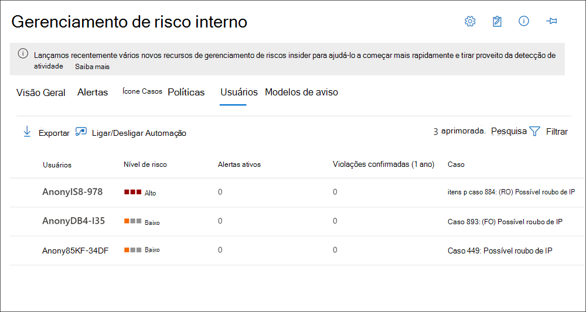

# Usuários de gerenciamento de risco do insiderInsider risk management users

Os usuários de gerenciamento de risco do insider são funcionários em sua organização que estão incluídos em uma ou mais políticas de gerenciamento de risco do insider.Insider risk management users are employees in your organization that are included in one or more insider risk management policies. Use o **painel usuários** para examinar rapidamente as informações de risco sobre os funcionários e para adicionar um funcionário a uma política de gerenciamento de risco do insider existente.Use the **Users dashboard** to quickly review risk information about employees and to add an employee to an existing insider risk management policy. Cada usuário incluído em uma política de gerenciamento de risco do insider possui as seguintes informações exibidas no **painel usuários**:Each user included in an insider risk management policy has the following information displayed on the **Users dashboard**:

- **Usuários**: o nome de usuário de um usuário.**Users**: The username for a user.
- **Nível de risco**: o nível de risco calculado atual do usuário.**Risk level**: The current calculated risk level of the user. Essa pontuação é calculada a cada 24 horas e usa as pontuações de risco de alerta de todos os alertas ativos associados ao usuário.This score is calculated every 24 hours and uses the alert risk scores from all active alerts associated to the user.
- **Alertas ativos**: o número de alertas ativos para todas as políticas.**Active alerts**: The number of active alerts for all policies.
- **Violações confirmadas**: o número de ocorrências resolvidas como *violação de política confirmada* para o usuário.**Confirmed violations**: The number of cases resolved as *confirmed policy violation* for the user.
- **Caso**: o caso ativo atual do usuário.**Case**: The current active case for the user.

## Exibir detalhes do usuárioView user details

Para exibir mais detalhes sobre a atividade de risco de um usuário, abra o painel de detalhes do usuário clicando duas vezes em um usuário no **painel usuários**.To view more details about risk activity for a user, open the user details pane by double-clicking a user in the **Users dashboard**. No painel de detalhes, você pode exibir as seguintes informações:On the details pane, you can view the following information:

- Guia **perfil de usuário****User profile** tab
    - **Nome e título**: o nome e o título da posição do usuário.**Name and title**: The name and position title for the user.
    - **Email do usuário**: o endereço de email do usuário.**User email**: The email address for the user.
    - **Alias**: o alias de rede do usuário.**Alias**: The network alias for the user.
    - **Organização ou departamento**: a organização ou departamento do usuário.**Organization or department**: The organization or department for the user.

- Guia **atividade do usuário****User activity** tab
    - **Histórico da atividade recente do usuário**: lista os eventos de acionamento de política e os indicadores de risco para atividades do usuário.**History of recent user activity**: Lists both policy triggering events and risk indicators for user activities. Um evento de acionamento pode ser a aceitação de uma data de demissão ou da última data de trabalho agendada para o funcionário.A triggering event may be the acceptance of a resignation date or the last scheduled date of work for the employee. Os indicadores de risco são atividades determinadas para ter um elemento de risco e que são correspondidas às políticas nas quais o usuário está incluído.Risk indicators are activities that are determined to have an element of risk and that are matched to policies that the user is included in. Eventos e atividades de risco são listados com o item mais recente listado primeiro.Events and risk activities are listed with the most recent item listed first.

## Adicionar um usuário a uma políticaAdd a user to a policy

Para adicionar um usuário a uma política de gerenciamento de risco do Insider, você usará o assistente de nova política ou a guia **usuários** na solução de **Gerenciamento de risco do insider** no centro de conformidade do Microsoft 365.To add a user to an insider risk management policy, you'll either use the new policy wizard or the **Users** tab in the **Insider risk management** solution in the Microsoft 365 compliance center.

Conclua as seguintes etapas para adicionar um usuário a uma política de risco Insider existente:Complete the following steps to add a user to an existing insider risk policy:

1. No [centro de conformidade da Microsoft 365](https://compliance.microsoft.com), vá para gerenciamento de **risco do insider** e selecione a guia **usuários** .In the [Microsoft 365 compliance center](https://compliance.microsoft.com), go to **Insider risk management** and select the **Users** tab.
2. Selecione **Adicionar um usuário a uma política** na barra de ferramentas.Select **Add a user to a policy** on the toolbar.
3. Na caixa de diálogo **Adicionar um novo usuário** , comece a digitar um nome de usuário no campo **usuário** .On the **Add a new user** dialog, start typing a user name in the **User** field. Selecione o usuário que você deseja adicionar a uma política.Select the user you want to add to a policy.
4. Selecione a seta suspensa do campo **política** para exibir as políticas de gerenciamento de risco do insider configuradas.Select the dropdown arrow for the **Policy** field to display configured insider risk management policies. Selecione a política à qual adicionar o usuário.Select the policy to add the user to.
5. Use o controle deslizante da **janela de ativação** para definir por quanto tempo a política está ativa para esse usuário e é disparada quando o usuário realiza a primeira atividade que corresponde à política.Use the **Activation window** slider control to define how long the policy is active for this user and is triggered when the user performs the first activity matching the policy. O intervalo para a janela de monitoramento é de 5 a 30 dias.The range for the monitoring window is 5 to 30 days.
6. Selecione **Adicionar** e depois em **confirmar** para adicionar o usuário à política.Select **Add** and then **Confirm** to add the user to the policy.
