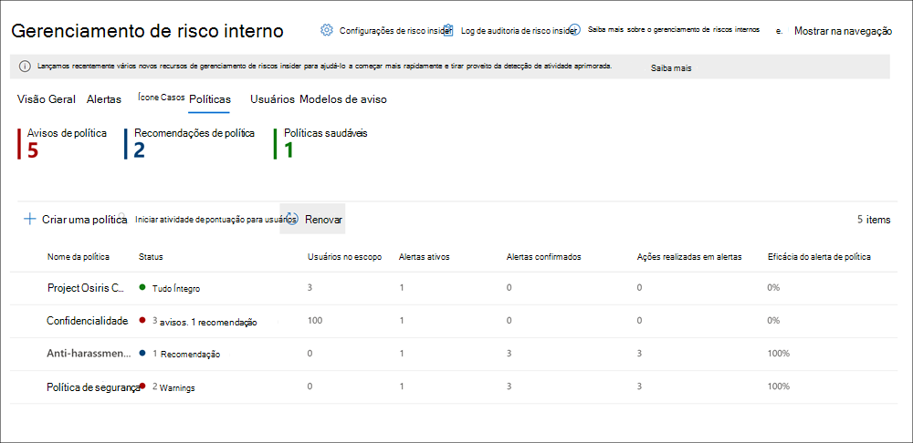
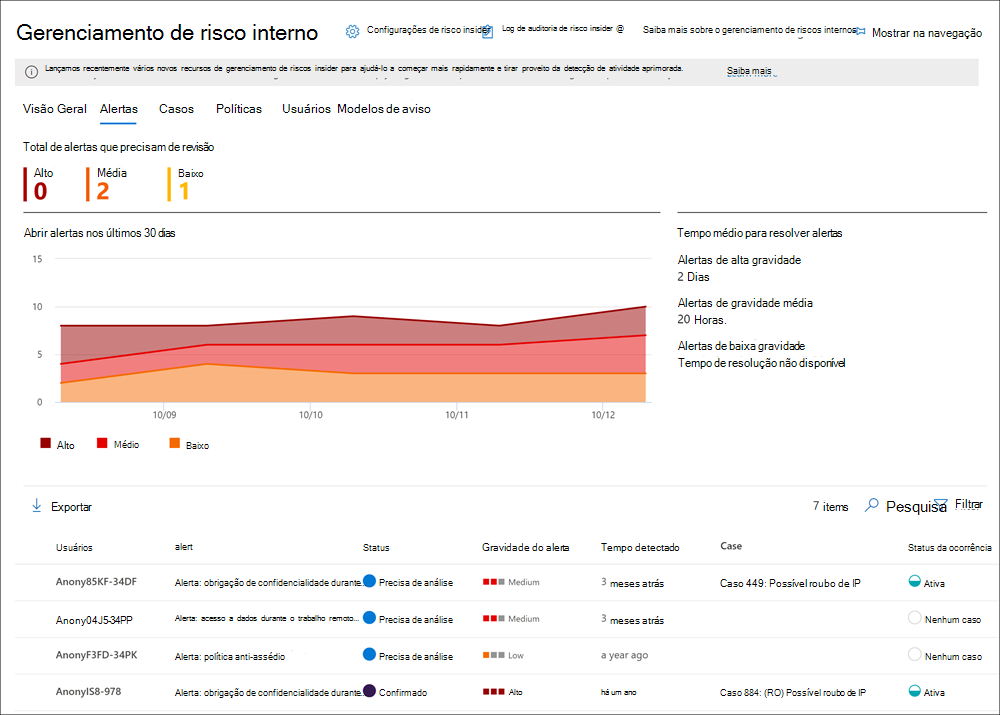
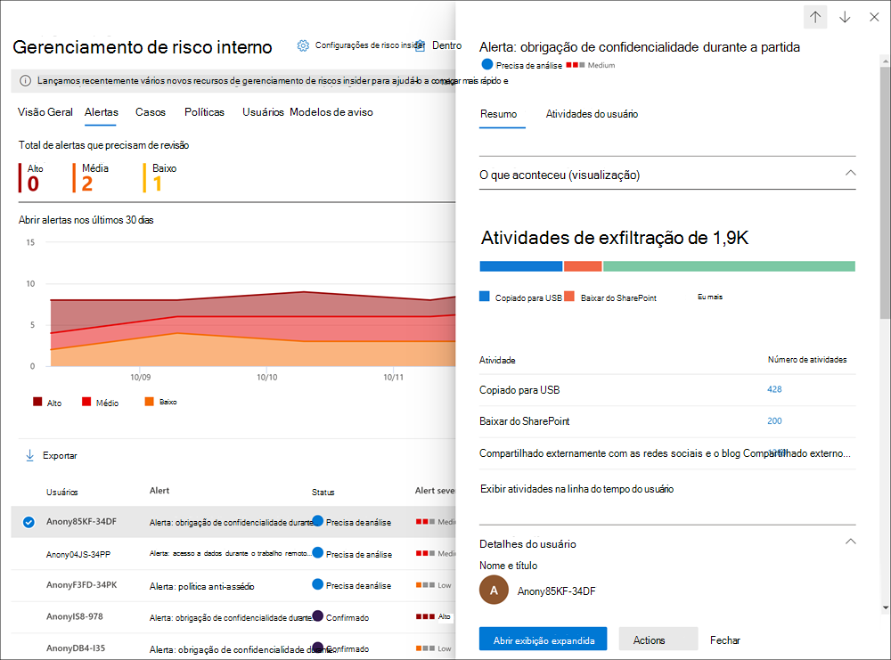
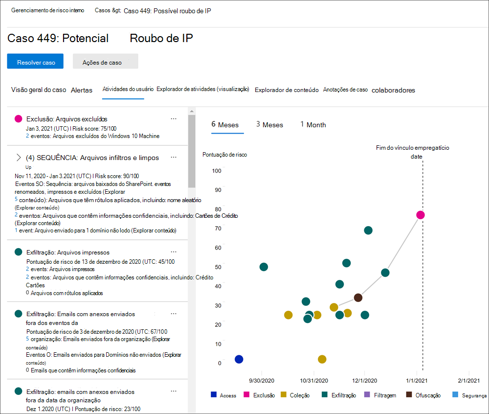

# Saiba mais sobre o gerenciamento de risco interno no Microsoft 365

O gerenciamento de riscos internos é uma solução de conformidade no Microsoft 365 que ajuda a minimizar riscos internos, permitindo que você detecte, investigue e aja em atividades mal-intencionadas e inadvertentes em sua organização. As políticas de risco insider permitem que você defina os tipos de riscos para identificar e detectar em sua organização, incluindo a ação em casos e a escalada de casos para o Microsoft Advanced eDiscovery se necessário. Os analistas de risco em sua organização podem tomar rapidamente as ações apropriadas para garantir que os usuários sejam compatíveis com os padrões de conformidade da sua organização.

Assista ao vídeo abaixo para saber como o gerenciamento de riscos insider pode ajudar sua organização a evitar, detectar e conter riscos ao priorizar os valores, a cultura e a experiência do usuário da sua organização:
 
 
>[!VIDEO https://www.microsoft.com/videoplayer/embed/RE4j9CN]

## Pontos de dor de risco modernos

O gerenciamento e a minimização de riscos na organização começam com a compreensão dos tipos de riscos encontrados no local de trabalho moderno. Alguns riscos são controlados por eventos externos e fatores que estão fora do controle direto. Outros riscos são orientados por eventos internos e atividades do usuário que podem ser minimizadas e evitadas. Alguns exemplos são riscos de comportamentos e ações ilegais, inadequadas, não autorizadas ou antiéticas por usuários em sua organização. Esses comportamentos incluem uma ampla variedade de riscos internos dos usuários:

- Vazamentos de dados confidenciais e análise de dados
- Violações de confidencialidade
- Direitos de Propriedade Intelectual (IP)
- Fraude
- Informações privilegiadas
- Soluções de conformidade regulamentar

Os usuários no local de trabalho moderno têm acesso para criar, gerenciar e compartilhar dados em uma ampla gama de plataformas e serviços. Na maioria dos casos, as organizações têm recursos e ferramentas limitados para identificar e reduzir riscos em toda a organização, além de atender aos padrões de privacidade do usuário.

O gerenciamento de riscos insider usa a amplitude completa dos indicadores de serviço e de terceiros para ajudá-lo a identificar, triagem e agir rapidamente sobre a atividade de risco. Usando logs do Microsoft 365 e do Microsoft Graph, o gerenciamento de risco interno permite definir políticas específicas para identificar indicadores de risco. Essas políticas permitem identificar atividades arriscadas e agir para reduzir esses riscos.

O gerenciamento de riscos insider é centralizado em torno dos seguintes princípios:

- **Transparência**: balancear a privacidade do usuário versus o risco da organização com a arquitetura de privacidade por design.
- **Configurável**: políticas configuráveis com base em grupos de negócios, geográficos e do setor.
- **Integrado**: Fluxo de trabalho integrado Microsoft 365 soluções de conformidade.
- **A ação**: fornece informações para habilitar notificações do revistor, investigações de dados e investigações de usuários.

## Identificar possíveis riscos com análise (visualização)

A análise de riscos internos permite que você conduza uma avaliação de riscos internos potenciais na sua organização sem configurar nenhuma política de riscos internos. Esta avaliação pode ajudar sua organização a identificar áreas potenciais de maior risco para o usuário e ajudar a determinar o tipo e o escopo das políticas de gerenciamento de risco interno que você pode considerar configurar. Essa avaliação também pode ajudá-lo a determinar as necessidades de licenciamento adicional ou otimização futura de políticas de risco insider existentes.

Para saber mais sobre análise de risco interno, consulte Configurações de gerenciamento de riscos [do Insider: Analytics](insider-risk-management-settings.md#analytics-preview).

## Fluxo de trabalho

O fluxo de trabalho de gerenciamento de riscos internos ajuda você a identificar, investigar e tomar medidas para resolver riscos internos em sua organização. Com modelos de política focados, sinalização de atividades abrangentes no serviço Microsoft 365 e ferramentas de gerenciamento de alertas e casos, você pode usar insights ativos para identificar e agir rapidamente sobre comportamentos de risco.

A identificação e a resolução de atividades de risco internas e problemas de conformidade com o gerenciamento de riscos internos no Microsoft 365 usam o seguinte fluxo de trabalho:

### Políticas

[As políticas de gerenciamento de](insider-risk-management-policies.md) riscos insider são criadas usando modelos e condições de política predefinidas que definem quais eventos de gatilho e indicadores de risco são examinados em sua organização. Essas condições incluem como os indicadores de risco são usados para alertas, quais usuários são incluídos na política, quais serviços são priorizados e o período de tempo de monitoramento.

Você pode selecionar entre os seguintes modelos de política para começar rapidamente com o gerenciamento de riscos insider:

- [Furto de dados por usuários em processo de desligamento](insider-risk-management-policies.md#data-theft-by-departing-users)
- [Vazamento de dados gerais](insider-risk-management-policies.md#general-data-leaks)
- [Vazamento de dados por usuários prioritários (visualização)](insider-risk-management-policies.md#data-leaks-by-priority-users-preview)
- [Vazamento de dados por usuários insatisfeitos (visualização)](insider-risk-management-policies.md#data-leaks-by-disgruntled-users-preview)
- [Violações gerais da política de segurança (visualização)](insider-risk-management-policies.md#general-security-policy-violations-preview)
- [Violações da política de segurança por usuários em processo de desligamento (visualização)](insider-risk-management-policies.md#security-policy-violations-by-departing-users-preview)
- [Violações da política de segurança por usuários prioritários (visualização)](insider-risk-management-policies.md#security-policy-violations-by-priority-users-preview)
- [Violações da política de segurança por usuários insatisfeitos (visualização)](insider-risk-management-policies.md#security-policy-violations-by-disgruntled-users-preview)

### Alertas

Os alertas são gerados automaticamente por indicadores de risco que corresponderem às condições da política e são exibidos no [painel Alertas.](insider-risk-management-activities.md#alert-dashboard) Esse painel permite uma exibição rápida de todos os alertas que precisam de revisão, alertas abertos ao longo do tempo e estatísticas de alerta para a sua organização. Todos os alertas de política são exibidos com as seguintes informações para ajudá-lo a identificar rapidamente o status de alertas existentes e novos alertas que precisam de ação:

- Status
- Severity
- Tempo detectado
- Caso
- Status da ocorrência

### Triagem

Novas atividades do usuário que precisam de investigação geram automaticamente alertas atribuídos a um status de revisão *de* necessidades. Os revisadores podem identificar e analisar rapidamente, avaliar e triagem desses alertas.

Os alertas são resolvidos abrindo um novo caso, atribuindo o alerta a um caso existente ou descartando o alerta. Usando filtros de alerta, é fácil identificar rapidamente alertas por status, gravidade ou tempo detectado. Como parte do processo de triagem, os revisores podem exibir detalhes do alerta para as atividades identificadas pela política, exibir a atividade do usuário associada à combinação de política, ver a gravidade do alerta e revisar as informações de perfil do usuário.

### Investigar

Investigue rapidamente todas as atividades de um usuário selecionado com relatórios de atividades [do usuário (visualização)](insider-risk-management-activities.md#user-activity-reports-preview). Esses relatórios permitem que os investigadores em sua organização examinem atividades para usuários específicos por um período de tempo definido sem precisar atribuí-los temporariamente ou explicitamente a uma política de gerenciamento de riscos internas. Depois de examinar as atividades de um usuário, os investigadores podem descartar atividades individuais como benignas, compartilhar ou enviar um link para o relatório com outros investigadores ou optar por atribuir o usuário temporariamente ou explicitamente a uma política de gerenciamento de riscos internas.

[Os](insider-risk-management-cases.md) casos são criados para alertas que exigem uma análise e investigação mais profundas dos detalhes da atividade e das circunstâncias em torno da combinação de política. O **Painel de casos** fornece uma exibição completa de todos os casos ativos, casos abertos ao longo do tempo e estatísticas de casos para a sua organização. Os revisadores podem filtrar rapidamente casos por status, a data em que o caso foi aberto e a data em que o caso foi atualizado pela última vez.

A seleção de um caso no painel de controle do caso abre o caso para investigação e revisão. Esta etapa é o centro do fluxo de trabalho de gerenciamento de risco interno. Essa área é onde atividades de risco, condições de política, detalhes de alertas e detalhes do usuário são sintetizados em uma exibição integrada para revisores. As principais ferramentas de investigação nesta área são:

- **Atividade do** usuário : a atividade do usuário é exibida automaticamente em um gráfico interativo que plota atividades ao longo do tempo e por nível de risco para atividades de risco atuais ou passadas. Os revisores podem filtrar e exibir rapidamente todo o histórico de riscos para o usuário e detalhar atividades específicas para obter mais detalhes.
- **Explorador de conteúdo**: Todos os arquivos de dados e mensagens de email associadas às atividades de alerta são automaticamente capturados e exibidos no explorador de conteúdo. Os revisadores podem filtrar e exibir arquivos e mensagens por fonte de dados, tipo de arquivo, marcas, conversa e muitos outros atributos.
- **Observações de** caso : Os revisadores podem fornecer anotações para um caso na seção Anotações de Caso. Esta lista consolida todas as anotações em uma exibição central e inclui as informações enviadas pelo revistor e a data.

Além disso, o novo log de [auditoria (visualização)](insider-risk-management-audit-log.md) permite que você fique informado das ações que foram tomadas em recursos de gerenciamento de riscos insider. Esse recurso permite uma revisão independente das ações tomadas pelos usuários atribuídos a um ou mais grupos de função de gerenciamento de riscos insider.

### Ação

Depois que os casos são investigados, os revisadores podem agir rapidamente para resolver o caso ou colaborar com outros participantes de risco em sua organização. Se os usuários violarem acidentalmente ou inadvertidamente as condições da política, um aviso de lembrete simples poderá ser enviado para o usuário a partir de modelos de aviso que você pode personalizar para sua organização. Esses avisos podem servir como lembretes simples ou pode direcionar o usuário para o treinamento ou orientação de atualização para ajudar a evitar comportamentos futuros de risco. Para obter mais informações, consulte [Modelos de notificações do gerenciamento de risco interno](insider-risk-management-notices.md).

Nas situações mais sérias, talvez seja necessário compartilhar as informações de caso de gerenciamento de riscos insider com outros revisadores ou serviços em sua organização. O gerenciamento de riscos do insider está integrado a outras soluções Microsoft 365 de conformidade para ajudá-lo com a resolução de risco de ponta a ponta.

- **Advanced eDiscovery:** a escalada de um caso de investigação permite transferir dados e gerenciamento do caso para Advanced eDiscovery no Microsoft 365. A Descoberta Eletrônica Avançada fornece um fluxo de trabalho completo para preservar, coletar, revisar, analisar e exportar conteúdos adequados às investigações internas e externas da sua organização. Ela também permite que sua equipe jurídica gerencie todo o fluxo de trabalho de notificação de retenção legal. Para saber mais sobre os casos de Descoberta Eletrônica Avançada, consulte [Visão Geral da Descoberta Eletrônica Avançada do Microsoft 365](overview-ediscovery-20.md).
- Office 365 integração de APIs de gerenciamento **(visualização)**: o gerenciamento de riscos do Insider dá suporte à exportação de informações de alerta para serviços de gerenciamento de informações de segurança e de eventos (SIEM) por meio das APIs de gerenciamento Office 365. Ter acesso às informações de alerta na plataforma é o melhor para os processos de risco da sua organização, dando mais flexibilidade em como agir em atividades de risco. Para saber mais sobre como exportar informações de alerta com Office 365 DE Gerenciamento, consulte [Exportar alertas](insider-risk-management-settings.md#export-alerts-preview).

> [!NOTE]
> Obrigado por seus comentários e suporte durante a visualização do conector ServiceNow. Decidimos encerrar a visualização do conector ServiceNow e interromper o suporte no gerenciamento de riscos insider em 30 de novembro de 2020. Estamos avaliando ativamente métodos alternativos para fornecer aos clientes a integração do ServiceNow no gerenciamento de riscos insider.

## Cenários

O gerenciamento de riscos internos pode ajudá-lo a detectar, investigar e a tomar medidas para reduzir os riscos internos em sua organização em vários cenários comuns:

### Furto de dados por usuários em processo de desligamento

Quando os usuários saem de uma organização, voluntariamente ou como resultado da rescisão, muitas vezes há preocupações legítimas de que os dados da empresa, do cliente e do usuário estão em risco. Os usuários podem assumir que os dados do projeto não são proprietários, ou podem estar tentados a aceitar dados da empresa para ganho pessoal e violando a política da empresa e os padrões legais. As políticas de gerenciamento de riscos do Insider que usam o [modelo](insider-risk-management-policies.md#policy-templates) de política de roubo de dados ao separar usuários detectam automaticamente atividades normalmente associadas a esse tipo de roubo. Com essa política, você receberá automaticamente alertas para atividades suspeitas associadas ao roubo de dados, de modo que você possa tomar as ações de investigação apropriadas. A configuração [de um Microsoft 365 de RH](import-hr-data.md) para sua organização é necessária para este modelo de política.

### Vazamento intencional ou não intencional de informações confidenciais ou confidenciais

Na maioria dos casos, os usuários tentam lidar corretamente com informações confidenciais ou confidenciais. Mas, ocasionalmente, os usuários podem cometer erros e as informações são compartilhadas acidentalmente fora da sua organização ou violando suas políticas de proteção de informações. Em outras circunstâncias, os usuários podem intencionalmente vazar ou compartilhar informações confidenciais e confidenciais com intenção mal-intencionada e para ganho pessoal potencial. As políticas de gerenciamento de riscos internas criadas usando os seguintes modelos de política de vazamento de dados detectam automaticamente atividades normalmente associadas ao compartilhamento de informações confidenciais ou confidenciais:

- [Vazamento de dados gerais](insider-risk-management-policies.md#general-data-leaks)
- [Vazamento de dados por usuários prioritários (visualização)](insider-risk-management-policies.md#data-leaks-by-priority-users-preview)
- [Vazamento de dados por usuários insatisfeitos (visualização)](insider-risk-management-policies.md#data-leaks-by-disgruntled-users-preview)

## Violações intencionais ou não intencionais de política de segurança (visualização)

Normalmente, os usuários têm um grande grau de controle ao gerenciar seus dispositivos no local de trabalho moderno. Esse controle pode incluir permissões para instalar ou desinstalar aplicativos necessários no desempenho de suas obrigações ou a capacidade de desabilitar temporariamente os recursos de segurança do dispositivo. Se essa atividade é inadvertida, acidental ou mal-intencionada, essa conduta pode representar riscos para sua organização e é importante para identificar e agir para minimizar. Para ajudar a identificar essas atividades de segurança arriscadas, os seguintes modelos de violação de política de segurança de gerenciamento de risco interno pontuam indicadores de risco de segurança e usam o Microsoft Defender para alertas de ponto de extremidade para fornecer informações sobre atividades relacionadas à segurança:

- [Violações gerais da política de segurança (visualização)](insider-risk-management-policies.md#general-security-policy-violations-preview)
- [Violações da política de segurança por usuários em processo de desligamento (visualização)](insider-risk-management-policies.md#security-policy-violations-by-departing-users-preview)
- [Violações da política de segurança por usuários prioritários (visualização)](insider-risk-management-policies.md#security-policy-violations-by-priority-users-preview)
- [Violações da política de segurança por usuários insatisfeitos (visualização)](insider-risk-management-policies.md#security-policy-violations-by-disgruntled-users-preview)

## Políticas para usuários com base em posição, nível de acesso ou histórico de riscos (visualização)

Os usuários em sua organização podem ter níveis diferentes de risco, dependendo de sua posição, nível de acesso a informações confidenciais ou histórico de riscos. Essa estrutura pode incluir membros da equipe de liderança executiva da sua organização, administradores de IT que têm amplos privilégios de acesso à rede e dados ou usuários com um histórico passado de atividades arriscadas. Nessas circunstâncias, inspeção mais próxima e pontuação de risco mais agressiva são importantes para ajudar a superfície de alertas para investigação e ação rápida. Para ajudar a identificar atividades arriscadas para esses tipos de usuários, você pode criar grupos de usuários prioritários e criar políticas a partir dos seguintes modelos de política:

- [Violações da política de segurança por usuários prioritários (visualização)](insider-risk-management-policies.md#security-policy-violations-by-priority-users-preview)
- [Vazamento de dados por usuários prioritários (visualização)](insider-risk-management-policies.md#data-leaks-by-priority-users-preview)

## Ações e comportamentos por usuários insatisfeitos (visualização)

Eventos de estresse de emprego podem afetar o comportamento do usuário de várias maneiras relacionadas aos riscos do usuário interno. Esses stressores podem ser uma revisão de desempenho ruim, um rebaixamento de posição ou o usuário sendo colocado em um plano de revisão de desempenho. Embora a maioria dos usuários não responda maliciosamente a esses eventos, o estresse dessas ações pode fazer com que alguns usuários tomem ações que podem não ser consideradas normalmente durante circunstâncias normais. Para ajudar a identificar esses tipos de atividades arriscadas, os seguintes modelos de política de gerenciamento de riscos insider usam o conector de RH Microsoft 365 e iniciam a pontuação de indicadores de risco relacionados a comportamentos que podem ocorrer próximos a eventos de estresse do trabalho:

- [Vazamento de dados por usuários insatisfeitos (visualização)](insider-risk-management-policies.md#data-leaks-by-disgruntled-users-preview)
- [Violações da política de segurança por usuários insatisfeitos (visualização)](insider-risk-management-policies.md#security-policy-violations-by-disgruntled-users-preview)

## Pronto para começar?

- Consulte [Plan for insider risk management](insider-risk-management-plan.md) for how to prepare to enable insider risk management policies in your organization.
- Confira [Começar com as configurações de gerenciamento](insider-risk-management-settings.md) de riscos insider para definir configurações globais para políticas de risco internas.
- Consulte [Iniciar o gerenciamento de riscos insider](insider-risk-management-configure.md) para configurar pré-requisitos, criar políticas e começar a receber alertas.
