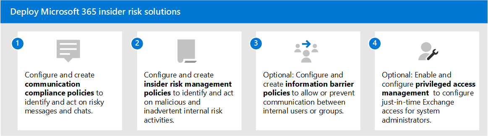

# Soluções de risco interno no Microsoft 365

Os riscos insider são uma das principais preocupações dos profissionais de segurança e conformidade no local de trabalho moderno. Estudos do setor mostraram que os riscos insider são frequentemente associados a atividades ou eventos específicos do usuário. Proteger sua organização contra esses riscos pode ser um desafio identificar e ser difícil de atenuar. Os riscos internos incluem vulnerabilidades em diversas áreas e podem causar problemas importantes para sua organização, desde a perda de propriedade intelectual até o abuso no local de trabalho e muito mais. A figura a seguir descreve os riscos comuns dos participantes do insider:

Os recursos de prevenção de riscos do Microsoft 365 são projetados e integrados aos nossos produtos e soluções de risco interno. Essas soluções trabalham em conjunto e usam indicadores avançados de serviço e de terceiros para ajudá-lo a identificar, triagem e agir rapidamente sobre a atividade de risco. A maioria das soluções oferece um fluxo de trabalho abrangente de detecção, alerta e correção para que seus analistas de dados e investigadores usem rapidamente para agir e minimizar esses riscos.

| Ícone de risco | Riscos | Conformidade de comunicações | Gerenciamento de risco interno | Barreiras de informações | Gerenciamento de acesso privilegiado |
| :---- | :-------- | :--------------------------- | :-------------------------- |:-------------------------| :--------------------------------|
| | Vazamento de dados |  |  |  |  |
| | Violações de confidencialidade |  |  |  |  |
| | Roubo de IP |  |  |  |  |
| | Violência no local de trabalho |  |  |  |  |
| | Fraude |  |  |  |  |
| | Violações de política |  |  |  |  |
| | Troca de informações internas |  |  |  |  |
| | Conflitos de interesse |  |  |  |  |
| | Vazamentos de dados confidenciais |  |  |  |  |
| | Abuso no local de trabalho |  |  |  |  |
| | Violações de segurança |  |  |  |  |
| | Violações de conformidade regulamentar |  |  |  |  |

## Soluções de risco interno do Microsoft 365

Para ajudar a proteger sua organização contra riscos insider, use esses recursos e funcionalidades do Microsoft 365.

### Conformidade de comunicações

A conformidade de comunicação ajuda a minimizar os riscos de comunicação, ajudando você a detectar, capturar e agir em mensagens inadequadas em sua organização. A conformidade de comunicação está disponível nas seguintes assinaturas:

- Assinatura do Microsoft 365 E5 (versão paga ou de avaliação)
- Assinatura do Microsoft 365 E3 + o complemento de Conformidade do Microsoft 365 E5
- Assinatura do Microsoft 365 E3 + o complemento Microsoft 365 E5 Insider Risk Management
- Assinatura do Microsoft 365 A5 (versão paga ou de avaliação)
- Assinatura do Microsoft 365 A3 + complemento de Conformidade do Microsoft 365 A5
- Assinatura do Microsoft 365 A3 + o complemento Microsoft 365 A5 Insider Risk Management
- Assinatura do Microsoft 365 G5 (versão paga ou de avaliação)
- Assinatura do Microsoft 365 G5 + o complemento de Conformidade do Microsoft 365 G5
- Assinatura do Microsoft 365 G5 + o complemento Microsoft 365 G5 Insider Risk Management
- Assinatura do Office 365 Enterprise E5 (versão paga ou de avaliação)
- Assinatura do Office 365 A5 (versão paga ou de avaliação)
- Assinatura do Office 365 Enterprise E3 + complemento de Conformidade Avançada do Office 365 (não está mais disponível para novas assinaturas)

### Gerenciamento de risco interno

O gerenciamento de riscos internos ajuda a minimizar os riscos internos, permitindo que você detecte, investigue e atue em atividades mal-intencionadas e inadvertida em sua organização.

O gerenciamento de riscos insider está disponível nas seguintes assinaturas:

- Assinatura do Microsoft 365 E5 (versão paga ou de avaliação)
- Assinatura do Microsoft 365 E3 + o complemento de Conformidade do Microsoft 365 E5
- Assinatura do Microsoft 365 E3 + o complemento Microsoft 365 E5 Insider Risk Management
- Assinatura do Microsoft 365 A5 (versão paga ou de avaliação)
- Assinatura do Microsoft 365 A3 + complemento de Conformidade do Microsoft 365 A5
- Assinatura do Microsoft 365 A3 + o complemento Microsoft 365 A5 Insider Risk Management
- Assinatura do Microsoft 365 G5 (versão paga ou de avaliação)
- Assinatura do Microsoft 365 G3 + o complemento de Conformidade do Microsoft 365 G5
- Assinatura do Microsoft 365 G3 + o complemento Microsoft 365 G5 Insider Risk Management

### Barreiras de informações

As barreiras de informações permitem restringir a comunicação e a colaboração entre dois grupos internos para evitar que um conflito de interesses ocorra em sua organização.

Barreiras de informações estão disponíveis nas seguintes assinaturas:

- Assinatura do Microsoft 365 E5 (versão paga ou de avaliação)
- Assinatura do Microsoft 365 A5 (versão paga ou de avaliação)
- Assinatura do Office 365 Enterprise E5 (versão paga ou de avaliação)
- Assinatura do Office 365 A5 (versão paga ou de avaliação)
- Complemento de Conformidade Avançada do Office 365 (não está mais disponível para novas assinaturas)
- Assinatura do Microsoft 365 E3 + o complemento de Conformidade do Microsoft 365 E5
- Assinatura do Microsoft 365 E3 + o complemento Microsoft 365 E5 Insider Risk Management
- Assinatura do Microsoft 365 A3 + complemento de Conformidade do Microsoft 365 A5
- Assinatura do Microsoft 365 A3 + o complemento Microsoft 365 A5 Insider Risk Management

### Gerenciamento de acesso privilegiado

O gerenciamento de acesso privilegiado permite o controle de acesso granular sobre tarefas privilegiadas de administrador do Exchange Online no Office 365. Ele pode ajudar a proteger sua organização contra violações que usam contas de administrador privilegiadas existentes com acesso permanente a dados confidenciais ou acesso a configurações críticas.

O gerenciamento de acesso privilegiado está disponível nas seguintes assinaturas:

- Assinatura do Microsoft 365 E5 (versão paga ou de avaliação)
- Assinatura do Microsoft 365 A5 (versão paga ou de avaliação)
- Assinatura do Office 365 Enterprise E5 (versão paga ou de avaliação)
- Assinatura do Office 365 A5 (versão paga ou de avaliação)
- Assinatura do Microsoft 365 E3 + o complemento de Conformidade do Microsoft 365 E5
- Assinatura do Microsoft 365 E3 + o complemento Proteção de Informações e Governança do Microsoft 365 E5
- Assinatura do Microsoft 365 A3 + complemento de Conformidade do Microsoft 365 A5
- Assinatura do Microsoft 365 A3 + o complemento Proteção de Informações e Governança do Microsoft 365 A5

## Implantar soluções de risco interno do Microsoft 365

Para ajudar a proteger sua organização contra riscos insider, de configurar e implantar as seguintes soluções do Microsoft 365:

1. Configure e crie políticas [de conformidade de comunicação.](communication-compliance-solution-overview.md)
2. Configure e crie políticas [de gerenciamento de riscos internas.](insider-risk-management-solution-overview.md)
3. Opcional: configurar e criar políticas [de barreira de informações.](information-barriers-solution-overview.md)
4. Opcional: Habilitar e configurar o [gerenciamento de acesso privilegiado.](privileged-access-management-solution-overview.md)

## Ilustrações com exemplos

Para ajudá-lo a planejar uma estratégia integrada para implementar os recursos de risco interno do Microsoft 365, baixe o conjunto de recursos de conformidade e proteção de informações do *Microsoft 365.* Para recursos de risco interno, consulte as páginas de ilustração de arquitetura 5 a 7. Sinta-se à vontade para adaptar essas ilustrações para seu próprio uso.

| Item | Descrição |
|:-----|:------------|
|   [Baixar como pdf](https://download.microsoft.com/download/3/a/6/3a6ab1a3-feb0-4ee2-8e77-62415a772e53/m365-compliance-illustrations.pdf) \| [Baixar como um Visio](https://download.microsoft.com/download/3/a/6/3a6ab1a3-feb0-4ee2-8e77-62415a772e53/m365-compliance-illustrations.vsdx)     Atualizado em outubro de 2020|Contém: <ul><li>  Proteção de informações e prevenção contra perda de dados da Microsoft</li><li>Políticas de retenção e rótulos de retenção </li><li>Barreiras de informações</li><li>Conformidade de comunicações</li><li>Gerenciamento de risco interno</li><li>Inclusão de dados de terceiros</li>|

## Treinamento

O treinamento dos administradores e da equipe de conformidade nas noções básicas de cada solução de risco interno pode ajudar sua organização a começar mais rapidamente com seus esforços de implantação e implementação. 

O Microsoft 365 fornece os seguintes recursos para ajudar a informar e treinar esses usuários em sua organização:

| Solução/Área | Recursos |
|:------------------|:--------------|
| Gerenciar riscos de informações internas no Microsoft 365 |[Caminho de aprendizagem completo](/learn/paths/m365-compliance-insider)   Esse caminho de aprendizagem inclui todos os módulos de solução individuais para conformidade de comunicação, gerenciamento de riscos insider, barreiras de informações e gerenciamento de acesso privilegiado. Selecione esse caminho de aprendizagem para concluir todos os módulos. |
| Conformidade de comunicações | [Módulo de aprendizagem: Preparar a conformidade de comunicação no Microsoft 365](/learn/modules/m365-compliance-insider-prepare-communication-compliance)   Este módulo ajuda você a aprender as noções básicas sobre como identificar e remediar violações de política de código de conduta com a conformidade de comunicação, abranger os pré-requisitos necessários antes de criar políticas de conformidade de comunicação e aprender sobre os tipos de modelos de política predefinidas e integrados na conformidade de comunicação. |
| Gerenciamento de risco interno | [Módulo de aprendizagem: Gerenciamento de riscos do Insider no Microsoft 365](/learn/modules/m365-compliance-insider-manage-insider-risk)   Este módulo ajuda você a aprender como o gerenciamento de riscos internos no Microsoft 365 pode ajudar a evitar, detectar e conter riscos internos em uma organização, aprender sobre os tipos de modelos de política internos e predefinidas, entender os pré-requisitos básicos necessários antes de criar políticas de risco internos e explica os tipos de ações que você pode tomar em casos de gerenciamento de riscos internos. |
| Barreiras de informações | [Módulo de aprendizagem: Planejar barreiras de informações](/learn/modules/m365-compliance-insider-plan-information-barriers)   Este módulo ajuda você a aprender como as políticas de barreira de informações podem ajudar sua organização a manter a conformidade com padrões e regulamentos relevantes do setor, lista os tipos de situações em que as barreiras de informações seriam aplicáveis, ajuda a explicar o processo de criação de uma política de barreira de informações e a explicar como solucionar problemas inesperados após a criação de barreiras de informações. |
| Gerenciamento de acesso privilegiado | [Módulo de aprendizagem: Implementar o gerenciamento de acesso privilegiado](/learn/modules/m365-compliance-insider-implement-privileged-access-management)   Este módulo ajuda você a entender a diferença entre o gerenciamento de acesso privilegiado e o gerenciamento de identidades privilegiadas, compreender o fluxo do processo de gerenciamento de acesso privilegiado e compreender as noções básicas de como configurar e habilitar o gerenciamento de acesso privilegiado. |
