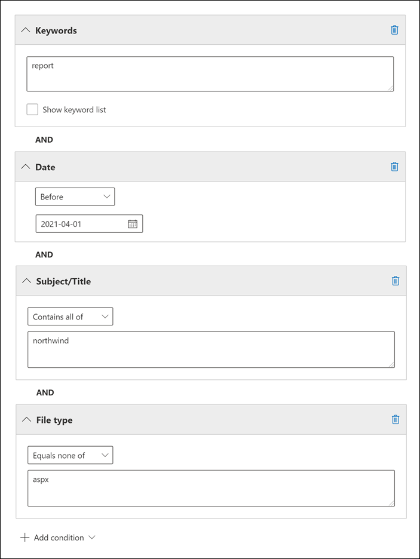

# <a name="keyword-queries-and-search-conditions-for-ediscovery"></a>Consultas de palavra-chave e condições de pesquisa para Descoberta e Descoberta

Este tópico descreve as propriedades de email e documento que você pode pesquisar em itens de email e conversas de chat Microsoft Teams no Exchange Online e documentos armazenados em sites SharePoint e OneDrive for Business usando as ferramentas de pesquisa de Descoberta Eletrônico no centro de conformidade Microsoft 365. Isso inclui a pesquisa de conteúdo, a Descoberta Básica e Advanced eDiscovery (pesquisas de Descoberta Advanced eDiscovery são chamadas *de coleções*). Você também pode usar os cmdlets **\* -ComplianceSearch** no Centro de Conformidade e Segurança & PowerShell para pesquisar essas propriedades. O tópico também descreve:
  
- Usando operadores de pesquisa booleano, condições de pesquisa e outras técnicas de consulta de pesquisa para refinar seus resultados de pesquisa.

- Pesquisar tipos de dados confidenciais e tipos de dados confidenciais personalizados SharePoint e OneDrive for Business.

- Procurando conteúdo de site compartilhado com usuários fora da sua organização

Para obter instruções passo a passo sobre como criar diferentes pesquisas de Descobertas EDiscovery, consulte:

- [Pesquisa de conteúdo](content-search.md)

- [Pesquisar conteúdo no Core eDiscovery](search-for-content-in-core-ediscovery.md)

- [Criar uma coleção de rascunhos em Advanced eDiscovery](create-draft-collection.md)

> [!NOTE]
> As pesquisas de Descoberta Eletrônica no centro de conformidade Microsoft 365 e os cmdlet & s **\* -ComplianceSearch** correspondentes no Centro de Conformidade e Segurança do PowerShell usam a Linguagem de Consulta de Palavra-chave (KQL). Para obter informações mais detalhadas, consulte [Keyword Query Language sintaxe reference](/sharepoint/dev/general-development/keyword-query-language-kql-syntax-reference).
  
## <a name="searchable-email-properties"></a>Propriedades de emails pesquisáveis

A tabela a seguir lista as propriedades de mensagem de email que podem ser pesquisadas usando as ferramentas de pesquisa de Descoberta Eletrônica no centro de conformidade do Microsoft 365 ou usando o cmdlet **New-ComplianceSearch** ou **Set-ComplianceSearch.** A tabela inclui um exemplo da sintaxe  _property:value_ para cada propriedade e uma descrição dos resultados da pesquisa retornados pelos exemplos. Você pode digitar esses  `property:value` pares na caixa palavras-chave para uma pesquisa de Descoberta Eletrônica. 

> [!NOTE]
> Ao pesquisar propriedades de email, não é possível pesquisar itens nos quais a propriedade especificada está vazia ou em branco. Por exemplo, usar o par *property:value* de **subject:""** para pesquisar mensagens de email com uma linha de assunto vazia retornará zero resultados. Isso também se aplica ao pesquisar propriedades de site e contato.
  
| Propriedade | Descrição da propriedade | Exemplos | Resultados de pesquisa retornados pelos exemplos |
|:-----|:-----|:-----|:-----|
|AttachmentNames|Os nomes dos arquivos anexados a uma mensagem de email.|`attachmentnames:annualreport.ppt`  <br/> `attachmentnames:annual*` <br/> `attachmentnames:.pptx` |Mensagens que têm um arquivo anexado chamado relatórioanual.ppt. No segundo exemplo, o uso do caractere curinga ( * ) retorna mensagens com a palavra "anual" no nome do arquivo de um anexo. O terceiro exemplo retorna todos os anexos com a extensão de arquivo pptx.|
|Cco|O campo Cc de uma mensagem de email. <sup>1</sup>|`bcc:pilarp@contoso.com`  <br/> `bcc:pilarp`  <br/> `bcc:"Pilar Pinilla"`|Todos os exemplos retornam mensagens com Brenda Fernandes incluída no campo Cco.|
|Categoria| As categorias a serem pesquisadas. As categorias podem ser definidas pelos usuários usando Outlook ou Outlook na Web (anteriormente conhecido como Outlook Web App). Os valores possíveis são:  <br/><br/>  blue  <br/>  verde  <br/>  laranja  <br/>  roxo  <br/>  vermelho  <br/>  amarelo|`category:"Red Category"`|Mensagens que foram atribuídas à categoria vermelho nas caixas de correio de origem. |
|Cc|O campo Cc de uma mensagem de email. <sup>1</sup>|`cc:pilarp@contoso.com`  <br/> `cc:"Pilar Pinilla"`|Em ambos os exemplos, as mensagens com Pilar Pinilla especificadas no campo Cc.|
|Folderid|A ID da pasta (GUID) de uma pasta de caixa de correio específica. Se você usar essa propriedade, certifique-se de pesquisar a caixa de correio em que a pasta especificada está localizada. Somente a pasta especificada será pesquisada. As subpastas na pasta não serão pesquisadas. Para pesquisar subpastas, você precisa usar a propriedade Folderid para a subpasta que você deseja pesquisar.  <br/> Para obter mais informações sobre como pesquisar a propriedade Folderid e usar um script para obter as IDs de pasta para uma caixa de correio específica, consulte [Use Content search for targeted collections](use-content-search-for-targeted-collections.md).|`folderid:4D6DD7F943C29041A65787E30F02AD1F00000000013A0000`  <br/> `folderid:2370FB455F82FC44BE31397F47B632A70000000001160000 AND participants:garthf@contoso.com`|O primeiro exemplo retorna todos os itens na pasta de caixa de correio especificada. O segundo exemplo retorna todos os itens na pasta de caixa de correio especificada que foram enviados ou recebidos por garthf@contoso.com.|
|From|O remetente de uma mensagem de email. <sup>1</sup>|`from:pilarp@contoso.com`  <br/> `from:contoso.com`|Mensagens enviadas pelo usuário especificado ou enviadas de um domínio especificado.|
|HasAttachment|Indica se uma mensagem tem um anexo. Use os valores **true** ou **false**.|`from:pilar@contoso.com AND hasattachment:true`|Mensagens enviadas pelo usuário especificado que têm anexos.|
|Importance|A prioridade de uma mensagem de email, que um remetente pode especificar ao enviar uma mensagem. Por padrão, as mensagens são enviadas com prioridade normal, a menos que o remetente defina a prioridade como **alta** ou **baixa**.|`importance:high`  <br/> `importance:medium`  <br/> `importance:low`|Mensagens marcadas como alta prioridade, prioridade média ou baixa prioridade.|
|IsRead|Indica se as mensagens foram lidas. Use os valores **true** ou **false**.|`isread:true`  <br/> `isread:false`|O primeiro exemplo retorna mensagens com a propriedade IsRead definida como **True**. O segundo exemplo retorna mensagens com a propriedade IsRead definida como **False**.|
|ItemClass|Use essa propriedade para pesquisar tipos de dados de terceiros específicos que sua organização importou para Office 365. Use a seguinte sintaxe para esta propriedade:  `itemclass:ipm.externaldata.<third-party data type>*`|`itemclass:ipm.externaldata.Facebook* AND subject:contoso`  <br/> `itemclass:ipm.externaldata.Twitter* AND from:"Ann Beebe" AND "Northwind Traders"`|O primeiro exemplo retorna itens do Facebook que contêm a palavra "contoso" na propriedade Subject. O segundo exemplo retorna itens do Twitter que foram postados por Ann Beebe e que contêm a frase de palavra-chave "Northwind Traders".  <br/> Para uma lista completa de valores a ser usado para tipos de dados de terceiros para a propriedade ItemClass, consulte [Use Content search to search third-party data](use-content-search-to-search-third-party-data-that-was-imported.md)that was imported to Office 365 .|
|Tipo| O tipo de mensagem de email a ser pesquisada. Valores possíveis:  <br/>  contacts  <br/>  docs  <br/>  email  <br/>  externaldata  <br/>  faxes  <br/>  im  <br/>  diários  <br/>  meetings  <br/>  microsoftteams (retorna itens de chats, reuniões e chamadas em Microsoft Teams)  <br/>  notes  <br/>  postagens  <br/>  rssfeeds  <br/>  tarefas  <br/>  voicemail|`kind:email`  <br/> `kind:email OR kind:im OR kind:voicemail`  <br/> `kind:externaldata`|O primeiro exemplo retorna mensagens de email que atendem aos critérios de pesquisa. O segundo exemplo retorna mensagens de email, conversas de mensagens instantâneas (incluindo Skype for Business conversas e chats no Microsoft Teams) e mensagens de voz que atendem aos critérios de pesquisa. O terceiro exemplo retorna itens importados para caixas de correio em Microsoft 365 de fontes de dados de terceiros, como Twitter, Facebook e Cisco Jabber, que atendem aos critérios de pesquisa. Para obter mais informações, [consulte Archiving third-party data in Office 365](https://www.microsoft.com/?ref=go).|
|Participantes|Todos os campos de pessoas em uma mensagem de email. Esses campos são From, To, Cc e<sup>Cc. 1</sup>|`participants:garthf@contoso.com`  <br/> `participants:contoso.com`|Mensagens enviadas por ou para pauloa@contoso.com. O segundo exemplo retorna todas as mensagens enviadas por ou para um usuário no domínio contoso.com.|
|Received|A data em que uma mensagem de email foi recebida pelo destinatário.|`received:04/15/2016`  <br/> `received>=01/01/2016 AND received<=03/31/2016`|Mensagens recebidas em 15 de abril de 2016. O segundo exemplo retorna todas as mensagens recebidas entre 1º de janeiro de 2016 e 31 de março de 2016.|
|Destinatários|Todos os campos de destinatário em uma mensagem de email. Esses campos são To, Cc e<sup>Cc. 1</sup>|`recipients:garthf@contoso.com`  <br/> `recipients:contoso.com`|Mensagens enviadas para pauloa@contoso.com. O segundo exemplo retorna mensagens enviadas para qualquer destinatário no domínio contoso.com.|
|Sent|A data em que uma mensagem de email foi enviada pelo remetente.|`sent:07/01/2016`  <br/> `sent>=06/01/2016 AND sent<=07/01/2016`|Mensagens que foram enviadas na data especificada ou dentro do intervalo de datas especificado.|
|Size|O tamanho de um item, em bytes.|`size>26214400`  <br/> `size:1..1048567`|Mensagens com mais de 25 MB. O segundo exemplo retorna mensagens de 1 a 1.048.567 bytes (1 MB) de tamanho.|
|Assunto|O texto na linha de assunto de uma mensagem de email.  <br/> **Observação:** Quando você usa a propriedade Subject em uma consulta, a pesquisa retorna todas as mensagens nas quais a linha de assunto contém o texto que você está procurando. Em outras palavras, a consulta não retorna apenas as mensagens que têm uma combinação exata. Por exemplo, se você pesquisar , seus resultados incluirão mensagens com o assunto "Finanças Trimestrais  `subject:"Quarterly Financials"` 2018".|`subject:"Quarterly Financials"`  <br/> `subject:northwind`|Mensagens que contêm a frase "Finanças Trimestrais" em qualquer lugar no texto da linha de assunto. O segundo exemplo retorna todas as mensagens que contêm a palavra northwind na linha de assunto.|
|Para|O campo Para de uma mensagem de email. <sup>1</sup>|`to:annb@contoso.com`  <br/> `to:annb ` <br/> `to:"Ann Beebe"`|Todos os exemplos retornam mensagens em que Clara Barbosa é especificada na linha Para:.|
|||||
   
> [!NOTE]
> <sup>1</sup> Para o valor de uma propriedade de destinatário, você pode usar endereço de email (também chamado de nome *principal* do usuário ou UPN), nome de exibição ou alias para especificar um usuário. Por exemplo, você pode usar clarab@contoso.com, clarab ou "Clara Barbosa" para especificar o usuário Clara Barbosa.

### <a name="recipient-expansion"></a>Expansão do destinatário

Ao pesquisar qualquer uma das propriedades do destinatário (De, Para, Cc, Cc, Participantes e Destinatários), o Microsoft 365 tenta expandir a identidade de cada usuário pesquisando-os no Azure Active Directory (Azure AD).  Se o usuário for encontrado no Azure AD, a consulta será expandida para incluir o endereço de email (ou UPN) do usuário, alias, nome de exibição e LegacyExchangeDN. Por exemplo, uma consulta como `participants:ronnie@contoso.com` expande para `participants:ronnie@contoso.com OR participants:ronnie OR participants:"Ronald Nelson" OR participants:"<LegacyExchangeDN>"` .

Para impedir a expansão do destinatário, adicione um caractere curinga (asterisco) ao final do endereço de email e use um nome de domínio reduzido; por exemplo, `participants:"ronnie@contoso*"` certifique-se de cercar o endereço de email com aspas duplas.

No entanto, esteja ciente de que impedir a expansão do destinatário na consulta de pesquisa pode resultar em itens relevantes não sendo retornados nos resultados da pesquisa. As mensagens de email Exchange podem ser salvas com formatos de texto diferentes nos campos do destinatário. A expansão do destinatário destina-se a ajudar a atenuar esse fato retornando mensagens que podem conter formatos de texto diferentes. Portanto, impedir a expansão do destinatário pode fazer com que a consulta de pesquisa não retorne todos os itens que podem ser relevantes para sua investigação.

> [!NOTE]
> Se você precisar revisar ou reduzir os itens retornados por uma consulta de pesquisa devido à expansão do destinatário, considere o uso Advanced eDiscovery. Você pode pesquisar por mensagens (aproveitando a expansão do destinatário), adicioná-las a um conjunto de revisão e, em seguida, usar consultas de conjunto de revisão ou filtros para revisar ou restringir os resultados. Para obter mais informações, consulte [Coletar dados para uma ocorrência e](collecting-data-for-ediscovery.md) Consultar os dados em um conjunto de [revisão](review-set-search.md).

## <a name="searchable-site-properties"></a>Propriedades de sites pesquisáveis

A tabela a seguir lista algumas das propriedades SharePoint e OneDrive for Business que podem ser pesquisadas usando as ferramentas de pesquisa de Descoberta Eletrônica no Centro de conformidade do Microsoft 365 ou usando o **new-ComplianceSearch** ou o cmdlet **Set-ComplianceSearch.** A tabela inclui um exemplo da sintaxe  _property:value_ para cada propriedade e uma descrição dos resultados da pesquisa retornados pelos exemplos. 
  
Para uma lista completa de SharePoint que podem ser pesquisadas, consulte [Overview of crawled](/SharePoint/technical-reference/crawled-and-managed-properties-overview)and managed properties in SharePoint . Propriedades marcadas com **sim** na **coluna Queryable** podem ser pesquisadas.
  
| Propriedade | Descrição da propriedade | Exemplo | Resultados de pesquisa retornados pelos exemplos |
|:-----|:-----|:-----|:-----|
|Autor|O campo de autor de documentos do Office, que persiste se um documento é copiado. Por exemplo, se um usuário criar um documento e enviá-lo para outra pessoa que o carrega para SharePoint, o documento ainda manterá o autor original. Certifique-se de usar o nome de exibição do usuário para essa propriedade.|`author:"Garth Fort"`|Todos os documentos criados por Paulo Araújo.|
|ContentType|O SharePoint de conteúdo de um item, como Item, Documento ou Vídeo.|`contenttype:document`|Todos os documentos seriam ser retornados.|
|Created|A data em que um item foi criado.|`created>=06/01/2016`|Todos os itens criados em ou após 1º de junho de 2016.|
|CreatedBy|A pessoa que criou ou carregou um item. Certifique-se de usar o nome de exibição do usuário para essa propriedade.|`createdby:"Garth Fort"`|Todos os itens criados ou carregados por Paulo Araújo.|
|DetectedLanguage|O idioma de um item.|`detectedlanguage:english`|Todos os itens em inglês.|
|DocumentLink|O caminho (URL) de uma pasta específica em um SharePoint ou OneDrive for Business site. Se você usar essa propriedade, certifique-se de pesquisar o site em que a pasta especificada está localizada.  <br/> Para retornar itens localizados em subpastas da pasta que você especificar para a propriedade documentlink, você precisa adicionar /à URL da pasta \* especificada; por exemplo,  `documentlink: "https://contoso.sharepoint.com/Shared Documents/*"`  <br/> <br/>Para obter mais informações sobre como pesquisar a propriedade documentlink e usar um script para obter as URLs de link de documento para pastas em um site específico, consulte [Use Content search for targeted collections](use-content-search-for-targeted-collections.md).|`documentlink:"https://contoso-my.sharepoint.com/personal/garthf_contoso_com/Documents/Private"`  <br/> `documentlink:"https://contoso-my.sharepoint.com/personal/garthf_contoso_com/Documents/Shared with Everyone/*" AND filename:confidential`|O primeiro exemplo retorna todos os itens na pasta OneDrive for Business especificada. O segundo exemplo retorna documentos na pasta de site especificada (e todas as subpastas) que contêm a palavra "confidencial" no nome do arquivo.|
|FileExtension|A extensão de um arquivo; por exemplo, docx, um, pptx ou xlsx.|`fileextension:xlsx`|Todos Excel arquivos (Excel 2007 e posteriores)|
|FileName|O nome de um arquivo.|`filename:"marketing plan"`  <br/> `filename:estimate`|O primeiro exemplo retorna os arquivos com a frase exata "plano de marketing" no título. O segundo exemplo retorna arquivos com a palavra "estimativa" no nome de arquivo.|
|LastModifiedTime|A data em que um item foi alterado pela última vez.|`lastmodifiedtime>=05/01/2016`  <br/> `lastmodifiedtime>=05/10/2016 AND lastmodifiedtime<=06/1/2016`|O primeiro exemplo retorna itens que foram alterados em ou após 1º de maio de 2016. O segundo exemplo retorna itens alterados entre 1º de maio de 2016 e 1º de junho de 2016.|
|ModifiedBy|A pessoa que alterou um item pela última vez. Certifique-se de usar o nome de exibição do usuário para essa propriedade.|`modifiedby:"Garth Fort"`|Todos os itens que foram alterados pela última vez por Paulo Araújo.|
|Caminho|O caminho (URL) de um site específico em um SharePoint ou OneDrive for Business site.<br/><br/>Para retornar itens apenas do site especificado, você precisa adicionar o trailing ao final da `/` URL; por exemplo, `path: "https://contoso.sharepoint.com/sites/international/"` <br/><br/> Para retornar itens localizados em pastas no site especificado na propriedade path, você precisa adicionar ao final `/*` da URL; por exemplo,  `path: "https://contoso.sharepoint.com/Shared Documents/*"`  <br/><br/> **Observação:** Usar a propriedade para pesquisar OneDrive locais não retornará arquivos de mídia, como arquivos .png, .tiff ou .wav, nos resultados `Path` da pesquisa. Use uma propriedade de site diferente em sua consulta de pesquisa para pesquisar arquivos de mídia em OneDrive pastas. <br/>|`path:"https://contoso-my.sharepoint.com/personal/garthf_contoso_com/"`  <br/> `path:"https://contoso-my.sharepoint.com/personal/garthf_contoso_com/*" AND filename:confidential`|O primeiro exemplo retorna todos os itens no site OneDrive for Business especificado. O segundo exemplo retorna documentos no site especificado (e pastas no site) que contêm a palavra "confidencial" no nome do arquivo.|
|SharedWithUsersOWSUser|Documentos que foram compartilhados com o usuário especificado e exibidos na página **Compartilhado** comigo no site de OneDrive for Business do usuário. Esses são documentos que foram explicitamente compartilhados com o usuário especificado por outras pessoas em sua organização. Quando você exporta documentos que corresponderem a uma consulta de pesquisa que usa a propriedade SharedWithUsersOWSUser, os documentos são exportados do local de conteúdo original da pessoa que compartilhou o documento com o usuário especificado. Para obter mais informações, consulte [Pesquisar conteúdo de site compartilhado em sua organização.](#searching-for-site-content-shared-within-your-organization)|`sharedwithusersowsuser:garthf`  <br/> `sharedwithusersowsuser:"garthf@contoso.com"`|Ambos os exemplos retornam todos os documentos internos que foram  explicitamente compartilhados com Garth Fort e que aparecem na página Compartilhado comigo na conta OneDrive for Business Garth Fort.|
|Site|A URL de um site ou grupo de sites em sua organização.|`site:"https://contoso-my.sharepoint.com"`  <br/> `site:"https://contoso.sharepoint.com/sites/teams"`|O primeiro exemplo retorna itens do OneDrive for Business para todos os usuários da organização. O segundo exemplo retorna itens de todos os sites de equipe.|
|Size|O tamanho de um item, em bytes.|`size>=1`  <br/> `size:1..10000`|O primeiro exemplo retorna itens com mais de 1 byte. O segundo exemplo retorna itens de 1 a 10.000 bytes de tamanho.|
|Título|O título do documento. A propriedade Title são metadados especificados em Microsoft Office documentos. É diferente do nome do arquivo do documento.|`title:"communication plan"`|Qualquer documento que contém a frase "plano de comunicação" na propriedade de metadados Title de um documento do Office.|
|||||

## <a name="searchable-contact-properties"></a>Propriedades de contato pesquisáveis

A tabela a seguir lista as propriedades de contato indexadas e que você pode pesquisar usando ferramentas de pesquisa de Descoberta e. Essas são as propriedades que estão disponíveis para os usuários configurarem para os contatos (também chamados de contatos pessoais) localizados no livro de endereços pessoal da caixa de correio de um usuário. Para pesquisar contatos, você pode selecionar as caixas de correio para pesquisar e, em seguida, usar uma ou mais propriedades de contato na consulta de palavra-chave.
  
> [!TIP]
> Para pesquisar valores que contenham espaços ou caracteres especiais, use aspas duplas (" ") para conter a frase; por exemplo, `businessaddress:"123 Main Street"` .
  
|Propriedade |Descrição da propriedade |
|:-----|:-----|
|BusinessAddress|O endereço na **propriedade Endereço** Comercial. A propriedade também é chamada de **Endereço de** trabalho na página propriedades de contato.|
|BusinessPhone|O número de telefone em qualquer uma das **propriedades de número de** Telefone Business.|
|CompanyName|O nome na **propriedade Company.**|
|Department|O nome na **propriedade Department.**|
|DisplayName|O nome de exibição do contato. Esse é o nome na **propriedade Nome** Completo do contato.|
|EmailAddress|O endereço de qualquer propriedade de endereço de email do contato. Os usuários podem adicionar vários endereços de email para um contato. Usar essa propriedade retornaria contatos que corresponderiam a qualquer um dos endereços de email do contato.|
|FileAs|A **propriedade File como.** Essa propriedade é usada para especificar como o contato é listado na lista de contatos do usuário. Por exemplo, um contato pode ser listado como  *FirstName,LastName*  ou  *LastName,FirstName*.|
|GivenName|O nome na **propriedade First** Name.|
|HomeAddress|O endereço em qualquer uma das **propriedades de endereço** residencial.|
|HomePhone|O número de telefone em qualquer uma das **propriedades de número** de telefone 1.|
|IMAddress|A propriedade de endereço de mensagens instantâneas, que normalmente é um endereço de email usado para mensagens instantâneas.|
|MiddleName|O nome na **propriedade Nome** do meio.|
|MobilePhone|O número de telefone na **propriedade Número** de telefone celular.|
|Nickname|O nome na propriedade **Nickname.**|
|OfficeLocation|O valor na **Office** ou **Office local.**|
|OtherAddress|O valor da **propriedade Other** address.|
|Surname|O nome na **propriedade Sobrenome.**|
|Título|O título na propriedade **Job title.**|
|||||

## <a name="searchable-sensitive-data-types"></a>Tipos de dados confidenciais pesquisáveis

Você pode usar ferramentas de pesquisa de Descoberta Digital no centro de conformidade do Microsoft 365 para pesquisar dados confidenciais, como números de cartão de crédito ou números de segurança social, que são armazenados em documentos em sites SharePoint e OneDrive for Business. Você pode fazer isso usando a propriedade e o nome (ou ID) de um tipo de informação confidenciais `SensitiveType` em uma consulta de palavra-chave. Por exemplo, a consulta `SensitiveType:"Credit Card Number"` retorna documentos que contêm um número de cartão de crédito. A consulta retorna documentos que contêm um número de seguro  `SensitiveType:"U.S. Social Security Number (SSN)"` social dos EUA.

Para ver uma lista dos tipos de informações confidenciais que você pode pesquisar, acesse **Classificações** de dados Tipos de informações confidenciais no centro de conformidade Microsoft 365 \>  de segurança. Ou você pode usar o cmd & let **Get-DlpSensitiveInformationType** no Centro de Conformidade e Segurança do PowerShell para exibir uma lista de tipos de informações confidenciais.
  
Para obter mais informações sobre como criar consultas usando `SensitiveType` a propriedade, consulte [Form a query to find sensitive data stored on sites](form-a-query-to-find-sensitive-data-stored-on-sites.md).

### <a name="limitations-for-searching-sensitive-data-types"></a>Limitações para pesquisar tipos de dados confidenciais

- Para pesquisar tipos de informações confidenciais personalizados, você precisa especificar a ID do tipo de informação confidenciais na `SensitiveType` propriedade. O uso do nome de um tipo de informação confidenciais personalizado (conforme mostrado no exemplo para tipos de informações confidenciais integrados na seção anterior) não retornará nenhum resultado. Use Publisher **coluna** na página  Tipos de informações confidenciais no centro de conformidade (ou a propriedade **Publisher** no PowerShell) para diferenciar entre tipos de informações confidenciais integrados e personalizados. Os tipos de dados confidenciais integrados têm um valor para a `Microsoft Corporation` propriedade **Publisher.**

  Para exibir o nome e a ID dos tipos de dados confidenciais personalizados em sua organização &, execute o seguinte comando no Centro de Conformidade e Segurança do PowerShell:

  ```powershell
  Get-DlpSensitiveInformationType | Where-Object {$_.Publisher -ne "Microsoft Corporation"} | FT Name,Id
  ```

  Em seguida, você pode usar a ID na propriedade de pesquisa para retornar documentos `SensitiveType` que contenham o tipo de dados confidenciais personalizado; por exemplo, `SensitiveType:7e13277e-6b04-3b68-94ed-1aeb9d47de37`
  
- Você não pode usar tipos de informações confidenciais e a propriedade de pesquisa para pesquisar dados confidenciais em repouso em Exchange Online `SensitiveType` caixas de correio. Isso inclui mensagens de chat 1:1, mensagens de chat de grupo 1:N e conversas de canal de equipe nas equipes da Microsoft porque todo esse conteúdo é armazenado em caixas de correio. No entanto, você pode usar políticas de prevenção contra perda de dados (DLP) para proteger dados de email confidenciais em trânsito. Para obter mais informações, [consulte Learn about data loss prevention](dlp-learn-about-dlp.md) and Search for and find personal [data](/compliance/regulatory/gdpr).
  
## <a name="search-operators"></a>Operadores de pesquisa

Operadores de pesquisa booleano, como **AND**, **OR** e **NOT,** ajudam você a definir pesquisas mais precisas incluindo ou excluindo palavras específicas na consulta de pesquisa. Outras técnicas, como o uso de operadores de propriedades (como `>=` ou ), aspas, `..` parênteses e curingas, ajudam a refinar uma consulta de pesquisa. A tabela a seguir lista os operadores que você pode usar para restringir ou ampliar os resultados de pesquisa. 
  
|Operador |Uso |Descrição |
|:-----|:-----|:-----|
|E|palavra-chave1 AND palavra-chave2|Retorna itens que incluem todas as palavras-chave ou  `property:value` expressões especificadas. Por exemplo,  `from:"Ann Beebe" AND subject:northwind` retornaria todas as mensagens enviadas por Ann Beebe que continham a palavra northwind na linha de assunto. <sup>2</sup>|
|+|keyword1 + keyword2 + keyword3|Retorna itens que *contêm ou* `keyword2` `keyword3` *que* também contêm `keyword1` .   Portanto, este exemplo é equivalente à consulta  `(keyword2 OR keyword3) AND keyword1` .  <br/> A consulta `keyword1 + keyword2` (com um espaço após o símbolo) não é a **+** mesma que usar o **operador AND.** Essa consulta seria equivalente a e  `"keyword1 + keyword2"` retornaria itens com a fase exata  `"keyword1 + keyword2"` .|
|OU|palavra-chave1 OR palavra-chave2|Retorna itens que incluem uma ou mais palavras-chave ou  `property:value` expressões especificadas. <sup>2</sup>|
|NÃO|palavra-chave1 NOT palavra-chave2  <br/> NOT from:"Clara Barbosa"  <br/> NOT kind:im|Exclui itens especificados por uma palavra-chave ou uma  `property:value` expressão. No segundo exemplo, exclui as mensagens enviadas por Ann Beebe. O terceiro exemplo exclui qualquer conversa de mensagens instantâneas, como Skype for Business que são salvas na pasta de caixa de correio Histórico da Conversa. <sup>2</sup>|
|-|keyword1 -keyword2|O mesmo que o operador **NOT**. Portanto, essa consulta retorna itens que contêm  `keyword1` e excluiriam itens que contêm  `keyword2` .|
|NEAR|palavra-chave1 NEAR(n) palavra-chave2|Retorna itens com palavras que estão próximas umas das outras, em que n é igual ao número de palavras de distância. Por exemplo, `best NEAR(5) worst` retorna qualquer item em que a palavra "pior" está dentro de cinco palavras de "melhor". Se nenhum número for especificado, a distância padrão será de oito palavras. <sup>2</sup>|
|:|property:value|Os dois pontos (:) na sintaxe especifica que o valor da propriedade que está sendo  `property:value` pesquisada contém o valor especificado. Por exemplo,  `recipients:garthf@contoso.com` retorna qualquer mensagem enviada para garthf@contoso.com.|
|=|property=value|O mesmo que o **operador :.**|
|\<|valor \< da propriedade|Indica que a propriedade que está sendo pesquisada é menor do que o valor especificado.  <sup>1</sup>|
|\>|valor \> da propriedade|Indica que a propriedade que está sendo pesquisada é maior do que o valor especificado. <sup>1</sup>|
|\<=|property \< =value|Indica que a propriedade que está sendo pesquisada é menor ou igual a um valor específico. <sup>1</sup>|
|\>=|property \> =value|Indica que a propriedade que está sendo pesquisada é maior ou igual a um valor específico. <sup>1</sup>|
|..|property:value1.. value2|Indica que a propriedade que está sendo pesquisada é maior ou igual ao valor1 e menor ou igual ao valor2. <sup>1</sup>|
|"  "|"valor justo"  <br/> assunto:"Finanças trimestrais"|Use aspas duplas (" ") para pesquisar uma frase ou termo exato em consultas de palavra-chave  `property:value` e pesquisa.|
|\*|cat\*  <br/> subject:set\*|Pesquisas de prefixo (também chamadas de correspondência de *prefixo*) onde um caractere curinga ( * ) é colocado no final de uma palavra em palavras-chave ou `property:value` consultas. Em pesquisas de prefixo, a pesquisa retorna resultados com termos que contêm a palavra seguida de zero ou mais caracteres. Por exemplo, retorna documentos que contêm a palavra "set", "setup" e "setting" (e outras palavras que começam com `title:set*` "set") no título do documento.  <br/><br/> **Observação:** Você só pode usar pesquisas de prefixo; por exemplo, **cat _ ou \* *_* set \* *_. Pesquisas de sufixo (_* \* gato** ), pesquisas de infixe (**c \* t**) e pesquisas de substring (**\* gato \***) não são suportadas.<br/><br/>Além disso, adicionando um ponto ( \. ) para uma pesquisa de prefixo alterará os resultados retornados. Isso porque um ponto é tratado como uma palavra de parada. Por exemplo, pesquisar **por gato _ e procurar \* *_* gato. \*** retornará resultados diferentes. Recomendamos não usar um ponto em uma pesquisa de prefixo. |
|(  )| (justo OR grátis) AND (from:contoso.com)  <br/>  (IPO OR inicial) AND (ação OR títulos)  <br/>  (finanças trimestrais)|Os parênteses agrupam frases booleanas,  `property:value` itens e palavras-chave. Por exemplo,  `(quarterly financials)` retorna itens que contêm as palavras trimestral e financeiras.|
|||||
   
> [!NOTE]
> <sup>1</sup> Use esse operador para propriedades que tenham valores numéricos ou de data.<br/> <sup>2 Os</sup> operadores de pesquisa booleano devem estar em maiúsculas; por exemplo, **AND**. Se você usar um operador minúsculo, como **e**, ele será tratado como uma palavra-chave na consulta de pesquisa. 
  
## <a name="search-conditions"></a>Condições de pesquisa

Você pode adicionar condições a uma consulta de pesquisa para restringir uma pesquisa e retornar um conjunto mais refinado de resultados. Cada condição adiciona uma cláusula à consulta de pesquisa KQL que é criada e executada quando você inicia a pesquisa.
  
[Condições para propriedades comuns ](#conditions-for-common-properties)

[Condições para propriedades de email](#conditions-for-mail-properties)

[Condições para propriedades de documentos](#conditions-for-document-properties)

[Operadores usados com condições](#operators-used-with-conditions)

[Diretrizes para o uso de condições](#guidelines-for-using-conditions)

[Exemplos](#examples-of-using-conditions-in-search-queries)
  
### <a name="conditions-for-common-properties"></a>Condições para propriedades comuns

Crie uma condição usando propriedades comuns ao pesquisar caixas de correio e sites na mesma pesquisa. A tabela a seguir lista as propriedades disponíveis a ser usadas ao adicionar uma condição.
  
| Condição | Descrição |
|:-----|:-----|
|Date|Para email, a data em que a mensagem foi recebida por um destinatário ou enviada pelo remetente. Para documentos, a data em que um documento foi modificado pela última vez.|
|Remetente/Autor|Para email, a pessoa que enviou uma mensagem. Para documentos, a pessoa citada no campo autor de documentos do Office. Você pode digitar mais de um nome, separado por vírgulas. Dois ou mais valores são logicamente conectadas pelo operador **OR**.|
|Tamanho (em bytes)|Para emails e documentos, o tamanho do item (em bytes).|
|Assunto/Título|Para email, o texto na linha de assunto de uma mensagem. Para documentos, o título do documento. Conforme explicado anteriormente, a propriedade Title é metadados especificados Microsoft Office documentos. Você pode digitar o nome de mais de um assunto/título, separado por vírgulas. Dois ou mais valores são logicamente conectadas pelo operador **OR**.|
|Rótulo de retenção|Para emails e documentos, rótulos de retenção que foram atribuídos a mensagens e documentos automaticamente por políticas de rotulagem automática ou rótulos de retenção que foram atribuídos manualmente pelos usuários. Os rótulos de retenção são usados para classificar emails e documentos para governança de informações e impor regras de retenção com base nas configurações definidas pelo rótulo. Você pode digitar parte do nome do rótulo de retenção e usar um curinga ou digitar o nome do rótulo completo. Para obter mais informações sobre rótulos de retenção, [consulte Saiba mais sobre políticas de retenção e rótulos de retenção.](retention.md)|
|||
  
### <a name="conditions-for-mail-properties"></a>Condições para propriedades de email

Crie uma condição usando propriedades de email ao pesquisar caixas de correio ou pastas públicas. A tabela a seguir lista as propriedades de email que você pode usar para uma condição. Essas propriedades são um subconjunto das propriedades de email descritas anteriormente. Essas descrições são repetidas para sua conveniência.
  
| Condição | Descrição |
|:-----|:-----|
|Tipo de mensagem| Tipo de mensagem para pesquisar. Essa propriedade é igual à propriedade de email Kind. Valores possíveis:  <br/><br/>  contacts  <br/>  docs  <br/>  email  <br/>  externaldata  <br/>  faxes  <br/>  im  <br/>  diários  <br/>  meetings  <br/>  microsoftteams  <br/>  notes  <br/>  postagens  <br/>  rssfeeds  <br/>  tarefas  <br/>  voicemail|
|Participantes|Todos os campos de pessoas em uma mensagem de email. Esses campos são From, To, Cc e Cc.|
|Tipo|A propriedade de classe de mensagem para um item de email. Essa é a mesma propriedade que a propriedade de email ItemClass. Também é uma condição de vários valores. Portanto, para selecionar várias classes de mensagem, segure a tecla **CTRL** e clique em duas ou mais classes de mensagem na lista suspensa que você deseja adicionar à condição. Cada classe de mensagem selecionada na lista será conectada logicamente pelo operador **OR** na consulta de pesquisa correspondente.  <br/> Para uma lista das classes de mensagem (e sua ID da classe de mensagem correspondente) que são usadas pelo Exchange e que você pode selecionar na lista de classe Mensagem, consulte Tipos de Item e Classes de [Mensagem](/office/vba/outlook/Concepts/Forms/item-types-and-message-classes). |
|Received|A data em que uma mensagem de email foi recebida pelo destinatário. Essa propriedade é igual à propriedade de email Received.|
|Destinatários|Todos os campos de destinatário em uma mensagem de email. Esses campos são To, Cc e Cc.|
|Remetente|O remetente de uma mensagem de email.|
|Sent|A data em que uma mensagem de email foi enviada pelo remetente. Essa propriedade é igual à propriedade de email Sent.|
|Assunto|O texto na linha de assunto de uma mensagem de email.|
|Para|O destinatário de uma mensagem de email no campo Para.|
|||
  
### <a name="conditions-for-document-properties"></a>Condições para propriedades de documentos

Crie uma condição usando propriedades de documento ao pesquisar documentos em SharePoint e OneDrive for Business sites. A tabela a seguir lista as propriedades do documento que você pode usar para uma condição. Essas propriedades são um subconjunto das propriedades do site que foram descritas anteriormente. Essas descrições são repetidas para sua conveniência.
  
| Condição | Descrição |
|:-----|:-----|
|Autor|O campo de autor de documentos do Office, que persiste se um documento é copiado. Por exemplo, se um usuário criar um documento e enviá-lo para outra pessoa que o carrega para SharePoint, o documento ainda manterá o autor original.|
|Título|O título do documento. A propriedade Title consiste em metadados que são especificados em documentos do Office. É diferente do nome do arquivo do documento.|
|Created|A data em que um documento foi criado.|
|Última modificação|A data em que um documento foi alterado pela última vez.|
|Tipo de arquivo|A extensão de um arquivo; por exemplo, docx, um, pptx ou xlsx. Essa propriedade é igual à propriedade de site FileExtension.|
|||
  
### <a name="operators-used-with-conditions"></a>Operadores usados com condições

Ao adicionar uma condição, você pode selecionar um operador que é relevante para o tipo de propriedade da condição. A tabela a seguir descreve os operadores que são usados com condições e lista o equivalente que é usado na consulta de pesquisa.
  
| Operador | Equivalente de consulta | Descrição |
|:-----|:-----|:-----|
|After|`property>date`|Usado com condições de data. Retorna itens que foram enviados, recebidos ou modificados após a data especificada. |
|Before|`property<date`|Usado com condições de data. Retorna itens que foram enviados, recebidos ou modificados antes da data especificada.|
|Between|`date..date`|Use com condições de data e tamanho. Quando usado com uma condição de data, retorna itens que foram enviados, recebidos ou modificados no intervalo de datas especificado. Quando usado com uma condição de tamanho, retorna itens cujo tamanho está dentro do intervalo especificado.|
|Contains any of|`(property:value) OR (property:value)`|Usado com condições para propriedades que especificam um valor de cadeia de caracteres. Retorna itens que contêm qualquer parte de um ou mais valores da cadeia de caracteres especificada.|
|Doesn't contain any of|`-property:value`  <br/> `NOT property:value`|Usado com condições para propriedades que especificam um valor de cadeia de caracteres. Retorna itens que não contêm qualquer parte do valor da cadeia de caracteres especificada.|
|Doesn't equal any of|`-property=value`  <br/> `NOT property=value`|Usado com condições para propriedades que especificam um valor de cadeia de caracteres. Retorna itens que não contêm a cadeia de caracteres específica.|
|Igual a|`size=value`|Retorna itens que são iguais ao tamanho especificado. <sup>1</sup>|
|Igual a qualquer|`(property=value) OR (property=value)`|Usado com condições para propriedades que especificam um valor de cadeia de caracteres. Retorna itens que são uma correspondência exata de um ou mais valores da cadeia de caracteres especificada.|
|Greater|`size>value`|Retorna itens onde a propriedade especificada é maior do que o valor especificado. <sup>1</sup>|
|Greater or equal|`size>=value`|Retorna itens onde a propriedade especificada é maior ou igual ao valor especificado. <sup>1</sup>|
|Menos|`size<value`|Retorna itens que são maiores ou iguais ao valor específico. <sup>1</sup>|
|Less or equal|`size<=value`|Retorna itens que são maiores ou iguais ao valor específico. <sup>1</sup>|
|Not equal|`size<>value`|Retorna itens que não são iguais ao tamanho especificado. <sup>1</sup>|
|||
   
> [!NOTE]
> <sup>1</sup> Esse operador está disponível apenas para condições que usam a propriedade Size. 
  
### <a name="guidelines-for-using-conditions"></a>Diretrizes para o uso de condições

Lembre-se do seguinte ao usar condições de pesquisa.
  
- Uma condição está logicamente conectada à consulta de palavra-chave (especificada na caixa de palavra-chave) pelo operador **AND**. Isso significa que os itens precisam atender à consulta de palavra-chave e à condição para serem incluídos nos resultados. É assim que as condições ajudam a restringir os resultados. 
    
- Se você adicionar duas ou mais condições exclusivas a uma consulta de pesquisa (condições que especificam propriedades diferentes), essas condições serão logicamente conectadas pelo operador **AND**. Isso significa que apenas os itens que atenderem a todas as condições (além de qualquer consulta de palavra-chave) serão retornados. 
    
- Se você adicionar mais de uma condição à mesma propriedade, as condições serão logicamente conectadas pelo operador **OR**. Isso significa que os itens que atenderem à consulta de palavra-chave e a qualquer uma das condições serão retornados. Portanto, grupos das mesmas condições são conectados uns aos outros pelo operador **OR**, e conjuntos de condições exclusivas são conectados pelo operador **AND**. 
    
- Se você adicionar vários valores (separados por vírgulas ou ponto-e-vírgula) a uma única condição, os valores serão conectados pelo operador **OR**. Isso significa que os itens serão retornados se contiverem qualquer um dos valores especificados para a propriedade na condição. 
    
- A consulta de pesquisa criada usando a caixa de palavras-chave e as condições é exibida na página Pesquisa, no painel de detalhes da pesquisa selecionada.  Em uma consulta, tudo à direita da notação indica condições que  `(c:c)` são adicionadas à consulta. 
    
- As condições apenas adicionam propriedades à consulta de pesquisa; elas não adicionam operadores. É por isso que a consulta exibida no painel de detalhes não mostra operadores à direita da  `(c:c)` notação. A KQL adiciona os operadores lógicos (de acordo com as regras explicadas anteriormente) ao executar a consulta. 
    
- Você pode usar o controle arrastar e soltar para resequência da ordem das condições. Clique no controle para uma condição e movê-la para cima ou para baixo.
    
- Conforme explicado anteriormente, algumas propriedades de condição permitem que você digite vários valores (separados por e vírgulas). Cada valor é conectado logicamente pelo operador **OR** e resulta na consulta `(filetype:docx) OR (filetype:pptx) OR (filetype:xlsx)` . A ilustração a seguir mostra um exemplo de uma condição com vários valores.

    
  
  > [!NOTE]
  > Não é possível adicionar várias condições (clicando em **Adicionar condição** para a mesma propriedade. Em vez disso, você precisa fornecer vários valores para a condição (separados por e vírgulas), conforme mostrado no exemplo anterior.
  
### <a name="examples-of-using-conditions-in-search-queries"></a>Exemplos

Os exemplos a seguir mostram a versão baseada em GUI de uma consulta de pesquisa com condições, a sintaxe de consulta de pesquisa exibida no painel de detalhes da pesquisa selecionada (que também é retornada pelo cmdlet **Get-ComplianceSearch)** e a lógica da consulta KQL correspondente.
  
#### <a name="example-1"></a>Exemplo 1

Este exemplo retorna documentos em sites SharePoint e OneDrive for Business que contêm um número de cartão de crédito e foram modificados pela última vez antes de 1º de janeiro de 2021.
  
 **GUI**
  

  
 **Sintaxe de consulta de pesquisa**
  
 `SensitiveType:"Credit Card Number"(c:c)(lastmodifiedtime<2021-01-01)`
  
 **Lógica de consulta de pesquisa**
  
 `SensitiveType:"Credit Card Number" AND (lastmodifiedtime<2021-01-01)`
  
Observe na captura de tela anterior que a interface do usuário de pesquisa reforça que a consulta e a condição da palavra-chave estão conectadas pelo **operador AND.**

#### <a name="example-2"></a>Exemplo 2

Este exemplo retorna itens de email ou documentos que contêm a palavra-chave "relatório", que foi enviada ou criada antes de 1º de abril de 2021, e que contêm a palavra "northwind" no campo assunto de mensagens de email ou na propriedade title de documentos. A consulta exclui páginas da Web que atendem aos outros critérios de pesquisa.
  
 **GUI**
  

  
 **Sintaxe de consulta de pesquisa**
  
 `report(c:c)(date<2021-04-01)(subjecttitle:"northwind")(-filetype:aspx)`
  
 **Lógica de consulta de pesquisa**
  
 `report AND (date<2021-04-01) AND (subjecttitle:"northwind") NOT (filetype:aspx)`
  
#### <a name="example-3"></a>Exemplo 3

Este exemplo retorna mensagens de email ou reuniões de calendário enviadas entre 12/12/2019 e 30/11/2020 e que contêm palavras que começam com "telefone" ou "smartphone".
  
 **GUI**
  

  
 **Sintaxe de consulta de pesquisa**
  
 `phone* OR smartphone*(c:c)(sent=2019-12-01..2020-11-30)(kind="email")(kind="meetings")`
  
 **Lógica de consulta de pesquisa**
  
 `phone* OR smartphone* AND (sent=2029-12-01..2020-11-30) AND ((kind="email") OR (kind="meetings"))`
  
## <a name="special-characters"></a>Caracteres especiais

Alguns caracteres especiais não estão incluídos no índice de pesquisa e, portanto, não são pesquisáveis. Isso também inclui os caracteres especiais que representam os operadores de pesquisa na consulta de pesquisa. Aqui está uma lista de caracteres especiais que são substituídos por um espaço em branco na consulta de pesquisa real ou causam um erro de pesquisa.

`+ - = : ! @ # % ^ & ; _ / ? ( ) [ ] { }`

## <a name="searching-for-site-content-shared-with-external-users"></a>Pesquisar conteúdo de site compartilhado com usuários externos

Você também pode usar ferramentas de pesquisa de Descoberta Online no centro de conformidade para pesquisar documentos armazenados em sites SharePoint e OneDrive for Business que foram compartilhados com pessoas fora da sua organização. Isso pode ajudá-lo a identificar informações confidenciais ou proprietárias que estão sendo compartilhadas fora de sua organização. Você pode fazer isso usando  `ViewableByExternalUsers` a propriedade em uma consulta de palavra-chave. Essa propriedade retorna documentos ou sites que foram compartilhados com usuários externos usando um dos seguintes métodos de compartilhamento: 
  
- Um convite de compartilhamento que exige que os usuários entre em sua organização como um usuário autenticado.

- Um link de convidado anônimo, que permite que qualquer pessoa com esse link acesse o recurso sem precisar ser autenticado.

Aqui estão alguns exemplos:
  
- A consulta retorna todos os itens que foram compartilhados com pessoas de fora da sua organização e  `ViewableByExternalUsers:true AND SensitiveType:"Credit Card Number"` contêm um número de cartão de crédito.
  
- A consulta retorna uma lista de documentos em todos os sites de equipe da organização  `ViewableByExternalUsers:true AND ContentType:document AND site:"https://contoso.sharepoint.com/Sites/Teams"` que foram compartilhados com usuários externos.

> [!TIP]
> Uma consulta de pesquisa como  `ViewableByExternalUsers:true AND ContentType:document` pode retornar muitos arquivos .aspx nos resultados da pesquisa. Para eliminar esses (ou outros tipos de arquivos), você pode usar a propriedade  `FileExtension` para excluir tipos de arquivo específicos; por exemplo  `ViewableByExternalUsers:true AND ContentType:document NOT FileExtension:aspx` .
  
O que é considerado conteúdo que é compartilhado com pessoas de fora de sua organização? Documentos nos sites de SharePoint e OneDrive for Business que são compartilhados enviando um convite de compartilhamento ou compartilhados em locais públicos. Por exemplo, as seguintes atividades de usuário resultarem em conteúdo que pode ser exibido por usuários externos:
  
- Um usuário compartilha um arquivo ou uma pasta com uma pessoa de fora da organização.
  
- Um usuário cria e envia um link de um arquivo compartilhado a uma pessoa de fora da organização. O link permite que o usuário externo exiba (ou edite) o arquivo.
  
- Um usuário envia um convite de compartilhamento ou um link de convidado a uma pessoa de fora da organização para exibir (ou editar) um arquivo compartilhado.
  
### <a name="issues-using-the-viewablebyexternalusers-property"></a>Problemas usando a propriedade ViewableByExternalUsers

Embora a propriedade represente o status de se um documento ou site é compartilhado com usuários externos, há algumas advertências sobre o que essa propriedade faz e  `ViewableByExternalUsers` não reflete. Nos cenários a seguir, o valor da propriedade não será atualizado, e os resultados de uma consulta de pesquisa que usa essa propriedade podem ser  `ViewableByExternalUsers` imprecisos. 
  
- Alterações na política de compartilhamento, como desligar o compartilhamento externo para um site ou para a organização. A propriedade ainda mostrará documentos compartilhados anteriormente como acessíveis externamente, mesmo que o acesso externo possa ter sido revogado.
    
- Alterações na associação ao grupo, como adicionar ou remover usuários externos Microsoft 365 grupos ou grupos Microsoft 365 segurança. A propriedade não será atualizada automaticamente para itens aos que o grupo tem acesso.
    
- Enviando convites de compartilhamento para usuários externos onde o destinatário não aceitou o convite e, portanto, ainda não tem acesso ao conteúdo.
    
Nesses cenários, a propriedade não refletirá o status de compartilhamento atual até que o site ou biblioteca de documentos seja  `ViewableByExternalUsers` recrawled e reindexado. 

## <a name="searching-for-site-content-shared-within-your-organization"></a>Pesquisar conteúdo de site compartilhado em sua organização

Como explicado anteriormente, você pode usar a propriedade para pesquisar documentos que  `SharedWithUsersOWSUser` foram compartilhados entre pessoas em sua organização. Quando uma pessoa compartilha um arquivo (ou pasta) com outro usuário dentro  da sua organização, um link para o arquivo compartilhado aparece na página Compartilhado comigo na conta OneDrive for Business da pessoa com a qual o arquivo foi compartilhado. Por exemplo, para pesquisar os documentos que foram compartilhados com Sara Davis, você pode usar a consulta  `SharedWithUsersOWSUser:"sarad@contoso.com"` . Se você exportar os resultados dessa pesquisa, os documentos originais (localizados no local de conteúdo da pessoa que compartilhou os documentos com Sara) serão baixados.
  
Os documentos devem ser compartilhados explicitamente com um usuário específico a ser retornado nos resultados da pesquisa ao usar a  `SharedWithUsersOWSUser` propriedade. Por exemplo, quando uma pessoa compartilha um documento em sua conta de OneDrive, ela tem a opção de compartilhá-lo com qualquer pessoa (dentro ou fora da organização), compartilhá-lo somente com pessoas dentro da organização ou compartilhá-lo com uma pessoa específica. Aqui está uma captura de tela da janela **Compartilhar** no OneDrive, que mostra as três opções de compartilhamento. 
  

  
Somente os documentos compartilhados usando a terceira opção (compartilhada com pessoas específicas **)** serão retornados por uma consulta de pesquisa que usa a  `SharedWithUsersOWSUser` propriedade. 

## <a name="searching-for-skype-for-business-conversations"></a>Procurando por Skype for Business conversas

Você pode usar a seguinte consulta de palavra-chave para pesquisar especificamente o conteúdo em Skype for Business conversas:

```powershell
kind:im
```

A consulta de pesquisa anterior também retorna chats de Microsoft Teams. Para evitar isso, você pode restringir os resultados da pesquisa para incluir apenas Skype for Business conversas usando a seguinte consulta de palavra-chave:

```powershell
kind:im AND subject:conversation
```

A consulta de palavra-chave anterior exclui chats no Microsoft Teams porque as conversas Skype for Business são salvas como mensagens de email com uma linha Subject que começa com a palavra "Conversa".

Para pesquisar Skype for Business conversas que ocorreram dentro de um intervalo de datas específico, use a seguinte consulta de palavra-chave:

```powershell
kind:im AND subject:conversation AND (received=startdate..enddate)
```

## <a name="character-limits-for-searches"></a>Limites de caracteres para pesquisas

Há um limite de 4.000 caracteres para consultas de pesquisa ao pesquisar conteúdo em SharePoint sites e OneDrive contas.  
Veja como o número total de caracteres na consulta de pesquisa é calculado:

- Os caracteres na consulta de pesquisa de palavra-chave (incluindo ambos os campos de filtro e usuário) contam com esse limite.

- Os caracteres em qualquer propriedade de local (como URLs para todos os sites SharePoint ou OneDrive locais que estão sendo pesquisados) contam com esse limite.

- Os caracteres em todos os filtros de permissões de pesquisa aplicados ao usuário que executa a contagem de pesquisa em relação ao limite.

Para obter mais informações sobre limites de caracteres, consulte [eDiscovery search limits](limits-for-content-search.md#search-limits).

> [!NOTE]
> O limite de 4.000 caracteres se aplica à pesquisa de conteúdo, descoberta principal e Advanced eDiscovery.

## <a name="search-tips-and-tricks"></a>Dicas e truques de pesquisa

- As pesquisas de palavra-chave não são sensíveis a minúsculas. Por exemplo, **gato** e **GATO** retornam os mesmos resultados.

- Os operadores Boolean **AND**, **OR**, **NOT** e **NEAR** devem ser maiúsculas. 

- Um espaço entre duas palavras-chave ou duas  `property:value` expressões é o mesmo que usar **AND**. Por exemplo,  `from:"Sara Davis" subject:reorganization` retorna todas as mensagens enviadas por Sara Davis que contêm a palavra reorganização na linha de assunto. 

- Use uma sintaxe que corresponde ao `property:value` formato. Os valores não são sensíveis a minúsculas e não podem ter um espaço após o operador. Se houver um espaço, o valor pretendido será uma pesquisa de texto completo. Por `to: pilarp` exemplo, procura "pilarp" como uma palavra-chave, em vez de mensagens enviadas para pilarp. 

- Ao pesquisar uma propriedade de destinatário, como To, From, Cc ou Recipients, você pode usar um endereço SMTP, um alias ou um nome de exibição para indicar um destinatário. Por exemplo, você pode usar brendaf@contoso.com, brendaf ou "Brenda Fernandes".

- Você só pode usar pesquisas de prefixo; por exemplo, **cat _ ou \* *_* set \* *_. Pesquisas de sufixo (_* \* gato**), pesquisas de infixe (**c \* t**) e pesquisas de substring (**\* gato \***) não são suportadas.

- Ao pesquisar uma propriedade, use aspas duplas (" ") se o valor de pesquisa consistir em várias palavras. Por exemplo, retorna mensagens que contêm orçamento na linha de assunto e que contêm Q1 em qualquer lugar na mensagem `subject:budget Q1` ou em qualquer uma das propriedades da mensagem.   O `subject:"budget Q1"` uso retorna todas as mensagens que contêm o orçamento **Q1** em qualquer lugar na linha de assunto.

- Para excluir o conteúdo marcado com determinado valor de propriedade dos resultados de pesquisa, coloque um sinal de subtração (-) antes do nome da propriedade. Por exemplo, `-from:"Sara Davis"` exclui todas as mensagens enviadas por Sara Davis.

- Você pode exportar itens com base no tipo de mensagem. Por exemplo, para exportar Skype conversas e chats em Microsoft Teams, use a sintaxe `kind:im` . Para retornar apenas mensagens de email, você usaria `kind:email` . Para retornar chats, reuniões e chamadas em Microsoft Teams, use `kind:microsoftteams` .

- Conforme explicado anteriormente, ao pesquisar sites, você precisa adicionar o trailing ao final da URL ao usar a propriedade para retornar apenas itens em `/` `path` um site especificado. Se você não incluir os itens , de um site com um nome de caminho `/` semelhante, também será retornado. Por exemplo, se você usar `path:sites/HelloWorld` itens de sites nomeados ou também `sites/HelloWorld_East` serão `sites/HelloWorld_West` retornados. Para retornar itens apenas do site HelloWorld, você precisa usar `path:sites/HelloWorld/` .
