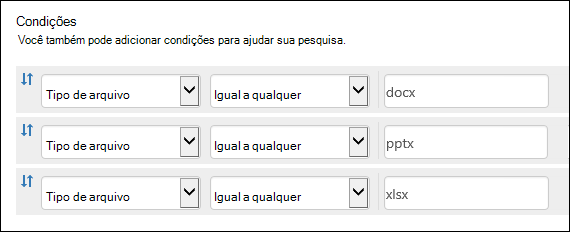

# <a name="keyword-queries-and-search-conditions-for-content-search-and-ediscovery"></a><span data-ttu-id="e9dc5-103">Consultas de palavra-chave e condições de pesquisa para Pesquisa e Descoberta De Conteúdo</span><span class="sxs-lookup"><span data-stu-id="e9dc5-103">Keyword queries and search conditions for Content Search and eDiscovery</span></span>

<span data-ttu-id="e9dc5-104">Este tópico descreve as propriedades de email e documento que você pode pesquisar em itens de email no Exchange Online e documentos armazenados em sites do SharePoint e do OneDrive for Business usando o recurso pesquisa de conteúdo no centro de conformidade do Microsoft 365.</span><span class="sxs-lookup"><span data-stu-id="e9dc5-104">This topic describes the email and document properties that you can search for in email items in Exchange Online and documents stored on SharePoint and OneDrive for Business sites by using the Content Search feature in the Microsoft 365 compliance center.</span></span> <span data-ttu-id="e9dc5-105">Você também pode usar os cmdlets **\* -ComplianceSearch** no Centro de Conformidade e Segurança & PowerShell para pesquisar essas propriedades.</span><span class="sxs-lookup"><span data-stu-id="e9dc5-105">You can also use the **\*-ComplianceSearch** cmdlets in Security & Compliance Center PowerShell to search for these properties.</span></span> <span data-ttu-id="e9dc5-106">O tópico também descreve:</span><span class="sxs-lookup"><span data-stu-id="e9dc5-106">The topic also describes:</span></span>
  
- <span data-ttu-id="e9dc5-107">Usando operadores de pesquisa booleano, condições de pesquisa e outras técnicas de consulta de pesquisa para refinar seus resultados de pesquisa.</span><span class="sxs-lookup"><span data-stu-id="e9dc5-107">Using Boolean search operators, search conditions, and other search query techniques to refine your search results.</span></span>

- <span data-ttu-id="e9dc5-108">Procurando tipos de dados confidenciais e tipos de dados confidenciais personalizados no SharePoint e no OneDrive for Business.</span><span class="sxs-lookup"><span data-stu-id="e9dc5-108">Searching for sensitive data types and custom sensitive data types in SharePoint and OneDrive for Business.</span></span>

- <span data-ttu-id="e9dc5-109">Procurando conteúdo de site compartilhado com usuários fora da sua organização</span><span class="sxs-lookup"><span data-stu-id="e9dc5-109">Searching for site content that's shared with users outside of your organization</span></span>

<span data-ttu-id="e9dc5-110">Para obter instruções passo a passo sobre como criar uma Pesquisa de Conteúdo, consulte [Pesquisa de Conteúdo](content-search.md).</span><span class="sxs-lookup"><span data-stu-id="e9dc5-110">For step-by-step instructions on how to create a Content Search, see [Content Search](content-search.md).</span></span>

> [!NOTE]
> <span data-ttu-id="e9dc5-111">Pesquisa de conteúdo no centro de conformidade do Microsoft 365 e os cmdlets **\* -ComplianceSearch** correspondente & s no Centro de Conformidade e Segurança do PowerShell usam a Linguagem de Consulta de Palavra-chave (KQL).</span><span class="sxs-lookup"><span data-stu-id="e9dc5-111">Content Search in the Microsoft 365 compliance center and the corresponding **\*-ComplianceSearch** cmdlets in Security & Compliance Center PowerShell use the Keyword Query Language (KQL).</span></span> <span data-ttu-id="e9dc5-112">Para obter informações mais detalhadas, consulte [Keyword Query Language sintaxe reference](/sharepoint/dev/general-development/keyword-query-language-kql-syntax-reference).</span><span class="sxs-lookup"><span data-stu-id="e9dc5-112">For more detailed information, see [Keyword Query Language syntax reference](/sharepoint/dev/general-development/keyword-query-language-kql-syntax-reference).</span></span> 
  
## <a name="searchable-email-properties"></a><span data-ttu-id="e9dc5-113">Propriedades de emails pesquisáveis</span><span class="sxs-lookup"><span data-stu-id="e9dc5-113">Searchable email properties</span></span>

<span data-ttu-id="e9dc5-114">A tabela a seguir lista as propriedades de mensagem de email que podem ser pesquisadas usando o recurso Pesquisa de Conteúdo no centro de conformidade do Microsoft 365 ou usando o **New-ComplianceSearch** ou o cmdlet **Set-ComplianceSearch.**</span><span class="sxs-lookup"><span data-stu-id="e9dc5-114">The following table lists email message properties that can be searched by using the Content Search feature in the Microsoft 365 compliance center or by using the **New-ComplianceSearch** or the **Set-ComplianceSearch** cmdlet.</span></span> <span data-ttu-id="e9dc5-115">A tabela inclui um exemplo da sintaxe  _property:value_ para cada propriedade e uma descrição dos resultados da pesquisa retornados pelos exemplos.</span><span class="sxs-lookup"><span data-stu-id="e9dc5-115">The table includes an example of the  _property:value_ syntax for each property and a description of the search results returned by the examples.</span></span> <span data-ttu-id="e9dc5-116">Você pode digitar esses  `property:value` pares na caixa palavras-chave de uma Pesquisa de Conteúdo.</span><span class="sxs-lookup"><span data-stu-id="e9dc5-116">You can type these  `property:value` pairs in the keywords box for a Content Search.</span></span> 

> [!NOTE]
> <span data-ttu-id="e9dc5-117">Ao pesquisar propriedades de email, não é possível pesquisar itens nos quais a propriedade especificada está vazia ou em branco.</span><span class="sxs-lookup"><span data-stu-id="e9dc5-117">When searching email properties, it's not possible to search for items in which the specified property is empty or blank.</span></span> <span data-ttu-id="e9dc5-118">Por exemplo, usar o par *property:value* de **subject:""** para pesquisar mensagens de email com uma linha de assunto vazia retornará zero resultados.</span><span class="sxs-lookup"><span data-stu-id="e9dc5-118">For example, using the *property:value* pair of **subject:""** to search for email messages with an empty subject line will return zero results.</span></span> <span data-ttu-id="e9dc5-119">Isso também se aplica ao pesquisar propriedades de site e contato.</span><span class="sxs-lookup"><span data-stu-id="e9dc5-119">This also applies when searching site and contact properties.</span></span>
  
| <span data-ttu-id="e9dc5-120">Propriedade</span><span class="sxs-lookup"><span data-stu-id="e9dc5-120">Property</span></span> | <span data-ttu-id="e9dc5-121">Descrição da propriedade</span><span class="sxs-lookup"><span data-stu-id="e9dc5-121">Property description</span></span> | <span data-ttu-id="e9dc5-122">Exemplos</span><span class="sxs-lookup"><span data-stu-id="e9dc5-122">Examples</span></span> | <span data-ttu-id="e9dc5-123">Resultados de pesquisa retornados pelos exemplos</span><span class="sxs-lookup"><span data-stu-id="e9dc5-123">Search results returned by the examples</span></span> |
|:-----|:-----|:-----|:-----|
|<span data-ttu-id="e9dc5-124">AttachmentNames</span><span class="sxs-lookup"><span data-stu-id="e9dc5-124">AttachmentNames</span></span>|<span data-ttu-id="e9dc5-125">Os nomes dos arquivos anexados a uma mensagem de email.</span><span class="sxs-lookup"><span data-stu-id="e9dc5-125">The names of files attached to an email message.</span></span>|`attachmentnames:annualreport.ppt`  <br/> `attachmentnames:annual*` <br/> `attachmentnames:.pptx` |<span data-ttu-id="e9dc5-126">Mensagens que têm um arquivo anexado chamado relatórioanual.ppt.</span><span class="sxs-lookup"><span data-stu-id="e9dc5-126">Messages that have an attached file named annualreport.ppt.</span></span> <span data-ttu-id="e9dc5-127">No segundo exemplo, o uso do caractere curinga retorna mensagens com a palavra "anual" no nome de arquivo de um anexo.</span><span class="sxs-lookup"><span data-stu-id="e9dc5-127">In the second example, using the wildcard returns messages with the word "annual" in the file name of an attachment.</span></span> <span data-ttu-id="e9dc5-128">O terceiro exemplo retorna todos os anexos com a extensão de arquivo pptx.</span><span class="sxs-lookup"><span data-stu-id="e9dc5-128">The third example returns all attachments with the pptx file extension.</span></span>|
|<span data-ttu-id="e9dc5-129">Cco</span><span class="sxs-lookup"><span data-stu-id="e9dc5-129">Bcc</span></span>|<span data-ttu-id="e9dc5-130">O campo Cc de uma mensagem de email. <sup>1</sup></span><span class="sxs-lookup"><span data-stu-id="e9dc5-130">The Bcc field of an email message.<sup>1</sup></span></span>|`bcc:pilarp@contoso.com`  <br/> `bcc:pilarp`  <br/> `bcc:"Pilar Pinilla"`|<span data-ttu-id="e9dc5-131">Todos os exemplos retornam mensagens com Brenda Fernandes incluída no campo Cco.</span><span class="sxs-lookup"><span data-stu-id="e9dc5-131">All examples return messages with Pilar Pinilla included in the Bcc field.</span></span>|
|<span data-ttu-id="e9dc5-132">Categoria</span><span class="sxs-lookup"><span data-stu-id="e9dc5-132">Category</span></span>| <span data-ttu-id="e9dc5-133">As categorias a serem pesquisadas.</span><span class="sxs-lookup"><span data-stu-id="e9dc5-133">The categories to search.</span></span> <span data-ttu-id="e9dc5-134">As categorias podem ser definidas pelos usuários usando o Outlook ou o Outlook na Web (anteriormente conhecido como Outlook Web App).</span><span class="sxs-lookup"><span data-stu-id="e9dc5-134">Categories can be defined by users by using Outlook or Outlook on the web (formerly known as Outlook Web App).</span></span> <span data-ttu-id="e9dc5-135">Os valores possíveis são:</span><span class="sxs-lookup"><span data-stu-id="e9dc5-135">The possible values are:</span></span>  <br/><br/>  <span data-ttu-id="e9dc5-136">blue</span><span class="sxs-lookup"><span data-stu-id="e9dc5-136">blue</span></span>  <br/>  <span data-ttu-id="e9dc5-137">verde</span><span class="sxs-lookup"><span data-stu-id="e9dc5-137">green</span></span>  <br/>  <span data-ttu-id="e9dc5-138">laranja</span><span class="sxs-lookup"><span data-stu-id="e9dc5-138">orange</span></span>  <br/>  <span data-ttu-id="e9dc5-139">roxo</span><span class="sxs-lookup"><span data-stu-id="e9dc5-139">purple</span></span>  <br/>  <span data-ttu-id="e9dc5-140">vermelho</span><span class="sxs-lookup"><span data-stu-id="e9dc5-140">red</span></span>  <br/>  <span data-ttu-id="e9dc5-141">amarelo</span><span class="sxs-lookup"><span data-stu-id="e9dc5-141">yellow</span></span>|`category:"Red Category"`|<span data-ttu-id="e9dc5-142">Mensagens que foram atribuídas à categoria vermelho nas caixas de correio de origem. </span><span class="sxs-lookup"><span data-stu-id="e9dc5-142">Messages that have been assigned the red category in the source mailboxes.</span></span>|
|<span data-ttu-id="e9dc5-143">Cc</span><span class="sxs-lookup"><span data-stu-id="e9dc5-143">Cc</span></span>|<span data-ttu-id="e9dc5-144">O campo Cc de uma mensagem de email. <sup>1</sup></span><span class="sxs-lookup"><span data-stu-id="e9dc5-144">The Cc field of an email message.<sup>1</sup></span></span>|`cc:pilarp@contoso.com`  <br/> `cc:"Pilar Pinilla"`|<span data-ttu-id="e9dc5-145">Em ambos os exemplos, as mensagens com Pilar Pinilla especificadas no campo Cc.</span><span class="sxs-lookup"><span data-stu-id="e9dc5-145">In both examples, messages with Pilar Pinilla specified in the Cc field.</span></span>|
|<span data-ttu-id="e9dc5-146">Folderid</span><span class="sxs-lookup"><span data-stu-id="e9dc5-146">Folderid</span></span>|<span data-ttu-id="e9dc5-147">A ID da pasta (GUID) de uma pasta de caixa de correio específica.</span><span class="sxs-lookup"><span data-stu-id="e9dc5-147">The folder ID (GUID) of a specific mailbox folder.</span></span> <span data-ttu-id="e9dc5-148">Se você usar essa propriedade, certifique-se de pesquisar a caixa de correio em que a pasta especificada está localizada.</span><span class="sxs-lookup"><span data-stu-id="e9dc5-148">If you use this property, be sure to search the mailbox that the specified folder is located in.</span></span> <span data-ttu-id="e9dc5-149">Somente a pasta especificada será pesquisada.</span><span class="sxs-lookup"><span data-stu-id="e9dc5-149">Only the specified folder will be searched.</span></span> <span data-ttu-id="e9dc5-150">As subpastas na pasta não serão pesquisadas.</span><span class="sxs-lookup"><span data-stu-id="e9dc5-150">Any subfolders in the folder won't be searched.</span></span> <span data-ttu-id="e9dc5-151">Para pesquisar subpastas, você precisa usar a propriedade Folderid para a subpasta que você deseja pesquisar.</span><span class="sxs-lookup"><span data-stu-id="e9dc5-151">To search subfolders, you need to use the Folderid property for the subfolder you want to search.</span></span>  <br/> <span data-ttu-id="e9dc5-152">Para obter mais informações sobre como pesquisar a propriedade Folderid e usar um script para obter as IDs de pasta para uma caixa de correio específica, consulte [Use Content Search for targeted collections](use-content-search-for-targeted-collections.md).</span><span class="sxs-lookup"><span data-stu-id="e9dc5-152">For more information about searching for the Folderid property and using a script to obtain the folder IDs for a specific mailbox, see [Use Content Search for targeted collections](use-content-search-for-targeted-collections.md).</span></span>|`folderid:4D6DD7F943C29041A65787E30F02AD1F00000000013A0000`  <br/> `folderid:2370FB455F82FC44BE31397F47B632A70000000001160000 AND participants:garthf@contoso.com`|<span data-ttu-id="e9dc5-153">O primeiro exemplo retorna todos os itens na pasta de caixa de correio especificada.</span><span class="sxs-lookup"><span data-stu-id="e9dc5-153">The first example returns all items in the specified mailbox folder.</span></span> <span data-ttu-id="e9dc5-154">O segundo exemplo retorna todos os itens na pasta de caixa de correio especificada que foram enviados ou recebidos por garthf@contoso.com.</span><span class="sxs-lookup"><span data-stu-id="e9dc5-154">The second example returns all items in the specified mailbox folder that were sent or received by garthf@contoso.com.</span></span>|
|<span data-ttu-id="e9dc5-155">From</span><span class="sxs-lookup"><span data-stu-id="e9dc5-155">From</span></span>|<span data-ttu-id="e9dc5-156">O remetente de uma mensagem de email. <sup>1</sup></span><span class="sxs-lookup"><span data-stu-id="e9dc5-156">The sender of an email message.<sup>1</sup></span></span>|`from:pilarp@contoso.com`  <br/> `from:contoso.com`|<span data-ttu-id="e9dc5-157">Mensagens enviadas pelo usuário especificado ou enviadas de um domínio especificado.</span><span class="sxs-lookup"><span data-stu-id="e9dc5-157">Messages sent by the specified user or sent from a specified domain.</span></span>|
|<span data-ttu-id="e9dc5-158">HasAttachment</span><span class="sxs-lookup"><span data-stu-id="e9dc5-158">HasAttachment</span></span>|<span data-ttu-id="e9dc5-159">Indica se uma mensagem tem um anexo.</span><span class="sxs-lookup"><span data-stu-id="e9dc5-159">Indicates whether a message has an attachment.</span></span> <span data-ttu-id="e9dc5-160">Use os valores **true** ou **false**.</span><span class="sxs-lookup"><span data-stu-id="e9dc5-160">Use the values **true** or **false**.</span></span>|`from:pilar@contoso.com AND hasattachment:true`|<span data-ttu-id="e9dc5-161">Mensagens enviadas pelo usuário especificado que têm anexos.</span><span class="sxs-lookup"><span data-stu-id="e9dc5-161">Messages sent by the specified user that have attachments.</span></span>|
|<span data-ttu-id="e9dc5-162">Importance</span><span class="sxs-lookup"><span data-stu-id="e9dc5-162">Importance</span></span>|<span data-ttu-id="e9dc5-p110">A prioridade de uma mensagem de email, que um remetente pode especificar ao enviar uma mensagem. Por padrão, as mensagens são enviadas com prioridade normal, a menos que o remetente defina a prioridade como **alta** ou **baixa**.</span><span class="sxs-lookup"><span data-stu-id="e9dc5-p110">The importance of an email message, which a sender can specify when sending a message. By default, messages are sent with normal importance, unless the sender sets the importance as **high** or **low**.</span></span>|`importance:high`  <br/> `importance:medium`  <br/> `importance:low`|<span data-ttu-id="e9dc5-165">Mensagens marcadas como alta prioridade, prioridade média ou baixa prioridade.</span><span class="sxs-lookup"><span data-stu-id="e9dc5-165">Messages that are marked as high importance, medium importance, or low importance.</span></span>|
|<span data-ttu-id="e9dc5-166">IsRead</span><span class="sxs-lookup"><span data-stu-id="e9dc5-166">IsRead</span></span>|<span data-ttu-id="e9dc5-167">Indica se as mensagens foram lidas.</span><span class="sxs-lookup"><span data-stu-id="e9dc5-167">Indicates whether messages have been read.</span></span> <span data-ttu-id="e9dc5-168">Use os valores **true** ou **false**.</span><span class="sxs-lookup"><span data-stu-id="e9dc5-168">Use the values **true** or **false**.</span></span>|`isread:true`  <br/> `isread:false`|<span data-ttu-id="e9dc5-169">O primeiro exemplo retorna mensagens com a propriedade IsRead definida como **True**.</span><span class="sxs-lookup"><span data-stu-id="e9dc5-169">The first example returns messages with the IsRead property set to **True**.</span></span> <span data-ttu-id="e9dc5-170">O segundo exemplo retorna mensagens com a propriedade IsRead definida como **False**.</span><span class="sxs-lookup"><span data-stu-id="e9dc5-170">The second example returns messages with the IsRead property set to **False**.</span></span>|
|<span data-ttu-id="e9dc5-171">ItemClass</span><span class="sxs-lookup"><span data-stu-id="e9dc5-171">ItemClass</span></span>|<span data-ttu-id="e9dc5-172">Use essa propriedade para pesquisar tipos de dados de terceiros específicos que sua organização importou para o Office 365.</span><span class="sxs-lookup"><span data-stu-id="e9dc5-172">Use this property to search specific third-party data types that your organization imported to Office 365.</span></span> <span data-ttu-id="e9dc5-173">Use a seguinte sintaxe para esta propriedade:  `itemclass:ipm.externaldata.<third-party data type>*`</span><span class="sxs-lookup"><span data-stu-id="e9dc5-173">Use the following syntax for this property:  `itemclass:ipm.externaldata.<third-party data type>*`</span></span>|`itemclass:ipm.externaldata.Facebook* AND subject:contoso`  <br/> `itemclass:ipm.externaldata.Twitter* AND from:"Ann Beebe" AND "Northwind Traders"`|<span data-ttu-id="e9dc5-174">O primeiro exemplo retorna itens do Facebook que contêm a palavra "contoso" na propriedade Subject.</span><span class="sxs-lookup"><span data-stu-id="e9dc5-174">The first example returns Facebook items that contain the word "contoso" in the Subject property.</span></span> <span data-ttu-id="e9dc5-175">O segundo exemplo retorna itens do Twitter que foram postados por Ann Beebe e que contêm a frase de palavra-chave "Northwind Traders".</span><span class="sxs-lookup"><span data-stu-id="e9dc5-175">The second example returns Twitter items that were posted by Ann Beebe and that contain the keyword phrase "Northwind Traders".</span></span>  <br/> <span data-ttu-id="e9dc5-176">Para uma lista completa de valores a ser usado para tipos de dados de terceiros para a propriedade ItemClass, consulte Use Content Search to search third-party data that was imported [to Office 365](use-content-search-to-search-third-party-data-that-was-imported.md).</span><span class="sxs-lookup"><span data-stu-id="e9dc5-176">For a complete list of values to use for third-party data types for the ItemClass property, see [Use Content Search to search third-party data that was imported to Office 365](use-content-search-to-search-third-party-data-that-was-imported.md).</span></span>|
|<span data-ttu-id="e9dc5-177">Tipo</span><span class="sxs-lookup"><span data-stu-id="e9dc5-177">Kind</span></span>| <span data-ttu-id="e9dc5-178">O tipo de mensagem de email a ser pesquisada.</span><span class="sxs-lookup"><span data-stu-id="e9dc5-178">The type of email message to search for.</span></span> <span data-ttu-id="e9dc5-179">Valores possíveis:</span><span class="sxs-lookup"><span data-stu-id="e9dc5-179">Possible values:</span></span>  <br/>  <span data-ttu-id="e9dc5-180">contacts</span><span class="sxs-lookup"><span data-stu-id="e9dc5-180">contacts</span></span>  <br/>  <span data-ttu-id="e9dc5-181">docs</span><span class="sxs-lookup"><span data-stu-id="e9dc5-181">docs</span></span>  <br/>  <span data-ttu-id="e9dc5-182">email</span><span class="sxs-lookup"><span data-stu-id="e9dc5-182">email</span></span>  <br/>  <span data-ttu-id="e9dc5-183">externaldata</span><span class="sxs-lookup"><span data-stu-id="e9dc5-183">externaldata</span></span>  <br/>  <span data-ttu-id="e9dc5-184">faxes</span><span class="sxs-lookup"><span data-stu-id="e9dc5-184">faxes</span></span>  <br/>  <span data-ttu-id="e9dc5-185">im</span><span class="sxs-lookup"><span data-stu-id="e9dc5-185">im</span></span>  <br/>  <span data-ttu-id="e9dc5-186">diários</span><span class="sxs-lookup"><span data-stu-id="e9dc5-186">journals</span></span>  <br/>  <span data-ttu-id="e9dc5-187">meetings</span><span class="sxs-lookup"><span data-stu-id="e9dc5-187">meetings</span></span>  <br/>  <span data-ttu-id="e9dc5-188">microsoftteams (retorna itens de chats, reuniões e chamadas no Microsoft Teams)</span><span class="sxs-lookup"><span data-stu-id="e9dc5-188">microsoftteams (returns items from chats, meetings, and calls in Microsoft Teams)</span></span>  <br/>  <span data-ttu-id="e9dc5-189">notes</span><span class="sxs-lookup"><span data-stu-id="e9dc5-189">notes</span></span>  <br/>  <span data-ttu-id="e9dc5-190">postagens</span><span class="sxs-lookup"><span data-stu-id="e9dc5-190">posts</span></span>  <br/>  <span data-ttu-id="e9dc5-191">rssfeeds</span><span class="sxs-lookup"><span data-stu-id="e9dc5-191">rssfeeds</span></span>  <br/>  <span data-ttu-id="e9dc5-192">tarefas</span><span class="sxs-lookup"><span data-stu-id="e9dc5-192">tasks</span></span>  <br/>  <span data-ttu-id="e9dc5-193">voicemail</span><span class="sxs-lookup"><span data-stu-id="e9dc5-193">voicemail</span></span>|`kind:email`  <br/> `kind:email OR kind:im OR kind:voicemail`  <br/> `kind:externaldata`|<span data-ttu-id="e9dc5-194">O primeiro exemplo retorna mensagens de email que atendem aos critérios de pesquisa.</span><span class="sxs-lookup"><span data-stu-id="e9dc5-194">The first example returns email messages that meet the search criteria.</span></span> <span data-ttu-id="e9dc5-195">O segundo exemplo retorna mensagens de email, conversas de mensagens instantâneas (incluindo conversas e chats do Skype for Business no Microsoft Teams) e mensagens de voz que atendem aos critérios de pesquisa.</span><span class="sxs-lookup"><span data-stu-id="e9dc5-195">The second example returns email messages, instant messaging conversations (including Skype for Business conversations and chats in Microsoft Teams), and voice messages that meet the search criteria.</span></span> <span data-ttu-id="e9dc5-196">O terceiro exemplo retorna itens importados para caixas de correio no Microsoft 365 de fontes de dados de terceiros, como Twitter, Facebook e Cisco Jabber, que atendem aos critérios de pesquisa.</span><span class="sxs-lookup"><span data-stu-id="e9dc5-196">The third example returns items that were imported to mailboxes in Microsoft 365 from third-party data sources, such as Twitter, Facebook, and Cisco Jabber, that meet the search criteria.</span></span> <span data-ttu-id="e9dc5-197">Para obter mais informações, [consulte Arquivando dados de terceiros no Office 365](https://www.microsoft.com/?ref=go).</span><span class="sxs-lookup"><span data-stu-id="e9dc5-197">For more information, see [Archiving third-party data in Office 365](https://www.microsoft.com/?ref=go).</span></span>|
|<span data-ttu-id="e9dc5-198">Participantes</span><span class="sxs-lookup"><span data-stu-id="e9dc5-198">Participants</span></span>|<span data-ttu-id="e9dc5-199">Todos os campos de pessoas em uma mensagem de email.</span><span class="sxs-lookup"><span data-stu-id="e9dc5-199">All the people fields in an email message.</span></span> <span data-ttu-id="e9dc5-200">Esses campos são From, To, Cc e<sup>Cc. 1</sup></span><span class="sxs-lookup"><span data-stu-id="e9dc5-200">These fields are From, To, Cc, and Bcc.<sup>1</sup></span></span>|`participants:garthf@contoso.com`  <br/> `participants:contoso.com`|<span data-ttu-id="e9dc5-p118">Mensagens enviadas por ou para pauloa@contoso.com. O segundo exemplo retorna todas as mensagens enviadas por ou para um usuário no domínio contoso.com.</span><span class="sxs-lookup"><span data-stu-id="e9dc5-p118">Messages sent by or sent to garthf@contoso.com. The second example returns all messages sent by or sent to a user in the contoso.com domain.</span></span>|
|<span data-ttu-id="e9dc5-203">Received</span><span class="sxs-lookup"><span data-stu-id="e9dc5-203">Received</span></span>|<span data-ttu-id="e9dc5-204">A data em que uma mensagem de email foi recebida pelo destinatário.</span><span class="sxs-lookup"><span data-stu-id="e9dc5-204">The date that an email message was received by a recipient.</span></span>|`received:04/15/2016`  <br/> `received>=01/01/2016 AND received<=03/31/2016`|<span data-ttu-id="e9dc5-205">Mensagens recebidas em 15 de abril de 2016.</span><span class="sxs-lookup"><span data-stu-id="e9dc5-205">Messages that were received on April 15, 2016.</span></span> <span data-ttu-id="e9dc5-206">O segundo exemplo retorna todas as mensagens recebidas entre 1º de janeiro de 2016 e 31 de março de 2016.</span><span class="sxs-lookup"><span data-stu-id="e9dc5-206">The second example returns all messages received between January 1, 2016 and March 31, 2016.</span></span>|
|<span data-ttu-id="e9dc5-207">Recipients</span><span class="sxs-lookup"><span data-stu-id="e9dc5-207">Recipients</span></span>|<span data-ttu-id="e9dc5-208">Todos os campos de destinatário em uma mensagem de email.</span><span class="sxs-lookup"><span data-stu-id="e9dc5-208">All recipient fields in an email message.</span></span> <span data-ttu-id="e9dc5-209">Esses campos são To, Cc e<sup>Cc. 1</sup></span><span class="sxs-lookup"><span data-stu-id="e9dc5-209">These fields are To, Cc, and Bcc.<sup>1</sup></span></span>|`recipients:garthf@contoso.com`  <br/> `recipients:contoso.com`|<span data-ttu-id="e9dc5-p121">Mensagens enviadas para pauloa@contoso.com. O segundo exemplo retorna mensagens enviadas para qualquer destinatário no domínio contoso.com.</span><span class="sxs-lookup"><span data-stu-id="e9dc5-p121">Messages sent to garthf@contoso.com. The second example returns messages sent to any recipient in the contoso.com domain.</span></span>|
|<span data-ttu-id="e9dc5-212">Sent</span><span class="sxs-lookup"><span data-stu-id="e9dc5-212">Sent</span></span>|<span data-ttu-id="e9dc5-213">A data em que uma mensagem de email foi enviada pelo remetente.</span><span class="sxs-lookup"><span data-stu-id="e9dc5-213">The date that an email message was sent by the sender.</span></span>|`sent:07/01/2016`  <br/> `sent>=06/01/2016 AND sent<=07/01/2016`|<span data-ttu-id="e9dc5-214">Mensagens que foram enviadas na data especificada ou dentro do intervalo de datas especificado.</span><span class="sxs-lookup"><span data-stu-id="e9dc5-214">Messages that were sent on the specified date or sent within the specified date range.</span></span>|
|<span data-ttu-id="e9dc5-215">Size</span><span class="sxs-lookup"><span data-stu-id="e9dc5-215">Size</span></span>|<span data-ttu-id="e9dc5-216">O tamanho de um item, em bytes.</span><span class="sxs-lookup"><span data-stu-id="e9dc5-216">The size of an item, in bytes.</span></span>|`size>26214400`  <br/> `size:1..1048567`|<span data-ttu-id="e9dc5-217">Mensagens maiores que 25?? MB.</span><span class="sxs-lookup"><span data-stu-id="e9dc5-217">Messages larger than 25??MB.</span></span> <span data-ttu-id="e9dc5-218">O segundo exemplo retorna mensagens de 1 a 1.048.567 bytes (1 MB) de tamanho.</span><span class="sxs-lookup"><span data-stu-id="e9dc5-218">The second example returns messages from 1 through 1,048,567 bytes (1 MB) in size.</span></span>|
|<span data-ttu-id="e9dc5-219">Subject</span><span class="sxs-lookup"><span data-stu-id="e9dc5-219">Subject</span></span>|<span data-ttu-id="e9dc5-220">O texto na linha de assunto de uma mensagem de email.</span><span class="sxs-lookup"><span data-stu-id="e9dc5-220">The text in the subject line of an email message.</span></span>  <br/> <span data-ttu-id="e9dc5-221">**Observação:** Quando você usa a propriedade Subject em uma consulta, a pesquisa retorna todas as mensagens nas quais a linha de assunto contém o texto que você está procurando.</span><span class="sxs-lookup"><span data-stu-id="e9dc5-221">**Note:** When you use the Subject property in a query, the search returns all messages in which the subject line contains the text you're searching for.</span></span> <span data-ttu-id="e9dc5-222">Em outras palavras, a consulta não retorna apenas as mensagens que têm uma combinação exata.</span><span class="sxs-lookup"><span data-stu-id="e9dc5-222">In other words, the query doesn't return only those messages that have an exact match.</span></span> <span data-ttu-id="e9dc5-223">Por exemplo, se você pesquisar , seus resultados incluirão mensagens com o assunto "Finanças Trimestrais  `subject:"Quarterly Financials"` 2018".</span><span class="sxs-lookup"><span data-stu-id="e9dc5-223">For example, if you search for  `subject:"Quarterly Financials"`, your results will include messages with the subject "Quarterly Financials 2018".</span></span>|`subject:"Quarterly Financials"`  <br/> `subject:northwind`|<span data-ttu-id="e9dc5-224">Mensagens que contêm a frase "Finanças Trimestrais" em qualquer lugar no texto da linha de assunto.</span><span class="sxs-lookup"><span data-stu-id="e9dc5-224">Messages that contain the phrase "Quarterly Financials" anywhere in the text of the subject line.</span></span> <span data-ttu-id="e9dc5-225">O segundo exemplo retorna todas as mensagens que contêm a palavra northwind na linha de assunto.</span><span class="sxs-lookup"><span data-stu-id="e9dc5-225">The second example returns all messages that contain the word northwind in the subject line.</span></span>|
|<span data-ttu-id="e9dc5-226">Para</span><span class="sxs-lookup"><span data-stu-id="e9dc5-226">To</span></span>|<span data-ttu-id="e9dc5-227">O campo Para de uma mensagem de email. <sup>1</sup></span><span class="sxs-lookup"><span data-stu-id="e9dc5-227">The To field of an email message.<sup>1</sup></span></span>|`to:annb@contoso.com`  <br/> `to:annb ` <br/> `to:"Ann Beebe"`|<span data-ttu-id="e9dc5-228">Todos os exemplos retornam mensagens em que Clara Barbosa é especificada na linha Para:.</span><span class="sxs-lookup"><span data-stu-id="e9dc5-228">All examples return messages where Ann Beebe is specified in the To: line.</span></span>|
|||||
   
> [!NOTE]
> <span data-ttu-id="e9dc5-229"><sup>1</sup> Para o valor de uma propriedade de destinatário, você pode usar endereço de email (também chamado de nome *principal* do usuário ou UPN), nome de exibição ou alias para especificar um usuário.</span><span class="sxs-lookup"><span data-stu-id="e9dc5-229"><sup>1</sup> For the value of a recipient property, you can use email address (also called *user principal name* or UPN), display name, or alias to specify a user.</span></span> <span data-ttu-id="e9dc5-230">Por exemplo, você pode usar clarab@contoso.com, clarab ou "Clara Barbosa" para especificar o usuário Clara Barbosa.</span><span class="sxs-lookup"><span data-stu-id="e9dc5-230">For example, you can use annb@contoso.com, annb, or "Ann Beebe" to specify the user Ann Beebe.</span></span>

### <a name="recipient-expansion"></a><span data-ttu-id="e9dc5-231">Expansão do destinatário</span><span class="sxs-lookup"><span data-stu-id="e9dc5-231">Recipient expansion</span></span>

<span data-ttu-id="e9dc5-232">Ao pesquisar qualquer uma das propriedades do destinatário (From, To, Cc, Bcc, Participants e Recipients), o Microsoft 365 tenta expandir a identidade de cada usuário pesquisando-os no Azure Active Directory (Azure AD).</span><span class="sxs-lookup"><span data-stu-id="e9dc5-232">When searching any of the recipient properties (From, To, Cc, Bcc, Participants, and Recipients), Microsoft 365 attempts to expand the identity of each user by looking them up in Azure Active Directory (Azure AD).</span></span>  <span data-ttu-id="e9dc5-233">Se o usuário for encontrado no Azure AD, a consulta será expandida para incluir o endereço de email (ou UPN) do usuário, alias, nome de exibição e LegacyExchangeDN.</span><span class="sxs-lookup"><span data-stu-id="e9dc5-233">If the user is found in Azure AD, the query is expanded to include the user's email address (or UPN), alias, display name, and LegacyExchangeDN.</span></span> <span data-ttu-id="e9dc5-234">Por exemplo, uma consulta como `participants:ronnie@contoso.com` expande para `participants:ronnie@contoso.com OR participants:ronnie OR participants:"Ronald Nelson" OR participants:"<LegacyExchangeDN>"` .</span><span class="sxs-lookup"><span data-stu-id="e9dc5-234">For example, a query such as `participants:ronnie@contoso.com` expands to `participants:ronnie@contoso.com OR participants:ronnie OR participants:"Ronald Nelson" OR participants:"<LegacyExchangeDN>"`.</span></span>

<span data-ttu-id="e9dc5-235">Para impedir a expansão do destinatário, adicione um caractere curinga (asterisco) ao final do endereço de email e use um nome de domínio reduzido; por exemplo, `participants:"ronnie@contoso*"` certifique-se de cercar o endereço de email com aspas duplas.</span><span class="sxs-lookup"><span data-stu-id="e9dc5-235">To prevent recipient expansion, add a wild card character (asterisk) to the end of the email address and use a reduced domain name; for example, `participants:"ronnie@contoso*"` Be sure to surround the email address with double quotation marks.</span></span>

<span data-ttu-id="e9dc5-236">No entanto, esteja ciente de que impedir a expansão do destinatário na consulta de pesquisa pode resultar em itens relevantes não sendo retornados nos resultados da pesquisa.</span><span class="sxs-lookup"><span data-stu-id="e9dc5-236">However, be aware that preventing recipient expansion in the search query may result in relevant items not being returned in the search results.</span></span> <span data-ttu-id="e9dc5-237">As mensagens de email no Exchange podem ser salvas com formatos de texto diferentes nos campos do destinatário.</span><span class="sxs-lookup"><span data-stu-id="e9dc5-237">Email messages in Exchange can be saved with different text formats in the recipient fields.</span></span> <span data-ttu-id="e9dc5-238">A expansão do destinatário destina-se a ajudar a atenuar esse fato retornando mensagens que podem conter formatos de texto diferentes.</span><span class="sxs-lookup"><span data-stu-id="e9dc5-238">Recipient expansion is intended to help mitigate this fact by returning messages that may contain different text formats.</span></span> <span data-ttu-id="e9dc5-239">Portanto, impedir a expansão do destinatário pode fazer com que a consulta de pesquisa não retorne todos os itens que podem ser relevantes para sua investigação.</span><span class="sxs-lookup"><span data-stu-id="e9dc5-239">So preventing recipient expansion may result in the search query not returning all items that may be relevant to your investigation.</span></span>

> [!NOTE]
> <span data-ttu-id="e9dc5-240">Se você precisar revisar ou reduzir os itens retornados por uma consulta de pesquisa devido à expansão do destinatário, considere usar a Descoberta Avançada.</span><span class="sxs-lookup"><span data-stu-id="e9dc5-240">If you need to review or reduce the items returned by a search query due to recipient expansion, consider using Advanced eDiscovery.</span></span> <span data-ttu-id="e9dc5-241">Você pode pesquisar por mensagens (aproveitando a expansão do destinatário), adicioná-las a um conjunto de revisão e, em seguida, usar consultas de conjunto de revisão ou filtros para revisar ou restringir os resultados.</span><span class="sxs-lookup"><span data-stu-id="e9dc5-241">You can search for messages (taking advantage of recipient expansion), add them to a review set, and then use review set queries or filters to review or narrow the results.</span></span> <span data-ttu-id="e9dc5-242">Para obter mais informações, consulte [Coletar dados para uma ocorrência e](collecting-data-for-ediscovery.md) Consultar os dados em um conjunto de [revisão](review-set-search.md).</span><span class="sxs-lookup"><span data-stu-id="e9dc5-242">For more information, see [Collect data for a case](collecting-data-for-ediscovery.md) and [Query the data in a review set](review-set-search.md).</span></span>

## <a name="searchable-site-properties"></a><span data-ttu-id="e9dc5-243">Propriedades de sites pesquisáveis</span><span class="sxs-lookup"><span data-stu-id="e9dc5-243">Searchable site properties</span></span>

<span data-ttu-id="e9dc5-244">A tabela a seguir lista algumas das propriedades do SharePoint e do OneDrive for Business que podem ser pesquisadas usando o recurso Pesquisa de Conteúdo no Centro de Conformidade de Segurança & ou usando o **New-ComplianceSearch** ou o cmdlet **Set-ComplianceSearch.**</span><span class="sxs-lookup"><span data-stu-id="e9dc5-244">The following table lists some of the SharePoint and OneDrive for Business properties that can be searched by using the Content Search feature in the Security & Compliance Center or by using the **New-ComplianceSearch** or the **Set-ComplianceSearch** cmdlet.</span></span> <span data-ttu-id="e9dc5-245">A tabela inclui um exemplo da sintaxe  _property:value_ para cada propriedade e uma descrição dos resultados da pesquisa retornados pelos exemplos.</span><span class="sxs-lookup"><span data-stu-id="e9dc5-245">The table includes an example of the  _property:value_ syntax for each property and a description of the search results returned by the examples.</span></span> 
  
<span data-ttu-id="e9dc5-246">Para ver uma lista completa das propriedades do SharePoint que podem ser pesquisadas, consulte [Overview of crawled and managed properties in SharePoint](/SharePoint/technical-reference/crawled-and-managed-properties-overview).</span><span class="sxs-lookup"><span data-stu-id="e9dc5-246">For a complete list of SharePoint properties that can be searched, see [Overview of crawled and managed properties in SharePoint](/SharePoint/technical-reference/crawled-and-managed-properties-overview).</span></span> <span data-ttu-id="e9dc5-247">Propriedades marcadas com **sim** na **coluna Queryable** podem ser pesquisadas.</span><span class="sxs-lookup"><span data-stu-id="e9dc5-247">Properties marked with a **Yes** in the **Queryable** column can be searched.</span></span> 
  
| <span data-ttu-id="e9dc5-248">Propriedade</span><span class="sxs-lookup"><span data-stu-id="e9dc5-248">Property</span></span> | <span data-ttu-id="e9dc5-249">Descrição da propriedade</span><span class="sxs-lookup"><span data-stu-id="e9dc5-249">Property description</span></span> | <span data-ttu-id="e9dc5-250">Exemplo</span><span class="sxs-lookup"><span data-stu-id="e9dc5-250">Example</span></span> | <span data-ttu-id="e9dc5-251">Resultados de pesquisa retornados pelos exemplos</span><span class="sxs-lookup"><span data-stu-id="e9dc5-251">Search results returned by the examples</span></span> |
|:-----|:-----|:-----|:-----|
|<span data-ttu-id="e9dc5-252">Autor</span><span class="sxs-lookup"><span data-stu-id="e9dc5-252">Author</span></span>|<span data-ttu-id="e9dc5-253">O campo de autor de documentos do Office, que persiste se um documento é copiado.</span><span class="sxs-lookup"><span data-stu-id="e9dc5-253">The author field from Office documents, which persists if a document is copied.</span></span> <span data-ttu-id="e9dc5-254">Por exemplo, se um usuário criar um documento e enviá-lo para outra pessoa que o carregue no SharePoint, o documento ainda manterá o autor original.</span><span class="sxs-lookup"><span data-stu-id="e9dc5-254">For example, if a user creates a document and the emails it to someone else who then uploads it to SharePoint, the document will still retain the original author.</span></span> <span data-ttu-id="e9dc5-255">Certifique-se de usar o nome de exibição do usuário para essa propriedade.</span><span class="sxs-lookup"><span data-stu-id="e9dc5-255">Be sure to use the user's display name for this property.</span></span>|`author:"Garth Fort"`|<span data-ttu-id="e9dc5-256">Todos os documentos criados por Paulo Araújo.</span><span class="sxs-lookup"><span data-stu-id="e9dc5-256">All documents that are authored by Garth Fort.</span></span>|
|<span data-ttu-id="e9dc5-257">ContentType</span><span class="sxs-lookup"><span data-stu-id="e9dc5-257">ContentType</span></span>|<span data-ttu-id="e9dc5-258">O tipo de conteúdo do SharePoint de um item, como Item, Documento ou Vídeo.</span><span class="sxs-lookup"><span data-stu-id="e9dc5-258">The SharePoint content type of an item, such as Item, Document, or Video.</span></span>|`contenttype:document`|<span data-ttu-id="e9dc5-259">Todos os documentos seriam ser retornados.</span><span class="sxs-lookup"><span data-stu-id="e9dc5-259">All documents would be returned.</span></span>|
|<span data-ttu-id="e9dc5-260">Criado em</span><span class="sxs-lookup"><span data-stu-id="e9dc5-260">Created</span></span>|<span data-ttu-id="e9dc5-261">A data em que um item foi criado.</span><span class="sxs-lookup"><span data-stu-id="e9dc5-261">The date that an item is created.</span></span>|`created>=06/01/2016`|<span data-ttu-id="e9dc5-262">Todos os itens criados em ou após 1º de junho de 2016.</span><span class="sxs-lookup"><span data-stu-id="e9dc5-262">All items created on or after June 1, 2016.</span></span>|
|<span data-ttu-id="e9dc5-263">CreatedBy</span><span class="sxs-lookup"><span data-stu-id="e9dc5-263">CreatedBy</span></span>|<span data-ttu-id="e9dc5-264">A pessoa que criou ou carregou um item.</span><span class="sxs-lookup"><span data-stu-id="e9dc5-264">The person that created or uploaded an item.</span></span> <span data-ttu-id="e9dc5-265">Certifique-se de usar o nome de exibição do usuário para essa propriedade.</span><span class="sxs-lookup"><span data-stu-id="e9dc5-265">Be sure to use the user's display name for this property.</span></span>|`createdby:"Garth Fort"`|<span data-ttu-id="e9dc5-266">Todos os itens criados ou carregados por Paulo Araújo.</span><span class="sxs-lookup"><span data-stu-id="e9dc5-266">All items created or uploaded by Garth Fort.</span></span>|
|<span data-ttu-id="e9dc5-267">DetectedLanguage</span><span class="sxs-lookup"><span data-stu-id="e9dc5-267">DetectedLanguage</span></span>|<span data-ttu-id="e9dc5-268">O idioma de um item.</span><span class="sxs-lookup"><span data-stu-id="e9dc5-268">The language of an item.</span></span>|`detectedlanguage:english`|<span data-ttu-id="e9dc5-269">Todos os itens em inglês.</span><span class="sxs-lookup"><span data-stu-id="e9dc5-269">All items in English.</span></span>|
|<span data-ttu-id="e9dc5-270">DocumentLink</span><span class="sxs-lookup"><span data-stu-id="e9dc5-270">DocumentLink</span></span>|<span data-ttu-id="e9dc5-271">O caminho (URL) de uma pasta específica em um site do SharePoint ou do OneDrive for Business.</span><span class="sxs-lookup"><span data-stu-id="e9dc5-271">The path (URL) of a specific folder on a SharePoint or OneDrive for Business site.</span></span> <span data-ttu-id="e9dc5-272">Se você usar essa propriedade, certifique-se de pesquisar o site em que a pasta especificada está localizada.</span><span class="sxs-lookup"><span data-stu-id="e9dc5-272">If you use this property, be sure to search the site that the specified folder is located in.</span></span>  <br/> <span data-ttu-id="e9dc5-273">Para retornar itens localizados em subpastas da pasta que você especificar para a propriedade documentlink, você precisa adicionar /à URL da pasta \* especificada; por exemplo,  `documentlink: "https://contoso.sharepoint.com/Shared Documents/*"`</span><span class="sxs-lookup"><span data-stu-id="e9dc5-273">To return items located in subfolders of the folder that you specify for the documentlink property, you have to add /\* to the URL of the specified folder; for example,  `documentlink: "https://contoso.sharepoint.com/Shared Documents/*"`</span></span>  <br/> <br/><span data-ttu-id="e9dc5-274">Para obter mais informações sobre como pesquisar a propriedade documentlink e usar um script para obter as URLs de link de documento para pastas em um site específico, consulte [Use Content Search for targeted collections](use-content-search-for-targeted-collections.md).</span><span class="sxs-lookup"><span data-stu-id="e9dc5-274">For more information about searching for the documentlink property and using a script to obtain the documentlink URLs for folders on a specific site, see [Use Content Search for targeted collections](use-content-search-for-targeted-collections.md).</span></span>|`documentlink:"https://contoso-my.sharepoint.com/personal/garthf_contoso_com/Documents/Private"`  <br/> `documentlink:"https://contoso-my.sharepoint.com/personal/garthf_contoso_com/Documents/Shared with Everyone/*" AND filename:confidential`|<span data-ttu-id="e9dc5-275">O primeiro exemplo retorna todos os itens na pasta do OneDrive for Business especificada.</span><span class="sxs-lookup"><span data-stu-id="e9dc5-275">The first example returns all items in the specified OneDrive for Business folder.</span></span> <span data-ttu-id="e9dc5-276">O segundo exemplo retorna documentos na pasta de site especificada (e todas as subpastas) que contêm a palavra "confidencial" no nome do arquivo.</span><span class="sxs-lookup"><span data-stu-id="e9dc5-276">The second example returns documents in the specified site folder (and all subfolders) that contain the word "confidential" in the file name.</span></span>|
|<span data-ttu-id="e9dc5-277">FileExtension</span><span class="sxs-lookup"><span data-stu-id="e9dc5-277">FileExtension</span></span>|<span data-ttu-id="e9dc5-278">A extensão de um arquivo; por exemplo, docx, um, pptx ou xlsx.</span><span class="sxs-lookup"><span data-stu-id="e9dc5-278">The extension of a file; for example, docx, one, pptx, or xlsx.</span></span>|`fileextension:xlsx`|<span data-ttu-id="e9dc5-279">Todos os arquivos do Excel (Excel 2007 e posterior)</span><span class="sxs-lookup"><span data-stu-id="e9dc5-279">All Excel files (Excel 2007 and later)</span></span>|
|<span data-ttu-id="e9dc5-280">FileName</span><span class="sxs-lookup"><span data-stu-id="e9dc5-280">FileName</span></span>|<span data-ttu-id="e9dc5-281">O nome de um arquivo.</span><span class="sxs-lookup"><span data-stu-id="e9dc5-281">The name of a file.</span></span>|`filename:"marketing plan"`  <br/> `filename:estimate`|<span data-ttu-id="e9dc5-p135">O primeiro exemplo retorna os arquivos com a frase exata "plano de marketing" no título. O segundo exemplo retorna arquivos com a palavra "estimativa" no nome de arquivo.</span><span class="sxs-lookup"><span data-stu-id="e9dc5-p135">The first example returns files with the exact phrase "marketing plan" in the title. The second example returns files with the word "estimate" in the file name.</span></span>|
|<span data-ttu-id="e9dc5-284">LastModifiedTime</span><span class="sxs-lookup"><span data-stu-id="e9dc5-284">LastModifiedTime</span></span>|<span data-ttu-id="e9dc5-285">A data em que um item foi alterado pela última vez.</span><span class="sxs-lookup"><span data-stu-id="e9dc5-285">The date that an item was last changed.</span></span>|`lastmodifiedtime>=05/01/2016`  <br/> `lastmodifiedtime>=05/10/2016 AND lastmodifiedtime<=06/1/2016`|<span data-ttu-id="e9dc5-286">O primeiro exemplo retorna itens que foram alterados em ou após 1º de maio de 2016.</span><span class="sxs-lookup"><span data-stu-id="e9dc5-286">The first example returns items that were changed on or after May 1, 2016.</span></span> <span data-ttu-id="e9dc5-287">O segundo exemplo retorna itens alterados entre 1º de maio de 2016 e 1º de junho de 2016.</span><span class="sxs-lookup"><span data-stu-id="e9dc5-287">The second example returns items changed between May 1, 2016 and June 1, 2016.</span></span>|
|<span data-ttu-id="e9dc5-288">ModifiedBy</span><span class="sxs-lookup"><span data-stu-id="e9dc5-288">ModifiedBy</span></span>|<span data-ttu-id="e9dc5-289">A pessoa que alterou um item pela última vez.</span><span class="sxs-lookup"><span data-stu-id="e9dc5-289">The person who last changed an item.</span></span> <span data-ttu-id="e9dc5-290">Certifique-se de usar o nome de exibição do usuário para essa propriedade.</span><span class="sxs-lookup"><span data-stu-id="e9dc5-290">Be sure to use the user's display name for this property.</span></span>|`modifiedby:"Garth Fort"`|<span data-ttu-id="e9dc5-291">Todos os itens que foram alterados pela última vez por Paulo Araújo.</span><span class="sxs-lookup"><span data-stu-id="e9dc5-291">All items that were last changed by Garth Fort.</span></span>|
|<span data-ttu-id="e9dc5-292">Path</span><span class="sxs-lookup"><span data-stu-id="e9dc5-292">Path</span></span>|<span data-ttu-id="e9dc5-293">O caminho (URL) de um site específico em um site do SharePoint ou do OneDrive for Business.</span><span class="sxs-lookup"><span data-stu-id="e9dc5-293">The path (URL) of a specific site in a SharePoint or OneDrive for Business site.</span></span><br/><br/><span data-ttu-id="e9dc5-294">Para retornar itens apenas do site especificado, você precisa adicionar o trailing ao final da `/` URL; por exemplo, `path: "https://contoso.sharepoint.com/sites/international/"`</span><span class="sxs-lookup"><span data-stu-id="e9dc5-294">To return items only from the specified site, you have to add the trailing `/` to the end of the URL; for example, `path: "https://contoso.sharepoint.com/sites/international/"`</span></span> <br/><br/> <span data-ttu-id="e9dc5-295">Para retornar itens localizados em pastas no site especificado na propriedade path, você precisa adicionar ao final `/*` da URL; por exemplo,  `path: "https://contoso.sharepoint.com/Shared Documents/*"`</span><span class="sxs-lookup"><span data-stu-id="e9dc5-295">To return items located in folders in the site that you specify in the path property, you have to add `/*` to the end of the URL; for example,  `path: "https://contoso.sharepoint.com/Shared Documents/*"`</span></span>  <br/><br/> <span data-ttu-id="e9dc5-296">**Observação:** Usar a propriedade para pesquisar locais do OneDrive não retornará arquivos de mídia, como  `Path` arquivos .png, .tiff ou .wav, nos resultados da pesquisa.</span><span class="sxs-lookup"><span data-stu-id="e9dc5-296">**Note:** Using the  `Path` property to search OneDrive locations won't return media files, such as .png, .tiff, or .wav files, in the search results.</span></span> <span data-ttu-id="e9dc5-297">Use uma propriedade de site diferente em sua consulta de pesquisa para pesquisar arquivos de mídia em pastas do OneDrive.</span><span class="sxs-lookup"><span data-stu-id="e9dc5-297">Use a different site property in your search query to search for media files in OneDrive folders.</span></span> <br/>|`path:"https://contoso-my.sharepoint.com/personal/garthf_contoso_com/"`  <br/> `path:"https://contoso-my.sharepoint.com/personal/garthf_contoso_com/*" AND filename:confidential`|<span data-ttu-id="e9dc5-298">O primeiro exemplo retorna todos os itens no site especificado do OneDrive for Business.</span><span class="sxs-lookup"><span data-stu-id="e9dc5-298">The first example returns all items in the specified OneDrive for Business site.</span></span> <span data-ttu-id="e9dc5-299">O segundo exemplo retorna documentos no site especificado (e pastas no site) que contêm a palavra "confidencial" no nome do arquivo.</span><span class="sxs-lookup"><span data-stu-id="e9dc5-299">The second example returns documents in the specified site (and folders in the site) that contain the word "confidential" in the file name.</span></span>|
|<span data-ttu-id="e9dc5-300">SharedWithUsersOWSUser</span><span class="sxs-lookup"><span data-stu-id="e9dc5-300">SharedWithUsersOWSUser</span></span>|<span data-ttu-id="e9dc5-301">Documentos que foram compartilhados com o usuário  especificado e exibidos na página Compartilhado comigo no site do OneDrive for Business do usuário.</span><span class="sxs-lookup"><span data-stu-id="e9dc5-301">Documents that have been shared with the specified user and displayed on the **Shared with me** page in the user's OneDrive for Business site.</span></span> <span data-ttu-id="e9dc5-302">Esses são documentos que foram explicitamente compartilhados com o usuário especificado por outras pessoas em sua organização.</span><span class="sxs-lookup"><span data-stu-id="e9dc5-302">These are documents that have been explicitly shared with the specified user by other people in your organization.</span></span> <span data-ttu-id="e9dc5-303">Quando você exporta documentos que corresponderem a uma consulta de pesquisa que usa a propriedade SharedWithUsersOWSUser, os documentos são exportados do local de conteúdo original da pessoa que compartilhou o documento com o usuário especificado.</span><span class="sxs-lookup"><span data-stu-id="e9dc5-303">When you export documents that match a search query that uses the SharedWithUsersOWSUser property, the documents are exported from the original content location of the person who shared the document with the specified user.</span></span> <span data-ttu-id="e9dc5-304">Para obter mais informações, consulte [Pesquisar conteúdo de site compartilhado em sua organização.](#searching-for-site-content-shared-within-your-organization)</span><span class="sxs-lookup"><span data-stu-id="e9dc5-304">For more information, see [Searching for site content shared within your organization](#searching-for-site-content-shared-within-your-organization).</span></span>|`sharedwithusersowsuser:garthf`  <br/> `sharedwithusersowsuser:"garthf@contoso.com"`|<span data-ttu-id="e9dc5-305">Ambos os exemplos retornam todos os documentos internos que foram  explicitamente compartilhados com Garth Fort e que aparecem na página Compartilhado comigo na conta do OneDrive for Business do Garth Fort.</span><span class="sxs-lookup"><span data-stu-id="e9dc5-305">Both examples return all internal documents that have been explicitly shared with Garth Fort and that appear on the **Shared with me** page in Garth Fort's OneDrive for Business account.</span></span>|
|<span data-ttu-id="e9dc5-306">Site</span><span class="sxs-lookup"><span data-stu-id="e9dc5-306">Site</span></span>|<span data-ttu-id="e9dc5-307">A URL de um site ou grupo de sites em sua organização.</span><span class="sxs-lookup"><span data-stu-id="e9dc5-307">The URL of a site or group of sites in your organization.</span></span>|`site:"https://contoso-my.sharepoint.com"`  <br/> `site:"https://contoso.sharepoint.com/sites/teams"`|<span data-ttu-id="e9dc5-308">O primeiro exemplo retorna itens dos sites do OneDrive for Business para todos os usuários da organização.</span><span class="sxs-lookup"><span data-stu-id="e9dc5-308">The first example returns items from the OneDrive for Business sites for all users in the organization.</span></span> <span data-ttu-id="e9dc5-309">O segundo exemplo retorna itens de todos os sites de equipe.</span><span class="sxs-lookup"><span data-stu-id="e9dc5-309">The second example returns items from all team sites.</span></span>|
|<span data-ttu-id="e9dc5-310">Size</span><span class="sxs-lookup"><span data-stu-id="e9dc5-310">Size</span></span>|<span data-ttu-id="e9dc5-311">O tamanho de um item, em bytes.</span><span class="sxs-lookup"><span data-stu-id="e9dc5-311">The size of an item, in bytes.</span></span>|`size>=1`  <br/> `size:1..10000`|<span data-ttu-id="e9dc5-p142">O primeiro exemplo retorna itens com mais de 1 byte. O segundo exemplo retorna itens de 1 a 10.000 bytes de tamanho.</span><span class="sxs-lookup"><span data-stu-id="e9dc5-p142">The first example returns items larger than 1 byte. The second example returns items from 1 through 10,000 bytes in size.</span></span>|
|<span data-ttu-id="e9dc5-314">Cargo</span><span class="sxs-lookup"><span data-stu-id="e9dc5-314">Title</span></span>|<span data-ttu-id="e9dc5-315">O título do documento.</span><span class="sxs-lookup"><span data-stu-id="e9dc5-315">The title of the document.</span></span> <span data-ttu-id="e9dc5-316">A propriedade Title são metadados especificados em Microsoft Office documentos.</span><span class="sxs-lookup"><span data-stu-id="e9dc5-316">The Title property is metadata that's specified in Microsoft Office documents.</span></span> <span data-ttu-id="e9dc5-317">É diferente do nome do arquivo do documento.</span><span class="sxs-lookup"><span data-stu-id="e9dc5-317">It's different from the file name of the document.</span></span>|`title:"communication plan"`|<span data-ttu-id="e9dc5-318">Qualquer documento que contém a frase "plano de comunicação" na propriedade de metadados Title de um documento do Office.</span><span class="sxs-lookup"><span data-stu-id="e9dc5-318">Any document that contains the phrase "communication plan" in the Title metadata property of an Office document.</span></span>|
|||||

## <a name="searchable-contact-properties"></a><span data-ttu-id="e9dc5-319">Propriedades de contato pesquisáveis</span><span class="sxs-lookup"><span data-stu-id="e9dc5-319">Searchable contact properties</span></span>

<span data-ttu-id="e9dc5-320">A tabela a seguir lista as propriedades de contato indexadas e que você pode pesquisar usando a Pesquisa de Conteúdo.</span><span class="sxs-lookup"><span data-stu-id="e9dc5-320">The following table lists the contact properties that are indexed and that you can search for using Content Search.</span></span> <span data-ttu-id="e9dc5-321">Essas são as propriedades que estão disponíveis para os usuários configurarem para os contatos (também chamados de contatos pessoais) localizados no livro de endereços pessoal da caixa de correio de um usuário.</span><span class="sxs-lookup"><span data-stu-id="e9dc5-321">These are the properties that are available for users to configure for the contacts (also called personal contacts) that are located in the personal address book of a user's mailbox.</span></span> <span data-ttu-id="e9dc5-322">Para pesquisar contatos, você pode selecionar as caixas de correio para pesquisar e, em seguida, usar uma ou mais propriedades de contato na consulta de palavra-chave.</span><span class="sxs-lookup"><span data-stu-id="e9dc5-322">To search for contacts, you can select the mailboxes to search and then use one or more contact properties in the keyword query.</span></span>
  
> [!TIP]
> <span data-ttu-id="e9dc5-323">Para pesquisar valores que contenham espaços ou caracteres especiais, use aspas duplas (" ") para conter a frase; por exemplo, `businessaddress:"123 Main Street"` .</span><span class="sxs-lookup"><span data-stu-id="e9dc5-323">To search for values that contain spaces or special characters, use double quotation marks ("  ") to contain the phrase; for example, `businessaddress:"123 Main Street"`.</span></span>
  
| <span data-ttu-id="e9dc5-324">Propriedade</span><span class="sxs-lookup"><span data-stu-id="e9dc5-324">Property</span></span> | <span data-ttu-id="e9dc5-325">Descrição da propriedade</span><span class="sxs-lookup"><span data-stu-id="e9dc5-325">Property description</span></span> |
|:-----|:-----|
|<span data-ttu-id="e9dc5-326">BusinessAddress</span><span class="sxs-lookup"><span data-stu-id="e9dc5-326">BusinessAddress</span></span>|<span data-ttu-id="e9dc5-327">O endereço na **propriedade Endereço** Comercial.</span><span class="sxs-lookup"><span data-stu-id="e9dc5-327">The address in the **Business Address** property.</span></span> <span data-ttu-id="e9dc5-328">A propriedade também é chamada de **Endereço de** trabalho na página propriedades de contato.</span><span class="sxs-lookup"><span data-stu-id="e9dc5-328">The property is also called the **Work** address on the contact properties page.</span></span>|
|<span data-ttu-id="e9dc5-329">BusinessPhone</span><span class="sxs-lookup"><span data-stu-id="e9dc5-329">BusinessPhone</span></span>|<span data-ttu-id="e9dc5-330">O número de telefone em qualquer uma das **propriedades de número do Telefone** Comercial.</span><span class="sxs-lookup"><span data-stu-id="e9dc5-330">The phone number in any of the **Business Phone** number properties.</span></span>|
|<span data-ttu-id="e9dc5-331">CompanyName</span><span class="sxs-lookup"><span data-stu-id="e9dc5-331">CompanyName</span></span>|<span data-ttu-id="e9dc5-332">O nome na **propriedade Company.**</span><span class="sxs-lookup"><span data-stu-id="e9dc5-332">The name in the **Company** property.</span></span>|
|<span data-ttu-id="e9dc5-333">Departamento</span><span class="sxs-lookup"><span data-stu-id="e9dc5-333">Department</span></span>|<span data-ttu-id="e9dc5-334">O nome na **propriedade Department.**</span><span class="sxs-lookup"><span data-stu-id="e9dc5-334">The name in the **Department** property.</span></span>|
|<span data-ttu-id="e9dc5-335">DisplayName</span><span class="sxs-lookup"><span data-stu-id="e9dc5-335">DisplayName</span></span>|<span data-ttu-id="e9dc5-336">O nome de exibição do contato.</span><span class="sxs-lookup"><span data-stu-id="e9dc5-336">The display name of the contact.</span></span> <span data-ttu-id="e9dc5-337">Esse é o nome na **propriedade Nome** Completo do contato.</span><span class="sxs-lookup"><span data-stu-id="e9dc5-337">This is the name in the **Full Name** property of the contact.</span></span>|
|<span data-ttu-id="e9dc5-338">EmailAddress</span><span class="sxs-lookup"><span data-stu-id="e9dc5-338">EmailAddress</span></span>|<span data-ttu-id="e9dc5-339">O endereço de qualquer propriedade de endereço de email do contato.</span><span class="sxs-lookup"><span data-stu-id="e9dc5-339">The address for any email address property for the contact.</span></span> <span data-ttu-id="e9dc5-340">Os usuários podem adicionar vários endereços de email para um contato.</span><span class="sxs-lookup"><span data-stu-id="e9dc5-340">Users can add multiple email addresses for a contact.</span></span> <span data-ttu-id="e9dc5-341">Usar essa propriedade retornaria contatos que corresponderiam a qualquer um dos endereços de email do contato.</span><span class="sxs-lookup"><span data-stu-id="e9dc5-341">Using this property would return contacts that match any of the contact's email addresses.</span></span>|
|<span data-ttu-id="e9dc5-342">FileAs</span><span class="sxs-lookup"><span data-stu-id="e9dc5-342">FileAs</span></span>|<span data-ttu-id="e9dc5-343">A **propriedade File como.**</span><span class="sxs-lookup"><span data-stu-id="e9dc5-343">The **File as** property.</span></span> <span data-ttu-id="e9dc5-344">Essa propriedade é usada para especificar como o contato é listado na lista de contatos do usuário.</span><span class="sxs-lookup"><span data-stu-id="e9dc5-344">This property is used to specify how the contact is listed in the user's contact list.</span></span> <span data-ttu-id="e9dc5-345">Por exemplo, um contato pode ser listado como  *FirstName,LastName*  ou  *LastName,FirstName*.</span><span class="sxs-lookup"><span data-stu-id="e9dc5-345">For example, a contact could be listed as  *FirstName,LastName*  or  *LastName,FirstName*.</span></span>|
|<span data-ttu-id="e9dc5-346">GivenName</span><span class="sxs-lookup"><span data-stu-id="e9dc5-346">GivenName</span></span>|<span data-ttu-id="e9dc5-347">O nome na **propriedade First** Name.</span><span class="sxs-lookup"><span data-stu-id="e9dc5-347">The name in the **First Name** property.</span></span>|
|<span data-ttu-id="e9dc5-348">HomeAddress</span><span class="sxs-lookup"><span data-stu-id="e9dc5-348">HomeAddress</span></span>|<span data-ttu-id="e9dc5-349">O endereço em qualquer uma das **propriedades de endereço** residencial.</span><span class="sxs-lookup"><span data-stu-id="e9dc5-349">The address in any of the **Home** address properties.</span></span>|
|<span data-ttu-id="e9dc5-350">HomePhone</span><span class="sxs-lookup"><span data-stu-id="e9dc5-350">HomePhone</span></span>|<span data-ttu-id="e9dc5-351">O número de telefone em qualquer uma das **propriedades de número** de telefone 1.</span><span class="sxs-lookup"><span data-stu-id="e9dc5-351">The phone number in any of the **Home** phone number properties.</span></span>|
|<span data-ttu-id="e9dc5-352">IMAddress</span><span class="sxs-lookup"><span data-stu-id="e9dc5-352">IMAddress</span></span>|<span data-ttu-id="e9dc5-353">A propriedade de endereço de mensagens instantâneas, que normalmente é um endereço de email usado para mensagens instantâneas.</span><span class="sxs-lookup"><span data-stu-id="e9dc5-353">The IM address property, which is typically an email address used for instant messaging.</span></span>|
|<span data-ttu-id="e9dc5-354">MiddleName</span><span class="sxs-lookup"><span data-stu-id="e9dc5-354">MiddleName</span></span>|<span data-ttu-id="e9dc5-355">O nome na **propriedade Nome** do meio.</span><span class="sxs-lookup"><span data-stu-id="e9dc5-355">The name in the **Middle** name property.</span></span>|
|<span data-ttu-id="e9dc5-356">MobilePhone</span><span class="sxs-lookup"><span data-stu-id="e9dc5-356">MobilePhone</span></span>|<span data-ttu-id="e9dc5-357">O número de telefone na **propriedade Número** de telefone celular.</span><span class="sxs-lookup"><span data-stu-id="e9dc5-357">The phone number in the **Mobile** phone number property.</span></span>|
|<span data-ttu-id="e9dc5-358">Nickname</span><span class="sxs-lookup"><span data-stu-id="e9dc5-358">Nickname</span></span>|<span data-ttu-id="e9dc5-359">O nome na propriedade **Nickname.**</span><span class="sxs-lookup"><span data-stu-id="e9dc5-359">The name in the **Nickname** property.</span></span>|
|<span data-ttu-id="e9dc5-360">OfficeLocation</span><span class="sxs-lookup"><span data-stu-id="e9dc5-360">OfficeLocation</span></span>|<span data-ttu-id="e9dc5-361">O valor na **propriedade de local** do Office ou do **Office.**</span><span class="sxs-lookup"><span data-stu-id="e9dc5-361">The value in **Office** or **Office location** property.</span></span>|
|<span data-ttu-id="e9dc5-362">OtherAddress</span><span class="sxs-lookup"><span data-stu-id="e9dc5-362">OtherAddress</span></span>|<span data-ttu-id="e9dc5-363">O valor da **propriedade Other** address.</span><span class="sxs-lookup"><span data-stu-id="e9dc5-363">The value for the **Other** address property.</span></span>|
|<span data-ttu-id="e9dc5-364">Surname</span><span class="sxs-lookup"><span data-stu-id="e9dc5-364">Surname</span></span>|<span data-ttu-id="e9dc5-365">O nome na **propriedade Sobrenome.**</span><span class="sxs-lookup"><span data-stu-id="e9dc5-365">The name in the **Last** name property.</span></span>|
|<span data-ttu-id="e9dc5-366">Cargo</span><span class="sxs-lookup"><span data-stu-id="e9dc5-366">Title</span></span>|<span data-ttu-id="e9dc5-367">O título na propriedade **Job title.**</span><span class="sxs-lookup"><span data-stu-id="e9dc5-367">The title in the **Job title** property.</span></span>|
|||||

## <a name="searchable-sensitive-data-types"></a><span data-ttu-id="e9dc5-368">Tipos de dados confidenciais pesquisáveis</span><span class="sxs-lookup"><span data-stu-id="e9dc5-368">Searchable sensitive data types</span></span>

<span data-ttu-id="e9dc5-369">Você pode usar ferramentas de pesquisa de Descoberta Digital no Centro de conformidade do Microsoft 365 para pesquisar dados confidenciais, como números de cartão de crédito ou números de previdência social, que são armazenados em documentos em sites do SharePoint e do OneDrive for Business.</span><span class="sxs-lookup"><span data-stu-id="e9dc5-369">You can use eDiscovery search tools in the Microsoft 365 compliance center to search for sensitive data, such as credit card numbers or social security numbers, that is stored in documents on SharePoint and OneDrive for Business sites.</span></span> <span data-ttu-id="e9dc5-370">Você pode fazer isso usando a propriedade e o nome (ou ID) de um tipo de informação confidenciais `SensitiveType` em uma consulta de palavra-chave.</span><span class="sxs-lookup"><span data-stu-id="e9dc5-370">You can do this by using the `SensitiveType` property and the name (or ID) of a sensitive information type in a keyword query.</span></span> <span data-ttu-id="e9dc5-371">Por exemplo, a consulta `SensitiveType:"Credit Card Number"` retorna documentos que contêm um número de cartão de crédito.</span><span class="sxs-lookup"><span data-stu-id="e9dc5-371">For example, the query `SensitiveType:"Credit Card Number"` returns documents that contain a credit card number.</span></span> <span data-ttu-id="e9dc5-372">A consulta retorna documentos que contêm um número de seguro  `SensitiveType:"U.S. Social Security Number (SSN)"` social dos EUA.</span><span class="sxs-lookup"><span data-stu-id="e9dc5-372">The query  `SensitiveType:"U.S. Social Security Number (SSN)"` returns documents that contain a U.S. social security number.</span></span>

<span data-ttu-id="e9dc5-373">Para ver uma lista dos tipos de informações confidenciais  que você pode pesquisar, acesse Classificações de dados Tipos de informações confidenciais no centro de conformidade do \>  Microsoft 365.</span><span class="sxs-lookup"><span data-stu-id="e9dc5-373">To see a list of the sensitive information types that you can search for, go to **Data classifications** \> **Sensitive info types** in the Microsoft 365 compliance center.</span></span> <span data-ttu-id="e9dc5-374">Ou você pode usar o cmd & let **Get-DlpSensitiveInformationType** no Centro de Conformidade e Segurança do PowerShell para exibir uma lista de tipos de informações confidenciais.</span><span class="sxs-lookup"><span data-stu-id="e9dc5-374">Or you can use the **Get-DlpSensitiveInformationType** cmdlet in Security & Compliance Center PowerShell to display a list of sensitive information types.</span></span>
  
<span data-ttu-id="e9dc5-375">Para obter mais informações sobre como criar consultas usando `SensitiveType` a propriedade, consulte [Form a query to find sensitive data stored on sites](form-a-query-to-find-sensitive-data-stored-on-sites.md).</span><span class="sxs-lookup"><span data-stu-id="e9dc5-375">For more information about creating queries using the `SensitiveType` property, see [Form a query to find sensitive data stored on sites](form-a-query-to-find-sensitive-data-stored-on-sites.md).</span></span>

### <a name="limitations-for-searching-sensitive-data-types"></a><span data-ttu-id="e9dc5-376">Limitações para pesquisar tipos de dados confidenciais</span><span class="sxs-lookup"><span data-stu-id="e9dc5-376">Limitations for searching sensitive data types</span></span>

- <span data-ttu-id="e9dc5-377">Para pesquisar tipos de informações confidenciais personalizados, você precisa especificar a ID do tipo de informação confidenciais na `SensitiveType` propriedade.</span><span class="sxs-lookup"><span data-stu-id="e9dc5-377">To search for custom sensitive information types, you have to specify the ID of the sensitive information type in the `SensitiveType` property.</span></span> <span data-ttu-id="e9dc5-378">O uso do nome de um tipo de informação confidenciais personalizado (conforme mostrado no exemplo para tipos de informações confidenciais integrados na seção anterior) não retornará nenhum resultado.</span><span class="sxs-lookup"><span data-stu-id="e9dc5-378">Using the name of a custom sensitive information type (as shown in the example for built-in sensitive information types in the previous section) will return no results.</span></span> <span data-ttu-id="e9dc5-379">Use a **coluna Publisher** na página **Tipos** de informações confidenciais no centro de conformidade (ou a propriedade **Publisher** no PowerShell) para diferenciar entre tipos de informações confidenciais integrados e personalizados.</span><span class="sxs-lookup"><span data-stu-id="e9dc5-379">Use the **Publisher** column on the **Sensitive info types** page in the compliance center (or the **Publisher** property in PowerShell) to differentiate between built-in and custom sensitive information types.</span></span> <span data-ttu-id="e9dc5-380">Tipos de dados confidenciais integrados têm um valor para a `Microsoft Corporation` **propriedade Publisher.**</span><span class="sxs-lookup"><span data-stu-id="e9dc5-380">Built-in sensitive data types have a value of `Microsoft Corporation` for the **Publisher** property.</span></span>

  <span data-ttu-id="e9dc5-381">Para exibir o nome e a ID dos tipos de dados confidenciais personalizados em sua organização &, execute o seguinte comando no Centro de Conformidade e Segurança do PowerShell:</span><span class="sxs-lookup"><span data-stu-id="e9dc5-381">To display the name and ID for the custom sensitive data types in your organization, run the following command in Security & Compliance Center PowerShell:</span></span>

  ```powershell
  Get-DlpSensitiveInformationType | Where-Object {$_.Publisher -ne "Microsoft Corporation"} | FT Name,Id
  ```

  <span data-ttu-id="e9dc5-382">Em seguida, você pode usar a ID na propriedade de pesquisa para retornar documentos `SensitiveType` que contenham o tipo de dados confidenciais personalizado; por exemplo, `SensitiveType:7e13277e-6b04-3b68-94ed-1aeb9d47de37`</span><span class="sxs-lookup"><span data-stu-id="e9dc5-382">Then you can use the ID in the `SensitiveType` search property to return documents that contain the custom sensitive data type; for example, `SensitiveType:7e13277e-6b04-3b68-94ed-1aeb9d47de37`</span></span>
  
- <span data-ttu-id="e9dc5-383">Você não pode usar tipos de informações confidenciais e a propriedade de pesquisa para pesquisar dados confidenciais em repouso `SensitiveType` nas caixas de correio do Exchange Online.</span><span class="sxs-lookup"><span data-stu-id="e9dc5-383">You can't use sensitive information types and the `SensitiveType` search property to search for sensitive data at-rest in Exchange Online mailboxes.</span></span> <span data-ttu-id="e9dc5-384">Isso inclui mensagens de chat 1:1, mensagens de chat de grupo 1:N e conversas de canal de equipe nas equipes da Microsoft porque todo esse conteúdo é armazenado em caixas de correio.</span><span class="sxs-lookup"><span data-stu-id="e9dc5-384">This includes 1:1 chat messages, 1:N group chat messages, and team channel conversations in Microsoft teams because all of this content is stored in mailboxes.</span></span> <span data-ttu-id="e9dc5-385">No entanto, você pode usar políticas de prevenção contra perda de dados (DLP) para proteger dados de email confidenciais em trânsito.</span><span class="sxs-lookup"><span data-stu-id="e9dc5-385">However, you can use data loss prevention (DLP) policies to protect sensitive email data in transit.</span></span> <span data-ttu-id="e9dc5-386">Para obter mais informações, consulte [Overview of data loss prevention policies](data-loss-prevention-policies.md) and Search for and find personal [data](/compliance/regulatory/gdpr).</span><span class="sxs-lookup"><span data-stu-id="e9dc5-386">For more information, see [Overview of data loss prevention policies](data-loss-prevention-policies.md) and [Search for and find personal data](/compliance/regulatory/gdpr).</span></span>
  
## <a name="search-operators"></a><span data-ttu-id="e9dc5-387">Operadores de pesquisa</span><span class="sxs-lookup"><span data-stu-id="e9dc5-387">Search operators</span></span>

<span data-ttu-id="e9dc5-388">Operadores de pesquisa booleano, como **AND**, **OR** e **NOT,** ajudam você a definir pesquisas mais precisas incluindo ou excluindo palavras específicas na consulta de pesquisa.</span><span class="sxs-lookup"><span data-stu-id="e9dc5-388">Boolean search operators, such as **AND**, **OR**, and **NOT**, help you define more-precise searches by including or excluding specific words in the search query.</span></span> <span data-ttu-id="e9dc5-389">Outras técnicas, como o uso de operadores de propriedades (como `>=` ou ), aspas, `..` parênteses e curingas, ajudam a refinar uma consulta de pesquisa.</span><span class="sxs-lookup"><span data-stu-id="e9dc5-389">Other techniques, such as using property operators (such as `>=` or `..`), quotation marks, parentheses, and wildcards, help you refine a search query.</span></span> <span data-ttu-id="e9dc5-390">A tabela a seguir lista os operadores que você pode usar para restringir ou ampliar os resultados de pesquisa.</span><span class="sxs-lookup"><span data-stu-id="e9dc5-390">The following table lists the operators that you can use to narrow or broaden search results.</span></span> 
  
| <span data-ttu-id="e9dc5-391">Operador</span><span class="sxs-lookup"><span data-stu-id="e9dc5-391">Operator</span></span> | <span data-ttu-id="e9dc5-392">Uso</span><span class="sxs-lookup"><span data-stu-id="e9dc5-392">Usage</span></span> | <span data-ttu-id="e9dc5-393">Descrição</span><span class="sxs-lookup"><span data-stu-id="e9dc5-393">Description</span></span> |
|:-----|:-----|:-----|
|<span data-ttu-id="e9dc5-394">E</span><span class="sxs-lookup"><span data-stu-id="e9dc5-394">AND</span></span>|<span data-ttu-id="e9dc5-395">palavra-chave1 AND palavra-chave2</span><span class="sxs-lookup"><span data-stu-id="e9dc5-395">keyword1 AND keyword2</span></span>|<span data-ttu-id="e9dc5-396">Retorna itens que incluem todas as palavras-chave ou  `property:value` expressões especificadas.</span><span class="sxs-lookup"><span data-stu-id="e9dc5-396">Returns items that include all of the specified keywords or  `property:value` expressions.</span></span> <span data-ttu-id="e9dc5-397">Por exemplo,  `from:"Ann Beebe" AND subject:northwind` retornaria todas as mensagens enviadas por Ann Beebe que continham a palavra northwind na linha de assunto.</span><span class="sxs-lookup"><span data-stu-id="e9dc5-397">For example,  `from:"Ann Beebe" AND subject:northwind` would return all messages sent by Ann Beebe that contained the word northwind in the subject line.</span></span> <span data-ttu-id="e9dc5-398"><sup>2</sup></span><span class="sxs-lookup"><span data-stu-id="e9dc5-398"><sup>2</sup></span></span>|
|+|<span data-ttu-id="e9dc5-399">keyword1 + keyword2 + keyword3</span><span class="sxs-lookup"><span data-stu-id="e9dc5-399">keyword1 + keyword2 + keyword3</span></span>|<span data-ttu-id="e9dc5-400">Retorna itens que *contêm ou* `keyword2` `keyword3` *que* também contêm `keyword1` .  </span><span class="sxs-lookup"><span data-stu-id="e9dc5-400">Returns items that contain  *either*  `keyword2` or  `keyword3` *and*  that also contain  `keyword1`.</span></span> <span data-ttu-id="e9dc5-401">Portanto, este exemplo é equivalente à consulta  `(keyword2 OR keyword3) AND keyword1` .</span><span class="sxs-lookup"><span data-stu-id="e9dc5-401">Therefore, this example is equivalent to the query  `(keyword2 OR keyword3) AND keyword1`.</span></span>  <br/> <span data-ttu-id="e9dc5-402">A consulta `keyword1 + keyword2` (com um espaço após o símbolo) não é a **+** mesma que usar o **operador AND.**</span><span class="sxs-lookup"><span data-stu-id="e9dc5-402">The query  `keyword1 + keyword2` (with a space after the **+** symbol) isn't the same as using the **AND** operator.</span></span> <span data-ttu-id="e9dc5-403">Essa consulta seria equivalente a e  `"keyword1 + keyword2"` retornaria itens com a fase exata  `"keyword1 + keyword2"` .</span><span class="sxs-lookup"><span data-stu-id="e9dc5-403">This query would be equivalent to  `"keyword1 + keyword2"` and return items with the exact phase  `"keyword1 + keyword2"`.</span></span>|
|<span data-ttu-id="e9dc5-404">OU</span><span class="sxs-lookup"><span data-stu-id="e9dc5-404">OR</span></span>|<span data-ttu-id="e9dc5-405">palavra-chave1 OR palavra-chave2</span><span class="sxs-lookup"><span data-stu-id="e9dc5-405">keyword1 OR keyword2</span></span>|<span data-ttu-id="e9dc5-406">Retorna itens que incluem uma ou mais palavras-chave ou  `property:value` expressões especificadas.</span><span class="sxs-lookup"><span data-stu-id="e9dc5-406">Returns items that include one or more of the specified keywords or  `property:value` expressions.</span></span> <span data-ttu-id="e9dc5-407"><sup>2</sup></span><span class="sxs-lookup"><span data-stu-id="e9dc5-407"><sup>2</sup></span></span>|
|<span data-ttu-id="e9dc5-408">NÃO</span><span class="sxs-lookup"><span data-stu-id="e9dc5-408">NOT</span></span>|<span data-ttu-id="e9dc5-409">palavra-chave1 NOT palavra-chave2</span><span class="sxs-lookup"><span data-stu-id="e9dc5-409">keyword1 NOT keyword2</span></span>  <br/> <span data-ttu-id="e9dc5-410">NOT from:"Clara Barbosa"</span><span class="sxs-lookup"><span data-stu-id="e9dc5-410">NOT from:"Ann Beebe"</span></span>  <br/> <span data-ttu-id="e9dc5-411">NOT kind:im</span><span class="sxs-lookup"><span data-stu-id="e9dc5-411">NOT kind:im</span></span>|<span data-ttu-id="e9dc5-412">Exclui itens especificados por uma palavra-chave ou uma  `property:value` expressão.</span><span class="sxs-lookup"><span data-stu-id="e9dc5-412">Excludes items specified by a keyword or a  `property:value` expression.</span></span> <span data-ttu-id="e9dc5-413">No segundo exemplo, exclui as mensagens enviadas por Ann Beebe.</span><span class="sxs-lookup"><span data-stu-id="e9dc5-413">In the second example excludes messages sent by Ann Beebe.</span></span> <span data-ttu-id="e9dc5-414">O terceiro exemplo exclui qualquer conversa de mensagens instantâneas, como conversas do Skype for Business que são salvas na pasta de caixa de correio Histórico da Conversa.</span><span class="sxs-lookup"><span data-stu-id="e9dc5-414">The third example excludes any instant messaging conversations, such as Skype for Business conversations that are saved to the Conversation History mailbox folder.</span></span> <span data-ttu-id="e9dc5-415"><sup>2</sup></span><span class="sxs-lookup"><span data-stu-id="e9dc5-415"><sup>2</sup></span></span>|
|-|<span data-ttu-id="e9dc5-416">keyword1 -keyword2</span><span class="sxs-lookup"><span data-stu-id="e9dc5-416">keyword1 -keyword2</span></span>|<span data-ttu-id="e9dc5-417">O mesmo que o operador **NOT**.</span><span class="sxs-lookup"><span data-stu-id="e9dc5-417">The same as the **NOT** operator.</span></span> <span data-ttu-id="e9dc5-418">Portanto, essa consulta retorna itens que contêm  `keyword1` e excluiriam itens que contêm  `keyword2` .</span><span class="sxs-lookup"><span data-stu-id="e9dc5-418">So this query returns items that contain  `keyword1` and would exclude items that contain  `keyword2`.</span></span>|
|<span data-ttu-id="e9dc5-419">NEAR</span><span class="sxs-lookup"><span data-stu-id="e9dc5-419">NEAR</span></span>|<span data-ttu-id="e9dc5-420">palavra-chave1 NEAR(n) palavra-chave2</span><span class="sxs-lookup"><span data-stu-id="e9dc5-420">keyword1 NEAR(n) keyword2</span></span>|<span data-ttu-id="e9dc5-421">Retorna itens com palavras que estão próximas umas das outras, em que n é igual ao número de palavras de distância.</span><span class="sxs-lookup"><span data-stu-id="e9dc5-421">Returns items with words that are near each other, where n equals the number of words apart.</span></span> <span data-ttu-id="e9dc5-422">Por exemplo, `best NEAR(5) worst` retorna qualquer item em que a palavra "pior" está dentro de cinco palavras de "melhor".</span><span class="sxs-lookup"><span data-stu-id="e9dc5-422">For example, `best NEAR(5) worst` returns any item where the word "worst" is within five words of "best".</span></span> <span data-ttu-id="e9dc5-423">Se nenhum número for especificado, a distância padrão será de oito palavras.</span><span class="sxs-lookup"><span data-stu-id="e9dc5-423">If no number is specified, the default distance is eight words.</span></span> <span data-ttu-id="e9dc5-424"><sup>2</sup></span><span class="sxs-lookup"><span data-stu-id="e9dc5-424"><sup>2</sup></span></span>|
|<span data-ttu-id="e9dc5-425">:</span><span class="sxs-lookup"><span data-stu-id="e9dc5-425">:</span></span>|<span data-ttu-id="e9dc5-426">property:value</span><span class="sxs-lookup"><span data-stu-id="e9dc5-426">property:value</span></span>|<span data-ttu-id="e9dc5-427">Os dois pontos (:) na sintaxe especifica que o valor da propriedade que está sendo  `property:value` pesquisada contém o valor especificado.</span><span class="sxs-lookup"><span data-stu-id="e9dc5-427">The colon (:) in the  `property:value` syntax specifies that the value of the property being searched for contains the specified value.</span></span> <span data-ttu-id="e9dc5-428">Por exemplo,  `recipients:garthf@contoso.com` retorna qualquer mensagem enviada para garthf@contoso.com.</span><span class="sxs-lookup"><span data-stu-id="e9dc5-428">For example,  `recipients:garthf@contoso.com` returns any message sent to garthf@contoso.com.</span></span>|
|=|<span data-ttu-id="e9dc5-429">property=value</span><span class="sxs-lookup"><span data-stu-id="e9dc5-429">property=value</span></span>|<span data-ttu-id="e9dc5-430">O mesmo que o **operador :.**</span><span class="sxs-lookup"><span data-stu-id="e9dc5-430">The same as the **:** operator.</span></span>|
|\<|<span data-ttu-id="e9dc5-431">valor \< da propriedade</span><span class="sxs-lookup"><span data-stu-id="e9dc5-431">property\<value</span></span>|<span data-ttu-id="e9dc5-432">Indica que a propriedade que está sendo pesquisada é menor do que o valor especificado. </span><span class="sxs-lookup"><span data-stu-id="e9dc5-432">Denotes that the property being searched is less than the specified value.</span></span> <span data-ttu-id="e9dc5-433"><sup>1</sup></span><span class="sxs-lookup"><span data-stu-id="e9dc5-433"><sup>1</sup></span></span>|
|\>|<span data-ttu-id="e9dc5-434">valor \> da propriedade</span><span class="sxs-lookup"><span data-stu-id="e9dc5-434">property\>value</span></span>|<span data-ttu-id="e9dc5-435">Indica que a propriedade que está sendo pesquisada é maior do que o valor especificado. <sup>1</sup></span><span class="sxs-lookup"><span data-stu-id="e9dc5-435">Denotes that the property being searched is greater than the specified value.<sup>1</sup></span></span>|
|\<=|<span data-ttu-id="e9dc5-436">property \< =value</span><span class="sxs-lookup"><span data-stu-id="e9dc5-436">property\<=value</span></span>|<span data-ttu-id="e9dc5-437">Indica que a propriedade que está sendo pesquisada é menor ou igual a um valor específico. <sup>1</sup></span><span class="sxs-lookup"><span data-stu-id="e9dc5-437">Denotes that the property being searched is less than or equal to a specific value.<sup>1</sup></span></span>|
|\>=|<span data-ttu-id="e9dc5-438">property \> =value</span><span class="sxs-lookup"><span data-stu-id="e9dc5-438">property\>=value</span></span>|<span data-ttu-id="e9dc5-439">Indica que a propriedade que está sendo pesquisada é maior ou igual a um valor específico. <sup>1</sup></span><span class="sxs-lookup"><span data-stu-id="e9dc5-439">Denotes that the property being searched is greater than or equal to a specific value.<sup>1</sup></span></span>|
|<span data-ttu-id="e9dc5-440">..</span><span class="sxs-lookup"><span data-stu-id="e9dc5-440">..</span></span>|<span data-ttu-id="e9dc5-441">property:value1.. value2</span><span class="sxs-lookup"><span data-stu-id="e9dc5-441">property:value1..value2</span></span>|<span data-ttu-id="e9dc5-442">Indica que a propriedade que está sendo pesquisada é maior ou igual ao valor1 e menor ou igual ao valor2. <sup>1</sup></span><span class="sxs-lookup"><span data-stu-id="e9dc5-442">Denotes that the property being searched is greater than or equal to value1 and less than or equal to value2.<sup>1</sup></span></span>|
|<span data-ttu-id="e9dc5-443">"  "</span><span class="sxs-lookup"><span data-stu-id="e9dc5-443">"  "</span></span>|<span data-ttu-id="e9dc5-444">"valor justo"</span><span class="sxs-lookup"><span data-stu-id="e9dc5-444">"fair value"</span></span>  <br/> <span data-ttu-id="e9dc5-445">assunto:"Finanças trimestrais"</span><span class="sxs-lookup"><span data-stu-id="e9dc5-445">subject:"Quarterly Financials"</span></span>|<span data-ttu-id="e9dc5-446">Use aspas duplas (" ") para pesquisar uma frase ou termo exato em consultas de palavra-chave  `property:value` e pesquisa.</span><span class="sxs-lookup"><span data-stu-id="e9dc5-446">Use double quotation marks ("  ") to search for an exact phrase or term in keyword and  `property:value` search queries.</span></span>|
|\*|<span data-ttu-id="e9dc5-447">cat\*</span><span class="sxs-lookup"><span data-stu-id="e9dc5-447">cat\*</span></span>  <br/> <span data-ttu-id="e9dc5-448">subject:set\*</span><span class="sxs-lookup"><span data-stu-id="e9dc5-448">subject:set\*</span></span>|<span data-ttu-id="e9dc5-449">As pesquisas de caractere curinga de prefixo (onde o asterisco é colocado no final de uma palavra) corresponderão a zero ou mais caracteres em palavras-chave ou  `property:value` consultas.</span><span class="sxs-lookup"><span data-stu-id="e9dc5-449">Prefix wildcard searches (where the asterisk is placed at the end of a word) match for zero or more characters in keywords or  `property:value` queries.</span></span> <span data-ttu-id="e9dc5-450">Por exemplo, retorna documentos que contêm o conjunto de palavras, a configuração e a configuração (e outras palavras que começam com  `title:set*` "set") no título do documento.</span><span class="sxs-lookup"><span data-stu-id="e9dc5-450">For example,  `title:set*` returns documents that contain the word set, setup, and setting (and other words that start with "set") in the document title.</span></span>  <br/><br/> <span data-ttu-id="e9dc5-451">**Observação:** Você só pode usar pesquisas de caractere curinga de prefixo; por exemplo, **cat _ ou \* *_* set \* *_. Pesquisas de sufixo (_* \* gato** ), pesquisas de infixe (**c \* t**) e pesquisas de substring (**\* gato \***) não são suportadas.</span><span class="sxs-lookup"><span data-stu-id="e9dc5-451">**Note:** You can use only prefix wildcard searches; for example, **cat\**_ or _\* set\**_. Suffix searches (_*\*cat*\* ), infix searches (**c\*t**), and substring searches (**\*cat\***) are not supported.</span></span><br/><br/><span data-ttu-id="e9dc5-452">Além disso, adicionando um ponto ( \.</span><span class="sxs-lookup"><span data-stu-id="e9dc5-452">Also, adding a period ( \.</span></span> <span data-ttu-id="e9dc5-453">) para uma pesquisa de cartão curinga de prefixo alterará os resultados retornados.</span><span class="sxs-lookup"><span data-stu-id="e9dc5-453">) to a prefix wild card search will change the results that are returned.</span></span> <span data-ttu-id="e9dc5-454">Isso porque um ponto é tratado como uma palavra de parada.</span><span class="sxs-lookup"><span data-stu-id="e9dc5-454">That's because a period is treated as a stop word.</span></span> <span data-ttu-id="e9dc5-455">Por exemplo, pesquisar **por gato _ e procurar \* *_* gato. \*** retornará resultados diferentes.</span><span class="sxs-lookup"><span data-stu-id="e9dc5-455">For example, searching for **cat\**_ and searching for _\* cat.\**\* will return different results.</span></span> <span data-ttu-id="e9dc5-456">Recomendamos não usar um ponto em uma pesquisa de cartão curinga de prefixo.</span><span class="sxs-lookup"><span data-stu-id="e9dc5-456">We recommend not using a period in a prefix wild card search.</span></span> |
|<span data-ttu-id="e9dc5-457">(  )</span><span class="sxs-lookup"><span data-stu-id="e9dc5-457">(  )</span></span>|<span data-ttu-id="e9dc5-458"> (justo OR grátis) AND (from:contoso.com)</span><span class="sxs-lookup"><span data-stu-id="e9dc5-458">(fair OR free) AND (from:contoso.com)</span></span>  <br/> <span data-ttu-id="e9dc5-459"> (IPO OR inicial) AND (ação OR títulos)</span><span class="sxs-lookup"><span data-stu-id="e9dc5-459">(IPO OR initial) AND (stock OR shares)</span></span>  <br/> <span data-ttu-id="e9dc5-460"> (finanças trimestrais)</span><span class="sxs-lookup"><span data-stu-id="e9dc5-460">(quarterly financials)</span></span>|<span data-ttu-id="e9dc5-461">Os parênteses agrupam frases booleanas,  `property:value` itens e palavras-chave.</span><span class="sxs-lookup"><span data-stu-id="e9dc5-461">Parentheses group together Boolean phrases,  `property:value` items, and keywords.</span></span> <span data-ttu-id="e9dc5-462">Por exemplo,  `(quarterly financials)` retorna itens que contêm as palavras trimestral e financeiras.</span><span class="sxs-lookup"><span data-stu-id="e9dc5-462">For example,  `(quarterly financials)` returns items that contain the words quarterly and financials.</span></span>|
|||||
   
> [!NOTE]
> <span data-ttu-id="e9dc5-463"><sup>1</sup> Use esse operador para propriedades que tenham valores numéricos ou de data.</span><span class="sxs-lookup"><span data-stu-id="e9dc5-463"><sup>1</sup> Use this operator for properties that have date or numeric values.</span></span><br/> <span data-ttu-id="e9dc5-464"><sup>2 Os</sup> operadores de pesquisa booleano devem estar em maiúsculas; por exemplo, **AND**.</span><span class="sxs-lookup"><span data-stu-id="e9dc5-464"><sup>2</sup> Boolean search operators must be uppercase; for example, **AND**.</span></span> <span data-ttu-id="e9dc5-465">Se você usar um operador minúsculo, como **e**, ele será tratado como uma palavra-chave na consulta de pesquisa.</span><span class="sxs-lookup"><span data-stu-id="e9dc5-465">If you use a lowercase operator, such as **and**, it will be treated as a keyword in the search query.</span></span> 
  
## <a name="search-conditions"></a><span data-ttu-id="e9dc5-466">Condições de pesquisa</span><span class="sxs-lookup"><span data-stu-id="e9dc5-466">Search conditions</span></span>

<span data-ttu-id="e9dc5-467">Você pode adicionar condições a uma consulta de pesquisa para restringir uma pesquisa e retornar um conjunto mais refinado de resultados.</span><span class="sxs-lookup"><span data-stu-id="e9dc5-467">You can add conditions to a search query to narrow a search and return a more refined set of results.</span></span> <span data-ttu-id="e9dc5-468">Cada condição adiciona uma cláusula à consulta de pesquisa KQL que é criada e executada quando você inicia a pesquisa.</span><span class="sxs-lookup"><span data-stu-id="e9dc5-468">Each condition adds a clause to the KQL search query that is created and run when you start the search.</span></span>
  
[<span data-ttu-id="e9dc5-469">Condições para propriedades comuns </span><span class="sxs-lookup"><span data-stu-id="e9dc5-469">Conditions for common properties</span></span>](#conditions-for-common-properties)

[<span data-ttu-id="e9dc5-470">Condições para propriedades de email</span><span class="sxs-lookup"><span data-stu-id="e9dc5-470">Conditions for mail properties</span></span>](#conditions-for-mail-properties)

[<span data-ttu-id="e9dc5-471">Condições para propriedades de documentos</span><span class="sxs-lookup"><span data-stu-id="e9dc5-471">Conditions for document properties</span></span>](#conditions-for-document-properties)

[<span data-ttu-id="e9dc5-472">Operadores usados com condições</span><span class="sxs-lookup"><span data-stu-id="e9dc5-472">Operators used with conditions</span></span>](#operators-used-with-conditions)

[<span data-ttu-id="e9dc5-473">Diretrizes para o uso de condições</span><span class="sxs-lookup"><span data-stu-id="e9dc5-473">Guidelines for using conditions</span></span>](#guidelines-for-using-conditions)

[<span data-ttu-id="e9dc5-474">Exemplos</span><span class="sxs-lookup"><span data-stu-id="e9dc5-474">Examples of using conditions in search queries</span></span>](#examples-of-using-conditions-in-search-queries)
  
### <a name="conditions-for-common-properties"></a><span data-ttu-id="e9dc5-475">Condições para propriedades comuns</span><span class="sxs-lookup"><span data-stu-id="e9dc5-475">Conditions for common properties</span></span>

<span data-ttu-id="e9dc5-476">Crie uma condição usando propriedades comuns ao pesquisar caixas de correio e sites na mesma pesquisa.</span><span class="sxs-lookup"><span data-stu-id="e9dc5-476">Create a condition using common properties when searching mailboxes and sites in the same search.</span></span> <span data-ttu-id="e9dc5-477">A tabela a seguir lista as propriedades disponíveis a ser usadas ao adicionar uma condição.</span><span class="sxs-lookup"><span data-stu-id="e9dc5-477">The following table lists the available properties to use when adding a condition.</span></span>
  
| <span data-ttu-id="e9dc5-478">Condition</span><span class="sxs-lookup"><span data-stu-id="e9dc5-478">Condition</span></span> | <span data-ttu-id="e9dc5-479">Descrição</span><span class="sxs-lookup"><span data-stu-id="e9dc5-479">Description</span></span> |
|:-----|:-----|
|<span data-ttu-id="e9dc5-480">Date</span><span class="sxs-lookup"><span data-stu-id="e9dc5-480">Date</span></span>|<span data-ttu-id="e9dc5-481">Para email, a data em que a mensagem foi recebida por um destinatário ou enviada pelo remetente.</span><span class="sxs-lookup"><span data-stu-id="e9dc5-481">For email, the date a message was received by a recipient or sent by the sender.</span></span> <span data-ttu-id="e9dc5-482">Para documentos, a data em que um documento foi modificado pela última vez.</span><span class="sxs-lookup"><span data-stu-id="e9dc5-482">For documents, the date a document was last modified.</span></span>|
|<span data-ttu-id="e9dc5-483">Remetente/Autor</span><span class="sxs-lookup"><span data-stu-id="e9dc5-483">Sender/Author</span></span>|<span data-ttu-id="e9dc5-484">Para email, a pessoa que enviou uma mensagem.</span><span class="sxs-lookup"><span data-stu-id="e9dc5-484">For email, the person who sent a message.</span></span> <span data-ttu-id="e9dc5-485">Para documentos, a pessoa citada no campo autor de documentos do Office.</span><span class="sxs-lookup"><span data-stu-id="e9dc5-485">For documents, the person cited in the author field from Office documents.</span></span> <span data-ttu-id="e9dc5-486">Você pode digitar mais de um nome, separado por vírgulas.</span><span class="sxs-lookup"><span data-stu-id="e9dc5-486">You can type more than one name, separated by commas.</span></span> <span data-ttu-id="e9dc5-487">Dois ou mais valores são logicamente conectadas pelo operador **OR**.</span><span class="sxs-lookup"><span data-stu-id="e9dc5-487">Two or more values are logically connected by the **OR** operator.</span></span>|
|<span data-ttu-id="e9dc5-488">Tamanho (em bytes)</span><span class="sxs-lookup"><span data-stu-id="e9dc5-488">Size (in bytes)</span></span>|<span data-ttu-id="e9dc5-489">Para emails e documentos, o tamanho do item (em bytes).</span><span class="sxs-lookup"><span data-stu-id="e9dc5-489">For both email and documents, the size of the item (in bytes).</span></span>|
|<span data-ttu-id="e9dc5-490">Assunto/Título</span><span class="sxs-lookup"><span data-stu-id="e9dc5-490">Subject/Title</span></span>|<span data-ttu-id="e9dc5-491">Para email, o texto na linha de assunto de uma mensagem.</span><span class="sxs-lookup"><span data-stu-id="e9dc5-491">For email, the text in the subject line of a message.</span></span> <span data-ttu-id="e9dc5-492">Para documentos, o título do documento.</span><span class="sxs-lookup"><span data-stu-id="e9dc5-492">For documents, the title of the document.</span></span> <span data-ttu-id="e9dc5-493">Conforme explicado anteriormente, a propriedade Title é metadados especificados em Microsoft Office documentos.</span><span class="sxs-lookup"><span data-stu-id="e9dc5-493">As previously explained, the Title property is metadata specified in Microsoft Office documents.</span></span> <span data-ttu-id="e9dc5-494">Você pode digitar o nome de mais de um assunto/título, separado por vírgulas.</span><span class="sxs-lookup"><span data-stu-id="e9dc5-494">You can type the name of more than one subject/title, separated by commas.</span></span> <span data-ttu-id="e9dc5-495">Dois ou mais valores são logicamente conectadas pelo operador **OR**.</span><span class="sxs-lookup"><span data-stu-id="e9dc5-495">Two or more values are logically connected by the **OR** operator.</span></span>|
|<span data-ttu-id="e9dc5-496">Rótulo de conformidade</span><span class="sxs-lookup"><span data-stu-id="e9dc5-496">Compliance label</span></span>|<span data-ttu-id="e9dc5-497">Para emails e documentos, os rótulos de retenção que foram atribuídos a mensagens e documentos automaticamente por políticas de rótulo automático ou rótulos de retenção que foram atribuídos manualmente pelos usuários.</span><span class="sxs-lookup"><span data-stu-id="e9dc5-497">For both email and documents, retention labels that have been assigned to messages and documents automatically by autolabel policies or retention labels that have been manually assigned by users.</span></span> <span data-ttu-id="e9dc5-498">Os rótulos de retenção são usados para classificar emails e documentos para governança de informações e impor regras de retenção com base nas configurações definidas pelo rótulo.</span><span class="sxs-lookup"><span data-stu-id="e9dc5-498">Retention labels are used to classify email and documents for information governance and enforce retention rules based on the settings defined by the label.</span></span> <span data-ttu-id="e9dc5-499">Você pode digitar parte do nome do rótulo de retenção e usar um curinga ou digitar o nome do rótulo completo.</span><span class="sxs-lookup"><span data-stu-id="e9dc5-499">You can type part of the retention label name and use a wildcard or type the complete label name.</span></span> <span data-ttu-id="e9dc5-500">Para obter mais informações sobre rótulos de retenção, [consulte Saiba mais sobre políticas de retenção e rótulos de retenção.](retention.md)</span><span class="sxs-lookup"><span data-stu-id="e9dc5-500">For more information about retention labels, see [Learn about retention policies and retention labels](retention.md).</span></span>|
|||
  
### <a name="conditions-for-mail-properties"></a><span data-ttu-id="e9dc5-501">Condições para propriedades de email</span><span class="sxs-lookup"><span data-stu-id="e9dc5-501">Conditions for mail properties</span></span>

<span data-ttu-id="e9dc5-502">Crie uma condição usando propriedades de email ao pesquisar caixas de correio ou pastas públicas.</span><span class="sxs-lookup"><span data-stu-id="e9dc5-502">Create a condition using mail properties when searching mailboxes or public folders.</span></span> <span data-ttu-id="e9dc5-503">A tabela a seguir lista as propriedades de email que você pode usar para uma condição.</span><span class="sxs-lookup"><span data-stu-id="e9dc5-503">The following table lists the email properties that you can use for a condition.</span></span> <span data-ttu-id="e9dc5-504">Essas propriedades são um subconjunto das propriedades de email descritas anteriormente.</span><span class="sxs-lookup"><span data-stu-id="e9dc5-504">These properties are a subset of the email properties that were previously described.</span></span> <span data-ttu-id="e9dc5-505">Essas descrições são repetidas para sua conveniência.</span><span class="sxs-lookup"><span data-stu-id="e9dc5-505">These descriptions are repeated for your convenience.</span></span>
  
| <span data-ttu-id="e9dc5-506">Condition</span><span class="sxs-lookup"><span data-stu-id="e9dc5-506">Condition</span></span> | <span data-ttu-id="e9dc5-507">Descrição</span><span class="sxs-lookup"><span data-stu-id="e9dc5-507">Description</span></span> |
|:-----|:-----|
|<span data-ttu-id="e9dc5-508">Tipo de mensagem</span><span class="sxs-lookup"><span data-stu-id="e9dc5-508">Message kind</span></span>| <span data-ttu-id="e9dc5-509">Tipo de mensagem para pesquisar.</span><span class="sxs-lookup"><span data-stu-id="e9dc5-509">The message type to search.</span></span> <span data-ttu-id="e9dc5-510">Essa propriedade é igual à propriedade de email Kind.</span><span class="sxs-lookup"><span data-stu-id="e9dc5-510">This is the same property as the Kind email property.</span></span> <span data-ttu-id="e9dc5-511">Valores possíveis:</span><span class="sxs-lookup"><span data-stu-id="e9dc5-511">Possible values:</span></span>  <br/><br/>  <span data-ttu-id="e9dc5-512">contacts</span><span class="sxs-lookup"><span data-stu-id="e9dc5-512">contacts</span></span>  <br/>  <span data-ttu-id="e9dc5-513">docs</span><span class="sxs-lookup"><span data-stu-id="e9dc5-513">docs</span></span>  <br/>  <span data-ttu-id="e9dc5-514">email</span><span class="sxs-lookup"><span data-stu-id="e9dc5-514">email</span></span>  <br/>  <span data-ttu-id="e9dc5-515">externaldata</span><span class="sxs-lookup"><span data-stu-id="e9dc5-515">externaldata</span></span>  <br/>  <span data-ttu-id="e9dc5-516">faxes</span><span class="sxs-lookup"><span data-stu-id="e9dc5-516">faxes</span></span>  <br/>  <span data-ttu-id="e9dc5-517">im</span><span class="sxs-lookup"><span data-stu-id="e9dc5-517">im</span></span>  <br/>  <span data-ttu-id="e9dc5-518">diários</span><span class="sxs-lookup"><span data-stu-id="e9dc5-518">journals</span></span>  <br/>  <span data-ttu-id="e9dc5-519">meetings</span><span class="sxs-lookup"><span data-stu-id="e9dc5-519">meetings</span></span>  <br/>  <span data-ttu-id="e9dc5-520">microsoftteams</span><span class="sxs-lookup"><span data-stu-id="e9dc5-520">microsoftteams</span></span>  <br/>  <span data-ttu-id="e9dc5-521">notes</span><span class="sxs-lookup"><span data-stu-id="e9dc5-521">notes</span></span>  <br/>  <span data-ttu-id="e9dc5-522">postagens</span><span class="sxs-lookup"><span data-stu-id="e9dc5-522">posts</span></span>  <br/>  <span data-ttu-id="e9dc5-523">rssfeeds</span><span class="sxs-lookup"><span data-stu-id="e9dc5-523">rssfeeds</span></span>  <br/>  <span data-ttu-id="e9dc5-524">tarefas</span><span class="sxs-lookup"><span data-stu-id="e9dc5-524">tasks</span></span>  <br/>  <span data-ttu-id="e9dc5-525">voicemail</span><span class="sxs-lookup"><span data-stu-id="e9dc5-525">voicemail</span></span>|
|<span data-ttu-id="e9dc5-526">Participantes</span><span class="sxs-lookup"><span data-stu-id="e9dc5-526">Participants</span></span>|<span data-ttu-id="e9dc5-527">Todos os campos de pessoas em uma mensagem de email.</span><span class="sxs-lookup"><span data-stu-id="e9dc5-527">All the people fields in an email message.</span></span> <span data-ttu-id="e9dc5-528">Esses campos são From, To, Cc e Cc.</span><span class="sxs-lookup"><span data-stu-id="e9dc5-528">These fields are From, To, Cc, and Bcc.</span></span>|
|<span data-ttu-id="e9dc5-529">Tipo</span><span class="sxs-lookup"><span data-stu-id="e9dc5-529">Type</span></span>|<span data-ttu-id="e9dc5-530">A propriedade de classe de mensagem para um item de email.</span><span class="sxs-lookup"><span data-stu-id="e9dc5-530">The message class property for an email item.</span></span> <span data-ttu-id="e9dc5-531">Essa é a mesma propriedade que a propriedade de email ItemClass.</span><span class="sxs-lookup"><span data-stu-id="e9dc5-531">This is the same property as the ItemClass email property.</span></span> <span data-ttu-id="e9dc5-532">Também é uma condição de vários valores.</span><span class="sxs-lookup"><span data-stu-id="e9dc5-532">It's also a multi-value condition.</span></span> <span data-ttu-id="e9dc5-533">Portanto, para selecionar várias classes de mensagem, segure a tecla **CTRL** e clique em duas ou mais classes de mensagem na lista suspensa que você deseja adicionar à condição.</span><span class="sxs-lookup"><span data-stu-id="e9dc5-533">So to select multiple message classes, hold the **CTRL** key and then click two or more message classes in the drop-down list that you want to add to the condition.</span></span> <span data-ttu-id="e9dc5-534">Cada classe de mensagem selecionada na lista será conectada logicamente pelo operador **OR** na consulta de pesquisa correspondente.</span><span class="sxs-lookup"><span data-stu-id="e9dc5-534">Each message class that you select in the list will be logically connected by the **OR** operator in the corresponding search query.</span></span>  <br/> <span data-ttu-id="e9dc5-535">Para uma lista das classes de mensagem (e sua ID da classe de  mensagem correspondente) que são usadas pelo Exchange e que você pode selecionar na lista de classe Mensagem, consulte Tipos de Item e Classes de [Mensagem](/office/vba/outlook/Concepts/Forms/item-types-and-message-classes).</span><span class="sxs-lookup"><span data-stu-id="e9dc5-535">For a list of the message classes (and their corresponding message class ID) that are used by Exchange and that you can select in the **Message class** list, see [Item Types and Message Classes](/office/vba/outlook/Concepts/Forms/item-types-and-message-classes).</span></span>|
|<span data-ttu-id="e9dc5-536">Received</span><span class="sxs-lookup"><span data-stu-id="e9dc5-536">Received</span></span>|<span data-ttu-id="e9dc5-537">A data em que uma mensagem de email foi recebida pelo destinatário.</span><span class="sxs-lookup"><span data-stu-id="e9dc5-537">The date that an email message was received by a recipient.</span></span> <span data-ttu-id="e9dc5-538">Essa propriedade é igual à propriedade de email Received.</span><span class="sxs-lookup"><span data-stu-id="e9dc5-538">This is the same property as the Received email property.</span></span>|
|<span data-ttu-id="e9dc5-539">Recipients</span><span class="sxs-lookup"><span data-stu-id="e9dc5-539">Recipients</span></span>|<span data-ttu-id="e9dc5-540">Todos os campos de destinatário em uma mensagem de email.</span><span class="sxs-lookup"><span data-stu-id="e9dc5-540">All recipient fields in an email message.</span></span> <span data-ttu-id="e9dc5-541">Esses campos são To, Cc e Cc.</span><span class="sxs-lookup"><span data-stu-id="e9dc5-541">These fields are To, Cc, and Bcc.</span></span>|
|<span data-ttu-id="e9dc5-542">Remetente</span><span class="sxs-lookup"><span data-stu-id="e9dc5-542">Sender</span></span>|<span data-ttu-id="e9dc5-543">O remetente de uma mensagem de email.</span><span class="sxs-lookup"><span data-stu-id="e9dc5-543">The sender of an email message.</span></span>|
|<span data-ttu-id="e9dc5-544">Sent</span><span class="sxs-lookup"><span data-stu-id="e9dc5-544">Sent</span></span>|<span data-ttu-id="e9dc5-545">A data em que uma mensagem de email foi enviada pelo remetente.</span><span class="sxs-lookup"><span data-stu-id="e9dc5-545">The date that an email message was sent by the sender.</span></span> <span data-ttu-id="e9dc5-546">Essa propriedade é igual à propriedade de email Sent.</span><span class="sxs-lookup"><span data-stu-id="e9dc5-546">This is the same property as the Sent email property.</span></span>|
|<span data-ttu-id="e9dc5-547">Subject</span><span class="sxs-lookup"><span data-stu-id="e9dc5-547">Subject</span></span>|<span data-ttu-id="e9dc5-548">O texto na linha de assunto de uma mensagem de email.</span><span class="sxs-lookup"><span data-stu-id="e9dc5-548">The text in the subject line of an email message.</span></span>|
|<span data-ttu-id="e9dc5-549">Para</span><span class="sxs-lookup"><span data-stu-id="e9dc5-549">To</span></span>|<span data-ttu-id="e9dc5-550">O destinatário de uma mensagem de email no campo Para.</span><span class="sxs-lookup"><span data-stu-id="e9dc5-550">The recipient of an email message in the To field.</span></span>|
|||
  
### <a name="conditions-for-document-properties"></a><span data-ttu-id="e9dc5-551">Condições para propriedades de documentos</span><span class="sxs-lookup"><span data-stu-id="e9dc5-551">Conditions for document properties</span></span>

<span data-ttu-id="e9dc5-552">Crie uma condição usando propriedades de documento ao pesquisar documentos em sites do SharePoint e do OneDrive for Business.</span><span class="sxs-lookup"><span data-stu-id="e9dc5-552">Create a condition using document properties when searching for documents on SharePoint and OneDrive for Business sites.</span></span> <span data-ttu-id="e9dc5-553">A tabela a seguir lista as propriedades do documento que você pode usar para uma condição.</span><span class="sxs-lookup"><span data-stu-id="e9dc5-553">The following table lists the document properties that you can use for a condition.</span></span> <span data-ttu-id="e9dc5-554">Essas propriedades são um subconjunto das propriedades do site que foram descritas anteriormente.</span><span class="sxs-lookup"><span data-stu-id="e9dc5-554">These properties are a subset of the site properties that were previously described.</span></span> <span data-ttu-id="e9dc5-555">Essas descrições são repetidas para sua conveniência.</span><span class="sxs-lookup"><span data-stu-id="e9dc5-555">These descriptions are repeated for your convenience.</span></span>
  
| <span data-ttu-id="e9dc5-556">Condition</span><span class="sxs-lookup"><span data-stu-id="e9dc5-556">Condition</span></span> | <span data-ttu-id="e9dc5-557">Descrição</span><span class="sxs-lookup"><span data-stu-id="e9dc5-557">Description</span></span> |
|:-----|:-----|
|<span data-ttu-id="e9dc5-558">Autor</span><span class="sxs-lookup"><span data-stu-id="e9dc5-558">Author</span></span>|<span data-ttu-id="e9dc5-559">O campo de autor de documentos do Office, que persiste se um documento é copiado.</span><span class="sxs-lookup"><span data-stu-id="e9dc5-559">The author field from Office documents, which persists if a document is copied.</span></span> <span data-ttu-id="e9dc5-560">Por exemplo, se um usuário criar um documento e enviá-lo para outra pessoa que o carregue no SharePoint, o documento ainda manterá o autor original.</span><span class="sxs-lookup"><span data-stu-id="e9dc5-560">For example, if a user creates a document and the emails it to someone else who then uploads it to SharePoint, the document will still retain the original author.</span></span>|
|<span data-ttu-id="e9dc5-561">Cargo</span><span class="sxs-lookup"><span data-stu-id="e9dc5-561">Title</span></span>|<span data-ttu-id="e9dc5-562">O título do documento.</span><span class="sxs-lookup"><span data-stu-id="e9dc5-562">The title of the document.</span></span> <span data-ttu-id="e9dc5-563">A propriedade Title consiste em metadados que são especificados em documentos do Office.</span><span class="sxs-lookup"><span data-stu-id="e9dc5-563">The Title property is metadata that's specified in Office documents.</span></span> <span data-ttu-id="e9dc5-564">É diferente do nome do arquivo do documento.</span><span class="sxs-lookup"><span data-stu-id="e9dc5-564">It's different than the file name of the document.</span></span>|
|<span data-ttu-id="e9dc5-565">Criado em</span><span class="sxs-lookup"><span data-stu-id="e9dc5-565">Created</span></span>|<span data-ttu-id="e9dc5-566">A data em que um documento foi criado.</span><span class="sxs-lookup"><span data-stu-id="e9dc5-566">The date that a document is created.</span></span>|
|<span data-ttu-id="e9dc5-567">Última modificação</span><span class="sxs-lookup"><span data-stu-id="e9dc5-567">Last modified</span></span>|<span data-ttu-id="e9dc5-568">A data em que um documento foi alterado pela última vez.</span><span class="sxs-lookup"><span data-stu-id="e9dc5-568">The date that a document was last changed.</span></span>|
|<span data-ttu-id="e9dc5-569">Tipo de arquivo</span><span class="sxs-lookup"><span data-stu-id="e9dc5-569">File type</span></span>|<span data-ttu-id="e9dc5-570">A extensão de um arquivo; por exemplo, docx, um, pptx ou xlsx.</span><span class="sxs-lookup"><span data-stu-id="e9dc5-570">The extension of a file; for example, docx, one, pptx, or xlsx.</span></span> <span data-ttu-id="e9dc5-571">Essa propriedade é igual à propriedade de site FileExtension.</span><span class="sxs-lookup"><span data-stu-id="e9dc5-571">This is the same property as the FileExtension site property.</span></span>|
|||
  
### <a name="operators-used-with-conditions"></a><span data-ttu-id="e9dc5-572">Operadores usados com condições</span><span class="sxs-lookup"><span data-stu-id="e9dc5-572">Operators used with conditions</span></span>

<span data-ttu-id="e9dc5-p184">Ao adicionar uma condição, você pode selecionar um operador que é relevante para o tipo de propriedade da condição. A tabela a seguir descreve os operadores que são usados com condições e lista o equivalente que é usado na consulta de pesquisa.</span><span class="sxs-lookup"><span data-stu-id="e9dc5-p184">When you add a condition, you can select an operator that is relevant to type of property for the condition. The following table describes the operators that are used with conditions and lists the equivalent that is used in the search query.</span></span>
  
| <span data-ttu-id="e9dc5-575">Operador</span><span class="sxs-lookup"><span data-stu-id="e9dc5-575">Operator</span></span> | <span data-ttu-id="e9dc5-576">Equivalente de consulta</span><span class="sxs-lookup"><span data-stu-id="e9dc5-576">Query equivalent</span></span> | <span data-ttu-id="e9dc5-577">Descrição</span><span class="sxs-lookup"><span data-stu-id="e9dc5-577">Description</span></span> |
|:-----|:-----|:-----|
|<span data-ttu-id="e9dc5-578">After</span><span class="sxs-lookup"><span data-stu-id="e9dc5-578">After</span></span>|`property>date`|<span data-ttu-id="e9dc5-p185">Usado com condições de data. Retorna itens que foram enviados, recebidos ou modificados após a data especificada. </span><span class="sxs-lookup"><span data-stu-id="e9dc5-p185">Used with date conditions. Returns items that were sent, received, or modified after the specified date.</span></span>|
|<span data-ttu-id="e9dc5-581">Before</span><span class="sxs-lookup"><span data-stu-id="e9dc5-581">Before</span></span>|`property<date`|<span data-ttu-id="e9dc5-p186">Usado com condições de data. Retorna itens que foram enviados, recebidos ou modificados antes da data especificada.</span><span class="sxs-lookup"><span data-stu-id="e9dc5-p186">Used with date conditions. Returns items that were sent, received, or modified before the specified date.</span></span>|
|<span data-ttu-id="e9dc5-584">Between</span><span class="sxs-lookup"><span data-stu-id="e9dc5-584">Between</span></span>|`date..date`|<span data-ttu-id="e9dc5-585">Use com condições de data e tamanho.</span><span class="sxs-lookup"><span data-stu-id="e9dc5-585">Use with date and size conditions.</span></span> <span data-ttu-id="e9dc5-586">Quando usado com uma condição de data, retorna itens que foram enviados, recebidos ou modificados no intervalo de datas especificado.</span><span class="sxs-lookup"><span data-stu-id="e9dc5-586">When used with a date condition, returns items there were sent, received, or modified within the specified date range.</span></span> <span data-ttu-id="e9dc5-587">Quando usado com uma condição de tamanho, retorna itens cujo tamanho está dentro do intervalo especificado.</span><span class="sxs-lookup"><span data-stu-id="e9dc5-587">When used with a size condition, returns items whose size is within the specified range.</span></span>|
|<span data-ttu-id="e9dc5-588">Contains any of</span><span class="sxs-lookup"><span data-stu-id="e9dc5-588">Contains any of</span></span>|`(property:value) OR (property:value)`|<span data-ttu-id="e9dc5-589">Usado com condições para propriedades que especificam um valor de cadeia de caracteres.</span><span class="sxs-lookup"><span data-stu-id="e9dc5-589">Used with conditions for properties that specify a string value.</span></span> <span data-ttu-id="e9dc5-590">Retorna itens que contêm qualquer parte de um ou mais valores da cadeia de caracteres especificada.</span><span class="sxs-lookup"><span data-stu-id="e9dc5-590">Returns items that contain any part of one or more specified string values.</span></span>|
|<span data-ttu-id="e9dc5-591">Doesn't contain any of</span><span class="sxs-lookup"><span data-stu-id="e9dc5-591">Doesn't contain any of</span></span>|`-property:value`  <br/> `NOT property:value`|<span data-ttu-id="e9dc5-592">Usado com condições para propriedades que especificam um valor de cadeia de caracteres.</span><span class="sxs-lookup"><span data-stu-id="e9dc5-592">Used with conditions for properties that specify a string value.</span></span> <span data-ttu-id="e9dc5-593">Retorna itens que não contêm qualquer parte do valor da cadeia de caracteres especificada.</span><span class="sxs-lookup"><span data-stu-id="e9dc5-593">Returns items that don't contain any part of the specified string value.</span></span>|
|<span data-ttu-id="e9dc5-594">Doesn't equal any of</span><span class="sxs-lookup"><span data-stu-id="e9dc5-594">Doesn't equal any of</span></span>|`-property=value`  <br/> `NOT property=value`|<span data-ttu-id="e9dc5-p190">Usado com condições para propriedades que especificam um valor de cadeia de caracteres. Retorna itens que não contêm a cadeia de caracteres específica.</span><span class="sxs-lookup"><span data-stu-id="e9dc5-p190">Used with conditions for properties that specify a string value. Returns items that don't contain the specific string.</span></span>|
|<span data-ttu-id="e9dc5-597">Igual a</span><span class="sxs-lookup"><span data-stu-id="e9dc5-597">Equals</span></span>|`size=value`|<span data-ttu-id="e9dc5-598">Retorna itens que são iguais ao tamanho especificado. <sup>1</sup></span><span class="sxs-lookup"><span data-stu-id="e9dc5-598">Returns items that are equal to the specified size.<sup>1</sup></span></span>|
|<span data-ttu-id="e9dc5-599">Igual a qualquer</span><span class="sxs-lookup"><span data-stu-id="e9dc5-599">Equals any of</span></span>|`(property=value) OR (property=value)`|<span data-ttu-id="e9dc5-p191">Usado com condições para propriedades que especificam um valor de cadeia de caracteres. Retorna itens que são uma correspondência exata de um ou mais valores da cadeia de caracteres especificada.</span><span class="sxs-lookup"><span data-stu-id="e9dc5-p191">Used with conditions for properties that specify a string value. Returns items that are an exact match of one or more specified string values.</span></span>|
|<span data-ttu-id="e9dc5-602">Greater</span><span class="sxs-lookup"><span data-stu-id="e9dc5-602">Greater</span></span>|`size>value`|<span data-ttu-id="e9dc5-603">Retorna itens onde a propriedade especificada é maior do que o valor especificado. <sup>1</sup></span><span class="sxs-lookup"><span data-stu-id="e9dc5-603">Returns items where the specified property is greater than the specified value.<sup>1</sup></span></span>|
|<span data-ttu-id="e9dc5-604">Greater or equal</span><span class="sxs-lookup"><span data-stu-id="e9dc5-604">Greater or equal</span></span>|`size>=value`|<span data-ttu-id="e9dc5-605">Retorna itens onde a propriedade especificada é maior ou igual ao valor especificado. <sup>1</sup></span><span class="sxs-lookup"><span data-stu-id="e9dc5-605">Returns items where the specified property is greater than or equal to the specified value.<sup>1</sup></span></span>|
|<span data-ttu-id="e9dc5-606">Menos</span><span class="sxs-lookup"><span data-stu-id="e9dc5-606">Less</span></span>|`size<value`|<span data-ttu-id="e9dc5-607">Retorna itens que são maiores ou iguais ao valor específico. <sup>1</sup></span><span class="sxs-lookup"><span data-stu-id="e9dc5-607">Returns items that are greater than or equal to the specific value.<sup>1</sup></span></span>|
|<span data-ttu-id="e9dc5-608">Less or equal</span><span class="sxs-lookup"><span data-stu-id="e9dc5-608">Less or equal</span></span>|`size<=value`|<span data-ttu-id="e9dc5-609">Retorna itens que são maiores ou iguais ao valor específico. <sup>1</sup></span><span class="sxs-lookup"><span data-stu-id="e9dc5-609">Returns items that are greater than or equal to the specific value.<sup>1</sup></span></span>|
|<span data-ttu-id="e9dc5-610">Not equal</span><span class="sxs-lookup"><span data-stu-id="e9dc5-610">Not equal</span></span>|`size<>value`|<span data-ttu-id="e9dc5-611">Retorna itens que não são iguais ao tamanho especificado. <sup>1</sup></span><span class="sxs-lookup"><span data-stu-id="e9dc5-611">Returns items that don't equal the specified size.<sup>1</sup></span></span>|
|||
   
> [!NOTE]
> <span data-ttu-id="e9dc5-612"><sup>1</sup> Esse operador está disponível apenas para condições que usam a propriedade Size.</span><span class="sxs-lookup"><span data-stu-id="e9dc5-612"><sup>1</sup> This operator is available only for conditions that use the Size property.</span></span> 
  
### <a name="guidelines-for-using-conditions"></a><span data-ttu-id="e9dc5-613">Diretrizes para o uso de condições</span><span class="sxs-lookup"><span data-stu-id="e9dc5-613">Guidelines for using conditions</span></span>

<span data-ttu-id="e9dc5-614">Lembre-se do seguinte ao usar condições de pesquisa.</span><span class="sxs-lookup"><span data-stu-id="e9dc5-614">Keep the following in mind when using search conditions.</span></span>
  
- <span data-ttu-id="e9dc5-615">Uma condição está logicamente conectada à consulta de palavra-chave (especificada na caixa de palavra-chave) pelo operador **AND**.</span><span class="sxs-lookup"><span data-stu-id="e9dc5-615">A condition is logically connected to the keyword query (specified in the keyword box) by the **AND** operator.</span></span> <span data-ttu-id="e9dc5-616">Isso significa que os itens precisam atender à consulta de palavra-chave e à condição para serem incluídos nos resultados.</span><span class="sxs-lookup"><span data-stu-id="e9dc5-616">That means that items have to satisfy both the keyword query and the condition to be included in the results.</span></span> <span data-ttu-id="e9dc5-617">É assim que as condições ajudam a restringir os resultados.</span><span class="sxs-lookup"><span data-stu-id="e9dc5-617">This is how conditions help to narrow your results.</span></span> 
    
- <span data-ttu-id="e9dc5-618">Se você adicionar duas ou mais condições exclusivas a uma consulta de pesquisa (condições que especificam propriedades diferentes), essas condições serão logicamente conectadas pelo operador **AND**.</span><span class="sxs-lookup"><span data-stu-id="e9dc5-618">If you add two or more unique conditions to a search query (conditions that specify different properties), those conditions are logically connected by the **AND** operator.</span></span> <span data-ttu-id="e9dc5-619">Isso significa que apenas os itens que atenderem a todas as condições (além de qualquer consulta de palavra-chave) serão retornados.</span><span class="sxs-lookup"><span data-stu-id="e9dc5-619">That means only items that satisfy all the conditions (in addition to any keyword query) are returned.</span></span> 
    
- <span data-ttu-id="e9dc5-620">Se você adicionar mais de uma condição à mesma propriedade, as condições serão logicamente conectadas pelo operador **OR**.</span><span class="sxs-lookup"><span data-stu-id="e9dc5-620">If you add more than one condition for the same property, those conditions are logically connected by the **OR** operator.</span></span> <span data-ttu-id="e9dc5-621">Isso significa que os itens que atenderem à consulta de palavra-chave e a qualquer uma das condições serão retornados.</span><span class="sxs-lookup"><span data-stu-id="e9dc5-621">That means items that satisfy the keyword query and any one of the conditions are returned.</span></span> <span data-ttu-id="e9dc5-622">Portanto, grupos das mesmas condições são conectados uns aos outros pelo operador **OR**, e conjuntos de condições exclusivas são conectados pelo operador **AND**.</span><span class="sxs-lookup"><span data-stu-id="e9dc5-622">So, groups of the same conditions are connected to each other by the **OR** operator and then sets of unique conditions are connected by the **AND** operator.</span></span> 
    
- <span data-ttu-id="e9dc5-623">Se você adicionar vários valores (separados por vírgulas ou ponto-e-vírgula) a uma única condição, os valores serão conectados pelo operador **OR**.</span><span class="sxs-lookup"><span data-stu-id="e9dc5-623">If you add multiple values (separated by commas or semi-colons) to a single condition, those values are connected by the **OR** operator.</span></span> <span data-ttu-id="e9dc5-624">Isso significa que os itens serão retornados se contiverem qualquer um dos valores especificados para a propriedade na condição.</span><span class="sxs-lookup"><span data-stu-id="e9dc5-624">That means items are returned if they contain any of the specified values for the property in the condition.</span></span> 
    
- <span data-ttu-id="e9dc5-625">A consulta de pesquisa criada usando a caixa de palavras-chave e as condições é exibida na página Pesquisa, no painel de detalhes da pesquisa selecionada. </span><span class="sxs-lookup"><span data-stu-id="e9dc5-625">The search query that is created by using the keywords box and conditions is displayed on the **Search** page, in the details pane for the selected search.</span></span> <span data-ttu-id="e9dc5-626">Em uma consulta, tudo à direita da notação indica condições que  `(c:c)` são adicionadas à consulta.</span><span class="sxs-lookup"><span data-stu-id="e9dc5-626">In a query, everything to the right of the notation  `(c:c)` indicates conditions that are added to the query.</span></span> 
    
- <span data-ttu-id="e9dc5-627">As condições apenas adicionam propriedades à consulta de pesquisa; elas não adicionam operadores.</span><span class="sxs-lookup"><span data-stu-id="e9dc5-627">Conditions only add properties to the search query; the don't add operators.</span></span> <span data-ttu-id="e9dc5-628">É por isso que a consulta exibida no painel de detalhes não mostra operadores à direita da  `(c:c)` notação.</span><span class="sxs-lookup"><span data-stu-id="e9dc5-628">This is why the query displayed in the detail pane doesn't show operators to the right of the  `(c:c)` notation.</span></span> <span data-ttu-id="e9dc5-629">A KQL adiciona os operadores lógicos (de acordo com as regras explicadas anteriormente) ao executar a consulta.</span><span class="sxs-lookup"><span data-stu-id="e9dc5-629">KQL adds the logical operators (according to the previously explained rules) when the executing the query.</span></span> 
    
- <span data-ttu-id="e9dc5-630">Você pode usar o controle arrastar e soltar para resequência da ordem das condições.</span><span class="sxs-lookup"><span data-stu-id="e9dc5-630">You can use the drag and drop control to resequence the order of conditions.</span></span> <span data-ttu-id="e9dc5-631">Clique no controle para uma condição e movê-la para cima ou para baixo.</span><span class="sxs-lookup"><span data-stu-id="e9dc5-631">Click on the control for a condition and move it up or down.</span></span>
    
- <span data-ttu-id="e9dc5-632">Como explicado anteriormente, algumas propriedades de condição permitem digitar vários valores.</span><span class="sxs-lookup"><span data-stu-id="e9dc5-632">As previously explained, some condition properties allow you to type multiple values.</span></span> <span data-ttu-id="e9dc5-633">Cada valor é logicamente conectado pelo operador **OR**.</span><span class="sxs-lookup"><span data-stu-id="e9dc5-633">Each value is logically connected by the **OR** operator.</span></span> <span data-ttu-id="e9dc5-634">Isso faz com que a mesma lógica tenha várias instâncias da mesma condição, em que cada uma tem um único valor.</span><span class="sxs-lookup"><span data-stu-id="e9dc5-634">This results in the same logic as having multiple instances of the same condition, where each has a single value.</span></span> <span data-ttu-id="e9dc5-635">As ilustrações a seguir mostram um exemplo de uma única condição com vários valores e um exemplo de várias condições (para a mesma propriedade) com um único valor.</span><span class="sxs-lookup"><span data-stu-id="e9dc5-635">The following illustrations show an example of a single condition with multiple values and an example of multiple conditions (for the same property) with a single value.</span></span> <span data-ttu-id="e9dc5-636">Ambos os exemplos resultam na mesma consulta:  `(filetype:docx) OR (filetype:pptx) OR (filetype:xlsx)`</span><span class="sxs-lookup"><span data-stu-id="e9dc5-636">Both examples result in the same query:  `(filetype:docx) OR (filetype:pptx) OR (filetype:xlsx)`</span></span>
    
    
  
    
  
> [!TIP]
> <span data-ttu-id="e9dc5-p200">Se uma condição aceita vários valores, recomendamos que você use uma única condição e especifique vários valores (separados por vírgulas ou ponto-e-vírgula). Isso ajuda a garantir que a lógica de consulta aplicada seja o que você deseja.</span><span class="sxs-lookup"><span data-stu-id="e9dc5-p200">If a condition accepts multiple values, we recommend that you use a single condition and specify multiple values (separated by commas or semi-colons). This helps ensure the query logic that's applied is what you intend.</span></span> 
  
### <a name="examples-of-using-conditions-in-search-queries"></a><span data-ttu-id="e9dc5-641">Exemplos</span><span class="sxs-lookup"><span data-stu-id="e9dc5-641">Examples of using conditions in search queries</span></span>

<span data-ttu-id="e9dc5-642">Os exemplos a seguir mostram a versão baseada em GUI de uma consulta de pesquisa com condições, a sintaxe de consulta de pesquisa exibida no painel de detalhes da pesquisa selecionada (que também é retornada pelo cmdlet **Get-ComplianceSearch)** e a lógica da consulta KQL correspondente.</span><span class="sxs-lookup"><span data-stu-id="e9dc5-642">The following examples show the GUI-based version of a search query with conditions, the search query syntax that is displayed in the details pane of the selected search (which is also returned by the **Get-ComplianceSearch** cmdlet), and the logic of the corresponding KQL query.</span></span> 
  
#### <a name="example-1"></a><span data-ttu-id="e9dc5-643">Exemplo 1</span><span class="sxs-lookup"><span data-stu-id="e9dc5-643">Example 1</span></span>

<span data-ttu-id="e9dc5-644">Este exemplo retorna documentos em sites do SharePoint e do OneDrive for Business que contêm um número de cartão de crédito e foram modificados pela última vez antes de 1º de janeiro de 2016.</span><span class="sxs-lookup"><span data-stu-id="e9dc5-644">This example returns documents on SharePoint and OneDrive for Business sites that contain a credit card number and were last modified before January 1, 2016.</span></span>
  
 <span data-ttu-id="e9dc5-645">**GUI**</span><span class="sxs-lookup"><span data-stu-id="e9dc5-645">**GUI**</span></span>
  

  
 <span data-ttu-id="e9dc5-647">**Sintaxe de consulta de pesquisa**</span><span class="sxs-lookup"><span data-stu-id="e9dc5-647">**Search query syntax**</span></span>
  
 `SensitiveType:"Credit Card Number"(c:c)(lastmodifiedtime<2016-01-01)`
  
 <span data-ttu-id="e9dc5-648">**Lógica de consulta de pesquisa**</span><span class="sxs-lookup"><span data-stu-id="e9dc5-648">**Search query logic**</span></span>
  
 `SensitiveType:"Credit Card Number" AND (lastmodifiedtime<2016-01-01)`
  
#### <a name="example-2"></a><span data-ttu-id="e9dc5-649">Exemplo 2</span><span class="sxs-lookup"><span data-stu-id="e9dc5-649">Example 2</span></span>

<span data-ttu-id="e9dc5-p201">O exemplo retorna itens de email ou documentos que contêm a palavra-chave "relatório", que foram enviados ou criados antes de 1º de abril de 2015 e que contêm a palavra "northwind" no campo de assunto de mensagens de email ou na propriedade title de documentos. A consulta exclui páginas da Web que atendem aos outros critérios de pesquisa. </span><span class="sxs-lookup"><span data-stu-id="e9dc5-p201">This example returns email items or documents that contain the keyword "report", that were sent or created before April 1, 2105, and that contain the word "northwind" in the subject field of email messages or in the title property of documents. The query excludes Web pages that meet the other search criteria.</span></span>
  
 <span data-ttu-id="e9dc5-652">**GUI**</span><span class="sxs-lookup"><span data-stu-id="e9dc5-652">**GUI**</span></span>
  

  
 <span data-ttu-id="e9dc5-654">**Sintaxe de consulta de pesquisa**</span><span class="sxs-lookup"><span data-stu-id="e9dc5-654">**Search query syntax**</span></span>
  
 `report(c:c)(date<2016-04-01)(subjecttitle:"northwind")(-filetype:aspx)`
  
 <span data-ttu-id="e9dc5-655">**Lógica de consulta de pesquisa**</span><span class="sxs-lookup"><span data-stu-id="e9dc5-655">**Search query logic**</span></span>
  
 `report AND (date<2016-04-01) AND (subjecttitle:"northwind") NOT (filetype:aspx)`
  
#### <a name="example-3"></a><span data-ttu-id="e9dc5-656">Exemplo 3</span><span class="sxs-lookup"><span data-stu-id="e9dc5-656">Example 3</span></span>

<span data-ttu-id="e9dc5-657">Este exemplo retorna mensagens de email ou reuniões de calendário enviadas entre 12/12/2016 e 30/11/2016 e que contêm palavras que começam com "telefone" ou "smartphone".</span><span class="sxs-lookup"><span data-stu-id="e9dc5-657">This example returns email messages or calendar meetings that were sent between 12/1/2016 and 11/30/2016 and that contain words that start with "phone" or "smartphone".</span></span>
  
 <span data-ttu-id="e9dc5-658">**GUI**</span><span class="sxs-lookup"><span data-stu-id="e9dc5-658">**GUI**</span></span>
  

  
 <span data-ttu-id="e9dc5-660">**Sintaxe de consulta de pesquisa**</span><span class="sxs-lookup"><span data-stu-id="e9dc5-660">**Search query syntax**</span></span>
  
 `phone* OR smartphone*(c:c)(sent=2016-12-01..2016-11-30)(kind="email")(kind="meetings")`
  
 <span data-ttu-id="e9dc5-661">**Lógica de consulta de pesquisa**</span><span class="sxs-lookup"><span data-stu-id="e9dc5-661">**Search query logic**</span></span>
  
 `phone* OR smartphone* AND (sent=2016-12-01..2016-11-30) AND ((kind="email") OR (kind="meetings"))`
  
## <a name="special-characters"></a><span data-ttu-id="e9dc5-662">Caracteres especiais</span><span class="sxs-lookup"><span data-stu-id="e9dc5-662">Special characters</span></span>

<span data-ttu-id="e9dc5-663">Alguns caracteres especiais não estão incluídos no índice de pesquisa e, portanto, não são pesquisáveis.</span><span class="sxs-lookup"><span data-stu-id="e9dc5-663">Some special characters are not included in the search index and therefore are not searchable.</span></span> <span data-ttu-id="e9dc5-664">Isso também inclui os caracteres especiais que representam os operadores de pesquisa na consulta de pesquisa.</span><span class="sxs-lookup"><span data-stu-id="e9dc5-664">This also includes the special characters that represent search operators in the search query.</span></span> <span data-ttu-id="e9dc5-665">Aqui está uma lista de caracteres especiais que são substituídos por um espaço em branco na consulta de pesquisa real ou causam um erro de pesquisa.</span><span class="sxs-lookup"><span data-stu-id="e9dc5-665">Here's a list of special characters that are either replaced by a blank space in the actual search query or cause a search error.</span></span>

`+ - = : ! @ # % ^ & ; _ / ? ( ) [ ] { }`

## <a name="searching-for-site-content-shared-with-external-users"></a><span data-ttu-id="e9dc5-666">Pesquisar conteúdo de site compartilhado com usuários externos</span><span class="sxs-lookup"><span data-stu-id="e9dc5-666">Searching for site content shared with external users</span></span>

<span data-ttu-id="e9dc5-667">Você também pode usar o recurso Pesquisa de Conteúdo no Centro de Conformidade e Segurança & para pesquisar documentos armazenados em sites do SharePoint e do OneDrive for Business que foram compartilhados com pessoas fora da sua organização.</span><span class="sxs-lookup"><span data-stu-id="e9dc5-667">You can also use the Content Search feature in the Security & Compliance Center to search for documents stored on SharePoint and OneDrive for Business sites that have been shared with people outside of your organization.</span></span> <span data-ttu-id="e9dc5-668">Isso pode ajudá-lo a identificar informações confidenciais ou proprietárias que estão sendo compartilhadas fora de sua organização.</span><span class="sxs-lookup"><span data-stu-id="e9dc5-668">This can help you identify sensitive or proprietary information that's being shared outside your organization.</span></span> <span data-ttu-id="e9dc5-669">Você pode fazer isso usando  `ViewableByExternalUsers` a propriedade em uma consulta de palavra-chave.</span><span class="sxs-lookup"><span data-stu-id="e9dc5-669">You can do this by using the  `ViewableByExternalUsers` property in a keyword query.</span></span> <span data-ttu-id="e9dc5-670">Essa propriedade retorna documentos ou sites que foram compartilhados com usuários externos usando um dos seguintes métodos de compartilhamento:</span><span class="sxs-lookup"><span data-stu-id="e9dc5-670">This property returns documents or sites that have been shared with external users by using one of the following sharing methods:</span></span> 
  
- <span data-ttu-id="e9dc5-671">Um convite de compartilhamento que exige que os usuários entre em sua organização como um usuário autenticado.</span><span class="sxs-lookup"><span data-stu-id="e9dc5-671">A sharing invitation that requires users to sign in to your organization as an authenticated user.</span></span>
    
- <span data-ttu-id="e9dc5-672">Um link de convidado anônimo, que permite que qualquer pessoa com esse link acesse o recurso sem precisar ser autenticado.</span><span class="sxs-lookup"><span data-stu-id="e9dc5-672">An anonymous guest link, which allows anyone with this link to access the resource without having to be authenticated.</span></span>
    
<span data-ttu-id="e9dc5-673">Aqui estão alguns exemplos:</span><span class="sxs-lookup"><span data-stu-id="e9dc5-673">Here are some examples:</span></span>
  
- <span data-ttu-id="e9dc5-674">A consulta retorna todos os itens que foram compartilhados com pessoas de fora da sua organização e  `ViewableByExternalUsers:true AND SensitiveType:"Credit Card Number"` contêm um número de cartão de crédito.</span><span class="sxs-lookup"><span data-stu-id="e9dc5-674">The query  `ViewableByExternalUsers:true AND SensitiveType:"Credit Card Number"` returns all items that have been shared with people outside your organization and contain a credit card number.</span></span> 
    
- <span data-ttu-id="e9dc5-675">A consulta retorna uma lista de documentos em todos os sites de equipe da organização  `ViewableByExternalUsers:true AND ContentType:document AND site:"https://contoso.sharepoint.com/Sites/Teams"` que foram compartilhados com usuários externos.</span><span class="sxs-lookup"><span data-stu-id="e9dc5-675">The query  `ViewableByExternalUsers:true AND ContentType:document AND site:"https://contoso.sharepoint.com/Sites/Teams"` returns a list of documents on all team sites in the organization that have been shared with external users.</span></span> 
    
> [!TIP]
> <span data-ttu-id="e9dc5-676">Uma consulta de pesquisa como  `ViewableByExternalUsers:true AND ContentType:document` pode retornar muitos arquivos .aspx nos resultados da pesquisa.</span><span class="sxs-lookup"><span data-stu-id="e9dc5-676">A search query such as  `ViewableByExternalUsers:true AND ContentType:document` might return a lot of .aspx files in the search results.</span></span> <span data-ttu-id="e9dc5-677">Para eliminar esses (ou outros tipos de arquivos), você pode usar a propriedade  `FileExtension` para excluir tipos de arquivo específicos; por exemplo  `ViewableByExternalUsers:true AND ContentType:document NOT FileExtension:aspx` .</span><span class="sxs-lookup"><span data-stu-id="e9dc5-677">To eliminate these (or other types of files), you can use the  `FileExtension` property to exclude specific file types; for example  `ViewableByExternalUsers:true AND ContentType:document NOT FileExtension:aspx`.</span></span> 
  
<span data-ttu-id="e9dc5-678">O que é considerado conteúdo que é compartilhado com pessoas de fora de sua organização?</span><span class="sxs-lookup"><span data-stu-id="e9dc5-678">What is considered content that is shared with people outside your organization?</span></span> <span data-ttu-id="e9dc5-679">Documentos nos sites do SharePoint e do OneDrive for Business da sua organização que são compartilhados enviando um convite de compartilhamento ou compartilhados em locais públicos.</span><span class="sxs-lookup"><span data-stu-id="e9dc5-679">Documents in your organization's SharePoint and OneDrive for Business sites that are shared by sending a sharing invitation or that are shared in public locations.</span></span> <span data-ttu-id="e9dc5-680">Por exemplo, as seguintes atividades de usuário resultarem em conteúdo que pode ser exibido por usuários externos:</span><span class="sxs-lookup"><span data-stu-id="e9dc5-680">For example, the following user activities result in content that is viewable by external users:</span></span>
  
- <span data-ttu-id="e9dc5-681">Um usuário compartilha um arquivo ou uma pasta com uma pessoa de fora da organização.</span><span class="sxs-lookup"><span data-stu-id="e9dc5-681">A user shares a file or folder with a person outside your organization.</span></span>
    
- <span data-ttu-id="e9dc5-682">Um usuário cria e envia um link de um arquivo compartilhado a uma pessoa de fora da organização.</span><span class="sxs-lookup"><span data-stu-id="e9dc5-682">A user creates and sends a link to a shared file to a person outside your organization.</span></span> <span data-ttu-id="e9dc5-683">O link permite que o usuário externo exiba (ou edite) o arquivo.</span><span class="sxs-lookup"><span data-stu-id="e9dc5-683">This link allows the external user to view (or edit) the file.</span></span>
    
- <span data-ttu-id="e9dc5-684">Um usuário envia um convite de compartilhamento ou um link de convidado a uma pessoa de fora da organização para exibir (ou editar) um arquivo compartilhado.</span><span class="sxs-lookup"><span data-stu-id="e9dc5-684">A user sends a sharing invitation or a guest link to a person outside your organization to view (or edit) a shared file.</span></span>
    
### <a name="issues-using-the-viewablebyexternalusers-property"></a><span data-ttu-id="e9dc5-685">Problemas usando a propriedade ViewableByExternalUsers</span><span class="sxs-lookup"><span data-stu-id="e9dc5-685">Issues using the ViewableByExternalUsers property</span></span>

<span data-ttu-id="e9dc5-686">Embora a propriedade represente o status de se um documento ou site é compartilhado com usuários externos, há algumas advertências sobre o que essa propriedade faz e  `ViewableByExternalUsers` não reflete.</span><span class="sxs-lookup"><span data-stu-id="e9dc5-686">While the  `ViewableByExternalUsers` property represents the status of whether a document or site is shared with external users, there are some caveats to what this property does and doesn't reflect.</span></span> <span data-ttu-id="e9dc5-687">Nos cenários a seguir, o valor da propriedade não será atualizado, e os resultados de uma consulta de Pesquisa de Conteúdo que usa essa propriedade podem ser  `ViewableByExternalUsers` imprecisos.</span><span class="sxs-lookup"><span data-stu-id="e9dc5-687">In the following scenarios, the value of the  `ViewableByExternalUsers` property won't be updated, and the results of a Content Search query that uses this property may be inaccurate.</span></span> 
  
- <span data-ttu-id="e9dc5-688">Alterações na política de compartilhamento, como desligar o compartilhamento externo para um site ou para a organização.</span><span class="sxs-lookup"><span data-stu-id="e9dc5-688">Changes to sharing policy, such as turning off external sharing for a site or for the organization.</span></span> <span data-ttu-id="e9dc5-689">A propriedade ainda mostrará documentos compartilhados anteriormente como acessíveis externamente, mesmo que o acesso externo possa ter sido revogado.</span><span class="sxs-lookup"><span data-stu-id="e9dc5-689">The property will still show previously shared documents as being externally accessible even though external access might have been revoked.</span></span>
    
- <span data-ttu-id="e9dc5-690">Alterações na associação ao grupo, como adicionar ou remover usuários externos aos Grupos do Microsoft 365 ou grupos de segurança do Microsoft 365.</span><span class="sxs-lookup"><span data-stu-id="e9dc5-690">Changes to group membership, such as adding or removing external users to Microsoft 365 Groups or Microsoft 365 security groups.</span></span> <span data-ttu-id="e9dc5-691">A propriedade não será atualizada automaticamente para itens aos que o grupo tem acesso.</span><span class="sxs-lookup"><span data-stu-id="e9dc5-691">The property won't automatically be updated for items the group has access to.</span></span>
    
- <span data-ttu-id="e9dc5-692">Enviando convites de compartilhamento para usuários externos onde o destinatário não aceitou o convite e, portanto, ainda não tem acesso ao conteúdo.</span><span class="sxs-lookup"><span data-stu-id="e9dc5-692">Sending sharing invitations to external users where the recipient hasn't accepted the invitation, and therefore doesn't yet have access to the content.</span></span>
    
<span data-ttu-id="e9dc5-693">Nesses cenários, a propriedade não refletirá o status de compartilhamento atual até que o site ou biblioteca de documentos seja  `ViewableByExternalUsers` recrawled e reindexado.</span><span class="sxs-lookup"><span data-stu-id="e9dc5-693">In these scenarios, the  `ViewableByExternalUsers` property won't reflect the current sharing status until the site or document library is recrawled and reindexed.</span></span> 

## <a name="searching-for-site-content-shared-within-your-organization"></a><span data-ttu-id="e9dc5-694">Pesquisar conteúdo de site compartilhado em sua organização</span><span class="sxs-lookup"><span data-stu-id="e9dc5-694">Searching for site content shared within your organization</span></span>

<span data-ttu-id="e9dc5-695">Como explicado anteriormente, você pode usar a propriedade para pesquisar documentos que  `SharedWithUsersOWSUser` foram compartilhados entre pessoas em sua organização.</span><span class="sxs-lookup"><span data-stu-id="e9dc5-695">As previously explained, you can use the  `SharedWithUsersOWSUser` property so search for documents that have been shared between people in your organization.</span></span> <span data-ttu-id="e9dc5-696">Quando uma pessoa compartilha um arquivo (ou pasta) com outro usuário dentro  da sua organização, um link para o arquivo compartilhado aparece na página Compartilhado comigo na conta do OneDrive for Business da pessoa com a qual o arquivo foi compartilhado.</span><span class="sxs-lookup"><span data-stu-id="e9dc5-696">When a person shares a file (or folder) with another user inside your organization, a link to the shared file appears on the **Shared with me** page in the OneDrive for Business account of the person who the file was shared with.</span></span> <span data-ttu-id="e9dc5-697">Por exemplo, para pesquisar os documentos que foram compartilhados com Sara Davis, você pode usar a consulta  `SharedWithUsersOWSUser:"sarad@contoso.com"` .</span><span class="sxs-lookup"><span data-stu-id="e9dc5-697">For example, to search for the documents that have been shared with Sara Davis, you can use the query  `SharedWithUsersOWSUser:"sarad@contoso.com"`.</span></span> <span data-ttu-id="e9dc5-698">Se você exportar os resultados dessa pesquisa, os documentos originais (localizados no local de conteúdo da pessoa que compartilhou os documentos com Sara) serão baixados.</span><span class="sxs-lookup"><span data-stu-id="e9dc5-698">If you export the results of this search, the original documents (located in the content location of the person who shared the documents with Sara) will be downloaded.</span></span>
  
<span data-ttu-id="e9dc5-699">Os documentos devem ser compartilhados explicitamente com um usuário específico a ser retornado nos resultados da pesquisa ao usar a  `SharedWithUsersOWSUser` propriedade.</span><span class="sxs-lookup"><span data-stu-id="e9dc5-699">Documents must be explicitly shared with a specific user to be returned in search results when using the  `SharedWithUsersOWSUser` property.</span></span> <span data-ttu-id="e9dc5-700">Por exemplo, quando uma pessoa compartilha um documento em sua conta do OneDrive, ela tem a opção de compartilhá-lo com qualquer pessoa (dentro ou fora da organização), compartilhá-lo apenas com pessoas dentro da organização ou compartilhá-lo com uma pessoa específica.</span><span class="sxs-lookup"><span data-stu-id="e9dc5-700">For example, when a person shares a document in their OneDrive account, they have the option to share it with anyone (inside or outside the organization), share it only with people inside the organization, or share it with a specific person.</span></span> <span data-ttu-id="e9dc5-701">Aqui está uma captura de tela da janela **Compartilhar** no OneDrive, que mostra as três opções de compartilhamento.</span><span class="sxs-lookup"><span data-stu-id="e9dc5-701">Here's a screenshot of the **Share** window in OneDrive, that shows the three sharing options.</span></span> 
  

  
<span data-ttu-id="e9dc5-703">Somente os documentos compartilhados usando a terceira opção (compartilhada com pessoas específicas **)** serão retornados por uma consulta de pesquisa que usa a  `SharedWithUsersOWSUser` propriedade.</span><span class="sxs-lookup"><span data-stu-id="e9dc5-703">Only documents that are shared by using the third option (shared with **Specific people**) will be returned by a search query that uses the  `SharedWithUsersOWSUser` property.</span></span> 

## <a name="searching-for-skype-for-business-conversations"></a><span data-ttu-id="e9dc5-704">Procurando conversas do Skype for Business</span><span class="sxs-lookup"><span data-stu-id="e9dc5-704">Searching for Skype for Business conversations</span></span>

<span data-ttu-id="e9dc5-705">Você pode usar a seguinte consulta de palavra-chave para pesquisar especificamente conteúdo em conversas do Skype for Business:</span><span class="sxs-lookup"><span data-stu-id="e9dc5-705">You can use the following keyword query to specifically search for content in Skype for Business conversations:</span></span>

```powershell
kind:im
```

<span data-ttu-id="e9dc5-706">A consulta de pesquisa anterior também retorna chats do Microsoft Teams.</span><span class="sxs-lookup"><span data-stu-id="e9dc5-706">The previous search query also returns chats from Microsoft Teams.</span></span> <span data-ttu-id="e9dc5-707">Para evitar isso, você pode restringir os resultados da pesquisa para incluir apenas conversas do Skype for Business usando a seguinte consulta de palavra-chave:</span><span class="sxs-lookup"><span data-stu-id="e9dc5-707">To prevent this, you can narrow the search results to include only Skype for Business conversations by using the following keyword query:</span></span>

```powershell
kind:im AND subject:conversation
```

<span data-ttu-id="e9dc5-708">A consulta de palavra-chave anterior exclui chats no Microsoft Teams porque as conversas do Skype for Business são salvas como mensagens de email com uma linha Subject que começa com a palavra "Conversa".</span><span class="sxs-lookup"><span data-stu-id="e9dc5-708">The previous keyword query excludes chats in Microsoft Teams because Skype for Business conversations are saved as email messages with a Subject line that starts with the word "Conversation".</span></span>

<span data-ttu-id="e9dc5-709">Para pesquisar conversas do Skype for Business que ocorreram dentro de um intervalo de datas específico, use a seguinte consulta de palavra-chave:</span><span class="sxs-lookup"><span data-stu-id="e9dc5-709">To search for Skype for Business conversations that occurred within a specific date range, use the following keyword query:</span></span>

```powershell
kind:im AND subject:conversation AND (received=startdate..enddate)
```

## <a name="search-tips-and-tricks"></a><span data-ttu-id="e9dc5-710">Dicas e truques de pesquisa</span><span class="sxs-lookup"><span data-stu-id="e9dc5-710">Search tips and tricks</span></span>

- <span data-ttu-id="e9dc5-711">As pesquisas de palavra-chave não são sensíveis a minúsculas.</span><span class="sxs-lookup"><span data-stu-id="e9dc5-711">Keyword searches are not case-sensitive.</span></span> <span data-ttu-id="e9dc5-712">Por exemplo, **gato** e **GATO** retornam os mesmos resultados.</span><span class="sxs-lookup"><span data-stu-id="e9dc5-712">For example, **cat** and **CAT** return the same results.</span></span> 

- <span data-ttu-id="e9dc5-713">Os operadores Boolean **AND**, **OR**, **NOT** e **NEAR** devem ser maiúsculas.</span><span class="sxs-lookup"><span data-stu-id="e9dc5-713">The Boolean operators **AND**, **OR**, **NOT**, and **NEAR** must be uppercase.</span></span> 

- <span data-ttu-id="e9dc5-714">Um espaço entre duas palavras-chave ou duas  `property:value` expressões é o mesmo que usar **AND**.</span><span class="sxs-lookup"><span data-stu-id="e9dc5-714">A space between two keywords or two  `property:value` expressions is the same as using **AND**.</span></span> <span data-ttu-id="e9dc5-715">Por exemplo,  `from:"Sara Davis" subject:reorganization` retorna todas as mensagens enviadas por Sara Davis que contêm a palavra reorganização na linha de assunto.</span><span class="sxs-lookup"><span data-stu-id="e9dc5-715">For example,  `from:"Sara Davis" subject:reorganization` returns all messages sent by Sara Davis that contain the word reorganization in the subject line.</span></span> 

- <span data-ttu-id="e9dc5-716">Use uma sintaxe que corresponde ao `property:value` formato.</span><span class="sxs-lookup"><span data-stu-id="e9dc5-716">Use syntax that matches the `property:value` format.</span></span> <span data-ttu-id="e9dc5-717">Os valores não são sensíveis a minúsculas e não podem ter um espaço após o operador.</span><span class="sxs-lookup"><span data-stu-id="e9dc5-717">Values are not case-sensitive, and they can't have a space after the operator.</span></span> <span data-ttu-id="e9dc5-718">Se houver um espaço, o valor pretendido será uma pesquisa de texto completo.</span><span class="sxs-lookup"><span data-stu-id="e9dc5-718">If there is a space, your intended value will be a full-text search.</span></span> <span data-ttu-id="e9dc5-719">Por `to: pilarp` exemplo, procura "pilarp" como uma palavra-chave, em vez de mensagens enviadas para pilarp.</span><span class="sxs-lookup"><span data-stu-id="e9dc5-719">For example `to: pilarp` searches for "pilarp" as a keyword, rather than for messages that were sent to pilarp.</span></span> 

- <span data-ttu-id="e9dc5-p216">Ao pesquisar uma propriedade de destinatário, como To, From, Cc ou Recipients, você pode usar um endereço SMTP, um alias ou um nome de exibição para indicar um destinatário. Por exemplo, você pode usar brendaf@contoso.com, brendaf ou "Brenda Fernandes".</span><span class="sxs-lookup"><span data-stu-id="e9dc5-p216">When searching a recipient property, such as To, From, Cc, or Recipients, you can use an SMTP address, alias, or display name to denote a recipient. For example, you can use pilarp@contoso.com, pilarp, or "Pilar Pinilla".</span></span>

- <span data-ttu-id="e9dc5-722">Você só pode usar pesquisas de caractere curinga de prefixo; por exemplo, **cat _ ou \* *_* set \* *_. Pesquisas de sufixo (_* \* gato**), pesquisas de infixe (**c \* t**) e pesquisas de substring (**\* gato \***) não são suportadas.</span><span class="sxs-lookup"><span data-stu-id="e9dc5-722">You can use only prefix wildcard searches; for example, **cat\**_ or _\* set\**_. Suffix searches (_\*\*cat**), infix searches (**c\*t**), and substring searches (**\*cat\*\*\*) are not supported.</span></span>

- <span data-ttu-id="e9dc5-723">Ao pesquisar uma propriedade, use aspas duplas (" ") se o valor de pesquisa consistir em várias palavras.</span><span class="sxs-lookup"><span data-stu-id="e9dc5-723">When searching a property, use double quotation marks ("  ") if the search value consists of multiple words.</span></span> <span data-ttu-id="e9dc5-724">Por exemplo, retorna mensagens que contêm orçamento na linha de assunto e que contêm Q1 em qualquer lugar na mensagem `subject:budget Q1` ou em qualquer uma das propriedades da mensagem.  </span><span class="sxs-lookup"><span data-stu-id="e9dc5-724">For example `subject:budget Q1` returns messages that contain **budget** in the subject line and that contain **Q1** anywhere in the message or in any of the message properties.</span></span> <span data-ttu-id="e9dc5-725">O `subject:"budget Q1"` uso retorna todas as mensagens que contêm o orçamento **Q1** em qualquer lugar na linha de assunto.</span><span class="sxs-lookup"><span data-stu-id="e9dc5-725">Using `subject:"budget Q1"` returns all messages that contain **budget Q1** anywhere in the subject line.</span></span>

- <span data-ttu-id="e9dc5-726">Para excluir o conteúdo marcado com determinado valor de propriedade dos resultados de pesquisa, coloque um sinal de subtração (-) antes do nome da propriedade.</span><span class="sxs-lookup"><span data-stu-id="e9dc5-726">To exclude content marked with a certain property value from your search results, place a minus sign (-) before the name of the property.</span></span> <span data-ttu-id="e9dc5-727">Por exemplo, `-from:"Sara Davis"` exclui todas as mensagens enviadas por Sara Davis.</span><span class="sxs-lookup"><span data-stu-id="e9dc5-727">For example, `-from:"Sara Davis"` excludes any messages sent by Sara Davis.</span></span>

- <span data-ttu-id="e9dc5-728">Você pode exportar itens com base no tipo de mensagem.</span><span class="sxs-lookup"><span data-stu-id="e9dc5-728">You can export items based on message type.</span></span> <span data-ttu-id="e9dc5-729">Por exemplo, para exportar conversas e chats do Skype no Microsoft Teams, use a sintaxe `kind:im` .</span><span class="sxs-lookup"><span data-stu-id="e9dc5-729">For example, to export Skype conversations and chats in Microsoft Teams, use the syntax `kind:im`.</span></span> <span data-ttu-id="e9dc5-730">Para retornar apenas mensagens de email, você usaria `kind:email` .</span><span class="sxs-lookup"><span data-stu-id="e9dc5-730">To return only email messages, you would use `kind:email`.</span></span> <span data-ttu-id="e9dc5-731">Para retornar chats, reuniões e chamadas no Microsoft Teams, use `kind:microsoftteams` .</span><span class="sxs-lookup"><span data-stu-id="e9dc5-731">To return chats, meetings, and calls in Microsoft Teams, use `kind:microsoftteams`.</span></span>

- <span data-ttu-id="e9dc5-732">Conforme explicado anteriormente, ao pesquisar sites, você precisa adicionar o trailing ao final da URL ao usar a propriedade para retornar apenas itens em `/` `path` um site especificado.</span><span class="sxs-lookup"><span data-stu-id="e9dc5-732">As previously explained, when searching sites you have to add the trailing `/` to the end of the URL when using the `path` property to return only items in a specified site.</span></span> <span data-ttu-id="e9dc5-733">Se você não incluir os itens , de um site com um nome de caminho `/` semelhante, também será retornado.</span><span class="sxs-lookup"><span data-stu-id="e9dc5-733">If you don't include the trailing `/`, items from a site with a similar path name will also be returned.</span></span> <span data-ttu-id="e9dc5-734">Por exemplo, se você usar `path:sites/HelloWorld` itens de sites nomeados ou também `sites/HelloWorld_East` serão `sites/HelloWorld_West` retornados.</span><span class="sxs-lookup"><span data-stu-id="e9dc5-734">For example, if you use `path:sites/HelloWorld` then items from sites named `sites/HelloWorld_East` or `sites/HelloWorld_West` would also be returned.</span></span> <span data-ttu-id="e9dc5-735">Para retornar itens apenas do site HelloWorld, você precisa usar `path:sites/HelloWorld/` .</span><span class="sxs-lookup"><span data-stu-id="e9dc5-735">To return items only from the HelloWorld site, you have to use `path:sites/HelloWorld/`.</span></span>
