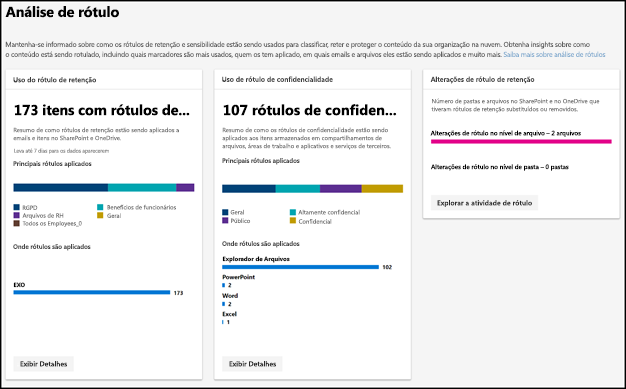
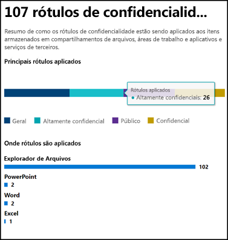
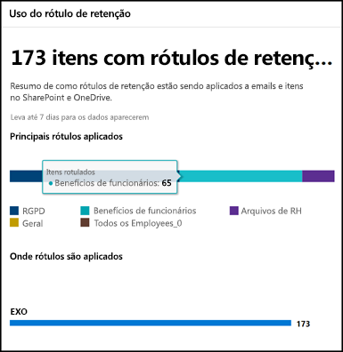
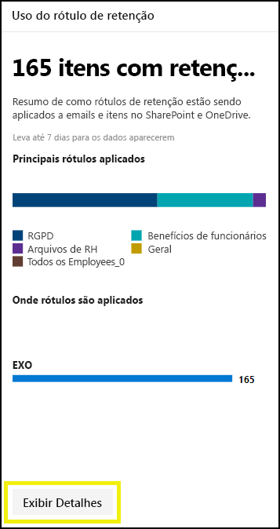
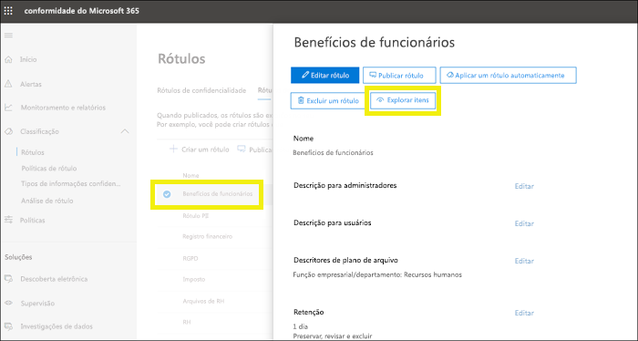
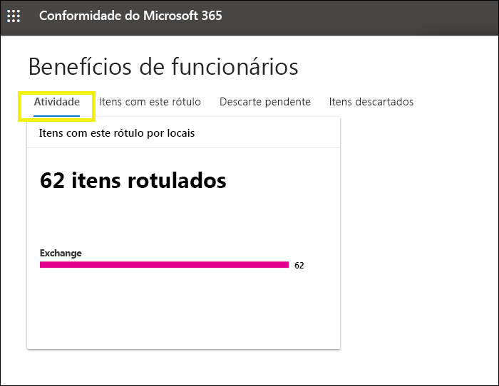
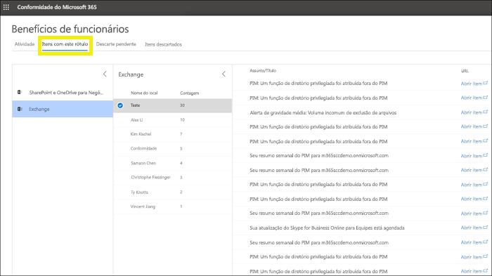

# Exibição do uso do rótulo com análises de rótulo

Depois de criar seus rótulos de retenção e rótulos de sensibilidade, você desejará ver como eles estão sendo usados em seu locatário. Com a análise do rótulo no centro de conformidade do Microsoft 365 e no centro de segurança do Microsoft 365, você pode exibir rapidamente os rótulos mais usados e onde foram aplicados.

Por exemplo, com a análise do rótulo, você pode exibir o:

- Total de rótulos de retenção e rótulos de confidencialidade aplicados ao conteúdo.
- Rótulos superiores e a contagem de quantas vezes cada rótulo foi aplicado.
- Locais onde os rótulos foram aplicados e a contagem de cada local.
- Conta quantos arquivos e pastas tiveram seu rótulo de retenção, alterado ou removido.

Você encontra a análise de rótulo no [Centro de conformidade do Microsoft 365](https://compliance.microsoft.com/labelanalytics) ou no [Centro de segurança do Microsoft 365](https://security.microsoft.com/labelanalytics) > **Classificação**  >  ** Análise de Rótulo**.

## Uso do rótulo de confidencialidade

Os dados de uso do rótulo de confidencialidade são extraídos dos Relatórios de Proteção de Informações do Azure – para saber mais, confira [Central de relatórios de Proteção de Informações do Azure](https://docs.microsoft.com/azure/information-protection/reports-aip).

Observe que tem os relatórios de Proteção de Informações do Azure possuem [pré-requisitos](/azure/information-protection/reports-aip#prerequisites) que também se aplicam a análise de rótulos nos rótulos de confidencialidade no centro de conformidade do Microsoft 365 e no centro de segurança do Microsoft 365. Por exemplo, você precisa de uma assinatura do Azure que inclua a Análise de Log, pois esses relatórios são um resultado do envio de eventos de auditoria da Proteção de Informação de clientes de Proteção de Informações do Azure e scanners em um local centralizado com base no serviço de Análise de Log do Azure.

Para uso do rótulo de confidencialidade:

- Não há nenhum latência nos dados. Este é um relatório em tempo real.
- Para ver a contagem de cada rótulo superior, aponte para o gráfico de barras e leia a dica de ferramenta que aparecerá.
- O relatório mostra onde os rótulos de confidencialidade são aplicados por aplicativo (enquanto os rótulos de retenção são mostrados por local).

## Uso do rótulo de retenção

Este relatório mostra uma exibição rápida do que os rótulos superiores são e onde são aplicadas. Para saber mais sobre como o conteúdo no SharePoint e OneDrive é rotulado, confira [Exibir a atividade de rótulos para documentos](view-label-activity-for-documents.md).

Para o uso do rótulo de retenção:

- Os dados são agregados semanalmente, portanto pode levar até sete dias para que os dados sejam exibidos no relatório.
- Para ver a contagem de cada rótulo superior, aponte para o gráfico de barras e leia a dica de ferramenta que aparecerá.
- O relatório mostra onde os rótulos de retenção são aplicados por local (enquanto os rótulos de confidencialidade são mostrados por aplicativo).
- Para rótulos de retenção, esse é um resumo de todos os dados de tempo em seu locatário; não é filtrado em um intervalo de dados específico. Por outro lado, o [Explorador de Atividade de Rótulo](view-label-activity-for-documents.md) mostra apenas dados dos últimos 30 dias.

## Exibir todo o conteúdo com um rótulo de retenção específico.

No relatório de uso do rótulo retenção, você pode rapidamente explorar todo o conteúdo em que esse rótulo foi aplicado. (Observe que estamos trabalhando nesse recurso, portanto algumas etapas serão necessárias para exibir todo o conteúdo rotulado).

Primeiro, escolha **Exibir Detalhes** na parte inferior do relatório.

Escolha um rótulo de retenção > **Explorar itens** no painel direito.

Para esse rótulo, você pode escolher a guia **Atividade** para exibir uma contagem de itens com esse rótulo por local.

Você também pode escolher a guia **Itens com esse rótulo** guia. Em seguida, você pode ir para locais específicos:

- Para o Exchange Online, você verá uma lista de caixas de correio com contagem de itens rotulados em cada caixa de correio.
- Para o SharePoint Online e OneDrive for Business, você verá uma lista de conjuntos de sites e contas do OneDrive com a contagem de itens rotulados em cada local.

Quando você escolher um conjunto de site ou caixa de correio, você pode exibir uma lista de itens com esse rótulo retenção naquele local.

## Permissões

Para exibir a análise do rótulo, você deve ter uma das seguintes funções no Azure Active Directory:

- Administrador global
- Administrador de conformidade
- Administrador de segurança
- Leitor de segurança

Além disso, observe que esses relatórios usam o Monitor do Azure para armazenar os dados em um espaço de trabalho de Análise de Log pertencente à sua organização. Portanto, o usuário deve ser adicionado como um leitor ao espaço de trabalho de monitoramento do Azure monitoramento que possui os dados, para saber mais, confira [Permissões necessárias para análise da Proteção de Informações do Azure](https://docs.microsoft.com/azure/information-protection/reports-aip#permissions-required-for-azure-information-protection-analytics).

