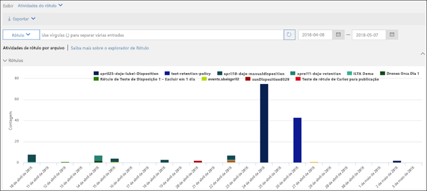

# Saiba mais sobre rótulos de retenção

>*[Diretrizes de licenciamento do Microsoft 365 para segurança e conformidade](https://aka.ms/ComplianceSD).*

Provavelmente, há em sua organização tipos de conteúdo diferentes que exigem ações diferentes para atender às normas do setor e às políticas internas. Por exemplo, você pode ter:
  
- Formulários fiscais que precisam ser **mantidos** por um período mínimo. 
    
- Materiais de imprensa que precisam ser **excluídos permanentemente** quando atingem uma certa idade. 
    
- Pesquisa sobre a concorrência que precisa ser **mantida** e, depois, **excluída permanentemente**. 
    
- Vistos de trabalho que devem ser **marcados como um registro** para que não possam ser editados ou excluídos. 
    
Em todos esses casos, os rótulos de retenção podem ajudar você a executar as ações certas no conteúdo certo. Com os rótulos de retenção, você pode classificar os dados em toda a organização para prover governança e impor regras de retenção com base nessa classificação.
  
Com os rótulos de retenção, você pode:
  
- **Permitir que pessoas na sua organização apliquem um rótulo de retenção manualmente** ao conteúdo no Outlook na Web, Outlook 2010 e posterior, OneDrive, SharePoint e Grupos do Microsoft 365. Os usuários geralmente sabem melhor o tipo de conteúdo com o qual estão trabalhando; portanto, podem classificá-lo e aplicar a política apropriada. 
    
- **Aplique automaticamente os rótulos de retenção ao conteúdo** que corresponder a condições específicas, por exemplo, quando o conteúdo apresenta: 
    
    - Tipos específicos de informações confidenciais.
    
    - Palavras-chave específicas que correspondem a uma consulta criada por você.
    
    - Correspondências padrão para um classificador treinável.
    
  A capacidade de aplicar rótulos de retenção automaticamente ao conteúdo é importante porque:
    
     - Você não precisa treinar os usuários com relação a todas as suas classificações.
    
     - Você não precisa depender dos usuários para classificar corretamente o conteúdo.
    
   - Os usuários não precisam mais conhecer as políticas de governança de dados; em vez disso, eles podem se concentrar no próprio trabalho.

- **Aplique um rótulo de retenção padrão a uma biblioteca de documentos** no SharePoint, de modo que todos os documentos que são armazenados naquele local herdem o rótulo de retenção padrão.

Além disso, os rótulos de retenção são compatíveis com o [gerenciamento de registros](records-management.md) de emails e documentos em todos os aplicativos e serviços da Microsoft 365. Você pode usar um rótulo de retenção para classificar o conteúdo como um registro. Quando isso acontece, o rótulo não pode ser alterado nem removido, e o conteúdo não pode ser editado nem excluído. 

Não há limite para o número de rótulos de retenção com suporte para um locatário. No entanto, 10.000 é o número máximo de políticas com suporte para um locatário, incluindo as políticas que aplicam os rótulos (políticas de rótulo de retenção e políticas de retenção automática), bem como políticas de retenção.

## Como os rótulos de retenção funcionam com políticas de rótulos de retenção

Disponibilizar os rótulos de retenção para as pessoas em sua organização para que eles possam classificar o conteúdo é um processo de duas etapas: 

1. Criar os rótulos de retenção

2. Publicar os rótulos de retenção usando uma política de rótulo de retenção
  

  
Os rótulos de retenção são blocos de construção independentes e reutilizáveis incluídos em uma ou mais políticas de rótulos de retenção. O objetivo principal da política de rótulos de retenção é agrupar um conjunto desses rótulos e especificar os locais em que você deseja que eles sejam exibidos.
  

  
1. Quando você publica rótulos de retenção, eles são incluídos em uma política de rótulos de retenção. Os nomes dos rótulos de retenção são imutáveis, o que significa que eles não podem ser editados após a criação.

2. Um único rótulo de retenção pode ser incluído em várias políticas de rótulos de retenção.

3. Um único local também pode ser incluído em várias políticas de rótulos de retenção.
    
3. As políticas de rótulos de retenção especificam os locais de publicação dos rótulos de retenção.
    
## Apenas um rótulo de retenção por vez

É importante saber que um conteúdo, como um email ou documento, só pode receber um único rótulo de retenção por vez:
  
- No caso dos rótulos de retenção atribuídos por usuários finais, as pessoas podem remover ou alterar o rótulo de retenção atribuído.
    
- Se o conteúdo tiver um rótulo de aplicação automática, um rótulo de aplicação automática pode ser substituído por um rótulo de retenção atribuído manualmente por um usuário final.
    
- Se o conteúdo tiver um rótulo de retenção atribuído manualmente por um usuário final, um rótulo de aplicação automática não poderá substituir o rótulo de retenção atribuído manualmente.
    
- Se houver várias regras que atribuem um rótulo de aplicação automática, e o conteúdo atender às condições das regras, será atribuído o rótulo de retenção da regra mais antiga.
    
Para entender como e por que um rótulo de retenção é aplicado, em vez de outro, é bom compreender a diferença entre atribuir explicitamente ou implicitamente um rótulo:

- Rótulos atribuídos manualmente são atribuídos explicitamente
- Rótulos atribuídos automaticamente são atribuídos implicitamente

Um rótulo de retenção atribuído explicitamente tem precedência sobre um rótulo de retenção atribuído implicitamente. Para saber mais, confira a seção [Os princípios de retenção ou o que tem precedência](#the-principles-of-retention-or-what-takes-precedence) nesta página.

## Políticas de rótulo de retenção e locais

É possível publicar tipos diferentes de rótulos de retenção em locais diferentes, dependendo do que o rótulo faz.
  
|**Se o rótulo de retenção for...**|**A política do rótulo poderá ser aplicada a...**|
|:-----|:-----|
|Publicado para usuários finais    |Exchange, SharePoint, OneDrive, Grupos do Microsoft 365    |
|Aplicado automaticamente com base em tipos de informações confidenciais    |Exchange (somente para todas as caixas de correio), SharePoint, OneDrive    |
|Aplicado automaticamente com base em uma consulta    |Exchange, SharePoint, OneDrive, Grupos do Microsoft 365    |
   
No Exchange, os rótulos de aplicação automática (para consultas e tipos de informações confidenciais) se aplicam somente às mensagens enviadas recentemente (dados em trânsito), não a todos os itens atualmente na caixa de correio (dados em repouso). Além disso, os rótulos de retenção de aplicação automática para tipos de informações confidenciais podem ser aplicados somente a todas as caixas de correio; você não pode selecionar as caixas de correio específicas.
  
As pastas públicas do Exchange, o Skype e os chats e mensagens de canal do Teams não oferecem suporte a rótulos de retenção.

## Como os rótulos de retenção impõem a retenção

Os rótulos de retenção podem impor as mesmas ações de retenção que uma política de retenção: reter e excluir ou somente reter ou somente excluir. Você pode usar rótulos de retenção para implementar um plano de arquivo sofisticado que identifique arquivos específicos para diferentes configurações de retenção. Para saber mais sobre o funcionamento da retenção, confira [Saiba mais sobre políticas de retenção](retention-policies.md).

Além disso, um rótulo de retenção tem duas opções de retenção, disponíveis apenas em um rótulo, e não em uma política de retenção. Com um rótulo de retenção, você pode:
  
- Disparar uma revisão de disposição ao fim do período de retenção, para que os documentos do SharePoint e do OneDrive sejam examinados antes de serem excluídos. Para saber mais, confira [Revisões de disposição](disposition.md#disposition-reviews).
    
- Iniciar o período de retenção a partir do momento de aplicação do rótulo no conteúdo, em vez da idade do conteúdo ou da última modificação. Quando você usa esta opção:
    - Esta opção se aplica apenas ao conteúdo nos sites do SharePoint e contas do OneDrive. Para o e-mail do Exchange, o período de retenção é sempre baseado na data em que a mensagem foi enviada ou recebida.
    - Você não pode alterar o período de retenção depois que o rótulo for salvo.
    

Outra importante diferença é que, quando você aplica um rótulo de retenção em vez de uma política de retenção aos arquivos no SharePoint, e o rótulo é configurado para reter conteúdo, os usuários não podem excluir o arquivo enquanto o período de retenção é imposto. Os usuários podem excluir o conteúdo quando o mesmo rótulo é aplicado aos arquivos no OneDrive e aos emails, a menos que o rótulo marque o conteúdo como um registro.

## Onde os rótulos de retenção publicados podem aparecer para os usuários finais

Se o seu rótulo de retenção for atribuído ao conteúdo por usuários finais, você poderá publicá-lo no:
  
- Outlook e Outlook na Web
    
- OneDrive
    
- SharePoint
    
- Grupos do Microsoft 365 (o site do grupo e a caixa de correio do grupo no Outlook na Web)
    
As seções a seguir mostram como os rótulos aparecem em aplicativos diferentes para as pessoas em sua organização.
  

### Outlook

Para rotular um item no cliente da área de trabalho do Outlook, selecione o item. Na guia **Página Inicial** na faixa de opções, clique em **Atribuir Política** e, em seguida, escolha o rótulo de retenção. 
  

  
Você também pode clicar com o botão direito do mouse em um item, clicar em **Atribuir Política** no menu de contexto e, em seguida, escolher o rótulo de retenção. 

Após a aplicação do rótulo de retenção, é possível visualizar esse rótulo de retenção e quais ações são executadas na parte superior do item. Se um email tiver um rótulo de retenção aplicado com um período de retenção associado, você poderá ver rapidamente quando o email expirará.
  
Você também pode aplicar os rótulos de retenção a pastas e, nesse caso:
  
- Todos os itens na pasta terão automaticamente o mesmo rótulo de retenção, **exceto** os itens que tiverem um rótulo de retenção explicitamente aplicado a eles. Itens rotulados explicitamente mantêm seu rótulo de retenção existente. Para saber mais, confira a seção [Os princípios de retenção ou o que tem precedência?](#the-principles-of-retention-or-what-takes-precedence) nesta página. 
    
- Se você alterar ou remover o rótulo de retenção padrão de uma pasta, ele também será alterado ou removido para todos os itens na pasta, **exceto** itens com rótulos de retenção explicitamente atribuídos. 
    
- Se você mover um item com um rótulo de retenção padrão de uma pasta para outra com um rótulo de retenção padrão diferente, o item receberá o novo rótulo de retenção padrão.
    
- Se você mover um item com um rótulo de retenção padrão de uma pasta para outra sem nenhum rótulo de retenção padrão, o antigo rótulo de retenção padrão será removido.

### Outlook na Web

Para rotular um item no Outlook na Web, clique com o botão direito no item \> **Atribuir Política** \> e escolha o rótulo. 
  

  
Após a aplicação do rótulo de retenção, você poderá exibir esse rótulo e a ação necessária na parte superior do item. Se um email for classificado e tiver um período de retenção associado, você poderá saber rapidamente quando o email expirará.
  

  
Como no Outlook na Web, você também pode aplicar rótulos de retenção às pastas. 

### OneDrive e SharePoint

Para rotular um documento (incluindo arquivos do OneNote) no OneDrive ou SharePoint, selecione o item \> no canto superior direito, escolha **Abrir o painel de detalhes** \> ** Aplicar rótulo de retenção** \> e escolha o rótulo de retenção. 
  
Você também pode aplicar um rótulo de retenção a uma pasta ou conjunto de documentos e definir um [rótulo de retenção padrão para uma biblioteca de documentos](#applying-a-default-retention-label-to-all-content-in-a-sharepoint-library-folder-or-document-set).
  

  
Após a aplicação de um rótulo de retenção a um item, será possível exibi-lo no painel de detalhes após a seleção do item.
  

  
Para o SharePoint, mas não no OneDrive, você pode criar um modo de exibição da biblioteca que contém a coluna **Rótulos** ou a coluna **Item é um registro**. Esse modo de exibição permite ver rapidamente os rótulos de retenção atribuídos a todos os itens e quais itens são registros. Observe, no entanto, que não é possível filtrar o modo de exibição pela coluna **Item é um registro**. Para obter instruções sobre como adicionar colunas, confira [Mostrar ou ocultar colunas em uma lista ou biblioteca](https://support.microsoft.com/pt-BR/office/show-or-hide-columns-in-a-list-or-library-b820db0d-9e3e-4ff9-8b8b-0b2dbefa87e2).

### Grupos do Microsoft 365

Quando você publica os rótulos de retenção em grupos do Microsoft 365 ([antigo grupos do Office 365](https://techcommunity.microsoft.com/t5/microsoft-365-blog/office-365-groups-will-become-microsoft-365-groups/ba-p/1303601)), os rótulos de retenção aparecem no site do grupo e na caixa de correio do grupo no Outlook na Web. A experiência de aplicar um rótulo de retenção ao conteúdo é idêntica à de emails e documentos.

Para manter o conteúdo de um grupo do Microsoft 365, use o **grupos do Office 365**. Mesmo que um grupo do Microsoft 365 tenha uma caixa de correio do Exchange, uma política de retenção que inclua todo o local do Exchange não incluirá conteúdo nas caixas de correio de grupo do Microsoft 365.

Além disso, não é possível usar o local do Exchange para incluir ou excluir uma caixa de correio de grupo específica. Embora o local do Exchange permita inicialmente que uma caixa de correio de grupo seja selecionada, ao tentar salvar a política de retenção, você recebe um erro indicando que "RemoteGroupMailbox" não é uma seleção válida para o local do Exchange.
  
Primeiro, crie e configure os rótulos de confidencialidade que você deseja disponibilizar nos aplicativos e outros serviços. Por exemplo, os rótulos que você deseja que os usuários vejam e se apliquem a partir dos aplicativos do Office. 

Em seguida, crie uma mais políticas de rótulos que contenham os rótulos e as configurações de política que você configurar. É a política de rótulos que publica os rótulos e as configurações dos seus usuários e locais selecionados.

## Aplicar um rótulo de retenção automaticamente com base em condições

Um dos recursos mais poderosos dos rótulos de retenção é a capacidade de aplicá-los automaticamente ao conteúdo que corresponde a determinadas condições. Nesse caso, as pessoas da sua organização não precisam aplicar os rótulos de retenção. O Microsoft 365 faz o trabalho para elas.
  

  
Os rótulos de retenção de aplicação automática são excelentes porque:
  
- Você não precisa treinar os usuários com relação a todas as classificações.
    
- Você não precisa depender dos usuários para classificar corretamente o conteúdo.
    
- Os usuários não precisam mais conhecer as políticas de governança de dados; assim podem se concentrar no próprio trabalho.
    
Você pode optar por aplicar os rótulos de retenção automaticamente ao conteúdo quando esse conteúdo apresentar:
  
- [Tipos específicos de informações confidenciais](create-retention-labels.md#auto-apply-labels-to-content-with-specific-types-of-sensitive-information)
    
- [Palavras-chave específicas que correspondem a uma consulta criada por você](create-retention-labels.md#auto-apply-labels-to-content-with-keywords-or-searchable-properties)

- [Uma correspondência de classificadores treináveis](create-retention-labels.md#auto-apply-labels-to-content-by-using-trainable-classifiers)
    

> [!TIP]
> Confira [Gerenciar o ciclo de vida dos documentos do SharePoint com rótulos de retenção](auto-apply-retention-labels-scenario.md) para obter um cenário detalhado sobre como usar as propriedades gerenciadas no SharePoint para aplicar automaticamente os rótulos de retenção e implementar a retenção voltada para o evento.

## Aplicar um rótulo de retenção padrão a todo o conteúdo em uma biblioteca do SharePoint, pasta ou conjunto de documentos

Além de permitir que as pessoas apliquem um rótulo de retenção a documentos individuais, você também pode aplicar um rótulo de retenção padrão a uma biblioteca, pasta ou conjunto de documentos do SharePoint, para que todos os documentos nesse local recebam o rótulo de retenção padrão.
  
Para uma biblioteca de documentos, isso é feito na página **Configurações da biblioteca** de uma biblioteca de documentos. Ao escolher o rótulo de retenção padrão, você também pode optar por aplicá-lo a todos os itens existentes na biblioteca. 
  
Por exemplo, se você possui uma marcação para materiais de marketing e sabe que uma biblioteca de documentos específica contém apenas esse tipo de conteúdo, você pode tornar a marcação de Materiais de Marketing o padrão para todos os documentos dessa biblioteca.
  

  
Se você aplicar um rótulo de retenção padrão aos itens existentes na biblioteca, pasta ou conjunto de documentos:
  
- Todos os itens na biblioteca, pasta ou conjunto de documentos recebem automaticamente o mesmo rótulo de retenção, **exceto** os itens que tiveram um rótulo de retenção aplicado explicitamente a eles (como os registros). Itens rotulados explicitamente mantêm seu rótulo existente. Para saber mais, confira a seção abaixo sobre [Os princípios de retenção, ou o que tem precedência](#the-principles-of-retention-or-what-takes-precedence).
    
- Se você alterar ou remover o rótulo de retenção padrão de uma biblioteca, pasta ou conjunto de documentos, ele também será alterado ou removido em todos os itens na biblioteca, pasta ou conjunto de documentos, **exceto** os itens com rótulos de retenção explícitos (como os registros).
    
- Se você mover um item com um rótulo de retenção padrão de um conjunto de sites, biblioteca, pasta ou conjunto de documentos para outro conjunto de sites, biblioteca, pasta ou conjunto de documentos, o item manterá o rótulo de retenção padrão existente, mesmo se o novo local tiver um rótulo de retenção padrão diferente. Se o item não tiver um rótulo antes de ser movido, ele assumirá o rótulo de retenção padrão do novo local.

**Registros:** Se você aplicar uma rótulo de registro padrão a uma biblioteca, pasta ou conjunto de documentos, um rótulo de registro será aplicado a todos os itens individuais nesses locais. Ao mover um novo item para um local com um rótulo de registro, esse item será rotulado como um registro. No entanto, se você alterar o rótulo de retenção padrão para um rótulo que não declara o conteúdo como um registro, essa ação não remover o rótulo do registro dos itens individuais. Esses itens mantêm o rótulo do registro. Somente um administrador do conjunto de sites pode remover ou alterar explicitamente o rótulo de retenção dos itens de registro.

Para saber mais sobre os rótulos de retenção que declaram o conteúdo como um registro, confira [Saiba mais sobre os registros](records.md).

## Aplicar um rótulo de retenção ao email usando regras

No Outlook, você pode criar regras para aplicar um rótulo de retenção ou política de retenção.
  
Por exemplo, você pode criar uma regra que aplica um rótulo de retenção específico a todas as mensagens enviadas de ou para um grupo de distribuição específico.
  
Para criar uma regra, clique com botão direito em um item \> **Regras** \> **Criar Regra** \> **Opções Avançadas** \> **Assistente de Regras** \> **aplicar política de retenção**.
  

  
## Classificação do conteúdo sem aplicar ações

Ao criar um rótulo de retenção, você pode fazer isso sem ativar qualquer retenção ou outras ações. Nesse caso, você pode usar um rótulo de retenção simplesmente como um rótulo de texto, sem aplicar ações.
  
Por exemplo, você pode criar um rótulo de retenção chamado "Revisar depois" sem ações e, em seguida, aplicar automaticamente esse rótulo de retenção ao conteúdo com tipos de informações confidenciais ou conteúdo consultado.
  

  
## Usar rótulos de retenção para gerenciamento de registros
    
Você pode usar os rótulos de retenção para declarar o conteúdo como um registro. Isso permite implementar uma estratégia de gerenciamento de registros única e consistente no Microsoft 365. Para saber mais, confira [Saiba mais sobre os registros](records.md).
  
## Usar um rótulo de retenção como condição em uma política DLP

Um rótulo de retenção pode impor ações de retenção ao conteúdo. Além disso, você pode usar um rótulo de retenção como uma condição em uma política DLP (prevenção contra perda de dados). Isso significa que uma política DLP pode impor ações de proteção, como restringir o acesso, no conteúdo que inclui um rótulo específico. 
  
Para saber mais, confira [Usar um rótulo de retenção como condição em uma política DLP](data-loss-prevention-policies.md#using-a-retention-label-as-a-condition-in-a-dlp-policy).
  

## Os princípios de retenção ou o que tem precedência?

É possível ou até mesmo provável que o conteúdo tenha várias políticas de retenção aplicadas a ele, cada uma com uma ação diferente (manter, excluir ou ambas) e o período de retenção. O que tem precedência? No nível mais alto, esteja certo de que o conteúdo retido por uma política não pode ser excluído permanentemente por outra política.
  

  
Para entender como os rótulos diferentes são aplicados ao conteúdo, lembre-se destes princípios de retenção:
  
1. **A retenção prevalece sobre a exclusão.** Suponha que uma política de retenção diga para excluir o email do Exchange após três anos, mas outra diga para manter o email do Exchange por cinco anos e depois excluí-lo. Qualquer conteúdo que tiver três anos será excluído e ocultado dos usuários, mas ainda será mantido na pasta Itens Recuperáveis até que o conteúdo atinja cinco anos, quando ele será permanentemente excluído. 
    
2. **O período de retenção mais longo prevalece.** Se o conteúdo estiver sujeito a várias políticas que retêm o conteúdo, ele será mantido até o final do período de retenção mais longo. 
    
3. **A inclusão explícita prevalece sobre a inclusão implícita.** Isso significa que: 
    
    1. Se um rótulo de retenção com configurações de retenção for atribuído manualmente por um usuário a um item, como um email do Exchange ou documento do OneDrive, esse rótulo de retenção terá precedência sobre uma política atribuída no nível do site ou da caixa de correio e um rótulo de retenção padrão atribuído pelo biblioteca de documentos. Por exemplo, se o rótulo de retenção explícito diz manter por 10 anos, mas a política de retenção atribuída ao site diz reter por apenas cinco anos, o rótulo de retenção tem precedência. Os rótulos de retenção de aplicação automática são considerados implícitos, não explícitos, pois são aplicados automaticamente pelo Microsoft 365.
    
    2. Se uma política de retenção incluir um local específico, como a caixa de correio de um usuário específico ou conta OneDrive, essa política terá precedência sobre outra política de retenção que se aplica a caixas de correio de todos os usuários ou contas do OneDrive, mas não incluirá especificamente essa caixa de correio do usuário.
    
4. **O período de exclusão mais curto tem precedência.** Da mesma forma, se o conteúdo estiver sujeito a várias políticas que excluem o conteúdo (sem retenção), ele será excluído ao fim do período de retenção mais curto. 
    
Entenda que os princípios de retenção funcionam como um fluxo de desempate de cima para baixo: se as regras aplicadas por todas as políticas ou rótulos forem as mesmas em um nível, o fluxo se moverá para baixo até o próximo nível para determinar a precedência para a qual a regra será aplicada.
  
Por fim, uma política de retenção ou um rótulo de retenção não pode excluir permanentemente qualquer conteúdo que esteja em espera para Descoberta Eletrônica. Quando a retenção for liberada, o conteúdo estará novamente qualificado para o processo de limpeza descrito acima.

### Precedência para rotular automaticamente com classificadores treináveis

Todos os rótulos de retenção que estão configurados para classificadores treináveis são avaliados simultaneamente. Se um item for detectado por mais de um classificador treinável, os seguintes critérios serão usados para determinar o rótulo de retenção a ser aplicado:

1. Os rótulos de retenção configurados para apenas reter, ou reter e excluir, têm prioridade mais alta do que os rótulos de retenção que estão configurados para exclusão.

2. Para rótulos de retenção que estão configurados para apenas reter, ou reter e, em seguida, excluir, o rótulo de retenção que é configurado para o período de retenção mais longo vence.

3. Para rótulos de retenção que estão configurados para exclusão, o rótulo de retenção que foi configurado para o período mais curto vence.

4. Os rótulos de retenção com a mesma ação e o mesmo período resultarão em uma seleção de rótulo de retenção não determinística.

## Monitorar rótulos de retenção.

Depois de publicar ou aplicar automaticamente seus rótulos de retenção, convém verificar se eles foram aplicados ao conteúdo como pretendido. Para monitorar os rótulos de retenção:
  
- **Gerenciador de atividade de rótulos**. Com o gerenciador (exemplo na próxima imagem), é possível rapidamente pesquisar e exibir a atividade de rótulos de retenção para todo o conteúdo no SharePoint e OneDrive dos últimos 30 dias. Para saber mais, confira [Exibir a atividade de rótulos de documentos](view-label-activity-for-documents.md).

- Página **Análise de rótulo**. No Centro de conformidade do Microsoft 365 e no Centro de segurança do Microsoft 365, você pode exibir rapidamente os rótulos de retenção superiores e onde foram aplicados. Você também pode exibir todo o conteúdo com um rótulo de retenção específico. Para saber mais, confira [Exibir uso do rótulo com análises do rótulo](label-analytics.md).
    
- **Relatórios de governança de dados**. Com esses relatórios, é possível exibir rapidamente a atividade e as tendências de rótulos de retenção de todo o conteúdo no Exchange, no SharePoint e no OneDrive dos últimos 90 dias. Para saber mais, confira [Exibir relatórios de governança de dados](view-the-data-governance-reports.md).
    

## Usar a Pesquisa de Conteúdo para localizar todo o conteúdo com um rótulo de retenção específico aplicado

Depois que os rótulos de retenção são atribuídos ao conteúdo, seja por usuários ou aplicados automaticamente, você pode usar a pesquisa de conteúdo para encontrar todo o conteúdo classificado com um rótulo de retenção específico.
  
Ao criar uma pesquisa de conteúdo, escolha a condição **Marca de conformidade** e, em seguida, insira o nome do rótulo de retenção completo ou parte dele e use um caractere curinga. Para saber mais, veja [Consultas de palavra-chave e condições de pesquisa para Pesquisa de Conteúdo](keyword-queries-and-search-conditions.md).
  

  
## Usar rótulos de retenção em vez de recursos mais antigos

Os rótulos de retenção podem facilmente ser disponibilizados para uma organização inteira e seu conteúdo no Microsoft 365, incluindo grupos do Exchange, o SharePoint, o OneDrive e o Microsoft 365. Caso você precise manter ou excluir conteúdo, ou gerenciar registros em qualquer lugar no Microsoft 365, é recomendável usar os rótulos de retenção.
  
Há vários outros recursos que já foram usados para reter ou excluir conteúdo, ou para gerenciar registros no Microsoft 365. Esses recursos continuarão a trabalhar lado a lado com os rótulos de retenção. Embora haja casos em que a implementação de rótulos de retenção é diferente de recursos anteriores, a evolução dos rótulos de retenção orientará o futuro do gerenciamento de registros no Microsoft 365. Portanto, seguindo em frente, para governança de dados, recomendamos o uso de rótulos de retenção em vez dos seguintes recursos mais antigos.
  
### Exchange Online

- [Marcas de retenção e políticas de retenção](https://go.microsoft.com/fwlink/?linkid=846125), também conhecidas como [gerenciamento de registros de mensagens (MRM)](https://go.microsoft.com/fwlink/?linkid=846126) (apenas exclusão) 
    
### SharePoint e OneDrive

- [Como configurar o gerenciamento de registros no local](https://support.office.com/article/7707a878-780c-4be6-9cb0-9718ecde050a) (retenção) 
    
- [Introdução à Central de Registros](https://support.office.com/article/bae6ca5a-7b19-40e0-b433-e3613a747c2c) (retenção) 
    
- [Políticas de gerenciamento de informações](intro-to-info-mgmt-policies.md) (apenas exclusão) 
    
## Próximas etapas

Se você estiver pronto para criar e publicar rótulos de retenção, confira [Criar, publicar e aplicar automaticamente rótulos de retenção](create-retention-labels.md).
