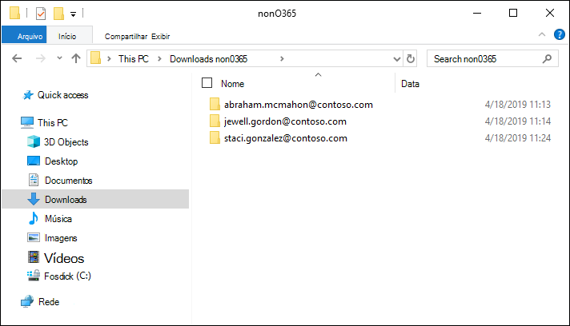
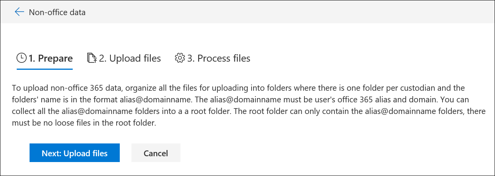

# Carregar dados que não sejam da Microsoft 365 em um conjunto de revisãoLoad non-Microsoft 365 data into a review set

Nem todos os documentos que você precisa analisar na descoberta eletrônica avançada estão localizados no Microsoft 365.Not all documents that you need to analyze in Advanced eDiscovery are located in Microsoft 365. Com o recurso de importação de dados não-Microsoft 365 na descoberta eletrônica avançada, você pode carregar documentos que não estão localizados no Microsoft 365 em um conjunto de revisão.With the non-Microsoft 365 data import feature in Advanced eDiscovery, you can upload documents that aren't located in Microsoft 365 to a review set. Este artigo mostra como trazer documentos que não são da Microsoft 365 para a descoberta eletrônica avançada para análise.This article shows you how to bring your non-Microsoft 365 documents into Advanced eDiscovery for analysis.

## Requisitos para carregar conteúdo não-Office 365Requirements to upload non-Office 365 content

O uso do recurso de upload que não é da Microsoft 365 descrito neste artigo requer que você tenha o seguinte:Using the upload non-Microsoft 365 feature described in this article requires that you have the following:

- Todos os responsáveis que você deseja associar conteúdo que não seja da Microsoft 365 devem receber a licença apropriada.All custodians that you want to associate non-Microsoft 365 content to must be assigned the appropriate license. Para obter mais informações, consulte [introdução à descoberta eletrônica avançada](get-started-with-advanced-ediscovery.md#step-1-verify-and-assign-appropriate-licenses).For more information, see [Get started with Advanced eDiscovery](get-started-with-advanced-ediscovery.md#step-1-verify-and-assign-appropriate-licenses).

- Uma ocorrência de descoberta eletrônica avançada existente.An existing Advanced eDiscovery case.

- Os responsáveis devem ser adicionados ao caso antes que você possa carregar e associar os dados que não são da Microsoft 365 a eles.Custodians must be added to the case before you can upload and associate the non-Microsoft 365 data to them.

- Dados que não são da Microsoft 365 devem ser um tipo de arquivo com suporte da descoberta eletrônica avançada.Non-Microsoft 365 data must be a file type that's supported by Advanced eDiscovery. Para saber mais, confira [tipos de arquivo com suporte na descoberta eletrônica avançada](supported-filetypes-ediscovery20.md).For more information, see [Supported file types in Advanced eDiscovery](supported-filetypes-ediscovery20.md).

- Todos os arquivos carregados em um conjunto de revisão devem estar localizados em pastas, onde cada pasta é associada a um determinado local.All files that are uploaded to a review set must be located in folders, where each folder is associated with a specific custodian. Os nomes dessas pastas devem usar o seguinte formato de nome: *alias@domainname*.The names for these folders must use the following naming format: *alias@domainname*. O alias@domainname deve ser o alias e o domínio do Microsoft 365 do usuário.The alias@domainname must be the user's Microsoft 365 alias and domain. Você pode coletar todas as pastas de alias@domainname em uma pasta raiz.You can collect all the alias@domainname folders in a root folder. A pasta raiz pode conter apenas as pastas alias@domainname.The root folder can only contain the alias@domainname folders. Não há suporte para arquivos soltos na pasta raiz.Loose files in the root folder aren't supported.

   A estrutura de pastas para os dados que não são da Microsoft 365 que você deseja carregar seria semelhante ao exemplo a seguir:The folder structure for the non-Microsoft 365 data that you want to upload would be similar to the following example:

   - c:\nonO365\abraham.mcmahon@contoso.comc:\nonO365\abraham.mcmahon@contoso.com
   - c:\nonO365\jewell.gordon@contoso.comc:\nonO365\jewell.gordon@contoso.com
   - c:\nonO365\staci.gonzalez@contoso.comc:\nonO365\staci.gonzalez@contoso.com

   Onde abraham.mcmahon@contoso.com, jewell.gordon@contoso.com e staci.gonzalez@contoso.com são os endereços SMTP dos responsáveis no caso.Where abraham.mcmahon@contoso.com, jewell.gordon@contoso.com, and staci.gonzalez@contoso.com are the SMTP addresses of custodians in the case.

   

- Uma conta atribuída ao grupo de função Gerenciador de descoberta eletrônica (e adicionada como administrador de descoberta eletrônica).An account that is assigned to the eDiscovery Manager role group (and added as eDiscovery Administrator).

- A ferramenta AzCopy v 8.1 instalada em um computador que tem acesso à estrutura de pasta de conteúdo não-Microsoft 365.The AzCopy v8.1 tool installed on a computer that has access to the non-Microsoft 365 content folder structure. Para instalar o AzCopy, confira [transferir dados com o AzCopy v 8.1 no Windows](https://docs.microsoft.com/previous-versions/azure/storage/storage-use-azcopy).To install AzCopy, see [Transfer data with the AzCopy v8.1 on Windows](https://docs.microsoft.com/previous-versions/azure/storage/storage-use-azcopy). Certifique-se de instalar o AzCopy no local padrão, que é **% ProgramFiles (x86)% \ Microsoft SDKs\Azure\AzCopy**.Be sure to install AzCopy in the default location, which is **%ProgramFiles(x86)%\Microsoft SDKs\Azure\AzCopy**. Você deve usar o AzCopy v 8.1.You must use AzCopy v8.1. Outras versões do AzCopy podem não funcionar ao carregar dados que não sejam da Microsoft 365 na descoberta eletrônica avançada.Other versions of AzCopy may not work when loading non-Microsoft 365 data in Advanced eDiscovery.

## Carregar conteúdo não-Microsoft 365 na descoberta eletrônica avançadaUpload non-Microsoft 365 content into Advanced eDiscovery

1. Como um gerente de descoberta eletrônica ou administrador de descoberta eletrônica, abra descoberta eletrônica avançada e vá para o caso em que os dados não-Microsoft 365 serão carregados.As an eDiscovery Manager or eDiscovery Administrator, open Advanced eDiscovery, and go to the case that the non-Microsoft 365 data will be uploaded to.  

2. Clique em **revisar conjuntos**e selecione o conjunto de revisão para carregar os dados que não são da Microsoft 365 para o.Click **Review sets**, and then select the review set to upload the non-Microsoft 365 data to.  Se você não tiver um conjunto de revisão, você pode criar um.If you don't have a review set, you can create one. 
 
3. No conjunto de revisão, clique em **gerenciar o conjunto de revisão**e, em seguida, clique em **Exibir carregamentos** no bloco de **dados não-Microsoft 365** .In the review set, click **Manage review set**, and then click **View uploads** on the **Non-Microsoft 365 data** tile.

4. Clique em **carregar arquivos** para iniciar o assistente de importação de dados.Click **Upload files** to start the data import wizard.

   

   A primeira etapa do assistente prepara um local de armazenamento do Azure seguro fornecido pela Microsoft para carregar os arquivos.The first step in the wizard prepares a secure Microsoft-provided Azure Storage location to upload the files to.  Quando a preparação estiver concluída, o botão **Avançar: carregar arquivos** se tornará ativo.When the preparation is completed, the **Next: Upload files** button becomes active.

   
 
5. Clique em **Avançar: carregar arquivos**.Click **Next: Upload files**.

6. Na página **carregar arquivos** , faça o seguinte:On the **Upload files** page, do the following:

   

   a.a. Na caixa **caminho para o local dos arquivos** , verifique ou digite o local da pasta raiz onde você armazenou os dados que não são da Microsoft 365 que você deseja carregar.In the **Path to location of files** box, verify or type the location of the root folder where you've stored the non-Microsoft 365 data you want to upload. Por exemplo, para o local dos arquivos de exemplo mostrados na **seção antes de começar**, digite **%USERPROFILE\Downloads\nonO365**.For example, for the location of the example files shown in the **Before you begin section**, you would type **%USERPROFILE\Downloads\nonO365**. Fornecer o local correto garante que o comando AzCopy exibido em caixa abaixo do caminho seja atualizado corretamente.Providing the correct location ensures the AzCopy command displayed in box under the path is properly updated.

   b.b. Clique em **copiar para área de transferência** para copiar o comando exibido na caixa.Click **Copy to clipboard** to copy the command that is displayed in the box.

7. Inicie um prompt de comando do Windows, Cole o comando copiado na etapa anterior e pressione **Enter** para iniciar o comando AzCopy.Start a Windows command prompt, paste the command that you copied in the previous step, and then press **Enter** to start the AzCopy command.  Depois de iniciar o comando, os arquivos que não são da Microsoft 365 serão carregados no local de armazenamento do Azure que foi preparado na etapa 4.After you start the command, the non-Microsoft 365 files will be uploaded to the Azure Storage location that was prepared in step 4.

   

   > [!NOTE]
   > Conforme mencionado anteriormente, você deve usar o AzCopy v 8.1 para usar com êxito o comando fornecido na página **carregar arquivos** .As previously stated, you must use AzCopy v8.1 to successfully use the command that's provided on the **Upload files** page. Se o comando AzCopy fornecido falhar, confira [solucionar problemas de AzCopy na descoberta eletrônica avançada](troubleshooting-azcopy.md).If the supplied AzCopy command fails, please see [Troubleshoot AzCopy in Advanced eDiscovery](troubleshooting-azcopy.md).

8. Volte para o centro de conformidade & segurança e clique em **Avançar: processar arquivos** no assistente.Go back to the Security & Compliance Center, and click **Next: Process files** in the wizard.  Isso inicia o processamento, extração de texto e indexação de arquivos que não são da Microsoft 365 que foram carregados no local de armazenamento do Azure.This initiates processing, text extraction, and indexing of the non-Microsoft 365 files that were uploaded to the Azure Storage location.  

9. Acompanhe o progresso do processamento dos arquivos na página **arquivos de processo** ou na guia **trabalhos** , exibindo um trabalho chamado **adição de dados que não são da Microsoft 365 a um conjunto de revisão**.Track the progress of processing the files on the **Process files** page or on the **Jobs** tab by viewing a job named **Adding non-Microsoft 365 data to a review set**.  Depois que o trabalho for concluído, os novos arquivos estarão disponíveis no conjunto de revisão.After the job is finished, the new files will be available in the review set.

   

10. Depois que o processamento for concluído, você poderá fechar o assistente.After the processing is finished, you can close the wizard.
