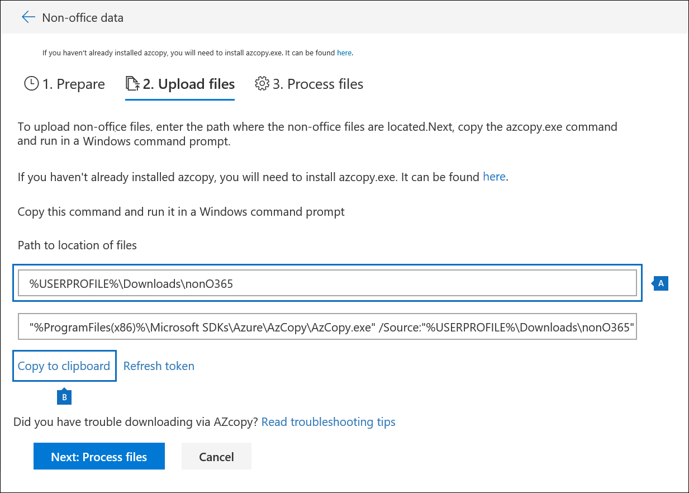
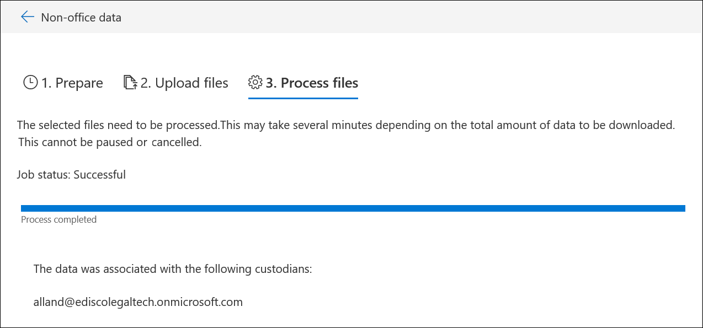

# Carregar dados que não sejam da Microsoft 365 em evidências

Nem todos os documentos que você pode precisar analisar em uma investigação de dados estarão localizados no Microsoft 365. Com o recurso de importação de conteúdo não-Microsoft 365, você pode carregar documentos que não estão no Microsoft 365 em evidência para que eles possam ser analisados em uma investigação de dados.

## Antes de começar

O uso do recurso carregar não Microsoft 365, conforme descrito neste procedimento, requer que você tenha:

- Uma assinatura do Microsoft 365 ou do Office 365 e5.

- Todas as pessoas de interesse cujo conteúdo que não seja da Microsoft 365 serão carregadas deverão ter a licença complementar E5 ou E5 apropriada.

- Uma ocorrência de descoberta eletrônica existente.

- Todos os arquivos para carregamento são coletados em pastas onde há uma pasta por responsáveis e o nome das pastas está nesse formato *alias@domainname*. O *alias@domainname* deve ser o alias e o domínio do usuário. Você pode coletar todas as pastas de *alias@domainname* em uma pasta raiz. A pasta raiz pode conter apenas as pastas *alias@domainname* , não deve haver arquivos soltos na pasta raiz.

- Uma conta que seja um Gerenciador de descoberta eletrônica ou ferramentas de armazenamento do Microsoft Azure administrador instaladas em um computador que tenha acesso à estrutura de pasta de conteúdo não-Microsoft 365.

- Instale o AzCopy, que pode ser feito aqui:https://docs.microsoft.com/azure/storage/common/storage-use-azcopy

## Carregar conteúdo não-Microsoft 365 em uma investigação de dados

1. Abra as **investigações de dados** e vá para a investigação de que os dados que não são da Microsoft 365 serão carregados.  Clique na guia **evidência** e selecione o conjunto de evidências para o qual você deseja carregar os dados.  Se você ainda não criou um conjunto de evidências, é possível fazer isso agora.  Por fim, clique em **gerenciar evidências** e, em seguida, **Exibir uploads** na seção de dados

2. Clique no botão **carregar arquivos** para iniciar o assistente de importação de dados não-Microsoft 365.

3. A primeira etapa no assistente simplesmente prepara um blob do Azure seguro para os arquivos a serem carregados.  Após a conclusão da preparação, clique no botão **próximo: carregar arquivos** .

 
4. Na etapa **carregar arquivos** , especifique o **caminho para o local dos arquivos**, onde os dados que não são da Microsoft 365 que você planeja importar estão localizados.  Definir o local correto garante que o comando AzCopy seja atualizado corretamente.

> [!NOTE]
> Se você ainda não tiver instalado o AzCopy, poderá fazer isso daqui:https://docs.microsoft.com/azure/storage/common/storage-use-azcopy

5. Copie o comando predefinido clicando no link **copiar para a área de transferência** . Inicie um prompt de comando do Windows, Cole o comando e pressione Enter.  Os arquivos serão carregados para o armazenamento de blob do Azure seguro para a próxima etapa.

6. Por fim, volte para a segurança & conformidade e clique no botão **próximo: processar arquivos** .  Isso inicia o processamento, extração de texto e indexação de arquivos carregados.  Você pode acompanhar o progresso do processamento aqui ou na guia **trabalhos** .  Após a conclusão, os novos arquivos estarão disponíveis no conjunto de evidências.  Após a conclusão do processamento, você pode ignorar o assistente.

