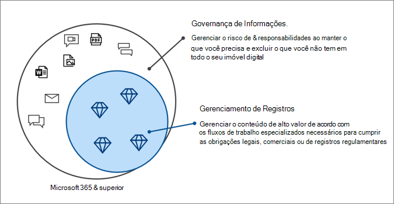

# Governança de Informações da Microsoft no Microsoft 365Microsoft Information Governance in Microsoft 365

>*[Diretrizes de licenciamento do Microsoft 365 para segurança e conformidade](/office365/servicedescriptions/microsoft-365-service-descriptions/microsoft-365-tenantlevel-services-licensing-guidance/microsoft-365-security-compliance-licensing-guidance).**[Microsoft 365 licensing guidance for security & compliance](/office365/servicedescriptions/microsoft-365-service-descriptions/microsoft-365-tenantlevel-services-licensing-guidance/microsoft-365-security-compliance-licensing-guidance).*

Use os recursos da Governança de Informações da Microsoft (às vezes, abreviado como MIG) para controlar seus dados e atender aos requisitos normativos ou de conformidade.Use Microsoft Information Governance (sometimes abbreviated to MIG) capabilities to govern your data for compliance or regulatory requirements.

Deseja proteger seus dados?Looking to protect your data? Confira [Proteção de Informações da Microsoft no Microsoft 365](information-protection.md).See [Microsoft Information Protection in Microsoft 365](information-protection.md).

## Governança de informaçõesInformation governance

Para manter o que você precisa e excluir o que não:To keep what you need and delete what you don't:
 
|RecursosCapability|Que problemas ela resolve?What problems does it solve?|IntroduçãoGet started|
|:------|:------------|:--------------------|:-----------------------------|
|[Políticas de retenção e rótulos de retençãoRetention policies and retention labels](retention.md)| Manter ou excluir conteúdo com o gerenciamento de políticas e um fluxo de trabalho de exclusão para emails, documentos, mensagens instantâneas e muito maisRetain or delete content with policy management and a deletion workflow for email, documents, instant messages, and more   Cenário de exemplo: [Aplicar um rótulo de retenção ao conteúdo automaticamente](apply-retention-labels-automatically.md)Example scenario: [Apply a retention label to content automatically](apply-retention-labels-automatically.md) | [Introdução às políticas de retenção e rótulos de retençãoGet started with retention policies and retention labels](get-started-with-retention.md)|
|[Serviço de importaçãoImport service](importing-pst-files-to-office-365.md)| Importar em massa arquivos PST para as caixas de correio do Exchange Online para manter e pesquisar mensagens de email e atender aos requisitos normativos ou de conformidadeBulk-import PST files to Exchange Online mailboxes to retain and search email messages for compliance or regulatory requirements | [Usar o carregamento de rede para importar arquivos PST da organização para o Microsoft 365Use network upload to import your organization's PST files to Microsoft 365](use-network-upload-to-import-pst-files.md)|
|[Arquivar dados de terceirosArchive third-party data](archiving-third-party-data.md)| Importe, arquive e aplique soluções de conformidade a dados de terceiros a partir de plataformas de mídia social, plataformas de mensagens instantâneas e plataformas de colaboração de documentosImport, archive, and apply compliance solutions to third-party data from social media platforms, instant messaging platforms, and document collaboration platforms| [Conectores de terceirosThird-party connectors](archiving-third-party-data.md#third-party-data-connectors)|
|[Caixas de correio inativasInactive mailboxes](inactive-mailboxes-in-office-365.md)| Manter o conteúdo da caixa de correio após sair da organizaçãoRetain mailbox content after employees leave the organization | [Criar e gerenciar caixas de correio inativasCreate and manage inactive mailboxes](create-and-manage-inactive-mailboxes.md)|

## Gerenciamento de registrosRecords management

Para gerenciar o conteúdo de alto valor para obrigações legais, comerciais ou normativas:To manage high-value content for legal, business, or regulatory obligations:

|RecursosCapability|Que problemas ela resolve?What problems does it solve?|IntroduçãoGet started|
|:------|:------------|---------------------|:----------------------------|
|[Gerenciamento de registrosRecords management](records-management.md)| Uma solução única para emails e documentos que incorpora cronogramas e requisitos de retenção em um plano de arquivo que oferece suporte a todo o ciclo de vida do conteúdo com declaração, retenção e descarte de registrosA single solution for email and documents that incorporates retention schedules and requirements into a file plan that supports the full lifecycle of your content with records declaration, retention, and disposition   Cenário de exemplo: [descarte de registros](disposition.md#disposition-of-records)Example scenario: [Disposition of records](disposition.md#disposition-of-records)|[Introdução ao gerenciamento de registrosGet started with records management](get-started-with-records-management.md) |