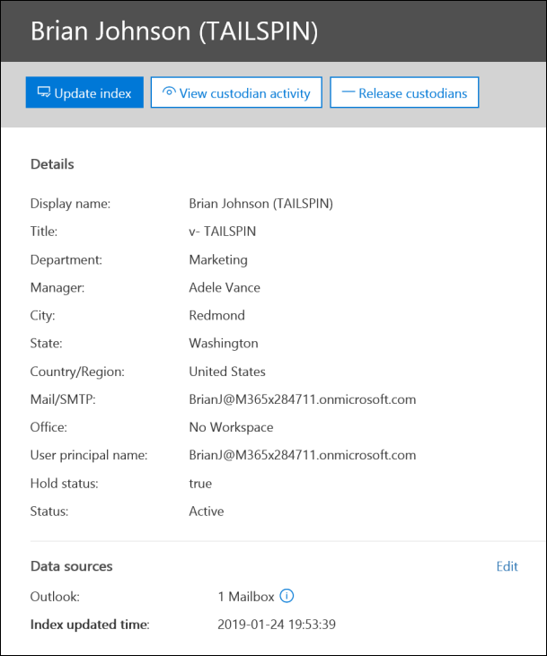

# Gerenciar custodiantes em um Advanced eDiscovery caso

A página Custodians na guia **Fontes em** uma Advanced eDiscovery contém uma lista de todos os custodiantes que foram adicionados ao caso. Depois de adicionar os custodiantes a um caso, os detalhes sobre cada custodiante são coletados automaticamente do Azure Active Directory e podem ser visualizados Advanced eDiscovery.

## Exibir detalhes do custodiado

Para exibir os detalhes sobre um custodiante, clique no custodiante da lista na **guia Custodiantes.** Uma página de sobrevoo é exibida e contém as seguintes informações sobre o custodiado:

- Informações de contato

  - **Nome de** exibição - O nome exibido no livro de endereços do custodiado. Geralmente, essa é a combinação do nome do custodiante, inicial do meio e sobrenome.
  
   - **Email/SMTP** - O endereço SMTP principal do custodiante, por exemplo, brianj@contoso.onmicrosoft.com. O nome principal do usuário (UPN) do custodiante também está listado.

  - **Título** - O cargo do custodiado.

  - **Departamento** - O nome do departamento no qual o custodiado trabalha.

  - **Gerente** - O gerente do custodiante. O gerente designado receberá comunicações de escalonamento desse custodiante.
  
- Informações de local

  - **Cidade** - A cidade na qual o custodiado está localizado.

  - **Estado** - O estado ou a província no endereço do custodiado.

  - **País/Região** - O país/região onde o custodiatário está localizado.

  - **Office** - O local do escritório no local de trabalho do custodiado.

- Informações de caso

  - **Status de espera** - Indica se o custodiado foi colocado em espera. 

  - **Status da** comunicação : indica se o custodiado foi emitido um aviso de missão. Se o custodiante tiver sido emitido um aviso, esse valor dessa propriedade será **Publicado**. Se o custodiante não tiver sido emitido um aviso, o status será **Não publicado**. 

  - **Status** - O status do custodiante dentro do caso. Um status **ativo** indica que o custodiante faz parte do caso. Se um custodiante for liberado de um caso, o status será alterado para **Released**. 

- Fontes de dados e informações de indexação

    - **Fontes de** dados - mostra a contagem e o tipo de fontes de dados (caixas de correio, sites e Teams) que estão associadas ao custodiante e fazem parte do caso.

    - **Hora atualizada do** índice - Indica a hora e a data para quando o trabalho de indexação avançada foi disparado pela última vez. Essa propriedade também indicará quando o processo avançado de indexação está em andamento.

## Editar um custodiado

À medida que seu caso avança, você pode descobrir que pode haver fontes de dados adicionais relevantes para um custodiante específico & seu caso. Em outros cenários, talvez você queira remover determinadas fontes de dados que foram revisadas e consideradas não relevantes.

Para atualizar as fontes de dados associadas a um custodiante:

1. Vá para **a > Advanced eDiscovery** e abra o caso.
  
2. Clique na **guia Fontes.**
  
3. Na página **Custodiantes,** selecione um custodiante na lista e clique em **Editar** na página de sobrevoo.

    
  
4. Clique **em Escolher fontes de** dados guia para alterar as configurações da caixa de correio Exchange do custodiante e OneDrive conta, clique em Escolher fontes de **dados**.
  
5. Clique na **guia Selecionar fontes de dados** adicionais para adicionar ou remover Teams, SharePoint ou Exchange caixas de correio associadas ao custodiante. 

    Para obter mais informações sobre fontes de dados associadas a um custodiante, consulte [Add custodians to a case](add-custodians-to-case.md). 
  
6. Clique **em Colocar reter a custodia** para habilitar ou desabilitar a responsabilidade do custodiante.

## Re indexar dados custodiados

Na maioria dos fluxos de trabalho de Descoberta Eletrônico para investigações legais, um subconjunto de dados de um custodiante é pesquisado depois que o custodiante é adicionado a um caso legal. Devido a tamanhos de arquivo muito grandes ou possível corrupção de dados, alguns itens nas fontes de dados associadas a um custodiante podem ser parcialmente indexados. Usando o [recurso de indexação](indexing-custodian-data.md) avançada no Advanced eDiscovery, a maioria dos itens indexados parcialmente pode ser corrigida automaticamente re indexando esses itens sob demanda.

Quando um custodiante é adicionado a uma ocorrência, os dados localizados nas fontes de dados associadas ao custodiante são automaticamente indexados (pelo processo avançado de indexação). Isso significa que você pode deixar os dados in-locar em vez de ter que baixá-los e remediar e, em seguida, pesquisá-los offline). No entanto, durante o ciclo de vida de um caso legal, novas fontes de dados podem ser associadas a um custodiante. Nesse caso, você pode re indexar os dados do custodiante executando o processo avançado de indexação para correção de itens parcialmente indexados e atualizar o índice para os dados do custodiante.

Para disparar o processo de re indexação para resolver itens parcialmente indexados:

1. Vá para **a > Advanced eDiscovery** e abra o caso.

2. Clique na **guia Fontes.**

3. Na página **Custodiantes,** selecione um custodiante cujos dados devem ser reindexados.

4. Na página sobrevoo, clique em **Atualizar índice**.

   Uma caixa de diálogo é exibida dizendo que o trabalho de índice foi criado.

A re indexação de dados de custodiante é um processo de longa duração; o trabalho correspondente criado é chamado **de Re-indexação de dados custodiados**. Você pode acompanhar o progresso na guia **Trabalhos** ou na guia **Custodiantes** monitorando o status na coluna Status do trabalho **de indexação.**

Para saber mais, confira:

- [Trabalhar com erros de processamento](processing-data-for-case.md)

- [Gerenciar tarefas](managing-jobs-ediscovery20.md)

## Liberar um custodiante de um caso

Um custodiante é liberado em situações em que um caso é fechado, o custodiante não tem mais a obrigação de preservar o conteúdo de um caso ou quando o custodiante é considerado como não mais relevante para o caso. 

Se você liberar um custodiante depois que um aviso de hold foi publicado, um aviso de versão será enviado para o custodiante. Além disso, todas as reteres colocadas em fontes de dados associadas ao custodiante são removidas. Se o custodiante foi colocado em uma espera silenciosa *,* onde não foram emitidas notificações de responsabilidade legal, um aviso de liberação não será enviado, mas quaisquer reteres colocados em fontes de dados associadas a esse custodiante serão removidas.

Para liberar um custodiado: 

1. Vá para **a > Advanced eDiscovery** e abra o caso.

2. Clique na **guia Fontes.**

3. Na página **Custodiantes** e selecione o custodiante que está sendo liberado do caso.

4. Na página de sobrevoo, clique em **Liberar custodiante**.

   Uma página de aviso é exibida explicando que, se uma responsabilidade for colocada em uma fonte de dados associada ao custodiante, a responsabilidade será removida e que qualquer outra reter associada a um caso de Advanced eDiscovery diferente ainda será aplicada. Isso inclui outros tipos de recursos de preservação e retenção (como uma Microsoft 365 de retenção).

5. Clique **em Sim** para confirmar se deseja liberar o custodiado. 

    O status desse usuário na guia **Custodiantes** é definido como Liberado e o  **status** de Bloqueio na página de sobrevoo é alterado para **False**. 

> [!NOTE]
> Um custodiado pode estar simultaneamente envolvido em vários casos legais. Quando um custodiante é liberado de um caso, as resitências e notificações em outras questões não serão impactadas.

## Custodiantes de edição em massa

Você pode usar o editor em massa para editar vários custodiantes ao mesmo tempo. Para fazer isso, selecione dois ou mais custodiantes na guia **Custodiantes** para exibir o editor em massa e clique em uma das tarefas.

