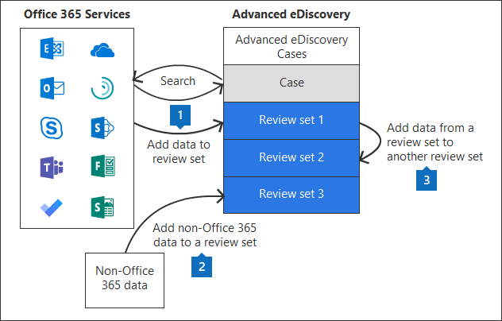

# Gerenciar conjuntos de análise na descoberta eletrônica avançadaManage review sets in Advanced eDiscovery

Os conjuntos de revisão são um conjunto estático de documentos onde você pode analisar, consultar, exibir, marcar e exportar dados em um caso.Review sets are a static set of documents where you can analyze, query, view, tag, and export data in a case. Para obter mais informações sobre como executar essas tarefas, consulte:For more information about performing these tasks, see:

- [Analisar dados em um conjunto de revisãoAnalyze data in a review set](analyzing-data-in-review-set.md)

- [Consultar os dados em um conjunto de revisãoQuery the data in a review set](review-set-search.md)

- [Exibir documentos em um conjunto de revisãoView documents in a review set](view-documents-in-review-set.md)

- [Marcar documentos em um conjunto de revisãoTag documents in a review set](tagging-documents.md)

- [Exportar dados de ocorrênciaExport case data](exporting-data-ediscover20.md)

## Criar um conjunto de revisãoCreate a review set

Os conjuntos de revisão podem ser criados na guia **conjuntos de revisão** clicando em **+ Adicionar conjunto de revisão**.Review sets can be created on the **Review sets** tab by clicking **+ Add review set**.

Na página **Adicionar** submenu do conjunto de revisão, digite um nome para o conjunto de revisão e clique em **salvar**.On the **Add review set** flyout page, type a name for the review set and then click **Save**. O novo conjunto de revisão é exibido na lista da guia **conjuntos de revisão** .The new review set is displayed in the list on the **Review sets** tab.

Há três maneiras diferentes de adicionar dados a uma análise definida em uma ocorrência de descoberta eletrônica avançada.There are three different ways to add data to a review set in an Advanced eDiscovery case.

1. [Adicionar resultados de pesquisa a um conjunto de revisãoAdd search results to a review set](add-data-to-review-set.md)

2. [Carregar dados que não sejam do Office 365 em um conjunto de revisãoLoad non-Office 365 data into a review set](load-non-office365-data.md)

3. [Adicionar dados a um conjunto de revisão de outro conjunto de revisãoAdd data to a review set from another review set](add-data-to-review-set-from-another-review-set.md)
