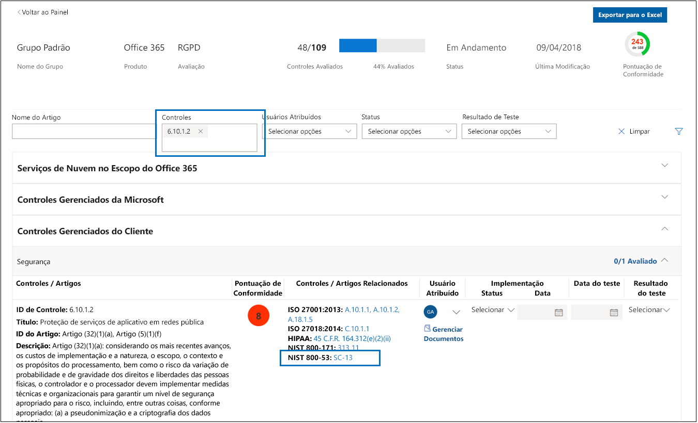
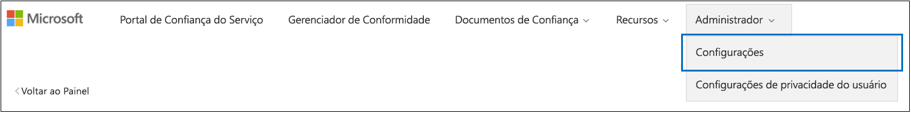
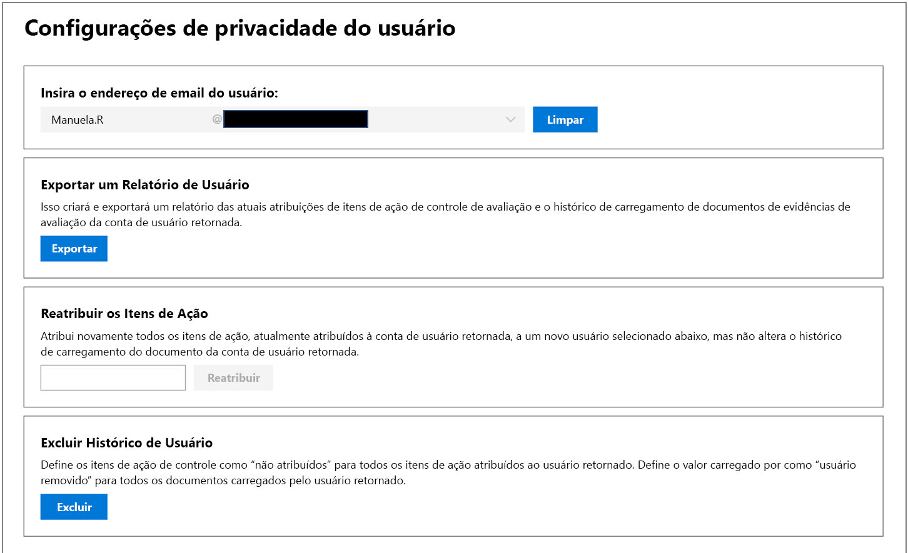
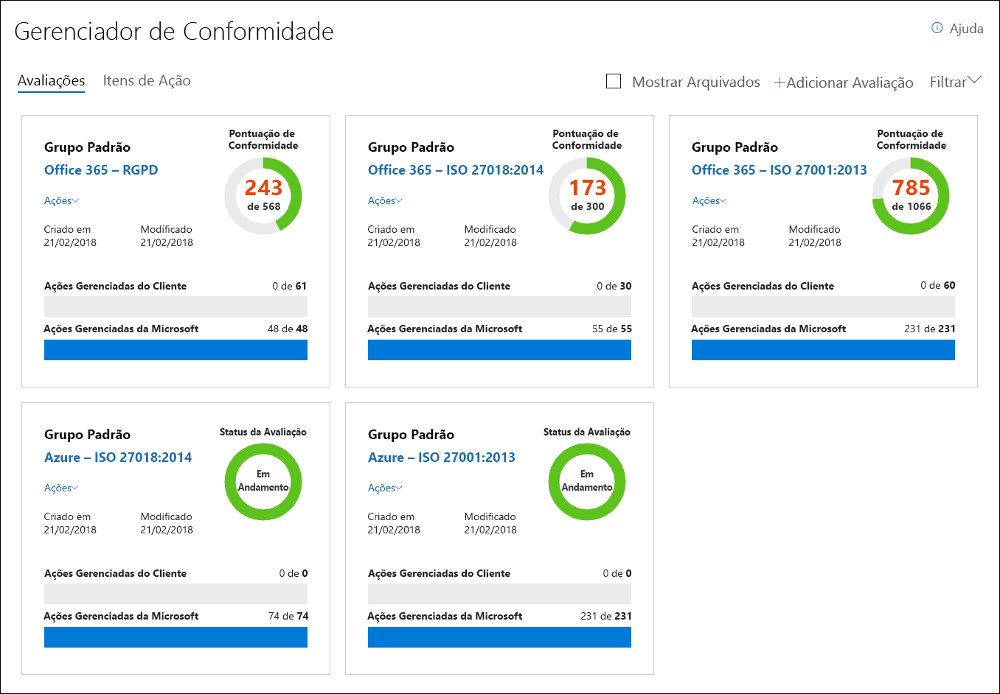
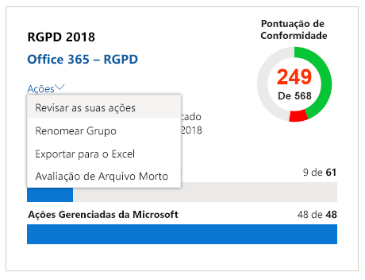

# Gerenciador de conformidade da Microsoft (Clássico)Microsoft Compliance Manager (classic)

> [!IMPORTANT]
> **O Gerenciador de Conformidade (clássico) será em breve removido do Portal de Confiança do Serviço da Microsoft.****Compliance Manager (classic) will soon be removed from the Microsoft Service Trust Portal.** Recomendamos que faça a transição para o novo [Gerenciador de Conformidade no Centro de conformidade do Microsoft 365](https://compliance.microsoft.com/), que fornece uma experiência do usuário aprimorada e um mapeamento de controle atualizado.We recommend that you transition to the new [Compliance Manager in the Microsoft 365 compliance center](https://compliance.microsoft.com/), which provides an enhanced user experience and updated control mapping. Os clientes que têm avaliações na versão clássica precisarão criar novas avaliações no novo Gerenciador de Conformidade.Customers who have assessments in the classic version will need to create new assessments in the new Compliance Manager. Quaisquer dados existentes, incluindo suas avaliações, controles e outros dados, não serão transferidos para o novo Gerenciador de Conformidade.Any existing data, including your assessments, controls, and other data, will not be transferred over to the new Compliance Manager. [Saiba mais sobre a transição](compliance-manager-faq.md#whats-happening-to-compliance-manager-classic-in-the-service-trust-portal).[Learn more about the transition](compliance-manager-faq.md#whats-happening-to-compliance-manager-classic-in-the-service-trust-portal).

*O Gerenciador de Conformidade não está disponível no Office 365 operado pela 21Vianet, Office 365 Germany, Office 365 US Government Community High (GCC High) ou Office 365 Department of Defense.**Compliance Manager isn't available in Office 365 operated by 21Vianet, Office 365 Germany, Office 365 U.S. Government Community High (GCC High), or Office 365 Department of Defense.*

O Gerenciador de Conformidade, uma ferramenta de avaliação de risco baseada no [Portal de Confiança do Serviço](https://docs.microsoft.com/microsoft-365/compliance/get-started-with-service-trust-portal) da Microsoft, permite monitorar, atribuir e verificar as atividades de conformidade normativas da sua organização relacionadas aos Serviços Profissionais e aos serviços em nuvem da Microsoft, como o Microsoft Office 365, o Microsoft Dynamics 365 e o Microsoft Azure.Compliance Manager, a workflow-based risk assessment tool in the Microsoft [Service Trust Portal](https://docs.microsoft.com/microsoft-365/compliance/get-started-with-service-trust-portal), enables you to track, assign, and verify your organization's regulatory compliance activities related to Microsoft Professional Services and Microsoft cloud services, such as Microsoft Office 365, Microsoft Dynamics 365, and Microsoft Azure.

Gerenciador de Conformidade:Compliance Manager:

- Combina as informações detalhadas fornecidas pela Microsoft para auditores e reguladores como parte de várias auditorias de terceiros dos serviços em nuvem da Microsoft em relação a vários padrões (por exemplo, ISO 27001, ISO 27018 e NIST) e as informações que a Microsoft compila internamente para sua conformidade com as regulamentações (como HIPAA ou o RGPD – Regulamento Geral sobre a Proteção de Dados da UE) com sua própria avaliação de conformidade da organização com esses padrões e regulamentações.Combines the detailed information provided by Microsoft to auditors and regulators as part of various third-party audits of Microsoft 's cloud services against various standards (for example, ISO 27001, ISO 27018, and NIST) and information that Microsoft compiles internally for its compliance with regulations (such as HIPAA and the EU General Data Protection Regulation, or GDPR) with your own self-assessment of your organization's compliance with these standards and regulations.

- Permite atribuir, controlar e registrar as atividades relacionadas à avaliação e conformidade, o que pode ajudar sua organização a cruzar as barreiras de equipe para alcançar as metas de conformidade da sua organização.Enables you to assign, track, and record compliance and assessment-related activities, which can help your organization cross team barriers to achieve your organization's compliance goals.

- Fornece uma Pontuação de Conformidade para ajudar a controlar o andamento e a priorizar os controles de auditoria que ajudam a reduzir a exposição ao risco da organização.Provides a Compliance Score to help you track your progress and prioritize the auditing controls that will help reduce your organization's exposure to risk.

- Fornece um repositório seguro para carregar e gerenciar evidências e outros artefatos relacionados às suas atividades de conformidade.Provides a secure repository for you to upload and manage evidence and other artifacts related to your compliance activities.

- Produz relatórios ricos e detalhados no Microsoft Excel que documentam as atividades de conformidade executadas pela Microsoft e por sua organização, que podem ser fornecidos aos auditores, reguladores e outros participantes de conformidade.Produces richly detailed reports in Microsoft Excel that document the compliance activities performed by Microsoft and your organization, which can be provided to auditors, regulators, and other compliance stakeholders.

> [!IMPORTANT]
> O Gerenciador de Conformidade é um painel que fornece um resumo de sua estatura de conformidade e de proteção de dados e as recomendações para melhorar a conformidade e a proteção de dados. As Ações de clientes fornecidas no Gerenciador de Conformidade são recomendações; cabe a cada organização avaliar a eficácia dessas recomendações em seus respectivos ambientes regulatórios antes da implementação. As recomendações encontradas no Gerenciador de Conformidade não devem ser interpretadas como garantia de conformidade.Compliance Manager is a dashboard that provides a summary of your data protection and compliance stature and recommendations to improve data protection and compliance. The Customer Actions provided in Compliance Manager are recommendations; it is up to each organization to evaluate the effectiveness of these recommendations in their respective regulatory environment prior to implementation. Recommendations found in Compliance Manager should not be interpreted as a guarantee of compliance.

## O que é o Gerenciador de Conformidade?What is Compliance Manager?

O Gerenciador de Conformidade é uma ferramenta de avaliação de risco com base no fluxo de trabalho projetada para ajudar a gerenciar a conformidade regulamentar no modelo de responsabilidade compartilhada da nuvem. O Gerenciador de Conformidade fornece um modo de exibição do painel de padrões, regulamentações e avaliações que contém detalhes de implementação de controles e resultados de testes da Microsoft, bem como orientação e rastreamento da implementação de controle do cliente para sua organização seguir. O Gerenciador de Conformidade fornece definições de controle de avaliação de certificação, orientação na implementação e testes de controles, pontuação ponderada de risco de controles, gerenciamento de acesso baseado na função e um fluxo de trabalho de atribuição de ação de controle in-loco para acompanhar a implementação de controles, o status de testes e o gerenciamento de evidências. O Gerenciador de Conformidade otimiza a carga de trabalho de conformidade, permitindo que os clientes agrupem as avaliações de forma lógica e que apliquem os testes de controle de avaliação a controles idênticos ou relacionados, reduzindo a duplicação de esforços que poderiam ser necessários para atender a requisitos de controle idênticos em certificações diferentes.Compliance Manager is a workflow-based risk assessment tool designed to help you manage regulatory compliance within the shared responsibility model of the cloud. Compliance Manager provides you with a dashboard view of standards and regulations and assessments that contain Microsoft's control implementation details and test results and customer control implementation guidance and tracking for your organization to enter. Compliance Manager provides certification assessment control definitions, guidance on implementation and testing of controls, risk-weighted scoring of controls, role-based access management, and an in-place control action assignment workflow to track control implementation, testing status and evidence management. Compliance Manager optimizes compliance workload by enabling customers to logically group assessments together and apply assessment control testing to identical or related controls, reducing the duplication of effort that might otherwise be required to satisfy identical control requirements across different certifications.

## Avaliações no Gerenciador de ConformidadeAssessments in Compliance Manager

O componente principal do Gerenciador de Conformidade é chamado de *Avaliação*. Uma Avaliação avalia um serviço da Microsoft em relação a um padrão de certificação ou regulamentação de proteção de dados (como ISO 27001:2013 e o RGPD). As avaliações ajudam a discernir a postura de conformidade e proteção de dados da sua organização em relação ao padrão do setor do serviço de nuvem da Microsoft selecionado. As avaliações são concluídas com a implementação dos controles que mapeiam os padrões de certificação sob avaliação.The core component of Compliance Manager is called an *Assessment*. An Assessment is an assessment of a Microsoft service against a certification standard or data protection regulation (such as ISO 27001:2013, and the GDPR). Assessments help you to discern your organization's data protection and compliance posture against the selected industry standard for the selected Microsoft cloud service. Assessments are completed by the implementation of the controls that map to the certification standard being assessed.

A estrutura de uma Avaliação baseia-se na responsabilidade que é compartilhada entre a Microsoft e a sua organização para avaliar os riscos de segurança e conformidade na nuvem e implementar as garantias de proteção de dados especificadas por um padrão de conformidade, um padrão de proteção de dados, uma regulamentação ou uma lei.The structure of an Assessment is based on the responsibility that is shared between Microsoft and your organization for assessing security and compliance risks in the cloud and for implementing the data protection safeguards specified by a compliance standard, a data protection standard, a regulation, or a law.

Uma Avaliação tem vários componentes, que são:An Assessment is made of several components, which are:

- **Serviços no Escopo** – cada avaliação se aplica a um conjunto específico de serviços Microsoft, que são listados na seção Serviços em nuvem no escopo.**In-Scope Services** - Each assessment applies to a specific set of Microsoft services, which are listed in the In-Scope Cloud Services section.

- **Controles Gerenciados pela Microsoft** – para cada serviço de nuvem, a Microsoft implementa e gerencia um conjunto de *controles* como parte da conformidade da Microsoft com vários padrões e regulamentações. Esses controles são organizados em *famílias de controles*, que se alinham com a estrutura de certificação ou regulamentação correspondente à qual a Avaliação está alinhada. Para cada controle gerenciado pela Microsoft, o Gerenciador de Conformidade fornece detalhes sobre como a Microsoft implementou o controle, como isso foi feito e quando essa implementação foi testada e validada por um auditor independente de terceiros.**Microsoft-Managed Controls** - For each cloud service, Microsoft implements and manages a set of  *controls*  as part of Microsoft's compliance with various standards and regulations. These controls are organized into  *control families*  that align with the structure from the corresponding certification or regulation that the Assessment is aligned to. For each Microsoft-managed control, Compliance Manager provides details about how Microsoft implemented the control, along with how and when that implementation was tested and validated by an independent third-party auditor.

  Aqui está um exemplo de três controles gerenciados pela Microsoft na família de controle **Segurança** de uma Avaliação do Office 365 e do RGPD.Here's an example of three Microsoft-managed controls in the **Security** control family from an Assessment of Office 365 and the GDPR.

    

  a. Especifica as seguintes informações de certificação ou regulamentação mapeadas pelo controle gerenciado pela Microsoft.a. Specifies the following information from the certification or regulation that maps to the Microsoft-managed control.

  - **ID de Controle** – o número do artigo ou seção da certificação ou regulamentação mapeada pelo controle.**Control ID** - The section or article number from the certification or regulation that the control maps to.

  - **Título** – o título da regulamentação ou certificação correspondente.**Title** - The title from the corresponding certification or regulation.

  - **ID do artigo** – esse campo é incluído somente para avaliações do RGPD, pois especifica o número do artigo correspondente do RGPD.**Article ID** - This field is included only for GDPR assessments, as it specifies the corresponding GDPR article number.

  - **Descrição** – texto do padrão ou regulamentação mapeado pelo Controle de gerenciado da Microsoft selecionado.**Description** - Text of the standard or regulation that maps to the selected Microsoft-managed control.

  b. A pontuação de conformidade do controle, que indica o nível de risco (devido à falha do controle ou não conformidade) associado a cada controle gerenciado pela Microsoft. Confira [Noções básicas sobre a pontuação de conformidade](#understanding-the-compliance-score) para saber mais. Observe que as Pontuações de conformidade são classificadas de 1 a 10 e são codificadas por cores. Amarelo indica os controles de baixo risco, laranja indica controles de médio risco e vermelho indica controles de alto risco.b. The Compliance Score for the control, which indicates the level of risk (due to non-compliance or control failure) associated with each Microsoft-managed control. See [Understanding the Compliance Score](#understanding-the-compliance-score) for more information. Note that Compliance Scores are rated from 1 to 10 and are color-coded. Yellow indicates low risk controls, orange indicates medium-risk controls, and red indicated high-risk controls.

  c. Informações sobre o status de implementação de um controle, a data de teste do controle, quem executou o teste e o resultado de teste.c. Information about the implementation status of a control, the date the control was tested, who performed the test, and the test result.

  d. Para cada controle, clique em **Mais** para ver informações adicionais, incluindo detalhes sobre a implementação do controle pela Microsoft e os detalhes sobre como o controle foi testado e validado por um auditor independente de terceiros.d. For each control, you can click **More** to see additional information, including details about Microsoft's implementation of the control and details about how the control was tested and validated by an independent third-party auditor.

- **Controles gerenciados pelo cliente** – este é o conjunto de controles gerenciados pela sua organização. Sua organização é responsável por implementar esses controles como parte do processo de conformidade para um determinado padrão ou regulamentação. Os controles gerenciados pelo cliente também são organizados em famílias de controles para regulamentação ou certificação correspondente. Use os controles gerenciados pelo cliente para implementar as ações recomendadas sugeridas pela Microsoft como parte das atividades de conformidade. Sua organização pode usar a orientação prescritiva e as Ações do cliente recomendadas em cada controle gerenciado pelo cliente para gerenciar o processo de implementação e avaliação desse controle.**Customer-Managed Controls** - This is the collection of controls that are managed by your organization. Your organization is responsible for implementing these controls as part of your compliance process for a given standard or regulation. Customer-managed controls are also organized into control families for the corresponding certification or regulation. Use the customer-managed controls to implement the recommended actions suggested by Microsoft as part of your compliance activities. Your organization can use the prescriptive guidance and recommended Customer Actions in each customer-managed control to manage the implementation and assessment process for that control.

  Os controles gerenciados pelo cliente em Avaliações também têm a funcionalidade interna de gerenciamento de fluxo de trabalho que você pode usar para gerenciar e acompanhar o progresso da organização para concluir a Avaliação. Por exemplo, o Responsável pela conformidade em sua organização pode atribuir um Item de ação para um administrador de TI que tenha a responsabilidade e as permissões necessárias para executar as ações recomendadas para o controle. Após a conclusão do trabalho, o administrador de TI pode carregar as evidências das tarefas de implementação (por exemplo, capturas de tela das configurações ou configurações de políticas) e atribuir o Item de ação de volta para o Responsável pela conformidade avaliar as evidências coletadas, testar a implementação do controle e registrar a data de implementação e os resultados do teste no Gerenciador de Conformidade. Para saber mais, confira a seção [Como gerenciar o processo de avaliação](#managing-the-assessment-process) no artigo.Customer-managed controls in Assessments also have built-in workflow management functionality that you can use to manage and track your organization's progress towards completing the Assessment. For example, a Compliance Officer in your organization can assign an Action Item to an IT admin who has the responsibility and necessary permissions to perform the actions that are recommended for the control. When that work is complete, the IT admin can upload evidence of their implementation tasks (for example, screenshots of configuration or policy settings) and then assign the Action Item back to the Compliance Officer to evaluate the collected evidence, test the implementation of the control, and record the implementation date and test results in Compliance Manager. For more information, see the [Managing the assessment process](#managing-the-assessment-process) section in the article.

## Permissões e controle de acesso baseado na funçãoPermissions and role-based access control

O Gerenciador de Conformidade usa um modelo de permissão de controle de acesso baseado em função.Compliance Manager uses a role-based access control permission model. Somente usuários aos quais é atribuída uma função de usuário podem acessar o Gerenciador de Conformidade, e as ações permitidas por cada usuário são restritas por tipo de função.Only users who are assigned a user role may access Compliance Manager, and the actions allowed by each user are restricted by role type.

Observe que não há mais uma função padrão **Acesso do Convidado**.Note that there is no longer a default **Guest access** role. Cada usuário deve ter uma função atribuída para acessar e trabalhar no Gerenciador de Conformidade.Each user must be assigned a role in order to access and work within Compliance Manager.

A tabela a seguir descreve cada permissão do Gerenciador de Conformidade e o que ela permite que o usuário faça. A tabela também indica a função para a qual cada permissão é atribuída.The following table describes each Compliance Manager permission and what it allows the user do. The table also indicates the role that each permission is assigned to.

|PermissãoPermission|Leitor do Gerenciador de ConformidadeCompliance Manager Reader|Colaborador do Gerenciador de ConformidadeCompliance Manager Contributor|Avaliador do Gerenciador de ConformidadeCompliance Manager Assessor|Administrador do Gerenciador de ConformidadeCompliance Manager Administrator|Administrador do PortalPortal Admin|
|---|:---:|:---:|:---:|:---:|:---:|
|**Ler dados** – os usuários podem ler, mas não podem editar os dados.**Read data** - Users can read but not edit data.||||||
|**Editar dados** – os usuários podem editar todos os campos, exceto os campos Resultado e Data do teste.**Edit data** - Users can edit all fields, except the Test Result and Test Date fields.||||||
|**Editar resultados do teste** – os usuários podem editar os campos Resultado e Data do teste.**Edit test results** - Users can edit the Test Result and Test Date fields.||||||
|**Gerenciar avaliações** – os usuários podem criar, arquivar e excluir as Avaliações.**Manage assessments** - Users can create, archive, and delete Assessments.||||||
|**Gerenciar usuários** – os usuários podem adicionar outros usuários em sua organização nas funções de Leitor, Colaborador, Consultor e Administrador. Somente os usuários com a função de Administrador Global na organização podem adicionar ou remover os usuários da função de Administrador do Portal.**Manage users** - Users can add other users in their organization to the Reader, Contributor, Assessor, and Administrator roles. Only those users with the Global Administrator role in your organization can add or remove users from the Portal Admin role.||||||
|

## Noções básicas sobre a Pontuação de ConformidadeUnderstanding the Compliance Score

No Painel, o Gerenciador de Conformidade exibe uma pontuação total das avaliações do Office 365 no canto superior direito do bloco.On the Dashboard, Compliance Manager displays a total score for Office 365 assessments in the upper right-hand corner of the tile. Esta é a Pontuação de Conformidade total geral da Avaliação e representa o acúmulo de pontos recebidos de cada avaliação de controle que foi marcada como Implementada e Testada na Avaliação.This is the overall total Compliance Score for the Assessment, and is the accumulation of points received for each control assessment that has been marked as Implemented and Tested in the Assessment. Ao adicionar uma Avaliação, você verá que a Pontuação de Conformidade já está a caminho da conclusão porque os pontos para os controles gerenciados pela Microsoft que foram implementados pela Microsoft e testados por terceiros independentes já estão aplicados.When adding an Assessment, you will see that the Compliance Score is already on the way towards completion because the points for the Microsoft-managed controls that have been implemented by Microsoft and tested by independent third parties are already applied.

Os pontos restantes vêm da avaliação bem-sucedida do controle do cliente, desde a implementação e teste dos controles gerenciados pelo cliente, cada um com um valor específico que contribui para a pontuação geral de conformidade.The remaining points come from the successful customer control assessment, from the implementation and testing of the customer-managed controls, each of which has a specific value that contributes to the overall compliance score.

Cada Avaliação exibe uma Pontuação de Conformidade com base em risco para ajudá-lo a avaliar o nível de risco (devido a reprovação por falta de conformidade ou controle) associado a cada controle (inclusive os controles gerenciados pela Microsoft e pelo cliente) em uma Avaliação.Each Assessment displays a risk-based Compliance Score to help you assess the level of risk (due to non-compliance or control failure) associated with each control (including both Microsoft managed and customer-managed controls) in an Assessment. A cada controle gerenciado pelo cliente é atribuído um número de pontos possíveis (chamado de \*classificação de gravidade), em uma escala de 1 a 10, onde mais pontos serão concedidos para controles associados a um fator de risco mais alto se o controle falhar e menos pontos serão concedidos para controles de risco menores.Each customer-managed control is assigned a possible number of points (called a  \*severity ranking) on a scale from 1 to 10, where more points are awarded for controls associated with a higher risk factor if the control fails, and fewer points are awarded for lower-risk controls.

Por exemplo, o controle de avaliação do Gerenciamento de acesso do usuário mostrado abaixo tem uma classificação de risco de gravidade muito alta e exibe um valor atribuído de 10.For example, the User Access Management assessment control shown below has a very high severity risk ranking, and displays an assigned value of 10.

 Em comparação, o controle de avaliação de Backup de informações mostrado abaixo tem uma classificação de risco de gravidade baixa e exibe um valor atribuído de 3.By comparison, the Information Backup assessment control shown below has a lower severity risk ranking, and displays an assigned value of 3.

O Gerenciador de Conformidade atribui uma classificação de severidade padrão para cada controle. As classificações de risco são calculadas com base nos seguintes critérios:The Compliance Manager assigns a default severity ranking to each control. Risk rankings are calculated based on the following criteria:

- Se um controle impede a ocorrência de incidentes (classificação mais alta), detecta incidentes que ocorreram ou corrige o impacto de um incidente (classificação mais baixa).Whether a control prevents incidents from happening (highest ranking), detects incidents that have happened, or corrects the impact of an incident (lowest ranking). Em termos de classificação de gravidade, um controle obrigatório que impede uma ameaça recebe o número mais alto de pontos; os controles que são detetivos ou corretivos (independentemente de serem obrigatórios ou facultativos) recebem o número menor de pontos.In terms of severity ranking, a mandatory control that prevents a threat is assigned the highest number of points; controls that are detective or corrective (regardless of whether they're mandatory or discretionary) are assigned the lowest number of points.

- Se for um controle obrigatório (depois que for implementado) e, portanto, não pode ser ignorado pelos usuários (por exemplo, os usuários tem que redefinir a senha e atender aos requisitos de comprimento e caracteres da senha) ou se for opcional e os usuários podem ignorá-lo (por exemplo, as regras de negócios que exigem que os usuários bloqueiem suas telas quando os computadores estão sem supervisão).Whether a control (after it's been implemented) is mandatory and therefore can't be by-passed by users (for example, users having to reset their password and meet password length and character requirements) or discretionary and can be by-passed by users (for example, business rules that require users to lock their screens when their computers are unattended).

- Controles relacionados aos riscos de confidencialidade, integridade e disponibilidade de dados, quer esses riscos venham de ameaças internas ou externas e se forem acidentais ou mal-intencionadas. Por exemplo, são atribuídos mais pontos aos controles que podem ajudar a impedir que um invasor externo viole a rede e obtenha acesso a informações de identificação pessoal do que a um controle relacionado a impedir que um funcionário configure acidentalmente um roteador de rede de forma incorreta que resulte em uma interrupção da rede.Controls related to risks to data confidentiality, integrity, and availability, whether these risks come from internal or external threats, and whether the threat is malicious or accidental. For example, controls that would help prevent an external attacker from breaching that network and gaining access to personally identifiable information would be assigned more points than a control related to preventing an employee from accidentally mis-configuring a network router setting that results in a network outage).

- Os riscos relacionados a gatilhos legais e externos, como contratos, regulamentos e compromissos públicos, para cada controle.Risks related to legal and external drivers, such as contracts, regulations, and public commitments, for each control.

Os valores exibidos da Pontuação de Conformidade de um controle são aplicados *em sua totalidade* à Pontuação total de conformidade em uma base de aprovar/reprovar, ou seja, o controle é implementado e passa no teste de avaliação subsequente ou não; não há crédito parcial para uma implementação parcial. Somente quando o controle tem seu **Status de Implementação** definido como **Implementado** ou **Implementação Alternativa** e o **Resultado do Teste** é definido como **Aprovado** que os pontos atribuídos são adicionados à Pontuação total de conformidade.The displayed Compliance Score values for the control are applied  *in their entirety*  to the Total Compliance Score on a pass/fail basis--either the control is implemented and passes the subsequent assessment test or it does not; there is no partial credit for a partial implementation. Only when the control has its **Implementation Status** set to **Implemented** or **Alternative Implementation** and the **Test Result** is set to **Passed** are the assigned points added to the Total Compliance Score.

O mais importante é que a Pontuação de Conformidade pode ajudar a priorizar em quais controles você deve se concentrar na implementação porque ela indica os controles cujo potencial de risco é maior, caso ocorra uma falha relacionada a um controle.Most importantly, the Compliance Score can help you prioritize which controls to focus on for implementation by indicating which controls that have a higher potential risk if there is a failure related to a control. Além da priorização baseada em risco, quando os controles de avaliação estão relacionados a outros controles (na mesma avaliação ou em outra avaliação no mesmo agrupamento de avaliações), a conclusão de um único controle com sucesso pode resultar em uma redução significativa do esforço com base na sincronização dos resultados de testes de controle.In addition to risk-based prioritization, when assessment controls are related to other controls (either within the same assessment or in another assessment in the same assessment grouping), completing a single control successfully can result in a significant reduction of effort based on the synchronization of control test results.

Por exemplo, na imagem abaixo vemos que a Avaliação de RGPD no Office 365 atualmente está com 46% concluído, com 51 de 111 avaliações de controle concluídas para uma Pontuação total de conformidade de 289 em um máximo de 600.For example, in the image below we see that the Office 365 - GDPR Assessment is currently 46% assessed, with 51 of 111 control assessments completed for a Total Compliance score of 289 out of a possible 600.

Na avaliação, o controle GDPR 7.5.5 está relacionado a 5 outros controles (7.4.1, 7.4.3, 7.4.4, 7.4.8 e 7.4.9), cada um com uma pontuação de classificação de risco de severidade de moderada a alta - 6 ou 8).Within the assessment GDPR control 7.5.5 is related to 5 other controls (7.4.1, 7.4.3, 7.4.4, 7.4.8, and 7.4.9) each with a moderate to high severity risk rating score of 6 or 8). Por meio do filtro de avaliação, marcamos todos esses controles, tornando-os visíveis no modo de exibição de avaliação e podemos ver abaixo que nenhum deles foi avaliado.Using the assessment filter, we have selected all of these controls, making them visible in the assessment view, and can see below that none of them have been assessed.

 Como esses 6 controles estão relacionados, a conclusão de qualquer um deles causará a sincronização dos resultados do teste entre os controles relacionados dentro da avaliação (da mesma forma que ocorre com qualquer controle relacionado em uma avaliação que esteja no mesmo grupo de avaliação). Após a conclusão da implementação e do teste do controle RGPD 7.5.5, a área de detalhes de controle é atualizada para mostrar que todos os 6 controles foram avaliados, com um aumento correspondente no número de controles avaliados para 57 e 51% avaliados, e uma mudança na Pontuação de Conformidade total de +40.As those 6 controls are related, the completion of any one them will result in a synchronization of those test results across the related controls within this assessment (just as it will for any related controls in an assessment that is in the same assessment grouping). Upon completion of the implementation and testing of GDPR control 7.5.5, the control detail area refreshes to show that all 6 controls have been assessed, with a corresponding increase in the number of assessed controls to 57 and 51% assessed, and a change in total Compliance Score of +40.

Essa caixa de diálogo de atualização de confirmação será exibida se você tentar alterar o Status de implementação de um controle relacionado de maneira que afete os outros controles relacionados.This confirmation update dialog box will appear if you are about to change the Implementation Status of a related control in a way that will impact the other related controls.

> [!NOTE]
> Atualmente, apenas as Avaliações de serviços em nuvem do Office 365 incluem uma Pontuação de Conformidade. As Avaliações do Azure e Dynamics mostram um status de avaliação.Currently, only Assessments for Office 365 cloud services include a Compliance Score. Assessments for Azure and Dynamics show an assessment status.

## Metodologia da Pontuação de ConformidadeCompliance Score methodology

A Pontuação de Conformidade, como a Microsoft Secure Score, é semelhante a outros sistemas de pontuação com base no comportamento; as atividades da sua organização podem aumentar a Pontuação de Conformidade executando atividades relacionadas à segurança, privacidade e proteção de dados.The Compliance Score, like the Microsoft Secure Score, is similar to other behavior-based scoring systems; your organization's activity can increase its Compliance Score by performing activities related to data protection, privacy, and security.

> [!NOTE]
> A Pontuação de Conformidade não expressa uma medida absoluta da conformidade organizacional em relação a qualquer padrão ou regulamentação específicos. Ela expressa até que ponto você adotou os controles que podem reduzir os riscos aos dados pessoais e à privacidade individual. Nenhum serviço pode garantir que você esteja em conformidade com um padrão ou regulamentação e a Pontuação de Conformidade não deve ser interpretada como uma garantia de forma alguma.The Compliance Score does not express an absolute measure of organizational compliance with any particular standard or regulation. It expresses the extent to which you have adopted controls which can reduce the risks to personal data and individual privacy. No service can guarantee that you are compliant with a standard or regulation, and the Compliance Score should not be interpreted as a guarantee in any way.

As Avaliações no Gerenciador de Conformidade são baseadas no modelo de responsabilidade compartilhada para computação em nuvem. No Modelo de responsabilidade compartilhada, a Microsoft e cada cliente compartilham a responsabilidade de proteção dos dados do cliente quando esses dados são armazenados em nossa nuvem.Assessments in Compliance Manager are based on the shared responsibility model for cloud computing. In the shared responsibility model, Microsoft and each customer share responsibility for the protection of the customer's data when that data is stored in our cloud.

Como se vê na Avaliação de RGPD do Office 365 abaixo, tanto a Microsoft como os clientes são responsáveis por executar diversas Ações projetadas para atender aos requisitos do padrão ou da regulamentação em avaliação.As shown in the Office 365 GDPR Assessment below, Microsoft and customers are each responsible for performing a variety of Actions that are designed to satisfy the requirements of the standard or regulation being assessed. Para racionalizar e compreender o necessário.To rationalize and understand the required. Ações em uma variedade de padrões e regulamentos, o Gerenciador de Conformidade trata todos os padrões e regulamentos como se fossem estruturas de controle.Actions across a variety of standards and regulations, Compliance Manager treats all standards and regulations as if they were control frameworks. Desse modo, as Ações realizadas pela Microsoft e pelos clientes para cada Avaliação envolvem a implementação e a validação de diversos controles.Thus, the Actions performed by Microsoft and by customers for each Assessment involve the implementation and validation of various controls.

Aqui está o fluxo de trabalho básico de uma Ação típica:Here's the basic workflow for a typical Action:

1. O Diretor de proteção de dados e/ou Conformidade, Risco e Privacidade de uma organização atribui as tarefas a alguém na organização para implementar um controle. Essa pessoa pode ser:The Compliance, Risk, Privacy, and/or Data Protection Officer of an organization assigns the task to someone in the organization to implement a control. That person could be:

   - Um proprietário de política da empresaA business policy owner

   - Um implementador de TIAn IT implementer

   - Outra pessoa na organização que seja responsável por executar a tarefaAnother individual in the organization who has responsibility for performing the task

2. Esse indivíduo executa as tarefas necessárias para implementar o controle, carrega as evidências de implementação no Gerenciador de Conformidade e marca os controles vinculados à Ação conforme implementados. Depois que essas tarefas forem concluídas, a Ação é atribuída a um Consultor para validação. Os Consultores podem ser:That individual performs the tasks necessary to implement the control, uploads evidence of implementation into Compliance Manager, and marks the control(s) tied to the Action as implemented. Once these tasks are completed, they assign the Action to an Assessor for validation. Assessors can be:

   - Consultores internos que executam a validação de controles na organizaçãoInternal assessors that perform validation of controls within an organization

   - Consultores externos que examinam, verificam e certificam a conformidade, como as organizações independentes de terceiros que auditam os serviços em nuvem da MicrosoftExternal assessors that examine, verify, and certify compliance, such as the third-party independent organizations that audit Microsoft's cloud services

3. O Consultor valida o controle, examina a evidência e marca os controles como avaliados e os resultados da avaliação (por exemplo, aprovado).The Assessor validates the control and examines the evidence and marks the control(s) as assessed and the results of the assessment (e.g., passed).

Depois que todos os controles associados com uma Avaliação foram avaliados, a Avaliação é considerado concluída.Once all the controls associated with an Assessment have been assessed, the Assessment is considered completed.

Todas as Avaliação no Gerenciador de Conformidade são previamente carregadas com informações que fornecem detalhes sobre as Ações tomadas pela Microsoft para atender aos requisitos de controles para as quais a Microsoft é responsável. Essas informações incluem detalhes sobre como a Microsoft implementou cada controle e como e quando s implementação da Microsoft foi avaliada e verificada por um auditor de terceiros. Por esse motivo, os Controles de gerenciamento da Microsoft de cada Avaliação são marcados como Avaliados e a Pontuação de Conformidade da Avaliação reflete isso.Every Assessment in Compliance Manager comes pre-loaded with information that provides details about the Actions taken by Microsoft to satisfy the requirements of the controls for which Microsoft is responsible. This information includes details about how Microsoft has implemented each control and how and when Microsoft's implementation was assessed and verified by a third-party auditor. For this reason, the Microsoft Managed Controls for each Assessment are marked as Assessed, and the Compliance Score for the Assessment reflects this.

Cada Avaliação inclui uma Pontuação de Conformidade total com base no modelo de responsabilidade compartilhado. A implementação e os testes da Microsoft dos controles do Office 365 contribui com uma parte do total de pontos possíveis associados a uma avaliação do RGPD. Como o cliente implementa e testa cada Ação do cliente, a Pontuação de Conformidade para a Avaliação aumentará de acordo com o valor atribuído ao controle.Each Assessment includes a total Compliance Score based on the shared responsibility model. Microsoft's implementation and testing of controls for Office 365 contributes a portion of the total possible points associated with a GDPR assessment. As the customer implements and tests each of the customer Actions, the Compliance Score for the Assessment will increase by the value assigned to the control.

### Metodologia de pontuação com base em riscoRisk-based scoring methodology

O Gerenciador de Conformidade usa uma metodologia de pontuação com base em risco em uma escala de 1 a 10 que atribui um valor maior aos controles que representam um risco maior no caso de falha do controle ou de não conformidade. O sistema de pontuação usado pela Pontuação de Conformidade se baseia em diversos fatores, como:Compliance Manager uses a risk-based scoring methodology with a scale from 1-10 that assigns a higher value to controls that represent a higher risk in the event the control fails or is non-compliant. The scoring system used by Compliance Score is based on several key factors, such as:

- A essência do controleThe essence of the control

- O nível de risco do controle baseado nos tipos de ameaçasThe level of risk of the control based on the kinds of threats

- Os gatilhos externos do controleThe external drivers for the control

### Essência do controleEssence of the control

A essência do controle se baseia no fato do controle ser obrigatório ou opcional e se é do tipo Preventivo, Detector ou Corretivo.The essence of the control is based on whether the control is Mandatory or Discretionary, and whether it is Preventative, Detective, or Corrective.

### Obrigatório ou opcionalMandatory or discretionary

 *Controles obrigatórios* são controles que não podem ser ignorados intencionalmente ou acidentalmente. Um exemplo de um controle obrigatório comum é uma política de senha gerenciada centralmente que define os requisitos de tamanho, complexidade e vencimento da senha. Os usuários devem cumprir esses requisitos para acessar o sistema.*Mandatory controls*  are controls that cannot be bypassed either intentionally or accidentally. An example of a common mandatory control is a centrally-managed password policy that sets requirements for password length, complexity, and expiration. Users must comply with these requirements in order to access the system.

 *Controles opcionais* dependem dos usuários, que devem entender a política e agir de acordo. Por exemplo, uma política que exige que os usuários bloqueiem seus computadores ao se ausentarem é um controle opcional, pois depende do usuário.*Discretionary controls*  rely upon users to understand policy and act accordingly. For example, a policy requiring users to lock their computer when they leave it is a discretionary control because it relies on the user.

### Preventivo, detector ou corretivoPreventative, detective, or corrective

*Controles preventivos* são aqueles que impedem riscos específicos. Por exemplo, a proteção de informações em repouso usando a criptografia é um controle preventivo contra ataques, violações, etc. A separação de funções é um controle preventivo para gerenciar o conflito de interesses e proteger contra fraudes.*Preventative controls*  are those that prevent specific risks. For example, protecting information at rest using encryption is a preventative control against attacks, breaches, etc. Separation of duties is a preventative control to manage conflict of interest and to guard against fraud.

*Controles detectores* são aqueles que monitoram ativamente os sistemas para identificar condições ou comportamentos irregulares que representem riscos ou que possam ser usados para detectar intrusões, ou ainda determinam se ocorreu uma violação. A auditoria de acesso ao sistema e a auditoria de ações administrativas privilegiadas são tipos de controles de monitoramento detectores; as auditorias de conformidade normativa são um tipo de controle detector usado para localizar os problemas do processo.*Detective controls*  are those that actively monitor systems to identify irregular conditions or behaviors that represent risk or that can be used to detect intrusions or determine if a breach has occurred. System access auditing and privileged administrative actions auditing are types of detective monitoring controls; regulatory compliance audits are a type of detective control used to find process issues.

*Controles corretivos* são aqueles que tentam minimizar os efeitos negativos de um incidente de segurança, tomam medidas corretivas para reduzir o efeito imediato e revertem os danos, se possível. A resposta do incidente de privacidade é um controle corretivo para limitar os danos e restaurar os sistemas para um estado operacional após uma violação.*Corrective controls*  are those that try to keep the adverse effects of a security incident to a minimum, take corrective action to reduce the immediate effect, and reverse the damage, if possible. Privacy incident response is a corrective control to limit damage and restore systems to an operational state after a breach.

Ao avaliar cada controle usando esses fatores, determinamos a essência do controle e atribuímos a eles um valor relativo ao risco que representam.By evaluating each control using these factors, we determine the essence of the control and assign it a value relative to the risk that it represents.

**Ameaça**:**Threat**:

|ControleControl|ObrigatórioMandatory|DiscricionáriasDiscretionary|
|---|---|----|
|**Preventivo****Preventative**|Alto riscoHigh risk|Médio riscoMedium risk|
|**Detector****Detective**|Médio riscoMedium risk|Baixo riscoLow risk|
|**Corretivo****Corrective**|Médio riscoMedium risk|Baixo riscoLow risk|

Ameaça refere-se a qualquer coisa que represente um risco ao padrão fundamental de segurança aceito universalmente, conhecido como tríade CIA de dados: Confidencialidade, Integridade e Disponibilidade:Threat refers to anything that poses a risk to the fundamental, universally-accepted security standard known as the CIA triad for data: Confidentiality, Integrity, and Availability:

- Confidencialidade significa que as informações podem ser lidas e compreendidas apenas por fornecedores confiáveis, autorizados.Confidentiality means that information can be read and understood only by trusted, authorized parties.

- Integridade significa que as informações não foram modificadas ou destruídas por terceiros.Integrity means that information has not been modified or destroyed by unauthorized parties.

- Disponibilidade significa que as informações podem ser facilmente acessadas com um alto nível de qualidade do serviço.Availability means that information can be accessed readily with a high level of quality of service.

Uma falha nessas características é considerada como comprometimento do sistema como um todo. As ameaças podem vir de fontes internas e externas e a finalidade do causador pode ser acidental ou mal-intencionada. Esses fatores são estimados em uma matriz de ameaças que atribui níveis de ameaças alta, moderada ou baixa para cada combinação dos cenários.A failure of any of these characteristics is considered a compromise of the system as a whole. Threats can come from both internal and external sources, and an actor's intent can be accidental or malicious. These factors are estimated in a threat matrix that assigns threat levels of either High, Moderate, or Low to each combination of scenarios.

|FatorFactor|InternoInternal|InternoInternal|ExternoExternal|ExternoExternal|
|---|---|---|---|----|
||*Mal-intencionado**Malicious*|*Acidental**Accidental*|*Mal-intencionado**Malicious*|*Acidental**Accidental*|
|**Confidencialidade****Confidentiality**|(A, M ou B)(H, M, or L)|(A, M ou B)(H, M, or L)|(A, M ou B)(H, M, or L)|(A, M ou B)(H, M, or L)|
|**Integridade****Integrity**|(A, M ou B)(H, M, or L)|(A, M ou B)(H, M, or L)|(A, M ou B)(H, M, or L)|(A, M ou B)(H, M, or L)|
|**Disponibilidade****Availability**|(A, M ou B)(H, M, or L)|(A, M ou B)(H, M, or L)|(A, M ou B)(H, M, or L)|(A, M ou B)(H, M, or L)|
|

**Drivers externos**:**External drivers**:

|ContratosContracts|RegulamentosRegulations|Compromissos públicosPublic commitments|
|---|---|---|
|(A, M ou B)(H, M, or L)|(A, M ou B)(H, M, or L)|(A, M ou B)(H, M, or L)|

Fatores externos como regulamentos aplicáveis, contratos e compromissos públicos podem influenciar controles desenvolvidos para proteger dados e evitar violações de dados, e cada um desses fatores são valores de risco atribuídos, seja alto, moderado ou baixo.External factors such as applicable regulations, contracts, and public commitments can influence controls designed to protect data and prevent data breaches, and each of these factors are assigned risk values or High, Moderate or Low.

A quantidade estimada de ocorrências desses valores de risco Alto, Moderado ou Baixo nos 15 cenários possíveis de riscos representados na CIA/ameaças e Gatilhos Jurídicos/Externos é combinada para fornecer uma ponderação de risco que considera a probabilidade e o número de ocorrências de riscos em um determinado valor como significativo e é considerado ao calcular a classificação de gravidade do controle.The estimated number of occurrences of these risk values of High, Moderate, or Low across the 15 possible risk scenarios represented in the CIA/Threat and Legal/External Drivers are combined to provide a risk weighting, which considers the likelihood and number of occurrences of risks at a given value as significant and is taken into consideration when calculating the severity ranking of the control.

Com base na classificação da gravidade do controle, o controle recebe seu valor de pontuação de conformidade, um número entre 1 (baixo) e 10 (alto), agrupado nas seguintes categorias de risco:Based on the control's severity ranking, the control is assigned its compliance score value, a number between 1 (low) and 10 (high), grouped into the following categories of risk:

|Nível de riscoRisk level|Valor do controleControl value|
|---|:---:|
|BaixoLow|1 a 31-3|
|ModeradoModerate|66|
|AltoHigh|88|
|GraveSevere|1010|

Ao priorizar os controles de avaliação com os valores mais altos de pontuação de conformidade, a organização se concentra nos itens de maior risco e recebe um retorno positivo proporcionalmente maior na forma de mais pontos adicionados à pontuação total de conformidade para a avaliação de cada avaliação de controle concluída.By prioritizing assessment controls with the highest compliance score values, the organization will be concentrating on the highest risk items and receive proportionally higher positive feedback in the form of more points added to the total compliance score for the assessment for each control assessment completed.

### Resumo da metodologia de pontuaçãoSummary of scoring methodology

A Pontuação de Conformidade é o principal componente da maneira em que o Gerenciador de Conformidade ajuda as organizações a entenderem e gerenciarem a conformidade. A Pontuação de Conformidade de uma avaliação é uma expressão da conformidade da empresa com um determinado padrão ou regulamentação, como um número onde quanto maior a pontuação (até o número máximo de pontos alocado para a Avaliação), melhor a postura de conformidade da empresa. Entender a metodologia da pontuação de conformidade, na qual os controles de avaliação recebem valores de gravidade de risco entre 1 a 10 (baixo a alto) e como as avaliações de controle concluídas aumentam a pontuação total de conformidade, é algo crucial para as organizações priorizarem suas ações.The Compliance Score is a core component of the way that Compliance Manager helps organizations understand and manage their compliance. The Compliance Score for an assessment is an expression of the company's compliance with a given standard or regulation as a number, where the higher the score (up to the maximum number of points allocated for the Assessment), the better the company's compliance posture. Understanding the compliance scoring methodology in which assessment controls are assigned risk severity values between 1- 10 (low to high), and how completed control assessments add to the total compliance score is crucial to organizations for prioritizing their actions.

## Agrupamento de avaliaçõesGrouping Assessments

Ao criar uma nova Avaliação, você é solicitado a criar um grupo ao qual ela será atribuída ou a atribuir a Avaliação a um grupo existente.When you create a new Assessment, you're prompted to create a group to assign the Assessment to or assign the Assessment to an existing group. Grupos permitem organizar Avaliações de forma lógica e compartilhar informações comuns e tarefas de fluxo de trabalho entre Avaliações com os controles gerenciados pelo cliente iguais ou relacionados.Groups allow you to logically organize Assessments and share common information and workflow tasks between Assessments that have the same or related customer-managed controls.

Por exemplo, você pode agrupar Avaliações por ano ou equipes, departamentos ou agências em sua organização ou agrupá-las por ano. Aqui estão alguns exemplos de grupos e as Avaliações que eles podem conter.For example, you could group Assessments by year or teams, departments, or agencies within your organization or group them by year. Here are some examples of groups and the Assessments they might contain.

- Avaliações de RGPD – 2018GDPR Assessments — 2018

  - Office 365 + RGPDOffice 365 + GDPR

  - Azure + RGPDAzure + GDPR

  - Dynamics + RGPDDynamics + GDPR

- Avaliações do Azure – 2018Azure Assessments — 2018

  - Azure + RGPDAzure + GDPR

  - Azure + ISO 27001:2013Azure + ISO 27001:2013

  - Azure + ISO 27018:2014Azure + ISO 27018:2014

- As avaliações de privacidade e segurança de dadosData Security and Privacy Assessments

  - Office 365 + ISO 27001:2013Office 365 + ISO 27001:2013

  - Office 365 + ISO 27018:2014Office 365 + ISO 27018:2014

  - Azure + ISO 27001:2013Azure + ISO 27001:2013

  - Azure + ISO 27018:2014Azure + ISO 27018:2014

> [!TIP]
> Recomendamos determinar uma estratégia de agrupamento para sua organização antes de adicionar novas avaliações.We recommend that your determine a grouping strategy for your organization before adding new assessments.

Estes são os requisitos para agrupar Avaliações:These are the requirements for grouping Assessments:

- Os nomes de grupo (também chamado de \*IDs de grupo) devem ser exclusivos em sua organização.Group names (also called  \*Group IDs) must be unique within your organization.

- Os grupos podem conter Avaliações da mesma certificação/regulamentação, mas cada grupo pode conter uma Avaliação para um par específico de certificação/serviços em nuvem. Por exemplo, um grupo não pode conter duas Avaliações do Office 365 e RGPD. Da mesma forma, um grupo pode conter várias Avaliações no mesmo serviço de nuvem desde que a certificação/regulamentação correspondente para cada uma delas seja diferente.Groups can contain Assessments for the same certification/regulation, but each group can only contain one Assessment for a specific cloud service/certification pair. For example, a group can't contain two Assessments for Office 365 and GDPR. Similarly, a group can contain multiple Assessments for the same cloud service as long as the corresponding certification/regulation for each one is different.

Após uma avaliação ser adicionada a um agrupamento de avaliações, o agrupamento não poderá ser alterado.Once an assessment has been added to an assessment grouping, the grouping cannot be changed. Você pode renomear o grupo de avaliação, mas isso alterará o nome do agrupamento de avaliações de todas as avaliações associadas a esse grupo.You can rename the assessment group, which changes the name of the assessment grouping for all of the assessments associated with that group. Você pode criar uma avaliação e um novo grupo de avaliação e copiar informações de uma avaliação existente, o que efetivamente criará uma duplicata dessa avaliação em um grupo de avaliação diferente.You can create an assessment and a new assessment group and copy information from an existing assessment, which effectively creates a duplicate of that assessment in a different assessment group. O arquivamento de uma avaliação interrompe a relação entre ela e o grupo de avaliação.Archiving an assessment breaks the relationship between that assessment and the assessment group. Quaisquer atualizações posteriores de outras avaliações relacionadas não serão mais refletidas na avaliação arquivada.Any further updates to other related assessments are no longer reflected in the archived assessment.

Como explicado anteriormente, a principal vantagem de usar grupos é que, quando duas Avaliações diferentes do mesmo grupo compartilharem o mesmo controle gerenciado pelo cliente (e, portanto, as ações do cliente seriam as mesmas para cada controle), então a conclusão dos detalhes da implementação, as informações do teste e os status do controle de uma Avaliação serão sincronizados para o mesmo controle em qualquer outra Avaliação do grupo.As previous explained, one key advantage of using groups is that when two different Assessments in the same group share the same customer-managed control (and therefore the customer actions would be the same for each control), then the completion of implementation details, testing information, and status for the control in one Assessment would be synchronized to the same control in any other Assessment in the group. Em outras palavras, se essas Avaliações compartilham o mesmo controle e estão no mesmo grupo, você só precisa gerenciar o processo de avaliação desse controle em uma Avaliação.In other words, if Assessments share the same control and those Assessments are in the same group, you'd only have to manage the assessment process for the control in one Assessment. Os resultados desse controle serão automaticamente sincronizados com outras Avaliações.The results for that control will be automatically synchronized to other Assessments. Por exemplo, os sistemas ISO 27001 e ISO 27018 têm um controle relacionado a políticas de senha.For example, ISO 27001 and ISO 27018 both have a control related to password policies. Se o Status do Teste do controle de uma avaliação estiver definido como “Aprovado”, o controle será atualizado (e marcado como “Aprovado”) na outra Avaliação desde que ambas sejam parte do mesmo Grupo de avaliação.If the Test Status for the control is set to "Passed" in one Assessment, the control is updated (and marked as "Passed") in the other Assessment, as long as both assessments are part of the same Assessment Group.

Como um exemplo disso, considere esses dois controles de avaliação relacionados, cada um relacionado à criptografia de dados em redes públicas, controle 6.10.1.2 na avaliação RGPD – Office 365 e controle SC-13 na avaliação Office 365 – NIST 800–53.As an example of this, consider these two related assessment controls, each having to do with encryption of data on public networks, control 6.10.1.2 in the Office 365 — GDPR assessment, and control SC-13 in the Office 365 — NIST 800-53 assessment. Esses são os controles de avaliação relacionados, em duas avaliações diferentes, ambas no Grupo Padrão.These are related assessment controls, in two different assessments, both in the Default Group. Inicialmente, nenhuma avaliação concluiu as avaliações de controle do cliente, conforme exibido no Painel do Gerenciador de Conformidade que mostra uma dessas duas Avaliações.Initially, neither assessment has completed any customer control assessments, as is displayed on the Compliance Manager Dashboard that shows these two Assessments.

Ao clicar na avaliação **Office 365 – RGPD** e usar os controles de filtro para exibir o controle RGPD 6.10.1.2, podemos ver que o controle NIST 800-53 SC-13 está listado como um controle relacionado.By clicking the **Office 365 — GDPR** assessment, and using the filter controls to view GDPR control 6.10.1.2, we see that NIST 800-53 control SC-13 is listed as a related control.

 Aqui mostramos a conclusão da implementação e testes do controle RGPD 6.10.1.2.Here we show the completion of the implementation and testing of GDPR control 6.10.1.2.

Ao navegar até o controle relacionado na avaliação agrupada, podemos ver que NIST 800-53 SC-13 também foi marcada como concluída com a mesma data e hora, sem a necessidade de implementação adicional ou teste.By navigating to the related control in the grouped assessment, we see that NIST 800-53 SC-13 has also been marked as completed with the same date and time, with no additional implementation or testing effort.

Novamente no Painel, podemos ver que cada avaliação tem uma avaliação de controle concluída e que a Pontuação total de conformidade de cada avaliação aumentou em oito (o valor de pontuação de conformidade do controle compartilhado).Back at the Dashboard, we can see that each assessment has one control assessment completed and that the total Compliance Score for each assessment has increased by 8 (the compliance score value of that shared control).

## Funções administrativasAdministrative functions

Há funções administrativas específicas disponíveis apenas para a conta de administrador do locatário e que só ficam visíveis após login como administrador global.There are specific administrative functions that are only available to the tenant administrator account, and will only be visible when logged in as a global administrator.

> [!NOTE]
> A permissão Acesso a documentos restritos na lista suspensa permite que os administradores forneçam aos usuários o acesso a documentos restritos compartilhados pela Microsoft no Portal de Confiança do Serviço. O recurso Documentos restritos ainda não está disponível, mas será lançado em breve.The Access to Restricted Documents permission in the drop-down list will allow administrators to give users access to restricted documents that Microsoft shares on the Service Trust Portal. The Restricted Documents feature isn't available, but is coming soon.

### Atribuir funções do Gerenciador de Conformidade aos usuáriosAssigning Compliance Manager roles to users

Cada função do Gerenciador de Conformidade tem permissões ligeiramente diferentes. Você pode exibir as permissões atribuídas a cada função, conferir quais usuários estão em quais funções e adicionar ou remover usuários dessa função no Portal de Confiança do Serviço, selecionando o item de menu **Administração** e, em seguida, escolhendo **Configurações**.Each Compliance Manager role has slightly different permissions. You can view the permissions assigned to each role, see which users are in which roles, and add or remove users from that role through the Service Trust Portal by selecting the **Admin** menu item, and then choosing **Settings**.

Para adicionar ou remover usuários das funções do Gerenciador de Conformidade.To add or remove users from Compliance Manager roles.

1. Acesse [https://servicetrust.microsoft.com](https://servicetrust.microsoft.com).Go to [https://servicetrust.microsoft.com](https://servicetrust.microsoft.com).

2. Entre com sua conta de administrador global do Azure Active Directory.Sign in with your Azure Active Directory global administrator account.

3. Na barra de menus superior do Portal de Confiança do Serviço, clique em **Administração** e, em seguida, escolha **Configurações**.On the Service Trust Portal top menu bar, click **Admin** and then choose **Settings**.

4. Na lista suspensa **Selecionar Função**, clique na função que deseja gerenciar.In the **Select Role** drop-down list, click the role that you want to manage.

5. Os usuários adicionados a cada função estão listados na página **Selecionar função**.Users added to each role are listed on the **Select Role** page.

6. Para adicionar usuários a essa função, clique em **Adicionar**. Na caixa de diálogo **Adicionar Usuários**, clique no campo do usuário. Você pode percorrer a lista de usuários disponíveis ou começar a digitar o nome de usuário para filtrar a lista com base no termo de pesquisa. Clique no usuário para adicionar essa conta à lista **Adicionar Usuários** que será provisionada com essa função. Se você quiser adicionar vários usuários ao mesmo tempo, comece a digitar um nome de usuário para filtrar a lista e, em seguida, clique no usuário para adicioná-lo à lista. Clique em **Salvar** para provisionar a função selecionada a esses usuários.To add users to this role, click **Add**. In the **Add Users** dialog, click the user field. You can scroll through the list of available users or begin typing the user name to filter the list based on your search term. Click the user to add that account to the **Add Users** list to be provisioned with that role. If you would like to add multiple users concurrently, begin typing a user name to filter the list, and then click the user to add to the list. Click **Save** to provision the selected role to these users.

   

7. Para remover os usuários dessa função, selecione-os e clique em **Excluir**.To remove users from this role, select the user(s) and click **Delete**.

   

## Configurações de privacidade do usuárioUser Privacy settings

Determinadas regulamentações exigem que uma organização deve ser capaz de excluir os dados de histórico do usuário. Para ativar isso, o Gerenciador de Conformidade fornece as funções de **Configurações de Privacidade do Usuário** que permitem aos administradores:Certain regulations require that an organization must be able to delete user history data. To enable this, Compliance Manager provides the **User Privacy Settings** functions, that allow administrators to:

- [Procurar um usuárioSearch for a user](#search-for-a-user)

- [Exportar um relatório do histórico de dados da contaExport a report of account data history](#export-a-report-of-account-data-history)

- [Reatribuir os itens de açãoReassign action items](#reassign-action-items)

- [Excluir o histórico de dados do usuárioDelete user data history](#delete-user-data-history)

### Procurar um usuárioSearch for a user

Para procurar uma conta de usuário:To search for a user account:

1. Insira o endereço de email do usuário digitando o alias (isto é, a informação que fica à esquerda do símbolo @) e escolhendo o nome do domínio clicando na lista de sufixos de domínios à direita.Enter the user email address by typing in the alias (the information to the left of the @ symbol) and choosing the domain name by clicking the domain suffix list on the right. Se o locatário tiver vários domínios registrados, verifique novamente o sufixo do nome de domínio do endereço de email para garantir que é o correto.If this is tenant with multiple registered domains, you can double check the email address domain name suffix to ensure that it is correct.

2. Assim que o nome de usuário for inserido corretamente, clique em **Pesquisar**.When you have the username correctly entered, click **Search**.

3. Se a conta de usuário não for encontrada, a página exibe a mensagem de erro "Usuário não encontrado". Verifique as informações de endereço de email do usuário, faça as correções necessárias e clique em **Pesquisar** para tentar novamente.If the user account is not found, the error message 'User not found' will be displayed on the page. Check the user's email address information, make corrections as necessary and click **Search** to try again.

4. Se a conta de usuário for encontrada, o texto do botão mudará de **Pesquisar** para **Limpar**, o que indica que a conta de usuário retornada é o contexto operacional para as funções adicionais que serão exibidas abaixo e que a execução dessas funções será aplicada a essa conta de usuário.If user account is found, the text of the button changes from **Search** to **Clear**, which indicates that the returned user account is the operating context for the additional functions that will be displayed below, that running those functions will apply to this user account.

5. Para limpar os resultados da pesquisa e pesquisar um usuário diferente, clique em **Limpar**.To clear search results and search for a different user, click **Clear**.

### Exportar um relatório do histórico de dados da contaExport a report of account data history

Depois de identificar a conta do usuário, convém gerar um relatório das dependências vinculadas a essa conta.Once the user account has been identified, you may wish to generate a report of dependencies that exist linked to this account. Essa informação permite reatribuir itens de ação abertos ou garantir o acesso a evidências carregadas anteriormente.This information allows you to reassign open action items or ensure access to previously uploaded evidence.

 Para gerar e exportar um relatório:To generate and export a report:

1. Clique em **Exportar** para gerar e baixar um relatório dos itens de ação de controle do Gerenciador de Conformidade atribuídos atualmente à conta do usuário retornada e à lista de documentos carregados pelo usuário.Click **Export** to generate and download a report of the Compliance Manager control action items currently assigned to the returned user account and the list of documents uploaded by that user. Se não surgirem ações atribuídas ou documentos carregados, uma mensagem de erro informará “Não há dados para esse usuário”.If there are no assigned actions or uploaded documents, an error message will state "No data for this user".

2. O relatório é baixado em segundo plano na janela ativa do navegador, assim, se você não vir um pop-up, verifique o histórico de download do navegador.The report downloads in the background of the active browser window — if you don't see a download popup you want to check your browser download history.

3. Abra o documento para verificar os dados do relatório.Open the document to review the report data.

> [!NOTE]
> Este não é um relatório histórico que retêm e exibe as alterações de estado no histórico de atribuições de itens de ação. O relatório gerado é um instantâneo dos itens de ação de controle atribuídos no momento em que o relatório é executado (carimbo de data e hora gravado no relatório). Por exemplo, qualquer reatribuição subsequente de itens de ação resultará em dados de relatório de captura instantânea diferentes se esse relatório for gerado novamente para o mesmo usuário.This is not a historical report that retains and displays state changes to action item assignment history. The generated report is a snapshot of the control action items assigned at the time that the report is run (date and time stamp written into the report). For instance, any subsequent reassignment of action items will result in different snapshot report data if this report is generated again for the same user.

### Reatribuir os itens de açãoReassign action items

Esta função permite que uma organização remova quaisquer dependências ativas ou pendentes da conta do usuário, reatribuindo todas as propriedades de item de ação (o que inclui os itens de ação ativos e concluídos) da conta de usuário retornada para um novo usuário selecionado abaixo. Essa ação não altera o histórico de carregamento do documento para a conta de usuário retornada.This function enables an organization to remove any active or outstanding dependencies on the user account by reassigning all action item ownership (which includes both active and completed action items) from the returned user account to a new user selected below. This action does not change document upload history for the returned user account.

 Para reatribuir itens de ação para outro usuário:To reassign action items to another user:

1. Clique na caixa de entrada para procurar e selecionar outro usuário na organização para o qual os itens de ação do usuário retornado devem ser atribuídos.Click the input box to browse for and select another user within the organization to whom the returned user's action items should be assigned.

2. Selecione **Substituir** para reatribuir todos os itens de ação de controle do usuário retornado ao usuário recém-selecionado.Select **Replace** to reassign all control action items from the returned user to the newly selected user.

3. Uma caixa de diálogo de confirmação será exibida com a mensagem “Isso reatribuirá todos os itens de ação de controle do usuário atual ao usuário selecionado.A confirmation dialog box appears stating "This will reassign all control action items from the current user to the selected user. Não é possível desfazer a ação.This action cannot be undone. Tem certeza de que deseja continuar?Are you sure you want to continue?"

4. Para continuar, clique em **OK**, senão clique em **Cancelar**.To continue click **OK**, otherwise click **Cancel**.

> [!NOTE]
> Todos os itens de ação (ativos e concluídos) serão atribuídos ao usuário recém-selecionado. No entanto, essa ação não afetará o histórico de carregamento do documento, todos os documentos carregados pelo usuário atribuído previamente ainda exibirão a data/hora e nome do usuário atribuído anteriormente.All action items (both active and completed) will be assigned to the newly selected user. However, this action does not affect the document upload history; any documents uploaded by the previously assigned user will still show the date/time and name of the previously assigned user.

Alterar o histórico de carregamento do documento para remover o usuário atribuído previamente precisará ser realizado como um processo manual. Nesse caso, o administrador precisará:Changing the document upload history to remove the previously assigned user will have to be done as a manual process. In that case, the administrator will need to:

1. Abrir o relatório de exportação baixado anteriormente.Open the previously downloaded Export report.

2. Identificar e navegar até o item de ação de controle desejado.Identify and navigate to the desired control action item.

3. Clicar em **Gerenciar Documentos** para navegar até o repositório de evidências daquele controle.Click **Manage Documents** to navigate to the evidence repository for that control.

4. Baixar o documento.Download the document.

5. Excluir o documento no repositório de evidências.Delete the document in the evidence repository.

6. Carregar o documento novamente. Agora, o documento terá uma nova data e hora de carregamento, e Carregado pelo nome de usuário.Re-upload the document. The document will now have a new upload date, time and Uploaded By username.

### Excluir o histórico de dados do usuárioDelete user data history

Isso configura os itens de ação de controle como "Não atribuídos" para todos os itens de ação atribuídos ao usuário retornado. Isso também configura o Carregado por com valor "usuário removeu" para todos os documentos carregados pelo usuário retornadoThis sets control action items to 'unassigned' for all action items assigned to the returned user. This also sets uploaded by value to 'user removed' for any documents uploaded by the returned user

 Para excluir o item de ação de conta de usuário e o histórico de carregamento de documento:To delete the user account action item and document upload history:

1. Clique em **Excluir**.Click **Delete**.

    Uma caixa de diálogo de confirmação é exibida, informando "Isso removerá todas as atribuições de item de ação de controle e o histórico de carregamento do documento do usuário selecionado. Essa ação não pode ser desfeita. Tem certeza de que deseja continuar?"A confirmation dialog will be displayed, stating "This will remove all control action item assignments and the document upload history for the selected user. This action cannot be undone. Are you sure you want to continue?"

2. Para continuar, clique em **OK**, senão clique em **Cancelar**.To continue click **OK**, otherwise click **Cancel**.

## Como usar o Gerenciador de ConformidadeUsing Compliance Manager

O Gerenciador de Conformidade fornece ferramentas para atribuir, controlar e registrar as atividades relacionadas à avaliação e conformidade, e ajuda sua organização a cruzar as barreiras de equipe para alcançar as metas de conformidade da sua organização.Compliance Manager provides you with tools to assign, track, and record compliance and assessment-related activities, and to help your organization cross team barriers to achieve your organization's compliance goals.

## Como acessar o Gerenciador de ConformidadeAccessing Compliance Manager

Acesse o Gerenciador de Conformidade no Portal de Confiança do Serviço. Qualquer pessoa com uma conta Microsoft ou uma conta organizacional do Azure Active Directory pode acessar o Gerenciador de Conformidade.You access Compliance Manager from the Service Trust Portal. Anyone with a Microsoft account or Azure Active Directory organizational account can access Compliance Manager.

1. Acesse [https://servicetrust.microsoft.com](https://servicetrust.microsoft.com/).Go to [https://servicetrust.microsoft.com](https://servicetrust.microsoft.com/).

2. Entre com sua conta de usuário do Azure Active Directory (Azure AD).Sign in with your Azure Active Directory (Azure AD) user account.

3. No Portal de Confiança do Serviço, clique em **Gerenciador de Conformidade**.In the Service Trust Portal, click **Compliance Manager**.

4. Quando o acordo de confidencialidade for exibido, leia-o e, em seguida, clique em **Concordar** para continuar. Você só precisa fazer isso uma vez e, em seguida, o painel do Gerenciador de Conformidade é exibido.When the Non-Disclosure Agreement is displayed, read it, and then click **Agree** to continue. You'll only have to do this once, and then the Compliance Manager dashboard is displayed.

   Para começar, adicionamos as Avaliações a seguir por padrão:To get you started, we've added the following Assessments by default:

   

5. Clique no  **Ajuda** para fazer um tour rápido no Gerenciador de Conformidade.Click  **Help** to take a short tour of Compliance Manager.

## Exibir os itens de açãoViewing action items

O Gerenciador de Conformidade oferece uma visão conveniente de todos os itens de ação de avaliação dos controle atribuídos, permitindo que você tome ações rápidas e fáceis sobre eles.Compliance Manager provides a convenient view of all your assigned control assessment action items, enabling you to quickly and easily take action on them. É possível exibir todos os itens de ação ou escolher aqueles que correspondam a uma certificação específica clicando na guia associada a essa avaliação.You can view all action items or select the action items that correspond with a specific certification by clicking the tab associated with that assessment. Por exemplo, na imagem abaixo, a guia RGPD foi selecionada e ela exibe controles relacionados à avaliação de RGPD.For instance, in the image below, the GDPR tab has been selected, showing controls that related to the GDPR assessment.

Para exibir seus itens de ação:To view your action items:

1. Acesse o painel do Gerenciador de ConformidadeGo to the Compliance Manager dashboard

2. Clique no link **Itens de Ação** e a página será atualizada para mostrar os itens de ação atribuídos a você.Click the **Action Items** link, and the page will refresh to show the action items that have been assigned to you.

   Por padrão, todos os itens de ação são mostrados. Se você tiver itens de ação em várias certificações, os nomes das certificações serão listados nas guias da parte superior do controle de avaliação. Para ver os itens de ação de uma certificação específico, clique nessa guia.By default, all action items are shown. If you have action items across multiple certifications, the names of the certifications will be listed in tabs across the top of the assessment control. To see the action items for a specific certification, click that tab.

## Adicionar uma avaliaçãoAdding an Assessment

Para adicionar uma avaliação ao Gerenciador de Conformidade:To add an Assessment to Compliance Manager:

1. No painel Gerenciador de Conformidade, clique em  **Adicionar Avaliação**.In the Compliance Manager dashboard, click  **Add Assessment**.

2. Na janela **Adicionar uma Avaliação**, você pode criar um novo grupo ao qual adicionará a avaliação ou pode adicioná-la a um grupo existente (o grupo interno é denominado "Grupo inicial"). Dependendo da opção escolhida, digite o nome do novo grupo ou selecione um grupo existente na lista suspensa. Para saber mais, confira [Agrupamento de avaliações](#grouping-assessments).In the **Add an Assessment** window, you can create a new group to add the Assessment to or you can add it to an existing group (the built-in group is named "Initial Group".) Depending on the option you choose, either type the name of a new group or select an existing group from the drop-down list. For more information, see [Grouping Assessments](#grouping-assessments).

   Se você criar um grupo, também terá a opção de copiar informações de um grupo existente para a nova Avaliação.If you create a group, you also have the option to copy information from an existing group to the new Assessment. Isso significa que as informações adicionadas aos campos Detalhes da implementação, Plano do teste e Resposta de gerenciamento dos controles gerenciados pelo cliente nas Avaliações do grupo que você está copiando serão copiadas para os mesmos controles gerenciados pelo cliente (ou relacionados) da nova Avaliação.That means any information that was added to the Implementation Details and Test Plan and Management Response fields of customer-managed controls from Assessments in the group that you're copying from are copied to the same (or related) customer-managed controls in the new Assessment. Se você estiver adicionando uma nova Avaliação a um grupo existente, as informações comuns das Avaliações desse grupo serão copiadas para a nova Avaliação.If you're adding a new Assessment to an existing group, common information from Assessments in that group will be copied to the new Assessment. Saiba mais em [Copiar informações de Avaliações existentes](#copying-information-from-existing-assessments).For more information, see [Copying information from existing Assessments](#copying-information-from-existing-assessments).

3. Clique em **Avançar** e faça o seguinte:Click **Next**, and do the following:

   a.a. Escolha um serviço em nuvem da Microsoft para avaliar a conformidade na lista suspensa **Selecionar um produto**.Choose a Microsoft cloud service to assess for compliance from the **Select a product** drop-down list.

   b.b. Escolha uma certificação de referência para avaliar o serviço em nuvem selecionado na lista suspensa **Selecionar uma certificação**.Choose a certification to assess the selected cloud service against from the **Select a certification** drop-down list.

4. Clique em **Adicionar ao Painel** para criar a avaliação, que será adicionada ao painel Gerenciador de Conformidade como um novo bloco no final da lista de blocos existentes.Click **Add to Dashboard** to create the Assessment; the assessment will be added to the Compliance Manager dashboard as a new tile at the end of the list of existing tiles.

   O **bloco Avaliação** do painel Gerenciador de Conformidade exibe o agrupamento de avaliações, o nome da avaliação (criado automaticamente como uma combinação da certificação selecionado e do nome do serviço), a data da criação e a data da última modificação, a pontuação total de conformidade (que é a soma de todos os valores de risco de controles atribuídos que foram implementados, testados e aprovados) e, na parte inferior, o andamento dos indicadores que mostram o número de controles avaliados.The **Assessment Tile** on the Compliance Manager dashboard, displays the assessment grouping, the name of the assessment (automatically created as a combination of the Service name and the certification selected), the date it was created and when it was last modified, the Total Compliance Score (which is the sum of all of the assigned control risk values that have been implemented, tested, and passed), and progress indicators along the bottom that show the number of controls that have been assessed.

5. Clique no nome da avaliação para abri-la e exibir seus detalhes.Click the Assessment name to open it, and view the details of the Assessment.

6. Clique no menu **Ações** para ver seus itens de ações atribuídas, renomear o grupo de avaliação, exportar o relatório de avaliação ou arquivar a avaliação.Click the **Actions** menu to view your assigned action items, rename the assessment group, export the assessment report, or archive the assessment.

   

## Copiar informações de avaliações existentesCopying information from existing Assessments

Como explicado anteriormente, ao criar um grupo de avaliação, você tem a opção de copiar informações de Avaliações em um grupo existente para a nova Avaliação no grupo novo.As previously explained, when you create an assessment group, you have the option to copy information from Assessments in an existing group to the new Assessment in the new group. Assim, é possível aplicar a avaliação e a tarefa de teste que já foi concluída aos mesmos controles gerenciados pelo clientes na nova Avaliação.This allows you to apply the assessment and testing work that's been completed to the same customer-managed controls in the new Assessment. Por exemplo, se você tem um grupo para todas as Avaliações relacionadas ao RGPD na sua organização, pode copiar as informações comuns da tarefa de avaliação existente ao adicionar uma nova Avaliação ao grupo.For example, if you have a group for all GDPR-related Assessments in your organization, you can copy common information from existing assessment work when add a new Assessment to the group.

Você pode copiar as seguintes informações de cliente para uma nova Avaliação:You can copy the following information from customer to a new Assessment:

- Usuários da Avaliação. Um usuário da avaliação é um usuário ao qual o controle está atribuído.Assessment Users. An Assessment user is a user who the control is assigned to.

- Status, Data de Teste e Resultados de Teste.Status, Test Date, and Test Results.

- Os detalhes da implementação e informações do plano de testes.Implementation details and test plan information.

De modo semelhantes, as informações de controles gerenciados pelo cliente compartilhadas no mesmo grupo de Avaliação são sincronizadas.Similarly, information from shared customer-managed controls within the same Assessment group is synchronized. E as informações relacionadas de controles gerenciados pelo cliente que estejam no mesmo grupo de Avaliação também são sincronizadas.And information in related customer-managed controls within the same Assessment is also synchronized.

## Exibir avaliaçõesViewing Assessments

1. Localize o bloco Avaliação correspondente à Avaliação que deseja exibir e clique no nome de avaliação para abri-la e exibir os controles gerenciados da Microsoft e do cliente associados à Avaliação, incluindo uma lista dos serviços em nuvem que estão no escopo da Avaliação.Locate the Assessment Tile corresponding to the assessment you wish to view, then click the assessment name to open it and view the Microsoft and customer-managed controls associated with the Assessment, along with a list of the cloud services that are in-scope for the Assessment. Aqui está um exemplo da Avaliação do Office 365 e RGPD.Here's an example of the Assessment for Office 365 and GDPR.

   

2. Esta seção mostra as informações do resumo da Avaliação, incluindo o nome de agrupamento, o produto, o nome e o número de controles da AvaliaçãoThis section shows the Assessment summary information, including the name of the Assessment Grouping, Product, Assessment name, number of Assess controls

3. Esta seção mostra os controles de Filtro de avaliação. Para obter uma explicação mais detalhada de como usar os controles de Filtro de avaliação, confira a seção [Como gerenciar o processo de avaliação](#managing-the-assessment-process).This section shows the Assessment Filter controls. For a more detailed explanation of how to use the Assessment Filter controls see the [Managing the assessment process](#managing-the-assessment-process) section.

4. Esta seção mostra os serviços em nuvem individuais no escopo da avaliação.This section shows the individual cloud services that are in-scope for the assessment.

5. Esta seção contém controles gerenciados da Microsoft.This section contains Microsoft-managed controls. Controles relacionados são organizados por famílias de controles.Related controls are organized by control family. Clique em uma família de controles para expandi-la e exibir os controles individuais.Click a control family to expand it and display individual controls.

6. Esta seção contém controles gerenciados pelo cliente, que também são organizados por famílias de controles.This section contains customer-managed controls, which are also organized by control family. Clique em uma família de controles para expandi-la e exibir os controles individuais.Click a control family to expand it and display individual controls.

7. Exibe o número total de controles na família de controle e quantos deles foram avaliados.Displays the total number of controls in the control family, and how many of those controls have been assessed. Um dos principais recursos do Gerenciador de Conformidade é acompanhar o andamento da sua organização quanto à avaliação dos controles gerenciados pelo cliente.A key capability of Compliance Manager is tracking your organization's progress on assessing the customer-managed controls. Para obter mais informações, confira a seção [Noções básicas sobre a pontuação de conformidade](#understanding-the-compliance-score).For more information, see the [Understanding the Compliance Score](#understanding-the-compliance-score) section.

## Gerenciar o processo de avaliaçãoManaging the assessment process

Inicialmente, o criador de uma Avaliação é o único Usuário da Avaliação.The creator of an Assessment is initially the only Assessment User. Para cada controle gerenciado pelo cliente, é possível atribuir um Item de Ação a uma pessoa da sua organização para que ela se torne um Usuário da Avaliação autorizado a executar as Ações do Cliente recomendadas, além de reunir e carregar evidências.For each customer-managed control, you can assign an Action Item to a person in your organization so that person becomes an Assessment User who can perform the recommended Customer Actions, and gather and upload evidence. Ao atribuir um Item de Ação, é possível optar por enviar para a pessoa um email com detalhes como as Ações do Cliente recomendadas e a prioridade do Item de Ação.When you assign an Action Item, you can choose to send an email to the person that contains details including the recommended Customer Actions and the Action Item priority. A notificação por email incluirá um link para o painel **Itens de Ação**, que lista todos os Itens de Ação atribuídos a essa pessoa.The email notification includes a link to the **Action Items** dashboard, which lists all Action Items assigned to that person.

Aqui está uma lista de tarefas a executar usando os recursos do fluxo de trabalho do Gerenciador de Conformidade.Here's a list of tasks that you can perform using the workflow features of Compliance Manager.

1. **Use as opções de filtragem para encontrar os controles de avaliação específicos** – o Gerenciador de Conformidade fornece **Opções de filtro**, que proporcionam critérios de seleção altamente precisos para exibir os controles de avaliação, ajudando a visar com precisão as áreas de destino específicas dos esforços de conformidade.**Use the Filter Options to find specific assessment controls** - Compliance Manager provides **Filter Options**, giving you highly granular selection criteria for displaying assessment controls, helping you to precisely target specific areas of your compliance efforts.

   Clique no ícone de funil no lado direito da página para mostrar ou ocultar os controles das **Opções de Filtro**.Click the funnel icon on the right-hand side of the page to show or hide the **Filter Options** controls. Esses controles permitem especificar critérios de filtro, e somente os controles de avaliação que atenderem a esses critério serão exibidos abaixo.These controls allow you to specify filter criteria, and only the assessment controls that fit those criteria will be displayed below. 

   - **Artigos** – filtra o nome do artigo e retorna os controles de avaliação associados a esse artigo.**Articles** - filters on the article name and returns the assessment controls associated to that article. Por exemplo, se você digitar “Artigo (5)”, uma lista de seleção de artigos cujos nomes incluem essa cadeia de caracteres será retornada, ou seja, Artigo (5)(1)(a), Artigo (5)(1)(b), Artigo (5)(1)(c), etc. Se você selecionar o Artigo (5)(1)(c), os controles associados ao Artigo (5)(1)(c) serão retornados.For instance, typing in "Article (5)" returns a selection list of articles whose name includes that string, i.e. Article (5)(1)(a), Article (5)(1)(b), Article (5)(1)(c), etc. Selecting Article (5)(1)(c) will return the controls associated with Article (5)(1)(c). Esse é um campo de seleção múltipla que usa um operador OR com vários valores. Por exemplo, se você escolher o Artigo (5)(1)(a) e depois adicionar o Artigo (5)(1)(c), o filtro retornará controles associados ao Artigo (5)(1)(a) ou ao Artigo (5)(1)(c).This is multiselect field that uses an OR operator with multiple values — for instance, if you select Article (5)(1)(a) and then add Article (5)(1)(c), the filter will return controls associated with either Article (5)(1)(a) or Article (5)(1)(c).

     

   - **Controles** – retorna a lista de controles cujos nomes se encaixam no filtro, por exemplo, digitar em 7.3 retorna uma lista de seleção de itens como 7.3.1, 7.3.4, 7.3.5, etc. Esse campo de seleções múltiplas usa um operador OR com vários valores; por exemplo, se você selecionar 7.3.1 e depois adicionar 7.3.4, o filtro retornará controles associados a 7.3.1 ou a 7.3.4.**Controls** - returns the list of controls whose names fit the filter, i.e. typing in 7.3 returns a selection list of items like 7.3.1, 7.3.4, 7.3.5, etc. This is multiselect field that uses an OR operator with multiple values — for instance, if you select 7.3.1 and then add 7.3.4, the filter returns controls associated with either 7.3.1 or 7.3.4.

     

   - **Usuários atribuídos** – retorna a lista de controles atribuídos ao usuário selecionado.**Assigned Users** - returns the list of controls who are assigned to the selected user.

   - **Status** – retorna a lista de controles com o status selecionado.**Status** - returns the list of controls with the selected status.

   - **Resultado do teste** – retorna a lista de controles do resultado de teste selecionado.**Test Result** - returns the list of controls with the selected test result.

   Conforme você aplica as condições de filtragem, o modo de exibição dos controles aplicáveis é alterado para corresponder às condições dessa filtragem. Expanda as seções das famílias de controles para mostrar os detalhes dos controles abaixo.As you apply filter conditions, the view of applicable controls will change to correspond to your filter conditions. Expand the control family sections to show the control details below.

   

2. Se nenhum resultado for mostrado após a seleção dos filtros desejados, isso significa que não existem controles que correspondam às condições especificadas no filtro. Por exemplo, se você selecionar um determinado **Usuário Atribuído** e, em seguida, escolher um nome de **Controle** que correspondem ao controle atribuído ao usuário, nenhuma avaliação será exibida na página abaixo.If after selecting the desired filters no results are shown, that means there are no controls that correspond to the specified filter conditions. For instance, if you select a particular **Assigned User** and then choose a **Control** name that does correspond to the control assigned to that user, no assessments will be shown in the page below.

3. **Atribuir item de ação a um usuário** – você pode atribuir um Item de ação para uma pessoa implementar os requisitos de certificação/regulamentação ou para testar, verificar e documentar os requisitos de implementação da sua organização. Ao atribuir um Item de ação, você pode optar por enviar para a pessoa um email com os detalhes, incluindo as Ações de cliente recomendadas e a prioridade do Item de ação. Você também pode cancelar a atribuição ou reatribuir um Item de ação para outra pessoa.**Assign an Action Item to a user** - You can assign an Action Item to a person to implement the requirements of a certification/regulation, or to test, verify, and document your organization's implementation requirements. When you assign an Action Item, you can choose to send an email to the person that contains details including the recommended Customer Actions and the Action Item priority. You can also unassign or reassign an Action Item to a different person.

4. **Gerenciar documentos** – os controles gerenciados pelo cliente também têm um local para gerenciar documentos relacionados à execução de tarefas de implementação, teste e validação.**Manage documents** - Customer-managed controls also have a place to manage documents that are related to performing implementation tasks and for performing testing and validation tasks. Qualquer pessoa com permissões para editar dados no Gerenciador de Conformidade pode carregar documentos clicando em **Gerenciar Documentos**.Anyone with permissions to edit data in Compliance Manager can upload documents by clicking **Manage Documents**. Depois que um documentadas é carregado, é possível clicar em **Gerenciar Documentos** para exibir e baixar arquivos.After a documented has been uploaded, you can click **Manage Documents** to view and download files.

5. **Fornecer detalhes de implementações e testes** – cada controle gerenciado pelo cliente tem um campo editável em que os usuários podem adicionar os detalhes da implementação que documentam as etapas executadas pela sua organização para atender aos requisitos da certificação/regulamento e para validar e documentar como sua organização atendeu a esses requisitos.**Provide implementation and testing details** - Every customer-managed control has an editable field where users can add implementation details that document the steps taken by your organization to meet the requirements of the certification/regulation, and to validate and document how your organization meets those requirements.

6. **Definir Status** – define o status de cada item como parte do processo de avaliação. Os valores de status disponíveis são **Implementado**, **Implementação alternativa**, **Planejado** e **Fora do Escopo**.**Set Status** - Set the Status for each item as part of the assessment process. Available status values are **Implemented**, **Alternative Implementation**, **Planned**, and **Not in Scope**.

7. **Inserir a data do teste e o resultado do teste** – a pessoa com a função de Avaliador do Gerenciador de Conformidade pode verificar se os testes adequados foram realizados, examinar os detalhes da implementação, o plano do teste, os resultados do teste e as evidências carregadas e depois definir a Data do teste e o Resultado do teste.**Enter test date and test result** - The person with the Compliance Manager Assessor role can verify that proper testing performed, review the implementation details, test plan, test results, and any uploaded evidence, and then set the Test Date and Test Result. Os valores de resultado do teste disponíveis são **Aprovado**, **Reprovado-Baixo Risco**, **Reprovado-Médio Risco** e **Reprovado-Alto Risco**.Available test result values are **Passed**, **Failed-Low Risk**, **Failed-Medium Risk**, and **Failed-High Risk**.

## Gerenciar itens de açãoManaging action items

As pessoas envolvidas no processo de avaliação da sua organização podem usar o Gerenciador de Conformidade para revisar controles gerenciados pelo cliente de todas as Avaliações das quais são usuários.The people involved in the assessment process in your organization can use Compliance Manager to review the customer-managed controls from all Assessments for which they are users. Quando o usuário entra no Gerenciador de Conformidade e abre o painel **Itens de Ação**, é exibida uma lista de Itens de Ação que foram atribuídos a ela.When a user signs in to Compliance Manager and opens the **Action Items** dashboard, a list of Action Items assigned to them is displayed. Dependendo da função do Gerenciador de Conformidade atribuída ao usuário, ele pode fornecer detalhes da implementação ou dos testes, atualizar o Status ou atribuir Itens de Ação.Depending on the Compliance Manager role assigned to the user, they can provide implementation or test details, update the Status, or assign Action Items.

Como os controles de certificação geralmente são implementados por uma pessoa e testados por outra, o item de ação do controle pode ser atribuído a uma pessoa para a implementação e, quando estiver concluída, essa pessoa pode reatribuir o item de ação do controle para a próxima pessoa controlar o teste e carregar as evidências. Essa atribuição/reatribuição de ações de controle pode ser realizada por todos os usuários que tenham uma função no Gerenciador de Conformidade com as permissões adequadas, permitindo o gerenciamento central de tarefas de controle ou o encaminhamento descentralizado de itens de ação de controle, do implementador ao testador, conforme apropriado.As certification controls are generally implemented by one person and tested by another, the control action item can be initially assigned to one person for implementation, and once that is complete, that person can reassign the control action item to the next person for control testing and uploading of evidence. This assignment/reassignment of control actions can be performed by any users who have a Compliance Manager role with sufficient permissions, allowing for central management of control assignments, or decentralized routing of control action items, from implementer to tester as appropriate.

Para atribuir um item de ação:To assign an action item:

1. No painel do Gerenciador de Conformidade, localize o bloco da avaliação com o qual você deseja trabalhar e clique no nome da avaliação para acessar a página de detalhes da avaliação.On the Compliance Manager dashboard, locate the assessment tile of the assessment you wish to work with and click on the name of the assessment to go to the assessment details page.

2. Você pode clicar em **Filtrar** e usar os controles de filtros para localizar o controle de avaliação específico que você deseja atribuir ouYou can click **Filter** and use the filter controls to find the specific assessment control you wish to assign, or

3. Role para baixo até a seção Controles Gerenciados pelo Cliente, expanda a família de controle e role pela lista de controles até localizar o controle de avaliação a ser atribuídoScroll down to the Customer-Managed Controls section, expand the control family, and scroll through the list of control until you have located the assessment control to be assigned

4. Na coluna **Usuário Atribuído**, clique em **Atribuir**.Under the **Assigned User** column, click **Assign**.

5. Na caixa de diálogo Atribuir itens de ação, clique no campo **Atribuir a** para preencher a lista de usuários para quem é possível atribuir a ação. Você pode rolar pela lista até encontrar o usuário desejado ou comece a digitar no campo para pesquisar o nome de usuário.In the Assign Action Item dialog box, click the **Assign To** field to populate the list of users to whom the action can be assigned. You can scroll through the list to find the target user or start typing in the field to search for the username.

6. Clique no usuário para atribuir este item de ação a ele.Click the user to assign them this action item.

7. Se quiser enviar uma notificação por email para o usuário, certifique-se de marcar a caixa de seleção **Enviar notificação por email**.If you wish to send an email notification to the user notifying them, ensure that the **Send Email Notification** checkbox is checked.

8. Digite as anotações que você deseja exibir para esse usuário e clique em **Atribuir**.Type any notes you wish to be displayed to that user and click **Assign**.

   O usuário receberá as notificações sobre a atribuição de itens de ação e as anotações que você forneceu.The user will receive notification of their action item assignment and any notes you have provided.

As anotações associadas aos itens de ação são mantidas na seção Anotações e ficam disponíveis para a próxima vez que o item de ação for atribuído. Essas anotações não são somente leitura, podem ser editadas, substituídas ou removidas pela pessoa que atribuir itens de ação.The notes that are associated with the action item are persisted in the notes section, available for the next time the action item is assigned. These notes are not read-only, can be edited, replaced or removed by the person assigning the action item.

## Exportar informações de uma avaliaçãoExporting information from an Assessment

É possível exportar uma Avaliação para um arquivo do Excel, que pode ser revisado por interessados na conformidade da sua organização e fornecido para auditores e reguladores.You can export an Assessment to an Excel file, which can be reviewed by compliance stakeholders in your organization, and provided to auditors and regulators. Este relatório de avaliação é um instantâneo da avaliação a partir da data e da hora em que o relatório foi criado e contém os detalhes dos controles gerenciados pela Microsoft e dos controles gerenciados pelo cliente para essa avaliação, incluindo o status da implementação do controle e a data do teste de controle e os resultados do teste, além disso, fornece links para os documentos de provas carregados.This assessment report is a snapshot of the assessment as of the date and time that the report is created, and it contains the details of both the Microsoft-managed controls and the customer-managed controls for that assessment, including control implementation status, control test date and test results, and provides links to the uploaded evidence documents. É recomendável que você exporte o relatório de avaliação antes de arquivar uma avaliação já que as avaliações arquivadas não retêm seus links para documentos carregados.It is recommended that you export the assessment report prior to archiving an assessment, as archived assessments do not retain their links to uploaded documents.

Para exportar um relatório de Avaliação:To export an Assessment report:

- No painel do Gerenciador de conformidade, clique em **Ações** no bloco de avaliação que deseja exportar e, em seguida, escolha **Exportar para Excel**On the Compliance Manager dashboard, click **Actions** on the tile of the assessment you wish to export, and then choose **Export to Excel**

  OuOr

- Se você estiver exibindo a página de detalhes da Avaliação, clique no botão **Exportar para Excel** localizado no canto superior direito da página, acima da Pontuação de Conformidade da avaliação.If you are viewing the Assessment details page, click on the **Export to Excel** button, which is located in the upper right-hand corner of the page above the assessment's Compliance Score.

O relatório de avaliação será baixado em sua sessão de navegador. Se você não vir um pop-up informando sobre isso, convém verificar a pasta de downloads do seu navegador.The assessment report will be downloaded in your browser session. If you don't see a popup informing you of this, you may wish to check your browser's downloads folder.

## Arquivar uma avaliaçãoArchiving an Assessment

Ao concluir uma Avaliação, se você não precisar mais dela para fins de conformidade, poderá arquivá-la. Quando uma Avaliação é arquivada, é removida do painel Avaliações.When you have completed an Assessment and no longer need it for compliance purposes, you can archive it. When an Assessment is archived, it is removed from Assessments dashboard.

> [!NOTE]
> Quando uma Avaliação é arquivada, não poderá ser 'desarquivada' ou restaurada para um estado de leitura/gravação em andamento. Observe que as Avaliações arquivadas não retêm seus links para os documentos de evidencias carregados, portanto, é altamente recomendável realizar uma Exportação da Avaliação antes de arquivá-la, pois o relatório de avaliação exportado conterá os links para os documentos de evidência, permitindo que você continue a acessá-los.When an Assessment is Archived, it cannot be 'unarchived' or restored to a read-write in progress state. Please note that Archived Assessments do not retain their links to uploaded evidence documents, so it is highly recommended that you perform an Export of the Assessment before archiving it, as the exported assessment report will contain links to the evidence documents, enabling you to continue to access them.

Para arquivar uma avaliação:To archive an assessment:

1. No bloco do painel de avaliação desejado, clique em **Ações**.On the dashboard tile of the desired assessment, click **Actions**.

2. Selecione **Arquivar Avaliação**.Select **Archive Assessment**.

   A caixa de diálogo **Arquivar Avaliações** é exibida, solicitando que você confirme que deseja arquivar a avaliação.The **Archive Assessments** dialog is displayed, asking you to confirm that you want to archive the assessment.

3. Para continuar com o arquivamento, clique em **Arquivar** ou clique em **Cancelar**.To continue with archiving, click **Archive**, or else click **Cancel**.

Para exibir as avaliações arquivadas:To view archived Assessments:

1. No painel do Gerenciador de conformidade, marque a caixa de seleção **Mostrar arquivados**.On the Compliance Manager dashboard, check the **Show Archived** checkbox.

   As avaliações arquivadas serão exibidas em uma nova seção abaixo do restante das avaliações ativas, abaixo da barra de título **Avaliações Arquivadas**.The archived assessments will appear in a newly visible section below the rest of the active assessments under a bar titled **Archived Assessments**.

2. Clique no nome de avaliação que deseja exibir.Click the name of the assessment you wish to view.

Ao exibir uma avaliação arquivada, nenhum dos controles normalmente editáveis (ou seja, Implementação, Resultados de testes) estarão ativos e o botão **Documentos gerenciados** estará ausente.When viewing an archived assessment, none of the normally editable controls (i.e. Implementation, Test Results) will be active, and the **Managed Documents** button will be absent.

## Usar a pesquisaUsing search

Clique na lupa no canto superior direito da página para expandir o campo de entrada de Pesquisa, digite os termos da pesquisa e pressione Enter. O controle de pesquisa exibirá o termo de pesquisa no campo de entrada do painel de pesquisa e os resultados da pesquisa aparecerão abaixo.Click the magnifying glass in the upper right-hand corner of the page by to expand the Search input field, enter your search terms and press Enter. The Search control will appear, with the search term in the search pane input field, and search results will appear beneath.

Por padrão, a Pesquisa retorna resultados de Documentos e você pode usar os Filtros nas listas suspensas para refinar a lista de documentos exibidos, para adicionar ou remover resultados de pesquisa no modo de exibição. É possível usar vários atributos de filtro ao mesmo tempo para restringir os documentos retornados para o serviços em nuvem específico, categorias de práticas de conformidade ou segurança, regiões do mundo ou setores. Clique no link do nome do documento para baixar o documento.By default, Search returns Document results, and you can use the Filter By dropdown lists to refine the list of documents displayed, to add or remove search results from view. You can use multiple filter attributes at the same time to narrow the returned documents to specific cloud services, categories of compliance or security practices, regions of the world, or industries. Click the document name link to download the document.

Clique no link Gerenciador de Conformidade para exibir os resultados de Pesquisa para controles de gerenciamento do Gerenciador de Conformidade.Click on the Compliance Manager link to display Search results for Compliance Manager assessment controls. Os resultados da pesquisa listados mostram a data em que a avaliação foi criada, o nome da do agrupamento de avaliação, o serviço de nuvem aplicável, e se os controles são da Microsoft ou gerenciados pelo cliente.The listed search results show the date the assessment was created, the name of the assessment grouping, the applicable cloud service, and whether the controls are Microsoft or Customer Managed.

> [!NOTE]
> Os relatórios e documentos do Portal de Confiança do Serviço ficam disponíveis para baixar durante pelo menos doze meses após a publicação ou até uma nova versão do documento ficar disponível.Service Trust Portal reports and documents are available to download for at least twelve months after publishing or until a new version of document becomes available.

## Suporte de localizaçãoLocalization support

O Portal de Confiança do Serviço permite visualizar o conteúdo da página em diferentes idiomas. Para alterar o idioma da página, clique no ícone de globo no canto inferior esquerdo da página e selecione o idioma.Service Trust Portal enables you to view the page content in different languages. To change the page language, simply click on the globe icon in the lower left corner of the page and select the language of your choice.

## Alterar log para Controles gerenciados pelo clienteChange log for Customer-Managed Controls

O Gerenciador de Conformidade foi desenvolvido para ser atualizado regularmente para acompanhar as alterações nos requisitos de regulamentação, bem como as alterações em nossos serviços de nuvem.Compliance Manager is designed to be regularly updated to keep pace with changes in regulatory requirements, as well as changes in our cloud services. Essas atualizações incluem alterações nos controles gerenciados pelo cliente.These updates include changes to the Customer-Managed Controls. Um Log de Alterações é fornecido para você entender o impacto dessas alterações, inclusive os detalhes do conteúdo adicionado ou alterado e orientações sobre o efeito das alterações nas Avaliações existentes.A Change Log is provided to help you understand the impact of these changes, including the details of the content being added or changed, and guidance as to what effect the changes have on existing Assessments. Em geral, há dois tipos de alterações:Generally, there are two types of changes:

- Uma alteração **principal** é uma alteração significativa de uma ação de cliente, como adição ou remoção de um controle ou etapas numeradas específicas, ou como uma alteração nas orientações sobre responsabilidades, recomendações ou evidências. No caso de alterações principais, recomendamos avaliar novamente sua implementação e/ou avaliação do controle afetado.A **Major** change is a significant change to a Customer Action, such as the addition or removal of a control or specific numbered steps, or a change in the guidance around responsibilities, recommendations, or evidence. For Major changes, we recommend that you re-evaluate your implementation and/or assessment of the affected control.

- Uma alteração **secundária** é uma alteração pequena das Ações do cliente, como corrigir um erro de digitação ou problemas de formatação, atualizar ou corrigir hiperlinks. Alterações secundárias geralmente não exigem que o controle seja novamente avaliado; no entanto, é recomendável examinar a Ação de cliente atualizada.A **Minor** change is an insignificant change to a Customer Actions, such as fixing a typo or formatting issues, or updating or correcting hyperlinks. Minor changes generally do not require the control to be re-evaluated; however, we do recommend that you review the updated Customer Action.

### Controles gerenciados pelo cliente – Log de Alterações de julho de 2018Customer-managed controls - Change Log for July 2018

|ID de ControleControl ID|AvaliaçãoAssessment|Tipo de alteraçãoType of change|Descrição da alteraçãoDescription of change|Ações recomendadas para clientesRecommended actions for customers|
|---|---|---|---|---|---|---|---|---|
|45 C.F.R. § 164.308(a)(7)(ii)(A)45 C.F.R. § 164.308(a)(7)(ii)(A)|Office 365: HIPAAOffice 365: HIPAA|PrincipalMajor|Controle HITECH adicionado à avaliação de HIPAA do Office 365Added HITECH control to HIPAA Assessment for Office 365 |Revise o controle adicionado e as ações recomendadas ao clienteReview the added control and recommended Customer Actions|
|45 C.F.R.  164.312(a)(6)(ii)45 C.F.R.  164.312(a)(6)(ii)|Office 365: HIPAAOffice 365: HIPAA|PrincipalMajor|Controle HITECH adicionado à avaliação de HIPAA do Office 365Added HITECH control to HIPAA Assessment for Office 365|Revise o controle adicionado e as ações recomendadas ao clienteReview the added control and recommended Customer Actions|
45 C.F.R. § 164.312(c)(1)45 C.F.R. § 164.312(c)(1)| Office 365: HIPAAOffice 365: HIPAA|PrincipalMajor| Controle HITECH adicionado à avaliação de HIPAA do Office 365Added HITECH control to HIPAA Assessment for Office 365 |Revise o controle adicionado e as ações recomendadas ao clienteReview the added control and recommended Customer Actions|
45 C.F.R.  § 164.316(b)(2)(iii)45 C.F.R.  § 164.316(b)(2)(iii)| Office 365: HIPAAOffice 365: HIPAA|PrincipalMajor|Controle HITECH adicionado à avaliação de HIPAA do Office 365Added HITECH control to HIPAA Assessment for Office 365|Revise o controle adicionado e as ações recomendadas ao clienteReview the added control and recommended Customer Actions|
|

### Controles gerenciados pelo cliente – Log de Alterações de abril de 2018Customer-managed controls - Change Log for April 2018

|RGPDGDPR|HIPAAHIPAA|ISO 27001ISO 27001|ISO 27018ISO 27018|NIST 800-53NIST 800-53|NIST 800-171NIST 800-171|Tipo de alteraçãoType of change|Descrição da alteraçãoDescription of change|Ações recomendadas para clientesRecommended actions for customers|
|---|---|---|---|---|---|---|---|---|
|6.13.26.13.2|||C.16.1.1C.16.1.1|||PrincipalMajor|Anteriormente numerada como 6.12.1.1.Previously numbered as 6.12.1.1. 
 Detalhes adicionados a recomendações.Added details to recommendations.|Avaliar o controle novamente: examine as instruções atualizadas nas Ações do cliente e siga as etapas recomendadas para implementar e avaliar o controle.Re-assess the control: Review the updated guidance in the Customer Actions and follow the recommended steps for implementing and assessing the control.|
||||||3.1.63.1.6|PrincipalMajor|Etapas adicionais da orientação que incluem habilitar auditoria e pesquisar os logs de auditoria.Added steps to guidance that include enabling auditing and searching audit logs.|Revise as recomendações atualizadas nas ações do cliente.Review the updated recommendations in the Customer Actions.|
|6.8.26.8.2|||A.10.2A.10.2|||PrincipalMajor|Anteriormente numerada como 6.7.2.9.Previously numbered as 6.7.2.9. 
 Orientação atualizada com recomendações e itens de ação adicionais.Updated guidance with additional recommendations and action items.|Avaliar o controle novamente: examine as instruções atualizadas nas Ações do cliente e siga as etapas recomendadas para implementar e avaliar o controle.Re-assess the control: Review the updated guidance in the Customer Actions and follow the recommended steps for implementing and assessing the control.|
|6.6.46.6.4|45 C.F.R. § 164.312(a)(2)(i)45 C.F.R. § 164.312(a)(2)(i) 
 45 C.F.R. § 164.312(d)45 C.F.R. § 164.312(d)|A.9.4.2A.9.4.2||IA-2IA-2|3.5.13.5.1|PrincipalMajor|Anteriormente numerada como 6.5.2.3.Previously numbered as 6.5.2.3. 
 Orientação atualizada com recomendações e itens de ação adicionais.Updated guidance with additional recommendations and action items.|Avaliar o controle novamente: examine as instruções atualizadas nas Ações do cliente e siga as etapas recomendadas para implementar e avaliar o controle.Re-assess the control: Review the updated guidance in the Customer Actions and follow the recommended steps for implementing and assessing the control.|
|6.13.16.13.1|45 C.F.R. § 164.308(a)(1)(i)45 C.F.R. § 164.308(a)(1)(i)|A.16.1A.16.1|C.16.1C.16.1|IR-4(a)IR-4(a)|3.6.13.6.1|PrincipalMajor|Anteriormente numerada como 6.12.1.Previously numbered as 6.12.1. 
 Orientação atualizada com recomendações e itens de ação adicionais.Updated guidance with additional recommendations and action items.|Avaliar o controle novamente: examine as instruções atualizadas nas Ações do cliente e siga as etapas recomendadas para implementar e avaliar o controle.Re-assess the control: Review the updated guidance in the Customer Actions and follow the recommended steps for implementing and assessing the control.|
|6.76.7||||||PrincipalMajor|Anteriormente numerada como 6.6.1.1.Previously numbered as 6.6.1.1.
 Orientação atualizada com recomendações e itens de ação adicionais.Updated guidance with additional recommendations and action items.|Avaliar o controle novamente: examine as instruções atualizadas nas Ações do cliente e siga as etapas recomendadas para implementar e avaliar o controle.Re-assess the control: Review the updated guidance in the Customer Actions and follow the recommended steps for implementing and assessing the control.|
|6.6.56.6.5|||A.10.8A.10.8|IA-3IA-3|3.5.23.5.2|PrincipalMajor|Anteriormente numerada como 6.5.4.2.Previously numbered as 6.5.4.2. 
 Orientação atualizada com recomendações e itens de ação adicionais.Updated guidance with additional recommendations and action items.|Avaliar o controle novamente: examine as instruções atualizadas nas Ações do cliente e siga as etapas recomendadas para implementar e avaliar o controle.Re-assess the control: Review the updated guidance in the Customer Actions and follow the recommended steps for implementing and assessing the control.|
|6.15.16.15.1||||||PrincipalMajor|Anteriormente numerada como 6.14.1.3.Previously numbered as 6.14.1.3. 
 Orientação atualizada com recomendações e itens de ação adicionais.Updated guidance with additional recommendations and action items.|Avaliar o controle novamente: examine as instruções atualizadas nas Ações do cliente e siga as etapas recomendadas para implementar e avaliar o controle.Re-assess the control: Review the updated guidance in the Customer Actions and follow the recommended steps for implementing and assessing the control.|
|||||AC-2(h)(2)AC-2(h)(2)||SecundáriaMinor|Link adicionado à folha Habilitar Auditoria.Added link to Enable Auditing blade.|Nenhuma ação necessária.No action necessary.|
|||||AC-2(7)(b)AC-2(7)(b)||SecundáriaMinor|Link adicionado à folha Habilitar Auditoria.Added link to Enable Auditing blade.|Nenhuma ação necessária.No action necessary.|
|||||AC-2(h)(1)AC-2(h)(1)||SecundáriaMinor|Link adicionado à folha Habilitar Auditoria.Added link to Enable Auditing blade.|Nenhuma ação necessária.No action necessary.|
||45 C.F.R. § 164.308(a)(5)(ii)(C)45 C.F.R. § 164.308(a)(5)(ii)(C)|||AC-2(g)AC-2(g)||SecundáriaMinor|Link adicionado à folha Habilitar Auditoria.Added link to Enable Auditing blade.|Nenhuma ação necessária.No action necessary.|
|||||AC-2(12)AC-2(12)||SecundáriaMinor|Link adicionado à folha Habilitar Auditoria.Added link to Enable Auditing blade.|Nenhuma ação necessária.No action necessary.|
||45 C.F.R. § 164.312(b)45 C.F.R. § 164.312(b)|A.12.4.3A.12.4.3||AU-2(d)AU-2(d)||SecundáriaMinor|Link adicionado à folha Habilitar Auditoria.Added link to Enable Auditing blade.|Nenhuma ação necessária.No action necessary.|
|||||AC-2(4)AC-2(4)||SecundáriaMinor|Link adicionado à folha Habilitar Auditoria.Added link to Enable Auditing blade.|Nenhuma ação necessária.No action necessary.|
||||||3.1.73.1.7|SecundáriaMinor|Link adicionado à folha Habilitar Auditoria.Added link to Enable Auditing blade.|Nenhuma ação necessária.No action necessary.|
|||A.16.1.7A.16.1.7|C.12.4.2, parte 2C.12.4.2, Part 2|||SecundáriaMinor|Link adicionado à folha Habilitar Auditoria.Added link to Enable Auditing blade.|Nenhuma ação necessária.No action necessary.|
|||||AC-2(h)(3)AC-2(h)(3)||SecundáriaMinor|Link adicionado à folha Habilitar Auditoria.Added link to Enable Auditing blade.|Nenhuma ação necessária.No action necessary.|
|||A.12.4.2A.12.4.2||||SecundáriaMinor|Link adicionado à folha Habilitar Auditoria.Added link to Enable Auditing blade.|Nenhuma ação necessária.No action necessary.|
|||A.7.2.8A.7.2.8||||SecundáriaMinor|Links adicionados à folha Pesquisa de Conteúdo e ao portal DSR.Added links to Content Search blade and to DSR portal.|Nenhuma ação necessária.No action necessary.|
||45 C.F.R. § 164.308(a)(3)(ii)(C)45 C.F.R. § 164.308(a)(3)(ii)(C)|||||SecundáriaMinor|Links adicionados à folha Habilitar Auditoria e aos tópicos de suporte de função de administrador do Office 365.Added links to Enable Auditing blade and to Office 365 admin role support topics.|Nenhuma ação necessária.No action necessary.|
|5.2.15.2.1||||||SecundáriaMinor|Anteriormente numerada como 5.2.2.Previously numbered as 5.2.2. 
 Responsabilidades do cliente esclarecidas em orientação.Clarified customer responsibilities within guidance.|Revise as recomendações atualizadas nas ações do cliente.Review the updated recommendations in the Customer Actions.|
|6.11.16.11.1|45 C.F.R. § 164.312(e)(2)(ii)45 C.F.R. § 164.312(e)(2)(ii)|A.10.1.1A.10.1.1   A.10.1.2A.10.1.2   A.18.1.5A.18.1.5|C.10.1.1C.10.1.1|SC-13SC-13|3.13.113.13.11|SecundáriaMinor|Anteriormente numerada como 6.10.1.2.Previously numbered as 6.10.1.2. 
 Corrigido erro de digitação.Fixed typo.|Nenhuma ação necessária.No action necessary.|
|7.5.17.5.1||||||SecundáriaMinor|Anteriormente numerada como A.7.4.1.Previously numbered as A.7.4.1. 
 Corrigido erro de digitação.Fixed typo.|Nenhuma ação necessária.No action necessary.|
|||A.8.2.3A.8.2.3|||3.1.33.1.3|SecundáriaMinor|Removidas frases adicionais desnecessárias.Removed extra unnecessary sentence.|Nenhuma ação necessária.No action necessary.|
||45 C.F.R. § 164.308(a)(4)(i)45 C.F.R. § 164.308(a)(4)(i)|A.6.1.2A.6.1.2||AC-5(a)AC-5(a)|3.1.23.1.2    3.1.43.1.4|SecundáriaMinor|Orientação atualizada com recomendações e itens de ação adicionais.Updated guidance with additional recommendations and action items.|Revise as recomendações atualizadas nas ações do cliente.Review the updated recommendations in the Customer Actions.|
||45 C.F.R. § 164.308(a)(7)(ii)(E)45 C.F.R. § 164.308(a)(7)(ii)(E)|||RA-2(a)RA-2(a)||SecundáriaMinor|Atualizado link de tópico da Ajuda de serviço de importação para usar FWLink.Updated import service help topic link to use FWLink.|Nenhuma ação necessária.No action necessary.|
|

### Referência de alteração de ID de controle de avaliação RGPD – alterar Log de fevereiro de 2018GDPR Assessment Control ID Change Reference - Change Log for February 2018

|ID de Controle anteriorPrevious Control ID (Visualização de novembro de 2017)(November 2017 Preview)|Nova ID de ControleNew Control ID (Versão de fevereiro de 2018 do GA)(February 2018 GA release)|
|---|---|
|5.2.25.2.2|5.2.15.2.1|
|5.2.35.2.3|5.2.25.2.2|
|5.2.45.2.4|5.2.35.2.3|
|6.1.1.16.1.1.1|6.26.2|
|6.10.1.26.10.1.2|6.11.16.11.1|
|6.10.2.56.10.2.5|6.11.26.11.2|
|6.11.1.26.11.1.2|6.126.12|
|6.12.16.12.1|6.13.16.13.1|
|6.12.1.16.12.1.1|6.13.26.13.2|
|6.12.1.56.12.1.5|6.13.36.13.3|
|6.14.1.36.14.1.3|6.15.16.15.1|
|6.14.2.16.14.2.1|6.15.26.15.2|
|6.14.2.36.14.2.3|6.15.36.15.3|
|6.2.1.16.2.1.1|6.36.3|
|6.3.2.26.3.2.2|6.46.4|
|6.4.3.16.4.3.1|6.5.26.5.2|
|6.4.3.26.4.3.2|6.8.16.8.1|
|6.4.3.36.4.3.3|6.5.36.5.3|
|6.5.26.5.2|6.6.16.6.1|
|6.5.2.16.5.2.1|6.6.26.6.2|
|6.5.2.26.5.2.2|6.6.36.6.3|
|6.5.2.36.5.2.3|6.6.46.6.4|
|6.5.4.26.5.4.2|6.6.56.6.5|
|6.6.1.16.6.1.1|6.76.7|
|6.7.2.76.7.2.7|6.8.16.8.1|
|6.7.2.96.7.2.9|6.8.26.8.2|
|6.8.1.46.8.1.4|6.9.16.9.1|
|6.8.4.16.8.4.1|6.9.36.9.3|
|6.8.4.26.8.4.2|6.9.46.9.4|
|6.9.2.16.9.2.1|6.10.16.10.1|
|6.9.2.36.9.2.3|6.10.26.10.2|
|A.7.1.1A.7.1.1|7.2.17.2.1|
|A.7.1.2A.7.1.2|7.2.27.2.2|
|A.7.1.3A.7.1.3|7.2.37.2.3|
|A.7.1.4A.7.1.4|7.2.47.2.4|
|A.7.1.5A.7.1.5|7.2.57.2.5|
|A.7.1.6A.7.1.6|7.2.67.2.6|
|A.7.1.7A.7.1.7|7.2.77.2.7|
|A.7.2.1A.7.2.1|7.3.17.3.1|
|A.7.2.10A.7.2.10|7.3.97.3.9|
|A.7.2.11A.7.2.11|7.3.107.3.10|
|A.7.2.2A.7.2.2|7.3.27.3.2|
|A.7.2.3A.7.2.3|7.3.37.3.3|
|A.7.2.4A.7.2.4|7.3.47.3.4|
|A.7.2.5A.7.2.5|7.3.57.3.5|
|A.7.2.6A.7.2.6|7.3.67.3.6|
|A.7.2.7A.7.2.7|7.3.77.3.7|
|A.7.2.8A.7.2.8|7.3.87.3.8|
|A.7.3.1A.7.3.1|7.4.17.4.1|
|A.7.3.10A.7.3.10|7.4.107.4.10|
|A.7.3.2A.7.3.2|7.4.27.4.2|
|A.7.3.3A.7.3.3|7.4.37.4.3|
|A.7.3.4A.7.3.4|7.4.47.4.4|
|A.7.3.5A.7.3.5|7.4.57.4.5|
|A.7.3.6A.7.3.6|7.4.67.4.6|
|A.7.3.7A.7.3.7|7.4.77.4.7|
|A.7.3.8A.7.3.8|7.4.87.4.8|
|A.7.3.9A.7.3.9|7.4.97.4.9|
|A.7.4.1A.7.4.1|7.5.17.5.1|
|A.7.4.2A.7.4.2|7.5.27.5.2|
|A.7.4.3A.7.4.3|7.5.37.5.3|
|A.7.4.4A.7.4.4|7.5.47.5.4|
|A.7.4.5A.7.4.5|7.5.57.5.5|
|B.8.1.1B.8.1.1|8.2.18.2.1|
|B.8.1.2B.8.1.2|8.2.28.2.2|
|B.8.1.3B.8.1.3|8.2.38.2.3|
|B.8.1.4B.8.1.4|8.2.48.2.4|
|B.8.1.5B.8.1.5|8.2.58.2.5|
|B.8.1.6B.8.1.6|8.2.68.2.6|
|B.8.2.1B.8.2.1|8.3.18.3.1|
|B.8.3.1B.8.3.1|8.4.18.4.1|
|B.8.3.2B.8.3.2|8.4.28.4.2|
|B.8.3.3B.8.3.3|8.4.38.4.3|
|B.8.4.1B.8.4.1|8.5.18.5.1|
|B.8.4.2B.8.4.2|8.5.28.5.2|
|B.8.4.3B.8.4.3|8.5.48.5.4|
|B.8.4.4B.8.4.4|8.5.58.5.5|
|B.8.4.5B.8.4.5|8.5.38.5.3|
|B.8.4.6B.8.4.6|8.5.68.5.6|
|B.8.4.7B.8.4.7|8.5.78.5.7|
|B.8.4.8B.8.4.8|8.5.88.5.8|
|
